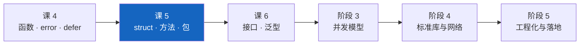
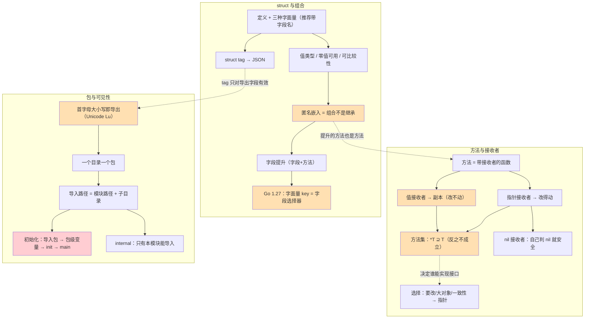

# 课 5：结构体与方法

> 所属阶段：组合与抽象 ｜ 故事章节：没有 class，怎么组织代码 ｜ 上一课：[课 4 · 函数与错误处理](lesson-04-函数与错误处理.md)
> **状态：✅ 已完成** ｜ 版本基线：**Go 1.27.1 darwin/arm64**（核查于 2026-09）
> 📌 本课所有命令与输出**均在本机真实跑通并实测**（macOS / arm64 / go1.27.1），不是纸面预期。

## 📌 知识点导航

| # | 知识点 | 关键点 | 状态 |
|---|--------|--------|------|
| 1 | struct 与组合 | ①定义与三种字面量（推荐带字段名）②匿名嵌入是**组合不是继承**（内层方法看不见外层）③字段提升（字段与方法都能提升；同名遮蔽、歧义要写全路径）④**Go 1.27 新语法**：字面量的 key 可以是任意字段选择器 ⑤struct tag 决定 JSON 长什么样 | ✅ 已完成 |
| 2 | 方法与接收者 | ①方法就是带接收者的函数 ②值接收者拿到副本（改不动原值）③指针接收者才改得动 ④**方法集规则**：`*T` 的方法集包含 `T` 的，反之不成立 ⑤选择惯例：要改就用指针，且同类型保持一致 | ✅ 已完成 |
| 3 | 包与可见性 | ①**首字母大小写即导出 / 不导出**（Unicode 大写字母 Lu，不是"英文字母"）②一个目录一个包；导入路径 = 模块路径 + 子目录 ③`init` 的执行时机（包级变量 → init → main）④`internal` 目录的可见性约束 | ✅ 已完成 |

---

## 第一幕 · 🏛️ 起源与场景引入

### 故事的推进：从"一堆 map"到"一个模型"

课 4 结束时，小谷把下单流程拆成了函数，错误也传得像样了。可他盯着代码越看越别扭 —— **订单还是一堆散落的东西**：

```go
// 现在的小谷：用 map 存订单，全靠字符串 key 对齐
order := map[string]any{
    "id":    "SO-1001",
    "items": []Item{...},
    "total": 29900,
}
```

改个字段名全靠搜索，写错了编译也不报。他决定建个模型。

写了几年 Python，他手比脑子快：

```python
class BaseOrder:                    # 公共字段抽到父类
    def __init__(self, created_by):
        self.created_by = created_by

class Order(BaseOrder):             # 继承，复用父类的字段和方法
    def total(self):
        return sum(i.price * i.qty for i in self.items)
```

翻成 Go 时他连撞三堵墙：

1. **没有 `class`、没有 `extends`** —— 只有 `struct` 和"把一个小 struct 嵌进去"；
2. 嵌进去以后 `o.CreatedBy` 居然能用（**字段提升**），但他很快发现 `o.Describe()` 调的是**外层自己写的那个**，内层的方法并不会"变成"外层的 —— **这不是继承，没有多态**；
3. 给 `Order` 加了个 `func (o Order) AddItem(...)`，调完发现**订单还是空的**。

> 这一课是阶段 2 的中段：**从"数据怎么装"到"数据 + 行为怎么组织"**。
> Go 的答案是三件套 —— **struct（装数据）+ 方法（挂行为）+ 包（划边界）**，中间那层"复用"不用继承，用**组合**。

---

## 第二幕 · ❓ 认知冲突

小谷的三个真实撞墙（**本机实测**）：

**怪事一：嵌入了 `Audit`，但内层的方法"不认"外层 —— 这不是继承**

```console
o.Describe()       = [Order] id=SO-1001 total=2990
o.Audit.Describe() = [Audit] by=小谷 at=2026-09-07
```

他在 Python 里的习惯是：子类重写 `describe()` 后，父类方法里调到的一定是子类的版本（多态）。Go 里**没有这回事** —— 内层方法的接收者始终是 `Audit`，它根本不知道外面还有个 `Order`。

**怪事二：值接收者改了个寂寞**

```console
  调用 BadInc() 后 c.N = 0  ← 没变！值接收者改的是副本
  调用 Inc() 后 c.N = 1  ← 变了
```

`func (c Counter) BadInc() { c.N++ }` 看起来天衣无缝，调完 `c.N` 还是 0。**值接收者拿到的是整个 struct 的副本**（课 4 学的"一切都是值传递"，在这里原封不动地又咬了他一口）。

**怪事三：小写字段 `note` 在 JSON 里凭空消失**

```console
{"order_id":"SO-1001","qty":2,"NoTag":"没写 tag","created_by":"小谷","created_at":"2026-09-07"}
```

他明明写了 `note`、`amount`、`internal`、`secret` 四个字段，JSON 里一个都没有。**Go 用首字母大小写决定导出**，`encoding/json` 只看得见导出的字段 —— 连 `json:"secret"` 这种 tag 都救不回来。

这三个怪事，分别对应本课的三个知识点。**它们共同指向同一件事：Go 组织代码靠"扁平的组合 + 显式的边界"，而不是"继承树 + 隐式的可见性规则"。**

---

## 第三幕 · 层层揭示

### 知识点 1：struct 与组合

#### 一句话定义

`struct` 是**字段的具名集合**（值类型、零值可用）；**匿名嵌入**（只写类型不写字段名）让被嵌入类型的字段与方法被"提升"到外层，这是**组合而不是继承** —— 没有 `is-a` 关系、没有多态；`struct tag` 是挂在字段上的**元数据字符串**，决定 `encoding/json` 等库怎么看待这个字段。

#### 直觉建立：struct 是乐高底板，嵌入是把另一块底板卡上去

- **struct**：一块带固定槽位的乐高底板，槽位有名字、有类型。
- **嵌入**：把另一块底板**卡进**这块底板的凹槽里。从上面看，两块底板的凸起（字段）都露在外面，所以你能直接踩到里面那块的凸起 —— 这就是**提升**。

**这个类比在哪失效**：真实的乐高卡上去以后，两块板**还是两块**（你可以把里面那块抠出来：`o.Audit`）。继承则不是 —— 子类"是"父类的一种。所以：

- ✅ `var a Audit = o.Audit`（把嵌入的那块取出来）
- ❌ `var a Audit = o`（`Order` **不是**一种 `Audit`）

**更关键的第二处失效**：继承有**多态**（父类方法里调虚方法，会分派到子类）；组合**没有**。内层方法的接收者永远是内层类型，外层跟它没关系（怪事一）。

#### 核心原理

**① 定义与三种字面量（实测）**

```go
type Point struct {
    X int
    Y int
}

p1 := Point{X: 1, Y: 2}   // ✅ 推荐：带字段名（将来加字段不会崩）
p2 := Point{3, 4}         // 不带字段名：必须给全，且顺序一致
p3 := Point{Y: 9}         // 只给部分：其余是零值
```

```console
p1={X:1 Y:2}  p2={X:3 Y:4}  p3={X:0 Y:9}
```

> 📌 **只用带字段名的写法**。不带字段名那种，一旦有人在 `Point` 里插一个新字段，所有 `Point{a, b}` 全部编译失败 —— 而且报错点离改动点十万八千里。

**② 零值可用、值语义、可比较性（实测）**

```console
var p0 Point → {X:0 Y:0}  (X=0 Y=0，直接就能用)
var pp *Point → <nil>  (指针零值是 nil，此时 pp.X 会 panic)
a={X:1 Y:2}  b={X:999 Y:2}  (改 b，a 纹丝不动)
Point{1,2} == Point{1,2} → true
Point{1,2} == Point{1,3} → false
```

三条规则：

1. **struct 的零值是"每个字段都是零值"** —— 不需要构造函数就能用（课 2 的零值规则在这里叠加）；
2. **struct 是值类型** —— 赋值、传参都是整体拷贝（课 3 数组的语义，同一个道理）；
3. **字段全部可比较时，struct 才能用 `==`**。含切片/map/函数的 struct 不能比 —— **这是编译错误，不是运行时 panic**：

```console
verify/struct_cmp_err.go:13:14: invalid operation: x == y (struct containing []string cannot be compared)
```

**③ 匿名嵌入 = 组合不是继承（实测）**

```go
type Audit struct {
    CreatedBy string
    CreatedAt string
}

func (a Audit) Describe() string {              // 内层的自己的方法
    return fmt.Sprintf("[Audit] by=%s at=%s", a.CreatedBy, a.CreatedAt)
}

type Order struct {
    ID    string
    Audit                                        // 匿名嵌入：字段名就是类型名
    Total int
}

func (o Order) Describe() string {               // 外层的同名方法
    return fmt.Sprintf("[Order] id=%s total=%d", o.ID, o.Total)
}
```

```console
-- 2. 这是「组合」不是「继承」：没有多态，内层看不见外层 --
o.Describe()       = [Order] id=SO-1001 total=2990
o.Audit.Describe() = [Audit] by=小谷 at=2026-09-07
```

**这就是"不是继承"的硬证据**：`Audit.Describe()` 里的接收者是 `Audit`，它拿不到外层的 `ID` 和 `Total`。Python 里父类方法调到 `self.total()` 会分派到子类，Go 里**根本没这条路径**。

同样地，`Order` 不能当 `Audit` 用：

```console
verify/embed_err.go:28:17: cannot use o1 (variable of struct type Order) as Audit value in variable declaration
verify/embed_err.go:32:18: ambiguous selector amb.Same
```

**④ 字段提升：字段和方法都能"升"上来（实测）**

```console
o.CreatedBy         = 小谷  ← 写全其实是 o.Audit.CreatedBy
o.Audit.CreatedBy   = 小谷  ← 全路径永远可用
o.Who()             = 创建人：小谷  ← 嵌入类型的方法也被提升了
```

三条边界：

- **同名遮蔽**：外层自己有同名字段/方法时，**外层的优先**（提升上来的那个被挡住，但永远可以用 `o.Audit.Tag` 全路径访问）；
- **歧义要写全路径**：两个嵌入类型都有 `Same` 时，`amb.Same` 直接编译不过（`ambiguous selector amb.Same`），必须写 `amb.A.Same`；
- **嵌入指针也能提升**：`*Audit` 嵌进来同样提升，但**零值是 nil**，此时访问提升字段会 panic。

**⑤ ⚠️ Go 1.27 新语法：字面量的 key 可以是任意字段选择器（实测 + 官方核实）**

> ⚠️ **这条推翻了一条流传很久的老规则。** 过去所有教程（包括很多 2025 年以前的书）都说"**提升字段不能写在复合字面量里**"，必须是 `User{Base: Base{ID: 7}}`。
> **Go 1.27 起这条不成立了。**

官方 Go 1.27 Release Notes 原文（Language 段）：

> A key in a struct literal may now be any valid field selector for the struct type, not just a (top-level) field name of the struct.

（核查于 2026-09，来源：[go.dev/doc/go1.27](https://go.dev/doc/go1.27)；提案 [#9859](https://go.dev/issue/9859)，实现者 Robert Griesemer、Cherry Mui）

同时，现行 spec 里"提升字段"的措辞也删掉了旧的限制句，现在是：

> Promoted fields act like ordinary fields of a struct.

（核查于 2026-09，来源：[go.dev/ref/spec · Struct types](https://go.dev/ref/spec#Struct_types)）

**实测**：

```console
① 提升字段直接赋值: {Base:{ID:7 Tag:} Name:Mittens}
   Go 1.26 及之前这里会报：unknown field ID in struct literal
② 外层同名字段优先: Shadow.Tag="outer"  Base.Tag=""（内层的没被赋到）
③ 指针嵌入仍要显式写: 旗舰店 (31.2304, 121.4737)
   不给时 st2.Geo = <nil>（nil，直接用 st2.Lat 会 panic）
```

三条边界（**都是编译错误，本机实测**）：

```console
verify/lit_edge.go:22:13: unknown field Tag in struct literal of type Ambig      ← ①歧义
verify/lit_edge.go:24:24: invalid implicit pointer indirection to reach Lat      ← ②指针嵌入的提升字段
verify/lit_dup.go:9:37: cannot specify promoted field Tag and enclosing embedded field Base   ← ③又给嵌入类型又给提升字段
```

| 情况 | Go 1.27 结果 |
|------|-------------|
| 值类型嵌入的提升字段（如 `Base.ID`） | ✅ 可以直接当 key |
| 外层有同名字段 | 外层优先，内层的保持零值 |
| 两个嵌入有同名字段 | ❌ `unknown field Tag in struct literal of type Ambig` |
| **指针**类型嵌入的提升字段 | ❌ `invalid implicit pointer indirection to reach Lat` —— **仍要显式写 `Geo: &Geo{...}`** |
| 同时写嵌入类型和它的提升字段 | ❌ `cannot specify promoted field Tag and enclosing embedded field Base` |

> ⏳ **置信度：中** —— 「Go 1.26 及之前会报 `unknown field ID in struct literal`」这句来自提案 #9859 与社区资料；**本机只有 go1.27.1，无法实测旧版本**。新行为本身是官方 Release Notes + 本机实测，为高置信度。
>
> 📌 **实践建议**：新写法更短，但**读代码的人看不出这个字段是哪儿来的**。嵌入类型字段多、或想强调"这几个字段属于审计信息"时，仍然写全 `Audit: Audit{...}` 更清楚。

**⑥ struct tag：决定别人怎么"看"你的字段（实测）**

```go
type Order struct {
    ID       string `json:"order_id"`
    Note     string `json:"note,omitempty"`  // 零值时省掉
    Internal string `json:"-"`               // 永远不参与序列化
    NoTag    string                          // 没写 tag → 用 Go 字段名原样输出
    secret   string `json:"secret"`          // 不导出 → 写 tag 也看不见
    名字      string                          // 中文不是大写字母 → 同样不导出
    Audit                                    // 嵌入没写 tag → 字段被摊平到同一层
}
```

```console
-- 1. json.Marshal 结果（err=<nil>）--
{"order_id":"SO-1001","qty":2,"NoTag":"没写 tag","created_by":"小谷","created_at":"2026-09-07"}

-- 3. 用 reflect 读 tag（tag 是元数据，不是注释）--
  字段 ID       导出=true  tag="order_id"
  字段 Note     导出=true  tag="note,omitempty"
  字段 Internal 导出=true  tag="-"
  字段 NoTag    导出=true  tag=""
  字段 secret   导出=false tag="secret"

-- 4. 反序列化的静默陷阱：JSON 里多出来的字段被直接忽略 --
  err=<nil>  ID="SO-9999" Qty=7  (qtYY 拼错了也没报错，静默丢弃)
```

四条要点：

1. **`json:"-"` 是"完全不参与"，`omitempty` 是"零值时省掉"** —— 两者完全不同；
2. **不导出的字段，写什么 tag 都不会出现在 JSON 里**（`secret` 实测）；
3. **嵌入类型的 tag 决定"摊平还是嵌套"**（实测）：

```console
嵌入字段带 tag : {"id":"SO-1","audit":{"created_by":"小谷"}}
嵌入字段无 tag : {"id":"SO-1","created_by":"小谷"}
```

   没写 tag → 字段被摊平到外层；写了 `json:"audit"` → 变成嵌套对象；
4. **反序列化时拼错的 key 会被静默丢弃** —— tag 写错不报错，是最难查的一类 bug。

> 📌 tag 本质是**字符串**，靠 `reflect` 读（`f.Tag.Get("json")`）。编译器不校验它的内容 —— 写错 `jsom` 只会让 JSON 悄悄变样。

**⑦ 顺带一提：字段顺序影响内存占用（实测）**

```console
sizeof(Bad) = 24 字段顺序：bool/int64/bool
sizeof(Good)= 16 字段顺序：bool/bool/int64  ← 同样的字段，省 8 字节
sizeof(Point)= 16
sizeof(空结构体 struct{}{}) = 0
```

同样的三个字段，把两个 `bool` 放一起就省了 1/3。**只有在上百万个实例、或极致的内存敏感场景才值得为它重排字段** —— 日常优先按可读性排。

#### 示例演示

```go
package main

import "fmt"

type Audit struct {
	CreatedBy string
	CreatedAt string
}

func (a Audit) Who() string { return "创建人：" + a.CreatedBy }

// 内层方法：接收者是 Audit，它看不见外层 Order 的任何东西
func (a Audit) Describe() string {
	return fmt.Sprintf("[Audit] by=%s at=%s", a.CreatedBy, a.CreatedAt)
}

type Order struct {
	ID    string
	Audit // 匿名嵌入（组合，不是继承）
	Total int
}

// 外层同名方法会盖住提升上来的那个
func (o Order) Describe() string {
	return fmt.Sprintf("[Order] id=%s total=%d", o.ID, o.Total)
}

func main() {
	o := Order{
		ID:    "SO-1001",
		Audit: Audit{CreatedBy: "小谷", CreatedAt: "2026-09-07"},
		Total: 2990,
	}

	fmt.Println("提升的字段:", o.CreatedBy)
	fmt.Println("提升的方法:", o.Who())
	fmt.Println("全路径    :", o.Audit.CreatedBy)

	fmt.Println("外层方法  :", o.Describe())
	fmt.Println("内层方法  :", o.Audit.Describe())

	// Go 1.27 新语法：提升字段可以直接当字面量的 key
	o2 := Order{ID: "SO-1002", CreatedBy: "小美", Total: 990}
	fmt.Printf("字面量提升字段: %+v\n", o2)
}
```

**输出（本机实测）**：

```console
提升的字段: 小谷
提升的方法: 创建人：小谷
全路径    : 小谷
外层方法  : [Order] id=SO-1001 total=2990
内层方法  : [Audit] by=小谷 at=2026-09-07
字面量提升字段: {ID:SO-1002 Audit:{CreatedBy:小美 CreatedAt:} Total:990}
```

最后一行是 **Go 1.27 才成立的写法**（`CreatedBy` 直接当 key），在 Go 1.26 及之前会编译失败。

#### 常见误区

- ❌ **"匿名嵌入就是继承。"** 不是。**没有 `is-a`、没有多态** —— 内层方法的接收者始终是内层类型（`cannot use o1 ... as Audit value` 实测）。
- ❌ **"嵌入后，内层方法能访问外层的字段。"** 不能（怪事一实测）。想要这个效果，得靠**接口**（课 6）。
- ❌ **"提升字段不能写在复合字面量里。"** **Go 1.27 起可以了**（官方 Release Notes + 实测）。老教程的这条已经过时。
- ❌ **"指针嵌入的提升字段也能直接当 key。"** 不行 —— `invalid implicit pointer indirection to reach Lat`（实测），仍要显式 `Geo: &Geo{...}`。
- ❌ **"struct tag 是注释 / 是编译器看的。"** 它是**普通的字符串**，编译器不管内容，只有 `encoding/json`、`reflect` 这些库去读。写错了不报错，只是结果不对。
- ❌ **"给不导出的字段加 `json:"xxx"` 就能序列化。"** 不行，不导出的字段 `json` 包根本不看（实测）。
- ❌ **"含切片的 struct 可以用 `==` 比较。"** 编译错误 `struct containing []string cannot be compared`（实测）。要比较就用 `reflect.DeepEqual` 或 `slices.Equal` 逐字段比。

#### 一句话记住

> **struct 是值类型、零值可用；匿名嵌入是组合不是继承（有提升、无多态）；Go 1.27 起提升字段可以直接当字面量的 key；struct tag 是给 `encoding/json` 看的元数据 —— 不导出的字段写什么 tag 都不会出现在 JSON 里。**

📚 官方文档
- [go.dev spec · Struct types](https://go.dev/ref/spec#Struct_types)
- [go.dev spec · Composite literals](https://go.dev/ref/spec#Composite_literals)
- [go.dev spec · Comparison operators（可比较性）](https://go.dev/ref/spec#Comparison_operators)
- [go.dev doc · Go 1.27 Release Notes（Struct literal field selectors）](https://go.dev/doc/go1.27)
- [pkg.go.dev · encoding/json（Marshal 的字段规则）](https://pkg.go.dev/encoding/json#Marshal)
- [go.dev blog · JSON and Go](https://go.dev/blog/json-and-go)

---

### 知识点 2：方法与接收者

#### 一句话定义

**方法** = 带**接收者**（receiver）的函数：`func (r T) M()` 把 `M` 挂在类型 `T` 上。**值接收者**拿到的是**副本**（改不动原值），**指针接收者**才能修改原值。**方法集规则**：`*T` 的方法集包含 `T` 的方法集，`T` 的方法集**不包含** `*T` 的 —— 这决定了"谁能实现哪个接口"（课 6）。

#### 直觉建立：方法是给类型"贴上去的技能贴纸"

Python 里方法写在 class 体内，跟数据**长在一起**。Go 里类型是类型、方法是方法，方法是**在包里另外声明、贴到类型上的**：

```go
type Counter struct{ N int }      // 数据
func (c *Counter) Inc() { c.N++ } // 行为：这一行可以在同一个包的任何文件里
```

**这个类比在哪失效**：

- **贴纸不是"内部"的** —— 它不能访问不导出的东西？不对，它能访问（同包内）。真正失效的是：**接收者不是 `this`**。它只是"第一个参数"，名字随你起（官方建议用类型首字母缩写），Go 官方明确**不写 `this` / `self`**。
- **值接收者会连人带贴纸复制一份** —— 你在副本上操作，原件纹丝不动（怪事二）。

#### 核心原理

**① 方法就是带接收者的函数**

```go
func (c Counter) Value() int { return c.N }   // 值接收者：只读
func (c *Counter) Inc()      { c.N++ }        // 指针接收者：要改原值
func (c Counter) BadInc()    { c.N++ }        // 值接收者里改 → 改的是副本（无效！）
```

**② 值接收者拿到的是副本（本课第一大坑，实测）**

```console
  调用 BadInc() 后 c.N = 0  ← 没变！值接收者改的是副本
  调用 Inc() 后 c.N = 1  ← 变了
```

更硬的证据 —— 打印地址：

```console
  main 里的 &b = 0x2658e598080
    值接收者内部 &b = 0x2658e5980c0（64 字节被拷了一份）
```

**两个地址不一样** —— 值接收者确实把整个 struct 复制了一份。课 4 学的"一切都是值传递"，在这里**原封不动地又生效了一次**。

**③ 调用时不用手动取址 / 解引用（实测）**

```console
  值变量 c 调指针方法 Inc()  ✅（自动 &c）
  指针变量 pc 调值方法 Value() = 10  ✅（自动 *pc）
```

编译器会自动补 `(&c).Inc()` 和 `(*pc).Value()`。**但前提是值必须"可寻址"** —— 临时值和 map 元素不行：

```console
verify/method_addr_err.go:13:12: cannot call pointer method Inc on Counter   ← Counter{}.Inc()
verify/method_addr_err.go:17:9:  cannot call pointer method Inc on Counter   ← m["a"].Inc()
```

> 📌 这也是课 3 学过的一个坑的延伸：**map 的元素不可寻址**，所以 `m["a"].Inc()` 编译不过（必须先取出来、改完再放回去）。

**④ 方法集规则（官方 spec 原文 + 实测）**

> - The method set of a defined type `T` consists of all methods declared with receiver type `T`.
> - The method set of a pointer to a defined type `T` (where `T` is neither a pointer nor an interface) is the set of all methods declared with receiver `*T` or `T`.

（核查于 2026-09，来源：[go.dev/ref/spec · Method sets](https://go.dev/ref/spec#Method_sets)）

翻译成人话：

| 类型 | 方法集里有什么 | 直觉 |
|------|--------------|------|
| `T`（值） | **只有**值接收者的方法 | 副本能调的才安全 |
| `*T`（指针） | 值接收者的 **+** 指针接收者的 | 指针能调到全部 |

实测（这是本课最容易踩的坑，直接影响接口能不能实现）：

```console
verify/method_addr_err.go:20:19: cannot use Counter{} (value of struct type Counter) as IncIface value in variable declaration: Counter does not implement IncIface (method Inc has pointer receiver)
```

**`Counter` 不实现 `IncIface`，`*Counter` 才实现。** 因为 `Inc` 是指针接收者，不在 `Counter` 的方法集里。

> ⚠️ **这条规则要到课 6「接口」才会真正痛** —— 现在先记住：**如果你的类型要用指针接收者，就统一用指针接收者**，然后一律传 `&T{}`。

**⑤ nil 接收者也能调方法（实测）**

```go
func (n *Node) Len() int {
    if n == nil { return 0 }          // 自己判 nil，就能安全调
    return 1 + n.Next.Len()
}
```

```console
  (*Node)(nil).Len() = 0  ✅ 没 panic（方法里判了 n == nil）
  两个节点的链表 Len() = 2
```

**指针接收者 + 自己判 nil** 是 Go 里非常常见的写法（标准库也这么干）。**值接收者不会遇到这个问题**，但值接收者改不了东西。

**⑥ 怎么选接收者（官方建议 + 临界点）**

| 用**指针**接收者 | 用**值**接收者 |
|-----------------|---------------|
| 方法要**修改**接收者 | 方法只读 |
| struct **较大**（拷贝成本高） | struct 很小（几个字段的"值对象"） |
| 类型含**不可拷贝**的字段（如 `sync.Mutex`） | 类型是 map / slice / 小 struct 这类天然"引用语义"的 |
| **同类型里只要有一个方法用了指针，其余就都用指针** | 同上（一致性优先） |

官方 [Go Code Review Comments](https://go.dev/wiki/CodeReviewComments#receiver-type) 的原话意思是：**不确定就用指针；但更重要的是"一个类型的方法接收者要保持一致"，混用会让使用者困惑**。

> 📌 **临界点**：拷贝成本 = struct 的大小 × 调用频率。几十字节的小 struct 用值接收者完全无所谓；**上百字节且在高频率路径上**（比如每请求调用上万次）就该用指针。别为了"省一次拷贝"把只读方法全改成指针 —— 可读性损失更大。

#### 示例演示

```go
package main

import "fmt"

type Counter struct{ N int }

func (c Counter) Value() int { return c.N } // 值接收者：只读
func (c *Counter) Inc()      { c.N++ }      // 指针接收者：改原值
func (c Counter) BadInc()    { c.N++ }      // 值接收者里改 → 改的是副本

func main() {
	c := Counter{}
	c.BadInc()
	fmt.Println("值接收者 BadInc 后 N =", c.N) // 0

	c.Inc()
	fmt.Println("指针接收者 Inc   后 N =", c.N) // 1

	pc := &Counter{N: 10}
	fmt.Println("指针变量调值方法  :", pc.Value()) // 自动解引用
	fmt.Println("值变量调指针方法  :", func() int { c.Inc(); return c.N }())
}
```

**输出（本机实测）**：

```console
值接收者 BadInc 后 N = 0
指针接收者 Inc   后 N = 1
指针变量调值方法  : 10
值变量调指针方法  : 2
```

> 最后一行是 2 不是 1 —— 因为前面已经 `Inc()` 过一次了。

#### 常见误区

- ❌ **"方法里改接收者，外面就能看到。"** 只有**指针接收者**才行；值接收者改的是副本（实测地址都不同）。
- ❌ **"`Counter{}.Inc()` 应该能编译。"** 临时值不可寻址 → `cannot call pointer method Inc on Counter`（实测）。
- ❌ **"`m["a"].Inc()` 应该能编译。"** map 元素不可寻址 → 同样的错（实测，课 3 的坑在这里复发）。
- ❌ **"值类型也自动拥有指针接收者的方法。"** 不。**方法集里没有** —— `Counter does not implement IncIface (method Inc has pointer receiver)`（实测）。
- ❌ **"nil 指针上调方法一定 panic。"** 只要方法里**自己判了 nil** 就不会（实测 `Len()` 返回 0）。
- ❌ **"接收者要写 `this` / `self`。"** Go 官方明确不这么写，用类型首字母缩写（`c`、`o`、`srv`）。
- ❌ **"一个类型里可以随便混用值和指针接收者。"** 能编译，但**官方明确反对** —— 混用会让方法集变得难以预测，接口实现也会踩坑。

#### 一句话记住

> **方法是带接收者的函数：值接收者拿到副本（改不动），指针接收者才改得动；`*T` 的方法集包含 `T` 的、反之不成立（决定谁能实现接口）；要改就用指针，且同类型保持一致。**

📚 官方文档
- [go.dev spec · Method declarations](https://go.dev/ref/spec#Method_declarations)
- [go.dev spec · Method sets](https://go.dev/ref/spec#Method_sets)
- [go.dev spec · Calls（可寻址与自动取址）](https://go.dev/ref/spec#Calls)
- [go.dev wiki · CodeReviewComments · Receiver Type](https://go.dev/wiki/CodeReviewComments#receiver-type)
- [Effective Go · Methods（指针 vs 值）](https://go.dev/doc/effective_go#methods)
- [go.dev FAQ · Should I define methods on values or pointers?](https://go.dev/doc/faq#methods_on_values_or_pointers)

---

### 知识点 3：包与可见性

#### 一句话定义

**包（package）** 是 Go 的基本组织单元：**一个目录一个包**，导入路径 = **模块路径 + 子目录**。可见性没有 `public` / `private` 关键字 —— **首字母是不是 Unicode 大写字母（Lu）决定导出与否**。包初始化顺序是：**被导入的包先初始化 → 包级变量 → `init()` → `main()`**；放在 `internal/` 目录下的包，**只有它所在的模块内部能导入**。

#### 直觉建立：包是房间，大小写是门牌

- **包 = 一个房间**，同房间（同目录）的代码共享一切；
- **首字母大写 = 门口挂了牌子**，别的房间（别的包）能看见能进；
- **首字母小写 = 没挂牌**，只有本房间的人知道。

**这个类比在哪失效**：

1. **"大写"是 Unicode 意义上的，不是英文字母意义上的** —— 实测：希腊字母 `Ωmega`（U+03A9，属 Lu）**是导出的**；而中文字段 `名字` **不是导出的**（汉字没有大小写，都不属于 Lu）。所以中文标识符天然全部不导出。
2. **房间里的人也不能"偷偷开后门"** —— 跨包没有任何 `friend` / `protected` 之类的机制，只有"挂不挂牌"这一刀。

#### 核心原理

**① 首字母大小写即导出（官方 spec 原文 + 实测）**

> An identifier may be *exported* to permit access to it from another package. An identifier is exported if both:
> 1. the first character of the identifier's name is a Unicode uppercase letter (Unicode character category Lu); and
> 2. the identifier is declared in the package block or it is a field name or method name.

（核查于 2026-09，来源：[go.dev/ref/spec · Exported identifiers](https://go.dev/ref/spec#Exported_identifiers)）

实测（`reflect` 的 `IsExported()`）：

```console
字段 Name   IsExported=true
字段 名字     IsExported=false
字段 Ωmega  IsExported=true
```

跨包访问不导出标识符，编译器直接拦 —— **而且会贴心地提示你有哪个导出的同名方法**：

```console
verify/pkg_err.go:11:16: o.note undefined (type *order.Order has no field or method note, but does have method Note)
verify/pkg_err.go:12:20: undefined: order.pkgVersion
verify/pkg_err.go:13:4: o.setNote undefined (type *order.Order has no field or method setNote, but does have method SetNote)
```

> 📌 **所以 Go 的封装手法是：字段小写 + 提供大写的读写方法**（`note` + `Note()` / `SetNote()`）。这就是你在标准库里到处看到的模式。

**② 一个目录一个包（官方 spec 原文）**

> A set of files sharing the same PackageName form the implementation of a package. An implementation may require that all source files for a package inhabit the same directory.

（核查于 2026-09，来源：[go.dev/ref/spec · Source file organization](https://go.dev/ref/spec#Source_file_organization)）

三条实践规则：

1. **一个目录下只能有一个包名**（`_test` 后缀的测试包除外）；
2. **包名惯例与目录名一致** —— 不一致也能编译，但导入时得写别名，没人这么干；
3. **导入路径 = 模块路径 + 子目录**，跟包名是两回事：

```go
import "example.com/l05/order"           // 路径是 .../order，包名是 order
import "example.com/l05/internal/vault"  // 路径是 .../internal/vault，包名是 vault
```

**③ `init()` 的执行时机（官方 spec 原文 + 实测）**

> The entire package is initialized by assigning initial values to all its package-level variables followed by calling all `init` functions in the order they appear in the source, possibly in multiple files, as presented to the compiler.

（核查于 2026-09，来源：[go.dev/ref/spec · Package initialization](https://go.dev/ref/spec#Package_initialization)）

实测（两个文件、两个 `init`、一个包级变量）：

```console
  [包级变量] order.pkgVersion 初始化
  [init] order/a_order.go
  [init] order/b_init.go
  [包级变量] main.mainVar 初始化
  [init] main/main.go
```

顺序一目了然：**被 import 的 `order` 包整体先初始化（变量 → 它的 init）→ 再轮到 `main` 包（变量 → init）→ 最后 `main()`**。

三条要点：

1. **`init` 不能被引用**（spec 原文：*"init functions cannot be referred to from anywhere in a program"*）—— 你没法调它，它自己跑；
2. **一个包、甚至一个文件里可以有多个 `init`**（spec 原文允许）；
3. **多个文件之间的顺序**：spec 只说"按呈现给编译器的顺序"，并**鼓励**构建系统按文件名字典序呈现 ——

> To ensure reproducible initialization behavior, build systems are **encouraged** to present multiple files belonging to the same package in lexical file name order to a compiler.

**这是"鼓励"不是"保证"**（实测：`go` 命令行确实按 `a_order.go` → `b_init.go` 走）。**所以不要写依赖 init 先后顺序的代码** —— 真有依赖就显式调用一个初始化函数。

**④ `internal` 目录的可见性约束（实测）**

放在 `internal/` 下（含任意层级的子目录）的包，**只能被 `internal` 的父目录及其子目录内的代码导入**。

- 本模块内用：**正常**（实测 `vault.Secret()="db-password-from-vault"`）；
- 换个模块来 import：**直接报错**（实测）：

```console
	main.go:7:2: use of internal package example.com/l05/internal/vault not allowed
```

这是 Go 里唯一内置的"防外部依赖"机制 —— **不想让人外部引用的实现细节，就往 `internal/` 里塞**。

#### 示例演示

目录结构（**一个目录一个包**）：

```text
go-l05/                          # 模块 example.com/l05
├── go.mod
├── main.go                      # package main
├── order/
│   ├── a_order.go               # package order（Order / Item / Audit / ErrEmpty）
│   └── b_init.go                # package order（另一个 init + 包级变量）
└── internal/
    └── vault/
        └── vault.go             # package vault（只有本模块能用）
```

`order/a_order.go` 的核心（**组合 + 提升 + tag + 值/指针接收者 + 哨兵错误**，一次全用上）：

```go
type Audit struct {
	CreatedBy string    `json:"created_by"`
	CreatedAt time.Time `json:"created_at"`
}
func (a Audit) Who() string { return a.CreatedBy }   // 会被提升

type Order struct {
	ID     string `json:"id"`
	Items  []Item `json:"items"`
	Audit                          // 匿名嵌入 → 组合（不是继承）
	Status string `json:"status,omitempty"`
	note   string                  // 不导出：JSON 看不到、外部包摸不到
}

func New(id, by string) *Order { ... }        // 构造函数惯例：返回指针
func (o Order) ItemCount() int { ... }        // 只读 → 值接收者
func (o *Order) AddItem(it Item) { ... }      // 要改 → 指针接收者
func (o *Order) Submit() error { ... }        // 要改 + 可能失败 → 指针 + error
func (o Order) Note() string { return o.note }        // 导出方法读不导出字段
```

`main.go` 运行（**本机实测**，时间戳每次不同）：

```console
  [包级变量] order.pkgVersion 初始化
  [init] order/a_order.go
  [init] order/b_init.go
  [包级变量] main.mainVar 初始化
  [init] main/main.go

-- 2. 组合出来的 Order（Audit 的字段被提升）--
  ID=SO-1001  创建人=小谷  ← CreatedBy 是嵌入字段提升上来的
  件数=2  总额=49700 分  备注="客户要求分两个包裹发"  ← 通过导出方法读不导出字段
  vault.Secret()="db-password-from-vault"  ← internal 包在本模块内可以正常用

-- 3. 跨包用哨兵错误（课 4 的知识在这里接上了）--
  空订单 Submit() 失败: order: 订单为空
  errors.Is(err, order.ErrEmpty) = true
  有商品的订单 Submit() 成功，Status="submitted"

-- 4. struct tag 决定 JSON 长什么样 --
{
  "id": "SO-1001",
  "items": [
    {"sku": "A-01", "name": "键盘", "qty": 1, "price_cent": 29900},
    {"sku": "B-07", "name": "鼠标", "qty": 2, "price_cent": 9900}
  ],
  "created_by": "小谷",
  "created_at": "2026-09-07T22:30:09.043632+08:00",
  "status": "submitted"
}
```

注意 JSON 里**没有 `note`**（不导出），而 `created_by` / `created_at` 被**摊平到了顶层**（嵌入类型没写 tag）。

#### 常见误区

- ❌ **"小写 = private，只有本类型能用。"** 不对 —— 是**只有本包能用**，同包内别的类型照样访问。
- ❌ **"中文标识符也算大写。"** 不算。`名字` 实测 `IsExported=false`；而希腊字母 `Ωmega`（U+03A9，Lu）是 `true`。规则是 **Unicode 大写字母 category Lu**。
- ❌ **"依赖 `init` 的执行顺序没问题。"** spec 只"鼓励"按文件名字典序，**不保证**。真有依赖就显式调用。
- ❌ **"`init` 可以手动调用。"** 不行 —— spec 原文说它"cannot be referred to from anywhere in a program"。
- ❌ **"`internal` 只是命名约定。"** 不，是**编译器强制**的（实测 `use of internal package ... not allowed`）。
- ❌ **"包名必须等于目录名。"** 惯例如此，语法上不强制；但**导入路径**才是别人引用你时写的东西。
- ❌ **"为了省事，把什么都导出。"** 导出的标识符是你的**公开 API** —— 改它就会破坏调用方。默认小写，需要了再大写。

#### 一句话记住

> **首字母大小写（Unicode 大写字母 Lu）决定导出；一个目录一个包，导入路径 = 模块路径 + 子目录；初始化顺序是被导入包 → 包级变量 → init → main；`internal/` 下的包只能被本模块导入（编译器强制）。**

📚 官方文档
- [go.dev spec · Exported identifiers](https://go.dev/ref/spec#Exported_identifiers)
- [go.dev spec · Source file organization（一个目录一个包）](https://go.dev/ref/spec#Source_file_organization)
- [go.dev spec · Package initialization（init 时机）](https://go.dev/ref/spec#Package_initialization)
- [go.dev doc · go command · Internal packages](https://go.dev/doc/go1.4#internalpackages)
- [go.dev blog · Organizing Go code（包的设计）](https://go.dev/blog/organizing-go-code)
- [Go Modules Reference · Module paths](https://go.dev/ref/mod#module-path)

---

## 第四幕 · 🔬 实操验证

> 这一幕每一步都在本机真实跑过（macOS / arm64 / go1.27.1，2026-09-07）。照着敲得到一样的输出（时间戳除外）。
> 工作目录：`/tmp/go-l05/`，模块：`example.com/l05`，探针脚本放在 `verify/` 下。

### 步骤 0：环境与工作区

```console
$ /usr/local/bin/go version
go version go1.27.1 darwin/arm64

$ mkdir -p /tmp/go-l05/{order,internal/vault,verify} && cd /tmp/go-l05
$ /usr/local/bin/go mod init example.com/l05
go: creating new go.mod: module example.com/l05
```

### 步骤 1：struct 基础（知识点 1）

```console
$ /usr/local/bin/go run verify/struct_basic.go
===== 知识点 1：struct 与组合 =====

-- 1. 三种字面量 --
p1={X:1 Y:2}  p2={X:3 Y:4}  p3={X:0 Y:9}

-- 2. 零值可用（不需要构造函数）--
var p0 Point → {X:0 Y:0}  (X=0 Y=0，直接就能用)
var pp *Point → <nil>  (指针零值是 nil，此时 pp.X 会 panic)

-- 3. struct 是值类型：赋值即拷贝 --
a={X:1 Y:2}  b={X:999 Y:2}  (改 b，a 纹丝不动)

-- 4. 可比较性（字段全部可比时才能 ==）--
Point{1,2} == Point{1,2} → true
Point{1,2} == Point{1,3} → false

-- 5. 内存布局：字段顺序会改变大小 --
sizeof(Bad) = 24 字段顺序：bool/int64/bool
sizeof(Good)= 16 字段顺序：bool/bool/int64  ← 同样的字段，省 8 字节
sizeof(Point)= 16
sizeof(空结构体 struct{}{}) = 0
```

含切片的 struct 不能比较（**编译错误**）：

```console
$ /usr/local/bin/go run verify/struct_cmp_err.go
verify/struct_cmp_err.go:13:14: invalid operation: x == y (struct containing []string cannot be compared)
```

### 步骤 2：嵌入、提升，以及"这不是继承"（知识点 1）

```console
$ /usr/local/bin/go run verify/struct_embed.go
===== 匿名嵌入（组合）与字段提升 =====

-- 1. 提升：外层能直接访问嵌入字段的字段与方法 --
o.CreatedBy         = 小谷  ← 写全其实是 o.Audit.CreatedBy
o.Audit.CreatedBy   = 小谷  ← 全路径永远可用
o.Who()             = 创建人：小谷  ← 嵌入类型的方法也被提升了

-- 2. 这是「组合」不是「继承」：没有多态，内层看不见外层 --
o.Describe()       = [Order] id=SO-1001 total=2990
o.Audit.Describe() = [Audit] by=小谷 at=2026-09-07
↑ 内层方法不会「变成」外层的：它的接收者始终是 Audit，
  所以它拿不到外层的 ID 和 Total —— 这正是「不是继承」的硬证据。

-- 3. Order 不是一种 Audit（没有 is-a）--
  var a Audit = o.Audit  → {CreatedBy:小谷 CreatedAt:2026-09-07}  ✅ 可以
  var a2 Audit = o       → ❌ 编译错（见单独验证）

-- 4. 嵌入指针同样提升 --
t.CreatedBy = 小谷 (指针嵌入，零值是 nil，直接用会 panic)

-- 5. 两个嵌入有同名字段 → 必须写全路径，否则歧义 --
amb.A.Same = 来自 A  amb.B.Same = 来自 B
```

**回扣第二幕怪事一**：`o.Describe()` 与 `o.Audit.Describe()` 两个结果完全不同 —— 这就是"没有多态"的现场。

对应的三个编译错误：

```console
$ /usr/local/bin/go run verify/embed_err.go
verify/embed_err.go:28:17: cannot use o1 (variable of struct type Order) as Audit value in variable declaration
verify/embed_err.go:32:18: ambiguous selector amb.Same
```

### 步骤 3：Go 1.27 新语法 —— 字面量的 key 可以是字段选择器（知识点 1）

```console
$ /usr/local/bin/go run verify/literal_field.go
===== Go 1.27 新语法：字面量的 key 可以是任意字段选择器 =====
① 提升字段直接赋值: {Base:{ID:7 Tag:} Name:Mittens}
   Go 1.26 及之前这里会报：unknown field ID in struct literal
② 外层同名字段优先: Shadow.Tag="outer"  Base.Tag=""（内层的没被赋到）
③ 指针嵌入仍要显式写: 旗舰店 (31.2304, 121.4737)
   不给时 st2.Geo = <nil>（nil，直接用 st2.Lat 会 panic）

④ 指针嵌入的提升字段**不能**直接当 key（见单独验证）：
   Store{Name: "x", Lat: 31.2} → invalid implicit pointer indirection to reach Lat
```

三条禁止（**编译错误，逐字实测**）：

```console
$ /usr/local/bin/go run verify/lit_edge.go
verify/lit_edge.go:22:13: unknown field Tag in struct literal of type Ambig      ← 歧义
verify/lit_edge.go:24:24: invalid implicit pointer indirection to reach Lat      ← 指针嵌入

$ /usr/local/bin/go run verify/lit_dup.go
verify/lit_dup.go:9:37: cannot specify promoted field Tag and enclosing embedded field Base
```

> ⚠️ 网上有文章说"Go 1.27 里指针嵌入也能自动 `new`"、以及"歧义时报错是 `ambiguous field Tag`" —— **这两条在本机 go1.27.1 上都不成立**（前者编译不过，后者实际报 `unknown field Tag in struct literal of type Ambig`）。**以实测为准。**

### 步骤 4：struct tag 与 JSON（知识点 1）

```console
$ /usr/local/bin/go run verify/struct_tag.go
===== struct tag 与 JSON =====

-- 1. json.Marshal 结果（err=<nil>）--
{"order_id":"SO-1001","qty":2,"NoTag":"没写 tag","created_by":"小谷","created_at":"2026-09-07"}

-- 2. 格式化后 --
{
  "order_id": "SO-1001",
  "qty": 2,
  "NoTag": "没写 tag",
  "created_by": "小谷",
  "created_at": "2026-09-07"
}

-- 3. 用 reflect 读 tag（tag 是元数据，不是注释）--
  字段 ID       导出=true  tag="order_id"
  字段 Note     导出=true  tag="note,omitempty"
  字段 Internal 导出=true  tag="-"
  字段 NoTag    导出=true  tag=""
  字段 secret   导出=false tag="secret"

-- 4. 反序列化的静默陷阱：JSON 里多出来的字段被直接忽略 --
  err=<nil>  ID="SO-9999" Qty=7  (qtYY 拼错了也没报错，静默丢弃)
```

**回扣第二幕怪事三**：`note`（omitempty + 空值）、`amount`（0）、`internal`（`-`）、`secret`（不导出）、`名字`（不导出）全部消失，只剩 5 个 key。

顺便验证"首字母大写"是 **Unicode Lu**，不是"英文字母"：

```console
$ /usr/local/bin/go run verify/extra.go
字段 Name   IsExported=true
字段 名字     IsExported=false
字段 Ωmega  IsExported=true
```

### 步骤 5：方法与接收者（知识点 2）

```console
$ /usr/local/bin/go run verify/method_recv.go
===== 知识点 2：方法与接收者 =====

-- 1. 值接收者拿到的是副本 --
  调用 BadInc() 后 c.N = 0  ← 没变！值接收者改的是副本

-- 2. 指针接收者才改得动原值 --
  调用 Inc() 后 c.N = 1  ← 变了

-- 3. 调用时不用手动取址/解引用，编译器帮你做 --
  值变量 c 调指针方法 Inc()  ✅（自动 &c）
  指针变量 pc 调值方法 Value() = 10  ✅（自动 *pc）
  （前提：值必须「可寻址」；Counter{}.Inc() 这种临时值不行，见错误验证）

-- 4. 值接收者也能实现接口（fmt.Stringer）--
  fmt 打印 Money: 29.90 元  ← 因为 Money 有 String() 方法（课 6 讲接口）

-- 5. nil 接收者：方法里自己判 nil 就能安全调 --
  (*Node)(nil).Len() = 0  ✅ 没 panic（方法里判了 n == nil）
  两个节点的链表 Len() = 2
```

值接收者拷贝的**硬证据**（地址不同）：

```console
$ /usr/local/bin/go run verify/extra.go
sizeof(Big) = 64 字节
  main 里的 &b = 0x2658e598080
    值接收者内部 &b = 0x2658e5980c0（64 字节被拷了一份）
```

方法集与可寻址性（**三个编译错误，逐字实测**）：

```console
$ /usr/local/bin/go run verify/method_addr_err.go
verify/method_addr_err.go:13:12: cannot call pointer method Inc on Counter              ← Counter{}.Inc()
verify/method_addr_err.go:17:9: cannot call pointer method Inc on Counter               ← m["a"].Inc()
verify/method_addr_err.go:20:19: cannot use Counter{} (value of struct type Counter) as IncIface value in variable declaration: Counter does not implement IncIface (method Inc has pointer receiver)
```

### 步骤 6：包与可见性（知识点 3）

先建包（完整内容见第三幕知识点 3 的示例演示）：

```console
$ cd /tmp/go-l05
$ /usr/local/bin/go run main.go
  [包级变量] order.pkgVersion 初始化
  [init] order/a_order.go
  [init] order/b_init.go
  [包级变量] main.mainVar 初始化
  [init] main/main.go

===== 初始化顺序（就是上面那几行）=====
  被导入的包先初始化 → 本包级变量 → 本包 init → main
  order 包内两个 init 按文件名字典序：a_order.go → b_init.go

===== 知识点 3：包与可见性 =====

-- 1. 导入路径 = 模块路径 + 子目录 --
  import "example.com/l05/order"          ← 目录 order/，包名也是 order
  import "example.com/l05/internal/vault" ← internal 只在模块内可用

-- 2. 组合出来的 Order（Audit 的字段被提升）--
  ID=SO-1001  创建人=小谷  ← CreatedBy 是嵌入字段提升上来的
  件数=2  总额=49700 分  备注="客户要求分两个包裹发"  ← 通过导出方法读不导出字段
  vault.Secret()="db-password-from-vault"  ← internal 包在本模块内可以正常用

-- 3. 跨包用哨兵错误（课 4 的知识在这里接上了）--
  空订单 Submit() 失败: order: 订单为空
  errors.Is(err, order.ErrEmpty) = true
  有商品的订单 Submit() 成功，Status="submitted"

-- 4. struct tag 决定 JSON 长什么样 --
{
  "id": "SO-1001",
  "items": [
    {
      "sku": "A-01",
      "name": "键盘",
      "qty": 1,
      "price_cent": 29900
    },
    {
      "sku": "B-07",
      "name": "鼠标",
      "qty": 2,
      "price_cent": 9900
    }
  ],
  "created_by": "小谷",
  "created_at": "2026-09-07T22:30:09.043632+08:00",
  "status": "submitted"
}
```

跨包摸不导出标识符（**编译错误，编译器还会提示你有哪个导出的**）：

```console
$ /usr/local/bin/go run verify/pkg_err.go
verify/pkg_err.go:11:16: o.note undefined (type *order.Order has no field or method note, but does have method Note)
verify/pkg_err.go:12:20: undefined: order.pkgVersion
verify/pkg_err.go:13:4: o.setNote undefined (type *order.Order has no field or method setNote, but does have method SetNote)
```

`internal` 换到别的模块就进不去了：

```console
$ mkdir -p /tmp/l05-outside && cd /tmp/l05-outside
$ cat go.mod
module example.com/outside
require example.com/l05 v0.0.0
replace example.com/l05 => /tmp/go-l05

$ /usr/local/bin/go run .
package example.com/outside
	main.go:7:2: use of internal package example.com/l05/internal/vault not allowed
```

---

## 第五幕 · 体系收束

### 三个怪事，三个答案

| 怪事 | 答案 | 对应知识点 |
|------|------|-----------|
| 嵌入了 `Audit`，内层方法却"不认"外层 | 匿名嵌入是**组合不是继承**：有字段提升，但**没有多态** —— 内层方法的接收者始终是 `Audit`，也拿不到外层的 `ID`/`Total` | 知识点 1 |
| 值接收者改了个寂寞 | 值接收者拿到的是**整个 struct 的副本**（实测地址不同）；要改原值必须用**指针接收者** | 知识点 2 |
| 小写字段 `note` 在 JSON 里消失 | 首字母大小写决定**导出**（Unicode Lu）；`encoding/json` 只处理导出字段，**写 tag 也救不回来** | 知识点 3 |

### 小谷现在站在哪

他没能用上 `class Order(BaseOrder)`，但得到了一个更扁的东西：

- **组合替代继承** —— `Order` 里嵌了一个 `Audit`，字段和方法都提升上来可用，但两者始终是两个类型，清清楚楚。
- **方法挂到类型上** —— 只读的用值接收者（`ItemCount` / `TotalCent`），要改的用指针接收者（`AddItem` / `Submit`），同一个类型里保持一致。
- **包划出边界** —— `note` 小写锁在 `order` 包里，外面只能通过 `Note()` / `SetNote()` 访问；`internal/vault` 更是整个模块外的代码都碰不到。

他的订单终于从一个 `map[string]any` 变成了一个有结构、有行为、有边界的模型。

**但他还缺最后一环**：`Order` 现在能算钱、能提交，可"能算钱的东西"这个抽象怎么表达？为什么 `fmt.Println(m)` 会自动调用 `String()`（步骤 5 里悄悄用到了）？为什么 `Order` 不用写 `implements` 就能当某个接口用？—— **课 6「接口与泛型」** 揭晓。

### 本课在全局的位置



- **已经会的**：用 struct 建模、用匿名嵌入做组合、用值/指针接收者挂方法、用大小写与 `internal` 划可见性边界。
- **还不会的**：怎么表达"一组行为的抽象"（**接口**）、为什么不需要写 `implements`、什么时候该上**泛型** —— **课 6 全揽**。
- **埋下的伏笔**：
  - 步骤 5 里 `fmt` 会自动调用 `Money.String()` —— **课 6「接口：隐式实现」**解释为什么。
  - 方法集规则（`T` 不含 `*T` 的方法）本课只说了结论 —— **课 6** 会看到它如何决定"谁能实现接口"，以及 `nil` 接口值的经典陷阱。
  - `Order` 现在只能装 `Item` —— 想要"能装任何东西的容器"，**课 6 的泛型**给出答案（以及它的适用边界）。
  - 本课的组合手法，会在 **课 11 的 `http.Handler`** 与 **课 12 的 `sql.DB`** 里反复出现（标准库大量用嵌入）。

---

## 🐞 常见误区（本课合订）

| # | 误区 | 真相 |
|---|------|------|
| 1 | 匿名嵌入就是继承 | **组合**：有提升、无多态；`Order` 不是一种 `Audit`（编译错实测） |
| 2 | 嵌入后内层方法能访问外层字段 | 不能 —— 接收者始终是内层类型 |
| 3 | 提升字段不能写在复合字面量里 | **Go 1.27 起可以**（官方 Release Notes + 实测）；老教程这条已过时 |
| 4 | 指针嵌入的提升字段也能直接当 key | 不行 —— `invalid implicit pointer indirection to reach Lat`（实测） |
| 5 | struct tag 是注释 / 编译器会校验 | 是**字符串**，靠 `reflect` 读；写错不报错，只是 JSON 悄悄变样 |
| 6 | 给不导出字段加 `json:"x"` 就能序列化 | 不行，`json` 包只处理导出字段（实测 `secret` 消失） |
| 7 | 含切片的 struct 能用 `==` 比较 | 编译错 `struct containing []string cannot be compared` |
| 8 | 方法里改接收者外面就可见 | 只有**指针接收者**；值接收者拿到副本（实测地址不同） |
| 9 | `Counter{}.Inc()` / `m["a"].Inc()` 能编译 | 不可寻址 → `cannot call pointer method Inc on Counter` |
| 10 | 值类型自动拥有指针接收者的方法 | **方法集里没有** → `Counter does not implement IncIface` |
| 11 | nil 指针上调方法必 panic | 方法里自己判 nil 就不会（实测 `Len()` 返回 0） |
| 12 | 接收者写 `this` / `self` | Go 官方明确不这么写，用类型首字母缩写 |
| 13 | 一个类型里可随意混用值/指针接收者 | 能编译但**官方反对**；会让方法集不可预测 |
| 14 | 小写 = private（只有本类型能用） | 是**只有本包能用**，同包内别的类型照样访问 |
| 15 | 中文标识符首字母算大写 | 不算。`名字` 实测 `IsExported=false`；`Ωmega`（U+03A9, Lu）是 `true` |
| 16 | 可以依赖 `init` 的先后顺序 | spec 只"鼓励"按文件名字典序，**不保证**；有依赖就显式调用 |
| 17 | `internal` 只是命名约定 | 是**编译器强制**（实测 `use of internal package ... not allowed`） |
| 18 | 包名必须等于目录名 | 惯例如此，语法不强制；导入路径才是别人引用时写的 |

---

## 🗺️ 一图总结



> 橙色 = 高频踩坑点；红色 = 会引发难以排查的行为差异（初始化顺序不保证）。

---

## 📋 速查卡

| 语法 / API | 一句话 | 坑 |
|-----------|--------|-----|
| `type T struct{ ... }` | 定义结构体 | 值类型、零值可用 |
| `T{Field: v}` | 字面量（**推荐**） | 不带字段名那种，加字段就全崩 |
| `T{}` / `var t T` | 零值 | 指针零值是 nil，解引用会 panic |
| `t.Field` / `p.Field` | 访问字段 | 指针也能直接用 `.`（自动解引用） |
| `t == u` | 比较 | 含 slice/map/func 的 struct **不能比**（编译错） |
| `struct{}{}` | 空结构体 | `sizeof` = 0，常用作 `map[T]struct{}` 的 set |
| `type T struct{ Base }` | 匿名嵌入（组合） | 字段名就是类型名 `Base` |
| `t.BaseField` | 提升字段 | 写全 `t.Base.BaseField` 永远可以 |
| `t.BaseMethod()` | 提升方法 | 接收者仍是 `Base`，**不是外层** |
| `T{PromotedField: v}` | **Go 1.27+** 提升字段当 key | 指针嵌入不行；歧义/重复都编译错 |
| `` `json:"name"` `` | 改 JSON 字段名 | tag 是字符串，写错不报错 |
| `` `json:"name,omitempty"` `` | 零值时省掉 | 0 / "" / nil / false 都算零值 |
| `` `json:"-"` `` | 完全不参与序列化 | 和 `omitempty` 是两回事 |
| `` 嵌入类型没写 tag `` | 字段被**摊平**到同一层 | 想嵌套就写 `json:"audit"` |
| 小写字段 | 不导出 | `json` 完全看不见，写 tag 也没用 |
| `reflect.TypeOf(t).FieldByName(f)` | 读 tag / 判断是否导出 | `f.IsExported()` 按 Unicode Lu 判 |
| `func (t T) M()` | 值接收者方法 | 拿到**副本**，改不动原值 |
| `func (t *T) M()` | 指针接收者方法 | 才改得动；`T` 的方法集里**没有**它 |
| `t.M()` | 调用 | 编译器自动取址/解引用（值须**可寻址**） |
| `Counter{}.M()` | 临时值 | ❌ `cannot call pointer method M on Counter` |
| `m["k"].M()` | map 元素 | ❌ 同上（元素不可寻址） |
| `nil 接收者` | 允许调方法 | 方法里**必须自己判 nil** |
| `var _ I = T{}` | 编译期检查接口实现 | 指针接收者时只能用 `&T{}` |
| 首字母大写 | 导出 | 判据是 **Unicode 大写字母 Lu**，不是英文字母 |
| 首字母小写 | 不导出（仅本包可见） | 配套手法：小写字段 + 大写读写方法 |
| `package x` | 声明包名 | 一个目录一个包 |
| `import "模块路径/子目录"` | 导入 | 路径 ≠ 包名（惯例同名） |
| `func init()` | 包初始化 | 不能被调用；**顺序不保证**，别依赖 |
| `internal/...` | 内部包 | 只有本模块能导入（编译器强制） |

---

## 📝 课后小测

<details>
<summary><b>第 1 题</b>：下面代码输出什么？为什么？

```go
type Counter struct{ N int }

func (c Counter) Inc()  { c.N++ }
func (c *Counter) Inc2() { c.N++ }

func main() {
    c := Counter{}
    c.Inc()
    c.Inc2()
    fmt.Println(c.N)
}
```</summary>

输出：

```console
1
```

**只有 `Inc2()` 生效**：

- `Inc()` 是**值接收者** —— 拿到的是 `c` 的副本，`c.N++` 改的是副本，调用结束副本就扔了；
- `Inc2()` 是**指针接收者** —— 编译器自动取址（`(&c).Inc2()`），改的是 `c` 本身。

**规则**：要修改接收者，就必须用指针接收者。
</details>

<details>
<summary><b>第 2 题</b>：`Order` 里嵌入了 `Audit`，`Audit` 有个 `Describe()` 方法。下面这段会输出什么？这说明了什么？

```go
o := Order{ID: "SO-1", Audit: Audit{CreatedBy: "小谷"}}
fmt.Println(o.Describe())        // Order 自己也定义了 Describe()
fmt.Println(o.Audit.Describe())
```</summary>

输出（本机实测）：

```console
[Order] id=SO-1001 total=2990
[Audit] by=小谷 at=2026-09-07
```

两行**完全不同**，说明三件事：

1. 外层的 `Describe()` **盖住了**提升上来的那个（同名时外层优先）；
2. 提升上来的方法**没有消失**，用全路径 `o.Audit.Describe()` 还能调到；
3. 最关键 —— **内层方法不会因为被嵌入就"变成"外层的**。它的接收者始终是 `Audit`，拿不到 `ID`、`Total` 这些外层字段。

**这就是「组合不是继承」**：继承有多态（父类方法能分派到子类的重写版本），组合没有。
</details>

<details>
<summary><b>第 3 题</b>：为什么下面这个 `note` 字段怎么都进不了 JSON？给出两种改法。

```go
type Order struct {
    ID   string `json:"id"`
    note string `json:"note"`
}
```</summary>

因为 **`note` 不导出**（首字母小写），`encoding/json` 只处理导出字段 —— **写什么 tag 都没用**（本机实测：`secret` 字段写了 `json:"secret"` 依然没出现）。

**改法 1（直接）**：改成导出字段 `Note string \`json:"note"\``。

**改法 2（保留封装）**：字段保持小写，自己实现 `MarshalJSON`：

```go
func (o Order) MarshalJSON() ([]byte, error) {
    type Alias struct {          // 用一个临时类型避免递归
        ID   string `json:"id"`
        Note string `json:"note"`
    }
    return json.Marshal(Alias{ID: o.ID, Note: o.note})
}
```

> 但如果只是想"不出现在 JSON 里"，那小写字段本身就够了 —— 不需要额外做任何事。
</details>

<details>
<summary><b>第 4 题</b>：下面三行里，哪些能编译？不能的报什么错？

```go
type Counter struct{ N int }
func (c *Counter) Inc() { c.N++ }

Counter{}.Inc()                     // ①
m := map[string]Counter{"a": {}}
m["a"].Inc()                        // ②
c := Counter{}; c.Inc()             // ③
```</summary>

**只有 ③ 能编译。** ① 和 ② 都报：

```console
cannot call pointer method Inc on Counter
```

原因：调用指针接收者方法要求值**可寻址**（编译器要能自动取址）。

- ① `Counter{}` 是**临时值**，没有地址；
- ② **map 的元素不可寻址**（课 3 就踩过：map 扩容时会搬迁元素，地址不固定）；
- ③ `c` 是变量，可寻址 → 自动变成 `(&c).Inc()`。

**② 的改法**：取出来 → 改 → 放回去

```go
v := m["a"]
v.Inc()
m["a"] = v
```
</details>

<details>
<summary><b>第 5 题</b>：以下说法对不对？各说出理由。
① 中文标识符 `名字` 是导出的
② `init` 函数的执行顺序有保证，可以按文件名字典序依赖它
③ `internal/` 只是命名约定，想 import 还是能 import</summary>

**① 错。** 导出的判据是"首字符是 **Unicode 大写字母（category Lu）**"。汉字没有大小写，都不属于 Lu —— 实测 `reflect` 的 `IsExported()`：`名字` = **false**，而希腊字母 `Ωmega`（U+03A9 属 Lu）= **true**。所以中文标识符**天然全部不导出**。

**② 错。** spec 原文只说构建系统**被鼓励**（"are encouraged"）按文件名字典序呈现同包的多个文件，**并未保证**。`go` 命令行确实这么做（本课实测 `a_order.go` → `b_init.go`），但**不要写依赖 `init` 先后顺序的代码** —— 真有依赖就抽出一个显式的初始化函数，在 `main` 里按你想要的顺序调用。

**③ 错。** `internal` 是**编译器强制**的约束，不是约定。本课实测：换一个模块来 import，直接报错

```console
use of internal package example.com/l05/internal/vault not allowed
```

这是 Go 唯一内置的"防止外部依赖实现细节"的机制。
</details>

---

## 🚀 下一批接力提示词

> 学完本课后，**复制下面这段文字发给 AI**，即可无缝进入下一批（无需重新描述上下文）：

```
继续学 Go。我的学习档案在 go/00-学习档案.md，
刚学完阶段 2《组合与抽象》的课 5《结构体与方法》
（知识点：struct 与组合 / 方法与接收者 / 包与可见性），
请按大纲继续讲解课 6《接口与泛型》
（知识点：接口：隐式实现 / 类型断言与 type switch / 泛型入门），
第四幕的示例代码必须在本机真实跑通并贴实测输出。
```

---

## 🧭 课程导航

- ⬅️ 上一课：[课 4 · 函数与错误处理](lesson-04-函数与错误处理.md)
- ➡️ 下一课：[课 6 · 接口与泛型](lesson-06-接口与泛型.md)
- 📚 返回：[课程目录](../../../02-课程目录.md) ｜ [阶段概览](../overview.md) ｜ [学习路径总览](../../../01-学习路径总览.md)
