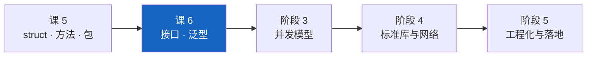

# 课 6：接口与泛型

> 所属阶段：组合与抽象 ｜ 故事章节：没有 class，怎么组织代码 ｜ 上一课：[课 5 · 结构体与方法](lesson-05-结构体与方法.md)
> **状态：✅ 已完成** ｜ 版本基线：**Go 1.27.1 darwin/arm64**（核查于 2026-09）
> 📌 本课所有命令与输出**均在本机真实跑通并实测**（macOS / arm64 / go1.27.1），不是纸面预期。

## 📌 知识点导航

| # | 知识点 | 关键点 | 状态 |
|---|--------|--------|------|
| 1 | 接口：隐式实现 | ①**没有 `implements`**，方法集匹配即实现 ②小接口哲学：一个方法也是有用的抽象 ③接口值 = (动态类型, 动态值) ④**nil 陷阱**：nil 指针存进接口后 `err != nil` ⑤编译期断言 `var _ I = (*T)(nil)` ⑥`any` 就是 `interface{}` 的别名 | ✅ 已完成 |
| 2 | 类型断言与 type switch | ①`v, ok := x.(T)` 的 comma-ok 形式 ②**不带 ok 会 panic**（`interface conversion: interface {} is string, not int`）③`switch v := x.(type)`（可含 `nil` / 接口类型分支）④断言是**设计气味**：能用接口解决就别用断言 | ✅ 已完成 |
| 3 | 泛型入门 | ①Go **1.18** 引入，类型参数 `[T 约束]` ②约束是**强制**的（与 C++20 可选 concepts 不同）：`comparable` / `cmp.Ordered` / 自定义 `~int` ③典型场景：容器类型与通用工具函数 ④**什么时候别用泛型**（官方三条 + 一条总纲）⑤⚠️ **Go 1.27 起方法可自带类型参数**，但接口方法仍不可带、泛型方法不能实现接口 | ✅ 已完成 |

---

## 第一幕 · 🏛️ 起源与场景引入

### 故事的收束：让下单模块"面向接口"

课 5 结束时，小谷的 `Order` 终于有模有样了。可他一提交代码就被打回：

> "下单逻辑里直接写死了发邮件的代码 —— 以后要加短信、加钉钉，你是不是打算每加一个渠道就改一次 `placeOrder`？"

他懂这个道理，Python 里他写过抽象基类：

```python
class Notifier(ABC):            # 抽象基类
    @abstractmethod
    def notify(self, msg): ...

class EmailNotifier(Notifier):  # 显式继承，必须写
    def notify(self, msg): ...
```

翻成 Go 时他愣住了 —— **找不到 `interface` 的"实现"关键字在哪写**。他搜了半天，最后半信半疑地只写了个方法：

```go
type Email struct{ To string }
func (e Email) Notify(msg string) error { ... }   // 就这一行，没别的了
```

然后它**居然就能传给 `PlaceOrder(n Notifier, id string)` 了**。

紧接着他撞了三堵墙：

1. 隐式实现太"隐形" —— 他不知道自己什么时候实现、什么时候没实现；
2. 一个 `err != nil` 的判断**失灵了**（错误明明打印是 `<nil>`）；
3. 想把 `[]Order` 和 `[]Item` 里重复的"查找"逻辑合并，用 `any` 写通用函数后**类型安全全丢了**。

> 这一课是**阶段 2 的收官课**：前两课给了他"装数据"（struct）和"挂行为"（方法），这一课给他两把**抽象**工具 —— **接口**（行为契约）与**泛型**（类型参数），以及最重要的：**克制**。

---

## 第二幕 · ❓ 认知冲突

小谷的三个真实撞墙（**本机实测**）：

**怪事一：没写 `implements` 也实现了，但 `err != nil` 却失灵**

```console
badCall(false)  → err=<nil>  err==nil ? false  动态类型=*main.MyErr
goodCall(false) → err=<nil>  err==nil ? true   动态类型=<nil>
❌ badCall 明明没出错，却进了 if err != nil（err=<nil>）
```

前半截他挺高兴：写个方法就算实现，不用 `implements`。后半截他懵了：**错误打印出来是 `<nil>`，可 `err == nil` 是 `false`** —— 没出错却进了错误处理分支。

**怪事二：一行断言让程序直接崩**

```console
捕获到 panic: interface conversion: interface {} is string, not int
```

他写了 `n := i.(int)`，而 `i` 里装的是 `string`。**没有编译错误，没有 `ok` 返回值，直接 panic。**

**怪事三：用 `any` 写"通用函数"，类型安全全丢了**

```go
func FindAny(xs []any, target any) bool { ... }  // 什么都能传进去
FindAny([]any{"a", "b"}, 42)                    // 编译通过，逻辑荒谬
```

他想要的是"一份代码，多种类型"，但 `any` 给的是"放弃类型检查"。**真正的答案不是接口，是泛型。**

这三个怪事，分别对应本课的三个知识点。**它们共同指向同一件事：Go 的抽象是"编译期契约"—— 接口约束行为，泛型约束类型，两者都在编译期把话说清楚，代价是你要先想清楚自己要哪种抽象。**

---

## 第三幕 · 层层揭示

### 知识点 1：接口：隐式实现

#### 一句话定义

**接口（interface）** 是**方法签名的集合**。一个类型只要**方法集**包含接口要求的全部方法，就**自动实现**了它 —— **没有 `implements` 关键字**。接口值内部是 **(动态类型, 动态值)** 二元组，**两者都为空时接口才等于 `nil`**。

#### 直觉建立：接口是插座，实现是插头

- **接口** = 墙上的**插座**（规定了几个孔、什么形状）；
- **实现** = 电器的**插头**（形状对得上就能插）。

不需要电器去"登记"自己支持哪种插座 —— 插得上就是支持。

**这个类比在哪失效**（三处，都很关键）：

1. **Python 的鸭子类型是"运行时才算"**，Go 是**编译期检查**。插不上在编译时就报错，不会等到线上。
2. **插座里有"看不见的型号"** —— 就算电器是坏的（nil 指针），插上去以后"插座被占用了"这个事实依然成立。这就是 **nil 陷阱**：`err != nil` 但打印是 `<nil>`。
3. **插头可以是值也可以是"取址"的** —— 方法集规则（课 5）决定：`*T` 能插的孔，`T` 不一定能插。

#### 核心原理

**① 没写任何 `implements`，方法集匹配即实现（实测）**

```go
type Speaker interface {
    Speak() string
}

type Dog struct{ Name string }
func (d Dog) Speak() string { return d.Name + "：汪汪" }   // 值接收者

type Cat struct{ Name string }
func (c *Cat) Speak() string { return c.Name + "：喵喵" }  // 指针接收者
```

```console
-- 1. 没写任何 implements，方法集对上就算实现 --
   它说：小黑：汪汪
   它说：小花：喵喵
```

第二条传的是 `&Cat{...}` —— 因为 `Speak` 是**指针接收者**，`Cat` 值类型不在 `Speaker` 的方法集里（课 5 的规则，在这里第一次真正咬人）。

**② 小接口哲学：一个方法也是有用的抽象（实测）**

Go 标准库里最著名的接口都极小：

```go
type Reader interface{ Read(p []byte) (n int, err error) }   // io.Reader
type Writer interface{ Write(p []byte) (n int, err error) }  // io.Writer
type Stringer interface{ String() string }                    // fmt.Stringer
```

实测 —— `bytes.Buffer` 与 `strings.Builder` 都能传给一个只要 `Write` 的函数：

```console
-- 3. 小接口：一个方法就够抽象了 --
   写到 bytes.Buffer；写到 strings.Builder。
```

> 📌 **"小接口"是 Go 的核心设计习惯**：接口越小，能实现它的类型就越多，复用面越广。**不要一上来就定义七八个方法的大接口。**

**③ 接口值 = (动态类型, 动态值)（官方原话 + 实测）**

> 接口值 = (动态类型 T, 动态值 V)；接口为 `nil` **当且仅当** T 与 V 都未设置。

（核查于 2026-09，来源：[go.dev FAQ · Why is my nil error value not equal to nil?](https://go.dev/doc/faq#nil_error)）

实测：

```console
-- 2. 接口值 = (动态类型, 动态值) --
   i1: 动态类型=main.Dog 动态值={小黑}
   i2: 动态类型=*main.Cat 动态值=&{小花}

-- 4. 接口的零值是 nil（类型和值都为空）--
   var empty Speaker → <nil>，empty == nil 是 true
```

**④ ⚠️ nil 陷阱：把 nil 指针塞进接口后 `err != nil`（本课第一大坑，实测）**

```go
// ❌ 经典坑：返回「具体类型的 nil 指针」
func badCall(fail bool) error {
    var e *MyErr           // 类型是 *MyErr，值是 nil
    if fail { e = &MyErr{Msg: "真的出错了"} }
    return e               // ← 隐式转成 error 接口：类型已经记下了，接口不为 nil
}

// ✅ 正确：没错误就老老实实 return nil
func goodCall(fail bool) error {
    if fail { return &MyErr{Msg: "真的出错了"} }
    return nil
}
```

```console
-- 1. 没出错时，两种写法的差别 --
   badCall(false)  → err=<nil>  err==nil ? false  动态类型=*main.MyErr
   goodCall(false) → err=<nil>  err==nil ? true   动态类型=<nil>

-- 2. 因此 badCall 会误入错误处理分支 --
   ❌ badCall 明明没出错，却进了 if err != nil（err=<nil>）
   ✅ goodCall 判断正确，没进错误处理

-- 4. 空接口 any 也一样 --
   var x any = (*int)(nil) → x == nil ? false  （动态类型=*int）
```

**打印是 `<nil>`、判断却不是 nil** —— 因为 `err` 的**动态类型是 `*MyErr`**（不为空），只是**动态值是 nil**。

> 📌 **怎么避免**：写函数时**不要返回具体类型的 nil 指针**。没错误就 `return nil`，这一条能挡掉 99% 的这个坑。
> 真要判断（比如拿到别人的接口值），用 `reflect.ValueOf(x).IsNil()`（实测返回 true），但那是补救，不是设计。

**⑤ 编译期断言：一行代码永久校验（实测）**

```go
var _ Notifier = Email{}         // 值类型实现了
var _ Notifier = (*SMS)(nil)     // 指针类型实现了（不用真的分配内存）
```

这行不占变量、不产生运行时开销，但**一旦哪天方法签名改了，编译立刻失败**。这是 Go 项目里最常见的"契约测试"写法。

**⑥ 方法集决定谁能实现接口（课 5 规则在这里生效，实测）**

```console
verify/iface_err.go:9:18: cannot use Cat{} (value of struct type Cat) as Speaker value in variable declaration: Cat does not implement Speaker (method Speak has pointer receiver)
```

规则复习（课 5）：`T` 的方法集**只含**值接收者的方法，`*T` 的方法集含值 + 指针接收者的。**所以：**

| 接收者写法 | `T` 能实现接口吗 | `*T` 能实现吗 |
|-----------|----------------|--------------|
| `func (t T) M()` | ✅ | ✅ |
| `func (t *T) M()` | ❌ | ✅ |

**⑦ `any` 就是 `interface{}` 的别名（官方 spec 原文 + 实测）**

> For convenience, the predeclared type `any` is an alias for the empty interface; it is not a named type. [Go 1.18]

（核查于 2026-09，来源：[go.dev/ref/spec · Interface types](https://go.dev/ref/spec#Interface_types)）

```console
-- 5. any 就是 interface{} 的别名 --
   any 的 %T        = int
   interface{} 的 %T = int
   两者可以互相赋值: true
```

**⑧ 接口可以组合（嵌入别的接口）**

```go
type Reader interface{ Read(p []byte) (n int, err error) }
type Closer interface{ Close() error }
type ReadCloser interface {
    Reader      // 嵌入接口
    Closer
}
```

实测：`var rc ReadCloser` 的零值仍是 `<nil>`。**这是课 5「匿名嵌入」在接口上的同样手法** —— 组合，不是继承。

#### 示例演示

```go
package main

import "fmt"

// Notifier 只有一个方法 —— 小接口
type Notifier interface {
	Notify(msg string) error
}

type Email struct{ To string }

// 值接收者：Email 和 *Email 都实现了 Notifier
func (e Email) Notify(msg string) error {
	fmt.Printf("  [邮件 → %s] %s\n", e.To, msg)
	return nil
}

type SMS struct{ Phone string }

// 指针接收者：只有 *SMS 实现了 Notifier
func (s *SMS) Notify(msg string) error {
	fmt.Printf("  [短信 → %s] %s\n", s.Phone, msg)
	return nil
}

// 编译期断言：不占变量，写一行就永久校验
var _ Notifier = Email{}
var _ Notifier = (*SMS)(nil)

// PlaceOrder 只依赖 Notifier，完全不关心是什么渠道
func PlaceOrder(n Notifier, id string) {
	fmt.Printf("下单 %s：\n", id)
	_ = n.Notify("订单已创建")
}

func main() {
	// 隐式实现：从头到尾没人写过 implements
	PlaceOrder(Email{To: "a@example.com"}, "SO-1001")
	PlaceOrder(&SMS{Phone: "13800000000"}, "SO-1002") // 指针接收者 → 必须取址

	// 接口切片能装不同的实现
	var channels []Notifier = []Notifier{
		Email{To: "b@example.com"},
		&SMS{Phone: "13900000000"},
	}
	fmt.Println("多渠道通知：")
	for _, c := range channels {
		fmt.Printf("  动态类型=%T → ", c)
		_ = c.Notify("订单已发货")
	}
}
```

**输出（本机实测）**：

```console
下单 SO-1001：
  [邮件 → a@example.com] 订单已创建
下单 SO-1002：
  [短信 → 13800000000] 订单已创建
多渠道通知：
  动态类型=main.Email →   [邮件 → b@example.com] 订单已发货
  动态类型=*main.SMS →   [短信 → 13900000000] 订单已发货
```

`PlaceOrder` 一行都没改，就同时支持了邮件和短信 —— **这就是面向接口的价值**。

#### 常见误区

- ❌ **"要写 `implements Notifier` 才算实现。"** Go 没有这个关键字，**方法集匹配即实现**。
- ❌ **"接口值等于 nil 当且仅当里面的值是 nil。"** 错 —— **两个都为空才是 nil**。nil 指针存进去后 `err != nil`（实测）。
- ❌ **"返回 `var e *MyErr; return e` 和 `return nil` 一样。"** 完全不同（实测：前者 `err == nil` 为 false）。
- ❌ **"值类型一定实现了我写的接口。"** 接收者是指针时，只有 `*T` 实现（`Cat does not implement Speaker` 实测）。
- ❌ **"接口越大越好，一次把能力都定义全。"** Go 的惯例正相反：**接口越小越好**（`io.Reader` 只有一个方法）。
- ❌ **"`any` 是一种特殊类型。"** 它就是 `interface{}` 的别名，不是命名类型（spec 原文）。
- ❌ **"接口可以继承接口。"** 措辞不对 —— 接口之间也是**嵌入组合**，不是继承。

#### 一句话记住

> **接口是方法签名的集合，方法集对上就自动实现（没有 `implements`）；接口值是 (动态类型, 动态值)，两个都空才是 `nil` —— 所以别把具体类型的 nil 指针塞进接口。**

📚 官方文档
- [go.dev spec · Interface types](https://go.dev/ref/spec#Interface_types)
- [go.dev spec · Method sets](https://go.dev/ref/spec#Method_sets)
- [go.dev FAQ · Why is my nil error value not equal to nil?](https://go.dev/doc/faq#nil_error)
- [go.dev blog · Interfaces and other types](https://go.dev/blog/laws-of-reflection)（Go 接口设计哲学）
- [Effective Go · Interfaces](https://go.dev/doc/effective_go#interfaces)
- [go.dev wiki · GoCodeReviewComments · Interfaces](https://go.dev/wiki/CodeReviewComments#interfaces)

---

### 知识点 2：类型断言与 type switch

#### 一句话定义

**类型断言** `x.(T)` 用于"从接口值里取出动态值"：**comma-ok 形式** `v, ok := x.(T)` 在失败时返回零值 + `false`（**不 panic**）；**不带 ok 的形式失败就 panic**。**type switch** `switch v := x.(type)` 一次对多种类型分流。`any` 就是 `interface{}` 的别名；**凡是能用接口解决的地方用断言，都是设计气味**。

#### 直觉建立：断言是"打开快递盒看看装的是什么"

接口值是个**不透明的盒子**（你只知道它实现了哪些方法）。断言就是**打开盒子看看里面具体是什么类型**。

**这个类比在哪失效**：

1. **打开方式错了会炸** —— `x.(int)` 而盒子里是 `string`，直接 panic（不是返回零值）；
2. **comma-ok 才是"先敲门"** —— `v, ok := x.(int)` 会告诉你"不是"，而不是炸；
3. **真盒子只有一种东西，接口可能有多种** —— 所以经常需要 **type switch** 一次分流。

#### 核心原理

**① comma-ok 形式：失败不 panic（实测）**

```console
   断言 string 成功: "hello"
   断言 int 失败: ok=false，n=0（拿到的是 int 的零值）
```

**② 不带 ok，失败就是 panic（本课第二大坑，实测）**

```console
   捕获到 panic: interface conversion: interface {} is string, not int
```

> 📌 **规则**：**只要有一丝可能失败，就必须用 comma-ok**。不带 ok 的写法只适合"你百分百确定"的场合（而且那种场合通常该直接用具体类型，而不是 `any`）。

**③ type switch：一次分流多种类型（实测）**

```go
func describe(i any) string {
    switch v := i.(type) {
    case nil:
        return "就是 nil"
    case int:
        return fmt.Sprintf("int，值 %d", v)
    case string:
        return fmt.Sprintf("string，长度 %d", len(v))
    case error:           // 也可以断言到一个「接口类型」
        return fmt.Sprintf("error，内容是 %v", v)
    default:
        return fmt.Sprintf("没匹配上，类型是 %T", v)
    }
}
```

```console
-- 2. type switch：一次分流多个类型 --
   <nil>          → 就是 nil
   int            → int，值 42
   string         → string，长度 2
   []int          → []int，长度 3
   float64        → 没匹配上，类型是 float64
   *errors.errorString → error，内容是 出错了
```

四个要点：

- `case nil` 匹配的是**接口值为 nil**（不是"里面的值是 nil"）；
- 每个 `case` 里的 `v` **自动是该分支的具体类型**（`case string` 里的 `v` 是 `string`，不用再断言）；
- **`case` 也可以是接口类型**（实测 `case error` 匹配到了 `*errors.errorString`）—— 判断"它是否实现了某个接口"：

```console
-- 3. 也能断言到「接口类型」（比如 io.Writer）--
   成功: "断言成 io.Writer 后就能写了"
   *bytes.Buffer 同时也实现了 io.Reader ✅
```

- 多个类型可以写在一个 case 里：`case int, int64:`

**④ `any` = `interface{}`（spec 原文 + 实测）**

```console
-- 5. any 就是 interface{} 的别名 --
   any 的 %T        = int
   interface{} 的 %T = int
   两者可以互相赋值: true
```

**⑤ 断言是设计气味：能用接口就别用断言（实测对比）**

看这两种写法处理"多种支付方式"：

```go
// ❌ 气味重：每加一种支付方式，都要回来改这个函数
func Pay(method any) string {
    switch m := method.(type) {
    case Alipay:     ...
    case *WechatPay: ...
    case Card:       ...
    default: ...
    }
}

// ✅ 更好：定义行为，让每种支付方式自己实现
type Payer interface{ Pay() string }
```

```console
-- type switch 分流 --
   支付宝扣款，账号 138@x.com
   微信扣款，openID o-abc
   银行卡扣款，尾号 6789
   不支持的支付方式：string
-- 更好的设计：接口（加一种支付方式不用改 Pay 函数）--
   支付宝扣款，账号 138@x.com
   微信扣款，openID o-abc
```

**判据**：如果你只是想**调用某个方法**，那就定义接口（这是官方 [When To Use Generics](https://go.dev/blog/when-generics) 里"Don't replace interface types with type parameters"的同一条原则，反过来对断言也成立）。只有当你**真的需要针对不同具体类型做不同的事**（比如解析第三方返回的不确定结构），type switch 才是对的。

**⑥ 对 error，用 `errors.As` 而不是自己断言（课 4 回收，实测）**

```console
-- 6. 对 error，用 errors.As 而不是自己断言（课 4 回收）--
   errors.As 取出 *os.PathError: Op=open Path=/definitely/not/exist.txt
```

`errors.As` 会沿包装链找（课 4 实测过），而直接断言只能剥一层。**处理错误时永远优先 `errors.Is` / `errors.As`。**

#### 示例演示

```go
package main

import "fmt"

type Alipay struct{ Account string }
type WechatPay struct{ OpenID string }
type Card struct{ No string }

// Pay 用 type switch 分流（注意：这里用 any 是为了演示；更好的设计见下面）
func Pay(method any) string {
	switch m := method.(type) {
	case Alipay:
		return fmt.Sprintf("支付宝扣款，账号 %s", m.Account)
	case *WechatPay:
		return fmt.Sprintf("微信扣款，openID %s", m.OpenID)
	case Card:
		return fmt.Sprintf("银行卡扣款，尾号 %s", m.No[len(m.No)-4:])
	default:
		return fmt.Sprintf("不支持的支付方式：%T", m)
	}
}

// Payer 更好的设计：定义行为，让各支付方式自己实现
type Payer interface{ Pay() string }

func (a Alipay) Pay() string     { return fmt.Sprintf("支付宝扣款，账号 %s", a.Account) }
func (w *WechatPay) Pay() string { return fmt.Sprintf("微信扣款，openID %s", w.OpenID) }

func main() {
	fmt.Println("-- type switch 分流 --")
	fmt.Println("  ", Pay(Alipay{Account: "138@x.com"}))
	fmt.Println("  ", Pay(&WechatPay{OpenID: "o-abc"}))
	fmt.Println("  ", Pay(Card{No: "6222020123456789"}))
	fmt.Println("  ", Pay("现金"))

	fmt.Println("-- 只想判断一种：comma-ok 更轻 --")
	var m any = Alipay{Account: "138@x.com"}
	if a, ok := m.(Alipay); ok {
		fmt.Printf("   是支付宝，账号 %s\n", a.Account)
	}
	if _, ok := m.(Card); !ok {
		fmt.Println("   不是银行卡，ok=false（没有 panic）")
	}

	fmt.Println("-- 更好的设计：接口（加一种支付方式不用改 Pay 函数）--")
	var ps []Payer = []Payer{Alipay{Account: "138@x.com"}, &WechatPay{OpenID: "o-abc"}}
	for _, p := range ps {
		fmt.Println("  ", p.Pay())
	}
}
```

**输出（本机实测）**：

```console
-- type switch 分流 --
   支付宝扣款，账号 138@x.com
   微信扣款，openID o-abc
   银行卡扣款，尾号 6789
   不支持的支付方式：string
-- 只想判断一种：comma-ok 更轻 --
   是支付宝，账号 138@x.com
   不是银行卡，ok=false（没有 panic）
-- 更好的设计：接口（加一种支付方式不用改 Pay 函数）--
   支付宝扣款，账号 138@x.com
   微信扣款，openID o-abc
```

#### 常见误区

- ❌ **"断言失败会返回零值。"** 只有 **comma-ok** 形式会；不带 ok 直接 **panic**（实测 `interface conversion: interface {} is string, not int`）。
- ❌ **"`case nil` 匹配的是'里面的值是 nil'。"** 匹配的是**接口值本身为 nil**（动态类型也是 nil）。
- ❌ **"type switch 只能匹配具体类型。"** 也能匹配**接口类型**（实测 `case error` 匹配到了 `*errors.errorString`）。
- ❌ **"用 `any` + type switch 就能搞定一切多态。"** 能用**接口**解决的（只是调方法），用断言就是设计气味 —— 加一种类型就要回来改 switch。
- ❌ **"对 error 用 `err.(*MyError)` 断言就行。"** 只能剥一层；用 **`errors.As`**（课 4 实测）。
- ❌ **"`any` 和 `interface{}` 是两个东西。"** 前者是后者的**别名**（spec 原文）。

#### 一句话记住

> **断言一律用 comma-ok（`v, ok := x.(T)`），不带 ok 失败就 panic；多种类型分流用 type switch（case 可以是 nil、具体类型或接口类型）；但凡只是"调个方法"，就该用接口而不是断言。**

📚 官方文档
- [go.dev spec · Type assertions](https://go.dev/ref/spec#Type_assertions)
- [go.dev spec · Type switches](https://go.dev/ref/spec#Type_switches)
- [go.dev spec · Interface types（`any` 别名，Go 1.18）](https://go.dev/ref/spec#Interface_types)
- [Effective Go · Interface conversions and type assertions](https://go.dev/doc/effective_go#interface_conversions)
- [go.dev blog · When To Use Generics（"别用类型参数替换接口"）](https://go.dev/blog/when-generics)

---

### 知识点 3：泛型入门

#### 一句话定义

**泛型**（Go **1.18** 引入）让函数或类型可以带**类型参数** `[T 约束]`，写一份代码服务多种类型。**约束（constraint）是强制的**（与 C++20 的可选 concepts 不同）—— 你只能在约束允许的操作范围内写代码。典型用途是**容器类型**与**通用工具函数**；**不**该用它替换接口，也不该为了"可能以后要"提前上泛型。

#### 直觉建立：泛型是"把类型也当成参数传进去"

普通函数传**值**，泛型函数额外传**类型**：

```go
Max(3, 7)          // 值参数：3 和 7
Max[int](3, 7)     // 类型参数：int（多数情况可以省略，编译器会推断）
```

**这个类比在哪失效**（三处，都是 Go 的特色）：

1. **类型参数不是"随便什么类型都行"** —— 它受**约束**限制。`[T any]` 意味着"任何类型"，也因此**只能做所有类型都支持的操作**（赋值、比较接口值……），连 `>` 都不行（实测会编译失败）。想用 `>` 就得写 `[T cmp.Ordered]`。
2. **约束是强制的**，不是可选的。C++20 的 concepts 你可以不写（`template<typename T>` 照跑，错了才报）；Go **必须**写约束。
3. **泛型通常不会比接口快** —— 官方明确说过这一点（下面 ⑤）。

#### 核心原理

**① 类型参数与约束（实测）**

```go
func Max[T cmp.Ordered](a, b T) T {   // cmp.Ordered：标准库的可比较约束（Go 1.21+）
    if a > b { return a }
    return b
}
```

```console
-- 1. 泛型函数：同一份代码，多种类型 --
   Max[int](3, 7)      = 7
   Max(3.14, 2.71)     = 3.14  ← 没写类型参数，编译器推断为 float64
   Max("apple", "zoo") = "zoo"
   显式写出类型参数: Max[int](3, 7) = 7
```

**② 三种常用约束**

| 约束 | 含义 | 能做什么 |
|------|------|---------|
| `any` | 任何类型（等价于 `interface{}`） | 几乎只能赋值、传参 |
| `comparable` | 能用 `==` / `!=` 比较的类型 | 可以当 map 的 key、可以比较相等 |
| `cmp.Ordered` | 能用 `<` `>` `<=` `>=` 的有序类型 | 可以排序、比大小（Go 1.21+ 标准库） |

自定义约束用**类型集合**（`|` 表示"或"，`~T` 表示"底层类型是 T 的都算"）：

```go
type Number interface{ ~int | ~int64 | ~float64 }

func Sum[T Number](xs []T) T { ... }
```

实测（自定义类型 `Cent`（底层 int64）也满足 `~int64`）：

```console
  Sum([]Cent{100, 250}) = 350（类型是 main.Cent）
```

**③ 约束是强制的（与 C++20 的关键差别，实测）**

把 `cmp.Ordered` 换成 `any` 却还在用 `>`：

```console
verify/gen_err.go:5:5: invalid operation: a > b (type parameter T cannot use operator >)
```

**Go 在你写函数体的那一刻就检查**，而不是等到实例化时才报错（这是与 C++ 模板最大的体验差别）。

**④ 泛型类型（实测）**

```go
type Stack[T any] struct {
    items []T
}

func (s *Stack[T]) Push(v T)        { s.items = append(s.items, v) }
func (s *Stack[T]) Pop() (T, bool)  { ... }
func (s Stack[T]) Len() int         { return len(s.items) }
```

```console
-- 2. 泛型类型：Stack[T] --
   Stack[int]: Push 1,2 → Pop=2 ok=true Len=1
   Stack[string]: Pop="订单" Len=0
```

注意方法声明要写 `Stack[T]`（带类型参数），而**不是** `Stack`。

**⑤ 什么时候别用泛型（官方原文）**

官方博客 [When To Use Generics](https://go.dev/blog/when-generics)（Ian Lance Taylor，2022-04-12）给的三条（核查于 2026-09）：

1. **别用类型参数替换接口类型**：

   > If all you need to do with a value of some type is call a method on that value, use an interface type, not a type parameter.……using a type parameter will generally not be faster than using an interface type. **So don't change from interface types to type parameters just for speed**, because it probably won't run any faster.

2. **各类型的实现不同时，别用类型参数**：

   > If the implementation is different for each type, then use an interface type and write different method implementations, don't use a type parameter.

3. **总纲（一句话判据）**：

   > If you find yourself writing the exact same code multiple times, where the only difference between the copies is that the code uses different types, consider whether you can use a type parameter.

   以及开篇那条：

   > Start by writing functions. It's easy to add type parameters later when it's clear that they will be useful.

**选择表**：

| 情况 | 用什么 |
|------|--------|
| 只是要**调用某个方法**（Read / Write / String） | **接口** |
| 各类型**实现不同** | **接口** |
| 各类型**实现完全一样**，只有类型不同（容器 / 工具函数） | **泛型** |
| 要**避免类型断言**、要编译期类型安全 | **泛型** |
| 只是"觉得以后可能要" | **都别用**，先写普通代码 |
| 想靠泛型**提速** | ❌ 大概率没用（官方原话） |

**⑥ ⚠️ Go 1.27 新能力：方法自带类型参数（泛型方法）**

Go 1.27 起，**方法**可以声明自己的类型参数（以前只有顶层函数可以）：

```go
type Box[T any] struct{ v T }

// Map 自己带了类型参数 U，与接收者的 T 无关
func (b Box[T]) Map[U any](f func(T) U) Box[U] {
    return Box[U]{v: f(b.v)}
}
```

实测：

```console
-- 4. Go 1.27 泛型方法：方法自己带类型参数 --
   Box[int]{21}.Map(×2) = {42}
   再 .Map(转字符串)     = {v:值=42}  ← 类型从 Box[int] 变成了 Box[string]
```

**三条限制（都是编译错误，本机实测）**：

```console
verify/gen_iface_err.go:5:5:  interface method must have no type parameters        ← 接口方法不能带类型参数
verify/gen_iface_err.go:17:16: cannot use Box[int]{} (value of struct type Box[int]) as Getter value in variable declaration: Box[int] does not implement Getter (wrong type for method Get)
		have Get[U any]() int
		want Get() int                                                              ← 泛型方法不能实现接口方法
```

| 能 | 不能 |
|----|------|
| 方法声明自己的类型参数（`Box[T].Map[U]`） | 接口方法声明类型参数 |
| 顶层泛型函数（Go 1.18 起） | 用泛型方法去实现接口 |
| 泛型类型（`Stack[T]`，Go 1.18 起） | — |

> ⚠️ **已知信源冲突**（本课沿用大纲阶段已记录的判定）：go.dev FAQ 的「Why does Go not support methods with type parameters?」条目**仍写着"不打算支持泛型方法"**，与 Go 1.27 Release Notes 冲突。判定为 **FAQ 该条目未随 1.27 更新**，**以 Release Notes 为准**（本机实测亦支持泛型方法）。

#### 示例演示

```go
package main

import (
	"cmp"
	"fmt"
)

// Contains：comparable 约束（要能用 == 比较）
func Contains[T comparable](xs []T, target T) bool {
	for _, x := range xs {
		if x == target {
			return true
		}
	}
	return false
}

// Number：自定义约束，~ 表示"底层类型是这个的都算"
type Number interface{ ~int | ~int64 | ~float64 }

func Sum[T Number](xs []T) T {
	var total T // 零值由类型参数决定
	for _, x := range xs {
		total += x
	}
	return total
}

func Max[T cmp.Ordered](xs []T) T {
	m := xs[0]
	for _, x := range xs[1:] {
		if x > m {
			m = x
		}
	}
	return m
}

type Cent int64 // 底层类型是 int64 → 满足 ~int64

func main() {
	fmt.Println("-- 同一份代码，多种类型 --")
	fmt.Println("  Contains([]int{1,2,3}, 2)         =", Contains([]int{1, 2, 3}, 2))
	fmt.Println("  Contains([]string{\"a\",\"b\"}, \"z\") =", Contains([]string{"a", "b"}, "z"))
	fmt.Println("  Sum([]int{1,2,3})        =", Sum([]int{1, 2, 3}))
	fmt.Println("  Sum([]float64{1.5, 2.5}) =", Sum([]float64{1.5, 2.5}))
	fmt.Println("  Max([]int{3, 9, 2})      =", Max([]int{3, 9, 2}))
	fmt.Println("  Max([]string{\"b\",\"z\",\"a\"}) =", Max([]string{"b", "z", "a"}))

	fmt.Println("-- 自定义类型也满足 ~T 约束 --")
	fmt.Printf("  Sum([]Cent{100, 250}) = %d（类型是 %T）\n", Sum([]Cent{100, 250}), Sum([]Cent{100, 250}))
}
```

**输出（本机实测）**：

```console
-- 同一份代码，多种类型 --
  Contains([]int{1,2,3}, 2)         = true
  Contains([]string{"a","b"}, "z") = false
  Sum([]int{1,2,3})        = 6
  Sum([]float64{1.5, 2.5}) = 4
  Max([]int{3, 9, 2})      = 9
  Max([]string{"b","z","a"}) = z
-- 自定义类型也满足 ~T 约束 --
  Sum([]Cent{100, 250}) = 350（类型是 main.Cent）
```

#### 常见误区

- ❌ **"泛型就是 C++ 模板。"** 关键差别：**Go 的约束是强制的**，且函数体在定义时就检查（`type parameter T cannot use operator >` 实测），不是实例化时才报。
- ❌ **"用 `any` 参数写通用函数 = 泛型。"** 那是**放弃类型检查**（怪事三）。泛型保留类型安全。
- ❌ **"泛型比接口快，能提速。"** 官方原话：*"using a type parameter will generally not be faster than using an interface type"*。别为性能上泛型。
- ❌ **"只要有多种类型就该上泛型。"** 各类型**实现不同**时该用**接口**（官方原文）。判据是"实现是否完全一样"。
- ❌ **"`[T any]` 里可以做任何操作。"** `any` 约束下**连 `>` 都不行**（实测）。需要什么操作，就写对应的约束。
- ❌ **"Go 1.27 起接口也能带泛型方法了。"** 不行 —— `interface method must have no type parameters`（实测）；泛型方法也不能实现接口。
- ❌ **"泛型方法可以先写着，反正以后有用。"** 官方建议正相反：*"Start by writing functions. It's easy to add type parameters later."*

#### 一句话记住

> **泛型把"类型"也变成参数，但约束是强制的（`any` / `comparable` / `cmp.Ordered` / 自定义 `~T`）；它适合"实现完全一样、只有类型不同"的容器与工具函数 —— 只是调方法就用接口，别为了提速或"以后可能要"提前上泛型。**

📚 官方文档
- [go.dev doc · Go 1.18 Release Notes（泛型引入）](https://go.dev/doc/go1.18)
- [go.dev blog · An Introduction To Generics](https://go.dev/blog/intro-generics)
- [go.dev blog · When To Use Generics](https://go.dev/blog/when-generics)
- [go.dev doc · Go 1.27 Release Notes（泛型方法）](https://go.dev/doc/go1.27)
- [pkg.go.dev · cmp 包（`cmp.Ordered`）](https://pkg.go.dev/cmp)
- [go.dev spec · Type parameters](https://go.dev/ref/spec#Type_parameter_declarations)

---

## 第四幕 · 🔬 实操验证

> 这一幕每一步都在本机真实跑过（macOS / arm64 / go1.27.1，2026-09-07）。照着敲得到一样的输出。
> 工作目录：`/tmp/go-l06/`，模块：`example.com/l06`，探针脚本放在 `verify/` 下。

### 步骤 0：环境与工作区

```console
$ /usr/local/bin/go version
go version go1.27.1 darwin/arm64

$ mkdir -p /tmp/go-l06/verify && cd /tmp/go-l06
$ /usr/local/bin/go mod init example.com/l06
go: creating new go.mod: module example.com/l06
```

### 步骤 1：接口基础 —— 隐式实现与小接口（知识点 1）

```console
$ /usr/local/bin/go run verify/iface_basic.go
===== 知识点 1：接口：隐式实现 =====

-- 1. 没写任何 implements，方法集对上就算实现 --
   它说：小黑：汪汪
   它说：小花：喵喵

-- 2. 接口值 = (动态类型, 动态值) --
   i1: 动态类型=main.Dog 动态值={小黑}
   i2: 动态类型=*main.Cat 动态值=&{小花}

-- 3. 小接口：一个方法就够抽象了 --
   写到 bytes.Buffer；写到 strings.Builder。

-- 4. 接口的零值是 nil（类型和值都为空）--
   var empty Speaker → <nil>，empty == nil 是 true
   %T 打印出来是 <nil>

-- 5. 接口可以组合（嵌入别的接口）--
   ReadCloser 的零值: <nil>（为 nil）
```

**方法集不匹配时**（指针接收者 + 值类型）：

```console
$ /usr/local/bin/go run verify/iface_err.go
verify/iface_err.go:9:18: cannot use Cat{} (value of struct type Cat) as Speaker value in variable declaration: Cat does not implement Speaker (method Speak has pointer receiver)
```

### 步骤 2：nil 陷阱复现（知识点 1 · 本课第一大坑）

```console
$ /usr/local/bin/go run verify/iface_nil.go
===== nil 接口的陷阱 =====

-- 1. 没出错时，两种写法的差别 --
   badCall(false)  → err=<nil>  err==nil ? false  动态类型=*main.MyErr
   goodCall(false) → err=<nil>  err==nil ? true   动态类型=<nil>

-- 2. 因此 badCall 会误入错误处理分支 --
   ❌ badCall 明明没出错，却进了 if err != nil（err=<nil>）
   ✅ goodCall 判断正确，没进错误处理

-- 3. 为什么？接口值 = (动态类型, 动态值)，两个都为空才是 nil --
   bad  的动态类型=*main.MyErr → 不为 nil，所以接口不为 nil
   good 的动态类型=<nil> → 接口为 nil
   官方 FAQ 原话：接口为 nil 当且仅当类型与值都未设置

-- 4. 空接口 any 也一样 --
   var x any = (*int)(nil) → x == nil ? false  （动态类型=*int）

-- 5. 真要判断，用 reflect（但更好的做法是别这么写）--
   reflect.ValueOf(bad).IsNil() = true
```

**回扣第二幕怪事一**：`err=<nil>` 却 `err == nil` 为 `false` —— 打印和判断给出的答案相反，这就是这个坑最难查的地方。

### 步骤 3：类型断言与 type switch（知识点 2）

```console
$ /usr/local/bin/go run verify/assert_switch.go
===== 知识点 2：类型断言与 type switch =====

-- 1. comma-ok 形式：失败不 panic，返回零值 + false --
   断言 string 成功: "hello"
   断言 int 失败: ok=false，n=0（拿到的是 int 的零值）

-- 2. type switch：一次分流多个类型 --
   <nil>          → 就是 nil
   int            → int，值 42
   string         → string，长度 2
   []int          → []int，长度 3
   float64        → 没匹配上，类型是 float64
   *errors.errorString → error，内容是 出错了

-- 3. 也能断言到「接口类型」（比如 io.Writer）--
   成功: "断言成 io.Writer 后就能写了"
   *bytes.Buffer 同时也实现了 io.Reader ✅

-- 4. 不带 ok 的断言，失败就是 panic --
   捕获到 panic: interface conversion: interface {} is string, not int

-- 5. any 就是 interface{} 的别名 --
   any 的 %T        = int
   interface{} 的 %T = int
   两者可以互相赋值: true

-- 6. 对 error，用 errors.As 而不是自己断言（课 4 回收）--
   errors.As 取出 *os.PathError: Op=open Path=/definitely/not/exist.txt
```

**回扣第二幕怪事二**：`interface conversion: interface {} is string, not int` —— 一行断言，程序崩溃。

### 步骤 4：泛型函数、类型与约束（知识点 3）

```console
$ /usr/local/bin/go run verify/generic.go
===== 知识点 3：泛型入门 =====

-- 1. 泛型函数：同一份代码，多种类型 --
   Max[int](3, 7)      = 7
   Max(3.14, 2.71)     = 3.14  ← 没写类型参数，编译器推断为 float64
   Max("apple", "zoo") = "zoo"
   显式写出类型参数: Max[int](3, 7) = 7

-- 2. 泛型类型：Stack[T] --
   Stack[int]: Push 1,2 → Pop=2 ok=true Len=1
   Stack[string]: Pop="订单" Len=0

-- 3. comparable 约束：键必须能比较 --
   Keys(map[string]int) = [显示器 键盘 鼠标]

-- 4. Go 1.27 泛型方法：方法自己带类型参数 --
   Box[int]{21}.Map(×2) = {42}
   再 .Map(转字符串)     = {v:值=42}  ← 类型从 Box[int] 变成了 Box[string]

-- 5. 约束是强制的（Go 与 C++20 的关键差别）--
   func Max[T any](a, b T) 里写 a > b 会编译失败：
   invalid operation: a > b (type parameter T cannot use operator >)
```

最后那条报错的**真身**（步骤 4 里只是打印了文字，这里是真的编译）：

```console
$ /usr/local/bin/go run verify/gen_err.go
verify/gen_err.go:5:5: invalid operation: a > b (type parameter T cannot use operator >)
```

### 步骤 5：Go 1.27 泛型方法的三条限制（知识点 3）

```console
$ /usr/local/bin/go run verify/gen_iface_err.go
verify/gen_iface_err.go:5:5: interface method must have no type parameters
verify/gen_iface_err.go:5:25: undefined: U
verify/gen_iface_err.go:17:16: cannot use Box[int]{} (value of struct type Box[int]) as Getter value in variable declaration: Box[int] does not implement Getter (wrong type for method Get)
		have Get[U any]() int
		want Get() int
```

三条限制，逐条坐实：**①接口方法不能带类型参数；②因此接口里写的 `U` 是未定义的；③泛型方法不能用来实现接口方法。**

---

## 第五幕 · 体系收束

### 三个怪事，三个答案

| 怪事 | 答案 | 对应知识点 |
|------|------|-----------|
| 没写 `implements` 也实现了；但 `err != nil` 失灵 | 方法集匹配即**隐式实现**；而接口值是 (动态类型, 动态值)，**两者都空才是 nil** —— 返回具体类型的 nil 指针会让 `err != nil` 成立 | 知识点 1 |
| 一行 `i.(int)` 让程序崩 | 不带 `ok` 的断言失败即 **panic**；一律用 `v, ok := x.(T)` | 知识点 2 |
| 用 `any` 写通用函数，类型安全全丢 | `any` = 放弃类型检查；要"一份代码多种类型"且保住类型安全，用**泛型**（约束强制） | 知识点 3 |

### 小谷现在站在哪

他没写一行 `implements`，下单模块却真的"面向接口"了：

```go
type Notifier interface{ Notify(msg string) error }   // 一个方法的小接口

func PlaceOrder(n Notifier, id string) { ... }        // 只依赖接口
```

- **加短信渠道**：加一个类型 + 一个方法，`PlaceOrder` **一行没改**；
- **加钉钉渠道**：同上；
- **测试**：传一个假的 `Notifier` 进去，不用真的发邮件。

泛型那边他学会了克制：`Order` 和 `Item` 的查找逻辑**确实实现完全一样**，于是抽成了 `Contains[T comparable]`；而"算总价"和"算运费"看起来像，**实现其实不同**，他老老实实写了两个方法 —— 按官方那条判据：**实现一样才上泛型，不一样就用接口。**

### 🎉 阶段 2 收官

到这里，**阶段 2《组合与抽象》18 / 45 知识点全部完成**：

| 课 | 三件套 | 关键收获 |
|----|--------|---------|
| 课 4 | 函数 · error · defer | 错误是**值**，每层显式决定；`defer` 是清单不是即时动作 |
| 课 5 | struct · 方法 · 包 | **组合**不是继承；值/指针接收者；大小写即导出 |
| 课 6 | 接口 · 断言 · 泛型 | 接口约束**行为**、泛型约束**类型**；两者都要克制 |

> ⚠️ **课时讲完 ≠ 学完** —— Phase 3 的结课实战、Phase 5 的实战经验 / 排障手册 / 场景解法库还在后面，那才是把这些知识焊成能力的地方。

### 本课在全局的位置



- **已经会的**：定义小接口并隐式实现、避开 nil 接口陷阱、安全地做断言与 type switch、写带约束的泛型函数与容器、判断**该用接口还是泛型**。
- **还不会的**：怎么让程序**同时做多件事** —— goroutine、channel、以及如何不把并发写成竞态与泄漏 —— **阶段 3 全揽**。
- **埋下的伏笔**：
  - `io.Reader` / `io.Writer` 本课只是举例，**课 10 系统讲**它们的组合哲学；
  - `http.Handler` 是标准库里最著名的小接口 —— **课 11**；
  - `database/sql` 的接口设计（`driver.Conn` 等）—— **课 12**；
  - 本课的泛型会在 **课 9 的 `sync.Map` vs 泛型容器**、**课 13 的测试**中再次出现。
- **跨阶段提醒**：下一课进入阶段 3，**第一课就会起 goroutine** —— 请先把本课的接口与 nil 陷阱消化掉，并发里的 nil 更难查。

---

## 🐞 常见误区（本课合订）

| # | 误区 | 真相 |
|---|------|------|
| 1 | 要写 `implements` 才算实现接口 | Go 没有这个关键字，**方法集匹配即实现** |
| 2 | 接口值里的值是 nil，接口就等于 nil | **两个都空才是 nil**；nil 指针存进去后 `err != nil`（实测） |
| 3 | `return e`（*MyErr 的 nil）等价于 `return nil` | 完全不同（实测 `err == nil` 为 false） |
| 4 | 值类型一定实现了我写的接口 | 指针接收者时只有 `*T` 实现（`Cat does not implement Speaker`） |
| 5 | 接口越大越全越好 | Go 的惯例是**小接口**（`io.Reader` 一个方法） |
| 6 | `any` 是一种特殊类型 | 就是 `interface{}` 的**别名**（spec 原文） |
| 7 | 断言失败会返回零值 | 只有 **comma-ok** 会；不带 ok 直接 **panic** |
| 8 | `case nil` 匹配"里面的值是 nil" | 匹配**接口值本身为 nil** |
| 9 | type switch 只能匹配具体类型 | 也能匹配**接口类型**（实测 `case error`） |
| 10 | 用 `any` + type switch 搞定一切多态 | 只是调方法就该用**接口**；否则加一种类型就要改 switch |
| 11 | 对 error 直接 `err.(*MyError)` 断言 | 只能剥一层；用 **`errors.As`** |
| 12 | 泛型就是 C++ 模板 | **约束强制**，且函数体在定义时就检查（实测报错） |
| 13 | 用 `any` 参数写通用函数 = 泛型 | 那是**放弃类型检查**；泛型保住类型安全 |
| 14 | 泛型比接口快 | 官方原话：**通常不会更快**，别为性能上泛型 |
| 15 | 有多种类型就该上泛型 | 各类型**实现不同**时该用**接口**（官方原文） |
| 16 | `[T any]` 里什么操作都行 | 连 `>` 都不行（`type parameter T cannot use operator >`） |
| 17 | Go 1.27 起接口也能带泛型方法 | 不行：`interface method must have no type parameters`（实测） |
| 18 | 泛型方法可以实现接口方法 | 不行：`Box[int] does not implement Getter`（实测） |

---

## 🗺️ 一图总结

```mermaid
graph TD
    subgraph 接口：隐式实现
      I1["接口 = 方法签名集合<br/>没有 implements"]
      I2["小接口哲学：一个方法也够"]
      I3["接口值 = (动态类型, 动态值)"]
      I4["nil 陷阱：两个都空才是 nil"]
      I5["方法集决定谁能实现"]
      I6["var _ I = (*T)(nil) 编译期断言"]
      I7["any = interface{} 别名"]
    end
    subgraph 类型断言与 type switch
      A1["v, ok := x.(T) —— comma-ok"]
      A2["x.(T) 不带 ok → panic"]
      A3["switch v := x.(type)"]
      A4["case 可以是 nil / 具体 / 接口类型"]
      A5["能用接口就别用断言（设计气味）"]
    end
    subgraph 泛型
      G1["[T 约束]，Go 1.18 引入"]
      G2["约束强制：any / comparable / cmp.Ordered"]
      G3["泛型类型 Stack[T]"]
      G4["Go 1.27：方法自带类型参数"]
      G5["不该用：替换接口 / 实现不同 / 为了提速"]
    end
    I1 --> I2
    I1 --> I3
    I3 --> I4
    I1 --> I5
    I5 --> I6
    I1 --> I7
    I3 -. "要取回具体类型 → 断言" .-> A1
    A1 --> A2
    A1 --> A3 --> A4
    A3 -. "分支越来越多 → 该用接口" .-> A5
    A5 -. "只是调方法 → 接口" .-> I1
    I7 -. "any 保不住类型安全 → 泛型" .-> G1
    G1 --> G2 --> G3
    G2 --> G4
    G1 --> G5
    G5 -. "实现不同 → 接口" .-> I1
    style I4 fill:#ffcdd2,color:#333
    style A2 fill:#ffcdd2,color:#333
    style G5 fill:#ffe0b2,color:#333
    style G4 fill:#ffe0b2,color:#333
    style A5 fill:#ffe0b2,color:#333
```

> 红色 = 会让程序崩溃或判断失灵（后果最重）；橙色 = 高频踩坑 / 设计取舍点。

---

## 📋 速查卡

| 语法 / API | 一句话 | 坑 |
|-----------|--------|-----|
| `type I interface{ M() }` | 定义接口（方法签名集合） | 不写 `implements` |
| 给类型写方法 | **方法集匹配即实现** | 指针接收者时只有 `*T` 实现 |
| `var _ I = (*T)(nil)` | 编译期断言（不占变量） | 改签名会立刻编译失败 —— 这正是目的 |
| `x == nil` | 判断接口是否为空 | **类型和值都空才是 nil** |
| 返回错误时 `return nil` | 正确写法 | ❌ 不要 `return e`（具体类型 nil 指针） |
| `io.Reader` / `io.Writer` | 一个方法的小接口典范 | 系统讲解在课 10 |
| `any` | `interface{}` 的别名（Go 1.18） | 用它 = 放弃编译期类型检查 |
| `嵌入别的接口` | 接口组合 | 是组合不是继承 |
| `v, ok := x.(T)` | **comma-ok 断言**（推荐） | 失败返回零值 + false |
| `v := x.(T)` | 断言 | ❌ 失败 **panic** |
| `switch v := x.(type)` | 多类型分流 | 每个 case 里 `v` 自动是该类型 |
| `case nil` / `case error` | 匹配 nil / 匹配接口类型 | `nil` 指接口值为 nil |
| `errors.As(err, &target)` | 对 error 的正确"断言" | 能穿透包装链（课 4） |
| `func F[T any](v T)` | 泛型函数 | 约束是**强制**的 |
| `comparable` | 能用 `==` 的类型 | 可当 map key |
| `cmp.Ordered` | 能用 `<` `>` 的类型（Go 1.21+ 标准库） | 需要比大小就用它 |
| `~int \| ~int64` | 自定义约束（`~` = 底层类型） | 自定义类型也满足 |
| `type Stack[T any] struct{}` | 泛型类型 | 方法要写 `Stack[T]` |
| `func (b Box[T]) Map[U any]()` | **Go 1.27** 泛型方法 | 接口方法不能带类型参数 |
| `F(3, 7)` | 类型推断（多数情况可省 `[T]`） | 推断不出来才显式写 |
| 泛型 vs 接口 | 实现一样 → 泛型；只是调方法 → 接口 | **泛型通常不比接口快** |

---

## 📝 课后小测

<details>
<summary><b>第 1 题</b>：下面这段代码会输出什么？为什么？

```go
type MyErr struct{ Msg string }
func (e *MyErr) Error() string { return e.Msg }

func call(fail bool) error {
    var e *MyErr
    if fail {
        e = &MyErr{Msg: "出错了"}
    }
    return e
}

func main() {
    err := call(false)
    fmt.Println(err, err == nil)
}
```</summary>

输出（本机实测）：

```console
<nil> false
```

**`err` 打印是 `<nil>`，但 `err == nil` 是 `false`。**

原因：接口值是 **(动态类型, 动态值)** 二元组。`return e` 把 `e`（类型 `*MyErr`、值 nil）装进了 `error` 接口 —— **动态类型 `*MyErr` 不为空**，所以接口整体不为 nil。

正确写法：

```go
func call(fail bool) error {
    if fail {
        return &MyErr{Msg: "出错了"}
    }
    return nil   // 直接返回 nil 接口
}
```

**规则**：函数返回 `error` 时，**没错误就 `return nil`**，不要返回具体类型的 nil 指针。
</details>

<details>
<summary><b>第 2 题</b>：下面两种写法有什么区别？哪种更安全？

```go
n := i.(int)          // ①
n, ok := i.(int)      // ②
```</summary>

- **① 不带 `ok`**：断言失败直接 **panic**。实测（i 是 string 时）：

```console
捕获到 panic: interface conversion: interface {} is string, not int
```

- **② comma-ok**：失败时返回**零值 + false**，不 panic。实测：

```console
断言 int 失败: ok=false，n=0（拿到的是 int 的零值）
```

**② 更安全，默认就用它。** ① 只适合你百分百确定类型的场合 —— 而那种场合通常说明你**不该用 `any`**，直接用具体类型更好。
</details>

<details>
<summary><b>第 3 题</b>：为什么下面这段代码编译不过？怎么改？

```go
type Speaker interface{ Speak() string }

type Cat struct{ Name string }
func (c *Cat) Speak() string { return c.Name }

func main() {
    var s Speaker = Cat{}
    fmt.Println(s.Speak())
}
```</summary>

报错原文（本机实测）：

```console
cannot use Cat{} (value of struct type Cat) as Speaker value in variable declaration: Cat does not implement Speaker (method Speak has pointer receiver)
```

**原因**：`Speak` 是**指针接收者**，按课 5 的方法集规则，`Cat`（值）的方法集里**没有** `Speak`，只有 `*Cat` 有。

**两种改法**：

```go
// 改法 1（推荐）：看它是否真的需要修改接收者；不需要就改成值接收者
func (c Cat) Speak() string { return c.Name }

// 改法 2：调用处取址
var s Speaker = &Cat{}
```

**判断原则**：如果方法要修改接收者、或 struct 较大，就保留指针接收者并统一用 `&Cat{}`；否则改成值接收者，用起来更灵活（值和指针都能赋值给接口）。
</details>

<details>
<summary><b>第 4 题</b>：什么时候该用泛型，什么时候该用接口？给出判据。</summary>

官方博客 [When To Use Generics](https://go.dev/blog/when-generics) 的判据（核查于 2026-09）：

| 情况 | 用什么 | 官方原话要点 |
|------|--------|-------------|
| 只是要**调用某个方法** | **接口** | "If all you need to do with a value of some type is call a method on that value, use an interface type, not a type parameter." |
| 各类型的**实现不同** | **接口** | "If the implementation is different for each type, then use an interface type ... don't use a type parameter." |
| 各类型**实现完全一样**，只有类型不同 | **泛型** | 典型场景：容器类型（Stack/Map/Set）、通用工具函数（Max/Sum/Contains） |
| 想靠泛型**提速** | ❌ 别 | "using a type parameter will generally not be faster than using an interface type" |

**一句话总纲**（官方原文）：

> If you find yourself writing the exact same code multiple times, where the only difference between the copies is that the code uses different types, consider whether you can use a type parameter.

**以及最实用的一条**：*"Start by writing functions. It's easy to add type parameters later when it's clear that they will be useful."* —— 先写普通代码，真需要了再加类型参数。
</details>

<details>
<summary><b>第 5 题</b>：Go 1.27 的「泛型方法」能做什么、不能做什么？</summary>

**能**：方法声明自己的类型参数，与接收者的类型参数无关（实测）：

```go
type Box[T any] struct{ v T }

func (b Box[T]) Map[U any](f func(T) U) Box[U] {
    return Box[U]{v: f(b.v)}
}
```

```console
Box[int]{21}.Map(×2) = {42}
再 .Map(转字符串)     = {v:值=42}  ← 类型从 Box[int] 变成了 Box[string]
```

**不能**（三条，都是编译错误，本机实测）：

1. **接口方法不能带类型参数** —— `interface method must have no type parameters`；
2. 由此连带：接口里写的类型参数是**未定义**的 —— `undefined: U`；
3. **泛型方法不能用来实现接口方法** —— `Box[int] does not implement Getter (wrong type for method Get) have Get[U any]() int want Get() int`。

> ⚠️ go.dev FAQ 里「Why does Go not support methods with type parameters?」这条**尚未随 Go 1.27 更新**，仍写着"不打算支持"。**以 Go 1.27 Release Notes 与本机实测为准。**
</details>

---

## 🚀 下一批接力提示词

> 学完本课后，**复制下面这段文字发给 AI**，即可无缝进入下一批（无需重新描述上下文）：

```
继续学 Go。我的学习档案在 go/00-学习档案.md，
刚学完阶段 2《组合与抽象》的课 6《接口与泛型》
（知识点：接口：隐式实现 / 类型断言与 type switch / 泛型入门），
阶段 2 已闭环，请按大纲继续讲解阶段 3 课 7《goroutine：廉价的并发单位》
（知识点：goroutine 是什么 / 生命周期与等待 / 并发 ≠ 并行），
第四幕的示例代码必须在本机真实跑通并贴实测输出。
```

---

## 🧭 课程导航

- ⬅️ 上一课：[课 5 · 结构体与方法](lesson-05-结构体与方法.md)
- ➡️ 下一课：[阶段 3 · 课 7 · goroutine：廉价的并发单位](../../3-并发模型/lessons/lesson-07-goroutine廉价的并发单位.md)
- 📚 返回：[课程目录](../../../02-课程目录.md) ｜ [阶段概览](../overview.md) ｜ [学习路径总览](../../../01-学习路径总览.md)
