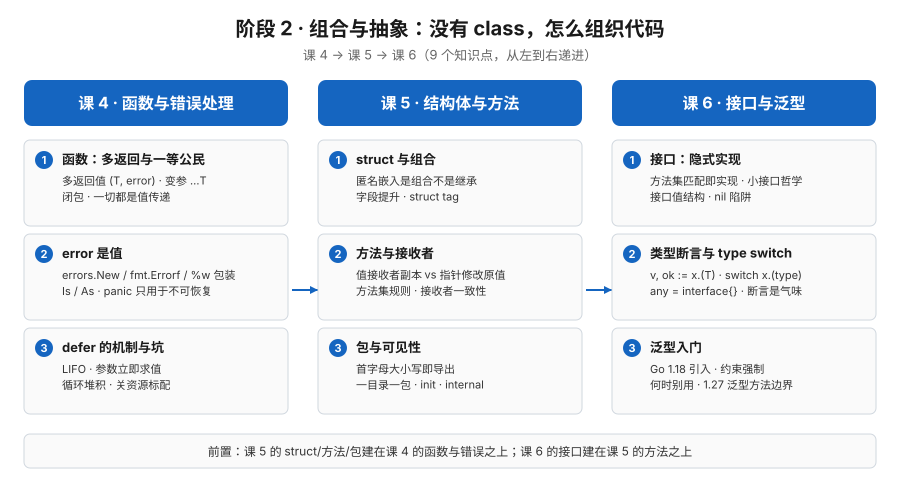

# 阶段 2 概览：组合与抽象

> 所属课程：Go 语言系统学习 ｜ 故事章节：没有 class，怎么组织代码 ｜ 课程起点：[学习路径总览](../../01-学习路径总览.md)

## 🎯 本阶段目标

- 接受"没有 class、没有继承、没有异常"，学会用**组合**、**方法**与**包**来组织代码，而不是靠对象继承树。
- 学会把错误当值处理而不是抛异常：多返回值带 error、用 `errors.Is`/`errors.As` 判断包装过的错误、用 `defer` 管资源。
- 理解接口为什么是**隐式实现**、什么时候该上泛型、什么时候不该上，能按"小接口 + 恰当抽象"组织出可读、可扩展的下单模块骨架。

## 📍 学习重点

- 函数是一等公民、多返回值 `(T, error)`，以及"一切都是值传递"对切片与 map 的真实含义。
- `error` 是一个值而非异常：`%w` 包装、`errors.Is`/`errors.As`，`panic`/`recover` 的边界。
- `defer` 的机制与坑：LIFO、参数立即求值、循环里攒到函数返回、与命名返回值互动。
- struct 匿名嵌入是**组合不是继承**、值接收者 vs 指针接收者、首字母大小写即导出、接口隐式实现与 nil 陷阱、泛型的约束强制与适用边界。

## ✅ 必须掌握的知识点

| 知识点 | 所属课 | 学完应能 |
|--------|--------|----------|
| 函数：多返回值与一等公民 | 课 4 | 写多返回值与变参函数，把函数当值传递与闭包，说清"一切都是值传递"下切片与 map 的语义 |
| error 是值 | 课 4 | 用 `errors.New`/`fmt.Errorf` 造错、用 `%w`+`errors.Is`/`As` 判断包装错误，说清何时才用 `panic`/`recover` |
| defer 的机制与坑 | 课 4 | 说清 defer 的 LIFO、参数立即求值、循环里堆积的问题，会用 defer 规范地关资源 |
| struct 与组合 | 课 5 | 定义 struct 与字面量，用匿名嵌入做组合（非继承）并利用字段提升，会写与解读 struct tag |
| 方法与接收者 | 课 5 | 区分值接收者与指针接收者，说清方法集规则与选择惯例，判断何时该用哪种接收者 |
| 包与可见性 | 课 5 | 用首字母大小写控制导出，遵守"一个目录一个包"，说清 `init` 时机与 `internal` 约束 |
| 接口：隐式实现 | 课 6 | 不写 `implements` 就实现接口，按小接口哲学设计抽象，说清接口值结构与 nil 陷阱 |
| 类型断言与 type switch | 课 6 | 用 comma-ok 形式安全断言、用 type switch 分流，理解 `any` 是 `interface{}` 别名并警惕断言气味 |
| 泛型入门 | 课 6 | 用类型参数与强制约束写容器/工具函数，判断何时不该用泛型，知道 Go 1.27 泛型方法边界 |

## 🗺️ 本阶段路径图

## 本阶段产出

- [x] [`lessons/lesson-04-函数与错误处理.md`](lessons/lesson-04-函数与错误处理.md)（2026-09-06）
- [x] [`lessons/lesson-05-结构体与方法.md`](lessons/lesson-05-结构体与方法.md)（2026-09-07）
- [x] [`lessons/lesson-06-接口与泛型.md`](lessons/lesson-06-接口与泛型.md)（2026-09-07）

> ✅ **阶段 2 已闭环（9 / 45 知识点 → 累计 18 / 45）**，2026-09-07。
> 下一阶段：阶段 3《并发模型》，第一课就会起 goroutine。
