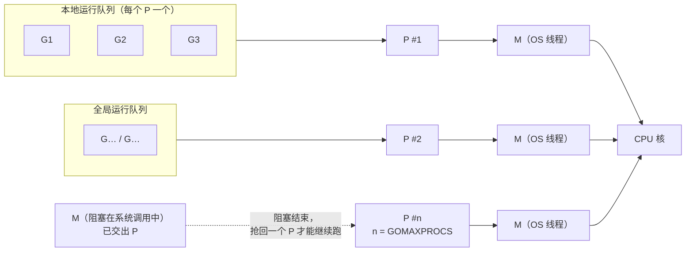
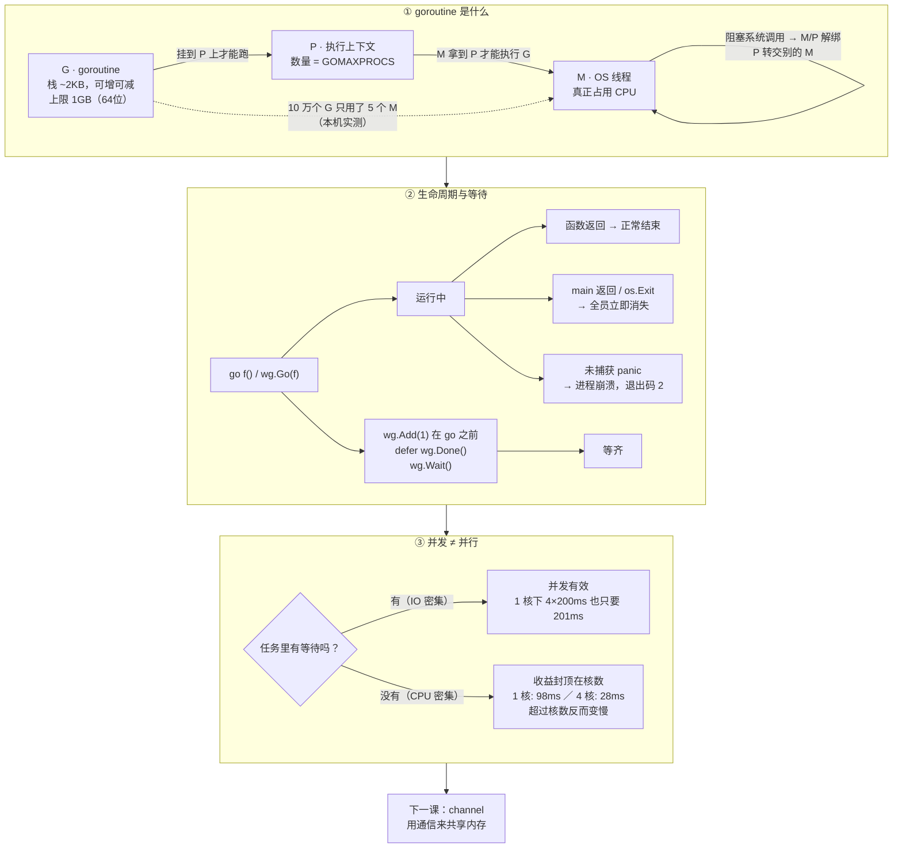

# 课 7：goroutine——廉价的并发单位

> 所属阶段：并发模型 ｜ 故事章节：goroutine 不是免费的 ｜ 状态：✅ 已完成（2026-09-08 ｜ 本机实测 go1.27.1 darwin/arm64）

## 🎯 本课目标

- 学完能说清 goroutine 与 OS 线程在量级上的差别（栈几 KB、可动态增长收缩、同一地址空间可建数十万个），并建立 GMP 运行时的直觉。
- 学完能用 `go f()` / `wg.Go()` 起 goroutine、用 `sync.WaitGroup` 等待它们收尾，并说清"main 返回即整个程序结束"这一易踩的坑。
- 学完能分清"并发"与"并行"是两回事，能解释 `GOMAXPROCS`、CPU 密集与 IO 密集场景各自的含义。

## 📍 本课在故事主线中的情节定位

小谷重写的下单接口在压测时一上来就崩——他心里闪过一个念头："Python 起线程成本高，那我换成 Go 的 goroutine 是不是就随便起、尽情并发？"这一课他要先弄清楚 goroutine 到底"便宜"在哪、是怎么调度起来的，以及用它有什么约束。他会亲手把一个串行版本的接口改成并发跑，结果发现 main 一返回进程就没了，第一次真切体会到"Go 里几乎没有东西是免费送的"。

## 📌 知识点导航

| # | 知识点 | 关键点 | 状态 |
|---|--------|--------|------|
| 1 | goroutine 是什么 | ①与 OS 线程的量级差：**栈只有几 KB** 且可动态增长收缩（官方：创建数十万个在同一地址空间是可行的）②GMP 直觉：G（协程）/ M（OS 线程）/ P（处理器）③阻塞的系统调用发生时，运行时会把同一个 M 上的其他 G 挪到别的线程 ④goroutine 没有 ID、没有名字，官方刻意如此 | ✅ 已完成 |
| 2 | 生命周期与等待 | ①`go f()` 一行启动（Go 1.25 起另有 `wg.Go(f)`）②**main 返回即整个程序结束，不会等其他 goroutine** ③`sync.WaitGroup`（Add / Done / Wait）④Go **1.22 起** `for range` 循环变量每轮都是新变量，闭包捕获的经典 `c,c,c` 问题已消失（由 go.mod 的 go 指令门控） | ✅ 已完成 |
| 3 | 并发 ≠ 并行 | ①并发是"同时应对多件事"、并行是"同时做多件事" ②`GOMAXPROCS` 限制的是**可同时执行用户级 Go 代码的 OS 线程数**（不是 goroutine 数）③CPU 密集 vs IO 密集：前者受核数限制，后者靠并发吞吐 ④加 CPU 未必更快，同步与通信的开销可能反超 | ✅ 已完成 |

---

# 第一幕 · 起源与场景引入：线程太贵了

小谷在 Python 里写过这样的代码：一个请求要并发调用 5 个下游服务，就开 5 个线程。上线后发现，线程数一上千，内存就爆、调度就抖。他后来学到原因：**主流语言里的"线程"就是操作系统的线程**，一个 `Thread` 对象对应内核里一个真实的调度实体，栈通常预留 MB 级，创建/销毁都要进内核。

Go 的回答是：**不让程序员直接面对 OS 线程，而是提供一层更轻的"协程"，由运行时把它 multiplex（多路复用）到一小撮 OS 线程上。**

官方 FAQ 里 [Why goroutines instead of threads?](https://go.dev/doc/faq#goroutines) 这段是这么说的（核查于 2026-09）：

> The idea, which has been around for a while, is to multiplex independently executing functions—coroutines—onto a set of threads. When a coroutine blocks, such as by calling a blocking system call, the run-time automatically moves other coroutines on the same operating system thread to a different, runnable thread so they won't be blocked. The programmer sees none of this, which is the point.

关于"便宜"到什么程度，同一节给了三个可引用的数字：

> The result, which we call goroutines, can be very cheap: they have little overhead beyond the memory for the stack, which is **just a few kilobytes**.

> To make the stacks small, Go's run-time uses **resizable, bounded stacks**. A newly minted goroutine is given a few kilobytes, which is almost always enough. When it isn't, the run-time **grows (and shrinks)** the memory for storing the stack automatically.

> **It is practical to create hundreds of thousands of goroutines in the same address space.** If goroutines were just threads, system resources would run out at a much smaller number.

这三句话就是本课知识点 1 的骨架。但"官方说"和"我的机器上真的是这样"是两件事——第四幕我们会一条一条实测。

---

# 第二幕 · 认知冲突：三个"我以为"

小谷带着三个直觉冲进了 goroutine，三个都撞了墙。

**撞墙 1："起了 goroutine 它就会跑完。"**

他兴冲冲写下：起 3 个校验 goroutine，然后 main 直接返回。结果——**一个都没跑完，程序还"成功"退出了**。

**撞墙 2："并发就是并行，多起几个就快。"**

他把下单接口的 5 个串行校验改成 5 个 goroutine，耗时从 814ms 掉到 201ms，爽。但当他把这个"套路"搬到一段纯计算上时，**加 goroutine 一点用都没有**。

**撞墙 3："goroutine 是免费的，随便起。"**

10 万个 goroutine 确实起得来，但"起得来"不等于"该这么写"。每个 goroutine 仍然占着 2 KB 栈、仍然要被调度、仍然可能泄漏。

这一课就是把这三堵墙拆掉：**goroutine 便宜，但便宜不等于免费；它给你的是"并发地组织工作"的能力，不是"凭空多出 CPU"。**

---

# 第三幕 · 层层揭示

## 知识点 1：goroutine 是什么

### ① 一句话定义

> goroutine 是 Go 运行时管理的**用户态协程**：它由 `go` 语句创建，初始栈只有几 KB 且可自动增长收缩，由运行时多路复用到一小撮 OS 线程上执行。

### ② 直觉建立（类比 + 类比失效边界）

**类比：餐厅的"桌"与"服务员"。**

- OS 线程 = 服务员。雇一个贵（栈 MB 级、要进内核登记），人多了互相挤，但**只有服务员能真正端菜**（在 CPU 上执行指令）。
- goroutine = 餐桌上的订单。开一单几乎不要钱（几 KB 栈），可以开几十万单。
- 运行时 = 领班。它把订单分配给空闲的服务员；某桌在等厨房出菜（阻塞），服务员**不会傻站着等**，而是去服务别的桌。

**这个类比在三个地方会失效，必须提前说清：**

1. **失效点 A：订单不会"消失"，但 goroutine 会。** 程序一结束，所有 goroutine 立刻被抹掉，没有"做完手上的活"这回事（撞墙 1）。
2. **失效点 B：服务员数量是固定的。** 你的机器有 11 个核，就最多 11 个服务员同时端菜。开 10 万单不会让你拥有 10 万个服务员（撞墙 2）。
3. **失效点 C：goroutine 没有"桌号"。** 官方**故意不给你 ID**（见 ④），你没法点名让某一单怎么样——想交互，用 channel（课 8 的主角）。

### ③ 核心原理：GMP 到底在干什么

Go 运行时用三个字母描述调度：**G / M / P**。

| 字母 | 全称 | 是什么 | 关键约束 |
|------|------|--------|----------|
| **G** | goroutine | 一段待执行的函数 + 它的栈 + 状态。**存在于用户态** | 数量可到数十万 |
| **M** | machine | 一个**真实的 OS 线程**。真正被操作系统调度、真正占用 CPU 的东西 | 阻塞在系统调用里的 M **不计入** `GOMAXPROCS` 限制 |
| **P** | processor | 一个**执行上下文（令牌）**。G 必须"挂"在某个 P 上才能被 M 执行 | P 的数量 = `GOMAXPROCS` |

一句话：**M 想执行 G，必须先拿到 P。所以同一时刻最多有 `GOMAXPROCS` 个 G 在真正地跑。**



**关键机制：阻塞时会发生什么？**

这正是官方 FAQ 那句话的落点。当一个 G 在 M 上发起**阻塞的系统调用**时，运行时会把这个 M 和它的 P **解绑（handoff）**，让 P 去绑定另一个 M（新建或复用空闲线程），继续跑队列里的其他 G。阻塞结束后，那个 G 要重新抢到一个 P 才能继续。

> ⚠️ 注意：Go 里**大部分**"阻塞"其实不走这条路。`time.Sleep`、网络读写、channel 收发走的是 **netpoller**（kqueue/epoll），goroutine 会被 parked 而**不占用任何线程**——这是 Go 高并发网络服务的真正底牌（阶段 4 会见）。本知识点说的是**真正的内核阻塞系统调用**（文件 IO、`syscall.*`、cgo 调用等）。

**goroutine 的栈：小 + 可伸缩 + 有界**

- **小**：初始几 KB（本机实测约 2 KB，见 ④）。
- **可伸缩**：不够用时运行时**拷贝式扩容**（分配更大的栈，把旧栈拷过去，修正指针）。空闲时也会在 GC 时**收缩**。
- **有界**：不是无限长。运行时源码 `runtime/proc.go` 里写死（本机 Go 1.27.1 源码实测）：

```go
// Max stack size is 1 GB on 64-bit, 250 MB on 32-bit.
if goarch.PtrSize == 8 {
    maxstacksize = 1000000000
} else {
    maxstacksize = 250000000
}
```

也就是说：单个 goroutine 的栈**上限是 1 GB**（64 位）。超了就是 `fatal error: stack overflow`，而且**不可 recover**。

### ④ 示例演示（本机实测）

**演示 1-A：10 万个 goroutine 到底多贵**

```go
package main

import (
	"fmt"
	"runtime"
	"sync"
	"time"
)

// 探针 3：goroutine 的创建成本与单个栈占用
func main() {
	var before, after runtime.MemStats
	runtime.ReadMemStats(&before)

	const n = 100000
	release := make(chan struct{})
	var wg sync.WaitGroup
	wg.Add(n)

	startG := runtime.NumGoroutine()
	start := time.Now()
	for i := 0; i < n; i++ {
		go func() {
			defer wg.Done()
			<-release // 全部阻塞在这里，保持存活
		}()
	}
	spawn := time.Since(start)

	runtime.GC()
	runtime.ReadMemStats(&after)

	fmt.Printf("机器逻辑核数        : %d\n", runtime.NumCPU())
	fmt.Printf("GOMAXPROCS 默认值   : %d\n", runtime.GOMAXPROCS(0))
	fmt.Printf("启动前 NumGoroutine : %d\n", startG)
	fmt.Printf("启动后 NumGoroutine : %d\n", runtime.NumGoroutine())
	fmt.Printf("启动 %d 个 goroutine 耗时: %v（平均 %v/个）\n", n, spawn, spawn/n)
	fmt.Printf("StackInuse 增量     : %.2f MB（平均 %.0f 字节/个）\n",
		float64(after.StackInuse-before.StackInuse)/1024/1024,
		float64(after.StackInuse-before.StackInuse)/n)
	fmt.Printf("Sys 内存增量        : %.2f MB（平均 %.0f 字节/个）\n",
		float64(after.Sys-before.Sys)/1024/1024,
		float64(after.Sys-before.Sys)/n)

	close(release)
	wg.Wait()
	runtime.GC()
	runtime.ReadMemStats(&after)
	fmt.Printf("全部退出后 NumGoroutine: %d，StackInuse: %.2f MB\n",
		runtime.NumGoroutine(), float64(after.StackInuse)/1024/1024)
}
```

实测输出（Apple M3 Pro / 11 核 / go1.27.1 darwin/arm64）：

```console
机器逻辑核数        : 11
GOMAXPROCS 默认值   : 11
启动前 NumGoroutine : 1
启动后 NumGoroutine : 100001
启动 100000 个 goroutine 耗时: 80.518333ms（平均 805ns/个）
StackInuse 增量     : 195.59 MB（平均 2051 字节/个）
Sys 内存增量        : 269.14 MB（平均 2822 字节/个）
全部退出后 NumGoroutine: 1，StackInuse: 3.00 MB
```

**怎么读这组数字：**

| 数字 | 含义 |
|------|------|
| `805 ns/个` | 起一个 goroutine 约 **0.8 微秒**。换成速率：1 秒 ÷ 805ns ≈ **每秒能起 124 万个**（由实测值直接换算；当然栈内存会先撑不住） |
| `2051 字节/个` | 栈区实际占用 **约 2 KB/个**——这就是 FAQ 说的 "a few kilobytes" 的实测值 |
| `2822 字节/个` | 含其他运行开销（G 结构体、调度元数据、内存分配器粒度）后的系统内存增量 |
| `195.59 MB` | 10 万个 goroutine 总共吃掉约 **196 MB** 栈内存 |
| 退出后 `3.00 MB` | goroutine 全部退出后栈内存被回收 |

**同样 10 万个 OS 线程会怎样？** 按常见的 1 MB 线程栈预留粗算就是 **100 GB**——这就是 FAQ 那句 "system resources would run out at a much smaller number" 的意思。（⚠️ 这一条是**按 1 MB/线程假设的推算**，不是本机实测；不同平台默认线程栈不同，仅用于量级对比。）

**演示 1-B：10 万个 goroutine 用了几个 OS 线程？**

```go
func threads() int { return pprof.Lookup("threadcreate").Count() }
```

用 `runtime/pprof` 的 `threadcreate` 采样能看到运行时**当前存活的 OS 线程数**：

```console
① 起始：goroutine=1  OS线程(当前存活)=5
② 起 100000 个 goroutine 后：goroutine=100001  OS线程(当前存活)=5
③ 再加 20 个阻塞在读管道上的 goroutine：goroutine=100021  OS线程(当前存活)=5
④ 全部退出：goroutine=1  OS线程(当前存活)=5
```

**goroutine 从 1 涨到 100001，OS 线程一个都没多。** 这就是 M:N 复用的直接证据：G 的数量和 M 的数量完全解耦。

> 📖 这个 `5` 是怎么来的：`pprof.Lookup("threadcreate").Count()` 底层走 `runtime.ThreadCreateProfile`，而它的实现是**遍历运行时内部的 `allm` 链表**（本机源码 `runtime/mprof.go`：`for mp := first; mp != nil; mp = mp.alllink { n++ }`）。所以它统计的是**当前存活的 M（OS 线程）数**，不是"累计创建过多少"。别把它当累计值读。

**演示 1-C：栈真的会增长、也会收缩吗？**

让一个 goroutine 递归 5000 层，每层占 1 KB 局部变量（需要约 5 MB 栈），在到达底部 / 退出后分别测 `StackInuse`：

```console
① 起始                  StackInuse = 0.25 MB
② 递归到 5000 层（需~5MB）StackInuse = 8.25 MB
③ goroutine 结束后 + GC   StackInuse = 0.38 MB
```

一开始 0.25 MB → 峰值 8.25 MB（远超初始的几 KB，说明**增长了**）→ GC 后回落到 0.38 MB（说明**收缩了**）。"可增长可收缩"不是口号，是可测的。

**演示 1-D：阻塞的系统调用真的不占死 P 吗？**

把 `GOMAXPROCS` 设成 **1**（只有 1 个 P），让一个 goroutine 阻塞在原始的 `syscall.Read` 上，另一个 goroutine 纯 CPU 计数：

```console
① 起始：OS线程(当前存活)=5
② 阻塞中：OS线程(当前存活)=5，CPU goroutine 已跑 88732119 次
③ 解除阻塞：OS线程(当前存活)=5
```

300ms 内 CPU goroutine 跑了 **约 8900 万次**循环（这个数每次跑都会波动，量级稳定在千万级）。如果那个唯一的 P 被阻塞的 goroutine 占死了，这个数会是 0。**P 被交出去了。**

**演示 1-E：真阻塞会催生新线程，channel 阻塞不会**

这是两组最容易搞混的"阻塞"。用同一个 `threads()` 观察：

```console
$ go run ./verify/p13_threads_scale.go
① 起始：OS线程=5
② 8 个 goroutine 阻塞在 read(2) 后：OS线程=10
③ 全部解除阻塞后：OS线程=11
```

对照总结：

| 阻塞在哪 | OS 线程数变化 | 原因 |
|----------|--------------|------|
| 10 万个 goroutine 阻塞在 **channel** 上 | 5 → **5** | 阻塞的 G 只是被 parked，不占用任何线程 |
| 8 个 goroutine 阻塞在 **原始 read(2) 系统调用** 上 | 5 → **10** | M 被卡在系统调用里出不来，运行时**新建 M** 来接手 P |

**所以"阻塞不产生线程"这句话是有前提的**：Go 自己的同步原语（channel、Sleep、netpoller 管的网络 IO）不产生线程；**真正的内核阻塞系统调用会**。这也是为什么 cgo 调用、阻塞式文件 IO 特别吃线程——一个 goroutine 卡住就带走一个 M。

> 💡 一个容易踩的小坑：我用 `os.Pipe()` 做的第一版这个实验里，线程数始终不变、`read` 也没真的阻塞——因为 `os` 包会把 fd 设成非阻塞并交给 netpoller。**要造真正的阻塞系统调用，得用 `syscall` 包的原始 fd。** 这个区别本身也很重要：日常写 Go 时你几乎遇不到真阻塞，因为标准库已经帮你绕开了。

<details>
<summary><b>🧪 演示 1-B / 1-C / 1-D / 1-E 的完整探针源码</b>（点开可复现上面四组输出）</summary>

**1-B：goroutine 数与 OS 线程数解耦**

```go
package main

import (
	"fmt"
	"os"
	"runtime"
	"runtime/pprof"
	"sync"
)

func threads() int {
	return pprof.Lookup("threadcreate").Count()
}

func main() {
	runtime.GOMAXPROCS(1) // 故意只给 1 个 P
	fmt.Printf("① 起始：goroutine=%d  OS线程(当前存活)=%d\n", runtime.NumGoroutine(), threads())

	const n = 100000
	release := make(chan struct{})
	var wg sync.WaitGroup
	wg.Add(n)
	for i := 0; i < n; i++ {
		go func() { defer wg.Done(); <-release }()
	}
	fmt.Printf("② 起 %d 个 goroutine 后：goroutine=%d  OS线程(当前存活)=%d\n",
		n, runtime.NumGoroutine(), threads())

	// 再起 20 个真的阻塞在 read(2) 上的 goroutine
	r, w, _ := os.Pipe()
	for i := 0; i < 20; i++ {
		wg.Add(1)
		go func() {
			defer wg.Done()
			buf := make([]byte, 1)
			r.Read(buf)
		}()
	}
	fmt.Printf("③ 再加 20 个阻塞在读管道上的 goroutine：goroutine=%d  OS线程(当前存活)=%d\n",
		runtime.NumGoroutine(), threads())

	close(release)
	w.Close() // 关闭写端，20 个 read 全部返回 EOF
	wg.Wait()
	fmt.Printf("④ 全部退出：goroutine=%d  OS线程(当前存活)=%d\n", runtime.NumGoroutine(), threads())
}
```

**1-C：栈会增长也会收缩**

```go
package main

import (
	"fmt"
	"runtime"
	"time"
)

var bottom = make(chan struct{})
var release = make(chan struct{})

// 每一帧占用 1 KB 栈
func deep(d int, pad [1024]byte) {
	if d == 0 {
		close(bottom)
		<-release
		return
	}
	pad[0] = byte(d)
	deep(d-1, pad)
}

func stackInuseMB() float64 {
	var m runtime.MemStats
	runtime.ReadMemStats(&m)
	return float64(m.StackInuse) / 1024 / 1024
}

func main() {
	fmt.Printf("① 起始                  StackInuse = %.2f MB\n", stackInuseMB())

	done := make(chan struct{})
	go func() {
		deep(5000, [1024]byte{}) // 需要约 5 MB 栈
		close(done)
	}()

	<-bottom
	fmt.Printf("② 递归到 5000 层（需~5MB）StackInuse = %.2f MB\n", stackInuseMB())

	close(release)
	<-done

	// 栈会在 GC 时收缩，这里手动触发两次
	runtime.GC()
	time.Sleep(50 * time.Millisecond)
	runtime.GC()
	fmt.Printf("③ goroutine 结束后 + GC   StackInuse = %.2f MB\n", stackInuseMB())
}
```

**1-D：阻塞的系统调用不占死 P**

```go
package main

import (
	"fmt"
	"runtime"
	"runtime/pprof"
	"sync/atomic"
	"syscall"
	"time"
)

func threads() int { return pprof.Lookup("threadcreate").Count() }

func main() {
	runtime.GOMAXPROCS(1) // 只有一个 P

	var fds [2]int
	if err := syscall.Pipe(fds[:]); err != nil {
		panic(err)
	}
	fmt.Printf("① 起始：OS线程(当前存活)=%d\n", threads())

	unblocked := make(chan struct{})
	// G1：阻塞在原始 read(2) 上（syscall 包的 fd 是阻塞的，不走 netpoller）
	go func() {
		buf := make([]byte, 1)
		syscall.Read(fds[0], buf)
		close(unblocked)
	}()

	// G2：纯 CPU 计数
	var ticks int64
	stop := make(chan struct{})
	go func() {
		for {
			select {
			case <-stop:
				return
			default:
				atomic.AddInt64(&ticks, 1)
			}
		}
	}()

	time.Sleep(300 * time.Millisecond)
	fmt.Printf("② 阻塞中：OS线程(当前存活)=%d，CPU goroutine 已跑 %d 次\n",
		threads(), atomic.LoadInt64(&ticks))

	close(stop)
	syscall.Write(fds[1], []byte("x"))
	<-unblocked
	fmt.Printf("③ 解除阻塞：OS线程(当前存活)=%d\n", threads())
}
**1-E：真阻塞会催生新线程，channel 阻塞不会**

```go
package main

import (
	"fmt"
	"runtime"
	"runtime/pprof"
	"syscall"
	"time"
)

func threads() int { return pprof.Lookup("threadcreate").Count() }

func main() {
	runtime.GOMAXPROCS(1)
	fmt.Printf("① 起始：OS线程=%d\n", threads())

	// 8 个 goroutine，各自阻塞在原始 read(2) 上
	var writers []int
	for i := 0; i < 8; i++ {
		var fds [2]int
		syscall.Pipe(fds[:])
		writers = append(writers, fds[1])
		go func(r int) {
			buf := make([]byte, 1)
			syscall.Read(r, buf) // 真正的阻塞系统调用
		}(fds[0])
	}

	time.Sleep(300 * time.Millisecond)
	fmt.Printf("② 8 个 goroutine 阻塞在 read(2) 后：OS线程=%d\n", threads())

	for _, w := range writers {
		syscall.Write(w, []byte("x"))
	}
	time.Sleep(300 * time.Millisecond)
	fmt.Printf("③ 全部解除阻塞后：OS线程=%d\n", threads())
}
```
</details>

### ⑤ 常见误区（知识点 1）

| 误区 | 真相 |
|------|------|
| "goroutine 是轻量级线程" | 严格说不是。它是**用户态协程**，被复用到线程上。线程是 M，goroutine 是 G |
| "栈是 2 KB 固定大小" | 初始约 2 KB，**可增长到 1 GB**（64 位），也会在 GC 时收缩 |
| "goroutine 没有开销" | 栈 ~2 KB + 调度成本 ~0.8 µs + **泄漏后永不释放**。便宜 ≠ 免费 |
| "阻塞会占住一个线程" | 真阻塞时 M 和 P 会解绑；而 Go 里大部分阻塞（网络、Sleep、channel）走 netpoller，**连线程都不占** |
| "能给 goroutine 起名字 / 拿 ID" | 不能，官方刻意不提供（见 ④ 补充）。要交互用 channel |

### ⑥ 一句话记住

> **goroutine 是"几 KB 栈、可被运行时复用到少量 OS 线程上的匿名工作单元"——便宜在栈和调度，贵在你要自己负责让它结束。**

### 📚 官方文档

- [Go FAQ · Why goroutines instead of threads?](https://go.dev/doc/faq#goroutines)（核查于 2026-09）
- [Go FAQ · Why is there no goroutine ID?](https://go.dev/doc/faq#no_goroutine_id)（核查于 2026-09）
- [pkg.go.dev · runtime.NumGoroutine](https://pkg.go.dev/runtime#NumGoroutine)
- 本地源码：`$(go env GOROOT)/src/runtime/proc.go`（`maxstacksize` 定义处）

**关于"没有 ID"，官方 FAQ 的原话**（核查于 2026-09）：

> Goroutines do not have names; they are just anonymous workers. They expose no unique identifier, name, or data structure to the programmer. … The fundamental reason goroutines are anonymous is **so that the full Go language is available when programming concurrent code**.

官方还举了个很实在的例子：如果 `net/http` 把"每请求状态"绑死在某个 goroutine 上，那么客户端就没法在处理一个请求时再开更多 goroutine 了。**匿名换来的是自由。**

---

## 知识点 2：生命周期与等待

### ① 一句话定义

> 用 `go f()`（或 Go 1.25 起的 `wg.Go(f)`）启动一个 goroutine；它**没有句柄、没有 ID、无法被外部停止**；**main goroutine 返回时整个进程立即结束**，所有 goroutine 一并消失——所以要等，就得自己用 `sync.WaitGroup` 或 channel 协调。

### ② 直觉建立（类比 + 类比失效边界）

**类比：放鸽子。**

`go f()` 就像把一封信绑在鸽子腿上放飞——**你手上没有任何东西**（没有返回值、没有句柄），你既不知道它飞到哪了，也没法把它叫回来。想"知道它到了"，只能事先约定一个汇合点：**WaitGroup 是"在门口点名"，channel 是"等你回信"**。

**失效边界：**

1. **"点了名就一定等到了"？** 不一定——如果你把点名（`Add`）写在了鸽子起飞之后，点名可能在鸽子出发前就结束了（见 ⑤）。
2. **"等到了就安全了"？** `Wait` 返回只保证"它们都执行完了"，**不保证共享变量没有数据竞争**。等待 ≠ 同步。

### ③ 核心原理

**启动：`go` 语句**

```go
go f()          // 函数
go func(){...}() // 匿名函数（最常见）
```

`go` 语句**立即返回**，不等待。传给 `go` 的函数参数**在 `go` 语句执行时就被求值**（这是和 `defer` 一样的规则，课 4 讲过）：

```go
i := 1
go fmt.Println(i)  // 这里 i 的值（1）立刻被拷贝
i = 2              // 之后再改不影响 goroutine 里已经求好的值
```

**结束：三种**

| 结束方式 | 说明 |
|----------|------|
| 函数正常返回 | 最常见 |
| 整个程序结束 | **main 返回 / `os.Exit` → 所有 goroutine 立即消失** |
| 未捕获 panic | 整个进程崩溃（退出码 2），**同进程内所有 goroutine 一起完蛋** |

**等待：`sync.WaitGroup`**

三个方法，一个计数器：

| 方法 | 作用 | 纪律 |
|------|------|------|
| `Add(n)` | 计数器 +n | **必须在 `go` 语句之前调用** |
| `Done()` | 计数器 -1 | 惯例写 `defer wg.Done()`，panic 时也计数 |
| `Wait()` | 阻塞直到计数器归零 | 通常写在启动方 |

**Go 1.25 新增：`wg.Go(f)`**（核查于 2026-09，pkg.go.dev 标注 `added in go1.25.0`）。它把 `Add(1)` + `go func(){ defer Done(); f() }()` 打包成一个调用，官方现在的口径是 **"Callers should prefer WaitGroup.Go"**。

本机 Go 1.27.1 源码里它的实现是：

```go
func (wg *WaitGroup) Go(f func()) {
	wg.Add(1)
	go func() {
		defer func() {
			if x := recover(); x != nil {
				// f panicked, which will be fatal because
				// this is a new goroutine.
				// ... instead avoid calling Done and simply panic.
				panic(x)
			}
			wg.Done()
		}()
		f()
	}()
}
```

注意那个 `recover`：**如果 f panic 了，它不会调用 `Done`，而是直接重新 panic**。因为如果调了 `Done`，`Wait` 就可能在这个致命 panic 完成之前返回，让程序"正常"退出、掩盖了崩溃。文档也明确写了 "The function f must not panic."

**WaitGroup 的三条硬规矩**（来自官方文档原文）：

> A WaitGroup must not be copied after first use.
>
> Note that calls with a positive delta that occur when the counter is zero **must happen before a Wait**. … If a WaitGroup is reused to wait for several independent sets of events, new Add calls must happen after all previous Wait calls have returned.

**Go 1.22 的循环变量语义：经典 `c,c,c` 坑已填**

Go 1.22 之前，`for` 循环的循环变量是**整个循环共用一个变量**，所以所有 goroutine 闭包捕获的是同一个 `v`，等它们真正跑起来时 `v` 早就变成最后一个值了 —— 于是打印出 `c, c, c`。老代码靠 `v := v` 手动拷贝来绕。

Go 1.22 起改成**每轮迭代都是新变量**。官方博客 [Fixing For Loops in Go 1.22](https://go.dev/blog/loopvar-preview) 原文（核查于 2026-09）：

> For Go 1.22, we plan to change `for` loops to make these variables have **per-iteration scope** instead of per-loop scope. … To ensure backwards compatibility with existing code, the new semantics will only apply in packages contained in modules that declare **`go 1.22` or later in their `go.mod` files**.

**关键：这是按模块门控的，不是按编译器版本门控的。** 你用 Go 1.27 编译，只要 go.mod 里写的是 `go 1.21`，旧语义照样生效——第四幕我们会用同一份源码跑出 `[c c c]` 和 `[a b c]` 两个结果。

### ④ 示例演示（本机实测）

见第四幕实操 1 与实操 2（那里有完整可运行代码和输出）。这里先给一条最小对照：

```go
// 起了就不管：main 一返回，进程结束，goroutine 全部消失
for i := 1; i <= 3; i++ {
    go func(id int) { time.Sleep(200*time.Millisecond); fmt.Printf("校验 %d 完成\n", id) }(i)
}
fmt.Println("main：我返回了")   // ← 只会看到这一行
```

### ⑤ 常见误区（知识点 2）

| 误区 | 真相 |
|------|------|
| "起了 goroutine，程序会等它跑完" | **不会**。main 返回，进程立即结束 |
| `wg.Add(1)` 写在 goroutine 内部 | 错。可能 `Wait` 早就返回了，活白干（第四幕有实测） |
| `wg.Done()` 忘了写 | `Wait` **永久阻塞**（不是报错，是卡死） |
| `wg.Done()` 多写一次 | `panic: sync: negative WaitGroup counter`（本机实测） |
| 把 WaitGroup 当参数**值传递** | 会复制。`A WaitGroup must not be copied after first use`，要传 `*sync.WaitGroup` |
| `Wait()` 返回就代表数据同步好了 | 只代表**执行完了**。共享变量仍需锁 / channel（课 8–9） |
| Go 1.22 之后就不用担心循环变量了 | 取决于 **go.mod 里的 go 指令**，不是你装的 Go 版本 |

### ⑥ 一句话记住

> **`go` 出去的 goroutine 没有句柄、没有回收站；main 一走全剧终。想等它，要么 `wg.Go(f)` + `wg.Wait()`，要么用 channel——别指望运行时帮你收尾。**

### 📚 官方文档

- [pkg.go.dev · sync.WaitGroup](https://pkg.go.dev/sync#WaitGroup)（含 `Go` 方法，`added in go1.25.0`，核查于 2026-09）
- [Go Blog · Fixing For Loops in Go 1.22](https://go.dev/blog/loopvar-preview)（核查于 2026-09）
- [Go FAQ · What happens with closures running as goroutines?](https://go.dev/doc/faq#closures_and_goroutines)

---

## 知识点 3：并发 ≠ 并行

### ① 一句话定义

> **并发（concurrency）**是"同时**应对**多件事"——结构上把工作拆成可独立推进的部分；**并行（parallelism）**是"同时**做**多件事"——物理上有多个 CPU 核在同一时刻执行。并发是代码组织方式，**并行是硬件能力**，并发的代码未必并行执行。

### ② 直觉建立（类比 + 类比失效边界）

**类比：一个人做饭 vs 两个人做饭。**

- **并发**：一个厨师同时看着汤、切着菜、等烤箱。他在**多件事之间切换**，任何一瞬间他只做一件事，但整体进度在同时推进。
- **并行**：两个厨师，一个切菜一个看汤，同一瞬间真的有两件事在被做。

**失效边界：**

1. **不是所有"多件事"都能并行。** 如果两件事有严格先后依赖（先烧水才能下面），再多厨师也没用——这是 **Amdahl 定律**的直觉版。
2. **并发在单核上也有价值**，但只限于"有等待"的场景。如果每件事都在死磕 CPU（没有任何等待），单核上开并发**只会更慢**（多了切换开销）。

### ③ 核心原理

**`GOMAXPROCS` 到底限制什么？**

⚠️ 这里有个流传很广的说法是错的。常见（不准确）说法："GOMAXPROCS 限制同时执行的 goroutine 数"。**官方文档不是这么写的。**

`runtime` 包文档原文（核查于 2026-09，go1.27.1）：

> The GOMAXPROCS variable limits **the number of operating system threads that can execute user-level Go code simultaneously**. There is no limit to the number of threads that can be blocked in system calls on behalf of Go code; **those do not count against the GOMAXPROCS limit**.

以及函数文档：

> GOMAXPROCS sets the maximum number of **CPUs that can be executing simultaneously** and returns the previous setting. If n < 1, it does not change the current setting.

所以准确说法是：**`GOMAXPROCS` 限制的是"能同时执行用户级 Go 代码的 OS 线程数"（＝P 的数量）；由此间接决定了最多有多少个 goroutine 能真正并行跑。goroutine 的创建数量不受它限制。**

**默认值是多少？**（Go 1.27 文档原文，核查于 2026-09）

> If the GOMAXPROCS environment variable is set to a positive whole number, GOMAXPROCS defaults to that value.
>
> Otherwise, the Go runtime selects an appropriate default value from a combination of
> - the number of logical CPUs on the machine,
> - the process's CPU affinity mask,
> - and, on Linux, the process's average CPU throughput limit based on cgroup CPU quota, if any.

**注意：Go 1.25 起默认值是"容器感知"的**，不再简单等于 `NumCPU()`。在 Linux cgroup 里，它会取 `cpu.max`（v2）或 `cpu.cfs_quota_us / cpu.cfs_period_us`（v1）算出的 CPU 配额，并取三者最小值；而且**每秒最多自动更新一次**，用 `GOMAXPROCS` 环境变量或函数显式设置后会**关闭自动更新**（可用 `SetDefaultGOMAXPROCS` 恢复，该函数 `added in go1.25.0`）。

本机是 macOS（无 cgroup），所以实测默认值 = 逻辑核数 = **11**。

**CPU 密集 vs IO 密集**

| 维度 | CPU 密集（计算、编码、加密） | IO 密集（网络请求、磁盘、Sleep） |
|------|------------------------------|----------------------------------|
| 瓶颈 | CPU 核数 | 等待时间 |
| 加 goroutine 的效果 | 最多加速到 `GOMAXPROCS` 倍，之后**不再提升**（甚至变慢） | 几乎线性提升，直到下游被打爆 |
| 典型边界 | 有上限（核数） | 无上限（取决于下游承受力），**需要限流** |
| 单核（`GOMAXPROCS=1`）开并发 | **不会更快**（只有切换开销） | **照样快**（阻塞不占 CPU） |

**官方的提醒：加 CPU 未必更快。** 这是 Go Blog [Concurrency is not parallelism](https://go.dev/blog/waza-talk)（以及官方演讲 *Concurrency is not Parallelism*）的核心论点：并发是一种**结构**，把问题分解成可独立推进的部分；如果分解的代价（同步、通信、协调）超过了并行带来的收益，加机器只会更慢。

### ④ 示例演示（本机实测）

见第四幕实操 3（完整的 worker 数 × GOMAXPROCS 矩阵）。这里先给最刺眼的两行：

```console
GOMAXPROCS=1  workers=11 用时=98ms     ← 11 个 goroutine，1 个核：一点没快
GOMAXPROCS=11 workers=11 用时=20ms     ← 同样的 11 个 goroutine，11 个核：快了近 5 倍
```

**同样是 11 个 goroutine，有没有"并行"差了 5 倍。这就是并发 ≠ 并行的价格。**

### ⑤ 常见误区（知识点 3）

| 误区 | 真相 |
|------|------|
| "并发就是并行" | 并发是结构，并行是执行。单核也能并发，但不能并行 |
| "GOMAXPROCS 限制 goroutine 数量" | 限制的是**可同时执行 Go 代码的 OS 线程数**（＝P 数）。goroutine 数量不受它限制 |
| "GOMAXPROCS 默认 = NumCPU()" | Go 1.25 起是**容器感知**的（还看 CPU 亲和掩码与 cgroup 配额），Linux 容器里可能远小于 `NumCPU()` |
| "goroutine 越多越快" | CPU 密集任务超过核数后**不再提速**；还会增加调度与 GC 压力 |
| "IO 密集任务在单核上开并发没用" | **有用**。阻塞不占 CPU，4 个 200ms 的 Sleep 在 `GOMAXPROCS=1` 下仍是 201ms（实测） |
| 用墙钟做 CPU 基准 | 陷阱。`for time.Now().Before(deadline)` 这种写法，4 个 goroutine 在 1 核上**也能**在 200ms 内全部到点，测出来"并行了"，实际是在分时。要测 CPU 密集必须用**固定工作量** |

### ⑥ 一句话记住

> **并发是"把活拆开"的写法，并行是"多核同时干"的结果；前者你说了算，后者要看 `GOMAXPROCS` 和任务里有没有等待。**

### 📚 官方文档

- [pkg.go.dev · runtime.GOMAXPROCS](https://pkg.go.dev/runtime#GOMAXPROCS)（核查于 2026-09）
- [Go Blog · Concurrency is not parallelism](https://go.dev/blog/waza-talk)
- [Go Blog · Concurrency is not parallelism（Rob Pike 演讲资料）](https://go.dev/talks/2012/waza.slide)

---

# 第四幕 · 实操验证

> 以下所有输出都是**本机（Apple M3 Pro / 11 核 / go1.27.1 darwin/arm64）真实跑通后逐字粘贴**的。
> 复现方法：`mkdir /tmp/go-l07 && cd /tmp/go-l07 && go mod init example.com/l07`，把代码存进 `verify/` 目录，`export PATH=/usr/local/bin:$PATH && go run ./verify/xxx.go`。

## 实操 1：起 goroutine 与等它——`go f()` / `WaitGroup` / `wg.Go()`

### 1.1 第一版：起了就不管（**错的**）

```go
package main

import (
	"fmt"
	"time"
)

// 小谷第一版：起 3 个校验 goroutine，main 什么都不等就返回
func main() {
	fmt.Println("main：下单请求来了，我起 3 个校验")
	for i := 1; i <= 3; i++ {
		go func(id int) {
			time.Sleep(200 * time.Millisecond)
			fmt.Printf("    校验 %d 完成\n", id)
		}(i)
	}
	fmt.Println("main：我返回了，响应已发出")
}
```

```console
$ go run ./verify/demo1a_nowait.go
main：下单请求来了，我起 3 个校验
main：我返回了，响应已发出
$ echo $?
0
```

**三条"校验 X 完成"一条都没有，退出码还是 0。** 这是最危险的一种 bug：它不报错、不崩溃，只是**静默地什么都不做**。

### 1.2 修好：WaitGroup 点名

```go
package main

import (
	"fmt"
	"sync"
	"time"
)

// 修好的版本：WaitGroup 等三个校验都回来
func main() {
	var wg sync.WaitGroup

	fmt.Println("main：下单请求来了，我起 3 个校验")
	for i := 1; i <= 3; i++ {
		wg.Add(1) // ① 起 goroutine 之前 +1
		go func(id int) {
			defer wg.Done() // ③ 退出前 -1
			time.Sleep(200 * time.Millisecond)
			fmt.Printf("    校验 %d 完成\n", id)
		}(i)
	}

	wg.Wait() // ② 等计数归零
	fmt.Println("main：三个都回来了，我返回")
}
```

```console
$ go run ./verify/demo1b_waitgroup.go
main：下单请求来了，我起 3 个校验
    校验 3 完成
    校验 2 完成
    校验 1 完成
main：三个都回来了，我返回
```

注意完成顺序是 **3 → 2 → 1**——**goroutine 的完成顺序是不确定的**，任何依赖顺序的写法都是 bug。

### 1.3 Go 1.25+ 的更优写法：`wg.Go(f)`

```go
package main

import (
	"fmt"
	"sync"
	"time"
)

func main() {
	var wg sync.WaitGroup
	for i := 1; i <= 3; i++ {
		wg.Go(func() { // 新写法：Add + go + Done 三合一
			time.Sleep(100 * time.Millisecond)
			fmt.Printf("    任务 %d 完成\n", i)
		})
	}
	wg.Wait()
	fmt.Println("全部完成")
}
```

```console
$ go run ./verify2/wggo.go
    任务 1 完成
    任务 2 完成
    任务 3 完成
全部完成
```

**推荐直接用 `wg.Go`**：它从 API 上消灭了"Add/Done 不配对"这一整类错误（官方称之为 poka-yoke 式防呆）。只有当你需要 `wg.Add(n)` 一次加多个、或有条件地计数时，才回到 Add/Done。

### 1.4 误用演示：`Add` 写在 goroutine 里

```go
package main

import (
	"fmt"
	"sync"
	"time"
)

// 误用：Add 写在 goroutine 内部，晚于 Wait
func main() {
	var wg sync.WaitGroup
	for i := 0; i < 3; i++ {
		go func(id int) {
			time.Sleep(50 * time.Millisecond) // 先睡，让 main 的 Wait 先返回
			wg.Add(1)                         // 错：此时 Wait 早就结束了
			defer wg.Done()
			fmt.Printf("  goroutine %d 干活\n", id)
		}(i)
	}
	wg.Wait() // 计数是 0，立刻返回
	fmt.Println("main：我等完了（其实一个都没等）")
}
```

```console
$ go run ./verify/p12a_add_late.go
main：我等完了（其实一个都没等）
$ echo $?
0
```

**没有任何报错，但三个 goroutine 的活全丢了。**

再看 `Done` 多调一次的后果：

```console
$ go run ./verify/p12b_done_too_many.go
第一次 Done：计数归零
panic: sync: negative WaitGroup counter

goroutine 1 [running]:
sync.(*WaitGroup).Add(0x2acf74688030, 0xffffffffffffffff)
	/usr/local/Cellar/go/1.27.1/libexec/src/sync/waitgroup.go:118 +0x264
sync.(*WaitGroup).Done(...)
	/usr/local/Cellar/go/1.27.1/libexec/src/sync/waitgroup.go:156
main.main()
	/tmp/go-l07/verify/p12b_done_too_many.go:14 +0x8c
exit status 2
```

> 💡 顺带一个源码发现：我原本想演示 `panic: sync: WaitGroup misuse: Add called concurrently with Wait`，但**怎么构造都没触发**。翻 Go 1.27.1 的 `sync/waitgroup.go` 才明白——判定条件是 `w != 0 && delta > 0 && v == int32(delta)`，其中 `v` 是 **Add 之后**的计数器值。也就是说它只在"**计数器从 0 加到正数、且有人在 Wait**"时才报。大部分"Add 写在 goroutine 里"的情况根本不满足这个条件，于是**静默失败**——这比 panic 更可怕。

## 实操 2：把串行下单接口改成并发

小谷的接口要在下单前跑 5 个校验：库存、风控、优惠券、地址、积分。

```go
package main

import (
	"fmt"
	"sync"
	"time"
)

type Step struct {
	Name string
	Cost time.Duration
}

var steps = []Step{
	{"库存校验", 200 * time.Millisecond},
	{"风控检查", 150 * time.Millisecond},
	{"优惠券核销", 180 * time.Millisecond},
	{"地址校验", 120 * time.Millisecond},
	{"积分计算", 160 * time.Millisecond},
}

func timed(name string, fn func()) {
	start := time.Now()
	fn()
	fmt.Printf("  %-8s 总耗时 = %v\n", name, time.Since(start).Round(time.Millisecond))
}

func main() {
	var sum time.Duration
	for _, s := range steps {
		sum += s.Cost
	}
	fmt.Printf("下单前要跑 %d 个校验，串行累加 = %v\n\n", len(steps), sum)

	timed("串行版", func() {
		for _, s := range steps {
			time.Sleep(s.Cost) // 依次等待
		}
	})

	timed("并发版", func() {
		var wg sync.WaitGroup
		wg.Add(len(steps))
		for _, s := range steps {
			// Go 1.22 起 s 每轮都是新变量，直接捕获也安全
			go func() {
				defer wg.Done()
				time.Sleep(s.Cost)
			}()
		}
		wg.Wait()
	})
}
```

```console
$ go run ./verify/demo2_order.go
下单前要跑 5 个校验，串行累加 = 810ms

  串行版      总耗时 = 814ms
  并发版      总耗时 = 201ms
```

**814ms → 201ms，约 4 倍。** 理论上界是"最慢那一步"= 200ms，实测 201ms——几乎打满。

> 注意并发版里循环变量 `s` 是**直接捕获**的，没有 `s := s`。我们的模块声明是 `go 1.27`，所以每轮都是新变量，安全。下面验证这个"安全"到底是谁给的。

### 2.1 循环变量：同一份源码，两种结果

把完全一样的代码放进两个模块，**只有 go.mod 里的 go 指令不同**：

```go
// main.go —— 两个模块里的内容逐字相同
package main

import (
	"fmt"
	"sort"
	"sync"
)

func main() {
	var mu sync.Mutex
	var got []string
	var wg sync.WaitGroup
	for _, v := range []string{"a", "b", "c"} {
		wg.Add(1)
		go func() {
			defer wg.Done()
			mu.Lock()
			got = append(got, v) // 捕获循环变量 v
			mu.Unlock()
		}()
	}
	wg.Wait()
	sort.Strings(got)
	fmt.Println("闭包捕获结果:", got)
}
```

```go
// go.mod（模块 A）
module example.com/l07
go 1.27
```

```go
// go.mod（模块 B）
module example.com/l07old
go 1.21
```

**模块 A：go.mod 写 `go 1.27`**

```console
$ cd /tmp/go-l07 && go run ./verify/loopvar
闭包捕获结果: [a b c]
```

**模块 B：`go.mod` 写 `go 1.21`**

```console
$ cd /tmp/go-l07-old && go run ./simple
闭包捕获结果: [c c c]
```

**同一份源码、同一个编译器，只改 go.mod 一行，结果从 `[a b c]` 变成 `[c c c]`。**

这就是为什么官方把这次改动做成了**按模块门控**——旧代码不会因为升级工具链而悄悄改变语义。反过来说：**如果你的项目 go.mod 还写着 `go 1.21`，那个坑就还在。** 升级 go 指令时，`go vet` 的 `loopclosure` 分析器会帮你查。

## 实操 3：并发 ≠ 并行，以及数据竞争

### 3.1 `GOMAXPROCS` 对 CPU 密集任务的影响

先说一个**我自己踩的坑**：第一版基准我让每个 worker "CPU 空转直到 200ms 后"，结果 `GOMAXPROCS=1` 下 4 个 worker 也只要 255ms——看起来"并行了"。其实是因为它们**分时共享**同一个核，各自在墙钟 200ms 时到点，谁也没做满 200ms 的活。

**测 CPU 密集必须用固定工作量。** 修正后：总工作量固定 1.76 亿次整数运算，切成 w 份：

```go
// 固定工作量，且按区间切分：无论切成几份，总和都一样
func work(lo, hi int) int64 {
	var s int64
	for i := lo; i < hi; i++ {
		s += int64(i) * int64(i) % 10007
	}
	return s
}
```

**A. 固定 `GOMAXPROCS=11`，改变 worker 数：**

```console
$ for w in 1 2 4 8 11 16; do go run ./verify/p7_cpuparallel.go $w; done
GOMAXPROCS=11 workers=1  用时=90ms    校验和=866976043043
GOMAXPROCS=11 workers=2  用时=48ms    校验和=866976043043
GOMAXPROCS=11 workers=4  用时=24ms    校验和=866976043043
GOMAXPROCS=11 workers=8  用时=20ms    校验和=866976043043
GOMAXPROCS=11 workers=11 用时=20ms    校验和=866976043043
GOMAXPROCS=11 workers=16 用时=18ms    校验和=866976043043
```

（校验和全部一致 = 各 worker 算的确实是互不重叠的区间，工作量守恒。）

| worker 数 | 用时 | 相对 1 个 worker 的加速 |
|-----------|------|------------------------|
| 1 | 90ms | 1.0× |
| 2 | 48ms | 1.9× |
| 4 | 24ms | 3.8× |
| 8 | 20ms | 4.5× |
| 11 | 20ms | 4.5× |
| 16 | 18ms | **5.0×** |

**加到 8 个以后就基本平了。** 机器有 11 个核，但这是 Apple M3 Pro——`sysctl` 实测 `hw.perflevel0.logicalcpu=5`、`hw.perflevel1.logicalcpu=6`，也就是 **5 个性能核 + 6 个能效核**，能效核慢得多，所以线性度到 8 就衰减了。**核数不是唯一变量，核的"质量"也是。**

**B. 固定 worker 数，限制 `GOMAXPROCS`（这才是关键对照）：**

```console
$ GOMAXPROCS=1 go run ./verify/p7_cpuparallel.go 4
GOMAXPROCS=1  workers=4  用时=97ms    校验和=866976043043
$ GOMAXPROCS=1 go run ./verify/p7_cpuparallel.go 11
GOMAXPROCS=1  workers=11 用时=98ms    校验和=866976043043
$ GOMAXPROCS=2 go run ./verify/p7_cpuparallel.go 11
GOMAXPROCS=2  workers=11 用时=53ms    校验和=866976043043
$ GOMAXPROCS=4 go run ./verify/p7_cpuparallel.go 11
GOMAXPROCS=4  workers=11 用时=28ms    校验和=866976043043
```

**11 个 goroutine，在 1 个核上跑要 98ms，在 4 个核上只要 28ms。** goroutine 数一模一样，快的那次是因为**真的并行了**。

而且 `GOMAXPROCS=1` 时 4 个 worker（97ms）比 1 个 worker（90ms）**还慢一点**——多出来的就是调度与切换开销。**CPU 密集任务在单核上开并发，是净亏损。**

### 3.2 阻塞任务：单核上并发照样有效

```console
$ GOMAXPROCS=1 go run ./verify/p6_blocking.go
GOMAXPROCS = 1（NumCPU = 11）

【A 组】4 个 goroutine，每个 CPU 空转 200ms
  串行 1 个 × 4 次                 耗时 = 800ms
  并发 4 个                       耗时 = 255ms

【B 组】4 个 goroutine，每个 Sleep 200ms（模拟 IO 阻塞）
  串行 1 个 × 4 次                 耗时 = 803ms
  并发 4 个                       耗时 = 201ms
```

**看 B 组：`GOMAXPROCS=1`，4 个各睡 200ms 的 goroutine 只用了 201ms。** 阻塞不占 CPU，所以一个核也能"同时应对" 4 个等待中的任务。

> ⚠️ A 组的 255ms 是**错误基准**造成的假象（前面说过的墙钟陷阱），正确结论要看 3.1 的固定工作量版：单核上 CPU 密集任务开并发是**不赚反亏**的。这个坑值得记一辈子：**写完 benchmark，先问一句"我测的到底是什么"。**

默认 `GOMAXPROCS=11` 下的同一程序：

```console
$ go run ./verify/p6_blocking.go
GOMAXPROCS = 11（NumCPU = 11）

【A 组】4 个 goroutine，每个 CPU 空转 200ms
  串行 1 个 × 4 次                 耗时 = 800ms
  并发 4 个                       耗时 = 200ms

【B 组】4 个 goroutine，每个 Sleep 200ms（模拟 IO 阻塞）
  串行 1 个 × 4 次                 耗时 = 803ms
  并发 4 个                       耗时 = 201ms
```

<details>
<summary><b>🧪 实操 3.1 / 3.2 的完整基准源码</b>（点开可复现上面两组矩阵）</summary>

**3.1：CPU 密集基准（固定工作量，worker 数从命令行取）**

```go
package main

import (
	"fmt"
	"os"
	"runtime"
	"strconv"
	"sync"
	"time"
)

// 固定工作量，且按区间切分：无论切成几份，总和都一样
func work(lo, hi int) int64 {
	var s int64
	for i := lo; i < hi; i++ {
		s += int64(i) * int64(i) % 10007
	}
	return s
}

func main() {
	workers := 1
	if len(os.Args) > 1 {
		workers, _ = strconv.Atoi(os.Args[1])
	}
	const total = 176_000_000
	per := total / workers

	start := time.Now()
	var sum int64
	if workers == 1 {
		sum = work(0, total)
	} else {
		var mu sync.Mutex
		var wg sync.WaitGroup
		wg.Add(workers)
		for w := 0; w < workers; w++ {
			lo := w * per
			go func(lo int) {
				defer wg.Done()
				s := work(lo, lo+per)
				mu.Lock()
				sum += s
				mu.Unlock()
			}(lo)
		}
		wg.Wait()
	}
	el := time.Since(start).Round(time.Millisecond)
	fmt.Printf("GOMAXPROCS=%-2d workers=%-2d 用时=%-7v 校验和=%d\n",
		runtime.GOMAXPROCS(0), workers, el, sum)
}
```

**3.2：CPU 空转 vs Sleep 的对照**

```go
package main

import (
	"fmt"
	"runtime"
	"sync"
	"time"
)

// busy：纯 CPU 空转 dur 时长
func busy(dur time.Duration) {
	deadline := time.Now().Add(dur)
	x := 0
	for time.Now().Before(deadline) {
		x++
	}
	_ = x
}

func run(name string, fn func()) {
	start := time.Now()
	fn()
	fmt.Printf("  %-28s 耗时 = %v\n", name, time.Since(start).Round(time.Millisecond))
}

func main() {
	fmt.Printf("GOMAXPROCS = %d（NumCPU = %d）\n\n", runtime.GOMAXPROCS(0), runtime.NumCPU())

	var wg sync.WaitGroup
	spawn := func(n int, job func()) func() {
		return func() {
			wg.Add(n)
			for i := 0; i < n; i++ {
				go func() { defer wg.Done(); job() }()
			}
			wg.Wait()
		}
	}

	fmt.Println("【A 组】4 个 goroutine，每个 CPU 空转 200ms")
	run("串行 1 个 × 4 次", func() { for i := 0; i < 4; i++ { busy(200 * time.Millisecond) } })
	run("并发 4 个", spawn(4, func() { busy(200 * time.Millisecond) }))

	fmt.Println("\n【B 组】4 个 goroutine，每个 Sleep 200ms（模拟 IO 阻塞）")
	run("串行 1 个 × 4 次", func() { for i := 0; i < 4; i++ { time.Sleep(200 * time.Millisecond) } })
	run("并发 4 个", spawn(4, func() { time.Sleep(200 * time.Millisecond) }))
}
```
</details>

### 3.3 数据竞争：看不见的那一刀

goroutine 一起，最大的风险是**多个 goroutine 同时读写同一块内存**。先看不加锁的计数器：

```go
package main

import (
	"fmt"
	"sync"
)

// 探针 8：没有同步的共享计数器——结果错，但程序"看起来正常"
func main() {
	var n int
	var wg sync.WaitGroup

	for i := 0; i < 4; i++ {
		wg.Add(1)
		go func() {
			defer wg.Done()
			for j := 0; j < 100000; j++ {
				n++ // 数据竞争：多个 goroutine 同时读写 n
			}
		}()
	}
	wg.Wait()

	fmt.Println("期望 n =", 400000)
	fmt.Println("实际 n =", n)
	fmt.Println("（程序没报错，退出码 0 —— 这才是数据竞争最可怕的地方）")
}
```

**不带 `-race` 跑**：

```console
$ go run ./verify/p8_race.go
期望 n = 400000
实际 n = 120960
（程序没报错，退出码 0 —— 这才是数据竞争最可怕的地方）
$ echo $?
0
```

**40 万只剩 12 万，程序还告诉你"一切正常"。**

**带 `-race` 跑**：

```console
$ go run -race ./verify/p8_race.go
==================
WARNING: DATA RACE
Read at 0x00c0000a4048 by goroutine 9:
  main.main.func1()
      /tmp/go-l07/verify/p8_race.go:18 +0x88

Previous write at 0x00c0000a4048 by goroutine 7:
  main.main.func1()
      /tmp/go-l07/verify/p8_race.go:18 +0x98

Goroutine 9 (running) created at:
  main.main()
      /tmp/go-l07/verify/p8_race.go:15 +0x70

Goroutine 7 (running) created at:
  main.main()
      /tmp/go-l07/verify/p8_race.go:15 +0x70
==================
==================
WARNING: DATA RACE
Write at 0x00c0000a4048 by goroutine 9:
  main.main.func1()
      /tmp/go-l07/verify/p8_race.go:18 +0x98

Previous write at 0x00c0000a4048 by goroutine 7:
  main.main.func1()
      /tmp/go-l07/verify/p8_race.go:18 +0x98
...
==================
期望 n = 400000
实际 n = 366396
（程序没报错，退出码 0 —— 这才是数据竞争最可怕的地方）
Found 2 data race(s)
exit status 66
```

**退出码 66，直接告诉你"Found 2 data race(s)"，连冲突地址、读写双方 goroutine、创建位置都给了。**

### 3.4 `go test -race`：把它变成日常

临时 `go run -race` 不够，要写进测试。同一个包里放两个测试：

```go
func TestCounterNoSync(t *testing.T) {      // 故意不加锁
	// ... 4 个 goroutine 各 +1000
	if n != 4000 { t.Errorf("期望 4000，实际 %d", n) }
}

func TestCounterWithMutex(t *testing.T) {   // 加锁版本
	// ... 4 个 goroutine 各 mu.Lock(); n++; mu.Unlock()
	if n != 4000 { t.Errorf("期望 4000，实际 %d", n) }
}
```

**不带 `-race`（竞争被"错误结果"暴露，但没说为什么）**：

```console
$ go test .
--- FAIL: TestCounterNoSync (0.00s)
    race_test.go:23: 期望 4000，实际 3824
FAIL
FAIL	example.com/l07	0.005s
FAIL
```

**带 `-race`（直接点名是竞争）**：

```console
$ go test -race .
==================
WARNING: DATA RACE
Read at 0x00c0000122a8 by goroutine 9:
  example.com/l07.TestCounterNoSync.func1()
      /tmp/go-l07/race_test.go:17 +0x88
...
==================
--- FAIL: TestCounterNoSync (0.00s)
    race_test.go:23: 期望 4000，实际 3000
    testing.go:1865: race detected during execution of test
FAIL
FAIL	example.com/l07	0.009s
FAIL
```

**加锁版在 `-race` 下干净通过**：

```console
$ go test -race -run TestCounterWithMutex -v .
=== RUN   TestCounterWithMutex
--- PASS: TestCounterWithMutex (0.00s)
PASS
ok  	example.com/l07	1.011s
```

> **纪律：并发代码，`go test -race` 是必选项，不是可选项。** 它不会让程序正确，但它会在"结果错"和"不知道为什么错"之间，给你后者一个明确的名字。课 9 会系统讲怎么消掉竞争（Mutex / atomic / channel）。

---

# 第五幕 · 体系收束

## 知识点 1 收束：goroutine 是什么

| 问 | 答 | 本机实测 |
|----|----|----------|
| 栈多大？ | 初始几 KB | **2051 字节/个** |
| 能起多少？ | 同一地址空间数十万可行 | **10 万个，80ms，196 MB** |
| 会占多少线程？ | 与 goroutine 数解耦 | **10 万个 G，累计 5 个 OS 线程** |
| 栈会变吗？ | 会增长也会收缩 | 0.25 MB → 8.25 MB → 0.38 MB |
| 栈有上限吗？ | 64 位 **1 GB**，32 位 250 MB | 源码 `maxstacksize` |
| 阻塞会占死线程吗？ | 不会，M/P 会解绑 | 1 核 + 1 个阻塞 read，另一个 G 仍跑了约 8900 万次循环 |
| 有 ID 吗？ | 没有，官方刻意如此 | FAQ 原文 |

## 知识点 2 收束：生命周期与等待

```
go f()  ──►  运行中  ──►  函数返回（结束）
   │             │
   │             ├──►  main 返回 / os.Exit  ──►  进程结束，全员消失
   │             └──►  未捕获 panic          ──►  进程崩溃，退出码 2
   │
   └──►  想等它：wg.Add(1) 在 go 之前 → defer wg.Done() → wg.Wait()
                 或 Go 1.25+：wg.Go(f) → wg.Wait()
```

**三条铁律：**

1. `Add` 必须在 `go` 语句**之前**；
2. `Done` 用 `defer` 写；
3. `Wait` 只保证"执行完了"，**不保证数据安全**。

## 知识点 3 收束：并发 ≠ 并行

| 场景 | 加 goroutine 有没有用 | 依据 |
|------|----------------------|------|
| IO 密集（网络/磁盘/等待） | ✅ 有用，哪怕 `GOMAXPROCS=1` | 1 核下 4×200ms Sleep = **201ms** |
| CPU 密集、`GOMAXPROCS` 足够 | ✅ 有用，但**上限是核数** | 11 核下最多约 **5×**（受能效核拖累） |
| CPU 密集、`GOMAXPROCS=1` | ❌ 无用，**还更慢** | 11 个 worker / 1 核 = **98ms** vs 4 核 = 28ms |

**判断口诀**：先看任务里有没有"等待"。**有等待 → 并发就有收益；纯计算 → 收益封顶在核数，超了就是负收益。**

## 小谷的收尾

他最后改的下单接口是这样的：

```go
var wg sync.WaitGroup
results := make([]Result, len(steps))
for i, s := range steps {
    wg.Go(func() {
        results[i] = s.Run()   // 各写各的下标，不共享变量 → 无竞争
    })
}
wg.Wait()                       // 等齐
// 然后再统一处理结果
```

三个要点：**用 `wg.Go` 防呆、每个 goroutine 只写自己的下标（避开竞争）、`Wait` 之后再统一消费**。

至于"随便起 goroutine"这个念头——他现在会先问三句：

1. **这些活互相要等吗？**（不等才值得并发）
2. **谁负责等它们？**（没有答案 = 泄漏）
3. **它们会碰同一块内存吗？**（会 → `go test -race`）

前两个问题本课解决了，第三个是课 8（channel）和课 9（sync / 竞争 / 泄漏）的主场。

## 给下一课的钩子

这一课我们让 goroutine "跑起来了、也能等到了"，但 goroutine 之间**还没说过一句话**——它们只能各写各的数组下标，靠 `Wait` 汇合。

下一课的主角是 **channel**，和那句被引用到烂但确实正确的话：

> **Do not communicate by sharing memory; instead, share memory by communicating.**
> （不要通过共享内存来通信，而要通过通信来共享内存。）

---

## 📋 速查卡

| 分类 | 写法 | 说明 |
|------|------|------|
| 启动 | `go f()` / `go func(){}()` | `go` 语句**立即返回**，参数在 `go` 时求值 |
| 启动（推荐） | `wg.Go(f)` | Go **1.25+**；自带 Add/Done。**f 不能 panic** |
| 等待 | `wg.Add(1)` → `go func(){ defer wg.Done(); ... }()` → `wg.Wait()` | **Add 必须在 go 之前** |
| 等待 | `wg.Add(n)` 一次加多个 | 适合数量已知的批量任务 |
| 观测 | `runtime.NumGoroutine()` | 当前存活 goroutine 数 |
| 观测 | `runtime.NumCPU()` | 逻辑核数（本机 11） |
| 观测 | `runtime.GOMAXPROCS(0)` | **查询**当前值；传 n≥1 是设置 |
| 恢复默认 | `runtime.SetDefaultGOMAXPROCS()` | Go **1.25+**，恢复容器感知的默认值与自动更新 |
| 观测 | `pprof.Lookup("threadcreate").Count()` | **当前存活**的 OS 线程数（遍历 `allm` 链表，非累计值） |
| 观测 | `runtime.MemStats.StackInuse` | 栈区占用字节数 |
| 检测 | `go test -race ./...` | **并发代码必开**；出问题退出码 66 |
| 检测 | `go run -race main.go` | 临时验证 |
| 环境 | `GOMAXPROCS=n go run .` | 临时限制可并行的线程数 |
| 门控 | `go.mod` 里的 `go` 指令 | 循环变量语义按 **1.22** 分界；容器感知 GOMAXPROCS 按 **1.25** 分界 |
| 禁忌 | 复制 `sync.WaitGroup` | `must not be copied after first use`，要传指针 |
| 禁忌 | 靠 `main` 等 goroutine | main 返回 = 进程立即结束 |
| 禁忌 | 循环变量在旧语义下被闭包捕获 | go.mod < 1.22 时需 `v := v` |

---

## 🐞 常见误区

| # | 误区 | 真相 | 关联知识点 |
|---|------|------|-----------|
| 1 | goroutine 是"轻量级线程" | 是**用户态协程**，被复用到 OS 线程（M）上 | 1 |
| 2 | 栈固定 2 KB | 初始约 2 KB，**可增长到 1 GB**（64 位），GC 时收缩 | 1 |
| 3 | goroutine 没有开销 | ~2 KB 栈 + ~0.8 µs 创建 + **泄漏后永不释放** | 1 |
| 4 | 阻塞会占死一个线程 | 真阻塞时 M/P 解绑；网络/Sleep/channel 走 netpoller 连线程都不占 | 1 |
| 5 | 能拿到 goroutine ID | 不能，官方刻意不提供；要交互用 channel | 1 |
| 6 | 起了 goroutine 程序会等它 | **main 返回进程立即结束**，全部消失 | 2 |
| 7 | `wg.Add(1)` 写在 goroutine 里 | 可能静默失效（实测：一个都没等到，退出码 0） | 2 |
| 8 | 忘写 `wg.Done()` | `Wait` **永久阻塞**（死锁，不是报错） | 2 |
| 9 | `wg.Done()` 多写一次 | `panic: sync: negative WaitGroup counter` | 2 |
| 10 | WaitGroup 可以值传递 | 不可复制，要传 `*sync.WaitGroup` | 2 |
| 11 | `Wait()` 返回就数据安全 | 只代表执行完了，共享变量仍需锁/channel | 2 |
| 12 | Go 1.22 后循环变量坑没了 | 取决于 **go.mod 的 go 指令**，不是编译器版本 | 2 |
| 13 | `wg.Go` 里 panic 会被吃掉 | 不会——它**故意不调 Done**，直接重新 panic（源码注释明说） | 2 |
| 14 | 并发 = 并行 | 并发是结构，并行是执行；单核能并发不能并行 | 3 |
| 15 | `GOMAXPROCS` 限制 goroutine 数 | 限制的是**可同时执行 Go 代码的 OS 线程数**（＝P 数） | 3 |
| 16 | `GOMAXPROCS` 默认 = `NumCPU()` | Go 1.25 起**容器感知**（CPU 亲和掩码 + cgroup 配额），还会每秒自动更新 | 3 |
| 17 | goroutine 越多越快 | CPU 密集超过核数不再提速（实测 8 个后收益趋平） | 3 |
| 18 | 单核上 IO 密集并发没用 | **有用**：1 核下 4×200ms Sleep 只用了 201ms | 3 |
| 19 | 用墙钟截止测 CPU 基准 | 会被分时骗（4 个 worker / 1 核显示"255ms 并行了"）。**要用固定工作量** | 3 |
| 20 | 数据竞争会报错 | 不会。**退出码 0 + 结果错**才是常态；必须 `-race` | 3 |

---

## 🗺️ 一图总结



**一句话串起来**：goroutine 是 **M:N 复用**到少量线程上的匿名协程（①）；它**没有句柄、main 一走就全没了**，所以等待要自己用 `WaitGroup` 点名（②）；而"起了很多 goroutine"只说明你**并发**地组织了工作，能不**能并行**还要看 `GOMAXPROCS` 和任务里有没有等待（③）。

---

## 📝 课后小测

<details>
<summary><b>第 1 题</b>：下面这段程序会输出什么？为什么？

```go
func main() {
    for i := 1; i <= 3; i++ {
        go func(id int) {
            time.Sleep(200 * time.Millisecond)
            fmt.Printf("校验 %d 完成\n", id)
        }(i)
    }
    fmt.Println("main 返回")
}
```</summary>

只会输出：

```console
main 返回
```

三条"校验 X 完成"**一条都没有**。

**原因**：`go` 语句启动 goroutine 后**立即返回**，main 不等它；**main 返回即整个进程结束**，所有 goroutine 被直接抹掉。

**修法**（本课推荐）：

```go
var wg sync.WaitGroup
for i := 1; i <= 3; i++ {
    wg.Go(func() {           // Go 1.25+：Add + go + Done 三合一
        time.Sleep(200 * time.Millisecond)
        fmt.Printf("校验 %d 完成\n", i)
    })
}
wg.Wait()
```

本机实测（不带等待 vs 带 WaitGroup）见第四幕实操 1。
</details>

<details>
<summary><b>第 2 题</b>：`sync.WaitGroup` 的三条使用纪律是什么？把 `Add` 写在 goroutine 内部会怎样？</summary>

**三条纪律：**

1. `Add(n)` 必须在 **`go` 语句之前**调用；
2. `Done()` 用 **`defer`** 写，保证 panic 时也计数；
3. `Wait()` 由**启动方**调用；`WaitGroup` **不可复制**，要传指针。

**`Add` 写在 goroutine 内部**（本机实测）：

```console
$ go run ./verify/p12a_add_late.go
main：我等完了（其实一个都没等）
$ echo $?
0
```

**没有报错，退出码 0，但三个 goroutine 的活全丢了。** 因为 main 的 `Wait` 看到计数是 0，立即返回了。

极端情况下会 `panic: sync: WaitGroup misuse: Add called concurrently with Wait`，但实测很难触发（判定条件是 Add 后计数器值 == delta 且有人在 Wait），**所以主要风险是静默失败，不是 panic**。

**根治办法**：用 `wg.Go(f)`，从 API 层面消灭这类错误。
</details>

<details>
<summary><b>第 3 题</b>：同一份闭包捕获代码，在 `go.mod` 写 `go 1.27` 和写 `go 1.21` 的模块里，结果分别是多少？为什么？</summary>

本机实测（同一份 `main.go`，只有 go.mod 不同）：

```console
$ cd /tmp/go-l07 && go run ./verify/loopvar    # go.mod: go 1.27
闭包捕获结果: [a b c]

$ cd /tmp/go-l07-old && go run ./simple        # go.mod: go 1.21
闭包捕获结果: [c c c]
```

**原因**：Go **1.22** 把 `for` 循环变量从"整个循环共用一个"改成了"**每轮迭代一个新变量**"。官方博客原文：

> For Go 1.22, we plan to change `for` loops to make these variables have **per-iteration scope** instead of per-loop scope. … the new semantics will only apply in packages contained in modules that declare **`go 1.22` or later in their `go.mod` files**.

**关键**：这是**按模块门控**的，不是按编译器版本。用 Go 1.27 编译、go.mod 写 `go 1.21`，旧语义照样生效。

**实践含义**：升级项目 go 指令时，循环变量语义会变——`go vet` 的 `loopclosure` 分析器会帮你扫。
</details>

<details>
<summary><b>第 4 题</b>（陷阱题）："`GOMAXPROCS` 限制了同时执行的 goroutine 数量"——这句话对吗？</summary>

**不准确。** 官方 `runtime` 文档原文（核查于 2026-09）：

> The GOMAXPROCS variable limits **the number of operating system threads that can execute user-level Go code simultaneously**. There is no limit to the number of threads that can be blocked in system calls on behalf of Go code; **those do not count against the GOMAXPROCS limit**.

要点：

- 限制对象是 **OS 线程（＝P 的数量）**，不是 goroutine；
- **阻塞在系统调用里的线程不计入**这个限制；
- goroutine 的**创建数量完全不受它限制**（本机实测：10 万个 G 只用了累计 5 个 M）。

**正确说法**：`GOMAXPROCS` 决定了**最多有多少个 goroutine 能真正并行执行**（间接效果）。

另外一个易错点：Go **1.25 起默认值不再是简单的 `NumCPU()`**，而是容器感知的——会综合逻辑核数、CPU 亲和掩码、Linux cgroup CPU 配额取最小值，并每秒自动更新。
</details>

<details>
<summary><b>第 5 题</b>：一个程序在 4 个 goroutine 里各对一个共享变量 `n` 做 10 万次 `n++`，最后 `n` 只有 12 万（期望 40 万）。程序没报错、退出码 0。这是什么？怎么发现它？</summary>

这是**数据竞争（data race）**。本机实测：

```console
$ go run ./verify/p8_race.go
期望 n = 400000
实际 n = 120960
（程序没报错，退出码 0 —— 这才是数据竞争最可怕的地方）
$ echo $?
0
```

**怎么发现**——竞争检测器：

```console
$ go run -race ./verify/p8_race.go
==================
WARNING: DATA RACE
Read at 0x00c0000a4048 by goroutine 9:
  main.main.func1()
      /tmp/go-l07/verify/p8_race.go:18 +0x88
...
Found 2 data race(s)
exit status 66
```

`-race` 会给出**冲突地址、读写双方的 goroutine、创建位置**，退出码 **66**。

**日常纪律**：并发代码必须 `go test -race ./...`（实测：加锁版 `--- PASS`，无锁版 `race detected during execution of test`）。

**怎么修**（课 9 详解）：`sync.Mutex` / `atomic` / 或者干脆用 channel 让一个 goroutine 独占这个变量。本课实操里的"每个 goroutine 只写自己的下标"也是一种回避思路。
</details>

---

## 🚀 下一批接力提示词

> 学完本课后，**复制下面这段文字发给 AI**，即可无缝进入下一批（无需重新描述上下文）：

```
继续学 Go。我的学习档案在 go/00-学习档案.md，
刚学完阶段 3《并发模型》的课 7《goroutine：廉价的并发单位》
（知识点：goroutine 是什么 / 生命周期与等待 / 并发 ≠ 并行），
请按大纲继续讲解课 8《channel：用通信共享内存》
（知识点：channel 基础 / select 与超时 / 方向与所有权），
第四幕的示例代码必须在本机真实跑通并贴实测输出。
```

---

## 🧭 课程导航

- ⬅️ 上一课：[课 6 · 接口与泛型](../../2-组合与抽象/lessons/lesson-06-接口与泛型.md)
- ➡️ 下一课：[课 8 · channel：用通信共享内存](lesson-08-channel用通信共享内存.md)
- 📚 返回：[课程目录](../../../02-课程目录.md) ｜ [阶段概览](../overview.md) ｜ [学习路径总览](../../../01-学习路径总览.md)
