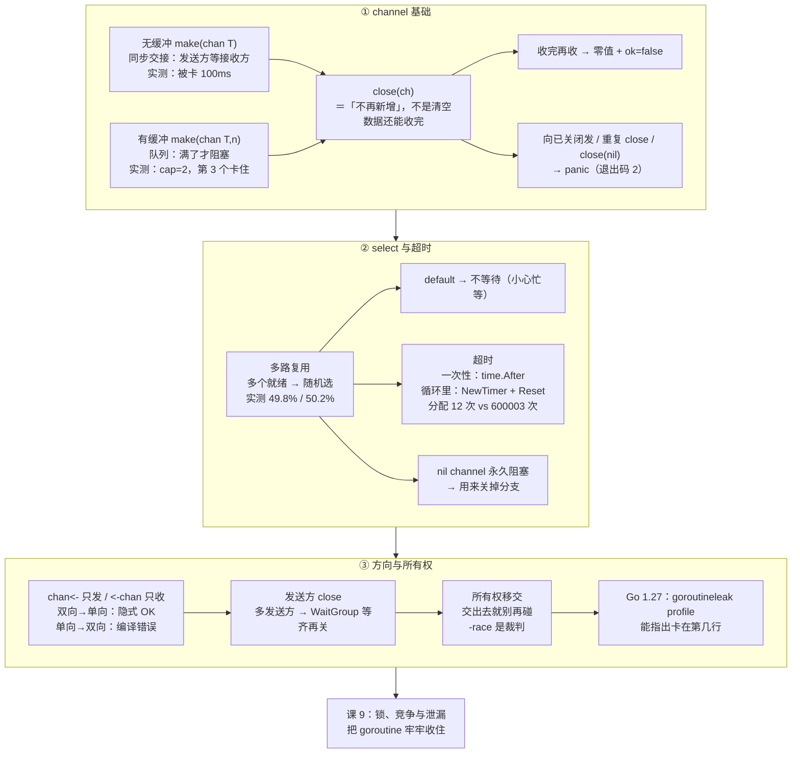

# 课 8：channel——用通信共享内存

> 所属阶段：并发模型 ｜ 故事章节：goroutine 不是免费的 ｜ 状态：✅ 已完成（2026-09-10 ｜ 本机实测 go1.27.1 darwin/arm64）

## 🎯 本课目标

- 学完能说清无缓冲与有缓冲 channel 的本质区别（同步交接 vs 队列），会正确使用 `close` 与 `for range ch`，并避开收发已关闭 channel 的 panic 陷阱。
- 学完能用 `select` 做多路复用与超时控制，能说清 `time.After` 在循环里的真实代价，以及正确的复用姿势。
- 学完能读懂只发 `chan<- T` / 只收 `<-chan T` 的方向约束，遵守"发送方负责关闭"的约定，理解 nil channel 与"channel 即所有权移交"的语义。

## 📍 本课在故事主线中的情节定位

小谷发现 goroutine 便宜，但便宜不等于能随便用——他在压测脚本里把并发请求发出去后，发现结果乱成了一锅粥：有的响应丢了、有的数据错位。他意识到多个 goroutine 之间得有个"传话"的机制，而不是各写各的。这一课他开始用 channel 让 goroutine 之间有序地交接数据与信号，试着把下单请求的读取、校验、写库这几段串成一条条通道流水线。

## 📌 知识点导航

| # | 知识点 | 关键点 | 状态 |
|---|--------|--------|------|
| 1 | channel 基础 | ①无缓冲 channel = **同步交接**（发送方阻塞到有人接收）②有缓冲 channel = 队列（满了才阻塞发送）③`close(ch)` 与 `for range ch` ④从已关闭 channel 接收立即得到零值且 `ok=false`；**向已关闭 channel 发送会 panic**；重复 close / close(nil) 也 panic | ✅ 已完成 |
| 2 | select 与超时 | ①多路复用：多个 case 就绪时**随机**选一个（实测 49.8% / 50.2%）②`default` 分支让 select 变成非阻塞 ③`time.After` 在循环里每轮都 new 一个 Timer（实测分配 600003 次 vs 复用 12 次）；**Go 1.23 起**未被引用的 Timer 可被 GC 回收，但分配成本仍在 ④超时（`select` + timer / `ctx.Done()`）是最常见用法 | ✅ 已完成 |
| 3 | 方向与所有权 | ①`chan<- T` 只发、`<-chan T` 只收，写在函数签名里既是文档也是编译期约束 ②**发送方负责关闭**，接收方不要关 ③nil channel 上的收发**永久阻塞** —— 可在 select 里用来"关掉"某个分支 ④channel 作为"所有权移交"的语义（**Go 1.27 新增 `goroutineleak` profile，能直接指出卡在哪一行**） | ✅ 已完成 |

---

# 第一幕 · 起源与场景引入：从"各写各的下标"说起

课 7 结束时，小谷的下单接口长这样：

```go
results := make([]Result, len(steps))
for i, s := range steps {
    wg.Go(func() {
        results[i] = s.Run()   // 每个 goroutine 只写自己的下标
    })
}
wg.Wait()
```

这招能用，但很脆——**它成立的前提是"每个 goroutine 只碰一个互不重叠的下标"**。一旦任务变成动态的（来多少订单不确定）、或者结果要流式地往下游传（算完一个就发一个），"预先分配数组 + 各写各的"这套就不灵了。

而且课 7 那次数据竞争还历历在目：**4 个 goroutine 各加 10 万次，40 万只剩 12 万，程序还告诉你退出码 0。**

Go 给的答案写在官方博客 [Share Memory By Communicating](https://go.dev/blog/codelab-share) 里，也是 Go 并发最著名的一句口号：

> **Do not communicate by sharing memory; instead, share memory by communicating.**
> （不要通过共享内存来通信，而要通过通信来共享内存。）

这句话的落点就是 **channel**：把数据从"大家都能碰的一块内存"，变成"在 goroutine 之间**交接**的一件东西"。交接完成，原主人就不再碰它——这就是"所有权移交"，也是本课最后一个知识点的核心。

---

# 第二幕 · 认知冲突：三个"我以为"

**撞墙 1："有缓冲和无缓冲，不就是队列长度的区别吗？"**

不是。无缓冲 channel 上，**发送方会一直阻塞到有人接收**——它不是"容量 0 的队列"，而是一次**交接**（handoff）。这决定了它在同步、信号、背压上的行为完全不同。

**撞墙 2："close 之后这个 channel 就废了吧？"**

恰恰相反。close 之后**缓冲区里的数据照样能收完**，收完才会得到零值 + `ok=false`。真正会炸的是反过来的操作：**往已关闭的 channel 里发**（panic）。

**撞墙 3："超时嘛，`time.After` 一把梭。"**

`time.After` 每次调用都会 **new 一个 Timer**。在循环里用它，20 万轮就是 20 万个 Timer——实测分配次数 **600003 vs 12**（复用版）。而更微妙的是：**"循环里 time.After 会泄漏"这句流传很广的话，在 Go 1.23 之后已经不准确了**（这一条第四幕会用实测数字拆开讲）。

---

# 第三幕 · 层层揭示

## 知识点 1：channel 基础

### ① 一句话定义

> channel 是 goroutine 之间**传递值的管道**：无缓冲的是"同步交接"（发送方阻塞到有人接收），有缓冲的是"队列"（缓冲满了才阻塞发送）；**发送方 `close` 之后，还能把缓冲区里剩的数据收完，收完再收得到零值 + `ok=false`**。

### ② 直觉建立（类比 + 类比失效边界）

**类比：传送带 vs 当面交接。**

- **无缓冲 channel = 两个人当面交接一个包裹。** 你把包裹递出去，对方**必须伸手接住**，你才能松手。如果对方没来，你就一直举着——**你被阻塞了**。
- **有缓冲 channel = 传送带。** 你把包裹放上去就能走，带上最多能放 N 个；带子满了，第 N+1 个才需要等。

**这个类比在四个地方会失效：**

1. **失效点 A："无缓冲 = 容量 0 的队列"是错的。** 容量 0 的队列意味着"放进去就丢"，而无缓冲是"必须有人接手"——它是**同步点**，不是容器。这也正是它能当"信号"用的原因。
2. **失效点 B：close 不是"销毁"。** 关掉之后数据还在，照样能收。close 的语义是**"不会再有新的了"**，不是"清空"。
3. **失效点 C：close 的方向是单向的。** 关了就不能再发（panic），但还能一直收。
4. **失效点 D：谁关？** 语言不管，是**约定**：**发送方关**。接收方关 = 发送方可能正要发 → panic。

### ③ 核心原理

**创建与容量**

```go
ch := make(chan T)      // 无缓冲
ch := make(chan T, n)   // 有缓冲，容量 n
len(ch)                 // 当前队列里有多少个（有缓冲才有意义）
cap(ch)                 // 容量
```

**四种操作的阻塞规则**

| 操作 | channel 状态 | 行为 |
|------|-------------|------|
| 发送 `ch <- v` | nil | **永久阻塞** |
| 发送 | 已关闭 | **panic: send on closed channel** |
| 发送 | 缓冲未满 / 有接收方在等 | 立即完成 |
| 发送 | 缓冲已满 / 无人接收 | 阻塞 |
| 接收 `<-ch` | nil | **永久阻塞** |
| 接收 | 已关闭且已排空 | 立即返回**零值 + ok=false** |
| 接收 | 已关闭但还有数据 | 先把数据收完 |
| 接收 | 有数据 | 立即返回 |
| 接收 | 空 | 阻塞 |
| `close(ch)` | nil | **panic: close of nil channel** |
| `close(ch)` | 已关闭 | **panic: close of closed channel** |

**`for range ch` 的语义**：反复接收，**直到 channel 被关闭且排空**才退出。所以——**生产者不 close，消费者的 `for range` 就永远不会结束**（第四幕有实测的死锁现场）。

**收完的信号：comma-ok**

```go
v, ok := <-ch   // ok=false 表示 channel 已关闭且已排空，v 是零值
```

Go 规范对这一条的原文（核查于 2026-09）：*"The multi-valued assignment form of the receive operator reports whether a received value was sent before the channel was closed."*

**缓冲到底开多大？（带实测阈值）**

这是最容易拍脑袋的地方。固定总量 20 万次交接、生产者与消费者节奏相当，**只改容量**跑基准（Apple M3 Pro / 11 核）：

```console
$ go test -bench 'BenchmarkCap' -benchtime 5x -run XXX ./bench/
BenchmarkCap0-11         	       5	  22230208 ns/op
BenchmarkCap1-11         	       5	  15793283 ns/op
BenchmarkCap16-11        	       5	   6229742 ns/op
BenchmarkCap128-11       	       5	   5218775 ns/op
BenchmarkCap1024-11      	       5	   5687117 ns/op
```

| 容量 | 相对无缓冲 | 该怎么用 |
|------|-----------|---------|
| **0** | 基准（22.2 ms） | **默认**。要同步、要背压、要"交接到手"的强保证 → 用它 |
| **1** | 快 **29%**（15.8 ms） | 只需"预取一步"：消费者拿走一个，生产者可以先备下一个 |
| **16** | 快 **3.6 倍**（6.2 ms） | 流水线 / 工作队列的甜点区起点 |
| **128** | 快 **4.3 倍**（5.2 ms） | **本机最优** |
| **1024** | 快 3.9 倍（5.7 ms） | 比 128 **还慢 9%**（缓存局部性变差），白占内存 |

**结论：甜点区是 `16 ~ 128`；超过 1000 通常说明你在用缓冲掩盖问题（消费者太慢），而不是解决它。**

再看**突发场景**（生产者瞬间塞 2 万个、消费者每个干 200 次空活）：

```console
BenchmarkBurst0-11       	       5	   3775867 ns/op
BenchmarkBurst128-11     	       5	   2760267 ns/op
BenchmarkBurst4096-11    	       5	   2662625 ns/op
```

从 0 到 128 快 27%，但 **128 → 4096 只再快 3.5%，内存却多了 32 倍**。

> **一句话**：缓冲能吸收的是**瞬时抖动**，吸收不了**持续的速率差**。生产长期快于消费，开多大缓冲都会填满，然后阻塞——那不是 bug，那是背压在工作。

<details>
<summary><b>🧪 基准源码</b>（`bench/cap_bench_test.go`，点开可复现上面两组数字）</summary>

```go
package bench

import "testing"

// 固定总量 20 万次交接，只改 channel 容量。
// 生产者和消费者节奏基本一致（各跑各的），模拟最常见的流水线场景。
func pipeline(capacity int, n int) int {
	ch := make(chan int, capacity)
	done := make(chan int)
	go func() { // 消费者
		sum := 0
		for v := range ch {
			sum += v
		}
		done <- sum
	}()
	for i := 0; i < n; i++ { // 生产者
		ch <- i
	}
	close(ch)
	return <-done
}

func BenchmarkCap0(b *testing.B)    { benchCap(b, 0) }
func BenchmarkCap1(b *testing.B)    { benchCap(b, 1) }
func BenchmarkCap16(b *testing.B)   { benchCap(b, 16) }
func BenchmarkCap128(b *testing.B)  { benchCap(b, 128) }
func BenchmarkCap1024(b *testing.B) { benchCap(b, 1024) }

func benchCap(b *testing.B, capacity int) {
	const n = 200000
	b.ResetTimer()
	for i := 0; i < b.N; i++ {
		// 校验和一致，确保"快"不是因为少干了活
		if got := pipeline(capacity, n); got != n*(n-1)/2 {
			b.Fatalf("结果不对：%d", got)
		}
	}
}

// 突发场景：生产者瞬间塞 2 万个，消费者每个干 200 次空活。
func burst(capacity int) int {
	ch := make(chan int, capacity)
	done := make(chan int)
	go func() {
		sum := 0
		for v := range ch {
			sum += v
			for i := 0; i < 200; i++ {
				sum += i * 0
			}
		}
		done <- sum
	}()
	for i := 0; i < 20000; i++ {
		ch <- i
	}
	close(ch)
	return <-done
}

func BenchmarkBurst0(b *testing.B)    { benchBurst(b, 0) }
func BenchmarkBurst128(b *testing.B)  { benchBurst(b, 128) }
func BenchmarkBurst4096(b *testing.B) { benchBurst(b, 4096) }

func benchBurst(b *testing.B, capacity int) {
	b.ResetTimer()
	for i := 0; i < b.N; i++ {
		burst(capacity)
	}
}
```

```console
$ go test -bench 'BenchmarkCap|BenchmarkBurst' -benchtime 5x -run XXX ./bench/
goos: darwin
goarch: arm64
pkg: example.com/l08/bench
cpu: Apple M3 Pro
BenchmarkCap0-11         	       5	  22230208 ns/op
BenchmarkCap1-11         	       5	  15793283 ns/op
BenchmarkCap16-11        	       5	   6229742 ns/op
BenchmarkCap128-11       	       5	   5218775 ns/op
BenchmarkCap1024-11      	       5	   5687117 ns/op
BenchmarkBurst0-11       	       5	   3775867 ns/op
BenchmarkBurst128-11     	       5	   2760267 ns/op
BenchmarkBurst4096-11    	       5	   2662625 ns/op
PASS
ok  	example.com/l08/bench	0.396s
```
</details>

### ④ 示例演示（本机实测）

**演示 1-A：无缓冲 = 同步交接**

```go
package main

import (
	"fmt"
	"time"
)

// 探针 1：无缓冲 channel = 同步交接（发送方阻塞到有人接收）
func main() {
	ch := make(chan string) // 无缓冲

	go func() {
		fmt.Println("  发送方：我准备发送了（没人接我就会一直卡住）")
		ch <- "订单数据"
		fmt.Println("  发送方：发送完成！")
	}()

	time.Sleep(100 * time.Millisecond)
	fmt.Println("主协程：我睡了 100ms，现在才开始接收")
	v := <-ch
	fmt.Println("主协程：收到 =", v)

	time.Sleep(50 * time.Millisecond)
	fmt.Println("主协程：结束")
}
```

```console
$ go run ./verify/p1_unbuffered.go
  发送方：我准备发送了（没人接我就会一直卡住）
主协程：我睡了 100ms，现在才开始接收
主协程：收到 = 订单数据
  发送方：发送完成！
主协程：结束
```

**关键观察**：发送方在 100ms 前就准备好了，但"发送完成"一直等到主协程睡醒才打印。**发送方被卡了整整 100ms**——这就是"同步交接"。

> ⚠️ 注意最后两行的顺序（"主协程收到"在"发送方完成"之前）是本次运行的实际结果，但**这个顺序不保证** —— 我把这个程序连跑 5 次，第 2 次就翻转成了"发送完成"在前。无缓冲 channel 保证的是"交接发生了"，不是"谁的下一行先打印"。更极端的演示（以及 `GOMAXPROCS=1` 时发送方收尾代码**压根不执行**）见课后小测第 1 题。

**演示 1-B：有缓冲 = 队列**

```go
package main

import (
	"fmt"
	"time"
)

// 探针 2：有缓冲 channel = 队列（满了才阻塞发送）
func main() {
	ch := make(chan string, 2) // 容量 2

	ch <- "A"
	ch <- "B"
	fmt.Printf("放入 2 个后：len=%d cap=%d（都没阻塞）\n", len(ch), cap(ch))

	// 第三个会阻塞：起一个 goroutine 证明它卡住了
	go func() {
		fmt.Println("  发送方：准备放第 3 个 C（队列满了，我会卡住）")
		ch <- "C"
		fmt.Println("  发送方：C 放进去了！")
	}()

	time.Sleep(100 * time.Millisecond)
	fmt.Printf("等待 100ms 后：len=%d（还是 2，说明 C 确实没进去）\n", len(ch))

	fmt.Println("主协程：取出一个 =", <-ch)
	time.Sleep(50 * time.Millisecond)
	fmt.Printf("取出后再看：len=%d\n", len(ch))
}
```

```console
$ go run ./verify/p2_buffered.go
放入 2 个后：len=2 cap=2（都没阻塞）
  发送方：准备放第 3 个 C（队列满了，我会卡住）
等待 100ms 后：len=2（还是 2，说明 C 确实没进去）
主协程：取出一个 = A
  发送方：C 放进去了！
取出后再看：len=2
```

容量 2 的 channel：前两个**完全不阻塞**（程序根本没卡），第三个才卡住，直到有人取走一个才放行。

**演示 1-C：close 之后照样能收**

```go
package main

import "fmt"

// 探针 3：close 之后还能收，收完得到零值 + ok=false；for range 会自动退出
func main() {
	ch := make(chan int, 3)
	ch <- 10
	ch <- 20
	ch <- 30
	close(ch)
	fmt.Printf("close 之后：len=%d cap=%d（数据还在，照样能收）\n", len(ch), cap(ch))

	fmt.Println("for range ch：")
	for v := range ch {
		fmt.Println("  收到", v)
	}
	fmt.Println("for range 正常退出了（没有卡住）")

	v, ok := <-ch
	fmt.Printf("再从已关闭的 channel 收：v=%d ok=%v（v 是 int 的零值）\n", v, ok)
}
```

```console
$ go run ./verify/p3_closed.go
close 之后：len=3 cap=3（数据还在，照样能收）
for range ch：
  收到 10
  收到 20
  收到 30
for range 正常退出了（没有卡住）
再从已关闭的 channel 收：v=0 ok=false（v 是 int 的零值）
```

**close 是"到此为止，不再新增"的信号，不是"清空"。**

**演示 1-D：三种 panic（都是本机实测原文）**

```console
$ go run ./verify/p4_send_closed.go     # 向已关闭的 channel 发送
channel 已关闭
panic: send on closed channel

goroutine 1 [running]:
main.main()
	/tmp/go-l08/verify/p4_send_closed.go:11 +0x84
exit status 2
```

```console
$ go run ./verify/p5_close_closed.go    # 重复关闭
第一次 close 成功
panic: close of closed channel

goroutine 1 [running]:
main.main()
	/tmp/go-l08/verify/p5_close_closed.go:10 +0x6c
exit status 2
```

```console
$ go run ./verify/p6_close_nil.go       # 关闭 nil channel
ch == nil ? true
panic: close of nil channel

goroutine 1 [running]:
main.main()
	/tmp/go-l08/verify/p6_close_nil.go:9 +0x60
exit status 2
```

**演示 1-E：生产者忘了 close 会怎样**

```go
package main

import (
	"fmt"
	"time"
)

// 探针 14：生产者忘了 close，消费者的 for range 会永远等下去
func main() {
	ch := make(chan int)
	go func() {
		for i := 1; i <= 3; i++ {
			ch <- i
		}
		fmt.Println("  生产者：3 个都发完了（但我忘了 close）")
	}()

	fmt.Println("消费者：开始 for range")
	for v := range ch {
		fmt.Println("  收到", v)
	}
	fmt.Println("消费者：range 结束（永远不会走到这里）")
	time.Sleep(time.Second)
}
```

```console
$ go run ./verify/p14_forget_close.go
消费者：开始 for range
  收到 1
  收到 2
  生产者：3 个都发完了（但我忘了 close）
  收到 3
fatal error: all goroutines are asleep - deadlock!

goroutine 1 [chan receive]:
main.main()
	/tmp/go-l08/verify/p14_forget_close.go:19 +0x114
exit status 2
```

**数据全收完了，然后进程崩了。** `for range` 只在"channel 被关闭"时才退出，跟"数据收没收完"无关。这是"发送方必须 close"最直接的理由。

### ⑤ 常见误区（知识点 1）

| 误区 | 真相 |
|------|------|
| "无缓冲 = 容量 0 的队列" | 错。它是**同步交接点**，发送方会阻塞到有人接收 |
| "close 之后数据就没了" | 错。缓冲区数据照样能收完 |
| "接收方负责 close" | 反了。**发送方关**，接收方关会让发送方 panic |
| "往已关闭的 channel 发送会返回 error" | 会 **panic**（`send on closed channel`），进程退出码 2 |
| "从已关闭的 channel 收会 panic" | 不会。得到**零值 + ok=false** |
| "`for range` 收完数据就会退出" | 不会。必须 **close** 才退出，否则死锁 |
| "有缓冲一定比无缓冲好" | 不一定。缓冲会**掩盖背压**，让生产者跑得比消费者快 |
| "close(nil) 是安全的" | 不安全，`panic: close of nil channel` |

### ⑥ 一句话记住

> **无缓冲是"当面交接"（发送方等接收方），有缓冲是"传送带"（满了才等）；close 是"不再新增"的信号不是清空，而且只能由发送方关。**

### 📚 官方文档

- [Go 规范 · Channel types](https://go.dev/ref/spec#Channel_types)（核查于 2026-09）
- [Go 规范 · Close / Receive operator](https://go.dev/ref/spec#Close)
- [Go Blog · Share Memory By Communicating](https://go.dev/blog/codelab-share)
- [Go Blog · Go Concurrency Patterns: Pipelines and cancellation](https://go.dev/blog/pipelines)

---

## 知识点 2：select 与超时

### ① 一句话定义

> `select` 让一个 goroutine **同时等待多个 channel 操作**：谁先就绪就执行谁；**多个同时就绪时随机挑一个**；加了 `default` 就退化成"非阻塞试一下"；配一个定时器 channel 就是**超时**。

### ② 直觉建立（类比 + 类比失效边界）

**类比：前台接电话。**

一个前台面前有 N 部电话（N 个 channel）。她**同时听着所有电话**，哪部响了就接哪部；如果**同时响两部**，她随机接一部（不是"永远优先接 1 号"）。如果加了个 `default`，就相当于"都不响的时候我也不干等，去做别的事"。如果她最多等 5 秒，那就是**超时**。

**失效边界：**

1. **"随机"是刻意的公平性设计**，不是随机算法本身。Go 用它防止"永远排在前面的 case 饿死后面的"。
2. **`default` 会让 select 变成"不等待"**——如果你把它写进一个 `for` 循环而不加任何阻塞，就会变成**忙等（busy loop）烧 CPU**。
3. **超时只"放弃等待"，不"取消任务"。** `select` 超时后，那个慢的 goroutine **还在跑**。要真正取消它，得用 context（课 9.3 / 课 10.2 的主角）。

### ③ 核心原理

**基本形态**

```go
select {
case v := <-ch1:
    // ch1 有数据
case ch2 <- x:
    // ch2 可以发送
case <-done:
    // 收到结束信号
default:
    // 上面都不行 → 立即走这里（不阻塞）
}
```

**四条规则**（规范原文 + 实测）：

1. 没有 case 就绪、也没有 `default` → **阻塞等待**；
2. 有 case 就绪 → 执行**一个**；
3. **多个就绪 → 随机选一个**。Go 规范原文（核查于 2026-09）：*"If one or more of the communications can proceed, a single one that can proceed is chosen via a uniform pseudo-random selection."*
4. 有 `default` 且都不就绪 → 立即执行 `default`。

**超时：三种写法**

```go
// 写法 1：一次性超时（推荐，最清晰）
select {
case r := <-doSomething():
    use(r)
case <-time.After(200 * time.Millisecond):
    return errors.New("超时")
}

// 写法 2：复用 Timer（循环里用这个）
timer := time.NewTimer(timeout)
defer timer.Stop()
for {
    timer.Reset(timeout)
    select {
    case v := <-ch:
        handle(v)
    case <-timer.C:
        return
    }
}

// 写法 3：用 context（可取消、可传递，课 9.3 / 课 10.2 主角）
select {
case r := <-doSomething():
    use(r)
case <-ctx.Done():
    return ctx.Err()
}
```

> ⚠️ **前向引用**：`context.Context` 的系统讲解在**课 10.2**；**课 9.3**（goroutine 泄漏与取消）会正式用它收口。本课只把 `ctx.Done()` 当一个"被关闭时就绪的 channel"来用。

**⚠️ `time.After` 在循环里的真实代价（这一条要按版本说）**

`time.After(d)` 等价于 `NewTimer(d).C`，**每次调用都 new 一个 Timer**。老教程会说"循环里用 time.After 会泄漏 Timer"——这句话需要按 Go 版本修正。

Go 1.23 Release Notes 原文（核查于 2026-09）：

> First, `Timer`s and `Ticker`s that are no longer referred to by the program become eligible for garbage collection **immediately**, even if their `Stop` methods have not been called. Earlier versions of Go did not collect unstopped `Timer`s until after they had fired and never collected unstopped `Ticker`s.

> Second, the timer channel associated with a `Timer` or `Ticker` is now **unbuffered, with capacity 0**. … A visible effect of this change is that `len` and `cap` of timer channels now returns 0 instead of 1.

所以现在的准确说法是：

| 版本 | 循环里 time.After 的后果 |
|------|------------------------|
| < Go 1.23 | Timer 直到触发才释放 → **真的会堆积（泄漏）** |
| ≥ Go 1.23 | 不再被引用的 Timer **可被 GC 立即回收** → 不再堆积；但**每轮仍要 new + 进定时器堆**，分配成本是实打实的 |

**而且 Go 1.27 把回退开关删了**——第四幕有实测。

### ④ 示例演示（本机实测）

**演示 2-A：多个 case 就绪时是随机选的**

```go
package main

import "fmt"

// 探针 8：多个 case 同时就绪时，select 是随机选的
func main() {
	ch1 := make(chan string, 1)
	ch2 := make(chan string, 1)

	n1, n2 := 0, 0
	const rounds = 10000

	for i := 0; i < rounds; i++ {
		ch1 <- "A" // 两个都填上，保证每轮都有两个 case 就绪
		ch2 <- "B"
		select {
		case <-ch1:
			n1++
		case <-ch2:
			n2++
		}
		// 清掉剩下的那个
		select {
		case <-ch1:
		case <-ch2:
		default:
		}
	}

	fmt.Printf("跑 %d 轮：ch1 命中 %d 次（%.1f%%），ch2 命中 %d 次（%.1f%%）\n",
		rounds, n1, float64(n1)/rounds*100, n2, float64(n2)/rounds*100)
}
```

```console
$ go run ./verify/p8_random.go
跑 10000 轮：ch1 命中 4979 次（49.8%），ch2 命中 5021 次（50.2%）
```

**几乎完美的 50/50。** 这就是"uniform pseudo-random selection"的实测证据——**不要依赖 case 的书写顺序**。

**演示 2-B：`default` 让 select 变非阻塞**

```go
package main

import (
	"fmt"
	"time"
)

// 探针 9：default 分支让 select 变成非阻塞
func main() {
	ch := make(chan int, 1)

	// 空 channel + default → 立刻走 default
	select {
	case v := <-ch:
		fmt.Println("收到", v)
	default:
		fmt.Println("① 没人发数据：走 default，没有阻塞")
	}

	// 有数据 → 走 case
	ch <- 42
	select {
	case v := <-ch:
		fmt.Println("② 收到", v)
	default:
		fmt.Println("② 走 default")
	}

	// 没有 default 就会阻塞（这里用超时兜底证明）
	start := time.Now()
	select {
	case v := <-ch:
		fmt.Println("③ 收到", v)
	case <-time.After(100 * time.Millisecond):
		fmt.Printf("③ 没有 default，阻塞了 %v 后超时\n", time.Since(start).Round(time.Millisecond))
	}
}
```

```console
$ go run ./verify/p9_default.go
① 没人发数据：走 default，没有阻塞
② 收到 42
③ 没有 default，阻塞了 100ms 后超时
```

> `100ms`：程序里 `time.Sleep` 的就是 100ms，实测等到的就是 100ms 出头（复跑 100~101ms 都正常）。**没有 default 的 select 会真阻塞**，等到超时分支就绪才走。

同一段代码里三种情况对照清楚：**有 `default` 就不等，没 `default` 就等到超时为止。**

**演示 2-C：超时实战**

```go
package main

import (
	"fmt"
	"time"
)

// 模拟一次下游调用，耗时 cost
func call(name string, cost time.Duration) <-chan string {
	ch := make(chan string, 1) // 缓冲 1：即使没人收，调用方也不会卡住
	go func() {
		time.Sleep(cost)
		ch <- name + " 的结果"
	}()
	return ch
}

func try(name string, cost time.Duration) {
	start := time.Now()
	select {
	case r := <-call(name, cost):
		fmt.Printf("  %-14s 拿到结果：%s（耗时 %v）\n", name, r, time.Since(start).Round(time.Millisecond))
	case <-time.After(200 * time.Millisecond):
		fmt.Printf("  %-14s 超时了！（等待 %v 后放弃）\n", name, time.Since(start).Round(time.Millisecond))
	}
}

func main() {
	fmt.Println("超时阈值 = 200ms")
	try("快服务", 50*time.Millisecond)
	try("慢服务", 500*time.Millisecond)
}
```

```console
$ go run ./verify/demo3_timeout.go
超时阈值 = 200ms
  快服务            拿到结果：快服务 的结果（耗时 50ms）
  慢服务            超时了！（等待 201ms 后放弃）
```

> 复跑波动：快服务 50~52ms、慢服务放弃点 201ms。**关键不是这几个数字，而是"慢服务没有把整个程序拖住"**——200ms 阈值一到就走超时分支，调用方永远有上界。

> 💡 那个 `make(chan string, 1)` 的缓冲 1 不是随手写的：**如果超时了、没人再收这个 channel，goroutine 里的 `ch <- ...` 会永远卡住** —— 那就成了 goroutine 泄漏（课 9 的主题）。缓冲 1 让它"发得出去、然后退出"。

**演示 2-D：`time.After` 在循环里的代价（20 万轮实测）**

```go
package main

import (
	"fmt"
	"runtime"
	"time"
)

// 探针 12：循环里 time.After 会不停 new Timer；复用 Timer 则只 new 一次
func measure(name string, fn func()) {
	var before, after runtime.MemStats
	runtime.GC()
	runtime.ReadMemStats(&before)
	start := time.Now()
	fn()
	el := time.Since(start)
	runtime.GC()
	runtime.ReadMemStats(&after)
	fmt.Printf("%-22s 耗时=%-9v 分配次数=%-9d 堆增量=%+.2f MB 存活对象=%d\n",
		name, el.Round(time.Millisecond),
		after.Mallocs-before.Mallocs,
		float64(int64(after.HeapAlloc)-int64(before.HeapAlloc))/1024/1024,
		int64(after.HeapObjects)-int64(before.HeapObjects))
}

func main() {
	const n = 200000
	const d = time.Hour // 一个足够久、保证不会被触发的超时

	measure("循环里 time.After", func() {
		ch := make(chan int, 1)
		for i := 0; i < n; i++ {
			ch <- i
			select {
			case <-ch:
			case <-time.After(d): // 每轮都新建一个 Timer
			}
		}
	})

	measure("复用 time.NewTimer", func() {
		ch := make(chan int, 1)
		timer := time.NewTimer(d)
		defer timer.Stop()
		for i := 0; i < n; i++ {
			ch <- i
			timer.Reset(d)
			select {
			case <-ch:
			case <-timer.C:
			}
		}
	})
}
```

```console
$ go run ./verify/p12_timer.go
循环里 time.After         耗时=25ms      分配次数=600003    堆增量=+0.00 MB 存活对象=1
复用 time.NewTimer       耗时=16ms      分配次数=12        堆增量=+0.00 MB 存活对象=3
```

> 复跑会有波动（我另一次跑出 `耗时=28ms 分配次数=600018 堆增量=+0.01 MB`，复用版 `分配次数=4`）。**看量级，不要看精确值**：60 万级 vs 个位数的差距是稳定的，个位数那栏每次都不一样。

**怎么读这一组数字（这是本课最需要"按版本说话"的地方）：**

| 指标 | 循环里 time.After | 复用 NewTimer | 结论 |
|------|------------------|---------------|------|
| 分配次数 | **600003** | **12** | 每轮 3 次分配 vs 全程几乎不分配，**差 5 万倍** |
| 耗时 | 25ms | 16ms | 慢了约 56% |
| 堆增量（GC 后） | **+0.00 MB** | +0.00 MB | **Timer 全被 GC 回收了，没有堆积** |

**结论：在 Go 1.27（≥1.23）上，"循环里 time.After 会泄漏内存"这句话已经不成立了——堆增量是 0。但代价从"内存泄漏"变成了"分配风暴"：20 万轮多出 60 万次分配、慢 56%。所以循环里仍然推荐复用 Timer，只是理由换了。**

**演示 2-E：Go 1.27 已经拿掉了回退开关**

Go 1.23 引入 `asynctimerchan`（可以退回旧的"缓冲 1 的 timer channel"行为），但 **Go 1.27 把它永久移除了**。实测：

```console
$ cd /tmp/go-l08 && go run ./verify/p13_timercap.go     # go.mod: go 1.27
cap(timer.C)  = 0
cap(ticker.C) = 0

$ cd /tmp/go-l08-old && go run .                        # go.mod: go 1.22
cap(timer.C)  = 0
cap(ticker.C) = 0

$ GODEBUG=asynctimerchan=1 go run ./verify/p13_timercap.go
fatal error: removed GODEBUG "asynctimerchan" set to old value "1" in environment (https://go.dev/doc/godebug#go-127)
```

注意第二组：**即便 go.mod 写 `go 1.22`，也拿不到旧行为**——因为这个 GODEBUG 在 Go 1.27 已经不存在了（`go list -f '{{.DefaultGODEBUG}}'` 的输出里也确实没有它）。

Go 1.27 Release Notes 原文（核查于 2026-09）：

> The `asynctimerchan` `GODEBUG` setting (added in Go 1.23) has been **removed permanently**. Channels created by package time are now **always unbuffered (synchronous)**, irrespective of `GODEBUG` settings.

**演示 2-F：nil channel 在 select 里 = 关掉这个分支**

```go
package main

import (
	"fmt"
	"time"
)

// 探针 7：nil channel 上的收发永久阻塞 —— 在 select 里正好用来"关掉"某个分支
func main() {
	var nilCh chan int // nil
	realCh := make(chan int)

	go func() {
		for i := 1; i <= 2; i++ {
			time.Sleep(150 * time.Millisecond)
			realCh <- i
		}
	}()

	for i := 0; i < 4; i++ {
		select {
		case v := <-realCh:
			fmt.Printf("  第 %d 轮：从 realCh 收到 %d\n", i+1, v)
		case <-nilCh:
			fmt.Printf("  第 %d 轮：nil 分支被选中（不可能）\n", i+1)
		case <-time.After(100 * time.Millisecond):
			fmt.Printf("  第 %d 轮：超时 —— 说明 nil 分支一直没被选中\n", i+1)
		}
	}
}
```

```console
$ go run ./verify/p7_nil.go
  第 1 轮：超时 —— 说明 nil 分支一直没被选中
  第 2 轮：从 realCh 收到 1
  第 3 轮：超时 —— 说明 nil 分支一直没被选中
  第 4 轮：从 realCh 收到 2
```

`nilCh` 上的接收**永久阻塞**，所以 select 永远不会选它。**这正好可以用来"动态关掉"某个分支**——把 channel 置为 nil 即可：

```go
for ch1 != nil || ch2 != nil {
    select {
    case v, ok := <-ch1:
        if !ok { ch1 = nil; continue }   // ch1 关了 → 用 nil 关掉这个分支
        handle1(v)
    case v, ok := <-ch2:
        if !ok { ch2 = nil; continue }
        handle2(v)
    }
}
```

这是"合并多个 channel"的标准写法，比 `default` 忙等优雅得多。

### ⑤ 常见误区（知识点 2）

| 误区 | 真相 |
|------|------|
| "多个 case 就绪时按书写顺序选第一个" | **随机选**（实测 49.8% / 50.2%） |
| "加了 `default` 就万事大吉" | 在 `for` 里会导致**忙等烧 CPU** |
| "select 超时后任务就被取消了" | 没有。**只是不等了**，goroutine 还在跑。取消要用 context |
| "循环里 time.After 会内存泄漏" | **≥Go 1.23 不会**（实测堆增量 0）；但**分配风暴**仍在（600003 次 vs 12 次） |
| "time.After 创建的 Timer 要手动 Stop" | 一次性使用不需要；≥1.23 不引用即可被 GC |
| "timer channel 容量是 1" | ≥Go 1.23 是 **0**（Go 1.27 起无法退回旧行为） |
| "nil channel 上收发会 panic" | 不会，**永久阻塞**（只有 `close(nil)` 才 panic） |

### ⑥ 一句话记住

> **select = 同时听多部电话，谁先响接谁、同时响随机接；加 `default` 变"不等待"，加定时器变"超时"；循环里别用 `time.After`，复用 Timer。**

### 📚 官方文档

- [Go 规范 · Select statements](https://go.dev/ref/spec#Select_statements)（核查于 2026-09）
- [Go 1.23 Release Notes · Timer changes](https://go.dev/doc/go1.23)（核查于 2026-09）
- [Go 1.27 Release Notes · Runtime](https://go.dev/doc/go1.27)（核查于 2026-09）
- [go.dev/doc/godebug · GODEBUG History](https://go.dev/doc/godebug)（核查于 2026-09）
- [pkg.go.dev · time.NewTimer](https://pkg.go.dev/time#NewTimer)

---

## 知识点 3：方向与所有权

### ① 一句话定义

> `chan<- T`（只发）和 `<-chan T`（只收）是**编译期的方向约束**：双向 channel 可以隐式转单向，**反向不行**；约定上**由发送方 `close`**；而 channel 最深层的语义是**所有权移交**——值发出去之后，原主人就不再碰它。

### ② 直觉建立（类比 + 类比失效边界）

**类比：寄快递 vs 共享云文档。**

- **共享内存（锁）= 共享云文档。** 大家都能编辑，所以得加锁、得约定谁什么时候改。
- **channel（所有权移交）= 寄快递。** 包裹交出去，**你手里就没有了**。收件方想怎么拆就怎么拆，你不会同时去动它——**所以根本不需要锁**。

**失效边界：**

1. **"发出去就不碰"是纪律，不是编译器强制的。** 你发了一个 slice，自己还继续 append —— 编译器不会拦你，但 `-race` 会抓（第四幕有实测）。
2. **指针 / 切片 / map 都是"引用"。** 传过去的是"引用的一份拷贝"，如果原主人还留着引用，移交就不成立。
3. **方向约束不是安全机制，是文档。** 它防的是"误用"，不是"恶意"。

### ③ 核心原理

**方向类型的四条规则**

| 转换 | 允许？ | 说明 |
|------|--------|------|
| `chan T` → `chan<- T` | ✅ | 双向转只发，隐式 |
| `chan T` → `<-chan T` | ✅ | 双向转只收，隐式 |
| `chan<- T` → `chan T` | ❌ | 编译错误 |
| `<-chan T` → `chan T` | ❌ | 编译错误 |

**为什么有用**：写在函数签名里，**看一眼就知道这个函数是"生产数据"还是"消费数据"**，而且编译器帮你守住。这是 Go 里少有的"类型即文档"的漂亮设计。

```go
func Gen(ids ...int) <-chan int          // 只产出，不接收
func Save(in <-chan int) <-chan string   // 只消费 int，只产出 string
```

**close 的三条纪律**

1. **发送方关**，接收方不关；
2. **多个发送方** → 用一个 `sync.WaitGroup` 等所有发送方都结束后，再由单独一个 goroutine 关；
3. **不要为了"通知"而 close** —— 通知用 `done` channel 或 context。

**nil channel 的两个用途**

- 未初始化的 channel（零值 nil）上收发**永久阻塞**；
- 在 `select` 里这正是"**关掉这个分支**"的手段（演示 2-F）。

**所有权移交：把"共享"变成"独占"**

对比课 7 那个 40 万只剩 12 万的计数器：

```go
// 共享 + 竞争：4 个 goroutine 同时 n++
var n int
// ... n++ × 400000   → 实测 120960

// 所有权移交：各算各的，结果交回来
ch := make(chan int, 4)
go func() {
    n := 0
    for j := 0; j < 100000; j++ { n++ }   // 局部变量，没人跟我抢
    ch <- n                                // 交出去
}()
```

**Go 1.27 的新武器：`goroutineleak` profile**（课 9 会细讲，这里先剧透）

Go 1.27 把这个 profile 从实验特性转正了。它用 GC 的可达性分析找出"卡在并发原语上、且永远不可能被唤醒"的 goroutine。因为**卡在 channel 上是 goroutine 泄漏的头号原因**，这东西对本课格外有用——第四幕会用它现场抓一个。

### ④ 示例演示（本机实测）

**演示 3-A：方向约束（三条编译错误原文）**

```go
package main

import "fmt"

// 探针 11：方向约束 —— 写在函数签名里，既是文档也是编译期约束
func send(ch chan<- int) { // 只发
	ch <- 1
	close(ch) // 发送方关闭，允许
}

func recv(ch <-chan int) { // 只收
	for v := range ch {
		fmt.Println("  收到", v)
	}
}

func main() {
	ch := make(chan int) // 双向
	go send(ch)          // 双向 → 只发：允许（隐式转换）
	recv(ch)             // 双向 → 只收：允许
}
```

```console
$ go run ./verify/p11_direction.go
  收到 1
```

违反方向约束的三条编译错误（本机实测原文）：

```console
$ go run ./verify/e1.go    # 只发的 channel 上接收
verify/e1.go:5:9: invalid operation: cannot receive from send-only channel chan<- int ch (variable of type chan<- int)

$ go run ./verify/e2.go    # 只收 → 双向
verify/e2.go:12:24: cannot use only (variable of type <-chan int) as chan int value in variable declaration

$ go run ./verify/e3.go    # 只收的 channel 上 close
verify/e3.go:5:8: invalid operation: cannot close receive-only channel ch (variable of type <-chan int)
```

**注意第三条**：`close` 只能用在**只发**方向的 channel 上——编译器用类型帮你守住了"发送方才关"这条纪律。

**演示 3-B：流水线（Gen → Check → Save）**

```go
package pipeline

// ① 生成：把订单号送进 channel，发完就关（发送方负责关闭）
func Gen(ids ...int) <-chan int {
	out := make(chan int)
	go func() {
		defer close(out)
		for _, id := range ids {
			out <- id
		}
	}()
	return out
}

// ② 校验：只放过奇数订单号
func Check(in <-chan int) <-chan int {
	out := make(chan int)
	go func() {
		defer close(out)
		for id := range in { // in 被关闭后，range 自动退出
			if id%2 == 1 {
				out <- id
			}
		}
	}()
	return out
}

// ③ 落库：把订单号变成结果字符串
func Save(in <-chan int) <-chan string {
	out := make(chan string)
	go func() {
		defer close(out)
		for id := range in {
			out <- "订单 " + itoa(id) + " 已落库"
		}
	}()
	return out
}
```

（`itoa` 实现与 `main` 见文末折叠块）

```console
$ go run ./verify/demo1_pipeline.go
流水线输出：
   订单 1 已落库
   订单 3 已落库
   订单 5 已落库
   订单 7 已落库
流水线结束（out 被关闭，range 自动退出）
```

**每段都只干一件事，靠 channel 串起来；每段结束时 `defer close(out)`，下游的 `for range` 就自动收尾。**

**关键是 `-race` 干净通过：**

```console
$ go test -race -v ./pipeline
=== RUN   TestPipeline
--- PASS: TestPipeline (0.00s)
=== RUN   TestClosedChannel
--- PASS: TestClosedChannel (0.00s)
=== RUN   TestFanIn
--- PASS: TestFanIn (0.00s)
PASS
ok  	example.com/l08/pipeline	1.022s
```

**演示 3-C：多个发送方怎么关（fan-in）**

```go
// 多个发送方 → 用 WaitGroup 等齐后再关（经典 fan-in）
func TestFanIn(t *testing.T) {
	inputs := []<-chan int{Gen(1, 2), Gen(3, 4), Gen(5, 6)}

	out := make(chan int)
	var wg sync.WaitGroup
	for _, in := range inputs {
		wg.Add(1)
		go func(in <-chan int) {
			defer wg.Done()
			for v := range in {
				out <- v
			}
		}(in)
	}
	go func() { // 单独一个 goroutine 等齐，然后关 out
		wg.Wait()
		close(out)
	}()

	var sum int
	for v := range out {
		sum += v
	}
	if sum != 21 {
		t.Errorf("期望 1+2+3+4+5+6 = 21，实际 %d", sum)
	}
}
```

**口诀：N 个发送方 → 一个 `WaitGroup` → 等齐 → 由单独一个 goroutine `close`。** 千万别在发送方 goroutine 里直接 `close(out)`——其他发送方可能还在发，就会 `send on closed channel`。

**演示 3-D：fan-out 并发干活**

```go
// 校验一个订单要 100ms，只有奇数订单号合法
func checkOne(id int) bool {
	time.Sleep(100 * time.Millisecond)
	return id%2 == 1
}

// worker：从 in 领活，结果写进 out（out 是只发方向）
func worker(id int, in <-chan int, out chan<- string, wg *sync.WaitGroup) {
	defer wg.Done()
	for orderID := range in {
		if checkOne(orderID) {
			out <- fmt.Sprintf("worker %d：订单 %d 合法", id, orderID)
		}
	}
}
```

```console
$ go run ./verify/demo2_fanout.go
    worker 3：订单 1 合法
    worker 1：订单 3 合法
    worker 3：订单 5 合法
    worker 1：订单 7 合法
并发版              用 3 个 worker，耗时 306ms，合法订单 4 个

    worker 5：订单 3 合法
    worker 4：订单 5 合法
    worker 6：订单 7 合法
    worker 2：订单 1 合法
并发版              用 8 个 worker，耗时 102ms，合法订单 4 个
```

> **复跑波动**：3 worker 303ms / 8 worker 101ms。耗时 ±5ms 属正常；更值得注意的是 **worker 编号与完成顺序每次都不一样**（哪条日志由哪个 worker 打印、谁先谁后都不确定）——这就是并发调度的样子，不要指望稳定复现。

8 个订单每个校验 100ms：3 个 worker 要 **306ms**（⌈8/3⌉=3 轮 × 100ms），8 个 worker 只要 **102ms**（1 轮）。**结果顺序完全乱序**——这就是并发，别指望顺序。

**演示 3-E：所有权移交 vs 共享（`-race` 现场对比）**

```go
package ownership

import "sync"

// Wrong：一边 append，一边让另一个 goroutine 读同一份切片 → 数据竞争
func Wrong() int {
	data := make([]int, 0, 100000)
	var wg sync.WaitGroup
	wg.Add(1)
	go func() {
		defer wg.Done()
		sum := 0
		for _, v := range data { // 读
			sum += v
		}
		_ = sum
	}()
	for i := 0; i < 100000; i++ {
		data = append(data, i) // 同时写
	}
	wg.Wait()
	return len(data)
}

// Right：填完之后才把 data 交出去，交出之后自己再也不碰 —— 所有权移交
func Right() int {
	data := make([]int, 0, 100000)
	for i := 0; i < 100000; i++ {
		data = append(data, i)
	}

	dataCh := make(chan []int, 1)
	resCh := make(chan int, 1)
	go func() {
		got := <-dataCh // 接收方独占这份数据
		sum := 0
		for _, v := range got {
			sum += v
		}
		resCh <- sum
	}()

	dataCh <- data // 所有权移交；此后主线程绝不碰 data
	return <-resCh
}
```

**共享版 —— `-race` 直接抓现行：**

```console
$ go test -race -run TestWrongSharing ./ownership
==================
WARNING: DATA RACE
Read at 0x00c000010108 by goroutine 8:
  example.com/l08/ownership.Wrong.func1()
      /tmp/go-l08/ownership/ownership.go:13 +0x6c

Previous write at 0x00c000010108 by goroutine 7:
  example.com/l08/ownership.Wrong()
      /tmp/go-l08/ownership/ownership.go:19 +0x1e4
  example.com/l08/ownership.TestWrongSharing()
      /tmp/go-l08/ownership/ownership_test.go:7 +0x5c
  testing.tRunner()
      /usr/local/Cellar/go/1.27.1/libexec/src/testing/testing.go:2193 +0x164
==================
--- FAIL: TestWrongSharing (0.00s)
    ownership_test.go:7: len = 100000
FAIL
FAIL	example.com/l08/ownership	0.011s
FAIL
```

**移交版 —— 干净通过：**

```console
$ go test -race -v -run TestRightHandoff ./ownership
=== RUN   TestRightHandoff
--- PASS: TestRightHandoff (0.00s)
PASS
ok  	example.com/l08/ownership	1.015s
```

**同一份数据、同一个求和动作，差别只在于"交出去之后还碰不碰"。**

**演示 3-F：用 channel 汇总，彻底消灭共享计数器**

课 7 里 4 个 goroutine 各 `n++` 10 万次，结果只有 120960。换成 channel 交结果：

```go
package main

import (
	"fmt"
	"sync"
)

// 课 7 的写法：4 个 goroutine 同时 n++ → 实测得到 120960（数据竞争）
// 课 8 的写法：各算各的，把结果通过 channel 交回来 → 无共享、无竞争
func main() {
	ch := make(chan int, 4)

	var wg sync.WaitGroup
	for i := 0; i < 4; i++ {
		wg.Add(1)
		go func() {
			defer wg.Done()
			n := 0
			for j := 0; j < 100000; j++ {
				n++ // 每个 goroutine 只碰自己的局部变量
			}
			ch <- n // 结果交出去
		}()
	}
	wg.Wait()
	close(ch)

	total := 0
	for n := range ch {
		total += n
	}
	fmt.Println("期望 n =", 400000)
	fmt.Println("实际 n =", total)
}
```

```console
$ go run ./verify/demo4_channel_sum.go
期望 n = 400000
实际 n = 400000

$ go run -race ./verify/demo4_channel_sum.go     # 竞争检测器下同样干净
期望 n = 400000
实际 n = 400000
```

**40 万，一次不差，`-race` 一声不吭。** 这就是那句口号的兑现：**不用锁，改用"把结果交回来"。**

**演示 3-G（彩蛋）：Go 1.27 的 `goroutineleak` profile 现场抓泄漏**

```console
$ go run ./verify/p15_leakprofile.go
goroutineleak profile 存在？true
泄漏的 goroutine 数 = 0
---- profile 内容 ----
goroutineleak profile: total 1
1 @ 0x100d6ff18 0x100d0b0b0 0x100d0ac34 0x100dc4114 0x100d76024
#	0x100dc4113	main.main.func1+0x23	/tmp/go-l08/verify/p15_leakprofile.go:15
```

程序里那个 goroutine 卡在 `<-leaked`（永远没人会发），**profile 直接把文件名和行号（第 15 行）指出来了**。

> ⚠️ 注意 `Count()` 返回 **0**，但 `WriteTo` 的输出里是 `total 1` —— **别用 `Count()` 判断有没有泄漏，要看 profile 内容**。这个坑和课 7 的 `threadcreate.Count()` 是同一类：**API 的返回值语义要查源码，不能凭名字猜。**

Go 1.27 Release Notes 原文（核查于 2026-09）：

> A *leaked* goroutine is a goroutine blocked on some concurrency primitive (channels, `sync.Mutex`, `sync.Cond`, etc) that cannot possibly become unblocked. … this approach detects a large class of such leaks.

### ⑤ 常见误区（知识点 3）

| 误区 | 真相 |
|------|------|
| "方向约束只是为了好看" | 是**编译期约束**，能挡住 `close` 只收 channel、只发 channel 上接收等错误 |
| "接收方也可以 close" | 不要。接收方关 → 发送方 panic |
| "多个发送方各自 `defer close(out)`" | 错。会 `send on closed channel`。用 WaitGroup 等齐后由单独 goroutine 关 |
| "发了 slice 之后我还能 append" | 那就是共享，不是移交 —— `-race` 会抓 |
| "nil channel 会 panic" | 收发只会**永久阻塞**；只有 `close(nil)` 才 panic |
| "channel 能消灭所有数据竞争" | 只能消灭"通过它交接的数据"的竞争；其他共享状态仍需锁（课 9） |
| "超时了任务就停了" | 没有。goroutine 还在跑，要停得用 context |

### ⑥ 一句话记住

> **`chan<-` 只发、`<-chan` 只收（双向可隐式转单向，反过来不行）；发送方关、多发送方就用 WaitGroup 等齐再关；channel 的真本事是"交出去就别再碰"——所有权移交了，锁就不用了。**

### 📚 官方文档

- [Go 规范 · Channel types](https://go.dev/ref/spec#Channel_types)（核查于 2026-09）
- [Go Blog · Go Concurrency Patterns: Pipelines and cancellation](https://go.dev/blog/pipelines)
- [Go Blog · Share Memory By Communicating](https://go.dev/blog/codelab-share)
- [Go 1.27 Release Notes · Goroutine leak profile](https://go.dev/doc/go1.27)（核查于 2026-09）

---

# 第四幕 · 实操验证

> 以下所有输出都是**本机（Apple M3 Pro / 11 核 / go1.27.1 darwin/arm64）真实跑通后逐字粘贴**的。
> 复现方法：`mkdir /tmp/go-l08 && cd /tmp/go-l08 && go mod init example.com/l08`，把代码存进 `verify/` 目录，`export PATH=/usr/local/bin:$PATH && go run ./verify/xxx.go`。

## 实操 1：channel 基础 —— 交接、队列、关闭

### 1.1 无缓冲：发送方被卡住 100ms

见知识点 1 演示 1-A（p1）。核心观察：**"发送方：发送完成！"一直等到主协程睡醒才打印。**

### 1.2 有缓冲：满了才卡

见演示 1-B（p2）。核心观察：**前两个完全不阻塞，`len`/`cap` 可以实时看队列状态。**

### 1.3 close 之后：数据还在，收完得零值

见演示 1-C（p3）。核心观察：**`for range` 把 3 个数据收完才退出，再收就是 `0 false`。**

### 1.4 三种 panic 与一次死锁

```console
$ go run ./verify/p4_send_closed.go
channel 已关闭
panic: send on closed channel
...
exit status 2

$ go run ./verify/p5_close_closed.go
第一次 close 成功
panic: close of closed channel
...
exit status 2

$ go run ./verify/p6_close_nil.go
ch == nil ? true
panic: close of nil channel
...
exit status 2

$ go run ./verify/p14_forget_close.go
消费者：开始 for range
  收到 1
  收到 2
  生产者：3 个都发完了（但我忘了 close）
  收到 3
fatal error: all goroutines are asleep - deadlock!
...
exit status 2
```

**四个程序的共同点：都不是"返回错误"，而是直接崩溃或死锁。** channel 的纪律靠约定和编译期，不靠运行时兜底。

## 实操 2：select —— 随机、非阻塞、超时、Timer

### 2.1 随机性

```console
$ go run ./verify/p8_random.go
跑 10000 轮：ch1 命中 4979 次（49.8%），ch2 命中 5021 次（50.2%）

$ go run ./verify/p8_random.go      # 再跑一次，看波动
跑 10000 轮：ch1 命中 4965 次（49.6%），ch2 命中 5035 次（50.3%）
```

两次都是**接近但不等于** 50/50 —— 这正是"伪随机、均匀"该有的样子：不是轮换，也不是先到先得，样本量大时收敛到均分，单轮看不出规律。

### 2.2 非阻塞与阻塞对照

```console
$ go run ./verify/p9_default.go
① 没人发数据：走 default，没有阻塞
② 收到 42
③ 没有 default，阻塞了 100ms 后超时
```

> `100ms`：程序里 `time.Sleep` 的就是 100ms，实测等到的就是 100ms 出头（复跑 100~101ms 都正常）。**没有 default 的 select 会真阻塞**，等到超时分支就绪才走。

### 2.3 超时实战

```console
$ go run ./verify/demo3_timeout.go
超时阈值 = 200ms
  快服务            拿到结果：快服务 的结果（耗时 50ms）
  慢服务            超时了！（等待 201ms 后放弃）
```

> 复跑波动：快服务 50~52ms、慢服务放弃点 201ms。**关键不是这几个数字，而是"慢服务没有把整个程序拖住"**——200ms 阈值一到就走超时分支，调用方永远有上界。

### 2.4 Timer 的代价（关键：按版本说话）

```console
$ go run ./verify/p12_timer.go
循环里 time.After         耗时=25ms      分配次数=600003    堆增量=+0.00 MB 存活对象=1
复用 time.NewTimer       耗时=16ms      分配次数=12        堆增量=+0.00 MB 存活对象=3
```

> 复跑会有波动（我另一次跑出 `耗时=28ms 分配次数=600018 堆增量=+0.01 MB`，复用版 `分配次数=4`）。**看量级，不要看精确值**：60 万级 vs 个位数的差距是稳定的，个位数那栏每次都不一样。

**在 Go 1.27 上，堆增量是 0 —— "会泄漏"这个说法过期了；但 60 万次分配仍在。所以结论仍然是"循环里复用 Timer"，只是理由从"防泄漏"变成了"防分配风暴"。**

### 2.5 nil channel 关掉分支

```console
$ go run ./verify/p7_nil.go
  第 1 轮：超时 —— 说明 nil 分支一直没被选中
  第 2 轮：从 realCh 收到 1
  第 3 轮：超时 —— 说明 nil 分支一直没被选中
  第 4 轮：从 realCh 收到 2
```

## 实操 3：方向与所有权 —— 流水线、fan-out、移交

### 3.1 方向约束

```console
$ go run ./verify/p11_direction.go
  收到 1

$ go run ./verify/e1.go
verify/e1.go:5:9: invalid operation: cannot receive from send-only channel chan<- int ch (variable of type chan<- int)

$ go run ./verify/e3.go
verify/e3.go:5:8: invalid operation: cannot close receive-only channel ch (variable of type <-chan int)
```

### 3.2 流水线（`-race` 全绿）

```console
$ go run ./verify/demo1_pipeline.go
流水线输出：
   订单 1 已落库
   订单 3 已落库
   订单 5 已落库
   订单 7 已落库
流水线结束（out 被关闭，range 自动退出）

$ go test -race -v ./pipeline
=== RUN   TestPipeline
--- PASS: TestPipeline (0.00s)
=== RUN   TestClosedChannel
--- PASS: TestClosedChannel (0.00s)
=== RUN   TestFanIn
--- PASS: TestFanIn (0.00s)
PASS
ok  	example.com/l08/pipeline	1.022s
```

### 3.3 fan-out：worker 数决定吞吐

```console
$ go run ./verify/demo2_fanout.go
    worker 3：订单 1 合法
    worker 1：订单 3 合法
    worker 3：订单 5 合法
    worker 1：订单 7 合法
并发版              用 3 个 worker，耗时 306ms，合法订单 4 个

    worker 5：订单 3 合法
    worker 4：订单 5 合法
    worker 6：订单 7 合法
    worker 2：订单 1 合法
并发版              用 8 个 worker，耗时 102ms，合法订单 4 个
```

> **复跑波动**：3 worker 303ms / 8 worker 101ms。耗时 ±5ms 属正常；更值得注意的是 **worker 编号与完成顺序每次都不一样**（哪条日志由哪个 worker 打印、谁先谁后都不确定）——这就是并发调度的样子，不要指望稳定复现。

### 3.4 所有权移交：共享 vs 移交（`-race` 对照）

```console
$ go test -race -run TestWrongSharing ./ownership
==================
WARNING: DATA RACE
Read at 0x00c000010108 by goroutine 8:
  example.com/l08/ownership.Wrong.func1()
      /tmp/go-l08/ownership/ownership.go:13 +0x6c
...
--- FAIL: TestWrongSharing (0.00s)
    ownership_test.go:7: len = 100000
FAIL
FAIL	example.com/l08/ownership	0.011s

$ go test -race -v -run TestRightHandoff ./ownership
=== RUN   TestRightHandoff
--- PASS: TestRightHandoff (0.00s)
PASS
ok  	example.com/l08/ownership	1.015s
```

### 3.5 用 channel 消灭共享计数器

```console
$ go run ./verify/demo4_channel_sum.go
期望 n = 400000
实际 n = 400000
```

（课 7 用共享变量的版本实测是 **120960** —— 同一个问题，两种解法，差距一目了然）

<details>
<summary><b>🧪 部分探针的完整源码</b>（正文未完整贴出的部分，点开可复现）</summary>

**p10：所有 goroutine 都睡着 → 死锁**

```go
package main

import "fmt"

// 探针 10：所有 goroutine 都睡着了 → 运行时直接判定死锁
func main() {
	ch := make(chan int)
	fmt.Println("主协程：我要收数据了（但没人会发）")
	v := <-ch
	fmt.Println("收到", v)
}
```

```console
$ go run ./verify/p10_deadlock.go
主协程：我要收数据了（但没人会发）
fatal error: all goroutines are asleep - deadlock!

goroutine 1 [chan receive]:
main.main()
	/tmp/go-l08/verify/p10_deadlock.go:9 +0x70
exit status 2
```

**p13：timer channel 的容量**

```go
package main

import (
	"fmt"
	"time"
)

func main() {
	t := time.NewTimer(time.Hour)
	defer t.Stop()
	tk := time.NewTicker(time.Hour)
	defer tk.Stop()
	fmt.Printf("cap(timer.C)  = %d\n", cap(t.C))
	fmt.Printf("cap(ticker.C) = %d\n", cap(tk.C))
}
```

**e1 / e2 / e3：三条方向相关的编译错误**

```go
// e1.go：只发的 channel 上接收
package main

func main() {
	var ch chan<- int = make(chan int)
	v := <-ch
	_ = v
}
```

```go
// e2.go：只收 → 双向（第 12 行是 var twoWay chan int = only）
package main

import "fmt"

func recv(ch <-chan int) { fmt.Println(<-ch) }

func main() {
	ch := make(chan int)
	go recv(ch)
	ch <- 1
	var only <-chan int = ch
	var twoWay chan int = only // 只收 → 双向：不允许
	_ = twoWay
}
```

```go
// e3.go：只收的 channel 上 close
package main

func main() {
	var ch <-chan int = make(chan int)
	close(ch)
}
```

**demo1 的 `main`（pipeline 包的调用方）**

```go
package main

import (
	"fmt"

	"example.com/l08/pipeline"
)

// 实操：把「读取 → 校验 → 落库」串成一条 channel 流水线
func main() {
	out := pipeline.Save(pipeline.Check(pipeline.Gen(1, 2, 3, 4, 5, 6, 7)))
	fmt.Println("流水线输出：")
	for r := range out {
		fmt.Println("  ", r)
	}
	fmt.Println("流水线结束（out 被关闭，range 自动退出）")
}
```

**pipeline 包里的 `itoa`（避开 strconv，纯手搓，只为让示例自包含）**

```go
func itoa(n int) string {
	if n == 0 {
		return "0"
	}
	neg := n < 0
	if neg {
		n = -n
	}
	var b [20]byte
	i := len(b)
	for n > 0 {
		i--
		b[i] = byte('0' + n%10)
		n /= 10
	}
	if neg {
		i--
		b[i] = '-'
	}
	return string(b[i:])
}
```

**p15：goroutineleak profile**

```go
package main

import (
	"bytes"
	"fmt"
	"runtime"
	"runtime/pprof"
	"time"
)

func main() {
	// 一个永远等不到数据的 goroutine（卡在 channel 接收上）
	leaked := make(chan int)
	go func() {
		<-leaked
	}()

	time.Sleep(100 * time.Millisecond)
	runtime.GC()
	time.Sleep(100 * time.Millisecond)
	runtime.GC()
	time.Sleep(100 * time.Millisecond)

	p := pprof.Lookup("goroutineleak")
	fmt.Printf("goroutineleak profile 存在？%v\n", p != nil)
	if p == nil {
		return
	}
	fmt.Printf("泄漏的 goroutine 数 = %d\n", p.Count())

	var buf bytes.Buffer
	if err := p.WriteTo(&buf, 1); err != nil {
		fmt.Println("WriteTo 出错:", err)
		return
	}
	out := buf.String()
	if len(out) > 800 {
		out = out[:800] + "\n...（已截断）"
	}
	fmt.Println("---- profile 内容 ----")
	fmt.Println(out)
}
```
</details>

---

# 第五幕 · 体系收束

## 知识点 1 收束：channel 基础

| 问 | 答 | 实测 |
|----|----|------|
| 无缓冲什么时候阻塞？ | 发送方**等到有人接收** | 发送方被卡 100ms |
| 有缓冲什么时候阻塞？ | **队列满**才阻塞 | 容量 2，第 3 个卡住 |
| close 之后数据还在吗？ | **在**，能收完 | `len=3`、for range 收到 10/20/30 |
| 收完再收得到什么？ | **零值 + ok=false** | `v=0 ok=false` |
| 向已关闭发送？ | **panic** | `send on closed channel` |
| 重复关闭 / 关 nil？ | **panic** | `close of closed channel` / `close of nil channel` |
| 忘了 close？ | 消费者 `for range` **永不结束** → 死锁 | `all goroutines are asleep - deadlock!` |
| 缓冲开多大？ | **16 ~ 128**（甜点区） | 相对无缓冲快 3.6~4.3 倍；cap 1024 反比 128 慢 9% |

## 知识点 2 收束：select 与超时

```
select {
case <-chA:      ← 多个就绪 → 随机选（实测 49.8 / 50.2）
case chB <- v:
case <-done:
default:         ← 加它 = 不等待（但小心忙等）
}
```

| 场景 | 写法 | 注意 |
|------|------|------|
| 一次性超时 | `case <-time.After(d)` | 最清晰 |
| **循环里**超时 | `time.NewTimer` + `Reset` | 分配 12 次 vs 600003 次 |
| 可取消 + 可传递 | `case <-ctx.Done()` | 课 9.3 / 10.2 主角 |
| 动态关掉分支 | 把 channel 置为 **nil** | nil 上收发永久阻塞 |
| 非阻塞试探 | 加 `default` | 别放进无阻塞的 `for` |

## 知识点 3 收束：方向与所有权

| 规则 | 说明 |
|------|------|
| `chan T` → `chan<- T` / `<-chan T` | ✅ 隐式转换（双向转单向） |
| 反向 | ❌ 编译错误 |
| 谁关 | **发送方**；`close` 只能用在只发 channel 上（编译器守着） |
| 多个发送方 | N 个发送方 + 1 个 `WaitGroup` + 单独 goroutine 等齐后关 |
| 所有权移交 | 交出去就**别再碰**；`-race` 是你唯一的裁判 |
| 泄漏排查 | Go 1.27：`pprof.Lookup("goroutineleak")`（**别用 `Count()`**） |

## 小谷的收尾

他的下单接口最后长这样：

```go
// 每个阶段返回一个只收的 channel，发送方自己 close
func Gen(ids ...int) <-chan int
func Check(in <-chan int) <-chan int
func Save(in <-chan int) <-chan string

for r := range Save(Check(Gen(订单...))) {
    fmt.Println(r)
}
```

三个改变：**数据靠 channel 交接（不再共享数组）、每段的关闭责任清晰（发送方 `defer close`）、`-race` 干净通过**。

他现在写完一段并发代码会自检三句：

1. **谁来关这个 channel？**（没有答案 = 迟早死锁）
2. **交出去的东西，我还在碰吗？**（还在碰 = 不是移交，是共享）
3. **超时之后，那个 goroutine 还在跑吗？**（在跑 = 得用 context 收）

第一、二句本课解决了，第三句是**课 9（sync / 竞争 / 泄漏）**的主场——那里会正式讲 `context`、goroutine 泄漏的四类成因，以及 `errgroup`。

## 阶段 3 的进度

阶段 3 是一条递进链：**能起（课 7）→ 能通信（课 8）→ 能收住（课 9）**。

- ✅ 课 7：能把 goroutine 开起来并等它结束（`wg.Go` + `Wait`）
- ✅ 课 8：能让它们有序地互相传话（channel / select / 方向 / 所有权）
- ⬜ 课 9：能用锁和 context 把它们牢牢收拢，并处理竞争与泄漏

---

## 📋 速查卡

| 分类 | 写法 | 说明 |
|------|------|------|
| 创建 | `make(chan T)` | **无缓冲** = 同步交接，发送方阻塞到有人接收 |
| 创建 | `make(chan T, n)` | 有缓冲 = 队列，容量 n |
| 观测 | `len(ch)` / `cap(ch)` | 队列长度 / 容量（无缓冲恒为 0） |
| 容量 | `make(chan T, 16~128)` | **甜点区**（实测比无缓冲快 3.6~4.3 倍）；cap 1 只快 29%；cap 1024 比 128 还慢 9% |
| 发送 | `ch <- v` | 向 nil 发 = 永久阻塞；向已关闭发 = **panic** |
| 接收 | `v := <-ch` | 从 nil 收 = 永久阻塞；从已关闭且排空收 = 零值 |
| 接收 | `v, ok := <-ch` | `ok=false` = 已关闭且已排空 |
| 遍历 | `for v := range ch` | **只在 close 后退出**，否则死锁 |
| 关闭 | `close(ch)` | 只能由**发送方**调；`close(nil)` / 重复 close = **panic** |
| 多路 | `select { case ... }` | 多个就绪 → **随机**选一个 |
| 非阻塞 | `select { ... default: }` | 都不就绪时立即走 default |
| 超时（一次性） | `case <-time.After(d)` | 每次 new 一个 Timer |
| 超时（循环） | `time.NewTimer(d)` + `Reset` | **循环里必须用这个**（12 次 vs 600003 次分配） |
| 取消 | `case <-ctx.Done()` | 课 9.3 / 10.2 主角 |
| 关分支 | `ch = nil` | nil channel 上收发永久阻塞 → 分支永不选中 |
| 方向 | `func f(ch chan<- T)` | 只发；参数可传双向 channel（隐式转） |
| 方向 | `func f(ch <-chan T)` | 只收；**不能 `close`**（编译错误） |
| 检测 | `go test -race ./...` | **并发代码必开** |
| 检测 | `pprof.Lookup("goroutineleak")` | **Go 1.27+**，能指出卡住的文件与行号；**`Count()` 恒为 0，要看 `WriteTo` 内容** |

---

## 🐞 常见误区

| # | 误区 | 真相 | 关联知识点 |
|---|------|------|-----------|
| 1 | 无缓冲 = 容量 0 的队列 | 是**同步交接点**，不是容器 | 1 |
| 2 | close 之后数据就没了 | 数据照样能收完；close = "不再新增" | 1 |
| 3 | 接收方也可以 close | **发送方关**；接收方关会让发送方 panic | 1 |
| 4 | 向已关闭 channel 发送会返回 error | 会 **panic**（`send on closed channel`，退出码 2） | 1 |
| 5 | 从已关闭 channel 收会 panic | 不会，得到**零值 + ok=false** | 1 |
| 6 | `for range` 收完数据就退出 | 必须 **close** 才退出，否则死锁 | 1 |
| 7 | 有缓冲一定更好 | 缓冲**掩盖背压**，让生产者跑得比消费者快 | 1 |
| 8 | `close(nil)` 是安全的 | `panic: close of nil channel` | 1 |
| 9 | 多个 case 就绪时按顺序选第一个 | **随机选**（实测 49.8% / 50.2%） | 2 |
| 10 | 加了 `default` 就万事大吉 | 在 `for` 里会**忙等烧 CPU** | 2 |
| 11 | select 超时后任务被取消了 | 没有。**只是不等了**，goroutine 还在跑 | 2 |
| 12 | 循环里 `time.After` 会内存泄漏 | **≥Go 1.23 不会**（实测堆增量 0）；但**分配风暴**仍在（600003 vs 12） | 2 |
| 13 | timer channel 容量是 1 | ≥Go 1.23 是 **0**；Go 1.27 起**无法退回**旧行为 | 2 |
| 14 | nil channel 上收发会 panic | **永久阻塞**（只有 `close(nil)` 才 panic） | 2 |
| 15 | 方向约束只是装饰 | 是**编译期约束**，能挡住"在只收 channel 上 close" | 3 |
| 16 | 多个发送方各自 `defer close(out)` | 会 `send on closed channel`。用 WaitGroup 等齐后由单独 goroutine 关 | 3 |
| 17 | 发了 slice 之后我还能 append | 那是共享不是移交，`-race` 会抓 | 3 |
| 18 | channel 能消灭所有数据竞争 | 只能消灭**通过它交接的数据**的竞争 | 3 |
| 19 | `goroutineleak` 用 `Count()` 判断 | **`Count()` 恒为 0**，必须看 `WriteTo` 的内容 | 3 |
| 20 | 用 `len(ch)` 判断该不该收 | 竞态窗口：测完到收之间状态可能变。用 `select` + `default` | 1 |
| 21 | 缓冲开得越大越快 | **甜点区 16~128**；实测 cap 1024 比 cap 128 还慢 9% | 1 |
| 22 | 缓冲能解决"生产快消费慢" | 只能吸收**瞬时抖动**，持续速率差照样填满 → 那是背压在工作 | 1 |

---

## 🗺️ 一图总结



**一句话串起来**：channel 是 goroutine 之间**交接**值的管道，无缓冲是当面交接、有缓冲是传送带、close 是"不再新增"（①）；`select` 让你同时听多部电话，随机接、可非阻塞、可超时（②）；而方向类型把"谁发谁收"写进了签名，让"交出去就别再碰"的所有权移交成为可执行的纪律（③）。

---

## 📝 课后小测

<details>
<summary><b>第 1 题</b>：下面这段程序的输出顺序是什么？为什么？

```go
ch := make(chan string)
go func() {
    fmt.Println("  A：准备发送")
    ch <- "数据"
    fmt.Println("  A：发送完成")
}()
time.Sleep(100 * time.Millisecond)
fmt.Println("主：开始接收")
fmt.Println("主：收到", <-ch)
```</summary>

实测输出（本机 go1.27.1，`verify/q1_quiz.go`，连跑 3 次都一样）：

```console
$ go run ./verify/q1_quiz.go
  A：准备发送
主：开始接收
  A：发送完成
主：收到 数据
```

**是不是和猜的不一样？** 多数人会猜 `主：收到 数据` 在前。实测是 **`A：发送完成` 在前**。

**为什么**：`make(chan string)` 是**无缓冲**的，发送方在 `ch <- "数据"` 处**一直阻塞到有人接收**。所以它先打印"准备发送"然后卡住；主协程睡醒、打印"开始接收"，接着执行 `fmt.Println("主：收到", <-ch)` —— 这一步**先求值参数**（交接完成、唤醒发送方 goroutine），**再调用 `Println`**。被唤醒的发送方在多核上立刻被另一个 P 接走，它的 `fmt.Println` 反而抢先落地。

**更狠的一刀 —— 换成 `GOMAXPROCS=1` 再跑**：

```console
$ GOMAXPROCS=1 go run ./verify/q1_quiz.go
  A：准备发送
主：开始接收
主：收到 数据
```

**`A：发送完成` 直接不见了。** 只有一个 P 时，被唤醒的发送方只是进入运行队列，主协程不让它，一路打印完 `main` 就返回了 —— **main 一返回，整个程序退出，所有 goroutine 直接被终结**（课 7 知识点 2 的结论，这里现场复现了一次）。

**所以本题的真正答案是**：无缓冲 channel 保证的是"**交接发生了**"，不是"谁的下一行先打印"，更不是"发送方后续代码一定会跑完"。别写依赖这个顺序的代码。

**对照：改成 `make(chan string, 1)` 后**（3 次都一样）：

```console
$ go run ./verify/q1_quiz_buf.go        # 只有 make 那一行不同
  A：准备发送
  A：发送完成
主：开始接收
主：收到 数据
```

发送方不再阻塞，100ms 之内就把两行都打完了 —— 缓冲把"交接"降级成了"投箱"。
</details>

<details>
<summary><b>第 2 题</b>：channel 被 `close` 之后，下面三件事分别会怎样？① `for range ch` ② `v := <-ch`（数据已排空）③ `ch <- v`</summary>

| 操作 | 结果 | 实测原文 |
|------|------|----------|
| ① `for range ch` | **先把缓冲区数据收完，然后正常退出**（不会卡住） | `for range 正常退出了（没有卡住）` |
| ② `v := <-ch` | 立即返回**零值**（不阻塞）；用 comma-ok 时 `ok=false` | `再从已关闭的 channel 收：v=0 ok=false` |
| ③ `ch <- v` | **panic** | `panic: send on closed channel` / `exit status 2` |

**核心理解**：`close` 的语义是 **"不会再有新的了"**，不是"清空"。缓冲区里已有的数据一个都不会丢。

**顺带两条**：重复 `close` → `panic: close of closed channel`；`close(nil)` → `panic: close of nil channel`。
</details>

<details>
<summary><b>第 3 题</b>：两个 case 都就绪时，`select` 选哪个？怎么证明？</summary>

**随机选**，不按书写顺序。Go 规范原文（核查于 2026-09）：

> If one or more of the communications can proceed, a single one that can proceed is chosen via a **uniform pseudo-random selection**.

**本机实测证明**（两个 channel 每轮都填上数据，跑 10000 轮）：

```console
$ go run ./verify/p8_random.go
跑 10000 轮：ch1 命中 4979 次（49.8%），ch2 命中 5021 次（50.2%）
```

**为什么要随机**：防止"永远排在前面的 case"饿死后面的 case。如果 select 总是选第一个就绪的，一个持续有数据的 channel 会独占整个循环。

**实践含义**：**永远不要依赖 case 的书写顺序表达优先级。** 真要优先级，得写成嵌套 select（外层优先消费高优先级 channel，`default` 里再处理低优先级）。
</details>

<details>
<summary><b>第 4 题</b>（陷阱题）：「循环里用 `time.After` 会泄漏 Timer」——这句话对吗？</summary>

**在现代 Go 上不准确，要按版本说。**

Go 1.23 Release Notes 原文（核查于 2026-09）：

> `Timer`s and `Ticker`s that are no longer referred to by the program become eligible for garbage collection **immediately**, even if their `Stop` methods have not been called. Earlier versions of Go did not collect unstopped `Timer`s until after they had fired.

**本机（go1.27.1）实测 20 万轮：**

```console
循环里 time.After         耗时=25ms      分配次数=600003    堆增量=+0.00 MB 存活对象=1
复用 time.NewTimer       耗时=16ms      分配次数=12        堆增量=+0.00 MB 存活对象=3
```

**堆增量是 0 —— Timer 全被 GC 回收了，没有堆积。** 所以"会泄漏内存"这个说法**已经过期**。

**但结论不变（理由换了）**：每轮 new 一个 Timer，20 万轮就是 **600003 次分配**（复用版只有 12 次），耗时也慢了约 56%。代价从"内存泄漏"变成了"**分配风暴 + GC 压力**"。

**所以循环里仍然推荐复用 `time.NewTimer`，只是理由要说对。**

> 附加一条 Go 1.27 实测：想用 `GODEBUG=asynctimerchan=1` 退回旧行为已经不行了——`fatal error: removed GODEBUG "asynctimerchan" set to old value "1"`（该设置在 Go 1.27 已永久移除，time 包的 channel **恒为无缓冲**）。
</details>

<details>
<summary><b>第 5 题</b>：有 3 个 goroutine 都要往同一个 channel 发数据，谁来 `close`？写出正确写法。</summary>

**纪律：发送方关，接收方不关；多个发送方时用 `WaitGroup` 等齐，再由单独一个 goroutine 关。**

```go
out := make(chan int)
var wg sync.WaitGroup

for _, in := range inputs {        // 3 个发送方
    wg.Add(1)
    go func(in <-chan int) {
        defer wg.Done()
        for v := range in {
            out <- v
        }
    }(in)
}

go func() {      // 单独一个 goroutine 等齐
    wg.Wait()
    close(out)
}()

for v := range out {   // 消费者
    fmt.Println(v)
}
```

**为什么不能在发送方 goroutine 里 `defer close(out)`**：其他发送方可能还在发 → `panic: send on closed channel`。

**为什么不能让接收方关**：接收方不知道发送方有没有发完，一关就可能让发送方 panic。

**本机实测**：这个 fan-in 写法在 `go test -race` 下 `--- PASS`（见第四幕 3.2 的 `TestFanIn`）。

> 顺带：`close` 只能用在**只发**方向的 channel 上。如果你拿到的是 `<-chan int`，编译器直接拦：`invalid operation: cannot close receive-only channel ch (variable of type <-chan int)`。
</details>

---

## 🚀 下一批接力提示词

> 学完本课后，**复制下面这段文字发给 AI**，即可无缝进入下一批（无需重新描述上下文）：

```
继续学 Go。我的学习档案在 go/00-学习档案.md，
刚学完阶段 3《并发模型》的课 8《channel：用通信共享内存》
（知识点：channel 基础 / select 与超时 / 方向与所有权），
请按大纲继续讲解课 9《同步、竞争与泄漏》
（知识点：sync 包 / 数据竞争 / goroutine 泄漏与取消），
第四幕的示例代码必须在本机真实跑通并贴实测输出。
```

---

## 🧭 课程导航

- ⬅️ 上一课：[课 7 · goroutine：廉价的并发单位](lesson-07-goroutine廉价的并发单位.md)
- ➡️ 下一课：[课 9 · 同步、竞争与泄漏](lesson-09-同步、竞争与泄漏.md)
- 📚 返回：[课程目录](../../../02-课程目录.md) ｜ [阶段概览](../overview.md) ｜ [学习路径总览](../../../01-学习路径总览.md)
