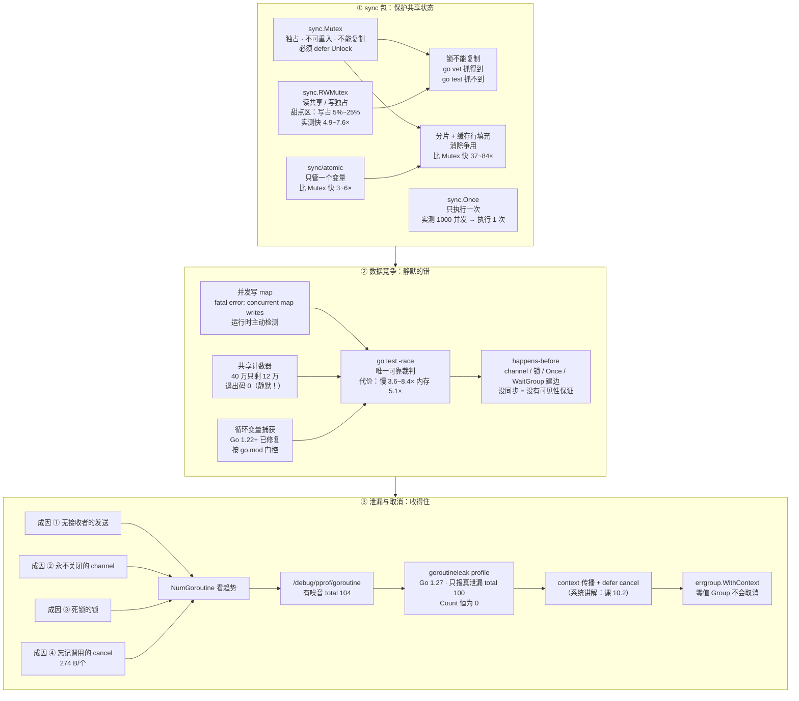

# 课 9：同步、竞争与泄漏

> 所属阶段：并发模型 ｜ 故事章节：goroutine 不是免费的 ｜ 状态：✅ 已完成（2026-09-10 ｜ 本机实测 go1.27.1 darwin/arm64）

## 🎯 本课目标

- 学完能按场景选对 `sync` 包原语（Mutex / RWMutex / Once / atomic），并知道"锁不能复制"、要配 `defer mu.Unlock()` 使用。
- 学完能识别数据竞争的典型场景、会用 `go test -race` 竞争检测器，并建立 happens-before 与内存模型的直觉。
- 学完能识别并收住 goroutine 泄漏（借助 context 取消、pprof 与 `goroutineleak` 观测），并了解 `errgroup` 的用途。

## 📍 本课在故事主线中的情节定位

小谷已经能起 goroutine、也能用 channel 传消息了，但压测一到高并发，接口又开始出错——这次不是丢数据，而是共享的那个计数器和缓存 map 数据错乱了，甚至某个版本还出现过内存只涨不降、跑一会儿就被 OOM 杀掉。他意识到"能并发"和"并发是对的"之间隔着两条深沟：数据竞争与资源泄漏。这一课是他补上并发安全的一课，也是"goroutine 不是免费的"这一章节的收束——他要把所有没刹住车的 goroutine、没保护好的共享状态全部收拢干净。

## 📌 知识点导航

| # | 知识点 | 关键点 | 状态 |
|---|--------|--------|------|
| 1 | sync 包 | ①`sync.Mutex` / `sync.RWMutex`（读多写少用 RW，但**甜点区是 5%~25% 写**）②`sync.Once` 懒初始化 ③`sync/atomic` 用于计数器等简单场景 ④**锁不要复制**（复制后就是两把互不相干的锁）；配 `defer mu.Unlock()` 用 | ✅ 已完成 |
| 2 | 数据竞争 | ①三类典型场景：并发写 map、闭包共享变量、循环里起 goroutine 忘记传参 ②`go test -race` / `go build -race` 竞争检测器（必开，代价实测 3.6~8 倍）③happens-before 直觉：channel 的收发、锁的加解锁、Once、WaitGroup 都建立顺序 ④内存模型一句话：**没有同步原语就没有可见性与顺序保证** | ✅ 已完成 |
| 3 | goroutine 泄漏与取消 | ①四种典型成因：无接收者的发送、永不关闭的 channel、死锁的锁、忘记调用的 cancel ②**取消要靠 context 传播**（⚠️ context 的系统讲解在**课 10.2**，此处只讲"用取消收口"并显式标注前向引用）③观测手段：`runtime.NumGoroutine()`、`/debug/pprof/goroutine`、Go 1.27 起 `goroutineleak` profile 转正 ④`errgroup`（`golang.org/x/sync/errgroup` v0.23.0，本机实测可用） | ✅ 已完成 |

---

# 第一幕 · 起源与场景引入：压测又崩了，但这次不一样

课 8 结束时，小谷把下单接口改成了 channel 流水线：

```go
for r := range Save(Check(Gen(订单...))) {
    fmt.Println(r)
}
```

数据不再靠共享数组传递，`-race` 干干净净。他觉得自己已经摸到 Go 并发的门道了。

然后压测第三轮，接口又开始报错。但这次的症状**完全不一样**：

```
① 统计口径对不上：后台显示今天处理了 40 万单，明细表里只有 12 万条
② 偶发 panic：fatal error: concurrent map writes（有时是 concurrent map read and map write）
③ 内存曲线只涨不降，跑 2 小时从 80 MB 涨到 3 GB，最后被 OOM kill
```

**①和②是数据竞争，③是 goroutine 泄漏。** 三条都不是"channel 没用对"，而是**channel 管不到的地方出了问题**：

- channel 能保护**通过它交接的数据**，但**管不了没走 channel 的共享状态**（那个全局计数器、那个缓存 map）；
- channel 能帮你**传话**，但**不会替你挂电话**——一个 goroutine 卡在没人接收的发送上，channel 可不会自己把它收回去。

课 8 那句口号"不要通过共享内存来通信，而要通过通信来共享内存"，说的是**理想**。现实是：总有状态必须共享（缓存、计数器、连接池），总有 goroutine 需要被明确地告知"你可以退了"。

**这就是本课的三件事**：共享状态怎么保护（sync 包）、竞争怎么发现（race 检测器）、goroutine 怎么收住（context 与泄漏观测）。

---

# 第二幕 · 认知冲突：三个"我以为"

**撞墙 1："加了 Mutex 线程就安全了，读多写少再换成 RWMutex 就行。"**

前半句对，后半句**可能白换**。本机实测：8 个 goroutine 做 80 万次操作，**纯读场景下 RWMutex 只比 Mutex 快 1.21 倍**，而 **5%~25% 写的时候能快 4.9~7.6 倍**。为什么"读越多越该用 RW"反而不成立？第四幕会给你一条完整的曲线。

**撞墙 2："程序没崩、退出码是 0，应该就没竞争了吧？"**

课 7 已经见过一次：4 个 goroutine 各加 10 万次，40 万只剩 12 万，**退出码还是 0**。数据竞争绝大多数时候是**静默**的——它不报错，只是给你一个错的结果。唯一的裁判是 `-race`。

**撞墙 3："goroutine 才 2 KB，泄漏几个没关系。"**

泄漏的 goroutine **不是按 2 KB 计费的**。一个卡住的 goroutine 会**一直持有它引用的所有东西**：那个 10 MB 的大对象、那个没关闭的文件句柄、那条数据库连接。而且泄漏是**累积**的——每小时泄漏 100 个，一天就是 2400 个。更要命的是：`context.WithTimeout` 忘记调用 `cancel`，每个泄漏的 context 实测要占 **274 B**，20 万个就是 **52 MB**。

---

# 第三幕 · 层层揭示

## 知识点 1：sync 包

### ① 一句话定义

> `sync` 包提供**保护共享状态**的原语：`Mutex`（独占）、`RWMutex`（读共享 / 写独占）、`Once`（只做一次）、`WaitGroup`（等一组）；`sync/atomic` 提供**单变量的原子操作**。三条硬规矩：**锁不能复制**、**加锁就配 `defer Unlock()`**、**Go 的锁不可重入**。

### ② 直觉建立（类比 + 类比失效边界）

**类比：一把钥匙的更衣室。**

- **`Mutex`** = 更衣室只有**一把钥匙**。谁拿到钥匙谁进去，**不管是换衣服还是只看一眼**，进去都得锁门。别人在门外排成一队。
- **`RWMutex`** = 更衣室门口挂**两种牌**：
  - 「**只读中，欢迎参观**」——多个人可以同时进去看（`RLock` 不互斥）；
  - 「**整理中，闲人免进**」——有人要动东西时挂这块牌，这时候**所有人都进不去**，而且**已经在里面参观的人得先出来**（写锁要等所有读者退出）。
- **`Once`** = 更衣室门口的**开业剪彩**：只剪一次，之后谁来都只是"哦，已经剪过了"。
- **`atomic`** = 门口的**翻牌计数器**：不需要进门（不需要加锁），在门口把数字翻一格就行，一步到位，别人要么看到翻之前、要么看到翻之后，**不会看到翻到一半**。

**类比失效的边界（三条，都是真会踩的）：**

1. **Mutex 不认人**。这把钥匙**不记录是谁拿的**——A 拿的钥匙，B 也能还回去（Go 允许一个 goroutine 加锁、另一个解锁）。所以「我进去了再拿一次钥匙」不会被识别为"同一个人"，而是**当场把自己锁死在门外**。实测见演示 1-G。
2. **RWMutex 不是"读更快"，而是"读能并行"**。如果临界区**小到几乎不花时间**（就读写一个 int），那"并行读"省下的时间，还抵不上多个人挤在同一个缓存行上互相抢的开销——**纯读时它可能只快 1.2 倍**（实测）。
3. **atomic 只管一个变量**。它能让 `n++` 变原子，但**管不了"先读 n 再改 m"这种两步操作**。凡是涉及**多个变量的一致性**，atomic 帮不了你，还是得用锁。

### ③ 核心原理

#### 四个原语的用法与边界

| 原语 | 干什么 | 典型场景 | 坑 |
|------|--------|----------|-----|
| `sync.Mutex` | 独占访问 | 保护一段要改多个字段的逻辑 | **不可重入**；不能复制 |
| `sync.RWMutex` | 读共享 / 写独占 | 配置热加载、字典缓存 | 写锁要等所有读者退出；**别在 `RLock` 里升级成 `Lock`**（会自我死锁） |
| `sync.Once` | 只执行一次 | 懒初始化单例、加载配置 | `Do` 里的函数** panic 了也算执行过了**，不会重试 |
| `sync/atomic` | 单变量原子操作 | 计数器、标志位 | 只能管一个变量；Go 1.19+ 推荐用 `atomic.Int64` 等**类型化** API |

#### Mutex 的三条硬规矩

**规矩 1：锁不能复制。** 复制一个 `sync.Mutex` 之后，你手上就有**两把互不相干的锁**——各锁各的，等于没锁。

```go
type SafeCounter struct { mu sync.Mutex; n int }

func passByValue(c SafeCounter) SafeCounter { // ❌ 值传递 = 复制了锁
    c.Inc()
    return c                                   // ❌ 返回也复制了一次
}
```

**编译器不会拦你，但 `go vet` 会。** 而且这里有个特别阴的坑：**`go test` 默认跑的 vet 子集里没有 `copylocks`**——测试全绿，问题静悄悄溜进生产。实测见演示 1-F。

**规矩 2：加锁就配 `defer Unlock()`。** 因为函数里往往有提前 `return`：

```go
func (c *Cache) Get(key string) (int, bool) {
    c.mu.Lock()
    defer c.mu.Unlock()     // ✅ 任何路径都会解锁
    v, ok := c.m[key]
    if !ok {
        return 0, false     // 有 defer 就没关系
    }
    return v, true
}
```

忘了解锁的后果不是"偶尔出错"，是**这个锁从此永久失效**，下一次加锁直接死锁（演示 1-G 有完整的 `fatal error` 现场）。

**规矩 3：Go 的锁不可重入。** 同一个 goroutine 对同一把 `Mutex` 连按两次 `Lock` → **当场死锁**。这在"公有方法加锁、私有方法也加锁、公有调私有"的写法里极其常见。

#### RWMutex 的选型：给一条带阈值的曲线

这是本知识点最容易被"读多写少用 RWMutex"一句话带过去的地方。本机实测（8 个 goroutine，总计 80 万次操作，**固定工作量 + 校验和一致**）：

| 读写比 | `Mutex` | `RWMutex` | RW 加速比 |
|--------|---------|-----------|-----------|
| 100% 写 | 74.8 ms | 59.5 ms | **1.26×** |
| 25% 写 | 73.3 ms | 14.9 ms | **4.9×** |
| **10% 写** | 72.4 ms | **9.54 ms** | **7.6×** |
| 5% 写 | 69.1 ms | 10.3 ms | **6.7×** |
| 1% 写 | 69.9 ms | 14.1 ms | **5.0×** |
| 0% 写（纯读） | 67.9 ms | 55.9 ms | **1.21×** |

**怎么读这张表：**

1. **`Mutex` 那条基本是平的**（67.9 ~ 74.8 ms）—— 因为无论读还是写，它都是独占，读写比对它没影响。
2. **`RWMutex` 的甜点区是 5% ~ 25% 写**（9.5 ~ 14.9 ms，快 **4.9 ~ 7.6 倍**）。
3. **两个反直觉的端点**：
   - **100% 写时只快 1.26 倍** —— 写锁本来就是独占的，RWMutex 此时退化成 Mutex，还多了管理读者计数的开销。
   - **纯读（0% 写）时只快 1.21 倍**，**比 10% 写时还慢 6 倍** —— 因为所有 goroutine 都在对同一个 `readerCount` 做原子自增，**缓存行在多核之间来回乒乓**，这才是瓶颈。适度穿插写操作反而让 goroutine 有机会被调度开，降低了争用（这是基于实测曲线的**推断**，不是规范保证）。

**⚠️ 另一组对照：临界区里有真实工作量时**（每次操作在锁内扫 256 个 int，8×20000 次）：

| 读写比 | `Mutex` | `RWMutex` | RW 加速比 |
|--------|---------|-----------|-----------|
| 100% 写 | 14.0 ms | 11.9 ms | 1.18× |
| 50% 写 | 19.9 ms | 11.8 ms | 1.69× |
| 25% 写 | 25.4 ms | 16.3 ms | 1.56× |
| 10% 写 | 28.6 ms | 25.4 ms | 1.13× |
| 5% 写 | 29.8 ms | 22.5 ms | 1.33× |
| 1% 写 | 30.5 ms | 16.8 ms | 1.81× |
| 0% 写（纯读） | 30.7 ms | 16.0 ms | 1.92× |

临界区变长之后，加速比**只有 1.1 ~ 1.9 倍**（扫描本身成了瓶颈，8 个核抢内存带宽）。

> **选型结论（带阈值）**：
> - **写占比 > 50%** → 直接 `Mutex`。RWMutex 最多快 1.3 倍，不值得多一层复杂度。
> - **写占比 5% ~ 25%** → **`RWMutex`，收益最大**（实测快 5 ~ 7.6 倍）。
> - **几乎纯读（< 1%）** → 先看临界区大小。极小 → 两种锁差别不大（甚至 `atomic.Value` 更好）；较大 → `RWMutex` 能到 1.8 ~ 1.9 倍。
> - **无论选哪个**：真正的性能杠杆往往不是"换锁"，而是**减小临界区**和**消除争用**（见演示 1-E 的分片，37 ~ 84 倍）。

#### atomic 与"分片"：真正的杠杆

同样是 100 万次自增（8 个 goroutine × 125000），三种实现：

| 实现 | 耗时 | 相对 Mutex |
|------|------|-----------|
| `sync.Mutex` | 89.9 ms | 1× |
| `atomic.AddInt64`（8 核抢同一个变量） | 29.9 ms | **约 3~6×** |
| **分片**（64 个独立计数器 + 缓存行填充） | **2.41 ms** | **约 37~84×** |

**结论：把争用消灭掉，比换一个更快的原语管用得多。** 一个 goroutine 用一个分片的计数器，谁也不抢谁的缓存行。

> ⚠️ 复跑波动：这一组数字在多次运行间波动较大（Mutex 89~92 ms、atomic 16~30 ms、分片 1.1~2.4 ms），**看量级（3~6 倍 vs 37~84 倍），不要看精确值**。

### ④ 示例演示（本机实测）

**演示 1-A：无保护的共享计数器 —— 竞争现场**

```go
// verify/s1_shared_counter.go
var n int
var wg sync.WaitGroup

for i := 0; i < 4; i++ {
    wg.Add(1)
    go func() {
        defer wg.Done()
        for j := 0; j < 100000; j++ {
            n++ // 没有任何保护
        }
    }()
}
wg.Wait()
fmt.Printf("期望 n = 400000\n")
fmt.Printf("实际 n = %d\n", n)
```

```console
$ for i in 1 2 3; do go run ./verify/s1_shared_counter.go; done
期望 n = 400000
实际 n = 123615
丢了多少 = 276385
期望 n = 400000
实际 n = 129453
丢了多少 = 270547
期望 n = 400000
实际 n = 127160
丢了多少 = 272840
```

**三次都不对，三次都不一样，而且没有一次报错。** 这就是数据竞争的典型长相。

> **波动说明**：这个数字每次跑都不一样，我多次复跑见过 **123615 / 129453 / 127160 / 145892 / 160693 / 202800** —— 丢的比例在 31%~69% 之间浮动。**不要记具体数字，记住"丢了一大半且每次不同"这个形态。**

**演示 1-B：加 `-race` 看它怎么说**

```console
$ go run -race ./verify/s1_shared_counter.go
==================
WARNING: DATA RACE
Read at 0x00c000012158 by goroutine 9:
  main.main.func1()
      /tmp/go-l09/verify/s1_shared_counter.go:19 +0x88

Previous write at 0x00c000012158 by goroutine 7:
  main.main.func1()
      /tmp/go-l09/verify/s1_shared_counter.go:19 +0x98
...
期望 n = 400000
实际 n = 370801
丢了多少 = 29199
Found 2 data race(s)
exit status 66
```

三个要点：

1. 它**精确指出了行号**（`s1_shared_counter.go:19`），连"读"和"上一次写"分别是哪个 goroutine 都告诉你；
2. `Found 2 data race(s)`、`exit status 66` —— **竞争检测器命中时进程退出码是 66**（这是它区别于普通失败的标志）；
3. **注意 `实际 n = 370801`** —— 开了 `-race` 之后结果反而**更接近** 400000 了，因为检测器拖慢了每个操作、改变了时序。**别用"结果对不对"判断有没有竞争**，要用 `-race`。

**演示 1-C：用 `sync.Mutex` 修好它**

```go
type Counter struct {
    mu sync.Mutex
    n  int
}

func (c *Counter) Add(delta int) {
    c.mu.Lock()
    c.n += delta
    c.mu.Unlock()
}

func (c *Counter) Value() int {
    c.mu.Lock()
    defer c.mu.Unlock() // 推荐写法：配 defer，中途 return 也不会忘
    return c.n
}
```

```console
$ for i in 1 2 3; do go run ./verify/s2_mutex_counter.go; done
期望 n = 400000
实际 n = 400000
期望 n = 400000
实际 n = 400000
期望 n = 400000
实际 n = 400000

$ go run -race ./verify/s2_mutex_counter.go
期望 n = 400000
实际 n = 400000
```

**演示 1-D：`sync.Once` —— 1000 个 goroutine 抢着初始化，只做一次**

```console
$ for i in 1 2 3; do go run ./verify/s4_once.go; done
1000 个 goroutine 都调了 load()
初始化函数实际执行次数 = 1（应为 1）
1000 个调用者拿到的结果一致？ true
1000 个 goroutine 都调了 load()
初始化函数实际执行次数 = 1（应为 1）
1000 个调用者拿到的结果一致？ true
1000 个 goroutine 都调了 load()
初始化函数实际执行次数 = 1（应为 1）
1000 个调用者拿到的结果一致？ true

$ go run -race ./verify/s4_once.go
1000 个 goroutine 都调了 load()
初始化函数实际执行次数 = 1（应为 1）
1000 个调用者拿到的结果一致？ true
```

**演示 1-E：atomic 与分片的量级差**

```console
$ go test -bench 'BenchmarkCounter' -benchtime 10x -run XXX -count=1 ./bench/
BenchmarkCounterMutex-11     	      10	  89922008 ns/op
BenchmarkCounterAtomic-11    	      10	  29887454 ns/op
BenchmarkCounterShard-11     	      10	   2411171 ns/op
PASS
```

（100 万次自增。分片版用了 64 个独立计数器 + 缓存行填充，每个 goroutine 写自己的分片）

**演示 1-F：复制锁 —— `go vet` 抓得到，`go test` 抓不到**

```console
$ go vet ./verify/s5_copylock.go
verify/s5_copylock.go:21:20: passByValue passes lock by value: command-line-arguments.SafeCounter contains sync.Mutex
verify/s5_copylock.go:23:9: return copies lock value: command-line-arguments.SafeCounter contains sync.Mutex
verify/s5_copylock.go:33:19: call of passByValue copies lock value: command-line-arguments.SafeCounter contains sync.Mutex
```

**但同一个问题写成包之后**：

```console
$ go test ./copylock/
ok  	example.com/l09/copylock	0.006s        ← ✅ 测试通过！

$ go vet ./copylock/
copylock/cl.go:13:20: PassByValue passes lock by value: example.com/l09/copylock.SafeCounter contains sync.Mutex
copylock/cl.go:13:63: return copies lock value: example.com/l09/copylock.SafeCounter contains sync.Mutex
```

**`copylocks` 不在 `go test` 默认跑的 vet 子集里。** CI 里必须显式加一步 `go vet ./...`。

**这不是"`go test` 不跑 vet"，而是"它只跑一个子集"。** 同一个包里放一个 `printf` 问题，`go test` 立刻就抓：

```console
$ cat copylock/printf_test.go
func TestPrintfBug(t *testing.T) {
	n := 1
	t.Logf("%d %s\n", n)   // 参数个数不匹配
}

$ go test ./copylock/
# example.com/l09/copylock
copylock/printf_test.go:7:13: (*testing.common).Logf format %s reads arg #2, but call has 1 arg
FAIL	example.com/l09/copylock [build failed]
```

**printf 抓得到，copylocks 抓不到 —— 差别就在"在不在默认子集里"。**

实际后果（值传递之后真的变成两把锁了）：

```console
$ go run ./verify/s5_copylock.go
原始计数器 a.n = 100
复制出来的 b.n = 101
a 和 b 现在是两把互不相干的锁 —— 各改各的，谁也拦不住谁
```

**演示 1-G：Go 的锁不可重入 + 忘了解锁的后果**

```console
$ go run ./reentrant           # 同一 goroutine 连按两次 Lock
第一次 Lock 成功
同一 goroutine 再 Lock 一次……
fatal error: all goroutines are asleep - deadlock!

goroutine 1 [sync.Mutex.Lock]:
internal/sync.runtime_SemacquireMutex(0x4472cf814008?, 0x0?, 0x27?)
	/usr/local/Cellar/go/1.27.1/libexec/src/runtime/sema.go:95 +0x28
```

忘了解锁（`s6_defer_unlock.go`，`GetBad` 在 key 不存在时提前 return 且没解锁）：

```console
$ go run ./verify/s6_defer_unlock.go
—— 先走好写法 ——
GetGood("a") = 1, true
GetGood("zzz") = 0, false
GetGood("b") = 2, true
好写法走完，锁是自由的，值=map[a:1 b:2]

—— 再走坏写法，故意查一个不存在的 key ——
GetBad("zzz") = 0, false（这一行还能打出来）
接下来任何一次加锁都会永远卡住……
fatal error: all goroutines are asleep - deadlock!

goroutine 1 [sync.Mutex.Lock]:
...
main.(*Cache).GetGood(0x7cac3fc9c020, {0x1049215a0, 0x1})
	/tmp/go-l09/verify/s6_defer_unlock.go:31 +0x88
main.main()
	/tmp/go-l09/verify/s6_defer_unlock.go:55 +0x320
exit status 2
```

**注意 `GetBad` 那一行还正常打印了**——错误发生在**下一次**加锁时。这类 bug 的现场永远离真凶有一段距离。

### ⑤ 常见误区（知识点 1）

| 误区 | 真相 |
|------|------|
| 读多写少就用 RWMutex，读越多收益越大 | **甜点区是 5%~25% 写**；纯读只快 1.21 倍（缓存行争用成了新瓶颈） |
| Go 的 Mutex 是可重入的 | **不可重入**，同 goroutine 重复 Lock 当场死锁 |
| 锁复制一份没关系 | 复制后是**两把互不相干的锁**；`go vet` 能抓，但 **`go test` 默认不抓** |
| 临界区里顺手调个外部函数 | 会**放大锁的持有时间**；还可能调回自己 → 不可重入死锁 |
| atomic 能替代锁 | 只管**一个变量**；多变量一致性还得用锁 |
| 用了 `defer Unlock()` 就绝对安全 | 在**长循环**里 `defer` 会攒着不释放（要手动 `Unlock` 或把循环体抽成函数） |

### ⑥ 一句话记住

> **锁保护的是"一段逻辑"，不是"一个变量"；锁不能复制、不可重入、必须 `defer` 解锁；选 RWMutex 的甜点区是 5%~25% 写，真正的性能杠杆是减小临界区和消除争用（分片能快 37~84 倍）。**

### 📚 官方文档

- `sync` 包总览：<https://pkg.go.dev/sync>（核查于 2026-09）
- `sync.Mutex`：<https://pkg.go.dev/sync#Mutex>（核查于 2026-09）
- `sync.RWMutex`：<https://pkg.go.dev/sync#RWMutex>（核查于 2026-09）
- `sync/atomic`：<https://pkg.go.dev/sync/atomic>（核查于 2026-09）
- `cmd/vet` 的 `copylocks` 分析器：<https://pkg.go.dev/golang.org/x/tools/go/analysis/passes/copylock>（核查于 2026-09）

---

## 知识点 2：数据竞争

### ① 一句话定义

> **数据竞争** = 两个以上的 goroutine **同时**访问同一块内存，且**至少有一个是写**，且**之间没有 happens-before 关系**。它是**未定义行为**：结果错、崩溃、还是"看起来正常"，全看运气。唯一可靠的裁判是 `go test -race`。

### ② 直觉建立（类比 + 类比失效边界）

**类比：两个人同时改同一份 Excel。**

你改 A 列、我改 B 列，各自保存 —— 最后存的那个人会把前一个人的整份覆盖掉。所以 100 次修改最后只剩 30 次生效。

**类比失效的边界：**

1. **Excel 有"最后保存者赢"的明确结果，内存没有。** 竞争行为是**未定义**的：可能丢更新、可能读到半改一半的对象、可能永远看不到对方的写。
2. **竞争不保证被观测到。** 你跑 100 次都对，第 101 次在生产上错。
3. **"我只读不写"也会构成竞争**，只要别人在写。只读的那一方同样需要同步。

### ③ 核心原理

#### 三类典型场景

| 场景 | 长相 | 后果 |
|------|------|------|
| **① 并发写 map** | 多个 goroutine 同时 `m[k] = v` | **Go 运行时主动检测，直接崩**：`fatal error: concurrent map writes` |
| **② 闭包共享变量** | 多个 goroutine 闭包捕获同一个外层变量并修改 | **静默**：数字对不上，退出码 0 |
| **③ 循环里起 goroutine 忘传参** | `for i := range xs { go func(){ use(i) }() }` | Go 1.22+ 已由**语言**修复（按 go.mod 门控），见下方 |

**关于 ①**：Go 的 map **自带**并发写检测（不需要 `-race`）。这是 Go 少有的"主动帮你抓"的情况——但**它只在你撞上那条检查时才崩**，不是每次都崩，更不代表没崩就安全。

**关于 ③**：Go 1.22 把 `for` 循环变量改成**每轮一个新变量**。官方博客 [Fixing For Loops in Go 1.22](https://go.dev/blog/loopvar-preview) 原文（核查于 2026-09）：

> To ensure backwards compatibility with existing code, the new semantics will only apply in packages contained in modules that declare **`go 1.22` or later in their `go.mod` files**.

**这是按模块门控的。** 实测（同一份源码，只改 go.mod）：

```console
$ cd /tmp/go-l09     && go run ./loopvar      # go.mod: go 1.27
out = [a b c]
out = [a b c]
out = [a b c]

$ cd /tmp/go-l09-old && go run ./loopvar      # go.mod: go 1.21
out = [  c]
out = [  c]
out = [  c]
```

`[  c]` —— 三个 goroutine **全都写到了 `out[2]`**，前两个位置空着。老语义下循环变量是整个循环共用的，goroutine 真正跑起来时 `i` 早就变成 2 了。

> ⚠️ **一个本机踩到的验证陷阱（值得记一辈子）**：上面这组对照**必须用包模式跑**（`go run ./loopvar`）。我一开始图省事用**文件模式**（`go run ./verify/d3c.go`），结果 **`go 1.21` 的模块也跑出了新语义** —— 因为文件模式下文件属于 `command-line-arguments` 伪包，**拿不到 go.mod 里的语言版本**，直接用工具链默认版本。
>
> ```console
> $ cd /tmp/go-l09-old && go run ./d3pkg        # 包模式，go.mod: go 1.21
> 循环已结束，现在调用闭包：
>   i=2 w="c"
>   i=2 w="c"
>   i=2 w="c"
>
> $ cd /tmp/go-l09-old && go run ./d3file.go    # 文件模式，同一个模块
> 循环已结束，现在调用闭包：
>   i=0 w="a"
>   i=1 w="b"
>   i=2 w="c"
> ```
>
> **凡是验证"按 go.mod 版本门控"的行为，一律用包模式。**

#### happens-before 与内存模型

Go 内存模型（[go.dev/ref/mem](https://go.dev/ref/mem)，核查于 2026-09）的核心一句话：

> **没有同步原语，就没有可见性与顺序保证。**

**什么会建立 happens-before 边**（也就是"我保证你能看到我写的结果"）：

| 动作 | 建立的边 |
|------|---------|
| `ch <- v` → `<-ch` | 发送 happens-before 接收完成 |
| `close(ch)` → 接收方收到"已关闭" | 关闭 happens-before 接收返回零值 |
| `mu.Unlock()` → 下一次 `mu.Lock()` | 解锁 happens-before 后续加锁 |
| `once.Do(f)` 里的 `f` 返回 → 任何一次 `once.Do` 返回 | f 的写入对所有人可见 |
| `wg.Done()` → `wg.Wait()` 返回 | Done happens-before Wait 返回 |
| `go f()` 语句 → f 开始执行 | 创建 happens-before 执行 |

**实践含义**：`-race` 报不报，本质上就是在问"这两次访问之间有没有 happens-before 边"。有边 → 不报；没边 → 报。

**一个反直觉的实测**：下面这段"发布对象"的代码看起来很危险（写者先准备好 `data` 再置 `ready`，两者都是普通写），但 `-race` **不报**：

```go
go func() {
    c := &Config{A: 1}
    data = c
    ready = true      // 普通写，没有任何同步原语
}()
wg.Wait()             // ← 关键：Wait 建立了 happens-before 边
if ready {
    fmt.Println("读到", data)
}
```

```console
$ go run -race ./publish2
读到 &{1}
```

**因为 `wg.Wait()` 已经建立了边**，所以这次是安全的。**去掉 `Wait`、改成自旋等 `ready`，才是真的没有边。**

> 📌 **一个必须诚实交代的实验结果**：我试图在本机（Apple M3 Pro / arm64，弱内存序架构）**复现"看到了 ready=1 但 data 不完整"这个经典可见性事故**，跑了 20 万轮 × 2 种写法（普通写 / atomic 写），**两种都是 0 次失败**：
>
> ```console
> $ go run ./publish
> 无同步发布（ready 普通写）    ：0 / 200000 轮读到不完整对象
> atomic 发布（ready 原子写）  ：0 / 200000 轮读到不完整对象
> ```
>
> **这不代表无同步写法是安全的。** 相反，它恰恰说明了 happens-before 为什么重要：**内存模型的保证是规范层面的，不是经验层面的。** "我实测没出问题"不能作为不写同步的理由——换一台机器、换一个 Go 版本、换一种负载，结论就可能翻转。**同步原语买的是"保证"，不是"概率"。**

#### 竞争检测器的代价（为什么不能常开在生产）

本机实测（同一份基准，开与不开 `-race`）：

| 指标 | 不开 `-race` | 开 `-race` | 倍数 |
|------|-------------|-----------|------|
| 计数器（Mutex）耗时 | 92.2 ms | 334 ms | **3.6×** |
| 计数器（atomic）耗时 | 25.1 ~ 30.5 ms | 193 ~ 227 ms | **6.4 ~ 8.4×** |
| 峰值内存（RSS） | 4.51 MB | 23.2 MB | **5.1×** |
| 二进制体积 | 2.43 MB | 3.07 MB | **+26%** |

**所以：测试环境必开，生产环境不开**（除非你在排查一个只在生产出现的竞争，可以临时灰度开一台）。

### ④ 示例演示（本机实测）

**演示 2-A：并发写 map —— Go 自己会崩**

```console
$ for i in 1 2 3; do go run ./verify/d1_map_write.go; done
fatal error: concurrent map writes
fatal error: concurrent map writes
fatal error: concurrent map writes
```

```console
$ tail -5 /tmp/go-l09/d1_1.txt
main.main.func1(0x1)
	/tmp/go-l09/verify/d1_map_write.go:18 +0x68
created by main.main in goroutine 1
	/tmp/go-l09/verify/d1_map_write.go:15 +0x50
exit status 2
```

**三次全崩，不需要 `-race`。** 这是 Go 运行时的主动检测。

**演示 2-B：一边写一边读 —— 错误消息会变**

```console
$ for i in 1 2 3; do go run ./verify/d2_map_rw.go; done
fatal error: concurrent map writes          ← 第 1 次
fatal error: concurrent map writes          ← 第 2 次
fatal error: concurrent map read and map write   ← 第 3 次
```

**同一个程序，三次跑出两种错误消息。** 因为运行时有两条检查（写-写、读-写），撞上哪条就报哪条。**别把某一条错误消息当成"这类 bug 的固定长相"。**

**演示 2-C：循环变量 —— 版本门控对照**（见上方"关于 ③"，包模式实测）

**演示 2-D：制造竞争 → `-race` 抓到 → 修复**

```go
// racetest/counter.go
type RacyCounter struct{ n int }
func (c *RacyCounter) Add() { c.n++ }              // ❌ 无保护

type SafeCounter struct { mu sync.Mutex; n int }
func (c *SafeCounter) Add() { c.mu.Lock(); c.n++; c.mu.Unlock() }   // ✅
```

```console
$ go test -v ./racetest/
=== RUN   TestRacyCounter
    counter_test.go:27: 无保护计数器 = 132130，期望 400000
--- FAIL: TestRacyCounter (0.00s)
=== RUN   TestSafeCounter
--- PASS: TestSafeCounter (0.02s)
=== RUN   TestAtomicCounter
--- PASS: TestAtomicCounter (0.00s)
FAIL
```

**注意：不开 `-race` 时，`TestRacyCounter` 也失败了**——但它是因为**结果不对**（132130 ≠ 400000）才失败的，不是因为检测到竞争。换个场景（比如只是偶尔读到脏值），它可能就**通过**了。

> **波动说明**：`无保护计数器` 的值每次都不同（实测见过 132130 / 184670 …）。**它偶尔也可能恰好等于 400000 而让测试通过** —— 这正是"竞争不保证被观测到"的含义。

```console
$ go test -race -run TestRacyCounter ./racetest/
==================
WARNING: DATA RACE
Read at 0x00c0000122e8 by goroutine 11:
  example.com/l09/racetest.(*RacyCounter).Add()
      /tmp/go-l09/racetest/counter.go:8 +0x30
...
    testing.go:1865: race detected during execution of test
FAIL
FAIL	example.com/l09/racetest	0.024s
FAIL
$ echo $?
1
```

修复后的两个版本在 `-race` 下全绿：

```console
$ go test -race -v ./racetest/ 2>&1 | grep -E "^(--- |ok|FAIL)"
--- FAIL: TestRacyCounter (0.02s)
--- PASS: TestSafeCounter (0.14s)
--- PASS: TestAtomicCounter (0.13s)
```

（顺带看到代价：同样两个测试，不开 race 是 0.02s / 0.00s，开了是 0.14s / 0.13s）

**演示 2-E：`-race` 的代价实测**

```console
$ go build      -o bin_norace ./verify/s2_mutex_counter.go
$ go build -race -o bin_race   ./verify/s2_mutex_counter.go

$ ls -l bin_norace bin_race
2430738  bin_norace
3068226  bin_race

$ /usr/bin/time -l ./bin_norace 2>&1 | grep "maximum resident"
              4505600  maximum resident set size

$ /usr/bin/time -l ./bin_race 2>&1 | grep "maximum resident"
             23199744  maximum resident set size
```

（体积 2.43 MB → 3.07 MB；峰值内存 4.51 MB → 23.2 MB）

### ⑤ 常见误区（知识点 2）

| 误区 | 真相 |
|------|------|
| 程序没崩、退出码 0 就没竞争 | 竞争绝大多数是**静默**的；40 万只剩 12 万，退出码照样 0 |
| 我只读不写，不用加锁 | 只要有别人在写，**只读方也构成竞争** |
| 并发写 map 会返回 error | 直接 **`fatal error`**（进程死，不是 error） |
| 跑了 100 次都对，代码就是对的 | 竞争不保证被观测到；`-race` 才是裁判 |
| `-race` 全绿 = 没有并发 bug | 只能抓**实际被执行到**的竞争；**抓不到逻辑错误**（比如该加锁的地方锁错了对象） |
| 把 `-race` 开到生产 | 实测慢 3.6~8.4 倍、内存 5.1 倍；只应在测试环境常开 |
| 实测没复现可见性问题，说明不用同步 | 内存模型的保证是**规范层面**的；本机 20 万轮没复现 ≠ 安全 |

### ⑥ 一句话记住

> **竞争的判定只有一条：两个 goroutine 同时访问同一块内存、至少一个在写、且之间没有 happens-before 边。它不保证被观测到——所以测试必开 `-race`（代价 3.6~8.4 倍），生产不开。**

### 📚 官方文档

- Go 内存模型：<https://go.dev/ref/mem>（核查于 2026-09）
- 竞争检测器（Go Race Detector）：<https://go.dev/doc/articles/race_detector>（核查于 2026-09）
- `go` 命令的 `-race` 标志：<https://pkg.go.dev/cmd/go#hdr-Compile_packages_and_dependencies_with_race_detector>（核查于 2026-09）
- Fixing For Loops in Go 1.22：<https://go.dev/blog/loopvar-preview>（核查于 2026-09）

---

## 知识点 3：goroutine 泄漏与取消

### ① 一句话定义

> **goroutine 泄漏** = goroutine 卡在某个并发原语上，**永远不可能被解除阻塞**，于是它和它引用的所有东西都无法被回收。**取消必须靠 `context` 传播**（⚠️ `context` 的系统讲解在**课 10.2**，本课只讲"用取消收口"）。

Go 1.27 官方对"泄漏 goroutine"的定义（Go 1.27 Release Notes，核查于 2026-09）：

> A *leaked* goroutine is a goroutine blocked on some concurrency primitive (channels, `sync.Mutex`, `sync.Cond`, etc) that **cannot possibly become unblocked**.

### ② 直觉建立（类比 + 类比失效边界）

**类比：餐厅里占着座位的客人。**

goroutine 是座位，内存是餐厅面积。一个泄漏的 goroutine 就像一个**吃完不走、也不打算走**的客人——座位空不出来，新客人进不来，餐厅就这么被占满。

**类比失效的边界：**

1. **客人好歹会自己走，泄漏的 goroutine 不会。** 没有任何机制会自动回收一个卡住的 goroutine——GC 也管不了（它是"可达"的，因为还卡在 channel 的等待队列里）。
2. **泄漏的成本不是"2 KB"。** 一个卡住的 goroutine 会**一直持有**它栈上和闭包里引用的所有东西：那个 10 MB 的对象、那个打开的文件、那条数据库连接。
3. **进程退出时全部消失。** 所以泄漏只在**长驻进程**（服务、daemon）里才是问题；跑完就退的 CLI 工具不用管——但这也意味着**测试里发现不了泄漏**，因为测试进程结束了一切归零。

### ③ 核心原理

#### 四类典型成因

| # | 成因 | 长相 | 卡在哪 |
|---|------|------|--------|
| ① | **无接收者的发送** | `ch := make(chan int); ch <- 1`（没别人收） | `chansend` |
| ② | **永不关闭的 channel** | `<-ch`（没人 close 也没人发） | `chan receive` |
| ③ | **死锁的锁** | 上一把锁忘了 `Unlock`，后面的人全堵着 | `sync.Mutex.Lock` |
| ④ | **忘记调用的 cancel** | `ctx, _ := context.WithCancel(...)`（丢弃了 cancel） | `<-ctx.Done()` |

**①、②、③** 是"goroutine 自己卡住了"。
**④** 更隐蔽：**context 本身是好的，只是没人去按那个停止按钮**——而且它还会**额外占内存**（每个未取消的 `WithTimeout` 会一直持有定时器，实测 **274 B/个**）。

#### 三种观测手段

| 手段 | 怎么用 | 特点 |
|------|--------|------|
| `runtime.NumGoroutine()` | 代码里打印 / 暴露成监控指标 | **最简单**，一条曲线就能看出泄漏趋势；但**分不出是谁** |
| `/debug/pprof/goroutine` | `import _ "net/http/pprof"` 后 curl | **能定位到文件和行号**；但**包含大量正常 goroutine 的噪音** |
| **`goroutineleak` profile**（Go 1.27+） | `pprof.Lookup("goroutineleak")` 或 `/debug/pprof/goroutineleak` | **只报"不可能解除阻塞"的**，噪音全滤掉 |

**实测对比（同一个进程里 100 个泄漏的 goroutine）：**

```
/debug/pprof/goroutine?debug=1       → goroutine profile: total 104
/debug/pprof/goroutineleak?debug=1   → goroutineleak profile: total 100
```

**104 vs 100** —— `goroutine` 把主协程、HTTP handler、pprof 自己都算进去了；`goroutineleak` **只留真正泄漏的 100 个**，而且直接指出卡在哪一行。

> ⚠️ **两个必须知道的坑**：
> 1. **`pprof.Lookup("goroutineleak").Count()` 恒为 0**（课 8 已实测）。判断有没有泄漏**必须读 `WriteTo` 的内容**。
> 2. **`WriteTo(w, 0)` 输出的是 protobuf 二进制**（一堆乱码）。要可读文本必须用 **debug ≥ 1**。

#### 取消：靠 context 传播

```go
ctx, cancel := context.WithCancel(context.Background())
defer cancel()          // ← 这一行是"第四类泄漏"的全部防线

go func() {
    select {
    case <-ctx.Done():  // 只认取消信号
        return
    }
}()
```

三条纪律：

1. **`defer cancel()` 立刻写**，不要"等会儿再写"；
2. **把 ctx 一路传下去**——传给下游函数、传给 HTTP 请求、传给数据库查询。context 的价值就在于**可传播**；
3. **`cancel` 要被调用，但不要提前调用**——在一个还会用到 ctx 的地方提前 cancel，会让下游莫名其妙地失败。

> ⚠️ **前向引用**：`context.Context` 的**系统讲解在课 10.2**。本课只把它当作"一个能被关闭的 channel"来用（`ctx.Done()` 返回 `<-chan struct{}`）。

#### errgroup：WaitGroup + 错误传播 + 取消

`golang.org/x/sync/errgroup`（本机实测 v0.23.0 可用）解决的是"并发跑一批任务，第一个出错就全停"这个高频需求：

```go
g, ctx := errgroup.WithContext(context.Background())
for i := 0; i < 5; i++ {
    g.Go(func() error {
        select {
        case <-ctx.Done(): return ctx.Err()
        case <-time.After(...): /* 干活 */ return nil
        }
    })
}
if err := g.Wait(); err != nil { /* 第一个非 nil 错误 */ }
```

官方源码注释原文（v0.23.0，核查于 2026-09）：

> A zero Group is valid, has no limit on the number of active goroutines, and **does not cancel on error**.

**这是 errgroup 最大的坑**：`var g errgroup.Group`（零值）**不会在出错时取消**。想要"出错就取消"，**必须**用 `errgroup.WithContext()`。实测见演示 3-E。

### ④ 示例演示（本机实测）

**演示 3-A：三类泄漏现场 + NumGoroutine**

```console
$ go run ./verify/l1_leak.go
起点 NumGoroutine = 1
起了 300 个注定卡住的 goroutine 后：NumGoroutine = 301
```

（100 个卡在 `ch <- id` + 100 个卡在 `<-ch` + 100 个卡在 `mu.Lock()`）

**演示 3-B：goroutine profile vs goroutineleak profile**

```console
$ go run ./verify/l1_leak.go     # 接上面
---- 观测 1：goroutine profile（debug=1）----
  goroutine profile: total 301
  100 @ 0x102627f18 0x1025c2224 0x1025c1e38 0x10267c700 0x10262e024
  #	0x10267c6ff	main.main.func1+0x3f	/tmp/go-l09/verify/l1_leak.go:20
  
  100 @ 0x102627f18 0x1025c30b0 0x1025c2c34 0x10267c7b0 0x10262e024
  #	0x10267c7af	main.main.func2+0x2f	/tmp/go-l09/verify/l1_leak.go:28
  
  100 @ 0x102627f18 0x102608354 ...
  #	0x102628fe7	internal/sync.runtime_SemacquireMutex+0x27	.../runtime/sema.go:95
  #	0x102630d73	internal/sync.(*Mutex).lockSlow+0x173		.../internal/sync/mutex.go:149

---- 观测 2：Go 1.27 的 goroutineleak profile ----
profile 存在？true
Count() = 0   ← 恒为 0，别用它判断有没有泄漏
  goroutineleak profile: total 300
  100 @ 0x1027b7f18 ... main.main.func1+0x3f	/tmp/go-l09/verify/l1_leak.go:20
  100 @ 0x1027b7f18 ... main.main.func2+0x2f	/tmp/go-l09/verify/l1_leak.go:28
  100 @ 0x1027b7f18 ... runtime_SemacquireMutex	.../runtime/sema.go:95
```

`goroutine: total 301`（含主协程）vs `goroutineleak: total 300`（**正好是泄漏的那 300 个**），三组各 100，全部带文件行号。

**演示 3-C：HTTP 端点版（线上怎么查）**

```console
$ go run ./httppprof
NumGoroutine = 102
pprof 已挂在 http://127.0.0.1:8099/debug/pprof/

$ curl -s "http://127.0.0.1:8099/debug/pprof/goroutine?debug=1" | head -3
goroutine profile: total 104
100 @ 0x104c40688 0x104bd18a4 0x104bd14b8 0x104debb40 0x104c476a4
#	0x104debb3f	main.main.func1+0x3f	/tmp/go-l09/httppprof/main.go:16

$ curl -s "http://127.0.0.1:8099/debug/pprof/goroutineleak?debug=1"
goroutineleak profile: total 100
100 @ 0x104c40688 0x104bd18a4 0x104bd14b8 0x104debb40 0x104c476a4
#	0x104debb3f	main.main.func1+0x3f	/tmp/go-l09/httppprof/main.go:16
```

**104 vs 100，噪音被滤掉了。** 只要 `import _ "net/http/pprof"`，这两条端点就有了。

**演示 3-D：忘记 cancel vs 老老实实 cancel**

```console
$ go run ./verify/l2_cancel.go
起点 NumGoroutine = 1

===== A：起了 1000 个 worker，但忘了调 cancel =====
worker 都起来了，NumGoroutine = 1001
（主协程不做任何事 —— 这 1000 个 goroutine 永远等不到 Done，全部泄漏）

===== B：同样 1000 个 worker，但调了 cancel =====
worker 都起来了，NumGoroutine = 2001
cancel() + Wait() 之后，NumGoroutine = 1001
（B 的 1000 个全收干净了 —— 剩下的 1001 = 1 个主协程 + A 段那 1000 个泄漏的）
```

**演示 3-E：忘记 cancel 的额外内存代价**

```console
$ go run ./timerleak
A 忘了 cancel：创建 200000 个 WithTimeout(1h) 后，堆占用 52.57 MB（之前 0.22 MB）
B 立刻 cancel：创建 200000 个并释放后，堆占用 52.57 MB（之前 52.57 MB）
```

**A 段：52.57 − 0.22 = 52.35 MB / 20 万个 ≈ 274 B 每个。**
**B 段：堆占用纹丝不动**——每个 context 用完立刻 `cancel()`，零新增。

> **波动说明**：复跑得到 52.65 MB（≈275 B/个），与 52.57 差 0.08 MB。**看 274 B/个 这个量级，不要看小数点。**

**演示 3-F：errgroup 四连**

```console
$ go run ./egdemo
===== 演示 1：基本用法 =====
  任务 0 成功
  任务 1 成功
  任务 3 成功
  任务 4 成功
  Wait 返回：任务 2 失败了

===== 演示 2：WithContext（出错自动取消）=====
  Wait 返回：任务 1 炸了
  因取消而提前退出的任务数 = 3（其余任务被收住了，没泄漏）

===== 演示 3：zero Group 不会取消（坑）=====
  等了 500ms，Wait 还没返回 ——
  zero Group 即使有任务出错也不会取消，那个 goroutine 永远卡着，Wait 永远不返回

===== 演示 4：SetLimit(3) 限制并发 =====
  10 个任务、限流 3，实测峰值并发 = 3（应为 3）
```

演示 3 最初是直接死锁的（我第一版写成了裸 `g.Wait()`，程序直接 `fatal error: all goroutines are asleep - deadlock!`）——**这本身就是"zero Group 不取消"最直观的后果展示**，改造成超时观察只是为了让它后面几个演示能继续跑。

### ⑤ 常见误区（知识点 3）

| 误区 | 真相 |
|------|------|
| goroutine 才 2 KB，泄漏几个无所谓 | 它**持有**的所有东西都回收不了；而且是**累积**的 |
| 进程退出了泄漏就没了，不用管 | 服务是长驻的；而且**测试进程退出时一切归零，测试发现不了泄漏** |
| `NumGoroutine()` 涨了就是泄漏 | 可能是正常的波峰；要看**趋势**和 **profile 里的阻塞位置** |
| `goroutineleak` 用 `Count()` 判断 | **`Count()` 恒为 0**，必须读 `WriteTo` 的内容 |
| `WriteTo(w, 0)` 拿可读文本 | debug=0 是 **protobuf 二进制**；要文本得用 **debug ≥ 1** |
| `ctx, _ := context.WithCancel(...)` 不要紧 | **第四类泄漏**；实测 20 万个占 **52 MB** |
| `errgroup.Group{}` 出错会自动取消 | **不会**。官方原话："does not cancel on error"。要取消必须用 `WithContext` |
| 超时了任务就被取消了 | 没有。select 超时只是**不等了**，goroutine 还在跑（课 8 已强调） |

### ⑥ 一句话记住

> **泄漏 = 卡住且不可能解除阻塞。取消只能靠 context 传播（`defer cancel()` 一行都不能少）；观测靠 `goroutineleak`（Go 1.27，只报真泄漏、带行号，但 `Count()` 恒为 0）。**

### 📚 官方文档

- Go 1.27 Release Notes（`goroutineleak` profile）：<https://go.dev/doc/go1.27>（核查于 2026-09）
- `runtime/pprof`：<https://pkg.go.dev/runtime/pprof>（核查于 2026-09）
- `net/http/pprof`：<https://pkg.go.dev/net/http/pprof>（核查于 2026-09）
- `errgroup`（golang.org/x/sync v0.23.0）：<https://pkg.go.dev/golang.org/x/sync/errgroup>（核查于 2026-09）
- `context`（系统讲解见课 10.2）：<https://pkg.go.dev/context>（核查于 2026-09）

---

# 第四幕 · 实操验证

> 本机环境：go1.27.1 darwin/arm64，Apple M3 Pro（5 性能核 + 6 能效核，`GOMAXPROCS=11`）。
> 所有探针在 `/tmp/go-l09/`（模块 `example.com/l09`，`go 1.27`）；版本对照用的老模块在 `/tmp/go-l09-old/`（`go 1.21`）。

## 实操 1：sync 包 —— 保护、选型、避坑

### 1.1 制造竞争 → 加 Mutex 修好

见演示 1-A / 1-B / 1-C。核心对照：

```console
$ for i in 1 2 3; do go run ./verify/s1_shared_counter.go; done
期望 n = 400000
实际 n = 123615
丢了多少 = 276385
...

$ go run -race ./verify/s1_shared_counter.go 2>&1 | tail -3
期望 n = 400000
实际 n = 370801
丢了多少 = 29199
Found 2 data race(s)
exit status 66

$ for i in 1 2 3; do go run ./verify/s2_mutex_counter.go; done
期望 n = 400000
实际 n = 400000
...
```

### 1.2 RWMutex 选型：读写比扫描

```console
$ go test -bench 'Benchmark(Mutex|RW)(100|25|10|5|1|0)$' -benchtime 5x -run XXX -count=1 ./bench/
BenchmarkMutex100-11    	       5	  74785933 ns/op
BenchmarkMutex25-11     	       5	  73315275 ns/op
BenchmarkMutex10-11     	       5	  72367933 ns/op
BenchmarkMutex5-11      	       5	  69102292 ns/op
BenchmarkMutex1-11      	       5	  69868667 ns/op
BenchmarkMutex0-11      	       5	  67909058 ns/op
BenchmarkRW100-11       	       5	  59533633 ns/op
BenchmarkRW25-11        	       5	  14910225 ns/op
BenchmarkRW10-11        	       5	   9540033 ns/op
BenchmarkRW5-11         	       5	  10259917 ns/op
BenchmarkRW1-11         	       5	  14077667 ns/op
BenchmarkRW0-11         	       5	  55876658 ns/op
```

**`Mutex` 是一条 68~75 ms 的平线；`RWMutex` 在 5%~25% 写时降到 9.5~14.9 ms（快 4.9~7.6 倍），两个端点（纯读 / 全写）都只剩 1.2 倍左右。**

<details>
<summary><b>🧪 基准源码</b>（点开可复现）</summary>

```go
const (
	workers = 8
	opsPerG = 100000
)

type MutexBox struct { mu sync.Mutex; n int }
func (b *MutexBox) read() int { b.mu.Lock(); v := b.n; b.mu.Unlock(); return v }
func (b *MutexBox) write()    { b.mu.Lock(); b.n++; b.mu.Unlock() }

type RWBox struct { mu sync.RWMutex; n int }
func (b *RWBox) read() int { b.mu.RLock(); v := b.n; b.mu.RUnlock(); return v }
func (b *RWBox) write()    { b.mu.Lock(); b.n++; b.mu.Unlock() }

// writeDenom 控制读写比：每 writeDenom 次操作里有 1 次写
// 1=100%写 4=25%写 10=10%写 20=5%写 100=1%写 0=纯读
func runRW(writeDenom int) int {
	var b RWBox
	var wg sync.WaitGroup
	for w := 0; w < workers; w++ {
		wg.Add(1)
		go func() {
			defer wg.Done()
			for i := 0; i < opsPerG; i++ {
				if writeDenom > 0 && i%writeDenom == 0 {
					b.write()
				} else {
					_ = b.read()
				}
			}
		}()
	}
	wg.Wait()
	return b.n
}
```

**关键设计**：①**固定工作量**（8×100000 次操作，与读写比无关）；②每次跑完都**校验写次数**是否与配置一致——确保"快"不是因为少干了活。

</details>

### 1.3 atomic 与分片的量级差

```console
$ go test -bench 'BenchmarkCounter' -benchtime 10x -run XXX -count=1 ./bench/
BenchmarkCounterMutex-11     	      10	  89922008 ns/op
BenchmarkCounterAtomic-11    	      10	  29887454 ns/op
BenchmarkCounterShard-11     	      10	   2411171 ns/op
```

分片版的关键（**缓存行填充**）：

```go
type ShardCounter struct {
	shards [64]struct {
		n  int64
		_  [56]byte // 填充，让每个分片独占一个 64B 缓存行
	}
}
```

### 1.4 复制锁：`go test` 抓不到，`go vet` 才抓得到

```console
$ go test ./copylock/
ok  	example.com/l09/copylock	0.006s

$ go vet ./copylock/
copylock/cl.go:13:20: PassByValue passes lock by value: ...SafeCounter contains sync.Mutex
copylock/cl.go:13:63: return copies lock value: ...SafeCounter contains sync.Mutex
```

### 1.5 锁不可重入 + 忘解锁

见演示 1-G（两条完整的 `fatal error: all goroutines are asleep - deadlock!` 现场）。

## 实操 2：数据竞争 —— 制造、发现、修复

### 2.1 并发写 map（Go 自己崩）

```console
$ for i in 1 2 3; do go run ./verify/d1_map_write.go; done
fatal error: concurrent map writes
fatal error: concurrent map writes
fatal error: concurrent map writes
```

### 2.2 一边写一边读（错误消息会变）

```console
$ for i in 1 2 3; do go run ./verify/d2_map_rw.go; done
fatal error: concurrent map writes
fatal error: concurrent map writes
fatal error: concurrent map read and map write
```

### 2.3 循环变量：版本门控（**必须用包模式**）

```console
$ cd /tmp/go-l09-old && go run ./d3pkg        # 包模式，go.mod: go 1.21
循环已结束，现在调用闭包：
  i=2 w="c"
  i=2 w="c"
  i=2 w="c"

$ cd /tmp/go-l09-old && go run ./d3file.go    # 文件模式，同一个模块！
循环已结束，现在调用闭包：
  i=0 w="a"
  i=1 w="b"
  i=2 w="c"
```

**文件模式下语言版本不受 go.mod 门控。** 验证版本相关的行为一律用 `go run ./pkg`。

### 2.4 制造 → `-race` 抓到 → 修复（完整闭环）

```console
$ go test -v ./racetest/
--- FAIL: TestRacyCounter (0.00s)     ← 132130 ≠ 400000
--- PASS: TestSafeCounter (0.02s)
--- PASS: TestAtomicCounter (0.00s)

$ go test -race -run TestRacyCounter ./racetest/ ; echo "exit=$?"
==================
WARNING: DATA RACE
Read at 0x00c0000122e8 by goroutine 11:
  example.com/l09/racetest.(*RacyCounter).Add()
      /tmp/go-l09/racetest/counter.go:8 +0x30
    testing.go:1865: race detected during execution of test
FAIL
exit=1
```

### 2.5 `-race` 的代价

```console
$ ls -l bin_norace bin_race
2430738  bin_norace
3068226  bin_race

$ /usr/bin/time -l ./bin_norace 2>&1 | grep "maximum resident"
              4505600  maximum resident set size
$ /usr/bin/time -l ./bin_race 2>&1 | grep "maximum resident"
             23199744  maximum resident set size
```

### 2.6 happens-before（含一次诚实的"没复现"）

```console
$ go run -race ./publish2          # 有 wg.Wait() 建边 → 不报
读到 &{1}

$ go run ./publish                 # 试图复现可见性事故
无同步发布（ready 普通写）    ：0 / 200000 轮读到不完整对象
atomic 发布（ready 原子写）  ：0 / 200000 轮读到不完整对象
```

**20 万轮没复现 ≠ 安全。** 内存模型的保证是规范层面的，不是经验层面的。

## 实操 3：goroutine 泄漏与取消

### 3.1 三类泄漏 + 两种 profile

见演示 3-A / 3-B。`goroutine: total 301` vs `goroutineleak: total 300`。

### 3.2 HTTP 端点版（线上姿势）

```console
$ curl -s "http://127.0.0.1:8099/debug/pprof/goroutine?debug=1" | head -1
goroutine profile: total 104
$ curl -s "http://127.0.0.1:8099/debug/pprof/goroutineleak?debug=1" | head -1
goroutineleak profile: total 100
```

### 3.3 cancel 前后对照

```console
===== A：起了 1000 个 worker，但忘了调 cancel =====
worker 都起来了，NumGoroutine = 1001
===== B：同样 1000 个 worker，但调了 cancel =====
cancel() + Wait() 之后，NumGoroutine = 1001
（B 的 1000 个全收干净了 —— 剩下的 1001 = 1 个主协程 + A 段那 1000 个泄漏的）
```

### 3.4 忘了 cancel 的内存代价

```console
A 忘了 cancel：创建 200000 个 WithTimeout(1h) 后，堆占用 52.57 MB（之前 0.22 MB）
B 立刻 cancel：创建 200000 个并释放后，堆占用 52.57 MB（之前 52.57 MB）
```

**274 B/个。**

### 3.5 errgroup

见演示 3-F 的四连输出。

---

# 第五幕 · 体系收束

## 知识点 1 收束：sync 包

| 问 | 答 | 实测 |
|----|----|------|
| 什么时候用 Mutex？ | 要保护**一段逻辑 / 多个字段** | 400000 修好了 |
| 什么时候用 RWMutex？ | **写占比 5%~25%** 收益最大 | 快 4.9~7.6 倍；纯读只快 1.21 倍 |
| 什么时候用 atomic？ | **单个**计数器 / 标志位 | 比 Mutex 快 3~6 倍 |
| 真正的性能杠杆？ | **消除争用**（分片 + 缓存行填充） | 比 Mutex 快 **37~84 倍** |
| 锁能复制吗？ | 不能。复制后是两把锁 | `go vet` 抓得到，`go test` **抓不到** |
| 锁可重入吗？ | **不可重入**，重复 Lock 当场死锁 | `fatal error: all goroutines are asleep` |
| 怎么保证解锁？ | `defer mu.Unlock()` | 忘解锁 → 下一次加锁永久卡死 |

## 知识点 2 收束：数据竞争

**判定三条件**：两个 goroutine 同时访问同一块内存 + 至少一个在写 + 之间没有 happens-before 边。

| 场景 | 现象 | 谁抓 |
|------|------|------|
| 并发写 map | `fatal error: concurrent map writes` | **运行时主动**（不需要 -race） |
| 并发读写 map | `concurrent map read and map write`（消息会变） | **运行时主动** |
| 共享计数器 | 静默，40 万只剩 12 万 | **只有 `-race`** |
| 循环变量捕获 | Go 1.22+ 已修复（按 go.mod 门控） | `-race` 抓老语义 |

**`-race` 的代价**：慢 3.6~8.4 倍、内存 5.1 倍、体积 +26% → **测试必开，生产不开**。

## 知识点 3 收束：goroutine 泄漏与取消

| 问 | 答 |
|----|----|
| 什么是泄漏？ | 卡在并发原语上且**不可能解除阻塞**（Go 1.27 官方定义） |
| 四类成因 | ①无接收者的发送 ②永不关闭的 channel ③死锁的锁 ④忘记调用的 cancel |
| 怎么观测？ | `NumGoroutine()` 看趋势 → `goroutine` profile 看位置 → **`goroutineleak` 只报真泄漏**（`Count()` 恒为 0，要读 `WriteTo`） |
| 怎么收口？ | **context 传播 + `defer cancel()`**（系统讲解在课 10.2） |
| 批量任务？ | `errgroup.WithContext`（**零值 Group 不会取消**）+ `SetLimit` 限并发 |
| 忘了 cancel 多贵？ | **274 B/个**（20 万个 = 52 MB） |

## 小谷的收尾

他的压测三道题，现在都有答案了：

| 症状 | 根因 | 解法 |
|------|------|------|
| ① 40 万单只统计到 12 万 | 共享计数器无保护（**数据竞争**） | `sync.Mutex` → 实测 400000；高频场景改分片（快 37~84 倍） |
| ② `fatal error: concurrent map writes` | 并发写 map | `sync.RWMutex`（配置类缓存写占比低，正好在甜点区） |
| ③ 内存只涨不降 | ① goroutine 卡在没人收的 channel ② `context` 忘了 `cancel` | `goroutineleak` profile 定位 → context 收口 + `defer cancel()` |

**他现在写完一段并发代码会自检五句**（课 8 的三句 + 本课加的两句）：

1. 谁来关这个 channel？（课 8）
2. 交出去的东西，我还在碰吗？（课 8）
3. 超时之后，那个 goroutine 还在跑吗？（本课 → **用 context 收**）
4. 共享的这块内存，谁在保护它？（本课 → **锁 / atomic / 还是根本不该共享**）
5. 这个 goroutine 有没有退出路径？（本课 → **没有就是泄漏**）

第三、四、五句，就是本课的全部。

## 阶段 3 的进度

阶段 3 是一条递进链：**能起（课 7）→ 能通信（课 8）→ 能收住（课 9）**。

- ✅ 课 7：能把 goroutine 开起来并等它结束（`wg.Go` + `Wait`）
- ✅ 课 8：能让它们有序地互相传话（channel / select / 方向 / 所有权）
- ✅ 课 9：能保护共享状态、发现竞争、收住泄漏（sync / `-race` / context + `goroutineleak`）

**阶段 3 闭环，27 / 45 知识点。** 小谷的"goroutine 不是免费的"这一章到此结束——他从一个只会写 `go f()` 的人，变成了能回答"这 goroutine 怎么停"的人。

**下一章（阶段 4《标准库与网络编程》）**：故事从"内部怎么并发"转向"对外怎么提供服务"。第一课（课 10）会正式讲 `io.Reader` / `io.Writer` 这套"流式"哲学，以及本课一直借用的 `context` 的完整机制——**课 9 在这里埋的两处前向引用（课 9.3 的 `ctx.Done()`、课 10.2 的 context 系统讲解），会在那里合拢。**

---

## 📋 速查卡

| 分类 | 写法 | 说明 |
|------|------|------|
| 独占锁 | `mu.Lock()` / `defer mu.Unlock()` | **必须配 defer**；**不可重入**；不能复制 |
| 读写锁 | `mu.RLock()` / `mu.RUnlock()` | **甜点区 5%~25% 写**（快 4.9~7.6 倍）；纯读只快 1.21 倍 |
| 一次性 | `once.Do(f)` | 只执行一次；`f` panic 了也算执行过 |
| 原子 | `atomic.AddInt64(&n, 1)` | 只管**一个**变量；比 Mutex 快 3~6 倍 |
| 消除争用 | 分片 + `[56]byte` 填充 | 比 Mutex 快 **37~84 倍** |
| 检测复制锁 | `go vet ./...` | **`go test` 默认不查 `copylocks`**，必须显式跑 |
| 竞争检测 | `go test -race ./...` | **并发代码必开**；命中退出码 66（测试进程报 1） |
| 代价 | — | 慢 3.6~8.4 倍 / 内存 5.1 倍 / 体积 +26% |
| goroutine 数 | `runtime.NumGoroutine()` | 看**趋势**；暴露成监控指标 |
| 定位阻塞 | `/debug/pprof/goroutine?debug=1` | 带文件行号，但有噪音 |
| **只报泄漏** | `/debug/pprof/goroutineleak?debug=1` | **Go 1.27+**；`Count()` 恒为 0，要读 `WriteTo`（**debug ≥ 1**） |
| 取消 | `ctx, cancel := context.WithCancel(...)` + `defer cancel()` | 忘调 = 第四类泄漏，**274 B/个** |
| 超时取消 | `context.WithTimeout(ctx, d)` | 同样必须 `defer cancel()` |
| 批量任务 | `errgroup.WithContext(ctx)` | **零值 `errgroup.Group{}` 不会取消**；`SetLimit(n)` 限并发 |
| 并发安全 map | `sync.Map` 或 `RWMutex` + `map` | `sync.Map` 只优化两种场景：①**一个 key 只写一次、之后反复读**（如只增的缓存）②**多个 goroutine 各玩各的 key 集合**；其余场景用 `RWMutex` + `map` 更快 |

---

## 🐞 常见误区

| # | 误区 | 真相 | 关联知识点 |
|---|------|------|-----------|
| 1 | 读多写少就用 RWMutex，读越多越好 | **甜点区 5%~25% 写**；纯读只快 1.21 倍（缓存行争用） | 1 |
| 2 | Go 的 Mutex 可重入 | **不可重入**，同 goroutine 重复 Lock 当场死锁 | 1 |
| 3 | 锁复制一份没关系 | 变成两把互不相干的锁；`go test` **默认抓不到** | 1 |
| 4 | 用了 `defer Unlock()` 就绝对安全 | 在**长循环**里会攒着不释放 | 1 |
| 5 | atomic 能替代锁 | 只管**一个变量**；多变量一致性还得用锁 | 1 |
| 6 | 临界区里顺手调个外部函数 | 放大持锁时间；调回自己 → 不可重入死锁 | 1 |
| 7 | 程序没崩、退出码 0 就没竞争 | 竞争绝大多数是**静默**的 | 2 |
| 8 | 我只读不写，不用加锁 | 只要别人在写，**只读方也构成竞争** | 2 |
| 9 | 并发写 map 会返回 error | 直接 **`fatal error`**（进程死） | 2 |
| 10 | 并发写 map 的错误消息是固定的 | 实测同一程序跑出**两种**（`writes` / `read and map write`） | 2 |
| 11 | 跑了 100 次都对，代码就是对的 | 竞争不保证被观测到 | 2 |
| 12 | `-race` 全绿 = 没有并发 bug | 只抓**被执行到**的竞争；抓不到锁错对象这类逻辑错 | 2 |
| 13 | 把 `-race` 开到生产 | 慢 3.6~8.4 倍、内存 5.1 倍 | 2 |
| 14 | 实测没复现可见性问题 = 不用同步 | 内存模型保证是**规范层面**的，不是经验层面 | 2 |
| 15 | 验证版本门控用 `go run x.go` | **文件模式不受 go.mod 门控**！必须用 `go run ./pkg` | 2 |
| 16 | goroutine 才 2 KB，泄漏几个无所谓 | 它**持有**的东西全回收不了，且**累积** | 3 |
| 17 | 测试能发现泄漏 | 测试进程退出一切归零，**发现不了** | 3 |
| 18 | `NumGoroutine()` 涨了就是泄漏 | 可能是正常波峰；要看趋势 + profile 阻塞位置 | 3 |
| 19 | `goroutineleak` 用 `Count()` 判断 | **`Count()` 恒为 0** | 3 |
| 20 | `WriteTo(w, 0)` 拿可读文本 | debug=0 是 **protobuf 二进制**；用 **debug ≥ 1** | 3 |
| 21 | `ctx, _ := context.WithCancel(...)` 不要紧 | 第四类泄漏；**274 B/个**（20 万 = 52 MB） | 3 |
| 22 | `errgroup.Group{}` 出错会自动取消 | **不会**（官方："does not cancel on error"） | 3 |
| 23 | 超时了任务就被取消了 | 没有，只是**不等了**，goroutine 还在跑 | 3 |

---

## 🗺️ 一图总结



---

## 📝 课后小测

<details>
<summary><b>第 1 题</b>：下面这段代码有什么问题？会怎样？</summary>

```go
type SafeCounter struct { mu sync.Mutex; n int }

func (c *SafeCounter) Inc() { c.mu.Lock(); c.n++; c.mu.Unlock() }

func passByValue(c SafeCounter) SafeCounter { c.Inc(); return c }
```

**两个问题，都是"复制锁"**：

1. `passByValue` 是**值传递**，调用时 `SafeCounter` 整个被复制了一份（连同里面的 `mu`）；
2. `return c` **又复制了一次**。

复制之后，`c` 和原来的 `a` 手上是**两把互不相干的锁**——各锁各的，谁也拦不住谁。

**实测**（`go run ./verify/s5_copylock.go`）：

```console
原始计数器 a.n = 100
复制出来的 b.n = 101
a 和 b 现在是两把互不相干的锁 —— 各改各的，谁也拦不住谁
```

**怎么发现**：`go vet` 会报三条（参数传递、return、调用处各一条）：

```console
verify/s5_copylock.go:21:20: passByValue passes lock by value: ...SafeCounter contains sync.Mutex
verify/s5_copylock.go:23:9: return copies lock value: ...SafeCounter contains sync.Mutex
verify/s5_copylock.go:33:19: call of passByValue copies lock value: ...SafeCounter contains sync.Mutex
```

**最坑的一点**：把同样的问题写成一个包再跑 `go test`，**测试是通过的**：

```console
$ go test ./copylock/
ok  	example.com/l09/copylock	0.006s
```

因为 `copylocks` **不在 `go test` 默认跑的 vet 子集里**。CI 里必须显式加 `go vet ./...`。

**修法**：改成指针传递 `func passByValue(c *SafeCounter)`。

</details>

<details>
<summary><b>第 2 题</b>：「读多写少就该用 RWMutex」——这句话对吗？给出你的判断依据。</summary>

**不准确，得看"多"到什么程度。**

本机实测（8 goroutine × 80 万次操作，固定工作量 + 校验和）：

| 读写比 | Mutex | RWMutex | 加速比 |
|--------|-------|---------|--------|
| 100% 写 | 74.8 ms | 59.5 ms | 1.26× |
| 25% 写 | 73.3 ms | 14.9 ms | **4.9×** |
| 10% 写 | 72.4 ms | 9.54 ms | **7.6×** |
| 5% 写 | 69.1 ms | 10.3 ms | **6.7×** |
| 1% 写 | 69.9 ms | 14.1 ms | **5.0×** |
| 0% 写（纯读） | 67.9 ms | 55.9 ms | **1.21×** |

**两个反直觉的事实**：

1. **纯读时收益最小（1.21×），比 10% 写时还慢 6 倍** —— 所有 goroutine 都在对同一个 `readerCount` 做原子自增，**缓存行在多核之间乒乓**，这成了新瓶颈。
2. **全写时也只有 1.26×** —— 写锁本来就是独占的，RWMutex 此时退化成 Mutex。

**正确的选型区间**：

- 写占比 **> 50%** → 用 `Mutex`（不值得多一层复杂度）
- 写占比 **5%~25%** → **`RWMutex`，收益最大**
- 几乎纯读 → 看临界区大小；极小的话考虑 `atomic.Value`

**而且真正的杠杆往往不是换锁**：100 万次自增，Mutex 89.9 ms，atomic 29.9 ms，**分片 + 缓存行填充只要 2.41 ms（37~84 倍）**。

</details>

<details>
<summary><b>第 3 题</b>：同一个程序里有一处数据竞争，为什么有时候程序崩溃、有时候退出码 0？</summary>

**因为"竞争"和"崩溃"是两件事。**

**崩溃**只有一种情况：**Go 运行时主动检测到了并发的 map 访问**。

```console
$ for i in 1 2 3; do go run ./verify/d1_map_write.go; done
fatal error: concurrent map writes
fatal error: concurrent map writes
fatal error: concurrent map writes
```

而且连错误消息都不固定（一边写一边读时，实测 3 次里 2 次报 `concurrent map writes`、1 次报 `concurrent map read and map write`）。

**其他所有类型的竞争都是"静默"的**——最典型的就是共享计数器：

```console
$ for i in 1 2 3; do go run ./verify/s1_shared_counter.go; done
期望 n = 400000
实际 n = 123615
丢了多少 = 276385
期望 n = 400000
实际 n = 129453
...
```

**退出码是 0，程序"正常"结束，只是结果错了。** 这就是为什么不能用"崩没崩""退出码是不是 0"来判断有没有竞争。

**唯一可靠的裁判是 `-race`**：

```console
$ go run -race ./verify/s1_shared_counter.go 2>&1 | tail -2
Found 2 data race(s)
exit status 66
```

**补充一个反直觉点**：开了 `-race` 之后，`实际 n` 反而更接近 400000（370801），因为检测器拖慢了操作、改变了时序。**别用"结果对不对"当判据。**

</details>

<details>
<summary><b>第 4 题</b>（陷阱题）：这段代码有数据竞争吗？`-race` 会报吗？</summary>

```go
var data *Config
var ready bool

go func() {
    c := &Config{A: 1}
    data = c
    ready = true      // 普通写，没有任何同步原语
}()
wg.Wait()             // ← 注意这一行
if ready {
    fmt.Println("读到", data)
}
```

**`-race` 不报，而且这次是安全的。**

```console
$ go run -race ./publish2
读到 &{1}
```

**关键在于 `wg.Wait()` 建立了 happens-before 边**：`wg.Done()` happens-before `wg.Wait()` 返回，所以 goroutine 里对 `data` 和 `ready` 的写，对 `Wait` 返回之后的主协程**一定可见**。

**如果把 `wg.Wait()` 去掉、改成自旋等 `ready`，那就真的没有边了**——理论上主协程可能看到 `ready == true` 但 `data` 还是 nil 或半初始化状态。

**但这里有个必须诚实交代的实验结果**：我试图在本机（Apple M3 Pro / arm64，弱内存序）复现这个事故，跑了 **20 万轮 × 2 种写法**，**两种都是 0 次失败**：

```console
$ go run ./publish
无同步发布（ready 普通写）    ：0 / 200000 轮读到不完整对象
atomic 发布（ready 原子写）  ：0 / 200000 轮读到不完整对象
```

**这不代表无同步写法是安全的。** 内存模型提供的是**规范层面的保证**，不是经验层面的观察。"我实测没出问题"不能作为不写同步的理由——换机器、换 Go 版本、换负载，结论就可能翻转。

**同步原语买的是"保证"，不是"概率"。**

</details>

<details>
<summary><b>第 5 题</b>：说出 goroutine 泄漏的四类成因，以及 Go 1.27 里定位它们最快的方法。</summary>

**四类成因**（本机实测每类 100 个，`NumGoroutine` 从 1 涨到 301）：

| # | 成因 | 卡在哪 |
|---|------|--------|
| ① | 无接收者的发送 `ch <- 1` | `chansend` |
| ② | 永不关闭的 channel `<-ch` | `chan receive` |
| ③ | 死锁的锁（前面的人忘了 `Unlock`） | `sync.Mutex.Lock` |
| ④ | **忘记调用的 `cancel`** | `<-ctx.Done()` |

**最快的方法：Go 1.27 的 `goroutineleak` profile。**

它比传统的 `goroutine` profile 强在**把噪音全滤掉了**——同一个进程里 100 个泄漏的 goroutine：

```console
$ curl -s "http://127.0.0.1:8099/debug/pprof/goroutine?debug=1" | head -1
goroutine profile: total 104

$ curl -s "http://127.0.0.1:8099/debug/pprof/goroutineleak?debug=1" | head -1
goroutineleak profile: total 100
```

**104 vs 100**：`goroutine` 把主协程、HTTP handler、pprof 自己都算进去了；`goroutineleak` **只留真正"不可能解除阻塞"的那 100 个**，而且直接给出文件行号。

**两个必踩的坑**：

1. **`Count()` 恒为 0** —— 判断有没有泄漏必须读 `WriteTo` 的内容：
   ```console
   Count() = 0   ← 恒为 0，别用它判断有没有泄漏
     goroutineleak profile: total 300
   ```
2. **`WriteTo(w, 0)` 输出的是 protobuf 二进制**（一堆乱码）—— 要可读文本必须用 **debug ≥ 1**。

**收口手段**：④ 类泄漏的防线就一行 `defer cancel()`。实测代价：忘记 cancel 的 `WithTimeout`，**每个约 274 B，20 万个就是 52 MB**。

</details>

---

## 🚀 下一批接力提示词

> 学完本课后，**复制下面这段文字发给 AI**，即可无缝进入下一阶段（无需重新描述上下文）：

```
继续学 Go。我的学习档案在 go/00-学习档案.md，
刚学完阶段 3《并发模型》的课 9《同步、竞争与泄漏》
（知识点：sync 包 / 数据竞争 / goroutine 泄漏与取消），
阶段 3 已闭环（27 / 45 知识点），
请按大纲继续讲解阶段 4 课 10《io 与 context》
（知识点：io.Reader / io.Writer 哲学 / context：取消与超时 / 文件与资源），
第四幕的示例代码必须在本机真实跑通并贴实测输出。
```

---

## 🧭 课程导航

- ⬅️ 上一课：[课 8 · channel：用通信共享内存](lesson-08-channel用通信共享内存.md)
- ➡️ 下一课：[课 10 · io 与 context](../../4-标准库与网络编程/lessons/lesson-10-io与context.md)（**下一阶段**）
- 📚 返回：[课程目录](../../../02-课程目录.md) ｜ [阶段概览](../overview.md) ｜ [学习路径总览](../../../01-学习路径总览.md)
