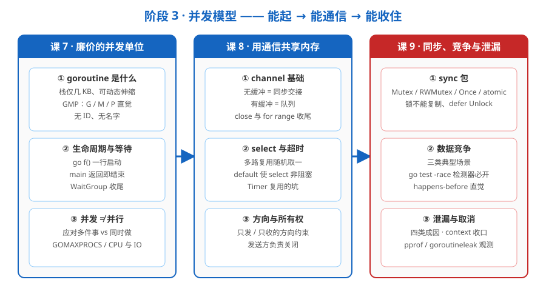

# 阶段 3 概览：并发模型

> 所属课程：Go 语言系统学习 ｜ 故事章节：goroutine 不是免费的 ｜ 课程起点：[学习路径总览](../../01-学习路径总览.md)

## 🎯 本阶段目标

- 用 `go f()` 起 goroutine、用 `sync.WaitGroup` 收尾，说清 goroutine 与 OS 线程的量级差，并建立 GMP 运行时的直觉。
- 会用 channel 与 `select` 让多个 goroutine 有序交接数据与信号，避开关闭/方向/超时的经典陷阱。
- 会用 `sync` 包原语与竞争检测器消除数据竞争，用 context 取消与 pprof 收住 goroutine 泄漏——让"能并发"变成"并发是对的"。

## 📍 学习重点

- goroutine 是"廉价的并发单位"，但它不是免费的：栈虽小、调度虽快，理解它要钱（不等待就消失、闭包捕获语义、并发≠并行）。
- 并发的心智模型：**不要通过共享内存来通信，而要通过通信来共享内存**——channel 正是这句话的落点，理解它如何同时承担数据与信号。
- 同步原语不是越多越好：先想清楚哪一类场景，再选 channel / Mutex / RWMutex / Once / atomic，而不是一律上锁。
- 本阶段的两把"安全阀"：`go test -race`（竞争检测器，必开）与 context 取消（泄漏的收口手段，是下一阶段的正式主角）。

## ✅ 必须掌握的知识点

| 知识点 | 所属课 | 学完应能 |
|--------|--------|----------|
| goroutine 是什么 | 课 7 | 说清 goroutine 与 OS 线程的量级差（栈几 KB、可动态伸缩），画出 GMP 调度直觉，理解为何阻塞系统调用不卡死线程 |
| 生命周期与等待 | 课 7 | 用 `go f()` 起并发、用 `sync.WaitGroup` 等待收尾，记住"main 返回进程即结束"，理解 Go 1.22 循环变量语义消除了 `c,c,c` 闭包坑 |
| 并发 ≠ 并行 | 课 7 | 区分并发与并行，说清 `GOMAXPROCS`、CPU 密集与 IO 密集场景的差异，接受"加 CPU 未必更快"的官方提醒 |
| channel 基础 | 课 8 | 区分无缓冲（同步交接）与有缓冲（队列）channel，会用 `close` 与 `for range`，避开向已关闭 channel 发送的 panic |
| select 与超时 | 课 8 | 用 `select` 做多路复用与超时，说清 `time.After` 在循环里为何攒 Timer 及如何复用，知道 `default` 让 select 变非阻塞 |
| 方向与所有权 | 课 8 | 用 `chan<- T` / `<-chan T` 表达方向约束，遵守"发送方关 channel"，理解 nil channel 永久阻塞与所有权移交语义 |
| sync 包 | 课 9 | 按场景选 Mutex / RWMutex / Once / atomic，知道锁不能复制、配 `defer` 使用，理解为什么有 channel 仍要锁 |
| 数据竞争 | 课 9 | 识别并发写 map、闭包共享变量等典型竞争，用 `go test -race` 检测，建立 happens-before 与内存模型直觉 |
| goroutine 泄漏与取消 | 课 9 | 识别四类泄漏成因，用 context 取消收口，用 `NumGoroutine` / pprof / `goroutineleak` 观测，知道 `errgroup` 的用途 |

## ⚠️ 认知陡坡提示

本阶段是全课**最难的一段**：零基础读者此前从没接触过并发，第一次要同时理解"多件事在交错执行"和"这些交错会互相踩踏"。建议在课 7 放慢节奏，先把 goroutine、调度、生命周期这几个地基打牢，不要急着推进度。本阶段 3 课的关系是一条递进链——**能起（课 7）→ 能通信（课 8）→ 能收住（课 9）**：先能可靠地把 goroutine 开起来并等它结束，再学会用 channel 让它们有序地互相传话，最后学会加锁与取消把这些 goroutine 牢牢收拢。这条"起→通→收"的主线，读者会在这三课里反复用到，也是后续阶段（context、生产级服务）的立身之本。此段不计入知识点。

## 🗺️ 本阶段路径图

## 本阶段产出

- [x] `lessons/lesson-07-goroutine廉价的并发单位.md`（2026-09-08，累计 21 / 45 知识点）
- [x] `lessons/lesson-08-channel用通信共享内存.md`（2026-09-10，累计 24 / 45 知识点）
- [x] `lessons/lesson-09-同步、竞争与泄漏.md`（2026-09-10，累计 27 / 45 知识点）—— 🎉 **阶段 3 闭环**
