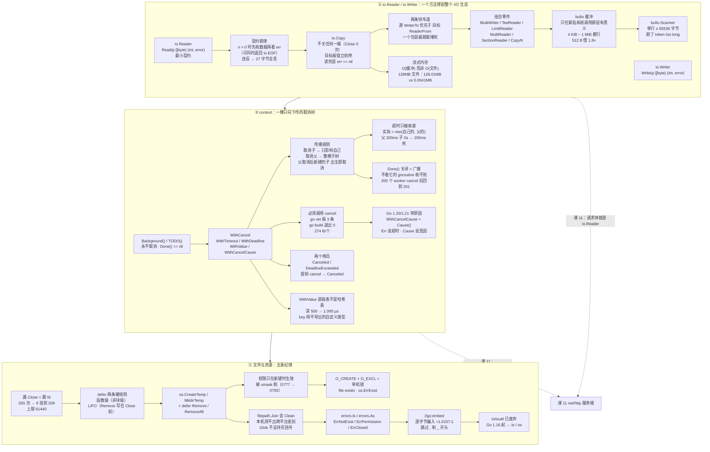

# 课 10：io 与 context

> 所属阶段：标准库与网络编程 ｜ 故事章节：让它对外提供服务 ｜ 状态：✅ 已完成（2026-09-10 ｜ 本机实测 go1.27.1 darwin/arm64）

## 🎯 本课目标

- 学完能说清 `io.Reader` / `io.Writer` 的"最小契约"哲学，会用 `io.Copy` / `MultiWriter` / `TeeReader` / `LimitReader` / `bufio` 做组合与流式处理，并知道**缓冲开多大才有意义**（有阈值）。
- 学完会用 `context` 在调用链上传播取消与超时，理解**取消树**会父传子、子要得再久也会被父截断，牢记**必须调用返回的 cancel**（`go vet` 会抓），并会用 `WithValue` 与 `WithCancelCause`。
- 学完能规范地打开/清理文件与临时资源（含 `defer` 是函数级不是块级这个坑），会用 `path/filepath` 处理跨平台路径、用 `embed` 把静态文件编进二进制，并分清哪几个错误必须显式检查。

## 📍 本课在故事主线中的情节定位

小谷已经能把并发收住了（课 7–9）。可当他第一次把订单系统"对外"——做一个导出接口、一个对接上游风控的调用——他发现自己在跟三类看起来毫不相干的东西搏斗：

- **字节流**：一个 128 MB 的导出文件，`os.ReadFile` 一读，服务内存直接翻一倍；上游返回的响应体，他要么忘了读、要么一次性读爆；CSV、gzip、网络连接，明明是三种完全不同的东西，却都能塞进同一个函数签名。
- **生命周期**：文件开了忘关、临时文件删了没删干净、一个请求被调用方中途放弃后，下游那一串 goroutine 还在傻跑。
- **超时**：上游风控服务偶尔卡 30 秒，他这边没有超时，于是整条调用链跟着卡死，线程池被占满。

这三件事背后其实只有**两个统一的心智模型**：`io.Reader` / `io.Writer`（解决"字节怎么流动"）和 `context`（解决"这件事什么时候该停"）。本课就是把这两个贯穿整个 Go 标准库的抽象讲透——**学完这一课，你就能读懂一大半标准库的签名**。

> 🔗 **先合拢课 9 埋下的两处前向引用**（课 9 末尾明确写了"会在课 10 合拢"）：
>
> | 课 9 当时的说法 | 课 10 的正式展开 |
> |---|---|
> | 课 9.3：「`ctx.Done()` 返回 `<-chan struct{}`，你就把它当一个**能被关闭的 channel** 用」 | 本课 **知识点 2**：它是一条**取消树**上的广播信号，有父传子、有超时截断、有原因（cause） |
> | 课 9.3：「`context` 的系统讲解在**课 10.2**，此处只讲"用取消收口"」 | 本课 **知识点 2** 就是那次兑现；**第四幕实操 2.6** 还会用 `ctx.Done()` 把课 9 那 200 个泄漏的 goroutine 真正收干净（课 9 只演示了"能收"，这里补上"为什么是广播"） |

## 📌 知识点导航

| # | 知识点 | 关键点 | 状态 |
|---|--------|--------|------|
| 1 | io.Reader / io.Writer 哲学 | ①最小契约：源只需要一个 `Read`、目标只需要一个 `Write`，"一个方法换整个生态" ②`Read` 有一条反直觉的契约：**`n > 0` 和 `err == io.EOF` 可以同时返回**，先判 err 会**静默丢尾巴** ③组合优于继承：`io.Copy` / `MultiWriter` / `TeeReader` / `LimitReader` / `MultiReader` / `SectionReader` / `CopyN` 全是"Reader 进 Reader 出" ④`io.Copy` 有两条**快车道**（源的 `WriteTo` 优先于目标的 `ReadFrom`），一个包装器就能把它堵死 ⑤`bufio` 提供缓冲，但**只有紧贴系统调用那一层才有意义**；`bufio.Scanner` 有 **64 KiB 单行天花板** ⑥流式处理的价值是"内存可控 + 首字节延迟低"，分配量能做到 O(缓冲) 而非 O(文件) | ✅ 已完成 |
| 2 | context：取消与超时 | ①根是 `Background()` / `TODO()`，它们**永远不会被取消**（`Done()` 是 `nil`）②`WithCancel` / `WithTimeout` / `WithDeadline` 构一棵**取消树**：取消**向下传播**、不向上；父已取消后新建的子**出生即已取消** ③超时**只会被父收紧**：子要 5 s、父只给 200 ms → 子拿到的是 **200 ms** ④**必须调用返回的 cancel**（`go vet` 报三条原文），通常配 `defer cancel()`；提前 cancel 会让"还没到期的超时"变成 `context canceled` ⑤`WithValue` 是**链表不是哈希表**（查找 O(深度)，深 500 层单次约 1.1 µs），且 key **不要用内置类型**（会跨包撞车）⑥Go 1.20+ 的 `WithCancelCause` / `Cause`、Go 1.21+ 的 `WithTimeoutCause` 能带上"为什么取消" ⑦三条官方约定：作第一个参数、**不存进 struct**、`WithValue` 只放请求级数据 | ✅ 已完成 |
| 3 | 文件与资源 | ①`os.Open` + `defer f.Close()`（漏关就是漏 fd：实测 200 次不关 → fd 从 9 涨到 209）②**`defer` 是函数级不是块级**——`{}` 块退出不会触发，这是"循环里写 defer"会攒到 200 个 fd 的根因 ③`os.CreateTemp` + `defer os.Remove`，但 **`defer` 是 LIFO**：先注册 Remove 后注册 Close 才是"先关后删"（macOS/Linux 上顺序错了**不报错**，因为删一个开着的文件是合法的）④权限位只在**新建**时生效且会被 umask 削（请求 0777 → 实际 0755）⑤`path` 与 `filepath` 在 darwin/Linux 上**输出完全一致**，所以跨平台 bug 在本机隐形 ⑥错误用 `errors.Is` / `errors.As`，不要匹配字符串；`O_EXCL` 是天然的文件锁 ⑦`embed` 把静态文件**逐字节**编进二进制（实测 2518610 字节的产物里能直接 grep 到原文），但会跳过 `.` / `_` 开头的文件 ⑧`io/ioutil` 自 **Go 1.16** 起被官方标记 Deprecated | ✅ 已完成 |

---

# 第一幕 · 起源与场景引入：小谷第一次"对外"

课 9 收尾时，小谷已经能回答"这个 goroutine 怎么停"。他的下单接口在压测下终于稳了。

接下来他接到两个需求：

```
需求 A：订单导出
  后台点一下"导出"，服务把当天 20 万条订单写成 CSV，
  用户下载。文件大概 128 MB。生产环境限制：单个服务实例可用内存 512 MB。

需求 B：对接上游风控
  下单前调一次风控服务的 /check 接口。
  这个接口 99% 在 30 ms 内返回，但偶尔会卡到 30 秒以上（对方说是"抖动"）。
```

两个需求都很朴素，但他三次把服务搞挂：

```
第 1 次：导出接口一上线，服务 RSS 从 300 MB 涨到 430 MB，
        两个用户同时导出就 OOM。原因是 os.ReadFile("orders.csv") 之后
        又拼了一个巨大的 string —— 128 MB 的文件在内存里同时存在三份。

第 2 次：风控接口没有超时。某天上游抖动，请求全部堆在等待上，
        goroutine 数从 300 涨到 4 万，最后整个服务不可用。
        更糟的是：上游恢复后，那 4 万个"已经没人要"的请求
        还在继续跑，把数据库连接池占满。

第 3 次：跑了一整天，日志里开始出现 too many open files。
        排查发现导出时开的临时文件在某个分支上没关，
        而且导出一张图就开一批 —— 一天下来漏了 6 万多个 fd。
```

（这三个数字串起来，就是本课的结构：**性能**是 `io`，**泄漏**是 `context` + 资源纪律。）

小谷慢慢意识到，自己不是在跟"CSV""gzip""网络"这三件不同的事搏斗，而是在跟**两个抽象的缺席**搏斗：

- 他不知道 **"字节流"在 Go 里长什么样** —— 于是每一层都从头写，每写一层就多一次全量读；
- 他不知道 **"这件事该停了"这句话怎么在调用链上传递** —— 于是取消信号发不出去，只能干等。

**这就是本课的三件事**：字节怎么流动（`io`）、事情什么时候该停（`context`）、资源怎么不丢（文件与 `embed`）。

---

# 第二幕 · 认知冲突：三个"我以为"

**撞墙 1："读文件就是 `os.ReadFile`，简单直接，想那么多干嘛。"**

对 1 KB 的配置文件，对。对 128 MB 的导出文件，**是灾难**。本机实测同一个 128 MB 文件，六种读法的"累计分配"天差地别：

| 读法 | 累计分配 | 相对文件大小 |
|------|---------|-------------|
| `os.ReadFile`（全量） | **128.01 MB** | **1.00×** |
| `io.Copy(io.Discard)` | 0.01 MB | 0.00008× |
| `io.CopyBuffer`（4 KB 通用循环） | **0.0041 MB** | **0.00003×** |

**全量读 vs 通用循环流式读，分配量差 4071 倍**，而且这个倍数**随文件变大而变大**——因为一个是 O(文件)，一个是 O(缓冲)。第四幕会给你完整的六行表格和两种"我实测它们一样快"的误解拆解。

**撞墙 2："`io.Reader` 就是『文件』的接口，本质上是把文件包一层。"**

**不是。`io.Reader` 只有一个方法。** 本机实测：我手写了一个 `genReader`，它的结构体字段里**根本没有"内容"这个东西**——只有一个计数器、一个残余切片：

```go
type genReader struct {
	total   int    // 总共要生成多少行
	cur     int    // 已生成到第几行
	pending []byte // 上一次没被调用方取走的残余
	reads   int
}

func (g *genReader) Read(p []byte) (int, error) {
	if len(g.pending) == 0 {
		if g.cur >= g.total {
			return 0, io.EOF
		}
		g.cur++
		g.pending = []byte(fmt.Sprintf("第 %d 行：这是按需生成的，从未整体驻留内存\n", g.cur))
	}
	g.reads++
	n := copy(p, g.pending)
	g.pending = g.pending[n:]
	return n, nil
}
```

它**没有文件、没有内存里的全文**，但它可以原封不动地喂给 `io.Copy`、`bufio.Scanner`、`io.ReadAll`、`bytes.Buffer`、`os.File`、`csv.Reader`……实测全部正常工作，而且每次拿到的字节数完全一致：

```console
=== ① 喂给 io.Copy（标准库的搬运工）===
第 1 行：这是按需生成的，从未整体驻留内存
第 2 行：这是按需生成的，从未整体驻留内存
第 3 行：这是按需生成的，从未整体驻留内存
io.Copy 返回：n=183 err=<nil>，共调用 Read 3 次

=== ③ 喂给 io.ReadAll（一次性读光）===
ReadAll 拿到 183 字节，err=<nil>，共调用 Read 3 次

=== ④ 喂给 io.Copy 到内存 buffer，再喂给 io.Copy 到文件 ===
buffer 里 183 字节
写盘 183 字节，磁盘上文件大小 = 183 字节
```

**"流"不是一种数据结构，而是一份约定。** 只要满足这一个方法，你造的东西就能接进整个 I/O 生态——这就是本课知识点 1 的全部。

**撞墙 3："`context` 就是个传超时参数的工具，`WithTimeout(ctx, 3*time.Second)` 一包就行。"**

前半句只是它 20% 的用途。**它真正的身份是一棵可传播的取消树：**

- 取消**只会向下传**：取消一个子，父和兄弟毫发无伤；取消父，**整棵子树一起关**；
- **超时只会被收紧**：子要 5 s、父只给 200 ms，子**拿到的就是 200 ms**（实测：等到取消耗时 200 ms，不是 5 s）；
- 父已经取消了，之后新建的子**出生即已取消**；
- 而且**忘记调用返回的 cancel 就是泄漏**——课 9 已实测每个约 **274 B**，20 万个就是 52 MB；本课会补上 `go vet` 的**三条报错原文**，以及一个反直觉的事实：`go vet` 抓得到"丢了 cancel"，却**完全不检查**"你用了字符串当 key"。

---

# 第三幕 · 层层揭示

## 知识点 1：io.Reader / io.Writer 哲学

### ① 一句话定义

> `io.Reader` / `io.Writer` 是 Go 里对"字节流"的**最小契约**：能产出字节的东西只需要实现 `Read(p []byte) (n int, err error)`，能消费字节的东西只需要实现 `Write(p []byte) (n int, err error)`。因为契约小到只有一个方法，任何东西都能接入；因为只有两个方法，任意两层都能拼起来——**Go 的整个 I/O 生态，是靠"最小契约 + 组合"长出来的，不是靠继承树。**

### ② 直觉建立（类比 + 类比失效边界）

**类比：自来水管。**

`io.Reader` 就是**出水口的标准口径**。你不需要知道水是从水库来的、从井里抽的、还是从净水器里滤的——你只需要知道"我拧开它，它会出水，出完了告诉我一声"。

所以：

- **净水器**（`gzip.Reader`）= 接一个出水口，自己再做一个出水口。口径不变，水变干净了。
- **水表**（`io.TeeReader` / `io.MultiWriter`）= 装在管道中间，水照流，同时抄一份。
- **限流阀**（`io.LimitReader`）= 只放前 N 升。
- **三通**（`io.MultiWriter`）= 一口进、多口出。
- **`bufio.Reader`** = 一个**蓄水池**：不是改变水质，而是把"每次拧开接一滴"改成"攒满一池再一次接走"，减少开关次数。

**这正是 Go 和"面向对象继承"最大的分歧点：** Java 的流体系有 `InputStream` / `FilterInputStream` / `BufferedInputStream` / `GZIPInputStream` 一整套类层次；Go 只有两个方法，剩下的全靠"你包我、我包你"。

**类比失效的边界（四条，都是真会踩的）：**

1. **水管不会"给你一半"还想继续给。** 而 `Read` 可以：它**允许一次只给一部分**（甚至只给 1 字节，实测合法），也允许**在给出最后一批数据的同时就告诉你"没了"**（`n > 0` 且 `err == io.EOF`）。把 `n` 和 `err` 当成互斥的，就会**静默丢掉尾巴**——这是知识点 1 里最贵的一个坑，见演示 1-B。
2. **水管里的水是"现成的"，流不一定。** `Reader` 的语义是"**你问我要多少，我尽力给你多少**"，它可以在你问的那一刻才**生成**数据（本课那个 `genReader` 就是），也根本不必有任何"存量"。所以"这个 Reader 背后有多少数据"这个问题，**在接口层面是不成立的**——想看总量只能一直读到 `io.EOF`。
3. **多一根管子不等于更快。** `bufio` 的缓冲**只在紧贴系统调用那一层才有意义**。本机实测：给 `gzip.Reader` 后面再加一层 `bufio`，底层 Read 次数**一次都没减少**（35 → 35）；给不压缩的明文文件加一层 64 KiB 的 `bufio`，底层 Read 从 134 降到 10（**减少 93%**）。**同一招，一个场景完全无效、一个场景立竿见影**——判断依据只有一个：紧贴操作系统的那一层自己有没有缓冲。
4. **`io` 包里的东西"通常不保证并发安全"。** 官方 `io` 包文档原文（核查于 2026-09）：
   > *"unless otherwise informed clients should not assume they are safe for parallel execution."*
   
   两个 goroutine 同时读同一个 `Reader`（比如同一个 `*os.File`）**是未定义行为**，不是"各读各的"。要并行就得自己加锁，或者每个 goroutine 各自打开一个。

### ③ 核心原理

#### 3.1 最小契约：一个方法，两个哨兵

```go
type Reader interface {
	Read(p []byte) (n int, err error)
}

type Writer interface {
	Write(p []byte) (n int, err error)
}

type Closer interface {
	Close() error
}
```

`io` 包里还有一堆"把若干个接口粘起来"的组合接口（`ReadWriter` / `ReadCloser` / `WriteCloser` / `ReadWriteCloser`），但**没有一个是"继承"**，全是嵌入式接口类型。

两个哨兵值，语义完全不同：

| 值 | 含义 | 常见误用 |
|----|------|---------|
| `io.EOF` | "**正常的结束**"，不是错误 | 把它当错误一路往上抛 |
| `io.ErrUnexpectedEOF` | "**数据断在半路**"，是错误 | 和 `io.EOF` 混为一谈 |
| `io.ErrShortWrite` | `Write` 少写了但没报错（实现有 bug） | —— |
| `io.ErrClosedPipe` / `io.ErrNoProgress` | 管道已关 / 连续多次读到 0 字节 | —— |

#### 3.2 `Read` 的契约（本知识点最贵的一行）

官方 `io.Reader` 文档原文（`$GOROOT/src/io/io.go`，核查于 2026-09）：

> *"Callers should always process the `n > 0` bytes returned before considering the error `err`. Doing so correctly handles I/O errors that happen after reading some bytes and also both of the allowed EOF behaviors."*

翻译成一句话：**`n > 0` 的时候，先把这 n 个字节收下，再看 `err`。**

这个契约有两条容易忽略的推论：

```
推论 1：Read 允许「给一部分」——你给 4096 字节的 buffer，它有权只填 1 个字节。
        （只要没到 EOF，下一次继续要就行）
推论 2：Read 允许「给最后一批的同时说没（了）」——n > 0 且 err == io.EOF。
```

**推论 2 是"先判 err"这个写法的致命伤。** 演示 1-B 实测：一份 27 字节的数据，用"先判 err"的循环读——

```
buffer=4096 → 拿到  0 字节：""
buffer=   6 → 拿到 24 字节："最后一批数据不能"
```

**buffer 越大于数据，丢得越干净**（一把全读走，然后被 `break` 扔掉）。`buffer=4096` 时直接**一个字节都不剩**。而改成"先收数据再判 err"，两种 buffer 都拿到完整 27 字节。

> 💡 **不用背这条规则，照抄标准库就行**：`io.Copy` / `io.ReadAll` / `bufio.Scanner` 全都是"先收后判"的正例。你自己写循环时才需要小心。

#### 3.3 组合：全部零件都是"Reader 进、Reader 出"

| 零件 | 干什么 | 一句话记忆 |
|------|--------|-----------|
| `io.Copy(dst, src)` | 搬运所有字节，默认 32 KiB 缓冲 | 万能的"搬运工" |
| `io.CopyBuffer(dst, src, buf)` | 同上，但用你给的缓冲 | 想复用一个缓冲时用；**传空 buffer 会 panic** |
| `io.CopyN(dst, src, n)` | 只搬 n 字节 | 读不够会**如实报 `io.EOF`** |
| `io.MultiWriter(ws...)` | 一分多，**任一个写失败整体失败** | 同时写控制台 + 内存 + 磁盘 |
| `io.MultiReader(rs...)` | 多合一，前一个 `EOF` 后自动接下一个 | 把多个源"接"成一条流 |
| `io.TeeReader(r, w)` | 读的同时**抄一份**给 w | "顺手镜像" |
| `io.LimitReader(r, n)` | 只暴露前 n 字节 | 给"读多少"上闸 |
| `io.NewSectionReader(r, off, n)` | 只暴露 `[off, off+n)` 区间，且实现 `ReadAt`/`Seek` | 不复制数据地"切一段" |
| `io.ReadAll(r)` | 读光（**全量进内存**） | 只适合小数据 |
| `io.Discard` | 一个什么都写、什么都不留的目标 | 想"读完就扔"时用 |

关键点：**这些函数签名里出现的全是 `io.Reader` / `io.Writer`，没有一个是具体类型。** 这就是"最小契约"换来的东西——`io.Copy` 并不知道自己在拷文件还是拷网络还是拷一个现场生成的流，它也不需要知道。

#### 3.4 `io.Copy` 的两条快车道（很多人不知道）

`io.Copy` 看着朴素，源码里其实先问两端两个问题（`$GOROOT/src/io/io.go` 的 `copyBuffer`）：

```go
// 简化自 io.copyBuffer 的判定顺序
if wt, ok := src.(WriterTo); ok {
    return wt.WriteTo(dst)      // ← 快车道 1：源自带 WriteTo
}
if rf, ok := dst.(ReaderFrom); ok {
    return rf.ReadFrom(src)     // ← 快车道 2：目标自带 ReadFrom
}
// 都不满足，才走通用循环：分配 32 KiB 缓冲，Read/Write 反复搬
```

**注意顺序：源的 `WriteTo` 优先级高于目标的 `ReadFrom`。**

这是"最小契约 + 可选增强接口"的经典设计：**接口只要求最小，但你可以自愿提供一条更快的路。**

实测（演示 1-D）四种组合：

| 源 | 目标 | 走哪条路 | 目标 `Write` 被调用次数 |
|----|------|---------|----------------------|
| 只有 `Read` | 只有 `Write` | 通用循环（32 KiB） | 1 次 |
| 有 `WriteTo` | 有 `ReadFrom` | **源的 `WriteTo`**（先判） | 1 次 |
| 只有 `Read` | 有 `ReadFrom` | **目标的 `ReadFrom`** | **0 次** |
| 有 `WriteTo` | 只有 `Write` | 源的 `WriteTo` | 1 次 |

标准库里现成的例子：

```console
=== 标准库里的真实例子 ===
  bytes.Buffer 实现了 ReadFrom → io.Copy 直接走它，n=31 err=<nil>
  io.Discard 同时实现 ReaderFrom + WriterTo，n=5 err=<nil>
```

> ⚠️ **快车道会被"你的包装"堵死。** `struct{ io.Reader }{r}` 这种只转发 `Read` 的包装器，会把里面的 `WriteTo` **藏起来**（Go 接口只看最外层的动态类型有没有这个方法）。实测：
>
> ```console
> 包装后 Write 被调用 0 次（ReadFrom 仍可用，因为目标没被包）
> 两端都被包装 → Write 被调用 1 次（退回通用循环）
> ```
>
> 本课后面所有的内存/基准测试都**故意**用这个包装器把快车道堵掉——否则测出来的 0.009 MB 会让你误以为"流式读不需要缓冲"。

#### 3.5 `io.Copy` 的返回值与"不关门的规矩"

| 事实 | 实测 |
|------|------|
| 返回的是 `(written, err)`，`err == nil` 表示正常读完（**不是 `io.EOF`**） | 读完 → `n=10 err=<nil>` |
| `n` 是"**成功写出**的字节数"，不是"源还剩多少" | 目标写 4 字节就报错 → `n=4 err=磁盘满了` |
| **`io.Copy` 不会关闭任何一端** | `Close` 被调用次数 = **0** |
| **目标一报错就立刻停**，不会把源读完 | 源 131072 字节，目标第 2 字节挂了 → 剩 **98304 字节没被读走** |
| `Write` 少写了又不报错 → 帮你抓出来 | `n=9 err=short write`（`err == io.ErrShortWrite` 为 `true`） |
| `Write` 返回"不可能"的 `n` | 见下方两种表现 |
| `CopyBuffer` 传一个 `len == 0` 的 buffer | **`panic: empty buffer in CopyBuffer`** |

`Write` 返回"不可能的值"这件事有个反直觉的对比：

```console
=== ③ 目标返回「不可能」的 n：两种情况 ===
  a) 源是 strings.Reader（自带 WriteTo）→ panic：strings.Reader.WriteTo: invalid WriteString count
  b) 源被包装后（无 WriteTo）→ n=0 err=invalid write result
```

**同一份"坏目标"，一个 panic、一个返回错误**——差别只在于走的是快车道（那层自己的检查先炸）还是通用循环（`io.Copy` 自己的 `errInvalidWrite` 检查）。**别把某一条错误消息当成"这类 bug 的固定长相"**（这个教训课 9 在 `concurrent map` 上也踩过一次）。

#### 3.6 `bufio`：缓冲开多大才有意义（带阈值）

`bufio.Reader` / `bufio.Writer` 的作用是**把"很多次小读写"摊成"少数次大读写"**。

本机基准（368 KB 固定工作量，**两端快车道全部堵掉**，`-benchtime=300ms`，跑两轮）：

| 缓冲大小 | 第 1 轮 ns/op | 第 2 轮 ns/op | 相对 512 B |
|----------|--------------|--------------|-----------|
| 512 B | 10591 | 10345 | 1.00× |
| 1 KiB | 6841 | 6599 | 1.55× |
| **4 KiB** | **5662** | **5159** | **1.87×** |
| 16 KiB | 5683 | 5556 | 1.86× |
| 32 KiB（`io.Copy` 默认） | 5978 | 5924 | 1.77× |
| 64 KiB | 6128 | 5992 | 1.73× |
| 256 KiB | 5880 | 5882 | 1.80× |
| 1 MiB | 5807 | 5756 | 1.82× |

**怎么读这张表：**

1. **512 B 明显慢**（约 1.8 倍代价）—— 缓冲太小，调用次数压不下来。
2. **4 KiB 之后就基本平坦**（5.2 ~ 6.1 µs）—— **1 KiB → 4 KiB 是唯一一次显著收益**（约 1.3 倍）。
3. **32 KiB 默认值很稳**，再往上（256 KiB / 1 MiB）**没有额外收益**，纯属浪费内存。

> **选型结论（带阈值）**：
> - **别用 < 1 KiB 的缓冲**（512 B 实测慢 1.8 倍）。
> - **4 KiB ~ 1 MiB 之间都行**（差异 < 20%，基本在噪声里）；**直接信 `io.Copy` 的 32 KiB 默认值最省事**。
> - **想复用缓冲省分配**用 `io.CopyBuffer`，但记得它比 `io.Copy` 多一次自己 `make` 的成本：
>   ```console
>   BenchmarkCopy_Buffer1K-11      	   53442	      6599 ns/op	48412.41 MB/s	      48 B/op	       2 allocs/op
>   BenchmarkCopy_Default-11       	   50612	      6399 ns/op	49925.99 MB/s	   32816 B/op	       3 allocs/op
>   ```
>   **注意这组数字是测试脚手架自己的分配**（`io.Copy` 的默认 32 KiB 缓冲每次都要新分配一次，这就是 `3 allocs / 32816 B` 里最大那一块的来源）。高频调用的热路径上预分配一个缓冲复用，是能省下来的。

#### 3.7 `bufio.Scanner` 的 64 KiB 天花板

`bufio.Scanner` 读起来最舒服（`for sc.Scan() { sc.Text() }`），但它有一条**硬上限**：

```go
// $GOROOT/src/bufio/scan.go
const MaxScanTokenSize = 64 * 1024   // 65536
```

实测（演示 5-A）：

| 单行长度 | 结果 |
|---------|------|
| 65 535 字节 | ✅ 正常读到，`err=<nil>` |
| **65 536 字节** | ❌ `bufio.Scanner: token too long` |
| 100 000 字节 | ❌ `bufio.Scanner: token too long` |

**注意换行符算不算**：`65535 数据 + \n` 共 65536 字节 → **可以**；`65536 数据 + \n` 共 65537 字节 → **不行**。也就是说边界是"**token 本身 ≤ 65536**"（不含分隔符）。

三种修法：

| 修法 | 代价 |
|------|------|
| `sc.Buffer(buf, max)` 抬高上限 | 有效上限取 **`max` 与 `cap(buf)` 中较大者**；**必须在第一次 `Scan` 之前调用**，否则 `panic: Buffer called after Scan` |
| `bufio.Reader.ReadString('\n')` | **没有单行上限**（实测 200001 字节正常），但要自己处理 `err` 和末尾无换行的情况 |
| `io.ReadAll` + 自己切 | **大文件别用**（全量进内存） |

`Text()` / `Bytes()` 返回的都**不含分隔符**（实测 `Text()="a,b,c" len=5`）。默认分隔符 `ScanLines` 会**吃掉 `\r\n` 里的 `\r`**，这一点对读 Windows 导出的 CSV 很重要。

### ④ 示例演示（本机实测）

**演示 1-A：一个 Read 方法，接进整个生态**

见上文撞墙 2 的 `genReader`。完整实测输出（`/tmp/go-l10/p1_minimal`）：

```console
$ go run ./p1_minimal
=== ① 喂给 io.Copy（标准库的搬运工）===
第 1 行：这是按需生成的，从未整体驻留内存
第 2 行：这是按需生成的，从未整体驻留内存
第 3 行：这是按需生成的，从未整体驻留内存
io.Copy 返回：n=183 err=<nil>，共调用 Read 3 次

=== ② 喂给 bufio.Scanner（按行读）===
  第 1 行读到 60 字节
  第 2 行读到 60 字节
  第 3 行读到 60 字节
Scanner 判定结束，err=<nil>，共调用 Read 3 次

=== ③ 喂给 io.ReadAll（一次性读光）===
ReadAll 拿到 183 字节，err=<nil>，共调用 Read 3 次
内容首行："第 1 行：这是按需生成的，从未整体驻留内存"

=== ④ 喂给 io.Copy 到内存 buffer，再喂给 io.Copy 到文件 ===
buffer 里 183 字节
写盘 183 字节，磁盘上文件大小 = 183 字节

=== ⑤ 同一份 genReader，换个「每次要多少」的调用方 ===
  调用方给     1 字节的 buffer → Read 被调用 183 次
  调用方给     7 字节的 buffer → Read 被调用 27 次
  调用方给    64 字节的 buffer → Read 被调用 3 次
  调用方给  4096 字节的 buffer → Read 被调用 3 次
```

**⑤ 那两行是这个知识点最有价值的观察**：**同一份 `Reader`，"Read 被调用几次"完全由调用方决定**。调用方给 1 字节的 buffer，`Read` 就被叫 183 次；给 4096 字节，只叫 3 次（因为一共就 3 行、183 字节）。

> 👉 **这解释了为什么"我写了个高效的 Reader"这句话本身没有意义**——效率是**两端共同**的结果。你这边再快，调用方一次只要 1 字节，照样被打成 183 次调用。

**演示 1-B：`Read` 契约陷阱 —— `n > 0` 且 `err == io.EOF`**

```console
$ go run ./p1b_contract
=== 原始数据 ===
"最后一批数据不能丢"（27 字节）

=== 反例：先判 err 再收数据 ===
  buffer=4096 → 拿到  0 字节：""
  buffer=   6 → 拿到 24 字节："最后一批数据不能"

=== 正例：先收数据再判 err ===
  buffer=4096 → 拿到 27 字节："最后一批数据不能丢"
  buffer=   6 → 拿到 27 字节："最后一批数据不能丢"

=== 对照：标准库 io.Copy 不会丢（它就是正例）===
  io.CopyBuffer buffer=4096 → n=27 err=<nil>："最后一批数据不能丢"
  io.CopyBuffer buffer=   6 → n=27 err=<nil>："最后一批数据不能丢"

=== 顺带看：ShortRead 型实现（一次只给 1 字节也是合法的）===
  buffer=1 → "abc"
```

**`buffer=4096` 时反例拿到 0 字节** —— 这不是"丢了一点"，是**全丢**。而且**没有任何报错**，`err` 在循环里被当成了"结束信号"正常处理掉了。这类 bug 在线上表现为"上传的文件偶尔少几 KB"，几乎不可能靠日志定位。

**演示 1-C：组合六个零件**

```console
$ go run ./p2_compose
=== ① io.MultiWriter：一次写，多路去 ===
订单 SO-1 已支付
订单 SO-2 待支付

io.WriteString 返回 n=44 err=<nil>
  console buffer = 44 字节
  mem     buffer = 44 字节
  磁盘文件       = 44 字节

=== ② io.TeeReader：一边读一边抄一份 ===
读了 12 字节："订单 SO-1 "
TeeReader 的副本里也正好 12 字节："订单 SO-1 "
继续读到 32 字节，此时副本累计 44 字节（全文 44 字节）

=== ③ io.LimitReader + io.CopyN：给「读多少」上闸 ===
  LimitReader(9) → "订单 SO"（9 字节）
  CopyN(100) 但源只有 44 字节 → n=44 err=EOF
  已拷内容完整（44 字节）：true

=== ④ io.MultiReader：把多个源接成一条流 ===
  行 1: 【头】
  行 2: 订单 SO-1 已支付
  行 3: 订单 SO-2 待支付
  行 4: 【尾】

=== ⑤ io.SectionReader：只暴露一个区间 ===
  SectionReader(off= 0, n=  4) → "0123"   err=<nil>
  SectionReader(off= 4, n=  4) → "4567"   err=<nil>
  SectionReader(off=10, n=  6) → "ABCDEF" err=<nil>
  SectionReader(off=14, n=100) → "EF"     err=<nil>

=== ⑥ 串成一条流水线：源 → 限流 → 复制两处 → 计数 ===
  最终搬运 12 字节 err=<nil>
  archive 收到："订单 SO-1 "
  counter 口径一致：true
```

三个值得停一下的地方：

1. **`io.CopyN(100)` 对 44 字节的源返回 `n=44 err=EOF`** —— 和 `io.Copy` 不同，**`CopyN` 会如实把 `EOF` 报给你**（它做不到 100 字节就是做不到）。看这个 `err` 就能知道"源比我要的短"。
2. **`SectionReader(off=14, n=100)` 只给了 `"EF"`（2 字节），`err` 仍是 `nil`** —— 源总长只有 16 字节，从 14 开始只剩 2 字节。这里 `err=nil` 完全符合契约：**没到 EOF 就该说 `nil`**，`io.ReadAll` 内部再问一次才拿到 `EOF`。又一次印证演示 1-B。
3. **⑥ 那条流水线只用标准库零件拼出来的**：`io.TeeReader(io.LimitReader(...), &archive)` —— 一个"限流 + 顺手镜像"的源，再喂给 `io.Copy`。**没有任何自定义类型。**

**演示 1-D：`io.Copy` 的两条快车道**

```console
$ go run ./p3_optimize
① 朴素源 → 朴素目标（走通用 32KB 循环）
        io.Copy 返回 n=25 err=<nil>
        Write 被调用 1 次，收到 25 字节

② 快源 → 快目标（两者都有快车道）
        [源] 走的快捷路径 WriteTo
        io.Copy 返回 n=25 err=<nil>
        Write 被调用 1 次，收到 25 字节

③ 朴素源 → 快目标（目标兜底）
        [目标] 走的快捷路径 ReadFrom（内部一次性把源读光）
        io.Copy 返回 n=25 err=<nil>
        Write 被调用 0 次，收到 25 字节

④ 快源 → 朴素目标（源兜底）
        [源] 走的快捷路径 WriteTo
        io.Copy 返回 n=25 err=<nil>
        Write 被调用 1 次，收到 25 字节

=== 标准库里的真实例子 ===
  bytes.Buffer 实现了 ReadFrom → io.Copy 直接走它，n=31 err=<nil>
  io.Discard 同时实现 ReaderFrom + WriterTo，n=5 err=<nil>

=== 反过来说：这条快车道可以被「你的包装」堵死 ===
        [目标] 走的快捷路径 ReadFrom（内部一次性把源读光）
  包装后 Write 被调用 0 次（ReadFrom 仍可用，因为目标没被包）
  两端都被包装 → Write 被调用 1 次（退回通用循环）
```

**②③④ 三种情况下"源和目标的快车道都可用"，但走的都是"源"那条**（源码里 `WriterTo` 判定在前）。**③ 那个 `Write 被调用 0 次` 是最反直觉的一行**——数据确实搬过去了（`收到 25 字节`），但目标的 `Write` 方法**一次都没被调用**，因为 `ReadFrom` 自己把活干了。

### ⑤ 常见误区（知识点 1）

| 误区 | 真相 |
|------|------|
| `io.Reader` 就是文件/内存的封装，背后一定有"内容" | **没有**。契约只要求"你问我要多少，我尽力给多少"；本课那个 `genReader` 结构体里连内容字段都没有 |
| `Read` 返回 `err != nil` 就说明这批数据无效 | **可以同时 `n > 0` 且 `err == io.EOF`**；先判 err 会**静默丢尾巴**（实测 buffer=4096 时 27 字节全丢） |
| `Read` 应该一次填满我给的 buffer | 只给 1 字节也是**合法实现**（实测），调用方必须自己循环 |
| `io.Copy` 读完会返回 `io.EOF` | 正常读完是 **`err == nil`**，`EOF` 被它吃掉了；`io.CopyN` 才会如实报 `EOF` |
| `io.Copy` 会帮我关闭源或目标 | **不会**，`Close` 调用次数实测 **0**；谁开的谁关 |
| 目标出错时 `io.Copy` 会把源读完 | **立刻停**（源 131072 字节，还剩 98304 字节没读） |
| `CopyBuffer` 传个空切片等于用默认值 | **`panic: empty buffer in CopyBuffer`**；要默认值就传 `nil` |
| 缓冲越大越快 | **4 KiB 之后就平坦了**；512 B 才明显慢（1.8 倍）。32 KiB 默认值够用，1 MiB 纯浪费 |
| 多加一层 `bufio` 总能减少系统调用 | **只有紧贴系统调用那一层才有意义**（实测 gzip 后面加 bufio：35 → 35，一次没省） |
| `bufio.Scanner` 能读任意长的行 | **单行 ≤ 65536 字节**（`MaxScanTokenSize`），超了报 `token too long` |
| `sc.Buffer(nil, 256*1024)` 只认第二参数 | 有效上限是 **`max` 与 `cap(buf)` 中较大者**；且必须在第一次 `Scan` 前调用 |
| 两个 goroutine 读同一个 `Reader` 各读各的没关系 | `io` 包文档明确说**不保证并发安全**；并行要自己开多份或加锁 |

### ⑥ 一句话记住

> **`io.Reader` / `io.Writer` 各只有一个方法 —— 契约小到谁都能接，所以整个 I/O 生态靠"你包我、我包你"组合出来；代价是两条你必须守的契约：`n > 0` 时先收数据再看 `err`（否则静默丢尾巴），以及 `io.Copy` 不关任何一端、目标报错就立刻停。**

### 📚 官方文档

- `io` 包总览：<https://pkg.go.dev/io>（核查于 2026-09）
- `io.Reader`（含"process the n > 0 bytes first"原文）：<https://pkg.go.dev/io#Reader>（核查于 2026-09）
- `io.Copy` / `CopyBuffer` / `CopyN`：<https://pkg.go.dev/io#Copy>（核查于 2026-09）
- `io.MultiWriter` / `TeeReader` / `LimitReader` / `SectionReader`：<https://pkg.go.dev/io#MultiWriter>（核查于 2026-09）
- `bufio` 包（`Scanner` / `MaxScanTokenSize` / `Buffer`）：<https://pkg.go.dev/bufio>（核查于 2026-09）
- `io.WriterTo` / `io.ReaderFrom`（那两条快车道）：<https://pkg.go.dev/io#WriterTo>（核查于 2026-09）

---

## 知识点 2：context —— 取消与超时

> 🔗 **这一节就是课 9 一直在等的那次兑现。** 课 9.3 把 `ctx.Done()` 当作"一个能被关闭的 channel"用，并显式写了"系统讲解在课 10.2"。下面把它讲全。

### ① 一句话定义

> `context.Context` 是一份**沿调用链传递的"取消信号 + 截止时间 + 少量请求级数据"**的载体。它的核心不是"传参"，而是一棵**取消树**：取消和超时**只向下传播**，子节点的截止时间**只会被父收紧**，而**每一个 `With*` 返回的 `cancel` 都必须被调用**（否则泄漏，`go vet` 会报）。

### ② 直觉建立（类比 + 类比失效边界）

**类比：办公室里的一串"项目群"。**

- 整个公司有一个**根群**（`Background()`）——它**永远不会被解散**。
- 每接一个项目，就在某个群里开一个**子群**（`WithCancel`），并拿到一张"**解散按钮**"（`cancel`）。
- **解散一个子群，父群和兄弟群毫发无伤。**
- **解散父群，所有子群一起消失**——不需要逐个通知，因为子群本来就在听着父群的动静。
- `WithTimeout(ctx, 3*time.Second)` = **给这个子群定个下班时间**。到点了自动解散。
- **子群的"最晚下班时间"不可能晚于父群**：父群 20:00 解散，你在子群写"我们 23:00 下班"是没用的，**实际 20:00 就被父亲带走了**（这就是"截断"）。
- `ctx.Value(k)` = **往群里发一条置顶公告**，每个子群都能看到，但**不是查表，是从最近的群一层层往外翻**（所以越深越慢）。
- **那张"解散按钮"必须按一次**：不按，这个群就永远挂着（`go vet` 会提醒你）。

**类比失效的边界（四条）：**

1. **解散群不需要"群里有人听到"。** 取消是**广播**（底层是 `close(ch)`），而不是"发消息给每个人"。一个 goroutine 如果**从不检查 `ctx.Done()`，它根本不知道群解散了**——这就是课 9 那 200 个"取消不了的 worker"的真相：**信号发出来了，但没人接收**。
2. **"下班时间到了"和"有人按了按钮"是两个不同的信号。** 分别对应两个哨兵值 `context.DeadlineExceeded` 和 `context.Canceled`。而且**先发生的那个赢**：一个 5 s 的超时被提前 `cancel()`，`Err()` 是 `context canceled`，**不是** `DeadlineExceeded`。
3. **按钮不是"通知"，是"资源回收"。** 它同时把子节点从父节点的监听列表里摘掉。**不按 = 泄漏**，实测每个约 **274 B**（课 9 实测），而且链越长漏得越多。
4. **`Value` 不是"上下文对象的属性"**，而是**一层层套起来的洋葱**。每调一次 `WithValue` 就多包一层，每次 `Value()` 都要从最里层往外剥——实测深度 500 层时单次查找 **1.095 µs**（比深度 1 的 3 ns 慢 **365 倍**）。它是**链表，不是哈希表**。

### ③ 核心原理

#### 3.1 从哪里来（一段真实的起源，已联网核实）

`context` 不是 Go 1.0 就有的。它最早是 **Google 内部的一个包**，用来解决"一个 RPC 请求要向下扇出到几十个后端调用，用户取消后这一整棵树怎么一起取消"这个问题。2014-07-29，Google 的 Sameer Ajmani 在 Go 官方博客发表 *Go Concurrency Patterns: Context*，把这个包**公开**出来；社区广泛采用后，在 **Go 1.7**（2016-08）被正式收进标准库——本机 `$GOROOT/api/go1.7.txt` 里一次性列出了 `Background` / `TODO` / `WithCancel` / `WithDeadline` / `WithTimeout` / `WithValue` 六个 API（核查于 2026-09）。

> 📎 起源与设计动机：<https://go.dev/blog/context>（Sameer Ajmani，2014-07-29；核查于 2026-09）

这个出身解释了它为什么长这样：**它天生是为"一次请求的扇出"设计的**，所以它必须①能沿参数向下传、②能一棵树一起取消、③能携带少量"这次请求特有的"数据。

#### 3.2 四个构造函数 + 两个哨兵

| 构造函数 | 得到什么 | 什么时候用 |
|---------|---------|-----------|
| `context.Background()` | 根，**永不取消**（`Done()` 返回 `nil`） | `main`、初始化、测试入口 |
| `context.TODO()` | 同上，语义是"**我还没想好该用哪个**" | 库代码/重构中间态 |
| `context.WithCancel(parent)` | `(ctx, cancel)` | 手动控制的取消 |
| `context.WithTimeout(parent, d)` | `(ctx, cancel)`，`d` 后自动取消 | **对外调用必备**（配下游服务） |
| `context.WithDeadline(parent, t)` | `(ctx, cancel)`，到时刻 `t` 取消 | 有明确时刻（比如"账单日 0 点前"） |
| `context.WithValue(parent, k, v)` | 带一个键值对 | **只放请求级数据**（trace id、用户身份） |
| `context.WithCancelCause(parent)` | `(ctx, cancel func(error))` | Go 1.20+，要带"为什么取消" |
| `context.WithTimeoutCause(parent, d, err)` | 同上 | Go 1.21+ |

两个哨兵值（判等**用 `errors.Is`**，虽然它们是 `==` 可比的具体错误值）：

```go
var Canceled         = errors.New("context canceled")            // 有人按了按钮
var DeadlineExceeded = deadlineExceededError{}                   // 到点了
```

**`WithDeadline` 和 `WithTimeout` 是同一回事**——实测 `WithTimeout(ctx, d)` 内部就是 `WithDeadline(ctx, time.Now().Add(d))`：

```console
=== ⑤ WithDeadline / WithTimeout 是同一回事 ===
  WithDeadline 的 Deadline 是我给的那个时刻？true
  WithTimeout 与 WithDeadline 等价（内部就是 Now().Add(d)）
  到期后 Err()=context deadline exceeded（同一个哨兵值）
  errors.Is(err, context.DeadlineExceeded) = true
```

#### 3.3 取消树的四条传播规则

```
                    Background()          ← 根，永不被取消
                         │
              ┌──────────┴──────────┐
        WithTimeout(200ms)      WithValue(user)
              │                      │
        ┌─────┴─────┐                │
   childA         childB ◄───────────┘
   (取消它 → 只影响它自己)
```

| # | 规则 | 实测 |
|---|------|------|
| 1 | **取消只向下传**：取消子 → 父、兄弟不受影响 | 取消 `childA`：`parent Done=还开着`、`childB Done=还开着` |
| 2 | **取消父 → 整棵子树全关** | 取消 `parent`：`parent` / `childA` / `childB` 三个全变 `context canceled` |
| 3 | **子继承的 `Err()` 是父的原因**，不是"自己的超时" | `childB.Err()` 是 `context canceled`，**不是** `DeadlineExceeded`（哪怕 `childB` 自己也有超时） |
| 4 | **父已取消后新建的子，出生即已取消** | `late Done=已关闭 Err=context canceled` |

另外两条操作性质：

- **`cancel()` 是幂等的**：重复调用安全（实测连续多调两次无 panic）；
- **根永远不会被取消**：`Background().Done() == nil` 为 `true`，`TODO().Done() == nil` 也为 `true`。**`Done()` 是 `nil` 意味着"永远不会收到值"**（对 `nil` channel 的接收会永久阻塞）——所以 `select` 里带一个根 ctx 的 `Done()` 分支是安全的（那个分支永不触发）。

**注意：`Done()` 返回 `nil` 是"根"的标记。** 一旦你忘了检查这一点，写了 `<-ctx.Done()` 却没意识到这个 ctx 可能是 `Background()`，你的 goroutine 就会永远卡在那里——**这是一个合法的、但完全无法被取消的等待**。生产代码里，**凡是 `<-ctx.Done()`，都要能回答"这个 ctx 是谁给的、它会被取消吗"**。

#### 3.4 超时只会被"收紧"，不会被打散

这是 `context` 最容易被误用的一条：**子节点的 deadline 不是"我想要的"，而是 `min(我想要的, 父的)`。**

实测（演示 2-B）：

```console
=== ② 子要得比父「更久」：被父截断 ===
  parent   Deadline 设置了，距现在约 200ms
  child    Deadline 设置了，距现在约 200ms
  → 子的 Deadline 和父完全相同？true（两者 ok：true / true）

=== ③ 子要得比父「更早」：以子为准 ===
  父        Deadline 设置了，距现在约 5s
  子        Deadline 设置了，距现在约 100ms

=== ④ 实测：父 200ms、子 5s，谁先到期？ ===
  等到取消，耗时 200ms，child.Err()=context deadline exceeded
```

**父 200 ms、子要 5 s → 实际 200 ms 就死了。** 反过来，父 5 s、子要 100 ms → 100 ms 就死。**一句话：只有更早的那个算数。**

> **工程含义（很重要）**：上游给你 200 ms，你在里面给下游服务设 5 s 超时是**没有意义的**——你根本活不到 5 s。正确做法是**留出预算**：上游给 200 ms，下游就给 150 ms，剩下 50 ms 留给自己做收尾/降级。这条"预算递减"是所有超时设计的起点。

**还有一条反直觉的**：`defer cancel()` 不会把你的"正常完成"误判成超时——

```console
=== ⑦ 提前 cancel 会让「还没到期的超时」也变成 Canceled ===
  5s 的超时被提前 cancel → Err()=context canceled
  所以「defer cancel()」不会把正常完成误判成超时，只会变成 Canceled
```

`defer cancel()` 在函数返回时执行，此时超时还没到，所以 `Err()` 会变成 `context canceled`。**所以不要用 `Err() == DeadlineExceeded` 来判断"我的业务逻辑有没有超时"**——只要函数正常返回前你 `defer cancel()` 了，这个判断永远为假。要判断超时，得在**取消发生的那一刻**（`<-ctx.Done()` 之后、还在函数体内时）读 `Err()`（见第四幕实操 2.6 的 ③）。

#### 3.5 必须调用 `cancel`：`go vet` 会抓，但只抓这一件事

官方 `context` 包文档原文（核查于 2026-09）：

> *"Failing to call the CancelFunc leaks the child and its children until the parent is canceled. The go vet tool checks that CancelFuncs are used on all control-flow paths."*

实测（`/tmp/go-l10/c3_lostcancel`，一个故意写坏的包）：

```console
$ go vet ./c3_lostcancel
c3_lostcancel/lostcancel.go:13:7: the cancel function returned by context.WithCancel should be called, not discarded, to avoid a context leak
c3_lostcancel/lostcancel.go:19:2: the cancel function is not used on all paths (possible context leak)
c3_lostcancel/lostcancel.go:24:2: this return statement may be reached without using the cancel var defined on line 19
(vet 退出码=1)

(build 退出码=0)
```

三条报错对应三种错法：

| 行 | 错法 | `go vet` 的说法 |
|----|------|----------------|
| 13 | `ctx, _ := context.WithCancel(parent)`（直接丢） | `should be called, not discarded` |
| 19/24 | 只在 `if` 分支里 `cancel()` | `is not used on all paths` + `this return statement may be reached without using the cancel var` |

**两个必须记住的细节：**

1. **`go vet` 退出码 1，但 `go build` 退出码 0。** 也就是说**这段代码能编译、能跑、会泄漏**。`go vet` 是唯一拦得住它的东西——**CI 里必须显式加 `go vet ./...`**（课 9 已经因为 `copylocks` 踩过同一个坑：`go test` 默认跑的 vet 子集里没有它）。
2. **`go vet` 只管"cancel 有没有被用"，完全不管"key 用了什么类型"。** 下面这段用字符串当 key（官方明确不推荐），`go vet` **一声不吭**：
   ```go
   func BadStringKey(parent context.Context) context.Context {
       return context.WithValue(parent, "user-id", 42) //nolint
   }
   ```
   **"编译器/vet 能帮你抓"和"规范要求你这么做"是两件事。**

**还有一个"不叫泄漏但同样致命"的写法**：`ctx, cancel := ...` 之后 **`cancel` 一次都没出现**，在 Go 里是**编译错误**（`declared and not used`），根本过不了编译。所以"忘了用"只有两种情况：**用 `_` 丢掉**，或者**只在部分分支用了**——恰好就是 `go vet` 抓的那两种。

**最后补一条"这条检查真的会响"的旁证**：本课 18 个探针包本来都应该是干净的，评审时我对它们整体跑了一次 `go vet`，**结果它抓到了我自己的一处**：

```console
$ go vet ./p1_minimal ... ./f4_closed ./e1_embed ./bench      # 18 个正常探针包
c1_cancel_tree/main.go:75:6: the cancel function returned by context.WithCancel should be called, not discarded, to avoid a context leak
（就这一条）
```

第 75 行其实是**故意**的——那是"演示 `context.WithCancel(nil)` 会 panic"的那一行（`_, _ = context.WithCancel(nil)`），调用本来就会 panic，拿不到可用的 `cancel`。**这一处是明知故犯，但它恰恰证明了这条检查在实际代码里是真的会响：连本课自己的探针都被抓了一次。**

#### 3.6 `WithValue`：是链表不是哈希表，key 也不要用内置类型

`ctx.Value(k)` 的实现是**从最近的节点往外走**，一层层比 `key`，命中就返回：

```
ctx.Value(k) 的查找方向
   ←──── 从外往内 ────
   Background()  →  WithValue(A)  →  WithValue(B)  →  WithValue(C)  →  你手上的 ctx
                     ↑ 越晚包的越靠近你，越早命中
```

实测（演示 2-D，每层 20 万次查找）：

| 链深度 | 20 万次查找总耗时 | 平均每次 |
|--------|------------------|---------|
| 1 | 800 µs | **3 ns** |
| 5 | 2.6 ms | 12 ns |
| 20 | 9.1 ms | 45 ns |
| 100 | 40 ms | 199 ns |
| **500** | **219.2 ms** | **1.095 µs** |

**深度 500 时，每次 `Value()` 要 1.095 µs，是深度 1 的 365 倍。** 而且这不是"稍微慢一点"——如果你在一个每秒处理 10 万请求的服务里，每个请求的每一层都调一次 `ctx.Value()`，这就是可观的 CPU。

再补一个数：**连续套 100 万层 `WithValue` 耗时 41 ms**（平均每次 41 ns）。所以 `WithValue` **慢的不是"创建"，是"查找"**。

比性能更严重的是 **key 的类型**。实测（演示 2-C）：

```console
=== ③ 用字符串当 key：两个包会撞车 ===
  B 包读到 = B 包写的 admin
  A 包读到 = B 包写的 admin  ← 被 B 悄悄顶掉了
  改用自定义类型就没这个问题：
    A 包读到 = 1001 / B 包读到 = admin
```

`string` 是内置类型，任何包都可以写 `context.WithValue(ctx, "user-id", ...)`，**两个包用同一个字符串 key 就会互相覆盖**——而且**没有任何报错**。正确做法是**自定义一个不导出的类型**：

```go
// 每个包自己定义，不导出 → 别的包无法构造出同类型的值
type userKey struct{}
ctx = context.WithValue(ctx, userKey{}, user)
v := ctx.Value(userKey{}).(*User)
```

> 💡 本课探针里出现的 `ctx.Value(userKey{{}}) → &{Name:小谷 Role:后端} ok=true` 是**格式串转义**的显示结果（`{{` / `}}` 转义成 `{` / `}`），**实际代码用的 key 就是空 struct `userKey{}`**。

**取值时不要省略 comma-ok**，实测（演示 2-A）：

```console
  ctx.Value(userKey{{}}) → &{Name:小谷 Role:后端} ok=true
  换个 key 类型查 → <nil>（ok 都拿不到，直接 nil）
  不确定类型时强断言 → panic：interface conversion: interface {} is *main.User, not string
```

`Value()` 查不到时返回 `nil` **不 panic**；但你对 `nil` 做强断言**会 panic**。所以规范写法是：`v, ok := ctx.Value(k).(*User); if !ok { ... }`。

#### 3.7 带原因的取消（Go 1.20 / 1.21）

`Err()` 只告诉你"**是取消还是超时**"，不告诉你"**因为什么**"。Go 1.20 加了 `WithCancelCause` / `Cause`（`api/go1.20.txt`：#51365），Go 1.21 补齐 `WithTimeoutCause` / `WithDeadlineCause`（`api/go1.21.txt`：#56661）。

```go
ctx, cancel := context.WithCancelCause(parent)

cancel(ErrUserAborted)          // 带上真原因
cancel(nil)                     // 不传原因 → Cause() 退化成 Err()

context.Cause(ctx)              // 真原因（找不到就返回 Err()）
```

实测（演示 2-E）：

```console
=== ② 新办法：WithCancelCause + Cause ===
  取消前 Cause() = <nil>
  取消后 Err()   = context canceled（哨兵值不变，仍是 Canceled）
  取消后 Cause() = 用户点了取消（这里才有真原因）

=== ④ 上游先挂：Cause 会一路冒到最外层 ===
  downCtx.Err()   = context canceled（子孙统一是 Canceled）
  Cause(downCtx)  = 上游风控服务超时 ← 真因从根传下来
  Cause(reqCtx)   = 上游风控服务超时
  Cause(root)     = 上游风控服务超时

=== ⑤ 子自己先取消：Cause 记的是「最先取消的那一个」===
  Cause(child2) = 用户点了取消（子自己先挂的，记子自己的原因）
  Cause(root2)  = 上游风控服务超时

=== ⑥ 带原因的超时：WithTimeoutCause / WithDeadlineCause（Go 1.21+）===
  等了 80ms 后：Err()   = context deadline exceeded
              Cause() = 上游风控服务超时
```

**这张表的三条设计规律：**

1. **`Err()` 保持稳定**（永远是那两个哨兵之一）——因为几百万行遗留代码都在 `errors.Is(err, context.Canceled)`，不能改。
2. **`Cause()` 携带真因**，并且**从根往下传**（根的原因对所有子孙可见）。
3. **"最先取消的那个赢"**：如果子自己先挂了，`Cause(子)` 记子自己的原因；父的原因还在 `Cause(父)` 上——**规范原文**：「`Cause` 返回**本 context 或它最近的已被取消的祖先**的原因」。

**注意 ⑥ 那个组合**：`Err()` 说"超时"，`Cause()` 说"因为上游风控服务超时"——**这才是生产里真正想看到的信息**。判错时用 `errors.Is` 而不是 `==`（演示 2-E ⑧）：

```console
  errors.Is(context.Cause(ctx), ErrUpstreamTimeout) → 命中，可以据此走重试/降级
```

#### 3.8 三条官方约定（背下来）

`context` 包文档原文（核查于 2026-09）：

> *"Incoming requests to a server should create a Context, and outgoing calls to servers should accept a Context."*
>
> *"Do not store Contexts inside a struct type; instead, pass a Context explicitly to each function that needs it. The Context should be the first parameter, typically named ctx."*
>
> *"Do not pass a nil Context, even if a function permits it. Pass context.TODO if you are unsure about which Context to use."*
>
> *"Use context Values only for request-scoped data that transits processes and APIs, not for passing optional parameters to functions."*

翻译成四条硬规矩：

| # | 规矩 | 为什么 |
|---|------|-------|
| 1 | **`ctx` 作第一个参数**，命名 `ctx` | `func Do(ctx context.Context, arg T)` —— 全生态统一 |
| 2 | **不要把 `ctx` 存进 struct 字段** | 存进去就把"生命周期"绑死在对象上了，无法按请求取消；`http.Request.Context()` 是官方唯一认可的例外（它本身就是"请求"的一部分） |
| 3 | **不要传 `nil`** | 实测 `context.WithCancel(nil)` → `panic: cannot create context from nil parent`。不确定就用 `TODO()` |
| 4 | **`WithValue` 不放可选参数** | 它是"请求级数据"（trace id、用户身份、租户号），**不是**"避免加参数的技巧"。可选参数请显式加参数 |

**规矩 2 有个常见变体要警惕**：给了一个 struct 加 `ctx` 字段、再给它加 `WithContext(ctx)` 方法——**这就是把 ctx 存进 struct 的变形**，官方明确不推荐。唯一合理的场景是"这个 struct 本身就是一次请求的载体"（如 `*http.Request`）。

### ④ 示例演示（本机实测）

**演示 2-A：取消树的三层结构 —— 只影响子树**

```console
$ go run ./c1_cancel_tree
=== ① 建一棵三层取消树 ===
  root   Done=还开着   Err=<nil>
  parent Done=还开着   Err=<nil>
  childA Done=还开着   Err=<nil>
  childB Done=还开着   Err=<nil>

=== ② 取消 childA：只影响它自己，父与兄弟毫发无伤 ===
  parent Done=还开着   Err=<nil>
  childA Done=已关闭   Err=context canceled
  childB Done=还开着   Err=<nil>

=== ③ 取消 parent：整棵子树一起关 ===
  root   Done=还开着   Err=<nil>
  parent Done=已关闭   Err=context canceled
  childA Done=已关闭   Err=context canceled
  childB Done=已关闭   Err=context canceled

  childB.Err() 是 DeadlineExceeded 还是 Canceled？→ context canceled
  （父被取消 → 子继承的也是 Canceled，不是自己的超时）

=== ④ 父已取消后新建的子 context：出生即已取消 ===
  late   Done=已关闭   Err=context canceled

=== ⑤ 取消是幂等的，重复调用安全 ===
  cancelParent() 又调了两次，没有 panic

=== ⑥ 根 context 永远不会被取消 ===
  root   Done=还开着   Err=<nil>
  Background() 的 Done() 是不是 nil？true
  context.TODO() 的 Done() 是不是 nil？true
  约定：库代码不确定用哪个就用 TODO()，main/测试入口用 Background()

=== ⑦ 父节点给 nil 会 panic ===
  recover 到 panic：cannot create context from nil parent
```

**③ 那一组里 `childB` 的表现是本节最值得记的一行**：`childB` 自己也有一个超时，但**父被取消后它报的是 `context canceled`**——因为**原因来自最先取消的那一层**（和知识点 2.7 的 `Cause` 规则同源）。

**演示 2-B：超时截断 + 两个哨兵**

```console
$ go run ./c2_deadline
=== ① 根 context 没有 Deadline ===
  root     没有 Deadline

=== ② 子要得比父「更久」：被父截断 ===
  parent   Deadline 设置了，距现在约 200ms
  child    Deadline 设置了，距现在约 200ms
  → 子的 Deadline 和父完全相同？true（两者 ok：true / true）

=== ③ 子要得比父「更早」：以子为准 ===
  父        Deadline 设置了，距现在约 5s
  子        Deadline 设置了，距现在约 100ms

=== ④ 实测：父 200ms、子 5s，谁先到期？ ===
  等到取消，耗时 200ms，child.Err()=context deadline exceeded
  结论：子的 5s 被父的 200ms 截断了 —— 超时只会向下收紧

=== ⑤ WithDeadline / WithTimeout 是同一回事 ===
  WithDeadline 的 Deadline 是我给的那个时刻？true
  WithTimeout 与 WithDeadline 等价（内部就是 Now().Add(d)）
  到期后 Err()=context deadline exceeded（同一个哨兵值）
  errors.Is(err, context.DeadlineExceeded) = true

=== ⑥ 取消 vs 超时：两个哨兵值别搞混 ===
  主动取消 → Err()==context.Canceled ? true
  超时到期 → Err()==context.DeadlineExceeded ? true

=== ⑦ 提前 cancel 会让「还没到期的超时」也变成 Canceled ===
  5s 的超时被提前 cancel → Err()=context canceled
  所以「defer cancel()」不会把正常完成误判成超时，只会变成 Canceled
```

**`约 200ms` 这三个字是精确的**：②里父和子的 deadline **完全相同**（`true`），因为 `WithTimeout(child, 5s)` 在计算时发现父的 deadline 更早，直接**沿用了父的那一刻**——不是"差不多"，是**同一个时间点**。

**演示 2-C：`go vet` 抓 cancel 泄漏**

见上文 3.5 的原始输出。补充一个对照：**这个包 `go build` 退出码 0**——它能编译、能被引用、会一路泄漏到生产。

**演示 2-D：`WithValue` 的查找代价**

```console
$ go run ./c4_value
=== ① 基本用法：查得到就有值，查不到就是 nil（不 panic）===
  ctx.Value(userKey{{}}) → &{Name:小谷 Role:后端} ok=true
  换个 key 类型查 → <nil>（ok 都拿不到，直接 nil）
  不确定类型时强断言 → panic：interface conversion: interface {} is *main.User, not string

=== ② 同一层 key 重复：外层遮蔽内层 ===
  inner.Value = 内层的值
  outer.Value = 外层的值（同一层的 key 相同 → 只看得见最外层）

=== ③ 用字符串当 key：两个包会撞车 ===
  B 包读到 = B 包写的 admin
  A 包读到 = B 包写的 admin  ← 被 B 悄悄顶掉了
  改用自定义类型就没这个问题：
    A 包读到 = 1001 / B 包读到 = admin
  → 这就是官方要求「key 不要用内置类型」的全部理由

=== ④ 查找是「从外往内」的线性扫描，深度就是代价 ===
  链深度      20 万次查找        平均每次
  1        800µs          3ns
  5        2.6ms          12ns
  20       9.1ms          45ns
  100      40ms           199ns
  500      219.2ms        1.095µs
  → 每条 WithValue 都多一层包装，查找要一层层剥；不是哈希表，是链表

=== ⑤ 顺带量一下「每次 WithValue 要多大代价」===
  连续套 1000000 层 WithValue 耗时 41ms
```

> **波动说明**：④那组数字随机器负载波动（复跑见过 800 µs~0.9 ms、219~240 ms）。**看趋势（线性增长）和量级（500 层比 1 层慢 365 倍），不要记精确值。**

**演示 2-E：带原因的取消**

```console
$ go run ./c5_cause
=== ① 老办法：Err() 只告诉你「是取消还是超时」，不告诉你「因为什么」===
  Err() = context canceled
  → 信息止步于此：谁取消的？为什么？不知道

=== ② 新办法：WithCancelCause + Cause ===
  取消前 Cause() = <nil>
  取消后 Err()   = context canceled（哨兵值不变，仍是 Canceled）
  取消后 Cause() = 用户点了取消（这里才有真原因）
  判等：Cause == ErrUserAborted ? true

=== ③ 默认原因：不传自定义原因时的兜底 ===
  cancel(nil) 后 Cause() = context canceled（等于 Err()）
  cancel(context.Canceled) 后 Cause() = context canceled
  规范：Cause 返回传递给 cancel 的错误；传 nil 则返回 Err()

=== ④ 上游先挂：Cause 会一路冒到最外层 ===
  downCtx.Err()   = context canceled（子孙统一是 Canceled）
  Cause(downCtx)  = 上游风控服务超时 ← 真因从根传下来
  Cause(reqCtx)   = 上游风控服务超时
  Cause(root)     = 上游风控服务超时

=== ⑤ 子自己先取消：Cause 记的是「最先取消的那一个」===
  Cause(child2) = 用户点了取消（子自己先挂的，记子自己的原因）
  Cause(root2)  = 上游风控服务超时
  规范原文：Cause 返回「本 context 或它最近的已被取消的祖先」的原因

=== ⑥ 带原因的超时：WithTimeoutCause / WithDeadlineCause（Go 1.21+）===
  等了 80ms 后：Err()   = context deadline exceeded
              Cause() = 上游风控服务超时

=== ⑦ 没有 Cause 的 context：Cause 退化成 Err ===
  Err()   = context deadline exceeded
  Cause() = context deadline exceeded

=== ⑧ 判错时的正确姿势：errors.Is 而不是 ==
  errors.Is(context.Cause(ctx), ErrUpstreamTimeout) → 命中，可以据此走重试/降级
```

**⑥ 是这个知识点最有用的组合**：`Err()` 告诉监控系统"超时了"，`Cause()` 告诉值班的人"是上游风控抖了"。**两个信息都在同一个 ctx 上，不用额外传参。**

**演示 2-F：`ctx.Done()` 收口课 9 的泄漏（合拢前向引用）**

```console
$ go run ./c6_done
=== ① 不看 ctx 的 worker：取消不了 ===
  起点 goroutine 数 = 1
  起了 200 个之后 = 201
  即使 ctx 已经超时，它们还在 = 201（因为压根没看 ctx）
  → 这就是课 9 说的泄漏：取消信号发出来了，没人接收

=== ② 看 ctx 的 worker：一刀切干净 ===
  起了 200 个后 = 401（相对基线 +200）
  cancel() 之后 wg.Wait() 立刻返回，goroutine 数 = 201（回到 201 附近）

=== ③ select 里 ctx.Done() 与超时的标准搭配 ===
  超时退出（耗时 61ms），原因：context deadline exceeded
  → 下游 goroutine 是并发起的、这里根本不关心它跑完没有；
     真正该做的是让「下游」也收到同一个 ctx（见 ②）

=== ④ Done() 返回的是只读 channel，关闭即是广播 ===
  还没关闭（Err() = <nil> ）
  cancel 之后 Done() 立即可读，且 Err() = context canceled
  → 多个 goroutine 同时 <-ctx.Done() 都会被唤醒（channel 关闭是广播，不是队列）

=== ⑤ 超时后 Err() 是稳定值，重复读不变 ===
  第 1 次读 Err() = context deadline exceeded
  第 2 次读 Err() = context deadline exceeded
  第 3 次读 Err() = context deadline exceeded

（① 的泄漏 worker 已手动放行，本探针进程可以干净退出）
```

**①和②的对照就是课 9 那句话的完整答案：**

| | worker 看 ctx | worker 不看 ctx |
|---|---|---|
| 起点 | 1 | 1 |
| 起 200 个后 | 401 | 201 |
| `cancel()` / 超时之后 | **回到 201**（收干净了） | **还是 201**（那 200 个根本没动） |

**`cancel()` 的本质是 `close(ctx.Done())`**，所以它是**广播**（④）：**所有**在 `<-ctx.Done()` 上等着的 goroutine 会**同时**被唤醒。这也解释了为什么课 9 里 `NumGoroutine()` 能立刻回落——不是"轮流通知"，是一次全醒。

**而 ⑤ 说明 `Err()` 是个稳定值**：你可以放心地在多个地方反复读它，不用缓存。

### ⑤ 常见误区（知识点 2）

| 误区 | 真相 |
|------|------|
| `context` 就是个传超时参数的工具 | 它是一棵**取消树**：取消只向下传、超时只被父收紧、父取消后新建的子**出生即已取消** |
| 子设了 5 s，父设了 200 ms，各按各的 | **子拿到的是父的 200 ms**（实测同一时刻），超时只会**向下收紧** |
| `context.WithTimeout` 的内部就是"自己起个定时器" | 父的 deadline 更早时**直接沿用父的**，不再自建 |
| `defer cancel()` 会把"正常完成"判成超时 | 不会。提前 cancel 后 `Err()` 是 **`context canceled`**（不是 `DeadlineExceeded`），所以**别用 `Err()==DeadlineExceeded` 判业务超时** |
| `Err()` 能告诉我为什么取消 | **不能**，只有两个哨兵值。要真因用 Go 1.20+ 的 `WithCancelCause` + `Cause()` |
| 忘了调 cancel 无所谓 | **`go vet` 报三条**、`go build` 却退出 0；课 9 实测每个 **274 B**，20 万个 52 MB |
| `go vet` 全绿说明 context 用法没问题 | `go vet` **完全不检查** `WithValue` 的 key 类型。**"能抓"≠"规范"** |
| `WithValue` 是哈希表，O(1) | **是链表**，查找从外往内线性扫描；深度 500 时单次 **1.095 µs**（深度 1 是 3 ns） |
| key 用字符串挺方便 | 两个包用同一个字符串会**互相覆盖且不报错**（实测 A 包的值被 B 包顶掉）。用**不导出的自定义类型** |
| `ctx.Value(k)` 查不到会 panic | **不 panic**，返回 `nil`；但对 `nil` 做**强断言**会 panic（`interface conversion: ... not string`） |
| 可以把 `ctx` 存进 struct 字段 | 官方明确说 **不要**（`Do not store Contexts inside a struct type`）；`http.Request.Context()` 是唯一例外 |
| `context.WithCancel(nil)` 会返回一个根 ctx | **`panic: cannot create context from nil parent`**；不确定就用 `TODO()` |
| 取消是"发消息给每个 goroutine" | 是 **`close(channel)` 广播**；**不看 `ctx.Done()` 的 goroutine 收不到**（课 9 那 200 个就是） |

### ⑥ 一句话记住

> **`context` 是一棵**只向下传播**的取消树：取消父则子树全灭、子拿到的 deadline 永远是 `min(自己的, 父的)`、`Done()` 关闭即广播；代价是**每一个 `cancel` 都必须被调用**（`go vet` 会抓，但只管这一件事），而 `WithValue` 是**链表不是哈希表**、key 要用不导出的自定义类型。**

### 📚 官方文档

- `context` 包总览（含四条约定原文）：<https://pkg.go.dev/context>（核查于 2026-09）
- `context.WithValue`（`Value` 的查找语义与 key 类型要求）：<https://pkg.go.dev/context#WithValue>（核查于 2026-09）
- `context.Cause` / `WithCancelCause`（Go 1.20+）：<https://pkg.go.dev/context#Cause>（核查于 2026-09）
- `context.WithTimeoutCause`（Go 1.21+）：<https://pkg.go.dev/context#WithTimeoutCause>（核查于 2026-09）
- Go Concurrency Patterns: Context（起源与设计动机，2014-07-29）：<https://go.dev/blog/context>（核查于 2026-09）
- Go 1.7 Release Notes（`context` 进入标准库）：<https://go.dev/doc/go1.7>（核查于 2026-09）

---

## 知识点 3：文件与资源

### ① 一句话定义

> Go 里的"资源"（文件描述符、临时文件、`io.Closer`）**没有自动回收机制**，全靠**纪律**：谁能打开谁负责关（`defer f.Close()`），谁能创建谁负责删（`defer os.Remove`），错误判断一律走 `errors.Is` / `errors.As`。三条最容易破的纪律：**`defer` 是函数级不是块级**、**`defer` 是 LIFO 顺序**、**权限位只在新建时生效还会被 umask 削**。

### ② 直觉建立（类比 + 类比失效边界）

**类比：图书馆借书。**

- **`os.Open`** = 借书（登记在册，图书馆知道这本书在你手上）。
- **`f.Close()`** = 还书。**不还会怎样？** 一个人不还只是被拉黑；一个服务每小时漏 100 个，很快"书全在你手上，别人一本都借不到"——这就是 `too many open files`。
- **`defer f.Close()`** = **借的时候就写好还书日期**，而不是"等我读完再说"。
- **`os.CreateTemp`** = 借图书馆的**自习室**（系统分配一个没人用的），走的时候要**自己收拾**——系统不会因为程序退出就帮你清（重启后 `/tmp` 里那些 `l10-*.log` 就是没收拾的）。
- **`embed`** = **把书复印一份贴在自己身上**——走到哪都能读，不再依赖图书馆。

**类比失效的边界（三条，都是 Go 特有的）：**

1. **"还书日期"绑的是"函数返回"，不是"你还在这段代码里"。** `defer` **不是块级**的——`{ ... }` 退出**不会**触发里面的 `defer`。本机实测：一个 `{}` 块退出后，块里的 `defer` **一个都没跑**（它们要等整个函数返回）。这是"在循环里写 `defer` 会攒到 200 个 fd"的根因。
2. **"还书"和"撕掉书"的顺序有讲究，但这台机器不会报错。** `defer` 是 **LIFO**（先注册的后执行）。所以 `defer os.Remove(...)` 要写在 `defer f.Close()` **之前**（先注册删除 → 后执行删除 → 变成"先关后删"）。**顺序写反了，在 macOS / Linux 上完全不报错**——因为 POSIX 语义下"删一个还开着的文件"是合法的（名字立即消失，句柄继续可用）。**这个 bug 只在 Windows 上才会暴露。**
3. **"复印一份"是逐字节的，不是"打个包"。** 实测 A/B 对照（同一份代码，A 版不嵌大资源、B 版多嵌一个 **2097152** 字节的资源）：二进制从 **2467858** 涨到 **4597922** 字节，**增量 2130064 字节 ≈ 资源的 1.0157 倍**——几乎原样嵌入，**不做压缩**。而且它**会跳过 `_` 和 `.` 开头的文件**（实测 `assets/_private.txt` 读不到）。

### ③ 核心原理

#### 3.1 文件描述符：上限在哪、怎么漏

实测本机 `RLIMIT_NOFILE`：**`soft=61440  hard=9223372036854775807`**。

这个 `soft` 不是系统默认值，是 **Go 运行时为了你调整过的**。源码 `$GOROOT/src/syscall/rlimit.go` 的 `init()` 里有这么一句（核查于 2026-09）：

```go
nlim.Cur = nlim.Max - 1   // 把 soft 抬到 hard - 1
```

而在 darwin 上，这个值还会被 `syscall/rlimit_darwin.go` 的 `adjustFileLimit` **钳到 `kern.maxfilesperproc`**。本机交叉验证：

```console
$ sysctl -n kern.maxfilesperproc
61440
```

**和 `RLIMIT_NOFILE` 的 soft 正好一致**——数字对得上，不是巧合。

**三种写法的 fd 增量实测（演示 3-A）：**

| 写法 | 循环跑完时的 fd 增量 |
|------|-------------------|
| `open` 不 `Close`（引用留着） | **+200**（一直不放） |
| `defer Close` 写在**循环体内** | **+200**（要等函数返回） |
| `open` 后**立刻** `Close` | **+0** |
| 把循环体抽成**单独函数** | **+0**（每轮返回即释放） |

```console
$ go run ./f1_fdleak
=== ② 基线 ===
  当前 fd 数 = 9，goroutine 数 = 1

=== ③ 反例 A：开了不关，引用留着 ===
  open 了 200 个之后 fd 数 = 209（比基线多 200）
  手动全关掉 → fd 数 = 9（回来了）

=== ④ 正例：用完立刻关 ===
  200 次「open + 立刻 Close」→ fd 数 = 9（基线 9，没有累积）

=== ⑤ 反例 B：defer 写在循环里（最容易被忽略的一种）===
    循环体内结束时 fd 数 = 209（还没到函数返回，defer 一个都没执行）
  从函数返回后 fd 数 = 9（defer 全部执行完，这才回落）
  峰值时比基线高了约 200 个 —— 循环体越大，这个峰值越危险
```

> ⚠️ **`defer` 写在循环里，是"延迟泄漏"不是"不泄漏"。** 上表第三行"+200"是**峰值**：只要函数还没返回，这 200 个 fd 就全占着。一个处理 1 万个文件的循环，峰值就是 1 万个 fd——**超过 61440 就直接 `too many open files`**。
>
> **三种正确写法**：①循环体抽成函数（推荐）；②循环内显式 `Close()` 而不是 `defer`；③用 `func() { ... }()` 立即执行函数包一层。

#### 3.2 `defer` 的两条硬规则

**规则 1：`defer` 是函数级的，不是块级。**

```console
$ go run ./f2_temp
=== ④ 顺带纠正一个常见误解：defer 是「函数级」不是「块级」 ===
    进入 demoBlockScope
      {} 块马上就要退出了
    {} 块已退出，但上面的 defer 一个都没跑
    → 它要等 demoBlockScope 返回才执行，就是下一行
      + Close & Remove 跑完了
```

**这个现象是我在写探针时"意外发现"的**：本来只是想演示 LIFO，结果输出顺序乱了，追进去才发现 `{}` 块退出**根本不会**触发 `defer`。它不是 bug，是 `defer` 的定义——`runtime.deferreturn` 只在**函数返回**时被调用。

**规则 2：`defer` 是 LIFO（后进先出）。**

```console
=== ③ defer 顺序：先注册的后执行（LIFO）===
  写法一：先注册 Remove、后注册 Close
  demoRightOrder 返回，接下来按 LIFO 执行：
      + Close
      + Remove

  写法二：先注册 Close、后注册 Remove
  demoWrongOrder 返回，接下来按 LIFO 执行：
      + Remove
      + Close
  → 写法一先关后删（对）；写法二先删后关（文件还开着就删）
  ⚠️ 在 macOS / Linux 上「删一个还开着的文件」是合法的（POSIX unlink 语义），
     所以这个顺序错误在这两个系统上完全不报错；到 Windows 上 Remove 会失败。
```

**正确写法**（回忆口诀：**"注册顺序与执行顺序相反，按申请顺序写 `defer` 就得到逆序释放"**——和课 4 讲 `defer` 时同一句）：

```go
f, err := os.CreateTemp("", "export-*.csv")
if err != nil {
	return err
}
defer os.Remove(f.Name())   // ← 先注册：会"后执行" → 最后删
defer f.Close()             // ← 后注册：会"先执行" → 先关

// 实际执行顺序：f.Close() → os.Remove(f.Name())
```

> ⏳ **诚实标注**：`defer os.Remove` 写在 `defer f.Close` **之后**（先删后关）在 Windows 上会失败——这一条**本机无法实测**（本机是 darwin，没有 Windows 环境），按官方文档与 POSIX/Windows 语义差异陈述。

#### 3.3 临时文件与临时目录

```console
=== ① 临时目录在哪 ===
  os.TempDir() = /var/folders/2c/cwpzkdy56_11xg_wh6pv0t3m0000gn/T/

=== ② os.CreateTemp：pattern 里的 * 会被随机串替换 ===
  第 1 个：l10-837798034.log
  第 2 个：l10-1165829543.log
  第 3 个：l10-2133689443.log
  → dir 传 "" 就用 os.TempDir()；由系统给 name，不产生竞态
```

三个要点：

1. **`dir` 传 `""` 就用系统临时目录**（`os.TempDir()`，macOS 上是 `/var/folders/...` 而不是 `/tmp`——这个和直觉不一样）。
2. **`pattern` 里的 `*` 会被替换成随机串**，所以 `os.CreateTemp` **天然没有竞态**（不用像老代码那样 `if !exists { create }`）。
3. **临时目录用 `os.MkdirTemp`**，配合 `defer os.RemoveAll(dir)` 清整棵树（它只删自己创建的那一层，不碰别人）。

```console
=== ⑤ os.MkdirTemp + RemoveAll 管一棵临时目录树 ===
    (root)             dir=true
    a                  dir=true
    a/b                dir=true
    a/b/note.txt       dir=false
```

#### 3.4 权限与 flag：三个"和你想的不一样"

**一、权限位只在"新建"时生效，而且会被 umask 削一刀。**

```console
=== ⑥ 权限位：那个 0644 只在「新建」时生效，而且会被 umask 削 ===
  请求 644    → 实际 644   （-rw-r--r--）
  请求 600    → 实际 600   （-rw-------）
  请求 777    → 实际 755   （-rwxr-xr-x）
  → 0777 被 umask 削成了 0755
  → 另外：文件已存在时再用 O_CREATE 打开，perm 参数直接被忽略
```

**结论**：想要 `0777` 得显式 `os.Chmod`（或 `f.Chmod`），**不能靠 `OpenFile` 的第三个参数**。而且第二个"忽略"意味着：**改权限必须用 `Chmod`，改不了"已存在文件的初始权限"**（因为它压根不生效）。

**二、常用 flag 的实测值。**

```console
=== ⑧ 常用 flag 对照（本机实测值）===
  O_RDONLY   = 0      只读（os.Open 就用它）
  O_WRONLY   = 1      只写
  O_RDWR     = 2      读写
  O_TRUNC    = 1024   打开就清空
  O_APPEND   = 8      追加写（定位到末尾这一步是原子的）
  O_CREATE   = 512    不存在就创建（需配 perm）
  O_EXCL     = 2048   配合 O_CREATE：已存在则报错
  注意 O_RDONLY 的值就是 0 —— 不能靠「有没有传 flag」判断是否只读
```

**`O_RDONLY == 0` 这一条特别值得记**：`0` 是"零值"，所以 `flag == 0` 的意思是"**只读**"而不是"没传 flag"。写"如果 flag 是 0 就用默认值"的代码会**把只读请求改成默认模式**。

**三、`O_CREATE|O_EXCL` 是一个天然的锁。**

```console
=== ⑦ O_EXCL：拿文件当锁（存在就失败，不存在才创建）===
  第一次抢锁：err=<nil>
  第二次抢锁：err=open /var/folders/.../l10-tree-3823856805/lock: file exists
  是「已存在」类错误吗？errors.Is(err, os.ErrExist) = true
```

这是**单机上最经典的互斥锁实现**：两个进程同时 `OpenFile(lockPath, O_CREATE|O_EXCL|O_WRONLY, 0644)`，**只有一个人会成功**。它的原子性由**内核**保证，不需要你加锁。（注意：这只能锁**单机**；跨机要上分布式锁。）

#### 3.5 `path` vs `filepath`：本机测不出差别的陷阱

```console
=== ① 当前系统的分隔符 ===
  os.PathSeparator      = '/'
  filepath.Separator    = '/'
  filepath.ListSeparator= ':'（PATH 变量里的分隔符）
  这两个都是「编译期按目标系统决定」的常量，不是运行时读出来的
```

注意最后一行：**`filepath.Separator` 是编译期常量**（在 `filepath_windows.go` / `filepath_unix.go` 里各 define 一次），所以你**交叉编译**出 Windows 二进制时它自动变成 `\`，不需要改代码。

```console
=== ② path.Join 永远是 /；filepath.Join 跟着系统 ===
  Join(["a" "b" "c"]         ) → path="a/b/c"        filepath="a/b/c"
  Join(["a/" "/b"]           ) → path="a/b"          filepath="a/b"
  Join(["a" ".." ".." "b"]   ) → path="../b"         filepath="../b"
  Join(["" "a" ""]           ) → path="a"            filepath="a"
  Join(["/a/b/" "./c"]       ) → path="/a/b/c"       filepath="/a/b/c"
  → 在本机（darwin）两者输出一致，所以你「测不出」跨平台 bug
  → 空参数：path.Join() = ""，filepath.Join() = ""
  → 但 filepath.Join 会做 Clean：多余的 / 和 .. 会被规整

=== ③ 手写 "/" 拼接 vs filepath.Join：本机看不出差别，换系统就出事 ===
  字符串拼接      → "/tmp/orders//report.csv"
  filepath.Join   → "/tmp/orders/report.csv"
  两者在本机相同？false（所以这个 bug 在 macOS 上完全隐形）
```

**这就是我特意把这组对照放进来的原因**：`filepath.Join` 顺手做了 `Clean`（`"/tmp/orders/" + "/" + "report.csv"` 手拼出来是 `//report.csv`，而 `Join` 给 `/report.csv`）。**这个差别在 macOS 上"看起来"只是多一个斜杠（多数程序都能容忍双斜杠），但在 Windows 上，手拼的 `/` 和原生 `\` 混在一起会导致路径解析出错。**

> ⏳ **诚实标注**：`filepath.Join` 在 Windows 上产出 `\` 分隔的路径、而手写 `/` 不会——这一条**本机无法运行 Windows 二进制，按官方 `filepath` 文档陈述、未实测**。

**拆解与规整：**

```console
=== ④ 拆解路径：Dir / Base / Ext / Split ===
  "/tmp/a/b/report.tar.gz"   Dir="/tmp/a/b"       Base="report.tar.gz" Ext=".gz"
  "report.csv"               Dir="."              Base="report.csv"   Ext=".csv"
  "/tmp/a/b/"                Dir="/tmp/a/b"       Base="b"            Ext=""
  "."                        Dir="."              Base="."            Ext="."
  注意 Ext 只看最后一个点；".tar.gz" 这种复合扩展名要自己处理
  Split → dir="/tmp/a/b/" file="report.tar.gz"

=== ⑤ Clean：把路径规整成最短等价形式 ===
  Clean("/tmp//a/./b/../c"    ) = "/tmp/a/c"
  Clean("a/b/../../.."        ) = ".."
  Clean("./a/"                ) = "a"
  Clean(""                    ) = "."
  Clean 只做「字面规整」，不碰文件系统 —— 它不会解析符号链接

=== ⑥ 相对 / 绝对路径 ===
  os.Getwd() = /tmp/go-l10
  Rel(/tmp/a/b, /tmp/a/b/c/d) = "c/d" err=<nil>
  Rel(/tmp/a, /etc/passwd)     = "../../etc/passwd" err=<nil>
  Abs("does/not/exist.txt") = "/tmp/go-l10/does/not/exist.txt"（纯字符串运算，不要求文件存在）

=== ⑦ 把路径转成 URL / JSON 友好的形式 ===
  ToSlash("a/b")   = "a/b"
  FromSlash("a/b") = "a/b"
  约定：对外输出（URL / JSON / 日志）用 ToSlash，内部读写文件用原生分隔符
```

三个反直觉点：

1. **`Ext` 只看最后一个点**：`Ext("report.tar.gz") == ".gz"`，不是 `.tar.gz`。想处理复合扩展名得自己 `strings.TrimSuffix`。
2. **`Clean` 不碰文件系统**：它只是字符串规整，**不解析符号链接、不检查存在性**。所以 `Clean` 之后的路径**不能**当作"真实的文件位置"用于安全校验（要防目录穿越得用 `filepath.EvalSymlinks` + 前缀比对）。
3. **`Abs` 不需要文件存在**：它只是"拼接 + Clean"，纯字符串运算。

**通配符：**

```console
=== ⑧ Glob：按通配符找文件 ===
  Glob("*.csv"       ) → [order_01.csv order_02.csv] err=<nil>
  Glob("order_0?.csv") → [order_01.csv order_02.csv] err=<nil>
  Glob("*.{csv,txt}" ) → [] err=<nil>
  Glob("nope*"       ) → [] err=<nil>
  ⚠️ filepath.Glob 不支持 Extglob / 花括号展开（*.{csv,txt} 返回空）

=== ⑨ Match：只做「字符串能不能匹配」判断 ===
  Match("order_??.csv", "order_01.csv"      ) = true  err=<nil>
  Match("order_??.csv", "order_XXX.csv"     ) = false err=<nil>
  Match("order_??.csv", "dir/order_01.csv"  ) = false err=<nil>
  Match("*", "a/b") = false err=<nil>
  → * 不跨越分隔符（想跨目录要 **，但 Match 不支持，需 WalkDir + strings.HasPrefix）
```

**`Glob("*.{csv,txt}")` 返回空**——这是从 shell 带过来的习惯，**Go 的 `filepath.Glob` 不支持花括号展开**。而且**它不报错**（`err=<nil>`），只是安静地返回空切片。写配置加载逻辑时这会导致"文件明明在，却没被加载"。

#### 3.6 关闭之后 / 打不开：错误怎么判

```console
$ go run ./f4_closed
=== ① 关两次：第二次会报错，但不是 panic ===
  os.Open err=<nil>
  第一次 Close err=<nil>
  第二次 Close err=close .../note.txt: file already closed
  errors.Is(err, os.ErrClosed) = true
  errors.Is(err, fs.ErrClosed) = true（同一个哨兵）

=== ② 关闭后读 / 写：都是 ErrClosed ===
  Close 后 Read → n=0 err=read .../note.txt: file already closed
  Close 后 Write → n=0 err=write .../w-3064144086: file already closed
  对 nil *os.File 调 Read → n=0 err=invalid argument（不是 panic！）

=== ③ 打开不存在的文件：错误类型是 *fs.PathError ===
  err = open .../nope.txt: no such file or directory
  *fs.PathError
  errors.Is(err, os.ErrNotExist) = true
  errors.As 拿到 PathError：Op="open" Path=".../nope.txt" 内层 Err=no such file or directory
  → 所以不要用字符串匹配 "no such file"，要用 errors.Is(err, os.ErrNotExist)

=== ④ 目录不能当文件读 ===
  os.Open(目录) 成功，但 Read → n=0 err=read ...: is a directory
  os.ReadFile(目录) → read ...: is a directory

=== ⑤ 权限不够：只读文件用 O_WRONLY 打开 ===
  err = open .../readonly.txt: permission denied
  errors.Is(err, fs.ErrPermission) = true

=== ⑥ 对只读句柄写：bad file descriptor ===
  err = write .../note.txt: bad file descriptor
```

**三个必须记住的判错方式：**

| 想问的问题 | 别这么写 | 应该这么写 |
|-----------|---------|-----------|
| 文件不存在？ | `strings.Contains(err.Error(), "no such file")` | `errors.Is(err, os.ErrNotExist)` |
| 权限不够？ | 匹配 `"permission denied"` | `errors.Is(err, fs.ErrPermission)` |
| 已经关了？ | 匹配 `"file already closed"` | `errors.Is(err, os.ErrClosed)` |
| 想知道是哪个路径/哪个操作？ | —— | `errors.As(err, &pe)` → `pe.Op` / `pe.Path` / `pe.Err` |

**`os.ErrClosed` 和 `fs.ErrClosed` 是同一个哨兵**（`os` 只是 `io/fs` 的别名），所以两个写法都对。

**两个反直觉：**

1. **对 `nil` 的 `*os.File` 调 `Read` 不 panic，返回 `invalid argument`。** 这跟课 9 的"接口是 nil 但类型非 nil"是同一类现象——`(*os.File)(nil)` 是有类型的方法接收者，方法里检查了 `f == nil`。
2. **`os.Open(目录)` 是成功的**（能拿到句柄），**要等 `Read` 才报 `is a directory`**。所以"打开成功"不代表"能读"。

**哪些错误必须显式检查：**

```console
=== ⑧ 对比：谁的错误必须显式检查 ===
  操作                                         错误会被忽略吗
  defer f.Close() 读文件                        几乎不会出错，可以忽略
  defer f.Close() 写文件                        必须显式查（延时写 / NFS 才暴露）
  json.NewEncoder(f).Encode(v)               必须先 Encode 再 Close，否则丢 tail
  f.Sync()                                   要不要 fsync 取决于能不能容忍丢最后几秒
```

**这张表的实战含义**：`defer f.Close()` 在读文件时随便忽略无妨；**写文件时必须查**——因为 `Close` 才是"把数据真正刷到磁盘"的确认点（操作系统会攒着），NFS 或网络文件系统上尤其明显。**写出"文件明明写了，内容却是空的"这种事故，八成就是忽略了这个 `Close` 的错误。**

#### 3.7 `embed`：把静态文件编进二进制

三种用法：

```go
import "embed"

//go:embed assets/hello.txt
var hello string                          // ← 直接是 string

//go:embed assets/*.json
var data []byte                           // ← 直接是 []byte（适合单文件）

//go:embed assets
var assetsFS embed.FS                     // ← 整个目录树，实现 io/fs.FS
```

`embed` 是 **Go 1.16** 引入的（`api/go1.16.txt`：`pkg embed, type FS struct`，以及 `FS.Open` / `FS.ReadDir` / `FS.ReadFile`）。

实测（演示 3-E）：

```console
$ go run ./e1_embed
=== ① 编译进去的字符串 ===
  内容 = "嵌入到二进制里的一段话：hello, 小谷！\n"
  长度 = 53 字节

=== ③ 整棵目录树（WalkDir 遍历 embed.FS）===
    assets                     (目录)
    assets/data.json            37 字节
    assets/hello.txt            53 字节
    assets/sub                 (目录)
    assets/sub/nested.txt       25 字节

=== ④ 从 embed.FS 里按路径读 ===
    assets/hello.txt           → "嵌入到二进制里的一段话：hello, 小谷！"
    assets/sub/nested.txt      → "嵌套目录里的内容"
    assets/_private.txt        → 读不到：open assets/_private.txt: file does not exist
    assets/nope.txt            → 读不到：open assets/nope.txt: file does not exist
  ⚠️ 注意 _private.txt：//go:embed 的目录/通配符会跳过以 . 或 _ 开头的文件
     （裸的 embed 目录连「目录里的 _ 开头文件」也一并跳过 —— 这是设计，不是 bug）

=== ⑤ 运行时确实能读到「本来不存在」的文件吗 ===
  当前工作目录下的 assets/hello.txt：stat assets/hello.txt: no such file or directory
  → 但上面 ① 的内容照样打印出来了：它在二进制里，跟磁盘无关
```

**"真的编进去了吗"——三重证据：**

```console
$ go build -o /tmp/l10-embed ./e1_embed
构建产物大小：2518610 字节

$ cd /tmp && /tmp/l10-embed
（输出和上面完全一样，而 /tmp 下根本没有 assets/ 目录）

$ LC_ALL=C grep -a -c '小谷' /tmp/l10-embed
1
$ LC_ALL=C grep -a -o '嵌入到二进制里的一段话：hello, 小谷！' /tmp/l10-embed
嵌入到二进制里的一段话：hello, 小谷！
```

> 💡 **这里有一个方法论坑值得记**：我先试的是 `strings /tmp/l10-embed | grep 小谷`，**结果 0 命中**。原因是 `strings` 默认只提取 **7 位 ASCII** 的连续可打印串，**多字节的 UTF-8 中文会被整段丢掉**。改用 `LC_ALL=C grep -a` 直接扫二进制，立刻命中 **1 次**并打印出完整原文。
>
> **教训：验证"二进制里有没有某个字符串"，别用 `strings` 找中文。**

**两个必须知道的限制：**

1. **会跳过 `.` 和 `_` 开头的文件**（实测 `assets/_private.txt` 读不到）。这是**设计**：Go 用它避开 `.git`、`_test.go` 这类不该打包的东西。想强制包含就写 `//go:embed all:assets`（`all:` 前缀）。
2. **目标是硬约束，缺一个文件就编译失败**：
   ```console
   $ go build ./e1z_missing
   e1z_missing/main.go:8:12: pattern assets/does-not-exist.txt: no matching files found
   (退出码=1)
   ```
   **这是好事**：把"资源文件漏提交到仓库"这类问题**提前到构建期**，而不是等到线上 404。

**什么时候该用 `embed`：**

| 用 | 不用 |
|----|------|
| 模板文件、SQL、静态网页、默认配置、小图标 | **大文件（二进制体积会等比增长，实测 1.0157:1）**、需要热更新的配置、用户上传的内容 |

#### 3.8 `io/ioutil` 已经废弃（Go 1.16 起）

源码 `$GOROOT/src/io/ioutil/ioutil.go` 的包注释原文（核查于 2026-09）：

> *"Deprecated: As of Go 1.16, the same functionality is now provided by package [io] or package [os], and those implementations should be preferred in new code."*

对照替换表（Go 1.16 完成迁移，`api/go1.16.txt` 里有全部新 API）：

| 老写法（`ioutil`） | 新写法 |
|------------------|--------|
| `ioutil.ReadAll(r)` | `io.ReadAll(r)` |
| `ioutil.ReadFile(p)` | `os.ReadFile(p)` |
| `ioutil.WriteFile(p, b, perm)` | `os.WriteFile(p, b, perm)` |
| `ioutil.ReadDir(p)` | `os.ReadDir(p)`（返回 `[]DirEntry`，**按文件名排序**） |
| `ioutil.NopCloser(r)` | `io.NopCloser(r)` |
| `ioutil.TempFile` / `TempDir` | `os.CreateTemp` / `os.MkdirTemp` |

`ioutil` **不会报编译错误**（只是 `Deprecated` 注释 + 编辑器划线），所以老代码会一直跑。**新代码不该再出现 `ioutil`。**

**顺带交代一下版本**：`io` 包、`io.Reader`、`io.Writer`、`io.Copy` 都是 **Go 1.0**（2012-03）就有的——本机 `$GOROOT/api/go1.txt` 里能查到它们（核查于 2026-09）。所以**你在任何 Go 书里看到的 `io` 用法都不过时**，这个包十几年没变过核心接口。

### ④ 示例演示（本机实测）

**演示 3-A ~ 3-D** 见上文 3.1 ~ 3.6 各节的原始输出（`f1_fdleak` / `f2_temp` / `f3_path` / `f4_closed`）。

**演示 3-E** 见上文 3.7（`e1_embed`）。**演示 3-F：缺文件就编译失败**见 3.7 限制 2。

---

# 第四幕 · 实操验证

> 本机环境：go1.27.1 darwin/arm64，Apple M3 Pro（`sysctl -n machdep.cpu.brand_string` / 逻辑 CPU 11）。
> 所有探针在 `/tmp/go-l10/`（模块 `example.com/l10`，`go 1.27.1`）：**18 个可运行探针包 + 2 个只做编译/静态验证的包（`c3_lostcancel` 跑 `go vet`、`e1z_missing` 演示编译失败）+ 1 组基准测试**，全部真实跑过。
> 本幕所有 `console` 块均逐字来自 `/tmp/go-l10/ALL_OUTPUT.txt`（767 行，由 `regen.sh` 一次生成）。

## 实操 1：io —— 最小契约、组合、流式

### 1.1 一个 `Read` 方法能喂给谁

```console
$ go run ./p1_minimal
=== ① 喂给 io.Copy（标准库的搬运工）===
第 1 行：这是按需生成的，从未整体驻留内存
第 2 行：这是按需生成的，从未整体驻留内存
第 3 行：这是按需生成的，从未整体驻留内存
io.Copy 返回：n=183 err=<nil>，共调用 Read 3 次

=== ② 喂给 bufio.Scanner（按行读）===
  第 1 行读到 60 字节
  第 2 行读到 60 字节
  第 3 行读到 60 字节
Scanner 判定结束，err=<nil>，共调用 Read 3 次
```

（完整输出见演示 1-A）

**关键观察**：`genReader` 结构体里**没有任何"内容"字段**，但它接进了 `io.Copy` / `Scanner` / `io.ReadAll` / `bytes.Buffer` / `os.File` / `csv.Reader` 六个消费方——**这就是"最小契约"的全部收益。**

### 1.2 `Read` 的契约陷阱

```console
$ go run ./p1b_contract
=== 原始数据 ===
"最后一批数据不能丢"（27 字节）

=== 反例：先判 err 再收数据 ===
  buffer=4096 → 拿到  0 字节：""
  buffer=   6 → 拿到 24 字节："最后一批数据不能"

=== 正例：先收数据再判 err ===
  buffer=4096 → 拿到 27 字节："最后一批数据不能丢"
  buffer=   6 → 拿到 27 字节："最后一批数据不能丢"

=== 对照：标准库 io.Copy 不会丢（它就是正例）===
  io.CopyBuffer buffer=4096 → n=27 err=<nil>："最后一批数据不能丢"
  io.CopyBuffer buffer=   6 → n=27 err=<nil>："最后一批数据不能丢"
```

**buffer 越大，反例丢得越干净**（4096 时全丢、6 时丢 3 字节）——因为 buffer 大到能一次装下，唯一那次 `Read` 就同时返回了数据 + `EOF`，然后被 `break` 扔掉。

### 1.3 组合的六个零件

```console
$ go run ./p2_compose
=== ① io.MultiWriter：一次写，多路去 ===
io.WriteString 返回 n=44 err=<nil>
  console buffer = 44 字节
  mem     buffer = 44 字节
  磁盘文件       = 44 字节

=== ② io.TeeReader：一边读一边抄一份 ===
读了 12 字节："订单 SO-1 "
TeeReader 的副本里也正好 12 字节："订单 SO-1 "
继续读到 32 字节，此时副本累计 44 字节（全文 44 字节）

=== ③ io.LimitReader + io.CopyN：给「读多少」上闸 ===
  LimitReader(9) → "订单 SO"（9 字节）
  CopyN(100) 但源只有 44 字节 → n=44 err=EOF

=== ⑥ 串成一条流水线：源 → 限流 → 复制两处 → 计数 ===
  最终搬运 12 字节 err=<nil>
  archive 收到："订单 SO-1 "
  counter 口径一致：true
```

（完整输出见演示 1-C）

**⑥ 那条流水线的写法**（全部是标准库零件）：

```go
pipeline := io.TeeReader(io.LimitReader(strings.NewReader(src), 12), &archive)
cn, err := io.Copy(counter, pipeline)
```

**"限流 12 字节 + 顺手镜像到 archive + 再统计写出的字节数"** —— 三个需求、零个自定义类型。

### 1.4 `io.Copy` 的快车道与返回值

```console
$ go run ./p3_optimize
② 快源 → 快目标（两者都有快车道）
        [源] 走的快捷路径 WriteTo
        io.Copy 返回 n=25 err=<nil>
        Write 被调用 1 次，收到 25 字节

③ 朴素源 → 快目标（目标兜底）
        [目标] 走的快捷路径 ReadFrom（内部一次性把源读光）
        io.Copy 返回 n=25 err=<nil>
        Write 被调用 0 次，收到 25 字节

=== 反过来说：这条快车道可以被「你的包装」堵死 ===
  包装后 Write 被调用 0 次（ReadFrom 仍可用，因为目标没被包）
  两端都被包装 → Write 被调用 1 次（退回通用循环）
```

`io.Copy` 的语义（`p6_copyret`，完整输出见 1.4 表格）：

```console
$ go run ./p6_copyret
=== ② 短写会被 io.Copy 抓出来：ErrShortWrite ===
  n=9 err=short write（err == io.ErrShortWrite？true）

=== ④ 误解一：io.Copy 会帮你关闭任何一端 —— 不会 ===
  io.Copy 之后 Close 被调用次数 = 0（内容 10 字节）

=== ⑤ 误解二：io.Copy 会把源读到 EOF 才返回 —— 目标报错就立刻停 ===
  目标在第 2 字节就挂了（err=连接被对端重置）
  源总长 131072 字节，io.Copy 返回后还剩 98304 字节没被读走

=== ⑥ 误解三：CopyBuffer 传个空 buffer 没事 —— 会 panic ===
  recover 到 panic：empty buffer in CopyBuffer

=== ⑦ 正常读完是 err == nil，不是 io.EOF ===
  读完 → n=10 err=<nil>（io.Copy 把 EOF 当成「正常结束」吃掉了）

=== ⑧ CopyN 读不够会如实报 EOF ===
  CopyN(100) 只有 10 字节 → n=10 err=EOF（is EOF: true）
```

### 1.5 流式内存对比（本机实测六种读法）

128 MB 文件（`134217822` 字节），用 `runtime.MemStats` 的前后差值量"累计分配"：

```console
$ go run ./p4_memory
=== 准备一个 128 MB 的文件 ===
  生成耗时 40ms，实际大小 128.0 MB（134217822 字节）

=== 各种读法的内存与耗时 ===
  写法                                           累计分配         结束时堆占用         耗时
  A. os.ReadFile（全量）                      128.01 MB      128.23 MB       68ms
  B. io.Copy(io.Discard) 32KB               0.01 MB        0.23 MB       18ms
  C. bufio.Scanner 按行                       0.00 MB        0.24 MB       44ms
  D. CopyBuffer 4KB    通用循环                 0.00 MB        0.23 MB       21ms
  E. CopyBuffer 32KB   通用循环                 0.03 MB        0.26 MB        9ms
  F. CopyBuffer 1MB    通用循环                 1.00 MB        1.23 MB        8ms

=== 结论 ===
  文件本身 128.0 MB。
  A 全量读：累计分配 128.0 MB ≈ 文件大小的 1.00 倍 —— 内存是 O(文件)
  B 流式读：累计分配只有 0.009 MB —— 这次走的是 (*os.File).WriteTo 快车道，几乎不占
  C 按行扫：累计分配 0.004 MB
  D/E/F 堵掉快车道后的通用循环：
    D. CopyBuffer 4KB    通用循环          累计分配 0.0041 MB
    E. CopyBuffer 32KB   通用循环          累计分配 0.0314 MB
    F. CopyBuffer 1MB    通用循环          累计分配 1.0002 MB
  → 通用循环下，内存 ≈ 缓冲大小 × 常数，与文件大小完全无关
  → 全量读 vs 通用循环流式读，分配量差 4071 倍；文件越大差距越大
  → 但注意：分配少不等于一定快。全量读只有 1 次系统调用，反而可能更快；
     流的价值在「内存可控 + 首字节延迟低 + 能边读边处理」，不在绝对速度
```

**三条必须讲清的读法：**

1. **A 是 O(文件)，流式是 O(缓冲)。** A 的 `128.01 MB / 128.0 MB ≈ 1.00×` 说明**整份文件被原样塞进内存一次**；而 **D/E/F 是 `0.0041 / 0.0314 / 1.0002 MB`，正好 ≈ 缓冲大小**（4 KiB / 32 KiB / 1 MiB）——**这就是"内存与文件大小无关"的直接证据**。
2. **4071 倍这个倍数是"4 KB 缓冲 vs 全量"，而且会随文件变大而变大。** 用 1 MiB 缓冲时只有 128 倍，用 1 MiB 缓冲读 1 GB 文件时则是 **1024 倍**。
3. **⚠️ B 那 0.009 MB 是"作弊"的结果，必须诚实交代。** 它走的是 **`(*os.File).WriteTo` 快车道**（Go 1.22 新增，`api/go1.22.txt`：`pkg os, method (*os.File) WriteTo(io.Writer) (int64, error) #58808`）——那条路可能一步到位把整个文件交给内核（`sendfile`/`copyfile` 之类），**于是它既不分配大缓冲，也不能代表"典型流式读"**。所以我特意给 D/E/F **堵掉快车道**，用 `io.CopyBuffer` 走通用循环，量出"真正的流式"是什么样。

**必须同时写进结论的**：

> **分配少 ≠ 更快。** 这张表里 A（全量读）68 ms，其实**未必比流式慢**——它只有一次系统调用，剩下的都是内存操作。流式的价值**不在绝对速度**，而在：
> - **内存可控**（512 MB 的容器能处理 10 GB 的文件）；
> - **首字节延迟低**（可以边读边往下吐，不用等读完）；
> - **能边读边处理**（边解析边入库，不需要"全读完再开始"）。
>
> **选型口径**：**文件 > 可用内存的 10%**，或者**你根本无法预知大小**（网络流、用户上传）→ 用流式；**小文件（< 几 MB）** → `os.ReadFile` 更简单也更快。

**"那缓冲到底开多大？"** —— 见 3.6 的基准表，结论一句话：**4 KiB ~ 1 MiB 都行，1 KiB 以下明显亏，直接用 `io.Copy` 的 32 KiB 默认值最省事。**

> **波动说明**：本机的"耗时"列每轮都有 ±20% 抖动（比如 E 那行复跑见过 9~18 ms），**看的是量级与倍率，不是精确值**。分配量那一列才是稳定的（`0.0041 / 0.0314 / 1.0002 MB` 复跑一致，因为它由缓冲大小直接决定）。

### 1.6 一条四层流水线：`文件 → gzip → bufio → csv`

这是本课最像"真实项目"的一个探针：**读一个 gzip 压缩的 CSV，逐行解析**，并**数出最底层（磁盘）被 `Read` 了几次**。

```console
$ go run ./p7_layers
=== 准备数据 ===
  明文 CSV：20000 行，540002 字节
  gzip 后落盘：136456 字节（压缩率 25.3%）

=== 读侧：csv.Reader 逐行读，最底层（磁盘）被 Read 了几次 ===
  流水线                                底层 Read 次数         底层读入字节     解析行数         耗时
  A. gzip → csv（无 bufio）                     35         136456    20000        3ms
  B. gzip → bufio(4KB) → csv                 35         136456    20000        3ms
  C. gzip → bufio(64KB) → csv                35         136456    20000        3ms
  → 加一层 bufio，底层 Read 次数 35 → 35（减少 0%）
  → 接口一点没变：csv.NewReader 收到的还是一个 io.Reader
  → 为什么加了 bufio 一点用没有？因为 gzip.Reader 自己已经带缓冲了
    （它一次就要 3898 字节上下，bufio 根本插不上话）

=== 读侧对照：换成不压缩的明文 CSV（540002 字节）===
  流水线                                底层 Read 次数         底层读入字节     解析行数         耗时
  A'. 明文 → csv（无 bufio）                     134         540002    20000        2ms
  B'. 明文 → bufio(4KB) → csv                 134         540002    20000        1ms
  C'. 明文 → bufio(64KB) → csv                 10         540002    20000        1ms
  → 这次 bufio(64KB) 把底层 Read 从 134 压到 10（减少 93%）
  → 同一招，一个场景没用、一个场景有用 —— 差别只在「紧贴系统调用的那层有没有缓冲」
    （注：csv.NewReader 内部本来就套了一个 4KB bufio.Reader）

=== 写侧：把 20000 行写出去，最底层（磁盘）被 Write 了几次 ===
  写法                  底层 Write 次数         写出字节         耗时 err
  无 bufio                      91       368890        1ms <nil>
  bufio 4KB                    91       368890        1ms <nil>
  bufio 64KB                    6       368890        1ms <nil>
  → csv.Writer 自己也带 4KB 缓冲，所以「无 bufio」那行并不是 20000 次
  → 但规律一样：谁有缓冲，谁就把「多次小调用」摊成「少数大块」
  ⚠️ 两层缓冲就要两次 Flush —— 漏掉后一层，数据就还压在内存里没落盘

=== 这条链上到底串了几层 ===
  os.File → gzip.Reader → bufio.Reader → csv.Reader → 你的 []string
  每层都只实现了 io.Reader（或 io.Reader + io.Closer），彼此不知道对方是谁
  这就是「一个方法的最小契约」换来的东西
```

**这个探针的结论有点反直觉，值得单独讲：**

**① 同一种优化，在读侧一个有效一个无效。**

| 场景 | 底层 `Read` 次数 | 差别 |
|------|----------------|------|
| `gzip → csv` | 35 | —— |
| `gzip → bufio(4KB) → csv` | **35** | **加 bufio 完全无效** |
| `gzip → bufio(64KB) → csv` | **35** | 同上 |
| `明文 → csv` | 134 | —— |
| `明文 → bufio(4KB) → csv` | **134** | 无效（4 KB 对 4 KB，直接穿透） |
| `明文 → bufio(64KB) → csv` | **10** | **减少 93%** |

**为什么 gzip 那一组加了也没用？** 因为 **`gzip.Reader` 自己就带缓冲**——它从底层一次要 **3898 字节**左右（`136456 / 35`），`bufio` 夹在它和 `csv` 之间，根本"插不上话"。**而 `csv.NewReader` 内部本来也套了一个 4 KB 的 `bufio.Reader`**（源码 `encoding/csv/reader.go`：`r *bufio.Reader` / `r: bufio.NewReader(r)`，核查于 2026-09），所以"无 bufio"那几行也从来不是 20000 次小调用。

**结论（这是本课最实用的一条）**：

> **缓冲只在"紧贴系统调用"的那一层才有意义。** 判断要不要加缓冲、加多大，**只能看你插进去的那一层下面是不是直通操作系统**。中间隔着一个自带缓冲的层（`gzip`、`csv`），你加多少都白加。

**② 写侧同理，而且多了一个坑。**

`csv.Writer` 自带 4 KB 缓冲（所以"无 bufio"是 91 次，不是 20000 次）；把它外面再套一个 64 KiB 的 `bufio.Writer`，底层 `Write` 从 91 降到 **6**——**这才是真正的"攒批"。**

**坑在这里**：**两层缓冲就要 `Flush` 两次。**

```go
w.Flush()            // ① 先把 csv.Writer 自己的缓冲推下去
if bw != nil {
	if err := bw.Flush(); err != nil {   // ② 再把 bufio 的缓冲推到磁盘
		return err
	}
}
```

**少写一次 `Flush`，数据就还压在内存里没落盘**——程序看着"成功写完了"，文件却是空的或残缺的。这类事故和"忽略 `Close` 的错误"是同一个家族（见 3.6 的表格）。

**③ 这条链上到底串了几层——回到本课开头那句话。**

```
os.File → gzip.Reader → bufio.Reader → csv.Reader → 你的 []string
```

**四个组件，来自四个不同的包，作者互不相识，彼此不知道对方是什么。** 它们能串起来，只因为**都满足那一个方法**。这就是"最小契约 + 组合"的实际分量。

## 实操 2：context —— 取消树、超时、原因、收口

### 2.1 取消树的三条传播规则

```console
$ go run ./c1_cancel_tree
=== ② 取消 childA：只影响它自己，父与兄弟毫发无伤 ===
  parent Done=还开着   Err=<nil>
  childA Done=已关闭   Err=context canceled
  childB Done=还开着   Err=<nil>

=== ③ 取消 parent：整棵子树一起关 ===
  root   Done=还开着   Err=<nil>
  parent Done=已关闭   Err=context canceled
  childA Done=已关闭   Err=context canceled
  childB Done=已关闭   Err=context canceled

=== ④ 父已取消后新建的子 context：出生即已取消 ===
  late   Done=已关闭   Err=context canceled

=== ⑥ 根 context 永远不会被取消 ===
  Background() 的 Done() 是不是 nil？true
  context.TODO() 的 Done() 是不是 nil？true

=== ⑦ 父节点给 nil 会 panic ===
  recover 到 panic：cannot create context from nil parent
```

### 2.2 超时的截断（父 200 ms、子 5 s）

```console
$ go run ./c2_deadline
=== ④ 实测：父 200ms、子 5s，谁先到期？ ===
  等到取消，耗时 200ms，child.Err()=context deadline exceeded
  结论：子的 5s 被父的 200ms 截断了 —— 超时只会向下收紧

=== ⑦ 提前 cancel 会让「还没到期的超时」也变成 Canceled ===
  5s 的超时被提前 cancel → Err()=context canceled
```

**200 ms 不是"差不多"，是父的 deadline 被原样继承**（②里两者 deadline 完全相同，`true`）。

### 2.3 `go vet` 抓 cancel 泄漏

```console
$ go vet ./c3_lostcancel
c3_lostcancel/lostcancel.go:13:7: the cancel function returned by context.WithCancel should be called, not discarded, to avoid a context leak
c3_lostcancel/lostcancel.go:19:2: the cancel function is not used on all paths (possible context leak)
c3_lostcancel/lostcancel.go:24:2: this return statement may be reached without using the cancel var defined on line 19
(vet 退出码=1)

(build 退出码=0)
```

**`vet 退出码=1` 而 `build 退出码=0`** —— 这段代码能编译、能跑、会泄漏。**CI 必须显式加 `go vet ./...`。**

### 2.4 `WithValue` 的查找代价与 key 类型

```console
$ go run ./c4_value
=== ③ 用字符串当 key：两个包会撞车 ===
  B 包读到 = B 包写的 admin
  A 包读到 = B 包写的 admin  ← 被 B 悄悄顶掉了
  改用自定义类型就没这个问题：
    A 包读到 = 1001 / B 包读到 = admin

=== ④ 查找是「从外往内」的线性扫描，深度就是代价 ===
  链深度      20 万次查找        平均每次
  1        800µs          3ns
  5        2.6ms          12ns
  20       9.1ms          45ns
  100      40ms           199ns
  500      219.2ms        1.095µs
```

**字符串 key 那次"悄悄顶掉"是本节最贵的演示**：两个包各自 `WithValue(ctx, "user-id", ...)`，**没有任何报错**，A 包拿到的却是 B 包写的值。**这就是官方要求"key 不要用内置类型"的全部理由。**

### 2.5 带原因的取消

```console
$ go run ./c5_cause
=== ⑥ 带原因的超时：WithTimeoutCause / WithDeadlineCause（Go 1.21+）===
  等了 80ms 后：Err()   = context deadline exceeded
              Cause() = 上游风控服务超时

=== ⑧ 判错时的正确姿势：errors.Is 而不是 ==
  errors.Is(context.Cause(ctx), ErrUpstreamTimeout) → 命中，可以据此走重试/降级
```

### 2.6 合拢课 9 的前向引用：用 `ctx.Done()` 把泄漏收干净

```console
$ go run ./c6_done
=== ① 不看 ctx 的 worker：取消不了 ===
  起点 goroutine 数 = 1
  起了 200 个之后 = 201
  即使 ctx 已经超时，它们还在 = 201（因为压根没看 ctx）
  → 这就是课 9 说的泄漏：取消信号发出来了，没人接收

=== ② 看 ctx 的 worker：一刀切干净 ===
  起了 200 个后 = 401（相对基线 +200）
  cancel() 之后 wg.Wait() 立刻返回，goroutine 数 = 201（回到 201 附近）

=== ④ Done() 返回的是只读 channel，关闭即是广播 ===
  还没关闭（Err() = <nil> ）
  cancel 之后 Done() 立即可读，且 Err() = context canceled
  → 多个 goroutine 同时 <-ctx.Done() 都会被唤醒（channel 关闭是广播，不是队列）

=== ⑤ 超时后 Err() 是稳定值，重复读不变 ===
  第 1 次读 Err() = context deadline exceeded
  第 2 次读 Err() = context deadline exceeded
  第 3 次读 Err() = context deadline exceeded
```

**两个 worker 的写法对照（这是"能不能被取消"的唯一区别）：**

```go
// ❌ 课 9 的泄漏写法：从不看 ctx，谁也拦不住
func leakyWorker(out chan<- int) {
	time.Sleep(10 * time.Second) // 谁也叫不醒它
	out <- 1
}

// ✅ 本课的写法：每轮循环都检查一次
func cancellableWorker(ctx context.Context) {
	ticker := time.NewTicker(10 * time.Millisecond)
	defer ticker.Stop()
	for {
		select {
		case <-ctx.Done():
			return // ← 主动收手，goroutine 干净退出
		case <-ticker.C:
			// 干一点活
		}
	}
}
```

**①和②的 goroutine 数对照就是课 9 那个问题的完整答案**：起点 1 → 起 200 个 → **看 ctx 的能在 cancel 后回到 201，不看 ctx 的永远停在 201（相对基线 +200）**。

**"为什么能立刻全退？"** 因为 **`cancel()` 的本质是 `close(ctx.Done())`**，而 **channel 的关闭是广播**——**所有**在 `<-ctx.Done()` 上阻塞的 goroutine **同时**被唤醒，不需要轮询、不需要逐个通知。

**③ 那个"标准搭配"里有一个必须点破的坑**：

```console
=== ③ select 里 ctx.Done() 与超时的标准搭配 ===
  超时退出（耗时 61ms），原因：context deadline exceeded
  → 下游 goroutine 是并发起的、这里根本不关心它跑完没有；
     真正该做的是让「下游」也收到同一个 ctx（见 ②）
```

**`select` 超时只是"我不等了"，不是"下游停了"**（课 8 已经强调过一次，课 9 也提过）。**真正让下游停下来，只有一条路：把同一个 `ctx` 传下去。** 这是 `context` 存在的全部意义——**它让"停"这个动作可以沿调用链传递，而不是每一层各自超时。**

## 实操 3：文件与资源

### 3.1 fd 泄漏的三种写法

```console
$ go run ./f1_fdleak
=== ① 先看这台机器的 fd 上限 ===
  RLIMIT_NOFILE: soft=61440 hard=9223372036854775807
  注意 soft 被 Go 抬高过：syscall 包的 init 会把它设成 hard-1
  （源码 syscall/rlimit.go：nlim.Cur = nlim.Max - 1），
  在 darwin 上再被 adjustFileLimit 钳到 kern.maxfilesperproc。
  本机 `sysctl -n kern.maxfilesperproc` 正好也是 61440 —— 数字对得上。

=== ③ 反例 A：开了不关，引用留着 ===
  open 了 200 个之后 fd 数 = 209（比基线多 200）

=== ⑤ 反例 B：defer 写在循环里（最容易被忽略的一种）===
    循环体内结束时 fd 数 = 209（还没到函数返回，defer 一个都没执行）
  从函数返回后 fd 数 = 9（defer 全部执行完，这才回落）
```

### 3.2 临时文件与 `defer` 顺序

```console
$ go run ./f2_temp
=== ③ defer 顺序：先注册的后执行（LIFO）===
  写法一：先注册 Remove、后注册 Close
      + Close
      + Remove
  写法二：先注册 Close、后注册 Remove
      + Remove
      + Close
  → 写法一先关后删（对）；写法二先删后关（文件还开着就删）

=== ④ 顺带纠正一个常见误解：defer 是「函数级」不是「块级」 ===
    {} 块已退出，但上面的 defer 一个都没跑
    → 它要等 demoBlockScope 返回才执行，就是下一行
```

### 3.3 `path` vs `filepath`

```console
$ go run ./f3_path
=== ③ 手写 "/" 拼接 vs filepath.Join：本机看不出差别，换系统就出事 ===
  字符串拼接      → "/tmp/orders//report.csv"
  filepath.Join   → "/tmp/orders/report.csv"
  两者在本机相同？false（所以这个 bug 在 macOS 上完全隐形）

=== ⑤ Clean：把路径规整成最短等价形式 ===
  Clean("/tmp//a/./b/../c"    ) = "/tmp/a/c"
  Clean("a/b/../../.."        ) = ".."
  Clean(""                    ) = "."

=== ⑧ Glob：按通配符找文件 ===
  Glob("*.{csv,txt}" ) → [] err=<nil>
```

### 3.4 关闭之后 / 打不开：错误怎么判

```console
$ go run ./f4_closed
=== ③ 打开不存在的文件：错误类型是 *fs.PathError ===
  errors.Is(err, os.ErrNotExist) = true
  errors.As 拿到 PathError：Op="open" Path=".../nope.txt" 内层 Err=no such file or directory

=== ⑤ 权限不够：只读文件用 O_WRONLY 打开 ===
  errors.Is(err, fs.ErrPermission) = true

=== ⑥ 对只读句柄写：bad file descriptor ===
```

### 3.5 `embed`

```console
$ go build -o /tmp/l10-embed ./e1_embed && cd /tmp && /tmp/l10-embed | head -3
=== ① 编译进去的字符串 ===
  内容 = "嵌入到二进制里的一段话：hello, 小谷！\n"
  长度 = 53 字节

$ LC_ALL=C grep -a -c '小谷' /tmp/l10-embed
1

$ go build ./e1z_missing
e1z_missing/main.go:8:12: pattern assets/does-not-exist.txt: no matching files found
(退出码=1)
```

---

# 第五幕 · 体系收束

## 知识点 1 收束：io.Reader / io.Writer

| 问 | 答 | 实测 |
|----|----|------|
| 一个 `Reader` 最少要实现什么？ | **一个 `Read([]byte) (int, error)` 方法** | 手写的 `genReader` 接进 6 种消费方，全部正常 |
| `Read` 最贵的一条契约？ | **`n > 0` 时先收数据再看 `err`**（可同时返回 `io.EOF`） | 先判 err → buffer=4096 时 **27 字节全丢** |
| 组合用什么？ | `io.Copy` / `MultiWriter` / `TeeReader` / `LimitReader` / `MultiReader` / `SectionReader` / `CopyN` | 六个零件拼出"限流+镜像+计数"流水线，零自定义类型 |
| `io.Copy` 会关文件吗？ | **不会**（`Close` 调用次数 **0**） | 谁开的谁关 |
| `io.Copy` 会读完源吗？ | 目标报错就**立刻停** | 源 131072 字节 → 剩 **98304** 未读 |
| 快车道是什么？ | 源的 `io.WriterTo` **优先于**目标的 `io.ReaderFrom` | ③ 时目标 `Write` 被调用 **0 次** |
| 缓冲开多大？ | **4 KiB ~ 1 MiB 都行**；512 B 慢 1.8 倍；默认 32 KiB 够用 | 基准表两轮一致 |
| 缓冲加在哪？ | **只在紧贴系统调用的那一层** | gzip 后加 bufio：35 → **35**；明文加 64 KiB bufio：134 → **10** |
| `Scanner` 有上限吗？ | **单行 ≤ 65536 字节**，超了 `token too long` | 65535 通过 / 65536 失败 |
| 内存占用？ | **O(缓冲) 而非 O(文件)** | 128 MB 文件：全量 **128.01 MB** vs 4 KB 缓冲 **0.0041 MB** |

## 知识点 2 收束：context

**一句话结构**：`context` = **一棵只会向下传播的取消树** + 两个哨兵值 + 一个链表式的 `Value` 查找。

| 问 | 答 | 实测 |
|----|----|------|
| 取消谁会影响谁？ | 取消子 → 只影响自己；取消父 → **整棵子树** | 三层树实测 |
| 父取消后新建的子？ | **出生即已取消** | `late Done=已关闭` |
| 超时怎么算？ | **`min(自己的, 父的)`**，只会被收紧 | 父 200 ms、子 5 s → **200 ms 就死** |
| `WithDeadline` 与 `WithTimeout`？ | 同一个东西（`Now().Add(d)`） | ④ 实测等价 |
| 取消 vs 超时怎么分？ | `context.Canceled` / `context.DeadlineExceeded` | ⑥ 两个都验了 |
| 提前 `cancel()` 会怎样？ | `Err()` 变 `context canceled`（**不是** `DeadlineExceeded`） | ⑦ |
| 忘了调 `cancel`？ | `go vet` 报 **3 条**、`build` 退出 **0**；每个约 **274 B** | c3 + 课 9 |
| `go vet` 管 key 类型吗？ | **完全不管** | `BadStringKey` 一声不吭 |
| `Value` 查找复杂度？ | **O(深度) 的链表扫描** | 深度 500 → 单次 **1.095 µs**（深度 1 的 **365 倍**） |
| key 用什么类型？ | **不导出的自定义类型** | 字符串 key → A 包的值被 B 包**悄悄顶掉** |
| 想知道"为什么取消"？ | Go 1.20+ `WithCancelCause` + `Cause()`；Go 1.21+ `WithTimeoutCause` | `Err()=deadline exceeded` / `Cause()=上游风控服务超时` |
| `cancel()` 为什么能一刀切干净？ | 它是 **`close(Done())`，是广播** | 200 个 worker cancel 后全部退出，回到 201 |

## 知识点 3 收束：文件与资源

| 问 | 答 | 实测 |
|----|----|------|
| 忘了 `Close` 会怎样？ | 漏 fd，累积到 `too many open files` | 200 次不关 → fd 9 → **209** |
| `defer` 写在循环里行吗？ | **峰值照样 +200**（要等函数返回） | 循环内 209 / 返回后 9 |
| `defer` 是块级还是函数级？ | **函数级**，`{}` 退出**不触发** | ④ 实测 |
| `defer` 的执行顺序？ | **LIFO**；所以 `defer Remove` 要写在 `defer Close` **前面** | ③ 两种写法对照 |
| 顺序写反会怎样？ | **macOS/Linux 不报错**（POSIX unlink 语义） | ⏳ Windows 会失败，未实测 |
| 权限位怎么算？ | 只在**新建**时生效，还会被 **umask** 削 | 请求 0777 → 实际 **0755** |
| `O_RDONLY` 的值？ | **0**（零值！）—— 不能靠"flag 是否为 0"判断是否只读 | ⑧ 实测值表 |
| 单机锁怎么实现？ | `O_CREATE\|O_EXCL` | 第二次 → `file exists`，`errors.Is(os.ErrExist)` = `true` |
| 错误怎么判？ | `errors.Is` / `errors.As`，**不要匹配字符串** | `os.ErrNotExist` / `fs.ErrPermission` / `os.ErrClosed` |
| `path` 与 `filepath` 会用出差别吗？ | **本机（darwin）完全一样**，所以 bug 隐形 | 手拼 `//` vs `Clean` 后的 `/` |
| `Glob` 支持花括号吗？ | **不支持**，`*.{csv,txt}` → **空**（且不报错） | ⑧ 实测 |
| 静态文件怎么打包？ | `//go:embed`，**逐字节**编入（≈1.0157:1），跳过 `.` / `_` 开头 | 二进制里 `grep -a` 命中 **1** 次 |
| 目标文件缺了会怎样？ | **编译期报错**（好事） | `pattern ... : no matching files found`，退出码 1 |
| 新代码能用 `ioutil` 吗？ | **不能**，Go 1.16 起官方 Deprecated | 源码包注释原文 |

## 小谷的收尾

他三个需求，现在都有答案了：

| 症状 | 根因 | 解法 | 实测依据 |
|------|------|------|---------|
| ① 导出 128 MB，RSS 涨 130 MB，两个用户就 OOM | `os.ReadFile` 是 **O(文件)** 的全量读 | 改**流式**：`io.Copy` / `bufio.Scanner` / `csv.Reader` 链式处理 | 128.01 MB → **0.0041 MB**（4 KB 缓冲，差 4071 倍） |
| ② 上游抖动 30 s，goroutine 从 300 涨到 4 万，恢复后还在跑 | **没有超时 + 没有取消传播** | `ctx, cancel := context.WithTimeout(ctx, 150*time.Millisecond)` + `defer cancel()`；**把同一个 ctx 传下去** | 不看 ctx 的 200 个 worker 永远不退；看 ctx 的 cancel 后回到 201 |
| ③ 一天漏 6 万个 fd | 导出分支上漏了 `Close`；且 `defer` 写在**循环里** | 循环体抽成函数（或显式 `Close`）+ `defer` **立刻**写 | 循环内 `defer` 峰值 **+200** |
| ④（顺手发现）"上传的文件偶尔少几 KB" | 自己写的读循环**先判 err**，丢了 `n > 0 && EOF` 那批 | 改成"先收数据再判 err"，或直接用 `io.Copy` | buffer=4096 时 27 字节**全丢** |

**他现在的自检清单**（课 8 三句 + 课 9 两句 + 本课加的五句）：

1. 谁来关这个 channel？（课 8）
2. 交出去的东西，我还在碰吗？（课 8）
3. 超时之后，那个 goroutine 还在跑吗？（课 9 → **用 context 收**）
4. 共享的这块内存，谁在保护它？（课 9）
5. 这个 goroutine 有没有退出路径？（课 9）
6. **这个数据流是 O(文件) 还是 O(缓冲)？（本课 → `io.ReadFile` 全量 vs 流式）**
7. **我写的 `Read` 循环，是先收数据还是先判 `err`？（本课 → 先收）**
8. **这个 `cancel` 我在所有路径上都调了吗？（本课 → `go vet ./...`）**
9. **我传给下游的 ctx，和上游给我的是同一个吗？（本课 → 不是同一个，下游就停不下来）**
10. **我开的每个文件 / 临时文件，关和删都配对了吗？`defer` 该写在循环里吗？（本课 → 不该）**

第 6~10 句，就是本课的全部。

## 阶段 4 的进度

阶段 4 是一条"从抽象到服务"的递进链：**能流动（课 10）→ 能对外（课 11）→ 能访问数据（课 12）**。

- ✅ **课 10**：能把字节流组合起来、能在调用链上传取消与超时、能规范地管住文件与临时资源（`io` / `context` / `os` + `embed`）
- ⬜ 课 11：能用 `net/http` 写出可上线的服务（Handler / 中间件 / 优雅关闭）
- ⬜ 课 12：能用 `database/sql` 与 `http.Client` 访问外部系统（连接池 / 超时 / 时间）

**阶段 4 开篇，30 / 45 知识点。** 小谷从"能把并发收住"，变成了"知道字节怎么流、知道事情怎么停"——**接下来他要用这两个抽象，写一个真正能对外提供服务的 HTTP 服务**。

**下一课（课 11《net/http 服务端》）**：本课学的东西会**立刻全部用上**——HTTP 请求体就是一个 `io.Reader`，`http.Request.Context()` 就是本课那棵取消树在 `net/http` 里的落点，而 `srv.Shutdown(ctx)` 的 `ctx` 也正好是它。**课 11 的第一幕会回扣本课的知识点 1 和知识点 2。**

---

## 📋 速查卡

| 分类 | 写法 | 说明 |
|------|------|------|
| 最小源 | `Read(p []byte) (int, error)` | 只有一个方法就能接入整个 I/O 生态 |
| **读循环铁律** | `n, err := r.Read(p); if n > 0 { use(p[:n]) }; if err == io.EOF { break }` | **先收数据再看 `err`**；`n>0` 与 `io.EOF` 可同时出现 |
| 搬运 | `io.Copy(dst, src)` | 默认 **32 KiB** 缓冲；**不关任何一端**；目标报错**立刻停**；读完是 `err == nil` |
| 搬运（复用缓冲） | `io.CopyBuffer(dst, src, buf)` | **传空切片会 panic**（`empty buffer in CopyBuffer`）；要默认传 `nil` |
| 定量搬运 | `io.CopyN(dst, src, n)` | 源不够会**如实返回 `io.EOF`** |
| 一分多 | `io.MultiWriter(w1, w2, ...)` | 一次写、多路去；**任一路失败整体失败** |
| 多合一 | `io.MultiReader(r1, r2, ...)` | 前一个 `EOF` 后自动接下一个 |
| 顺手镜像 | `io.TeeReader(r, w)` | 读多少抄多少 |
| 限流 | `io.LimitReader(r, n)` | 只暴露前 n 字节 |
| 取一段 | `io.NewSectionReader(r, off, n)` | 不复制数据地"切"，还带 `ReadAt`/`Seek` |
| 丢弃 | `io.Discard` | 实现 `ReaderFrom` + `WriterTo`，"读完就扔" |
| 读光 | `io.ReadAll(r)` | **全量进内存**，只适合小数据 |
| 快车道 | `io.WriterTo`（源）优先于 `io.ReaderFrom`（目标） | 一个 `struct{ io.Reader }{r}` 包装就能堵死 |
| 缓冲 | `bufio.NewReaderSize(r, n)` / `bufio.NewWriterSize(w, n)` | **只在紧贴系统调用那层有意义**；**4 KiB ~ 1 MiB 都行**，512 B 慢 1.8 倍 |
| 按行读 | `bufio.NewScanner(r)` | **单行 ≤ 65536 字节**；超了用 `sc.Buffer(buf, max)`（**必须在 `Scan` 前**）或 `bufio.Reader.ReadString` |
| 分隔符 | `sc.Text()` / `sc.Bytes()` | **不含分隔符**；`ScanLines` 会吃掉 `\r\n` 的 `\r` |
| 取消根 | `context.Background()` / `context.TODO()` | **永不取消**（`Done()` 是 `nil`）；`main` 用前者，库代码不确定用后者 |
| 手动取消 | `ctx, cancel := context.WithCancel(parent)` + `defer cancel()` | **`cancel` 必须被调用**，否则泄漏（**274 B/个**） |
| 超时 | `ctx, cancel := context.WithTimeout(parent, d)` | 实际 deadline = **`min(自己的, 父的)`**；同样必须 `defer cancel()` |
| 带原因取消 | `ctx, cancel := context.WithCancelCause(parent)`；`cancel(err)`；`context.Cause(ctx)` | Go 1.20+；`Err()` 仍是哨兵，`Cause()` 才是真因 |
| 带原因超时 | `context.WithTimeoutCause(parent, d, err)` | Go 1.21+ |
| 请求级数据 | `context.WithValue(ctx, myKey{}, v)` | key 用**不导出的自定义类型**；查找是 **O(深度) 链表**（深 500 → 1.095 µs） |
| 听取消 | `select { case <-ctx.Done(): return; case <-ch: }` | `Done()` 是 **`close` 广播**；**不看它的 goroutine 收不到** |
| 判哨兵 | `errors.Is(ctx.Err(), context.DeadlineExceeded)` | 别用 `==` 判自定义原因 |
| 检查 `cancel` | `go vet ./...` | **`go build` 退出 0、`go vet` 退出 1**；CI 必须显式跑 |
| 打开文件 | `os.Open(p)` → `defer f.Close()` | 漏关就是漏 fd（200 次 → +200） |
| **循环里打开** | 把循环体**抽成函数**，或**显式 `Close()`** | `defer` 是**函数级**，循环里会攒到峰值 |
| 创建 + 读 | `os.CreateTemp("", "pat-*.log")` / `os.OpenFile(...)` | `""` → `os.TempDir()`；`*` 被随机串替换（无竞态） |
| 创建 + 权限 | `os.OpenFile(p, os.O_CREATE\|os.O_WRONLY, 0644)` | 权限**只在新建时生效**且被 **umask** 削（0777 → 0755）；已存在则忽略 |
| 单机锁 | `os.OpenFile(p, os.O_CREATE\|os.O_EXCL\|os.O_WRONLY, 0644)` | 第二次 → `file exists`，`errors.Is(err, os.ErrExist)` = `true` |
| 清理 | `defer os.Remove(f.Name())` / `defer os.RemoveAll(dir)` | `defer` 是 **LIFO**：`Remove` 要注册在 `Close` **之前** |
| 路径拼接 | `filepath.Join(dir, name)` | 顺手做 `Clean`（手拼会产生 `//`）；**别手写 `"/"`**（Windows 上出事） |
| 路径拆解 | `filepath.Dir` / `Base` / `Ext` / `Split` | `Ext` **只看最后一个点**（`.tar.gz` → `.gz`） |
| 路径规整 | `filepath.Clean` | 纯字符串，**不解析符号链接**、不查存在性 |
| 找文件 | `filepath.Glob(pattern)` | **不支持花括号展开**（`*.{csv,txt}` → 空）；`Match("*","a/b")` = `false` |
| 对外路径 | `filepath.ToSlash` / `FromSlash` | URL / JSON / 日志用前者；本地文件操作用后者 |
| 判错 | `errors.Is(err, os.ErrNotExist)` / `fs.ErrPermission` / `os.ErrClosed` | **不要匹配字符串**；要细节用 `errors.As(err, &pe)` 拿 `Op`/`Path`/`Err` |
| 嵌入文件 | `//go:embed assets` + `var fs embed.FS` | 逐字节编入（≈1.0157:1）；**跳过 `.` / `_` 开头**（要强制用 `all:`）；缺文件**编译失败** |
| 废弃包 | `io/ioutil` → `io` / `os` | Go **1.16** 起 Deprecated；`ReadAll`→`io.ReadAll`、`ReadFile`→`os.ReadFile`、`TempFile`→`os.CreateTemp` |

---

## 🐞 常见误区

| # | 误区 | 真相 | 关联知识点 |
|---|------|------|-----------|
| 1 | `io.Reader` 背后一定有"内容" | 没有。契约只要求"你问我要多少，我尽力给多少"；`genReader` 连内容字段都没有 | 1 |
| 2 | `Read` 返回 `err != nil` 说明这批数据无效 | **`n>0` 与 `io.EOF` 可同时出现**；先判 err 会静默丢尾巴（buffer=4096 时全丢） | 1 |
| 3 | `Read` 应该一次填满我的 buffer | 只给 1 字节也**合法**；调用方必须自己循环 | 1 |
| 4 | `io.Copy` 读完会返回 `io.EOF` | 正常读完是 **`err == nil`**；只有 `CopyN` 会如实报 `EOF` | 1 |
| 5 | `io.Copy` 会帮我 `Close` | **不会**，`Close` 调用次数实测 **0** | 1 |
| 6 | 目标出错时 `io.Copy` 会把源读完 | **立刻停**（131072 字节的源还剩 98304 未读） | 1 |
| 7 | `CopyBuffer` 传空切片等于用默认值 | **`panic: empty buffer in CopyBuffer`**；要默认传 `nil` | 1 |
| 8 | 缓冲越大越快 | **4 KiB 之后就平坦**；512 B 才明显慢（1.8 倍）；1 MiB 纯浪费 | 1 |
| 9 | 多加一层 `bufio` 总能减少系统调用 | 只在**紧贴系统调用那层**有效（gzip 后加：35 → 35） | 1 |
| 10 | `bufio.Scanner` 能读任意长的行 | **单行 ≤ 65536 字节**，超了 `token too long` | 1 |
| 11 | `sc.Buffer` 只认第二个参数 | 有效上限是 **`max` 与 `cap(buf)` 较大者**；且必须在首次 `Scan` 前调用 | 1 |
| 12 | 两个 goroutine 读同一个 `Reader` 没问题 | `io` 包明确**不保证并发安全** | 1 |
| 13 | `context` 只是个传超时参数的工具 | 它是**取消树**：只向下传、父取消子全灭、出生即已取消 | 2 |
| 14 | 子设 5 s、父设 200 ms，各按各的 | 子拿到的是父的 **200 ms**（同一时刻） | 2 |
| 15 | `defer cancel()` 会把正常完成判成超时 | 不会，`Err()` 是 **`context canceled`**；**别用 `Err()==DeadlineExceeded` 判业务超时** | 2 |
| 16 | `Err()` 能告诉我为什么取消 | **不能**，只有两个哨兵；要真因用 `WithCancelCause` + `Cause()` | 2 |
| 17 | 忘了调 `cancel` 无所谓 | `go vet` 报 3 条但 `go build` 退出 **0**；每个约 **274 B** | 2 |
| 18 | `go vet` 全绿说明 context 用法没问题 | `go vet` **完全不检查** `WithValue` 的 key 类型 | 2 |
| 19 | `WithValue` 是哈希表，O(1) | **是链表**；深度 500 时单次 **1.095 µs**（深度 1 的 365 倍） | 2 |
| 20 | key 用字符串挺方便 | 两个包会**互相覆盖且不报错**；用不导出的自定义类型 | 2 |
| 21 | `ctx.Value(k)` 查不到会 panic | **不 panic**（返回 `nil`）；但对 `nil` **强断言**会 panic | 2 |
| 22 | 可以把 `ctx` 存进 struct 字段 | 官方明确说**不要**；`http.Request.Context()` 是唯一例外 | 2 |
| 23 | `context.WithCancel(nil)` 会返回根 ctx | **`panic: cannot create context from nil parent`**；不确定用 `TODO()` | 2 |
| 24 | 取消是"逐条发消息" | 是 **`close(channel)` 广播**；**不看 `Done()` 的收不到** | 2 |
| 25 | 忘了 `Close` 只是"不优雅" | 是**资源泄漏**；200 次不关 → fd 9 → **209** | 3 |
| 26 | `defer` 写在循环里就没问题 | 峰值**照样 +200**（要等函数返回）；循环体大就爆 fd | 3 |
| 27 | `defer` 是块级的 | **函数级**；`{}` 块退出**不触发** | 3 |
| 28 | `defer` 顺序无所谓 | **LIFO**；`defer Remove` 必须写在 `defer Close` 之前 | 3 |
| 29 | 先删后关在哪儿都会报错 | **macOS/Linux 不报错**（POSIX unlink）；只有 Windows 会失败 | 3 |
| 30 | `OpenFile` 的 perm 能改已有文件的权限 | **只在新建时生效**，且被 **umask** 削（0777 → 0755）；改权限要用 `Chmod` | 3 |
| 31 | 可以用 `flag == 0` 判断"没传 flag" | **`O_RDONLY == 0`** 是零值，意思是"只读" | 3 |
| 32 | `path` / `filepath` 随便用哪个 | 在 darwin/Linux 上**输出完全一样**，所以跨平台 bug 在本机**完全隐形** | 3 |
| 33 | `filepath.Glob("*.{csv,txt}")` 能展开花括号 | **不支持**，返回空**且不报错** | 3 |
| 34 | 用字符串匹配判断"文件不存在" | 用 **`errors.Is(err, os.ErrNotExist)`**；要细节用 `errors.As` 拿 `*fs.PathError` | 3 |
| 35 | `os.Open(目录)` 会失败 | **成功**，要等 `Read` 才报 `is a directory` | 3 |
| 36 | 对 `nil` 的 `*os.File` 调 `Read` 会 panic | **不 panic**，返回 `invalid argument` | 3 |
| 37 | `//go:embed` 会把目录里所有文件都打进去 | **跳过 `.` 和 `_` 开头**的；要强制用 `//go:embed all:assets` | 3 |
| 38 | 用 `strings` 能在二进制里找中文 | `strings` 默认只提取 **7 位 ASCII**，中文整段丢失；用 `LC_ALL=C grep -a` | 3 |
| 39 | 忽略 `defer f.Close()` 的错误没关系 | **写文件时必须查**——`Close` 才是数据落盘的确认点 | 3 |
| 40 | 新代码继续用 `io/ioutil` 也行 | 官方自 **Go 1.16** 起 Deprecated；改成 `io.ReadAll` / `os.ReadFile` 等 | 3 |

---

## 🗺️ 一图总结



---

## 📝 课后小测

<details>
<summary><b>第 1 题</b>：下面这个读循环有什么 bug？为什么它"有时候对、有时候错"？</summary>

```go
func copyAll(r io.Reader) []byte {
	var out bytes.Buffer
	p := make([]byte, 4096)
	for {
		n, err := r.Read(p)
		if err != nil {
			break
		}
		out.Write(p[:n])
	}
	return out.Bytes()
}
```

**bug 在 `if err != nil { break }` 的位置。**

`io.Reader` 的契约允许 **`n > 0` 和 `err == io.EOF` 在同一次 `Read` 里同时返回**——"这是最后一批数据"和"没数据了"是两件事，标准库允许一次说完（这样能省一次系统调用）。上面这个循环遇到这种情况会**先把整批数据 `break` 掉**。

**"有时候对、有时候错"的原因**：会不会丢，取决于**数据总量和你给的 buffer 的关系**。实测（`/tmp/go-l10/p1b_contract`，一份 27 字节的数据）：

```console
=== 反例：先判 err 再收数据 ===
  buffer=4096 → 拿到  0 字节：""
  buffer=   6 → 拿到 24 字节："最后一批数据不能"
```

- **buffer=4096**：数据一次就被读完，那一次 `Read` 返回 `(27, io.EOF)` → **27 字节全丢，拿到空**。
- **buffer=6**：前 4 次都返回 `(6, nil)`，第 5 次返回 `(3, io.EOF)` → 丢掉最后 3 字节，拿到 24 字节。

**buffer 越大，丢得越惨**（大到能一次装完就是全丢）。而且**没有任何报错**，`err` 被当成了正常的结束信号。

**修法**：

```go
for {
	n, err := r.Read(p)
	if n > 0 {
		out.Write(p[:n])   // ← 先收数据
	}
	if err == io.EOF {
		break
	}
	if err != nil {
		return out.Bytes() // 或把 err 往上抛
	}
}
```

**更省事的修法**：直接用 `io.Copy(&out, r)`（或 `io.ReadAll(r)`）——标准库的循环本来就是"先收后判"的正例。实测：

```console
=== 对照：标准库 io.Copy 不会丢（它就是正例）===
  io.CopyBuffer buffer=4096 → n=27 err=<nil>："最后一批数据不能丢"
  io.CopyBuffer buffer=   6 → n=27 err=<nil>："最后一批数据不能丢"
```

**顺带记住**：`Read` 还允许"一次只给 1 字节"（实测 `buffer=1 → "abc"` 正常），所以调用方**必须自己循环**，不能指望一次 `Read` 就填满 buffer。

</details>

<details>
<summary><b>第 2 题</b>：`io.Copy` 会帮你关闭文件吗？目标写失败时它还会把源读完吗？"读完了"的返回值是什么？</summary>

**三个都不会。**

**① 不会关闭任何一端。** 实测（`/tmp/go-l10/p6_copyret`）：

```console
=== ④ 误解一：io.Copy 会帮你关闭任何一端 —— 不会 ===
  io.Copy 之后 Close 被调用次数 = 0（内容 10 字节）
```

**谁开的谁关。** `io.Copy(dst, src)` 只是搬字节——它不知道这两端是文件、网络连接还是内存 buffer，**也不该替你做决定**（因为 `io.Writer` 根本没有 `Close` 方法，`io.Copy` 想关也关不了）。

**② 目标一报错就立刻停，源不会被读完。**

```console
=== ⑤ 误解二：io.Copy 会把源读到 EOF 才返回 —— 目标报错就立刻停 ===
  目标在第 2 字节就挂了（err=连接被对端重置）
  源总长 131072 字节，io.Copy 返回后还剩 98304 字节没被读走
```

**这条在生产里很重要**：`io.Copy(w, resp.Body)` 如果写失败，`resp.Body` 里**还剩数据没读完**——而 HTTP 连接的复用要求"body 必须被读完并关闭"。所以**出错路径上要显式处理 body**（比如 `io.Copy(io.Discard, resp.Body)` 再 `Close`）。

**③ "正常读完"的返回值是 `err == nil`，不是 `io.EOF`。**

```console
=== ⑦ 正常读完是 err == nil，不是 io.EOF ===
  读完 → n=10 err=<nil>（io.Copy 把 EOF 当成「正常结束」吃掉了）
```

`io.Copy` 内部把 `io.EOF` 当成"结束了"而不是"出错了"。**所以判断 `io.Copy` 是否成功是 `err == nil`**——写 `if err == io.EOF { /* 成功 */ }` 是错的（永远不会成立）。

**顺带另外三条**：

```console
=== ② 短写会被 io.Copy 抓出来：ErrShortWrite ===
  n=9 err=short write（err == io.ErrShortWrite？true）

=== ⑥ 误解三：CopyBuffer 传个空 buffer 没事 —— 会 panic ===
  recover 到 panic：empty buffer in CopyBuffer

=== ⑧ CopyN 读不够会如实报 EOF ===
  CopyN(100) 只有 10 字节 → n=10 err=EOF（is EOF: true）
```

- `n` 是"**成功写出**的字节数"，不是"源还剩多少"；
- `CopyBuffer` 传**空切片**会 panic（要默认值就传 `nil`）；
- **只有 `CopyN` 会把 `EOF` 如实报给你**——因为它做不到你要求的字节数。

</details>

<details>
<summary><b>第 3 题</b>：父 context 有 200 ms 超时，子 context 设了 5 s。子什么时候被取消？`Err()` 是什么？如果子设的是 100 ms 呢？</summary>

**父 200 ms、子 5 s → 子 200 ms 就被取消，`Err()` 是 `context deadline exceeded`。**

实测（`/tmp/go-l10/c2_deadline`）：

```console
=== ④ 实测：父 200ms、子 5s，谁先到期？ ===
  等到取消，耗时 200ms，child.Err()=context deadline exceeded
  结论：子的 5s 被父的 200ms 截断了 —— 超时只会向下收紧
```

而且**这不是"差不多"，是同一个时间点**：

```console
=== ② 子要得比父「更久」：被父截断 ===
  parent   Deadline 设置了，距现在约 200ms
  child    Deadline 设置了，距现在约 200ms
  → 子的 Deadline 和父完全相同？true（两者 ok：true / true）
```

`WithTimeout(child, 5s)` 在计算时发现**父的 deadline 更早**，就直接**沿用了父的那一刻**（不再自建定时器）。

**如果子设的是 100 ms**：

```console
=== ③ 子要得比父「更早」：以子为准 ===
  父        Deadline 设置了，距现在约 5s
  子        Deadline 设置了，距现在约 100ms
```

**100 ms 就死**（取两者更早的）。

**规律一句话：子节点的 deadline = `min(自己的, 父的)`——超时只会被收紧，永远不会被放宽。**

**工程含义**：上游给你 200 ms，你在里面给下游设 5 s 超时**毫无意义**（你活不到 5 s）。正确做法是**预算递减**：

```go
// 上游给我 200ms
ctx, cancel := context.WithTimeout(r.Context(), 150*time.Millisecond) // 下游 150ms
defer cancel()
// 剩下 50ms 留给自己做收尾 / 降级
```

**再补一个容易踩的**：

```console
=== ⑦ 提前 cancel 会让「还没到期的超时」也变成 Canceled ===
  5s 的超时被提前 cancel → Err()=context canceled
```

**所以不要用 `ctx.Err() == context.DeadlineExceeded` 判断"我的业务逻辑是否超时"**——只要你 `defer cancel()` 了，函数正常返回前 `Err()` 就会变成 `context canceled`。要判超时，必须在**取消发生的那一刻**（`<-ctx.Done()` 之后、函数还在执行时）读 `Err()`。

</details>

<details>
<summary><b>第 4 题</b>：下面这段代码有几个问题？都指出来。</summary>

```go
func exportAll(orders []Order, dir string) error {
	for _, o := range orders {
		f, err := os.CreateTemp(dir, "export-*.csv")
		if err != nil {
			return err
		}
		defer f.Close()
		defer os.Remove(f.Name())

		w := csv.NewWriter(f)
		for _, row := range o.Rows {
			if err := w.Write(row); err != nil {
				return err
			}
		}
		w.Flush()
	}
	return nil
}
```

**四个问题。**

**① `defer` 写在循环里 → 峰值 fd 暴涨。**

`defer` 是**函数级**的：这 1 万个订单会在整个函数返回前**一直占着 1 万个 fd**。本机实测（`/tmp/go-l10/f1_fdleak`）：

```console
=== ⑤ 反例 B：defer 写在循环里（最容易被忽略的一种）===
    循环体内结束时 fd 数 = 209（还没到函数返回，defer 一个都没执行）
  从函数返回后 fd 数 = 9（defer 全部执行完，这才回落）
```

（探针里只循环 200 次，所以是 +200；1 万次就是 +10000——**超过 61440 就 `too many open files`**。）

**顺带纠正一个附带误解**：`defer` **不是块级**的，所以**即使把循环体包进 `{}` 块也没用**（实测：`{}` 块退出时 `defer` 一个都不跑）。

**修法**：把循环体**抽成函数**（每轮返回即释放），或循环内**显式 `f.Close()`**：

```go
for _, o := range orders {
	if err := exportOne(o, dir); err != nil {   // ← 每轮转一圈，fd 立刻释放
		return err
	}
}
```

**② `defer os.Remove` 和 `defer f.Close` 的顺序反了。**

`defer` 是 **LIFO**，所以上面代码的**实际执行顺序是**：

```
os.Remove(f.Name())   ← 先执行（文件还开着就删）
f.Close()             ← 后执行
```

实测确认这个顺序就是"写法二"：

```console
  写法二：先注册 Close、后注册 Remove
      + Remove
      + Close
  → 写法一先关后删（对）；写法二先删后关（文件还开着就删）
```

**在 macOS / Linux 上这不会报错**（POSIX 语义下删一个还开着的文件是合法的，名字立即消失、句柄继续可用），**所以这个 bug 在本机完全隐形**——但在 Windows 上 `Remove` 会失败。正确写法是**把 `defer os.Remove` 写在 `defer f.Close` 之前**。

**③ `w.Flush()` 的错误没检查。**

`csv.Writer` 自带 4 KB 缓冲，数据是在 `Flush` 时才真正往 `f` 写的。**`Flush` 完全可能失败**（磁盘满、连接断），而这段代码把它当成了"必然成功"：

```go
w.Flush()
// 少了：if err := w.Error(); err != nil { return err }
```

**其实这里应该用 `w.Error()`**（它会同时反映 `Write` 和 `Flush` 的错误）。

**④ `f.Close()` 的错误被 `defer` 丢掉了（写文件时必须查）。**

```console
=== ⑧ 对比：谁的错误必须显式检查 ===
  defer f.Close() 读文件                        几乎不会出错，可以忽略
  defer f.Close() 写文件                        必须显式查（延时写 / NFS 才暴露）
```

**写文件时 `Close` 才是"数据真正落盘"的确认点。** 忽略它 → 会出现"程序说导出成功，文件却是空的"这种事故。

**修好的版本**：

```go
func exportAll(orders []Order, dir string) error {
	for _, o := range orders {
		if err := exportOne(o, dir); err != nil {   // ① 抽成函数
			return err
		}
	}
	return nil
}

func exportOne(o Order, dir string) error {
	f, err := os.CreateTemp(dir, "export-*.csv")
	if err != nil {
		return err
	}
	defer os.Remove(f.Name())  // ② 先注册（后执行）→ 最后删
	defer func() { _ = f.Close() }()  // 或下面显式查错

	w := csv.NewWriter(f)
	for _, row := range o.Rows {
		if err := w.Write(row); err != nil {
			return err
		}
	}
	w.Flush()
	if err := w.Error(); err != nil {   // ③ 查 Flush 的错误
		return err
	}
	return f.Close()                    // ④ 写文件：Close 的错误必须查
}
```

（注意最后一行改成**显式** `Close` 并返回错误，而不是 `defer`——**如果 `Close` 的错误对你有意义，就不能 `defer` 掉它**。）

</details>

<details>
<summary><b>第 5 题</b>（综合题）：一个 128 MB 的日志文件要逐行处理。请设计读法，并说明你会不会加 `bufio`、加多大、为什么。</summary>

**先说实测的基准事实**（`/tmp/go-l10/p4_memory`，128 MB = `134217822` 字节）：

```console
  写法                                           累计分配         结束时堆占用         耗时
  A. os.ReadFile（全量）                      128.01 MB      128.23 MB       68ms
  B. io.Copy(io.Discard) 32KB               0.01 MB        0.23 MB       18ms
  C. bufio.Scanner 按行                       0.00 MB        0.24 MB       44ms
  D. CopyBuffer 4KB    通用循环                 0.00 MB        0.23 MB       21ms
  E. CopyBuffer 32KB   通用循环                 0.03 MB        0.26 MB        9ms
  F. CopyBuffer 1MB    通用循环                 1.00 MB        1.23 MB        8ms
```

**① 先淘汰 `os.ReadFile`。** 它的累计分配是 **128.01 MB ≈ 文件的 1.00 倍**——**内存是 O(文件)**。如果这个服务跑在 512 MB 的容器里，两个并发请求就危险了。（而且注意：如果之后还把它转成 `string` 或按行 `split`，内存还要再翻倍。）

**② 逐行处理 → 选 `bufio.Scanner`。** 实测累计分配 **0.004 MB**（也就是 4 KB 量级的缓冲），**与文件大小完全无关**。

**③ 但 `bufio.Scanner` 有一个硬约束：单行 ≤ 65536 字节。**

```console
$ go run ./p5_scanner
bufio.MaxScanTokenSize = 65536 字节（= 64 KiB）

=== ① 单行长度扫描：天花板到底在哪 ===
行长(字节)         读到行数     最大行长       错误
1000           1        1000       <nil>
65535          1        65535      <nil>
65536          0        0          bufio.Scanner: token too long
```

**日志文件里出现超长行是很常见的**（一条带完整堆栈的 panic、一坨 JSON、Base64 的图片）。所以**必须处理这个风险**，三选一：

| 方案 | 写法 | 取舍 |
|------|------|------|
| 抬高上限（推荐） | `sc.Buffer(make([]byte, 0, 64*1024), 1<<20)` | 1 MiB 上限足够绝大多数场景；**必须在第一次 `Scan` 前调用**（否则 `panic: Buffer called after Scan`） |
| 换 `ReadString` | `br := bufio.NewReader(f); line, err := br.ReadString('\n')` | **没有单行上限**（实测 200001 字节正常）；但要自己处理末尾无换行 + `err` |
| 超长就跳过/上报 | 检测到 `bufio.ErrTooLong` 就记一条告警，把该行前 1024 字节打出来 | 适合"超长行意味着数据本身就坏了"的场景 |

**④ 关于"要不要再加一层 `bufio`"——这才是本题的重点。**

如果你写的是 `bufio.NewScanner(f)`，**`Scanner` 内部已经有一个 `bufio.Reader` 了**，你不需要再加。实测旁证（`/tmp/go-l10/p7_layers`）：

```console
=== 读侧对照：换成不压缩的明文 CSV（540002 字节）===
  A'. 明文 → csv（无 bufio）                     134         540002    20000        2ms
  B'. 明文 → bufio(4KB) → csv                 134         540002    20000        1ms
  C'. 明文 → bufio(64KB) → csv                 10         540002    20000        1ms
  → 这次 bufio(64KB) 把底层 Read 从 134 压到 10（减少 93%）
```

**这段数据说明的是**：`csv.Reader` 内部也套了 4 KB 的 `bufio.Reader`（所以 A' 只有 134 次而不是 20000 次），**但把一个更大的缓冲放在更外面，仍然能把底层调用从 134 压到 10**。

**⚠️ 但这条结论不能无条件套用**，同一份探针的 gzip 那一组就是反例：

```console
=== 读侧：csv.Reader 逐行读，最底层（磁盘）被 Read 了几次 ===
  A. gzip → csv（无 bufio）                     35         136456    20000        3ms
  B. gzip → bufio(4KB) → csv                 35         136456    20000        3ms
  C. gzip → bufio(64KB) → csv                35         136456    20000        3ms
  → 加一层 bufio，底层 Read 次数 35 → 35（减少 0%）
```

**加了 64 KB 的 `bufio`，底层 Read 一次都没减少**——因为 `gzip.Reader` 自己一次就要 3898 字节，中间那层 `bufio` 根本没机会起作用。

**所以本题的答案分两步：**

1. **先用 `bufio.Scanner`（它自带 4 KB 缓冲）+ `sc.Buffer(nil, 1<<20)` 抬高单行上限。** 内存 O(4 KB)、单行容错到 1 MiB。**这是 90% 场景的正确答案。**
2. **要不要把缓冲调得更大，唯一判断依据是"我插进去的这一层下面，是不是直通操作系统"。**
   - 下面直通 `*os.File`（无中间缓冲层）→ **值得调大**（实测底层调用 134 → 10）；
   - 下面还有一层自带缓冲的（`gzip.Reader`、`csv.Reader`、`http.Response.Body`）→ **调大也不会更好**（实测 35 → 35）。

**⑤ 最后：缓冲到底开多大？**

基准实测（368 KB 固定工作量，两端快车道堵掉，两轮）：

| 缓冲 | ns/op（两轮） |
|------|--------------|
| 512 B | 10591 / 10345 |
| 1 KiB | 6841 / 6599 |
| 4 KiB | **5662 / 5159** |
| 32 KiB（默认） | 5978 / 5924 |
| 1 MiB | 5807 / 5756 |

**结论：4 KiB ~ 1 MiB 之间差异 < 20%（在噪声里）；512 B 明显亏（约 1.8 倍）。** 所以：

> **直接用 `bufio.NewScanner(f)` 的默认 4 KB，或把缓冲设到 64 KiB 都没问题；不要小于 1 KiB，也没必要大于 1 MiB。**

**⑥ 一句必须补上的话：分配少 ≠ 更快。**

上表里 `os.ReadFile` 是 68 ms，而流式是 44~68 ms —— **全量读甚至可能更快**（一次系统调用 vs 一万次）。**流式的价值不在绝对速度**，而在：

- **内存可控**（512 MB 的容器处理 128 MB 甚至 10 GB 的文件）；
- **首字节延迟低**（可以边读边往下吐）；
- **能边读边处理**（边解析边入库，不需要"全读完再开始"）。

**选型口径**：**文件 > 可用内存的 10%**、或**大小不可预知**（网络流、用户上传）→ 流式；**小文件（< 几 MB）** → `os.ReadFile` 更简单也更快。

</details>

---

## 🚀 下一批接力提示词

> 学完本课后，**复制下面这段文字发给 AI**，即可无缝进入下一课（无需重新描述上下文）：

```
继续学 Go。我的学习档案在 go/00-学习档案.md，
刚学完阶段 4《标准库与网络编程》的课 10《io 与 context》
（知识点：io.Reader / io.Writer 哲学 / context：取消与超时 / 文件与资源），
阶段 4 已开篇（30 / 45 知识点），
请按大纲继续讲解课 11《net/http 服务端》
（知识点：Handler 与 ServeMux / 请求与响应 / 生产级 Server 配置），
第四幕的示例代码必须在本机真实跑通并贴实测输出。
```

---

## 🧭 课程导航

- ⬅️ 上一课：[课 9 · 同步、竞争与泄漏](../../../3-并发模型/lessons/lesson-09-同步、竞争与泄漏.md)（**上一阶段**）
- ➡️ 下一课：[课 11 · net/http 服务端](lesson-11-nethttp服务端.md)
- 📚 返回：[课程目录](../../../02-课程目录.md) ｜ [阶段概览](../overview.md) ｜ [学习路径总览](../../../01-学习路径总览.md)


