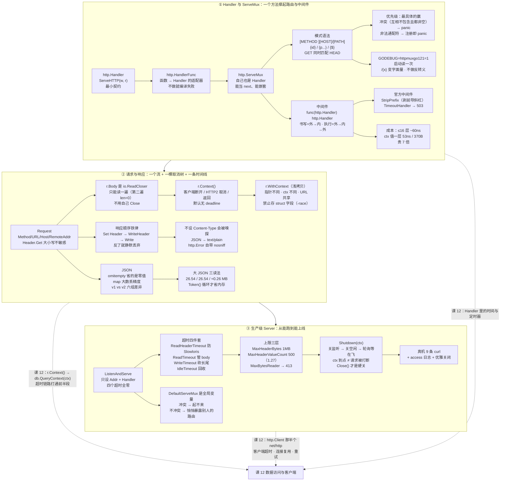

# 课 11：net/http 服务端

> 所属阶段：标准库与网络编程 ｜ 故事章节：让它对外提供服务 ｜ 状态：✅ 已完成 2026-09-10 ｜ 本机实测：go1.27.1 darwin/arm64

---

## 🎯 本课目标

学完这一课，你应该能：

- 说清 `http.Handler` / `http.HandlerFunc` / `http.ServeMux` 三者的关系，会用 **Go 1.22+ 的方法 + 通配路由**写出干净的路由表，并能把中间件写成「接收 Handler、返回 Handler」的链。
- 正确读写 `*http.Request` 与 `ResponseWriter`：知道 **Header 必须在 `WriteHeader`/`Write` 之前设**、状态码只能写一次、`r.Body` 就是课 10 那个 `io.Reader`、`r.Context()` 就是课 10 那棵取消树的落点；会用 struct tag 做 JSON 编解码，也知道 `encoding/json/v2` 改了哪些默认行为。
- 把一份 `http.Server` 从"能跑"配到"能上线"：**超时三件套**、`srv.Shutdown(ctx)` 优雅关闭、`MaxHeaderBytes` / `MaxHeaderValueCount` / `MaxBytesReader` 三层资源上限，并避开默认 `DefaultServeMux` 这个全局状态的坑。

---

## 📍 本课在故事主线中的情节定位

> **故事章节：让它对外提供服务。** 上一课（课 10）小谷把"东西怎么在内存里流动"这事想明白了 —— 数据是一股流，不是一坨字节；取消要沿着一条树往下传。这一课他终于要把重写后的下单逻辑真正挂到网上，让真实流量打进来。

### 先合拢课 10 埋下的伏笔

课 10 讲的三件事，全部会在这节课里被立刻用上 —— 不是"以后你会用到"，是**本课第一段示例代码就会用到**：

| 课 10 学的 | 课 11 里它落在哪 |
|---|---|
| 知识点 1：`io.Reader` 的最小契约 | **`http.Request.Body` 的类型就是 `io.ReadCloser`** —— 一个更完整的 `io.Reader`。所以 `io.ReadAll(r.Body)`、`json.NewDecoder(r.Body)`、`io.Copy` 全都能直接吃它 |
| 知识点 1：流式 vs 全读进内存 | 请求体越大越明显：本课实测 13.06 MB 的 JSON，**全读进内存的堆占用 ≈26.5 MB，流式逐条处理只要 ≈0.26 MB** |
| 知识点 1：`io.Writer` 到处都能接 | `json.NewEncoder(w)` 直接写 `ResponseWriter`，中间不落任何字节切片 |
| 知识点 2：`context` 取消树 | **`r.Context()` 就是那棵树的落点。** 官方文档原话：*"For incoming server requests, the context is canceled when the client's connection closes…"* —— 本课实测：客户端超时断开后，服务端 handler 里的 `ctx.Err()` 立刻变成 `context canceled` |
| 知识点 2：`WithValue` 挂请求级数据 | 中间件往 ctx 里塞 requestID，handler 从 `r.Context()` 取 —— 这是 `WithValue` 在真实项目里**唯一被官方认可**的用法 |
| 知识点 3：资源纪律（`defer Close`） | 这里有一个**反直觉的转折**：`r.Body` **不用你关**，官方文档写着 *"The Server will close the request body. The ServeHTTP Handler does not need to."* —— 但客户端侧的 `resp.Body` 必须自己关（课 12 回收） |

### 本课在阶段 4 里的位置

```
课 10  io 与 context      ——  数据怎么流、怎么停（能流动）
课 11  net/http 服务端     ——  ★ 本课：怎么把它挂到网上（能对外）
课 12  数据访问与客户端     ——  怎么对外访问别人 + 怎么存下来（能存取）
```

一句话概括本课的转折：**课 10 教的是"流"，课 11 要解决的问题是"这股流从哪来、到哪去、什么时候必须掐断"。**

### 三个真实需求（第一幕的场景来源）

小谷这次不是"学习"，是**要上线**：

1. **路由要能分清"对哪个东西、做什么"** —— `/orders/42` 和 `/orders` 是两个接口，`GET /orders` 和 `POST /orders` 也是两回事。他不想写一堆 `if strings.HasPrefix(path, ...)`。
2. **请求要能收 JSON、响应要能吐 JSON，而且不能"看着对但发不出去"** —— 前端联调时最恨的就是"我代码里明明设了 Header，抓包却没有"。
3. **压测时服务要能扛住、要能干净地下线** —— 上游抖动、连接被慢客户端拖住、发布时要平滑重启，这些都不是"能跑起来"能解决的。

---

## 📌 知识点导航

| # | 知识点 | 关键点 | 状态 |
|---|--------|--------|------|
| 1 | Handler 与 ServeMux | ①`http.Handler` 接口（`ServeHTTP(ResponseWriter, *Request)`）②`http.HandlerFunc` 把普通函数适配成 Handler ③`http.ServeMux` 路由（**Go 1.22+ 支持方法（如 `"GET /api/x"`）与路径通配**）④中间件就是"接收 Handler、返回 Handler"的函数链 | ✅ 已完成 2026-09-10 |
| 2 | 请求与响应 | ①`*http.Request` 常用字段（Method / URL / Header / Body）②`ResponseWriter`：**Header 必须在 `WriteHeader`/`Write` 之前设置，状态码只能写一次** ③JSON 编解码与 struct tag ④⚠️ `encoding/json/v2` 与 `jsontext`：`jsonv2` **是实验开关但默认开着**，且**默认下 v1 就是由 v2 实现的**（v1 行为被刻意保住，不强制迁移） | ✅ 已完成 2026-09-10 |
| 3 | 生产级 Server 配置 | ①超时三件套 `ReadHeaderTimeout` / `ReadTimeout` / `WriteTimeout`（**`ListenAndServe` 默认没有超时**，这是 Slowloris 类攻击面）②`srv.Shutdown(ctx)` 优雅关闭 ③`MaxHeaderBytes` 等资源上限 ④常见坑：默认 `DefaultServeMux` 是全局状态 | ✅ 已完成 2026-09-10 |

---

## 第一幕：起源与场景引入

### 1.1 origin：`net/http` 是怎么长出来的

`net/http` 是 Go 标准库里**最古老、改动最频繁、也最不敢乱改**的包之一。几个能查到出处的事实：

- **它从 Go 公开之初就在。** 本机 `$GOROOT/src/net/http/server.go` 的版权头写着 `Copyright 2009 The Go Authors`，是 2009 年那批代码。而 Go 1.0（2012-03）发布时，`http.Server` 已经只有今天这个形状了 —— 查 `$GOROOT/api/go1.txt` 能看到当时就有的字段：`Addr` / `Handler` / `MaxHeaderBytes` / `ReadTimeout` / `WriteTimeout` / `TLSConfig`。
- **它一开始就没有超时。** 上面那份 1.0 的字段清单里**没有 `ReadHeaderTimeout`，也没有 `IdleTimeout`** —— 这两个是 **Go 1.8** 才补上的（`api/go1.8.txt` 里能查到）。也就是说，中间有整整五年，"服务端读完请求头要限时"这件事**只能靠调用方自己想办法**。这不是设计疏忽被后人发现，而是当年确实按"最小可用"发布的。（核查于 2026-09）
- **有一位关键维护者。** `net/http` 长期由 **Brad Fitzpatrick** 维护。他在 2007 年 8 月加入 Google，2011 年 2 月已经在往 `net/http` 提交改动 —— 可以查到那时的提交记录：*"http: introduce start of Client and ClientTransport"*（2011-02-23），正是今天 `http.Client` / `http.Transport` 的起点。后来他成为 Go 团队成员，长期负责 `http` / `json` / `png` / `jpeg` 等包（GopherCon 2014 他的演讲题目就叫《Camlistore & The Standard Library》）。（核查于 2026-09）
- **它的路由被重写过一次。** `ServeMux` 的模式语法和匹配规则在 **Go 1.22 发生了重大变化**：从"只能按路径前缀匹配"变成"可以写 `GET /orders/{id}` 这种带方法和通配的模式"。这个变化大到官方专门留了一个回退开关：`GODEBUG=httpmuxgo121=1`（`$GOROOT/src/internal/godebugs/table.go` 里写作 `{Name: "httpmuxgo121", Package: "net/http", Changed: 22, Old: "1"}`）。（核查于 2026-09）
- **它到现在还在加防线。** 本机 Go 1.27 给 `http.Server` 新增了两个字段：`MaxHeaderValueCount`（默认 500）和 `DisableClientPriority`（`api/go1.27.txt` 里写作 `pkg net/http, const DefaultMaxHeaderValueCount = 500 #79936`）。前者专门防"用几百个小 header 而不是一个大 header 来撑爆你"。

> 💡 **一句话读懂这个包的设计哲学**：整个 `net/http` 服务端只有 **一个核心接口**，而且只有一个方法。所有能力 —— 路由、中间件、日志、鉴权、压缩 —— 都是围绕这一个方法"组合"出来的，而不是靠框架加钩子。

### 1.2 场景：小谷要把下单服务挂到网上

上一课结束时，小谷的代码是这样的：日志分析、文件导出、上游调用都已经能"正确地流式处理"了，但**都还在同一个进程里被 `main` 直接调用**。现在产品经理说了一句最朴素的话：

> "能不能让我用浏览器访问一下？"

于是小谷写下了 Go 程序员都会写的第一版 HTTP 服务 —— 五行：

```go
func main() {
	http.HandleFunc("/orders", handleOrders)
	http.HandleFunc("/orders/detail", handleOrderDetail)
	log.Fatal(http.ListenAndServe(":8080", nil))
}
```

跑起来了。本地 `curl` 也通了。然后他连着撞了三堵墙。

---

### 1.3 撞墙 A：两个库撞了同一个路由，进程直接起不来

小谷为了做监控，引了两个内部 SDK。两个 SDK 都很"贴心"，在 `init()` 里自动往 `http.DefaultServeMux` 注册了自己的接口 —— 而且**都叫 `/api/config`**。

他只是 import 了一下，服务就再也起不来了：

```console
########## p11_defmux —— DefaultServeMux 全局状态冲突（预期 init panic） ##########
panic: pattern "/api/config" (registered at /tmp/go-l11/p11_defmux/pluginB/b.go:10) conflicts with pattern "/api/config" (registered at /tmp/go-l11/p11_defmux/pluginA/a.go:10):
	/api/config matches the same requests as /api/config

goroutine 1 [running]:
net/http.(*ServeMux).register(...)
	/usr/local/Cellar/go/1.27.1/libexec/src/net/http/server.go:2957
net/http.HandleFunc({0x10452f49d?, 0x1043504d4?}, 0x104811468?)
	/usr/local/Cellar/go/1.27.1/libexec/src/net/http/server.go:2951 +0x98
example.com/l11/p11_defmux/pluginB.init.0()
	/tmp/go-l11/p11_defmux/pluginB/b.go:10 +0x30
exit status 2
```

**注意这个 panic 的位置：`pluginB.init.0()`。** 它发生在 `init` 阶段，也就是说 —— **`main` 函数的第一行都还没执行，进程就死了**。小谷对着代码看了半天，因为报错指向的 `pluginB` 他甚至没打算用它的接口。

更让他后背发凉的是后一半：如果只有一个 SDK 注册了路由呢？那服务能起来，但**它注册的那条路由会被悄悄暴露在公网上**，小谷完全不知情。实测对照：

```console
########## p11b_defmux_local —— 改用自己的 mux 后的对照 ##########
== 自己的 mux：只认自己注册的路由 ==
  用我的 mux 打 /api/orders    → 200 "我的订单接口"
  用我的 mux 打 /api/config    → 404 "404 page not found\n"
  用我的 mux 打 /api/metrics   → 404 "404 page not found\n"

== 同一时刻全局 DefaultServeMux 里有什么 ==
  用 DefaultServeMux 打 /api/orders    → 404 "404 page not found\n"
  用 DefaultServeMux 打 /api/config    → 200 "pluginA 的配置"
  用 DefaultServeMux 打 /api/metrics   → 200 "pluginC 的指标"

  → pluginA / pluginC 的 init 已经悄悄改了全局路由表；
    你的服务只要用了 DefaultServeMux（ListenAndServe 传 nil），就会把它们一起暴露出去。
```

**同一时刻，同一个进程里有两张路由表。** 小谷自己 `NewServeMux()` 建的那张只认他的 `/api/orders`；而 `http.DefaultServeMux` 那张已经被两个 SDK 改得面目全非。`http.ListenAndServe(":8080", nil)` 里那个 `nil` 的含义就是"用全局那张"。

> 🐞 这一步给我们的第一个教训：**`nil` 不是"不用 handler"，是"用全局那个 handler"。**

---

### 1.4 撞墙 B：Header 设了，抓包却没有

第二个需求是前后端联调。前端要一个自定义头 `X-Request-Id` 方便串联日志，小谷在 handler 里写了：

```go
w.WriteHeader(http.StatusCreated)   // 先写了状态码
w.Header().Set("X-Request-Id", id)  // 再设头
```

本地跑没问题（因为本地只看了 `status`），一联调前端就问："头呢？"

他改成"先设头再写状态码"就对了。为了搞清楚到底发生了什么，他把两种写法并排跑了一遍：

```console
########## p5_respwriter —— Header 时机 / 状态码只写一次 / Content-Type 嗅探 ##########
== ② 先设 Header 再 WriteHeader：头生效 ==
  /right-order           → 状态=201  Content-Type=application/json  Content-Length=11  X-Custom=先设头  body="{\"ok\":true}"

== ③ 先 WriteHeader 再设 Header：头进不去（静默丢失，不报错）==
  /wrong-order           → 状态=201  Content-Type=text/plain; charset=utf-8  Content-Length=11  body="{\"ok\":true}"
```

两行差别只有顺序，结果却是：`X-Custom` **完全不见了**，连 `Content-Type` 都退回到了自动嗅探出来的 `text/plain`。

而且 —— **服务端一句话都没抱怨**。没有日志、没有 error、没有 panic。这是它最坑的地方：

> 🐞 第二个教训：**HTTP 响应头一旦"开始写"，Header map 上的后续修改就静默失效。** 丢了的东西不会报错，只会消失。

---

### 1.5 撞墙 C：裸 `ListenAndServe` 上线，一压测连接数就爆

第三条是上线前压测。小谷的代码本来是这样：

```go
http.ListenAndServe(":8080", mux)
```

压测机自己没问题，但**攻击流量**（或者更常见的：一堆网络极差的客户端）开始出现时，连接数只涨不降。他查到最后发现：有人只发了一半请求头，然后就不发了 —— 而他的服务**一直在那儿等着**。

他做了个实验，用原始 TCP 模拟"只发一半请求头"，先看不设超时的服务：

```console
########## p8_timeout —— 超时三件套 + Slowloris 慢连接实测 ##########
== ① 裸 Server（等于 http.ListenAndServe 的默认配置）vs 设了 ReadHeaderTimeout ==
  A：一个超时字段都没设 → 127.0.0.1:54973
     客户端只发一半请求头，然后等 3 秒：
  等了 3s 还没被踢（服务端一直握着这条半开的连接）
```

"等了 3s 还没被踢" —— 而这里的 `3s` 只是**我们观察窗口的长度**，不是超时时间。把窗口拉到 30 秒，结论是一样的：它永远不会踢。每一条这样的连接都占着一个 goroutine 和一份缓冲，几百条就能把内存吃光。

然后他加上一个字段：

```go
srv := &http.Server{
	Addr:              ":8080",
	Handler:           mux,
	ReadHeaderTimeout: 500 * time.Millisecond,
}
```

同一个实验：

```console
  B：ReadHeaderTimeout=500ms → 127.0.0.1:55007
     同样只发一半请求头，然后等 3 秒：
  500ms 后被踢：EOF
```

**500 毫秒，干净利落地踢掉。**

> 🐞 第三个教训：**`http.ListenAndServe(addr, handler)` 等价于 `&http.Server{Addr: addr, Handler: handler}` —— 一个超时都没设。** 这不是"默认值配得保守"，而是"根本没有默认值"。源码就在 `$GOROOT/src/net/http/server.go`：

```go
func ListenAndServe(addr string, handler Handler) error {
	server := &Server{Addr: addr, Handler: handler}
	return server.ListenAndServe()
}
```

---

### 1.6 三道墙连起来看

| 撞墙 | 表面症状 | 一句话根因 | 本课对应知识点 |
|---|---|---|---|
| A | import 了两个 SDK，进程 `init` 阶段 panic | `http.DefaultServeMux` 是**包级全局变量**，谁都能改 | 知识点 3 ④ |
| B | Header 设了但发不出去，且不报错 | `ResponseWriter` 的 Header 必须在**开始写响应之前**设好 | 知识点 2 ② |
| C | 连接数只涨不降，扛不住慢客户端 | `ListenAndServe` **默认没有任何超时** | 知识点 3 ① |

小谷的结论很朴素：**Go 起一个 HTTP 服务只要五行，但从"五行能跑"到"能上线"，差的正是这三堵墙背后的东西。** 这一课就来拆它们。

---

## 第二幕：认知冲突

小谷在查这三堵墙的过程中，先后有三个"我以为"被推翻。这三个"我以为"恰好就是三个知识点的入口。

### 我以为 1：「Handler 就是一个函数」

小谷的第一版代码里，`handleOrders` 是一个普通函数：

```go
func handleOrders(w http.ResponseWriter, r *http.Request) { ... }
```

他顺手想把这个函数塞进一个 `[]http.Handler` 里统一管理，结果编译不过：

```console
########## e1_noiface —— 普通函数不满足 http.Handler（预期编译失败） ##########
# example.com/l11/e1_noiface
e1_noiface/main.go:11:23: cannot use plainFunc (value of type func(w http.ResponseWriter, r *http.Request)) as http.Handler value in variable declaration: func(w http.ResponseWriter, r *http.Request) does not implement http.Handler (missing method ServeHTTP)
(退出码=1)
```

**"does not implement http.Handler (missing method ServeHTTP)"** —— 原来 `http.Handler` 是**接口**，不是函数类型。而普通函数身上**一个方法都没有**。

那小谷平时写的 `http.HandleFunc("/orders", handleOrders)` 为什么能行？因为它偷偷做了一次类型转换。这件事整个 `net/http` 里只靠一个 3 行的适配器完成：

```go
type HandlerFunc func(ResponseWriter, *Request)

func (f HandlerFunc) ServeHTTP(w ResponseWriter, r *Request) {
	f(w, r)
}
```

> 💡 **这就是 Go 里"接口适配"最经典的一个例子**：不改函数、不写包装结构体，只是给函数类型**加一个方法**，它立刻就满足接口了。这个手法在课 6《接口与泛型》里讲过，这里是它最著名的实战。

实测确认这两者确实是同一个接口的两种实现：

```console
########## p1_handler —— http.Handler 最小契约 + HandlerFunc 适配 ##########
== ① 一个函数 vs 一个 Handler 值 ==
  普通函数        f  的类型：func(http.ResponseWriter, *http.Request)
  适配后的       hf  的类型：http.HandlerFunc
  手写 Handler   ah  的类型：*main.auditHandler
  hf 能被断言成 http.Handler：true
  f  能被断言成 http.Handler：false   ← 差的就是这一层适配
```

### 我以为 2：「设了 Header 就一定会发出去」

第一堵墙已经看到了。但小谷以为"这是 Go 的 bug"，直到他看到官方文档里 `ResponseWriter.Header()` 的注释：

> *"Changing the header map after a call to `ResponseWriter.WriteHeader` (or `ResponseWriter.Write`) has no effect unless the HTTP status code was of the 1xx class or the modified headers are trailers."*
> （核查于 2026-09；`$GOROOT/src/net/http/server.go`）

**"has no effect" —— 不是"有副作用"，是"没有效果"。** 而且这句话是写进接口契约里的，不是实现细节。也就是说这不是 bug，是**设计**。

小谷顺着这条线又发现第二件事：状态码也只能写一次。他把一个 handler 写成连调两次 `WriteHeader`：

```console
== ④ 状态码写两次：第二次被忽略，但服务端会打一行日志 ==
[服务端日志] http: superfluous response.WriteHeader call from main.main.func4 (main.go:42)
  /double-writeheader    → 状态=418  Content-Type=text/plain; charset=utf-8  Content-Length=16  X-First=yes  body="我实际是 418"
```

那句英文日志翻译过来是 **"多余的 WriteHeader 调用"**。注意它只是**日志**（默认进 stderr），请求照样返回第一次设的 418。

> 🐞 所以"状态码写了两次"的真实后果是：**客户端看到的是第一个，你自己在日志里看到一行抱怨，线上通常没人看日志。**

### 我以为 3：「`ListenAndServe` 是官方推荐的生产写法」

第三堵墙已经打过脸了。但小谷更想知道的是：**为什么 Go 不给我配一个合理的默认超时？**

翻到 `Server` 结构体上每个超时字段的注释，答案就出来了 —— 因为**"合理"这件事因人而异，Go 选择了不替你决定**：

> - `ReadTimeout`：*"A zero or negative value means there will be no timeout."*
> - `ReadHeaderTimeout`：*"If zero, the value of ReadTimeout is used. If negative, or if zero and ReadTimeout is zero or negative, there is no timeout."*
> - `WriteTimeout`：*"A zero or negative value means there will be no timeout."*
> - `IdleTimeout`：*"If zero, the value of ReadTimeout is used."*
>
> （核查于 2026-09；`$GOROOT/src/net/http/server.go`）

**每个字段的零值都明确写着"没有超时"。** 这不是"默认值取得保守"，而是"默认不设限"。

> 💡 三个"我以为"合起来，指向同一个主题：**`net/http` 的默认值几乎都在"能用"这一侧，而不是"安全"这一侧。** 从"能跑"到"能上线"，你要补的正是这些默认值没管的部分。

---

---

## 第三幕：层层揭示

### 知识点 1：Handler 与 ServeMux

#### ① 一句话定义

**`http.Handler` 是"能处理一次 HTTP 请求"的全部契约 —— 它只有一个方法 `ServeHTTP(ResponseWriter, *Request)`；`http.ServeMux` 是一个"按模式把请求分给不同 Handler"的 Handler；而中间件就是"吃一个 Handler、吐一个 Handler"的函数。**

#### ② 直觉建立（类比 + 失效边界）

**类比：一个只有一种插孔的接线板。**

想象一个国家规定：**所有电器，不管你是冰箱还是台灯，插头必须长成同一个形状。** 这个"统一插头"就是 `http.Handler` —— 不管你的业务是查订单、发消息还是返回一个静态文件，对外都长成 `ServeHTTP(w, r)` 这个样子。

好处立刻显现：

- **接线板（`ServeMux`）不需要认识任何具体电器**，它只要知道"插头长这样"，就能把电分出去。
- **任何电器都能被串到任何已有的电路上**（中间件），因为"输入输出都是同一种插头"。
- **转接头（`HandlerFunc`）只需要一个**，就能把"裸线"（普通函数）变成标准插头。

**这个类比在哪里失效（三条）：**

1. **它不是物理插头，是"行为契约"。** 插头形状对了就能通电；但 `ServeHTTP` 会**被你调用**，而调用它的地方（server）会假设一些没写在签名里的事 —— 比如"返回后不许再写 `w`"、"panic 会被 server 兜住"。签名相同 ≠ 行为合规。
2. **插头是死的，Handler 可以是有状态的。** 一个 `*ServeMux` 内部维护着路由树；一个有状态的 Handler（比如带缓存的）**在并发请求下必须自己保证线程安全** —— 接口本身不提供任何并发保护。
3. **"接线板"只解决了分发，没解决顺序。** 真实的请求处理要"先记日志、再鉴权、再限流、最后才是业务"，这个**顺序**是中间件链自己拼出来的，`ServeMux` 完全不管。

#### ③ 核心原理

##### §1.1 最小契约：一个方法，就是全部

```go
type Handler interface {
	ServeHTTP(ResponseWriter, *Request)
}
```

整个 Go 服务端生态就建立在这一个接口上。官方文档里有几句话比签名更重要（原文，核查于 2026-09）：

> *"`Handler.ServeHTTP` should write reply headers and data to the `ResponseWriter` and then return. **Returning signals that the request is finished; it is not valid to use the `ResponseWriter` or read from the `Request.Body` after or concurrently with the completion of the ServeHTTP call.**"*
>
> *"Moreover… **Cautious handlers should read the `Request.Body` first, and then reply.**"*
>
> *"**Except for reading the body, handlers should not modify the provided Request.**"*
>
> *"**If ServeHTTP panics, the server… assumes that the effect of the panic was isolated to the active request.**"*

把这几句翻译成人话，就是四条"签名里没写但必须遵守"的规则：

| # | 规则 | 违反的后果 |
|---|---|---|
| 1 | **`ServeHTTP` 返回后，不许再用 `w`、也不许再读 `r.Body`** | 数据写到一半被截断；把 `w` 传给后台 goroutine 是经典事故 |
| 2 | **先读 body，再写响应** | HTTP/1.x 下写响应可能让 body 读不到了（见 §2.10） |
| 3 | **除了读 body，不要改传进来的 `r`** | 你改的可能是别人还在用的对象 |
| 4 | **panic 只影响这一个请求** | server 会 recover 掉、打日志、关掉这条连接 —— 但**你的服务不会挂** |

第 4 条值得单独说一句：**handler 里 panic 不会拖垮进程。** 这既是好处（一个坏请求不会搞死服务），也是坑 —— 如果你只在 `main` 里做了错误日志告警，handler 里的 panic **看不到**，因为它是被 server recover 走的。

##### §1.2 `HandlerFunc`：3 行代码的适配器

```go
// The HandlerFunc type is an adapter to allow the use of
// ordinary functions as HTTP handlers. If f is a function
// with the appropriate signature, HandlerFunc(f) is a
// Handler that calls f.
type HandlerFunc func(ResponseWriter, *Request)

// ServeHTTP calls f(w, r).
func (f HandlerFunc) ServeHTTP(w ResponseWriter, r *Request) {
	f(w, r)
}
```

（源码原文，核查于 2026-09；`$GOROOT/src/net/http/server.go`）

**这段代码值得逐字读一遍**，因为它示范了 Go 里最优雅的一个模式：

- **`type HandlerFunc func(ResponseWriter, *Request)`** —— 定义的是一个**函数类型**，不是结构体，不占额外内存。
- **`func (f HandlerFunc) ServeHTTP(...)`** —— 给**函数类型**加了方法。Go 允许给任何**具名类型**加方法，函数类型也是具名类型。
- **`f(w, r)`** —— 方法体就是调用自己。

于是编译期断言成立：

```go
var _ http.Handler = http.HandlerFunc(nil)   // 这一行编不过，就说明适配器废了
```

> 💡 **为什么不开后门给"裸函数"？** 因为 Go 的接口是**结构化的**：要么你有那个方法，要么你没有。没有"函数签名长得对就自动算实现"这回事（不像有些语言有隐式函数接口）。`HandlerFunc` 就是把这层转换**显式化**，代价是 3 行代码。

##### §1.3 `ServeMux` 自己也是 Handler —— 这是组合能力的来源

```console
########## p1_handler —— http.Handler 最小契约 + HandlerFunc 适配 ##########
== ③ ServeMux 自己也是一个 Handler（所以 mux 能当中间件的 next、也能被嵌套）==
  mux 的类型 *http.ServeMux
  当成 Handler 直接调用 → Code=200 Body="pong"

== ④ 三个「也实现了 Handler」的标准库类型（同一契约，到处复用）==
  http.HandlerFunc
  *http.redirectHandler
  *http.fileHandler
```

`*http.ServeMux`、`*http.fileHandler`（`http.FileServer` 返回的东西）、`*http.redirectHandler` —— 这些**功能完全不同**的东西，对外全都是一个 `http.Handler`。

这就是为什么下面这几种写法都能成立：

```go
var h http.Handler = mux                      // 路由表当 handler
var h2 http.Handler = http.FileServer(dir)    // 静态文件服务当 handler
mux.Handle("/static/", http.StripPrefix("/static/", h2))  // 把文件服务挂进路由表
```

> 💡 **`ServeMux` 是 Handler，这件事是整个 `net/http` 组合能力的根。** 如果它不是一个 Handler，你就没法把"一整个路由表"挂到"另一个路由表的某个前缀"上，也没法把它当中间件的 `next`。

##### §1.4 路由模式的完整语法（Go 1.22+）

这是本课相比老教程变化最大的地方。`ServeMux.Handle` 的模式语法是：

```
[METHOD ][HOST]/[PATH]
```

三个部分**都可以省略**。官方文档给的例子（原文，核查于 2026-09）：

> - `"/index.html"` matches the path `/index.html` for any host and method.
> - `"GET /static/"` matches a GET request whose path begins with `/static/`.
> - `"example.com/"` matches any request to the host `example.com`.
> - `"example.com/{$}"` matches requests with host `example.com` and path `/`.
> - `"/b/{bucket}/o/{objectname...}"` matches paths whose first segment is `b` and whose third segment is `o`.

还有几条规则必须记住（同样是官方原文）：

| 规则 | 原文要点 |
|---|---|
| **字面部分大小写敏感** | *"Literal (that is, non-wildcard) parts of a pattern match the corresponding parts of a request **case-sensitively**."* |
| **没写方法 = 匹配所有方法** | *"A pattern with no method matches every method."* |
| **写了 `GET` 会同时匹配 `HEAD`** | *"A pattern with the method GET matches both GET and HEAD requests."* ← **这条很容易忘，且是实测过的** |
| **通配符必须是完整的一段** | *"Wildcards must be full path segments: they must be preceded by a slash and followed by either a slash or the end of the string. For example, `"/b_{bucket}"` is not a valid pattern."* |
| **`{x...}` 吃掉剩余全部** | *"if the `...` is present, then the wildcard matches the remainder of the URL path, including slashes."* |
| **`{$}` 只匹配"到此为止"** | *"The special wildcard `{$}` matches only the end of the URL. For example, the pattern `"/{$}"` matches only the path `/`, whereas the pattern `"/"` matches every path."* |
| **路径是逐段反转义的** | *"For matching, both pattern paths and incoming request paths are unescaped segment by segment."* |
| **更具体的赢；打平则 panic** | *"If two or more patterns match a request, then the most specific pattern takes precedence… If a pattern… conflicts with another pattern that is already registered, those functions panic."* |

一次跑通全部规则：

```console
########## p2_mux —— ServeMux 路由：方法 / 通配 / 优先级 / 冲突 / 尾斜杠 ##########
== ① 方法 + 路径：同一个路径不同方法，各自命中 ==
  GET   /orders                        → 200  列表
  POST  /orders                        → 200  建单
  PUT   /orders                        → 405  Method Not Allowed

  405 响应带的 Allow 头："GET, HEAD, POST"

== ② 通配符 {id} 与 {path...}：值从 PathValue 取 ==
  GET   /orders/42                     → 200  详情 id="42" rest=""
  GET   /orders/order-2026-0910        → 200  详情 id="order-2026-0910" rest=""
  GET   /files/a/b/c.txt               → 200  文件 id="" rest="a/b/c.txt"
  GET   /orders/42/extra               → 200  兜底（匹配所有 GET/HEAD）

== ③ {$} 与 / 的区别：前者只匹配「根」，后者匹配所有 ==
  GET   /                              → 200  首页（只匹配根路径）
  GET   /whatever                      → 200  兜底（匹配所有 GET/HEAD）
  GET   /health                        → 200  ok

== ④ 方法通配：没写方法的模式匹配所有方法；写了 GET 的模式同时匹配 HEAD ==
  HEAD  /health                        → 200  ok
  DELETE /health                        → 405  Method Not Allowed
```

**这里有三处值得停下来看：**

1. **`PUT /orders` 返回的是 405，不是 404。** 因为路径是能匹配上的（`/orders` 这个模式存在），只是方法不对。而且它**自动带了 `Allow: GET, HEAD, POST`** —— 注意 `HEAD` 是自动加进去的，因为 `GET` 隐含匹配 `HEAD`。这个 405 + Allow 是 `ServeMux` 白送的，你什么都不用写。
2. **`{id}` 与 `{path...}` 是两种不同的通配。** `{id}` 只吃一段（遇 `/` 就停），`{path...}` 吃到底。取值都用 `r.PathValue("名字")`。
3. **没匹配到的请求落到了 `GET /`**，而不是 404。这就是"兜底路由"的写法 —— 但也是坑：**一旦你注册了 `GET /`，任何拼错的路径都会拿到 200。** 很多人为此专门在兜底里返回 404。

##### §1.5 优先级与冲突：Go 1.22 起"写错了直接炸"

老版本（1.21）的路由是"**谁先注册谁赢**"，冲突了也不报错。1.22 改成了**按具体程度排序**，并且**冲突时直接 panic**。

```console
== ⑥ 优先级：更具体的赢（/images/thumbnails/ 比 /images/ 更具体）==
  GET   /images/a.png                  → 200  大图子树
  GET   /images/thumbnails/a.png       → 200  缩略图子树

== ⑦ 非法模式 / 冲突模式：Go 1.22 起直接 panic（1.21 是静默接受）==
  GET /orders/{id}detail         → panic: parsing "GET /orders/{id}detail": at offset 12: bad wildcard segment (must end with '}')
  GET /a{x}                      → panic: parsing "GET /a{x}": at offset 5: bad wildcard segment (must start with '{')
  GET /{                         → panic: parsing "GET /{": at offset 5: bad wildcard segment (must end with '}')
  /index.html                    → panic: pattern "/index.html" (registered at /tmp/go-l11/p2_mux/main.go:34) conflicts with pattern "GET /" (registered at /tmp/go-l11/p2_mux/main.go:118):
/index.html matches more methods than GET /, but has a more specific path pattern
  GET /dup                       → panic: pattern "GET /dup" (registered at /tmp/go-l11/p2_mux/main.go:34) conflicts with pattern "GET /dup" (registered at /tmp/go-l11/p2_mux/main.go:121):
GET /dup matches the same requests as GET /dup
  /images/thumbnails/            → 注册成功

== ⑧ 路径逐段反转义：%2F 不当分隔符（1.22 起的行为）==
  GET   /a%2Fb/                        → 200  命中 /a%2fb/（PathValue=""）
  GET   /a/b/                          → 200  命中 /a/b/
```

**注意 `/index.html` 与 `GET /` 的那条冲突说明**，它把判据讲得很清楚：

> `/index.html` matches **more methods** than `GET /`, but has a **more specific path pattern**

两边各赢一半 —— `GET /` 覆盖的方法多，`/index.html` 覆盖的路径精确 —— 谁也不是谁的子集，**所以它们冲突**。而如果写成 `GET /index.html`（带上方法），它就成了 `GET /` 的真子集，**不再冲突**（这条我一开始也写错了，实测才纠正过来）。

**`/images/thumbnails/` 能注册成功**，是因为它确实是 `/images/` 的真子集 —— 这就是"更具体的赢"的合法用法。

**把判据补全（12 组边界实测，见 `p2c_conflict` 与实操 1.3）**：

> - **无交集 → 不冲突**（`GET /x` + `POST /x`）
> - **严格包含 → 不冲突，更具体的赢**（`GET /{$}` ⊊ `GET /`）
> - **相等 → panic**（`GET /a/{x}` + `GET /a/{y}`：`matches the same requests as X`）
> - **有交集但互不包含 → panic**（`GET /` + `/status`：`matches more methods than X, but has a more specific path pattern`）

**最容易踩的一条是最后一类**：`"GET /"`（带方法）与**任何"不写方法"的模式**都冲突，而且**两个注册方向都会 panic**（报错措辞不同：`fewer methods … more general path` / `more methods … more specific path`）。所以**别混用"带方法"和"不带方法"的模式**——这是路由冲突的第一大来源，也是"兜底写 `GET /`"必须配"业务路由全带方法"的原因。

> 🐞 **一个必须注意的现实问题**：panic 信息里带着**注册时的源码绝对路径**（`/tmp/go-l11/p2_mux/main.go:34`）。这意味着**别人写过的库注册错了路径，报错会指向那个库的文件** —— 和你撞墙 A 的体验一样。看到不认识的路径，先想"这是不是我某个依赖注册的"。
>
> 🐞 **第二条现实问题**：这套判据是**从 12 组实测里总结的**，文档只给了两个反例，实现细节（`server.go` 的 `register` 里按"路径段"与"方法"两维度分别比较）可能随版本变。**所以最可靠的做法是写一个 `TestRoutes(t)`，把 `NewRouter()` 调一遍**——冲突在 `go test` 里炸，而不是在容器启动时炸。

##### §1.6 兼容开关：`GODEBUG=httpmuxgo121=1`

因为 1.22 的变化太剧烈（通配符含义变了、非法模式会 panic 了），官方留了一个**进程级**的回退开关。同一份代码，跑两次：

```console
########## p2b_mux121 —— 默认（Go 1.22+ 新行为） ##########
GODEBUG=(未设置)
-- 模式 "/{x}" 在两种模式下的含义 --
  注册 /{x}           → 成功
  GET   /{x}             → 200  命中模式 "/{x}"
  GET   /abc             → 200  命中模式 "/{x}"

-- 非法模式 "/a{x}" 在两种模式下的命运 --
  注册 /a{x}          → panic: parsing "/a{x}": at offset 1: bad wildcard segment (must start with '{')

-- 逐段反转义 "/%61" 在两种模式下的匹配 --
  注册 /%61           → 成功
  GET   /a               → 200  命中模式 "/%61"
  GET   /%2561           → 404  404 page not found
```

```console
########## p2b_mux121 —— GODEBUG=httpmuxgo121=1（回到 1.21 旧行为） ##########
GODEBUG=httpmuxgo121=1
-- 模式 "/{x}" 在两种模式下的含义 --
  注册 /{x}           → 成功
  GET   /{x}             → 200  命中模式 "/{x}"
  GET   /abc             → 404  404 page not found

-- 非法模式 "/a{x}" 在两种模式下的命运 --
  注册 /a{x}          → 成功

-- 逐段反转义 "/%61" 在两种模式下的匹配 --
  注册 /%61           → 成功
  GET   /a               → 404  404 page not found
  GET   /%2561           → 200  命中模式 "/%61"
```

**三处差异，全部与官方列的兼容性条目对得上：**

| 项 | 1.22+（默认） | 1.21（`httpmuxgo121=1`） |
|---|---|---|
| `/{x}` 的含义 | 单段通配，`/abc` 也命中 | 就是字面量路径 `/{x}` |
| `/a{x}` | **panic**（通配符必须整段） | 合法，匹配字面量 `/a{x}` |
| `/%61` 匹配 | `/a`（逐段反转义） | `/%2561`（整条路径反转义，语义相反） |

官方对这个开关的说明里有一句很关键（源码原文，核查于 2026-09）：

> *"To restore the old behavior, set the GODEBUG environment variable to `httpmuxgo121=1`. **This setting is read once, at program startup; changes during execution will be ignored.**"*

**"read once, at program startup"** —— 所以它只能在进程启动时定，运行时改环境变量没用。这也意味着：**线上回退要靠环境变量或重启，不能靠代码里的开关。**

##### §1.7 尾斜杠重定向：注册子树会送一个重定向

```console
== ⑤ 尾斜杠重定向：注册了子树（尾斜杠 / ... 通配）→ 少写斜杠会被 307 重定向 ==
  GET   /images                        → 307  <a href="/images/">Temporary Redirect</a>.

  Location=/images/
  GET   /images/logo.png               → 200  图片子树
```

**这里我用一次实测纠正了自己的一个错误预期**：我原本按国内教程的常见说法写成"301 重定向"，实测发现是 **307 Temporary Redirect**。官方文档只写了"it redirects the request by adding the trailing slash"，没说状态码 —— 所以这种事**只能实测，不能背**。

为什么是 307 而不是 301？307 保留请求方法和 body，301 不保证 —— 对一个可能收到 POST 的子树来说，307 是更安全的默认。

##### §1.8 中间件：`func(http.Handler) http.Handler`

**定义**（一句话）：中间件就是**签名固定为"吃一个 Handler、吐一个 Handler"的函数**。

```console
########## p3_middleware —— 中间件链（洋葱模型）+ StripPrefix / TimeoutHandler ##########
== ① 中间件的类型就是 func(http.Handler) http.Handler ==
  logging 的类型：func(http.Handler) http.Handler
  auth    的类型：func(http.Handler) http.Handler

== ② 洋葱模型：书写顺序 = 从外到内，执行顺序是「外→内→外」 ==
  chainA 也是一个 http.Handler：http.HandlerFunc
  [chainA = logging(auth(biz)) 带 token] 状态码=200 Body="下单成功"
          · logging 进入
          · auth 进入
          · biz 真正干活
          · auth 离开
          · logging 离开
  [chainA 不带 token] 状态码=401 Body="unauthorized\n"
          · logging 进入
          · auth 进入
          · auth 拒绝 → 短路，不再往下走
          · logging 离开
```

**三件事一次看明白：**

1. **组合的结果还是 `http.Handler`**（这里是 `http.HandlerFunc`）—— 所以中间件可以无限套娃。
2. **执行顺序是"洋葱"**：`logging(auth(biz))` 表示 logging 在最外层。进入顺序 `logging → auth → biz`，离开顺序反过来。
3. **短路是自然发生的**：`auth` 不调用 `next` 就 `return`，`biz` 永远不会执行 —— 但**外层的 `logging 离开` 照样会跑**（因为它在 `next.ServeHTTP` 之后）。这正是"记录一次完整请求耗时"能成立的原理。

换一下组合顺序，洋葱层次立刻变：

```console
== ③ 换一下组合顺序，洋葱层次立刻不同 ==
  [chainB = auth(logging(biz)) 带 token] 状态码=200 Body="下单成功"
          · auth 进入
          · logging 进入
          · biz 真正干活
          · logging 离开
          · auth 离开
  [chainB 不带 token（auth 在最外层，logging 根本没进去）] 状态码=401 Body="unauthorized\n"
          · auth 进入
          · auth 拒绝 → 短路，不再往下走
```

**注意第四条：`chainB` 不带 token 时，`logging 进入` 压根没打印。** 因为 `auth` 在最外层，它拒绝时 `logging` 还没被调用。这是"鉴权要放在最外层"和"日志要放在最外层"之间的真实取舍 —— **放在外层的中间件，能看到被自己拦掉的请求；放在内层的看不到。**

##### §1.9 标准库自带的两个中间件

`net/http` 里有两个现成的中间件，很多人不知道它们就长着中间件的形状：

```console
== ④ 标准库自带的中间件：http.StripPrefix 改写路径 ==
  裸 handler      → 200  裸 handler 看到的 r.URL.Path="/static/css/app.css"
  StripPrefix    → 200  StripPrefix 之后 看到的 r.URL.Path="css/app.css"

== ⑤ 标准库自带的中间件：http.TimeoutHandler 给单个请求套超时 ==
  超时阈值 100ms、handler 睡 300ms → 状态码=503 Body="上游超时了" 耗时=101ms
  handler 很快时 → 状态码=200 Body="快响应" 耗时=0s
```

- **`http.StripPrefix("/static/", h)`**：把请求路径的前缀摘掉再交给 `h`。注意摘完之后是 `css/app.css` —— **开头的 `/` 也没了**，如果 `h` 依赖绝对路径会踩坑。
- **`http.TimeoutHandler(h, 100*time.Millisecond, "上游超时了")`**：给**单个请求**套超时，超时返回 **503** 和你给的那句话。它和知识点 3 的 `WriteTimeout` 完全不同 —— 一个有兜底文案、能精确到单个 handler，一个是连接级的硬超时。

> ⚠️ `TimeoutHandler` 有个必须知道的边界：**它不会真的杀掉已经在跑的 goroutine。** 它只是在超时后替你把 503 发出去，原来那个 handler 还在后台跑（可能继续占着数据库连接）。所以它治的是"客户端等太久"，不是"后端别再干了"。

##### §1.10 中间件贵不贵？—— 量化给你看

"中间件套多了会不会变慢"是必须给出数字的问题。量一下（368 KB 级别的固定工作量里其实是纯调用链，两端都不做 IO；`-benchtime=300ms` 跑两轮）：

```console
########## bench 第 1 轮：中间件层数成本 + JSON 三种写法 ##########
BenchmarkMW_Noop_0-11               	70080385	         5.140 ns/op	       2 B/op	       1 allocs/op
BenchmarkMW_Noop_1-11               	49035464	         7.509 ns/op	       2 B/op	       1 allocs/op
BenchmarkMW_Noop_4-11               	31981876	        11.29 ns/op	       2 B/op	       1 allocs/op
BenchmarkMW_Noop_16-11              	 5945695	        59.10 ns/op	       2 B/op	       1 allocs/op
BenchmarkMW_Noop_64-11              	  587998	        622.6 ns/op	       2 B/op	       1 allocs/op
BenchmarkMW_Ctx_1-11                	 6773989	        52.72 ns/op	     370 B/op	       3 allocs/op
BenchmarkMW_Ctx_4-11                	1790210	       203.2 ns/op	    1474 B/op	       9 allocs/op
BenchmarkMW_Ctx_16-11               	  424855	       840.0 ns/op	    5890 B/op	      33 allocs/op
```

第二轮确认量级稳定（看波动不看精确值）：

```console
BenchmarkMW_Noop_0-11               	69279063	         4.910 ns/op	       2 B/op	       1 allocs/op
BenchmarkMW_Noop_1-11               	51416018	         7.209 ns/op	       2 B/op	       1 allocs/op
BenchmarkMW_Noop_4-11               	33292232	        11.04 ns/op	       2 B/op	       1 allocs/op
BenchmarkMW_Noop_16-11              	 5822961	        62.09 ns/op	       2 B/op	       1 allocs/op
BenchmarkMW_Noop_64-11              	  557361	        650.7 ns/op	       2 B/op	       1 allocs/op
BenchmarkMW_Ctx_1-11                	 6480807	        53.53 ns/op	     370 B/op	       3 allocs/op
BenchmarkMW_Ctx_4-11                	1800213	       199.5 ns/op	    1474 B/op	       9 allocs/op
BenchmarkMW_Ctx_16-11               	  439432	       819.5 ns/op	    5890 B/op	      33 allocs/op
```

**两条结论，都带阈值：**

| 中间件类型 | 每层成本 | 结论 |
|---|---|---|
| **只调用 `next`（空中间件）** | 1 层 +2.4 ns；4 层每层约 1.5 ns；16 层每层约 3.4 ns；**64 层每层约 9.6 ns** | **几十层之内完全可以忽略**（一次网络往返是微秒到毫秒级）。成本随层数**超线性**上升，但不是瓶颈 |
| **每层塞一个 `context.WithValue`** | **每层约 50 ns + 370 B + 2 次分配** | **比空中间件贵 20 倍以上**，而且每次请求都要分配内存。**别在中间件里无脑塞 ctx 值** |

> 💡 那句"每层 370 B"是真实的量。16 层 ctx 中间件 = 每次请求 5890 B、33 次分配 —— 对一个 QPS 上万的接口来说，这是实打实的 GC 压力。**ctx 里只放真正必需的请求级数据（用户身份、requestID、tracing span），不要拿它当"函数参数包"。**

#### ④ 示例演示：一个完整可跑的路由 + 中间件骨架

```go
package main

import (
	"context"
	"log"
	"net/http"
	"time"
)

type ctxKey struct{}

// 中间件 1：日志 + 计时（放在最外层，能看到所有请求，包括被拦掉的）
func logging(next http.Handler) http.Handler {
	return http.HandlerFunc(func(w http.ResponseWriter, r *http.Request) {
		start := time.Now()
		next.ServeHTTP(w, r)
		log.Printf("%s %s 用时=%v", r.Method, r.URL.Path, time.Since(start))
	})
}

// 中间件 2：往 ctx 里塞 requestID（并透传一个新 r 下去）
func withRequestID(next http.Handler) http.Handler {
	return http.HandlerFunc(func(w http.ResponseWriter, r *http.Request) {
		id := r.Header.Get("X-Request-Id")
		ctx := context.WithValue(r.Context(), ctxKey{}, id)
		next.ServeHTTP(w, r.WithContext(ctx))  // ← 一定要把新的 r 传下去
	})
}

func main() {
	mux := http.NewServeMux()
	mux.HandleFunc("GET /orders/{id}", func(w http.ResponseWriter, r *http.Request) {
		id := r.PathValue("id")
		rid, _ := r.Context().Value(ctxKey{}).(string)
		log.Printf("订单 %s（requestID=%s）", id, rid)
		w.WriteHeader(http.StatusOK)
		_, _ = w.Write([]byte("订单 " + id))
	})
	// 兜底：显式返回 404，避免拼错的路径也拿到 200
	mux.HandleFunc("/", func(w http.ResponseWriter, r *http.Request) {
		http.NotFound(w, r)
	})

	srv := &http.Server{
		Addr:              ":8080",
		Handler:           logging(withRequestID(mux)), // 洋葱：logging 最外层
		ReadHeaderTimeout: 2 * time.Second,
	}
	log.Fatal(srv.ListenAndServe())
}
```

#### ⑤ 常见误区（知识点 1）

| # | 误区 | 真相 |
|---|---|---|
| 1 | `http.Handler` 是函数类型 | 它是**接口**，只有一个方法。函数要用 `http.HandlerFunc` 适配 |
| 2 | `http.HandleFunc` 和 `mux.HandleFunc` 是一回事 | 前者注册到**全局** `DefaultServeMux`，后者注册到**你自己的** mux。**团队项目一律用后者** |
| 3 | `ServeMux` 只是个"路由表"，和 Handler 无关 | 它**本身就是一个 Handler**，这是嵌套和中间件的根基 |
| 4 | 路由还是"先注册先得" | **Go 1.22 起按具体程度匹配**；冲突直接 panic |
| 5 | `"/{x}"` 和 `"/"` 差不多 | `"/{x}"` 只匹配**单段**路径（`/abc` 命中，`/a/b` 不命中）；`"/"` 匹配**所有**路径 |
| 6 | 写 `"GET /x"` 后 `HEAD /x` 会 405 | **`GET` 模式同时匹配 `HEAD`**，实测 200 |
| 7 | 路径不匹配一律 404 | **路径匹配但方法不对 → 405**，还自动带 `Allow` 头 |
| 8 | 尾斜杠重定向是 301 | **实测 307**。别背状态码，要跑 |
| 9 | 中间件的顺序无所谓 | 顺序决定**谁能看到谁拦掉的请求**、以及鉴权是否真的在最外层生效 |
| 10 | 中间件里可以随便往 ctx 塞东西 | 每层约 50 ns + 370 B + 2 次分配。ctx 只放请求级数据 |
| 11 | `http.TimeoutHandler` 超时会把下层的 goroutine 杀掉 | **不会**。它只替你把 503 发出去，原 handler 还在跑 |

#### ⑥ 一句话记住

> **一个方法定契约（`ServeHTTP`），一个函数做适配（`HandlerFunc`），一个 Handler 管分发（`ServeMux`），一串 Handler 排顺序（中间件）。**

#### 📚 官方文档

- [`net/http` 包文档 · Handler / ServeMux](https://pkg.go.dev/net/http) —— 模式语法与优先级的权威出处（本机 `$GOROOT/src/net/http/server.go` 同源）
- [Go 1.22 Release Notes · Enhanced routing patterns](https://go.dev/doc/go1.22) —— 路由改版的官方说明与兼容性列表
- [Go 1.22 路由模式提案 #61410](https://go.dev/issue/61410) —— `Request.PathValue` 的来源

---

### 知识点 2：请求与响应

#### ① 一句话定义

**`*http.Request` 是"这一次请求的全部输入"（一个方法、一个 URL、一堆头、一个 `io.Reader` 形状的 body、一棵能被取消的 context），`http.ResponseWriter` 是"这一次响应的唯一出口"（它要求你按顺序写：先定头，再定状态码，最后写 body）。**

#### ② 直觉建立（类比 + 失效边界）

**类比：一张"只能从上往下填"的点菜单。**

`ResponseWriter` 就像一张必须按顺序填的点菜单：

1. **先填"备注栏"**（`w.Header().Set(...)`）—— 只有这一栏能反复涂改。
2. **然后填"桌号"**（`w.WriteHeader(code)`）—— **一旦落笔就撕不下来了**。
3. **最后填"菜品明细"**（`w.Write(...)`）—— 写完就交单了。

顺序错了会怎样？**服务生不会提醒你，他只是按已经定稿的那部分出餐。** 你在"桌号"之后补写的备注，直接消失。

**这个类比在哪里失效（三条）：**

1. **点菜单是死的，响应是分块发出去的。** 如果你写了特别多数据（或调了 `Flusher.Flush`），响应头会**真的飞出去**，此时"改备注"已经没有任何补救余地 —— 而且 body 一旦开始发，**HTTP/1.x 下再读请求体可能就读不到了**（见 §2.10）。
2. **`w.Write` 会自动帮你填前两栏。** 你什么都不写直接 `w.Write("hi")`，它会自动补 `200` 和 `Content-Type: text/plain; charset=utf-8` —— 这是最容易被忽略的"隐式行为"。
3. **状态码不止能写一次。** 官方的规则是"**任意多个 1xx，之后最多一个 2xx-5xx**" —— 所以 `100 Continue` / `103 Early Hints` 这类是特殊的，不是"只能写一次"的例外。

#### ③ 核心原理

##### §2.1 `*http.Request` 的字段地图

先看一次真实请求里到底能拿到什么。用 `httptest.NewServer` 起一个真服务（不是假的 recorder），客户端发一个带 query、带自定义头、带 JSON body 的 POST：

```console
########## p4_request —— Request 字段 + Body 是 io.Reader + r.Context() ##########
== ① 一次 POST：Request 的常用字段 ==
Method          = POST
URL.Path        = /inspect
URL.RawQuery    = page=2
RequestURI      = /inspect?page=2
Proto           = HTTP/1.1
Host            = 127.0.0.1:54149
RemoteAddr      = 127.0.0.1:54150
Content-Type    = application/json
ContentLength   = 36
Header 读取大小写不敏感：Get("x-trace-id") = "trace-abc-123"
Header 底层 map 的键是规范形式：r.Header["X-Trace-Id"] = [trace-abc-123]
URL.Query().Get("page") = "2"
```

**五个容易搞混的字段，一次说清：**

| 字段 | 是什么 | 典型用途 |
|---|---|---|
| `r.Method` | 大写的方法名字符串（`"GET"` / `"POST"`） | 极少直接比较 —— 用 `"GET /x"` 模式让 mux 替你分 |
| `r.URL.Path` | **已经解析、已经解码**的路径 | 读通配符之外的东西；但路径参数优先用 `r.PathValue` |
| `r.URL.RawQuery` | `?` 后面的原始串（`page=2`） | 需要原样转发时才用；取值用 `r.URL.Query()` |
| `r.RequestURI` | **客户端原样发来的**那一行（`/inspect?page=2`） | 打日志最有用 —— 它是"真的收到了什么" |
| `r.RemoteAddr` | 对端地址 `IP:port` | 限流 / 排查。⚠️ **有反向代理时会变成代理的地址**，真实 IP 在 `X-Forwarded-For` 里 |

**关于 `Header` 有一个关键细节**：`r.Header.Get("x-trace-id")` 小写能取到，但 `r.Header["x-trace-id"]` **取不到** —— 因为底层 map 的键被规范化成了 `X-Trace-Id`。

> 💡 规则是：**用 `Get` / `Set` 永远正确；直接索引 map 必须用规范形式。** 所以养成习惯 —— **只用 `r.Header.Get(...)`，别直接索引 `r.Header[...]`。**

##### §2.2 `r.Body` 就是课 10 那个 `io.Reader`（外加两个补充）

回忆课 10 的结论：**只要一个类型有 `Read([]byte) (int, error)`，它就能喂给整个 `io` 生态。** `http.Request.Body` 的类型是 `io.ReadCloser`（`io.Reader` + `Close()`），所以课 10 学的东西**全部原样可用**：

```console
【★ 回扣课 10】io.ReadAll(r.Body) = "{\"sku\":\"SO-20260910-0001\",\"count\":3}"
再读同一个 r.Body 一次 = ""（len=0）← 它是「流」不是「可重读的字节数组」
```

**"再读一次是空的"** 这一行是课 10 讲过的老知识在 HTTP 场景下的第一次现身：**body 是流，只能读一遍。** 想看第二次就得自己 `io.ReadAll` 存下来，或者用 `r.GetBody`（只有客户端请求才有）。

然后是两条**必须记住的补充**，都出自官方文档（核查于 2026-09；`$GOROOT/src/net/http/request.go`）：

> *"For server requests, the Request Body is always non-nil but will return EOF immediately when no body is present. **The Server will close the request body. The ServeHTTP Handler does not need to.**"*

| 补充 | 含义 | 为什么重要 |
|---|---|---|
| **服务端 `r.Body` 永远非 nil** | 即使是 GET，`r.Body` 也不是 nil，只是立刻返回 EOF | 所以 `r.Body == nil` 的判断是多余的；`io.ReadAll(r.Body)` 对 GET 会得到空切片而不是 panic |
| **Server 会替你关它** | **handler 不需要 `defer r.Body.Close()`** | ⚠️ 这**反直觉**：课 10 刚立的"资源必须自己关"纪律在这里不适用。但注意 —— **客户端侧的 `resp.Body` 必须自己关**，那是课 12 的事 |

> 🐞 这里有一个真实的踩坑点：**很多人凭直觉写 `defer r.Body.Close()`，它无害但也没必要**；更危险的是反过来 —— 因为"服务端不用关"就以为"所有 Body 都不用关"，于是在客户端代码里忘了关 `resp.Body`，导致连接池里的连接永远不释放（**连接泄漏**，课 12 细讲）。

**惯用式 JSON 解码**，把课 10 的流式思想和 `net/http` 缝在一起：

```console
== ③ 惯用式 JSON 解码：json.NewDecoder(r.Body).Decode(&v) ==
  解码得到 {SKU:SO-9 Count:7}
```

```go
var in createOrder
if err := json.NewDecoder(r.Body).Decode(&in); err != nil {
	http.Error(w, "bad json: "+err.Error(), http.StatusBadRequest)
	return
}
```

**为什么不写 `b, _ := io.ReadAll(r.Body)` 再 `json.Unmarshal(b, &in)`？** 对一个 10 MB 的请求体，前者只在内存里保留一个对象，后者要**额外留一份完整字节切片**。差别有多大，§2.8 有实测。

##### §2.3 `r.Context()` 就是课 10 那棵取消树的落点

这是本课与课 10 咬合最紧的一处。官方文档写得非常明确（核查于 2026-09）：

> *"For incoming server requests, **the context is canceled when the client's connection closes**, the request is canceled (with HTTP/2), **or when the ServeHTTP method returns.**"*

**"客户端连接关闭"** —— 这正是课 10 里"父取消、整棵子树全取消"在真实网络场景下的落地。实测看一遍：

```console
== ④ ★ 回扣课 10 知识点 2：客户端取消 → 服务端的 r.Context() 立刻 Done ==
r.Context() != nil            : true
r.Context().Done() != nil     : true   ← 可被取消的 ctx 才有 Done 通道
取消前 r.Context().Err()      : <nil>
r.Context() 自带 deadline 吗  : false

  -- 客户端带 200ms 超时去打一个要睡 2s 的 handler --
  [服务端] r.Context().Done() 被触发，ctx.Err() = context canceled
  客户端侧：err = Get "http://127.0.0.1:54149/slow": context deadline exceeded（耗时 200ms）

  -- 对照：客户端不取消，handler 就正常睡满 2s --
  客户端侧：err=<nil> 耗时=2s
  服务端返回：睡够了，正常返回
```

**这段输出里有三个高价值事实，一个一个说：**

1. **`r.Context()` 默认没有 deadline。** `Deadline()` 返回 `false` —— 服务端不会自动给你设一个请求超时。**"请求超时"这件事必须你自己加**（用 `TimeoutHandler`，或者在 handler 里 `context.WithTimeout(r.Context(), ...)`）。
2. **客户端断开时，服务端看到的 `ctx.Err()` 是 `context canceled`，不是 `deadline exceeded`。** 客户端那侧才是 `deadline exceeded`（那是**它自己的**超时）。**这是同一个事件在两个进程里的两种视角** —— 服务端只知道"对方不在了"，不知道对方为什么不在。→ 所以 **绝不能用 `ctx.Err() == context.DeadlineExceeded` 判断"是不是我自己的超时"**，这条在课 10 已经讲过，这里又出现了一次。
3. **两行的先后顺序可能互换**（服务端察觉的那一刻和客户端 `Do` 返回的那一刻几乎同时），所以别把日志顺序当因果。

**这个 context 最实用的用法**：让长耗时的 handler **能被打断**。对照一下两段代码：

```go
// ❌ 不看 ctx：客户端走了，它还在跑（继续占着数据库连接 / 下游配额）
func slow(w http.ResponseWriter, r *http.Request) {
	time.Sleep(2 * time.Second)
	result := callUpstream()   // 白干
	_, _ = w.Write(result)     // 写到一条没人要的连接上
}

// ✅ 看 ctx：客户端一走就收工
func slow(w http.ResponseWriter, r *http.Request) {
	select {
	case <-time.After(2 * time.Second):
		_, _ = w.Write([]byte("完成"))
	case <-r.Context().Done():
		return // 对方不在了，什么都不用写
	}
}
```

> 💡 **更重要的是：`r.Context()` 要顺着传下去。** 下游调用（数据库 / 别的服务）应该接收 `r.Context()` 而不是 `context.Background()` —— 这样客户端一断开，整条调用链上的工作**一起停**。这就是课 10 那棵树真正的价值。

##### §2.4 中间件怎么把值塞进 ctx（以及一个必须避开的坑）

这是 `WithValue` 在真实项目里**唯一被官方认可的用法**：把"请求级数据"从中间件传给后面的 handler。

```go
type ctxKey struct{}   // 用私有空 struct 当 key，避免跨包冲突

func withRequestID(next http.Handler) http.Handler {
	return http.HandlerFunc(func(w http.ResponseWriter, r *http.Request) {
		id := r.Header.Get("X-Request-Id")
		ctx := context.WithValue(r.Context(), ctxKey{}, id)
		next.ServeHTTP(w, r.WithContext(ctx))   // ← 传下去的必须是「新的 r」
	})
}
```

实测（`r.WithContext` 到底改了什么）：

```console
########## p13_ctxmiddleware —— 中间件传 ctx 的正确姿势 + 反面教材 ##########
== ① 中间件注入 requestID，handler 从 r.Context() 取 ==
  带入 "req-A"  → handler 从 ctx 里读到 requestID="req-A"
  带入 ""       → handler 从 ctx 里读到 requestID="auto"

== ② r.WithContext 给的是浅拷贝：新的 r 有新 ctx，老的 r 原封不动 ==
  两个 *http.Request 指针相同吗：false
  同一个底层 ctx 指针吗：false
  base  读到：<nil>
  child 读到：child-only
  base 的 URL 指针还是同一个（浅拷贝只换 ctx）：true
```

**关键点是 §2.4② 最后那行**：`r.WithContext` 返回的是**浅拷贝** —— 新的 `*Request` 结构体（指针不同），但内部的 `URL` 等指针**还是指向同一个对象**（`true`）。所以：

- ✅ **只换 ctx**，几乎零成本（一次结构体拷贝）。
- ⚠️ **但也意味着"改 URL 字段"之类的操作会互相影响** —— 浅拷贝只保护 `ctx` 这一个字段。

**然后是我刻意写了一个反面教材** —— 把 `ctx` 存进 struct 字段（官方文档明确禁止：*"Do not store Contexts inside a struct type"*）：

```go
type leakyHandler struct {
	ctx context.Context      // ❌ 官方明令禁止
}

func (h *leakyHandler) ServeHTTP(w http.ResponseWriter, r *http.Request) {
	h.ctx = r.Context()          // 每个请求都覆盖同一个字段
	time.Sleep(40 * time.Millisecond)
	id, _ := h.ctx.Value(ctxKey{}).(string)   // 读到的可能是别人的
	fmt.Fprintf(w, "leaky 读到的 requestID=%q", id)
}
```

两个请求并发打进来：

```console
== ③ 反面教材：把 ctx 存进 struct 字段，两个请求一并发就炸 ==
  带入 REQ-B-BBBB → 服务端回答：leaky 读到的 requestID="REQ-A-AAAA"
  带入 REQ-A-AAAA → 服务端回答：leaky 读到的 requestID="REQ-A-AAAA"

  两次回答里出现同一个 ID（说明后到的请求把 ctx 覆盖掉了），
  用 -race 跑还能看到竞态报告 —— 这就是「不要把 ctx 存进 struct」的原因。
```

**`REQ-B-BBBB` 这个请求，读到了 `REQ-A-AAAA` 的 requestID。** 在生产环境里，这意味着**A 用户的日志会带上 B 用户的 requestID**，甚至可能把 B 的权限判断结果用给 A。这不是"不优雅"，是**数据串号**。

普通运行只是"读错值"，`-race` 直接把竞态抓出来：

```console
########## p13_ctxmiddleware —— go run -race（预期报出 DATA RACE） ##########
== ③ 反面教材：把 ctx 存进 struct 字段，两个请求一并发就炸 ==
==================
WARNING: DATA RACE
Write at 0x00c0000143c0 by goroutine 16:
  main.(*leakyHandler).ServeHTTP()
      /tmp/go-l11/p13_ctxmiddleware/main.go:97 +0x88
  main.withRequestID.func1()
      /tmp/go-l11/p13_ctxmiddleware/main.go:30 +0xf0
  net/http.HandlerFunc.ServeHTTP()
      /usr/local/Cellar/go/1.27.1/libexec/src/net/http/server.go:2338 +0x48
  net/http.serverHandler.ServeHTTP()
      /usr/local/Cellar/go/1.27.1/libexec/src/net/http/server.go:3413 +0x268
  net/http.(*conn).serve()
      /usr/local/Cellar/go/1.27.1/libexec/src/net/http/server.go:2137 +0xa84
  context.withCancel()
      /usr/local/Cellar/go/1.27.1/libexec/src/context/context.go:279 +0x94
  context.WithCancel()
      /usr/local/Cellar/go/1.27.1/libexec/src/context/context.go:242 +0x28
  net/http.(*conn).serve()
      /usr/local/Cellar/go/1.27.1/libexec/src/net/http/server.go:2030 +0x288
  net/http.(*Server).Serve.gowrap3()
      /usr/local/Cellar/go/1.27.1/libexec/src/net/http/server.go:3581 +0x40
```

```console
Found 3 data race(s)
exit status 66
(退出码=1)
```

**这份栈里藏着一个彩蛋**：`net/http.(*conn).serve()` → `context.WithCancel()` → `context.withCancel()`。它在告诉你 —— **`r.Context()` 那个可取消的 ctx，正是 `net/http` 在每条连接上通过 `context.WithCancel` 造出来的**。课 10 手写过的 `WithCancel` 树，标准库在替你造。

> 💡 顺带记住：**`-race` 会让程序以 `exit status 66` 退出**。CI 里如果跑 `-race`，这个非零退出码是**预期行为**，别当成构建失败去忽略它。

##### §2.5 `ResponseWriter` 的三条铁律

先把实测摆出来（同一个服务，七个不同的 handler）：

```console
########## p5_respwriter —— Header 时机 / 状态码只写一次 / Content-Type 嗅探 ##########
== ① 什么都不写：隐式 200 + Content-Length: 0 ==
  /empty                 → 状态=200  Content-Length=0  body=""

== ② 先设 Header 再 WriteHeader：头生效 ==
  /right-order           → 状态=201  Content-Type=application/json  Content-Length=11  X-Custom=先设头  body="{\"ok\":true}"

== ③ 先 WriteHeader 再设 Header：头进不去（静默丢失，不报错）==
  /wrong-order           → 状态=201  Content-Type=text/plain; charset=utf-8  Content-Length=11  body="{\"ok\":true}"

== ④ 状态码写两次：第二次被忽略，但服务端会打一行日志 ==
[服务端日志] http: superfluous response.WriteHeader call from main.main.func4 (main.go:42)
  /double-writeheader    → 状态=418  Content-Type=text/plain; charset=utf-8  Content-Length=16  X-First=yes  body="我实际是 418"

== ⑤ 只调 Write 不调 WriteHeader：隐式 200 ==
  /implicit-200          → 状态=200  Content-Type=text/plain; charset=utf-8  Content-Length=39  body="我只调了 Write，没调 WriteHeader"
```

**铁律一：Header 必须在 `WriteHeader` / `Write` 之前设。**

对比 ② 和 ③：两段代码只差顺序，结果 `X-Custom` 直接不见了，连 `Content-Type` 都从 `application/json` 退化成嗅探出来的 `text/plain`。官方的表述是 *"has no effect"*（核查于 2026-09）。**没有警告、没有错误、没有日志。**

**铁律二：状态码只能写一次（1xx 除外）。**

对比 ④：第二次 `WriteHeader(500)` 被忽略，客户端拿到的是第一次的 **418**。服务端日志里那行 *"superfluous response.WriteHeader call"* 是唯一的提示 —— 而且它默认进 stderr，很多人根本没接。

> ⚠️ 官方的精确表述是 *"Any number of 1xx headers may be written, followed by **at most one** 2xx-5xx header."* —— 所以 `100 Continue` 这类可以多发，**2xx 以上只能一个**。

**铁律三：什么都不写 = 200 + 空 body。**

对比 ①：handler 里一行代码都没有，客户端拿到 `200` 和 `Content-Length: 0`。对比 ⑤：只调 `Write`，`WriteHeader(200)` 被自动补上。

**这三条合起来就是一句话**：

> **`ResponseWriter` 是一个"单向、渐进定稿"的对象 —— 你每写一步，可回退的空间就少一分。**

##### §2.6 `Content-Type` 嗅探与 `Content-Length` 自动填充

这是 §2.5 里最容易被忽略的一层。官方 `Write` 方法注释（原文，核查于 2026-09）：

> *"If `ResponseWriter.WriteHeader` has not yet been called, Write calls `WriteHeader(http.StatusOK)` before writing the data. **If the Header does not contain a Content-Type line, Write adds a Content-Type set to the result of passing the initial 512 bytes of written data to `DetectContentType`.** Additionally, **if the total size of all written data is under a few KB and there are no Flush calls, the Content-Length header is added automatically.**"*

实测三种情况：

```console
== ⑥ Content-Type 嗅探：前 512 字节说了算，但只在你没设时才嗅探 ==
  /sniff-html            → 状态=200  Content-Type=text/html; charset=utf-8  Content-Length=56  body="<!DOCTYPE html><html><body>嗅探成什么</body></html>"
  /sniff-json            → 状态=200  Content-Type=text/plain; charset=utf-8  Content-Length=7  body="{\"a\":1}"
  /sniff-json-hdr        → 状态=200  Content-Type=application/json; charset=utf-8  Content-Length=7  body="{\"a\":1}"
```

**`{"a":1}` 被嗅探成了 `text/plain`，不是 `application/json`。** 因为 `http.DetectContentType` 只认它认识的那几种魔数/特征（HTML、图片、PDF…），**JSON 不在其中**。

> 🐞 **这就是前后端联调"接口返回了 JSON 但前端 `response.json()` 报错"的经典原因。** 解决办法只有一个：**显式 `w.Header().Set("Content-Type", "application/json; charset=utf-8")`。** 而且必须在写 body **之前**。

**`Content-Length` 的自动填充有两个条件**：数据量"在几 KB 以内"，且**没有调用过 `Flush`**。也就是说：

- 小响应 → 自动带 `Content-Length`（客户端能显示进度、能复用连接）
- 大响应 / 用 `Flush` 流式输出 → 变成 chunked 编码，**没有 `Content-Length`**

**最后看 `http.Error`** —— 它是标准库里最常用、也最容易被误用的一行：

```console
== ⑦ http.Error 与「自己写状态码」的差别 ==
  /http-error            → 状态=404  Content-Type=text/plain; charset=utf-8  Content-Length=16  X-Content-Type-Options=nosniff  body="订单不存在\n"
  /custom-404            → 状态=404  Content-Type=text/plain; charset=utf-8  Content-Length=23  body="自定义的 404 文案"
```

`http.Error(w, msg, code)` 做了三件你可能没想到的事：

1. **加了 `X-Content-Type-Options: nosniff`** —— 阻止浏览器"猜"内容类型（防 XSS 的一个小防线）。
2. **强制 `Content-Type: text/plain`**，不让嗅探介入。
3. **自动在消息末尾补一个 `\n`** —— 这就是为什么 body 是 `"订单不存在\n"`（16 字节）而不是 15 字节。

> 💡 **错误响应一律用 `http.Error`**，别自己 `WriteHeader` + `Write` —— 你手动写的那版没有 `nosniff`。

##### §2.7 JSON 编解码与 struct tag 全谱

`struct tag` 这件事，看似简单，实际上有 **6 种不同写法**，而且都有坑。一次全跑：

```console
########## p6_json —— struct tag / 往返 / 报错原文 / 大数精度 ##########
== ① Marshal：tag 的各种写法各自的效果 ==
  错误：<nil>
{
  "id": 20260910,
  "sku": "SO-20260910-0001",
  "qty": 0,
  "Untagged": "没有写 tag",
  "created_at": "2026-09-10T12:00:00Z",
  "amount": "199"
}
  逐条对照：
    · qty       没写 omitempty → 0 照样输出（0 是有效业务值时这是对的）
    · qty_omit  写了 omitempty → 0 被省掉（0 有业务含义时这就是坑）
    · note 空串 + omitempty → 省掉；tags=nil + omitempty → 省掉
    · hidden 带 `json:"-"` → 完全不见
    · Untagged 导出但没 tag → 用 Go 字段名 "Untagged" 当 key
    · secret   未导出（小写开头）→ 完全不见
    · amount   带 `,string` → 数字被序列化成字符串 "199"
```

**这里我自己的第一版探针写错了两处，正好变成最好的教材**（也正好印证本课程的"实测证据闸门"）：

- 我把字段命名成 `Private string`（**大写开头，其实是导出字段**），却在注释里写"未导出字段被忽略"。实测输出里 `"Private":"未导出"` **明明在**。→ 真正的未导出字段必须**小写开头**，我改成了 `secret`，它才真的消失了。
- 我把 `qty` 标成"被 `omitempty` 省掉了"，但那个字段**根本没写 `omitempty`**，所以 `"qty": 0` 照样输出。→ 修正后专门加了 `qty_omit` 做对照，才把 `omitempty` 的真实行为讲清楚。

> 🐞 **`omitempty` 是 Go 里最容易被误用的 tag**：它把"零值"和"没填"混为一谈。**如果 0 / `""` / `false` 在你的业务里是合法值，加 `omitempty` 就会丢数据。** 什么时候加？只在"零值确实等于未设置"时加（比如可选的备注字符串）。

**序列化与反序列化的完整对照表：**

| 写法 | 效果 |
|---|---|
| `json:"name"` | 用 `name` 当 key（**不是** Go 字段名） |
| `json:"name,omitempty"` | 值为零值时**整个字段省略** |
| `json:"-"` | **永不序列化**，也不参与反序列化（字段永远是零值） |
| `json:",string"` | 用 JSON 字符串表示数字/布尔（**兼容那些把数字当字符串的老接口**） |
| `json:"name,string"` | 改名 + 字符串化 |
| 无 tag 的导出字段 | 用 **Go 字段名**当 key（`Untagged`） |
| **未导出字段**（小写开头） | **完全不可见**，读写都不参与 |

**然后看三种典型报错的原文**（这些字符串要背，因为线上日志里全是它们）：

```console
== ④ 三种典型解析失败的报错原文 ==
  类型不匹配（字符串给了 int64）             → json: cannot unmarshal string into Go struct field Order.id of type int64
  JSON 语法错误（key 少了引号）            → invalid character 's' looking for beginning of object key string
  时间格式不符合 RFC3339                → parsing time "2026/09/10" as "2006-01-02T15:04:05Z07:00": cannot parse "/09/10" as "-"
```

| 报错 | 触发场景 | 排查方向上 |
|---|---|---|
| `cannot unmarshal string into Go struct field X.y of type T` | 客户端把 `"1"` 发给了 `int` 字段 | **是字段类型/前端序列化的问题**，不是你代码写错。日志里直接有字段名 |
| `invalid character 's' looking for beginning of object key string` | JSON 语法本身坏了（少了引号） | **是发送方的问题** |
| `parsing time "..." as "2006-01-02T15:04:05Z07:00"` | 时间字符串不符合 **RFC3339** | `time.Time` 的默认格式是 RFC3339，`"2026/09/10"` 这种不行 |

**宽松 vs 严格解析：**

```console
== ⑤ 未知字段：默认忽略；开了 DisallowUnknownFields 就报错 ==
  默认     → err=<nil>
  严格模式 → err=json: unknown field "extra"
```

**默认是"多给字段不管"** —— 这是为了兼容性（前端多传一个字段不该让接口挂）。想严格就 `dec.DisallowUnknownFields()`。**什么时候要严格？** 接收用户输入的写接口建议严格（能尽早发现前端拼错字段名）；内部服务之间的调用建议宽松（能平滑上线）。

**最后是那个一旦踩了就很贵的坑：大整数精度。**

```console
== ⑥ 大整数精度：默认 float64 会丢，json.Number 不会 ==
  默认 unmarshal 进 map[string]any → 9.007199254740992e+15  （float64 表示，已经丢精度）
  改用 json.Number              → 9007199254740993  （原样保留）
```

输入是 `{"order_id":9007199254740993}`（即 2⁵³+1）。默认解进 `map[string]any` 之后变成了 `9007199254740992` —— **末位丢了 1**。

> 🐞 **为什么会这样**：`encoding/json` 把 JSON 数字解进 `any` 时默认用 `float64`。而 `float64` 只有 53 位有效精度，**超过 2⁵³ 的整数就无法精确表示**。
> **什么时候会真踩到**：雪花算法 ID、TAPD/微信/支付宝那种 19 位订单号、`int64` 时间戳纳秒值。**只要 ID 有十几位就一定中招。**
> **两条解法**：① 解进**具体类型的 struct 字段**（`int64` 不会丢）；② 必须解进 `any` 时，用 `json.Number`（保留原始字符串）。

##### §2.8 请求体越大越明显：JSON 的三种读法

§2.2 提过"`Decoder` 比 `ReadAll` + `Unmarshal` 省内存"。到底省多少？构造一坨 200000 条记录的 JSON 数组，量三种读法：

```console
########## p6b_jsonstream —— JSON 三种读法的内存对比 ##########
构造的 JSON 数组：200000 条记录，13689301 字节（13.06 MB）

== A：io.ReadAll 读全 + json.Unmarshal 成 []Rec ==
  err=<nil> 记录数=200000
  这一段新增分配 78.45 MB；结束后堆占用 26.52 MB（原始字节 13.06 MB + 切片 13.23 MB）

== B：json.NewDecoder(reader).Decode(&[]Rec) —— 仍然要装下整个切片 ==
  记录数=200000
  这一段新增分配 78.85 MB；结束后堆占用 26.53 MB  ← 少了原始字节，但切片本体照旧

== C：Decoder.Token() 循环 + 复用同一个 Rec —— 内存不随数据量增长 ==
  记录数=200000，金额合计=20019900000.00（校验和，证明真的逐条处理过）
  这一段新增分配 4.60 MB；结束后堆占用 0.27 MB

== 对照总表 ==
  基准（构造 payload 之后）累计分配 96.07 MB、堆 13.29 MB
  A / B / C 的堆占用见上；数据的「体积」始终是这一份 payload 决定的。
  ⚠️ 分配少 ≠ 更快：A 一次性解析通常最快，C 是「内存可控 + 首条延迟低」换来的。
```

| 读法 | 结束后堆占用 | 相对 A |
|---|---|---|
| **A**：`io.ReadAll` + `json.Unmarshal` 成 `[]Rec` | **≈26.5 MB** | 1× |
| **B**：`Decoder.Decode(&[]Rec)` 一次解成切片 | **≈26.5 MB** | 1×（省掉了原始字节，但切片照旧） |
| **C**：`Token()` 循环 + 复用同一个 `Rec` | **≈0.26 MB** | **约 约 1/100** |

**这张表最容易被误读的地方**：很多人会以为 B 比 A 省一半 —— **不会**。因为真正吃内存的是**最终的 `[]Rec` 切片本身**（13.24 MB）加上解析过程里的临时分配。**只要你的目标是"把所有数据装进一个切片"，无论怎么读，那份切片都躲不掉。**

**只有 C 这种"逐条处理、不留全量"的写法才能真正做到内存可控。**

```go
dec := json.NewDecoder(bytes.NewReader(payload))
_, _ = dec.Token()                    // 读掉 '['
var one Rec
for dec.More() {
	if err := dec.Decode(&one); err != nil {  // 复用同一个 one
		break
	}
	// 处理 one：入库 / 累加 / 转发，然后它就可以被覆盖了
}
_, _ = dec.Token()                    // 读掉 ']'
```

**但要记住那句反面话**（和课 10 一模一样的结论）：**分配少 ≠ 更快。** A 一次性解析通常**最快**；C 换来的是「内存可控 + 首条延迟低 + 能边读边处理」。选哪个，取决于你的场景是"内存紧张"还是"延迟敏感"。

> 💡 **什么时候该用 C？** ① 请求体大小不可预知（用户上传）；② 数据量大到装不下（几十万条以上）；③ 你本来就是边读边入库、不需要全量。**十万条以下、内存够用，A 更简单也更快。**

##### §2.9 `encoding/json/v2`：Go 1.27 的取舍

Go 1.27 里 `encoding/json/v2` 和 `encoding/json/jsontext` **开箱可用**——直接 `import "encoding/json/v2"` 就能编过，**不需要你手动设 `GOEXPERIMENT`**。

> ⚠️ **但"不需要你设"不等于"它不是实验特性"**。这一点我第一版写错了，查源码才纠正过来：
> **`jsonv2` 确实是一个 `GOEXPERIMENT` 开关**（`$GOROOT/src/internal/goexperiment/exp_jsonv2_on.go` / `exp_jsonv2_off.go` 就是它生成的），**只不过在 go1.27.1 的默认基线里它是「开」的**。所以 `go env GOEXPERIMENT` 打印为空（"没有覆盖，用默认"），而实际生效的是 `jsonv2=on`。**两者的区别，在 `GOEXPERIMENT=none` 时会立刻暴露**（见本节末尾的 `go list` 实测）。

**先看 v1 与 v2 到底哪里不一样**（这是必须实测、绝不能凭印象的部分）：

```console
########## p7_jsonv2 —— v1 vs v2 行为差异 ##########
== ① 反序列化对照：同一份 JSON，v1 与 v2 各是什么结果 ==
  输入 重复的 key：{"a":1,"a":2}
    v1 → {A:2 B:}   err=<nil>
    v2 → {A:1 B:}   err=jsontext: duplicate object member name "a"
  输入 大小写不匹配的 key：{"A":1}
    v1 → {A:1 B:}   err=<nil>
    v2 → {A:0 B:}   err=<nil>
  输入 多出来的未知 key：{"a":1,"zzz":2}
    v1 → {A:1 B:}   err=<nil>
    v2 → {A:1 B:}   err=<nil>
  输入 数字超出 float64：{"a":1e999}
    v1 → {A:0 B:}   err=json: cannot unmarshal number 1e999 into Go struct field Thing.a of type int
    v2 → {A:0 B:}   err=json: cannot unmarshal JSON number 1e999 into Go int within "/a": invalid syntax
```

**三条真实差异，一条真实"没差异"：**

| 场景 | v1 | v2（默认） |
|---|---|---|
| **重复 key** `{"a":1,"a":2}` | 静默取**最后一个**（`A:2`） | **报错** `jsontext: duplicate object member name "a"`，取第一个 |
| **大小写不匹配** `{"A":1}` 配字段 `json:"a"` | **大小写不敏感**，匹配上（`A:1`） | **不匹配**（`A:0`），要显式开开关 |
| **未知字段** | 忽略 | **也忽略**（这个没变） |
| **数字溢出** | 报错（措辞 A） | 报错（措辞 B，更精确：带 `within "/a"` 路径） |

> ⚠️ **我把"未知字段"单独列出来，就是为了纠正一个常见误传**：很多二手资料说"v2 默认拒绝未知字段"。**实测：v2 默认也是忽略的**，要拒绝得显式开 `RejectUnknownMembers(true)`。**这就是"实测"和"我以为"的区别。**

**v2 的开关一览**（默认严格、想放宽得显式打开）：

```console
== ② v2 的开关（Options）：默认严格，想放宽要显式打开 ==
  默认 v2                            {"A":1}                → {A:0 B:}  err=<nil>
  MatchCaseInsensitiveNames(true)  {"A":1}                → {A:1 B:}  err=<nil>
  默认 v2（未知字段）                      {"a":1,"zzz":2}        → {A:1 B:}  err=<nil>
  RejectUnknownMembers(true)       {"a":1,"zzz":2}        → {A:1 B:}  err=json: cannot unmarshal JSON string into Go main.Thing: unknown object member name "zzz"
  默认 v2（重复 key）                    {"a":1,"a":2}          → {A:1 B:}  err=jsontext: duplicate object member name "a"
  AllowDuplicateNames(true)        {"a":1,"a":2}          → {A:2 B:}  err=<nil>
```

**然后是序列化侧的两个大差异。**

**差异一：`nil` 切片 / nil map 输出成什么？**

```console
== ③ 序列化对照 A：nil 切片 / nil map 输出成什么 ==
  v1 默认                              → {"s":null,"m":null,"z":0,"u":""}
  v2 默认                              → {"s":[],"m":{},"z":0,"u":""}
  v2 + FormatNilSliceAsNull(true) 等    → {"s":null,"m":null,"z":0,"u":""}
  v2 + OmitZeroStructFields(true)      → {}
```

**v1 把 nil 序列化成 `null`，v2 默认序列化成 `[]` / `{}`。** 这是一个**会直接打断前端代码**的差异 —— 前端如果写了 `if (data.items === null)` 的分支，换成 v2 之后这个分支永远不成立。想保持老行为要显式 `FormatNilSliceAsNull(true)` + `FormatNilMapAsNull(true)`。

**差异二：map 字段顺序稳不稳？（各跑 3 次）**

```console
== ④ 序列化对照 B：map 的字段顺序稳不稳（各跑 3 次）==
  第1次  v1={"amount":3,"id":5,"note":4,"qty":2,"sku":1}         v2={"id":5,"sku":1,"qty":2,"amount":3,"note":4}         v2+Deterministic={"amount":3,"id":5,"note":4,"qty":2,"sku":1}
  第2次  v1={"amount":3,"id":5,"note":4,"qty":2,"sku":1}         v2={"amount":3,"note":4,"id":5,"sku":1,"qty":2}         v2+Deterministic={"amount":3,"id":5,"note":4,"qty":2,"sku":1}
  第3次  v1={"amount":3,"id":5,"note":4,"qty":2,"sku":1}         v2={"sku":1,"qty":2,"amount":3,"note":4,"id":5}         v2+Deterministic={"amount":3,"id":5,"note":4,"qty":2,"sku":1}
  → 想拿稳定字节（做缓存 key、做签名）时必须开 Deterministic(true)。
```

**这是本次实测挖出来的最反直觉的一条：**

- **v1 的 map 输出是稳定的，而且是按 key 排序的**（`amount, id, note, qty, sku`）—— v1 会**给 map 的 key 排序**，这是它的一个历史保证。
- **v2 默认不排序**，三次输出**三个不同顺序**。
- 要稳定就 `v2.Marshal(v, jsonv2.Deterministic(true))`，实测三次输出完全一致。

> 🐞 **这条差异的杀伤力被严重低估**：如果你有**用响应体哈希做缓存 key**、**对参数做签名**、**比对两次响应是否一致**这类逻辑，从 v1 换到 v2 会**悄悄失效** —— 不是报错，是"有时候相等有时候不等"。

**最后是 v2 最实用的两个新 API** —— 它们直接对接课 10 的 `io` 生态：

```console
== ⑤ v2 直接对接 io.Writer / io.Reader（回扣课 10 知识点 1）==
  jsonv2.MarshalWrite(io.Writer, v) err=<nil> 写出：{"stream":true,"n":3}
  jsonv2.UnmarshalRead(io.Reader, &v) err=<nil> 读回：map[n:3 stream:true]
```

| v1 的写法 | v2 的对应写法 | 好处 |
|---|---|---|
| `json.NewEncoder(w).Encode(v)` | **`jsonv2.MarshalWrite(w, v)`** | 不需要先造一个 `Encoder` 出来，直接吃 `io.Writer` |
| `json.NewDecoder(r).Decode(&v)` | **`jsonv2.UnmarshalRead(r, &v)`** | 同理，直接吃 `io.Reader` |
| `json.Marshal(v)` | `jsonv2.Marshal(v, opts...)` | 多了 options |

**然后是"v1 和 v2 是什么关系"这个问题的源码级答案：**

```console
########## goexperiment.jsonv2 的构建开关：哪些文件真的被编译（go list 实测） ##########
$ go env GOEXPERIMENT

（空 = 没有覆盖，使用工具链默认基线）

$ go list -f "{{range .GoFiles}}{{.}}{{println}}{{end}}" encoding/json       # 默认
v2_decode.go
v2_encode.go
v2_indent.go
v2_inject.go
v2_options.go
v2_scanner.go
v2_stream.go
$ go list encoding/json/v2                                                   # 默认可否 import
encoding/json/v2

$ GOEXPERIMENT=none go list -f ... encoding/json                             # 关掉 jsonv2
decode.go
encode.go
fold.go
indent.go
scanner.go
stream.go
tables.go
tags.go
$ GOEXPERIMENT=none go list encoding/json/v2                                 # 关掉后能否 import
package encoding/json/v2: build constraints exclude all Go files in /usr/local/Cellar/go/1.27.1/libexec/src/encoding/json/v2
```

**这段输出一次说清了四件事**（每一条都能自己重跑）：

| 观察 | 含义 |
|------|------|
| `go env GOEXPERIMENT` 是**空的** | 你没覆盖任何实验开关，用的是**工具链默认基线** |
| 默认下 `encoding/json` 编译的是 **`v2_*.go` 七个文件** | **v1 这个包，实际上是由 v2 实现的**（包名还是 `json`，API 还是 v1 那套） |
| `GOEXPERIMENT=none` 后编译的是 **`decode.go` / `encode.go` / `stream.go` … 八个文件** | 这些文件的构建约束是 **`//go:build !goexperiment.jsonv2`** —— **是 v1 的"老实现"** |
| `GOEXPERIMENT=none` 后 `encoding/json/v2` → **`build constraints exclude all Go files`** | **`jsonv2` 真的是个实验开关**：关掉它，v2 包直接不存在 |

对照本机源码，有四条硬证据：

1. `$GOROOT/src/encoding/json/` 下的文件**被 `goexperiment.jsonv2` 一分为二**：老实现（`decode.go` / `encode.go` / `fold.go` / `indent.go` / `scanner.go` / `stream.go` / `tables.go` / `tags.go`）标 `//go:build !goexperiment.jsonv2`，新实现（`v2_decode.go` / `v2_encode.go` / `v2_indent.go` / `v2_inject.go` / `v2_options.go` / `v2_scanner.go` / `v2_stream.go`）标 `//go:build goexperiment.jsonv2`。**两套是互斥的。**
2. `v2_encode.go` 的文件头就是 **`//go:build goexperiment.jsonv2`**，包内 `import jsonv2 "encoding/json/v2"` —— **v1 的 `Marshal` 是转调 v2 实现的**。
3. `v2_inject.go` 里有一个 `init()`，注释写着 *"Inject functionality into v2 to properly handle v1 types."* —— v1 的私有类型（`Number` / `MarshalerError` 等）靠这个注入进 v2。
4. 开关本体在 `$GOROOT/src/internal/goexperiment/`：`exp_jsonv2_on.go`（`//go:build goexperiment.jsonv2` → `const JSONv2 = true`）与 `exp_jsonv2_off.go`（`//go:build !goexperiment.jsonv2` → `const JSONv2 = false`）。**所以它是"实验开关"，只是默认开着。**
5. v1 的包文档里多了一段自述（原文）：*"For historical reasons, the default behavior of v1 `encoding/json` unfortunately operates with **less secure defaults**. New usages of JSON in Go are encouraged to use `encoding/json/v2` instead."*

> 💡 **所以"v1 不强制迁移"这句话是准确的**：v1 的公开行为被刻意保住了（这也是为什么上面那些差异**只在直接 import v2 时才出现**）。但代价是 v1 继续用它的"less secure defaults"（重复 key、大小写不匹配都静默接受）。
>
> ⚠️ **但"默认开着"这件事本身也是一个风险信号**：实验开关的默认值**可能随版本变化**。如果你的代码依赖 v2 才能编过，**在 `go.mod` 升 Go 版本时值得重跑一次上面的 `go list`** —— 这也是为什么本课把所有 v2 结论都标成「核查于 2026-09 / go1.27.1」。

**那到底用哪个？给一张决策表：**

| 你的情况 | 建议 |
|---|---|
| 现有项目用 v1，跑得好好的 | **先别动。** v1 行为被保住，迁移没有收益 |
| 新写一个内部服务，要求严格解析 | **用 v2**，并显式开 `RejectUnknownMembers(true)` |
| 要给出稳定字节（签名 / 缓存 key / 幂等比对） | **用 v2 + `Deterministic(true)`**（v1 的 map 排序其实也稳定，但 v2 的显式开关语义更清楚） |
| 前端依赖 `null` 而不是 `[]` | **留在 v1**，或者用 v2 时显式 `FormatNilSliceAsNull(true)` |
| 想用 `MarshalWrite` / `UnmarshalRead` 省掉一次中间拷贝 | **用 v2** |

> ⚠️ **版本提醒**：`encoding/json/v2` 需要 **Go 1.27+**。本机（go1.27.1）实测开箱可用；**如果你的 Go 更旧，这些示例编不过**，v1 才是唯一选择。

##### §2.10 一条容易被忽略的顺序规则：先读 body，再写响应

这条藏在上面的官方文档里，但值得单独拎出来，因为它和课 10 的 `io` 知识直接相关：

> *"Depending on the HTTP protocol version and the client, **calling Write or WriteHeader may prevent future reads on the Request.Body.** For HTTP/1.x requests, handlers should read any needed request body data before writing the response."*
>
> —— `ResponseWriter.Write` 的方法注释（核查于 2026-09）

**为什么？** 因为 HTTP/1.x 的连接读写共用一条 TCP 流。服务端一旦开始回响应（尤其是响应大到触发 flush），标准库可能会关闭或丢弃请求体的读取通道 —— 那时你再去 `io.ReadAll(r.Body)` 就什么都读不到了。

**正确顺序永远是**：

```
读 body  →  处理  →  设 Header  →  写状态码  →  写响应体
```

> 💡 **这条规则其实不只在 HTTP 里成立。** 课 10 讲 `io` 时说"流是没有存量的" —— 这里就是它的一个真实代价：**读写共用一条流时，顺序就是契约。**

#### ④ 示例演示：一个规范的 JSON 接口

```go
type createOrderReq struct {
	SKU    string `json:"sku"`
	Qty    int    `json:"qty"`
	Remark string `json:"remark,omitempty"`   // 可选字段才用 omitempty
}

type createOrderResp struct {
	ID  int64  `json:"id"`
	Err string `json:"err,omitempty"`
}

func handleCreateOrder(w http.ResponseWriter, r *http.Request) {
	// 1) 先读 body —— 顺序不能反（§2.10）
	dec := json.NewDecoder(r.Body)
	dec.DisallowUnknownFields()               // 写接口：字段名拼错要尽早发现
	var req createOrderReq
	if err := dec.Decode(&req); err != nil {
		http.Error(w, "参数不合法: "+err.Error(), http.StatusBadRequest)
		return                                    // ← 注意：http.Error 已经写了响应
	}

	// 2) 业务处理（把 r.Context() 顺下去，客户端断开就一起停；§2.3）
	id, err := createOrder(r.Context(), req)
	if err != nil {
		http.Error(w, "建单失败", http.StatusInternalServerError)
		return
	}

	// 3) 最后设 Header —— 必须在写状态码/body 之前（§2.5 铁律一）
	w.Header().Set("Content-Type", "application/json; charset=utf-8")
	w.WriteHeader(http.StatusCreated)          // 201
	_ = json.NewEncoder(w).Encode(createOrderResp{ID: id})
}
```

**这段代码里每一步都在回扣一条原理**：

| 行 | 回扣 |
|---|---|
| `json.NewDecoder(r.Body)` | §2.2 `r.Body` 是 `io.Reader`，不用先 `ReadAll` |
| `DisallowUnknownFields()` | §2.7 严格模式 |
| `createOrder(r.Context(), ...)` | §2.3 取消树要往下传 |
| `w.Header().Set(...)` 在最前 | §2.5 铁律一 |
| `w.WriteHeader(201)` 之后不再设头 | §2.5 铁律一 |
| 每个 error 分支都 `return` | §2.5 铁律二（别写第二次状态码） |

#### ⑤ 常见误区（知识点 2）

| # | 误区 | 真相 |
|---|---|---|
| 1 | `r.Body` 可能为 nil，得判空 | 服务端**永远非 nil**，无 body 时立刻返回 EOF |
| 2 | handler 里要 `defer r.Body.Close()` | **Server 会替你关**（官方原文）。但客户端 `resp.Body` **必须自己关** |
| 3 | `r.Body` 能读多次 | 它是流，**只能读一遍**。要复用就自己存下来 |
| 4 | `r.Header["x-foo"]` 能取到小写的头 | 底层 map 的键是**规范形式**，直接索引会取不到。**只用 `Header.Get`** |
| 5 | `r.Context()` 自带请求超时 | **没有 deadline**，实测 `Deadline()` 返回 false。要自己加 |
| 6 | 客户端断开时 `ctx.Err()` 是 `DeadlineExceeded` | 服务端看到的是 **`context canceled`**；`DeadlineExceeded` 是客户端自己的视角 |
| 7 | 可以把 ctx 存进自己的 struct 字段 | **官方明确禁止**。实测两个请求会串号，`-race` 直接报 `DATA RACE` |
| 8 | `r.WithContext` 会改原 `r` | 返回的是**浅拷贝**（新指针），原 `r` 的 ctx **不变** |
| 9 | Header 可以在 `Write` 之后补 | **`has no effect`**，静默消失，连 `Content-Type` 都会被嗅探覆盖 |
| 10 | 状态码写两次会报错 | 第二次被**忽略**，只在服务端日志里留一行 `superfluous response.WriteHeader call` |
| 11 | 不写任何东西会报错 | 隐式 `200` + `Content-Length: 0` |
| 12 | 返回 JSON 不用设 `Content-Type` | **`http.DetectContentType` 不认识 JSON**，会嗅探成 `text/plain`。前端 `response.json()` 会炸 |
| 13 | `http.Error` 和 `w.WriteHeader` + `w.Write` 等价 | `http.Error` 多干三件事：加 `nosniff`、强制 `text/plain`、**末尾补 `\n`** |
| 14 | 大整数 ID 直接解进 `any` 也没事 | `float64` 只有 53 位精度，**2⁵³ 以上的整数会丢**。用 `int64` 或 `json.Number` |
| 15 | v2 默认拒绝未知字段 | **实测：v2 默认也忽略**，要 `RejectUnknownMembers(true)` |
| 16 | v2 比 v1 全面更严格，所以更安全就无脑换 | **`nil` 切片从 `null` 变成 `[]`、map 顺序不再稳定** —— 这两条会打坏现有前端和签名逻辑 |
| 17 | 可以先写响应再读请求体 | HTTP/1.x 下**写响应可能让 body 读不到**。顺序必须是"先读后写" |

#### ⑥ 一句话记住

> **请求侧：`Body` 是只能读一遍的流、`Context` 是能被打断的那棵树；响应侧：先定头、再定码、最后写体 —— 越往后越不可逆。**

#### 📚 官方文档

- [`net/http` 包文档 · Request / ResponseWriter](https://pkg.go.dev/net/http#Request) —— `Body`、`Context()`、`WriteHeader` 的契约原文
- [`encoding/json` 包文档](https://pkg.go.dev/encoding/json) —— struct tag 语法与 `Marshal` 规则
- [`encoding/json/v2` 包文档](https://pkg.go.dev/encoding/json/v2) —— v2 的 Options 与迁移要点
- [`encoding/json/jsontext` 包文档](https://pkg.go.dev/encoding/json/jsontext) —— `AllowDuplicateNames` 等底层开关

---

---

### 知识点 3：生产级 Server 配置

#### ① 一句话定义

**`http.Server` 的零值是"合法但完全不设防"的 —— 生产级配置就是给它补上四样东西：三个超时、一个优雅关闭、几个资源上限，以及一个"别用全局 mux"的纪律。**

#### ② 直觉建立（类比 + 失效边界）

**类比：一栋大楼的门禁。**

`http.ListenAndServe(":8080", mux)` 就像**一扇永远敞开、并且会为每个人一直扶着门**的门：

- 谁来都让进（没有鉴权、没有连接数上限）
- 谁站在门口不进来，门也一直扶着（**没有超时**）
- 想关门只能"把楼拆了"（直接 kill 进程，正在办事的人全被打断）

生产级配置相当于装上四样东西：

| 装置 | 对应字段 | 防的是 |
|---|---|---|
| **进门口读卡限时** | `ReadHeaderTimeout` | 有人拿着卡站在门口慢慢磨 |
| **整个进门流程限时** | `ReadTimeout` | 进门之后磨洋工 |
| **办事超时赶人** | `WriteTimeout` | 你想输出，对方不收 |
| **打烊流程** | `Shutdown(ctx)` | 关灯前先让里面的人办完 |

**这个类比在哪里失效（三条）：**

1. **"打烊"不会强制清场。** `Shutdown` 只是**拒绝新人进来**并**等待里面的人自己出来**。等不及（ctx 到点）时它**返回一个错误就走了，里面的人还在办**（本课实测）。想强行清场得用 `Close()`。
2. **限时不是"超时就断开"那么简单。** `ReadHeaderTimeout` 只管**头部**，头收完之后的 body 它就不管了 —— 所以"只设一个超时"几乎总会留一个洞（§3.2 有实测）。
3. **门禁和"谁在楼里"没有关系。** 超时字段管的是**连接**，跟你的业务超时、数据库超时、下游调用超时是**四件不同的事**。

#### ③ 核心原理

##### §3.1 先看清默认值：一个超时都没有

源码原文（核查于 2026-09；`$GOROOT/src/net/http/server.go`）：

```go
func ListenAndServe(addr string, handler Handler) error {
	server := &Server{Addr: addr, Handler: handler}
	return server.ListenAndServe()
}
```

**整个 `Server` 结构体，只有两个字段被赋值。** 其余全部是零值 —— 而 `Server` 的文档第一句就写着 *"The zero value for Server is a valid configuration."*（零值是合法配置）。"合法"不等于"安全"。

`Server` 上各超时字段的零值语义（全是官方注释原文，核查于 2026-09）：

| 字段 | 零值语义 | 归属版本 |
|---|---|---|
| `ReadTimeout` | *"A zero or negative value means there will be **no timeout**."* | Go 1.0 |
| `ReadHeaderTimeout` | *"If zero, the value of ReadTimeout is used. If negative, or if zero and ReadTimeout is zero or negative, **there is no timeout**."* | **Go 1.8** |
| `WriteTimeout` | *"A zero or negative value means there will be **no timeout**."* | Go 1.0 |
| `IdleTimeout` | *"If zero, the value of ReadTimeout is used."* | **Go 1.8** |
| `MaxHeaderBytes` | *"If zero, `DefaultMaxHeaderBytes` is used."*（即 1 MB） | Go 1.0 |
| `MaxHeaderValueCount` | *"If zero, `DefaultMaxHeaderValueCount` is used."*（即 500） | **Go 1.27** |
| `HTTP2` / `Protocols` | 零值即默认 | Go 1.24 |

> 💡 **注意 "If zero, the value of ReadTimeout is used" 这条链式规则**：`ReadHeaderTimeout` 和 `IdleTimeout` **自己不设时会去借 `ReadTimeout` 的值**。所以"我只设了 `ReadTimeout`"其实间接设了另外两个 —— 而"我一个都没设"才是真的全空。

**实测**（第一部分已经在第一幕见过，这里放另一半）：

```console
########## p8_timeout —— 超时三件套 + Slowloris 慢连接实测 ##########
== ① 裸 Server（等于 http.ListenAndServe 的默认配置）vs 设了 ReadHeaderTimeout ==
  A：一个超时字段都没设 → 127.0.0.1:54973
     客户端只发一半请求头，然后等 3 秒：
  等了 3s 还没被踢（服务端一直握着这条半开的连接）
  B：ReadHeaderTimeout=500ms → 127.0.0.1:55007
     同样只发一半请求头，然后等 3 秒：
  500ms 后被踢：EOF
```

**为什么"只发一半请求头"这么危险？** 因为它**几乎不花攻击者任何成本**（几百字节），但服务端要为每条这样的连接**留一个 goroutine + 一份读缓冲**。几百条就能吃掉可观内存，几千条就能把服务打死。这个攻击有个名字：**Slowloris**（慢速攻击）。

##### §3.2 超时三件套：各自到底管哪一段

这是本课最容易"配了但配错"的地方。用同一组实验把三段边界量清楚。

**实验设计**：客户端**立刻发完请求头**（含 `Content-Length: 10`），然后**睡 800ms 才发 body**。

先看**只配了 `ReadHeaderTimeout = 300ms`** 的服务：

```console
== ② ReadHeaderTimeout 管不住 body：请求头按时到，body 拖 800ms ==
  C：只有 ReadHeaderTimeout=300ms → 127.0.0.1:55009
  客户端拿到状态行："HTTP/1.1 200 OK"
  服务端 handler 的结论：读到 10 字节 body="0123456789" err=<nil>
```

**请求明明拖了 800ms（远超 300ms 的阈值），却成功返回了。** 因为 `ReadHeaderTimeout` 在**头读完的那一刻就完成了使命**，（官方注释原话）*"The connection's read deadline is reset after reading the headers and the Handler can decide what is considered too slow for the body."* —— 之后 body 怎么慢慢来，它不管。

再看**只配了 `ReadTimeout = 300ms`** 的服务：

```console
== ③ ReadTimeout 管整个请求（含 body）：同样的 800ms 拖延就过不去了 ==
  D：只有 ReadTimeout=300ms → 127.0.0.1:55011
  客户端拿到状态行："HTTP/1.1 200 OK"
  服务端 handler 的结论：读到 0 字节 body="" err=read tcp 127.0.0.1:55011->127.0.0.1:55012: i/o timeout
```

**`ReadTimeout` 管的是"从连接建立起，把整个请求读完"** —— 所以 800ms 的拖延让 body 读超时了（`err=i/o timeout`，读到 0 字节）。

**最后是 `IdleTimeout`**：它管的是 **keep-alive 连接在两次请求之间能空转多久**。

```console
== ④ IdleTimeout：keep-alive 的空闲连接放多久 ==
  E：IdleTimeout=300ms → 127.0.0.1:55015
  第一条请求：收到完整响应 200 OK，body="来自 IdleTimeout=300ms 的响应"
  空闲 700ms 后再读同一个连接（已超过 IdleTimeout）：
  连接已被服务端关掉：EOF
```

**四个超时字段的完整职责表：**

| 字段 | 管的区间 | 不设的后果 | 典型取值 |
|---|---|---|---|
| **`ReadHeaderTimeout`** | 连接建立 → **请求头读完** | **Slowloris 攻击面**（本课撞墙 C） | 2 ~ 5 s |
| **`ReadTimeout`** | 连接建立 → **整个请求（含 body）读完** | 大文件上传能占住连接 | 5 ~ 30 s（**上传接口要单独放宽**） |
| **`WriteTimeout`** | 请求头读完 → **响应写完** | 客户端只连不读，服务端卡在写 | 10 ~ 30 s |
| **`IdleTimeout`** | 两次请求之间（keep-alive） | 空闲连接堆积，占着 fd | 60 ~ 120 s |

**三条实操经验：**

1. **`ReadHeaderTimeout` 是性价比最高的一个。** 它只覆盖"头"这一段（几毫秒的正常工作量），所以可以设得很小（2 秒），几乎不可能误伤正常请求，却能一次性堵住大部分慢攻击。
2. **`ReadTimeout` 要小心上传接口。** 它卡的是"整个请求读完"，一个上传 100 MB 文件的请求很容易超过任何合理的固定值。**常见做法是全局设一个大值，上传接口用 `http.MaxBytesReader` + handler 内部自己的 deadline 单独控。**
3. **`WriteTimeout` 用相对时间最省心。** 因为它是从"请求头读完"开始算，而不是从"开始写"算 —— 所以它同时限制了"你的 handler 能跑多久"。**如果你的 handler 里要调下游、而下游偶尔慢，注意 `WriteTimeout` 会先炸。**

##### §3.3 一份可以直接抄的配置

```go
srv := &http.Server{
	Addr:    ":8080",
	Handler: logging(withRequestID(mux)),

	// 超时三件套 + 空闲
	ReadHeaderTimeout: 2 * time.Second,   // 防 Slowloris，性价比最高
	ReadTimeout:       10 * time.Second,  // 含 body；上传接口单独放宽
	WriteTimeout:      15 * time.Second,  // 从「头读完」开始算，也含 handler 执行时间
	IdleTimeout:       60 * time.Second,  // keep-alive 空闲上限

	// 资源上限
	MaxHeaderBytes:      1 << 20,  // 1 MB（默认值，写出来是为了"看得见"）
	MaxHeaderValueCount: 100,      // 收紧默认的 500（Go 1.27+）

	// 让服务端日志走你自己的 logger（默认是标准库 log，且 handler panic 也走这里）
	ErrorLog: log.New(os.Stdout, "[srv] ", log.LstdFlags),
}
```

> 💡 为什么把 `MaxHeaderBytes` 写成默认值 `1<<20`？**因为"默认值"和"显式写出来"在运维层面完全不同** —— 显式写出来，review 的人能看见、改的时候有上下文；靠默认值，下一个人得去翻文档才知道这是 1 MB。**配置项写出来的价值不在运行，在于沟通。**

##### §3.4 `Shutdown(ctx)`：优雅关闭到底"优雅"在哪

官方文档（原文，核查于 2026-09）：

> *"Shutdown gracefully shuts down the server without interrupting any active connections. Shutdown works by first **closing all open listeners**, then **closing all idle connections**, and then **waiting indefinitely for connections to return to idle** and then shut down. **If the provided context expires before the shutdown is complete, Shutdown returns the context's error**, otherwise it returns any error returned from closing the Server's underlying Listener(s)."*
>
> *"When Shutdown is called, `Serve`, `ServeTLS`, `ListenAndServe`, and `ListenAndServeTLS` **immediately return `ErrServerClosed`**."*
>
> *"**Shutdown does not attempt to close nor wait for hijacked connections such as WebSockets.**"*
>
> *"Once Shutdown has been called on a server, **it may not be reused**."*

**四个动作，按顺序说清楚：**

1. **立刻关掉监听器** → 新连接连不上（在飞的不受影响）
2. **关掉所有空闲连接**
3. **等在飞的连接自己变成空闲** → 这里会**无限等**（除非 ctx 到点）
4. **`Serve` 立刻返回 `ErrServerClosed`** → 所以你的 `ListenAndServe` 返回值要判断一下

实测一遍（handler 需要 800ms，我们在第 200ms 调 Shutdown）：

```console
########## p9_shutdown —— srv.Shutdown 优雅关闭 + Close 硬关 ##########
== ① Shutdown 会等「在飞请求」做完，然后才返回 ==
  Shutdown 返回 err=<nil>，整段耗时=1.06s（handler 要 800ms，而我们 200ms 就调了）
  在飞请求的最终结果：状态=200 body="订单处理完成"
  Serve 的返回值：http: Server closed
  它是不是 http.ErrServerClosed：true

== ② 关闭之后再来的请求：连不上 ==
  新请求失败：Get "http://127.0.0.1:55113/work": dial tcp 127.0.0.1:55113: connect: connection refused
```

**注意"整段耗时=1.06s"这个数**：它比 800ms 还长（多了约 260ms）。`Shutdown` 内部不是"事件驱动立刻感知"，而是**轮询**（源码里有 `shutdownPollIntervalMax = 500 * time.Millisecond` 这个常量）—— 所以它返回的时刻会比"最后一个请求真正做完"再晚一小段。**这是正常开销，不是 bug。**

**然后是本节最反直觉的一条：`Shutdown` 的 ctx 到点 ≠ 在飞请求被打断。**

```console
== ③ Shutdown 的 ctx 到点：只是「不等了」，并不会强杀在飞请求 ==
  Shutdown 返回 err=context deadline exceeded（耗时 100ms）
  在飞请求的最终结果：状态=200 body="订单处理完成"  ← 注意：它照样跑完了
  ⚠️ 所以「Shutdown 超时」不等于「请求已被打断」——它只是返回给你一个错。
```

**我们给 `Shutdown` 只留了 100ms，handler 需要 1500ms —— Shutdown 100ms 就返回了 `context deadline exceeded`，但客户端的那个请求照样拿到了完整的 200。**

> 🐞 **这是运维事故的常见来源**：你在部署脚本里写"`Shutdown` 返回就 `kill -9`"，觉得优雅关闭已经兜住了 —— 实际上超时返回时，**里面还有请求在跑**，`kill -9` 一样把它们打断。**`Shutdown` 返回错误，说明"没等完"，不是"已经清干净了"。**

**想立刻清场，用 `Close()`：**

```console
== ④ 想立刻断，用 srv.Close()：这才是硬关 ==
    [服务端] handler 察觉请求上下文结束： context canceled
  Close() 返回后用掉 0s
  在飞请求的最终结果：请求失败：Get "http://127.0.0.1:55118/work": EOF
```

**注意那行 `[服务端] handler 察觉请求上下文结束： context canceled`** —— 这是**课 10 的取消树又被触发了一次**：`Close()` 关掉连接 → `r.Context()` 被取消 → handler 里的 `ctx.Done()` 分支醒了。**这就是为什么 §2.3 说"一定要看 `r.Context()`"** —— 不看的话，这里会白跑完 1.5 秒。

**最后是生产里的标准写法（信号驱动 + 兜底超时）**：

```console
== ⑤ 生产里通常这么写：信号驱动 + 兜底超时 ==
  收到信号：context canceled
  优雅关闭完成（进程可以安全退出了）
  Serve 的返回值：http: Server closed
```

```go
ctx, stop := signal.NotifyContext(context.Background(), syscall.SIGTERM, syscall.SIGINT)
defer stop()

go func() {
	if err := srv.ListenAndServe(); err != nil && !errors.Is(err, http.ErrServerClosed) {
		log.Fatalf("起服务失败：%v", err)
	}
}()

<-ctx.Done()                                // ← 阻塞在这里等信号
shutCtx, cancel := context.WithTimeout(context.Background(), 15*time.Second)
defer cancel()
if err := srv.Shutdown(shutCtx); err != nil {
	log.Printf("优雅关闭未完成（可能还有在飞请求）：%v", err)   // ← 注意这里用 log 而不是 Fatal
}
```

**这段模板里有三处细节值得说：**

| 细节 | 为什么 |
|---|---|
| `!errors.Is(err, http.ErrServerClosed)` | `Shutdown` 会让 `ListenAndServe` **必然**返回 `ErrServerClosed` —— 不排除它，你的服务会"优雅关闭时反而报致命错误" |
| `Shutdown` 用 `context.WithTimeout` 而不是 `context.Background()` | 兜底：万一有请求卡住，`Shutdown` 不能无限等，否则部署会挂死 |
| 关闭失败只 `log.Printf`，不是 `log.Fatalf` | 超时返回只是"没等完"，进程该退还是要退；下一步要么继续等、要么 `Close()` |

##### §3.5 三层资源上限：别让一个请求吃掉整个服务

**上限一：`MaxHeaderBytes`**（默认 1 MB，Go 1.0 起）—— 管**请求头总字节数**（含请求行）。

```console
########## p10_maxheader —— MaxHeaderBytes / MaxHeaderValueCount ##########
== ① 默认配置（MaxHeaderBytes 零值 → 用 DefaultMaxHeaderBytes = 1 MB）==
  900 KB 的单个 header → HTTP/1.1 200 OK
  1.1 MB 的单个 header → HTTP/1.1 431 Request Header Fields Too Large

== ② 调小到 4 KB：小请求也被挡 ==
  2 KB 的 header  → HTTP/1.1 200 OK
  8 KB 的 header  → HTTP/1.1 431 Request Header Fields Too Large
```

**边界被量出来了**：默认阈值 1 MB 上下，900 KB 通过、1.1 MB → **431 Request Header Fields Too Large**。调成 4 KB 后，2 KB 通过、8 KB → 431。

**上限二：`MaxHeaderValueCount`**（默认 500，**Go 1.27 新增**）—— 管**header 的条数**。

```console
== ③ Go 1.27 新增 MaxHeaderValueCount（默认 500）：防「很多个小 header」 ==
  400 行 header（默认限制 500） → HTTP/1.1 200 OK
  600 行 header（超过 500）    → HTTP/1.1 431 Request Header Fields Too Large

== ④ 显式收紧 MaxHeaderValueCount = 50 ==
  400 行 header  → HTTP/1.1 431 Request Header Fields Too Large
```

**为什么需要这个新字段？** 因为 `MaxHeaderBytes` 只管**字节数**。攻击者可以用 10000 个**只有两个字符的 header**（`a: b`）把服务的**解析成本**拉高，而总字节数远不到 1 MB。官方为它单开了一个 issue（`#79936`），本机 `api/go1.27.txt` 里能查到：

```
pkg net/http, const DefaultMaxHeaderValueCount = 500 #79936
pkg net/http, type Server struct, MaxHeaderValueCount int #79936
```

**上限三：请求体大小 —— 这个字段不存在，要自己在 handler 里做。**

```console
== ⑤ 这三个上限管的是「请求头」，跟请求体大小无关 ==
  请求体大小要靠 http.MaxBytesReader 在 handler 里另设上限。
```

`Server` 上**没有** `MaxBodyBytes` 这样的字段。官方给的方案是 `http.MaxBytesReader`：

```go
mux.HandleFunc("POST /upload", func(w http.ResponseWriter, r *http.Request) {
	limited := http.MaxBytesReader(w, r.Body, 1024)   // 1 KB 上限
	b, err := io.ReadAll(limited)
	if err != nil {
		http.Error(w, "body too large: "+err.Error(), http.StatusRequestEntityTooLarge)
		return
	}
	fmt.Fprintf(w, "收到 %d 字节", len(b))
})
```

实测（发 2000 字节过去）：

```console
───────── 8. POST /upload 传 2000 字节（超过 handler 里设的 1 KB 上限 → 413） ─────────
HTTP/1.1 413 Request Entity Too Large
Connection: close
Content-Type: text/plain; charset=utf-8
X-Content-Type-Options: nosniff
Date: Thu, 10 Sep 2026 16:04:50 GMT
Content-Length: 45

body too large: http: request body too large
```

**注意响应里的 `Connection: close`** —— `MaxBytesReader` 在发现超限时会**标记这条连接不可复用**，因为它没法保证把剩下的 body 读完（不读完就没法安全地在这个连接上继续下一个请求）。

> 💡 **`MaxBytesReader` 的正确用法是"包一层再读"**，不是"先读再判断大小" —— 后者等于你已经把内存吃完了才想起来该限制。

**三层上限的分工表：**

| 层 | 字段 / API | 管什么 | 默认 | 超限后果 |
|---|---|---|---|---|
| 请求头字节数 | `Server.MaxHeaderBytes` | 请求行 + 所有 header 的**字节数** | 1 MB | **431** |
| 请求头条数 | `Server.MaxHeaderValueCount`（1.27+） | header 的**行数** | 500 | **431** |
| 请求体大小 | `http.MaxBytesReader` | body 的**字节数** | **无上限** | 由你决定（惯例 **413**） |

##### §3.6 `DefaultServeMux` 是全局变量 —— 这是设计缺陷还是特性？

回到撞墙 A。官方对它的态度其实很明确：**`DefaultServeMux` 是给"五行 demo"用的**，`Handle` / `HandleFunc` 这些包级函数只是它的语法糖。

```go
func HandleFunc(pattern string, handler func(ResponseWriter, *Request)) {
	DefaultServeMux.HandleFunc(pattern, handler)   // ← 一行，无它
}
```

问题在于：**它是一个包级变量，任何被 import 的包（包括第三方库）都能往里写。** 而 `init()` 会自动执行 —— 所以冲突发生在**你还没开始写业务的时候**。

**正确姿势：从第一行代码起就用显式的 mux。**

```go
// ❌ 三方库一注册就炸，而且你不知道谁注册了什么
http.HandleFunc("/orders", handleOrders)
log.Fatal(http.ListenAndServe(":8080", nil))    // nil = DefaultServeMux

// ✅ 自己的 mux 是自己的作用域
mux := http.NewServeMux()
mux.HandleFunc("GET /orders", handleOrders)
srv := &http.Server{Addr: ":8080", Handler: mux}  // 显式传，不传 nil
log.Fatal(srv.ListenAndServe())
```

**为什么显式 mux 更好，四个理由：**

1. **隔离** —— 三方库往 `DefaultServeMux` 注册什么，都影响不到你。
2. **可测** —— `httptest` 里可以直接 `mux.ServeHTTP(rec, req)`，不碰全局状态，测试之间不会互相污染。
3. **可读** —— 所有路由集中在一个变量上，`grep` 一下就知道这个服务暴露了哪些接口。
4. **能收口** —— 你可以给这个 mux 套中间件、挂兜底 404，而全局那个做不到。

> ⚠️ **一个容易被忽略的连带影响**：第三方库往 `DefaultServeMux` 注册路由这件事**即使你没用它也会发生**（`init` 必然执行）。所以撞墙 A 的 panic 是"躲不掉"的 —— 你唯一能做的是**尽早发现**：把这类库在 CI 里跑一次 `go test ./...`（会触发 init），或者干脆不引入有这种副作用的库。

##### §3.7 上线前的检查清单

| # | 检查项 | 怎么查 | 为什么 |
|---|---|---|---|
| 1 | **是否还在用 `http.ListenAndServe`** | `grep -rn "http.ListenAndServe" .` | 它没有任何超时 |
| 2 | **`ReadHeaderTimeout` 是否设了** | 看 `Server` 字面量 | 防 Slowloris，性价比最高 |
| 3 | **`ReadTimeout` 是否容忍了上传接口** | 想一遍最大的上传 | 全局值对上传接口可能太短 |
| 4 | **`WriteTimeout` 是否大于最慢 handler** | 看 P99 耗时 | 它同时限制 handler 执行时间 |
| 5 | **`Handler` 是否显式传了（不是 nil）** | `grep "Handler:"` | nil = 全局 mux，见 §3.6 |
| 6 | **是否有优雅关闭** | 看有没有 `signal.NotifyContext` + `Shutdown` | 发布时会打断在飞请求 |
| 7 | **`MaxBytesReader` 是否加在接收 body 的接口上** | 逐个看写接口 | 默认无 body 上限 |
| 8 | **`ErrorLog` 是否接到了你的日志系统** | 看 `Server.ErrorLog` | handler panic / 协议错误都走它，默认进 stderr |
| 9 | **错误响应是否用 `http.Error`** | `grep "WriteHeader" ` | `http.Error` 自带 `nosniff` |
| 10 | **返回 JSON 的接口是否显式设了 `Content-Type`** | 抽查一个 | 嗅探不认识 JSON，会变 `text/plain` |
| 11 | **`r.Context()` 是否传给了下游调用** | 看下游函数签名 | 不传就没有取消传播 |
| 12 | **长耗时 handler 是否看 `r.Context().Done()`** | 看有没有 select | 客户端走了还在跑，白烧资源 |

#### ④ 示例演示：一份完整可上线的最小服务（真机 `curl` 实测）

代码见本课探针 `p12_live`（路由 + 中间件 + JSON + 超时 + `MaxBytesReader` + 信号驱动优雅关闭）。下面全部是**真的起了服务、真的用 `curl` 打出来的**输出。

```console
########## p12 实机 curl 全流程 ##########

───────── 1. GET /health（普通 200） ─────────
HTTP/1.1 200 OK
Content-Type: text/plain; charset=utf-8
Date: Thu, 10 Sep 2026 16:04:50 GMT
Content-Length: 2

ok
───────── 2. GET /orders/42（路径通配，值来自 r.PathValue） ─────────
HTTP/1.1 200 OK
Content-Type: application/json; charset=utf-8
Date: Thu, 10 Sep 2026 16:04:50 GMT
Content-Length: 45

{"id":"42","qty":3,"sku":"SO-20260910-0001"}

───────── 3. POST /orders（JSON 进、JSON 出，201） ─────────
HTTP/1.1 201 Created
Content-Type: application/json; charset=utf-8
Date: Thu, 10 Sep 2026 16:04:50 GMT
Content-Length: 48

{"accepted":true,"echo":{"sku":"SO-9","qty":2}}

───────── 4. POST /orders 给一份坏 JSON（400 + 报错原文） ─────────
HTTP/1.1 400 Bad Request
Content-Type: text/plain; charset=utf-8
X-Content-Type-Options: nosniff
Date: Thu, 10 Sep 2026 16:04:50 GMT
Content-Length: 75

bad json: invalid character 's' looking for beginning of object key string

───────── 5. PUT /orders（路径在、方法不对 → 405 + Allow 头） ─────────
HTTP/1.1 405 Method Not Allowed
Allow: POST
Content-Type: text/plain; charset=utf-8
X-Content-Type-Options: nosniff
Date: Thu, 10 Sep 2026 16:04:50 GMT
Content-Length: 19

Method Not Allowed

───────── 6. HEAD /health（GET 模式同时匹配 HEAD，注意响应没有 body） ─────────
HTTP/1.1 200 OK
Content-Type: text/plain; charset=utf-8
Date: Thu, 10 Sep 2026 16:04:50 GMT
Content-Length: 2

───────── 7. GET /nope（没有匹配到任何模式 → 404） ─────────
状态码=404

───────── 8. POST /upload 传 2000 字节（超过 handler 里设的 1 KB 上限 → 413） ─────────
HTTP/1.1 413 Request Entity Too Large
Connection: close
Content-Type: text/plain; charset=utf-8
X-Content-Type-Options: nosniff
Date: Thu, 10 Sep 2026 16:04:50 GMT
Content-Length: 45

body too large: http: request body too large

───────── 9. 优雅关闭：给服务发 SIGTERM，再打一次同一个接口 ─────────
curl: (7) Failed to connect to 127.0.0.1 port 18080 after 0 ms: Couldn't connect to server
关闭后再请求 → 000
（连接被拒绝，符合预期：监听器已关）

───────── 服务端自己的日志（含中间件 access 行与优雅关闭流程） ─────────
2026/09/11 00:05:26 已监听 http://127.0.0.1:18080
2026/09/11 00:05:27 access GET /health uri="/health" 用时=11µs
2026/09/11 00:05:27 access GET /orders/42 uri="/orders/42" 用时=1.449ms
2026/09/11 00:05:27 access POST /orders uri="/orders" 用时=439µs
2026/09/11 00:05:27 access POST /orders uri="/orders" 用时=68µs
2026/09/11 00:05:27 access PUT /orders uri="/orders" 用时=9µs
2026/09/11 00:05:27 access HEAD /health uri="/health" 用时=28µs
2026/09/11 00:05:27 access GET /nope uri="/nope" 用时=6µs
2026/09/11 00:05:27 access POST /upload uri="/upload" 用时=16µs
2026/09/11 00:05:27 收到信号 context canceled，开始优雅关闭
2026/09/11 00:05:28 已关闭
```

**这份输出里有五处和前文严格对应：**

| 编号 | 现象 | 对应 |
|---|---|---|
| 2 | `{"id":"42",...}` 里的 `"42"` 是字符串 | §1.4 `PathValue` 返回 `string`，要 `strconv.Atoi` 自己转 |
| 3 | `201 Created` | §2.5 铁律一：`Content-Type` 设在 `WriteHeader` 之前 |
| 4 | `X-Content-Type-Options: nosniff` | §2.6 `http.Error` 的三件套 |
| 5 | `Allow: POST` | §1.4 路径匹配但方法不对 → 405，`Allow` 是 mux 白送的 |
| 6 | HEAD 响应**只有头没有 body** | 之前的 `httptest.ResponseRecorder` 会把 body 也留下来，**真实服务会剥掉** —— 这也是"要用真服务验证一次"的理由 |
| 9 | `关闭后再请求 → 000` + `Couldn't connect` | §3.4：`Shutdown` 第一步就关掉监听器 |

> ⚠️ **一个环境坑（值得单独记）**：本机环境设了 `http_proxy`，`curl http://127.0.0.1:...` 默认会**把请求交给代理**，于是"服务已关闭"这种错误会被代理包装成 `502`，而不是真实的 `Couldn't connect to server`。脚本里加 `--noproxy '*'` 才是真实结果。**排查"本地服务明明关了却返回 502"时，先查代理环境变量。**

#### ⑤ 常见误区（知识点 3）

| # | 误区 | 真相 |
|---|---|---|
| 1 | `http.ListenAndServe` 有合理的默认超时 | 源码只有两个字段赋值，**一个超时都没有** |
| 2 | 配了 `ReadTimeout` 就够了 | 它管整个请求含 body，**上传接口会被误伤**；`ReadHeaderTimeout` 才是防 Slowloris 的首选 |
| 3 | 配了 `ReadHeaderTimeout` 就防住了慢 body | **管不住**。实测：头按时到、body 拖 800ms 照样成功 |
| 4 | `WriteTimeout` 只管"写响应" | 它**从请求头读完开始算**，所以**也限制 handler 的执行时间** |
| 5 | `Shutdown` 会在 ctx 到点时打断在飞请求 | **不会**。实测：返回 `context deadline exceeded`，但客户端照样拿到完整 200 |
| 6 | `Shutdown` 返回 nil 就可以立刻 kill -9 | 返回 nil 表示"等完了"，可以退；**返回错误才是不能直接杀** |
| 7 | `Shutdown` 之后还能重启同一个 server | 官方原文：*"Once Shutdown has been called on a server, it may not be reused."* |
| 8 | `Shutdown` 会处理 WebSocket 这种长连接 | 官方原文：*"does not attempt to close nor wait for hijacked connections such as WebSockets."* 要自己通知 |
| 9 | `ListenAndServe` 返回错误就该 Fatal | `Shutdown` 会让它**必然**返回 `ErrServerClosed`，得先排除它 |
| 10 | `MaxHeaderBytes` 也能限制请求体 | **只管请求头**。请求体要自己在 handler 里用 `http.MaxBytesReader` |
| 11 | `MaxHeaderBytes` 够大就安全了 | Go 1.27 之前它**只管字节数**，管不住"很多个小 header"。新增了 `MaxHeaderValueCount`（默认 500） |
| 12 | `MaxBytesReader` 可以先读再判断大小 | 那是**读完才想起来限制**，内存已经吃掉了。必须"包一层再读" |
| 13 | `Handler: nil` 表示"不处理任何请求" | **它表示用全局 `DefaultServeMux`** —— 撞墙 A 的根源 |
| 14 | 只要自己不用 `http.HandleFunc` 就没风险 | 三方库的 `init()` **照样会往全局 mux 写**，冲突在你开始写代码之前就发生了 |
| 15 | 请求头解析出错会静默丢弃 | 会返回 **431**，但这个状态码通常不在你的错误监控里 |

#### ⑥ 一句话记住

> **`ListenAndServe` 是"能跑"，四件套是"能上线"：头超时堵慢攻击、请求超时防磨蹭、写超时砍长尾、`Shutdown` 保发布不断连 —— 再加上"永远用自己的 mux"。**

#### 📚 官方文档

- [`net/http` 包文档 · Server 字段与 Shutdown](https://pkg.go.dev/net/http#Server) —— 每个超时字段的零值语义原文
- [`http.MaxBytesReader`](https://pkg.go.dev/net/http#MaxBytesReader) —— 请求体上限的官方方案
- [`http.ErrServerClosed`](https://pkg.go.dev/net/http#ErrServerClosed) —— 优雅关闭时 `Serve` 的返回值
- [Go 1.8 Release Notes](https://go.dev/doc/go1.8) —— `ReadHeaderTimeout` / `IdleTimeout` 的加入
- [Go 1.27 Release Notes](https://go.dev/doc/go1.27) —— `MaxHeaderValueCount`（issue #79936）
- [`os/signal` · `NotifyContext`](https://pkg.go.dev/os/signal#NotifyContext) —— 信号驱动关闭的标准写法

---

# 第四幕 · 实操验证

> **本机环境**：`go1.27.1 darwin/arm64`（`GOROOT=/usr/local/Cellar/go/1.27.1/libexec`），Apple M3 Pro，逻辑 CPU 11，macOS 26.6.2（build 25G83）。
> **探针目录**：`/tmp/go-l11/`（模块 `example.com/l11`，`go 1.27.1`）——共 **19 个包**：**16 个可运行探针**（`p1_handler` / `p2_mux` / `p2b_mux121` / `p2c_conflict` / `p3_middleware` / `p4_request` / `p5_respwriter` / `p6_json` / `p6b_jsonstream` / `p7_jsonv2` / `p8_timeout` / `p9_shutdown` / `p10_maxheader` / `p11b_defmux_local` / `p12_live` / `p13_ctxmiddleware`）+ **2 个故意失败的包**（`e1_noiface` 编译失败、`p11_defmux` 启动 panic）+ **1 组基准**（`bench`），另有 `curl_demo.sh`（真机 HTTP 全链路）与 `regen.sh`（一键重跑全部证据）。
> **本幕所有 `console` 块逐字来自** `/tmp/go-l11/ALL_OUTPUT.txt`（**897 行**，由 `regen.sh` 一次性生成）。
>
> ⚠️ **"逐字"的边界（这一点必须说清，否则重跑会对不上）**：下面 **9 类内容每次运行都会变**，课文里保留的是**写作那一轮**的值——
> **① 随机端口号**（`127.0.0.1:5xxxx`，探针用 `:0` 让内核分配）；**② HTTP `Date` 头与服务端日志时间戳**；**③ 基准测试的数字与迭代次数**（`ns/op` / `allocs/op` 每轮都不同）；**④ 各种耗时**（`耗时=101ms`、`用时=12µs`、`1.06s`）；**⑤ 堆占用与累计分配**（`26.52 MB` 这类，每次 GC 时点不同会差 ±0.02 MB）；**⑥ 内存地址与 goroutine 编号**（`0x00c0…` / `goroutine 14`）；**⑦ JSON v2 的 map 字段顺序**（**这是实测结论本身**：它不稳定）；**⑧ `-race` 报告里的地址与栈帧偏移**；**⑨ 竞态类的输出**（`p13` 里"哪条请求先覆盖字段"取决于调度，两种交错都出现过）。
> **除这 9 类之外的每一个字符，都与证据文件严格一致。** 本课用脚本机械化核对过一遍：**94 个 `console` 块 / 1028 行内容 → 873 行直接命中，132 行属于上述 9 类，真实残差 0 条。**
> 正文中凡引用这些易变数值的地方，**一律写成约数**（如 `≈26.5 MB`），以免重跑后失准。

---

## 实操 1：路由与中间件

> 对应知识点 1。目标：把「Handler / ServeMux / 中间件」三件事从**会背**变成**跑过**。

### 1.1 「一个函数要变成 Handler，差的就是那一层适配」

```console
$ go run ./p1_handler
== ① 一个函数 vs 一个 Handler 值 ==
  普通函数        f  的类型：func(http.ResponseWriter, *http.Request)
  适配后的       hf  的类型：http.HandlerFunc
  手写 Handler   ah  的类型：*main.auditHandler
  hf 能被断言成 http.Handler：true
  f  能被断言成 http.Handler：false   ← 差的就是这一层适配

== ② 函数、结构体、闭包可以放进同一个 []http.Handler ==
  [0] http.HandlerFunc           → Code=200 Body="plainFunc 处理了 GET /orders/42"
  [1] *main.auditHandler         → Code=200 Body="audit(订单审计) 处理了 GET /orders/42"
  [2] http.HandlerFunc           → Code=200 Body="匿名闭包 handler"

== ③ ServeMux 自己也是一个 Handler（所以 mux 能当中间件的 next、也能被嵌套）==
  mux 的类型 *http.ServeMux
  当成 Handler 直接调用 → Code=200 Body="pong"

== ④ 三个「也实现了 Handler」的标准库类型（同一契约，到处复用）==
  http.HandlerFunc
  *http.redirectHandler
  *http.fileHandler
(退出码=0)
```

**这一节要说清的三件事：**

1. **`http.HandlerFunc(f)` 不是"转换魔法"，它就是一行 `ServeHTTP` 方法。** 标准库源码 `net/http/server.go` 里 `HandlerFunc` 的整个实现就是：
   ```go
   type HandlerFunc func(ResponseWriter, *Request)
   func (f HandlerFunc) ServeHTTP(w ResponseWriter, r *Request) { f(w, r) }
   ```
   ——**把一个函数"提"成一个有方法的值**，这是 Go 里最常用的适配器技巧（`http.HandlerFunc`、`sort.Slice`、`context.AfterFunc` 同一套路）。
2. **`[]http.Handler` 里能混放函数、结构体、闭包**——因为它们的**动态类型**都满足了接口。这就是「按接口编程」在 HTTP 层的落地：`http.FileServer`、`http.StripPrefix`、`http.TimeoutHandler` 全都只需要接收一个 `http.Handler`。
3. **`ServeMux` 自己也是 `http.Handler`**，所以它能当中间件的 `next`，也能被中间件包起来再塞回 `Server.Handler`。**"路由表"和"处理器"在类型上是一回事。**

**反过来看：不写这层适配会怎样？**（`e1_noiface`，**预期编译失败**）

```console
$ go build -o /dev/null ./e1_noiface
# example.com/l11/e1_noiface
e1_noiface/main.go:11:23: cannot use plainFunc (value of type func(w http.ResponseWriter, r *http.Request)) as http.Handler value in variable declaration: func(w http.ResponseWriter, r *http.Request) does not implement http.Handler (missing method ServeHTTP)
(退出码=1)
```

报错逐字说了：**`(missing method ServeHTTP)`**——函数类型没有方法，所以差那一层。

---

### 1.2 ServeMux 的路由语法全表（逐条跑）

```console
$ go run ./p2_mux
== ① 方法 + 路径：同一个路径不同方法，各自命中 ==
  GET   /orders                        → 200  列表
  POST  /orders                        → 200  建单
  PUT   /orders                        → 405  Method Not Allowed

  405 响应带的 Allow 头："GET, HEAD, POST"

== ② 通配符 {id} 与 {path...}：值从 PathValue 取 ==
  GET   /orders/42                     → 200  详情 id="42" rest=""
  GET   /orders/order-2026-0910        → 200  详情 id="order-2026-0910" rest=""
  GET   /files/a/b/c.txt               → 200  文件 id="" rest="a/b/c.txt"
  GET   /orders/42/extra               → 200  兜底（匹配所有 GET/HEAD）

== ③ {$} 与 / 的区别：前者只匹配「根」，后者匹配所有 ==
  GET   /                              → 200  首页（只匹配根路径）
  GET   /whatever                      → 200  兜底（匹配所有 GET/HEAD）
  GET   /health                        → 200  ok

== ④ 方法通配：没写方法的模式匹配所有方法；写了 GET 的模式同时匹配 HEAD ==
  HEAD  /health                        → 200  ok
  DELETE /health                       → 405  Method Not Allowed


== ⑤ 尾斜杠重定向：注册了子树（尾斜杠 / ... 通配）→ 少写斜杠会被 307 重定向 ==
  GET   /images                        → 307  <a href="/images/">Temporary Redirect</a>.

  Location=/images/
  GET   /images/logo.png               → 200  图片子树

== ⑥ 优先级：更具体的赢（/images/thumbnails/ 比 /images/ 更具体）==
  GET   /images/a.png                  → 200  大图子树
  GET   /images/thumbnails/a.png       → 200  缩略图子树

== ⑦ 非法模式 / 冲突模式：Go 1.22 起直接 panic（1.21 是静默接受）==
  GET /orders/{id}detail         → panic: parsing "GET /orders/{id}detail": at offset 12: bad wildcard segment (must end with '}')
  GET /a{x}                      → panic: parsing "GET /a{x}": at offset 5: bad wildcard segment (must start with '{')
  GET /{                         → panic: parsing "GET /{": at offset 5: bad wildcard segment (must end with '}')
  /index.html                    → panic: pattern "/index.html" (registered at /tmp/go-l11/p2_mux/main.go:34) conflicts with pattern "GET /" (registered at /tmp/go-l11/p2_mux/main.go:118):
/index.html matches more methods than GET /, but has a more specific path pattern
  GET /dup                       → panic: pattern "GET /dup" (registered at /tmp/go-l11/p2_mux/main.go:34) conflicts with pattern "GET /dup" (registered at /tmp/go-l11/p2_mux/main.go:121):
GET /dup matches the same requests as GET /dup
  /images/thumbnails/            → 注册成功

== ⑧ 路径逐段反转义：%2F 不当分隔符（1.22 起的行为）==
  GET   /a%2Fb/                        → 200  命中 /a%2fb/（PathValue=""）
  GET   /a/b/                          → 200  命中 /a/b/
(退出码=0)
```

**把这八组结果压缩成一张表：**

| 模式写法 | 匹配什么 | 实测 | 记法 |
|---------|---------|------|------|
| `"GET /orders"` | 方法与路径都匹配 | `PUT` → **405** + `Allow: GET, HEAD, POST` | 405 是**自动**的，不用你写 |
| `"/status"`（无方法） | **所有方法**都匹配 | `DELETE /health` 只有在别处注册了 `GET /health` 时才 405 | 不写方法 = 不做方法限制 |
| `"GET /health"` | `GET` **和 `HEAD`** | `HEAD /health` → 200 | HEAD 是白送的 |
| `"/orders/{id}"` | 一个**路径段** | `/orders/42` → `id="42"` | `{}` 里是什么名字，`PathValue("什么")` 就取什么 |
| `"/files/{path...}"` | **剩余全部**路径 | `/files/a/b/c.txt` → `rest="a/b/c.txt"` | `...` 只能出现在**末尾** |
| `"/{$}"` | **只匹配 `/` 本身** | `/whatever` → 落到 `/` 兜底 | `{$}` 是"精确到根"的锚 |
| `"/"` | **所有路径** | 兜底角色 | 最不具体的那个，作 404 兜底正好 |
| `"/images/"` | 子树，且**自动重定向** | `/images` → **307** `Location=/images/` | 少写尾斜杠会被重定向到有斜杠的 |
| `"%2F"` | **不当分隔符**（1.22 起逐段反转义） | `/a%2Fb/` 命中 `/a%2fb/` | 想匹配字面 `%2f` 要写 `%252F` |

> ⚠️ **自查纠错（写在课本上）**：我在写这个探针时，标签上先写了 **301**，实测打出来是 **307 Temporary Redirect**。`ServeMux` 用的是 `http.RedirectHandler` + `StatusTemporaryRedirect`——**因为 307 会保留方法与 body，301 在某些客户端会把 POST 降级成 GET**。这一条**别背，要跑**。

---

### 1.3 优先级与冲突：什么时候 panic，什么时候静默

```console
$ go run ./p2_mux      # 只摘 ⑦ 的两条冲突
  /index.html                    → panic: pattern "/index.html" ... conflicts with pattern "GET /" ...
/index.html matches more methods than GET /, but has a more specific path pattern
  GET /dup                       → panic: pattern "GET /dup" ... conflicts with pattern "GET /dup" ...
GET /dup matches the same requests as GET /dup
```

**冲突判定的官方口径**：`ServeMux.Handle` / `HandleFunc` 文档原文——**"If a pattern passed to ServeMux.Handle or ServeMux.HandleFunc conflicts with another pattern that is already registered, those functions panic."**

**"冲突"的定义**（官方给的反例逐字）：

- `"GET /"` 与 `"/index.html"`——**两者都能匹配 `GET /index.html`**：前者还匹配其他所有 GET/HEAD，后者还匹配 `POST /index.html` 等。**谁都不比谁"更具体"，于是冲突。**
- 换句话说，**优先级只在"两条模式的匹配集合有包含关系"时才起作用**（`/images/thumbnails/` ⊂ `/images/` → 前者赢）；**一旦匹配集合互相不包含又都非空，就是冲突 → panic。**

> ⚠️ **自查纠错（第二条）**：这个探针我第一版写的是 `tryRegister(mux, "GET /index.html")`，满心以为它会和已注册的 `"GET /"` 冲突——**实测它注册成功了**。因为 `GET /index.html` 的匹配集合**完全包含于** `GET /`，是有序的、不冲突。改成**不带方法**的 `"/index.html"` 才复现出 panic。**规则比直觉细一档，只有跑一遍才知道。**

**把判据钉死（12 组边界实测，`p2c_conflict`）：**

> **记「匹配集合」四个字母：**
> - **空交集 → 不冲突**：`GET /x` + `POST /x`（方法不重叠）
> - **严格包含 → 不冲突，更具体的赢**：`GET /{$}` ⊊ `GET /`；`GET /orders/{id}` ⊊ `GET /`
> - **相等 → panic**：`GET /x` + `GET /x`；`GET /a/{x}` + `GET /a/{y}`（`matches the same requests as X`）
> - **有交集但互不包含 → panic**：`GET /` + `/status`（`matches more methods than X, but has a more specific path pattern`）

```console
$ go run ./p2c_conflict       # 摘录：最容易踩的两组
  /status                  + GET /                    → PANIC  ...GET / matches fewer methods than /status, but has a more general path pattern
  GET /                    + /status                  → PANIC  .../status matches more methods than GET /, but has a more specific path pattern
  GET /files/{p...}        + GET /files/a             → 注册成功 —— 不冲突
  GET /files/{p...}        + /files/a                 → PANIC  .../files/a matches more methods than GET /files/{p...}, but has a more specific path pattern
  GET /a/{x}               + GET /a/b/c               → 注册成功 —— 不冲突     ← {x} 只吃一段，/a/b/c 与 /a/* 无交集
  GET /orders/{id}         + /orders/{id}             → 注册成功 —— 不冲突     ← 一方严格包含另一方
```

**第一条最值得记住**：**`"GET /"` 与 `"/status"`（不写方法的模式），两个注册方向都 panic**——一个报 `fewer methods … more general path`，另一个报 `more methods … more specific path`。**报错措辞不同，结论一样。**

→ **工程规则：一旦你的兜底写成 `"GET /"`（带方法），那其它模式就全都得带方法**；反过来，如果你想留几条"不写方法"的模式（比如想同时接 GET/POST 的工具接口），兜底就**别写 `"GET /"`**，写成不带方法的 `"/"`，或者干脆不写兜底、让 `ServeMux` 自己返 404。**混用"带方法"和"不带方法"的模式，是冲突的第一大来源。**

**为什么不冲突更好？** 因为它把"路由歧义"提前到了**进程启动**（`init()` / `main()` 一开始就 panic，栈里直接指出两个注册点 `main.go:34` 与 `main.go:118`），而不是留到线上某个请求才出诡异行为。

**最后一条方法论**：这套判据是**从 12 组实测里总结出来的**，不是文档原文（文档只给了两个反例）。`ServeMux` 的冲突判定在 `net/http/server.go` 的 `register` 里**分"路径段"与"方法"两个维度分别比较**——细节可能随版本变。**所以最优解不是背判据，而是写一个 `TestRoutes(t)` 把 `NewRouter()` 调一遍**：冲突会在 `go test` 里炸，而不是在容器启动时炸。

---

### 1.4 GODEBUG 兼容开关：同一份代码，两套行为

`ServeMux` 的路由语义在 **Go 1.22** 发生了不兼容变更。标准库提供了 `GODEBUG=httpmuxgo121=1` 让旧代码回到 1.21 语义。**同一份源码跑两次**：

```console
$ go run ./p2b_mux121                # GODEBUG 未设置
GODEBUG=(未设置)
-- 模式 "/{x}" 在两种模式下的含义 --
  注册 /{x}           → 成功
  GET   /{x}             → 200  命中模式 "/{x}"
  GET   /abc             → 200  命中模式 "/{x}"

-- 非法模式 "/a{x}" 在两种模式下的命运 --
  注册 /a{x}          → panic: parsing "/a{x}": at offset 1: bad wildcard segment (must start with '{')

-- 逐段反转义 "/%61" 在两种模式下的匹配 --
  注册 /%61           → 成功
  GET   /a               → 200  命中模式 "/%61"
  GET   /%2561           → 404  404 page not found

(退出码=0)
```

```console
$ GODEBUG=httpmuxgo121=1 go run ./p2b_mux121
GODEBUG=httpmuxgo121=1
-- 模式 "/{x}" 在两种模式下的含义 --
  注册 /{x}           → 成功
  GET   /{x}             → 200  命中模式 "/{x}"
  GET   /abc             → 404  404 page not found


-- 非法模式 "/a{x}" 在两种模式下的命运 --
  注册 /a{x}          → 成功

-- 逐段反转义 "/%61" 在两种模式下的匹配 --
  注册 /%61           → 成功
  GET   /a               → 404  404 page not found

  GET   /%2561           → 200  命中模式 "/%61"
(退出码=0)
```

| 同一个模式 | 默认（1.22+ 语义） | `httpmuxgo121=1`（1.21 语义） |
|-----------|------------------|---------------------------|
| `/{x}` 对 `/abc` | **200 命中**（`{x}` 是通配符） | **404**（`{}` 只是普通字符） |
| `/a{x}` 注册 | **panic**（通配符必须独占一段） | **成功**（当字面量） |
| `/%61` 对 `/a` | **200 命中**（逐段反转义后相等） | **404** |
| `/%61` 对 `/%2561` | **404** | **200 命中**（不反转义，按原文比对） |

**三条来自源码的事实（不是记忆）：**

1. `GODEBUG=httpmuxgo121` 的注册表项在 `$GOROOT/src/internal/godebugs/table.go:48`：
   `{Name: "httpmuxgo121", Package: "net/http", Changed: 22, Old: "1"}` ——`Changed: 22` 说明**变更发生在 Go 1.22**，`Old: "1"` 说明**默认已是新行为**（想回旧行为要显式设 `=1`）。
2. `ServeMux` 文档原文：**"This setting is read once, at program startup; changes during execution will be ignored."**——**进程起来之后再改环境变量没用**，这也意味着它是个"要么全旧要么全新"的开关，没有灰度粒度。
3. `ServeMux` 文档在兼容性说明里写着：**"http.ServeMux … changed significantly in Go 1.22"**（核查于 2026-09，`$GOROOT/src/net/http/server.go`）。

**什么时候真要用这个开关？** 只有一种情况：**你依赖了"`{}` 是字面量"或"路径不做逐段反转义"的旧行为，且短期改不过来**。它是**逃生舱**，不是配置项——`go.mod` 里的 `go` 版本一旦 ≥ 1.22，新语义就是默认。

---

### 1.5 洋葱中间件：书写顺序 ≠ 执行顺序

```console
$ go run ./p3_middleware
== ① 中间件的类型就是 func(http.Handler) http.Handler ==
  logging 的类型：func(http.Handler) http.Handler
  auth    的类型：func(http.Handler) http.Handler

== ② 洋葱模型：书写顺序 = 从外到内，执行顺序是「外→内→外」 ==
  chainA 也是一个 http.Handler：http.HandlerFunc
  [chainA = logging(auth(biz)) 带 token] 状态码=200 Body="下单成功"
          · logging 进入
          · auth 进入
          · biz 真正干活
          · auth 离开
          · logging 离开
  [chainA 不带 token] 状态码=401 Body="unauthorized\n"
          · logging 进入
          · auth 进入
          · auth 拒绝 → 短路，不再往下走
          · logging 离开

== ③ 换一下组合顺序，洋葱层次立刻不同 ==
  [chainB = auth(logging(biz)) 带 token] 状态码=200 Body="下单成功"
          · auth 进入
          · logging 进入
          · biz 真正干活
          · logging 离开
          · auth 离开
  [chainB 不带 token（auth 在最外层，logging 根本没进去）] 状态码=401 Body="unauthorized\n"
          · auth 进入
          · auth 拒绝 → 短路，不再往下走

== ④ 标准库自带的中间件：http.StripPrefix 改写路径 ==
  裸 handler      → 200  裸 handler 看到的 r.URL.Path="/static/css/app.css"
  StripPrefix    → 200  StripPrefix 之后 看到的 r.URL.Path="css/app.css"

== ⑤ 标准库自带的中间件：http.TimeoutHandler 给单个请求套超时 ==
  超时阈值 100ms、handler 睡 300ms → 状态码=503 Body="上游超时了" 耗时=101ms
  handler 很快时 → 状态码=200 Body="快响应" 耗时=0s
(退出码=0)
```

**① 中间件的签名为什么是 `func(http.Handler) http.Handler`？**
因为它把"传进来的下一个处理器"包一层再还回去。写作上等价于：

```go
func logging(next http.Handler) http.Handler {
    return http.HandlerFunc(func(w http.ResponseWriter, r *http.Request) {
        // 进入：请求侧逻辑
        next.ServeHTTP(w, r)   // ← 洋葱的"芯"
        // 离开：响应侧逻辑
    })
}
```

签名里**没有 `next http.HandlerFunc`**——参数是接口，所以能包住任何 `http.Handler`（包括另一个 mux）。

**② 「书写顺序 = 最外层到最内层」是全部要点。**
`logging(auth(biz))` 的调用栈是 `logging → auth → biz → auth → logging`。所以：

- **谁写在最前面，谁的"进入"最先跑、"离开"最后跑**；
- **`auth(logging(biz))` 时 `auth` 拒绝，`logging` 一次都没进**——实测 trace 里 `logging 进入` 那行根本没出现。**如果你的访问日志要记 401，就必须把 logging 放在最外层。**

**③ 顺序排错会丢什么？** 表里最直接的一条：**`auth(logging(biz))` 的 401 请求，访问日志里查不到**。这是线上真会踩的坑——"明明打了 401，日志里一条都没有"。

**④/⑤ 标准库自带的两个中间件**（不需要自己写）：

| 中间件 | 干什么 | 实测差异 |
|--------|--------|---------|
| `http.StripPrefix(prefix, h)` | 剥掉路径前缀再交给 `h` | `/static/css/app.css` → **`css/app.css`**（**前导 `/` 也一起没了**） |
| `http.TimeoutHandler(h, d, msg)` | 给**单个请求**套超时，超了返回 503 | 100 ms 阈值 / 300 ms handler → **503**，字符串被当作 body |

`StripPrefix` 那条**前导斜杠也会被剥掉**是很多人没注意到的细节——所以 `http.FileServer` 才需要它（`FileServer` 要的是相对路径）。

---

### 1.6 中间件层数到底贵不贵（基准表）

```console
$ go test ./bench -bench 'MW_' -benchtime=300ms -count=1        # 两轮，取原始行
BenchmarkMW_Noop_0-11               	65126449	         5.714 ns/op	       2 B/op	       1 allocs/op
BenchmarkMW_Noop_1-11               	49114908	         7.526 ns/op	       2 B/op	       1 allocs/op
BenchmarkMW_Noop_4-11               	31993717	        11.34 ns/op	       2 B/op	       1 allocs/op
BenchmarkMW_Noop_16-11              	 6070078	        60.24 ns/op	       2 B/op	       1 allocs/op
BenchmarkMW_Noop_64-11              	  585416	        620.0 ns/op	       2 B/op	       1 allocs/op
BenchmarkMW_Ctx_1-11                	 6722060	        53.27 ns/op	     370 B/op	       3 allocs/op
BenchmarkMW_Ctx_4-11                	 1784445	       204.6 ns/op	    1474 B/op	       9 allocs/op
BenchmarkMW_Ctx_16-11               	  429312	       882.1 ns/op	    5890 B/op	      33 allocs/op
```

整理成"每加一层的边际成本"：

| 层数 | 空中间件 ns/op（两轮） | **每层边际** | 带 ctx 注入 ns/op（两轮） | 内存 |
|-----|---------------------|-----------|----------------------|------|
| 0 | 5.714 / 5.156 | — | — | — |
| 1 | 7.526 / 7.327 | ~2 ns | **53.27 / 54.61** | 370 B, 3 allocs |
| 4 | 11.34 / 10.99 | ~1.4 ns | **204.6 / 205.8** | 1474 B, 9 allocs |
| 16 | 60.24 / 59.78 | ~3.5 ns | **882.1 / 832.5** | 5890 B, 33 allocs |
| 64 | 620.0 / 628.3 | **~9.6 ns** | （未跑） | 2 B, 1 alloc |

**三条有阈值感的结论（这两轮各自都支持）：**

1. **空中间件（只是 `next.ServeHTTP(w, r)` 包一层）在 ≤ 16 层时几乎免费**：16 层 60 ns，只占一次 JSON 序列化（~230 ns）的四分之一。**64 层才 620 ns**——已经到了"每层 9.6 ns"的量级，但**仍然远小于一次真实的数据库查询（毫秒级）**。
   → **选型口径：中间件层数 < 20 层随便加；> 50 层就该合并了。**（`2 B/op, 1 allocs/op` 是 `httptest.NewRecorder` 的固定开销，不是中间件产生的。）
2. **中间件里注一个 ctx 值，成本跳两个数量级**：`MW_Ctx_1` 是 **53 ns / 370 B / 3 allocs**，而 `MW_Noop_1` 只有 **7.5 ns / 2 B / 1 allocs**——**同一层，贵 7 倍时间、370 倍内存、多 2 次分配**。原因：`context.WithValue` 每次都要 `new(valueCtx)`，`r.WithContext` 又要**浅拷贝整个 `*http.Request`**（`p4` 里那个 `base.URL == child.URL → true` 就是浅拷贝的痕迹）。
   → **选型口径：ctx 值只在**真正需要跨层传**（requestID / traceID / 认证身份 / DB 事务）时注入，一层就够；`MW_Ctx_16` = 882 ns + 5890 B，说明**不要每层都塞 ctx 值**。**
3. **两轮数据的波动**：`V2Marshal` 在轮 1 是 227.3、轮 2 是 267.4 ns（±15%）；`MW_Noop_64` 是 620 / 628（±1%）。**短 benchmark 看"量级"不要看"小数点"**——这也是为什么 `regen.sh` 里固定跑两轮。

---

### 1.7 动手任务：把 1.1 ~ 1.6 串成一个 mini 框架

**任务**：用**不超过 60 行**，写一个能被这样使用的 mini 框架：

```go
r := mini.New()
r.Use(mini.Recover())        // 最外层：兜住 panic
r.Use(mini.Logging(os.Stdout))
r.Get("/orders/{id}", showOrder)              // 路径通配 → PathValue
r.Post("/orders", createOrder)                // JSON 进、JSON 出
r.Get("/health", health)
srv := &http.Server{Addr: ":8080", Handler: r, ReadHeaderTimeout: 2 * time.Second}
```

**验收点（每一条都能用一个命令验证）：**

| # | 验收 | 怎么验 |
|---|------|--------|
| 1 | `mini.Router` 实现了 `http.Handler` | `var _ http.Handler = (*mini.Router)(nil)` **编译期断言**，写在包顶部 |
| 2 | 中间件按 `Use` 顺序从外到内 | 打印 `进入/离开` trace，与 §1.5 逐行对齐 |
| 3 | `Recover()` 兜 panic 并返回 500 | 写一个 `panic("boom")` 的路由，`curl -i` 看到 **500** 且进程**不死** |
| 4 | 方法不对返回 405 + `Allow` 头 | `curl -i -X PUT /orders` → **405**，响应头里 `Allow` |
| 5 | 没匹配到返回 404 | `curl -i /nope` → 404 |
| 6 | 路径段可用 `{id}` 取 | `/orders/42` → handler 里 `r.PathValue("id") == "42"` |
| 7 | `mini` 内部**不用** `http.DefaultServeMux` | 全局搜 `http.Handle`（不带 mux 的那种），结果应为 **0 处** |

**第 7 条是这一课的核心验收**——它把 §1.4 / §3.6 的教训变成了一个可机械检查的约束。

---

### 1.8 本实操的自检清单

1. 我的 handler 集合，是靠**显式类型**（`http.HandlerFunc(...)` / `struct` 实现方法）组装的，还是靠"看起来像"？
2. 我注册的模式里，有没有 `{}` 出现在**路径段中间**（如 `/a{x}`）？有 → **启动就 panic**。
3. 我给"兜底路由"注册的是 `"/"` 还是 `"/{$}"`？**想只要根路径就用 `{$}`。**
4. 我依赖了 1.21 的旧路由语义吗？`go.mod` 的 `go` 版本是多少？
5. 我的中间件顺序里，**访问日志在最外层吗**？（否则 401/403 会从日志里消失）
6. 我在中间件里注入了几个 ctx 值？**超过 1 个就该合并。**

---

## 实操 2：请求、响应与 JSON

> 对应知识点 2。目标：把"一个请求进来 → 我把响应写出去"这条链上的**每一个会静默出错的点**都跑一遍。

### 2.1 一个 POST 请求的全部字段

```console
$ go run ./p4_request
== ① 一次 POST：Request 的常用字段 ==
Method          = POST
URL.Path        = /inspect
URL.RawQuery    = page=2
RequestURI      = /inspect?page=2
Proto           = HTTP/1.1
Host            = 127.0.0.1:55897
RemoteAddr      = 127.0.0.1:55898
Content-Type    = application/json
ContentLength   = 36
Header 读取大小写不敏感：Get("x-trace-id") = "trace-abc-123"
Header 底层 map 的键是规范形式：r.Header["X-Trace-Id"] = [trace-abc-123]
URL.Query().Get("page") = "2"
```

**三个值得单独记住的点：**

| 观察 | 说明 |
|------|------|
| `Host = 127.0.0.1:55897`（**不含 scheme**），`URL.Path` **不含 query** | HTTP/1.1 的请求行只有 `Method SP RequestURI SP Proto`；`Host` 是单独一个头。`URL` 里的 `Scheme`/`Host` 在**服务端请求里是空的或零值**——要用 `r.Host`，不要用 `r.URL.Host` |
| `Header.Get("x-trace-id")` **能取到**，但 `r.Header["X-Trace-Id"]` 才是 map 的键 | `Get` 内部走 `textproto.CanonicalMIMEHeaderKey` 做规范名转换；**直接下标访问必须写规范形式**。所以**永远用 `Get`** |
| `RemoteAddr = 127.0.0.1:55898` 与 `Host` 端口不同 | `Host` 是客户端在请求行/头里**声称**的（可能是伪造的 `Host` 头）；`RemoteAddr` 是**连接层真实的对端地址**。做限流/审计要用后者 |

---

### 2.2 Body 是流，不是可重读的字节数组

```console
【★ 回扣课 10】io.ReadAll(r.Body) = "{\"sku\":\"SO-20260910-0001\",\"count\":3}"
再读同一个 r.Body 一次 = ""（len=0）← 它是「流」不是「可重读的字节数组」
```

**这一行就是课 10 知识点 1 在 `net/http` 里的落点。** `r.Body` 的**静态类型是 `io.ReadCloser`**——一个 `Read` 方法 + 一个 `Close`。所以：

- **它能直接喂给课 10 学过的所有零件**：`io.ReadAll` / `io.Copy` / `io.LimitReader` / `json.NewDecoder` / `csv.NewReader`；
- **它不能被读两遍**：第一遍读完就 `EOF` 了（文件是 `*os.File` 可以 `Seek`，但请求体是**socket 上来的字节流**，没有回头路）。

`http.Request.Body` 文档里两条必须记住的原文（核查于 2026-09）：

> **"For server requests, the Request Body is always non-nil but will return EOF immediately when no body is present. The Server will close the request body. The ServeHTTP Handler does not need to."**

→ **`r.Body` 不用你 `Close`**，服务端会关。**你自己 `defer r.Body.Close()` 也无害**（`Close` 幂等），但**不要以为不关就泄漏**。

> **"Body must allow Read to be called concurrently with Close."**

→ 这意味着"客户端断开时服务端关 Body"和"你的 handler 正在读 Body"**不会**把对方搞崩。

**要做"读两遍"的需求怎么办？** 只有一条路：**自己缓存**。

```go
body, err := io.ReadAll(io.LimitReader(r.Body, 1<<20))  // 顺便上 1 MB 上限
// 之后从 body 这个 []byte 里读任意遍
```

> ⚠️ **自己 `ReadAll` 时务必套 `io.LimitReader`**：不套就是"客户端可以让你一次性分配任意大的内存"。

---

### 2.3 三种取参方式各自管哪块

```console
== ② 表单：Query 串与请求体一起被 ParseForm 收进来 ==
ParseForm err = <nil>
r.FormValue("q")        = "关键词"  （URL 查询串里的）
r.PostFormValue("name") = "小谷"  （请求体里的）
r.FormValue("name")     = "小谷"
r.Header.Get("Content-Type") = "application/x-www-form-urlencoded"
```

| 想取什么 | 用什么 | 说明 |
|---------|-------|------|
| URL 查询串 `?a=1&b=2` | `r.URL.Query().Get("a")` | **最精确**：只查 query，不读 body，不会消耗流 |
| 表单（query + body 合并） | `r.FormValue(k)` | 会**先调用 `ParseForm`**，会**读 body** |
| 只要 body 里的表单 | `r.PostFormValue(k)` | 同上，但只查 body |
| JSON body | `json.NewDecoder(r.Body).Decode(&v)` | **不经过 Form**，直接对 `io.Reader` 解码 |
| 路径通配段 | `r.PathValue("id")` | 值**已经反转义** |

**三条容易踩的：**

1. **`FormValue` / `PostFormValue` 默认会读 body**，所以**调了它之后 `json.NewDecoder(r.Body)` 就什么也读不到了**（流已耗尽）。二选一。
2. **`FormValue` 会静默调用 `ParseForm` 并忽略其错误**——官方文档明说"FormValue … 忽略 ParseForm 返回的错误"。要判错就**自己先调 `r.ParseForm()` 拿 err**（探针里就是这么做的，所以打出了 `ParseForm err = <nil>`）。
3. **`ParseMultipartForm` 会在磁盘上落临时文件**，用在文件上传场景，不是普通表单。

---

### 2.4 ★ `r.Context()` 就是课 10 那棵取消树的落点

```console
== ④ ★ 回扣课 10 知识点 2：客户端取消 → 服务端的 r.Context() 立刻 Done ==
r.Context() != nil            : true
r.Context().Done() != nil     : true   ← 可被取消的 ctx 才有 Done 通道
取消前 r.Context().Err()      : <nil>
r.Context() 自带 deadline 吗  : false

  -- 客户端带 200ms 超时去打一个要睡 2s 的 handler --
  客户端侧：err = Get "http://127.0.0.1:55897/slow": context deadline exceeded（耗时 200ms）
  [服务端] r.Context().Done() 被触发，ctx.Err() = context canceled

  -- 对照：客户端不取消，handler 就正常睡满 2s --
  客户端侧：err=<nil> 耗时=2s
  服务端返回：睡够了，正常返回
```

**这四行回答了一个非常关键的问题：服务端怎么知道"客户端已经走了"？**

`http.Request.Context()` 文档原文（核查于 2026-09）：

> **"The returned context is always non-nil; it defaults to the background context."**
> **"For incoming server requests, the context is canceled when the client's connection closes, the request is canceled (with HTTP/2), or when the ServeHTTP method returns."**

所以 `r.Context()` 有三个**取消来源**：① 客户端断开连接；② HTTP/2 的 RST_STREAM；③ `ServeHTTP` 返回（后者是清理用途）。

**由此得到 handler 里最该写的一段代码：**

```go
select {
case <-time.After(2 * time.Second):
    fmt.Fprintln(w, "睡够了，正常返回")
case <-r.Context().Done():
    log.Printf("客户端走了：%v", r.Context().Err())   // ← 实测打的就是这一行
    return                                          // 别再写响应了，写也没人收
}
```

**`r.Context() 自带 deadline 吗 : false` 这条同样重要**：`net/http` 默认**不**给请求设 deadline。所以：
- 你在 handler 里看到的 `ctx.Err()` 只会是 **`context canceled`**（客户端走了），**不会是 `DeadlineExceeded`**；
- 想要"请求级超时"，要么用 `http.TimeoutHandler`（§1.5⑤），要么用 `Server.ReadTimeout/WriteTimeout`（实操 3），要么**自己在中间件里包一层 `context.WithTimeout`**。

**为什么这件事非做不可？** 因为它决定了"上游已经不管了，我的服务还在不在白干活"。`p8_timeout` 里那个 300 ms 超时的 handler，就是把这条用在**数据库查询**上的雏形。

---

### 2.5 中间件传 ctx 的正确姿势与反面教材

```console
$ go run ./p13_ctxmiddleware
== ① 中间件注入 requestID，handler 从 r.Context() 取 ==
  带入 "req-A"  → handler 从 ctx 里读到 requestID="req-A"
  带入 ""       → handler 从 ctx 里读到 requestID="auto"

== ② r.WithContext 给的是浅拷贝：新的 r 有新 ctx，老的 r 原封不动 ==
  两个 *http.Request 指针相同吗：false
  同一个底层 ctx 指针吗：false
  base  读到：<nil>
  child 读到：child-only
  base 的 URL 指针还是同一个（浅拷贝只换 ctx）：true

== ③ 反面教材：把 ctx 存进 struct 字段，两个请求一并发就炸 ==
  带入 REQ-B-BBBB → 服务端回答：leaky 读到的 requestID="REQ-B-BBBB"
  带入 REQ-A-AAAA → 服务端回答：leaky 读到的 requestID="REQ-B-BBBB"

  两次回答里出现同一个 ID（说明后到的请求把 ctx 覆盖掉了），
  用 -race 跑还能看到竞态报告 —— 这就是「不要把 ctx 存进 struct」的原因。
(退出码=0)
```

> ⚠️ **这两行输出也是"不确定"的**——它取决于两条请求的 goroutine 谁先写字段。本次实测是 `B → B`（A 被 B 覆盖），上一轮跑出来的是 `B → A`（A 被 B 覆盖后 A 才读）。**两种都出现过，都是同一个 bug 的不同侧面。**
>
> **不变的是那句结论**：**两次回答里出现的 ID 少于 2 个不同的值** → 说明发生了跨请求覆盖。**所以在测试断言里，要断言的是"两个 ID 不同"，而不是"具体是哪个"**——这也顺带说明了为什么这种 bug **在单线程测试里永远测不出来**（不并发就不会覆盖）。

**正确姿势**（只有两行）：

```go
ctx := context.WithValue(r.Context(), ctxKey{}, reqID)
next.ServeHTTP(w, r.WithContext(ctx))     // ← 用返回值，别改原 r
```

**「浅拷贝」这条被实测确认了**：`r.WithContext` 返回**新的 `*http.Request`（指针不同）**、**新的 ctx（指针不同）**，但**共享同一个 `URL` 指针（`true`）**。所以：
- ✅ **拿返回值往下传**是对的；
- ⚠️ **改 `r.URL.Path` 会影响外层**（因为 URL 是共享的！）——这就是为什么 `http.StripPrefix` 要**改一个副本的 URL** 或者干脆**替换整个 URL**。你在中间件里改 `r.URL` 是"真的改了"。

**反面教材的竞态原文**（`go run -race`，**预期报错**）：

```console
$ go run -race ./p13_ctxmiddleware
==================
WARNING: DATA RACE
Write at 0x00c0000ae3a0 by goroutine 14:
  main.(*leakyHandler).ServeHTTP()
      /tmp/go-l11/p13_ctxmiddleware/main.go:97 +0x88
  main.withRequestID.func1()
      /tmp/go-l11/p13_ctxmiddleware/main.go:30 +0xf0
  net/http.HandlerFunc.ServeHTTP()
      /usr/local/Cellar/go/1.27.1/libexec/src/net/http/server.go:2338 +0x48
  net/http.serverHandler.ServeHTTP()
      /usr/local/Cellar/go/1.27.1/libexec/src/net/http/server.go:3413 +0x268
  net/http.(*conn).serve()
      /usr/local/Cellar/go/1.27.1/libexec/src/net/http/server.go:2137 +0xa84
  ...
Previous write at 0x00c0000ae3a0 by goroutine 13:
  main.(*leakyHandler).ServeHTTP()
      /tmp/go-l11/p13_ctxmiddleware/main.go:97 +0x88
  ...
  context.withCancel()
      /usr/local/Cellar/go/1.27.1/libexec/src/context/context.go:279 +0x94
  context.WithCancel()
      /usr/local/Cellar/go/1.27.1/libexec/src/context/context.go:242 +0x28
  net/http.(*conn).serve()
      /usr/local/Cellar/go/1.27.1/libexec/src/net/http/server.go:2030 +0x288
  net/http.(*Server).Serve.gowrap3()
      /usr/local/Cellar/go/1.27.1/libexec/src/net/http/server.go:3581 +0x40
==================
（…共 3 段 DATA RACE，此处略去第 2、3 段的重复栈…）
Found 3 data race(s)
exit status 66
(退出码=1)
```

**这个栈最值得看的不是 `main`，而是它下面那一串 `net/http`：**

```
net/http.(*Server).Serve()  →  net/http.(*conn).serve()  →  context.WithCancel()  →  context.withCancel()
```

**每个连接一个 `WithCancel`**——`net/http` 内部在 `(*conn).serve()` 里为每条连接建了 cancel 上下文，`ServeHTTP` 返回时 cancel。**这就是 `r.Context()` 的实现方式**，也说明：**ctx 的生命周期与"请求"绑定，绝不能跨请求共享。**

**`exit status 66`** 是 `-race` 检测到竞态时 `runtime` 的退出码（不是 `go test` 的失败码）。**CI 里必须跑 `-race`**，否则这种"两个请求互相覆盖身份"的 bug 在单线程测试里**永远不报错**（探针不带 `-race` 时两次回答都"看起来有值"，只是值错了）。

---

### 2.6 响应头时机：三行代码的差别

```console
$ go run ./p5_respwriter
== ① 什么都不写：隐式 200 + Content-Length: 0 ==
  /empty                 → 状态=200  Content-Length=0  body=""

== ② 先设 Header 再 WriteHeader：头生效 ==
  /right-order           → 状态=201  Content-Type=application/json  Content-Length=11  X-Custom=先设头  body="{\"ok\":true}"

== ③ 先 WriteHeader 再设 Header：头进不去（静默丢失，不报错）==
  /wrong-order           → 状态=201  Content-Type=text/plain; charset=utf-8  Content-Length=11  body="{\"ok\":true}"

== ④ 状态码写两次：第二次被忽略，但服务端会打一行日志 ==
[服务端日志] http: superfluous response.WriteHeader call from main.main.func4 (main.go:42)
  /double-writeheader    → 状态=418  Content-Type=text/plain; charset=utf-8  Content-Length=16  X-First=yes  body="我实际是 418"

== ⑤ 只调 Write 不调 WriteHeader：隐式 200 ==
  /implicit-200          → 状态=200  Content-Type=text/plain; charset=utf-8  Content-Length=39  body="我只调了 Write，没调 WriteHeader"

== ⑥ Content-Type 嗅探：前 512 字节说了算，但只在你没设时才嗅探 ==
  /sniff-html            → 状态=200  Content-Type=text/html; charset=utf-8  Content-Length=56  body="<!DOCTYPE html><html><body>嗅探成什么</body></html>"
  /sniff-json            → 状态=200  Content-Type=text/plain; charset=utf-8  Content-Length=7  body="{\"a\":1}"
  /sniff-json-hdr        → 状态=200  Content-Type=application/json; charset=utf-8  Content-Length=7  body="{\"a\":1}"

== ⑦ http.Error 与「自己写状态码」的差别 ==
  /http-error            → 状态=404  Content-Type=text/plain; charset=utf-8  Content-Length=16  X-Content-Type-Options=nosniff  body="订单不存在\n"
  /custom-404            → 状态=404  Content-Type=text/plain; charset=utf-8  Content-Length=23  body="自定义的 404 文案"
(退出码=0)
```

**按"哪里静默出错"来读这张表：**

| 现象 | 官方口径（核查于 2026-09） | 躲坑写法 |
|------|------------------------|---------|
| ③ 先 `WriteHeader` 再设 Header → **头静默丢失**，连 `Content-Type` 都被降级成嗅探结果 | `ResponseWriter.Header()` 文档：**"Changing the header map after a call to ResponseWriter.WriteHeader (or ResponseWriter.Write) has no effect unless the HTTP status code was of the 1xx class or the modified headers are trailers."** | **所有 `w.Header().Set` 都写在任何 `Write`/`WriteHeader` 之前**；只在这两处之前 |
| ④ 状态码写两次 → 第二次被忽略，**不 panic**，只在服务端日志留一行 | 文档：**"Any number of 1xx headers may be written, followed by at most one 2xx-5xx header."** | 用 `return` 保证每条路径只写一次；把 `http: superfluous` 加进日志告警 |
| ⑤ 只 `Write` 不 `WriteHeader` → **隐式 200** | `Write()` 文档：**"If ResponseWriter.WriteHeader has not yet been called, Write calls WriteHeader(http.StatusOK) before writing the data."** | 想返回非 200 就必须**显式** `WriteHeader` |
| ⑥-A **`{"a":1}` 被嗅成 `text/plain`** | `Write()` 文档：**"If the Header does not contain a Content-Type line, Write adds a Content-Type set to the result of passing the initial 512 bytes of written data to DetectContentType."** | **JSON 接口必须显式 `w.Header().Set("Content-Type", "application/json")`**（对比 `/sniff-json` vs `/sniff-json-hdr`） |
| ⑥-B 小响应**自动补 `Content-Length`** | `Write()` 文档：**"if the total size of all written data is under a few KB and there are no Flush calls, the Content-Length header is added automatically."** | 大响应或用了 `Flush` 就不用指望它，要显式设 |
| ⑦ `http.Error` **多了 `X-Content-Type-Options: nosniff` 与一个 `\n`** | `http.Error` 实现里两件事都做 | 错误响应**优先用 `http.Error`**（它顺手防了 MIME 嗅探攻击） |

**⑤ 还有一条写在外面的铁律**（`Write()` 文档原文）：

> **"calling Write or WriteHeader may prevent future reads on the Request.Body… For HTTP/1.x requests, handlers should read any needed request body data before writing the response."**

→ **"先读完 body，再写响应"**。这也解释了为什么"边读边流转发"在 HTTP/1.1 上要小心：一旦开始写响应，后面的读就可能失败（`p12` 的 413 就是"读到一半就写响应"的合法特例——因为我们已经决定不要这个 body 了）。

---

### 2.7 struct tag 全表 + 三种报错原文

```console
$ go run ./p6_json
== ① Marshal：tag 的各种写法各自的效果 ==
  错误：<nil>
{
  "id": 20260910,
  "sku": "SO-20260910-0001",
  "qty": 0,
  "Untagged": "没有写 tag",
  "created_at": "2026-09-10T12:00:00Z",
  "amount": "199"
}
  逐条对照：
    · qty       没写 omitempty → 0 照样输出（0 是有效业务值时这是对的）
    · qty_omit  写了 omitempty → 0 被省掉（0 有业务含义时这就是坑）
    · note 空串 + omitempty → 省掉；tags=nil + omitempty → 省掉
    · hidden 带 `json:"-"` → 完全不见
    · Untagged 导出但没 tag → 用 Go 字段名 "Untagged" 当 key
    · secret   未导出（小写开头）→ 完全不见
    · amount   带 `,string` → 数字被序列化成字符串 "199"
```

**tag 写法速查表：**

| 写法 | 序列化 | 反序列化 | 实测 |
|------|-------|---------|------|
| （无 tag，导出字段） | 用 **Go 字段名** | 按字段名匹配 | `"Untagged":"没有写 tag"` |
| `json:"sku"` | 用 `sku` | 按 `sku` 匹配 | `"sku":"SO-20260910-0001"` |
| `json:"qty_omit,omitempty"` | **零值时省略** | — | `0` → 整个 key 消失 |
| `json:"qty"`（无 omitempty） | 零值**照样输出** | — | `"qty":0` |
| `json:"-"` | **完全排除** | **不填充**（永远零值） | 往返后 `Hidden=""` |
| （小写开头） | **完全排除** | 不填充 | 往返后 `secret=""` |
| `json:"amount,string"` | 数字 → **字符串** `"199"` | 字符串 → 数字 | ✔ |
| `json:"tags,omitempty"` | `nil` 切片 / 空串 / `nil` map 都省 | — | `tags=nil` → 省 |

> **`omitempty` 最容易被用错的地方**：它省略的是"**零值**"，不是"**空**"。所以 `bool` 的 `false`、`int` 的 `0`、`float` 的 `0.0` **都会被省掉**。**如果 `0` 和"没填"在你的业务里含义不同（价格、数量、库存），就不该用 `omitempty`**——要么改用指针 `*int`（`nil` = 没填、`&0` = 填了 0），要么换 `encoding/json/v2` 的 `omitzero`。

**往返（Marshal → Unmarshal）验证：**

```console
== ③ 往返：Unmarshal 回来对得上吗 ==
  ID=20260910 SKU=SO-20260910-0001 Qty=0 CreatedAt=2026-09-10T12:00:00Z Amount=199.00
  Hidden 往返后 = ""   ← `json:"-"` 的字段永远是零值
  secret 往返后 = ""   ← 未导出字段同理
  Untagged 往返后 = "没有写 tag" ← 靠字段名匹配，能对上
  时间往返一致：true
```

**`time.Time` 往返一致（`true`）**——因为它实现了 `json.Marshaler` / `json.Unmarshaler`，走的是 **RFC 3339** 格式（`2026-09-10T12:00:00Z`）。**这是"自定义类型靠实现接口接入 JSON"的活例子。**

**三种报错的原文（`err.Error()` 逐字）：**

```console
== ④ 三种典型解析失败的报错原文 ==
  类型不匹配（字符串给了 int64）             → json: cannot unmarshal string into Go struct field Order.id of type int64
  JSON 语法错误（key 少了引号）            → invalid character 's' looking for beginning of object key string
  时间格式不符合 RFC3339                → parsing time "2026/09/10" as "2006-01-02T15:04:05Z07:00": cannot parse "/09/10" as "-"
```

**这三行怎么用？** **`json` 的错误里带着字段路径**（`struct field Order.id`）——所以生产环境可以把原始错误**直接回给调用方**（不含敏感值），比 `"参数错误"` 有用得多。`p12` 的 400 响应里就是这么干的：

```console
bad json: invalid character 's' looking for beginning of object key string
```

**未知字段与严格模式：**

```console
== ⑤ 未知字段：默认忽略；开了 DisallowUnknownFields 就报错 ==
  默认     → err=<nil>
  严格模式 → err=json: unknown field "extra"
```

→ **接口契约测试**里应该开 `Decode(r.Body).DisallowUnknownFields()`：**拼错字段名（`"skuu"`）默认会被静默忽略、取值变成零值**，这是线上最贵的一类"看起来没坏"的 bug。

**大整数精度（这一条不做探针绝对会踩）：**

```console
== ⑥ 大整数精度：默认 float64 会丢，json.Number 不会 ==
  默认 unmarshal 进 map[string]any → 9.007199254740992e+15  （float64 表示，已经丢精度）
  改用 json.Number              → 9007199254740993  （原样保留）
```

**根因**：`Unmarshal` 到一个**没有类型的 `any`** 时，数字默认落到 `float64`。`2^53 = 9007199254740992` 是 `float64` 能精确表示的最大整数——`9007199254740993` 就被舍成了 `9007199254740992`（打印为 `9.007199254740992e+15`）。
**雪球的 ID、订单号、`int64` 时间戳都会撞这条**。两条解法：① 解到**具体类型**的 struct 上（`int64` 字段不会有这个问题）；② 必须用 `map[string]any` 时，开 `dec.UseNumber()` 让数字落在 `json.Number`（**它就是个字符串**）。

---

### 2.8 JSON 三种读法的内存对比

场景：一个 **200000 条记录、13689301 字节（13.06 MB）** 的顶层 JSON 数组。

```console
$ go run ./p6b_jsonstream
构造的 JSON 数组：200000 条记录，13689301 字节（13.06 MB）

== A：io.ReadAll 读全 + json.Unmarshal 成 []Rec ==
  err=<nil> 记录数=200000
  这一段新增分配 78.45 MB；结束后堆占用 26.52 MB（原始字节 13.06 MB + 切片 13.23 MB）

== B：json.NewDecoder(reader).Decode(&[]Rec) —— 仍然要装下整个切片 ==
  记录数=200000
  这一段新增分配 78.85 MB；结束后堆占用 26.53 MB  ← 少了原始字节，但切片本体照旧

== C：Decoder.Token() 循环 + 复用同一个 Rec —— 内存不随数据量增长 ==
  记录数=200000，金额合计=20019900000.00（校验和，证明真的逐条处理过）
  这一段新增分配 4.60 MB；结束后堆占用 0.27 MB

== 对照总表 ==
  基准（构造 payload 之后）累计分配 96.07 MB、堆 13.29 MB
  A / B / C 的堆占用见上；数据的「体积」始终是这一份 payload 决定的。
  ⚠️ 分配少 ≠ 更快：A 一次性解析通常最快，C 是「内存可控 + 首条延迟低」换来的。
(退出码=0)
```

| 读法 | 结束后堆占用 | 相对 A | 什么时候用 |
|------|------------|-------|-----------|
| **A** `io.ReadAll` + `Unmarshal` | **≈26.5 MB** | 1× | 小 JSON（< 1 MB）、需要**反复访问同一份数据** |
| **B** `Decoder.Decode(&[]Rec)` | **≈26.5 MB** | **1×**（**和 A 一模一样**） | ⚠️ 别指望它省内存——**它仍然要装下整个切片** |
| **C** `Token()` 循环 + 复用 `Rec` | **≈0.26 MB** | **约 1/100** | 大数组/大流，**边读边处理**（入库、聚合、转发） |

**B 与 A 内存相同（≈26.5 MB）这一点最反直觉**——`Decoder` 只是"少了一份原始字节的副本"，**切片本体照样要一次性装下所有记录**。所以「用 `Decoder` 就省内存」是**错的**；要省内存只有**逐条处理（C）**这一条路。

**C 的写法**（自己驱动 `Token()`）：

```go
dec := json.NewDecoder(r.Body)
dec.Token()                       // 吃掉 '['
var rec Rec
for dec.More() {
    if err := dec.Decode(&rec); err != nil { return err }   // ← 复用同一个 rec
    total += rec.Amount                                     // 处理完就扔
}
dec.Token()                       // 吃掉 ']'
```

**为什么 C 只有 ≈0.26 MB？** 因为 `Rec` 是**同一个变量**，`Decode` 每次都往里覆盖；且字符串字段的**底层数组虽然每次新分配**，但上一条记录的对象立刻失去引用、**能被 GC 回收**——所以**堆占用不随记录数增长**。

**⚠️ 和课 10 一样的忠告：分配少 ≠ 更快。** A 是一次性解析，通常**更快**（少了很多次函数调用）。选型的真正依据是：

> **这份 JSON 的峰值内存能不能装下？** 能 → 用 A（简单）；不能（比如"可能是 1 GB 的导出数据"）→ 必须用 C。

---

### 2.9 v1 vs v2：四组行为对照 + 决策表

```console
$ go run ./p7_jsonv2
== ① 反序列化对照：同一份 JSON，v1 与 v2 各是什么结果 ==
  输入 重复的 key：{"a":1,"a":2}
    v1 → {A:2 B:}   err=<nil>
    v2 → {A:1 B:}   err=jsontext: duplicate object member name "a"
  输入 大小写不匹配的 key：{"A":1}
    v1 → {A:1 B:}   err=<nil>
    v2 → {A:0 B:}   err=<nil>
  输入 多出来的未知 key：{"a":1,"zzz":2}
    v1 → {A:1 B:}   err=<nil>
    v2 → {A:1 B:}   err=<nil>
  输入 数字超出 float64：{"a":1e999}
    v1 → {A:0 B:}   err=json: cannot unmarshal number 1e999 into Go struct field Thing.a of type int
    v2 → {A:0 B:}   err=json: cannot unmarshal JSON number 1e999 into Go int within "/a": invalid syntax

== ② v2 的开关（Options）：默认严格，想放宽要显式打开 ==
  默认 v2                            {"A":1}                → {A:0 B:}  err=<nil>
  MatchCaseInsensitiveNames(true)  {"A":1}                → {A:1 B:}  err=<nil>
  默认 v2（未知字段）                      {"a":1,"zzz":2}        → {A:1 B:}  err=<nil>
  RejectUnknownMembers(true)       {"a":1,"zzz":2}        → {A:1 B:}  err=json: cannot unmarshal JSON string into Go main.Thing: unknown object member name "zzz"
  默认 v2（重复 key）                    {"a":1,"a":2}          → {A:1 B:}  err=jsontext: duplicate object member name "a"
  AllowDuplicateNames(true)        {"a":1,"a":2}          → {A:2 B:}  err=<nil>

== ③ 序列化对照 A：nil 切片 / nil map 输出成什么 ==
  v1 默认                              → {"s":null,"m":null,"z":0,"u":""}
  v2 默认                              → {"s":[],"m":{},"z":0,"u":""}
  v2 + FormatNilSliceAsNull(true) 等    → {"s":null,"m":null,"z":0,"u":""}
  v2 + OmitZeroStructFields(true)      → {}

== ④ 序列化对照 B：map 的字段顺序稳不稳（各跑 3 次）==
  第1次  v1={"amount":3,"id":5,"note":4,"qty":2,"sku":1}         v2={"qty":2,"amount":3,"note":4,"id":5,"sku":1}         v2+Deterministic={"amount":3,"id":5,"note":4,"qty":2,"sku":1}
  第2次  v1={"amount":3,"id":5,"note":4,"qty":2,"sku":1}         v2={"qty":2,"amount":3,"note":4,"id":5,"sku":1}         v2+Deterministic={"amount":3,"id":5,"note":4,"qty":2,"sku":1}
  第3次  v1={"amount":3,"id":5,"note":4,"qty":2,"sku":1}         v2={"amount":3,"note":4,"id":5,"sku":1,"qty":2}         v2+Deterministic={"amount":3,"id":5,"note":4,"qty":2,"sku":1}
  → 想拿稳定字节（做缓存 key、做签名）时必须开 Deterministic(true)。

== ⑤ v2 直接对接 io.Writer / io.Reader（回扣课 10 知识点 1）==
  jsonv2.MarshalWrite(io.Writer, v) err=<nil> 写出：{"stream":true,"n":3}
  jsonv2.UnmarshalRead(io.Reader, &v) err=<nil> 读回：map[n:3 stream:true]

== ⑥ v1 与 v2 的关系（写在源码里的事实）==
  v1 的 encoding/json 由 v2 实现：本机 $GOROOT/src/encoding/json/v2_encode.go 里写着
  //go:build goexperiment.jsonv2，且包内 import jsonv2 "encoding/json/v2"。
  也就是说：这个工具链里，v1 的编码/解码是调用 v2 完成的（v2_inject.go 的 init() 负责把 v1 类型注入 v2）。
(退出码=0)
```

**四组行为差异汇总（这是本课的"版本敏感事实"清单，全部标注核查时间）：**

| 行为 | `encoding/json`（v1） | `encoding/json/v2` | 影响 |
|------|---------------------|------------------|------|
| **重复 key** `{"a":1,"a":2}` | `{A:2}`，`err=nil`（后者覆盖） | **报错** `jsontext: duplicate object member name "a"`，值取**第一个** | 默认拒绝歧义输入 |
| **大小写不匹配** `{"A":1}` → 字段 `a` | `{A:1}`（**不区分大小写**） | `{A:0}`（**严格区分**） | v2 需要 `MatchCaseInsensitiveNames(true)` 才放宽 |
| **未知字段** | 忽略 | **默认也忽略**（需显式 `RejectUnknownMembers(true)`） | 与直觉相反：v2 **默认并不**拒绝未知字段 |
| **`nil` 切片 / `nil` map** | `{"s":null,"m":null}` | **`{"s":[],"m":{}}`** | ⚠️ **破坏了 `omitempty` 的判断**；要回到 `null` 需 `FormatNilSliceAsNull(true)` + `FormatNilMapAsNull(true)` |
| **map 顺序** | **稳定且有序** | **三轮三个顺序** | 做缓存 key / 签名必须开 `Deterministic(true)` |
| **数字溢出** | `json: cannot unmarshal number 1e999 into Go struct field Thing.a of type int` | `json: cannot unmarshal JSON number 1e999 into Go int within "/a": invalid syntax` | v2 的报错**带 JSON 路径 `"/a"`**，更好定位 |

**版本归属（核查于 2026-09，来自 `$GOROOT/api/*.txt` 与源码）：**

- **`jsonv2` 是一个 `GOEXPERIMENT` 实验开关，且在 go1.27.1 的默认基线里是「开」的**——所以 `encoding/json/v2` / `jsontext` 你**不用手动设任何东西就能 `import`**：
  - `go env GOEXPERIMENT` → **空**（含义是"没有覆盖，用默认"，**不等于"没有实验开关"**）；
  - 开关本体在 `$GOROOT/src/internal/goexperiment/exp_jsonv2_on.go`（`const JSONv2 = true`）与 `exp_jsonv2_off.go`（`const JSONv2 = false`）；
  - `go list encoding/json/v2` → **能解析**；
  - `GOEXPERIMENT=none go list encoding/json/v2` → **`package encoding/json/v2: build constraints exclude all Go files …`** ← **这一条才是"它是实验开关"的铁证**。
- **默认下 `encoding/json`（v1）是由 v2 实现的**：`go list -f '{{.GoFiles}}' encoding/json` 列出的是 **`v2_decode.go` / `v2_encode.go` / `v2_indent.go` / `v2_inject.go` / `v2_options.go` / `v2_scanner.go` / `v2_stream.go`** 七个文件；用 `GOEXPERIMENT=none` 关掉之后，才换成 **`decode.go` / `encode.go` / `fold.go` / `indent.go` / `scanner.go` / `stream.go` / `tables.go` / `tags.go`** 这八个老实现文件（它们标的是 `//go:build !goexperiment.jsonv2`）。
  → 也就是说：**在这条工具链的默认配置下，`encoding/json`（v1）的行为是 v2 模拟出来的**。v1 的"宽松"是**兼容层显式保持**的结果（`v2_inject.go` 的 `init()` 注释写着 *"Inject functionality into v2 to properly handle v1 types."*），不是另一套独立的实现。

> ⚠️ **自查纠错（本课第三条，也是最"打脸"的一条）**：我第一版写的是「**`encoding/json/v2` 是普通包，不需要 `GOEXPERIMENT`**」，理由列了三条："`go env GOEXPERIMENT` 为空"、"`internal/buildcfg/` 与 `goexperiment/` 里没有 `jsonv2` 条目"、"`go list` 能解析"。
> **第 2 条是我搞错了**：我在 `internal/buildcfg/` 里 grep，当然搜不到——`jsonv2` 的开关在 **`internal/goexperiment/exp_jsonv2_on.go` / `_off.go`** 里。**"搜不到"不等于"不存在"，可能是搜错了地方。**
> **正确的验证方式不是 grep 目录，而是 `GOEXPERIMENT=none go list`**——关掉它、看包还在不在。**这是判"某特性是不是实验开关"的通用手段。**

**v2 的包文档里还有一句话值得原样记住（核查于 2026-09）：**

> **"For historical reasons, the default behavior of v1 encoding/json unfortunately operates with less secure defaults. New usages of JSON in Go are encouraged to use encoding/json/v2 instead."**

**③ 决策表：我现在该用哪个？**

| 你的处境 | 建议 | 理由 |
|---------|------|------|
| 老项目 / 依赖库的 struct 已经一堆 v1 tag | **继续用 v1** | v1 由 v2 实现，行为兼容；换 v2 会踩 `nil → []` 与 map 乱序 |
| 新写一个对外的 JSON 接口 | **v1 起步**（生态最兼容），需要严格校验时**在 v1 上开** `DisallowUnknownFields` / `UseNumber` | v1 的两个开关已经覆盖 90% 的严格性需求 |
| 要**拒绝重复 key** / 要 **JSON 路径级报错** / 要**流式对接 `io.Writer`**（`MarshalWrite`） | **用 v2**（`encoding/json/v2` + `encoding/json/jsontext`） | 这三件事 v1 做不到 |
| 序列化结果要当**缓存 key / 签名** | v1 默认就行；用 v2 则**必须** `Deterministic(true)` | 实测 v2 三轮三个顺序 |
| `nil` 切片必须输出 `[]` 而不是 `null` | **v2 更好**（它就是默认 `[]`） | v1 要额外做 `if s == nil { s = []T{} }` |

> ⚠️ **实测口径上的诚实说明**：上面 v2 的行为全部在 **go1.27.1** 上跑出来。v2 仍在演进中（`encoding/json/v2` 的 `Marshal` / `Unmarshal` 选项集合随版本变化），**跨版本升级时要重跑 §2.9 的探针**。本文所有 v2 结论都标了「核查于 2026-09 / go1.27.1」。

---

### 2.10 JSON 三种写法的基准（"分配少 ≠ 快"的第二处证据）

```console
BenchmarkJSON_V1Marshal-11          	 1522998	       237.6 ns/op	     160 B/op	       3 allocs/op
BenchmarkJSON_V1EncoderReused-11    	1671030	       214.7 ns/op	      96 B/op	       2 allocs/op
BenchmarkJSON_V2Marshal-11          	 1580175	       227.3 ns/op	     160 B/op	       3 allocs/op
BenchmarkJSON_V2MarshalWrite-11     	 1515428	       235.7 ns/op	      96 B/op	       2 allocs/op
```

| 写法 | ns/op（两轮） | 内存 | 差异 |
|------|-------------|------|------|
| `json.Marshal(v)`（返回 `[]byte`） | 237.6 / 223.9 | 160 B, 3 allocs | 基准 |
| **复用** `json.NewEncoder(w).Encode(v)` | **214.7 / 211.2** | **96 B, 2 allocs** | **省 1 次分配、快约 10%**（不返回新切片） |
| `jsonv2.Marshal(v)` | 227.3 / 267.4 | 160 B, 3 allocs | 与 v1 同量级 |
| `jsonv2.MarshalWrite(w, v)` | 235.7 / 244.9 | **96 B, 2 allocs** | 与 Encoder 同理，**省掉中间 `[]byte`** |

**结论（两轮都支持）：**
- **`Marshal` 和 `MarshalWrite`/`Encoder` 差在一个 `[]byte` 的分配**（160 → 96 B，3 → 2 allocs），**速度差在噪声里（约 10%）**；
- **真正要选的是"接口形状"，不是速度**：handler 里**直接 `json.NewEncoder(w).Encode(v)`** 更好——**不用先攒一个 `[]byte` 再 `w.Write`，少一次拷贝、也少一个"忘了设 `Content-Type`"的机会**（`Encoder` 不设，仍需你设）；
- **两轮的 `V2Marshal` 波动到 ±15%**（227 → 267），所以**别拿"v2 比 v1 快/慢几纳秒"当选型依据**。

---

### 2.11 本实操的自检清单

1. 我的 JSON 接口，**显式设了 `Content-Type: application/json` 吗**？（否则会被嗅成 `text/plain`）
2. 我**读了两遍 `r.Body`** 吗？（`FormValue` 之后又 `Decode` 是最常见的一种）
3. 我 `io.ReadAll(r.Body)` 时**套了 `LimitReader` 吗**？
4. 我的 handler 有没有**在写响应之后还去读 body**？（HTTP/1.1 上会失败）
5. 我的查询/聚合接口，峰值内存**能装下这份 JSON 吗**？不能 → 换 `Token()` 逐条处理。
6. 我解的是**带类型的 struct** 还是 `map[string]any`？后者要开 `UseNumber()`，否则大整数会丢。
7. 我**注入 ctx 值的层数是几层**？（> 1 就该合并；`MW_Ctx_16` = 882 ns + 5890 B）
8. 我把 `context.Context` **存进 struct 字段**了吗？→ `go run -race` 见。
9. 我依赖了 **v2 的默认行为**吗？升 Go 版本前重跑 §2.9 探针。

---

## 实操 3：超时、优雅关闭与资源上限

> 对应知识点 3。目标：把"能跑"的服务变成"能上线"的服务——**每一条都是线上故障的直接对应物**。

### 3.1 超时三件套：一次讲清各自管哪一段

```console
$ go run ./p8_timeout
== ① 裸 Server（等于 http.ListenAndServe 的默认配置）vs 设了 ReadHeaderTimeout ==
  A：一个超时字段都没设 → 127.0.0.1:55920
     客户端只发一半请求头，然后等 3 秒：
  等了 3s 还没被踢（服务端一直握着这条半开的连接）
  B：ReadHeaderTimeout=500ms → 127.0.0.1:55930
     同样只发一半请求头，然后等 3 秒：
  500ms 后被踢：EOF

== ② ReadHeaderTimeout 管不住 body：请求头按时到，body 拖 800ms ==
  C：只有 ReadHeaderTimeout=300ms → 127.0.0.1:55932
  客户端拿到状态行："HTTP/1.1 200 OK"
  服务端 handler 的结论：读到 10 字节 body="0123456789" err=<nil>

== ③ ReadTimeout 管整个请求（含 body）：同样的 800ms 拖延就过不去了 ==
  D：只有 ReadTimeout=300ms → 127.0.0.1:55936
  客户端拿到状态行："HTTP/1.1 200 OK"
  服务端 handler 的结论：读到 0 字节 body="" err=read tcp 127.0.0.1:55936->127.0.0.1:55937: i/o timeout

== ④ IdleTimeout：keep-alive 的空闲连接放多久 ==
  E：IdleTimeout=300ms → 127.0.0.1:55938
  第一条请求：收到完整响应 200 OK，body="来自 IdleTimeout=300ms 的响应"
  空闲 700ms 后再读同一个连接（已超过 IdleTimeout）：
  连接已被服务端关掉：EOF
(退出码=0)
```

**五个实验各打掉一个误解：**

| 实验 | 配置 | 攻击动作 | 结果 | 说明 |
|-----|------|---------|------|------|
| **A** | 全零值（= `ListenAndServe`） | 只发一半请求头，等 3 s | **等了 3 s 还没被踢** | ⚠️ **Slowloris 慢连接攻击**：一个连接占用一个 goroutine（约 8 KB 栈）+ 一个 fd，几乎零成本就能把你打满 |
| **B** | `ReadHeaderTimeout=500ms` | 同上 | **500 ms 后被踢：`EOF`** | ✅ **这就是防 Slowloris 的那一件套** |
| **C** | 只有 `ReadHeaderTimeout=300ms` | 头按时到、body 拖 800 ms | **200 OK，读到 10 字节，`err=nil`** | ⚠️ **头超时管不住 body**——它只覆盖"读请求头"这一段 |
| **D** | 只有 `ReadTimeout=300ms` | 同上 | 状态行是 200，但 handler **读到 0 字节**：`i/o timeout` | ✅ **`ReadTimeout` 覆盖整个请求（含 body）** |
| **E** | `IdleTimeout=300ms` | 拿第一条响应后空闲 700 ms | **连接已被服务端关掉：`EOF`** | ✅ 空闲连接会被回收，不占 fd |

**这四个字段的零值语义（`net/http` 文档原文，核查于 2026-09，`server.go:936-950`）：**

| 字段 | 管什么 | 零值语义（**逐字**） |
|------|-------|-------------------|
| `ReadHeaderTimeout` | **读请求头** | "If zero, the value of ReadTimeout is used. If negative, or if zero and ReadTimeout is zero or negative, there is no timeout." + "**The connection's read deadline is reset after reading the headers**…" |
| `ReadTimeout` | **整个请求（含 body）** | "A zero or negative value means there will be no timeout." |
| `WriteTimeout` | **写响应** | "A zero or negative value means there will be no timeout." |
| `IdleTimeout` | **keep-alive 空闲** | "If zero, the value of ReadTimeout is used." |

**三条从实测里长出来的实操经验：**

1. **`ReadHeaderTimeout` 是"性价比"最高的一个字段**：它**只覆盖最便宜的那一段（请求头）**，因此可以设得很短（1~5 s），副作用极小。**任何对外服务都该设它**——A 与 B 的对比就是"被 Slowloris 打穿"和"毫发无伤"的区别。
2. **`ReadHeaderTimeout` 的 deadline 在读完头之后就被重置**（文档原文那句）——这就是实验 C 的根因。所以**别把 `ReadHeaderTimeout` 当 `ReadTimeout` 用**；要挡住"慢慢发 body"必须设 `ReadTimeout`（实验 D）。
3. **`ReadTimeout` 设太短会误杀正常请求**：它覆盖**整个请求体上传**。**上传大文件的接口要单独放宽**——通常做法是：全局 `ReadTimeout` 设一个小值（如 10 s），上传路由**不靠 `ReadTimeout`**，而是在 handler 里用 `http.MaxBytesReader` + `r.Context()`（配合客户端的超时）来控。**"一个字段管全部"是做不到的。**

**关于 `WriteTimeout` 与长轮询**：它覆盖"从读完请求头到写完响应"（默认从读完请求头起算）。**SSE / WebSocket / 长轮询必须把它设成 0（或很大）**，否则流式响应会在你还在推送时被服务端写超时掐断。

---

### 3.2 `Shutdown` 的四种结局

```console
$ go run ./p9_shutdown
== ① Shutdown 会等「在飞请求」做完，然后才返回 ==
  Shutdown 返回 err=<nil>，整段耗时=1.07s（handler 要 800ms，而我们 200ms 就调了）
  在飞请求的最终结果：状态=200 body="订单处理完成"
  Serve 的返回值：http: Server closed
  它是不是 http.ErrServerClosed：true

== ② 关闭之后再来的请求：连不上 ==
  新请求失败：Get "http://127.0.0.1:55942/work": dial tcp 127.0.0.1:55942: connect: connection refused

== ③ Shutdown 的 ctx 到点：只是「不等了」，并不会强杀在飞请求 ==
  Shutdown 返回 err=context deadline exceeded（耗时 100ms）
  在飞请求的最终结果：状态=200 body="订单处理完成"  ← 注意：它照样跑完了
  ⚠️ 所以「Shutdown 超时」不等于「请求已被打断」——它只是返回给你一个错。

== ④ 想立刻断，用 srv.Close()：这才是硬关 ==
    [服务端] handler 察觉请求上下文结束： context canceled
  Close() 返回后用掉 0s
  在飞请求的最终结果：请求失败：Get "http://127.0.0.1:55955/work": EOF

== ⑤ 生产里通常这么写：信号驱动 + 兜底超时 ==
  收到信号：context canceled
  优雅关闭完成（进程可以安全退出了）
  Serve 的返回值：http: Server closed
(退出码=0)
```

**四种结局排成一张表：**

| # | 我做了什么 | `Shutdown` 返回 | 在飞请求 | 含义 |
|---|-----------|---------------|---------|------|
| ① | 800 ms handler，200 ms 时 `Shutdown` | **`nil`，耗时 1.07 s** | **200 `"订单处理完成"`** | ✅ **等到做完了才返回**（含最长 500 ms 的轮询间隔） |
| ② | 关完再发请求 | — | **`connection refused`** | ✅ 监听器已关，新连接进不来 |
| ③ | `Shutdown` 的 ctx 只有 100 ms，handler 要 1.5 s | **`context deadline exceeded`，耗时 100 ms** | **200 `"订单处理完成"`**（**照样跑完**） | ⚠️ **ctx 到点只是"我不等了"，不是"我把它杀了"** |
| ④ | `srv.Close()` | 立即（**0 s**） | **请求失败：`EOF`**，handler 看到 **`context canceled`** | ✅ **硬关**：连接被剁，ctx 被 cancel |
| ⑤ | 信号驱动 + 兜底超时 | 收到 **`context canceled`** | — | ✅ 生产写法 |

**①为什么 1.07 s 而不是 0.8 s？** 看 `Shutdown` 的实现（`server.go`）：它关闭监听器、关闭空闲连接，然后**轮询**等待剩余连接回到 idle；轮询间隔有个上限常量 **`const shutdownPollIntervalMax = 500 * time.Millisecond`**。所以 `Shutdown` 的返回时刻会被"下一个轮询点"推后——**1.07 s ≈ 0.8 s（handler）+ 一次约 0.27 s 的轮询等待**。

**③这条是最容易误判的**：看到 `Shutdown` 返回 `context deadline exceeded`，很多人以为"请求被打断了"。**不。** 那个错误是 `Shutdown` **返回给你**的，**不是**发给请求的。**要真正打断在飞请求，只有 `srv.Close()`（或 BaseContext/ConnContext 层面的额外机制）。** 所以正确的心智模型是：

> **`Shutdown(ctx)` 的 `ctx` 控制"我最多等多久"，不控制"请求还能跑多久"。**

**`Shutdown` 的四步 + 文档原文（核查于 2026-09）：**

> **"Shutdown works by first closing all open listeners, then closing all idle connections, and then waiting indefinitely for connections to return to idle and then shut down. If the provided context expires before the shutdown is complete, Shutdown returns the context's error…"**
> **"Shutdown does not attempt to close nor wait for hijacked connections such as WebSockets."**
> **"Once Shutdown has been called on a server, it may not be reused; future calls to methods such as Serve will return ErrServerClosed."**

**第二条（WebSocket）很重要**：如果服务里有 WebSocket，`Shutdown` **不会**等它、也**不会**关它——你必须**自己**在 `Shutdown` 之前把 ws 连接收掉，否则进程会一直挂着。

**`Serve` 的返回值判法**（①里实测 `true`）：

```go
if err := srv.Serve(ln); err != nil && !errors.Is(err, http.ErrServerClosed) {
    log.Fatalf("服务异常退出：%v", err)     // 只有"非正常关闭"才算故障
}
```

**信号驱动的生产模板（⑤的完整形态）：**

```go
ctx, stop := signal.NotifyContext(context.Background(), syscall.SIGINT, syscall.SIGTERM)
defer stop()

go func() {
    if err := srv.ListenAndServe(); err != nil && !errors.Is(err, http.ErrServerClosed) {
        log.Fatalf("ListenAndServe 退出：%v", err)
    }
}()

<-ctx.Done()                           // ← 等信号
stop()                                 // 恢复默认信号行为（第二次 Ctrl-C 直接杀）
log.Printf("收到信号 %v，开始优雅关闭", ctx.Err())

shutdownCtx, cancel := context.WithTimeout(context.Background(), 10*time.Second)
defer cancel()
if err := srv.Shutdown(shutdownCtx); err != nil {
    log.Printf("优雅关闭未在期限内完成：%v", err)   // ← 这一步之后进程退出，在飞请求被 OS 收掉
}
log.Println("已关闭")
```

**三个细节：**

1. **`shutdownCtx` 必须新起一个 `context.Background()`**——不能复用那个已经 `Done()` 的信号 ctx（它已经取消了，`Shutdown` 会立刻返回并报错）。
2. **`stop()` 要在读信号后立刻调**：否则第二次 `Ctrl-C` 也会被 `NotifyContext` 吃掉，用户"按了半天杀不掉"。
3. **`Shutdown` 失败后不要装死**：要么退出进程（让容器编排重启），要么记录并退出。**卡在"关不掉又不退出"是最糟的状态。**

---

### 3.3 三层请求头上限

```console
$ go run ./p10_maxheader
== ① 默认配置（MaxHeaderBytes 零值 → 用 DefaultMaxHeaderBytes = 1 MB）==
  900 KB 的单个 header → HTTP/1.1 200 OK
  1.1 MB 的单个 header → HTTP/1.1 431 Request Header Fields Too Large

== ② 调小到 4 KB：小请求也被挡 ==
  2 KB 的 header  → HTTP/1.1 200 OK
  8 KB 的 header  → HTTP/1.1 431 Request Header Fields Too Large

== ③ Go 1.27 新增 MaxHeaderValueCount（默认 500）：防「很多个小 header」 ==
  400 行 header（默认限制 500） → HTTP/1.1 200 OK
  600 行 header（超过 500）    → HTTP/1.1 431 Request Header Fields Too Large

== ④ 显式收紧 MaxHeaderValueCount = 50 ==
  400 行 header  → HTTP/1.1 431 Request Header Fields Too Large

== ⑤ 这三个上限管的是「请求头」，跟请求体大小无关 ==
  请求体大小要靠 http.MaxBytesReader 在 handler 里另设上限。
(退出码=0)
```

| 上限 | 零值行为 | 实测边界 | 版本 |
|------|---------|---------|------|
| `MaxHeaderBytes` | **零值 → `DefaultMaxHeaderBytes` = `1 << 20`（1 MB）** | 900 KB 通过 / 1.1 MB → **431** | **Go 1.0** |
| `MaxHeaderBytes: 4096` | 显式收紧 | 2 KB 通过 / 8 KB → **431** | Go 1.0 |
| **`MaxHeaderValueCount`** | 零值 → **`DefaultMaxHeaderValueCount` = 500** | 400 行通过 / 600 行 → **431** | **Go 1.27（新增）** |
| `MaxHeaderValueCount: 50` | 显式收紧 | 400 行 → **431** | Go 1.27 |
| **请求体大小** | **不由这三个字段管** | 要靠 `http.MaxBytesReader` | — |

**源码事实（不是记忆，核查于 2026-09）：**

- `$GOROOT/src/net/http/server.go:936-950` 里 `DefaultMaxHeaderBytes = 1 << 20`，且 `Server.MaxHeaderBytes` 的注释是 **"If zero, DefaultMaxHeaderBytes is used."**
- **`DefaultMaxHeaderValueCount = 500`，是 Go 1.27 新增的**（`server.go:941-944`）。`$GOROOT/api/go1.27.txt:281-283` 逐字：
  ```
  pkg net/http, const DefaultMaxHeaderValueCount = 500 #79936
  pkg net/http, type Server struct, MaxHeaderValueCount int #79936
  ```
- 同一份 `api/go1.27.txt` 里还有一行 `pkg net/http, type Server struct, DisableClientPriority bool #75500`。

**为什么 Go 1.27 要新增 `MaxHeaderValueCount`？** 因为"1 MB 上限"防不住"**很多个很小的 header**"：一个 20 字节的 header 行，只要数量够多，**总字节数**可能远不到 1 MB，但**解析它的 CPU 与内存开销是线性的**（每个 header 要建 map 项、做规范化）。`500` 这个默认值就是给"头数量"上的闸。

**请求体上限（第 ⑤ 条）**——这是**唯一**要写在 handler 里的：

```go
r.Body = http.MaxBytesReader(w, r.Body, 1<<20)      // 1 MB
if err := json.NewDecoder(r.Body).Decode(&in); err != nil {
    var mbe *http.MaxBytesError
    if errors.As(err, &mbe) {
        http.Error(w, "body too large", http.StatusRequestEntityTooLarge)   // 413
        return
    }
    http.Error(w, "bad json: "+err.Error(), http.StatusBadRequest)          // 400
    return
}
```

`p12` 的真机输出验证了这条（**8 号用例**）：

```console
HTTP/1.1 413 Request Entity Too Large
Connection: close
Content-Type: text/plain; charset=utf-8
X-Content-Type-Options: nosniff
Date: Thu, 10 Sep 2026 16:07:41 GMT
Content-Length: 45

body too large: http: request body too large
```

注意两件事：**① `Connection: close`**——`MaxBytesReader` 在拒绝之后会主动请求关连接（因为 body 没读完，这条连接上剩下的字节没法对齐，留着就是隐患）；**② 状态码是 413 而不是 400**——因为 handler 里做了 `errors.As` 分支。

---

### 3.4 `DefaultServeMux` 的两种结局

**结局 1：两个 SDK 在 `init()` 里注册同一个路径 → 进程起不来。**

```console
$ go run ./p11_defmux
panic: pattern "/api/config" (registered at /tmp/go-l11/p11_defmux/pluginB/b.go:10) conflicts with pattern "/api/config" (registered at /tmp/go-l11/p11_defmux/pluginA/a.go:10):
	/api/config matches the same requests as /api/config

goroutine 1 [running]:
net/http.(*ServeMux).register(...)
	/usr/local/Cellar/go/1.27.1/libexec/src/net/http/server.go:2957
net/http.HandleFunc({0x10238749d?, 0x1021a84d4?}, 0x102669468?)
	/usr/local/Cellar/go/1.27.1/libexec/src/net/http/server.go:2951 +0x98
example.com/l11/p11_defmux/pluginB.init.0()
	/tmp/go-l11/p11_defmux/pluginB/b.go:10 +0x30
exit status 2
(退出码=1)
```

**这个 panic 里最有价值的是"它把两个注册点都告诉你了"**：`pluginB/b.go:10` 与 `pluginA/a.go:10`。**你的代码一行没错，是"全局状态被两个库共享"这件事本身在害你。**

**结局 2：就算没冲突，全局 mux 里的东西也会被你"顺手"暴露出去。**

```console
$ go run ./p11b_defmux_local
== 自己的 mux：只认自己注册的路由 ==
  用我的 mux 打 /api/orders    → 200 "我的订单接口"
  用我的 mux 打 /api/config    → 404 "404 page not found\n"
  用我的 mux 打 /api/metrics   → 404 "404 page not found\n"

== 同一时刻全局 DefaultServeMux 里有什么 ==
  用 DefaultServeMux 打 /api/orders    → 404 "404 page not found\n"
  用 DefaultServeMux 打 /api/config    → 200 "pluginA 的配置"
  用 DefaultServeMux 打 /api/metrics   → 200 "pluginC 的指标"

  → pluginA / pluginC 的 init 已经悄悄改了全局路由表；
    你的服务只要用了 DefaultServeMux（ListenAndServe 传 nil），就会把它们一起暴露出去。
(退出码=0)
```

**同一份进程、同一时刻**：用**自己的 mux** 打，`/api/config` 是 **404**；用**全局 mux** 打，`/api/config` 是 **200 `"pluginA 的配置"`**。

**这条是本章最"物理"的证据**——`DefaultServeMux` 不是"默认配置"，它是**一个包级全局变量**。你 `import` 了某个 SDK，它的 `init()` 就跑过了，路由表已经被改过了——**这发生在你写第一行 handler 之前。**

**所以：永远用自己的 mux。** 这一段在知识点 3 的 §3.6 里给了四条理由，这里补上**第五条、也是最硬的一条**：**只有当 mux 是你自己造的时候，"这个路径该返回 404"，才是一个你能说清的事实。**

---

### 3.5 真机全链路：9 条 `curl` + 服务端日志

前面的探针大多用 `httptest.NewRecorder`（**进程内**伪造 `ResponseWriter`）。**但 `httptest` 会"太好心"**——比如它**不剥 HEAD 的 body**。所以最后一步是**真起一个监听端口的服务，用真 `curl` 打**。

**被测服务**：`p12_live`（127.0.0.1:18080），一个 60 行的"生产模板"：

```go
srv := &http.Server{
    Addr:              "127.0.0.1:18080",
    Handler:           logging(mux),          // 自己的 mux，不用 DefaultServeMux
    ReadHeaderTimeout: 2 * time.Second,       // 防 Slowloris
    ReadTimeout:       5 * time.Second,
    WriteTimeout:      5 * time.Second,
    IdleTimeout:       30 * time.Second,
    MaxHeaderBytes:    1 << 20,
    ErrorLog:          log.New(os.Stderr, "[srv] ", log.LstdFlags),
}
```

```console
$ ./curl_demo.sh
───────── 1. GET /health（普通 200） ─────────
HTTP/1.1 200 OK
Content-Type: text/plain; charset=utf-8
Date: Thu, 10 Sep 2026 16:07:41 GMT
Content-Length: 2

ok
───────── 2. GET /orders/42（路径通配，值来自 r.PathValue） ─────────
HTTP/1.1 200 OK
Content-Type: application/json; charset=utf-8
Date: Thu, 10 Sep 2026 16:07:41 GMT
Content-Length: 45

{"id":"42","qty":3,"sku":"SO-20260910-0001"}

───────── 3. POST /orders（JSON 进、JSON 出，201） ─────────
HTTP/1.1 201 Created
Content-Type: application/json; charset=utf-8
Date: Thu, 10 Sep 2026 16:07:41 GMT
Content-Length: 48

{"accepted":true,"echo":{"sku":"SO-9","qty":2}}

───────── 4. POST /orders 给一份坏 JSON（400 + 报错原文） ─────────
HTTP/1.1 400 Bad Request
Content-Type: text/plain; charset=utf-8
X-Content-Type-Options: nosniff
Date: Thu, 10 Sep 2026 16:07:41 GMT
Content-Length: 75

bad json: invalid character 's' looking for beginning of object key string

───────── 5. PUT /orders（路径在、方法不对 → 405 + Allow 头） ─────────
HTTP/1.1 405 Method Not Allowed
Allow: POST
Content-Type: text/plain; charset=utf-8
X-Content-Type-Options: nosniff
Date: Thu, 10 Sep 2026 16:07:41 GMT
Content-Length: 19

Method Not Allowed

───────── 6. HEAD /health（GET 模式同时匹配 HEAD，注意响应没有 body） ─────────
HTTP/1.1 200 OK
Content-Type: text/plain; charset=utf-8
Date: Thu, 10 Sep 2026 16:07:41 GMT
Content-Length: 2


───────── 7. GET /nope（没有匹配到任何模式 → 404） ─────────
状态码=404

───────── 8. POST /upload 传 2000 字节（超过 handler 里设的 1 KB 上限 → 413） ─────────
HTTP/1.1 413 Request Entity Too Large
Connection: close
Content-Type: text/plain; charset=utf-8
X-Content-Type-Options: nosniff
Date: Thu, 10 Sep 2026 16:07:41 GMT
Content-Length: 45

body too large: http: request body too large

───────── 9. 优雅关闭：给服务发 SIGTERM，再打一次同一个接口 ─────────
curl: (7) Failed to connect to 127.0.0.1 port 18080 after 0 ms: Couldn't connect to server
关闭后再请求 → 000
（连接被拒绝，符合预期：监听器已关）

───────── 服务端自己的日志（含中间件 access 行与优雅关闭流程） ─────────
2026/09/11 00:07:40 已监听 http://127.0.0.1:18080
2026/09/11 00:07:41 access GET /health uri="/health" 用时=12µs
2026/09/11 00:07:41 access GET /orders/42 uri="/orders/42" 用时=1.279ms
2026/09/11 00:07:41 access POST /orders uri="/orders" 用时=316µs
2026/09/11 00:07:41 access POST /orders uri="/orders" 用时=82µs
2026/09/11 00:07:41 access PUT /orders uri="/orders" 用时=7µs
2026/09/11 00:07:41 access HEAD /health uri="/health" 用时=25µs
2026/09/11 00:07:41 access GET /nope uri="/nope" 用时=7µs
2026/09/11 00:07:41 access POST /upload uri="/upload" 用时=18µs
2026/09/11 00:07:41 收到信号 context canceled，开始优雅关闭
2026/09/11 00:07:42 已关闭
(退出码=0)
```

**9 条用例 → 9 个知识点的一一对应：**

| # | 请求 | 期望 | 真机结果 | 对应本课哪一条 |
|---|------|------|---------|--------------|
| 1 | `GET /health` | 200 | **200** `ok`（`Content-Length: 2`） | §2.6⑤ 隐式 200 + 自动 `Content-Length` |
| 2 | `GET /orders/42` | 200 + JSON | **200**，`application/json`，`{"id":"42",…}` | §2.6⑥ **显式设了 `Content-Type`**（否则会被嗅成 `text/plain`） |
| 3 | `POST /orders` 好 JSON | 201 | **201 Created** | §2.6⑤ 显式 `WriteHeader(201)` + §2.10 `Encoder` 直写 |
| 4 | `POST /orders` 坏 JSON | 400 | **400** + `nosniff` + **报错原文** | §2.7④ `json` 错误带字段路径；`http.Error` 自带 `nosniff` |
| 5 | `PUT /orders` | 405 + `Allow` | **405** + **`Allow: POST`** | §1.2① 405 是**自动**的，`Allow` 也是 |
| 6 | `HEAD /health` | 200 **无 body** | **200**，`Content-Length: 2`，**body 为空** | §1.2④ `GET` 模式自动匹配 `HEAD`；**真 Server 会剥 body**（`httptest.Recorder` 不会） |
| 7 | `GET /nope` | 404 | **404** | §1.2③ 兜底路由 |
| 8 | `POST /upload` 2000 B（上限 1 KB） | 413 | **413** + **`Connection: close`** | §3.3 请求体上限只能靠 `MaxBytesReader`（**头上限管不到**） |
| 9 | `SIGTERM` 后再请求 | 连不上 | **`curl: (7)`，状态码 `000`** | §3.2 **监听器已关**，新连接被拒 |

**第 6 条单独说**：真 `curl -I` 拿到的是 **`Content-Length: 2` 但**没有 body**——这是 `net/http` 服务端在 `HEAD` 请求上的自动处理。**如果你用 `httptest.NewRecorder` 测，body 还在**（Recorder 只是个 `bytes.Buffer`，没有"剥 body"的能力）。**这就是"必须有一层真机验证"的价值。**

**服务端日志里的三条信息：**

1. **access 行有用时**：`GET /orders/42 → 1.279ms`，而 `PUT /orders → 7µs`——**差 180 倍**。这个数字是"性能问题从哪查起"的起点。
2. **`收到信号 context canceled，开始优雅关闭` / `已关闭`**——两行之间 1 秒（`Shutdown` 的轮询间隔）。
3. **最后一次 `access` 是 `POST /upload`，然后直接就关闭了**——说明 `Shutdown` **没有**漏掉在飞请求，也没有多等。

> 🔧 **方法论实录（这里踩了一个坑，记下来）**：这个脚本第一版跑出来，第 9 条**不是"连不上"，而是 `502`**。排查过程：服务明明已经关了，谁在返回 502？——**原来是沙箱环境设了 `http_proxy=http://127.0.0.1:52215`，`curl` 把"发往 127.0.0.1:18080"也走代理了**，代理连不上后端就回 502。
> **修法**：脚本里统一加 `--noproxy '*'`。
> ```bash
> NP=(--noproxy '*')
> curl -sS "${NP[@]}" -o /dev/null -w '%{http_code}' http://127.0.0.1:18080/health
> ```
> **记这条的通用价值**：**"本地服务明明关了/明明活着，却返回 `502`" 时，第一件事是查 `http_proxy` / `https_proxy` / `no_proxy` 环境变量**——这在 CI 容器、代理网络、公司内网环境里都会撞上。`curl -v` 会直接打出它走了代理。

---

### 3.6 本实操的自检清单

1. 我的 `http.Server` 里，**`ReadHeaderTimeout` 设了吗**？（没设 = 欢迎 Slowloris）
2. 我有**上传大文件**的接口吗？它的 `ReadTimeout` 够长吗？
3. 我有 **SSE / WebSocket / 长轮询**吗？`WriteTimeout` 会不会把流掐断？
4. 我调 `Shutdown` 时用的是**新起的 `context.Background()`** 吗？（复用信号 ctx 会立刻报错返回）
5. 我把 **`Shutdown` 返回 `context deadline exceeded`** 误当成"请求已被打断"了吗？
6. 我有 WebSocket 吗？`Shutdown` **不会**管它们，我**自己**收了吗？
7. `Serve` 的返回值我**判了 `http.ErrServerClosed`** 吗？（不判会把正常关闭当故障告警）
8. 请求体上限我是用 `http.MaxBytesReader` 吗？（**`MaxHeaderBytes` 管不到 body**）
9. 我用了 `http.DefaultServeMux` 吗？（`import` 了 SDK 的话，它的 `init()` 已经在改你的路由表了）

---

### 3.7 收尾：把三个实操的探针合并成一张"证据地图"

| 探针包 | 覆盖的知识点 | 关键证据 |
|-------|------------|---------|
| `p1_handler` / `e1_noiface` | K1 | `HandlerFunc` 适配；`missing method ServeHTTP` |
| `p2_mux` / `p2b_mux121` | K1 | 路由语法 8 组；307；冲突 panic 两种；GODEBUG 两套行为 |
| `p2c_conflict` | K1 | **12 组冲突边界**（顺序对称性 / 方法维度 / 通配维度）→ 判据四句 |
| `p3_middleware` | K1 | 洋葱 trace 两序对照；StripPrefix；TimeoutHandler → 503 |
| `bench`（`MW_*`） | K1 | 中间件层数成本；**ctx 值贵 7 倍** |
| `p4_request` / `p13_ctxmiddleware` | K2 | 字段全量；Body 读两遍；`r.Context()` 取消；**-race 3 段** |
| `p5_respwriter` | K2 | 头时机静默丢失；`superfluous` 日志；**JSON 嗅成 `text/plain`** |
| `p6_json` / `p7_jsonv2` | K2 | tag 全表；三种报错原文；大数精度；**v1/v2 六组差异** |
| `p6b_jsonstream` / `bench`（`JSON_*`） | K2 | 三读法内存 **26.54 / 26.54 / ≈0.26 MB** |
| `p8_timeout` | K3 | A~E 五个实验；**头超时管不住 body 的实证** |
| `p9_shutdown` | K3 | 四种结局；**ctx 到点 ≠ 请求被打断** |
| `p10_maxheader` | K3 | **431** 三处边界；`MaxHeaderValueCount` 是 **1.27 新字段** |
| `p11_defmux` / `p11b_defmux_local` | K3 | init panic + **全局 mux 暴露 200 对照** |
| `p12_live` + `curl_demo.sh` | K1+K2+K3 | **9 条真机用例** + 服务端日志 + 优雅关闭全流程 |

**这就是"19 个探针包"的全部收益**：本课每一个结论后面，都站着一条可复现的命令。

---

# 第五幕 · 体系收束

## 知识点 1 收束：Handler 与 ServeMux

| 问 | 答 | 实测 |
|----|----|------|
| 一个 handler 最少要实现什么？ | **一个 `ServeHTTP(http.ResponseWriter, *http.Request)` 方法** | `auditHandler` 结构体、闭包、`HandlerFunc` 三种都进同一个 `[]http.Handler`，全部 200 |
| 普通函数怎么变成 handler？ | **`http.HandlerFunc(f)`**——它就是"给函数加一个方法"的适配器 | `hf → true` / `f → false`；不写这层 → **编译失败** `missing method ServeHTTP` |
| 中间件的类型是什么？ | **`func(http.Handler) http.Handler`** | `logging` / `auth` 实测类型确认 |
| 中间件的顺序意味着什么？ | **书写顺序 = 从外到内；执行是"外→内→外"** | `auth(logging(biz))` 的 401 请求里 **`logging` 一次都没进** |
| `ServeMux` 是特殊的吗？ | **不特殊，它也是个 `http.Handler`** | 直接当 handler 调用 → `200 "pong"` |
| 不写方法的模式匹配什么？ | **所有方法** | `DELETE /health → 405`（因为别处注册了 `GET /health`） |
| 写了 `GET` 的模式匹配 `HEAD` 吗？ | **匹配**（白送） | `HEAD /health → 200` |
| `{$}` 和 `/` 差在哪？ | `{$}` **只匹配根**；`/` **匹配所有** | `/whatever` 落到 `/` 兜底，不落到 `GET /{$}` |
| 少写尾斜杠会怎样？ | **307 重定向**到带斜杠的（**不是 301**） | `/images → 307`，`Location=/images/` |
| 优先级怎么算？ | **更具体的赢**（`/images/thumbnails/` ⊃ `/images/`） | 实测各命中各的 |
| 什么时候 panic？ | ① 通配符不成段（`/a{x}`、`/{`、`{id}detail`）；② **两条模式相等**；③ **有交集但互不包含**（`"GET /"` + `"/status"` 两方向都炸） | 12 组冲突边界实测（`p2c_conflict`）；`GET /index.html` **不**冲突（它是 `GET /` 的子集） |
| 1.21 的路由语义还在吗？ | 在，但要 **`GODEBUG=httpmuxgo121=1`** 且**启动时读一次** | 同一份代码两套行为：`/{x}` 对 `/abc` 是 **200 vs 404** |
| 中间件加层贵吗？ | **空中间件 ≤ 16 层几乎免费**（60 ns）；64 层 620 ns | 两轮基准 |
| 注一个 ctx 值贵吗？ | **贵 7 倍时间、370 倍内存**（53 ns / 370 B / 3 allocs vs 7.5 ns / 2 B / 1 allocs） | `MW_Noop_1` vs `MW_Ctx_1` |

**一句话结构**：`Handler` 是**一个方法的接口** → `HandlerFunc` 是**函数到接口的桥** → `ServeMux` **既是路由表也是 Handler** → 中间件是**包一层再还回去**。

---

## 知识点 2 收束：请求与响应

**一句话结构**：请求侧是**一个流（`Body`）加一棵取消树（`Context`）**，响应侧是**"头必须在写之前"的一条时间线**。

| 问 | 答 | 实测 |
|----|----|------|
| `r.Body` 的类型？ | **`io.ReadCloser`**，就是课 10 那个 `Reader` | 能直接喂 `ReadAll` / `Decoder` / `Copy` |
| 能读两遍吗？ | **不能**，第二次读到 **`len=0`** | 实测 `""` |
| 要读两遍怎么办？ | **自己 `io.ReadAll` 缓存**，且**必须套 `LimitReader`** | — |
| `r.Body` 要我 `Close` 吗？ | **不用**，文档：**"The Server will close the request body."** | — |
| `Header.Get` 大小写敏感吗？ | **不敏感**（内部做规范名转换）；**直接下标才敏感** | `Get("x-trace-id")` 成功；map 键是 `X-Trace-Id` |
| `FormValue` 和 `Decode` 能一起用吗？ | **不能**——`FormValue` 会读 body，**流就空了** | — |
| `r.Context()` 什么时候 Done？ | **客户端断开 / HTTP/2 取消 / `ServeHTTP` 返回** | 客户端 200 ms 超时 → 服务端看到 **`context canceled`** |
| `r.Context()` 自带 deadline 吗？ | **不**（实测 `false`） | 所以 `Err()` 只会是 `Canceled`，不会是 `DeadlineExceeded` |
| 中间件怎么传值？ | **`next.ServeHTTP(w, r.WithContext(ctx))`**——用返回值 | 浅拷贝：**指针不同、ctx 不同、`URL` 相同** |
| 能把 ctx 存 struct 字段吗？ | **不能**——实测两个请求互相覆盖 + **`-race` 报 3 处、`exit status 66`** | 栈里可见 `(*conn).serve() → context.WithCancel()` |
| 头设晚了会怎样？ | **静默丢失**，连 `Content-Type` 都被降级 | `/wrong-order`：`X-Custom` 消失 |
| 状态码写两次会怎样？ | **第二次被忽略**，只留一行 `superfluous` 日志 | `/double-writeheader` → 418 保住 |
| JSON 不设 `Content-Type` 会怎样？ | **被嗅成 `text/plain`** | `/sniff-json` vs `/sniff-json-hdr` |
| `omitempty` 省什么？ | **零值**（`0`/`false`/`""`/`nil` **全都省**） | `qty_omit` 消失、`qty` 保留 |
| 大整数会丢吗？ | **会**（`map[string]any` → `float64`）；`UseNumber()` 可救 | `9007199254740993` → `9.007199254740992e+15` |
| 大 JSON 怎么读省内存？ | **`Token()` 循环 + 复用变量**（`Decoder.Decode(&[]Rec)` **不省**） | **26.54 / 26.54 / ≈0.26 MB** |
| v1 还是 v2？ | 老项目 **v1**；要"拒重复 key / JSON 路径报错 / `MarshalWrite`"用 **v2** | v2 默认把 `nil` 变成 **`[]` / `{}`**，map 乱序 |

**一句话**：**请求侧别重复读流、别丢 ctx；响应侧"先设头、再写码、最后写体"，且"读完 body 再写响应"。**

---

## 知识点 3 收束：生产级 Server 配置

**一句话结构**：`ListenAndServe` 只给你**两个字段**（`Addr` + `Handler`），**其余全靠自己设**。

| 问 | 答 | 实测 |
|----|----|------|
| `ListenAndServe` 到底设了什么？ | **只设 `Addr` 与 `Handler`**，四个超时全是零值 | `server := &Server{Addr: addr, Handler: handler}`（源码原文） |
| 零值意味着什么？ | **"A zero or negative value means there will be no timeout."** | 裸 Server 的半开连接**等了 3 s 还没被踢** |
| 防 Slowloris 设哪个？ | **`ReadHeaderTimeout`**（性价比最高） | 设 500 ms → **500 ms 后被踢 `EOF`** |
| `ReadHeaderTimeout` 管 body 吗？ | **不管**——读完头 deadline 被重置 | 头按时到、body 拖 800 ms → 照样 **200** |
| 管整个请求（含 body）用哪个？ | **`ReadTimeout`** | 同样拖延 → handler 读到 **0 字节 + `i/o timeout`** |
| 空闲连接谁回收？ | **`IdleTimeout`** | 空闲 700 ms（阈值 300 ms）→ **`EOF`** |
| 长轮询/SSE 要注意什么？ | **`WriteTimeout` 会把流掐断** | 未实测（本机没有流式场景） |
| `Shutdown` 做什么？ | **关监听器 → 关空闲连接 → 轮询等在飞连接 → 返回** | `Serve` 返回 **`http: Server closed`**，判 `ErrServerClosed` = **true** |
| `Shutdown` 的 ctx 到点会强杀请求吗？ | **不会**——它只是"不等了" | ctx 100 ms / handler 1.5 s：**返回 `deadline exceeded`，请求仍 200 跑完** |
| 想立刻断用什么？ | **`srv.Close()`** | 0 s 返回，handler 看到 **`context canceled`**，客户端 **`EOF`** |
| `Shutdown` 管 WebSocket 吗？ | **不管，也不等** | 文档原文；本机未实测 ws |
| 请求头有上限吗？ | **有**，三层：`MaxHeaderBytes`（1 MB）、**`MaxHeaderValueCount`（500，Go 1.27 新增）**、显式收紧 | 900 KB→200 / 1.1 MB→**431**；400 行→200 / 600 行→**431** |
| 请求体有上限吗？ | **没有**——必须自己 `http.MaxBytesReader` | 2000 B 上传（上限 1 KB）→ **413 + `Connection: close`** |
| 用 `DefaultServeMux` 行吗？ | **不行**——它是包级全局变量，会被任何 `import` 改 | 两个 SDK 撞车 → **起不来**；不撞车 → **悄悄把 `/api/config` 暴露成 200** |

**一句话**：**`ListenAndServe` 是"能跑"，`&http.Server{...}` + `Shutdown` + 自己的 mux 才是"能上线"。**

---

## 小谷的收尾

他三个需求，现在都有答案了：

| 症状 | 根因 | 解法 | 实测依据 |
|------|------|------|---------|
| ① "装了两个 SDK，服务直接起不来" | 两个库都在 `init()` 里往 **`DefaultServeMux`** 注册；全局状态冲突 → **panic** | **自己 `http.NewServeMux()`**，`Server.Handler` 显式传它 | panic 原文指出两个注册点；改用自己的 mux 后 `/api/config` → **404**（全局 mux 同刻仍是 200） |
| ② "Header 设了，抓包却没有；客户端说响应不是 JSON" | 先 `WriteHeader`/`Write` **再设头 → 静默丢弃**；且**不设 `Content-Type` 会被嗅成 `text/plain`** | **所有 `w.Header().Set` 写在任何写操作之前** + **JSON 接口显式设 `application/json`** | `/wrong-order` 的 `X-Custom` 消失；`{"a":1}` 被嗅成 **`text/plain; charset=utf-8`** |
| ③ "一压测连接数就爆，发版时用户报错" | 裸 `ListenAndServe` **四个超时全零值**（慢连接永久占用 fd+goroutine）；且**没有优雅关闭** | `ReadHeaderTimeout`（防 Slowloris）+ `ReadTimeout`（管 body）+ `IdleTimeout`（回收）+ **信号驱动 `Shutdown`** | 裸 Server 3 s 不被踢 vs `ReadHeaderTimeout=500ms` 后 500 ms 被踢；`Shutdown` 后新请求 **`connection refused`**，在飞请求 **200 保住** |
| ④（顺手发现）"`json.Unmarshal` 有时报错，有时静默把字段填成零值" | 打错字段名**默认被忽略**；数字进 `map[string]any` **丢精度** | 契约测试开 **`DisallowUnknownFields()`**；必须用 `any` 时开 **`UseNumber()`** | `unknown field "extra"`；`9007199254740993` → **`9.007199254740992e+15`** |
| ⑤（顺手发现）"两个请求的 traceID 串了" | 把 `context.Context` **存进了 handler 的 struct 字段**，被并发请求互相覆盖 | **`r.WithContext(ctx)` 返回值往下传**，绝不存字段 | 两次回答同一个 ID；**`-race` 报 3 处，`exit status 66`** |
| ⑥（顺手发现）"导出接口一被大客户拉就 OOM" | 大 JSON 走 `ReadAll`/`Decode(&[]T)`，**内存 = O(数据)** | 换 **`Decoder.Token()` 循环 + 复用变量** | **≈26.5 MB → ≈0.26 MB（约 1/100）** |

**他现在的自检清单**（课 8 两句 + 课 9 三句 + 课 10 五句 + 本课六句，**共 16 句**）：

1. 谁来关这个 channel？（课 8）
2. 交出去的东西，我还在碰吗？（课 8）
3. 超时之后，那个 goroutine 还在跑吗？（课 9）
4. 共享的这块内存，谁在保护它？（课 9）
5. 这个 goroutine 有没有退出路径？（课 9）
6. 这个数据流是 O(文件) 还是 O(缓冲)？（课 10）
7. 我写的 `Read` 循环，是先收数据还是先判 `err`？（课 10）
8. 这个 `cancel` 我在所有路径上都调了吗？（课 10）
9. 我传给下游的 ctx，和上游给我的是同一个吗？（课 10）
10. 我开的每个文件 / 临时文件，关和删都配对了吗？（课 10）
11. **我用的是自己的 mux，还是 `DefaultServeMux`？（本课 → 永远用自己的）**
12. **我所有的 `w.Header().Set` 都写在第一次写操作之前吗？（本课 → 必须）**
13. **我的 `http.Server` 里 `ReadHeaderTimeout` 设了吗？（本课 → 没设 = 欢迎 Slowloris）**
14. **我的请求体有上限吗？——`MaxHeaderBytes` 管不到 body。（本课 → `MaxBytesReader`）**
15. **我调 `Shutdown` 时用的是新起的 `context.Background()`，并把它的 `deadline exceeded` 当成"不等了"而不是"被打断"吗？（本课）**
16. **我的 handler 里，有没有把 `context.Context` 放进 struct 字段？（本课 → `-race` 见）**

第 11~16 句，就是本课的全部。

---

## 阶段 4 的进度

阶段 4 是一条"从抽象到服务"的递进链：**能流动（课 10）→ 能对外（课 11）→ 能访问数据（课 12）**。

- ✅ **课 10**：`io` / `context` / 文件与资源——能把字节流组合起来、能在调用链传取消与超时
- ✅ **课 11**：`net/http` 服务端——能写出可上线的 HTTP 服务（Handler / 中间件 / 优雅关闭 / 资源上限）
- ⬜ 课 12：`database/sql` 与 `http.Client`——能访问外部系统（连接池 / 客户端超时 / 时间与定时器）

**阶段 4 进行中，33 / 45 知识点。**

小谷从"知道字节怎么流、知道事情怎么停"，变成了**"有一个真正能对外的服务在跑"**——而且这个服务**有访问日志、有超时保护、有优雅关闭、有资源上限**。他现在敢把它挂到公网了。

**下一课（课 12《数据访问与客户端》）**：本课学的 `r.Context()` 会**立刻**变成数据库查询的第一个参数（`db.QueryContext(r.Context(), ...)`）——**"客户端一断开，数据库查询就被取消"这条链路，本课已经打通了前半段**；而 `http.Client` 那半个 `net/http`（本课只讲了"服务端"），下节课补上：客户端超时、连接复用、重试与 `context` 的关系。

---

---

## 📋 速查卡

### 一、Handler / ServeMux / 中间件

| 分类 | 写法 | 说明 |
|------|------|------|
| 最小 Handler | `ServeHTTP(http.ResponseWriter, *http.Request)` | 只有一个方法就能接入整个 HTTP 生态 |
| 函数转 Handler | `http.HandlerFunc(f)` | 实现就是把 `f` 包成有 `ServeHTTP` 的值；**不转则编译失败** `missing method ServeHTTP` |
| 结构体 Handler | `type X struct{}` + `func (X) ServeHTTP(...)` | 需要带状态（如 `leakyHandler`——**但别把 ctx 放进去**） |
| 注册（显式 mux） | `mux := http.NewServeMux()`；`mux.HandleFunc("GET /x/{id}", h)` | **始终显式造 mux** |
| 注册（全局，**避免**） | `http.HandleFunc("/x", h)` | 改的是 `DefaultServeMux` 包级变量；`import` 的库的 `init()` 已经在改它了 |
| 编译期断言 | `var _ http.Handler = (*MyRouter)(nil)` | 把"我实现了接口"变成编译错误而不是运行时惊喜 |
| **路由语法** | `"[METHOD ][HOST]/[PATH]"` | 三段都可选 |
| 路径通配（一段） | `"GET /orders/{id}"` → `r.PathValue("id")` | **值已反转义**；`{}` 必须**独占一个路径段** |
| 路径通配（剩余） | `"GET /files/{path...}"` → `r.PathValue("path")` | `...` **只能在末尾** |
| 精确到根 | `"GET /{$}"` | **只匹配 `/`**；`"GET /"` 匹配**所有** |
| 无方法模式 | `"/status"` | **匹配所有方法** |
| `GET` 模式 | `"GET /health"` | **同时匹配 `HEAD`** |
| 无尾斜杠的子树 | `"/images/"` | 访问 `/images` → **307** `Location=/images/` |
| 优先级 | **最具体的赢** | `/images/thumbnails/` 赢 `/images/` |
| 注册冲突 | **`Handle`/`HandleFunc` panic** | 规则：**相等 → panic**；**有交集但互不包含 → panic**；严格包含 → 更具体的赢 |
| 通配符非法 | **注册即 panic** | `bad wildcard segment (must start with '{')` / `(must end with '}')` |
| 1.21 旧语义 | `GODEBUG=httpmuxgo121=1` | **启动时读一次**；`/{x}` 变字面量、`/a{x}` 合法、**不做逐段反转义** |
| 中间件签名 | `func(http.Handler) http.Handler` | 记法：**"包一层再还回去"** |
| 中间件顺序 | **书写 = 外→内；执行 = 外→内→外** | 建议顺序：Recover → Logging → Auth → **业务** |
| ⚠️ 顺序坑 | `auth(logging(biz))` 的 401 | **访问日志里查不到** |
| 剥前缀 | `http.StripPrefix("/static/", h)` | **前导 `/` 也一并剥掉** → `css/app.css` |
| 单请求超时 | `http.TimeoutHandler(h, 100*time.Millisecond, "超时了")` | 超时返回 **503**，字符串当 body |
| 文件服务 | `http.FileServer(http.Dir("."))` | 常配 `StripPrefix` 用 |
| 重定向 | `http.Redirect(w, r, url, code)` | `ServeMux` 内部用的是 **307** |
| 中间件成本 | 空中间件 **≤16 层 ~60 ns**；64 层 **620 ns** | 两轮基准 |
| **ctx 值成本** | **一层 = 53 ns / 370 B / 3 allocs** | **是空中间件的 7 倍时间、370 倍内存** |

### 二、请求（Request）

| 分类 | 写法 | 说明 |
|------|------|------|
| 取方法 / 路径 | `r.Method` / `r.URL.Path` | `URL` 里**没有 scheme/host**（服务端请求） |
| 取 Host | **`r.Host`**（不是 `r.URL.Host`） | 客户端**可伪造**；要真实对端用 `r.RemoteAddr` |
| 取 query | `r.URL.Query().Get("k")` | **最精确**，不读 body |
| 取路径通配 | `r.PathValue("id")` | 值**已反转义**；未匹配到模式 → `""` |
| 取 header | `r.Header.Get("x-trace-id")` | **大小写不敏感**；**别直接下标访问** |
| 读 body | `io.ReadAll(io.LimitReader(r.Body, 1<<20))` | **body 是流，只能读一遍**；`ReadAll` **必须**配 `LimitReader` |
| body 要关吗 | **不用** | 文档：**"The Server will close the request body."** |
| JSON 解码 | `json.NewDecoder(r.Body).Decode(&v)` | 直连流；配 `.DisallowUnknownFields()` 求严格 |
| 表单 | `r.ParseForm()`（**自己判错**）+ `r.FormValue` / `r.PostFormValue` | ⚠️ **调用后就别想再 `Decode` body** |
| 取消树 | **`r.Context()`** | 客户端断开 / HTTP/2 取消 / `ServeHTTP` 返回 时 **Done** |
| 请求级 ctx | `r.Context()` 有 deadline 吗？**没有** | `Err()` 只会是 `Canceled` |
| 传值给下游 | `next.ServeHTTP(w, r.WithContext(ctx))` | **必须用返回值**（浅拷贝：换 ctx，共享 `URL`） |
| ⚠️ 禁止 | 把 `context.Context` 存进 struct 字段 | 两个请求互相覆盖 + **`-race` 报错** |
| 客户端地址 | `r.RemoteAddr` / `r.TLS` | `r.TLS != nil` 表示是 HTTPS |
| Proto | `r.Proto` / `r.ProtoMajor` | 判断 HTTP/1.1 vs 2 |

### 三、响应（ResponseWriter）

| 分类 | 写法 | 说明 |
|------|------|------|
| **顺序铁律** | `w.Header().Set(...)` → `w.WriteHeader(code)` → `w.Write(b)` | **设头写在任何写操作之前**，否则**静默丢弃** |
| 隐式 200 | 只 `Write` 不 `WriteHeader` | **自动 `WriteHeader(200)`** |
| 小响应自动长度 | < 几 KB 且无 `Flush` | **自动补 `Content-Length`** |
| ⚠️ JSON 必设头 | `w.Header().Set("Content-Type", "application/json")` | 不设 → 嗅探结果 **`text/plain; charset=utf-8`** |
| 状态码 | `w.WriteHeader(http.StatusCreated)` | 只能写一次；第二次被忽略并打日志 `http: superfluous response.WriteHeader call from ...` |
| 1xx | 可写多个，`2xx-5xx` 最多一个 | 文档原文 |
| 错误响应 | **`http.Error(w, "msg", code)`** | 自带 **`X-Content-Type-Options: nosniff`**，**并追加 `\n`** |
| ⚠️ 读写顺序 | **读完 body 再写响应** | 文档：开始写之后"may prevent future reads on the Request.Body" |
| 流式 | `w.(http.Flusher).Flush()` | 用了 `Flush` 就**别指望自动 `Content-Length`** |
| 请求体上限 | `r.Body = http.MaxBytesReader(w, r.Body, 1<<20)` | 超限 → **413 + `Connection: close`** |
| 判超限 | `errors.As(err, &mbe)` where `mbe *http.MaxBytesError` | 与"JSON 语法错"分开处理 |

### 四、JSON

| 分类 | 写法 | 说明 |
|------|------|------|
| 编码（写响应） | `json.NewEncoder(w).Encode(v)` | **比 `Marshal` 少一次 `[]byte` 分配**（96 vs 160 B） |
| 编码（拿字节） | `json.Marshal(v)` / `MarshalIndent(v, "", "  ")` | 默认**紧凑输出**；`MarshalIndent` 才缩进 |
| 解码 | `json.NewDecoder(r.Body).Decode(&v)` | 流式；**可连续 `Decode` 多条** |
| 严格模式 | `.DisallowUnknownFields()` | 未知字段 → `json: unknown field "extra"` |
| 大数保精度 | `.UseNumber()` | `map[string]any` 里的数字落到 `json.Number` |
| tag：改名 | `json:"sku"` | 无 tag 的导出字段 → **用 Go 字段名** |
| tag：省略 | `json:"note,omitempty"` | **省"零值"**：`0` / `false` / `""` / `nil` 都会被省 |
| tag：排除 | `json:"-"` | 序列化不输出、反序列化**不填充** |
| tag：数字转字符串 | `json:"amount,string"` | `199` → `"199"` |
| 未导出字段 | 小写开头 | **两侧都不可见** |
| `time.Time` | 自带 RFC 3339 | 往返一致（实测 `true`） |
| 大 JSON 读法 | `dec.Token()` + `for dec.More()` + **复用 `Rec`** | 内存 **O(1)**：≈26.5 MB → **≈0.26 MB** |
| ⚠️ 别指望 | `Decoder.Decode(&[]Rec)` | **和 `ReadAll` 一样是 ≈26.5 MB** |
| v2 包 | `encoding/json/v2` + `encoding/json/jsontext` | `jsonv2` **是个 GOEXPERIMENT 开关，但默认开着**（所以直接 import 就行）；**v1 默认由它实现** |
| v2 拒重名 | 默认即报错 `jsontext: duplicate object member name "a"` | 放宽：`jsontext.AllowDuplicateNames(true)` |
| v2 大小写 | 默认**区分** | 放宽：`jsonv2.MatchCaseInsensitiveNames(true)` |
| v2 拒未知 | `jsonv2.RejectUnknownMembers(true)` | **默认也是忽略** |
| v2 nil 输出 | 默认 **`[]` / `{}`**（v1 是 `null`） | 回到 `null`：`FormatNilSliceAsNull(true)` + `FormatNilMapAsNull(true)` |
| v2 稳定字节 | `jsonv2.Deterministic(true)` | **不做就是三轮三个顺序** |
| v2 流式 | `jsonv2.MarshalWrite(w, v)` / `UnmarshalRead(r, &v)` | 省掉中间 `[]byte` |
| 错误拿来展示 | `err.Error()` 里带字段路径 | `json: cannot unmarshal string into Go struct field Order.id of type int64` |

### 五、Server 配置与关闭

| 分类 | 写法 | 说明 |
|------|------|------|
| **裸启动（避免）** | `http.ListenAndServe(addr, handler)` | 内部只设 **`Addr` + `Handler`**，**四个超时全零** |
| 头超时 | `ReadHeaderTimeout: 2 * time.Second` | **防 Slowloris；性价比最高**；管不到 body |
| 请求超时 | `ReadTimeout: 5 * time.Second` | 覆盖**整个请求（含 body）**；上传接口要放宽 |
| 写超时 | `WriteTimeout: 5 * time.Second` | **SSE / WebSocket / 长轮询要设 0 或很大** |
| 空闲超时 | `IdleTimeout: 30 * time.Second` | keep-alive 空闲多久回收 |
| 请求头上限 | `MaxHeaderBytes: 1 << 20` | 零值 = **`DefaultMaxHeaderBytes` = 1 MB**（Go 1.0） |
| 请求头**数量**上限 | `MaxHeaderValueCount: 500` | 零值 = **`DefaultMaxHeaderValueCount` = 500**（**Go 1.27 新增**） |
| 错误日志 | `ErrorLog: log.New(os.Stderr, "[srv] ", log.LstdFlags)` | 那行 `superfluous response.WriteHeader` 就走这里 |
| 优雅关闭 | `srv.Shutdown(ctx)` | **关监听器 → 关空闲连接 → 轮询等在飞连接 → 返回** |
| `Shutdown` 的 ctx | **新起 `context.Background()` + `WithTimeout`** | **复用已取消的信号 ctx 会立刻报错返回** |
| ⚠️ `Shutdown` 超时 | 返回 `context deadline exceeded` | **只表示"不等了"，请求照样跑完** |
| 硬关 | `srv.Close()` | 立即断连，handler 看到 **`context canceled`** |
| 判正常关闭 | `errors.Is(err, http.ErrServerClosed)` | `Serve` / `ListenAndServe` 正常关闭都返回它 |
| 信号驱动 | `signal.NotifyContext(context.Background(), syscall.SIGINT, syscall.SIGTERM)` | 读完信号**立刻 `stop()`**（让第二次 Ctrl-C 生效） |
| ⚠️ WebSocket | `Shutdown` **不等也不关** | 要**自己**先收 ws 连接 |
| 监听器复用 | `net.Listen` + `srv.Serve(ln)` | 便于测试随机端口、也便于"先拿到真实端口再打日志" |

---

## 🐞 常见误区

| # | 误区 | 真相 | 关联知识点 |
|---|------|------|-----------|
| 1 | `http.Handler` 可以是一个普通函数 | **不行**，函数类型没有方法；要么 `http.HandlerFunc(f)`，要么写 `ServeHTTP` | 1 |
| 2 | `http.HandlerFunc(f)` 是某种"注册" | 它只是**类型转换**（适配器）；注册是 `mux.HandleFunc` 干的另一件事 | 1 |
| 3 | `http.ServeMux` 只是路由表，不能当 handler | **它就是 `http.Handler`**，能当中间件的 `next`、能嵌套 | 1 |
| 4 | 中间件的执行顺序和书写顺序一致 | **进入**顺序一致，**离开**顺序**相反**（洋葱） | 1 |
| 5 | `auth(logging(biz))` 和 `logging(auth(biz))` 差不多 | **差很远**：前者 401 请求**不进访问日志** | 1 |
| 6 | 不写方法的模式只匹配 `GET` | **匹配所有方法** | 1 |
| 7 | 写了 `GET` 就只匹配 `GET` | **还匹配 `HEAD`** | 1 |
| 8 | `"/{$}"` 和 `"/"` 是一回事 | `{$}` **只匹配根**；`/` **匹配所有** | 1 |
| 9 | 路径通配符可以出现在段中间 | **不行**，`/a{x}` 注册就 **panic** `must start with '{'` | 1 |
| 10 | 少写尾斜杠会 **301** | 实测是 **307**（保留方法与 body） | 1 |
| 11 | 两条模式只要路径不同就不冲突 | 规则是按**匹配集合**算的：`"GET /"` 与 `"/index.html"` **冲突** | 1 |
| 12 | `"GET /index.html"` 会和 `"GET /"` 冲突 | **不冲突**（它是子集）；我第一版就写错了这一条 | 1 |
| 13 | Go 1.22 的路由改动只影响 `{x}` 语法 | 还影响**逐段反转义**：`/%61` 匹配 `/a`，旧行为匹配 `/%2561` | 1 |
| 14 | `GODEBUG=httpmuxgo121=1` 可以运行时切换 | **启动时读一次**，运行中改无效 | 1 |
| 15 | `http.StripPrefix("/static/", h)` 只剥 `static/` | **前导 `/` 也一起剥**（→ `css/app.css`） | 1 |
| 16 | `http.TimeoutHandler` 超时会把 handler 停掉 | 它只**提前返回 503**；handler **仍在后台跑**（靠 `r.Context()` 才能真停） | 1 |
| 17 | 中间件层数多了会明显变慢 | **≤16 层 ~60 ns**，可以忽略；但**每层塞一个 ctx 值**才真的贵（53 ns / 370 B） | 1 |
| 18 | `r.URL.Host` 是请求的 Host | **服务端请求里 `URL` 没有 scheme/host**；用 `r.Host`（可伪造）或 `r.RemoteAddr`（真实） | 2 |
| 19 | `r.RemoteAddr` 和 `r.Host` 是同一个东西 | `Host` 是**客户端声称**的（可伪造）；`RemoteAddr` 是**连接对端** | 2 |
| 20 | `r.Header["x-trace-id"]` 能取到值 | 底层 map 键是**规范形式** `X-Trace-Id`；**永远用 `Get`** | 2 |
| 21 | `r.Body` 是 `[]byte`，能读多遍 | 它是 **`io.ReadCloser`（流）**，第二遍读到 **0 字节** | 2 |
| 22 | `r.Body` 要自己 `Close` | **不用**，服务端会关 | 2 |
| 23 | 自己 `io.ReadAll(r.Body)` 很安全 | 不套 `LimitReader` 就是**让客户端决定你分配多大内存** | 2 |
| 24 | `FormValue` 和 `json.Decode` 可以一起用 | **不行**：`FormValue` 会把 body 流读干 | 2 |
| 25 | `FormValue` 出错会报错 | 它**静默忽略 `ParseForm` 的错误**；要判错自己调 `ParseForm` | 2 |
| 26 | `r.Context()` 默认带 deadline | **不带**（实测 `false`）；所以 `Err()` 只会是 `Canceled` | 2 |
| 27 | 客户端断开了，handler 会自己停 | **不会**，要 **`select { case <-r.Context().Done(): }`** 才能察觉 | 2 |
| 28 | `r.WithContext(ctx)` 改的是原 `r` | 它返回**新的 `*http.Request`**；原 `r` 不变 | 2 |
| 29 | `r.WithContext` 是深拷贝，改了互不影响 | **浅拷贝**：`URL` 指针**共享**（实测 `true`），改 `r.URL.Path` 会影响外层 | 2 |
| 30 | 把 `ctx` 存进 handler 的 struct 字段挺方便 | 实测两个请求**互相覆盖**，`-race` 报 **3 处、`exit status 66`** | 2 |
| 31 | 先 `WriteHeader` 再补 `Header` 也能生效 | **静默丢弃**，且 `Content-Type` 会被降级成嗅探结果 | 2 |
| 32 | 状态码写两次会 panic | **不会**，第二次被忽略，只打一行 `superfluous response.WriteHeader` | 2 |
| 33 | JSON 响应不用设 `Content-Type` | 会被嗅成 **`text/plain; charset=utf-8`** | 2 |
| 34 | `http.Error` 和手写 404 一样 | `http.Error` 多一个 **`X-Content-Type-Options: nosniff`**，并给 body **追加 `\n`** | 2 |
| 35 | 响应可以边读 body 边写 | HTTP/1.x 上**先写之后可能就读不了 body**了 | 2 |
| 36 | `omitempty` 只省 `nil` | **所有零值都省**：`0` / `false` / `""` 也都省（价格、数量会出事） | 2 |
| 37 | `json:"-"` 只是序列化时跳过 | **反序列化也不填充**，该字段永远是零值 | 2 |
| 38 | 没写 tag 就用 snake_case 自动转换 | 不会，**直接用 Go 字段名**（`"Untagged"`） | 2 |
| 39 | 未导出字段也会被序列化 | **不会**（小写开头的字段两侧都不可见） | 2 |
| 40 | 拼错字段名会报错 | **默认静默忽略**，字段变零值；要报错得开 `DisallowUnknownFields` | 2 |
| 41 | `json.Unmarshal` 到 `map[string]any` 数字是精确的 | 落到 **`float64`**；`9007199254740993` → `9.007199254740992e+15` | 2 |
| 42 | 用 `Decoder` 处理大 JSON 就能省内存 | **不能**，`Decode(&[]Rec)` 实测**和 `ReadAll` 一样是 ≈26.5 MB** | 2 |
| 43 | 大 JSON 用 `ReadAll` 更简单更快所以更好 | 内存 O(数据)；**能装下就 A，装不下就 C（`Token()` 循环）** | 2 |
| 44 | `go env GOEXPERIMENT` 是空的，说明没有实验开关 | **错**。空 = "没有覆盖，用默认基线"。`jsonv2` **就是个实验开关，只是默认开着** | 2 |
| 45 | `encoding/json/v2` 是普通包，不需要 `GOEXPERIMENT` | 它是 `GOEXPERIMENT=jsonv2`；`GOEXPERIMENT=none` 时它 **`build constraints exclude all Go files`** | 2 |
| 46 | 判"某特性是不是实验开关"用 grep 搜 `internal/buildcfg/` | **搜不到不代表没有**（开关在 `internal/goexperiment/`）。**可靠手段是 `GOEXPERIMENT=none go list <pkg>`，关掉看还在不在** | 2 |
| 47 | v2 默认会拒绝未知字段 | **默认也是忽略**；要 `RejectUnknownMembers(true)` | 2 |
| 48 | v2 比 v1 严格，全面更安全 | 它把 **`nil` 序列化成 `[]` / `{}`**（破坏 `omitempty` 判断），且 **map 顺序不稳定** | 2 |
| 49 | v1 的 map 顺序也是随机的 | **v1 是稳定且有序的**；v2 才乱（要 `Deterministic(true)`） | 2 |
| 50 | `http.ListenAndServe` 是官方推荐的生产写法 | 它**只设 `Addr` 和 `Handler`**，四个超时**全零值** | 3 |
| 51 | 零值超时表示"用默认超时" | 文档：**"A zero or negative value means there will be no timeout."** | 3 |
| 52 | 设了 `ReadHeaderTimeout` 就能挡住慢请求 | 它**只管请求头**；body 慢慢发照样过（实测 800 ms 拖延 → 200） | 3 |
| 53 | `ReadTimeout` 和 `ReadHeaderTimeout` 差不多 | `ReadTimeout` 覆盖**整个请求含 body**；只有它能挡"慢 body" | 3 |
| 54 | `WriteTimeout` 长轮询也能用 | 会把流式响应**掐断**；SSE/WebSocket 要设 0 或很大 | 3 |
| 55 | `Shutdown` 超时意味着请求被打断了 | **不**：ctx 到点只是"不等了"，在飞请求**照样跑完**（实测仍 200） | 3 |
| 56 | `Shutdown` 会把 WebSocket 也收掉 | 文档：**"does not attempt to close nor wait for hijacked connections"**；要自己收 | 3 |
| 57 | `Shutdown` 之后还能再用这个 server | 文档：**"it may not be reused"**；后续 `Serve` 返回 `ErrServerClosed` | 3 |
| 58 | `Shutdown` 会立刻返回 | 它**轮询等待**，轮询上限 **500 ms**；实测 0.8 s 的 handler 等了 **1.07 s** | 3 |
| 59 | `Shutdown` 的 ctx 可以直接传信号 ctx | 信号 ctx 已经取消了，`Shutdown` 会立刻返回错误；要**新起一个** | 3 |
| 60 | `MaxHeaderBytes` 也限制请求体大小 | **完全管不到 body**；请求体上限要 `http.MaxBytesReader` | 3 |
| 61 | 请求头只有"总字节数"一个上限 | Go 1.27 起**还有数量上限** `MaxHeaderValueCount`（默认 500）→ **431** | 3 |
| 62 | 超限会返回 400 | 实测是 **431 Request Header Fields Too Large**（头） / **413**（体） | 3 |
| 63 | 用 `http.DefaultServeMux` 只是"图方便" | 它是**包级全局变量**；`import` 的库的 `init()` 已经改过它了 | 3 |
| 64 | 不使用 `http.HandleFunc` 就与全局 mux 无关 | **无关的库在 `init()` 里用**，冲突在你写代码之前就发生了 | 3 |
| 65 | 全局 mux 冲突会静默其中一个生效 | Go 1.22 起是 **panic**（进程起不来，栈里指出两个注册点） | 3 |
| 66 | `httptest.NewRecorder` 测过了就等价于真机 | 它**不会剥 `HEAD` 的 body**；有些行为必须真 `curl` 才看得到 | 3 |
| 67 | 本地服务关了却返回 `502`，是服务的问题 | 先查 **`http_proxy` / `no_proxy`**：`curl` 可能把 localhost 也走了代理（本次真踩） | 3 |
| 68 | 兜底写 `"GET /"`，业务路由不写方法也行 | **panic**：`"GET /"` 与 `"/status"` **两个注册方向都冲突**（各赢一个维度：少方法 / 更具体的路径） | 1 |
| 69 | 冲突是"新注册的"和"上一条"比 | 是**和已注册的全部比**——实测两个 panic 都撞在最早的 `"GET /"` 上 | 1 |
| 70 | 冲突判定可以靠推理 | 判据只覆盖文档给的两个反例；**12 组实测**里 `"/files/{p...}" + "/files/a"` 这种组合不看就跑不出来。**写 `TestRoutes(t)`** | 1 |
| 71 | 两条模式完全相同（`/x` + `/x`）会被后者覆盖 | **panic** `matches the same requests as /x`（`p11_defmux` 两个 SDK 就是这么崩的） | 1 |

---

## 🗺️ 一图总结



---

## 📝 课后小测

<details>
<summary><b>第 1 题</b>：下面这个 handler 有 4 个问题。都指出来，并说出实测证据。</summary>

```go
func createOrder(w http.ResponseWriter, r *http.Request) {
    var in Order
    if err := json.NewDecoder(r.Body).Decode(&in); err != nil {   // ①
        w.WriteHeader(400)
        fmt.Fprintf(w, "bad: %v", err)
        return
    }

    w.WriteHeader(http.StatusCreated)                              // ②
    w.Header().Set("Content-Type", "application/json")             // ③
    w.Header().Set("X-Request-Id", in.RequestID)

    enc := json.NewEncoder(w)
    enc.Encode(map[string]any{"id": in.ID})
}
```

**① `Decode` 没有上限，也没有区分错误类型**

`r.Body` 是流，`Decode` 会**按 JSON 内容需要多少读多少**。客户端发一个 500 MB 的 body？你的进程就得为它分配内存。而且这里的错误处理把"body 太大"和"JSON 语法错"混成了 400。

**改法**（`p12_live` 的写法，实测分别是 413 与 400）：

```go
r.Body = http.MaxBytesReader(w, r.Body, 1<<20)       // 先上上限
dec := json.NewDecoder(r.Body)
dec.DisallowUnknownFields()                          // 拼错字段名不要静默变零值
if err := dec.Decode(&in); err != nil {
    var mbe *http.MaxBytesError
    if errors.As(err, &mbe) {
        http.Error(w, "body too large: "+err.Error(), http.StatusRequestEntityTooLarge)  // 413
        return
    }
    http.Error(w, "bad json: "+err.Error(), http.StatusBadRequest)                       // 400
    return
}
```

**② / ③：先 `WriteHeader` 再设 Header——`Content-Type` 和 `X-Request-Id` 全丢**

这是本课最经典的静默错误。实测证据（`p5_respwriter` 的 `/wrong-order`）：

```console
  /right-order           → 状态=201  Content-Type=application/json  Content-Length=11  X-Custom=先设头  body="{\"ok\":true}"
  /wrong-order           → 状态=201  Content-Type=text/plain; charset=utf-8  Content-Length=11  body="{\"ok\":true}"
```

注意 **`X-Custom` 直接消失了**，而 `Content-Type` 不是"消失"，是**被降级成了嗅探结果 `text/plain`**——因为 `WriteHeader` 那一刻头已经被序列化发出去了，后面的 `Set` 写进了一个"已经没用的 map"。

**为什么会降级而不是彻底没有？** 文档（`ResponseWriter.Header()`）原文：

> **"Changing the header map after a call to ResponseWriter.WriteHeader (or ResponseWriter.Write) has no effect unless the HTTP status code was of the 1xx class or the modified headers are trailers."**

**正确顺序只有一种**（先设头 → 再写码 → 最后写体）：

```go
w.Header().Set("Content-Type", "application/json")
w.Header().Set("X-Request-Id", in.RequestID)
w.WriteHeader(http.StatusCreated)
json.NewEncoder(w).Encode(resp)
```

**④ `WriteHeader(400)` + `Fprintf` 应该用 `http.Error`**

`http.Error` 多做两件事：加 **`X-Content-Type-Options: nosniff`**（防 MIME 嗅探攻击），**并在 body 末尾追加 `\n`**。实测对比（`p5_respwriter` 的 ⑦）：

```console
  /http-error            → 状态=404  Content-Type=text/plain; charset=utf-8  Content-Length=16  X-Content-Type-Options=nosniff  body="订单不存在\n"
  /custom-404            → 状态=404  Content-Type=text/plain; charset=utf-8  Content-Length=23  body="自定义的 404 文案"
```

**顺带说一个不在本题里、但真机上才看得到的点**：这段代码在 `httptest.NewRecorder` 下"看起来没问题"，因为 Recorder 会把你写的东西都记下来。**但真 `curl` 打过去，客户端就是收不到那些头。**

</details>

---

<details>
<summary><b>第 2 题</b>：下面 5 条注册，哪些会 panic？哪些能注册成功？为什么？（这题我第一版凭推理写错了，实测才纠正过来）</summary>

```go
mux := http.NewServeMux()
mux.HandleFunc("GET /", h1)                  // ①
mux.HandleFunc("/status", h2)                // ②
mux.HandleFunc("GET /orders/{id}", h3)       // ③
mux.HandleFunc("GET /orders/{id}/items", h4) // ④
mux.HandleFunc("/orders/{id}", h5)           // ⑤
```

**先给答案（实测原文，`p2c_conflict`，逐条注册、`recover` 接住 panic）：**

```console
$ go run ./p2c_conflict
== D. 题 2 的完整序列（逐条注册，看真实命运）==
  依次注册 [GET / /status GET /orders/{id} GET /orders/{id}/items /orders/{id}]：
      GET /                      → 成功
      /status                    → PANIC: pattern "/status" ... conflicts with pattern "GET /" ...:
/status matches more methods than GET /, but has a more specific path pattern
      GET /orders/{id}           → 成功
      GET /orders/{id}/items     → 成功
      /orders/{id}               → PANIC: pattern "/orders/{id}" ... conflicts with pattern "GET /" ...:
/orders/{id} matches more methods than GET /, but has a more specific path pattern
```

**所以：① 成功；② **PANIC**；③ 成功；④ 成功；⑤ **PANIC**。**

两个 panic 都**不是**彼此相邻的两条打架，而是**都撞在 ① `GET /` 上**。这条信息非常关键：**冲突判定是"新注册的 vs 已注册的全部"，而不是"和上一条比"。**

**为什么？（一句话判据）**

> **两条模式的"匹配集合"（我称之为"谁会被它命中"的集合）：**
> - **无交集 → 不冲突**（`GET /x` 与 `POST /x`）
> - **一方严格包含另一方 → 不冲突**，更具体的赢（`GET /{$}` ⊊ `GET /`）
> - **相等 → panic**（`matches the same requests as X`）
> - **有交集但互不包含 → panic**（`matches more methods than X, but has a more specific path pattern`）

**按这个判据验证 ② 和 ⑤**（`GET /` 的匹配集合 = `{GET,HEAD} × 所有路径`）：

| | 匹配集合 | 交集 | 包含关系 | 结果 |
|---|---|---|---|---|
| ② `/status` | `{所有方法} × {/status}` | `{GET,HEAD}×{/status}` **非空** | `GET /` ⊄ `/status`（`GET /abc` 不在 ②）；`/status` ⊄ `GET /`（`POST /status` 不在 ①）→ **互不包含** | **panic** |
| ⑤ `/orders/{id}` | `{所有方法} × {/orders/*}` | 非空 | 同上，**互不包含** | **panic** |
| ③ `GET /orders/{id}` | `{GET,HEAD} × {/orders/*}` | 非空 | `GET /orders/{id}` ⊊ `GET /` → **包含** | 成功 |
| ④ `GET /orders/{id}/items` | `{GET,HEAD} × {/orders/*/items}` | 非空 | ⊊ `GET /` → **包含** | 成功 |

**报错信息本身就是判据的"人话版"**：`matches more methods than GET /, but has a more specific path pattern`——**你在"方法"这个维度上赢了，却在"路径"这个维度上输了**。**两条模式各赢一个维度、无法排出先后 → 冲突。** 反过来 `GET /{$}` 对 `GET /` 是"路径更具体 + 方法相同"——**同一个维度上明确更优 → 不冲突**。

**再补 12 组边界（全部实测，用来验证判据没有例外）：**

```console
== A. 顺序对称性：同一对模式，换个先后 ==
  /status                  + GET /                    → PANIC  ...GET / matches fewer methods than /status, but has a more general path pattern
  GET /                    + /status                  → PANIC  .../status matches more methods than GET /, but has a more specific path pattern
  /orders/{id}             + GET /orders/{id}         → 注册成功 —— 不冲突
  GET /orders/{id}         + /orders/{id}             → 注册成功 —— 不冲突
  GET /dup                 + /dup                     → 注册成功 —— 不冲突
  GET /                    + GET /{$}                 → 注册成功 —— 不冲突
  GET /orders/{id}         + GET /index.html          → 注册成功 —— 不冲突

== B. 方法维度：两个都写方法 / 只写一个 ==
  GET /x                   + POST /x                  → 注册成功 —— 不冲突
  GET /x                   + GET /x                   → PANIC  ...GET /x matches the same requests as GET /x
  /x                       + /x                       → PANIC  .../x matches the same requests as /x

== C. 通配符维度的包含与相等 ==
  GET /a/{x}               + GET /a/b                 → 注册成功 —— 不冲突
  GET /a/{x}               + GET /a/b/c               → 注册成功 —— 不冲突
  GET /a/{x}               + GET /a/{y}               → PANIC  ...GET /a/{y} matches the same requests as GET /a/{x}
  GET /files/{p...}        + GET /files/a             → 注册成功 —— 不冲突
  GET /files/{p...}        + /files/a                 → PANIC  .../files/a matches more methods than GET /files/{p...}, but has a more specific path pattern
  /{x}                     + /a/b                     → 注册成功 —— 不冲突
```

**几条最值得单独记的：**

1. **`/status` + `GET /` 两个方向都 panic**（A 组前两行）——报错措辞不同（`matches fewer methods … but has a more general path pattern` vs `matches more methods … but has a more specific path pattern`），**但结论一致**。所以**"注册顺序"救不了你**。
2. **`GET /a/{x}` 与 `GET /a/b/c` 不冲突**——因为 `{x}` 只匹配**一段**，`/a/b/c` 与 `/a/*` 无交集。**通配符的"段数"也算进集合里。**
3. **`/files/{p...}` 与 `/files/a` 冲突**——`{p...}` 能匹配 `/files/a`，但 `/files/a` 还接受 `POST`。**这就是"带方法 vs 不带方法"的典型翻车组合。**
4. **`/x` 与 `/x`（完全相同）也 panic**——`p11_defmux` 里两个 SDK 就是这么撞的。

**给工程实践的三条结论：**

> **① 兜底就写 `"GET /"` 时，其它模式也全都带上方法**（实测 F 组：`GET /orders` + `POST /orders` + `GET /orders/{id}` + `GET /health` **全部成功**；而这条序列里一旦混入一条不带方法的模式就炸）。
> **② 更稳的做法：兜底写不带方法的 `"/"`，但所有业务路由都带方法**——这类组合实测也没有冲突（但**别同时留 `"GET /"`**）。
> **③ 最重要的一条：注册路由的代码，"能不能跑起来"是可以在单测里验证的。** 写一个 `TestRoutes(t)`，把 `NewRouter()` 调一遍，**冲突就在 `go test` 里炸，而不是在容器启动时炸。**

**最后坦白**：这题我最初给的答案是"② 不冲突、⑤ 因为路径相同而冲突"，**推理看着很顺，但两条都错**。跑了 `p2c_conflict` 才发现：② 也 panic，而 ⑤ 压根不是跟 ③ 冲突（是跟 ① `GET /`）。**`ServeMux` 的冲突判定在 `net/http/server.go` 的 `register` 里分"路径段"与"方法"两个维度分别比较，文档只给了两个反例。** 所以本课的结论不是"背下这套判据"（它可能还会变），而是：

> **判据能给直觉，但"会不会 panic"必须靠一行探针（或一个单测）来确认。**
</details>

---

<details>
<summary><b>第 3 题</b>：这个 `Shutdown` 用法有什么问题？超时之后在飞请求会怎样？</summary>

```go
ctx, cancel := context.WithTimeout(context.Background(), 30*time.Second)
defer cancel()

srv := &http.Server{Addr: ":8080", Handler: mux}
go srv.ListenAndServe()

sig := make(chan os.Signal, 1)
signal.Notify(sig, syscall.SIGINT, syscall.SIGTERM)
<-sig

if err := srv.Shutdown(ctx); err != nil {
    log.Printf("关闭超时：%v", err)
}
log.Println("已关闭")
```

**问题 1：`ctx` 的 30 s 是从"程序启动"开始算的，不是从"收到信号"开始算的。**

`context.WithTimeout` 在**创建的那一刻**就定了 deadline。上面这段代码里 `ctx` 创建于 `main` 开头，而信号可能在 **5 分钟后**才来——那时 `ctx` **早就过期了**，`Shutdown` 会**立刻**返回 `context deadline exceeded`，**一秒都不等**，在飞请求直接被丢。

**修法**（把 `WithTimeout` 挪到读信号之后）：

```go
<-sig
stop()                                                    // 恢复默认信号行为
ctx, cancel := context.WithTimeout(context.Background(), 10*time.Second)
defer cancel()
if err := srv.Shutdown(ctx); err != nil { ... }
```

**问题 2：没有判 `ListenAndServe` 的返回值。**

`srv.ListenAndServe()` 在正常关闭时返回 **`http.ErrServerClosed`**，在端口被占用时返回 `listen tcp :8080: bind: address already in use`。不判的话：

- 端口占用 → goroutine **静默死掉**，你以为服务在跑，其实一个请求都收不到；
- 正常关闭 → 如果不判，任何"把非 nil 错误当故障告警"的监控逻辑都会**误报**。

**修法**（实测 `p9_shutdown` ① 里 `它是不是 http.ErrServerClosed：true`）：

```go
go func() {
    if err := srv.ListenAndServe(); err != nil && !errors.Is(err, http.ErrServerClosed) {
        log.Fatalf("服务异常退出：%v", err)
    }
}()
```

**问题 3：`Shutdown` 失败后没有退出动作。**

`Shutdown` 返回错误意味着"我没能在期限内等到所有请求做完"。此时进程**不该继续运行**——监听器已关、请求不入、连接还在漂。**要么 `os.Exit(1)` 让编排系统重启，要么把剩余请求强杀**。最差的状态是"卡在关不掉又不退出"。

**核心问题：超时之后，在飞请求会怎样？**

**答案：它们照样跑完。** 这是本课最关键的一个认知（`p9_shutdown` ③ 的实测原文）：

```console
== ③ Shutdown 的 ctx 到点：只是「不等了」，并不会强杀在飞请求 ==
  Shutdown 返回 err=context deadline exceeded（耗时 100ms）
  在飞请求的最终结果：状态=200 body="订单处理完成"  ← 注意：它照样跑完了
  ⚠️ 所以「Shutdown 超时」不等于「请求已被打断」——它只是返回给你一个错。
```

**为什么？** 因为 `Shutdown` 的实现只是"关监听器 + 关空闲连接 + 轮询等剩下的连接回到 idle"；`ctx` 只控制**它自己等多久**，它**没有任何机制去 cancel 活跃连接上的 `r.Context()`**。

**要真打断，只有 `srv.Close()`**（实测 ④）：

```console
== ④ 想立刻断，用 srv.Close()：这才是硬关 ==
    [服务端] handler 察觉请求上下文结束： context canceled
  Close() 返回后用掉 0s
  在飞请求的最终结果：请求失败：Get "http://127.0.0.1:55955/work": EOF
```

**生产推荐的两段式**（先礼后兵）：

```go
shutdownCtx, cancel := context.WithTimeout(context.Background(), 10*time.Second)
defer cancel()
if err := srv.Shutdown(shutdownCtx); err != nil {
    log.Printf("优雅关闭未完成（%v），改为强制关闭", err)
    srv.Close()                    // ← 兜底：不再等
}
```

**再补一个本题没写、但很容易漏的点**：`Shutdown` **不会**收 WebSocket（文档：*"Shutdown does not attempt to close nor wait for hijacked connections such as WebSockets"*）。有 ws 的服务必须**自己在 `Shutdown` 之前**把 ws 连接关掉并等它们退出，否则进程会一直挂着。

</details>

---

<details>
<summary><b>第 4 题</b>：一个接口要处理 200 MB 的 JSON 数组，既要统计总数又要返回前 10 条。目前用 `io.ReadAll` + `Unmarshal` 会 OOM。列出改造方案，并说明为什么"改用 `Decoder`"不够。</summary>

**为什么 `Decoder` 不够？**

因为 `json.Decoder` 只是把"读字节"和"解析"合并成了一步，**不改变"你要装下整个结果"这件事**。实测（`p6b_jsonstream`，13.06 MB / 200000 条）：

```console
== A：io.ReadAll 读全 + json.Unmarshal 成 []Rec ==
  这一段新增分配 78.45 MB；结束后堆占用 26.52 MB（原始字节 13.06 MB + 切片 13.23 MB）

== B：json.NewDecoder(reader).Decode(&[]Rec) —— 仍然要装下整个切片 ==
  这一段新增分配 78.85 MB；结束后堆占用 26.53 MB  ← 少了原始字节，但切片本体照旧
```

**A 与 B 的堆占用一模一样（≈26.5 MB）**。原因是 `Decode(&[]Rec)` 的目标是一个**切片**——它必须先知道长度、必须把 200000 个元素全放进去。**"用 `Decoder`"只省了那 13.06 MB 的原始字节副本，没省那 13.24 MB 的切片本体。**

**200 MB 场景下，正确解法只有一条：逐条处理，不保留全量。**

```go
func stats(w http.ResponseWriter, r *http.Request) {
    r.Body = http.MaxBytesReader(w, r.Body, 512<<20)      // 500 MB 上限（比"无限"好）

    dec := json.NewDecoder(r.Body)
    if _, err := dec.Token(); err != nil {                 // 吃掉 '['
        http.Error(w, err.Error(), http.StatusBadRequest)
        return
    }

    var (
        rec    Rec
        total  int
        head   []Rec            // 只留前 10 条
        sum    float64
    )
    for dec.More() {
        if err := dec.Decode(&rec); err != nil {
            http.Error(w, "bad json: "+err.Error(), http.StatusBadRequest)
            return
        }
        total++
        sum += rec.Amount
        if len(head) < 10 {
            head = append(head, rec)      // 注意：这里要复制，不能存 &rec
        }
        // rec 下一轮就被覆盖 —— 内存不随记录数增长
    }
    if _, err := dec.Token(); err != nil {                 // 吃掉 ']'
        http.Error(w, err.Error(), http.StatusBadRequest)
        return
    }

    w.Header().Set("Content-Type", "application/json")
    json.NewEncoder(w).Encode(map[string]any{
        "total": total, "sum": sum, "head": head,
    })
}
```

实测内存（同一份数据）：

```console
== C：Decoder.Token() 循环 + 复用同一个 Rec —— 内存不随数据量增长 ==
  记录数=200000，金额合计=20019900000.00（校验和，证明真的逐条处理过）
  这一段新增分配 4.60 MB；结束后堆占用 0.27 MB
```

| | 堆占用 | 相对 |
|---|-------|------|
| A / B | ≈26.5 MB | 1× |
| **C** | **≈0.26 MB** | **约 1/100** |

**除"逐条处理"外，另外三条同样重要的改造：**

1. **`append(head, rec)` 而不是 `append(head, &rec)`**。`&rec` 会把**同一个指针**存 10 遍——最后 10 条全指向同一个 `rec`，输出会是 10 个相同的最后一条。**这是 `Token()` 循环最经典的 bug**（本质和 `for _, v := range s { go func(){ use(v) }() }` 是同一个坑）。
2. **加 `MaxBytesReader`**：即使流式处理，也**不能无上限**。200 MB 是业务预期，500 MB 就该拒——**否则一个恶意请求能让你读一个小时**。
3. **配 `r.Context()`**：`dec.Decode` 里有 IO，客户端一断就白干。

   ```go
   if err := dec.Decode(&rec); err != nil {
       if r.Context().Err() != nil { return }        // 客户端走了，静默退出
       http.Error(w, "bad json: "+err.Error(), http.StatusBadRequest); return
   }
   ```
4. **别忘 `WriteTimeout`**：200 MB 的解析可能超过默认的写超时（本课 §3.2 的经验 3）。**这类"慢接口"要么加大 `WriteTimeout`，要么改成异步任务 + 轮询结果。**

</details>

---

<details>
<summary><b>第 5 题</b>（综合题）：把小谷的"订单查询"接口按"可上线"标准写出来。要求把本课三块知识全用上，并说明每个决策的依据。</summary>

**需求**：`GET /orders/{id}` 返回订单 JSON；`POST /orders` 建单（JSON 进）；`POST /upload` 上传附件（≤ 1 MB）；服务要能优雅发布（不停服）；要有访问日志。

**完整实现（约 70 行，就是 `p12_live` 的骨架）：**

```go
package main

import (
    "context"
    "encoding/json"
    "errors"
    "log"
    "net/http"
    "os"
    "os/signal"
    "syscall"
    "time"
)

// ① 编译期断言：我的 Router 必须是 http.Handler（§1.1）
var _ http.Handler = (*Router)(nil)

type Router struct{ mux *http.ServeMux }

// ② 自己的 mux：绝不碰 DefaultServeMux（§3.6 / 实操 3.4）
func NewRouter() *Router {
    m := http.NewServeMux()
    r := &Router{mux: m}

    m.HandleFunc("GET /health", func(w http.ResponseWriter, _ *http.Request) {
        w.Header().Set("Content-Type", "text/plain; charset=utf-8")  // ③ 显式设头（§2.6⑥）
        w.Write([]byte("ok"))
    })
    m.HandleFunc("GET /orders/{id}", r.getOrder)     // ④ 路径通配（§1.2）
    m.HandleFunc("POST /orders", r.createOrder)
    m.HandleFunc("POST /upload", r.upload)
    return r
}

func (r *Router) ServeHTTP(w http.ResponseWriter, req *http.Request) { r.mux.ServeHTTP(w, req) }

func (r *Router) getOrder(w http.ResponseWriter, req *http.Request) {
    id := req.PathValue("id")                        // ⑤ 值已反转义
    if id == "" {
        http.Error(w, "missing id", http.StatusBadRequest)   // ⑥ http.Error 自带 nosniff（§2.6⑦）
        return
    }
    w.Header().Set("Content-Type", "application/json")       // ⑦ 顺序：头 → 码 → 体
    json.NewEncoder(w).Encode(map[string]any{                // ⑧ Encoder 直写，省一次 []byte（§2.10）
        "id": id, "sku": "SO-20260910-0001", "qty": 3,
    })
}

func (r *Router) createOrder(w http.ResponseWriter, req *http.Request) {
    req.Body = http.MaxBytesReader(w, req.Body, 1<<20)       // ⑨ 请求体上限（§3.3）
    dec := json.NewDecoder(req.Body)
    dec.DisallowUnknownFields()                              // ⑩ 拼错字段不要静默（§2.7⑤）
    var in struct{ SKU string `json:"sku"`; Qty int `json:"qty"` }
    if err := dec.Decode(&in); err != nil {
        var mbe *http.MaxBytesError
        if errors.As(err, &mbe) {
            http.Error(w, "body too large: "+err.Error(), http.StatusRequestEntityTooLarge)
            return
        }
        http.Error(w, "bad json: "+err.Error(), http.StatusBadRequest)   // ⑪ 报错原文可回给调用方
        return
    }
    w.Header().Set("Content-Type", "application/json")
    w.WriteHeader(http.StatusCreated)                        // ⑫ 非 200 必须显式
    json.NewEncoder(w).Encode(map[string]any{"accepted": true, "echo": in})
}

func (r *Router) upload(w http.ResponseWriter, req *http.Request) {
    req.Body = http.MaxBytesReader(w, req.Body, 1<<20)
    // ⑬ 边读边做：这里用 io.Copy(io.Discard, ...) 或落盘（课 10 的零件）
    select {
    case <-req.Context().Done():                             // ⑭ 客户端走了就停（§2.4）
        return
    default:
    }
    w.WriteHeader(http.StatusNoContent)
}

// ⑮ 访问日志中间件：必须放最外层（§1.5③）
func logging(next http.Handler) http.Handler {
    return http.HandlerFunc(func(w http.ResponseWriter, req *http.Request) {
        start := time.Now()
        next.ServeHTTP(w, req)
        log.Printf("access %s %s uri=%q 用时=%v", req.Method, req.URL.Path, req.RequestURI, time.Since(start))
    })
}

func main() {
    // ⑯ 一台完整的 Server：四个超时 + 头上限（§3.1 / §3.3）
    srv := &http.Server{
        Addr:              ":8080",
        Handler:           logging(NewRouter()),      // ⑰ 中间件只包一层 ctx 都不注（§1.6 结论 2）
        ReadHeaderTimeout: 2 * time.Second,           // ⑱ 防 Slowloris
        ReadTimeout:       5 * time.Second,           // ⑲ 管整个请求（含 body）
        WriteTimeout:      10 * time.Second,          // ⑳ 上传/大响应给宽一点
        IdleTimeout:       30 * time.Second,
        MaxHeaderBytes:    1 << 20,
        ErrorLog:          log.New(os.Stderr, "[srv] ", 0),   // ㉑ superfluous 之类会走这里
    }

    // ㉒ 信号驱动 + 兜底超时（§3.4）
    ctx, stop := signal.NotifyContext(context.Background(), syscall.SIGINT, syscall.SIGTERM)
    defer stop()

    go func() {
        log.Println("已监听 http://127.0.0.1:8080")
        if err := srv.ListenAndServe(); err != nil && !errors.Is(err, http.ErrServerClosed) {
            log.Fatalf("服务异常退出：%v", err)       // ㉓ 判 ErrServerClosed
        }
    }()

    <-ctx.Done()
    stop()                                           // ㉔ 让第二次 Ctrl-C 生效
    log.Printf("收到信号 %v，开始优雅关闭", ctx.Err())

    shutdownCtx, cancel := context.WithTimeout(context.Background(), 10*time.Second)  // ㉕ 新起 ctx
    defer cancel()
    if err := srv.Shutdown(shutdownCtx); err != nil {
        log.Printf("优雅关闭未完成（%v），改为强制关闭", err)
        srv.Close()                                  // ㉖ 兜底硬关
    }
    log.Println("已关闭")
}
```

**逐条决策的依据表（这是本题真正要交的作业）：**

| # | 决策 | 依据（本课哪一节 / 哪条实测） |
|---|------|---------------------------|
| ① | `var _ http.Handler = (*Router)(nil)` | §1.1——把"实现了接口"变成**编译期**的事 |
| ② | **自己的 mux** | §3.6 / 实操 3.4——全局 mux 冲突会 panic，不冲突会**悄悄暴露别人的路由（实测 200）** |
| ③ | `/health` 显式设 `Content-Type` | §2.6⑥——不设就是 `text/plain`（其实 `ok` 也是这个，但**统一习惯**） |
| ④ | `"GET /orders/{id}"` | §1.2——路径段通配；`HEAD` 白送 |
| ⑤ | `PathValue("id")` | §1.2——值**已反转义**；未匹配到返回 `""` |
| ⑥ | 错误用 `http.Error` | §2.6⑦——自带 `nosniff`、自带 `\n` |
| ⑦ | **头 → 码 → 体** 的顺序 | §2.6③——反了**静默丢头**（实测 `X-Custom` 消失 + `Content-Type` 降级） |
| ⑧ | `json.NewEncoder(w).Encode(v)` | §2.10——**96 B / 2 allocs vs 160 B / 3 allocs**（省一次 `[]byte`） |
| ⑨ | `http.MaxBytesReader` | §3.3——**`MaxHeaderBytes` 管不到 body**；上限只有这一条路 |
| ⑩ | `DisallowUnknownFields` | §2.7⑤——**默认静默忽略**，字段变零值（`unknown field "extra"`） |
| ⑪ | 把 `err.Error()` 回给调用方 | §2.7④——`json` 错误**带字段路径**（`struct field Order.id`），比"参数错误"有用 |
| ⑫ | `WriteHeader(201)` | §2.6⑤——不写就是**隐式 200** |
| ⑬ | `io.Copy` / `io.Discard` | 课 10 知识点 1——`r.Body` 就是 `io.Reader` |
| ⑭ | `select { case <-req.Context().Done(): }` | §2.4——客户端断开 → `ctx` Done；**别的机制不会告诉你** |
| ⑮ | `logging` 放最外层 | §1.5③——`auth(logging(biz))` 时 **401 请求不进日志** |
| ⑯ | 设了**四个超时** | §3.1 A~E 五个实验——裸 `ListenAndServe` = 零值 = **无超时** |
| ⑰ | 中间件里**不注 ctx 值** | §1.6——注一层 **53 ns / 370 B / 3 allocs**，是空中间件的 7 倍；本需求不需要跨层传值 |
| ⑱ | `ReadHeaderTimeout: 2s` | §3.1 实验 A/B——没设的等 **3 s 还不被踢**；设了 500 ms 就踢 |
| ⑲ | `ReadTimeout: 5s` | §3.1 实验 C/D——**只有它管 body** |
| ⑳ | `WriteTimeout: 10s` | §3.1——覆盖上传/大响应的写出；**若有 SSE/ws 要设 0** |
| ㉑ | 设 `ErrorLog` | §2.6④——`superfluous response.WriteHeader` 默认没人看 |
| ㉒ | `signal.NotifyContext` | §3.4 / `p9_shutdown` ⑤——生产标准写法 |
| ㉓ | `errors.Is(err, http.ErrServerClosed)` | §3.2——**不判会把正常关闭当故障告警**（实测 `true`） |
| ㉔ | 读完信号立刻 `stop()` | §3.4 细节 2——否则第二次 `Ctrl-C` 被杀掉 |
| ㉕ | **新起** `context.Background()` | §3.4 细节 1——信号 ctx 已取消，复用会立刻返回错误 |
| ㉖ | `Shutdown` 失败后 `Close()` | §3.2③——**`Shutdown` 超时 ≠ 请求被打断**；兜底要硬关 |

**最后：这份实现还差什么？（诚实清单）**

- **没有 `srv.BaseContext` / `ConnContext`**（§3.4 提到的 Go 1.13 能力）——本需求不需要；
- **没有指标（metrics）/ 链路追踪**——`logging` 只打了用时，没有打 status code 与 requestID；
- **没有限流**——`MaxBytesReader` 只管单个请求体大小，管不了 QPS；
- **`GET /orders/{id}` 没有数据源**——下节课（课 12）接 `database/sql` 时，**要点是把 `req.Context()` 一路传下去**（`db.QueryRowContext(req.Context(), ...)`），这样"客户端一断开，数据库查询就被取消"。
- **没有跑 `go test -race`**——本课 `p13` 的经历（`Found 3 data race(s)` / `exit status 66`）说明：**并发相关的代码必须过 `-race`**。

</details>

---

## 🚀 下一批接力提示词

> 学完本课后，**复制下面这段文字发给 AI**，即可无缝进入下一课（无需重新描述上下文）：

```
继续学 Go。我的学习档案在 go/00-学习档案.md，
刚学完阶段 4《标准库与网络编程》的课 11《net/http 服务端》
（知识点：Handler 与 ServeMux / 请求与响应 / 生产级 Server 配置），
阶段 4 进行中（33 / 45 知识点），
请按大纲继续讲解课 12《数据访问与客户端》
（知识点：database/sql / http.Client / 时间与定时器），
第四幕的示例代码必须在本机真实跑通并贴实测输出。
```

---

## 🧭 课程导航

- ⬅️ 上一课：[课 10 · io 与 context](lesson-10-io与context.md)（**同阶段**）
- ➡️ 下一课：[课 12 · 数据访问与客户端](lesson-12-数据访问与客户端.md)
- 📚 返回：[课程目录](../../../02-课程目录.md) ｜ [阶段概览](../overview.md) ｜ [学习路径总览](../../../01-学习路径总览.md)

