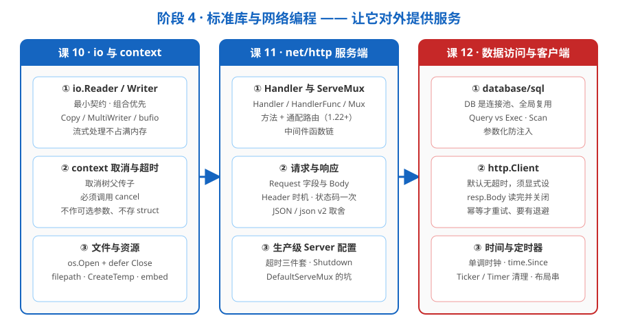

# 阶段 4 概览：标准库与网络编程

> 所属课程：Go 语言系统学习 ｜ 故事章节：让它对外提供服务 ｜ 课程起点：[学习路径总览](../../01-学习路径总览.md)

## 🎯 本阶段目标

- 掌握 `io.Reader/Writer` 与 `context` 两大贯穿性心智模型，会用流式处理避免把大文件读进内存，会用 context 传播取消与超时并防止泄漏。
- 会用 `net/http` 写出可上线、可平滑下线的生产级 HTTP 服务，说清 Handler / 中间件 / 路由机制与超时、优雅关闭等 Server 配置。
- 会用 `database/sql` 连接池规范地访问数据库、用 `http.Client` 安全地访问下游服务，并正确驾驭时间与定时器——把"服务"真正跑起来。

## 📍 学习重点

- 抽象的哲学：`io.Reader/Writer` 靠"一个方法的最小契约" + 组合撑起整个 I/O 生态，理解它就能读懂一大半标准库。
- context 不是"可选的传参工具"，而是 Go 并发程序里取消与超时的传播主干——它回扣阶段 3 的泄漏问题，也渗透到后面所有网络与 I/O 代码。
- "能对外"与"能上线"之间的差距在配置与资源纪律：超时、优雅关闭、连接池参数、读完并关闭 body，这些"默认值会坑人"的地方正是事故高发区。
- 统一视角：无论做服务端收请求，还是做客户端发请求，或访问数据库，背后都遵循"连接/资源有生命周期、必须有超时与关闭纪律"这一套相通法则。

## ✅ 必须掌握的知识点

| 知识点 | 所属课 | 学完应能 |
|--------|--------|----------|
| io.Reader / io.Writer 哲学 | 课 10 | 说清"一个 Read/Write 方法的最小契约"，会用 io.Copy / MultiWriter / TeeReader / bufio 组合，理解流式处理为何不占满内存 |
| context：取消与超时 | 课 10 | 用 WithCancel / WithTimeout / WithDeadline 构建取消树并理解父传子，牢记必须调用返回的 cancel，遵守"不把 context 存进 struct、不作可选参数"的约定 |
| 文件与资源 | 课 10 | 用 `os.Open` + `defer Close` 规范管理文件描述符，用 `path/filepath` 处理跨平台路径，用 `os.CreateTemp` + `Remove` 清理临时文件，用 `embed` 打包静态文件 |
| Handler 与 ServeMux | 课 11 | 说清 Handler / HandlerFunc / ServeMux 的关系，会用 Go 1.22+ 的方法与通配路由，能写出"接收 Handler 返回 Handler"的中间件链 |
| 请求与响应 | 课 11 | 正确读写 Request 与 ResponseWriter，掌握 Header 设置时机与状态码只写一次，会用 struct tag 做 JSON 编解码，了解 encoding/json/v2 的取舍 |
| 生产级 Server 配置 | 课 11 | 配置超时三件套防 Slowloris、用 `srv.Shutdown(ctx)` 优雅关闭、设 MaxHeaderBytes 上限，避开默认 DefaultServeMux 全局状态的坑 |
| database/sql | 课 12 | 把 `sql.DB` 当全局复用的连接池，分清 Query 与 Exec，规范 `rows.Scan` + `defer rows.Close()`，用参数化查询防 SQL 注入，并把握池子四个旋钮的零值语义、把 `r.Context()` 传进查询 |
| http.Client | 课 12 | 显式给 Client 设超时，必关 resp.Body（**Go 1.27 起 ≤256 KiB / ≤50 ms 的响应"关即自动排空"**），分清 `MaxIdleConns` 与 `MaxIdleConnsPerHost` 两个 `0` 的不同含义，只在幂等请求上做带退避 + 看 ctx 的重试 |
| 时间与定时器 | 课 12 | 理解 time.Time 含单调时钟、用 time.Since 算间隔（且 `start` 别碰任何函数），按构造区分四种定时器寿命（**只有 `AfterFunc` 必须 Stop**）、**Go 1.23 起不用再排空 channel**、`Stop`/`Reset` 的返回值判据是"值有没有被接收过"，会用 `2006-01-02 15:04:05` / `time.DateTime` 布局串格式化与 `ParseInLocation` 解析 |

## 🗺️ 本阶段路径图

## 本阶段产出

- [x] `lessons/lesson-10-io与context.md`（✅ 2026-09-10 · 本机实测 go1.27.1 darwin/arm64）
- [x] `lessons/lesson-11-nethttp服务端.md`（✅ 2026-09-10 · 本机实测 go1.27.1 darwin/arm64）
- [x] `lessons/lesson-12-数据访问与客户端.md`（✅ 2026-09-13 · 本机实测 go1.27.1 darwin/arm64）
