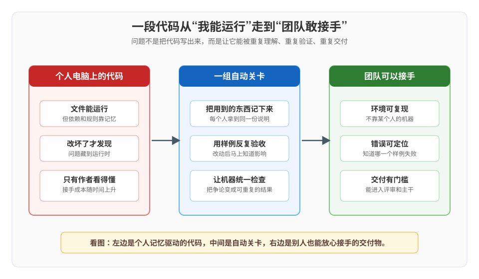
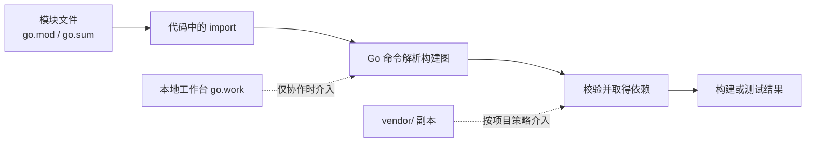
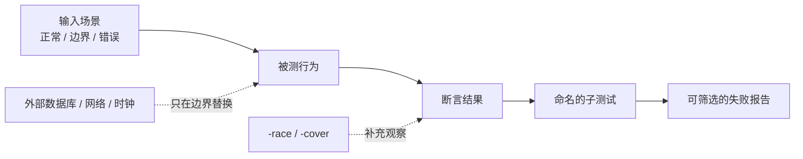
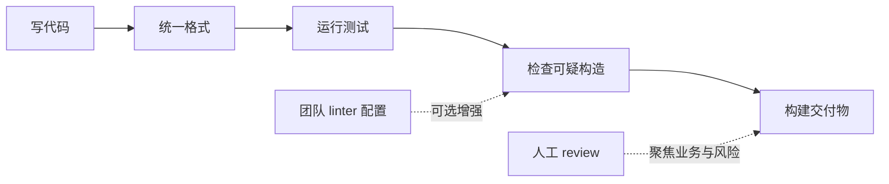

# 课 13：模块、测试与规范

> 所属阶段：阶段 5《工程化与生产落地》｜故事章节：从能跑到能交付
>
> 📌 本课知识点：模块与依赖 / 测试 / 静态检查与规范
>
> 🧪 本机基线：macOS arm64 ｜ `go1.27.1` ｜ 课内第四幕代码已在本机真实运行，完整输出见 [ALL_OUTPUT.txt](../../../playground/lesson-13/ALL_OUTPUT.txt)
>
> ⚠️ 这是一篇学习材料，不是把所有团队规则都硬编码成唯一答案。工具版本、CI 平台和仓库约定可能不同；遇到实际项目，以项目配置和官方文档为准。

## 📖 文档核对

本课没有教程内置的 `web-index/`，按课程质量闸门直接核对官方页面。以下结论核对于 2026-09：

- 模块语义、`go.mod`、`go mod tidy`、`vendor` 与工作区行为： [Go Modules Reference](https://go.dev/ref/mod)、[go.mod file reference](https://go.dev/doc/modules/gomod-ref)、[Managing dependencies](https://go.dev/doc/modules/managing-dependencies)。
- 版本路径规则： [Module version numbers](https://go.dev/doc/modules/version-numbers)；主版本为 v2 或更高时，模块路径需要包含 `/v2` 等后缀。
- 测试约定、子测试与表驱动测试： [Add a test](https://go.dev/doc/tutorial/add-a-test)、[testing package](https://pkg.go.dev/testing)、[TableDrivenTests](https://go.dev/wiki/TableDrivenTests)、[Using subtests and sub-benchmarks](https://go.dev/blog/subtests)；HTTP 测试辅助来自 [net/http/httptest](https://pkg.go.dev/net/http/httptest)。
- 格式、命名和注释： [Effective Go](https://go.dev/doc/effective_go)、[Go Code Review Comments](https://go.dev/wiki/CodeReviewComments)、[Go Doc Comments](https://go.dev/doc/comment)。
- 内置静态检查和聚合检查工具： [go vet](https://pkg.go.dev/cmd/vet)、[golangci-lint Quick Start](https://golangci-lint.run/docs/welcome/quick-start/)。

两条需要先钉死的边界：

1. `go.sum` 记录模块内容的校验和，用来核对下载内容是否与已知内容一致；它不是“把所有依赖版本和构建环境锁成一份”的传统锁文件。
2. `go.work` 是本地多模块协作的工作区描述。官方文档明确：大多数 Go 命令会使用工作区，但 `go mod tidy`、`go mod vendor` 等命令仍按单个主模块工作；它不能替代发布时每个模块自己的 `go.mod`。

---

## 🎯 本课目标

完成本课后，你应能：

- 读懂 `go.mod` 的 `module`、`go`、`require`，解释语义化版本和 `/v2`，知道什么时候用 `tidy`、`vendor`、`go work`。
- 写出 `_test.go`、`TestXxx(t *testing.T)`、表驱动测试和 `t.Run` 子测试，并使用 `httptest`、`-race`、`-cover`。
- 建立一条轻量交付门槛：先 `gofmt`，再测试、`go vet`、构建；认识 `golangci-lint` 的定位，并能按 Go 的命名与注释约定提交代码。

## 📍 本课在故事中的位置

阶段 4 结束时，小谷已经能用标准库访问数据、调用 HTTP 服务、安排超时和定时任务。可是“程序能启动”只回答了一个很小的问题：

> 它在小谷的电脑上启动过。

团队还需要另外三个答案：

- 别人拿到代码，能不能知道它属于哪个模块、需要哪些依赖？
- 改完代码，能不能自动证明旧行为还在？
- 代码进入主干前，能不能由机器统一检查，而不是靠 reviewer 记住每个人的空格习惯？

这一课的主线就是把“一个能跑的目录”变成“别人敢接手的交付物”。

---

# 第一幕：能跑，不等于能交付

## 1.1 小谷的下单接口

小谷把一个最小下单接口写好了。它接收订单 JSON，检查订单号和数量，然后返回 `202 Accepted`。

本地看起来一切顺利：

```text
浏览器或 curl 能收到响应
“我这里能跑”
```

但第一次提交合并请求时，团队问了三句：

1. “依赖从哪里来？换一台机器还会得到同一份内容吗？”
2. “你改了校验逻辑，怎么证明旧的四种输入还没有被误伤？”
3. “为什么这个文件的格式和另一个文件不一样？我们每次 review 都要讨论空格吗？”

这不是挑剔，而是在把隐形成本显形。个人项目可以靠记忆；团队交付要靠文件、测试和自动关卡。

## 1.2 一句话本质

> **把一段只在自己电脑上成立的代码，变成每个人都能重建、每次改动都能验收、机器也能检查的交付物。**

## 1.3 处境对照

| 只靠“我这里能跑” | 加上工程关卡之后 |
|---|---|
| 依赖藏在电脑缓存、环境变量和记忆里 | 模块边界和依赖来源写进项目文件 |
| 改完手点几个样例，漏掉边界也不知道 | 用例集中在测试文件里，失败项有名字 |
| review 讨论格式、命名和明显可疑写法 | 格式化与静态检查先自动挡住低级问题 |
| 交付结论是“我试过了” | 交付结论是“7 个子测试、竞争检测、格式、静态检查和构建均通过” |

最后一列的数字来自本课第四幕的本机实测，不是对未来运行结果的猜测。

## 1.4 本幕留下的问题

如果 `go run` 能运行，为什么还需要 `go.mod`、测试和静态检查？带着这个问题进入第二幕。

---

# 第二幕：三个看似合理、实际会漏水的想法

## 2.1 “依赖就在我的电脑里，别人装一下就行”

小谷的第一版项目没有写清模块路径，也没有整理依赖。他的电脑上恰好已经下载过一些模块，于是本地命令通过了。

换到同事电脑上，问题可能变成：

- import 路径无法解析；
- 同一个模块版本的下载内容校验失败；
- 依赖被间接升级或删掉，行为发生变化；
- 本地多模块替换配置被误当成发布依赖。

这里最容易误会的一点是：`go.sum` 不是“版本开关”。它记录的是模块内容校验和；如果下载到的内容与记录不一致，工具链会拒绝默默接受它，但它不负责把你的操作系统、环境变量、数据库版本和所有命令参数统统冻结。

## 2.2 “我手动点过七个样例，没问题”

手动演示有价值，但它不是回归测试：

- 你很难保证每次都按相同顺序、相同输入执行；
- 失败后没有统一的用例名字和机器可读结果；
- HTTP 处理函数容易只测成功路径，不测错误方法和坏 JSON；
- 并发问题可能在一次运行中刚好没有撞上。

测试不是为了证明程序永远正确，而是把重要的行为变成可重复的约束。

## 2.3 “格式是审美，静态检查是找茬”

Go 生态把格式统一得很彻底：`gofmt` 不是某个团队的私有审美，而是事实标准。`go vet` 会寻找一组可疑构造，但通过 `vet` 也不等于业务逻辑正确。`golangci-lint` 则是把多个检查器组织到一个入口的工具，适合放进 CI；它不是 Go 编译器的一部分。

所以三道关卡职责不同：

```text
依赖文件：让项目知道自己是谁、需要什么
测试：让项目反复回答“行为是否还成立”
静态检查：让机器发现格式和可疑写法
```

接下来逐层拆开这三件事。

---

# 第三幕：三块拼图，组成一条交付链



> 看图方式：左边是“只有作者知道”的代码，中间是自动关卡，右边是“别人也能放心接手”的交付物；本课三个知识点正好对应中间的三类关卡。

## 本课地图

| 交付问题 | 知识点 | 主要工具或文件 | 你要形成的判断 |
|---|---|---|---|
| 项目是谁，依赖从哪里来 | 1. 模块与依赖 | `go.mod`、`go.sum`、`go mod`、`go.work` | 本地替换、离线副本和发布依赖不是一回事 |
| 改动有没有破坏行为 | 2. 测试 | `_test.go`、`testing`、`httptest`、`-race` | 测试行为和边界，替身只放在外部边界 |
| 能不能进入主干 | 3. 静态检查与规范 | `gofmt`、`go vet`、`golangci-lint` | 格式、可疑构造、团队规则分层处理 |

---

## 知识点一：模块与依赖

### 一句话定义

> **模块是 Go 项目的发布与依赖边界；`go.mod` 描述模块身份和直接依赖，其他 `go` 命令据此解析包，校验和与本地配置再补充可复现性信息。**

### 直觉建立：像给货物写装箱单

把一个 Go 模块想成一批要交付的货物：

- `module` 是货单上的发货方和批次路径；
- `require` 是这批货直接需要的外部零件；
- `go` 声明语言和工具行为的最低版本基线；
- `go.sum` 像收到零件后的校验记录，帮助发现内容被替换或损坏；
- `vendor/` 是把零件副本一并带在身边；
- `go.work` 是仓库管理员在本地同时查看几批相邻货物的工作台。

类比的边界是：装箱单不会自动替你解决所有供应链问题。`go.mod` 不会冻结数据库、操作系统和所有构建参数；`go.work` 也不应被当成发布者必须提交的依赖清单。

### 核心原理

一个最小 `go.mod`：

```go
module example.com/go-course/lesson13

go 1.27
```

常见指令的职责：

| 指令 | 它回答的问题 | 注意点 |
|---|---|---|
| `module example.com/acme/orders` | 当前模块的身份和 import 根路径是什么？ | 发布路径一旦公开，随意改名会影响下游 |
| `go 1.27` | 这个模块声明使用哪一版语言/模块语义基线？ | 不是“本机安装版本”的完整替代说明 |
| `require example.com/payments v1.4.2` | 直接依赖需要什么版本？ | 间接依赖也可能在整理后出现 |
| `replace ... => ../payments` | 本地开发时，把某依赖临时指向哪里？ | 适合本地联调；不要误当成可供所有人访问的发布地址 |

#### 语义化版本与 `/v2`

`v1.4.2` 可以读成“主版本 1、次版本 4、修订版本 2”。对遵守语义化版本的模块：

- 修订版本通常修 bug，不改变公开 API 契约；
- 次版本通常增加向后兼容能力；
- 主版本变化允许不兼容 API 变化。

Go 对主版本 2 及以上采用“主版本路径”规则：模块路径也必须变。例如：

```text
module example.com/acme/payments/v2
```

下游导入时也写：

```go
import "example.com/acme/payments/v2"
```

这样 v1 和 v2 可以在同一个构建图里用不同 import 路径共存。版本号写成 v2，但路径还停在 `example.com/acme/payments`，通常不是“差一个配置”，而是模块身份没有遵守主版本路径规则。

#### `go.sum`、`tidy` 与 `vendor`

| 东西 | 它保存什么 | 适用判断 |
|---|---|---|
| `go.sum` | 模块内容校验和记录 | 依赖下载内容完整性校验；不要手改 |
| `go mod tidy` | 调整 `go.mod` 与 `go.sum`，使其匹配源代码使用情况 | 提交前整理；它会考虑测试、构建标签等能影响依赖图的代码 |
| `vendor/` | 依赖源代码的本地副本 | 需要离线构建、审计或严格使用仓库内副本时评估 |
| `go.work` | 本地多个模块的组合工作区 | 同时开发相邻模块；不等于单模块发布清单 |

官方模块参考特别提醒：`go mod tidy` 会检查主模块中的包、工具、递归 import、测试以及构建标签可达的代码；所以“当前默认构建没 import”并不必然意味着某个依赖可以安全删除。`go work` 能让大多数命令看到多个本地模块，但 `go mod tidy`、`go mod vendor` 等仍然针对单个主模块执行。

本课示例只有标准库依赖，所以：

```text
go list -m all
example.com/go-course/lesson13

go mod tidy -diff
没有差异输出
```

“没有 `go.sum`”在这个例子里不是漏文件，而是没有第三方模块内容需要记录。

#### 术语地图：在真实项目哪里遇到

| 术语 | 看到它的地方 | 白话含义 |
|---|---|---|
| module path | `go.mod` 第一行、import 路径 | 模块的公开身份 |
| direct dependency | `go.mod` 的直接 `require` | 你的代码直接 import 的外部模块 |
| transitive dependency | 依赖的依赖 | 不是你直接 import，但构建图需要 |
| checksum | `go.sum` 中的记录 | 下载内容是否与已知内容一致 |
| major version suffix | `/v2`、`/v3` | 不兼容主版本在 import 身份上的隔离 |
| workspace | `go.work` | 本地同时开发多个模块 |
| vendor | `vendor/` 目录 | 仓库内携带的依赖源代码副本 |

#### 一张图：代码如何找到依赖



> 图的核心：`go.mod` 定义身份和依赖关系；`go.sum` 做完整性核对；`go.work` 和 `vendor/` 是有边界的协作/供应策略，不要混成一个概念。

### 示例演示：先看一个可复跑的模块

进入本课实操目录：

```bash
cd /Users/wuyongping/Desktop/learning/go/playground/lesson-13
go list -m all
go mod tidy -diff
```

本机实测：

```console
$ go list -m all
example.com/go-course/lesson13

$ go mod tidy -diff
[exit=0]
```

### 常见误区

1. **把 `go.sum` 当成传统锁文件。** 它主要是校验和记录；要理解完整构建，还要看 `go.mod`、Go 版本、构建标签和项目环境。
2. **手动编辑 `go.sum` 来“修版本”。** 先用模块命令整理和核验，手改容易制造不一致。
3. **认为 `go mod tidy` 只看当前能编译的默认包。** 官方语义会把测试和构建标签相关代码纳入考虑。
4. **看到 `go.work` 就认为发布时会自动携带本地模块。** 工作区解决本地协作；发布仍要让每个模块自己的模块路径和依赖声明成立。
5. **所有项目都无脑提交 `vendor/`。** 是否 vendor 取决于离线构建、供应链审计、仓库大小和团队策略。
6. **`replace` 是生产环境的万能修复。** 本地相对路径只能在相应目录结构存在时成立，发布前必须验证干净环境。

### 一句话记住

> **`go.mod` 说“我是谁、需要什么”，`go.sum` 说“下载内容验过没有”，`vendor/` 携带副本，`go.work` 只管本地多模块协作。**

### 📚 官方文档

- [Go Modules Reference](https://go.dev/ref/mod)
- [go.mod file reference](https://go.dev/doc/modules/gomod-ref)
- [Managing dependencies](https://go.dev/doc/modules/managing-dependencies)
- [Module version numbers](https://go.dev/doc/modules/version-numbers)
- [Multi-module workspaces](https://go.dev/doc/tutorial/workspaces)

---

## 知识点二：测试

### 一句话定义

> **测试是把“这段代码应该怎样回应输入”写成可重复、可定位的程序；Go 用约定让测试天然成为普通包的一部分。**

### 直觉建立：像给下单柜台装护栏

把处理函数想成一个柜台：

- 正常订单是日常顾客；
- 缺少订单号、数量为负是故意带来的边界顾客；
- 错误 HTTP 方法和坏 JSON 是异常来访；
- 每个测试用例是一次可重复的演练；
- `t.Run` 给每次演练贴上名字，失败时你知道是哪位顾客出了问题。

类比的边界是：护栏不能替你定义业务规则，也不能保证没有漏测。测试只能覆盖你写出的场景；覆盖率高也不代表断言有价值。

### 核心原理

Go 测试的最小约定：

- 文件名以 `_test.go` 结尾；
- 测试函数名以 `Test` 开头，通常签名为 `func TestXxx(t *testing.T)`；
- `go test` 负责编译并运行测试；
- 同包测试可以访问包内实现；`package orders_test` 这样的黑盒测试只通过公开 API 使用包。

#### 表驱动 + 子测试

把输入、期望和名字放进切片：

```go
func TestValidate(t *testing.T) {
    tests := []struct {
        name    string
        input   Order
        wantErr error
    }{
        {"valid order", Order{ID: "order-001", Quantity: 2}, nil},
        {"missing id", Order{Quantity: 2}, ErrMissingID},
        {"zero quantity", Order{ID: "order-001"}, ErrInvalidQuantity},
    }

    for _, tt := range tests {
        t.Run(tt.name, func(t *testing.T) {
            err := Validate(tt.input)
            if !errors.Is(err, tt.wantErr) {
                t.Errorf("error = %v, want %v", err, tt.wantErr)
            }
        })
    }
}
```

这段结构有四个工程收益：

1. 测试逻辑只写一次；
2. 每个场景有稳定名字；
3. `go test -run 'TestValidate/missing_id'` 可以精准重跑一个场景；
4. 新增边界时，通常只增加一行数据，而不是复制一整段测试函数。

#### `httptest`：测 HTTP 处理，不必先开端口

本课的 `orders.Handler` 是一个普通 `http.HandlerFunc` 风格的处理函数。`httptest.NewRequest` 生成请求，`httptest.NewRecorder` 记录响应：

```go
req := httptest.NewRequest(
    http.MethodPost,
    "http://example.com/orders",
    strings.NewReader(`{"id":"order-001","quantity":2}`),
)
rec := httptest.NewRecorder()

orders.Handler(rec, req)

if rec.Code != http.StatusAccepted {
    t.Fatalf("status = %d", rec.Code)
}
```

这里的 `example.com` 只是请求的 URL 样本，不会发出网络请求。处理函数直接接收请求和响应记录器，因此测试速度快，结果稳定。

#### `-race` 与覆盖率

`go test -race ./...` 会启用数据竞争检测器，适合捕捉多个 goroutine 对共享内存的未同步访问。它不是“所有并发 bug 检测器”，也不是业务正确性证明；未执行到的路径就不会被发现。

`go test -cover ./...` 会给出语句覆盖率。覆盖率回答“哪些语句跑过”，不回答“断言是否足够”。一个没有有效断言的测试，也可能把覆盖率刷得很高。

#### 何时 mock：只替换外部边界

在课 12 里，数据库和外部 HTTP 是边界；它们的网络、连接池、认证和超时不适合在每个单元测试里反复依赖。可以替换：

- 数据库接口或仓储接口；
- 外部 HTTP client 的 transport / service boundary；
- 时钟接口（当业务确实依赖当前时间）。

不要为了“方便测”把同一包里的每个函数都 mock 掉。过度 mock 会让测试只证明“mock 按预设返回了”，真实组合关系反而没人验证。单元测试测自己的规则，少量集成测试再覆盖真实数据库、网络和时钟组合。

#### 术语地图：在真实项目哪里遇到

| 术语 | 看到它的地方 | 白话含义 |
|---|---|---|
| unit test | `*_test.go` | 针对小范围行为的可重复验证 |
| table-driven test | 测试中的 cases 切片 | 数据驱动、逻辑复用的写法 |
| subtest | `t.Run` 及输出中的斜杠路径 | 可命名、可筛选的子场景 |
| black-box test | `package x_test` | 只从公开 API 验证使用契约 |
| test double | fake / stub / mock 等替身 | 在边界处控制外部行为 |
| race detector | `go test -race` | 检查已执行并发路径中的数据竞争 |
| coverage | `go test -cover` | 被测试执行到的语句比例 |

#### 一张图：从输入到可定位的失败



> 图的核心：测试先把场景说清，再观察行为并断言；`-race` 和覆盖率是补充工具，不能代替有意义的断言。

### 示例演示：本课的 7 个子场景

实操代码位于 [orders/order_test.go](../../../playground/lesson-13/orders/order_test.go)。它刻意保留两组表驱动测试：

- `TestValidate`：有效订单、缺少订单号、数量为零、负数量，共 4 个子场景；
- `TestHandler`：接受有效订单、拒绝错误方法、拒绝非法 JSON，共 3 个子场景。

关键断言是行为断言，不是实现细节断言：

```go
for _, tt := range tests {
    t.Run(tt.name, func(t *testing.T) {
        err := Validate(tt.input)
        if !errors.Is(err, tt.wantErr) {
            t.Errorf("Validate(%+v) error = %v, want %v", tt.input, err, tt.wantErr)
        }
    })
}
```

HTTP 测试使用 `httptest`，所以没有监听真实端口：

```bash
cd /Users/wuyongping/Desktop/learning/go/playground/lesson-13
go test -v ./...
```

本机实测摘要见第四幕；完整逐字输出见 [ALL_OUTPUT.txt](../../../playground/lesson-13/ALL_OUTPUT.txt)。

### 常见误区

1. **测试函数不以 `Test` 开头，文件也不以 `_test.go` 结尾。** 代码可能能编译，但 `go test` 不会按预期发现它。
2. **只测 happy path。** 一个处理函数至少要考虑成功、错误输入和错误方法等边界。
3. **用字符串完整相等判断所有错误。** 优先用 `errors.Is` 或 `errors.As` 表达错误契约。
4. **把测试写成实现细节快照。** 重构内部变量名就让一大片测试无意义地失败，说明测试没有守住行为边界。
5. **把覆盖率当质量分数。** 覆盖率是导航仪，不是质量证书。
6. **认为 `-race` 通过就说明并发安全。** 它只对已执行到的并发访问路径提供检测能力。
7. **在测试中 mock 每一个函数。** 替身应集中在数据库、网络、时钟等外部边界。
8. **循环里闭包直接引用可变循环状态。** 设计并发子测试时要先理解当前 Go 版本的循环变量语义和 `t.Parallel` 的生命周期；共享状态仍需显式同步。
9. **用 `httptest` 却在断言里依赖随机端口或真实网络。** 本课的价值正是把处理函数隔离出来，真实监听、代理、TLS 和跨服务行为应由集成或端到端测试覆盖。

### 一句话记住

> **测试不是把代码重写一遍，而是把行为、边界和失败名字固定下来；表驱动减少重复，`t.Run` 提高定位，`-race` 和覆盖率提供额外视角。**

### 📚 官方文档

- [Add a test](https://go.dev/doc/tutorial/add-a-test)
- [testing package](https://pkg.go.dev/testing)
- [TableDrivenTests](https://go.dev/wiki/TableDrivenTests)
- [Using subtests and sub-benchmarks](https://go.dev/blog/subtests)
- [net/http/httptest](https://pkg.go.dev/net/http/httptest)

---

## 知识点三：静态检查与规范

### 一句话定义

> **静态检查与规范把“明显能自动判断的问题”提前变成机器反馈，把人的 review 注意力留给业务设计、边界取舍和风险。**

### 直觉建立：像给装配线加三台不同的机器

一条装配线上的三台机器并不做同一件事：

- `gofmt` 像统一扭矩的工具：把代码排成 Go 社区共同接受的形状；
- `go vet` 像异常声响检测器：找一组可疑构造；
- `golangci-lint` 像检查站调度器：把多个 linter 组织起来，按团队配置出报告。

类比的边界是：机器检查不了“这个订单规则是否符合公司业务”；通过格式化也不代表代码高效，通过 `vet` 也不代表没有逻辑 bug。工具是门槛，不是替代设计。

### 核心原理

#### `gofmt`：事实标准的格式化

Go 官方并没有一份需要团队自行争论的“空格风格手册”；`gofmt` 把格式化规则变成工具行为。常见做法：

```bash
gofmt -w .
gofmt -l .
```

- `-w` 把格式化结果写回文件；
- `-l` 只列出未按格式化结果排列的文件；
- CI 常用 `gofmt -l .`，有输出就失败；
- 格式化不是 lint 的替代品，也不负责判断业务语义。

#### `go vet`：可疑构造检查

`go vet ./...` 会检查包中一组容易出错的构造，例如格式化参数可疑、取消函数没有调用、某些 HTTP 响应体未关闭、测试 goroutine 使用方式可疑等，具体检查项随 Go 版本和工具实现演进。

重要边界：

> `go vet` 通过，表示当前检查器没有报告问题；它不是“程序正确”的证明，也不是所有静态分析能力的总和。

#### `golangci-lint`：多个 linter 的统一入口

`golangci-lint` 不是 Go 标准工具链自带的单个检查器，而是聚合和编排多个 linter 的工具。官方 Quick Start 给出的典型入口是：

```bash
golangci-lint run
```

在官方当前文档中，常见默认检查包含 `errcheck`、`govet`、`ineffassign`、`staticcheck`、`unused` 等；具体启用集合和版本应以项目配置为准。本机没有安装 `golangci-lint`，因此本课不伪造它的运行输出，也不把安装步骤当作本课实测证据。

#### 命名与注释：让代码自己说明对象是谁

Go 风格中，导出的名字要谨慎；包名短而清楚；导出对象的文档注释通常以对象名字开头：

```go
// Order is the JSON shape accepted by the order endpoint.
type Order struct {
    ID       string `json:"id"`
    Quantity int    `json:"quantity"`
}

// Validate checks the business rules that do not require a database.
func Validate(order Order) error {
    // ...
}
```

反例：

```go
// This checks the order.
func Validate(order Order) error { ... }
```

这段注释人能看懂，但没有把对象名作为句首锚点。代码评审中，统一的注释习惯能让文档工具、搜索和读者都更容易定位对象。

#### 术语地图：三台机器各管什么

| 工具或约定 | 它擅长 | 它不保证 |
|---|---|---|
| `gofmt` | 统一 Go 源码格式 | 业务正确、性能、依赖安全 |
| `go vet` | 发现一组可疑构造 | 所有 bug、所有安全问题 |
| `golangci-lint` | 聚合多个可配置 linter | 一套适合所有团队的配置 |
| 命名与文档注释 | 降低阅读和维护成本 | 自动判断 API 设计是否合理 |
| Code Review | 业务边界、设计、风险、可维护性 | 不应重复承担本可自动化的格式检查 |

#### 一张图：提交前的三道门



> 图的核心：顺序不是绝对法律，但“先让机器处理重复劳动，再让人看业务风险”是很好的默认交付节奏。

### 示例演示：一套轻量门禁

```bash
cd /Users/wuyongping/Desktop/learning/go/playground/lesson-13
gofmt -l .
go vet ./...
go build ./...
go run ./cmd/demo
```

本机实测：

```console
$ gofmt -l .
[exit=0]

$ go vet ./...
[exit=0]

$ go build ./...
[exit=0]

$ go run ./cmd/demo
status=202 body={"status":"accepted"}
[exit=0]
```

`gofmt -l .` 没有列出文件，说明当前目录没有未格式化的 Go 文件；它不是“打印了一行空白”，而是无输出退出 0。

### 常见误区

1. **把 `gofmt` 当作“代码审查完成”。** 它只处理格式。
2. **把 `go vet` 当作完整静态分析平台。** 它有明确的检查范围，不能代替测试、review 和安全扫描。
3. **复制网上某个 `golangci-lint` 配置而不看版本。** linter 集合、默认值和配置键可能变化。
4. **用“个人审美”反复改动 gofmt 的结果。** 如果团队采用 Go 默认工具，先接受工具结果，再讨论真正的可读性问题。
5. **导出类型有注释，但注释没有指向对象。** 用 `Order ...`、`Validate ...` 这样的开头建立明确锚点。
6. **为了让 `vet` 安静而删掉有价值的错误处理。** 先理解告警，再修正契约或添加有理由的边界处理。
7. **CI 只有 lint，没有测试和构建。** 格式整齐的代码仍可能不能编译或行为错误。
8. **把第三方 linter 的意见说成 Go 语言规范。** 先标明是标准工具、官方建议还是团队自定义规则。

### 一句话记住

> **`gofmt` 统一形状，`go vet` 找可疑构造，`golangci-lint` 组织多种检查；三者都不能替代业务测试和人工判断。**

### 📚 官方文档

- [Effective Go](https://go.dev/doc/effective_go)
- [Go Code Review Comments](https://go.dev/wiki/CodeReviewComments)
- [Go Doc Comments](https://go.dev/doc/comment)
- [go vet](https://pkg.go.dev/cmd/vet)
- [golangci-lint Quick Start](https://golangci-lint.run/docs/welcome/quick-start/)

---

# 第四幕：把“交付门槛”在本机跑一遍

## 4.1 实操目标

我们不启动数据库、不访问真实外网，也不安装额外工具。用一个标准库小模块完成四件事：

1. 用 `go.mod` 明确模块身份；
2. 用 `orders/order_test.go` 写 7 个命名子场景；
3. 用 `httptest` 在进程内验证 HTTP 处理函数；
4. 依次跑依赖整理、测试、竞争检测、覆盖率、格式、静态检查、构建和 demo。

目录：

```text
go/playground/lesson-13/
├── go.mod
├── orders/
│   ├── order.go
│   └── order_test.go
├── cmd/demo/
│   └── main.go
├── regen.sh
├── README.md
└── ALL_OUTPUT.txt
```

完整源码和复跑说明见 [lesson-13 playground README](../../../playground/lesson-13/README.md)。从仓库根目录执行：

```bash
cd /Users/wuyongping/Desktop/learning/go/playground/lesson-13
bash regen.sh
```

## 4.2 本机实测输出

下面代码和输出均在本机 `darwin/arm64`、`go1.27.1` 上运行，不是纸面预期。耗时会随机器负载变化；通过/失败、测试名称和 demo 响应是本次证据的核心。

```console
$ go version
go version go1.27.1 darwin/arm64
[exit=0]

$ go list -m all
example.com/go-course/lesson13
[exit=0]

$ go mod tidy -diff
[exit=0]

$ go test -v ./...
?   	example.com/go-course/lesson13/cmd/demo	[no test files]
=== RUN   TestValidate
=== RUN   TestValidate/valid_order
=== RUN   TestValidate/missing_id
=== RUN   TestValidate/zero_quantity
=== RUN   TestValidate/negative_quantity
--- PASS: TestValidate (0.00s)
    --- PASS: TestValidate/valid_order (0.00s)
    --- PASS: TestValidate/missing_id (0.00s)
    --- PASS: TestValidate/zero_quantity (0.00s)
    --- PASS: TestValidate/negative_quantity (0.00s)
=== RUN   TestHandler
=== RUN   TestHandler/accepts_valid_order
=== RUN   TestHandler/rejects_wrong_method
=== RUN   TestHandler/rejects_invalid_json
--- PASS: TestHandler (0.00s)
    --- PASS: TestHandler/accepts_valid_order (0.00s)
    --- PASS: TestHandler/rejects_wrong_method (0.00s)
    --- PASS: TestHandler/rejects_invalid_json (0.00s)
PASS
ok  	example.com/go-course/lesson13/orders	0.009s
[exit=0]

$ go test -race ./...
?   	example.com/go-course/lesson13/cmd/demo	[no test files]
ok  	example.com/go-course/lesson13/orders	1.021s
[exit=0]

$ go test -cover ./...
	example.com/go-course/lesson13/cmd/demo		coverage: 0.0% of statements
ok  	example.com/go-course/lesson13/orders	0.010s	coverage: 90.9% of statements
[exit=0]

$ gofmt -l .
[exit=0]

$ go vet ./...
[exit=0]

$ go build ./...
[exit=0]

$ go run ./cmd/demo
status=202 body={"status":"accepted"}
[exit=0]

ALL_OUTPUT 生成完毕
```

### 4.3 逐段回看输出

- `go version` 确认课堂口径没有漂移：确实是 Go 1.27.1、macOS arm64。
- `go list -m all` 只有当前模块，和“标准库、无第三方依赖”的设计一致。
- `go mod tidy -diff` 无差异，说明本次源代码和模块文件没有要求新增或删除模块记录。
- `go test -v ./...` 显示 4 + 3 个子测试，并且每个子测试有名字；这正是表驱动与 `t.Run` 带来的定位能力。
- `go test -race ./...` 退出 0，表示本次执行路径没有报告数据竞争；不是对所有未来并发路径的保证。
- `go test -cover ./...` 给 `orders` 包报 90.9% 语句覆盖率；`cmd/demo` 没有测试文件，所以是 0.0%。这正好说明覆盖率应按包和行为解释，不能只看一个漂亮的总数字。
- `gofmt -l .`、`go vet ./...`、`go build ./...` 都无额外输出且退出 0。
- demo 返回 `202` 和确认 JSON，说明处理函数的成功路径确实在进程内跑通。

## 4.4 复跑清单

| 顺序 | 命令 | 通过标准 |
|---|---|---|
| 1 | `go version` | 版本与本机基线一致 |
| 2 | `go list -m all` | 依赖图符合预期 |
| 3 | `go mod tidy -diff` | 没有需要整理的差异 |
| 4 | `go test -v ./...` | 7 个命名子场景全部 PASS |
| 5 | `go test -race ./...` | 退出码 0、无竞争报告 |
| 6 | `go test -cover ./...` | 覆盖率输出可解释 |
| 7 | `gofmt -l .` | 无未格式化文件 |
| 8 | `go vet ./...` | 无可疑构造报告 |
| 9 | `go build ./...` | 所有包可构建 |
| 10 | `go run ./cmd/demo` | 输出 `status=202` 和确认 JSON |

---

# 第五幕：从“会写 Go”到“能把 Go 交出去”

## 5.1 回到小谷的下单服务

小谷现在拥有的不是三条孤立命令，而是一条可以迁移到真实项目的思路：


阶段 4 让服务“能通过标准库跑起来”；阶段 5 课 13 让它“能被别人重建、验证和接手”。下一课会继续追问：如果它能交付，但一压测就慢，如何用 benchmark 和 pprof 找到证据，而不是凭感觉优化？

## 5.2 三个知识点各自守一道门

| 门 | 你已经会问的问题 | 最小证据 |
|---|---|---|
| 模块与依赖 | 换一台机器，项目身份和依赖关系还说得清吗？ | `go.mod`、`go.sum`、`go list -m all` |
| 测试 | 改动后，成功和边界行为还成立吗？ | 命名子测试、断言、`-race`、覆盖率 |
| 静态检查与规范 | 低级格式和可疑构造能否在进入主干前被机器发现？ | `gofmt`、`go vet`、团队 linter、人工 review |

## 5.3 一句话收束

> **工程化不是给代码增加仪式，而是把“靠作者记忆的隐含条件”搬进模块文件、测试和自动检查，让交付结论可以被别人复核。**

---

## 🧭 速查卡

### 模块与依赖

- `go mod init example.com/acme/orders`：创建模块。
- `go list -m all`：查看模块构建图中的模块。
- `go mod tidy`：按源码使用情况整理 `go.mod` / `go.sum`。
- `go mod tidy -diff`：只检查是否有整理差异，不直接改文件。
- `go mod vendor`：生成 vendor 副本；是否提交由项目策略决定。
- `go work init ./service ./shared`：创建本地多模块工作区。
- v2+ 模块路径包含 `/v2`；import 路径也要一致。
- 不手改 `go.sum`；先理解校验失败，再用命令核验。

### 测试

- 测试文件：`*_test.go`。
- 测试函数：`TestXxx(t *testing.T)`。
- 用例多时优先考虑表驱动。
- 用 `t.Run` 给场景命名。
- HTTP 处理函数优先用 `httptest` 做进程内测试。
- `go test -run 'TestHandler/rejects_invalid_json' ./...`：精准筛选。
- `go test -race ./...`：检查已执行路径的数据竞争。
- `go test -cover ./...`：看语句覆盖，不把它当质量总分。
- mock 数据库、网络、时间等外部边界，不要 mock 整个内部世界。

### 检查与规范

- `gofmt -w .`：格式化。
- `gofmt -l .`：列出未格式化文件。
- `go vet ./...`：检查一组可疑构造。
- `golangci-lint run`：按项目配置聚合多个 linter。
- 导出对象的注释以对象名开头。
- 把机器能稳定检查的事情放进 CI，把人工精力留给业务语义和风险。

---

## 🐞 常见误区总表

| # | 误区 | 修正 |
|---:|---|---|
| 1 | `go.sum` 就是完整锁文件 | 它主要保存校验和；完整复现要同时看模块、工具和环境 |
| 2 | `go mod tidy` 只看默认源码 | 测试、工具和构建标签可影响依赖图 |
| 3 | `go.work` 会替代发布模块 | 它是本地多模块工作台 |
| 4 | vendor 适合所有仓库 | 评估离线、审计、体积和团队策略 |
| 5 | 测过成功路径就够了 | 把错误方法、非法输入和边界写成用例 |
| 6 | 覆盖率越高一定越好 | 覆盖率需要和断言质量一起看 |
| 7 | -race 通过代表没有并发 bug | 它只检查已执行到的竞争路径 |
| 8 | 任何函数都应该 mock | 只在外部边界替换 |
| 9 | gofmt 后就完成 review | 格式不等于行为正确 |
| 10 | go vet 是完整静态分析 | 它有明确检查范围 |
| 11 | linter 建议就是 Go 语言规范 | 区分标准工具、官方建议和团队规则 |
| 12 | 注释写了就行 | 导出对象注释要有对象名锚点 |
| 13 | 本地能用 replace，CI 就能用 | 相对路径依赖目录结构，交付前要在干净环境验证 |
| 14 | httptest 会访问 example.com | 本课请求在进程内由处理函数消费，不发网络请求 |
| 15 | 退出码 0 等于业务正确 | 它只说明这些命令没有报告失败，业务断言仍要看测试 |

---

## 🧪 课后小测

<details>
<summary>1. 一个 v2 模块的 module path 和 import path 应该怎样变化？</summary>

都要包含主版本后缀，例如 `example.com/acme/payments/v2`；下游 import 也使用带 `/v2` 的路径。因为模块身份变了，v1 和 v2 才能共存于构建图。

</details>

<details>
<summary>2. 为什么“`go.sum` 不是传统锁文件”仍然不代表它不重要？</summary>

它保存模块内容校验和；下载内容和已知记录不一致时，工具链可以发现问题。它守的是内容完整性，不是独自冻结所有版本、平台和构建条件。

</details>

<details>
<summary>3. 什么时候 `httptest` 比真实 HTTP 端口更合适？</summary>

测试处理函数的路由、状态码、响应体和错误边界时。它不需要监听端口，也不依赖网络；真实监听、代理、TLS 和跨服务行为应由集成或端到端测试覆盖。

</details>

<details>
<summary>4. `go test -race ./...` 通过，能下“并发绝对安全”的结论吗？</summary>

不能。它说明本次执行到的路径没有报告数据竞争；未执行的路径、死锁、逻辑竞态和业务错误仍需要其他测试与观察。

</details>

<details>
<summary>5. `gofmt`、`go vet`、`golangci-lint` 为什么不应该写成同一个工具？</summary>

`gofmt` 负责格式，`go vet` 负责一组内置可疑构造检查，`golangci-lint` 负责聚合和编排多个 linter；职责、版本和配置边界不同。

</details>

---

## 🔗 课程导航

- 上一课：[课 12《数据访问与客户端》](../../4-标准库与网络编程/lessons/lesson-12-数据访问与客户端.md)
- 当前课：课 13《模块、测试与规范》
- 下一课：[课 14《性能与诊断》](./lesson-14-性能与诊断.md)
- 返回：[课程目录](../../../02-课程目录.md)

## 下一批接力提示词

继续学 Go。我的学习档案在 go/00-学习档案.md，
刚学完阶段 5《工程化与生产落地》的课 13《模块、测试与规范》
（知识点：模块与依赖 / 测试 / 静态检查与规范），
请按大纲继续讲解课 14《性能与诊断》
（知识点：benchmark / pprof / 内存与 GC 直觉）。
