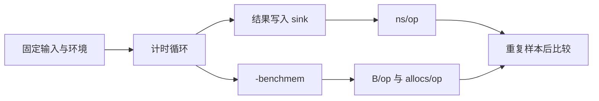
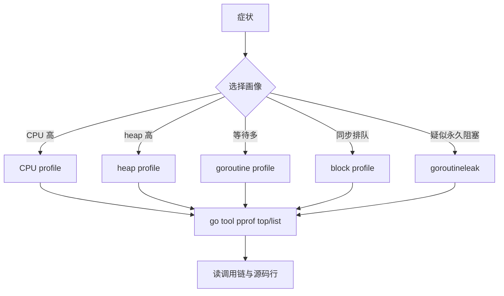
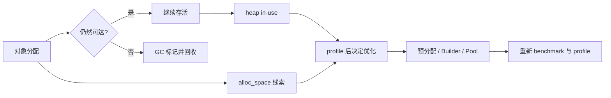

# 课 14：性能与诊断

> 所属阶段：阶段 5《工程化与生产落地》｜故事章节：从能跑到能交付
>
> 📌 本课知识点：benchmark / pprof / 内存与 GC 直觉
>
> 🧪 本机基线：macOS arm64 ｜ `go1.27.1` ｜ 课内第四幕代码已在本机真实运行，完整输出见 [ALL_OUTPUT.txt](../../../playground/lesson-14/ALL_OUTPUT.txt)
>
> ⚠️ 这是一篇学习材料，不是“看到一个工具就调旋钮”的性能调优手册。性能数字会受机器、负载、编译器和样本影响；先建立问题、留下证据，再做小改动并重新测量。

## 📖 文档核对

本课没有教程内置的 `web-index/`，按课程质量闸门直接核对官方页面。以下结论核对于 2026-09：

- 诊断工具的选型、CPU/heap profile 的含义、`go tool pprof`、运行时统计与“先 profile 再优化”： [Diagnostics](https://go.dev/doc/diagnostics)、[The GC guide](https://go.dev/doc/gc-guide)、[pprof blog](https://go.dev/blog/pprof)。
- benchmark 的命名、`testing.B`、`b.N` 与当前版本更推荐的 `B.Loop`： [testing package](https://pkg.go.dev/testing)、[Go Benchmarks wiki](https://go.dev/wiki/Benchmarks)。
- 在线 profile 端点、默认路由和自定义注册方式： [net/http/pprof](https://pkg.go.dev/net/http/pprof)、[runtime/pprof](https://pkg.go.dev/runtime/pprof)。
- Go 1.27 的 `goroutineleak` profile： [Go 1.27 release notes](https://go.dev/doc/go1.27)、[Goroutine leak profiles](https://go.dev/blog/goroutine-leak-profiles)。
- 编译器逃逸分析的查看方式： [Compiler Optimizations](https://go.dev/wiki/CompilerOptimizations)。

> 📖 结论已按官方文档核对（核对于 2026-09 ｜ 来源：[Diagnostics](https://go.dev/doc/diagnostics)、[testing](https://pkg.go.dev/testing)、[net/http/pprof](https://pkg.go.dev/net/http/pprof)、[Go 1.27 release notes](https://go.dev/doc/go1.27)、[GC guide](https://go.dev/doc/gc-guide)）。

---

## 🎯 本课目标

完成本课后，你应能：

- 写出 `BenchmarkXxx` + `b.N` 基准测试，知道为什么要把结果写入包级 sink 或使用 `runtime.KeepAlive`，会用 `-benchmem` 看每次操作的分配，并知道如何用 `benchstat` 对比多次测量。
- 面对“有点慢 / 内存涨 / goroutine 卡住”，选择 CPU、heap、goroutine、block 画像，用 `go tool pprof` 的 `top` / `list` / `web` 定位热点，并守住在线 pprof 端点不能裸奔公网的红线。
- 用 `-gcflags=-m` 观察逃逸分析，建立栈、堆和 GC 的正确直觉，知道预分配、`strings.Builder`、`sync.Pool` 各自的适用边界。
- 用“症状 → 证据 → 一个改动 → 回归测量”的闭环诊断，而不是把“优化”写成一串没有基线的猜测。

## 📍 本课在故事中的位置

阶段 4 结束时，小谷已经会访问数据库、调用 HTTP 服务、处理超时和定时任务；课 13 又让项目有了模块、测试和静态检查。可是压测一上来，服务仍然出现三个症状：

- P99 延迟慢，大家都说“是不是字符串拼接太多”；
- 进程 RSS 一路上涨，大家都说“肯定是内存泄漏”；
- 压测结束后 goroutine 数不回落，大家都说“goroutine 多就是泄漏”。

这一次，小谷不能再只看症状下结论。他要先回答：每次操作到底花了多少时间和分配？CPU 时间真正消耗在哪一行？堆上哪些对象还活着？阻塞中的 goroutine 是否还有可能被唤醒？

# 第一幕：压测报警时，最危险的是“凭感觉”

## 1.1 一个看似简单的慢请求

小谷给订单服务加了一个摘要字段：

```go
func summary(parts []string) string {
    var result string
    for _, part := range parts {
        result += part
    }
    return result
}
```

线上有人观察到延迟变高，于是提出三个修改建议：

1. “把字符串换成 `strings.Builder`，肯定就快了。”
2. “把所有局部变量都放进 `sync.Pool`，肯定就省内存了。”
3. “把 pprof 挂到 `:6060`，大家直接访问最方便。”

每个建议都可能碰到真实问题，却没有回答三个更重要的问题：快多少？省的是什么？谁可以访问诊断数据？

## 1.2 一句话本质

> **性能诊断不是把代码改得更聪明，而是先把成本量出来、把热点画出来、确认存活关系，再只改有证据的地方。**

## 1.3 处境对照

| 凭感觉优化 | 有证据的诊断 |
|---|---|
| “这里看起来像热点” | benchmark 或 CPU profile 先确认 |
| “内存涨就是泄漏” | 区分分配总量、当前存活对象和可达引用 |
| “goroutine 多就是泄漏” | 查看堆栈和 `goroutineleak` 的可达诊断范围 |
| “线上 pprof 越方便越好” | 绑定内网、鉴权或临时采集，并限制暴露面 |
| “改完应该更快” | 基线、单变量改动、重复测量、保留输出 |

最后一列的数字来自本课第四幕的本机实测，不是对未来运行结果的猜测。

## 1.4 本幕留下的问题

小谷现在有一条必须遵守的顺序：

```text
先定义症状
→ 选择能回答问题的测量
→ 找到最贵的证据
→ 做一个小改动
→ 重新测量并保留差异
```

# 第二幕：三个看似合理、实际会漏水的想法

## 2.1 “benchmark 的数字就是函数的真相”

不是。benchmark 的数字是“在这台机器、这个编译配置、这组输入、这个基准 harness 下的观测”。

一个基准测试至少有这些风险：

- 把初始化、构造输入、日志输出放进计时区，测到的不是目标操作；
- 没有保存返回值，编译器可能发现结果没有可观察用途，改变或消除工作；
- 只跑一次，受到调度、频率、后台进程影响；
- 只看 ns/op，不看 B/op 和 allocs/op；
- 把不同输入规模、不同语义的实现直接横比；
- 看到一次变快，就把噪声误当成结论。

`b.N` 的价值是让 testing 框架自动调节迭代次数，使计时达到可比较的量级；它不是“永远跑 N 次”的业务循环。当前 Go 文档还建议新 benchmark 优先考虑 `B.Loop`，因为它能帮助框架控制循环并保持循环中的值存活；本课仍使用大纲要求的 `b.N`，同时把 `B.Loop` 作为版本补充。

## 2.2 “内存曲线涨，就是泄漏”

“分配过很多”与“现在仍然活着”是两件事：

- 一个请求可能短时间分配了很多临时对象，GC 后它们都不可达；
- 一个小对象也可能被全局缓存、闭包或 channel 引用，长期存活；
- Go runtime 为后续分配保留的空间，未必等于业务对象泄漏；
- heap profile 默认更关注采样到的对象，应该看 profile 类型和样本解释。

所以要先问：是分配速率高、存活集合大、GC 压力大，还是 goroutine / 缓存把对象继续引用着？没有这个区分，直接“加池子”很容易把生命周期弄得更复杂。

## 2.3 “goroutine 数量多，就是 goroutine 泄漏”

不成立。服务在正常工作时，本来就可能有很多暂时等待的 goroutine。Go 1.27 的 `goroutineleak` profile 报告的是它能识别到的一个子集：阻塞在某些同步原语上、并且不可能再解除阻塞的 goroutine；它不是“所有长期存在 goroutine 的万能裁判”，也受可达性等运行时信息限制。

同理，“profile 有入口”不等于“入口可以公开”。在线 profile 会暴露调用栈、参数周边的运行时结构和资源状态，应该按诊断接口治理，而不是当成业务 API。

# 第三幕：三块证据，组成一条诊断链


> 看图方式：左边是用户感知到的症状，中间是工具真正提供的证据，右边是可以验证、可以回退的决定。箭头不是“看到症状就改代码”，而是“症状必须先穿过证据”。

## 本课地图

| 症状 | 优先证据 | 主要工具 | 诊断问题 |
|---|---|---|---|
| 单个函数慢 / 分配多 | 每次操作的时间、字节数、分配次数 | benchmark、`-benchmem`、`benchstat` | 慢在时间，还是贵在分配？ |
| 服务 CPU 高 | 采样到的 CPU 热点与调用链 | CPU profile、`go tool pprof` | 哪些函数真正吃掉 CPU？ |
| RSS / heap 上涨 | 当前存活对象与分配来源 | heap profile、逃逸分析、GC 统计 | 对象还活着，还是只是刚刚分配过？ |
| goroutine 不回落 / 任务卡住 | goroutine 堆栈、阻塞等待点 | goroutine、block、`goroutineleak` profile | 谁在等？还有没有唤醒路径？ |

---

## 知识点一：benchmark

### 一句话定义

> **benchmark 是在固定输入和可重复 harness 下，测量一段操作平均成本的实验；`b.N` 是框架提供的迭代次数，`-benchmem` 把分配成本一起显形。**

### 直觉建立：给函数设一条独立跑道

普通测试像问：“这辆车能不能到终点？”  
benchmark 像把同一辆车放到封闭跑道，重复跑很多圈，然后记录：

- 一圈平均耗时：ns/op；
- 一圈平均消耗的货物：B/op；
- 一圈平均搬运次数：allocs/op。

类比的边界是：跑道不是现实城市。benchmark 不自动包含网络、数据库、真实流量分布、CPU 降频和多租户争抢；它适合回答“这段局部代码在给定条件下相对如何”，不适合单独回答“整个服务线上一定会怎样”。

### 核心原理

#### 1. `BenchmarkXxx` 与 `b.N`

Go 的测试工具识别签名：

```go
func BenchmarkConcatNaive(b *testing.B) {
    for range b.N {
        benchmarkSink = ConcatNaive(benchmarkParts)
    }
}
```

testing 框架会调整 `b.N`，让基准运行到足够的测量量级。输入数据和一次性准备工作应放在计时循环外；目标操作放进循环内。

#### 2. 让结果保持可观察

如果结果不影响任何后续行为，编译器有机会把一部分工作优化掉。常见做法是把结果写到包级 sink：

```go
var benchmarkSink string

func BenchmarkConcatBuilder(b *testing.B) {
    for range b.N {
        benchmarkSink = ConcatBuilder(benchmarkParts)
    }
}
```

也可以在确实需要保持某个值存活时使用 `runtime.KeepAlive`。sink 不是性能魔法；它只是让 benchmark 的结果具有包外可观察的存储位置。不要把 sink 当业务状态，也不要忘记 benchmark 自己的写入也属于 harness 设计的一部分。

#### 3. `-benchmem` 看“快”背后的代价

一次典型输出：

```text
BenchmarkConcatNaive-11       7493462   163.1 ns/op   192 B/op   9 allocs/op
BenchmarkConcatBuilder-11    27107208   45.60 ns/op    32 B/op   1 allocs/op
```

可先做三个比较：

- Builder 的 ns/op 约为 Naive 的 28%，即在本次环境和输入下约快 3.6 倍；
- Builder 的 B/op 从 192 降到 32，少了约 83%；
- allocs/op 从 9 降到 1，分配次数减少约 89%。

这些是本次实测的局部结果，不是对任意字符串长度和任意 Go 版本的定理。

#### 4. 重复测量与 `benchstat`

```bash
go test -run '^$' -bench 'BenchmarkConcat' -benchmem -count=3 ./hotpath
```

`count=3` 会产出三组样本。Go 官方 testing 文档把 `benchstat` 作为比较 benchmark 结果的工具方向，常见安装来源是 `golang.org/x/perf/cmd/benchstat`。本机课内环境没有预装它，因此本课不伪造 benchstat 输出；先用 `-count=3` 留下原始样本，团队 CI 再按项目策略安装并运行官方工具。

当前版本的 testing 文档还建议新 benchmark 优先使用 `B.Loop`：

```go
func BenchmarkConcatBuilderLoop(b *testing.B) {
    for b.Loop() {
        benchmarkSink = ConcatBuilder(benchmarkParts)
    }
}
```

本课保留 `b.N`，因为它是大纲要求和大量既有 Go 代码中最常见的形式；学习迁移旧 benchmark 时，两种写法都应该读得懂。



> 图的核心：准备工作在计时区外，目标操作在循环内，结果必须可观察；最终结论同时看时间和分配。

### 示例演示：一次 benchmark 输出应该怎么看

本课实操目录是 [lesson-14 playground](../../../playground/lesson-14/README.md)。其中 `hotpath` 包提供了同一组输入的两种拼接实现：

```go
func ConcatNaive(parts []string) string {
    var result string
    for _, part := range parts {
        result += part
    }
    return result
}

func ConcatBuilder(parts []string) string {
    var builder strings.Builder
    total := 0
    for _, part := range parts {
        total += len(part)
    }
    builder.Grow(total)
    for _, part := range parts {
        builder.WriteString(part)
    }
    return builder.String()
}
```

基准命令与本机实测输出见第四幕。注意不要只读第一列：如果时间更低但分配次数暴涨，服务在高并发下仍可能被分配和 GC 拖慢。

### 常见误区

1. **把 benchmark 当普通测试。** benchmark 的目标是测量，不是只判断对错；功能正确性仍由 `TestXxx` 负责。
2. **把输入构造放入循环。** 这样测到的是构造 + 目标操作的总和，除非这正是你要测的场景。
3. **忘记 sink / KeepAlive。** 返回值没有可观察用途时，基准可能不能代表真实工作。
4. **只跑一次。** 一次样本无法区分稳定变化和调度噪声。
5. **只看 ns/op。** B/op 和 allocs/op 可能是后续延迟与 GC 压力的关键。
6. **用不同输入规模比较实现。** 先固定数据、语义和编译参数，再比较。
7. **把本机数字当 SLA。** SLA 是端到端、带负载模型和环境约束的指标。
8. **为了“稳定”关闭所有优化。** benchmark 应尽量接近目标构建；要控制变量，而不是把生产条件改成另一套。
9. **看到 Builder 变快就全局替换。** 先确认代码确实在热点，且可读性和生命周期没有变坏。
10. **把 `B.Loop` 当作“旧写法错误”。** 它是当前版本的新推荐；`b.N` 仍是需要理解和维护的有效形式。

### 一句话记住

> **benchmark 先固定实验，再让 `b.N` 重复目标操作；用 sink 保持结果可观察，用 `-benchmem` 同时读时间和分配，最后用重复样本比较。**

### 📚 官方文档

- [testing package](https://pkg.go.dev/testing)
- [Go Benchmarks wiki](https://go.dev/wiki/Benchmarks)
- [Using subtests and sub-benchmarks](https://go.dev/blog/subtests)
- [benchstat source in golang.org/x/perf](https://pkg.go.dev/golang.org/x/perf/cmd/benchstat)

## 知识点二：pprof

### 一句话定义

> **pprof 是把运行时的 CPU、内存、goroutine 和阻塞等信息采样或快照化，再按调用栈聚合成可定位证据的诊断工具链。**

### 直觉建立：给服务做影像检查

把服务想成一间急诊室：

- CPU profile 像拍“正在忙什么”的动态影像；
- heap profile 像盘点“现在还有哪些物品占着空间”，也可以切换到“历史上分配过什么”的视角；
- goroutine profile 像把所有等待中的人按站位拍下来；
- block profile 像记录大家在门口排队等了多久；
- `goroutineleak` profile 像专门寻找“站在一扇永远不会打开的门前”的一小类人。

类比的边界是：profile 大多是采样或运行时快照，不是每条指令的完整录像。它能帮你找到值得读代码的区域，不能替你证明业务因果；抓取本身也有开销，生产环境要控制频率和暴露面。

### 核心原理

#### 1. 四类基础 profile

| profile | 主要回答 | 读图入口 | 课内示例 |
|---|---|---|---|
| CPU | 采样期间 CPU 时间花在哪些调用栈 | flat / cum、`top`、`list` | `main.burnCPU` 是第一热点 |
| heap | 当前存活对象或历史分配来自哪里 | inuse / alloc、`top`、`list` | `main.makeLiveHeap` 占主要存活空间 |
| goroutine | 当前 goroutine 的堆栈状态 | 数量与等待位置 | 1 个 goroutine 卡在 channel 接收 |
| block | goroutine 因同步原语阻塞了多久 | delay 与调用栈 | `runtime.chanrecv1` 记录约 41 ms |

heap profile 的具体视图很重要：`inuse_space` 更接近“采样时仍存活的空间”，`alloc_space` 更接近一段时间内的累计分配空间。看到 heap 里有分配，不等于这些对象此刻仍然可达。

#### 2. `go tool pprof` 的三个入口

```bash
go tool pprof -top cpu.prof
go tool pprof -list=main.burnCPU cpu.prof
go tool pprof -http=:0 cpu.prof
```

- `top`：先看热点排行，适合确定“先读哪几个函数”；
- `list`：把采样映射到函数源代码行，适合确认具体循环或调用；
- `-http`：启动浏览器界面，可查看图、调用关系和火焰图。它是可视化入口，火焰图的横向宽度表达聚合成本，不是调用次数的简单排名。

如果环境没有 Graphviz 或不方便开浏览器，`-top` 和 `-list` 仍然是有用的文本路径。本课第四幕使用 `-top`，确保命令行证据可复跑。

#### 3. 离线 profile 与在线端点

离线方式适合可控复现：

- `runtime/pprof.StartCPUProfile` / `StopCPUProfile` 写 CPU profile；
- `pprof.Lookup("heap").WriteTo` 写 heap；
- `pprof.Lookup("goroutine")`、`"block"` 写 goroutine / block；
- Go 1.27 运行时提供 `goroutineleak` profile（若当前运行时可用）。

在线方式通常通过 `net/http/pprof` 注册 `/debug/pprof/`：

```text
/debug/pprof/
/debug/pprof/profile
/debug/pprof/heap
/debug/pprof/goroutine
/debug/pprof/block
/debug/pprof/goroutineleak
```

Go 官方文档说明这些端点可以挂在默认 mux，也可以显式注册到自定义 mux。真正的生产做法要把诊断接口放在内网、管理端口或鉴权代理后；不要把默认 mux 连同 pprof 直接绑定到公网业务监听地址，更不要把它当作无需保护的健康检查。

#### 4. Go 1.27 的 `goroutineleak` 边界

本课用一个永远不会关闭的 channel 制造最小示例：

```go
never := make(chan struct{})
go func() {
    <-never
}()
```

这个 goroutine 在 channel 接收处永久等待，因此本机 profile 报告 1 个泄漏候选。它不意味着所有“长时间存在”的 goroutine 都是泄漏，也不意味着 profile 可以理解业务里的所有唤醒条件。实际服务仍要结合生命周期、取消信号、请求上下文和代码路径判断。



> 图的核心：先按问题选画像，再由 `top` 找方向、`list` 回到代码；`goroutineleak` 是受限的补充证据，不是所有泄漏的总开关。

### 示例演示：从症状到调用栈

课内 [profiledemo](../../../playground/lesson-14/cmd/profiledemo/main.go) 依次生成五个文件：

```text
cpu.prof
heap.prof
goroutine.prof
block.prof
goroutineleak.prof
```

随后用 `go tool pprof -top` 读它们。第四幕的输出会显示：

- CPU：`main.burnCPU` 占绝大多数采样；
- heap：`main.makeLiveHeap` 是主要存活空间来源；
- goroutine：总数 2，其中一个停在 channel 接收；
- block：`runtime.chanrecv1` 约 41 ms；
- goroutineleak：报告 1 个候选。

### 常见误区

1. **把 profile 当完整录像。** CPU 和 heap 都有采样、时间窗口或视图语义。
2. **看到 heap 总量就断言泄漏。** 先确认是 in-use 还是累计分配，再看引用和生命周期。
3. **只看 top，不读 list。** top 告诉你去哪看，list 才帮助你落到代码行。
4. **把 block 当 CPU。** block 记录同步等待造成的延迟，不等于某个函数正在消耗 CPU。
5. **看到 goroutine 多就杀 goroutine。** 先看它们在等待什么、谁应该负责唤醒或取消。
6. **线上直接暴露 `/debug/pprof/`。** profile 是运行时内部信息，必须走内网或鉴权。
7. **默认 mux 和业务公网监听复用。** 即使路径不显眼，端口暴露面仍然存在。
8. **只抓 profile，不记录时间窗口和负载。** 没有上下文，两个 profile 很难比较。
9. **同一时间盲目开启所有高开销诊断。** 先选能回答当前问题的 profile，控制生产采集频率。
10. **把 `goroutineleak` 当全能泄漏探测器。** 它报告的是运行时能识别到的受限子集。
11. **CPU profile 第一行就是业务因果。** 采样热点是线索，还要回到调用关系和业务路径验证。
12. **把火焰图宽度当作单次调用耗时。** 它表示聚合后的样本成本，必须结合调用链和采样窗口理解。

### 一句话记住

> **pprof 不是“打开就有答案”，而是把 CPU、存活对象、等待堆栈和阻塞时间变成证据；先选对画像，再用 top 找方向、list 落到行、web 看关系。**

### 📚 官方文档

- [Diagnostics](https://go.dev/doc/diagnostics)
- [net/http/pprof](https://pkg.go.dev/net/http/pprof)
- [runtime/pprof](https://pkg.go.dev/runtime/pprof)
- [pprof blog](https://go.dev/blog/pprof)
- [Goroutine leak profiles](https://go.dev/blog/goroutine-leak-profiles)
- [Go 1.27 release notes](https://go.dev/doc/go1.27)

## 知识点三：内存与 GC 直觉

### 一句话定义

> **内存诊断要先判断对象的生命周期和可达关系：逃逸分析解释编译器为何把值放到堆上，GC 回收不可达对象，减少分配则是在 profile 证明值得时降低分配压力。**

### 直觉建立：仓库、临时工位和回收车

可以先用三个空间建立直觉：

- 栈像当前工位：函数调用期间使用，生命周期通常随调用边界结束；
- 堆像共享仓库：对象需要跨调用存活、被返回或被闭包引用时，可能放到这里；
- GC 像回收车：从根出发标记仍可达的对象，回收不可达对象。

类比的边界有三条：

1. 栈/堆是理解生命周期的模型，不是让你凭变量写法永远预测布局的承诺；
2. “逃逸到堆”不等于“泄漏”，堆对象仍可能很快变成不可达；
3. “GC 是并发的”不等于没有成本，分配速率、存活集合和扫描工作仍会影响 CPU 与延迟。

### 核心原理

#### 1. 逃逸分析：看编译器的理由

可以用：

```bash
go build -gcflags=-m=2 ./...
```

查看编译器的逃逸分析诊断。课内输出会出现：

```text
cmd/profiledemo/main.go:30:35: make([]byte, 4096) escapes to heap in makeLiveHeap:
cmd/profiledemo/main.go:66:5: func literal escapes to heap in collectBlockProfile:
hotpath/concat.go:16:20: parts does not escape
```

“escapes to heap”表示编译器判断这个值不能只留在当前栈帧；“does not escape”表示在这条分析路径下没有逃逸。它是编译器实现与当前代码的诊断结果，不是程序员对内存布局的永久 API；升级 Go 或改写代码后应重新观察。

本机命令的输出中还可能出现 `strings.Builder` 内部的诊断字符串，例如 `illegal use of non-zero Builder copied by value`。那是编译器把 Builder 的保护信息作为逃逸报告的一部分打印出来，不代表本课代码复制了一个已经使用过的 Builder；`ConcatBuilder` 中的 Builder 只在函数内使用，并且没有被复制。

#### 2. GC 先看三色标记的直觉，再看证据

三色标记可以这样想：

- 白色：暂时还没有确认可达；
- 灰色：已经发现，但它引用的对象还没全部扫描；
- 黑色：对象本身和它能继续指向的关系已经处理。

运行时通过写屏障等机制维护并发标记过程的正确性，最终回收不可达对象。学习阶段不需要手工控制每一次 GC；更重要的是找出“为什么分配这么多”或“为什么这些对象还被引用着”。

Go 官方 GC guide 反复强调的工作顺序是：先用 profile 找到成本，再选择减少分配、改变数据结构或调整实现。具体 GC 参数和暂停数字会随版本、硬件、负载变化，本课不把某个时延数字写成永恒承诺。

#### 3. 三种减少分配的手段

**预分配容量**

```go
items := make([]Item, 0, expected)
for _, input := range inputs {
    items = append(items, convert(input))
}
```

如果能合理估计容量，预分配可以减少切片扩容和复制；但估计错误或一次性极大的容量也会浪费内存。

**`strings.Builder`**

当目标是构造一个字符串，Builder 能集中写入并在已知总长度时 `Grow`。课内 benchmark 显示它减少了临时字符串拼接的分配，但应在真实热点被证明后采用。

**`sync.Pool`**

`sync.Pool` 适合高频创建、形状相近、短生命周期、可安全重置后复用的临时对象。它不是缓存：对象可能在 GC 时被丢弃；不能依赖“放进去的对象一定还在”。把带业务状态、连接、锁或所有权语义的对象随意放入 Pool，会让代码更难推理。

#### 4. “先 profile，再优化”的闭环

```text
1. 先建立功能和性能基线。
2. 选择能回答问题的 profile 或 benchmark。
3. 只改一个主要变量。
4. 重跑测试、竞态检测和 benchmark。
5. 比较结果，确认没有把内存、可读性或安全边界换坏。
```



> 图的核心：`alloc_space` 看一段时间内分配过什么，`inuse_space` 看采样时还活着什么；两者都要先解释，再决定动作。

### 示例演示：把“优化”拆成可验证的改动

课内的 `ConcatNaive` 与 `ConcatBuilder` 保持相同输入和返回语义：

| 指标 | Naive | Builder | 本次观察 |
|---|---:|---:|---|
| ns/op | 约 163–165 | 约 44–46 | Builder 更低 |
| B/op | 192 | 32 | Builder 更低 |
| allocs/op | 9 | 1 | Builder 更低 |

然后用 `-gcflags=-m=2` 观察哪些值逃逸，用 heap profile 观察当前存活空间。三个证据共同指向“这里值得继续读”；它们不能单独证明整个服务的端到端 P99 已经改善。

### 常见误区

1. **把逃逸等同于泄漏。** 逃逸只描述分配位置判断，不描述对象是否永久存活。
2. **看到堆分配就强行改成栈。** 逃逸分析往往是必要的生命周期结果，先看 profile。
3. **手工频繁调用 GC“解决”内存。** 这可能掩盖分配问题并增加开销。
4. **把 GC 当成没有成本的后台魔法。** 仍要关注分配速率、存活集合和扫描工作。
5. **为了少一次分配，牺牲清晰的所有权。** 可读性和正确生命周期优先。
6. **无脑预分配超大容量。** 容量估计错时，浪费可能比扩容更贵。
7. **把所有对象都扔进 `sync.Pool`。** Pool 不是可靠缓存，也不保证对象一定复用。
8. **复用对象前不重置状态。** 旧字段、旧 slice 长度和旧引用可能泄漏到下一次使用。
9. **看到 Builder 快就认为所有拼接都该用 Builder。** 小而简单的表达式未必值得增加结构。
10. **只盯着 heap，不看 alloc_space。** 高分配速率和当前存活集合可能是不同问题。
11. **只看逃逸报告，不做 profile。** 编译器线索不能替代真实负载下的成本证据。
12. **把某一版本的 GC 细节当语言契约。** 运行时会演进，结论要带版本和环境。

### 一句话记住

> **逃逸分析告诉你“为什么可能上堆”，heap profile 告诉你“现在谁还活着”，GC 负责回收不可达对象；减少分配前，先用 profile 证明它值得。**

### 📚 官方文档

- [The GC guide](https://go.dev/doc/gc-guide)
- [Compiler Optimizations](https://go.dev/wiki/CompilerOptimizations)
- [Diagnostics](https://go.dev/doc/diagnostics)
- [strings.Builder](https://pkg.go.dev/strings#Builder)
- [sync.Pool](https://pkg.go.dev/sync#Pool)
- [runtime package](https://pkg.go.dev/runtime)

# 第四幕：把三种证据在本机跑出来

## 4.1 实操目录与代码结构

本课的 runnable playground 在 [go/playground/lesson-14](../../../playground/lesson-14/)：

```text
lesson-14/
├── go.mod
├── hotpath/
│   ├── concat.go
│   └── concat_test.go
├── cmd/profiledemo/
│   └── main.go
├── regen.sh
└── ALL_OUTPUT.txt
```

环境基线：

```console
$ go version
go version go1.27.1 darwin/arm64
```

实操代码只使用标准库，不引入第三方依赖。脚本会在临时目录写五个 profile，跑完自动清理该临时目录，所以仓库只保留可复查的文本输出。

## 4.2 第一步：功能测试、竞态检测和工程门槛

```console
$ go test -v -count=1 ./...
?    example.com/go-course/lesson14/cmd/profiledemo [no test files]
=== RUN   TestConcat
--- PASS: TestConcat (0.00s)
PASS
ok   example.com/go-course/lesson14/hotpath 0.005s

$ go test -race -count=1 ./...
?    example.com/go-course/lesson14/cmd/profiledemo [no test files]
ok   example.com/go-course/lesson14/hotpath 1.016s

$ gofmt -l .
[exit=0]

$ go vet ./...
[exit=0]

$ go build ./...
[exit=0]
```

这几行的意义不同：

- 测试证明两种实现返回相同字符串；
- `-race` 让已执行的并发路径接受竞争检测；
- `gofmt -l` 无输出表示没有需要格式化的 Go 文件；
- `vet` 和 `build` 通过是静态检查与编译门槛，不是性能结论。

## 4.3 第二步：重复跑 benchmark

```console
$ go test -run '^$' -bench 'BenchmarkConcat' -benchmem -count=3 ./hotpath
goos: darwin
goarch: arm64
pkg: example.com/go-course/lesson14/hotpath
cpu: Apple M3 Pro
BenchmarkConcatNaive-11       7493462   163.1 ns/op   192 B/op   9 allocs/op
BenchmarkConcatNaive-11       7252801   163.2 ns/op   192 B/op   9 allocs/op
BenchmarkConcatNaive-11       7212307   165.1 ns/op   192 B/op   9 allocs/op
BenchmarkConcatBuilder-11    27107208    45.60 ns/op    32 B/op   1 allocs/op
BenchmarkConcatBuilder-11    25252237    44.11 ns/op    32 B/op   1 allocs/op
BenchmarkConcatBuilder-11    26801892    46.12 ns/op    32 B/op   1 allocs/op
PASS
ok   example.com/go-course/lesson14/hotpath 7.830s
[exit=0]
```

> 说明：上面的输出来自本机一次完整脚本运行（为便于阅读，空白对齐略）；耗时、迭代次数和测试耗时会随机器状态变化。三组样本中，Builder 仍稳定落在约 44–46 ns/op、1 次分配；Naive 落在约 163–165 ns/op、9 次分配。完整输出以 [ALL_OUTPUT.txt](../../../playground/lesson-14/ALL_OUTPUT.txt) 为准。

## 4.4 第三步：生成并读取五类 profile

```console
$ go run ./cmd/profiledemo -out <temporary-profile-dir>
checksum=477405327587233034
profiles=cpu,heap,goroutine,block,goroutineleak
[exit=0]

$ go tool pprof -top <temporary-profile-dir>/cpu.prof
File: profiledemo
Type: cpu
Showing nodes accounting for 740ms, 100% of 740ms total
     650ms 87.84% 87.84% 690ms 93.24% main.burnCPU
[exit=0]

$ go tool pprof -top <temporary-profile-dir>/heap.prof
File: profiledemo
Type: inuse_space
Showing nodes accounting for 3081.06kB, 100% of 3081.06kB total
2056.01kB 66.73% 66.73% 2056.01kB 66.73% main.makeLiveHeap
[exit=0]

$ go tool pprof -top <temporary-profile-dir>/goroutine.prof
File: profiledemo
Type: goroutine
Showing nodes accounting for 2, 100% of 2 total
         1 50.00% 50.00% 1 50.00% runtime.gopark
         1 50.00% 50.00% 1 50.00% runtime.goroutineProfileWithLabels
[exit=0]

$ go tool pprof -top <temporary-profile-dir>/block.prof
File: profiledemo
Type: delay
Showing nodes accounting for 41.07ms, 100% of 41.07ms total
   41.07ms 100% 100% 41.07ms 100% runtime.chanrecv1
[exit=0]

$ go tool pprof -top <temporary-profile-dir>/goroutineleak.prof
File: profiledemo
Type: goroutineleak
Showing nodes accounting for 1, 100% of 1 total
         1 100% 100% 1 100% runtime.gopark
         0   0% 100% 1 100% main.main.func1
[exit=0]
```

这次小实验故意制造了五种可观察证据：

| 输出 | 读法 |
|---|---|
| `main.burnCPU` | CPU 样本集中在故意忙等的函数，说明 CPU profile 找到了热点 |
| `main.makeLiveHeap` | 被全局 slice 保留的字节切片仍可达，因此出现在 in-use heap |
| 总 goroutine = 2 | 主 goroutine 加上永久等待的 goroutine |
| block 约 41 ms | channel 接收路径确实产生了同步等待 |
| goroutineleak = 1 | Go 1.27 运行时识别到一个永久阻塞候选 |

/profiledemo 只做教学演示，不应直接照搬到生产：生产服务需要受保护的管理端口、采集窗口和访问审计。完整五次 `go tool pprof -top` 输出在 [ALL_OUTPUT.txt](../../../playground/lesson-14/ALL_OUTPUT.txt)。

## 4.5 第四步：观察逃逸分析

```console
$ go build -gcflags=-m=2 ./... (filtered escape-analysis lines)
cmd/profiledemo/main.go:30:35: make([]byte, 4096) escapes to heap in makeLiveHeap:
cmd/profiledemo/main.go:66:5: func literal escapes to heap in collectBlockProfile:
hotpath/concat.go:16:20: parts does not escape
[exit=0]
```

本机完整输出还包含 profile demo 的 slice、闭包和错误字符串等诊断行。这里挑出最容易读懂的三行：教学重点不是背每条报告，而是把“编译器认为需要跨当前栈帧存活”与“heap profile 当前看到的存活对象”联系起来。

## 4.6 第四幕小结：不要把一个数字读成全部真相

本机证据链是：

```text
benchmark：Builder 在这组输入上更快，且分配更少
pprof：CPU / heap / block / goroutine 都能落到调用栈
逃逸分析：某些 slice 与闭包确实需要堆上存活
工程门槛：test / race / gofmt / vet / build 全部通过
```

它没有证明“所有代码都该用 Builder”，也没有证明“服务已经达到生产 SLA”。它证明的是：小谷现在拥有一条可复跑、可解释、可继续收窄问题的测量链。

# 第五幕：把“优化”收束成生产决策

## 5.1 小谷回到压测现场

小谷没有提交一句“我把字符串优化了”。他的变更说明写成了：

> 基线：同一组订单摘要输入，Naive 为约 163–165 ns/op、192 B/op、9 allocs/op；Builder 为约 44–46 ns/op、32 B/op、1 allocs/op。  
> 证据：benchmark 三次重复、heap profile、CPU profile 和逃逸分析。  
> 改动：只替换已确认的摘要拼接热点，保持返回语义不变。  
> 回归：功能测试、`-race`、`gofmt`、`go vet`、构建全部通过。  
> 安全：profile 文件写入临时目录；线上诊断端点只放在受控管理面。

这段说明里最重要的不是“3.6 倍”，而是基线、输入、证据、改动和回归都可复查。

## 5.2 一条可带走的诊断工作流

### 第一步：把症状写成可测问题

不要写“服务很慢”，改写成：

- 哪个接口？
- 哪个时间窗口？
- p50、p95 还是 p99？
- CPU、heap、goroutine 还是 block 哪一个先异常？
- 负载和输入规模是什么？

### 第二步：选择最小的证据

| 你看到的 | 先做什么 | 暂时不要做什么 |
|---|---|---|
| 单函数慢 | benchmark + `-benchmem` | 先别改 GC 参数 |
| CPU 高 | CPU profile + `top` / `list` | 先别把所有函数重写 |
| heap 高 | heap profile 区分 in-use / alloc | 先别全局加 `sync.Pool` |
| goroutine 不回落 | goroutine + block + 生命周期检查 | 先别按数量粗暴 kill |
| 线上要临时诊断 | 受控管理面、鉴权、采集窗口 | 先别公网暴露默认 pprof |

### 第三步：一次只改一个主要变量

一次同时改 Builder、Pool、缓存、GC 参数和并发度，结果即使变好也无法知道原因。小改动还有一个好处：回滚路径清楚。

### 第四步：重新测量并检查副作用

至少重新跑：

```bash
go test ./...
go test -race ./...
go test -run '^$' -bench 'Benchmark...' -benchmem -count=3 ./...
go vet ./...
go build ./...
```

若是线上问题，还要补端到端指标、日志和 profile 的同窗口对照。

## 5.3 速查卡

### Benchmark

```bash
go test -run '^$' -bench . -benchmem -count=3 ./...
go test -run '^$' -bench 'BenchmarkName' -benchtime=2s ./path/to/pkg
```

检查：

- 目标操作在循环内；
- 输入准备在循环外；
- 返回值进入 sink，或有明确的 `runtime.KeepAlive`；
- 记录 Go 版本、架构、CPU、输入规模；
- 重复测量后再比较。

### pprof

```bash
go tool pprof -top cpu.prof
go tool pprof -list=FunctionName cpu.prof
go tool pprof -http=:0 cpu.prof
```

检查：

- 先选 CPU / heap / goroutine / block；
- 记录采样窗口和负载；
- heap 区分 in-use 与 alloc；
- goroutine 数量要结合堆栈和生命周期；
- 在线端点不直接暴露公网。

### 内存与 GC

```bash
go build -gcflags=-m=2 ./...
GODEBUG=gctrace=1 go test ./path/to/pkg
```

检查：

- escape report 是编译器线索，不是泄漏结论；
- 预分配要有合理容量估计；
- Builder 适用于确有拼接成本的热点；
- Pool 对象必须可重置、可丢弃、生命周期短；
- 先 profile，再优化。

## 5.4 十五条常见误区总表

| # | 误区 | 纠偏 |
|---:|---|---|
| 1 | benchmark 一次就是真相 | 重复测量，记录环境 |
| 2 | 只看 ns/op | 同时看 B/op、allocs/op |
| 3 | 返回值不保存也没关系 | sink 或 KeepAlive 保持可观察 |
| 4 | 输入构造放循环里无所谓 | 明确计时边界 |
| 5 | heap 有对象就是泄漏 | 区分 in-use、alloc 和可达引用 |
| 6 | GC 会自动解决所有内存问题 | 分配和存活集合仍有成本 |
| 7 | 看到逃逸就必须消灭 | 先确认生命周期和 profile |
| 8 | 所有对象都适合 sync.Pool | Pool 只适合特定临时对象 |
| 9 | goroutine 多就是泄漏 | 读堆栈、阻塞点和唤醒路径 |
| 10 | goroutineleak 能发现所有泄漏 | 它只覆盖运行时可识别的子集 |
| 11 | block profile 等于 CPU profile | 一个看等待，一个看 CPU 样本 |
| 12 | top 已经解释完了 | 用 list 回到源代码行 |
| 13 | 火焰图越宽就是单次调用越慢 | 宽度是聚合样本成本 |
| 14 | pprof 端点可以公开 | 受控管理面 + 鉴权 |
| 15 | 改很多处后一起测更科学 | 一次一个主要变量，保留可回退性 |

## 5.5 小测：先自己回答，再展开答案

<details>
<summary>题 1：为什么 benchmark 要把结果写到包级 sink？</summary>

因为如果结果没有可观察用途，编译器可能优化掉部分计算，导致测量不代表目标工作。包级 sink 让结果写入一个可观察位置；它不是业务缓存，也不是“越多 sink 越好”。另一种场景可以使用 `runtime.KeepAlive` 保持值存活。

</details>

<details>
<summary>题 2：Naive 是 164 ns/op、192 B/op、9 allocs/op，Builder 是 45 ns/op、32 B/op、1 allocs/op，能否宣布整个服务快了 3.6 倍？</summary>

不能。这个结论只支持“在本机、这组输入、这个局部 benchmark 下，Builder 约快 3.6 倍且分配更少”。还要确认该函数确实是端到端热点，再用服务级负载和指标验证。

</details>

<details>
<summary>题 3：heap profile 中出现 make([]byte, 4096)，是不是泄漏证据？</summary>

不是单独的泄漏证据。要看是 in-use 还是 alloc 视图，并追踪对象是否仍被全局变量、缓存、闭包或 goroutine 引用。课内示例是故意保留 slice，所以它应该存活。

</details>

<details>
<summary>题 4：goroutine 数量从 100 降到 20，是否就能证明没有泄漏？</summary>

不能。数量只是一个信号。要结合 goroutine 堆栈、阻塞 profile、请求/任务生命周期和取消路径；Go 1.27 的 `goroutineleak` 也只识别特定可诊断子集。

</details>

<details>
<summary>题 5：线上突然 CPU 高，你会先做哪三件事？</summary>

先记录时间窗口、负载和版本；在受控管理面采集 CPU profile；用 `go tool pprof -top` 找方向，再用 `-list` 落到代码行。完成一个小改动后重新测量，并确认诊断端点没有直接暴露公网。

</details>

---

## ✅ 本课自检清单

- [ ] 我能解释 `b.N` 是框架调节的迭代次数，而不是业务循环次数。
- [ ] 我会把 benchmark 返回值写入 sink，知道 `runtime.KeepAlive` 的用途。
- [ ] 我能读 `ns/op`、`B/op`、`allocs/op`，不会只盯耗时。
- [ ] 我知道 `-count=3` 只是产生重复样本，比较工具可以再用 `benchstat`。
- [ ] 我知道新 benchmark 还应读懂当前推荐的 `B.Loop`。
- [ ] 我能按症状选择 CPU、heap、goroutine 或 block profile。
- [ ] 我会用 `top` 找热点、`list` 定位行、`-http` 查看可视化关系。
- [ ] 我知道 heap 的 in-use 和 alloc 不是同一个问题。
- [ ] 我理解 `goroutineleak` 是 Go 1.27 的受限诊断 profile。
- [ ] 我不会把 pprof 默认端点直接暴露到公网。
- [ ] 我能解释逃逸到堆不等于内存泄漏。
- [ ] 我知道预分配、Builder、Pool 的适用边界不同。
- [ ] 我会先 profile，再决定是否优化。
- [ ] 我会记录基线、环境、输入、改动和回归结果。
- [ ] 我能说出为什么不能把本机 benchmark 数字直接当 SLA。

## 🔗 课程导航

- 上一课：[课 13：模块、测试与规范](./lesson-13-模块、测试与规范.md)
- 当前课：课 14《性能与诊断》
- 下一课：[课 15：构建部署与选型决策](./lesson-15-构建部署与选型决策.md)
- 返回阶段 5：[阶段 5 概览](../overview.md)
- 返回课程目录：[Go 课程目录](../../../02-课程目录.md)

## 🧭 接力提示词

> 继续学习 Go。我的学习档案在 `go/00-学习档案.md`。我已完成阶段 5 课 14《性能与诊断》（知识点：benchmark / pprof / 内存与 GC 直觉），阶段 5 还剩最后一课。请按大纲讲解课 15《构建部署与选型决策》（知识点：构建与交付 / 线上可观测与运维 / Go 的生态位与选型），沿用五幕叙事、六要素、官方文档事实核查，并让第四幕示例代码在本机 Go 1.27.1 真实跑通后贴实测输出。
