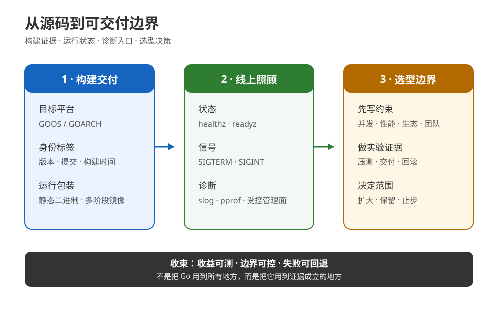

# 课 15：构建部署与选型决策

> 所属阶段：工程化与生产落地 ｜ 故事章节：从能跑到能交付 ｜ 状态：✅ 已完成（2026-09-16）
>
> 本课是阶段 5、也是整门 Go 课程的最后一课。前两课解决“代码经不经得起检查、性能问题能不能定位”；本课解决“它能不能被可靠地交出去、上线后能不能被照顾，以及为什么选它”。

## 🎯 本课目标

- 会用 GOOS / GOARCH 交叉编译，用 -ldflags -X 注入版本信息，用 CGO_ENABLED=0 构建纯 Go 的 Linux 静态二进制，并读懂多阶段 Dockerfile。
- 会用 log/slog 输出结构化日志，区分存活检查和就绪检查，用 signal.Notify + http.Server.Shutdown 处理 SIGTERM，把 pprof 收进受控管理面。
- 能用一张决策表回答“该不该用 Go、用到哪一步”，并把结论落在网络服务、CLI、云原生基础设施、Rust / Java / Python 的实际取舍上。

## 📍 本课在故事主线中的位置

小谷的下单服务已经通过了测试和压测，但“能跑”离“能交付”还差四件事：

1. 目标机器是 Linux，而开发机是 macOS；
2. 发布包必须能回答“这是哪个版本”；
3. 进程被平台终止时，不能把正在处理的请求直接掐断；
4. 出故障时要有线索，但不能为了诊断把 pprof 裸奔到公网。

最后还有一个更大的问题：这段 Python 服务是不是应该全部重写成 Go？答案不该来自语言信仰，而应该来自边界、约束、证据和回滚成本。

## 📌 知识点导航

| # | 知识点 | 本课要解决的现场问题 | 状态 |
|---:|---|---|---|
| 1 | 构建与交付 | macOS 上写的服务，如何产出可识别、可复现、可回滚的 Linux 交付物？ | ✅ |
| 2 | 线上可观测与运维 | 服务“活着”不等于“能接流量”，如何诊断、摘流、优雅退出？ | ✅ |
| 3 | Go 的生态位与选型 | 为什么选 Go？为什么只重写边界而不是全量重写？ | ✅ |

---

# 第一幕：一个“本机能跑”的服务，为什么还不能交付？

小谷在 macOS 上执行：

~~~
go run ./cmd/order-service
~~~

终端里一切正常。可是发布同事问了五个问题：

- 目标是 linux/amd64，你交的是不是这个架构？
- 这个二进制对应哪次提交？
- 镜像里为什么有完整 Go 编译器？
- 发布平台发 SIGTERM 时，请求会不会半途消失？
- CPU 突然升高时，日志、健康状态和 profile 从哪里拿？

这五问把“程序运行”拆成了四个不同的状态：

~~~
源码可编译  →  交付物可识别  →  进程可运行  →  线上可照顾
     │              │                │               │
   go test       version/commit    health/ready    log/pprof/shutdown
~~~

所以本课的主线不是再写一个业务功能，而是把一个服务包装成一件工程产品：别人拿到它，能知道它是什么、能启动它、能判断它是否接流量，也能在升级和故障时安全地替换它。

---

# 第二幕：三个看似合理、实际上危险的直觉

### 直觉一：go build 成功，就代表交付成功

不一定。默认 go build 只说明当前平台能编译；它没有替你选择目标 GOOS / GOARCH，也没有替你注入版本。更不能证明目标机器上的动态库、时区数据和证书都满足运行条件。

### 直觉二：健康检查就是访问 /healthz

也不一定。进程可能还活着，但数据库连接池已经不可用；进程也可能正在退出，不应该再接新流量。至少要分开回答：

| 检查 | 它回答什么 | 失败时通常怎么做 |
|---|---|---|
| 存活（liveness） | 进程是否还在、是否还能响应 | 让平台重启它；不要把短暂依赖故障立刻等同于进程死亡 |
| 就绪（readiness） | 现在是否应该把新流量交给它 | 摘流；启动预热、依赖未就绪、优雅退出时都可以为 false |

### 直觉三：Go 适合后端，所以全部重写最稳

这是把“语言适配某个边界”偷换成了“语言统治整个系统”。如果瓶颈在 Python 的数据科学库、已有成熟 JVM 生态或复杂的业务规则，盲目全量重写会把风险从运行时问题换成迁移问题。

本课最后的判断标准是：哪个边界的收益可测、风险可控、回滚清楚，就先把 Go 用在哪个边界。

---

# 第三幕：层层揭示三个知识点

## 知识点一：构建与交付

### 1.1 一句话定义

构建与交付，是把源码按明确的目标平台和版本元数据编译成可验证的产物，再用最小运行时包装、标识和发布它。

### 1.2 直觉建立：像给货物贴“目的地、批次和装箱单”

- GOOS / GOARCH 像目的地：linux/amd64 和 darwin/arm64 不是同一个货架。
- -ldflags -X 像批次标签：把版本、提交号、构建时间写进程序。
- -trimpath 像撕掉打包机的本地路径标签：减少构建机路径泄露，让调试信息更可迁移。
- 多阶段构建像“仓库装箱”：编译器和源码留在 builder 仓，运行时只拿最终货物。

类比的边界是：标签不能证明货物内容正确，最小箱子也不能自动补齐运行时需要的证书、时区数据、字体或动态库。交付仍要靠测试、检查和目标环境验证。

### 1.3 核心原理

#### GOOS / GOARCH：编译目标由环境变量决定

~~~
GOOS=linux GOARCH=amd64 go build ./cmd/productiondemo
~~~

交叉编译只改变输出目标，不代表当前机器能运行这个目标文件。macOS 上可以产出 Linux ELF，但要在 Linux 容器或 Linux 主机上验证它。

#### -ldflags：把参数传给链接器

程序里先放可被链接器改写的字符串变量：

~~~
var (
    version   = "dev"
    commit    = "unknown"
    buildTime = "unknown"
)
~~~

构建时注入：

~~~
go build -trimpath \
  -ldflags "-s -w -X main.version=lesson15-local -X main.commit=abc1234 -X main.buildTime=2026-09-16T00:00:00Z" \
  -o productiondemo ./cmd/productiondemo
~~~

这里要分清三个开关：

| 开关 | 作用 | 代价 / 边界 |
|---|---|---|
| -X importpath.name=value | 设置一个字符串变量的初值 | 变量必须是可被链接器识别的字符串；别把它当通用配置系统 |
| -s | 去掉符号表 | 体积更小，但离线调试信息减少 |
| -w | 去掉 DWARF 调试信息 | 体积更小，但调试器可用信息减少 |
| -trimpath | 去掉结果中的文件系统路径 | 不能替代源码、构建记录和符号管理 |

版本信息的用途不是“好看”：日志、/version、崩溃报告和镜像标签可以共同回答“现在运行的到底是哪一版”。

#### CGO_ENABLED=0：只有在依赖允许时才换来静态二进制

~~~
CGO_ENABLED=0 GOOS=linux GOARCH=amd64 go build ./cmd/productiondemo
~~~

它关闭 cgo；如果程序和依赖都能走纯 Go 实现，常见结果是可放进 scratch 的静态 ELF。本课示例的 file 输出确实是 statically linked，但这个结论属于“本示例 + 这组依赖”的实测，不是对任意第三方依赖的承诺。

#### 多阶段 Docker 构建：编译环境和运行环境分离

本课的 [Dockerfile](../../../playground/lesson-15/Dockerfile) 只有两个阶段：

~~~
FROM golang:1.27-bookworm AS build
WORKDIR /src
COPY go.mod ./
COPY cmd ./cmd
COPY internal ./internal
ARG VERSION=dev
ARG COMMIT=unknown
ARG BUILD_TIME=unknown
RUN CGO_ENABLED=0 GOOS=linux GOARCH=amd64 \
    go build -trimpath -ldflags="-s -w -X main.version=$VERSION -X main.commit=$COMMIT -X main.buildTime=$BUILD_TIME" \
    -o /out/productiondemo ./cmd/productiondemo

FROM scratch
COPY --from=build /out/productiondemo /productiondemo
ENTRYPOINT ["/productiondemo"]
~~~

COPY --from=build 只把 builder 阶段的目标文件复制进运行时阶段。镜像瘦身的工程收益有三层：攻击面更小、传输更快、启动内容更容易审计。它不等于“无脑使用 scratch”：程序需要 TLS 根证书、时区数据库或非纯 Go 动态库时，要把这些运行时资产显式放进镜像，或选择带它们的基础镜像。

#### 可回滚交付物：版本和内容要能对应

建议同时保留：

~~~
镜像标签：order-service:2026-09-16-abc1234
镜像摘要：sha256:...
运行日志：version=... commit=abc1234
~~~

标签便于人读，摘要便于精确指向内容。回滚就是重新把流量指向一个已经验证过的旧标签或摘要；它不是“重新编译一次希望结果一样”。

### 1.4 示例演示：从 macOS 到 Linux ELF

最小命令链：

~~~
go test ./...
go vet ./...
go build -trimpath -ldflags "-s -w -X main.version=lesson15-local -X main.commit=abc1234 -X main.buildTime=2026-09-16T00:00:00Z" -o /tmp/productiondemo ./cmd/productiondemo
CGO_ENABLED=0 GOOS=linux GOARCH=amd64 go build -trimpath -ldflags "-s -w -X main.version=lesson15-local -X main.commit=abc1234 -X main.buildTime=2026-09-16T00:00:00Z" -o /tmp/productiondemo-linux-amd64 ./cmd/productiondemo
file /tmp/productiondemo-linux-amd64
~~~

本课对应的可复跑脚本在 [regen.sh](../../../playground/lesson-15/regen.sh)，实际运行时使用 mktemp 临时目录，因此不把机器相关二进制留在仓库。

### 1.5 常见误区

| 误区 | 纠偏 |
|---|---|
| 在 macOS 上 go build 成功，就能把该文件放到 Linux | 先明确 GOOS / GOARCH，再用目标环境运行验证 |
| CGO_ENABLED=0 保证所有依赖都能静态链接 | 它只关闭 cgo；依赖是否支持纯 Go 仍要检查和实测 |
| -s -w 是“生产必开且没有代价” | 它减少体积，也减少离线调试信息；保留符号文件或调试构建策略 |
| scratch 越小越好 | 需要证书、时区或动态库时，小镜像会变成运行时故障 |
| 镜像标签就是不可变版本 | 标签可被重新指向；生产审计应记录摘要或不可变制品版本 |
| -ldflags -X 适合注入密码和所有配置 | 它适合公开的构建元数据；密钥应走运行时密钥管理 |

### 1.6 一句话记住

> 交付不是“编译出一个文件”，而是“按目标平台产出可识别、可验证、可回滚的制品”。

### 1.7 📚 官方文档（事实核查于 2026-09）

- [go build 与共享构建参数](https://pkg.go.dev/cmd/go#hdr-Compile_packages_and_dependencies)：确认 GOOS / GOARCH 参与构建环境、-ldflags 传给链接器、-trimpath 移除文件系统路径。
- [cmd/link 的 -X](https://pkg.go.dev/cmd/link)：确认 -X importpath.name=value 的链接器语义。
- [go 环境变量](https://pkg.go.dev/cmd/go#hdr-Environment_variables)：确认 CGO_ENABLED 属于 Go 构建环境配置；是否能得到静态结果仍取决于依赖。
- [Docker 多阶段构建](https://docs.docker.com/build/building/multi-stage/)：确认命名阶段与 COPY --from 的用法。

---

## 知识点二：线上可观测与运维

### 2.1 一句话定义

线上可观测与运维，是让服务能被机器判断状态、被人理解行为、被诊断工具检查，并在停止或替换时给在途请求一个有界的收尾窗口。

### 2.2 直觉建立：机场的“塔台、登机口和黑匣子”

- /healthz 像塔台问“飞机还在不在”；
- /readyz 像登机口问“现在能不能接新乘客”；
- slog 像黑匣子，记录结构化事件而不是一团只能靠正则猜的句子；
- Shutdown 像关航站楼：停止接新客，让已经登机的人完成，再关门；
- pprof 像维修舱，应该有门禁和专用通道，不能把维修入口开在公共大厅。

类比的边界是：日志、指标、trace、profile 各自回答不同问题；健康检查不是业务监控，优雅退出也不是无限等待。必须为等待设定 deadline，并处理超时后的残余风险。

### 2.3 核心原理

#### slog：事件是字段，不是拼接后的句子

~~~
logger.Info("build metadata",
    slog.String("version", version),
    slog.String("commit", commit),
    slog.String("build_time", buildTime),
)
~~~

JSON Handler 会输出类似：

~~~
{"level":"INFO","msg":"build metadata","version":"lesson15-local","commit":"abc1234","build_time":"2026-09-16T00:00:00Z"}
~~~

采集系统可以按 commit、status、signal 字段过滤和聚合，不需要从“slow request completed status=200”里再次解析文本。字段名要稳定，敏感值不能因为“结构化”就变得更容易泄露。

#### 存活与就绪：启动、依赖故障、退出是三个状态

本课示例的状态转移：

~~~
启动：ready=false
       │ 初始化完成
       ▼
运行：healthz=200 / readyz=200
       │ 收到 SIGTERM
       ▼
摘流：ready=false / healthz 仍可响应
       │ Shutdown 等在途请求
       ▼
退出：关闭监听器与连接
~~~

注意：检查端点的路径和具体状态码是部署平台的契约选择，不是 Go 标准库强制规定。标准库只提供 HTTP 服务能力；/healthz、/readyz 是本课采用的清晰约定。

#### signal.Notify + Shutdown：先收信号，再有界等待

核心顺序：

~~~
signalCh := make(chan os.Signal, 1)
signal.Notify(signalCh, syscall.SIGTERM, syscall.SIGINT)
defer signal.Stop(signalCh)

sig := <-signalCh
ready.Store(false) // 先摘流

ctx, cancel := context.WithTimeout(context.Background(), time.Second)
defer cancel()
_ = srv.Shutdown(ctx)
~~~

Shutdown 的语义不是“立刻杀死所有请求”：它关闭监听器、关闭空闲连接，并等待活跃连接变为空闲；上下文到期后返回，但仍需处理未完成的请求和外部终止策略。WebSocket 等被 hijack 的连接不由 Shutdown 管理，必须在自己的协议层设计退出。

#### pprof：诊断能力与暴露面必须同时设计

net/http/pprof 提供 /debug/pprof/ 及相关 profile 端点。安全的基本形状是：

~~~
公网业务端口  → 业务 mux：healthz / readyz / API
内网管理端口  → 管理 mux：pprof / metrics / admin
~~~

本课示例用匿名导入 net/http/pprof 注册默认管理 mux，但业务服务使用自己的 http.NewServeMux()；两个 listener 都只绑定 127.0.0.1。生产环境还需要网络 ACL、鉴权、采集窗口和审计，不能因为“只在内网”就跳过授权设计。

### 2.4 示例演示：一条请求如何安全退出

[生产演示源码](../../../playground/lesson-15/cmd/productiondemo/main.go)启动两个 loopback 服务：

- public：/healthz、/readyz、/version、/slow；
- admin：pprof 默认端点；
- demo：先请求状态，再启动一个 80 ms 的在途请求，然后发送 SIGTERM。

关键判断不是“进程收到了信号”，而是这五个结果同时成立：

~~~
healthz=200
readyz 首次=503，标记 ready 后=200
public pprof=404，admin pprof=200
在途 slow 请求=200
Shutdown 完成且 in_flight_request_preserved=true
~~~

### 2.5 常见误区

| 误区 | 纠偏 |
|---|---|
| /healthz 200 就说明依赖都好 | 存活和就绪分离；依赖检查放入就绪语义或独立依赖指标 |
| 收到 SIGTERM 后直接 os.Exit(0) | 会跳过清理和在途请求；先摘流，再有界 Shutdown |
| Shutdown 会保证所有请求都完成 | 只在 deadline 内等待；被 hijack 的连接另行管理 |
| pprof 只读所以可以公网开放 | profile 可能暴露路径、调用栈、业务形状；需要受控入口 |
| 所有日志都改成 JSON 就完成可观测 | 还要稳定字段、关联版本、指标/trace、profile、采集和留存策略 |
| 就绪失败就立刻重启进程 | 短暂依赖故障应先摘流，是否重启要看故障类型和平台策略 |

### 2.6 一句话记住

> 线上运维的目标不是“永不出错”，而是“状态说得清、故障看得到、退出收得住”。

### 2.7 📚 官方文档（事实核查于 2026-09）

- [log/slog](https://pkg.go.dev/log/slog)：确认结构化日志由 Logger、Handler 和属性组成；slog 在 [Go 1.21 Release Notes](https://go.dev/doc/go1.21) 作为标准库新包发布。
- [http.Server.Shutdown](https://pkg.go.dev/net/http#Server.Shutdown)：确认关闭监听器、关闭空闲连接、等待活跃连接，以及 deadline 到期的边界。
- [os/signal.Notify](https://pkg.go.dev/os/signal#Notify)：确认信号发送到用户提供的 channel 后，程序接管对应信号的处理；退出时用 signal.Stop 收尾。
- [net/http/pprof](https://pkg.go.dev/net/http/pprof)：确认标准 pprof HTTP 端点和默认 mux 注册行为；是否暴露给公网属于部署安全决策。

---

## 知识点三：Go 的生态位与选型

### 3.1 一句话定义

Go 的生态位与选型，是根据系统的并发模型、交付方式、生态依赖、性能目标和团队能力，判断 Go 应该承担哪条边界，而不是给语言贴“万能”或“不能用”的标签。

### 3.2 直觉建立：选工具，不是选球队

同一家公司可以同时使用 Go、Rust、Java 和 Python：

- Go 像轻量、易交付的服务和工具箱；
- Rust 像需要更强内存控制和无 GC 运行时的精密设备；
- Java 像拥有成熟企业级 JVM 生态的大型车间；
- Python 像连接数据、实验和自动化的高迭代工作台。

类比的边界是：这些不是严格的性能排序，也不是语言的能力边界。每种语言都能越界完成很多事；真正的成本来自生态成熟度、团队熟悉度、部署约束、长期维护和迁移回滚。

### 3.3 核心原理：先按约束筛，再按收益排

#### Go 的强项

在以下条件同时出现时，Go 往往值得优先评估：

- 网络服务、RPC、代理、网关、控制面或 CLI；
- 并发是业务模型的一部分，需要清晰的 goroutine / channel / context 协作；
- 希望交付一个启动快、依赖边界清楚的二进制或容器；
- 团队重视静态类型、统一格式、标准工具链和可读的长期维护；
- 需要把构建、测试、竞态检查、benchmark、profile 接入同一条工程链。

Go 官方的[云与网络服务用例页](https://go.dev/solutions/cloud)也把网络服务、并发、静态类型、工具链和标准库列为典型定位；该页面标注日期为 2019-10-04，本文不把其中的历史统计数字当成 2026 年现状。

#### Go 的弱项或需要谨慎评估的边界

- 硬实时、必须严格控制暂停和内存布局的场景：先评估 Rust / C / C++ 等更合适的运行时模型；
- 极重的科学计算、GPU、数据科学和机器学习生态：Python / C++ / 专用平台可能拥有更短的路径；
- 强依赖 JVM 生态、现有 Java/Kotlin 中间件和团队经验的大型企业系统：迁移收益可能不足以覆盖重写成本；
- 复杂 GUI、移动端或前端主战场：Go 不是默认选择；
- 只有“感觉更快”而没有端到端瓶颈证据的项目：先 profile 和压测，不要先换语言。

这些是工程判断框架，不是语言排行榜；“不擅长”表示机会成本高或默认生态不占优，不表示技术上绝对做不到。

#### Go / Rust / Java / Python：什么时候该选谁？

| 约束 / 问题 | Go | Rust | Java / Kotlin | Python |
|---|---|---|---|---|
| 网络服务与并发 | 默认候选；实现与运维路径短 | 适合需要更强内存控制的关键路径 | 适合已有 JVM 平台和企业生态 | 适合快速验证或 I/O 编排，CPU 热点需另评估 |
| 极致尾延迟 / 无 GC 运行时 | 需要实际测量 GC 与分配行为 | 常是优先候选之一 | 可调优，但要熟悉 JVM 运行时 | 通常不是第一候选 |
| CLI / 单二进制交付 | 强项 | 强项，但开发复杂度通常更高 | 可做，运行时和分发约束需纳入 | 可做，但解释器和依赖打包要纳入 |
| 数据科学 / ML | 常作为服务边界或工具 | 常作为性能关键组件 | 有成熟库，但取决于团队现有栈 | 常是首选工作台 |
| 团队上手与统一规范 | 标准工具链强 | 类型系统和所有权学习成本更高 | 大型生态成熟，运行时概念更多 | 迭代快，长期边界和类型约束要补 |

表格里的“强项 / 候选”只是一阶筛选。二阶筛选必须拿真实输入、真实负载、真实发布链跑一遍；课 14 的 benchmark / pprof 正是为这个二阶筛选服务的。

#### “用 Go 到哪一步”：优先重写清晰边界

一个更稳的迁移顺序是：

~~~
先找可独立部署的边界
        ↓
为边界建立输入/输出契约和回滚开关
        ↓
用 Go 重写一个可测的热点或服务
        ↓
比较延迟、资源、交付和维护成本
        ↓
证据成立才扩大范围
~~~

例如：

- Python 的机器学习特征处理保留在 Python，外围高并发 HTTP 网关用 Go；
- 现有单体不先全量重写，先抽出一个可独立回滚的 worker 或 CLI；
- 管理后台继续用已有 Web 栈，数据面代理、采集器或控制器用 Go；
- 只有当边界收益稳定、团队有维护能力、回滚方案已演练，才考虑继续扩展。

### 3.4 常见误区

| 误区 | 纠偏 |
|---|---|
| Go 能写网络服务，所以所有服务都该用 Go | 先看约束、生态和迁移收益 |
| Rust 更快，所以一定应该选 Rust | 极致性能只是一个维度；开发、招聘、维护和交付也要计入 |
| Python 慢，所以必须重写 | 先定位是 Python 本身、算法、数据库还是网络边界慢 |
| 用 Go 就应该全量重写 | 优先选可独立验证和回滚的边界 |
| 官方案例就是我的项目结论 | 案例只能说明可行性，不替代本项目的压测和成本核算 |
| 选型文档只写“我们喜欢 Go” | 写约束、候选、证据、反例、回滚和复盘时间 |

### 3.5 一句话记住

> 选 Go 的理由应该是“它在这条边界上给出的总收益最高”，而不是“Go 什么都能做”。

### 3.6 📚 官方文档与资料（事实核查于 2026-09）

- [Go for Cloud & Network Services](https://go.dev/solutions/cloud)：官方定位性材料，说明网络服务、并发、静态类型和工具链等典型使用场景；页面本身是 2019 年文章，历史统计不当作当前数字。
- [Go 标准库文档](https://pkg.go.dev/std)：查看 HTTP、JSON、SQL、加密和运行时工具等标准库能力，而不是只按第三方框架印象选型。
- [Effective Go](https://go.dev/doc/effective_go)：官方惯用法材料；页面明确提示它不是覆盖现代模块和新库的完整更新手册，阅读时应结合当前版本文档。

---

## 第四幕：本机真实跑通——同一份服务完成构建、诊断与退出

### 4.1 实验环境与入口

本机实测环境：

~~~
Go:      go1.27.1
系统:    darwin/arm64
Docker:  守护进程可用；真实 build/run 已完成
代码:    go/playground/lesson-15
~~~

从仓库根目录执行：

~~~
cd go/playground/lesson-15
bash regen.sh > ALL_OUTPUT.txt 2>&1
~~~

脚本依次执行 go test、go test -race、gofmt -l、go vet、带版本注入的本机构建、linux/amd64 交叉构建、file 检查，并在 Docker 可用时真实构建、运行和清理一个多阶段镜像。

### 4.2 Go 检查、版本注入和本地 demo 的实测输出

以下摘自 [ALL_OUTPUT.txt](../../../playground/lesson-15/ALL_OUTPUT.txt)。临时目录名和 Docker 镜像摘要是机器相关字段，这里只保留能支持课程结论的逐字行：

~~~console
$ go version
go version go1.27.1 darwin/arm64
[exit=0]

$ go test -race -count=1 ./...
?    example.com/go-course/lesson15/cmd/productiondemo  [no test files]
ok   example.com/go-course/lesson15/internal/app  1.015s
[exit=0]

$ gofmt -l .
[exit=0]

$ go vet ./...
[exit=0]

$ /temporary/productiondemo -demo
{"level":"INFO","msg":"build metadata","version":"lesson15-local","commit":"abc1234","build_time":"2026-09-16T00:00:00Z"}
{"level":"INFO","msg":"servers listening","public":"loopback","admin":"loopback"}
demo healthz=200 readyz_before=503 readyz_after=200 public_pprof=404 admin_pprof=200
{"level":"INFO","msg":"slow request started","duration_ms":80}
{"level":"INFO","msg":"shutdown signal received","signal":"terminated"}
{"level":"INFO","msg":"graceful shutdown started"}
{"level":"INFO","msg":"slow request completed","status":200}
{"level":"INFO","msg":"graceful shutdown complete","in_flight_request_preserved":true}
demo slow_request=200
[exit=0]
~~~

这里有五个证据点：

1. 版本号来自 -ldflags -X，不是源码默认值 dev；
2. 未就绪时 /readyz 是 503，标记就绪后变 200；
3. public 端口的 pprof 是 404，admin 端口的 pprof 是 200；
4. SIGTERM 发生在 /slow 处理期间；
5. Shutdown 等待在途请求完成，最终状态是 200。

### 4.3 Linux 静态二进制的实测输出

~~~console
$ env CGO_ENABLED=0 GOOS=linux GOARCH=amd64 go build -trimpath -ldflags ... ./cmd/productiondemo
[exit=0]

$ file /temporary/productiondemo-linux-amd64
/temporary/productiondemo-linux-amd64: ELF 64-bit LSB executable, x86-64, version 1 (SYSV), statically linked, Go BuildID=..., BuildID[sha1]=..., stripped
[exit=0]
~~~

输出里的 BuildID 会随源码和工具链变化；本次实测支持的稳定结论是：目标是 Linux x86-64、结果是静态 ELF、符号和 DWARF 已按 -s -w 处理。

### 4.4 Docker 多阶段构建与运行的实测输出

本机 Docker 真实完成了 builder → scratch 的构建，镜像大小约 7.88 MB；随后从镜像启动同一个 -demo，得到同样的 healthz=200、public_pprof=404、admin_pprof=200、demo slow_request=200。本轮生成的临时镜像已由脚本删除：

~~~console
$ docker build --quiet ... -t go-course-lesson15:verify-...
sha256:7bebf6faca51b028544856dcde09c6b8453f3854cd5bd76f92bd15d9859dbeb6
[exit=0]

$ docker image inspect go-course-lesson15:verify-... --format 'image={{.Id}} size={{.Size}}'
image=sha256:7bebf6faca51b028544856dcde09c6b8453f3854cd5bd76f92bd15d9859dbeb6 size=7880864
[exit=0]

$ docker run --rm go-course-lesson15:verify-... -demo
demo healthz=200 readyz_before=503 readyz_after=200 public_pprof=404 admin_pprof=200
demo slow_request=200
[exit=0]

$ docker image rm go-course-lesson15:verify-...
Untagged: go-course-lesson15:verify-...
Deleted: sha256:7bebf6faca51b028544856dcde09c6b8453f3854cd5bd76f92bd15d9859dbeb6
[exit=0]
~~~

Docker 容器中的几行 server started 可能与 servers listening 的先后顺序不同，这是 goroutine 调度顺序，不影响状态码和退出结论。课程断言只使用稳定的行为证据，不把日志排序当成协议。

### 4.5 你可以继续改的三个实验

1. 把 ready.Store(false) 暂时删掉，再想一想滚动发布时平台如何知道该实例不应接新流量。
2. 把 Shutdown 的 deadline 改成 10 ms，观察在途请求与 Shutdown 返回之间的关系；不要把“Shutdown 超时”误读成“请求一定被取消”。
3. 把 admin server 改成 public handler，重新验证 pprof 暴露面；然后恢复隔离，并为管理端口加网络限制。

---

## 第五幕：把课程收成一把工程量尺

### 5.1 Go 选型决策清单

评估一个新服务时，先逐项写证据，不要直接填“喜欢 / 不喜欢”：

| 维度 | 要问的问题 | Go 通过的证据 |
|---|---|---|
| 业务边界 | 是网络服务、CLI、代理、采集器、控制器，还是数据科学工作台？ | Go 负责的边界可独立部署 |
| 并发模型 | 并发是核心问题还是偶发需求？ | goroutine / context 模型能让代码更清楚 |
| 性能 | 目标是吞吐、p95/p99、启动时间还是内存？ | benchmark + 服务级压测支持结论 |
| 生态 | 是否依赖 Python ML、JVM 中间件、GPU 或特定 SDK？ | Go 的库和团队能力覆盖关键路径 |
| 交付 | 是否需要单二进制、交叉编译、精简容器？ | 构建链、镜像、运行时资产已演练 |
| 运维 | 是否有日志、健康、profile、优雅退出和回滚要求？ | 生产演示链路全部可复跑 |
| 团队 | 谁维护、谁排障、谁升级依赖？ | 团队能读、测、诊断和发布 Go |
| 迁移 | 能否切出边界，保留旧实现作为回退？ | 有契约、灰度开关和旧版本回滚 |

### 5.2 小谷的结论不是“全量重写”

把清单套到故事里：

- 下单 HTTP 边界有明确输入输出、并发和部署收益，适合先用 Go 重写；
- 机器学习特征处理若依赖 Python 生态，不因为外围服务换 Go 就一起重写；
- 先让 Go 服务能独立构建、健康检查、优雅退出和回滚；
- 通过 p95、CPU、内存、启动时间、发布失败率和维护工时比较，而不是只比较某个函数的 ns/op；
- 证据成立后，再扩大 Go 边界；证据不成立，就保留原实现或换别的工具。

这就是“用到哪一步”的答案：用到收益可证明、边界可控制、失败可回退的那一步。

### 5.3 阶段 5 与全课收束

| 课次 | 解决的风险 | 交付后留下什么 |
|---|---|---|
| 课 13 模块、测试与规范 | 依赖混乱、行为没测、风格漂移 | 可检查的代码库 |
| 课 14 性能与诊断 | 慢在哪里、内存为何涨、goroutine 是否泄漏 | 可量化的证据链 |
| 课 15 构建部署与选型决策 | 交付不可复现、退出不安全、选型靠信仰 | 可发布、可观察、可回滚的边界 |

整门课的故事也在这里收束：

~~~
语言基础 → 数据模型 → 并发协作 → 标准库服务
      → 模块/测试/规范 → 性能/诊断 → 构建/运维/选型
~~~

### 5.4 📋 速查卡

#### 构建与交付

~~~bash
go version
go env GOOS GOARCH CGO_ENABLED
go test ./...
go test -race ./...
go vet ./...
gofmt -l .

go build -trimpath \
  -ldflags "-s -w -X main.version=$VERSION -X main.commit=$COMMIT -X main.buildTime=$BUILD_TIME" \
  -o bin/service ./cmd/service

CGO_ENABLED=0 GOOS=linux GOARCH=amd64 go build -trimpath -o bin/service-linux-amd64 ./cmd/service
file bin/service-linux-amd64
~~~

#### 运维

~~~go
signalCh := make(chan os.Signal, 1)
signal.Notify(signalCh, syscall.SIGTERM, syscall.SIGINT)
defer signal.Stop(signalCh)

ready.Store(false)
ctx, cancel := context.WithTimeout(context.Background(), 30*time.Second)
defer cancel()
if err := srv.Shutdown(ctx); err != nil {
    // 记录并决定是否升级处置
}
~~~

~~~text
public: healthz / readyz / API
admin:  pprof / metrics / restricted endpoints
~~~

#### 选型

~~~text
约束 → 候选 → 可测实验 → 交付演练 → 回滚演练 → 扩大或止步
~~~

### 5.5 常见误区总表

| # | 误区 | 纠偏 |
|---:|---|---|
| 1 | 当前平台 build 过了就能发布 | 明确目标平台并运行目标产物 |
| 2 | 交叉编译等于跨平台验证完成 | 仍要在目标系统 / 容器实测 |
| 3 | -s -w 只有收益 | 体积与调试能力做取舍 |
| 4 | 静态二进制不需要任何运行时资产 | TLS、时区、字体等需求要单独验证 |
| 5 | 镜像越小越生产 | 运行时完整性与可诊断性优先于数字最小 |
| 6 | 标签不可变 | 记录 digest 或不可变制品版本 |
| 7 | 版本写在 README 就够了 | 让二进制日志 / 端点能自报版本 |
| 8 | CGO_ENABLED=0 解决所有链接问题 | 仍需确认依赖和目标平台 |
| 9 | healthz 200 就应该接流量 | 再看 readiness 和依赖状态 |
| 10 | readiness 失败就是进程坏了 | 可能只是启动、预热或摘流 |
| 11 | SIGTERM 后直接 exit 最干净 | 先摘流，给在途请求有界收尾 |
| 12 | Shutdown 永远等到所有请求完成 | deadline 到期就要有升级策略 |
| 13 | pprof 只读所以能公网开放 | 诊断信息仍可能敏感，放受控管理面 |
| 14 | 结构化日志等于完整可观测 | 还需字段规范、指标、trace、profile 与留存 |
| 15 | Go 擅长服务所以应该全量重写 | 先选收益可测、边界可回滚的部分 |
| 16 | Rust / Java / Python 只按性能高低排 | 按约束、生态、团队和交付总成本比较 |
| 17 | 官方案例可以代替本项目压测 | 案例证明可行性，实验才证明适配性 |
| 18 | 一次迁移越大越彻底 | 小边界更容易验证、灰度和回滚 |

### 5.6 小测：先自己回答，再展开答案

题 1：为什么本地是 macOS，也可以构建出 Linux 二进制？

因为 Go 编译器支持通过 GOOS / GOARCH 指定目标平台，编译阶段生成目标平台的机器码。它不表示 macOS 能直接执行 Linux ELF；本课用 file 检查了结果，并在 Docker 的 Linux 环境中运行了它。

题 2：healthz=200、readyz=503 说明服务坏了吗？

不一定。它说明进程仍能响应，但当前不应接新流量。启动预热、关键依赖未就绪和优雅退出都可以形成这种状态；平台是否重启，要看更具体的存活语义。

题 3：为什么 pprof 在 admin 端口是 200、public 端口是 404？

因为示例把 pprof 注册在默认管理 mux，并让 public server 使用独立的 http.NewServeMux()。端口隔离不是完整安全方案，还需要网络控制和鉴权，但它先消除了“业务端点意外带上诊断端点”的默认暴露。

题 4：Go 选型的第一步是什么？

先写约束和边界，而不是先写语言名：业务类型、并发模型、性能目标、生态依赖、交付方式、团队能力和回滚方案。然后用真实输入与负载做最小实验，再决定扩大、保留或止步。

### 5.7 本课自检清单

- [ ] 我能解释 GOOS / GOARCH 是目标平台，而不是当前运行平台。
- [ ] 我会用 -ldflags -X 注入版本、提交号和构建时间。
- [ ] 我知道 -s -w 减小体积，也会减少调试信息。
- [ ] 我能说明 CGO_ENABLED=0 何时可能得到静态二进制，何时不能直接下结论。
- [ ] 我能读懂多阶段 Dockerfile 的 builder 和 runtime 两个阶段。
- [ ] 我知道 scratch 的证书、时区和动态库边界。
- [ ] 我能区分存活检查和就绪检查，并知道退出时要先摘流。
- [ ] 我能用 slog 输出带稳定字段的结构化日志。
- [ ] 我知道 Shutdown 要配 deadline，并理解在途请求与超时的边界。
- [ ] 我不会把 pprof 默认端点直接挂到公网业务端口。
- [ ] 我能用约束、证据、成本和回滚解释一次 Go 选型。
- [ ] 我知道“用 Go 到哪一步”通常比“要不要全量重写”更容易得到可验证答案。

## ✅ 阶段 5 收官与全课下一步

阶段 5 三课现已全部完成：**9 / 9 个阶段知识点，45 / 45 个全课知识点**。本课结束后，课程进入 Phase 3 的结课综合实战：把前面知识串成一个可测试、可诊断、可构建、可部署、可回滚的完整项目。

本轮只完成课程正文和本课 playground；结课项目不在本课范围内，下一步再单独进入。

## 🔗 课程导航

- 上一课：[课 14：性能与诊断](./lesson-14-性能与诊断.md)
- 当前课：课 15《构建部署与选型决策》
- 返回阶段 5：[阶段 5 概览](../overview.md)
- 返回课程目录：[Go 课程目录](../../../02-课程目录.md)
- 本课实操：[playground/lesson-15](../../../playground/lesson-15/README.md)
- 结课后的邻接学习入口：[Docker](../../../../docker/01-学习路径总览.md)、[Kafka](../../../../kafka/01-学习路径总览.md)、[Redis](../../../../redis/01-学习路径总览.md)、[Elasticsearch](../../../../elasticsearch/01-学习路径总览.md)、[OpenTelemetry](../../../../opentelemetry/01-学习路径总览.md)、[PromQL](../../../../promql/01-学习路径总览.md)、[VictoriaMetrics](../../../../victoriametrics/01-学习路径总览.md)

## 🚀 下一批接力提示词

> 继续学习 Go。我的学习档案在 go/00-学习档案.md。我已完成阶段 5 课 15《构建部署与选型决策》（45 / 45 个知识点全部完成）。请进入 Phase 3，设计并实现 Go 结课综合实战项目：把模块、测试、并发、HTTP 服务、数据库/客户端、性能诊断、构建部署、可观测与优雅退出串成一条可真实验收的链路；先读取课程档案和本课 playground，沿用五幕教学与真实运行证据纪律，不要伪造输出。
