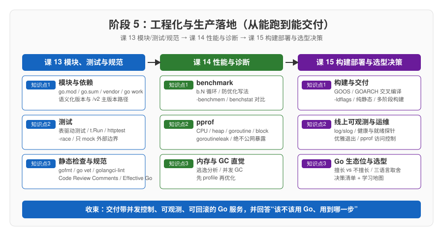

# 阶段 5 概览：工程化与生产落地

> 所属课程：Go 语言系统学习 ｜ 故事章节：从能跑到能交付 ｜ 课程起点：[学习路径总览](../../01-学习路径总览.md)

## 🎯 本阶段目标

- 把前面各阶段零散的"写法"收成一套**工程纪律**：能说出 Go 模块与依赖管理（`go.mod` / `go.sum` / `vendor` / `go work`）如何工作，写出的代码经得起 `gofmt` / `go vet` / 测试与静态检查的检验。
- 学会用 **benchmark + pprof** 给服务做定量体检，能说清 goroutine 泄漏、分配过多、GC 行为分别怎么查、怎么看、怎么治——而不是凭感觉优化。
- 能独立走完**构建 → 容器化 → 线上可观测 → 优雅退出 → 选型决策**这条"交付"链，交付一个带并发控制、可观测、可回滚的 Go 服务，并对"该不该用 Go、用到哪一步"给出可复述的结论。

## 📍 学习重点

- Go 的模块与依赖模型为什么"去中心化但收敛"：`go.mod` 三段（module / go / require）、语义化版本与 `/v2` 主版本路径、`go.sum` 的校验职责、`go mod tidy` 的清理语义，以及 `vendor/` 与 `go work` 的适用场景。
- Go 的测试文化：`_test.go` 与 `TestXxx`、**表驱动测试**是官方推荐的标配写法、`t.Run` 子测试与 `httptest`、`-race` 竞争检测与覆盖率，以及"只 mock 外部边界，不 mock 一切"的边界直觉。
- 静态检查与规范：`gofmt` 是事实标准（Go 官方没有显式风格指南）、`go vet` 内置检查、`golangci-lint` 聚合工具，以及官方 Code Review Comments / Effective Go 提供的命名与注释约定。
- 性能与可观测的正确姿势：**先 profile 再优化**、benchmark 防优化的写法、pprof 四类画像与其公网暴露红线、GC 的并发直觉与减少分配的通用手段。

## ✅ 必须掌握的知识点

| 知识点 | 所属课 | 学完应能 |
|--------|--------|----------|
| 模块与依赖 | 课 13 | 读懂 `go.mod` 的 module / go / require 三段，解释主版本 ≥2 为何要在模块路径加 `/v2`，理解 `go.sum` 只校验不可手改，会用 `go mod tidy` 清理依赖，区分 `vendor/` 与 `go work` 的适用场景 |
| 测试 | 课 13 | 用 `_test.go` + `TestXxx` 写单元测试，按官方推荐把用例放进切片写**表驱动测试**，会用 `t.Run` 拆子测试、用 `httptest` 测 HTTP 处理，会跑 `-race` 并说清只 mock 外部边界的理由 |
| 静态检查与规范 | 课 13 | 用 `gofmt` 统一格式、用 `go vet` 做内置静态检查，按官方命名与注释约定（注释以被注释对象名字开头）写代码，认识 `golangci-lint` 的定位并能在需要时找到其官方用法 |
| benchmark | 课 14 | 用 `BenchmarkXxx` + `b.N` 写基准测试，懂得把结果赋给包级变量（或 `runtime.KeepAlive`）防止编译器优化掉，用 `-benchmem` 读每次操作的分配，会用工具对比多次测量结果 |
| pprof | 课 14 | 区分 CPU / heap / goroutine / block 四类画像，用 `go tool pprof` 的 `top` / `list` / 火焰图定位热点，掌握 `net/http/pprof` 在线端点的访问控制红线，理解 Go 1.27 `goroutineleak` 画像的用途 |
| 内存与 GC 直觉 | 课 14 | 用 `-gcflags=-m` 看逃逸分析结果判断变量上栈还是上堆，理解 GC 是并发回收、多数时候无须干预，会用预分配容量 / 复用 buffer / `strings.Builder` 减少分配，坚持先 profile 再优化 |
| 构建与交付 | 课 15 | 用 GOOS / GOARCH 交叉编译、用 `-ldflags` 注入版本信息、用 `CGO_ENABLED=0` 出纯静态二进制，能读懂并运用容器多阶段构建产出可回滚镜像 |
| 线上可观测与运维 | 课 15 | 用 `log/slog` 输出结构化日志，给 `http.Server` 配健康检查与就绪探针，用 `signal.Notify` + `srv.Shutdown(ctx)` 做优雅退出，正确收敛 pprof 端点的暴露面 |
| Go 的生态位与选型 | 课 15 | 说清 Go 擅长的领域（网络服务 / CLI / 云原生基础设施）与不擅长的场景，给出与 Rust / Java / Python 的取舍对比，能套用决策清单回答"该不该用 Go、用到哪一步"并规划下一步学习 |

## 🎬 全课收束

本阶段是故事的最后一章，也是把阶段 1-4 的能力**收成"能交付"**的一章：阶段 1-2 让"语法能看懂、代码能组织"，阶段 3 让"并发不出乱子"，阶段 4 让"网络服务跑得起来"——但它们加在一起，还只是一个"能跑"的程序。只有当小谷补上模块与测试、性能与诊断、构建与可观测这三块拼图，那个曾经"一压测就崩"的下单服务才真正变成"能上线、能回滚、出问题查得到"的交付物。而课 15.3 的选型决策，正是用来回答第一幕在小谷心头埋下的那个问题——"该不该用 Go、用到哪一步"：故事在这一章收束，但留给读者的是一把可以带到任何下一个技术选型现场的量尺。

## 🗺️ 本阶段路径图

## 本阶段产出

- [x] `lessons/lesson-13-模块、测试与规范.md`（2026-09-15）
- [x] `lessons/lesson-14-性能与诊断.md`（2026-09-16）
- [x] `lessons/lesson-15-构建部署与选型决策.md`（2026-09-16）

## 阶段收官项目

- [x] [Go 结课综合实战：订单服务生产化](../../projects/订单服务生产化/README.md)（2026-09-16）
