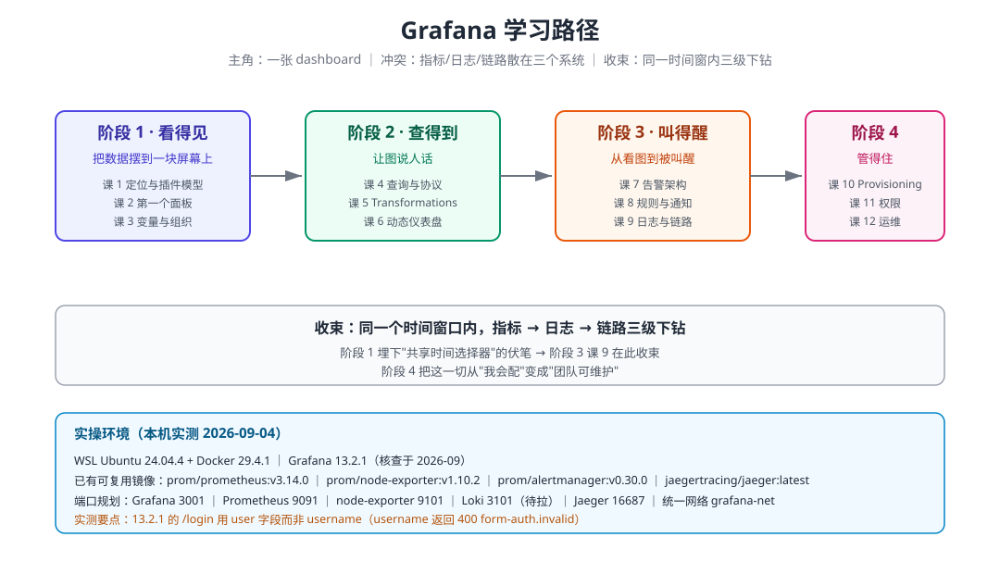

# Grafana 学习路径总览

> 本文件是活文档，随学习进度动态调整。阶段依赖图用 SVG。

## 🎯 学习目标

- **目标类型**：动手实操
- **目标说明**：能独立搭建 Grafana 并配通 Prometheus / Loki / Jaeger 三类数据源，做出可联动下钻的仪表盘，配出真正会响的告警，并用 Provisioning 把 dashboard 与告警纳入版本管理。

> 学习目标是全局基准，决定各阶段/课的取舍与实操比重。目标变更时更新此处。

## 学习者画像

| 项 | 值 |
|---|---|
| 当前水平 | 入门（见过 Grafana、点过面板，没系统配过） |
| 学习目标 | 动手实操 |
| 输出格式 | Markdown（图表默认 Mermaid，复杂图用 SVG） |
| 已有基础 | Prometheus / PromQL / VictoriaMetrics / OpenTelemetry 四门课程已完成 |
| 确认方式 | 2026-09-04 用户回复「按默认的讲」采用默认画像 |

> 已有基础意味着：PromQL 语法、scrape 配置、OTel 三信号不再从头讲，本课的精力放在 **Grafana 这一层**——它怎么把不同后端拉平、怎么查询、怎么告警、怎么治理。

## 故事主线

- **主角**：一张 dashboard
- **冲突**：指标在 Prometheus、日志在 Loki、链路在 Jaeger，出一次事故要开三个控制台、手工对齐三份时间戳
- **收束**：同一个时间窗口内，指标 → 日志 → 链路三级下钻不必手工换算时间

> 整个课程是这条故事线的展开，每个阶段是故事的一个"章节"。

## 学习路径图

---

## 阶段总览

### 阶段 1：看得见（故事章节：把数据摆到一块屏幕上）

- **目标**：从零跑起 Grafana，接上第一个真实数据源，做出能看懂的面板。
- **学习重点**：
  - Grafana 的定位——它存数据吗？（不存，它是查询与展示层）
  - 数据源（Data Source）插件模型：为什么换个后端只要换插件
  - Panel 与可视化类型：同一份数据换图表的差别
  - Dashboard 与变量：一张图服务 N 台机器
- **必须掌握**：能说清 Grafana 与 Prometheus 的分工边界；能独立加数据源、建 Panel、设变量。
- **对应课**：课 1《Grafana 是谁：一个不存数据的看图工具》、课 2《第一个面板：从零到看得见》、课 3《变量与 Dashboard 组织：一张图服务 N 台机器》

### 阶段 2：查得到（故事章节：让图说人话）

- **目标**：掌握查询编辑器与数据整形，能把"查得出来"变成"查得对、看得懂"。
- **学习重点**：
  - 查询编辑器三态：Code / Builder / Explain
  - Transformations：查询后的数据整形（合并、归约、重命名、按字段分组）
  - 变量进阶：链式变量、多值、all 值与查询写法
  - 数据链路：数据源 → 查询 → Transform → 面板，错误在哪一层
- **必须掌握**：能对一条查询判断"数据不对是查询的问题还是 Transform 的问题"；能用链式变量做联动仪表盘。
- **对应课**：课 4《查询编辑器与数据源协议：一次查询的完整旅程》、课 5《Transformations：把查出来的数据捏成想要的形状》、课 6《变量进阶与动态仪表盘》

### 阶段 3：叫得醒（故事章节：从"看图"到"被叫醒"）

- **目标**：配出真正会响、且不乱响的告警，并把指标—日志—链路三级下钻打通。
- **学习重点**：
  - Grafana 统一告警架构：规则在哪求值、状态怎么迁移
  - 告警规则与通知策略：分组、静默、抑制
  - 日志与链路：Loki 与 Jaeger 数据源、exemplar 下钻
  - 告警的三种数据形态： instant / range / 无数据
- **必须掌握**：能独立写一条带 `for` 与 `No Data` 处理的告警规则；能从一张指标图点进对应时间窗的日志。
- **对应课**：课 7《告警架构：规则在哪求值、状态怎么迁移》、课 8《告警规则与通知策略实战》、课 9《日志与链路：指标之外的另外两只眼》

### 阶段 4：管得住（故事章节：从"我会配"到"团队可维护"）

- **目标**：把手工点击变成可版本化、可迁移、可交接的配置。
- **学习重点**：
  - Provisioning：Dashboard as Code 与冲突处理
  - 用户、团队、服务账号与权限模型
  - 性能：面板数量、查询并发、缓存与渲染
  - 高可用与升级运维
- **必须掌握**：能用 provisioning YAML 重建一整套 dashboard 与告警；能说清升级前要做什么。
- **对应课**：课 10《Provisioning：把点击变成配置文件》、课 11《权限与服务账号：谁能看、谁能改、程序怎么访问》、课 12《性能、高可用与升级运维》

---

## 当前进度

- [x] 阶段 1：看得见（**已完成** — 课 1–3 全部完成，9/9 知识点）
- [x] 阶段 2：查得到（**已完成** — 课 4–6 全部完成，9/9 知识点）
- [x] 阶段 3：叫得醒（**已完成** — 课 7–9 全部完成，9/9 知识点）
- [x] 阶段 4：管得住（**已完成** — 课 10–12 全部完成，9/9 知识点）

**总进度**：36 / 36 知识点（2026-09-07）— **12 课全部结课**

## 实操环境（本机实测，2026-09-04）

| 项 | 值 |
|---|---|
| 运行环境 | WSL Ubuntu 24.04.4（内核 6.6.87.2-microsoft-standard-WSL2）+ Docker 29.4.1 |
| Grafana 版本 | `grafana/grafana:13.2.1`（2026-09-01 发布，核查于 2026-09） |
| 已有镜像可复用 | `prom/prometheus:v3.14.0`、`prom/node-exporter:v1.10.2`、`prom/alertmanager:v0.30.0`、`jaegertracing/jaeger:latest` |
| 待拉镜像 | ✅ Loki 已拉：`grafana/loki:3.5.6`（课 9 已用，端口 3101） |
| 课 9 新增容器 | `grafana-loki`(3101) / `grafana-jaeger`(UI 16687，OTLP 44318) / `grafana-prom-ex`(9202，开 exemplar-storage) / `grafana-exemplar`(9900) |
| 课 10 新增容器 | `grafana-prov`(3002，主实验) / `grafana-prov2`(3003，干净对照)。**provisioning 会覆盖 UI 改动，勿用 grafana-lab(3001) 实验** |
| 课 11 权限资产 | 用户 `alice`/`bob`/`carol`/`dave`(均 Viewer)；团队 `OpsTeam`/`TeamBGroup`；文件夹 `teama`/`teamb`；服务账号 `ci-bot`(id=6)。**API Key 接口在 13.2.1 已移除，只剩 `api_key` 遗留表** |
| 冒烟结论 | `/api/health` 200；登录字段名是 `user` 不是 `username`（`username` 返回 400 `form-auth.invalid`）；数据源/面板/查询 API 均 200 |

| 端口规划 | Grafana **3001** ｜ Prometheus **9201** ｜ node-exporter **9101** ｜ Loki 3101（待拉）｜ Jaeger 16687 ｜ 统一网络 `grafana-net` |
| 端口避让 | ⚠️ 9091 已被 pushgateway 占（且它对 `/-/ready` 也返 200，会造成"只看状态码"的假成功），故 Prometheus 用 **9201** |
| 首次启动 | Grafana 13.2.1 首启会联网装五个插件（metricsdrilldown / exploretraces / pyroscope / advisor / lokiexplore），约 60 秒，等待要给足 |
| 实验脚本 | `playground/l00-env-up.sh`（含身份校验）｜ `l00-portcheck.sh` ｜ `l00-linkcheck.sh` ｜ `l01-forms.py` |
