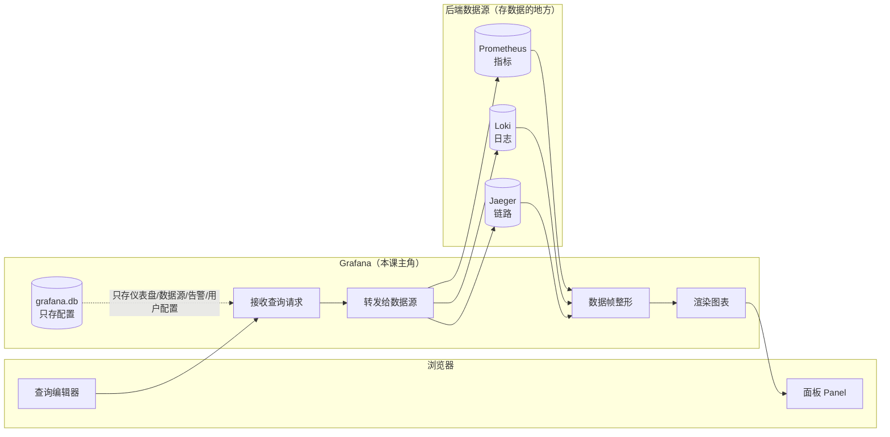
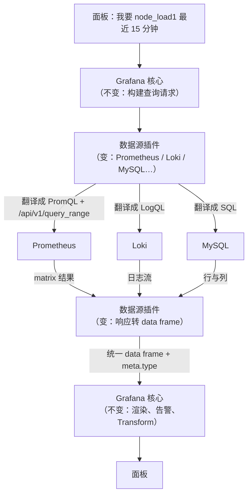
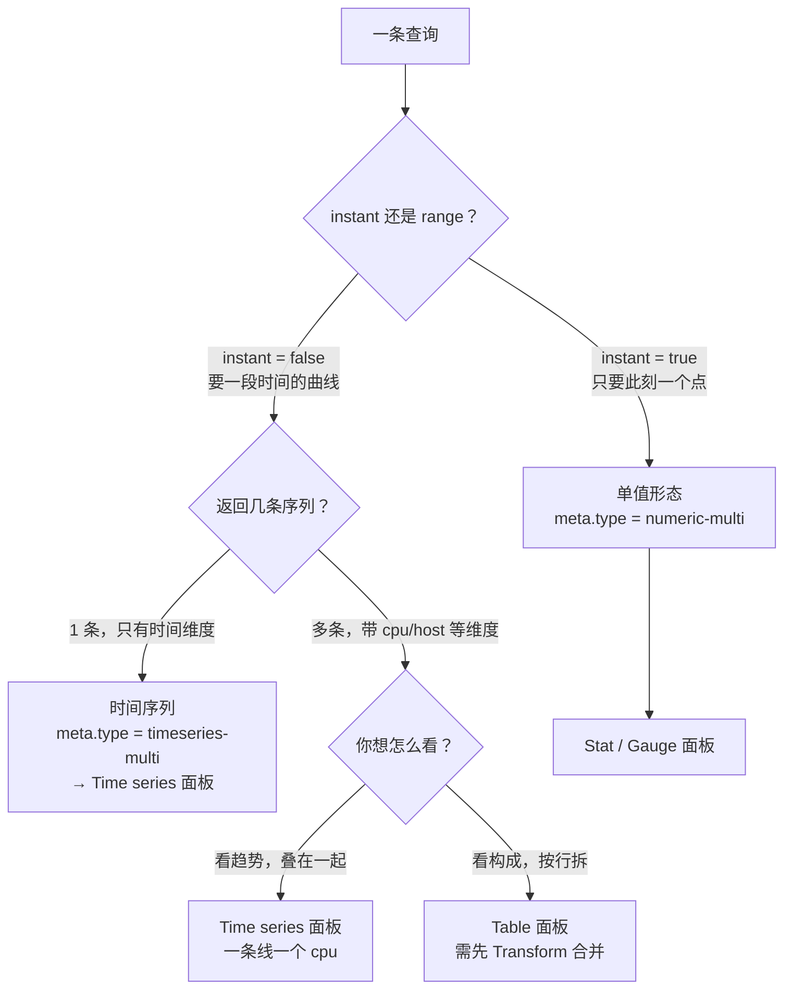

# 第 1 课：Grafana 是谁：一个不存数据的看图工具

> 所属阶段：阶段 1《看得见》｜ 水平：入门 ｜ 本课知识点：Grafana 的定位、数据源插件模型、面板查询的三种数据形态
> 故事情节：主角登场——在动手之前，先搞清楚它到底站在整条链路的哪一段
>
> 实测环境：WSL Ubuntu 24.04.4 + Docker 29.4.1，Grafana 13.2.1、Prometheus v3.14.0、node-exporter v1.10.2（2026-09-04 真跑）

## 🎯 本课目标

- 说清 Grafana 与 Prometheus 各自负责哪一段，判断"数据查不出来"该查哪边
- 解释换一个后端时，Grafana 内部哪部分变了、哪部分没变
- 判断一条查询该用 Time series / Table / Stat 哪种面板呈现

## 知识点导航

| # | 知识点 | 关键点 | 状态 |
|---|--------|--------|------|
| 1.1 | Grafana 的定位：查询与展示层，不存数据 | 分工边界 / 数据库里存什么 / 失效场景 | ✅ 已完成 |
| 1.2 | 数据源插件模型：data plane 与 query 协议 | 插件替换了哪一段 / 统一数据帧 / 后端代理 | ✅ 已完成 |
| 1.3 | 面板查询的三种数据形态 | Time series / Table / Stat 的判据 | ✅ 已完成 |

---

## 第一幕：起源与场景引入

> 🏛️ **起源**：2013 年圣诞假期，瑞典工程师 **Torkel Ödegaard** 在 eBay 瑞典（一说 Orbitz）做微服务架构，用 Graphite 看指标、用 Kibana 3 看日志。Graphite 数据强但画图难——图表是静态 PNG，不能框选缩放；Kibana 3 交互漂亮但只认 Elasticsearch。他向 Kibana 团队提议支持其他数据源被拒，于是**直接 fork 了 Kibana 3 的代码**，2013-12-05 提交第一个 commit，**2014 年 1 月发布 Grafana 1.0**。（核查于 2026-09，来源：Grafana 官方博客《4 Years Of Grafana》、InfoWorld 2023 年报道、Wikipedia）
>
> ⚠️ **一处来源分歧**：关于 Ödegaard 当时的雇主，InfoWorld 记为"eBay Sweden"，Wikipedia 记为"Orbitz"，Grokipedia 记为"瑞典软件工程师"未提公司。**这一点不影响本课结论**，但按证据纪律如实标注分歧，不替来源做选择。

**场景**：假设你是某团队的运维。凌晨两点，报警电话响了——订单服务 P99 延迟从 50ms 涨到 3 秒。

你爬起来打开电脑，开始了一场熟悉的"三屏马拉松"：

1. 打开 Prometheus 的 Graph 页面，找 `http_request_duration_seconds` 的曲线——确认了，延迟确实涨了
2. 切到日志平台，把时间范围手动调到刚才那个区间，翻 error 日志
3. 再切到链路系统，把同一个时间窗再输一遍，找到慢在哪一跳

三套系统，三个时间选择器，三次手工对齐时间戳。**最要命的是第 2 步和第 3 步**——你在 Prometheus 里看到的"10:23:15 开始涨"，到了日志平台可能是"10:23:1x"，因为两个系统的时钟有偏差、时区显示不同、时间粒度不同。你得靠肉眼对齐。

> 🎬 **场景**：一次故障排查，三个控制台，三次手工对齐时间戳

这就是本课主角要解决的冲突。

---

## 第二幕：认知冲突

你可能会想：那我**再建一个系统**，把指标、日志、链路的数据全都收进来，统一存、统一查、统一展示——不就一劳永逸了吗？

这条路有人走过，而且走得很重：

- 你要有足够的存储，装下三份数据
- 你要解决三份数据的**时间对齐**问题——指标是 15 秒一个点，日志是事件流，链路是请求级的，粒度完全不同
- 你要保证这个新系统的可用性——它一挂，你的可观测性全瞎
- 最麻烦的是：**数据已经在别处了**。指标已经在 Prometheus、日志已经在 ES、链路已经在 Jaeger，把它们再搬一遍，是巨大的工程浪费

那还有别的路吗？

> ❓ **问题**：能不能**不搬数据**，只把三个系统的"查询能力"拉平，让它们看起来像同一个系统？

Grafana 的答案，就是这个思路。而它做的第一件事，也是最反直觉的一件事是——**它什么数据都不存**。

---

## 第三幕：层层揭示

### 知识点 1.1：Grafana 的定位——查询与展示层，不存数据

> 本知识点关键点：分工边界 / 数据库里存什么 / 失效场景

#### 一句话定义

Grafana 是一个**查询与展示层**：它把你的查询请求转发给后端数据源，把返回的结果画成图表，自己**不存储任何时序数据**。

#### 直觉建立（类比）

把监控系统想成一家餐厅：

- **Prometheus / Loki / Jaeger 是后厨**——真正做菜（存数据、算数据）的地方
- **Grafana 是前厅的服务员 + 菜单**——你点菜（写查询），服务员把单子送到后厨，后厨做好了端回来，服务员摆盘（画图）端给你

关键点是：**服务员不做菜，也不囤菜**。你点一份宫保鸡丁，服务员不会自己炒，也不会提前炒好一百份放着。他只是把你的需求传过去，把结果端回来，摆得好看一点。

> 💡 **类比的边界**：这个类比在**缓存**这一点上会失效。真实餐厅里，服务员可能会记下"这道菜客人都喜欢"；而 Grafana 默认情况下**不会缓存查询结果**——你刷新一次，它就重新问一次后端。Grafana 确实有查询缓存机制，但那是需要显式配置的能力，不是默认行为。**Grafana 的"不存"，指的是不存业务数据（时序样本），配置数据它是存的**（下面马上会看到）。

#### 核心原理

"不存数据"这句话需要说精确。Grafana 有一个自己的数据库（默认 SQLite），但里面存的不是时序样本，而是**"怎么展示"的配置信息**。

**这条结论不是我说的，是实测出来的。** 我把容器里的 `grafana.db` 拷出来，直接用 Python 读了它的表清单：

```
共 92 张表：
  [仪表盘/面板] 5 张：dashboard, dashboard_provisioning, dashboard_tag, dashboard_version, folder
  [数据源/告警] 7 张：alert, alert_configuration, alert_instance, alert_notification,
                     alert_rule, alert_rule_version, data_source
  [用户/权限]   9 张：api_key, org, org_user, permission, role, team, team_member,
                     user, user_role
  [注解/其他]   9 张：annotation, annotation_tag, library_element, login_attempt,
                     migration_log, query_history, server_lock, session, tag
  [其余]       62 张：alert_configuration_history, alert_image, cache_data, ...

  >> 时序存储特征表名命中：无（0 张）
  >> 结论：Grafana 自带的 SQLite 里没有时序样本表

     dashboard: 0 行
     data_source: 1 行
     alert_rule: 0 行
     user: 1 行
     org: 1 行
```

92 张表，按名字搜索 `sample|chunk|block|series|metric|tsdb|wal|index` 这些时序库特征词，**零命中**。它存的全是：哪几个仪表盘、每个仪表盘有哪些面板、接了哪些数据源、有哪些用户、告警规则怎么配。

顺带一提，一个新装的 Grafana，`grafana.db` 只有 **1.5 MB**。而同样这台机器上跑了没多久的 Prometheus，数据量早就是这个量级的几十倍。

**分工边界图**：



#### 示例演示

最直接的验证方式：**把 Grafana 删了，数据还在吗？**

```bash
# 1. 先确认 Prometheus 里有数据
curl -s 'http://localhost:9201/api/v1/query?query=up' | head -c 200
# 预期输出：{"status":"success","data":{"resultType":"vector","result":[...]}}

# 2. 把 Grafana 容器整个删掉（危险操作示意，别在生产上跑）
docker rm -f grafana-lab

# 3. 再问一次 Prometheus —— 数据一条不少
curl -s 'http://localhost:9201/api/v1/query?query=up' | head -c 200
```

反过来做一次：删掉 Prometheus，Grafana 还在，但每个面板都会变成红色报错。**数据在后厨，不在服务员手里**。

#### 常见误区

**误区 1：以为 Grafana 挂了会丢监控数据。**

不会。Grafana 挂了，影响的是"看不了、告警不响"，时序数据一分不丢。这两件事的严重等级完全不同——前者是"暂时瞎了"，后者才是"数据没了"。

**这个区分直接决定应急顺序**：Grafana 挂了先恢复它（因为你看不见），但不用急着抢救数据；Prometheus 挂了才需要真正担心数据。

**误区 2：以为面板上能看到的时间范围，受限于 Grafana 存了多久。**

不对。你能查多久，**取决于后端数据源的保留期**（Prometheus 的 `--storage.tsdb.retention.time`），跟 Grafana 一点关系没有。Grafana 只是把你的时间范围原样传给后端。

**误区 3：以为"Grafana 什么数据都不存"，连仪表盘配置也不存。**

错，这条我一开始就差点说错。它**存配置**——仪表盘、数据源、告警规则、用户都在 `grafana.db` 里。所以**备份 Grafana 备份的是配置，不是数据**。这个区分在课 12 讲升级与备份时会再回来。

#### 一句话记住

**Grafana 是服务员不是后厨——它不存菜（时序数据），只存菜单（仪表盘配置）；后厨关门它只是没菜上，后厨着火才是真没了。**

📚 官方文档：[Grafana 是什么](https://grafana.com/docs/grafana/latest/introduction/)

---

### 知识点 1.2：数据源插件模型——data plane 与 query 协议

> 本知识点关键点：插件替换了哪一段 / 统一数据帧 / 后端代理

#### 一句话定义

数据源插件（Data source plugin）是一段**翻译器**：它把 Grafana 的统一查询请求翻译成某个后端能懂的协议，再把后端的响应翻译成 Grafana 的统一数据结构**数据帧（data frame）**。

#### 直觉建立（类比）

想象你在一家跨国公司的前台，要给不同国家的分公司打电话：

- 给日本分公司，要说日语
- 给德国分公司，要说德语
- 给巴西分公司，要说葡萄牙语

你不可能学会所有语言。于是公司给每个国家配了一个**专属翻译**，你只需要说中文，翻译负责把你的话转过去、把对方的回答转回来。

数据源插件就是这些翻译。**Grafana 核心只会说"数据帧"这一种语言**，Prometheus 插件负责把它翻译成 PromQL，Loki 插件负责翻译成 LogQL，MySQL 插件负责翻译成 SQL。

> 💡 **类比的边界**：真实翻译是"双方语言不变，中间加个人"。而数据源插件还有一件翻译做不到的事——**它可以改写你要表达的内容**。比如 Prometheus 插件会悄悄给你的查询加上步长计算（下面实测会看到 `calculatedMinStep`）。所以插件不只是翻译，它还是个"会自作主张的翻译"。**这个"自作主张"正是后面很多查询行为对不上的根源**，课 4 会专门讲。

#### 核心原理

统一的数据结构叫 **data frame**（数据帧），它是一张**面向列的表**：

- 每一列是一个 field（字段），有自己的名字、类型、可选的单位
- 每个字段可以挂 **labels**（键值对标签），这正是它能装下 Prometheus 那种"指标名 + N 个标签"结构的原因
- 帧本身带 **meta**，其中 `meta.type` 声明这帧数据的"类型"

Grafana 把这套类型体系叫 **data plane**（数据平面）。官方的说法很精辟：**data plane 之于 data frame，就像 TypeScript 之于 JavaScript**——它给本来无类型的数据结构加了一层类型标注。

**下面是本机实测的证据。** 我用同一条表达式 `node_load1`，只改 `instant` 一个参数，看 Grafana 返回什么：

```bash
cd /mnt/d/projects/learning/grafana/playground && python3 l01-forms.py
```

```
=========== 形态 A：单值（instant=True → Stat 面板）===========
  表达式：node_load1
  HTTP=200  耗时=0.006s
  frame 数量：1
  frame[0] meta.type=numeric-multi  typeVersion=[0, 1]
  frame[0] custom.resultType=vector  calculatedMinStep=20000
      字段 'Time' type=time 标签={} 值=[]
      字段 'node_load1' type=number 标签={'__name__': 'node_load1',
            'instance': 'grafana-node:9100', 'job': 'node'}

=========== 形态 B：时间序列（instant=False → Time series）===========
  表达式：node_load1
  HTTP=200  耗时=0.004s
  frame 数量：1
  frame[0] meta.type=timeseries-multi  typeVersion=[0, 1]
  frame[0] custom.resultType=matrix  calculatedMinStep=20000
```

注意看两件事：

1. **`meta.type` 变了**：`numeric-multi` ↔ `timeseries-multi`。这就是 data plane 在起作用——同一条 PromQL，因为查询形态不同，插件给帧打上了不同的**类型标签**，面板据此决定怎么画。
2. **`custom.calculatedMinStep=20000`**：这是插件"自作主张"加的。我传的 `intervalMs` 是 15000，但 Prometheus 插件算出来实际步长是 20000 毫秒。它结合了你的时间范围、`maxDataPoints` 和 Prometheus 的合理步长，自己做了决定。

**插件替换的到底是哪一段？**



**变了的是插件那一层，不变的是它上下游**。正因为下游（渲染、告警、Transformations）只认 data frame 不认后端，所以：

- 换后端不用改面板逻辑
- 同一套告警规则可以作用在时序数据上，也可以作用在 SQL 查询结果上

这就是 Grafana 的"大帐篷"（big tent）哲学——不绑定任何单一数据源。

#### 示例演示

看看同一个 Grafana 实例上，不同类型数据源返回的东西在**结构上是一样的**：

```bash
# 查一下本机这个 Grafana 都支持哪些数据源类型
curl -s -u admin:admin 'http://localhost:3001/api/datasources' | head -c 300

# 再看插件清单（13.2.1 自带 + 首次启动联网装的五个）
docker logs grafana-lab 2>&1 | grep 'Plugin registered' | tail -8
```

实测输出（节选）：

```
logger=plugins.registration ... Plugin registered pluginId=grafana-metricsdrilldown-app
logger=plugins.registration ... Plugin registered pluginId=grafana-exploretraces-app
logger=plugins.registration ... Plugin registered pluginId=grafana-pyroscope-app
logger=plugins.registration ... Plugin registered pluginId=grafana-advisor-app
logger=plugins.registration ... Plugin registered pluginId=grafana-lokiexplore-app
```

⚠️ **这里有个真实体验坑**：Grafana 13.2.1 **首次启动会联网下载五个插件**，耗时约 60 秒。这段时间内 `/api/health` 可能还没就绪。我第一版环境脚本的等待循环只给了 60 秒，结果误判成"Grafana 没起来"——**实际上它只是还在装插件**。

#### 常见误区

**误区 1：以为装了 Grafana 就等于能连所有数据源。**

不对。Grafana 自带的是核心数据源（Prometheus、Loki、MySQL、Postgres…），而且**不是所有数据源都实现了 data plane**。官方列出截至 2025 年 10 月支持 data plane 的数据源包括 Prometheus、Loki、Azure Monitor、BigQuery、ClickHouse、InfluxDB、MySQL、Oracle、Postgres、Snowflake、VictoriaMetrics 等（核查于 2026-09）。没实现的，Grafana 就只能靠"猜"这帧数据是什么类型——这正是 data plane 文档里说的"错误消息会变得与用户操作看似无关"。

**误区 2：以为换数据源只是改个 URL。**

大错。换数据源 = **换查询语言**。Prometheus 用 PromQL，Loki 用 LogQL，MySQL 用 SQL。URL 只是地址，查询逻辑全得重写。Grafana 拉平的是"结果怎么表示"，不是"查询怎么写"。

**误区 3：把 `access` 模式（proxy vs direct）当成无关紧要的选项。**

这个坑很实在：
- **Server（proxy）**：请求从 **Grafana 后端**发出去。后端地址写容器内网地址就行（如 `http://grafana-prom:9090`），浏览器不需要能访问它
- **Browser（direct）**：请求从**你的浏览器**直接发。浏览器必须能直连那个地址，而且会撞 CORS

本课实验用的是 `access=proxy`，所以数据源 URL 可以写容器名 `grafana-prom`——**这个地址在你的 Windows 浏览器里是解析不了的，但因为请求是从 Grafana 容器发出的，完全没问题**。课 2 会展开讲这个差别。

#### 一句话记住

**插件是翻译官：Grafana 只说 data frame 一种语言，换后端就是换翻译——上游怎么问、下游怎么画都不用改，只有中间的翻译要换。**

📚 官方文档：[Grafana 数据结构简介](https://grafana.com/developers/dataplane) ｜ [Data Plane Contract 技术规范](https://grafana.com/developers/dataplane/contract-spec)

---

### 知识点 1.3：面板查询的三种数据形态

> 本知识点关键点：Time series / Table / Stat 的判据

#### 一句话定义

同一条查询，因为**查询形态**（instant / range）与**返回的维度数**不同，会产出三种典型数据形态：**单值**、**时间序列**、**表格**。选错面板类型，图就会显示不出来或者显示得很怪。

#### 直觉建立（类比）

想象你要汇报"公司今年的营收"：

- **单值**："今年营收 1.2 亿" —— 一个数字，看一眼就知道好不好
- **时间序列**："1 月 800 万，2 月 950 万，3 月 1100 万……" —— 一串随时间变化的点，看趋势
- **表格**："华东 3200 万、华南 2800 万、华北 2400 万……" —— 按维度拆开的清单，看构成

**同一份数据，三种讲法，服务于三个不同的问题**：现在好不好？怎么变的？谁贡献的？

> 💡 **类比的边界**：真实报表里，你可以同时给一张带趋势的总表。但在 Grafana 里，**一个面板只能选一种可视化类型**——你想同时看趋势和构成，得放两个面板，或者用 Transformations 把数据捏成另一种形态（课 5 的主题）。Grafana 不会替你"一图两用"。

#### 核心原理

判据非常朴素，就两条：

| 判据 | 说明 | 对应形态 |
|---|---|---|
| **查询是 instant 还是 range** | instant = 只要"此刻一个点"；range = 要"一段时间内的曲线" | 单值 / 时间序列 |
| **返回几条序列、有没有非时间维度** | 只有时间维度 = 曲线；有主机/CPU/地区等维度 = 需要按行拆 | 时间序列 / 表格 |

**实测证据**：我拿 `node_cpu_seconds_total` 做了实验，这台机器有 20 个 CPU 核心：

```
=========== 形态 C：多条时间序列（按 cpu 分组）===========
  表达式：rate(node_cpu_seconds_total{mode="idle"}[2m])
  HTTP=200  耗时=0.006s
  frame 数量：20          ← 注意这里！
  frame[0] meta.type=timeseries-multi
      字段 'Time' type=time
      字段 'Value' type=number 标签={'cpu': '0', 'instance': 'grafana-node:9100',
                                    'job': 'node', 'mode': 'idle'}
  frame[1] ... 标签={'cpu': '1', ...}
  frame[2] ... 标签={'cpu': '10', ...}
  ...（共 20 个 frame，仅展示前 3 个）
```

**关键发现**：20 个 CPU，返回的是 **20 个独立的 data frame**，不是一张 20 列的宽表。

这个细节很重要，它解释了一个你迟早会遇到的现象：**如果你把这种查询塞进一个 Table 面板，你会得到 20 张表（或者一张拼接得很奇怪的表），而不是你想要的"一行一个 CPU"**。想要后者，需要课 5 要讲的 Transformations 来合并。

**三种形态的判据图**：



#### 示例演示

**实验：同一条 `node_load1`，两种形态，看 frame 差异（本机实跑）**

```bash
cd /mnt/d/projects/learning/grafana/playground && python3 l01-forms.py
```

关键输出对照：

| 查询参数 | `meta.type` | `custom.resultType` | frame 数 | 该配什么面板 |
|---|---|---|---|---|
| `instant=true` | `numeric-multi` | `vector` | 1 | Stat / Gauge（单值） |
| `instant=false` | `timeseries-multi` | `matrix` | 1 | Time series（曲线） |
| `instant=false` + 多维度 | `timeseries-multi` | `matrix` | 20 | Time series（多线）或 Table（需 Transform） |

**再做一次"绕过 Grafana"的对照**，看同样的查询 Prometheus 自己返回什么：

```
=========== 对照：绕过 Grafana 直接问 Prometheus ===========
  instant: resultType=vector 条数=1
    value=[1788508708.228, '2.73']  metric={'__name__': 'node_load1', ...}
  range:   resultType=matrix 条数=1
    样本点数=3  前3个=[[1788508588, '2.41'], [1788508648, '2.52'], [1788508708, '2.73']]
```

**这个对照说明了什么？** Prometheus 返回 `vector`/`matrix`，Grafana 的 `custom.resultType` 也是 `vector`/`matrix`——**结果的数据形态是后端决定的，Grafana 只是原样搬运，再加一层 `meta.type` 类型标注**。

⚠️ **注意 `range` 只返回 3 个样本点**：查询范围是 `now-15m`、步长 60 秒，理论该有 15 个点，但**这台 Prometheus 刚启动 3 分钟，更早的数据还没有**。

这是**实验环境的瞬时状态，不是配置错误**。你在自己机器上跑，会得到两种结果之一：
- 若 Prometheus 也刚启动 → 样本点很少（我这次就是 3 个）
- 若已运行超过 15 分钟 → 会看到完整 15 个点

**判据**：直接查 `count_over_time(node_load1[15m])`，返回的数字就是当前窗口内的实际样本数。别看到点少就以为配错了。

#### 常见误区

**误区 1：面板空白就改面板类型。**

最常见的错误反应。正确的排查顺序是**先看数据到没到**：
1. 同一个查询丢到 **Explore** 里跑，看有没有数据
2. 有数据 → 是面板配置问题（类型选错 / 单位不对 / 阈值把线盖住了）
3. 没数据 → 是查询或数据源问题，改面板类型没用

**误区 2：以为 Time series 面板只能画一条线。**

Time series 面板能画任意多条线，只要返回的 frame 是 `timeseries-multi`。上面形态 C 的 20 个 frame，丢进 Time series 面板就是 20 条线（虽然会很挤）。

**误区 3：用 Table 面板显示多序列数据，期待它自动变成"一行一个维度"。**

不会。前面实测已经看到，多序列返回的是**多个 frame**，Table 面板不会自动帮你合并成一张表。这正是课 5 Transformations 要解决的问题——**先记住这个困惑，课 5 会回来还债**。

#### 一句话记住

**看趋势用 Time series（range）、看现状用 Stat（instant）、看构成用 Table（但要先 Transform 把多个 frame 并起来）。**

---

## 第四幕：实操验证

回扣第一幕的场景：三套系统、三次手工对齐时间戳。现在我们用本课学到的东西，验证 Grafana 的"拉平"能力到底体现在哪。

**实验：一次查询，看 Grafana 内部发生了什么**

```bash
# 完整脚本：grafana/playground/l01-forms.py
cd /mnt/d/projects/learning/grafana/playground && python3 l01-forms.py
```

这个脚本做了四件事，全部真跑通过：

1. **健康检查**：确认 Grafana 13.2.1 与 Prometheus 都活着
2. **登录**：用 `user`（不是 `username`）字段拿 Cookie
3. **建数据源**：连到 `http://grafana-prom:9090`，`access=proxy`
4. **三种形态对照**：同一条表达式跑 instant / range / 多维度，比较返回的 frame

**我们从中确认了三件关于"拉平"的事**：

| 观察点 | 证据 | 说明 |
|---|---|---|
| Grafana 不存时序数据 | `grafana.db` 92 张表，时序特征表 0 张 | 数据在后端 |
| 结果形态由后端决定 | Prometheus 返 `vector`/`matrix`，Grafana `resultType` 同值 | Grafana 只搬运 |
| Grafana 加了类型标注 | frame 上多了 `meta.type=numeric-multi` / `timeseries-multi` | 这就是它"拉平"的手段 |

**回到那个凌晨两点的场景**：Grafana 的"拉平"不是把三份数据搬到一起，而是——**让三份数据用同一套结构（data frame）表达，再用同一个时间选择器驱动**。

这个"同一个时间选择器"，就是阶段 1 课 3 要埋的伏笔，也是阶段 3 课 9 三级下钻能成立的**前提**。

⚠️ **本幕的操作注意**

- `docker rm -f grafana-lab` 是**危险操作**，只在你自己的实验环境做。它会删掉容器以及容器内 `grafana.db` 里的**全部仪表盘配置**（因为没挂卷）
- 想在删除后保住配置，启动时挂一个卷：`-v grafana-data:/var/lib/grafana`
- Grafana 13.2.1 首次启动会联网装插件约 60 秒，`/api/health` 在此期间可能未就绪

---

## 第五幕：体系收束

### 本课在全局中的位置


你现在站在整条路径的**第一个格子**。

### 你现在会了什么

- 能说清 **Grafana 存什么、不存什么**——存配置（92 张表全是配置），不存时序样本（0 张时序表）
- 能解释 **插件替换了哪一段**——上游问法与下游画法不变，只换中间翻译
- 能判断 **一条查询该配什么面板**——instant → Stat，range → Time series，按维度拆 → Table（需 Transform）

### 三个悬念，留给后面的课

1. **多个 frame 怎么变成一张表？** → 课 5 Transformations
2. **面板报错为什么看不懂后端发生了什么？** → 课 4（剧透：HTTP 400 的 body 里藏着 `status: 502`）
3. **同一个时间选择器怎么做三级下钻？** → 课 3 埋伏笔，课 9 收束

### 下一课预告

课 2《第一个面板：从零到看得见》——把今天的概念变成屏幕上的真实曲线。你会亲手：

- 起一个 Grafana 容器并用 `/api/health` 验证就绪
- 加一个 Prometheus 数据源，理解 `access=proxy` 为什么能填内网地址
- 建第一个带单位的 CPU 面板

---

## 🐞 本课常见误区速查

| # | 误区 | 正解 |
|---|------|------|
| 1 | Grafana 挂了会丢监控数据 | 不会。它只存配置，时序数据在后端 |
| 2 | 能查多久取决于 Grafana 保留期 | 取决于后端数据源的 retention |
| 3 | Grafana 什么数据都不存 | 存配置：仪表盘 / 数据源 / 告警 / 用户 |
| 4 | 装了 Grafana 就能连所有数据源 | 需要对应插件，且并非所有插件都实现 data plane |
| 5 | 换数据源只是改个 URL | 换的是查询语言：PromQL / LogQL / SQL |
| 6 | 面板空白就改面板类型 | 先在 Explore 验证有没有数据 |
| 7 | Time series 只能画一条线 | 能画多条，只要返回 `timeseries-multi` |
| 8 | Table 面板会自动合并多序列 | 不会，多个 frame 需 Transform 合并 |

## 📚 官方文档

- [Grafana 是什么](https://grafana.com/docs/grafana/latest/introduction/)
- [Grafana 数据结构简介（data frame / data plane）](https://grafana.com/developers/dataplane)
- [Data Plane Contract 技术规范](https://grafana.com/developers/dataplane/contract-spec)
- [数据源插件开发](https://grafana.com/tutorials/build-a-data-source-plugin/)

---

## 📌 本课速览

1. **Grafana 是查询与展示层，不存时序数据**——实测 `grafana.db` 92 张表全是配置，时序特征表 0 张，新装实例仅 1.5 MB
2. **它存的是"怎么展示"**——仪表盘、数据源、告警规则、用户；所以备份 Grafana 备份的是配置
3. **数据源插件是翻译官**——Grafana 只说 data frame 一种语言，换后端只换翻译，上游问法与下游画法不变
4. **data plane 是类型标注层**——`meta.type` 声明帧类型，让渲染/告警/Transform 不必猜
5. **结果形态由后端决定**——Prometheus 返 `vector`/`matrix`，Grafana `resultType` 同值，只额外加类型标注
6. **三种形态判据**：instant → 单值（Stat）；range → 时间序列（Time series）；按维度拆 → 表格（Table，需 Transform）
7. **多序列返回的是多个 frame 而非一张宽表**——20 核 CPU 返回 20 个 frame，这是 Table 面板"不听话"的根源
8. **插件会自作主张**——实测传 `intervalMs=15000`，Prometheus 插件算出的 `calculatedMinStep=20000`
9. **13.2.1 首次启动会联网装五个插件约 60 秒**——此时 `/api/health` 可能未就绪，等待逻辑要给足时间
10. **三个悬念留待后续**：多 frame 合并（课 5）、报错看不懂（课 4）、时间选择器下钻（课 3 埋、课 9 收）

## 🧭 课程导航

| 上一课 | 本课 | 下一课 |
|--------|------|--------|
| —（阶段 1 第一课） | ✅ 课 1《Grafana 是谁》 | [课 2《第一个面板：从零到看得见》](lesson-02-第一个面板：从零到看得见.md) |

[课程目录](../../../02-课程目录.md) ｜ [阶段 1 概览](../overview.md) ｜ [学习路径总览](../../../01-学习路径总览.md)

## 🚀 下一批接力提示词

> 学完本课后，**复制下面这段文字发给 AI**，即可无缝进入下一批（无需重新描述上下文）：

```
继续学 Grafana。我的学习档案在 grafana/00-学习档案.md，
刚学完阶段 1《看得见》的课 1《Grafana 是谁：一个不存数据的看图工具》
知识点 1.1（定位：不存数据）、1.2（数据源插件模型与 data plane）、1.3（三种数据形态），
请按大纲继续讲解课 2《第一个面板：从零到看得见》的知识点
2.1（安装与初始化）、2.2（加第一个 Prometheus 数据源）、2.3（第一个 Panel）。
```
