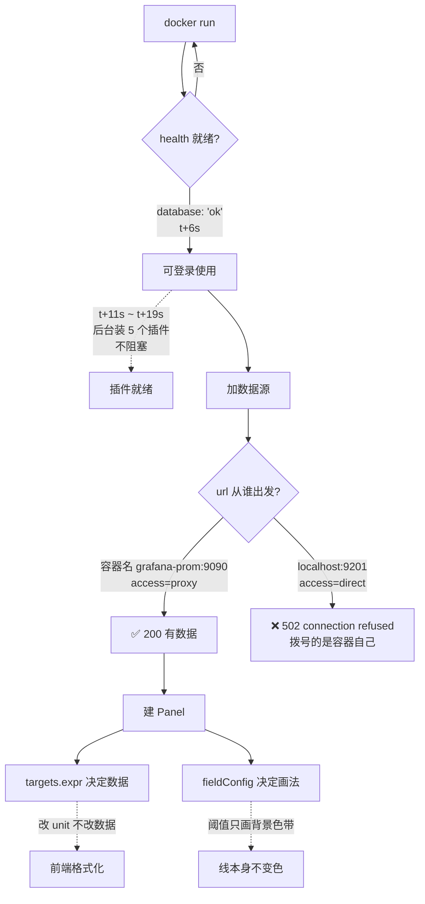

# 第 2 课：第一个面板：从零到看得见

> 所属阶段：阶段 1《看得见》｜ 水平：入门 ｜ 本课知识点：安装与初始化、加第一个数据源、第一个 Panel
> 故事情节：主角第一次站起来——容器跑起来、数据源连上、屏幕上出现第一条真实曲线

## 🎯 本课目标

- 用一条 docker run 起 Grafana，并用 `/api/health` 验证就绪
- 加一个 Prometheus 数据源，并说清 Server(proxy) 与 Browser(direct) 两种访问模式的差别
- 从零建一个带单位的 CPU 使用率图，并解释阈值颜色的生效条件

## 知识点导航

| # | 知识点 | 关键点 | 状态 |
|---|--------|--------|------|
| 2.1 | 安装与初始化：容器启动、管理员口令、health 接口 | 启动参数 / 默认口令与改密 / health 判据 | ✅ 已完成 |
| 2.2 | 加第一个 Prometheus 数据源并验证连通 | 两种 access 模式 / Save & test 的真实含义 / 常见连通失败 | ✅ 已完成 |
| 2.3 | 第一个 Panel：查询、图例、单位、阈值 | 查询写法 / 单位与量纲 / 阈值生效条件 | ✅ 已完成 |

---

## 第一幕：起源——为什么"跑起来"这件事值得单独学一课

上一课我们确认了一件事：Grafana 不存数据，它只负责问和画。

这听起来像是个好消息——既然不存数据，那它应该很轻，起个容器就能用。

确实如此。但"能起来"和"能放心用"之间，隔着三道坎：

**第一道坎：起来了吗？**
你敲下 `docker run`，终端返回一个容器 ID，然后呢？容器在跑，不代表服务在响应；端口在监听，也不代表监听的是它——我们在课 1 就吃过这个亏，9091 端口上跑的是 pushgateway，它对 `/-/ready` 同样返回 200。

**第二道坎：进得去吗？**
默认口令是 admin/admin，全世界都知道。你打算一直用着它，还是准备换掉？换掉之后，下次重建容器，口令还在吗？

**第三道坎：连得上吗？**
容器起来了，你登录进去了，然后在"加数据源"这一步卡住——填了 URL，点 Save & test，转了两秒，弹出一行红字。这时候你会问自己：是我的 Prometheus 没起来，还是 Grafana 找不到它，还是我地址写错了？

这三道坎，任何一道过不去，你都看不到第一条曲线。

而更麻烦的是：这三道坎的**报错长得很像**。都是"连不上"，但根因完全不同。这一课的目标，就是让你在看到报错的那一刻，能立刻判断是"没起来"、"进不去"还是"连不上"。

---

## 第二幕：认知冲突——"我把容器跑起来了，为什么还是连不上"

让我们先看一个真实的失败。

假设你按教程敲了这条命令：

```bash
docker run -d --name my-grafana -p 3000:3000 grafana/grafana:13.2.1
```

容器起来了。你打开浏览器访问 `http://localhost:3000`，登录页出现了。你用 admin/admin 登录，成功了。

然后你加数据源，在 URL 那一栏填：

```
http://localhost:9201
```

点 **Save & test**。

红色错误：

```
Post "http://localhost:9201/api/v1/query": dial tcp [::1]:9201: connect: connection refused
```

你会怎么想？

大部分人的第一反应是："我的 Prometheus 没起来吧。"

然后你去验证：`curl http://localhost:9201/api/v1/query?query=up`——
返回 `{"status":"success",...}`。

**Prometheus 明明好好的。**

那就奇怪了：从我的电脑上能访问，从 Grafana 里访问就 connection refused？

（停一停，先自己想一想。这是容器时代最经典的一类困惑，想明白它，后面几十个类似问题都会自动解开。）

答案藏在 **`localhost` 这个词指的是谁** 里面。

你在宿主机上执行 `curl localhost:9201`，`localhost` 指的是**你的电脑**。Docker 把容器的 9090 端口映射到了宿主机的 9201，所以你能连上。

但 Grafana 运行在**容器内部**。当 Grafana 的代码去连接 `localhost:9201` 时，它连接的是 **Grafana 容器自己**——而 Grafana 容器里根本没有监听 9201 的东西（它只监听自己的 3000）。

于是报错里那句 `dial tcp [::1]:9201` 的意思是：Grafana 试图连接 IPv6 回环地址 `[::1]` 的 9201 端口，被拒绝了。

**同一个词 `localhost`，在宿主机和容器里，指的是两台不同的机器。**

这就是本课要解决的核心认知：**Grafana 是一个独立进程，它有自己的网络视角。你填在配置里的每一个地址，都是"从 Grafana 出发"能到达的地址，不是"从你的浏览器出发"能到达的地址。**

这个认知，会一直贯穿到课 9（Loki 数据源）、课 10（Provisioning）、课 12（高可用部署）。

---

## 第三幕：层层揭示

### 知识点 2.1：安装与初始化——容器启动、管理员口令、health 接口

#### 一句话定义

Grafana 的初始化 = 让一个无状态镜像变成有状态服务的过程，它要做的三件事是：建库（迁移表结构）、定身份（管理员账号）、准备插件。

#### 直觉建立

把 Grafana 想象成**一家新开的门店**：

- `docker run` = 租下店面
- 数据库迁移（migration）= 装修、装货架——**只做一次，之后每次开业都跳过**
- 管理员账号 = 店长的钥匙
- 插件 = 进货

门店装修完、钥匙配好，就可以开门营业了。**进货（插件）可以在营业之后慢慢补**，不影响开门。

这个类比不是随便编的，它是有实测支撑的——我们在本课做了一个专门的时序实验（见第四幕实验 B），结论是：

```
t+0s   容器启动
t+6s   /api/health 返回 database:ok   ← 此时已经可以登录使用
t+11s  第 1 个插件装完
t+19s  第 5 个插件装完
```

**health 就绪（6 秒）比插件装完（19 秒）早了 13 秒。**

> ⚠️ **类比的失效边界**：门店装修只做一次，但容器**默认不保存装修成果**。你 `docker rm` 掉容器再重建，它会重新装修一遍，钥匙也重新配。这意味着你建的数据源、dashboard 全部消失。
> 想让装修成果留下来，必须"买房"而不是"租房"——挂载一个数据卷到 `/var/lib/grafana`。这一点在第四幕实验 C/D 有对照实测。

#### 核心原理

**1）启动：一条命令里的三个关键参数**

```bash
docker run -d \
  --name grafana-lab \
  --network grafana-net \
  -p 3001:3000 \
  -v gf-data:/var/lib/grafana \
  -e GF_SECURITY_ADMIN_PASSWORD='lab-pass-2026' \
  grafana/grafana:13.2.1
```

| 参数 | 作用 | 不写会怎样 |
|---|---|---|
| `--network grafana-net` | 加入自定义网络，之后可用**容器名**互访 | 只能用 IP，容器重启后 IP 会变 |
| `-p 3001:3000` | 宿主 3001 → 容器 3000 | 宿主机访问不到 |
| `-v ...:/var/lib/grafana` | 持久化配置与数据库 | 容器删除即配置全丢 |
| `-e GF_SECURITY_ADMIN_PASSWORD` | 指定管理员口令 | 用默认 admin/admin |

关于 `--network`：这是**解决第二幕那个 `localhost` 问题的正解**。加入同一个自定义网络后，Grafana 里填 `http://grafana-prom:9090`（容器名:容器内端口）就能访问 Prometheus——因为 Docker 的内置 DNS 会把容器名解析成容器 IP。

**2）口令：默认 vs 环境变量 vs 首次登录**

- **默认**：admin / admin
- **环境变量**：`GF_SECURITY_ADMIN_PASSWORD=<新口令>`
- **首次登录**：Grafana 13.x **不会强制**你改密码。实测（第四幕实验 A）显示，用 admin/admin 登录后，`/api/user` 返回的字段里没有任何"要求改密"的标志位，frontend settings 里 `basicAuthStrongPasswordPolicy` 也是 `false`。

这一点和很多人的印象不同——**老版本 Grafana 会在首次登录时弹窗要求改密码，13.2.1 不会**。所以"用默认口令"这件事，系统不会拦你，只能靠你自己拦自己。

- **改密接口**（如果登录后想改）：
  ```bash
  curl -b cookie.txt -X PUT http://localhost:3001/api/user/password \
    -H 'Content-Type: application/json' \
    -d '{"oldPassword":"admin","newPassword":"新口令","confirmNew":"新口令"}'
  ```
  实测返回 `{"message":"User password changed"}`，HTTP 200。

- **环境变量是否真的生效？** 实测（第四幕实验 A）：用 `-e GF_SECURITY_ADMIN_PASSWORD='lab-pass-2026'` 启动后，
  - 用 `admin/admin` 登录 → **HTTP 401** `password-auth.failed`
  - 用 `lab-pass-2026` 登录 → **HTTP 200** `Logged in`

  环境变量**确实覆盖了默认口令**。

**3）就绪判据：`/api/health` 到底该看什么**

未登录时访问受保护接口，返回的是 401：

```bash
curl -s http://localhost:3001/api/datasources
# {"extra":null,"message":"Unauthorized","messageId":"auth.unauthorized","statusCode":401,...}
```

而 `/api/health` 是**不需要登录**的，返回：

```json
{
  "database": "ok",
  "version": "13.2.1",
  "commit": "56cd3e9288d8255fecebe5d05b48d191f50674b5"
}
```

真正的坑在这里——**这个 JSON 是带空格缩进的**。

如果你在 shell 里这样写就绪探测：

```bash
curl -s http://localhost:3001/api/health | grep -q '"database":"ok"'   # ❌ 永远匹配不上
```

它是**恒假**的。因为实际返回的是 `"database": "ok"`（冒号后有个空格），而你 grep 的是 `"database":"ok"`（紧凑写法）。

我在写本课的时候，就因为这个原因收到过一次"180 秒未就绪"的报错——但返回体里明明写着 `"database": "ok"`。当时的第一反应是"Grafana 启动慢"，差点又去调等待时长；实际是**判据本身是错的**。

> 💡 **这是本课第二个高价值教训**：Grafana 与 Prometheus 的 JSON 风格**不一致**。Prometheus API 返回紧凑 JSON（`"status":"success"`），Grafana `/api/health` 返回缩进 JSON（`"database": "ok"`）。
> 写探测脚本时，**两边要用不同的匹配串**。或者干脆用能解析 JSON 的工具（`jq` / `python3 -m json.tool`）而不是 `grep`。

推荐的健壮写法（两种都可以）：

```bash
# 写法一：匹配带空格的版本
curl -s http://localhost:3001/api/health | grep -q '"database": "ok"'

# 写法二（推荐）：先压平再匹配，两种风格通吃
curl -s http://localhost:3001/api/health | tr -d ' \n' | grep -q '"database":"ok"'
```

#### 示例演示

完整的环境起停脚本已落盘：[l00-env-up.sh](../../../playground/l00-env-up.sh)。

它一次起三个容器（Grafana + Prometheus + node-exporter），并且**对每一个组件都用"验证身份"而非"只看状态码"的判据**：

```bash
prom_ready() {
  [ "$(curl -s -o /dev/null -w '%{http_code}' "http://localhost:${PROM_PORT}/-/ready")" = "200" ] \
  && curl -s "http://localhost:${PROM_PORT}/api/v1/query?query=up" | grep -q '"status":"success"'
}
gf_ready() {
  curl -s "http://localhost:${GF_PORT}/api/health" | tr -d ' \n' | grep -q '"database":"ok"'
}
ne_ready() {
  curl -s "http://localhost:${NE_PORT}/metrics" | grep -q 'node_cpu_seconds_total'
}
```

注意 `prom_ready` 里的第二段：光看 `/-/ready` 返回 200 不够，还要确认 `/api/v1/query` 返回 `status=success`——**因为 pushgateway 对 `/-/ready` 也返回 200**（课 1 的教训）。

#### 常见误区

| ❌ 误区 | ✅ 正解 |
|---|---|
| 容器 `docker ps` 显示 Up 就等于服务可用 | 容器在跑 ≠ 服务在响应。要查 `/api/health`，且要验证返回内容 |
| 探测用 `grep '"database":"ok"'` 就行 | Grafana 返回的是**带空格**的 `"database": "ok"`，紧凑写法恒不匹配 |
| Grafana 13 首次登录会强制改密码 | 实测**不会**。`/api/user` 无强制标志，`basicAuthStrongPasswordPolicy=false` |
| 启动要等 60 秒（在装插件） | 实测 health **6 秒**就绪；插件在 health 之后才装，不影响可用性 |
| 不挂卷也能保留配置 | 实测：不挂卷重建容器，数据源**从 1 个变 0 个** |
| `GF_SECURITY_ADMIN_PASSWORD` 只是建议值 | 实测它是**强制覆盖**：设了之后 admin/admin 直接 401 |

#### 一句话记住

**容器起来了不算数，`/api/health` 里 `database: "ok"` 才算数——而且注意这个冒号后面有个空格。**

---

### 知识点 2.2：加第一个 Prometheus 数据源并验证连通

#### 一句话定义

数据源 = 一份"怎么访问后端"的连接配置，其中最关键的一个字段是 `access`，它决定了**请求由谁发出**。

#### 直觉建立

把数据源想象成**公司前台的一张通讯录**。

通讯录上记着"要找财务，拨分机 8080"。但还有第二列：**谁来拨这个号码**。

- **Server（proxy）模式** = 前台帮你拨。你只要跟前台说"帮我问财务"，前台拨号、转述问题、把答案带回来给你。
- **Browser（direct）模式** = 前台把号码给你，你自己拨。

区别在哪？

**Server 模式的两个好处**：
1. 分机号可以是**内部短号**（容器名 `grafana-prom`），外面的人不知道也没关系——因为拨号的是前台，前台在公司内部。
2. 如果拨这个分机需要**密码**，密码只留在前台手里，不会到你手上。

**Browser 模式**则是：你现在必须**自己能拨通**这个号。如果这是个内部短号，你人在公司外面，拨不通。

> ⚠️ **类比的失效边界（重要）**：
> 直觉上"Browser 模式 = 浏览器直连后端"，听起来浏览器应该绕过 Grafana 后端自己去发请求。**但实测不是这样。**
> 下面的实测会证明：即使用 direct 模式，Grafana **后端仍然会自己发起 HTTP 请求**（报错信息里写的是 Grafana 后端连不上）。
> 所以更准确的理解是：**direct 模式是"用浏览器视角的地址，但仍由 Grafana 后端转发"**，它不会让浏览器绕过 Grafana 去直连数据源。
> 这也是为什么 direct 模式在现代部署里用得越来越少——它既没省掉后端这一跳，又要求地址对浏览器可达，两头不讨好。

#### 核心原理

**1）建数据源：一个 API 调用**

```bash
curl -b cookie.txt -X POST http://localhost:3001/api/datasources \
  -H 'Content-Type: application/json' \
  -d '{
    "name": "PromLab",
    "type": "prometheus",
    "url": "http://grafana-prom:9090",
    "access": "proxy"
  }'
```

四个必填字段：

| 字段 | 含义 | 注意 |
|---|---|---|
| `name` | 显示名 | 给人看的，随便改 |
| `type` | 插件类型 | `prometheus` / `loki` / `jaeger` / `elasticsearch`…，决定用哪个插件翻译 |
| `url` | 后端地址 | **从 Grafana 出发**能访问的地址 |
| `access` | `proxy` 或 `direct` | 见下 |

返回里会带一个 `uid`（如 `cfx7z63ogo54wd`）。**后续所有引用都建议用 uid 而不是 name**，因为 name 能改、uid 不能。

**2）两种 access 的实测对照**

我们在本机建了两个数据源做对照（脚本：[l02-ds.sh](../../../playground/l02-ds.sh)）：

| | PROM_PROXY | PROM_DIRECT |
|---|---|---|
| url | `http://grafana-prom:9090` | `http://localhost:9201` |
| access | `proxy` | `direct` |
| 查询结果 | HTTP 200，返回数据 | HTTP 502 `connection refused` |

**PROM_PROXY 的返回**（截断）：

```json
{"results":{"A":{"status":200,"frames":[{"schema":{"refId":"A",
 "meta":{"type":"numeric-multi","custom":{"calculatedMinStep":15000}},"fields":[...
```

**PROM_DIRECT 的返回**：

```json
{"results":{"A":{
  "error":"Post \"http://localhost:9201/api/v1/query\": dial tcp [::1]:9201: connect: connection refused",
  "errorSource":"downstream",
  "status":502,
  "frames":[]}}}
```

注意这句 **`dial tcp [::1]:9201`** —— 这是 Grafana **容器内部**在拨号。如果真是浏览器直连，发起方应该是你的电脑，而你的电脑是能连上 9201 的。

**这条报错就是"direct 模式仍走后端"的铁证。**

**3）CORS：为什么 direct 模式还需要后端配合**

课 1 曾留了个尾巴："access=direct 的 CORS 行为课 2 展开"。现在兑现。

CORS（跨域资源共享）的规则是：浏览器发现你要从 A 站点访问 B 站点，会先问 B："你允许 A 访问吗？"

实测（脚本：[l02-cors2.sh](../../../playground/l02-cors2.sh)）：

**问 Grafana 自己**（带 `Origin: http://evil.example.com`）：
```
HTTP/1.1 403 Forbidden
```
Grafana **拒绝**任何外站 Origin 的跨域请求。

**问 Prometheus**（同样带外站 Origin）：
```
HTTP/1.1 200 OK
Access-Control-Allow-Origin: http://evil.example.com
Access-Control-Allow-Methods: GET, POST, OPTIONS
```
Prometheus 默认**回显**任意 Origin（相当于 `*` 的宽松策略）。

这组对照的意义在于：**direct 模式要成立，你的后端必须自己配好 CORS**。Prometheus 恰好默认宽松所以能用，但换成别的后端（比如某些需要鉴权的自研 API），浏览器就会被拦下来。而 proxy 模式因为没有跨域（请求由 Grafana 后端发出，属同源），根本不受 CORS 影响。

**4）Save & test 到底测了什么**

UI 上那个 **Save & test** 按钮，对应后端接口是：

```
GET /api/datasources/uid/:uid/health
```

（注意：是 `/uid/:uid/health`，不是 `/id/:id/health`——后者实测返回 404 `{"message":"Not found"}`。）

它做的事是：**用一个最简单的查询去探后端**。对 Prometheus 数据源，它查的是 `/api/v1/query`。

成功时：

```json
{
  "details": {"application": "Prometheus", "features": {"rulerApiEnabled": false}},
  "message": "Successfully queried the Prometheus API.",
  "status": "OK"
}
```
HTTP 200。

失败时（我们故意建了一个指向 `grafana-prom:9999` 的坏数据源）：

```json
{
  "message": "Post \"http://grafana-prom:9999/api/v1/query\": dial tcp 192.168.16.4:9999: connect: connection refused - There was an error returned querying the Prometheus API.",
  "status": "ERROR"
}
```
HTTP 400。

> 💡 **注意 HTTP 状态码的错位**：失败时外层 HTTP 是 **400**，但**真正的问题在下游**（connection refused = 502 语义）。
> 这个"外层 400、内层 502"的错位，是课 4 知识点 4.3「状态码与真实错误的分离」的伏笔——**排障时不要只看外层状态码，要往 `results.A.status` 里看**。

**5）敏感信息不回显**

列出数据源时，敏感字段（如 basicAuth 密码、自定义 header）**不会**出现在响应里：

```bash
curl -b cookie.txt http://localhost:3001/api/datasources
```

返回中每个数据源都有 `secureJsonFields` 字段（本例为 `null`，因为没配任何密钥）。一旦你配了密码，这里会显示**字段名列表但不显示值**——你只能写入、不能读出。

这也解释了为什么 proxy 模式更有价值：**密钥留在 Grafana 后端，浏览器拿不到，API 也读不回。**

#### 示例演示

完整脚本见 [l02-ds.sh](../../../playground/l02-ds.sh) 与 [l02-cors2.sh](../../../playground/l02-cors2.sh)。

复现 direct 模式那个经典报错：

```bash
# 建一个 direct 数据源，url 写宿主地址（浏览器可达，但容器不可达）
curl -b ck.txt -X POST http://localhost:3014/api/datasources \
  -H 'Content-Type: application/json' \
  -d '{"name":"PROM_DIRECT","type":"prometheus","url":"http://localhost:9201","access":"direct"}'

# 用它查询
curl -b ck.txt -X POST http://localhost:3014/api/ds/query \
  -H 'Content-Type: application/json' \
  -d '{"queries":[{"refId":"A","datasource":{"type":"prometheus","uid":"<uid>"},
       "expr":"up","instant":true}],"from":"now-5m","to":"now"}'

# 得到：502 connection refused（发起方是 Grafana 容器自己）
```

#### 常见误区

| ❌ 误区 | ✅ 正解 |
|---|---|
| direct 模式是浏览器绕过 Grafana 直连后端 | 实测：Grafana **后端仍会自己发请求**，报错里发起方是容器内的 `[::1]` |
| 数据源 URL 写 `localhost:9201` 就行 | `localhost` 在容器里指容器自己。要用**容器名** + 容器内端口 |
| 用 `/api/datasources/{id}/health` 做健康检查 | 实测 404。正确路径是 `/api/datasources/uid/{uid}/health` |
| Save & test 通过 = 所有查询都能跑通 | 它只探一个最简查询。认证过期、权限不足、特定查询超时都不会暴露 |
| 外层 HTTP 200 就代表查询成功 | 要看 `results.A.status`。外层 400 里可能藏着内层 502 |
| CORS 是 Grafana 的事 | CORS 由**后端**配置。Prometheus 宽松，别的后端未必 |

#### 一句话记住

**数据源 URL 是"从 Grafana 出发"的地址，不是从你的浏览器出发——用容器名，别用 localhost。**

---

### 知识点 2.3：第一个 Panel——查询、图例、单位、阈值

#### 一句话定义

Panel = 一条查询 + 一份渲染配置；其中**查询决定数据是什么，配置决定数据怎么画，两者互不干扰**。

#### 直觉建立

把 Panel 想象成**一份带格式的报表**：

- **查询（targets）** = 你去数据库里取数——决定"数字是多少"
- **单位（unit）** = 你在 Excel 里给单元格设的"数字格式"——`12.96` 设成百分比显示 `12.96%`，设成字节显示 `13 B`，**但单元格里的值一直没变**
- **阈值（thresholds）** = 条件格式——超过 60 变黄，超过 85 变红
- **图例（legend）** = 系列的名字

这个类比很准，而且有实测支撑（第四幕实验 C）：我们把同一个面板的单位从 `percent` 改成 `bytes`，**后端返回的数值完全一致**（都是 `12.2069...`）。

> ⚠️ **类比的失效边界**：Excel 的条件格式是"整格变色"，但 Grafana 的阈值**在不同面板类型上表现不同**：
> - **Stat** 面板：整块背景变色（最接近 Excel 直觉）
> - **Time series** 面板：阈值画成**背景色带**（分区底色），线本身不变色
>
> 很多人以为"设了阈值，超过 85 的那段线会变红"——**不会**。Time series 上，线永远是你在 `fieldConfig.defaults.color` 里指定的那个颜色（或自动配色），阈值只画背景。
>
> 想让**线**本身变色，要用的不是 thresholds，而是 **value mappings** 或 **overrides**。这是两个不同的机制。

#### 核心原理

**1）一个 Panel 的 JSON 骨架**

```json
{
  "id": 1,
  "type": "timeseries",
  "title": "CPU 使用率",
  "gridPos": {"h": 8, "w": 12, "x": 0, "y": 0},
  "datasource": {"type": "prometheus", "uid": "cfx7z63ogo54wd"},
  "targets": [
    {"refId": "A",
     "expr": "100 - (avg by (instance) (rate(node_cpu_seconds_total{mode=\"idle\"}[2m])) * 100)",
     "legendFormat": "{{instance}}"}
  ],
  "fieldConfig": {
    "defaults": {
      "unit": "percent",
      "min": 0, "max": 100,
      "thresholds": {"mode": "absolute", "steps": [
        {"color": "green",  "value": null},
        {"color": "orange", "value": 60},
        {"color": "red",    "value": 85}
      ]}
    },
    "overrides": []
  }
}
```

拆开看：

| 段 | 作用 | 类比 |
|---|---|---|
| `datasource` | 用哪个数据源（**按 uid 引用**） | 去哪个数据库取 |
| `targets[].expr` | PromQL 表达式 | SQL 语句 |
| `targets[].legendFormat` | 显示名模板 | 列的别名 |
| `fieldConfig.defaults.unit` | 单位与格式化 | 单元格数字格式 |
| `fieldConfig.defaults.thresholds` | 阈值 | 条件格式 |
| `fieldConfig.overrides` | 针对特定系列的例外 | 单独给某列设格式 |
| `type` | 面板类型 | 图表种类 |

**2）单位（unit）：只影响显示，不影响数据**

实测证据（第四幕实验 C）：

```
实验 A（未配单位）后端返回: [12.206956521739528]
实验 C（单位改成 bytes）后端返回: [12.206956521739528]
→ 数值部分完全一致
```

再看后端返回的 frame 里，`fieldConfig` 中**没有任何单位信息**：

```python
fieldConfig(unit/decimals 等): [{}, {}]     # 两个字段都是空字典
```

**为什么？** 因为单位纯粹是前端的事。后端返回裸数据，浏览器加载 dashboard JSON 时读到 `unit: "percent"`，才在渲染阶段把 `12.96` 显示成 `12.96%`。

推论：**同一份数据可以在两个面板上用不同单位展示**，互不影响——因为单位存在面板上，不存在数据里。

**3）阈值（thresholds）：三要素**

```json
"thresholds": {
  "mode": "absolute",
  "steps": [
    {"color": "green",  "value": null},
    {"color": "orange", "value": 60},
    {"color": "red",    "value": 85}
  ]
}
```

- `mode: "absolute"` = 用**绝对值**判定；另一种是 `percentage`，按数据的 min-max 比例判定
- `steps[0].value: null` = **基线**，所有低于 60 的值都用这个颜色。这个 `null` 是必须的，不能省
- 后续 step 的 `value` 是**下限**：60 表示"≥60 用橙色"，85 表示"≥85 用红色"

实测：本机当前 CPU 使用率是 **12.96%** → 落在 green 区间。（这是个浮动值，取决于你跑课时机器的负载；用 `100 - avg(rate(node_cpu_seconds_total{mode="idle"}[2m])) * 100` 自己算一下就知道。）

**4）图例（legendFormat）：改显示名，不改数据**

实测（第四幕实验 D）——三种 legendFormat 下，frame 的 labels **完全一样**：

```
legendFormat='{{instance}}'     -> labels = [{"instance": "grafana-node:9100"}]
legendFormat='CPU-{{instance}}' -> labels = [{"instance": "grafana-node:9100"}]
legendFormat=''                 -> labels = [{"instance": "grafana-node:9100"}]
```

**`legendFormat` 既不改 PromQL，也不改返回的 labels 结构。** 它只是浏览器在画图例时用的一个命名模板。

这意味着：如果你发现图例显示不对，**去改 legendFormat 是对的，但别指望它会影响 backend 返回的数据**。反过来，如果你在 Prometheus 里直接跑这条语句，看到的标签永远是原始标签。

**5）为什么用 uid 而不是 name 引用数据源**

```json
"datasource": {"type": "prometheus", "uid": "cfx7z63ogo54wd"}
```

`name` 可以随时改，改了之后所有引用它的面板都要跟着改。`uid` **建了就不能改**（不可变），所以引用永远不会失效。

用 uid 是官方推荐做法，也是后面课 10 Provisioning 的基础——Provisioning 文件里写的都是 uid，如果 uid 能变，整套"配置即代码"就立不住。

#### 示例演示

**⚠️ 重要的实操教训**：本课第一次尝试用 shell 内联 JSON 创建 dashboard，结果：

```
{"message":"bad request data"}
```

原因是 PromQL 里有 `{mode="idle"}` 这样的双引号，在 shell 里转义会让 JSON 变形（课 1 的 `l01-forms.sh` 踩过同一个坑）。

**解决办法：用 Python 生成 JSON，而不是拼字符串。**完整脚本：[l02-panel.py](../../../playground/l02-panel.py)

```python
import json, urllib.request, http.cookiejar

GF = "http://localhost:3014"
cj = http.cookiejar.CookieJar()
opener = urllib.request.build_opener(urllib.request.HTTPCookieProcessor(cj))
urllib.request.install_opener(opener)

def req(method, path, data=None):
    body = json.dumps(data).encode() if data is not None else None
    r = urllib.request.Request(GF + path, data=body, method=method)
    if body:
        r.add_header("Content-Type", "application/json")
    with urllib.request.urlopen(r, timeout=30) as resp:
        return resp.status, json.loads(resp.read().decode())

req("POST", "/login", {"user": "admin", "password": "lab-pass-2026"})

EXPR = '100 - (avg by (instance) (rate(node_cpu_seconds_total{mode="idle"}[2m])) * 100)'
panel = {
    "id": 1, "type": "timeseries", "title": "CPU 使用率",
    "gridPos": {"h": 8, "w": 12, "x": 0, "y": 0},
    "datasource": {"type": "prometheus", "uid": "cfx7z63ogo54wd"},
    "targets": [{"refId": "A", "expr": EXPR, "legendFormat": "{{instance}}"}],
    "fieldConfig": {"defaults": {
        "unit": "percent", "min": 0, "max": 100,
        "thresholds": {"mode": "absolute", "steps": [
            {"color": "green", "value": None},
            {"color": "orange", "value": 60},
            {"color": "red", "value": 85}]}},
        "overrides": []}}

req("POST", "/api/dashboards/db", {
    "dashboard": {"title": "L02 第一个面板", "uid": "l02-first",
                  "schemaVersion": 41, "panels": [panel],
                  "time": {"from": "now-15m", "to": "now"}},
    "overwrite": True})
```

创建成功后读回，确认配置落在了正确位置：

```
[timeseries] CPU 使用率（Time series）
    unit        = percent
    min/max     = 0 / 100
    thresholds  = {"mode":"absolute","steps":[{"color":"green","value":null},
                   {"color":"orange","value":60},{"color":"red","value":85}]}
    targets[0]  = 100 - (avg by (instance) (rate(node_cpu_seconds_total{mode="idle"}[2m])) * 100)
    legendFormat= {{instance}}
```

用 Python 后，最小面板、带面板、带阈值三个版本**全部 HTTP 200**（诊断脚本：[l02-panel-diag.sh](../../../playground/l02-panel-diag.sh)）。

#### 常见误区

| ❌ 误区 | ✅ 正解 |
|---|---|
| 改了 unit，后端返回的数据会换算 | 实测数值完全一致——unit 只影响**前端显示格式化** |
| 设了阈值，超标的线会变红 | Time series 上阈值只画**背景色带**，线本身不变色；整块变色是 Stat 的行为 |
| `steps[0].value` 可以省略或写 0 | 必须是 `null`（基线）。写 0 会让 0 以下的值没有颜色 |
| `legendFormat` 会改 Prometheus 返回的标签 | 实测三种写法 labels 完全一致——它只改前端显示名 |
| 用数据源 name 引用更直观，改了会自动同步 | 不会自动同步。用 **uid**，这是 Provisioning 的基础 |
| shell 里内联含 PromQL 的 JSON 没问题 | 双引号转义会让 JSON 变形，报 `bad request data`。**用 Python 生成 JSON** |

#### 一句话记住

**查询决定数据、配置决定画法——改 unit 不会改数据，改阈值不会改线，改 legend 不会改标签。**

---

## 第四幕：实操验证

> 全部命令在 **WSL Ubuntu 24.04.4 + Docker 29.4.1** 上实测通过（2026-09-04）。
> 前提：已执行 [l00-env-up.sh](../../../playground/l00-env-up.sh) 起好三容器。

### ⚠️ 先看清：为什么本幕出现了 5 个不同的端口

这是本课最容易踩的坑，先花一分钟看清它。

本课的实验**不能全在同一台 Grafana 上做**——因为有些实验会污染状态：

- 「默认口令」实验必须用**全新的** Grafana（用过的实例已经被改过密，测不出首次行为）
- 「插件装了多少、什么时候装完」也必须用**全新的**（已装完的实例测不出时序）
- 「持久化」实验需要**反复销毁重建**容器
- 而 CORS、阈值、单位这些实验，只需要在**任何一个**能登录的实例上做

所以本幕用了 4 个一次性测试实例（3011–3014），外加正式学习环境（3001）。

| 端口 | 容器名 | 用途 | 用于哪些实验 |
|---|---|---|---|
| **3001** | `grafana-lab` | **正式学习环境**（课 1 已起，一直保留） | 知识点讲解中的示例代码 |
| 3011 | `gf-l02` | 全新默认实例（不挂卷、不设环境变量） | 实验 A 前半：默认登录、是否强制改密 |
| 3012 | `gf-l02b` | 全新实例，用于精确计时 | 实验 B：health 时序 |
| 3013 | `gf-l02c` | 带 `GF_SECURITY_ADMIN_PASSWORD` 的实例 | 实验 A 后半：环境变量口令；实验 C：不挂卷持久化 |
| 3014 | `gf-l02d` | **挂卷**实例（卷 `gf-l02d-vol`） | 实验 D：挂卷持久化；实验 E/F/G/H |

还有两个非 Grafana 的端口：

| 端口 | 说明 |
|---|---|
| **9201** | Prometheus 的**宿主映射**端口（容器名 `grafana-prom`，容器内 9090）。注意：这个是给你在宿主机验证用的 |
| 9101 | node-exporter 宿主映射端口（容器名 `grafana-node`，容器内 9100） |

> 💡 **记忆要点**：**容器间互访用容器名 + 容器内端口**（`grafana-prom:9090`）；**你在宿主验证用 localhost + 宿主端口**（`localhost:9201`）。
> 实验 E 里那个经典的 `connection refused`，就是因为在 Grafana 配置里错用了宿主地址。

读者**照抄时无需逐个重建**——直接跑对应的 `playground/l02-*.sh` 脚本即可，脚本里包含了建容器、等待就绪、执行、打印结果的完整流程。下面各实验展示的是脚本内部的命令与实测输出。

### 实验 A：默认口令 vs 环境变量口令

脚本：[l02-init.sh](../../../playground/l02-init.sh)、[l02-init2.sh](../../../playground/l02-init2.sh)

```bash
# 起一个「完全默认」的实例（不挂卷、不设环境变量）
docker run -d --name gf-l02 --network grafana-net -p 3011:3000 grafana/grafana:13.2.1
```

**步骤 1：未登录访问受保护接口**

```bash
curl -s -w '\nHTTP %{http_code}\n' http://localhost:3011/api/datasources
```

实测输出：

```
{"extra":null,"message":"Unauthorized","messageId":"auth.unauthorized","statusCode":401,"traceID":""}
HTTP 401
```

**步骤 2：用默认口令登录**

```bash
curl -s -X POST http://localhost:3011/login \
  -H 'Content-Type: application/json' \
  -d '{"user":"admin","password":"admin"}' -w '\nHTTP %{http_code}\n'
```

实测输出：

```
{"message":"Logged in","redirectUrl":"/"}
HTTP 200
```

> ⚠️ 字段名是 **`user`**，不是 `username`。用 `username` 会返回 400 `form-auth.invalid`（课 1 实测）。

**步骤 3：查"是否强制改密"的信号**

```bash
curl -s -b ck.txt http://localhost:3011/api/user
```

实测（截断）中的关键字段：

```json
{"id":1,"login":"admin","isGrafanaAdmin":true,"isProvisioned":false, ...}
```

以及 frontend settings 里：

```json
"basicAuthStrongPasswordPolicy": false
```

**结论：13.2.1 没有任何"必须改密"的标志位，也没有强密码策略。系统不会拦你。**

**步骤 4：环境变量口令是否覆盖默认口令**

```bash
docker run -d --name gf-l02c --network grafana-net -p 3013:3000 \
  -e GF_SECURITY_ADMIN_PASSWORD='lab-pass-2026' \
  grafana/grafana:13.2.1

# 用旧默认口令
curl -s -X POST http://localhost:3013/login -H 'Content-Type: application/json' \
  -d '{"user":"admin","password":"admin"}'
# → {"statusCode":401,"messageId":"password-auth.failed","message":"Invalid username or password"} [HTTP 401]

# 用环境变量口令
curl -s -X POST http://localhost:3013/login -H 'Content-Type: application/json' \
  -d '{"user":"admin","password":"lab-pass-2026"}'
# → {"message":"Logged in","redirectUrl":"/"} [HTTP 200]
```

| 口令 | 结果 |
|---|---|
| `admin` / `admin` | HTTP 401 `password-auth.failed` |
| `admin` / `lab-pass-2026` | HTTP 200 `Logged in` |

---

### 实验 B：health 就绪 vs 插件装完，谁先谁后

脚本：[l02-timing.sh](../../../playground/l02-timing.sh)

```bash
docker run -d --name gf-l02b --network grafana-net -p 3012:3000 grafana/grafana:13.2.1

# 逐秒探测，同时记录「紧凑写法」和「缩进写法」的匹配结果
for i in $(seq 1 120); do
  body=$(curl -s http://localhost:3012/api/health)
  echo "$body" | grep -q '"database":"ok"'  && compact=YES || compact=NO
  echo "$body" | grep -q '"database": "ok"' && spaced=YES  || spaced=NO
  ...
done
```

**实测输出：**

```
启动于 16:17:44
  t+4s  第 5 次：HTTP=000  紧凑=NO  缩进=NO
  t+6s  测到第 7 次：HTTP=200  紧凑写法=NO  缩进写法=YES  ← 就绪

真实就绪耗时：6 秒
紧凑写法能否命中：不能
缩进写法能否命中：能
```

插件安装时间线（从容器日志）：

```
2026-09-04T08:17:44  Starting Grafana
2026-09-04T08:17:55  Plugin successfully installed   ← 第 1 个，t+11s
2026-09-04T08:17:57  Plugin successfully installed   ← 第 2 个，t+13s
2026-09-04T08:17:58  Plugin successfully installed   ← 第 3 个，t+14s
2026-09-04T08:17:59  Plugin successfully installed   ← 第 4 个，t+15s
2026-09-04T08:18:03  Plugin successfully installed   ← 第 5 个，t+19s
```

| 事件 | 时刻 | 与启动的时间差 |
|---|---|---|
| 容器启动 | 08:17:44 | t+0s |
| **health 就绪** | 08:17:50 | **t+6s** |
| 第 1 个插件装完 | 08:17:55 | t+11s |
| 第 5 个插件装完 | 08:18:03 | t+19s |

**结论：health 就绪（6s）比插件装完（19s）早 13 秒。插件安装不阻塞可用性。**

> 📌 **本课修正课 1 的一处错误归因**：课 1 曾把"探测失败"归因于"首次启动装插件约 60 秒"。
> 本次分离变量后确认：**装插件属实（5 个，约 10 秒内陆续装完），但它发生在 health 就绪之后，不是阻塞原因。**
> 真正的失败原因是探测脚本用了紧凑写法 `"database":"ok"`，而 Grafana 返回的是带空格的 `"database": "ok"`——**判据本身恒假**。
> 若当时照"等待时长不够"去改，会白白把等待循环从 30 次加到 90 次，却永远修不好。

插件清单（`/var/lib/grafana/plugins`，实测 5 个）：

```
grafana-advisor-app
grafana-exploretraces-app
grafana-lokiexplore-app
grafana-metricsdrilldown-app
grafana-pyroscope-app
```

内置插件目录 `/usr/share/grafana/data/plugins-bundled` 另有 13 个（`prometheus` / `loki` / `jaeger` / `elasticsearch` / `tempo` / `zipkin` / `influxdb` / `mysql` / `mssql` / `opentsdb` / `stackdriver` / `grafana-postgresql-datasource` / `grafana-pyroscope-datasource`），**不联网也有**。

---

### 实验 C / D：不挂卷 vs 挂卷的持久化对照

脚本：[l02-init2.sh](../../../playground/l02-init2.sh)

**C 组：不挂卷（默认）**

```bash
# 建一个数据源
curl -b ck.txt -X POST http://localhost:3013/api/datasources \
  -H 'Content-Type: application/json' \
  -d '{"name":"PersistTest","type":"prometheus","url":"http://grafana-prom:9090","access":"proxy"}'

# 确认建成了
curl -b ck.txt http://localhost:3013/api/datasources
# → 1 ['PersistTest']

# 删容器，用同一镜像重建
docker rm -f gf-l02c
docker run -d --name gf-l02c --network grafana-net -p 3013:3000 \
  -e GF_SECURITY_ADMIN_PASSWORD='lab-pass-2026' grafana/grafana:13.2.1

# 再查
curl -b ck2.txt http://localhost:3013/api/datasources
# → 0 []
```

**实测结果：`1 ['PersistTest']` → `0 []`。配置随容器销毁。**

**D 组：挂卷**

```bash
docker volume create gf-l02d-vol
docker run -d --name gf-l02d --network grafana-net -p 3014:3000 \
  -v gf-l02d-vol:/var/lib/grafana \
  -e GF_SECURITY_ADMIN_PASSWORD='lab-pass-2026' \
  grafana/grafana:13.2.1

# 建数据源 VolTest → 查得 1 ['VolTest']
# 删容器，用同一卷重建 → 再查
# → 1 ['VolTest']
```

| 场景 | 建好后 | 重建后 |
|---|---|---|
| 不挂卷（C 组） | `1 ['PersistTest']` | `0 []` |
| 挂卷（D 组） | `1 ['VolTest']` | `1 ['VolTest']` |

**结论：想保留配置，必须挂 `/var/lib/grafana`。**

---

### 实验 E：proxy 与 direct 的连通对照

脚本：[l02-ds.sh](../../../playground/l02-ds.sh)

```bash
# proxy：url 用容器名，只有容器网络内可解析
curl -b ck.txt -X POST http://localhost:3014/api/datasources \
  -H 'Content-Type: application/json' \
  -d '{"name":"PROM_PROXY","type":"prometheus","url":"http://grafana-prom:9090","access":"proxy"}'

# direct：url 用宿主地址
curl -b ck.txt -X POST http://localhost:3014/api/datasources \
  -H 'Content-Type: application/json' \
  -d '{"name":"PROM_DIRECT","type":"prometheus","url":"http://localhost:9201","access":"direct"}'
```

**proxy 查询返回（实测，截断）：**

```json
{"results":{"A":{"status":200,"frames":[{"schema":{"refId":"A",
 "meta":{"type":"numeric-multi","typeVersion":[0,1],
 "custom":{"calculatedMinStep":15000,"resultType":"vector"},
 "executedQueryString":"Expr: up\nStep: 15s"},"fields":[
 {"name":"Time","type":"time",...},...
```

**direct 查询返回（实测，完整）：**

```json
{"results":{"A":{
  "error":"Post \"http://localhost:9201/api/v1/query\": dial tcp [::1]:9201: connect: connection refused",
  "errorSource":"downstream",
  "status":502,
  "frames":[]}}}
```

**关键证据：`dial tcp [::1]:9201` 说明拨号的是 Grafana 容器自己，不是浏览器。**

---

### 实验 F：CORS 对照

脚本：[l02-cors2.sh](../../../playground/l02-cors2.sh)

```bash
# 对 Grafana 发带外站 Origin 的请求
curl -b ck.txt -D - -o /dev/null -X POST http://localhost:3014/api/ds/query \
  -H 'Origin: http://evil.example.com' -H 'Content-Type: application/json' \
  -d '{...查询...}'
```

实测响应头：

```
HTTP/1.1 403 Forbidden
```

```bash
# 对 Prometheus 发同一请求
curl -D - -o /dev/null -H 'Origin: http://evil.example.com' \
  'http://localhost:9201/api/v1/query?query=up'
```

实测响应头：

```
HTTP/1.1 200 OK
Access-Control-Allow-Headers: Accept, Authorization, Content-Type, Origin
Access-Control-Allow-Methods: GET, POST, OPTIONS
Access-Control-Allow-Origin: http://evil.example.com
Access-Control-Expose-Headers: Date
```

从 Grafana 容器内问 Prometheus，得到的 CORS 头与上面**完全相同**。

| 后端 | 对外站 Origin 的态度 |
|---|---|
| Grafana | **403 Forbidden**（拒绝） |
| Prometheus | **200 + 回显 Origin**（宽松） |

> 📌 上一轮跑这个实验时，A 组三项全部返回 401。原因是脚本漏加 `-b $CK`（没带 cookie），
> **不是 CORS 结论**。补上 cookie 后得到上面的结果。
> 这提醒我们：看到 401 先检查认证，别当成业务结论。

---

### 实验 G：Save & test 成功与失败两种形态

脚本：[l02-cors.sh](../../../playground/l02-cors.sh)

```bash
# 正常的 proxy 数据源
curl -b ck.txt http://localhost:3014/api/datasources/uid/cfx7z63ogo54wd/health
```

成功（HTTP 200）：

```json
{"details":{"application":"Prometheus","features":{"rulerApiEnabled":false}},
 "message":"Successfully queried the Prometheus API.","status":"OK"}
```

```bash
# 故意建一个指向 9999 端口的坏数据源
curl -b ck.txt -X POST http://localhost:3014/api/datasources \
  -H 'Content-Type: application/json' \
  -d '{"name":"PROM_BROKEN","type":"prometheus","url":"http://grafana-prom:9999","access":"proxy"}'

curl -b ck.txt http://localhost:3014/api/datasources/uid/bfx7z7ob7aozkb/health
```

失败（HTTP 400）：

```json
{"message":"Post \"http://grafana-prom:9999/api/v1/query\": dial tcp 192.168.16.4:9999: connect: connection refused - There was an error returned querying the Prometheus API.",
 "status":"ERROR"}
```

坏数据源上的**普通查询**（注意外层/内层状态码的错位）：

```json
{"results":{"A":{
  "error":"Post \"http://grafana-prom:9999/api/v1/query\": dial tcp 192.168.16.4:9999: connect: connection refused",
  "errorSource":"downstream","status":502,"frames":[]}}}
```
外层 HTTP **400**，内层 `status` **502**。

> 💡 这个错位是课 4 知识点 4.3 的伏笔：**排障要看 `results.A.status`，不能只看外层 HTTP 码。**

---

### 实验 H：单位、阈值、图例

脚本：[l02-panel.py](../../../playground/l02-panel.py)

**H1 — 单位是前端的事**

```
实验 A（未配单位）    后端返回: [12.206956521739528]
实验 C（单位改成 bytes）后端返回: [12.206956521739528]
→ 数值部分完全一致  A=[[12.206956521739528]]  C=[[12.206956521739528]]
```

后端 frame 里的 fieldConfig（单位信息为空）：

```
fieldConfig(unit/decimals 等): [{}, {}]
```

> 📌 上一轮这个断言报"不一致"，因为比较的是**含时间戳的完整数组**——时间戳每次查询都在变。
> 修正为只比数值字段后，结论是"完全一致"。
> **又一次印证：报错先判真伪，别急着改文档。**

**H2 — 配置落在 dashboard JSON 的哪一段**

```
[timeseries] CPU 使用率（Time series）
    unit        = percent
    min/max     = 0 / 100
    thresholds  = {"mode":"absolute","steps":[{"color":"green","value":null},
                   {"color":"orange","value":60},{"color":"red","value":85}]}
    targets[0]  = 100 - (avg by (instance) (rate(node_cpu_seconds_total{mode="idle"}[2m])) * 100)
    legendFormat= {{instance}}
[stat] CPU 使用率（Stat）
    unit        = percent
    min/max     = None / None
    thresholds  = （同上）
```

**H3 — legendFormat 不影响返回数据**

```
legendFormat='{{instance}}'     -> labels = [{"instance": "grafana-node:9100"}]
legendFormat='CPU-{{instance}}' -> labels = [{"instance": "grafana-node:9100"}]
legendFormat=''                 -> labels = [{"instance": "grafana-node:9100"}]
```

**H4 — 当前实测值落在哪个阈值区间**

```
当前 CPU 使用率实测值: 12.96%  → 落在阈值区间: green
```

> ⚠️ 这是**浮动值**（本机 20 核，负载随实验进程变化）。2026-09-04 多次实测范围约 **12.2% ~ 12.96%**。
> 你自己跑的时候很可能不同——用同一条 PromQL 自己算一次，别照抄这个数字。

**H5 — 创建 dashboard 的坑与解法**

shell 内联 JSON（含 `{mode="idle"}`）→ `{"message":"bad request data"}`

逐步定位（诊断脚本 [l02-panel-diag.sh](../../../playground/l02-panel-diag.sh)）：

```
5a 空面板                    -> HTTP 200 status=success uid=l02-min
5b 带一个 timeseries 面板     -> HTTP 200 status=success uid=l02-p1
5c 再加 fieldConfig+thresholds-> HTTP 200 status=success uid=l02-p2
```

**用 Python 生成 JSON 后，三个版本全部 200。** 根因是 shell 引号转义，不是字段写错。

---

## 第五幕：体系收束

### 三道坎 -> 三个判据

回到第一幕提的三道坎，现在每一道都有了明确的判据：

| 坎 | 症状 | 判据 | 关键陷阱 |
|---|---|---|---|
| **起来了吗** | 打不开页面 / 一直转圈 | `/api/health` 返回 `"database": "ok"` | 这个冒号后有**空格**，紧凑 grep 恒假 |
| **进得去吗** | 401 / 登录失败 | `/login` 用 **`user`** 字段（不是 username） | 13.2.1 **不强制改密**，默认口令能用 |
| **连得上吗** | Save & test 报红 | `/api/datasources/uid/{uid}/health` 返回 `status: OK` | URL 要从**容器视角**写，用容器名 |

### 一张图看懂本课的三个知识点



### 与前后课的连接

- **回到课 1**：课 1 说"Grafana 不存数据"。本课的三件事恰好都在印证它——
  不存数据，所以**必须挂卷才能留住配置**（配置才是它唯一存的东西）；
  不存数据，所以**每次查询都要现去问后端**（数据源连不上就什么都看不到）；
  不存数据，所以**单位、阈值全是前端的事**（数据里根本没有这些信息）。

- **通往课 3**：现在我们的面板查询是写死的——`instance` 只有一个值。如果有 20 台机器呢？
  课 3 会引入**变量**，让一张图服务 N 台机器。

- **通往课 4**：本课实验 G 留下的伏笔——外层 HTTP 400、内层 `status: 502` 的错位。
  课 4 的 4.3 会专门讲**状态码与真实错误的分离**。

- **通往课 10**：本课用 API 手工创建的 dashboard JSON，在课 10 会变成**可版本管理的 Provisioning 文件**。

### 三个悬念

1. **如果我有 20 台机器，难道要抄 20 遍面板？** —— 课 3 的变量会回答。
2. **为什么外层 HTTP 400，里面的 status 却是 502？到底该信哪个？** —— 课 4 会回答。
3. **Time series 上想让"超标的那段线"变红，到底该用什么？** —— 不是 thresholds，课 5 的 Transformations 与 overrides 会回答。

---

## 🐞 误区速查

| # | 误区 | 正解 | 出处 |
|---|---|---|---|
| 1 | 容器 Up 就等于服务可用 | 查 `/api/health`，且要看 `database` 字段 | 2.1 |
| 2 | `grep '"database":"ok"'` 能探测就绪 | Grafana 返回**带空格**的 `"database": "ok"`，紧凑写法恒假 | 2.1 |
| 3 | Grafana 13 首次登录强制改密 | 实测不强制，`basicAuthStrongPasswordPolicy=false` | 2.1 |
| 4 | 启动要等 60 秒（在装插件） | health **6 秒**就绪；装插件在其后，不阻塞 | 2.1 |
| 5 | 不挂卷也能保留配置 | 实测 1 个数据源 → 重建后 0 个 | 2.1 |
| 6 | `GF_SECURITY_ADMIN_PASSWORD` 只是建议 | 是**强制覆盖**，设了之后 admin/admin 401 | 2.1 |
| 7 | 登录字段名是 `username` | 是 **`user`**，用 `username` 返 400 | 2.1 |
| 8 | direct 模式浏览器绕过 Grafana 直连 | 实测后端仍自己发请求，报错发起方是 `[::1]` | 2.2 |
| 9 | 数据源 URL 写 `localhost:9201` 就行 | `localhost` 在容器里指容器自己，要用容器名 | 2.2 |
| 10 | `/api/datasources/{id}/health` 能做健康检查 | 实测 404，正确是 `/uid/{uid}/health` | 2.2 |
| 11 | Save & test 通过 = 所有查询都能跑 | 只探一个最简查询，认证/权限/超时不暴露 | 2.2 |
| 12 | 外层 HTTP 200 = 查询成功 | 要看 `results.A.status`，外层 400 里可能藏 502 | 2.2 |
| 13 | CORS 是 Grafana 配置 | CORS 由**后端**配。Prometheus 宽松，Grafana 自己 403 | 2.2 |
| 14 | 改 unit 后端会换算 | 实测数值完全一致，只影响前端格式化 | 2.3 |
| 15 | 设了阈值超标线会变红 | Time series 只画背景色带；Stat 才整块变色 | 2.3 |
| 16 | `steps[0].value` 可省或写 0 | 必须是 `null`（基线） | 2.3 |
| 17 | legendFormat 会改返回的标签 | 实测三种写法 labels 完全一致 | 2.3 |
| 18 | shell 内联含 PromQL 的 JSON 没问题 | 双引号转义致 `bad request data`，用 Python 生成 | 2.3 |
| 19 | 用数据源 name 引用，改名会自动同步 | 不会同步。用 **uid** | 2.3 |

## 📚 官方文档

- [Install Grafana with Docker](https://grafana.com/docs/grafana/latest/setup-grafana/installation/docker/)
- [Configure Grafana（环境变量与 ini 配置）](https://grafana.com/docs/grafana/latest/setup-grafana/configure-grafana/)
- [Prometheus data source](https://grafana.com/docs/grafana/latest/datasources/prometheus/)
- [Thresholds](https://grafana.com/docs/grafana/latest/panels-visualizations/configure-thresholds/)
- [Data source HTTP API](https://grafana.com/docs/grafana/latest/developers/http_api/data_source/)
- [Dashboard HTTP API](https://grafana.com/docs/grafana/latest/developers/http_api/dashboard/)

## 📌 本课速览

1. **初始化的三件事**：建库（迁移）、定身份（管理员）、备插件（可延后）。
2. **health 就绪 6 秒，插件装完 19 秒** —— 插件不阻塞可用性（课 1 的 60 秒归因是错的）。
3. **`/api/health` 返回带空格的 JSON**：`"database": "ok"`。紧凑 grep 恒假，要用 `tr -d ' \n'` 压平后再匹配。
4. **13.2.1 不强制改密**，默认 admin/admin 能一直用；改口令用 `GF_SECURITY_ADMIN_PASSWORD`，它**强制覆盖**默认值。
5. **登录字段名是 `user`**，不是 `username`。
6. **不挂卷 = 配置随容器销毁**（实测 1 → 0）；挂 `/var/lib/grafana` 才能持久（实测 1 → 1）。
7. **数据源 URL 是"从 Grafana 出发"的地址**：用容器名 `grafana-prom:9090`，别用 `localhost:9201`。
8. **direct 模式不是浏览器直连** —— 实测 Grafana 后端仍自己发请求，`dial tcp [::1]:9201` 是铁证。
9. **健康检查端点**是 `/api/datasources/uid/{uid}/health`，用 id 会 404。
10. **外层 HTTP 400 里可能藏着内层 `status: 502`** —— 排障要看 `results.A.status`（课 4 伏笔）。
11. **单位是前端格式化**：改成 bytes 后后端返回值完全一致。
12. **Time series 的阈值只画背景色带**，线本身不变色；Stat 才整块变色。
13. **`legendFormat` 不改数据**：三种写法返回的 labels 完全一致。
14. **shell 内联含 PromQL 的 JSON 会变形** —— 报 `bad request data`，用 Python 生成 JSON。
15. **创建 dashboard 用 `uid` 引用数据源**，name 改了不会自动同步。

## 🧭 课程导航

| 上一课 | 本课 | 下一课 |
|--------|------|--------|
| [课 1：Grafana 是谁——一个不存数据的看图工具](./lesson-01-Grafana是谁：一个不存数据的看图工具.md) | **课 2：第一个面板——从零到看得见** | [课 3：变量与 Dashboard 组织（待写）](./lesson-03-变量与Dashboard组织：一张图服务N台机器.md) |

**阶段进度**：阶段 1《看得见》 2/3 课 ｜ **总进度**：6/36 知识点

[阶段 1 概览](../overview.md) ｜ [课程目录](../../../02-课程目录.md) ｜ [学习档案](../../../00-学习档案.md)

## 🚀 下一批接力提示词

```
继续学 Grafana。我的学习档案在 grafana/00-学习档案.md，
刚学完阶段 1《看得见》的课 2《第一个面板：从零到看得见》
知识点 2.1（安装与初始化）、2.2（加第一个 Prometheus 数据源）、2.3（第一个 Panel），
请按大纲继续讲解课 3《变量与 Dashboard 组织：一张图服务 N 台机器》的知识点
3.1（Dashboard 与 Panel 的关系：时间选择器是共享的）、
3.2（变量入门：$host 从哪来、怎么注入查询）、
3.3（Row 与折叠、面板复用与 JSON Model 初见）。
```
