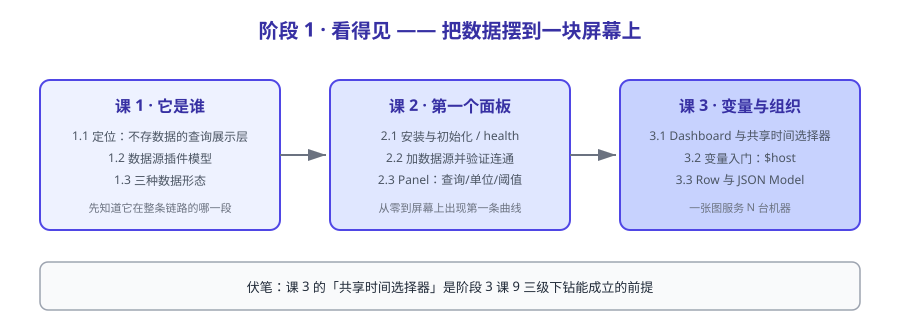

# 阶段 1：看得见

> 所属课程：Grafana ｜ 故事章节：**把数据摆到一块屏幕上** ｜ 下一阶段：[阶段 2：查得到](../2-查得到/overview.md)

## 🎯 本阶段目标

- 说清 Grafana 与 Prometheus 的分工边界——它存数据吗？
- 独立跑起 Grafana，接上一个真实数据源，做出第一个能看的面板。
- 用变量让一张图服务 N 台机器，而不是每台机器抄一份。

## 📍 学习重点

- **定位边界**（最重要）：Grafana 是查询与展示层，数据库里存的是"怎么展示"，不是"数据本身"。这个认知决定了后面所有排障的方向。
- **数据源插件模型**：为什么换后端只要换插件，以及"插件"到底替换了哪一段。
- **Panel 与 Dashboard 的关系**：时间选择器是共享的，这是三级下钻能成立的前提。
- **变量**：从"写死一个 host"到"下拉选 host"，是仪表盘从玩具走向工具的分界线。

## ✅ 必须掌握的知识点

| 知识点 | 所属课 | 学完应能 |
|--------|--------|----------|
| Grafana 的定位：查询与展示层，不存数据 | 课 1 | 说清 Grafana 与 Prometheus 各自负责哪一段；判断"数据查不出来"该查哪边 |
| 数据源插件模型：data plane 与 query 协议 | 课 1 | 解释换一个后端时，Grafana 内部哪部分变了、哪部分没变 |
| 面板查询的三种数据形态 | 课 1 | 判断一条查询该用 Time series / Table / Stat 哪种面板呈现 |
| 安装与初始化：容器启动、管理员口令、health 接口 | 课 2 | 用一条 docker run 起服务，并用 `/api/health` 验证就绪 |
| 加第一个 Prometheus 数据源并验证连通 | 课 2 | 区分 Server（proxy）与 Browser（direct）两种访问模式的差别 |
| 第一个 Panel：查询、图例、单位、阈值 | 课 2 | 从零建一个带单位的 CPU 使用率图，并解释阈值颜色的生效条件 |
| Dashboard 与 Panel 的关系：时间选择器是共享的 | 课 3 | 解释为什么同一个 dashboard 里的图天然时间对齐 |
| 变量入门：`$host` 从哪来、怎么注入查询 | 课 3 | 建一个 Query 类型变量并把它写进 PromQL |
| Row 与折叠、面板复用与 JSON Model 初见 | 课 3 | 导出 dashboard 的 JSON，指出变量定义在哪一段 |

## 🗺️ 本阶段路径图

## 本阶段产出

- [x] `lessons/lesson-01-Grafana是谁：一个不存数据的看图工具.md`（2026-09-04 交付，双视角评审 P0=0）
- [x] `lessons/lesson-02-第一个面板：从零到看得见.md`（2026-09-04 交付，双视角评审 P0=0，P1×3 已修）
- [x] `lessons/lesson-03-变量与Dashboard组织：一张图服务N台机器.md`（2026-09-04 交付，双视角评审 P0=0，P1×3 已修 + 死链 5 条已修）

## 本阶段依赖的环境

| 组件 | 镜像 / 端口 | 说明 |
|------|------------|------|
| Grafana | `grafana/grafana:13.2.1` → `3001` | 已拉取并运行（2026-09-04 实测），容器名 `grafana-lab` |
| Prometheus | `prom/prometheus:v3.14.0` → `9201` | 本机已有镜像，容器名 `grafana-prom` |
| node-exporter | `prom/node-exporter:v1.10.2` → `9101` | 本机已有镜像，容器名 `grafana-node`，提供真实指标（实测 20 核） |

> ⚠️ **端口避让（2026-09-04 实测）**：Prometheus 原本想用 9091，但该端口已被 Prometheus 课程遗留的 `pushgateway` 占用；
> 更隐蔽的是 **pushgateway 对 `/-/ready` 也返回 200**，导致"只看 HTTP 状态码"的就绪探测**假成功**。
> 故本课程 Prometheus 固定用 **9201**，且就绪判据升级为**验证应答身份**（`/api/v1/query` 返回 `status=success`）。
>
> ⚠️ **JSON 风格不一致（2026-09-04 课 2 实测修正）**：Grafana 的 `/api/health` 返回**带空格缩进**的
> `{"database": "ok", ...}`，而 Prometheus API 返回**紧凑**的 `{"status":"success"}`。
> 用 `grep '"database":"ok"'` 探测 Grafana 是**恒假**的，必须先 `tr -d ' \n'` 压平再匹配。
> （课 1 曾因此误判为"装插件慢 60 秒"，课 2 分离变量后确认：health **6 秒**就绪，
> 5 个插件在 t+11s~t+19s 才装完，**插件不阻塞可用性**。）
>
> 启动脚本：`playground/l00-env-up.sh`；端口排查：`playground/l00-portcheck.sh`；判据验证：`playground/l02-readyfix.sh`。
>
> ⚠️ **多实例环境（2026-09-04 课 3 新增）**：为讲"一张图服务 N 台机器"，node-exporter 从 1 台扩到 **3 台**——
> `grafana-node`(9101) / `grafana-node2`(9102，hostname=`node-alpha`) / `grafana-node3`(9103，hostname=`node-beta`)。
> 脚本 `playground/l03-nodes-up.sh`（幂等）。注意 `prometheus.yml` 是 bind mount，**改完必须 `docker restart grafana-prom`**
> ——本环境的 Prometheus 未开 `--web.enable-lifecycle`，不会自动重载。
>
> ⚠️ **gzip 坑（2026-09-04 课 3 实测）**：Prometheus 对带 `Accept-Encoding: gzip` 的请求返回 gzip 响应
> （魔数 `1f 8b`），而本环境的 Grafana 插件未能正确解压，症状是**查询返回空 frame 且不报错**——极易误判为"没数据"。
> 规避：给数据源加请求头 `Accept-Encoding: identity`（脚本 `playground/l03-fix-gzip.sh`，幂等）。
>
> ⚠️ **存储层变化（2026-09-04 课 3 实测）**：Grafana 13.2.1 的 dashboard **不在 `dashboard` 表**（实测 0 行），
> 而在 **`resource` 表**（k8s 风格，`group=dashboard.grafana.app`）；`resource_history` 保留历史版本。
> 课 1「不存时序」的核心论断不受影响（92 张表、时序特征零命中已复验）。
> 另：数据源代理路径在 13.2.1 为 `/api/datasources/proxy/uid/{uid}/...`，按 id 的旧路径已 **404**。

---

[课程目录](../../02-课程目录.md) ｜ [学习路径总览](../../01-学习路径总览.md) ｜ [学习档案](../../00-学习档案.md)
