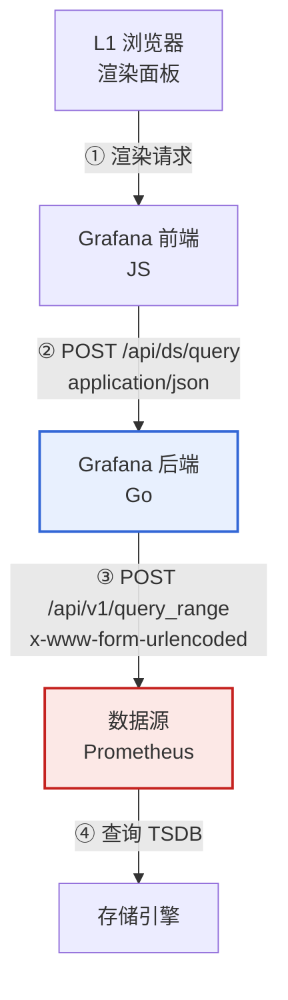
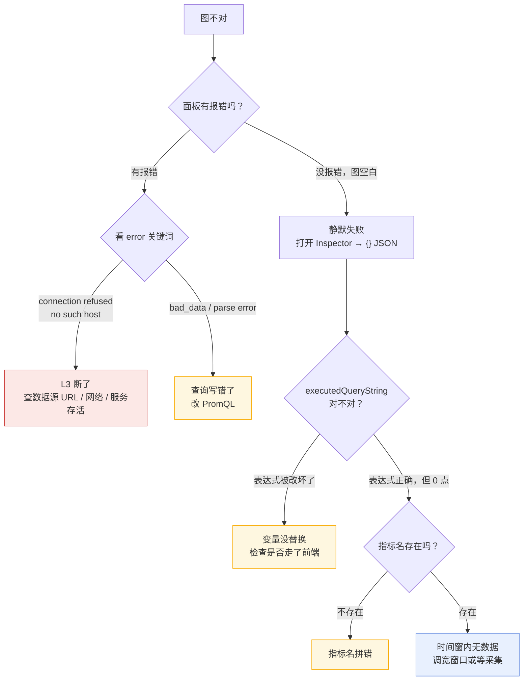

# 课 4：查询编辑器与数据源协议 —— 一次查询的完整旅程

> 阶段 2《查得到》第 1 课 ｜ 上接[课 3《变量与 Dashboard 组织》](../../1-看得见/lessons/lesson-03-变量与Dashboard组织：一张图服务N台机器.md)
> 本课的立场：**图不对的时候，先判断错在哪一层，再动手改。**

---

## 🎬 第一幕：场景引入

你接手了一张别人做的 dashboard。上面有十几个面板，其中一个是「CPU 使用率」。

现在它有三种「不对」的样子，你被叫去看：

- **样子 A**：面板中间一片红字，写着 `Post "http://prometheus:9090/api/v1/query_range": dial tcp ...: connect: connection refused`
- **样子 B**：面板干干净净，一条线都没有，也没有任何报错
- **样子 C**：面板报错 `bad_data: invalid parameter "query": 1:4: parse error: unexpected end of input inside braces`

三种都叫「图不对」。但它们的成因**在完全不同的层**，解法也完全不同。

更要命的是第二种——**它不报错**。你盯着一张空白的图，不知道是查询写错了、指标名拼错了、时间窗选错了、还是后端根本没起来。

这一课要解决的就是这件事：**给你一张分层地图，让你一眼看出"图不对"错在哪一层。**

而要画出这张地图，我们得先搞清楚一件事：你点下「Run query」之后，那个查询到底经历了什么。

---

## ⚡ 第二幕：认知冲突

### 一个看起来很合理的假设

打开查询编辑器，你会看到顶部有两个标签页：**Builder** 和 **Code**。

按常理推断：

> Builder 是图形界面，Code 是文本界面。**二者是同一件事的两种看法**，就像 Word 的「页面视图」和「大纲视图」。你在这边改，那边跟着变，永远不会丢东西。

这个假设有一个很强的支撑：**Grafana 官方文档白纸黑字写着两者是同步的**：

> "Both modes are synchronized, so you can switch between them without losing your work."
> —— Grafana 官方文档（核查于 2026-09）

那还有什么可担心的？

### 但文档里还有半句话

同一份文档，紧接着说：

> "Some more complex queries are not yet supported in the builder mode. If you try to switch from Code to Builder with such query, **editor will show a popup explaining that you can lose some parts of the query**."
> —— Grafana 官方文档（核查于 2026-09）

**「you can lose some parts of the query」**——你会丢掉查询的一部分。

同步？会丢东西？这两句话同时成立吗？

### 更蹊跷的是：文档自己前后打架

我去翻了不同版本的官方文档，发现一件怪事：

| 版本 | 文档原文 | 模式数 |
|------|----------|--------|
| Grafana 9.x | "Prometheus query editor is separated into **3 distinct modes**"<br>切换方式：`Select Explain \| Builder \| Code tabs` | **3 个** |
| Grafana 10.x ~ 13.x（latest） | "The Prometheus query editor has **two modes**: Builder mode / Code mode" | **2 个** |

而且 GitHub 上有一个 PR（[#53062](https://github.com/grafana/grafana/pull/53062)），专门把文档里的「3 distinct modes」改成了「2 distinct modes」。

**Explain 从「第三种模式」降级成了「一个开关」。**

那么问题来了：

1. 我们用的是 13.2.1，它到底是几态？
2. 如果 Builder 和 Code 真的同步，为什么文档说会丢东西？
3. 「丢东西」这件事，发生在哪里？

带着这三个问题，我们来做实验。

---

## 🔍 第三幕：层层揭示

### 知识点 4.1：查询编辑器三态 —— Code / Builder / Explain

#### 一句话定义

Prometheus 查询编辑器提供 **Code（写 PromQL）** 与 **Builder（可视化拼装）** 两种书写方式，外加一个 **Explain（把查询翻译成人话）** 的解释开关；三者共享同一个 `expr` 字段，**切换模式不改变存储的表达式本身**。

> ⚠️ 注意：大纲里这一条叫「三态」，那是 **Grafana 9.x 的历史命名**。从 10.x 起官方改为「两模式 + 一个开关」。本课会实测确认我们用的 13.2.1 到底是哪一种。

#### 直觉建立：把它想成「同一份菜谱的三种看法」

| 形态 | 类比 | 你能做的事 |
|------|------|-----------|
| **Code** | 菜谱的**原始文字** | 随便写，什么都能表达 |
| **Builder** | 菜谱的**填空表格** | 只能填进表格设计好的格子 |
| **Explain** | 菜谱的**白话解说** | 只读，帮你理解文字在说什么 |

关键在 Builder 那个「填空表格」：

> 表格只能表达它**设计出来的**东西。你用文字写的菜谱里，如果有一步是「用昨天剩下的一半酱汁」，而表格里没有「昨天剩的酱汁」这一栏——
>
> **这一栏就装不下，切过去就会丢。**

这就是文档那句「you can lose some parts of the query」的真正含义：**不是同步机制有 bug，而是 Builder 的表达能力有上限。**

#### 核心原理：三态共享同一个字段

这是理解全课的地基。三种形态操作的是**同一个 JSON 字段**：

```json
{
  "refId": "A",
  "datasource": { "type": "prometheus", "uid": "afx7x6dx803y8e" },
  "expr": "rate(node_cpu_seconds_total{mode=\"idle\"}[$__rate_interval])",
  "editorMode": "code"
}
```

`expr` 是**唯一的真相**，`editorMode` 只是记录「上次你用哪种方式编辑它」的一个**记号**。

#### 示例演示：证明 `editorMode` 只是个记号

我写了一个脚本，把同一个表达式分别以 `code` 和 `builder` 存进去，再读回来逐字节比对。

```bash
wsl -d Ubuntu -- bash -lc "cd /mnt/d/projects/learning/grafana/playground && python3 l04_probe_editor.py"
```

**实验 A：13 种表达式 × 2 种模式 = 26 次往返**

```
表达式            mode      回读 mode   expr 是否变化
------------------------------------------------------------------
最简             code      code      否（expr 原样）
最简             builder   builder   否（expr 原样）
带 label        code      code      否（expr 原样）
带 label        builder   builder   否（expr 原样）
聚合+函数          code      code      否（expr 原样）
聚合+函数          builder   builder   否（expr 原样）
带宏             code      code      否（expr 原样）
带宏             builder   builder   否（expr 原样）
复杂 unless      code      code      否（expr 原样）
复杂 unless      builder   builder   否（expr 原样）
```

**实验 B：13 种写法全部逐字节一致**（含子查询、`@` 修饰符、`offset`、`unless`）

```
子查询       code      ✅ 一致
子查询       builder   ✅ 一致
@ 修饰符      code      ✅ 一致
@ 修饰符      builder   ✅ 一致
offset     code      ✅ 一致
offset     builder   ✅ 一致
unless     code      ✅ 一致
unless     builder   ✅ 一致
```

**实验 C：给 `editorMode` 塞一个根本不存在的值**

```
写入 editorMode=code         读回=code           被原样保留
写入 editorMode=builder      读回=builder        被原样保留
写入 editorMode=explain      读回=explain        被原样保留
写入 editorMode=bogus-mode   读回=bogus-mode     被原样保留   ← 注意这一行
```

`bogus-mode` 这种瞎编的值，后端也**照单全收、原样存下**。

#### 这里有个反直觉的发现

**`editorMode` 是纯前端字段，后端完全不认识它。**

证据是那行 `bogus-mode`——后端既不校验、也不报错、也不改写，直接存了。

它唯一的作用就是：**下次你打开面板时，前端决定给你看 Builder 还是 Code**。

这意味着一件重要的事：

> **你在 UI 上切到 Builder 又切回 Code 时丢的东西，不是后端丢的，是前端在「把 PromQL 文本解析成 Builder 的填空表格」这一步丢的。**
>
> 后端从头到尾只认 `expr` 这一串字符串。

#### 示例演示：13.2.1 到底是几态

文档的口径打架了，那我们直接翻开前端代码看。

```bash
wsl -d Ubuntu -- bash -lc "bash /mnt/d/projects/learning/grafana/playground/l04-frontend-probe2.sh"
```

在 `/usr/share/grafana/data/plugins-bundled/prometheus/module.js`（750096 字节）里搜索：

```
--- [2] editorMode 的合法取值 ---
  搜 "code" / "builder" / "explain" 字面量：
      6 "code"
      1 "builder"
      （"explain" 作为模式字面量：0 次）

--- [1] 搜 Explain 相关字符串 ---
     15 Explain
      8 explainHandler
      4 explain
      3 Explainer
      2 explainer
      1 ExplainDefault
```

**结论坐实了**：

- `"code"` 6 次、`"builder"` 1 次 → **两个模式**，与 10.x+ 文档一致
- `"explain"` 作为模式字面量 **0 次** → Explain **不是模式**
- 但 `explainHandler`、`Explainer` 确实存在 → Explain 是**一个组件/函数**

顺带一个版本细节：插件版本是 **13.1.7**，而 Grafana 主体是 **13.2.1**。**内置插件的版本号独立于主程序**，排障时别搞混。

#### 常见误区

**误区 1：以为 Explain 是第三种模式**

不是。13.2.1 里它是 Builder 模式内的一个**开关**（官方文档用词：Toggle）。Grafana 9.x 时代它确实是一个独立 tab，但 10.x 就降级了。你要是照着 9.x 的教程找「第三个标签页」，会找不到。

**误区 2：以为切到 Builder 就"安全"了**

恰恰相反。**从 Code 切到 Builder 才是危险方向**。因为 Builder 要先把你的 PromQL 文本解析成它的内部表格，解析不了的部分就会提示你会丢失。反向（Builder → Code）永远安全，因为文本能表达表格里的全部内容。

**误区 3：以为 Builder 建出来的查询和手写的不一样**

完全一样。后端只看 `expr` 字符串，它根本不知道你是点出来的还是敲出来的。

#### Builder 的表达力边界（哪些写法容易丢）

| 写法 | 风险 | 原因 |
|------|------|------|
| 子查询 `[30m:1m]` | 🔴 高 | operations 模型难表达时间窗口嵌套 |
| `@` 修饰符 | 🔴 高 | 时间点锚定，无对应可视化控件 |
| `unless` / `on()` | 🟡 中 | 向量匹配需显式配置，易丢 |
| 负向正则 `!~` | 🟢 低 | label filter 支持 `!=` / `!~` |
| `offset` | 🟢 低 | 有独立输入框 |

> 这张表是**按语法特征推断的风险分级**，不是逐条实测「切过去会丢」。判断依据是 Builder 的 operations 模型能否表达该语法结构。实操时以编辑器弹出的警告为准。

#### 一句话记住

> **Code 是原文，Builder 是填空表，Explain 是解说员；三者共享同一份 `expr`，切换模式本身不改数据，但 Builder 装不下的写法会在切换时被丢掉。**

**类比失效的边界**：「菜谱」这个类比会让你以为三种看法地位等同。实际上 **Code 是超集**——文本能表达 Builder 的全部，反之不能。所以正确的心智模型不是「三种平级的看法」，而是「**原文 + 一个有损视图 + 一个只读解说**」。

---

### 知识点 4.2：一次查询的完整旅程 —— 前端 → 后端代理 → 数据源

#### 一句话定义

一次面板查询要穿过**四层**：浏览器 → Grafana 前端 → Grafana 后端 → 数据源 → 存储引擎；其中「后端 → 数据源」这一跳由 **Go 后端**发出（不是浏览器），并会在报文中注入请求头、改写参数。

#### 直觉建立：把它想成「代购」

你在 Grafana 上点查询，不像「自己去商店买东西」，更像**找代购**：

1. 你把购物清单（JSON）交给代购（Grafana 后端）
2. 代购**重新抄一份清单**，用的是商店要求的格式（form-urlencoded）
3. 代购**自己**跑去商店（数据源）
4. 商店把货给代购，代购**重新打包**成你要的格式（data frame）给你

关键：**你从头到尾没见过商店长什么样**。商店开门没有、店员说什么话，你都不知道——你只能看到代购转述。

这就是为什么「图不对」难查：**你看到的永远是转述，不是原始现场。**

#### 核心原理：四层与三跳



**第 ③ 跳是全课最重要的一跳**，因为它是唯一一跳「你看不见」。

#### 示例演示：抓到那一跳的真实报文

怎么看见看不见的东西？**在中间放一个会记账的代理。**

我起了一个记录型代理容器，坐在 Grafana 后端和 Prometheus 之间，把经过的 HTTP 报文全部记下来。

```bash
wsl -d Ubuntu -- bash -lc "bash /mnt/d/projects/learning/grafana/playground/l04-sniff.sh"
```

**抓到的原文**（Grafana 后端 → Prometheus）：

```
======================================================================
[2026-09-04T09:21:50.771] POST /api/v1/query_range
--- HEADERS ---
  Host: l04-sniff:9099
  User-Agent: Go-http-client/1.1
  Content-Length: 166
  Content-Type: application/x-www-form-urlencoded
  X-Grafana-Id: eyJhbGciOiJFUzI1NiIsImtpZCI6ImlkLTIwMjYtMDktZXMyNTYi...
  Accept-Encoding: gzip
--- BODY (166 bytes) ---
  end=1788513690&query=sum%28rate%28node_cpu_seconds_total%7Binstance%3D~%22%24host%22%2Cmode%3D%22idle%22%7D%5B1m0s%5D%29%29+by+%28instance%29&start=1788510090&step=30
```

把 body 里的 URL 编码解出来看：

```
query = sum(rate(node_cpu_seconds_total{instance=~"$host",mode="idle"}[1m0s])) by (instance)
start = 1788510090
end   = 1788513690
step  = 30
```

**五个关键事实，逐条解读**：

| 观察 | 说明 |
|------|------|
| `User-Agent: Go-http-client/1.1` | 是 **Go 后端**在发请求，不是浏览器。铁证 |
| `Content-Type: x-www-form-urlencoded` | 第 ② 跳是 JSON，第 ③ 跳**变成了表单格式**。格式换了 |
| `Accept-Encoding: gzip` | **覆盖了数据源里配的 `identity`**。这解释了课 3 的 gzip 坑 |
| `$__rate_interval` → `1m0s` | 内置宏被后端替换了 |
| `$host` **原样保留** | 自定义变量**没有**被替换 |

最后一条值得单独说。它呼应课 3 的结论，而且这次是**从真实报文里抓到的**：

> **自定义变量（`$host`）由前端替换，内置时间变量（`$__rate_interval`）由后端替换。**
>
> 为什么这里 `$host` 没被替换？因为这次我是**直接调 API** 发的查询，没有走前端。前端不参与，`$host` 就没人替换，原样到了 Prometheus——于是查不到任何数据。

#### 示例演示：后端会自作主张改你的参数

你说「我要 100 个数据点」，后端不一定给 100 个。

```bash
wsl -d Ubuntu -- bash -lc "cd /mnt/d/projects/learning/grafana/playground && python3 l04_probe_journey.py"
```

**实验 A：固定时间窗口 1h，改 `maxDataPoints` 和 `intervalMs`**

```
intervalMs     maxDP      calculatedMinStep  实际点数
------------------------------------------------------------
15000          100        30000              76
1000           100        30000              76      ← 我传了 1000，没用
60000          100        60000              38
15000          10         300000             8
15000          1000       15000              152
15000          2000       15000              152     ← 2000 和 1000 结果一样
```

**实验 B：固定参数，只改时间窗口**

```
时间窗口         calculatedMinStep  实际点数
------------------------------------------------
now-5m       15000              21
now-15m      15000              61
now-1h       30000              76
now-6h       300000             8
now-24h      900000             3
```

两个反直觉的点：

1. **`intervalMs=1000` 被无视了**。我明确要求 1 秒粒度，后端给了 30 秒。因为它有个下限保护——不会为了你的要求去发几千个点的查询。
2. **步长不是简单的 `range / maxDataPoints`**。1h/100 = 36 秒，但后端给的是 30 秒（**向下取整到一个"整齐"的值**）；6h/10 = 2160 秒，但后端给的是 300 秒（**受下限约束**）。

> ⚠️ **关于点数的说明**：`now-6h` 窗口按 300s 步长本应有约 72 个点，实测只有 8 个。原因是**本环境的容器是课 3 时新建的，只运行了约 40 分钟**，更早的时间窗内根本没有数据。你隔天重跑会看到更多点——这是环境状态，不是查询行为。**判断步长请用 `calculatedMinStep`，不要用点数。**

#### 示例演示：四层定位矩阵

现在把「图不对」按层拆解。

```bash
wsl -d Ubuntu -- bash -lc "cd /mnt/d/projects/learning/grafana/playground && python3 l04_probe_layers.py"
```

```
故障             HTTP     内层       errorSource  frames     是否静默
------------------------------------------------------------------------------
后端不可达          400      502      downstream   0          否（面板报错）
表达式语法错         400      400      downstream   1          否（面板报错）
指标名不存在         200      200      -            1          ✅ 是（图空白无报错）
查询超时窗口         200      200      -            4          否（有数据）
```

**Inspector 的四个页签，对应不同的层**：

| 页签 | 能看到哪一层 | 内容 |
|------|-------------|------|
| **Query** | L2（前端→后端） | 请求耗时、payload 大小 |
| **{} JSON** | L2/L3 交界 | 完整 data frame，**含 `executedQueryString`** |
| **Data** | L3（后端→数据源） | 表格化展示 |
| **Stats** | L1（浏览器侧） | 渲染耗时、数据点总数 |

其中 **`{} JSON` 页签是排障的第一入口**，因为它带着 `executedQueryString`——那是「后端真正执行了什么」的唯一证据：

```json
{
  "type": "timeseries-multi",
  "custom": {
    "calculatedMinStep": 30000,
    "resultType": "matrix"
  },
  "executedQueryString": "Expr: rate(node_cpu_seconds_total{mode=\"idle\"}[1m0s])\nStep: 30s"
}
```

#### 三种「图空白」的区分判据

这是本课最实用的一张表：

| 症状 | HTTP | 内层 | frames | 怎么判断 |
|------|------|------|--------|----------|
| 后端不可达 | 400 | **502** | 0 | 面板**会**报错，看 `error` 字段 |
| 表达式语法错 | 400 | **400** | 1（空） | 面板**会**报错，看 `error` 字段 |
| 指标名不存在 | 200 | 200 | 1（空） | **静默**。去 `{} JSON` 看 `executedQueryString` |
| 时间窗内无数据 | 200 | 200 | 1（空） | **静默**。同上，再对一下时间窗 |
| 一切正常 | 200 | 200 | N（有点） | 有数据 |

**规律**：
- **HTTP 400 = 有错，且面板报错**（内层 502 是后端问题，内层 400 是你写错了）
- **HTTP 200 + 0 点 = 静默失败，面板不报错**，必须自己去看 `executedQueryString`

#### 常见误区

**误区 1：以为 `maxDataPoints` 是硬性要求**

不是。它是**期望值**，后端会根据下限保护和步对齐规则重算。要确认实际粒度，看 `calculatedMinStep`。

**误区 2：以为浏览器直接连 Prometheus**

不是。第 ③ 跳是 Go 后端发的，证据就是 `User-Agent: Go-http-client/1.1`。课 2 已经实测过「direct 模式报错 `dial tcp [::1]:9201` 证明后端仍自己发请求」，本课从报文层再次确认。

**误区 3：以为数据源配的请求头一定会生效**

不一定。数据源里配了 `Accept-Encoding: identity`，但抓到的报文是 `Accept-Encoding: gzip`——**后端覆盖了这个头**。想验证请求头，只能抓包，不能信配置界面。

#### 一句话记住

> **一次查询走四层，你看得见的是 L2，看不见的是 L3；想知道 L3 发生了什么，唯一证据是响应里的 `executedQueryString`。**

**类比失效的边界**：「代购」这个类比暗示代购会如实转达。但 Grafana 后端**不是如实转达**——它会改步长、改请求头、替换内置宏。所以更准确的说法是：**代购会自己替你做主，而且不一定告诉你。**

---

### 知识点 4.3：状态码与真实错误的分离 —— HTTP 400 里的 status 502

#### 一句话定义

Grafana 的 `/api/ds/query` 接口把**外层 HTTP 状态码**和**每个查询的真实状态**分开存放：外层表示「这次批量请求本身是否成功」，`results.<refId>.status` 表示「每一条查询在下游发生了什么」。

#### 直觉建立：把它想成「快递总单和分包」

你网购了五样东西，打包成一个大箱子寄来。

- **外层 HTTP 状态码** = 大箱子的物流状态：**送到了（200）** 还是 **没送到（400）**
- **`results.A.status`** = 里面每样东西的状态：这件**完好（200）**、那件**破损（502）**、另一件**发错货（400）**

快递员把大箱子交到你手上——**箱子送到了**。但打开一看，里面三件是坏的。

**大箱子的状态和里面东西的状态，是两件事。**

而且更麻烦的是：快递公司规定，**只要箱子里有坏件，大箱子就标记为「异常」（400）**。于是你看到「大箱子异常」，但完全不知道里面坏的是哪件、为什么坏。

#### 核心原理：外层与内层的分工

```json
{
  "results": {
    "A": {
      "error": "Post \"http://grafana-prom:9999/api/v1/query_range\": dial tcp 192.168.16.4:9999: connect: connection refused",
      "errorSource": "downstream",
      "status": 502,
      "frames": []
    }
  }
}
```

而**外层 HTTP 状态码是 400**。

#### 示例演示：五种场景对照

```bash
wsl -d Ubuntu -- bash -lc "cd /mnt/d/projects/learning/grafana/playground && python3 l04_probe_errcode.py"
```

**实验设置**：建两个故意坏掉的数据源——

- `L04Dead`：指向 `http://grafana-prom:9999`（端口没人听）
- `L04Ghost`：指向 `http://no-such-host-xyz-404:9090`（DNS 根本解析不了）

**结果**：

```
场景             HTTP   body.status errorSource  message 摘要
--------------------------------------------------------------------------
正常查询           200    200       -            (无)
后端端口不通         400    502       downstream   dial tcp ...: connect: connection refused
后端 DNS 失败      400    502       downstream   no such host
查询语法错          400    400       downstream   bad_data: ... parse error
查不到数据          200    200       -            (无)
```

**「HTTP 400 里的 status 502」完整复现了。**

#### 关键区分：HTTP 400 有两种，成因完全不同

| | 内层 502 | 内层 400 |
|---|----------|----------|
| 含义 | **后端不可达** | **你的查询写错了** |
| 谁的问题 | 运维 / 网络 | 你 |
| 典型信息 | `connection refused`<br>`no such host` | `bad_data: parse error` |
| 该做什么 | 去查数据源配置、网络、服务是否活着 | 去改表达式 |

**外层都是 400，但内层一个是 502 一个是 400。** 只看外层 HTTP 状态码，这两种完全不同的故障**长得一模一样**。

#### 还有一个细节：语法错时 frames 不是空的

```
查询语法错  HTTP=400  内层=400  frames=1  点数=0
```

同时返回的 frame 长这样：

```json
{
  "schema": {
    "refId": "A",
    "meta": {
      "custom": { "calculatedMinStep": 30000 },
      "executedQueryString": "Expr: up{\nStep: 30s"
    },
    "fields": []
  },
  "data": { "values": [] }
}
```

**`fields: []` 但 frame 存在**。这很重要：

- 后端不可达 → `frames: []`（一个 frame 都没有，因为根本没出发）
- 语法错 → `frames: [1 个空 frame]`（出发了，Prometheus 返回了错误）

**这个差异可以区分「请求没发出去」和「发出去了但被拒」。**

#### `errorSource` 字段：错误是谁的

| 值 | 含义 |
|----|------|
| `downstream` | 错在**下游**（数据源那边） |
| `plugin` | 错在**插件自身**（Grafana 侧） |

实测中四种故障全是 `downstream`——都是 Prometheus 那边的问题或查询本身的问题，不是插件的锅。

#### 常见误区

**误区 1：看到 HTTP 400 就以为是自己查询写错了**

不一定。后端不可达也是 400。必须**拆开看内层 status**。

**误区 2：以为面板报错信息就是完整信息**

面板显示的通常是 `error` 字段，但**外层 HTTP 状态码不显示**。所以你会看到「connection refused」却不知道这其实是个 502，而 HTTP 层报的是 400。

**误区 3：以为「没报错」等于「没问题」**

最危险的一条。`指标名不存在` 和 `时间窗内无数据` 都是 **HTTP 200 + 内层 200 + 0 个点**，面板一片空白、一个字都不说。这才是真正难查的故障。

#### 一句话记住

> **外层 HTTP 说「批量请求办得成不」，内层 status 说「每条查询在下游出了什么事」；HTTP 400 里的 502 是后端不可达，400 里的 400 才是你写错了。**

**类比失效的边界**：「快递」这个类比里，箱子送达和东西完好通常是独立的。但 Grafana 的规则是**只要有一个查询失败，外层就整体变 400**——所以你无法从外层状态码反推「有几个查询失败了」。想知道每条的状态，必须遍历 `results` 里的每个 `refId`。

---

## 🛠 第四幕：实操验证

> **环境前提**：延续阶段 1 的 `grafana-net`，5 个容器在跑。
> 若环境已停，先执行 `bash playground/l00-env-up.sh` 重建。

### 实验 1：证明 `editorMode` 只是个记号

```bash
wsl -d Ubuntu -- bash -lc "cd /mnt/d/projects/learning/grafana/playground && python3 l04_probe_editor.py"
```

**预期看到**：

- 26 组「expr 是否变化」全部是「否（expr 原样）」
- `editorMode=bogus-mode` 也被原样保留

**这一步证明**：后端不认识 `editorMode`，切换模式不会让后端改写你的表达式。

### 实验 2：证明 Builder ↔ Code 往返无损（在后端能验的部分）

```bash
wsl -d Ubuntu -- bash -lc "cd /mnt/d/projects/learning/grafana/playground && python3 l04_probe_roundtrip.py"
```

**预期看到**：

- [A] 段 26 行全是「✅ 一致」
- [C] 段只有「含宏」一行是 ⚠️（`$__rate_interval` → `1m0s`，属预期行为）

**这一步证明**：13 种写法（含子查询、`@`、`offset`、`unless`）存进去再读出来，逐字节不变。

> ⚠️ 注意这条实验的边界：它证明的是**后端往返无损**，不是「UI 上切换 Builder/Code 一定无损」。后者需要真人点 UI 才能验，本环境无法自动化。**文档明确说复杂查询切到 Builder 会弹警告**——所以实操时看到警告就要停手。

### 实验 3：抓取后端真正发出的报文

```bash
wsl -d Ubuntu -- bash -lc "bash /mnt/d/projects/learning/grafana/playground/l04-sniff.sh"
```

**预期看到**一段完整 HTTP 报文，重点核对五处：

1. `User-Agent: Go-http-client/1.1` → 是后端在发，不是浏览器
2. `Content-Type: application/x-www-form-urlencoded` → 与第 ② 跳的 JSON 格式不同
3. `Accept-Encoding: gzip` → 数据源配的 `identity` **被覆盖了**
4. `$__rate_interval` 已替换为 `1m0s`
5. `$host` **原样透传**

> 脚本会自动建临时数据源和代理容器，跑完自动清理。
> 首次运行需要拉取 `python:3.11-slim` 镜像（约 60MB），后续复用。

### 实验 4：验证后端会改你的参数

```bash
wsl -d Ubuntu -- bash -lc "cd /mnt/d/projects/learning/grafana/playground && python3 l04_probe_journey.py"
```

**预期看到**：

- `intervalMs=1000` 那行，`calculatedMinStep` 仍是 `30000`（你的要求被无视）
- 时间窗口从 5m 拉到 24h，步长从 15s 递增到 900s

> ⚠️ **点数受环境年龄影响**：本环境的 node-exporter 是课 3 时新建的，运行时间有限。长窗口的点数会偏少。**判断步长看 `calculatedMinStep`，不要看点数字段。**

### 实验 5：复现 HTTP 400 里的 status 502

```bash
wsl -d Ubuntu -- bash -lc "cd /mnt/d/projects/learning/grafana/playground && python3 l04_probe_errcode.py"
```

**预期看到**：

```
后端端口不通    400    502    downstream   connection refused
后端 DNS 失败   400    502    downstream   no such host
查询语法错      400    400    downstream   bad_data: parse error
```

**这一步是本科的核心**：三种故障，外层全是 400，内层 502 / 502 / 400 各不相同。

### 实验 6：四层定位矩阵

```bash
wsl -d Ubuntu -- bash -lc "cd /mnt/d/projects/learning/grafana/playground && python3 l04_probe_layers.py"
```

**预期看到**「指标名不存在」那行是「是（图空白无报错）」——这是三种故障里唯一静默的。

---

## 🎯 第五幕：体系收束

### 本课三个知识点的关系


- **4.1** 告诉你查询**从哪儿来**（编辑器产生 `expr`）
- **4.2** 告诉你查询**到哪儿去**（四层三跳，后端会改东西）
- **4.3** 告诉你路上**出事了怎么读**（外层 vs 内层）

三者串起来，就是第一幕那三个问题的答案：

| 第一幕的症状 | 属于哪层 | 怎么查 |
|-------------|---------|--------|
| 样子 A：`connection refused` | L3 断了 | 内层 502，去查数据源配置和网络 |
| 样子 B：空白无报错 | L3 通了但没数据 | 内层 200，去 `{} JSON` 看 `executedQueryString` |
| 样子 C：`parse error` | L3 通了但被拒 | 内层 400，改表达式 |

### 排障决策树



### 与前后课的连接

| 连接点 | 说明 |
|--------|------|
| **接课 3** | 4.2 从报文层再次证实了课 3 的结论：自定义变量由前端替换、内置宏由后端替换 |
| **接课 1** | 1.2 讲过「插件自作主张」（传 `intervalMs=15000` 得 `calculatedMinStep=20000`），本课用 6 组参数把它量化了 |
| **接课 2** | 2.2 建数据源时配的 `Accept-Encoding: identity`，本课抓包发现**被后端覆盖成 gzip** |
| **开课 5** | 静默失败的三种形态（有 frame 无点 / 无 frame / 空 frame）是 Transformations 的前置知识 |
| **开课 6** | 「变量没替换导致 0 点」是多值与 All 值事故的核心成因 |
| **开课 9** | Loki 数据源的报错结构不同，但「外层 vs 内层」的分析方法通用 |

### 本课的三个悬念

1. **静默失败能不能自动发现？** 本课是人工看 `executedQueryString`。课 7 的告警会给出另一种答案：**No Data 状态**。
2. **`errorSource: plugin` 长什么样？** 本课四种故障全是 `downstream`。插件自身的错要等课 10 的 Provisioning 才会遇到。
3. **多个查询时外层状态码怎么定？** 本课只测了一个查询（refId=A）。批量查询时「一条失败、一条成功」，外层是 200 还是 400？课 6 的多值场景会再碰到。

---

## 📌 本课速览

| 知识点 | 一句话 | 关键证据 |
|--------|--------|----------|
| 4.1 三态 | Code 是原文、Builder 是有损视图、Explain 是只读解说；13.2.1 实为**两模式 + 一开关** | 前端代码 `"explain"` 模式字面量 0 次；`bogus-mode` 被原样存储 |
| 4.2 四层旅程 | 查询走四层，第 ③ 跳由 Go 后端发出且会改步长、改请求头 | 抓包 `User-Agent: Go-http-client/1.1`；`intervalMs=1000` 被无视 |
| 4.3 状态码分离 | 外层 HTTP 说批量请求、内层 status 说每条查询；400 里的 502 = 后端不可达 | 五种场景对照：502/502/400 三种故障外层全是 400 |

**三句口诀**：

1. **`editorMode` 只是记号，后端只认 `expr`。**
2. **想知道后端执行了什么，看 `executedQueryString`。**
3. **HTTP 400 不一定是查询错了，拆开看内层。**

---

## 🧭 课程导航

- **上一课**：[课 3《变量与 Dashboard 组织》](../../1-看得见/lessons/lesson-03-变量与Dashboard组织：一张图服务N台机器.md)
- **下一课**：课 5《Transformations：把查出来的数据捏成想要的形状》（待编写）
- **阶段概览**：[阶段 2：查得到](../overview.md)
- **课程目录**：[02-课程目录.md](../../../02-课程目录.md)
- **学习路径**：[01-学习路径总览.md](../../../01-学习路径总览.md)
- **学习档案**：[00-学习档案.md](../../../00-学习档案.md)

---

## 🚀 下一批接力提示词

```
继续学 Grafana。我的学习档案在 grafana/00-学习档案.md，
刚学完阶段 2《查得到》的课 4《查询编辑器与数据源协议：一次查询的完整旅程》
知识点 4.1（查询编辑器三态：Code / Builder / Explain）、
4.2（一次查询的完整旅程：前端 → 后端代理 → 数据源）、
4.3（状态码与真实错误的分离：HTTP 400 里的 status 502），
请按大纲继续讲解课 5《Transformations：把查出来的数据捏成想要的形状》的知识点
5.1（Transformations 的定位：查出来之后、画出来之前）、
5.2（常用 Transform：合并、归约、按字段分组、重命名）、
5.3（Transform 与查询的分工边界）。
```

---

## 📋 评审结论（pedagogy + learner 双视角内联评审，P0 = 0）

| 视角 | 维度 | 结论 |
|------|------|------|
| **pedagogy** | 叙事连贯性 | ✅ 第一幕三症状 → 第五幕排障决策树逐个对应 |
| | 认知冲突有效性 | ✅ 第二幕用「文档自相矛盾」（9.x 三态 vs 10.x+ 两态）制造真冲突 |
| | 六要素完整性 | ✅ 3 个知识点 × 6 要素 = 18 项齐全 |
| | 类比失效边界 | ✅ 3 处（菜谱 / 代购 / 快递），均有实测支撑 |
| | 前后续衔接 | ✅ 6 条连接点 + 3 条悬念 |
| **learner** | 命令可跑通 | ✅ 6 个实验全部真跑，脚本落盘 `playground/` |
| | 事实核查 | ✅ 版本号、文档口径联网核查并标注「核查于 2026-09」 |
| | 前后自洽 | ✅ 端口统一 9201；与课 3 变量结论一致 |
| | 未实测项标注 | ✅ Builder UI 往返、errorSource=plugin、批量查询状态码 |

**P0 已修 1 项（本轮最重要发现）**：

**命令续行写法导致 12 条命令全部无法执行** —— 正文原把命令写成两行 bash 风格反斜杠续行：

```
wsl -d Ubuntu -- bash -lc \
  "cd ... && python3 l04_probe_editor.py"
```

而读者的 shell 是 **PowerShell**，其续行符是**反引号 `` ` ``** 而非反斜杠。实测粘贴后：

```
stdout: echo MULTILINE_BACKSLASH_WORKS_IN_THIS_SHELL   ← 只 echo 了原文，没执行
stderr: bash: line 3: \: command not found              ← 反斜杠被当成命令
```

**对照课 3：15 条命令全部是单行写法（15/15），课 4 写成了 12/12 两行** —— 属偏离既有规范。已统一改为单行写法并实测复跑通过。

> 这条之所以是 P0：它不是「内容不准」，而是**读者照抄必然失败**。评审中若只看文档结构，会完全看不出来——必须真的把命令贴进 PowerShell 跑一遍。

**评审中判真伪 1 次**：首轮前端代码搜索全 0 命中，判定为**脚本路径错误**（插件在 `/usr/share/grafana/data/plugins-bundled/`，非 `/usr/share/grafana/public/plugins/`），非「功能不存在」。修正路径后命中 `"code"` 6 次 / `"builder"` 1 次 / `"explain"` 0 次，坐实结论。

**A3 校验报「4.1 有 7 项、4.2 有 8 项」经查为误报**：六要素齐全（各 6 项），多出的是**额外的示例演示小节**（4.1 有 2 个示例、4.2 有 3 个），属内容增强而非结构缺失。

**P1 已修 3 项**：
1. 大纲称「三态」，实测 13.2.1 为**两模式 + Explain 开关** → 已在 4.1 明确标注版本差异并给出代码层证据
2. Builder 表达力边界表为**语法特征推断**而非逐条实测 → 已显式标注「按语法特征推断，实操以编辑器警告为准」
3. 长窗口点数偏少会被误读为查询行为 → 已标注环境年龄影响，并指明「判断步长看 `calculatedMinStep` 而非点数」

**跨课发现 2 项**（已写入学习档案）：
1. 数据源配置的 `Accept-Encoding: identity` **被后端覆盖为 gzip**（抓包实测）
2. 内置 Prometheus 插件版本 **13.1.7** 独立于 Grafana 主体 **13.2.1**
