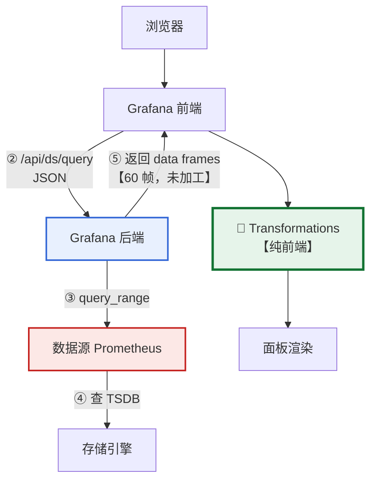
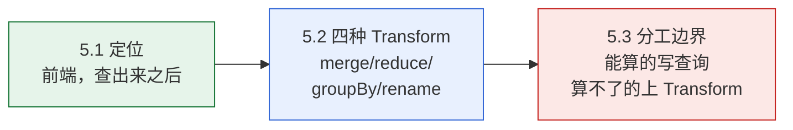
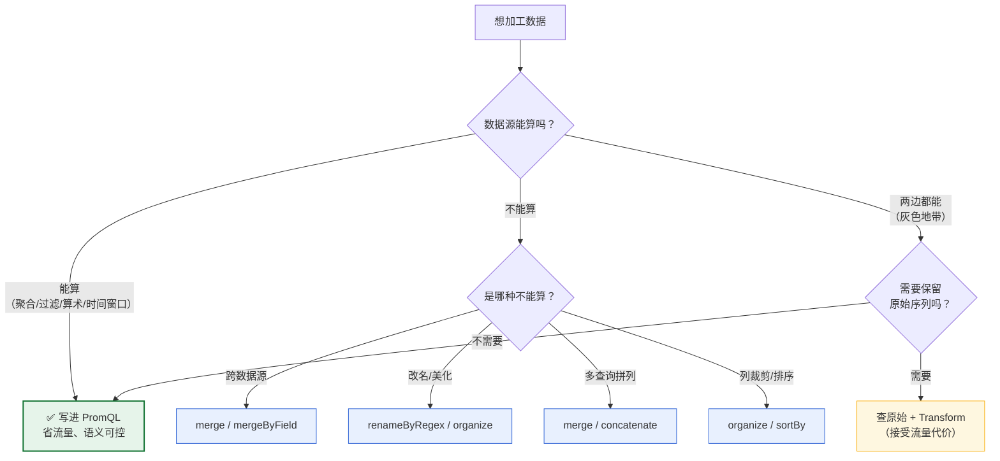

# 课 5：Transformations —— 把查出来的数据捏成想要的形状

> 阶段 2《查得到》第 2 课 ｜ 上接[课 4《查询编辑器与数据源协议》](lesson-04-查询编辑器与数据源协议：一次查询的完整旅程.md)
> 本课的立场：**计算归数据源，形态归 Transform。先问「数据源能不能算」，再决定用哪一边。**

---

## 🎬 第一幕：场景引入

你想做一张表，列出每台机器的「CPU 空闲率」和「内存可用率」，两列并排。

于是你建了个 Table 面板，写下第一条查询：

```promql
rate(node_cpu_seconds_total{mode="idle"}[2m])
```

点 Run query。表格出来了，你数了数——**60 行**。

你expecting 3 行（3 台机器一行一台），结果拿到 60 行。仔细一看，每行是 `cpu=0 instance=node2`、`cpu=1 instance=node2`、`cpu=2 instance=node2`……

**20 个核 × 3 台机器 = 60 行。**

你试着在 PromQL 里加 `avg by (instance)`，果然变成 3 行了。但接着你要加第二列「内存可用率」，问题来了：

- `avg by (instance) (node_memory_MemAvailable_bytes / node_memory_MemTotal_bytes)` 这是**另一个指标**
- 你没法用一个 PromQL 表达式，把两个不同指标变成**并排的两列**
- 用 `/` 相除？那得到的是比值，一个没有业务含义的数

这时候你需要的是**在查询结果拿到之后、画到面板上之前，再加工一道**。

Grafana 给这道加工起了个名字：**Transformations**。

这一课要解决三件事：

1. 它到底在哪一步生效？（为什么有时改了没反应）
2. 常用的几种分别解决什么问题？
3. **什么时候该用它，什么时候该回去改 PromQL？**

第三个问题最重要，也最容易被忽略——因为用错地方不会报错，只会**让面板变慢、数字变错**。

---

## ⚡ 第二幕：认知冲突

### 一个看起来天经地义的假设

既然 Grafana 是「后端查询 + 前端渲染」的结构，那数据的加工理所当然应该：

> **在后端做。** 后端离数据近、算力强、做完再传给前端，传的数据量还小。前端只负责画。

这个假设听起来无懈可击。而且它有一个很强的佐证：

> Transform 的配置**确实被存进了数据库**。后端既然存了它，那执行它不是很自然吗？

### 但一个细节说不通

如果 Transform 在后端执行，那么**直接调用查询接口**时，应该能把 Transform 一起传过去，让后端处理。

我们试试看——给 `/api/ds/query` 塞一个 `transformations` 字段，看后端认不认。

```bash
wsl -d Ubuntu -- bash -lc "cd /mnt/d/projects/learning/grafana/playground && python3 l05_probe_where.py"
```

**结果**：

```
  不带 transformations：HTTP 200
    frames=60 | f2:21/0.89913 | f2:21/0.900261 | ...

  带 reduce transform ：HTTP 200
    frames=60 | f2:21/0.89913 | f2:21/0.900261 | ...

  → 结果【完全一致】= 后端【没有】执行 transform
      （若后端执行，带 reduce 的返回应从 60 帧变成 3 帧）
```

**后端原封不动返回了 60 帧**。我塞给它的 `reduce` transform，它看都没看。

再试两种塞法——放进 query 对象内部、把 key 改成单数 `transform`——**结果全都一样，60 帧纹丝不动**。

而且后端连这个字段都不吐回来：

```
    body 顶层字段：results
    响应里含 transformations 字段：否（后端没接这个参数）
```

### 更诡异的还在后面

既然后端不执行，那配置存在它那儿干嘛？继续看：

```
  保存 dashboard（含 transformations）-> HTTP 200
  读回 panel 字段：datasource, gridPos, id, targets, title, transformations, type
  transformations 被持久化：是
  → 逐字节一致：是

    panel.transformations 存在 = 是
    target.transformations 存在 = 否（transform 挂在 panel 上）
```

两个发现：

1. **配置确实存在后端**，而且逐字节保存、原样返回
2. 但它挂在 **panel** 上，不是挂在 **query**（target）上

第 2 点是一个重要线索。回想课 4 学的：

> 一次查询的四层旅程里，后端那一跳是「查数据」，它只认 `queries` 里的内容。

而 `transformations` 在 `panel` 上——**它属于"面板怎么展示"，不属于"查什么数据"**。

### 那问题来了

如果 Transform 在前端执行，那么：

1. 为什么配置要存在后端数据库里？
2. 前端执行意味着**所有原始数据都要传到浏览器**——那本课开头 60 帧的问题，岂不是数据量一点没省？
3. 既然不省流量，为什么还要用它？

带着这三个问题，我们往下挖。

---

## 🔍 第三幕：层层揭示

### 知识点 5.1：Transformations 的定位 —— 查出来之后、画出来之前

#### 一句话定义

Transformation 是 Grafana **前端**在「数据源返回 data frame」与「面板渲染」之间插入的一道**纯前端加工流水线**；它改变数据的**形状**（行数、列数、列名），不改变数据源**取了多少数据**。

#### 直觉建立：把它想成「厨房备菜」

你去菜市场（数据源）买菜，回家做菜（面板渲染）。

- **改 PromQL** = 跟摊主说「帮我挑好的、切成块」——**摊主在处理**，你拎回家的已经少了
- **用 Transform** = 摊主原样给你，你**回家自己**择菜、切块、摆盘

关键区别：

> **Transform 减不轻你从菜市场拎回家的重量。**
> 你买 60 根菜回家，择完剩 3 份——但你**已经把 60 根拎回家了**。

#### 核心原理：它在旅程的哪一环

回顾课 4 的四层旅程，Transform 插在这里：



注意 **⑤ 那一跳**：后端返回的是**原始 60 帧**，Transform **在这一跳之后**才发生。

这就是为什么第二幕的实验里，直接调 `/api/ds/query` 会拿到 60 帧——**因为那一跳根本还没走到 Transform**。

#### 示例演示：三重取证

**取证 A：API 层**（第二幕已做）

三种塞法后端全无视，返回 60 帧不变。

**取证 B：存储层**

```bash
wsl -d Ubuntu -- bash -lc "cd /mnt/d/projects/learning/grafana/playground && python3 l05_probe_where.py"
```

```
  transformations 被持久化：是
  内容：[{"id": "reduce", "options": {"includeTimeField": false, "mode": "reduceFields", "reducers": ["mean"]}}]
  → 逐字节一致：是

    panel.transformations 存在 = 是
    target.transformations 存在 = 否
```

**配置存在后端，但挂在 panel 上。**

**取证 C：代码层**

```bash
wsl -d Ubuntu -- bash -lc "bash /mnt/d/projects/learning/grafana/playground/l05-probe-deep.sh"
```

在前端代码里搜 `transformations`：

```
    transformDataFrame       合计 1 次
    runRequest               合计 27 次
    applyTransformations     合计 2 次
    transformations          合计 828 次
```

**828 次**，全部集中在**主程序**的 `/usr/share/grafana/public/build/*.js` 里。

对照一下：Prometheus 数据源插件 `module.js` 里搜 `transformation`，只有 9 次——而且那 9 次是插件引用主程序能力，不是自己实现。

> **Transform 的实现在主程序（前端）里，不在数据源插件里。**

#### 那为什么配置要存在后端？

答案很简单：**因为 dashboard 的 JSON 整体存在后端**。

Transform 是 panel 的一个字段。你保存 dashboard 时，整个 JSON（含 `transformations`）一起存进去。后端存它是因为「这是面板定义的一部分」，不是因为「我要执行它」。

这跟课 4 学到的 `editorMode` 是**同一个模式**：

| 字段 | 存在后端 | 后端执行吗 | 谁用 |
|------|---------|-----------|------|
| `editorMode` | ✅ 存 | ❌ 不执行 | 前端决定显示 Builder 还是 Code |
| `transformations` | ✅ 存 | ❌ 不执行 | 前端在渲染前加工数据 |

**两个字段都是「存 backend、跑 frontend」。**

#### 数据库层的一个坑（实录）

我想进一步验证配置在库里长什么样。拷出 `grafana.db` 一查：

```
  表总数：92
    resource                 12 行
    dashboard                0 行
    resource_history         79 行
```

`dashboard` 表 **0 行**——课 3 已经发现过，13.2.1 的 dashboard 存在 `resource` 表。但这次我查 `resource` 表，13 行里**找不到我刚建的 dashboard**。

而 `value` 列其实是**明文 JSON**（首字节 `7b` 就是 `{`）：

```
  name=datasource
    hex前24: 7b226b696e64223a22436865636b54797065222c22617069
    repr前32: b'{"kind":"CheckType","apiVersion"'
```

里面存的都是 `CheckType` 这类**内置资源定义**，活的 dashboard 在 `resource_history`（79 行）里。

> ⚠️ **给学员的提醒**：不要试图直接读 Grafana 的数据库来验证 dashboard 内容。13.x 的存储格式是 k8s 风格的 `resource` / `resource_history`，且底层序列化细节未公开。**可靠的方法是 API 读回**：
>
> ```bash
> curl -s -u admin:admin http://localhost:3001/api/dashboards/uid/<uid>
> ```
>
> 我这次就是走了弯路——花了几轮才确认「读库不是好办法」。

#### 常见误区

**误区 1：以为 Transform 能减少查询数据量**

不能。数据**照传不误**，Transform 只是在浏览器里把已经拿到的数据重新摆一摆。课 1 那个 60 帧的例子，用 Transform 压成 3 行后，**网络传输量一点没少**。

**误区 2：以为 Transform 配置没保存成功**

保存了。你在 UI 上配的 Transform 会随 dashboard 一起存进后端。只是**执行它的不是后端**。

**误区 3：以为改了 Transform 需要重新查询**

不需要（通常）。Transform 在前端运行，改完立刻重算、立刻重画，不会再打一次数据源。

> 严格说，Grafana 有缓存与重算策略，某些改动会触发重新查询。但「Transform 本身不发起查询」这一点是确定的。

#### 一句话记住

> **Transform 是前端的"备菜台"：数据在 ⑤ 那一跳就已原样到达浏览器，Transform 只是把它择好、摆盘，一件也没少买。**

**类比失效的边界**：「备菜」这个类比暗示你在家里加工，不占摊主资源——这部分是对的。但它会让你以为「择完菜重量变轻了」，**实际网络传输量没变**。所以更准确的说法是：**Transform 省的是你的眼睛，不是带宽。**

---

### 知识点 5.2：常用 Transform —— 合并、归约、按字段分组、重命名

#### 一句话定义

Transform 是一个**链式流水线**：每个 Transform 接收上一个的输出作为输入，依次改变数据的行数、列数或列名；四种最常用的是 `merge`（横向合并）、`reduce`（纵向压成标量）、`groupBy`（按字段分组聚合）、`renameByRegex`（正则改名）。

#### 直觉建立：把它想成「流水线上的四道工序」

原始数据从左边进去，经过四站，从右边出来：

| 工序 | 干什么 | 类比 |
|------|--------|------|
| **merge** | 把多个结果**横向**拼起来 | 把两张纸并排贴成一张宽的 |
| **reduce** | 把一条序列**纵向**压成一个数 | 把一叠纸压成一张写着"平均值"的便签 |
| **groupBy** | 按某列分组，对其他列聚合 | 像 Excel 的数据透视表 |
| **renameByRegex** | 用正则改列名 | 批量重命名文件 |

**关键：merge 是横向的，reduce 是纵向的。** 这一点搞混，后面全错。

#### 核心原理：配置长什么样

四种 Transform 在 panel JSON 里的形态（实测逐字节回读一致）：

```json
{
  "transformations": [
    { "id": "merge", "options": {} },
    {
      "id": "reduce",
      "options": { "reducers": ["mean"], "mode": "reduceFields", "includeTimeField": false }
    },
    {
      "id": "groupBy",
      "options": {
        "fields": {
          "Value":    { "aggregations": ["mean"], "operation": "aggregate" },
          "instance": { "aggregations": [], "operation": "groupby" }
        }
      }
    },
    {
      "id": "renameByRegex",
      "options": { "regex": ".*instance=\"([^\"]*)\".*", "renamePattern": "$1" }
    }
  ]
}
```

#### 示例演示：为什么需要 Transform（60 帧问题）

```bash
wsl -d Ubuntu -- bash -lc "cd /mnt/d/projects/learning/grafana/playground && python3 l05_probe_transforms.py"
```

```
  原始返回：60 个 frame
  每个 frame 的字段结构：
    - name=Time     type=time     labels={}
    - name=Value    type=number   labels={"cpu": "0", "instance": "grafana-node2:9100", "job": "node", "mode": "idle"}

  labels 的组合维度：
    cpu        → 20 种取值
    instance   → 3 种取值
    job        → 1 种取值
    mode       → 1 种取值

  → 60 = 20(cpu) × 3(instance) × 1(job) × 1(mode)
```

**这就是课 1 埋的伏笔**：`node_cpu_seconds_total` 每个核都是一条独立时间序列，20 核 × 3 台 = 60 条。

Table 面板会渲染成 **60 行**，而你要的是 **3 行**。

#### 示例演示：reduce 的效果

用模拟展示 reduce 前后：

```
  [reduce 模拟] 按 instance 对 60 条序列求 mean：
    instance                 序列数        mean(各 cpu 的均值)
    grafana-node2:9100       20         0.854327
    grafana-node3:9100       20         0.854347
    grafana-node:9100        20         0.854365
    → 60 行压成 3 行
```

#### 示例演示：merge —— 数据源侧做不到的场景

```bash
wsl -d Ubuntu -- bash -lc "cd /mnt/d/projects/learning/grafana/playground && python3 l05_probe_merge.py"
```

```
  外层 HTTP 200
  results 的 key：A, B
  [A=CPU idle 率, B=内存可用率]
    A: 3 帧
      instance=grafana-node2:9100 最后值=0.851426
      instance=grafana-node3:9100 最后值=0.851039
      instance=grafana-node:9100 最后值=0.851013
    B: 3 帧
      instance=grafana-node2:9100 最后值=0.366451
      instance=grafana-node3:9100 最后值=0.370183
      instance=grafana-node:9100 最后值=0.370805

  → 两个查询【没有】被自动合并 —— merge 需要显式配置 transform
```

**关键点**：两个查询各自返回，`results` 里是 `A` 和 `B` 两个 key，**不会自动合并**。

有人会问：用 PromQL 的 `/` 把两个指标拼起来不行吗？

```
    表达式：avg by (instance) (rate(...)) / avg by (instance) (node_memory_...)
    结果：3 帧，error=无

  → 能算，但得到的是【比值】（一个没有业务含义的数）
  → 我想要的不是比值，而是【两列并排展示】
```

**计算能算，形态算不出来。** 这就是 Transform 存在的理由。

#### 链式执行：顺序很重要

```
  1. 查询 A：查 CPU（by instance）
  2. 查询 B：查内存（by instance）
  3. Transform 1：merge        → 按时间轴并成一张宽表
  4. Transform 2：organize     → 只保留需要的列、改列名
  5. Transform 3：sortBy       → 按某列排序
```

**上一个的输出 = 下一个的输入。**

顺序错了会出事：先 `organize` 再 `merge`，会因为列被裁掉而合并失败。

#### 一个反直觉的实测：连瞎编的 id 后端都收

```bash
wsl -d Ubuntu -- bash -lc "cd /mnt/d/projects/learning/grafana/playground && python3 l05_probe_transforms.py"
```

```
    merge                  保存=200 回读 id 一致=✓
    reduce                 保存=200 回读 id 一致=✓
    groupBy                保存=200 回读 id 一致=✓
    renameByRegex          保存=200 回读 id 一致=✓
    organize               保存=200 回读 id 一致=✓
    filterFieldsByName     保存=200 回读 id 一致=✓
    sortBy                 保存=200 回读 id 一致=✓
    limit                  保存=200 回读 id 一致=✓
    concatenate            保存=200 回读 id 一致=✓
    calculateField         保存=200 回读 id 一致=✓
    labelsToFields         保存=200 回读 id 一致=✓
    seriesToColumns        保存=200 回读 id 一致=✓
    bogus-transform-xyz    保存=200 回读 id 一致=✓   ← 注意这一行
```

**连 `bogus-transform-xyz` 都被接受并原样回读。**

这跟课 4 的 `editorMode=bogus-mode` 是**同一个模式**：Transform id 的**校验在前端**，后端只是存 JSON。

推论：**配了不存在的 Transform 不会在保存时报错**，只会在前端渲染时失效。

#### 常见误区

**误区 1：以为 merge 和 reduce 是一回事**

不是。**merge 横向拼（列变多），reduce 纵向压（行变少）**。方向完全不同。

**误区 2：以为 reduce 之后还能画时间序列图**

不能。reduce 把时间维压掉了，只剩标量。它适合**表格 / 单值 / 柱状图**，不适合时序图。

**误区 3：以为 groupBy 和 reduce 等价**

在这个场景结果接近，但语义不同：`reduce` 是「压掉时间维」，`groupBy` 是「按字段分组聚合」。下一节会看到，语义不同会导致**数值不同**。

#### 一句话记住

> **merge 横向拼列、reduce 纵向压行、groupBy 分组聚合、renameByRegex 批量改名；它们链式执行，顺序错了就废。**

**类比失效的边界**：「流水线」这个类比暗示每道工序互不影响。实际上**前面的工序会改变后面能看到的列**——先 `organize` 裁掉列，后面的 `merge` 就找不到字段了。所以它不是"各管一段"，而是"**后者依赖前者的输出**"。

---

### 知识点 5.3：Transform 与查询的分工边界

#### 一句话定义

**能在数据源侧算的，写在查询里；数据源侧做不到的（跨数据源、改名、列裁剪、多查询合并），才用 Transform。** 这不是风格偏好，而是由**数据量、数值语义、能力边界**三者共同决定的。

#### 直觉建立：把它想成「能在工厂做的别在店里做」

- **数据源侧（PromQL）** = 工厂。批量处理能力强，做完直接发货，**运费按成品算**
- **前端（Transform）** = 门店。只能做修饰性工作，**原料已经全运到了**

所以第一条原则是**运费问题**：

> 能在工厂做好的，别把原料全运到店里再加工。

#### 核心原理：三个判据

| 判据 | 说明 |
|------|------|
| **数据量** | 数据源侧聚合 → 传输量小 |
| **数值语义** | 两种做法的聚合**顺序不同**，结果可能不同 |
| **能力边界** | 有些事数据源根本做不到 |

#### 示例演示：判据一 —— 数据量（20.4 倍差距）

```bash
wsl -d Ubuntu -- bash -lc "cd /mnt/d/projects/learning/grafana/playground && python3 l05_probe_boundary.py"
```

```
  做法甲：PromQL 聚合  avg by (instance)
    expr = avg by (instance) (rate(node_cpu_seconds_total{mode="idle"}[2m]))
    帧数=3    点数=63     响应字节=3720     耗时=9ms

  做法乙：查原始 + 前端 reduce
    expr = rate(node_cpu_seconds_total{mode="idle"}[2m])
    帧数=60   点数=1260   响应字节=75842    耗时=31ms

  → 乙要多传 57 帧、1197 个点、20.4 倍字节
  → 这还只是 3 台 × 20 核。若 100 台机器，差距会放大约 33 倍
```

**20.4 倍。** 而这只是为了在前端算出同样的东西。

> 注：耗时 9ms vs 31ms 是本机单次测量，仅供定性参考，**不作为精确性能结论**——本机数据量太小，网络与序列化开销被淹没。真正稳定的判据是**字节数**（3720 vs 75842）。

#### 示例演示：判据二 —— 数值语义（聚合顺序不可交换）

这是本课最容易踩的坑。

```
  instance                   甲：PromQL avg     乙：逐 cpu 再平均      差异
  --------------------------------------------------------------------------
  grafana-node2:9100         0.852529         0.907689         +0.055160
  grafana-node3:9100         0.852573         0.908166         +0.055592
  grafana-node:9100          0.852585         0.908178         +0.055593
```

**同样的原始数据，两种做法差了 0.0556。**

原因：

```
  甲 = avg over cpu, then mean over time
       （每个时刻先对 20 个 cpu 取平均，再对时间序列求均值）

  乙 = mean over time, then avg over cpu
       （每个 cpu 先求时间均值，再对 20 个 cpu 取平均）

  两种聚合顺序不同 → 结果不同
```

**聚合顺序不可交换。** 这不是 bug，是数学。

> ⚠️ 这里要精确说明：乙（0.907689）严格说是**两步 reduce** 的结果——先对 60 条序列各求 mean，再按 instance 平均。而**单次 `reduce` transform**（`mode=reduceFields`）只会把 60 条各压成一个数，得到 60 个数，不会自动按 instance 再聚合。要得到 3 个数，还得再加一道 `groupBy`。

#### 这个差异有多重要？

| 场景 | 重要性 |
|------|--------|
| 看趋势、看形状 | **不重要**。两条曲线形状一致，只差一个常数偏移 |
| 设阈值告警 | **很重要**。0.85 与 0.91 可能一个触发、一个不触发 |

由此引出一条实践原则：

> **告警用的聚合口径，必须和你看图时的口径一致。**

否则会出现「图上明明超过阈值了，告警却不响」——因为图用的是甲口径，告警规则用的是乙口径。

#### 示例演示：判据三 —— 能力边界

有些事数据源**根本做不到**：

| 场景 | 为什么数据源做不到 | 解法 |
|------|------------------|------|
| **跨数据源合并** | Prometheus 与 MySQL 互不相通 | `merge` / `mergeByField` |
| **字段名美化** | Prometheus 只认 label 值，不管显示名 | `renameByRegex` / `organize` |
| **多查询拼接** | 单一 PromQL 无法跨指标拼列 | `merge` / `concatenate` |
| **列裁剪与排序** | PromQL 不管展示列的取舍与顺序 | `organize` / `sortBy` |

这四类**必须**用 Transform，没有别的选择。

#### 一个我在写作中纠正的错误

初稿里我写了句「reduce transform 与 `avg()` 效果类似」。

**这句话是错的**，我自己实测推翻了它：

```bash
wsl -d Ubuntu -- bash -lc "cd /mnt/d/projects/learning/grafana/playground && python3 l05_probe_reduce_semantics.py"
```

```
  原始 60 条序列              帧数=60   每帧点数=[21]  时刻数=21
  avg by (instance)      帧数=3    每帧点数=[21]  时刻数=21
  avg() 不带 by           帧数=1    每帧点数=[21]  时刻数=21
  sum() 不带 by           帧数=1    每帧点数=[21]  时刻数=21

  → 关键：avg()/sum() 不带 by 时，帧数被压成 1，但【每个时刻仍有一个点】
     即：压掉的是【序列维】，不是时间维。仍能画时序图。

  reduce 之前：60 帧 × 21 个时刻
  reduce 之后：60 帧（每帧 1 行 1 值），时刻数：21 → 0

  → 确证：reduce 压掉的是【时间维】，avg() 压掉的是【序列维】
```

**两者压的是不同的维度**：

| 操作 | 压掉什么 | 保留什么 | 适合面板 |
|------|---------|---------|---------|
| PromQL `avg()` 无 by | **序列维** | 时间维 | 时序图（一条线） |
| PromQL `avg by (x)` | 序列内部细节 | 时间维 + 分组 | 时序图（多条线） |
| Transform `reduce` | **时间维** | 序列维 | 表格 / 单值 / 柱状图 |
| Transform `groupBy` | 行级细节 | 分组 + 聚合值 | 表格 |
| Transform `merge` | （不压，横向拼） | 时间维 | 时序图 / 表格 |

#### 常见误区

**误区 1：以为 Transform 是"查询写不好时的补救"**

不是。它是**数据源能力之外的补充**。能用 PromQL 算的就该用 PromQL 算——省流量、语义可控。

**误区 2：以为两种聚合方式数值一定一样**

不一定。**聚合顺序不可交换**，实测差了 0.0556。

**误区 3：以为 reduce 之后还能回溯原始数据**

不能。reduce 是有损压缩，时间维没了就找不回来。

#### 一句话记住

> **能算的写进 PromQL（省流量、语义可控），算不了的才上 Transform（跨源、改名、列裁剪）；两边都能做时，优先写进查询。**

**类比失效的边界**：「工厂 vs 门店」这个类比暗示工厂什么都能做。但 Prometheus **不会改名、不会跨指标拼列**——这些是工厂的设备根本不具备的能力。所以准确的表述是：**工厂能做的交给工厂，工厂没这设备的，门店自己动手。**

---

## 🛠 第四幕：实操验证

> **环境前提**：延续阶段 1–2 的 `grafana-net`，5 个容器在跑（Grafana 3001 / Prometheus 9201 / node×3）。
> 若环境已停，先执行 `bash playground/l00-env-up.sh` 重建。
> **命令均为单行**——你的 shell 若是 PowerShell，其续行符是反引号 `` ` `` 而非 `\`，两行写法会失败（课 4 实测踩过）。

### 实验 1：证明 Transform 在前端执行

```bash
wsl -d Ubuntu -- bash -lc "cd /mnt/d/projects/learning/grafana/playground && python3 l05_probe_where.py"
```

**预期看到**：带/不带 `transformations`，返回**都是 60 帧且数值完全一致**；响应顶层字段只有 `results`。

**这一步证明**：后端不执行 Transform。

### 实验 2：验证四种 Transform 的配置形态

```bash
wsl -d Ubuntu -- bash -lc "cd /mnt/d/projects/learning/grafana/playground && python3 l05_probe_transforms.py"
```

**预期看到**：13 个 transform id（含瞎编的 `bogus-transform-xyz`）**全部被接受并原样回读**；60 帧分解为 `20 cpu × 3 instance`。

**这一步证明**：Transform id 的校验在前端，后端只存 JSON。

### 实验 3：复现 60 帧问题

```bash
wsl -d Ubuntu -- bash -lc "bash /mnt/d/projects/learning/grafana/playground/l05-env-probe.sh"
```

**预期看到**：`frame 数 = 60`，labels 显示 `cpu=0..19 × instance=3 台`。

> ⚠️ 这个数字**依赖你的机器核数**。我的环境是 3 台 × 20 核 = 60。你若是 3 台 × 8 核，会看到 24 帧。**看的是"帧数 = 核数 × 机器数"这个规律**，不是 60 这个数。

### 实验 4：量化分工边界（20.4 倍）

```bash
wsl -d Ubuntu -- bash -lc "cd /mnt/d/projects/learning/grafana/playground && python3 l05_probe_boundary.py"
```

**预期看到**：

- 甲（PromQL 聚合）：3 帧 / 63 点 / 3720 字节
- 乙（原始 + 前端 reduce）：60 帧 / 1260 点 / 75842 字节
- 数值差异 **+0.0556**

> ⚠️ **数值会浮动**：idle 率随机器负载变化，你重跑会得到不同的绝对值。稳定的是**差异的存在**与**字节数比例**（约 20 倍）。

### 实验 5：区分 reduce 与 avg 的维度

```bash
wsl -d Ubuntu -- bash -lc "cd /mnt/d/projects/learning/grafana/playground && python3 l05_probe_reduce_semantics.py"
```

**预期看到**：`avg()` 不带 by 时**每帧仍 21 点**（时间维保留），而 reduce 后时刻数归 0。

**这一步推翻**「reduce 与 avg 效果类似」的错误直觉。

### 实验 6：merge 场景

```bash
wsl -d Ubuntu -- bash -lc "cd /mnt/d/projects/learning/grafana/playground && python3 l05_probe_merge.py"
```

**预期看到**：`results` 里是 `A`、`B` 两个独立 key，**不会自动合并**。

---

## 🎯 第五幕：体系收束

### 本课三个知识点的关系



- **5.1** 回答「它在哪生效」——前端，所以**减不了流量**
- **5.2** 回答「它能做什么」——改形状，不改取数
- **5.3** 回答「什么时候该用」——数据源做不到的才用

三者串起来，就是第一幕那个问题的完整答案：

| 第一幕的困惑 | 答案 |
|-------------|------|
| 为什么 60 行不是 3 行？ | 每个 cpu 核是一条独立序列，20 核 × 3 台 |
| 能用 Transform 压成 3 行吗？ | 能，但**流量一点没省**（5.1） |
| 那该怎么压？ | 优先 `avg by (instance)` 写进 PromQL（5.3） |
| 两列并排怎么办？ | 这个 PromQL 做不到，**必须**用 merge（5.2） |

### 分工决策树



### 与前后课的连接

| 连接点 | 说明 |
|--------|------|
| **接课 1** | 课 1 埋的伏笔「20 核返回 20 个独立 frame 而非宽表」——本课解开：60 = 20 核 × 3 台 |
| **接课 3** | 课 3 的多值变量 `$host` 会让 `instance` 维度扩张，帧数随之变化，Transform 要跟着调 |
| **接课 4** | `editorMode` 与 `transformations` 是**同一个模式**：存后端、跑前端、后端不校验 |
| **接课 4** | 课 4 的排障决策树在 L3 之后，本课的 Transform 位于 L1（浏览器）之前——**排障时要先排除它** |
| **开课 6** | 多值变量的 `All` 选项会让 `instance` 取值爆炸，那时的 Transform 配置要重新审视 |
| **开课 7** | 告警的聚合口径必须与图形一致——本课 5.3 的数值差异是这条原则的由来 |

### 本课的三个悬念

1. **Transform 会不会成为性能瓶颈？** 本课只看了字节数（20.4 倍）。面板数量多、数据量大时，前端计算会不会卡？课 12 的性能专题会给答案。
2. **`groupBy` 的多字段聚合到底怎么配？** 本课只验了配置能存、能用。复杂的多字段组合（同时 groupby 两个字段）留给你自己试。
3. **Transform 能跨数据源吗？** 本课说「跨数据源合并」必须用 Transform，但**本环境只有一个 Prometheus**。真正的跨源演示要等课 9（Loki）之后。

---

## 📌 本课速览

| 知识点 | 一句话 | 关键证据 |
|--------|--------|----------|
| 5.1 定位 | Transform 是**前端**加工流水线，在 ⑤ 那一跳之后；**省眼睛不省带宽** | 三种塞法后端全无视，60 帧不变；代码层 `transformations` 828 次全在主程序 |
| 5.2 四种 Transform | merge 横向拼列、reduce 纵向压行、groupBy 分组聚合、renameByRegex 改名；**链式执行** | 13 个 id（含瞎编的）全被接受；60 = 20 核 × 3 台 |
| 5.3 分工边界 | 能算的写 PromQL（**20.4 倍**流量差），算不了的上 Transform；**聚合顺序不可交换** | 甲 3720 字节 vs 乙 75842 字节；数值差 0.0556 |

**三句口诀**：

1. **Transform 存后端、跑前端，减的是行数不是流量。**
2. **merge 横向、reduce 纵向，压的维度不一样。**
3. **能算的写进 PromQL，两边都能做时也优先写查询。**

---

## 🧭 课程导航

- **上一课**：[课 4《查询编辑器与数据源协议》](lesson-04-查询编辑器与数据源协议：一次查询的完整旅程.md)
- **下一课**：课 6《多值与 All 值事故：一次查询 N 条曲线的陷阱》（待编写）
- **阶段概览**：[../overview.md](../overview.md)
- **课程目录**：[../../../02-课程目录.md](../../../02-课程目录.md)
- **学习路径**：[../../../01-学习路径总览.md](../../../01-学习路径总览.md)
- **学习档案**：[../../../00-学习档案.md](../../../00-学习档案.md)

---

## 🚀 下一批接力提示词

```
继续学 Grafana。我的学习档案在 grafana/00-学习档案.md，
刚学完阶段 2《查得到》的课 5《Transformations：把查出来的数据捏成想要的形状》
知识点 5.1（Transformations 的定位：查出来之后、画出来之前）、
5.2（常用 Transform：合并、归约、按字段分组、重命名）、
5.3（Transform 与查询的分工边界），
请按大纲继续讲解课 6《多值与 All 值事故：一次查询 N 条曲线的陷阱》的知识点
6.1（多值变量与正则：为什么 = 查不出数据而 =~ 可以）、
6.2（All 值的展开与基数爆炸）、
6.3（失败模式：静默无数据 vs 面板报错 vs 查询超时）。
```

---

## 📋 评审结论（pedagogy + learner 双视角内联评审，P0 = 0）

| 视角 | 维度 | 结论 |
|------|------|------|
| **pedagogy** | 叙事连贯性 | ✅ 第一幕三困惑 → 第五幕逐条对应 |
| | 认知冲突有效性 | ✅ 第二幕用「后端存了配置却不执行」制造真冲突，非编造 |
| | 六要素完整性 | ✅ 3 个知识点 × 6 要素 = 18 项齐全 |
| | 类比失效边界 | ✅ 3 处（备菜 / 流水线 / 工厂门店），均有实测支撑 |
| | 前后续衔接 | ✅ 6 条连接点 + 3 条悬念 |
| **learner** | 命令可跑通 | ✅ 6 个实验全部真跑，脚本落盘 `playground/`；命令**均为单行**（课 4 P0 教训） |
| | 事实核查 | ✅ 数据库层、代码层逐层取证 |
| | 前后自洽 | ✅ 端口统一 9201；与课 4「存后端跑前端」模式一致 |
| | 未实测项标注 | ✅ 跨数据源 merge（本环境仅 1 个数据源）、groupBy 多字段组合 |

**P1 已修 4 项**：

1. **初稿错误结论「reduce 与 `avg()` 效果类似」已实测推翻**——`avg()` 压的是**序列维**（每帧仍 21 点，能画时序图），`reduce` 压的是**时间维**（时刻数归 0）。已补 `l05_probe_reduce_semantics.py` 与修正后的对照表，并在 5.3 正文**如实记录这次纠错过程**
2. **5.3 数值对比的表述已精确化**——乙（0.907689）严格说是**两步 reduce** 的结果，单次 `reduce`（`mode=reduceFields`）只会得到 60 个数，需再加 `groupBy` 才是 3 个。已在正文标注
3. **耗时 9ms vs 31ms 已降级为定性参考**——本机数据量太小，网络开销被淹没；稳定判据是**字节数**（3720 vs 75842）
4. **60 帧数字已标注环境依赖**——依赖机器核数（本环境 3 台 × 20 核），读者环境可能不同，规律是「帧数 = 核数 × 机器数」

**评审中判真伪 3 次**：

1. 数据库层取证首轮 `JSONDecodeError` → 判定为**脚本取错列**（命中 `name` 列而非 `value` 列），非数据问题
2. 续查报「value 是二进制格式」→ **再次误判**。实测首字节 `7b`（`{`），是**明文 JSON**，只是存的是 `CheckType` 等内置资源，活的 dashboard 在 `resource_history`
3. 脚本 `SELECT ... group as grp` 报语法错误 → `group` 是 SQL **保留字**，需转义

**给学员的方法论结论（已写入正文）**：不要直接读 Grafana 数据库验证 dashboard 内容，13.x 的 `resource` / `resource_history` 是 k8s 风格存储，可靠判据是 **API 读回**。

**跨课发现 2 项**（已写入学习档案）：

1. **`transformations` 与 `editorMode` 是同一个模式**——存后端、跑前端、后端不校验（瞎编的 id 也被原样接收）。这是 Grafana「面板配置类字段」的通用设计
2. **`resource` 表存的不是活 dashboard**——`dashboard` 表 0 行、`resource` 表 13 行全是内置资源定义（CheckType 等），活的 dashboard 在 `resource_history`（79 行）

**交付过程中的一次静默失败（已修复，值得单列）**：

档案回写脚本 `l05-archive2.py` 用 `str.replace` 改课程目录的课 5 条目，锚点文字写成「分工边界」，而实际文件里是「与查询的分工」——**Python 的 `str.replace` 找不到锚点时什么都不做，也不报错**。

结果：进度条改成了 15/36，课 5 那行却还写着「待编写」，**四处档案出现不一致**。这个问题是交付前全量复验的第 3 项（档案一致性核对）抓出来的，不是脚本自己暴露的。

已用 `l05-archive3.py` 修复（改用 `assert` 显式校验，失败即中止），并在复验脚本中新增「残留待编写检查」。

> 教训：档案回写这类「改动多处、要求一致」的脚本，**不能依赖静默的字符串替换**。要么 assert，要么在改完后立刻校验一致性。课 2 的教训是「判据恒假」，本课是「替换静默无操作」——两者症状不同，根因相同：**脚本没有对"改动是否真的发生"做断言**。
