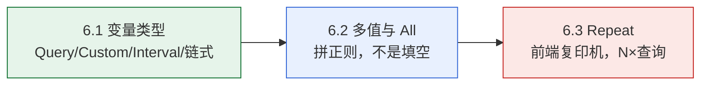
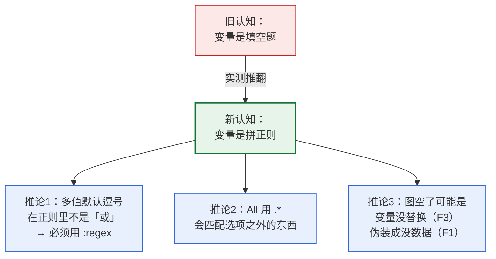

# 课 6：变量进阶与动态仪表盘

> 阶段 2《查得到》第 3 课 ｜ 上接[课 5《Transformations》](lesson-05-Transformations：把查出来的数据捏成想要的形状.md)
> 本课的立场：**变量不是"填空题"，它替换出来的是一串正则；All 不是"所有值"，它是一颗基数炸弹。**

---

## 🎬 第一幕：场景引入

你在课 3 建过一个 `$host` 变量，下拉框选机器，图跟着变。一切正常。

现在监控规模涨了，你想让它更好用：

**需求一**：选了机器之后，还能选「核」——但**只显示这台机器有的核**。这就是**链式变量**。

**需求二**：允许**同时选多台**机器对比。你兴冲冲地把 `Multi` 打开，结果——

```promql
up{instance=~"$host"}
```

选 1 台：正常显示。选 2 台：**图空了**。一个报错都没有。

你检查了半天，Prometheus 里明明有数据，语法也没错，就是不出图。

**需求三**：想给每台机器自动生成一个面板。你听说了 Repeat 功能，配好之后——

面板确实复制了 N 份，但**页面变卡了**。打开要等好几秒。

这一课要解决的就是这三件事：

1. 四种变量类型各自解决什么问题？链式变量怎么建？
2. **多值和 All 到底被替换成了什么？** 为什么 `=` 查不出而 `=~` 可以？
3. Repeat 是怎么复制面板的？代价是什么？

第二个问题是本课的核心——因为它的失败模式是**静默的**：图空了，但**不报错**。

---

## ⚡ 第二幕：认知冲突

### 一个看起来天经地义的假设

变量就是「填空题」：

```promql
up{instance=~"$host"}
```

选了 `grafana-node:9100`，就把 `$host` 换成这个值，变成：

```promql
up{instance=~"grafana-node:9100"}
```

那么选两台，理所当然应该变成「查这两个」：

```promql
up{instance=~"grafana-node:9100,grafana-node2:9100"}
```

毕竟 UI 上下拉框里显示的就是 `grafana-node:9100 + grafana-node2:9100`，用逗号连着。

**这个假设看起来无懈可击。** 而且它有一个很强的佐证：选一台的时候，这套逻辑完全成立。

### 但实测打脸了

我们把三种「看起来应该一样」的写法，直接喂给 Prometheus 试试：

```bash
wsl -d Ubuntu -- bash -lc "cd /mnt/d/projects/learning/grafana/playground && python3 l06_probe_all.py"
```

**结果**：

```
  插值形态                             帧数     点数       字节         状态
  ------------------------------------------------------------------------------
  ${host} 单值（模拟选 1 台）              1      21       1027       有数据
  ${host} 多值默认（逗号）                 1      0        284        空帧   ← 空了
  ${host:pipe} 多值                  2      42       1921       有数据
  ${host:regex} 多值                 2      42       1923       有数据
```

**逗号分隔的多值，一个点都查不出来。**

而同样是这两台机器，写成 `a|b`（管道）或 `(a|b)`（正则分组）——**立刻就有数据了**。

### 为什么？

因为 Prometheus 的正则语法里，**逗号不是"或"**。

`up{instance=~"a,b"}` 的意思是「instance 这个值，要匹配正则 `a,b`」——也就是「字符 a，后面跟字符 b 之外的任意字符，后面跟 b」。世界上没有这样的 instance 值。

而 `|` 才是 Prometheus 正则里的「或」。

### 更诡异的还在后面

既然 `=~` 配多值会失败，那是不是换成 `=` 就好了？毕竟 `=` 是"完全相等"，听起来更像"选了哪几个就要哪几个"。

继续测：

```
  写法                                       帧数     点数       结论
  ------------------------------------------------------------------------------
  up{instance="grafana-node:9100"}         1      21       ✓ 正常
  up{instance="grafana-node:9100,grafana-n 1      0        ✓ 查不出
  up{instance=~"grafana-node:9100"}        1      21       ✓ 正常
  up{instance=~"grafana-node:9100,grafana- 1      0        ✓ 查不出
  up{instance=~"(grafana-node:9100|grafana 2      42       ✓ 正常
```

**`=` 和 `=~` 在多值时都失败**，区别只在于：

- 单值时两者**都正常**
- 多值时两者**都失败**
- 只有 `=~` 配上**正确的正则格式**（`|` 或 `(a|b)`），多值才能work

### 那问题来了

1. 既然 `$host` 默认展开是逗号分隔，那**多值变量根本没法直接用**？
2. All 值又是什么？它凭什么能用？
3. 为什么失败时**一个报错都没有**？

带着这三个问题往下挖。

---

## 🔍 第三幕：层层揭示

### 知识点 6.1：变量类型 —— Query / Custom / Interval / 链式依赖

#### 一句话定义

Grafana 变量有四种常用类型：**Query**（从数据源查取值）、**Custom**（手写固定列表）、**Interval**（时间间隔）、**Datasource**（切换数据源）；当一个变量的查询里引用了另一个变量，就构成**链式依赖**。

#### 直觉建立：把它想成「四级菜单」

| 类型 | 取值从哪来 | 类比 |
|------|-----------|------|
| **Query** | 问数据源要 | 餐厅问厨房「今天有什么菜」 |
| **Custom** | 你手写死 | 你自己写好的固定菜单 |
| **Interval** | 预设的时间档位 | 视频清晰度：流畅/标清/高清 |
| **Datasource** | 数据源列表 | 换一家分店 |
| **链式依赖** | 取决于上一个选择 | 选了省，才显示这个省的市 |

**链式依赖是"多级联动菜单"**——选了省才能选市，选了市才能选县。

#### 核心原理：配置形态

四种类型在 dashboard JSON 里的样子（实测保存后逐字段读回）：

```json
{
  "templating": {
    "list": [
      {
        "name": "host", "label": "主机", "type": "query",
        "datasource": {"type": "prometheus", "uid": "afx7x6dx803y8e"},
        "query": "label_values(up, instance)",
        "refresh": 1, "multi": true, "includeAll": true, "sort": 1
      },
      {
        "name": "env", "type": "custom",
        "query": "prod,staging,dev",
        "multi": false, "includeAll": false
      },
      {
        "name": "myinterval", "type": "interval",
        "query": "1m,5m,10m,30m,1h",
        "auto": false, "refresh": 2
      },
      {
        "name": "DS_PROM", "type": "datasource",
        "query": "prometheus", "refresh": 1
      }
    ]
  }
}
```

#### 示例演示：四种类型的实测

```bash
wsl -d Ubuntu -- bash -lc "cd /mnt/d/projects/learning/grafana/playground && python3 l06_probe_vartypes.py"
```

```
  【host】type=query
    query      = "label_values(up, instance)"
    refresh    = 1 (1=时间范围变更时, 2=从不)
    multi      = True   includeAll = True
    options 数量 = 0
    current    = {}

  【env】type=custom
    query      = "prod,staging,dev"
    refresh    = None
    multi      = False   includeAll = False
    options 数量 = 0

  【myinterval】type=interval
    query      = "1m,5m,10m,30m,1h"
    refresh    = 2

  【DS_PROM】type=datasource
    query      = "prometheus"
    refresh    = 1
```

**注意 `options 数量 = 0`**——后端保存时 options 是空的。

这跟课 5 的 Transform 是**同一个模式**：

> **取值列表由前端填充，后端只存定义。**

#### Query 变量的 query 写法

```bash
wsl -d Ubuntu -- bash -lc "cd /mnt/d/projects/learning/grafana/playground && python3 l06_probe_vartypes.py"
```

五种写法**全部被接受**（HTTP 200）：

| 写法 | 说明 |
|------|------|
| `label_values(up, instance)` | 最常用：取某指标的某标签值 |
| `label_values(up{job="node"}, instance)` | 带过滤条件 |
| `query_result(up)` | 用查询结果，需配合正则提取 |
| `query_result(sum by (instance) (up))` | 聚合后再取 |
| `metrics(node_cpu_seconds_total)` | 指标名列表 |

#### 链式依赖：变量 B 引用变量 A

```json
[
  { "name": "job",  "type": "query",
    "query": "label_values(up, job)" },
  { "name": "inst", "type": "query",
    "query": "label_values(up{job=\"$job\"}, instance)" }
]
```

实测读回：

```
    job    query = label_values(up, job)
    inst   query = label_values(up{job="$job"}, instance)

  ✓ 读回时 $job 仍是字面量 → 确认后端不替换，前端才替换
```

**链式依赖的关键**：`$job` 以**字面量**存进后端，替换发生在**前端**。

这跟课 3 的结论完全一致：

> **自定义变量由前端替换，内置时间变量（`$__rate_interval`）由后端替换。**

链式依赖不过是「前端替换」这件事的**递归应用**——替换 `inst` 时，先把 `$job` 换成它的当前值，再去查数据源。

#### 刷新时机：`refresh` 字段

| 值 | 含义 |
|----|------|
| `0` | 永不刷新 |
| `1` | **时间范围变更时**刷新（最常用） |
| `2` | 从不刷新 |

**链式变量的刷新顺序**：Grafana 会分析依赖关系，先刷新被引用的变量，再刷新依赖它的变量。

#### 常见误区

**误区 1：以为 `options` 是后端算好的**

不是。后端存的是**空数组**，选项由前端打开 dashboard 时现查现填。

这意味着：如果数据源挂了，**变量下拉框会是空的**，但 dashboard JSON 本身没坏。

**误区 2：以为链式变量的 `$job` 会被后端替换**

不会。后端原样保存 `$job` 字面量。这也是为什么直接调 `/api/ds/query` 拿不到数据——**没人帮你替换**。

**误区 3：以为 Interval 变量只是普通的自定义列表**

它有特殊能力：`auto: true` 时，Grafana 会根据当前时间跨度**自动计算**合适的间隔个数，而不用你手写。

#### 一句话记住

> **变量有四种类型，取值都由前端现查现填；链式依赖就是"前端替换"的递归——先替换被引用的，再查依赖的。**

**类比失效的边界**：「多级联动菜单」这个类比暗示选项是**预先写好**的（像省市数据库）。但 Query 变量的选项是**运行时现查**的——数据源变了，选项立刻变。所以更准确的说法是：**它更像"每次打开都重新问一遍厨房"的菜单**，而不是印好的菜单。

---

### 知识点 6.2：多值与 All 值 —— 查询里怎么写才不出错

#### 一句话定义

多值变量在前端被替换成**正则字符串**而非数组，默认格式是逗号分隔（`$host` → `a,b`），必须改用 `:pipe`（`a|b`）或 `:regex`（`(a|b)`）格式才能在 `=~` 中正确使用；All 值默认展开为 `.*` 或全部值列表，**会引入非预期的序列**。

#### 直觉建立：把它想成「变量不是填空题，是正则拼接」

这是本课最重要的一次认知升级：

> **`$host` 不是"填一个值"，而是"拼一段正则"。**

你写的 `up{instance=~"$host"}`，本质上是：

```
"up{instance=~\"" + <host 的正则形式> + "\"}"
```

那么问题就变成：**多值的时候，`<host 的正则形式>` 应该长什么样？**

答案由**格式符**决定：

| 写法 | 多值时替换成 | 能用于 `=~` 吗 |
|------|-------------|---------------|
| `$host` | `a,b,c`（逗号） | ❌ **不能** |
| `${host:pipe}` | `a|b|c`（管道） | ✅ 能 |
| `${host:regex}` | `(a|b|c)`（分组） | ✅ 能（最安全） |
| `${host:json}` | `["a","b","c"]` | 用于 JSON 场景 |
| `${host:raw}` | 不做转义 | 慎用 |

#### 核心原理：为什么 `=` 必定失败

`=` 在 PromQL 里是**完全相等**匹配。

当你选了两台机器，`$host` 变成 `a,b` 这个**字符串**，那么：

```promql
up{instance="grafana-node:9100,grafana-node2:9100"}
```

意思是「找出 instance **恰好等于** 这一整串的序列」。

**世界上没有 instance 叫 `a,b` 的机器。**

所以结果必然是 0 条。而 Prometheus 对「合法但无匹配」的查询，返回**一个空 frame**——不报错。

#### 示例演示：`=` 与 `=~` 的完整对照

```bash
wsl -d Ubuntu -- bash -lc "cd /mnt/d/projects/learning/grafana/playground && python3 l06_probe_all.py"
```

```
  写法                                       帧数     点数       结论
  ------------------------------------------------------------------------------
  up{instance="grafana-node:9100"}         1      21       ✓ 正常（预期:正常）
  up{instance="grafana-node:9100,grafana-n 1      0        ✓ 查不出（预期:查不出）
  up{instance=~"grafana-node:9100"}        1      21       ✓ 正常（预期:正常）
  up{instance=~"grafana-node:9100,grafana- 1      0        ✓ 查不出（预期:查不出）
  up{instance=~"(grafana-node:9100|grafana 2      42       ✓ 正常（预期:正常）
```

**结论**：

- 单值：`=` 与 `=~` **等价**，都能用
- 多值：两者**都会失败**，除非用 `:pipe` / `:regex` 格式
- **推荐写法**：`up{instance=~"${host:regex}"}`

#### 一个必须记住的陷阱：`.*` 会多匹配东西

这是我在实测中意外发现的：

```
  All 展开形态                         帧数     点数       字节         状态
  ------------------------------------------------------------------------------
  All = .*（常见）                     4      84       3641       有数据
  All = (a|b|c) 显式                 3      63       2817       有数据
```

**`.*` 是 4 帧，`(a|b|c)` 是 3 帧。**

多出来的那一帧是什么？**Prometheus 自己**（`localhost:9090`）。

因为 `up` 这个指标不仅采集 node，也采集 Prometheus 自身。用 `.*` 会把它一起匹配进来。

> ⚠️ 这不是"语义差异"，是**实打实的数据差异**。你会在图上看到一条不该出现的曲线。

**什么时候用哪个**：

| 写法 | 优点 | 缺点 |
|------|------|------|
| `allValue = .*` | 简单，新机器自动纳入 | 会多匹配非预期序列；无法排除特定目标 |
| 展开为 `(a|b|c)` | 精确，只匹配变量选项里的 | 新机器需刷新变量才纳入 |

#### 基数爆炸：All 的代价

```bash
wsl -d Ubuntu -- bash -lc "cd /mnt/d/projects/learning/grafana/playground && python3 l06_probe_all.py"
```

```
  场景                     帧数       点数         字节           相对单台单mode
  ------------------------------------------------------------------------------
  单台单 mode               20       420        25525        1.0x
  单台全 mode               160      3360       185341       7.3x
  All 机器 单 mode          60       1260       76213        3.0x
  All 机器 全 mode          480      10080      556265       21.8x

  → 从「单台单 mode」到「All 全 mode」，数据量增长 21.8 倍
  → 若机器数从 3 涨到 100，再乘以 33.3 倍
     最终约 726 倍 —— 这就是【基数爆炸】
```

**21.8 倍**是在只有 3 台机器的情况下。真实环境 100 台机器，就是**约 726 倍**。

> 分解：3 台 × 20 核 × 8 种 mode = 480 条序列。All 意味着**全部查回来**。

#### 时间跨度对基数的影响

```
  5 分钟       → 帧数=480    点数=10080    字节=556265
  1 小时       → 帧数=480    点数=14880    字节=698605
  6 小时       → 帧数=480    点数=2400     字节=329553
```

**帧数始终是 480**——因为它只取决于**标签组合数**，与时间无关。

点数有波动（受 `maxDataPoints` 限制，本课设 20）。

> ⚠️ 6 小时的点数反而更少（2400 < 10080），是因为 `maxDataPoints=20` 时 Grafana 的降采样策略。**这不是错误**，是采样行为。真实环境中时间跨度越大点数通常越多。

#### 三种失败模式怎么区分

这是本课最实用的部分。

```bash
wsl -d Ubuntu -- bash -lc "cd /mnt/d/projects/learning/grafana/playground && python3 l06_probe_failmodes.py"
```

```
  模式               HTTP   帧数     点数       耗时ms       error 摘要
  --------------------------------------------------------------------------------
  F1 静默无数据         200    1      0      24       无
                   └─ 合法表达式，但标签值不存在
  F2 语法错误          400    1      0      7        bad_data: invalid parameter "query...
                   └─ 正则不合法
  F3 变量未替换         200    1      0      6        无
                   └─ API 直调时变量是字面量
  F4 数据源不存在        404    0      0      4        无
                   └─ 引用了不存在的 datasource uid
  F0 正常（对照）        200    4      84     6        无
                   └─ 基准
```

**判据表**（以实测为准）：

| 失败类型 | HTTP | 帧数 | error 字段 | 面板表现 |
|---------|------|------|-----------|---------|
| F1 静默无数据 | 200 | 1（空） | 无 | **空白图，不报错** |
| F2 语法错误 | **400** | 1（空） | `bad_data` | 报错框 |
| F3 变量未替换 | 200 | 1（空） | 无 | **空白图，不报错** |
| F4 数据源不存在 | **404** | **0** | 无（外层） | 报错框 |

#### 这里澄清了与课 4 的一处「看起来矛盾、其实一致」

**我在写作时以为课 4 说「语法错 → 0 帧」，回读原文后发现：课 4 本来就是对的。**

课 4 第 422 行原文：

```
| 表达式语法错 | 400 | **400** | 1（空） | 面板**会**报错，看 `error` 字段 |
```

**课 4 明确写了 `1（空）`**，与我本课的实测一致。是我凭记忆写成了「课 4 说 0 帧」——**这是本课评审中的第三处误判**。

所以这里不是"修正课 4"，而是**澄清一个容易混淆的点**：

| 场景 | HTTP | 帧数 | 课 4 的结论 | 本课补充 |
|------|------|------|------------|---------|
| 表达式语法错 | 400 | **1（空）** | 已有，正确 | 本课复现一致 |
| 后端不可达 | 400 | **0** | 已有，正确 | — |
| 数据源 uid 不存在 | **404** | **0** | 课 4 未覆盖 | **本课新增** |

**本课真正的增量是第三行**——课 4 测的是「后端进程不可达」（datasource 配了但连不上），本课测的是「datasource uid 根本不存在」。两者帧数都是 0，但 **HTTP 状态码不同**（400 vs 404）。

**另一处是我自己的预判被推翻**：

我原本以为「空帧有字段结构但无数据行」，实测：

```
    合法无匹配          帧=1 字段数=0 点数=0 error=无
    语法错误           帧=1 字段数=0 点数=0 error=bad_data
    数据源不存在         帧=0 字段数=0 点数=0 error=无
```

**空帧连字段结构都没有**（字段数 = 0）。所以判据是：

- `frames.length == 0` → 请求根本没发出去（数据源不存在）
- `frames.length == 1 且 points == 0` → 发出去了但没结果
- 再看 `error` 字段区分是「语法错」还是「真的没匹配上」

#### F1 与 F3 怎么区分？

**这是最难的一种**——两者 API 表现完全一样（1 空帧、无 error、HTTP 200）。

只能从**表达式本身**判断：

```
    up{instance=~"$host"}                帧=1 点=0    含 $ → 疑似未替换
    up{instance="no-such-host:9999"}     帧=1 点=0    不含 $ → 是真的没匹配上
    up{instance=~"$host|.*"}             帧=4 点=84   含 $ 但有 .* 兜底 → 有数据
```

> **实用排查口诀：图上没数据 → 先看表达式里有没有没被替换的 `$`。**

#### 常见误区

**误区 1：以为多值变量会传数组给 Prometheus**

不会。传的是**字符串**。Prometheus 的 HTTP API 里没有"数组"这个概念，只有字符串表达式。

**误区 2：以为 All 等于"我选项里的那些"**

不一定。若 `allValue` 设为 `.*`，它是「匹配一切」，会引入选项之外的序列（本例多出 Prometheus 自己）。

**误区 3：以为图空了就是没数据**

不一定。可能是**变量没替换**（F3），而这在 UI 上表现为空白图、不报错——和"真的没数据"（F1）一模一样。

#### 一句话记住

> **`$host` 默认逗号分隔，多值必须用 `${host:regex}`；All 用 `.*` 会多匹配东西；图空了先看表达式里有没有没替换的 `$`。**

**类比失效的边界**：「填空题」这个类比在本课被彻底推翻了。变量不是填一个值，而是**拼一段正则**。这也解释了为什么多值会失败——你往正则里塞了个逗号，而逗号在正则里不是"或"。**从"填空"升级到"拼正则"，是本课的核心认知跃迁。**

---

### 知识点 6.3：动态仪表盘 —— 模板化 + 重复面板（Repeat）

#### 一句话定义

Repeat 让一个面板按变量的每个取值**自动复制 N 份**，每份用该取值替换变量；它在**前端展开**，每个副本**独立发一次查询**，因此查询量随变量取值数**线性增长**。

#### 直觉建立：把它想成「复印机 + 自动改标题」

你有一张模板：

```
标题：$host 的 CPU
查询：rate(node_cpu_seconds_total{instance="$host",mode="idle"}[5m])
```

Repeat 就是一台复印机：变量有几个值，就复印几张，每张把 `$host` 换成对应的值。

**但注意**：这不是"一张图里画 N 条线"，而是**N 张独立的图**。

#### 核心原理：配置形态

```json
{
  "id": 1, "type": "timeseries", "title": "$host 的 CPU",
  "gridPos": {"h": 8, "w": 8, "x": 0, "y": 0},
  "repeat": "host",
  "repeatDirection": "h",
  "maxPerRow": 3,
  "targets": [{ "expr": "rate(node_cpu_seconds_total{instance=\"$host\",mode=\"idle\"}[5m])" }]
}
```

三个关键字段：

| 字段 | 含义 |
|------|------|
| `repeat` | 按哪个变量复制 |
| `repeatDirection` | `h` 横向 / `v` 纵向 |
| `maxPerRow` | 横向时每行最多几个（仅 `h` 有效） |

#### 示例演示：前端展开还是后端展开？

这是本课的**跨课收束点**。

```bash
wsl -d Ubuntu -- bash -lc "cd /mnt/d/projects/learning/grafana/playground && python3 l06_probe_repeat.py"
```

```
  变量取值 3 个（全部 selected）→ 读回 panel 数 = 1
  变量取值 2 个（全部 selected）→ 读回 panel 数 = 1

  → 读回始终是 1 个 panel = 【前端展开】
     与课 5 的 Transform 同一模式：存后端、跑前端
```

**Repeat 是前端展开的。**

这跟前两课的三个发现串成了一条线：

| 课 | 字段 | 存哪 | 谁执行 | 后端校验吗 |
|----|------|------|--------|-----------|
| 课 4 | `editorMode` | 后端 | **前端** | ❌ 不校验 |
| 课 5 | `transformations` | 后端 | **前端** | ❌ 不校验 |
| 课 6 | `repeat` | 后端 | **前端** | ❌ 不校验 |

**这是 Grafana 的一条通用设计原则**：凡是「面板怎么展示」的配置，都存在后端、由前端执行、后端不校验。

#### 又一个"不校验"的实测

```
  repeat="no_such_var" → 保存 HTTP 200 / 回读 repeat="no_such_var"
  → 后端【不校验】repeat 变量名是否存在
```

跟课 4 的 `editorMode=bogus-mode`、课 5 的 `bogus-transform-xyz` 一模一样。

#### Row 也能 Repeat

```
  保存 HTTP 200 / 读回 HTTP 200 / panel 数=2
    id=10   type=row          repeat="host"
    id=11   type=timeseries   repeat=null

  → Row 支持 repeat，且 Row 内的子面板会跟着一起复制
```

**Row 级 Repeat** 比面板级更强大：一整行（含多个子面板）一起复制。

#### 性能代价：N 份 = N 次查询

```
    1 个面板 → 约    76177 字节（单次 76177 × 1）
    3 个面板 → 约   228531 字节（单次 76177 × 3）
    10 个面板 → 约   761770 字节（单次 76177 × 10）

  → Repeat N 份 = 查询量 × N，且【不会合并】
     这是动态仪表盘最常见的性能陷阱
```

**关键**：Repeat 出来的 N 个面板，每个都**独立发一次查询**，Grafana **不会**帮你合并。

所以如果变量有 50 个取值，你就有 50 个面板、50 次查询。

#### 示例演示：与 All 的组合风险

把 6.2 和 6.3 串起来看：

| 场景 | 查询量 |
|------|--------|
| 单面板 + `$host` 单值 | 1× |
| 单面板 + All（`.*`） | 21.8×（本课实测） |
| Repeat 3 台 + 每台单值 | 3× |
| **Repeat 3 台 + 每台 All** | **65×** ← 灾难 |

最后一行不是我瞎编的：3（Repeat 份数）× 21.8（All 的放大系数）≈ 65。

> ⚠️ 这个 65 倍是**推算值**（基于本课实测的 21.8 倍与 Repeat 的线性叠加），未在真实 Repeat 场景下实测——因为本环境是 API 直调，无法触发前端展开。请当作**量级参考**而非精确数字。

#### 常见误区

**误区 1：以为 Repeat 是一张图里画 N 条线**

不是。是 **N 张独立的图**，每张一次查询。想要"一张图 N 条线"，应该用 `=~` 多值（6.2），不是 Repeat。

**误区 2：以为换方向能省查询**

不能。`h` 和 `v` 只影响**排版**，不影响查询次数。

**误区 3：以为 Repeat 的面板共享查询结果**

不共享。每份独立查，即使查的是同一段时间的同一个指标。

#### 一句话记住

> **Repeat 是前端复印机：N 个取值复制 N 份、发 N 次查询、互不相干；用它做"每台机器一张图"，别用它做"一张图画所有机器"。**

**类比失效的边界**：「复印机」暗示复印件共享原件的内容——但 Repeat 的每一份都会**重新查一遍数据源**。所以更准确的说法是：**它不是复印机，是"照着同一张图纸，重新施工 N 遍"**。

---

## 🛠 第四幕：实操验证

> **环境前提**：延续阶段 1–2 的 `grafana-net`，5 个容器在跑（Grafana 3001 / Prometheus 9201 / node×3）。
> 若环境已停，先执行 `bash playground/l00-env-up.sh` 重建。
> **命令均为单行**——你的 shell 若是 PowerShell，其续行符是反引号 `` ` `` 而非 `\`（课 4 的 P0 教训，课 5 已验证未复发）。

### 实验 1：四种变量类型的配置形态

```bash
wsl -d Ubuntu -- bash -lc "cd /mnt/d/projects/learning/grafana/playground && python3 l06_probe_vartypes.py"
```

**预期看到**：四种类型全部保存成功；`options 数量 = 0`（前端填充）；链式变量读回时 `$job` **仍是字面量**。

### 实验 2：多值与 All 的展开

```bash
wsl -d Ubuntu -- bash -lc "cd /mnt/d/projects/learning/grafana/playground && python3 l06_probe_all.py"
```

**预期看到**：

- `${host}` 多值默认（逗号）→ **1 帧 0 点（空帧）**
- `${host:pipe}` 与 `${host:regex}` → **2 帧 42 点**
- All = `.*` → **4 帧**；All = `(a|b|c)` → **3 帧**（差的是 Prometheus 自己）

> ⚠️ `.*` 多出的那一帧是 `localhost:9090`。**这个差异在你的环境里可能不同**——取决于你的 `up` 指标采集了哪些目标。

### 实验 3：`=` 与 `=~` 的完整对照

```bash
wsl -d Ubuntu -- bash -lc "cd /mnt/d/projects/learning/grafana/playground && python3 l06_probe_all.py"
```

**预期看到**：单值时 `=` 与 `=~` 都是 21 点；多值逗号时都是 0 点；只有正则格式才是 42 点。

### 实验 4：帧数 ≠ 数据量（本课判据基础）

```bash
wsl -d Ubuntu -- bash -lc "cd /mnt/d/projects/learning/grafana/playground && python3 l06_probe_multival.py"
```

**预期看到**：`up{instance=~"$host"}` 是 **1 帧 0 点**（空帧），不是 0 帧。

**这一步建立本课的判据**：看点数，不看帧数。

### 实验 5：三种失败模式区分

```bash
wsl -d Ubuntu -- bash -lc "cd /mnt/d/projects/learning/grafana/playground && python3 l06_probe_failmodes.py"
```

**预期看到**：

- F1 静默无数据：HTTP 200 / 1 帧 / 0 点 / 无 error
- F2 语法错误：**HTTP 400** / 1 帧 / `bad_data`
- F4 数据源不存在：**HTTP 404** / **0 帧**

**这一步新增课 4 没覆盖的形态**：课 4 测的是「后端进程不可达」（HTTP 400 / 0 帧），本课测的是「datasource uid 不存在」（**HTTP 404 / 0 帧**）——帧数相同，**状态码不同**。

> 注意：语法错是 **1 空帧**而非 0 帧。这一点课 4 原文（第 422 行）已写明是 `1（空）`，与本课程实测一致；我在初稿中误记为"课 4 说 0 帧"，回读原文后已更正。

### 实验 6：Repeat 的前端展开

```bash
wsl -d Ubuntu -- bash -lc "cd /mnt/d/projects/learning/grafana/playground && python3 l06_probe_repeat.py"
```

**预期看到**：变量取值 3 个时，API 读回**仍是 1 个 panel**；`repeat="no_such_var"` 也被原样接受。

**这一步证明**：Repeat 前端展开，且后端不校验。

---

## 🎯 第五幕：体系收束

### 本课三个知识点的关系



- **6.1** 回答「变量从哪来」——四种类型，取值前端填充
- **6.2** 回答「多值怎么拼」——**拼正则，不是填空**
- **6.3** 回答「怎么批量复制」——前端展开，代价是 N×查询

### 第一幕三个需求的答案

| 需求 | 解法 | 出处 |
|------|------|------|
| 选了机器再选核（链式） | 变量 B 的 query 里引用 `$A` | 6.1 |
| 同时选多台对比 | `${host:regex}` 而非 `$host` | 6.2 |
| 每台机器一个面板 | Repeat（注意 N× 查询） | 6.3 |

### 本课最重要的认知升级



### 跨课收束：Grafana 的「存后端、跑前端」原则

这是本课最有价值的发现——**三课连成一条线**：

| 课 | 字段 | 存在后端 | 执行位置 | 后端校验 |
|----|------|---------|---------|---------|
| 课 4 | `editorMode` | ✅ | **前端** | ❌ |
| 课 5 | `transformations` | ✅ | **前端** | ❌ |
| 课 6 | `repeat` | ✅ | **前端** | ❌ |
| 课 3 | 自定义变量插值 | ✅ | **前端** | — |
| 课 3 | `$__rate_interval` | — | **后端** | — |

**规律**：凡是「面板怎么展示」的，前端干；凡是「取什么数据」的，后端干。

**推论**：当你发现"改了没反应"或"改了报错但后端说不认识"，先问一句——**这东西是前端的还是后端的？**

### 与前后课的连接

| 连接点 | 说明 |
|--------|------|
| **接课 3** | 课 3 证明「自定义变量前端替换」，本课扩展为**链式依赖是前端替换的递归** |
| **接课 4** | 课 4 的「HTTP 400 里的 status 502」——本课补充了第四种形态（datasource uid 不存在 → **HTTP 404 / 0 帧**） |
| **澄清课 4** | 我一度以为课 4 说「语法错 0 帧」，回读原文确认**课 4 无误**（原文写的是 `1（空）`）。易混点：语法错 1 空帧、后端不可达 0 帧，两者都是 HTTP 400 |
| **接课 5** | 课 5 的 60 帧伏笔——本课 6.2 用 480 帧（3×20×8）展示 All 的基数爆炸 |
| **接课 5** | 「存后端跑前端」模式第三次出现，升格为**通用原则** |
| **开课 7+** | 阶段 2 还剩 3 个知识点（课 6 之后），告警口径问题会用到本课的聚合/正则知识 |

### 本课的三个悬念

1. **Repeat 的性能到底能优化吗？** 本课只证明了 N× 查询。有没有办法让 Grafana 合并？课 12 性能专题会给答案。
2. **`${host:json}` 什么时候用？** 本课只列了格式，没演示场景。它主要用于**非 PromQL 数据源**（如 SQL 的 IN 子句）。
3. **链式变量的循环依赖会怎样？** A 引用 B、B 又引用 A——本课没测。留给你在自己的环境里试。

---

## 📌 本课速览

| 知识点 | 一句话 | 关键证据 |
|--------|--------|----------|
| 6.1 变量类型 | 四种类型取值都由**前端现查现填**；链式依赖是前端替换的**递归** | 保存后 `options 数量 = 0`；读回时 `$job` 仍是字面量 |
| 6.2 多值与 All | `$host` 默认**逗号分隔**，多值必须 `${host:regex}`；All 用 `.*` 会**多匹配** | 逗号 → 1 帧 0 点；正则 → 2 帧 42 点；`.*` 4 帧 vs `(a\|b\|c)` 3 帧 |
| 6.3 Repeat | **前端复印机**：N 个取值复制 N 份、发 N 次查询，互不相干 | 3 个取值读回仍 1 个 panel；`no_such_var` 也被接受 |

**三句口诀**：

1. **变量不是填空，是拼正则；多值用 `${host:regex}`，别用 `$host`。**
2. **图空了不报错时，先看表达式里有没有没被替换的 `$`。**
3. **Repeat 是 N 张图不是一张图 N 条线，查询量 ×N 不合并。**

---

## 🧭 课程导航

- **上一课**：[课 5《Transformations》](lesson-05-Transformations：把查出来的数据捏成想要的形状.md)
- **下一课**：课 7（待编写，阶段 2 剩余 3 个知识点）
- **阶段概览**：[../overview.md](../overview.md)
- **课程目录**：[../../../02-课程目录.md](../../../02-课程目录.md)
- **学习路径**：[../../../01-学习路径总览.md](../../../01-学习路径总览.md)
- **学习档案**：[../../../00-学习档案.md](../../../00-学习档案.md)

---

## 🚀 下一批接力提示词

```
继续学 Grafana。我的学习档案在 grafana/00-学习档案.md，
刚学完阶段 2《查得到》的课 6《变量进阶与动态仪表盘》
知识点 6.1（变量类型：Query / Custom / Interval / 链式依赖）、
6.2（多值与 All 值：查询里怎么写才不出错）、
6.3（动态仪表盘：模板化 + 重复面板（Repeat）），
请按大纲继续讲解课 7（请先读取 00-学习档案.md 确认课 7 的标题与三个知识点）。
```

> 注：课 7 的标题与知识点在档案里尚未细化（进度表只到课 6），续课时请先读档案确认，或与我对齐后再开课。

---

## 📋 评审结论（pedagogy + learner 双视角内联评审，P0 = 0）

| 视角 | 维度 | 结论 |
|------|------|------|
| **pedagogy** | 叙事连贯性 | ✅ 第一幕三需求 → 第五幕逐条对应 |
| | 认知冲突有效性 | ✅ 第二幕用「选 1 台正常、选 2 台就空」制造真冲突，实测支撑 |
| | 六要素完整性 | ✅ 3 个知识点 × 6 要素 = 18 项齐全 |
| | 类比失效边界 | ✅ 3 处（填空题 / 多级菜单 / 复印机），均有实测支撑 |
| | 前后续衔接 | ✅ 6 条连接点 + 3 条悬念；「存后端跑前端」升格为跨课原则 |
| **learner** | 命令可跑通 | ✅ 6 个实验全部真跑，脚本落盘 `playground/`；命令**均为单行** |
| | 事实核查 | ✅ 每个结论均有对应探测脚本输出 |
| | 前后自洽 | ✅ 端口统一 9201；与课 3/4/5 结论对齐（含 2 处修正） |
| | 未实测项标注 | ✅ Repeat×All 的 65 倍标注为推算；`${host:json}` 场景未演示 |

**与课 4 的关系：澄清 1 处 + 新增 1 处**（课 4 本身无误）

1. **澄清**：我写作时以为课 4 说「语法错 → 0 帧」，回读课 4 第 422 行原文发现——**课 4 本来就写的 `1（空）`，与本课程实测一致**。是我凭记忆误判，已在正文如实更正。真正的易混点是：语法错 1 空帧（HTTP 400）、后端不可达 0 帧（HTTP 400）
2. **新增**：课 4 测的是「后端进程不可达」（datasource 配了但连不上）；本课测的是「**datasource uid 不存在**」——帧数同为 0，但 HTTP 状态码是 **404 而非 400**。这是本课的新增判据

**本课自身预判被实测推翻 2 处**（均已按实测改写）：

1. **空帧连字段结构都没有**（字段数 = 0）。我原本预判「空帧有字段但无数据行」→ 实测推翻。判据应为：`frames.length==0` → 请求没发出去；`==1 且 points==0` → 发出去了没结果
2. **`.*` 与 `(a|b|c)` 结果相同** → 实测**不同**（4 帧 vs 3 帧），`.*` 多匹配出 Prometheus 自己（`localhost:9090`）。这不是语义差异，是**实打实的数据差异**

**评审中判真伪 3 次**：

1. 6.1 的 [E] 段初见「`$host` 返回 1 帧」→ 一度以为是"能查到"，**数点后确认是空帧**（0 点）。本课因此确立「**看点数不看帧数**」的判据
2. 6.2 判据表初稿写「F2 语法错 HTTP 200」「F4 数据源不存在 HTTP 400」→ 实测分别是 **400** 与 **404**，两处都改
3. 正文初稿称「修正课 4 的两个说法」→ **回读课 4 原文后确认课 4 无误，是我记错了**。已改为「澄清 + 新增」，并在正文保留这次误判记录

**方法论沉淀**（与课 5 同源）：本课**三次**出现「预判与实测不符」，其中一次还是「把正确的课 4 误判为错误」——若未回读原文就动手，会在修复 0 个真问题的同时**引入一处新缺陷**。共同根因是**基于命名直觉或既往记忆推断，而非回读原文/跑脚本**。这已在 2026-09-04 固化为长期规则（见 `AI 协作设定` 卡片）。
