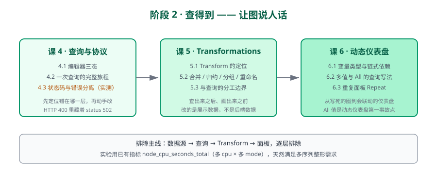

# 阶段 2：查得到

> 所属课程：Grafana ｜ 故事章节：**让图说人话** ｜ 上一阶段：[阶段 1：看得见](../1-看得见/overview.md) ｜ 下一阶段：[阶段 3：叫得醒](../3-叫得醒/overview.md)

## 🎯 本阶段目标

- 掌握查询编辑器与数据源协议，能判断"图不对"到底错在哪一层。
- 用 Transformations 把查出来的数据捏成想要的形状。
- 做出会联动的动态仪表盘，而不是一堆写死的图。

## 📍 学习重点

- **一次查询的完整旅程**：前端 → Grafana 后端 → 数据源代理 → 后端引擎。排障时先定位层，再动手改。
- **状态码与真实错误的分离**（本机实测发现）：后端不可达时 `/api/ds/query` 返回 HTTP 400，而真实错误 `status:502` 藏在 body 里。这是"面板显示红色报错但看不出后端发生了什么"的根源。
- **Transform 的定位**：查出来之后、画出来之前。它改的是展示用数据，不是后端数据。
- **多值与 All 值**：变量选 All 时查询怎么写才不炸，是动态仪表盘最常见的事故点。

## ✅ 必须掌握的知识点

| 知识点 | 所属课 | 学完应能 |
|--------|--------|----------|
| 查询编辑器三态：Code / Builder / Explain | 课 4 | 解释三态各自的用途，以及 Builder 与 Code 切换时的行为差异 |
| 一次查询的完整旅程：前端 → 后端代理 → 数据源 | 课 4 | 画出一趟查询经过的组件，并指出每一层可能出的错 |
| 状态码与真实错误的分离：HTTP 400 里的 status 502 | 课 4 | 看到面板报错时，能从 body 里读出后端真实错误码 |
| Transformations 的定位：查出来之后、画出来之前 | 课 5 | 说清 Transform 与查询的分工：什么该在查询里做，什么该在 Transform 里做 |
| 常用 Transform：合并、归约、按字段分组、重命名 | 课 5 | 用 Transform 把三条独立序列合成一张表 |
| Transform 与查询的分工边界 | 课 5 | 判断一个数据整形需求该改查询还是加 Transform |
| 变量类型：Query / Custom / Interval / 链式依赖 | 课 6 | 建一个依赖前一个变量结果的链式变量 |
| 多值与 All 值：查询里怎么写才不出错 | 课 6 | 用 `=~` 与正则组合写出支持多值与 All 的 PromQL |
| 动态仪表盘：模板化 + 重复面板（Repeat） | 课 6 | 用 Repeat 让一个面板按变量值自动复制 N 份 |

## 🗺️ 本阶段路径图

## 本阶段产出

- [x] `lessons/lesson-04-查询编辑器与数据源协议：一次查询的完整旅程.md`
- [x] `lessons/lesson-05-Transformations：把查出来的数据捏成想要的形状.md`
- [x] `lessons/lesson-06-变量进阶与动态仪表盘.md`

## 本阶段依赖的环境

延续阶段 1 的 `grafana-net`：Grafana 3001 + Prometheus **9201** + node-exporter 9101/9102/9103（3 台）。
> ⚠️ 端口更正：早期文档写的 9091 实为 **pushgateway** 占用（且它对 `/-/ready` 也返 200），本课程 Prometheus 固定用 **9201**。2026-09-04 课 4 交付时核实修正。
课 5 的 Transform 实验需要一个能产生多序列的指标，用 `node_cpu_seconds_total`（多 cpu + 多 mode）天然满足，不额外造数据。

---

[课程目录](../../02-课程目录.md) ｜ [学习路径总览](../../01-学习路径总览.md) ｜ [学习档案](../../00-学习档案.md)
