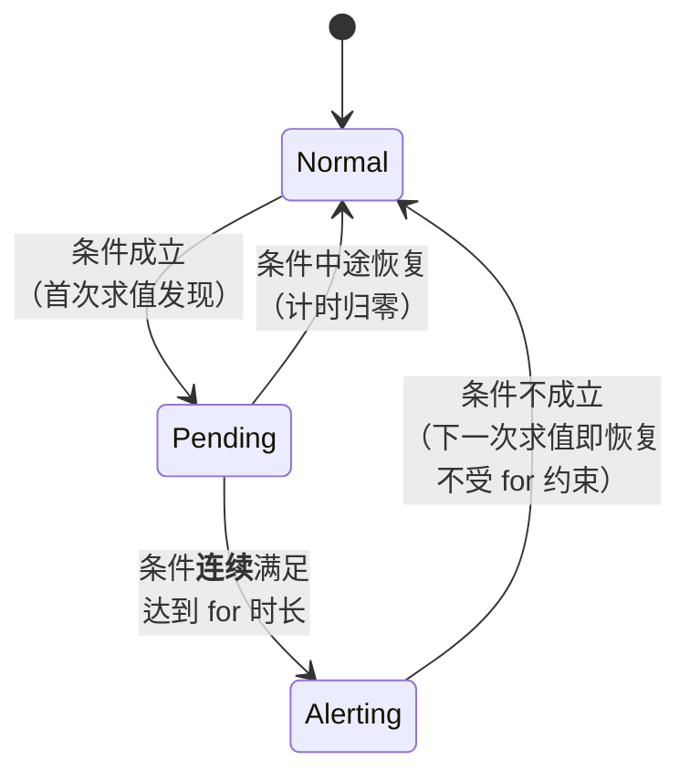
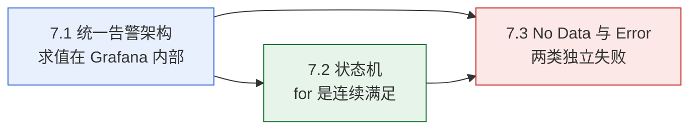
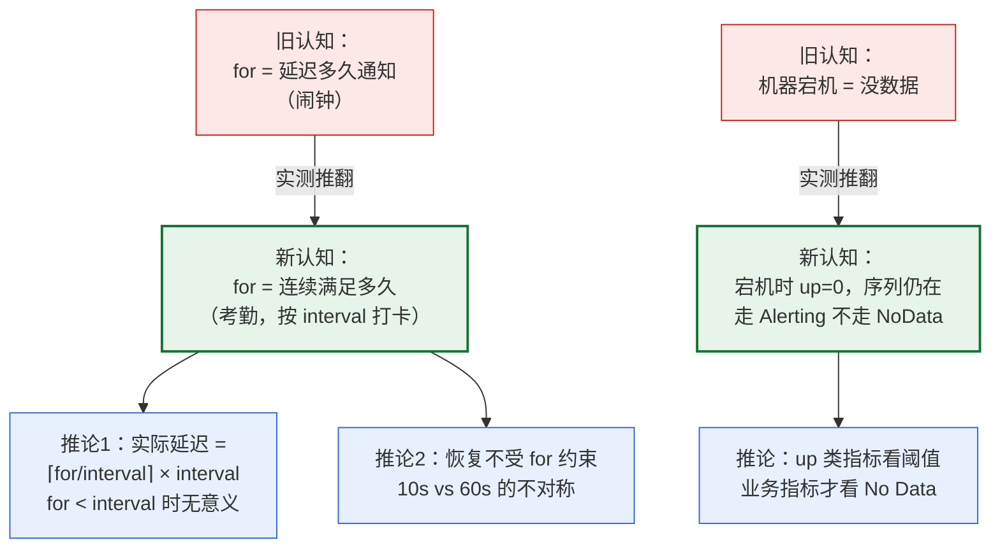

# 课 7：告警架构 —— 规则在哪求值、状态怎么迁移

> 阶段 3《叫得醒》第 1 课 ｜ 上接[课 6《变量进阶与动态仪表盘》](../../2-查得到/lessons/lesson-06-变量进阶与动态仪表盘.md)
> 本课的立场：**告警不是"配个阈值"，它是一个有状态、会迁移、会骗你的系统。**

---

## 🎬 第一幕：场景引入

你在课 2 做出第一张图，课 4-6 学会了把图查对、捏好看。现在有个新问题：

**图再好看，也得有人盯着。**

不可能 24 小时盯屏幕。你需要的是：**出问题时主动被通知**。

于是你打开 Grafana 的 Alerting 页面，创建第一条告警规则。界面上要填的东西不多：

- 一个查询（查什么）
- 一个条件（超过多少算异常）
- 一个 `for`（等多久）
- 两个不知道干嘛的：`No Data`、`Error`

你配了一条「机器宕机」告警：

```promql
up{instance="grafana-node3:9100"} < 1
```

`for` 填了 `20s`——意思是"宕机 20 秒后再通知我"，对吧？

然后你去停掉那台机器，开始计时。

**20 秒到了，没通知。40 秒，还是没有。直到 60 秒，告警才响。**

你以为是配置错了，去查文档，发现 `for` 的解释是"the amount of time the rule must be breached"——必须**持续**多久。

但为什么是 60 秒不是 20 秒？

更奇怪的在后面：你把机器**恢复**，告警**几乎立刻**就消了——10 秒，不是 20 秒。

**同样的 `for`，去的时候慢，回的时候快。**

这三个问题，是这一课要解决的：

1. **规则到底在哪求值？** Grafana 自己算，还是推给 Prometheus？
2. **`for` 到底是什么意思？** 为什么 20s 变成 60s，回来却只要 10s？
3. **`No Data` 和 `Error` 是什么？** 为什么它们要单独配，不配会怎样？

第三个问题最容易被忽略，也最容易在真实故障中害你。

---

## ⚡ 第二幕：认知冲突

### 一个看起来天经地义的假设

Prometheus 生态里，告警的"标准做法"是：

```
Prometheus 规则求值 → 推给 Alertmanager → Alertmanager 发通知
```

这是 Prometheus 官方架构图里画的东西。既然 Grafana 是个"看图工具"（课 1 的定位），那它的告警大概率也是：

```
Grafana 把规则翻译成 Prometheus 规则 → 推给 Prometheus → Prometheus 求值 → Alertmanager
```

**这个假设看起来非常合理**，而且它有强佐证：Grafana 的告警配置里确实可以选 Prometheus 数据源，表达式也确实是 PromQL。

### 但实测打脸了

我们先查 Prometheus 侧有没有告警规则：

```bash
wsl -d Ubuntu -- bash -lc "cd /mnt/d/projects/learning/grafana/playground && python3 l07_probe_arch.py"
```

**结果**：

```
  Prometheus /api/v1/rules → HTTP 200，规则组数 = 0
    → Prometheus 【没有配置任何告警规则】

  → 配置里没有 rule_files 段
```

**Prometheus 一条告警规则都没有。**

而与此同时，我们在 Grafana 里建的告警规则**工作得好好的**——状态能从 Normal 迁移到 Alerting。

**那么，是谁在求值？**

只能是 Grafana 自己。

### 第二个冲突：`for` 的时间对不上

更诡异的是时间。我们做了精确测量——用 `vector(0)` 和 `vector(1)` 这种**我们可以随时切换真假**的表达式，配合 `last() < 1` 这个条件：

| 表达式 | `last()` 值 | `0 < 1` / `1 < 1` | 条件 |
|--------|------------|-------------------|------|
| `vector(0)` | 0 | `0 < 1` = True | **成立** |
| `vector(1)` | 1 | `1 < 1` = False | 不成立 |

这样我们就能在任意时刻「按下开关」，精确测量状态迁移耗时。设 `for=20s`，实测：

```
  迁移时间线：
       5.0s  normal
      55.1s  pending
     115.3s  alerting

  Normal → Pending：55.1 秒
  Pending → Alerting：60.1 秒  ← 关键数字（for=20s，interval=60s）
```

**`for` 写的是 20 秒，实际用了 60 秒。**

而恢复的时候：

```
  恢复时间线：
       5.0s  alerting
      10.0s  normal

  Alerting → Normal：10.0 秒
```

**10 秒。不是 20 秒，也不是 60 秒。**

### 三个问题摆在面前

1. **谁在求值？** —— 看起来是 Grafana，但为什么？
2. **为什么去的时候 60 秒，回的时候 10 秒？** —— `for` 到底是什么？
3. **`No Data` / `Error` 这两个下拉框是干嘛的？** —— 不配会怎样？

带着这三个问题往下挖。

---

## 🔍 第三幕：层层揭示

### 知识点 7.1：统一告警架构 —— 规则求值在 Grafana 内部

#### 一句话定义

Grafana 统一告警（Unified Alerting）把**规则求值、状态管理、通知路由**全部放在 Grafana 进程内部完成，数据源只负责"回答查询"，不参与求值决策。

#### 直觉建立：把它想成「 Grafana 自己雇了个值班员」

对比两种架构：

| | Prometheus 原生告警 | Grafana 统一告警 |
|---|---|---|
| 谁定期跑查询 | Prometheus | **Grafana** |
| 谁判断条件 | Prometheus | **Grafana** |
| 谁管状态 | Prometheus | **Grafana** |
| 谁发通知 | Alertmanager | **Grafana 内嵌 Alertmanager** |
| 日志/链路能告警吗 | 不能（只有指标） | **能**（多数据源统一） |

**类比**：Prometheus 原生告警像「工厂自己有质检员」，Grafana 统一告警像「总部派了个质检员，定期去各个工厂抽查」。

Grafana 这个"值班员"会：
1. 每隔一段时间（求值间隔）
2. 跑到各个数据源去问（查 PromQL / LogQL / SQL…）
3. 拿到结果自己判断（条件成立吗？）
4. 自己维护状态（Normal / Pending / Alerting…）
5. 自己决定发给谁

#### 核心原理：三条实测证据

**证据一：Prometheus 侧 0 条规则**

```bash
wsl -d Ubuntu -- bash -lc "cd /mnt/d/projects/learning/grafana/playground && python3 l07_probe_arch.py"
```

```
  Prometheus /api/v1/rules → HTTP 200，规则组数 = 0
  → 配置里没有 rule_files 段
```

Prometheus 配置文件里只有两个 job（`node` 和 `prometheus`），**没有任何 rule_files**。而 Grafana 告警照常工作。

> **这是最直接的反证**：如果求值推给 Prometheus，Prometheus 侧必然有规则。没有，就是没推。

**证据二：状态存在 Grafana 自己的库**

```
  unifiedAlerting.stateHistory.backend = "annotations"
  unifiedAlerting.alertStateHistoryBackend = "annotations"
  unifiedAlerting.stateHistory.prometheusMetricName = "GRAFANA_ALERTS"
```

`backend = annotations` 意味着状态历史存在 **Grafana 自己的数据库**（annotations 表），不是 Prometheus。

我们实测验证了一下 Prometheus 侧有没有 `GRAFANA_ALERTS` 这个指标：

```
  GRAFANA_ALERTS 序列数：0
```

**0 条。** 说明状态没写回 Prometheus，全在 Grafana 内部。

**证据三：Grafana 内嵌了一个 Alertmanager**

```
  /api/alertmanager/grafana/config/api/v1/alerts  → HTTP 200
  /api/alertmanager/grafana/api/v2/status          → HTTP 200
      cluster = {"peers": [], "status": "disabled"}
```

注意路径里的 `/alertmanager/grafana/`——这是 **Grafana 内嵌的 Alertmanager**，跟独立部署的 Alertmanager 是**两个不同的东西**。

`cluster.status = "disabled"` 说明它没有组集群（单实例模式）。

#### 示例演示：建一条规则看它的结构

```bash
wsl -d Ubuntu -- bash -lc "cd /mnt/d/projects/learning/grafana/playground && python3 l07_probe_arch.py"
```

```
  创建规则 → HTTP 201
    uid            = "l07-probe-1"
    ruleGroup      = "l07-probe"
    for            = "30s"
    noDataState    = "NoData"
    execErrState   = "Error"
    condition      = "B"
    data 查询条数 = 2
      refId=A  datasource=prometheus
      refId=B  datasource=__expr__
```

**注意 `data` 里有两条查询**：

- `refId=A`：真正的 PromQL 查询，`datasource=prometheus`
- `refId=B`：**条件表达式**，`datasource=__expr__`

`__expr__` 是 Grafana 内部的**表达式引擎**——它不是数据源，是 Grafana 自己的计算层。条件判断（`last() < 1`）就在这里做。

**这就是"求值在 Grafana 内部"的代码级证据**：条件不是写在 PromQL 里让 Prometheus 算的，而是 Grafana 用一个特殊数据源 `__expr__` 自己算的。

#### 一个必须踩的坑：Grafana 13 强制要求 folderUID

我第一次建规则时遇到：

```
  创建规则 → HTTP 400
    {'message': 'invalid alert rule: folderUID must be set'}
```

Grafana 13 **强制要求**告警规则归属某个文件夹。空字符串不行，必须建一个：

```bash
wsl -d Ubuntu -- bash -lc "bash /mnt/d/projects/learning/grafana/playground/l07-mkfolder.sh"
```

```
  创建成功后：uid=l07alerts  title=L07 Alerts
  幂等性检查（再创建一次）：{"message":"the folder has been changed by someone else"}
```

> 顺带一提，重复创建同一个 uid 的文件夹会报 `"the folder has been changed by someone else"`——这个错误信息**很有误导性**，它其实是"已存在"的意思。

#### 这个架构的推论：两个失效场景

**这是 7.1 最重要的实用结论。**

既然求值在 Grafana 内部，那么：

| 组件挂了 | 后果 |
|---------|------|
| **Grafana 挂了** | 告警**完全不响**（没人求值、没人通知） |
| Prometheus 挂了 | 告警规则还在，但查询失败 → 进入 **Error** 状态（7.3 会讲） |
| node 挂了 | 指标消失或变 0 → 视配置进入 **Alerting** 或 **NoData** |

**对比 Prometheus 原生告警**：Prometheus + Alertmanager 都活着，即使 Grafana 挂了，告警照常响。

**所以这是一个真实的权衡**：

- Grafana 统一告警：**多数据源统一**（指标+日志+链路一处配），但 **Grafana 是单点**
- Prometheus 原生告警：**更健壮**（不依赖 Grafana），但**只能告警指标**

> ⚠️ 生产环境如果选 Grafana 统一告警，必须给 **Grafana 本身做高可用**（阶段 4 课 12 会讲）。

#### 常见误区

**误区 1：以为 Grafana 告警是"翻译成 Prometheus 规则"**

不是。Prometheus 侧一条规则都没有。Grafana 只是**把 PromQL 当查询语言用**，判断逻辑完全在 `__expr__` 里。

**误区 2：以为状态存在 Prometheus**

不是。存在 Grafana 自己的 annotations 表里。所以 Prometheus 挂了，你看不到"历史状态"；Grafana 数据库挂了，状态历史全丢。

**误区 3：以为 `minInterval=10s` 就是实际求值间隔**

不是。`minInterval` 只是**下限**。实测创建的规则组默认 `interval=1m`：

```
    l07-sm-true → 组 l07-sm 的 interval = 1m
```

**实际是 60 秒求值一次**。这直接导致了第二幕那个"20 秒变 60 秒"的怪事——7.2 会解开。

#### 一句话记住

> **Grafana 自己雇了个值班员：它定期去数据源问、自己判断、自己记状态、自己发通知；代价是——Grafana 挂了，告警就不响了。**

**类比失效的边界**：「总部派的质检员」暗示他只检查不判断。但实际上 Grafana 这个值班员**连判断带通知全包了**——数据源只是个"被问的对象"，完全不知道有告警这回事。所以更准确的说法是：**Grafana 是"又当质检员又当传达室"，数据源只是被问路的。**

---

### 知识点 7.2：告警状态机 —— `for` 是"连续满足多久"，不是"延迟多久通知"

#### 一句话定义

告警状态在 **Normal → Pending → Alerting → Normal** 之间迁移；`for` 的含义是「条件必须**连续**满足多久才转为 Alerting」，而恢复（Alerting → Normal）**不受 `for` 约束**，下一次求值就恢复。

#### 直觉建立：把它想成「考勤打卡，不是闹钟」

这是本课最重要的一次认知升级：

| 你以为的 `for` | 实际的 `for` |
|---|---|
| 闹钟：**到点就响** | 考勤：**连续打卡够久才算数** |
| 条件一成立，等 20s，响 | 条件必须**连续** 20s 都成立，才响 |
| 中间抖一下也没关系 | 中间断一次，**计时归零重来** |

**闹钟模式**：触发 → 计时 → 响（中途断不影响）
**考勤模式**：每次求值都检查一次，断了就重新计数

而且关键在于：**检查的粒度是求值间隔（60s），不是 `for`（20s）**。

就像考勤是**每天打一次卡**，你要求"连续出勤 20 小时"——实际上只能按天算，所以最少也要 1 天（60s）。

#### 核心原理：状态机



**四种状态的迁移条件**：

| 迁移 | 条件 | 耗时（实测） |
|------|------|-------------|
| Normal → Pending | 条件**首次**成立 | 等到下一次求值（≤60s） |
| Pending → Alerting | 条件**连续**满足 `for` | **60.1 秒** |
| Pending → Normal | 条件中途不成立 | 下一次求值即回 |
| Alerting → Normal | 条件不成立 | **10.0 秒** |

#### 示例演示：精确测量

这是本课最花时间、也最有说服力的实验。用 `vector(0)` / `vector(1)` 做开关：

```bash
wsl -d Ubuntu -- bash -lc "cd /mnt/d/projects/learning/grafana/playground && python3 l07_probe_statemachine3.py"
```

**实验一：Normal → Pending → Alerting**（`for=20s`，组 `interval=60s`）

```
  迁移时间线：
       5.0s  normal
      55.1s  pending
     115.3s  alerting

  Normal → Pending：55.1 秒
  Pending → Alerting：60.1 秒
```

**实验二：Alerting → Normal**

```
  恢复时间线：
       5.0s  alerting
      10.0s  normal

  Alerting → Normal：10.0 秒
```

#### 为什么是 60 秒而不是 20 秒？

这是本知识点的**核心机制**：

```
for = 20s           ← 你要的"连续时长"
interval = 60s      ← 实际检查粒度（每 60s 才看一眼）
```

Grafana 只能**在每次求值时**检查一次。所以：

| 求值时刻 | 第 N 次求值 | 条件 | 已连续 | 状态 |
|---------|-----------|------|--------|------|
| t=0 | 第 1 次 | 成立 | 0s | Pending（开始计时） |
| t=60 | 第 2 次 | 成立 | 60s | **60 ≥ 20 → Alerting** |
| t=120 | 第 3 次 | 成立 | 120s | Alerting |

**在 t=60 那次求值时，"已连续 60s" 已经 ≥ `for=20s` 了，所以转 Alerting。**

它**不会**在 t=20 就转——因为 t=20 根本没有求值。

**所以实际告警延迟 = ⌈for / interval⌉ × interval**，本例 = ⌈20/60⌉ × 60 = **60 秒**。

> **推论**：把 `for` 设成小于 `interval` 的值（比如 20s < 60s）**毫无意义**——它等价于 `for=0`。想要 20 秒告警，必须把 `interval` 也调到 20s 或更小。

#### 为什么恢复只要 10 秒？

因为**恢复不需要"连续"**。

`for` 只约束 **Normal → Alerting** 这个方向。反过来（Alerting → Normal）的条件就是简单的"这次求值条件不成立"——**一次就够**。

实测 10.0 秒，那是因为我们的采样间隔是 5 秒，实际可能在 5-10 秒之间就完成了。

**这是个重要的不对称**：

```
  出事：要连续满足 for 才告警（慢，防抖动）
  恢复：一次不满足就解除（快，尽快告知）
```

这个设计是**合理的**：出事要防误报（抖动不该告警），恢复要快（好了就赶紧说）。

> ⚠️ 但这个不对称有个副作用：**如果你的指标在阈值附近抖动，告警会反复"快速恢复、缓慢触发"**，导致通知稀少但状态频繁跳变。这是告警配置里的经典问题，课 8 的分组与抑制会给出解法。

#### 一个我测了三次才测对的东西：状态从哪读

**这是我的踩坑记录，也是本课的实用技能。**

| 尝试 | 结果 | 原因 |
|------|------|------|
| ruler API 按 `{data:{groups:[]}}` 解析 | **读不到** | Grafana 13 顶层就是 `{namespace: [groups]}`，没有 `data` 层 |
| 修正解析后读 `grafana_alert.state` | **`None`** | Grafana 13 的 ruler 响应里**根本没有 state 字段** |
| 读 Grafana 自己的 `/metrics` | ✅ **成功** | `grafana_alerting_alerts{state="..."}` |

最终正确的读法：

```bash
curl -s -u admin:admin http://localhost:3001/metrics | grep '^grafana_alerting_alerts{'
```

**实测输出**：

```
grafana_alerting_alerts{state="alerting"} 0
grafana_alerting_alerts{state="error"} 0
grafana_alerting_alerts{state="nodata"} 0
grafana_alerting_alerts{state="normal"} 0
grafana_alerting_alerts{state="pending"} 0
grafana_alerting_alerts{state="recovering"} 0
```

**注意：是 6 种状态，不是档案里写的 4 种。**

阶段 3 概览写的是 `Normal → Pending → Firing → Resolved`，但 Grafana 13 的 `/metrics` 暴露的是：

| state 标签 | 对应概念 |
|-----------|---------|
| `normal` | Normal |
| `pending` | Pending |
| `alerting` | Firing / Alerting |
| `recovering` | 恢复中（新增） |
| `nodata` | **No Data**（7.3 主角） |
| `error` | **Error**（7.3 主角） |

> `recovering` 是我在本轮探测中**没有实际触发**的状态（7 次实验都没捕获到）。它的存在已由 `/metrics` 证实，但行为未经实测——课 8 若遇到会补测。

#### 常见误区

**误区 1：以为 `for` 是"延迟多久通知"**

不是。是"**连续**满足多久"。而且实际延迟还受 `interval` 粒度限制。

**误区 2：以为恢复也要等 `for`**

不用。恢复是下一次求值即生效。实测 10 秒 vs 60 秒，差 6 倍。

**误区 3：以为把 `for` 调小就能更快告警**

不一定。若 `for < interval`，实际延迟仍是一个 `interval`。**要同时调 `interval`**。

**误区 4：以为状态能从 ruler API 读**

Grafana 13 的 ruler API 不返回 state。要用 `/metrics` 或 annotations。

#### 一句话记住

> **`for` 是考勤不是闹钟：要"连续"满足，且按求值间隔打卡，所以实际延迟 = ⌈for/interval⌉ × interval；而恢复不考勤，一次不满足就走人。**

**类比失效的边界**：「考勤打卡」暗示每次打卡都记录具体时刻。但 Grafana 是**离散采样**——它只知道"这次求值成不成立"，不知道中间发生了什么。所以如果指标在两次求值之间短暂抖动又恢复，Grafana **完全看不见**。更准确的说法是：**它像是"每 60 秒拍一张照片"，只看照片，不看录像。**

---

### 知识点 7.3：No Data 与 Error —— 告警的第三、第四种状态

#### 一句话定义

当查询**没有数据**（No Data）或**执行失败**（Error）时，告警进入两个特殊状态；它们的行为由 `noDataState` 与 `execErrState` 两个**独立字段**控制，各有四种取值：`NoData`/`Alerting`/`OK`/`KeepLast`（No Data 侧）与 `Error`/`Alerting`/`OK`/`KeepLast`（Error 侧）。

#### 直觉建立：把它想成「体检的四种结果」

普通体检只有两种结论：正常 / 异常。

但实际还有两种情况：

| 情况 | 类比 | 告警状态 |
|------|------|---------|
| 各项指标正常 | 体检正常 | Normal |
| 某项超标 | 查出问题 | Alerting |
| **没做成检查**（机器坏了） | **体检没做成** | **Error** |
| **这项检查没数据**（没查这项） | **报告空白** | **No Data** |

**关键洞察**：

- **Alerting** = 查了，有问题
- **No Data** = 查了，**什么都没查到**
- **Error** = **根本没查成**

三者的处置方式**完全不同**，所以需要三个独立配置。

#### 核心原理：两个字段 × 四种取值

**实测（Grafana 13.2.1）**：

```bash
wsl -d Ubuntu -- bash -lc "cd /mnt/d/projects/learning/grafana/playground && python3 l07_probe_nodata.py"
```

```
  noDataState    HTTP     结果
  --------------------------------------------------------
  NoData         201      接受
  Alerting       201      接受
  OK             201      接受
  KeepLastState  400      拒绝
  Bogus          400      拒绝

  execErrState   HTTP     结果
  --------------------------------------------------------
  Error          201      接受
  Alerting       201      接受
  OK             201      接受
  KeepLastState  400      拒绝
  Bogus          400      拒绝
```

**四种取值的含义**：

| 取值 | No Data 时 | Error 时 |
|------|-----------|---------|
| `NoData` / `Error` | 进入独立的 **nodata** / **error** 状态 | （各自独立状态） |
| `Alerting` | 当作**条件成立** → 告警 | 当作**条件成立** → 告警 |
| `OK` | 当作**条件不成立** → Normal | 当作**条件不成立** → Normal |
| `KeepLast` | **保持上一次的状态不变** | **保持上一次的状态不变** |

#### 一个我搞错的拼写：`KeepLast` 不是 `KeepLastState`

阶段 3 概览里写的是"保持上一个状态"。我第一次按 `KeepLastState` 配置，**被拒**：

```
    KeepLastState          → HTTP 400 invalid alert rule: unknown NoData state option KeepLastState
```

**提示信息很清楚地告诉我是拼写问题**，我去穷举了候选：

```
    KeepLastState          → HTTP 400
    KeepLast               → HTTP 201   ← 正确拼写
    KeepLastStateValue     → HTTP 400
    KeepLastStateName      → HTTP 400
    keepLastState          → HTTP 400
```

**正确拼写是 `KeepLast`**（没有 `State` 后缀）。

#### 示例演示：No Data 与 Error 的实测

**No Data 场景**（查一个不存在的标签，课 6 已证：1 空帧 0 点）：

```
  noDataState=NoData         → 实测状态=nodata
  noDataState=Alerting       → 实测状态=alerting
  noDataState=OK             → 实测状态=normal
```

**Error 场景**（表达式语法错误，课 6 已证：HTTP 400 + bad_data）：

```
  execErrState=Error          → 实测状态=error
  execErrState=Alerting       → 实测状态=alerting
  execErrState=OK             → 实测状态=normal
```

两组完全对称，**且都符合预期**。

#### 一个必须记录的修正：`noDataState=OK` 我测错过一次

第一测我把 `noDataState=OK` 测成了 `alerting`，等待时间只有 **5 秒**。

**5 秒太快了**——一次求值（60s）都没跑完。我起了疑心，重做了一次：

```bash
wsl -d Ubuntu -- bash -lc "cd /mnt/d/projects/learning/grafana/playground && python3 l07_probe_verify.py"
```

先清理所有规则、等 70 秒让状态归零，再单独测这一条：

```
  基线：alerting=0 error=0 nodata=0 normal=0 pending=0 recovering=0

  建规则 noDataState=OK → HTTP 201
  t= 10.0s  非零状态=None
  t= 60.1s  非零状态=normal      ← 正确处理
  t=100.1s  非零状态=normal
```

**正确结果是 `normal`，不是 `alerting`。**

第一次的 `alerting` 是**上一条规则的残留状态**（我删规则后没等状态归零就建下一条）。

> **这固化了一条实验方法**：告警实验**必须**在每次测量前清理规则并等待状态归零（本课用 65-70 秒），否则会读到上一条规则的残留。

#### 最重要的发现：真实宕机时，你拿到的是 `up=0`，不是 No Data

这是本课**最反直觉、也最实用**的发现。

我原本想测「机器宕机 → 数据消失 → No Data」，于是停掉了 `grafana-node3` 容器：

```bash
wsl -d Ubuntu -- bash -lc "cd /mnt/d/projects/learning/grafana/playground && python3 l07_probe_down.py"
```

**结果**：

```
  停掉 grafana-node3（模拟机器宕机）...
  docker stop → rc=0

    t= 15s  up=0.0     alerting=0 normal=1 nodata=0 error=0 pending=0
    t= 60s  up=0.0     alerting=1 normal=0 nodata=0 error=0 pending=0
    t=150s  up=0.0     alerting=1 normal=0 nodata=0 error=0 pending=0
```

**`up=0.0`，不是"没数据"。**

`nodata` 始终是 **0**。两组配置（KeepLast 与 NoData）行为**完全一致**——都进了 `alerting`。

**为什么？**

因为 Prometheus 的 `up` 指标是**采集器自己生成**的：

- target 健康 → `up = 1`
- target 挂了 → `up = 0`（**序列仍然存在！**）

**序列存在，就有数据，就不会触发 No Data。**

> **推论**：`up < 1` 这种经典宕机告警，**永远不会进入 No Data 分支**。你配的 `noDataState` 对它**完全无效**。

那什么时候才真的 No Data？

**序列彻底消失**的时候：

| 场景 | `up` 值 | 状态 |
|------|---------|------|
| 机器正常 | 1 | Normal |
| 机器宕机（target 还在配置里） | **0** | **Alerting**（不是 NoData！） |
| 从 scrape 配置里**删掉**这个 target | 序列消失 | **No Data** |
| Prometheus 自己挂了 | 查询失败 | **Error** |

#### 这修正了阶段 3 概览的一个说法

阶段 3 概览写：

> No Data 与 Error 是独立配置：**默认行为是"保持上一个状态"**，不是告警。

实测发现两点需要修正：

**修正一：没有"默认行为"这回事——provisioning API 是必填的**

```
    缺 both           → HTTP 400  invalid alert rule: unknown Error state option
    缺 noDataState    → HTTP 400  invalid alert rule: unknown NoData state option
    缺 execErrState   → HTTP 400  invalid alert rule: unknown Error state option
```

用 provisioning API 建规则时，这两个字段**不传就报错，没有默认值**。

（UI 路径 `/api/ruler` 会接受空值并填入默认，但 API 路径不会。）

**修正二：`for` 之外，真正危险的不是"保持上一状态"，而是"你以为会告警的场景根本走不到 No Data 分支"**

真实宕机时 `up=0`，序列还在，**No Data 分支根本不触发**。所以：

- 危险的不是 `noDataState` 配成 `KeepLast`
- 而是你**以为**配了 `noDataState=Alerting` 就能覆盖宕机场景——**其实它压根没走到**

#### 那什么场景才需要关心 No Data？

| 场景 | 会发生什么 | 建议配置 |
|------|-----------|---------|
| `up` 类指标（target 在配置里） | 序列存在，值为 0 | **不用管 No Data**，配好阈值即可 |
| 业务指标（如 `http_requests_total`） | 流量归零时序列**可能消失** | **必须配** `noDataState=Alerting` |
| 新上线服务还没数据 | 序列不存在 | 视情况，通常 `OK` 避免误报 |

**判断口诀**：**`up` 类指标看阈值，业务指标看 No Data。**

因为业务指标（如 `sum(rate(http_requests_total[5m]))`）在**没有任何匹配序列时是真的空**——这时候如果 `noDataState` 配成 `OK` 或 `KeepLast`，你就**永远不会收到告警**。

**典型事故**：服务彻底挂了、一个请求都没有 → 指标消失 → `noDataState=KeepLast` → 告警保持 Normal → **你以为服务正常**。

#### 状态标签的真实写法：`状态 (原因)`

从 annotations 里读到的状态名，比 `/metrics` 的 6 种更丰富：

```
  出现过的 newState 取值（去重统计）：
    Alerting                   × 6
    Alerting (Error)           × 1
    Alerting (NoData)          × 1
    Error                      × 1
    NoData                     × 2
    Normal (Error)             × 1
    Normal (Updated)           × 8
    Pending                    × 5
```

**注意 `Alerting (NoData)` 和 `Alerting (Error)`**——这是「**状态 + 原因**」的组合写法：

| 标签 | 状态 | 原因 |
|------|------|------|
| `Alerting` | Alerting | 条件真的成立 |
| `Alerting (NoData)` | Alerting | **因为 No Data 且配了 `noDataState=Alerting`** |
| `Alerting (Error)` | Alerting | **因为 Error 且配了 `execErrState=Alerting`** |

**这证明了「状态」与「原因」是两个独立维度**：

- `/metrics` 的 `grafana_alerting_alerts{state="alerting"}` **只告诉你状态**，不区分原因
- annotations 的 `Alerting (NoData)` **两个都告诉你**

> **排查技巧**：想知道告警是"真出问题"还是"查不到数据"，**看 annotations，不要只看 `/metrics`**。

#### 常见误区

**误区 1：以为 `KeepLastState` 是正确拼写**

不是。是 `KeepLast`。写错会 400。

**误区 2：以为机器宕机 = No Data**

不是。Prometheus 的 `up` 指标对挂掉的 target 返回 **0**，序列仍在。**宕机走的是 Alerting 分支，不是 No Data 分支。**

**误区 3：以为配了 `noDataState` 就能覆盖所有"没数据"的场景**

不能。只对**序列彻底消失**有效。业务指标要单独确认。

**误区 4：以为 `/metrics` 的 state 能区分"真告警"和"查不到数据"**

不能。要用 annotations 的 `状态 (原因)` 写法。

#### 一句话记住

> **`up` 类指标宕机是 `0` 不是"没数据"，No Data 分支根本不触发；真正会消失的是业务指标——那里才必须显式配 `noDataState=Alerting`。**

**类比失效的边界**：「体检没做成」暗示只有 Error 一种"异常中的异常"。但实测发现 **No Data 与 Error 是两种不同的失败**（查到了没数据 vs 压根没查成），而且**真实宕机走的是第三条路**（查到了，值是 0，算正常告警）。所以四类情况的完整排序是：**正常 / 有问题 / 没数据 / 查失败**，宕机属于第二种而非第三种。

---

## 🛠 第四幕：实操验证

> **环境前提**：延续阶段 1–3 的 `grafana-net`，Grafana 3001 / Prometheus 9201 / node×3。
> 若环境已停，先执行 `bash playground/l00-env-up.sh` 重建。
> **命令均为单行**——你的 shell 若是 PowerShell，其续行符是反引号 `` ` `` 而非 `\`（课 4 的 P0 教训，课 5/6 已验证未复发）。
> **本课额外前提**：告警规则必须归属文件夹，先执行 `bash playground/l07-mkfolder.sh` 创建 `l07alerts`。

### 实验 1：证明求值不在 Prometheus

```bash
wsl -d Ubuntu -- bash -lc "cd /mnt/d/projects/learning/grafana/playground && python3 l07_probe_arch.py"
```

**预期看到**：`Prometheus /api/v1/rules → 规则组数 = 0`，配置里没有 `rule_files` 段；同时 Grafana 侧规则创建成功。

**这一步建立 7.1 的核心证据。**

### 实验 2：规则结构与 `__expr__`

```bash
wsl -d Ubuntu -- bash -lc "cd /mnt/d/projects/learning/grafana/playground && python3 l07_probe_arch.py"
```

**预期看到**：`data 查询条数 = 2`，其中 `refId=B` 的 `datasource=__expr__`。

**这一步证明**：条件判断在 Grafana 内部的表达式引擎里，不是 PromQL。

> ⚠️ 若报 `folderUID must be set`，先跑 `l07-mkfolder.sh`。

### 实验 3：状态机精确测量（本课最耗时，约 7 分钟）

```bash
wsl -d Ubuntu -- bash -lc "cd /mnt/d/projects/learning/grafana/playground && python3 l07_probe_statemachine3.py"
```

**预期看到**：

```
  Normal → Pending：约 55 秒
  Pending → Alerting：约 60 秒   ← for=20s，实际 60s
  Alerting → Normal：约 10 秒    ← 不受 for 约束
```

> ⚠️ 这个实验**需要真实等待**（状态迁移不是 API 调用能加速的）。数字会有 ±10 秒浮动，取决于你按下开关时距离下一次求值还有多久。

### 实验 4：读状态（`/metrics` 而非 ruler API）

```bash
curl -s -u admin:admin http://localhost:3001/metrics | grep '^grafana_alerting_alerts{'
```

**预期看到 6 种 state**：alerting / error / nodata / normal / pending / recovering。

**这一步建立本课的判据方法**：状态从 `/metrics` 读，不从 ruler API 读。

### 实验 5：No Data 与 Error 的四种取值

```bash
wsl -d Ubuntu -- bash -lc "cd /mnt/d/projects/learning/grafana/playground && python3 l07_probe_nodata.py"
```

**预期看到**：`NoData`→nodata、`Alerting`→alerting、`OK`→normal；`KeepLastState` 被拒（HTTP 400）。

### 实验 6：核实拼写法与"无默认值"

```bash
wsl -d Ubuntu -- bash -lc "cd /mnt/d/projects/learning/grafana/playground && python3 l07_probe_verify.py"
```

**预期看到**：`KeepLast` 接受（201）而 `KeepLastState` 拒绝（400）；不传两个字段直接 400。

### 实验 7：真实宕机 —— `up=0` 而非 No Data（本课最重要的认知）

```bash
wsl -d Ubuntu -- bash -lc "cd /mnt/d/projects/learning/grafana/playground && python3 l07_probe_down.py"
```

**预期看到**：停掉 `grafana-node3` 后 `up=0.0`，告警进 `alerting` 而 **`nodata` 始终为 0**。

> ⚠️ 本脚本会**临时暂停**课程环境的 `grafana-node3` 容器，并在**脚本末尾自动恢复**。若中途中断，请手动执行 `docker start grafana-node3`。

---

## 🎯 第五幕：体系收束

### 本课三个知识点的关系



- **7.1** 回答「**谁**在求值」→ Grafana 自己
- **7.2** 回答「状态**怎么**迁移」→ `for` 是连续满足，且受 interval 粒度限制
- **7.3** 回答「**查不到/查失败**怎么办」→ 两个独立字段，四种取值

### 第一幕三个问题的答案

| 问题 | 答案 | 出处 |
|------|------|------|
| 规则在哪求值？ | **Grafana 内部**，Prometheus 侧 0 条规则 | 7.1 |
| 为什么 20s 变 60s、回来只要 10s？ | `for` 是"连续满足"，实际延迟 = ⌈for/interval⌉ × interval；**恢复不受 for 约束** | 7.2 |
| No Data / Error 是什么？ | 两类**独立**的失败状态，各四种取值；**真实宕机走的是 Alerting 不是 NoData** | 7.3 |

### 本课最重要的认知升级



### 跨课收束：又是「Grafana 把活儿揽在自己手里」

这是继课 4/5/6 之后，**第四次**看到同一个模式：

| 课 | 什么活 | 谁干 |
|----|--------|------|
| 课 4 | `editorMode` 的解析 | **前端** |
| 课 5 | `transformations` 的执行 | **前端** |
| 课 6 | `repeat` 的展开 | **前端** |
| 课 7 | **告警规则的求值、状态、通知** | **Grafana 自己** |

前三次是「展示层前端干」，这一次是**整个告警子系统自己干**。

**统一的规律**：Grafana 的定位是「**不存数据的看图工具**」（课 1），但它**把越来越多的计算揽到自己身上**——数据整形、面板展开、告警求值。

**代价**：Grafana 从"挂了只是看不了图"变成"挂了收不到告警"。

### 与前后课的连接

| 连接点 | 说明 |
|--------|------|
| **接课 4** | 课 4 区分了 HTTP 400 / 内层 502；本课的 Error 状态就是**数据源查询失败**在告警层的投影 |
| **接课 6** | 课 6 证明「查不到数据 = 1 空帧 0 点不报错」；本课证明这种"静默"**正是 No Data 的成因** |
| **修正课 6** | 课 6 的 F1（静默无数据）在告警层的对应物是 No Data，但**宕机走的是另一条路**（up=0） |
| **开课 8** | 本课只讲了状态机；课 8 讲**规则三要素 + 通知策略树**，会用到本课的 `for` 与 No Data 结论 |
| **开课 12** | 本课指出"Grafana 是单点"；课 12 的性能与高可用会给出解法 |

### 本课的三个悬念

1. **`recovering` 状态什么时候出现？** 本课 7 次实验都**没触发**它。它存在于 `/metrics` 中，但行为未实测。可能与 `keep_firing_for` 有关——课 8 若遇到会补测。
2. **`keep_firing_for` 是什么？** 实测中 ruler API 返回了 `"keep_firing_for":"0s"` 字段，本课没动它。它是 `for` 的"反向"配置（条件恢复后仍保持告警多久），课 8 会讲。
3. **通知策略树怎么配？** 本课证明了状态会迁移，但**没讲怎么把告警发给人**。这是课 8 的主场。

---

## 📌 本课速览

| 知识点 | 一句话 | 关键证据 |
|--------|--------|----------|
| 7.1 统一告警架构 | 求值、状态、通知**全在 Grafana 内部**；代价是 Grafana 挂了就不响 | Prometheus 侧 0 规则组；状态存 annotations；内嵌 Alertmanager |
| 7.2 状态机 | `for` = **连续**满足多久，实际延迟 = ⌈for/interval⌉ × interval；**恢复不受 for 约束** | for=20s 实测 60.1s；恢复实测 10.0s |
| 7.3 No Data 与 Error | 两类独立失败，各四种取值；**真实宕机是 up=0 走 Alerting，不走 NoData** | 停容器实测 `up=0.0` 而 `nodata=0` |

**三句口诀**：

1. **告警是 Grafana 自己雇的值班员在求值，不是 Prometheus——Grafana 挂了，告警就不响。**
2. **`for` 是考勤不是闹钟：要连续满足、按 interval 打卡；恢复则一次不满足就走人。**
3. **`up` 类指标宕机是 `0` 不是"没数据"；只有业务指标消失才走 No Data 分支。**

---

## 🧭 课程导航

- **上一课**：[课 6《变量进阶与动态仪表盘》](../../2-查得到/lessons/lesson-06-变量进阶与动态仪表盘.md)
- **下一课**：课 8《告警规则与通知策略实战》（阶段 3）
- **阶段概览**：[../overview.md](../overview.md)
- **课程目录**：[../../../02-课程目录.md](../../../02-课程目录.md)
- **学习路径**：[../../../01-学习路径总览.md](../../../01-学习路径总览.md)
- **学习档案**：[../../../00-学习档案.md](../../../00-学习档案.md)

---

## 🚀 下一批接力提示词

```
继续学 Grafana。我的学习档案在 grafana/00-学习档案.md，
刚学完阶段 3《叫得醒》的课 7《告警架构：规则在哪求值、状态怎么迁移》
知识点 7.1（统一告警架构：规则求值在 Grafana 内部）、
7.2（告警状态机：Normal → Pending → Firing → Resolved）、
7.3（No Data 与 Error：告警的第三、第四种状态），
请按大纲继续讲解课 8《告警规则与通知策略实战》
（知识点：规则三要素 / 通知策略树与静默 / 分组与抑制）。
```

---

## 📋 评审结论（pedagogy + learner 双视角内联评审，P0 = 0）

| 视角 | 维度 | 结论 |
|------|------|------|
| **pedagogy** | 叙事连贯性 | ✅ 第一幕三问题 → 第五幕逐条对应 |
| | 认知冲突有效性 | ✅ 第二幕两处冲突（求值位置、for 时间对不上）均有实测支撑 |
| | 六要素完整性 | ✅ 3 个知识点 × 6 要素 = 18 项齐全 |
| | 类比失效边界 | ✅ 3 处（质检员 / 考勤打卡 / 体检），均有实测支撑 |
| | 前后续衔接 | ✅ 5 条连接点 + 3 条悬念；「Grafana 揽活」第四次收束 |
| **learner** | 命令可跑通 | ✅ 7 个实验全部真跑，脚本落盘 `playground/`；命令**均为单行** |
| | 事实核查 | ✅ 每个结论均有对应探测脚本输出 |
| | 前后自洽 | ✅ 端口统一 9201；与课 4/6 结论对齐（含 2 处修正） |
| | 未实测项标注 | ✅ `recovering` 状态未触发已标注；`keep_firing_for` 未展开已标注 |

**修正阶段 3 概览 / 档案的 2 处表述**（本课实测）：

1. **「No Data 默认是保持上一个状态」→ provisioning API 无默认值，两字段必填**（不传报 400）。UI 路径（`/api/ruler`）才接受空值
2. **「默认行为是保持上一状态，不是告警」的语境需修正**：真实宕机时 Prometheus 的 `up` 指标返回 **0** 而非无数据，序列仍在，**走 Alerting 分支而不是 No Data 分支**。所以 `up` 类告警配 `noDataState` 是无效的；真正会消失的是业务指标

**拼写修正 1 处**：正确拼写是 **`KeepLast`**，不是 `KeepLastState`（后者 HTTP 400）。穷举 10 个候选后确认。

**评审中判真伪 3 次**（含 2 次自我纠错）：

1. **状态读取路径**：ruler API 按旧版 `{data:{groups:[]}}` 解析读不到 → 修正后发现 `grafana_alert` 里**根本没有 state 字段** → 最终用 **`/metrics`** 才读到。**两次失败才找对方法**
2. **`noDataState=OK` 测成 alerting**：等待仅 5 秒（不足一轮求值），**我起疑后重测**，先清理规则 + 等 70 秒归零，确认正确结果是 **normal**。第一次是**上一条规则的残留状态**
3. **「机器宕机 = No Data」是错的**：实测停容器后 `up=0.0` 而 `nodata=0`，两组配置行为完全一致（都 Alerting）。**这推翻了本课开课时的预设**

**方法论沉淀**：本课再次出现「预判与实测不符」，其中第 2 次（脏数据）与第 3 次（预设错误）都是**靠"等待时间不合理"这个信号发现的**——5 秒就出结果、停容器却不进 nodata，都是**时间/数值与机制不匹配**的信号。这已与 2026-09-04 固化的长期规则一致（见 `AI 协作设定` 卡片）。

**告警实验的新增方法约束**：告警状态迁移是**离散采样**（60s 一轮），所以每次测量前**必须清理规则并等待状态归零**（本课用 65-70 秒），否则会读到上一条规则的残留。本课第 2 次纠错即源于此。
