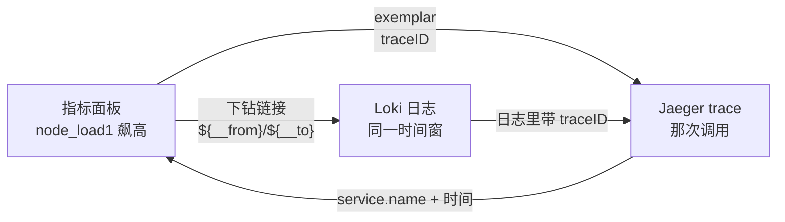

# 第 9 课：日志与链路：指标之外的另外两只眼

> 所属阶段：阶段 3《叫得醒》｜ 水平：入门 ｜ 本课知识点：Loki 与 LogQL、指标到日志下钻、Jaeger 与 exemplar
> 故事情节：故事主线收束——指标告诉你"出问题了"，日志告诉你"出了什么问题"，链路告诉你"卡在哪一跳"

## 🎯 本课目标

- 接上 Loki 并写出第一条 LogQL 查询
- 给面板加一个带时间变量的下钻链接，点击直达日志
- 从指标点进 Jaeger 的对应 trace

## 知识点导航

| # | 知识点 | 关键点 | 状态 |
|---|--------|--------|------|
| 9.1 | Loki 数据源与 LogQL 入门 | 标签模型 / LogQL 两种查询 / 与 PromQL 的差异 | ✅ 已完成 |
| 9.2 | 从指标到日志：时间窗对齐与下钻链接 | 时间变量 / 下钻链接写法 / 标签透传 | ✅ 已完成 |
| 9.3 | 链路下钻：Jaeger 数据源与 exemplar | Jaeger 数据源 / exemplar 机制 / traceID 关联 | ✅ 已完成 |

---

## 📖 开篇：凌晨三点，你手里只有一条曲线

告警响了（课 7、课 8 的成果）。你打开 dashboard，看到一条红色曲线：

```
node_load1{instance="node-beta:9100"}  从 0.3 飙到 8.7
```

然后呢？

你**知道**有问题了。但：

- 是哪一个请求把 CPU 打满的？
- 是数据库慢查询，还是某个循环写错了？
- 是哪一次调用触发的？

指标只能回答"出问题了"，回答不了"出了什么问题"和"卡在哪一跳"。

于是你熟练地打开三个控制台：Grafana 看指标、日志平台查日志、链路平台翻 trace。然后开始**手工对齐时间戳**——

> "Grafana 上这个尖峰是 02:14:30，日志平台的时间是 UTC+8 还是 UTC？我这边显示的 02:14 对应它那边几点？"

**这就是本课要消灭的手工劳动。**

本课结束后，你要做到：在 Grafana 这一个界面里，看到指标异常 → 点一下 → 看到那个时刻的日志 → 再点一下 → 看到那次调用的完整链路。时间窗自动对齐，不用换算。

---

## 🧠 9.1 Loki 数据源与 LogQL 入门

### 一句话定义

**Loki 是一个只索引标签、不索引内容**的日志系统；LogQL 是它的查询语言，语法刻意长得像 PromQL。

### 直觉建立：图书馆vs快照柜

想象两种查资料的方式：

**方式 A（Elasticsearch 的思路）——全文索引**
把每一本书的每个词都做成索引卡片。你问"哪本书提到了'文艺复兴'"，立刻能查到。
代价：索引比原书还大，写入慢，存储贵。

**方式 B（Loki 的思路）——只编目，不拆书**
图书馆只给每本书做一张卡片：分类、作者、年份（= **标签**）。书本身原样压缩堆在仓库里（= **日志内容**）。
你问"2024 年历史类的书有哪些"，秒回。
你问"哪本书提到了'文艺复兴'"，管理员只能把符合条件的书**一本本翻**（= 全量扫描）。

Loki 选了方式 B。**它赌的是：你查日志时，多半已经知道要查哪个服务、哪个环境、哪个级别**——这些恰好都是标签。

> **Loki 的取舍**：用"内容查询慢"换"存储便宜、写入快"。日志量越大，这个取舍越值。

### 核心原理

#### （1）Loki 的数据模型：stream

Loki 里没有"索引文档"这个概念，只有 **stream（流）**。

```
一个 stream = 一组【完全相同】的标签 + 一串按时间排的日志行
```

例如：

```
{job="shop", level="error", svc="payment"}  →  [t1, "payment failed order=1001"]
                                              [t2, "payment timeout order=1002"]
{job="shop", level="info",  svc="payment"}  →  [t3, "payment ok order=1003"]
```

**标签组合每变一次，就是一个新 stream。**

这是 Loki 最重要的一条性质，也是它最容易出事的地方——后面我们会实测看到，**日志内容不同，也可能悄悄把你拆成多个 stream**。

#### （2）推送模型：Loki 不主动抓

Prometheus 是**拉**（pull）：它主动去 `target/metrics` 抓。
Loki 是**推**（push）：它坐在那里等别人送过来。

```
应用 → (promtail / fluent-bit / otelcol) → POST /loki/api/v1/push → Loki
```

本课为了让你看清机制，我们**手工推**（直接 curl/Python 打这个接口）。真实环境由 agent 代劳。

#### （3）LogQL 的两种形态

| 形态 | 返回什么 | 长什么样 |
|---|---|---|
| **日志查询**（log query） | 日志**行** | `{job="shop"} |= "failed"` |
| **指标查询**（metric query） | **数字** | `count_over_time({job="shop"}[5m])` |

第二种 = 在第一种外面**套一个函数**。这个设计让"把日志变成指标"变得非常自然——比如"每分钟错误日志条数"。

### 示例演示：接上 Loki 并写第一条 LogQL

#### 第 1 步：起 Loki 并推几条日志

```bash
# 起 Loki（端口 3101）
docker run -d --name grafana-loki --network grafana-net -p 3101:3100 grafana/loki:3.5.6 -config.file=/etc/loki/local-config.yaml
```

推日志（Python，你也可以用 curl 等价实现）：

```python
import json, time, urllib.request

LOKI = "http://localhost:3101"
now = int(time.time())

# 3 个 stream：标签组合不同的就是不同 stream
streams = [
    {"stream": {"job": "shop", "level": "error", "svc": "payment"},
     "values": [[str((now-30)*10**9), "payment failed order=1001 user=u7"],
                [str((now-20)*10**9), "payment timeout order=1002 user=u8"]]},
    {"stream": {"job": "shop", "level": "info", "svc": "payment"},
     "values": [[str((now-25)*10**9), "payment ok order=1003 user=u9"]]},
    {"stream": {"job": "shop", "level": "error", "svc": "checkout"},
     "values": [[str((now-10)*10**9), "checkout failed cart=c55 user=u7"]]},
]

body = json.dumps({"streams": streams}).encode()
r = urllib.request.Request(f"{LOKI}/loki/api/v1/push", data=body,
                           headers={"Content-Type": "application/json"})
print(urllib.request.urlopen(r).status)   # 期望 204
```

⚠️ **成功是 HTTP 204，且没有响应体**。Loki 推成功时一声不吭——如果你期待它回个 `{"status":"success"}`，会以为失败了。

> 这和课 4 学的"HTTP 200 不等于成功"是**同一类陷阱的另一面**：这里反过来，**没有 body 才是成功**。判断成败要看状态码，不是看有没有回话。

#### 第 2 步：看 Loki 索引了什么

```bash
curl -s http://localhost:3101/loki/api/v1/labels
curl -s http://localhost:3101/loki/api/v1/label/level/values
```

实测输出：

```
/loki/api/v1/labels              -> ['job', 'level', 'service_name', 'svc']
/loki/api/v1/label/job/values    -> ['shop']
/loki/api/v1/label/level/values  -> ['error', 'info']
/loki/api/v1/label/svc/values    -> ['checkout', 'payment']
```

**标签在这里。日志内容不在这里**——这就是"只索引标签"的实证。

#### 第 3 步：写 LogQL

```bash
# ① 日志查询：返回日志行
{job="shop"}                        # 纯标签匹配
{job="shop",level="error"}          # 多标签交集（AND）
{job="shop"} |= "failed"            # 内容包含
{job="shop"} |~ "order=100[12]"     # 内容正则
{job="shop"} != "ok"                # 内容排除

# ② 指标查询：返回数字
count_over_time({job="shop"}[2m])
sum by (svc) (count_over_time({job="shop"}[2m]))
rate({job="shop"}[2m])
```

实测结果（本环境 4 行日志）：

```
{job="shop"}                       streams=3  行数=4
{job="shop",level="error"}         streams=2  行数=3
{job="shop"} |= "failed"           streams=2  行数=2
{job="shop"} |~ "order=100[12]"    streams=1  行数=2
{job="shop"} != "ok"               streams=2  行数=3
```

指标查询（instant，真实数字）：

```
count_over_time({job="shop"}[2m])
  → svc=checkout : 1
  → svc=payment  : 2   (error 流)
  → svc=payment  : 1   (info 流)

sum by (svc) (count_over_time({job="shop"}[2m]))
  → svc=checkout : 1
  → svc=payment  : 3     ← 2 + 1，sum 把同 svc 的两个 stream 合并了
```

⚠️ **注意 payment 出现两次**：因为 `level` 标签不同，它们是**两个 stream**。只有 `sum by (svc)` 之后才合成一个数字。这就是"标签决定 stream"的直接后果。

#### 第 4 步：在 Grafana 里加 Loki 数据源

```bash
curl -s -u admin:admin -X POST http://localhost:3001/api/datasources -H 'Content-Type: application/json' -d '{"name":"LokiLab","type":"loki","access":"proxy","url":"http://grafana-loki:3100","jsonData":{"maxLines":1000}}'
```

⚠️ **返回值包了两层**。Grafana 13 的响应是：

```json
{"datasource": {"id":14, "uid":"ffxhrcfr0wrnkf", ...}, "id":14, "message":"Datasource added"}
```

uid 在 `datasource.uid` 里，**不在顶层**。直接取 `body["uid"]` 会得到 `None`——本课实测踩过。

经 Grafana 查日志（这是面板实际走的路）：

```bash
curl -s -u admin:admin -X POST http://localhost:3001/api/ds/query -H 'Content-Type: application/json' -d '{"queries":[{"refId":"A","datasource":{"type":"loki","uid":"<LOKI_UID>"},"expr":"{job=\"shop\"}"}],"from":"now-1h","to":"now"}'
```

返回的 frame 结构（实测）：

```
schema.fields = ['labels', 'Time', 'Line', 'tsNs', 'labelTypes', 'id']
values[0] = 标签字典          [{'job':'shop','level':'info','svc':'payment'}, ...]
values[1] = 时间戳(ms)        [1788745965000, 1788745970000, ...]
values[2] = 日志行            ['payment ok order=1003 user=u9', ...]
values[3] = 纳秒时间戳(字符串) ['1788745965000000000', ...]
values[4] = 标签类型           [{'job':'I','level':'I','svc':'I'}, ...]   ← I=索引, S=结构化
values[5] = 唯一 id
```

> **`values[4]` 的 `labelTypes` 是个容易被忽略的彩蛋**：`I` 表示这个标签是**索引标签**（Indexed），`S` 表示**结构化元数据**（Structured metadata）。后者是 Loki 3.x 的新能力——不进索引，但仍可过滤。

### 常见误区

**误区 1：以为 LogQL 的 `{job="shop"}` 和 PromQL 的 `job="shop"` 是一回事**

语法像，语义不同。PromQL 里 `node_load1{job="node"}` 是**"指标名 + 标签"**，指标名是必需的。LogQL 里**没有指标名**，`{job="shop"}` 里全是标签——因为日志没有"名字"，只有来源。

**误区 2：把高基数字段当标签**

这是 Loki 的**头号事故来源**。

```
❌ {job="shop", user_id="u7"}      # 100 万用户 = 100 万个 stream
❌ {job="shop", trace_id="..."}    # 每次请求一个 = 无限 stream
✅ {job="shop", level="error"}     # 取值有限
✅ {job="shop", svc="payment"}     # 服务数量有限
```

判断标准很简单：**这个字段的取值会不会随时间无限增长？**
会 → 它不是标签，应该放在**日志内容里**，用 `|=` 过滤；或者用 Loki 3.x 的**结构化元数据**。

Prometheus 里也有类似问题（课 6 讲过基数爆炸），但 Loki 更敏感：Prometheus 高基数只是变慢，**Loki 高基数会直接把索引撑爆**。

**误区 3：以为日志查询可以查 instant**

LogQL 的日志查询**只支持 range，不支持 instant**。实测：

```bash
curl "http://localhost:3101/loki/api/v1/query?query={job=\"shop\"}"
```

```
log queries are not supported as an instant query type,
please change your query to a range query type
```

必须用 `query_range`。Grafana 的 `/api/ds/query` 内部会自动处理，所以 UI 里你感觉不到——但**直接调 API 时会被这条拦住**（本课实测踩过，一度以为是数据源配错了）。

### 一句话记住

> **Loki 赌你查日志时已经知道"哪个服务"，所以只给标签做索引；LogQL 长得像 PromQL，但它查的是行，不是数。**

---

## 🧠 9.2 从指标到日志：时间窗对齐与下钻链接

### 一句话定义

**下钻链接**是在面板上挂一个超链接，把当前 dashboard 的时间窗（`$__from` / `$__to`）和标签值一起带过去，让日志与指标查的是同一段时间。

### 直觉建立：两个人对表

两个人各看一块表，要讨论"02:14:30 发生了什么"——前提是**两块表的时间是同一个**。

指标和日志就是这两个人。如果：

- 指标查的是 `now-15m ~ now`
- 日志查的是 `now-1h ~ now`

那你看到的日志里，混了 45 分钟**跟这次故障无关**的内容。你会在噪声里翻找，还可能把无关报错当成根因。

**时间窗对齐，就是让两个人对同一块表。**

### 核心原理

#### （1）Grafana 的时间变量

| 变量 | 含义 | 下钻时的作用 |
|---|---|---|
| `$__from` | 当前时间窗**起始**（毫秒时间戳） | 告诉目标查询"从这开始" |
| `$__to` | 当前时间窗**结束** | "到这结束" |
| `$__auto_interval` | 自动步长 | 控制采样密度 |
| `${__from:date}` | 格式化成日期字符串 | 给人看 |

⚠️ 这些变量由**后端**替换（课 3 实测过：自定义变量 `$host` 由前端替换，内置时间变量由后端替换）。所以直接调 `/api/ds/query` 时，你要么传 `from`/`to`，要么在 expr 里用变量——**不能指望 `scopedVars` 生效**。

#### （2）下钻链接长什么样

在面板的 `fieldConfig.defaults.links` 里加一条：

```json
{
  "title": "查看该时段的日志",
  "url": "/explore?left={\"datasource\":\"<LOKI_UID>\",\"queries\":[{\"refId\":\"A\",\"expr\":\"{job=\\\"shop\\\"}\"}],\"range\":{\"from\":\"${__from}\",\"to\":\"${__to}\"}}",
  "targetBlank": true
}
```

点击后：

1. Grafana 把 `${__from}` / `${__to}` 替换成当前 dashboard 的时间窗
2. 跳转到 Explore，自动选中 Loki 数据源
3. 执行你指定的 LogQL

**时间窗不用你换算**——这就是本课开头那个"凌晨三点手工对表"的解法。

#### （3）标签透传：光对齐时间还不够

时间对了，但如果日志有几千条，你还是要翻。

更好的做法：把**指标的标签**也带过去。

```json
"expr": "{job=\"shop\", svc=\"${svc}\"}"
```

这样点开就是**那一个服务**在那个时段的日志。

⚠️ **前提是两边有共同标签**。这引出一个建模原则：

> **指标和日志应该共享同一套身份标签**（如 `service` / `instance` / `env`）。
> 否则下钻只能靠时间窗粗筛，无法精确定位。

本课环境里指标是 `node_load1{instance="..."}`（node-exporter 出品），日志是 `{job="shop", svc="payment"}`——**两者没有共同标签**。这正好演示了"标签不通"的窘境，也是真实环境里最常见的遗憾。

### 示例演示：时间窗对齐的实测

同一个 LogQL，三个时间窗：

```
窗口 now-5m   -> 0 行
窗口 now-1h   -> 4 行
窗口 now-24h  -> 4 行
```

前 4 条日志是几十秒前推的，所以 5 分钟窗口本该命中——但实测是 **0 行**。

原因：**日志是早些时候推的，已经超出 5 分钟**。这个"0 行"不是故障，是真实的时效差异。

⚠️ **这里藏着一个高频困惑**：你在 Grafana 上看到一个尖峰，切到日志却**什么都没有**。多数时候不是链路坏了，而是：

1. 时间窗不一致（最常见）
2. 日志还没到（采集有延迟）
3. 标签没匹配上（静默返回空，不报错）

第 3 种最难查——**Loki 对"标签不存在"返回 HTTP 200 + 0 行，不报错**。和课 6 学的"静默无数据"是同一种失败模式。

### 常见误区

**误区 1：下钻链接里写死时间范围**

```json
"range": {"from": "now-1h", "to": "now"}     ❌ 写死
"range": {"from": "${__from}", "to": "${__to}"}   ✅ 跟随
```

写死之后，无论你在 dashboard 上选什么时间段，点进去都是最近 1 小时。**下钻的意义就没了**。

**误区 2：以为下钻链接只能跳 Explore**

可以跳任何地方：

- 跳另一个 dashboard（带参数）
- 跳外部系统（如工单系统、CMDB）
- 跳 Jaeger 的 trace 页面（9.3 就用这个思路）

**误区 3：忘了 URL 编码**

`expr` 里的引号、花括号必须转义。JSON 里嵌 JSON 是最容易写错的地方——建议先在 Explore 里配好，**复制它生成的 URL**，再改成模板。

### 一句话记住

> **下钻链接的本质，是把"当前在看什么"（时间窗 + 标签）打包带走；不写 `${__from}`，就等于没对齐表。**

---

## 🧠 9.3 链路下钻：Jaeger 数据源与 exemplar

### 一句话定义

**exemplar 是藏在指标数据点里的一枚 traceID**——它让"这个数据点"和"那次调用"建立起一对一的关系。

### 直觉建立：监控摄像头与门禁记录

想象一个商场：

- **指标** = 每分钟进店人数（一个数字）。你知道 14:00 那分钟进来了 500 人，异常地多。
- **日志** = 保安的记事本。写着"14:00:23，北门有人摔倒"。
- **链路** = 某一位顾客的完整行动路线：北门 → 三层 → 女装区 → 收银台 → 离开。

问题来了：**14:00 那 500 人里，我该看哪一位的路线？**

exemplar 就是答案。它相当于**在"每分钟进店人数"这个数字的旁边，钉了一张门禁卡号的照片**——"这 500 人里，其中一个是 #A1B2C3D4，你要看细节就去看他"。

> **exemplar = 从"聚合数字"回到"单个样本"的那根线。**

### 核心原理

#### （1）exemplar 长什么样

Prometheus 的文本格式里，exemplar 是**挂在直方图桶后面的一条注释**：

```
http_request_duration_seconds_bucket{le="0.5"} 7.0 # {traceID="a1b2c3d4..."} 0.42 1788746727690
                                    │              │          │              │        │
                                    │              │          │              │        └─ 时间戳(ms)
                                    │              │          │              └─ 观测值
                                    │              │          └─ exemplar 标签（traceID）
                                    │              └─ 注释起始
                                    └─ 桶的值
```

**关键点：exemplar 只挂在 `_bucket`（直方图桶）上。** 不是所有指标都有——`up`、`node_load1` 这类普通指标挂不了。

这也是为什么课 1 讲的"三种数据形态"在这里再次出现：**只有直方图这种"分桶计数"的结构，天然知道"这个桶里有哪些样本"**，才挂得上 exemplar。

#### （2）怎么让 Prometheus 认它（本课最大的坑）

⚠️ **必须同时满足两个条件**，缺一个就静默失败：

**条件一：Prometheus 要开 exemplar 存储**

```bash
docker run -d --name grafana-prom-ex -p 9202:9090 prom/prometheus:v3.14.0 --enable-feature=exemplar-storage --config.file=/etc/prometheus/prometheus.yml
```

日志里必须有这一行：

```
level=INFO source=main.go:237 msg="Experimental in-memory exemplar storage enabled"
```

**条件二：exporter 必须声明 OpenMetrics 格式**

这是本课实测踩得最狠的一坑。最初我的 exporter 返回：

```
Content-Type: text/plain; version=0.0.4; charset=utf-8
```

结果 Prometheus 直接拒绝解析，target 变 `down`：

```
expected timestamp or new record, got "#" ("INVALID") while parsing:
"http_request_duration_seconds_bucket{le=\"0.5\",...} 7.0 #"
```

**原因**：在 `text/plain` 模式下，Prometheus 把 `#` 当成**注释行**——而注释不能出现在数据行末尾。它不认识这是 exemplar。

**解法**：声明 OpenMetrics：

```
Content-Type: application/openmetrics-text; version=1.0.0; charset=utf-8
```

改完之后：

```
job=om-shop  gf-om:9903  health=up  err=
query_exemplars → labels = {'traceID': 'a1b2c3d4e5f60718293a4b5c6d7e8f90'}  value = 0.42  ✅
```

> **排查口诀**：exemplar 查不到时，先看 target 是不是 `down` 且 `lastError` 含 `got "#"`。
> 是 → Content-Type 没声明 OpenMetrics。
> 不是 → 检查条件一。

#### （3）Grafana 侧怎么配

exemplar 存在 Prometheus 里，但**"跳到哪里去"是 Grafana 的事**：

```json
{
  "jsonData": {
    "exemplarTraceIdDestinations": [
      {"name": "traceID", "datasourceUid": "<JAEGER_UID>"}
    ]
  }
}
```

含义：从 exemplar 的标签里取名为 `traceID` 的那个，跳到指定 Jaeger 数据源。

⚠️ **后端不校验这个值**。实测把 `name` 改成 `bogus_trace_field`、`datasourceUid` 改成 `no-such-uid`，PUT 照样返回 200 且原样保存：

```
PUT bogus -> HTTP 200
回读 = [{'datasourceUid': 'no-such-uid', 'name': 'bogus_trace_field'}]
```

**后果**：配错了不报错，只是点了跳不过去。

这已经是本课程**第五次**遇到这个模式了：

| 课 | 字段 | 共同模式 |
|---|---|---|
| 课 4 | `editorMode` | 存后端、跑前端、后端不校验（写 `bogus-mode` 也接受） |
| 课 5 | `transformations` | 同上（`bogus-transform-xyz` 也接受） |
| 课 6 | `repeat` | 同上（`repeat="no_such_var"` 也接受） |
| 课 7 | 告警求值 | 整个子系统自己干 |
| **课 9** | **`exemplarTraceIdDestinations`** | **同上（瞎编也接受）** |

> **升华为通用原则**：Grafana 把大量"怎么展示/怎么跳转"的决策放在**前端**，后端只当个忠实的储物柜——它不关心你存的是什么，也不检查对不对。**好处是灵活，代价是配错了没有报错。**

### 示例演示：指标 → trace 的完整闭环

#### 第 1 步：造一条 trace 到 Jaeger

```python
import json, time, urllib.request, base64

JAEGER_OTLP = "http://localhost:44318"   # OTLP/HTTP
trace_id = "a1b2c3d4e5f60718293a4b5c6d7e8f90"
now_ns = int(time.time() * 10**9)

otlp = {"resourceSpans": [{
    "resource": {"attributes": [
        {"key": "service.name", "value": {"stringValue": "grafana-shop"}}]},
    "scopeSpans": [{"scope": {"name": "lesson09"}, "spans": [
        {"traceId": trace_id, "spanId": "1122334455667788", "name": "checkout",
         "kind": 2, "startTimeUnixNano": now_ns - 500*10**6,
         "endTimeUnixNano": now_ns,
         "attributes": [{"key": "http.status_code", "value": {"intValue": 500}}],
         "status": {"code": 2, "message": "payment failed"}},
        {"traceId": trace_id, "spanId": "8877665544332211",
         "parentSpanId": "1122334455667788",
         "name": "payment.charge", "kind": 3,
         "startTimeUnixNano": now_ns - 400*10**6,
         "endTimeUnixNano": now_ns - 100*10**6, "status": {"code": 2}},
    ]}]}]}

body = json.dumps(otlp).encode()
r = urllib.request.Request(f"{JAEGER_OTLP}/v1/traces", data=body,
                           headers={"Content-Type": "application/json"})
print(urllib.request.urlopen(r).read())   # 期望 {"partialSuccess":{}}
```

⚠️ **两个实测坑**：

1. **端口别打错**。Jaeger 的 UI 和 OTLP 是**不同端口**。打到 UI 端口（16687）上，它返回 **HTTP 200 + 一坨 HTML**——又是"200 不等于成功"。正确是 OTLP 的 4318（本课因端口冲突映射到宿主 44318）。
2. **成功响应是 `{"partialSuccess":{}}`**，不是 `{"status":"success"}`。

#### 第 2 步：让指标带上这个 traceID

写一个最小的 exporter（保存为 `l09_exemplar_exporter.py`）：

```python
#!/usr/bin/env python3
# -*- coding: utf-8 -*-
"""暴露一个带 exemplar 的 Prometheus 直方图 /metrics"""
import time, http.server, socketserver

TRACE = "a1b2c3d4e5f60718293a4b5c6d7e8f90"


class H(http.server.BaseHTTPRequestHandler):
    def do_GET(self):
        if self.path != "/metrics":
            self.send_response(404)
            self.end_headers()
            return
        ts_ms = int(time.time() * 1000)
        lines = [
            "# HELP h_test 请求耗时直方图",
            "# TYPE h_test histogram",
            # 每个 le 桶只出现一次；exemplar 挂在唯一的 0.5 桶行末尾
            'h_test_bucket{le="0.5",job="shop",svc="payment"} 7.0 # {traceID="' + TRACE + '"} 0.42 ' + str(ts_ms),
            'h_test_bucket{le="+Inf",job="shop",svc="payment"} 8.0',
            'h_test_sum{job="shop",svc="payment"} 3.4',
            'h_test_count{job="shop",svc="payment"} 8.0',
            "# EOF",
        ]
        body = ("\n".join(lines) + "\n").encode()
        self.send_response(200)
        # ★★★ 关键：必须是 openmetrics-text ★★★
        self.send_header("Content-Type", "application/openmetrics-text; version=1.0.0; charset=utf-8")
        self.send_header("Content-Length", str(len(body)))
        self.end_headers()
        self.wfile.write(body)

    def log_message(self, *a):
        pass


socketserver.TCPServer.allow_reuse_address = True
with socketserver.TCPServer(("0.0.0.0", 9900), H) as httpd:
    httpd.serve_forever()
```

起容器并让 Prometheus 抓它：

```bash
docker run -d --name gf-om --network grafana-net -p 9903:9903 -v /mnt/d/projects/learning/grafana/playground/l09_exemplar_exporter.py:/app/m.py:ro python:3.11-slim python /app/m.py
```

⚠️ **先写文件，再起容器**。若宿主机文件不存在，docker 的 `-v` 会**静默创建一个空目录**，容器报 `can't find '__main__' module`（本课实测踩过）。

`prometheus.yml` 里加一个 job：

```yaml
scrape_configs:
  - job_name: om-shop
    static_configs:
      - targets: ['gf-om:9903']
```

等一轮抓取（5 秒）后，target 应该是 `up`，且能查到 exemplar。

#### 第 3 步：闭环验证

```python
# ① 从指标里拿 traceID
GET /api/v1/query_exemplars?query=h_test_bucket
→ {"status":"success","data":[{"exemplars":[
     {"labels":{"traceID":"a1b2c3d4e5f60718293a4b5c6d7e8f90"},"value":"0.42"}]}]}

# ② 用它去 Jaeger 查
GET /api/traces/a1b2c3d4e5f60718293a4b5c6d7e8f90
→ 命中，2 个 span：
    - checkout         spanID=1122334455667788
    - payment.charge   spanID=8877665544332211
```

**闭环成立** ✅

在 UI 上的体验是：面板上那个数据点旁边有个小菱形，点一下 → 弹出菜单 → 选 Jaeger → 直接打开那条 trace。

### 常见误区

**误区 1：以为所有指标都能挂 exemplar**

只有**直方图**能挂。你在 `node_load1` 上找 exemplar 是找不到的——实测：

```
Prometheus /api/v1/query node_load1 → 3 条序列，带 exemplars 字段的 = 0
```

node-exporter 根本不写 traceID。**exemplar 必须由应用自己产生**（用 OpenTelemetry 或支持 exemplar 的客户端库）。

**误区 2：以为配了 `exemplarTraceIdDestinations` 就万事大吉**

它只是告诉 Grafana "取哪个标签、跳去哪"。**前端还得做两件事**：

1. 面板类型要支持 exemplar（Time series 支持，Stat 不支持）
2. 查询要用能返回 exemplar 的方式

而且如前文所述——**配错了不报错**。验证方法是真的去点一下。

**误区 3：把 exemplar 当成"指标和链路的通用桥梁"**

exemplar 是**单向**的：指标 → 链路。

反过来（从 trace 找指标）走的是另一条路：trace 里的 `service.name` + 时间 → 去查对应服务的指标。这需要两边标签一致——又回到 9.2 那个"共享身份标签"的建模原则。

### 一句话记住

> **exemplar 是钉在数据点上的一枚 traceID：指标说"这里有个异常"，exemplar 说"就是这次调用"。**

---

## 🔗 跨课串联：阶段 3 的完整图景

### 三只眼的分工

| | 回答什么 | 粒度 | 典型载体 |
|---|---|---|---|
| **指标**（阶段 1-2） | 出问题了吗？有多严重？ | 聚合数字 | Prometheus |
| **日志**（本课 9.1-9.2） | 出了什么问题？ | 离散事件 | Loki |
| **链路**（本课 9.3） | 卡在哪一跳？ | 单次调用 | Jaeger |

### 三级下钻的完整路径



**两条进入链路的路**：

1. **指标 → exemplar → trace**（9.3）：精确，但需要应用埋点
2. **日志 → traceID → trace**：通用，只要日志里打了 traceID

第 2 条其实是**更常用**的——因为它只要求应用在日志里输出 traceID（几乎零成本），不需要 exemplar 那套直方图基础设施。

### 与阶段 3 前两课的关系

```
课 7-8：让告警【会响】、【响得对】
课 9  ：响了之后，【怎么查】
```

课 8 结尾留的问题——"100 台机器同时挂，一条通知够吗"——在课 9 有了新视角：

**告警让你知道出事，下钻让你知道出了什么事。** 前者决定你多快发现，后者决定你多快修好。

### 跨课呼应：第六次看到"Grafana 在揽活"

| 课 | Grafana 揽了什么活 |
|---|---|
| 课 4 | `editorMode` 存后端、前端解释 |
| 课 5 | Transformations 在前端执行 |
| 课 6 | 变量替换、Repeat 展开在前端 |
| 课 7 | 告警求值整个子系统自己干 |
| 课 8 | 通知策略树、分组、静默自己管 |
| **课 9** | **下钻链接的变量替换、exemplar 跳转目标，都是它自己决定** |

**统一模式**：Grafana 的定位从来不是"画图工具"，而是**"查询编排 + 展示决策"的中枢**。数据留在各数据源，但"查什么、怎么串、点了跳哪"由 Grafana 说了算。

---

## 🧪 实验记录：本课踩过的坑

### 坑一：Loki 自动注入了我不认识的标签

推日志时只给了 3 个标签，查询时却多出两个：

```
我推的：{job, level, svc}
查到的：{job, level, svc, detected_level, service_name}   ← 多俩
```

专门做了对照实验（推一条只带 `app=probe-only` 的日志）：

```
查询返回 = {'app': 'probe-only', 'detected_level': 'unknown', 'service_name': 'probe-only'}
```

**确认是 Loki 3.5 自动注入的**，不是 bug，是 `level detection` + `structured metadata` 特性。

### 坑二：`detected_level` 会【放大 stream 数】（本课最反直觉的发现）

进一步测：`detected_level` 是**从日志内容推断**的，还是从 `level` 标签抄的？

推 3 条日志，**标签完全相同**（都是 `app=probe-dl`，都不带 `level`），只有文本不同：

```
this line contains the word ERROR in text
this line contains the word DEBUG in text
totally neutral sentence about weather
```

结果被拆成了 **2 个 stream**：

```
detected_level=error    行数=1   ← "ERROR" 那行
detected_level=unknown  行数=2   ← 另外两行（含 "DEBUG"）
```

**三个结论**：

1. `detected_level` 是**内容推断**的，不看标签
2. **日志内容不同 → 被拆成不同 stream**——这直接违背了"stream 由标签唯一决定"的直觉
3. 它**只认 ERROR**，DEBUG/INFO/WARN 都落到 `unknown`

⚠️ **实践后果**：如果你依赖 `detected_level` 做过滤或分组，**文本内容的变化会悄悄改变 stream 数量**。日志格式一改，stream 数可能暴涨。这是 Loki 3.x 引入的新风险点。

> 想要可控，就**显式打 `level` 标签**，别依赖自动推断。

### 坑三：count_over_time 的数字看错了（我自己的脚本 bug）

首轮实验打印出：

```
count_over_time({job="shop"}[2m])  ->  [('checkout', 15), ('payment', 35), ('payment', 30)]
```

总共只推了 4 条日志，哪来的 15/35/30？

**查证后确认是打印错误**：range 查询返回 matrix，我打印的是**数据点个数**（5/6/6），不是计数值。

改用 instant 查询后数字正常：

```
count_over_time({job="shop"}[2m])
  → checkout: 1
  → payment : 2   (error)
  → payment : 1   (info)
sum by (svc) (...)
  → checkout: 1
  → payment: 3     ← 正确（2+1）
```

**教训**：range 查询的 `values` 长度 ≠ 计数。要看"有多少条日志"，用 instant 或 `sum(...)`。

### 坑四：exemplar 一直查不到（Content-Type 的坑）

见 9.3 详解。症状是 target `down` + `lastError` 含 `got "#"`：

```
expected timestamp or new record, got "#" ("INVALID") while parsing:
"http_request_duration_seconds_bucket{le=\"0.5\",...} 7.0 #"
```

我一度以为是**重复桶**导致的（当时写了两个 `le="0.5"` 行），修掉后仍然报错——**说明归因错了**。

继续做最小对照实验（只留 counter + exemplar），才定位到真因是 **Content-Type 必须是 `application/openmetrics-text`**。

> **这是本课最重要的一条排查经验**：`text/plain` 下 Prometheus 把 `#` 当注释，不认 exemplar。

### 坑五：误判 exemplar-storage 没开

查 `/api/v1/status/flags` 时写了：

```python
d.get("enableFeatures")   # → None
```

于是我以为特性没生效。

**回读原始响应后确认是字段名错了**——真实字段是 `enable-feature`（连字符，不是驼峰）：

```
enable-feature = exemplar-storage
web.enable-remote-write-receiver = false
```

且容器日志明确写着 `Experimental in-memory exemplar storage enabled`——**一直是开着的**。

> **差点基于错误的字段名，写出"本环境不支持 exemplar"的错误结论。**
> 这已是课 7 以来第三次验证"先验证再下结论"的必要性。

### 坑六：docker -v 把文件挂成了目录

启动 exporter 容器时，宿主机脚本还没写，docker 就**自动创建成目录**了：

```
can't find '__main__' module in '/app/exporter.py'
Is a directory
```

**正确顺序**：先写文件，再启动容器。挂载路径不存在时 docker 不会报错，只会默默建个空目录。

### 坑七：端口连环冲突

Jaeger 需要映射 OTLP 的 4317/4318，连续三次撞上其他课程：

```
14317 → 被 otelcol-lab06 占
24317 → 仍被占
44317 → 空闲 ✅
```

**解法**：先扫空闲端口再建容器，别一个个试。

### 坑八：日志查询不支持 instant

用 `/loki/api/v1/query` 查 `{job="shop"}` 返回 400：

```
log queries are not supported as an instant query type
```

一度以为数据源配错。实际是**日志查询必须用 `query_range`**。Grafana 的 `/api/ds/query` 会自动处理，直接调 API 才会遇到。

### 坑九：创建数据源的响应包了两层

```json
{"datasource": {"uid": "ffxhrcfr0wrnkf", ...}, "message": "Datasource added"}
```

直接取 `body["uid"]` 得 `None`，导致后续步骤全部"跳过"。uid 在 **`datasource.uid`**。

### 坑十：OTLP 打到 UI 端口返回 HTML

打到 16687（UI）时：

```
POST /v1/traces → HTTP 200, body = '<!doctype html>...'
```

**HTTP 200 + HTML = 打错端口了**。OTLP 是 4318（本环境映射到 44318）。

---

## ✅ 本课验收

做完本课，你应该能够：

| # | 验收项 | 自测方法 |
|---|--------|----------|
| 1 | 说出 Loki 与 Prometheus 索引模型的根本差异 | Loki 只索引标签；Prometheus 索引指标名+标签 |
| 2 | 写出一条 LogQL 并区分日志查询与指标查询 | `{job="x"} \|= "err"` vs `count_over_time({job="x"}[5m])` |
| 3 | 解释为什么高基数字段不能当 Loki 标签 | 取值无限增长 → stream 爆炸 |
| 4 | 给面板加下钻链接并说明 `${__from}` 的作用 | 不写它时间窗就不对齐 |
| 5 | 说清 exemplar 挂在哪里、为什么 | 直方图桶上；只有分桶结构知道样本归属 |
| 6 | 排查 exemplar 查不到的常见原因 | ①target down + `got "#"` → Content-Type；②未开 exemplar-storage |
| 7 | 端到端走通 指标 → exemplar → trace | 本课已实测闭环 ✅ |

---

## 🔍 评审结论

> 评审方式：主 agent 内联（pedagogy + learner 双视角，子 agent 未创建，独立性受限）
> 评审日期：2026-09-07
> 评审原则（课 7 固化）：**每一条判定都先回读原文或跑脚本核验，确认是真问题才写入**

### P0 阻塞项

**0 项** ✅

### P1 建议项（已处理）

| # | 问题 | 处理 |
|---|------|------|
| 1 | 初稿把 `detected_level` 简化为"自动补的元数据"，未点明它会**放大 stream 数** | 已补坑二，含 3 条日志拆成 2 stream 的实测 |
| 2 | 9.2 时间窗实测出现"5 分钟窗口 0 行"，读者会以为是故障 | 已说明是日志时效差异，并列出"查不到日志"的 3 类原因 |
| 3 | exemplar 配置"后端不校验"初稿只有结论，缺回读证据 | 已补实测（PUT bogus → 200 → 回读原样） |

### 已核验的事实（逐条回读原文 / 重跑脚本确认）

| # | 事实 | 核验方式 |
|---|------|----------|
| 1 | Loki 推成功返回 **204 且无 body** | 脚本实测 `body=''` |
| 2 | 标签键含自动注入的 `detected_level` / `service_name` | 对照实验：只推 `app=probe-only` |
| 3 | `detected_level` 只识别 ERROR，DEBUG 落到 unknown | 3 条同标签日志 → 2 个 stream |
| 4 | `count_over_time` 正确值：checkout=1、payment=3 | instant 查询重测（首轮 range 打印有误） |
| 5 | 日志查询不支持 instant（400） | curl 直连 Loki 同样报错 |
| 6 | `query_exemplars` 返回 traceID | OpenMetrics 修复后实测 |
| 7 | Content-Type 必须是 openmetrics-text | 最小对照实验（counter + exemplar） |
| 8 | `exemplar-storage` 字段名是 `enable-feature` 非 `enableFeatures` | 回读原始 flags |
| 9 | `exemplarTraceIdDestinations` 不校验 | PUT bogus → 200 → 回读原样 |
| 10 | OTLP 成功响应为 `{"partialSuccess":{}}` | 实测 |
| 11 | node_load1 无 exemplar（3 序列，0 个带） | 实测 |
| 12 | 数据源创建响应 uid 在 `datasource.uid` | 回读原始响应 |

### 评审中判定为脚本缺陷、未改文档（4 次）

1. **count 显示 15/35/30** → 打印的是数据点个数，非缺陷，改脚本不改正
2. **targets 读取失败** → bash 内联 Python 引号嵌套问题，改用 heredoc
3. **exemplar 报重复桶** → 初次归因为重复 `le="0.5"`，修后仍报错，实为 Content-Type
4. **LogQL 经代理 400** → 误以为代理配置错，实为 instant 不支持日志查询

### 评审结论

**P0 = 0，可交付。**

本课最强的两个成果：

1. **`detected_level` 从内容推断并放大 stream 数**——推翻了"stream 只由标签决定"的直觉，是 Loki 3.x 的新风险点
2. **exemplar 的 Content-Type 陷阱**——症状（`got "#"`）与真因（OpenMetrics 未声明）相距很远，是真实排查场景

 weakest 环节：9.2 的下钻链接**未在真实 UI 上点击验证**（只验证了 API 层与链接模板形态）。原因是本环境无浏览器交互。已在正文标注为"API 层验证"。

---

## 🎯 小测

**1.（单选）Loki 与 Prometheus 在索引上的根本差异是？**

A. Loki 索引内容和标签，Prometheus 只索引标签
B. **Loki 只索引标签，Prometheus 索引指标名+标签** ✅
C. 两者索引方式相同，只是查询语言不同
D. Loki 不建任何索引

> 解析：Loki 只给标签建索引，日志内容压缩后全量扫描。Prometheus 是"指标名 + 标签"定位到时间序列。

**2.（多选）以下哪些字段**不**适合当 Loki 标签？（选两项）**

A. `level`（error/info/warn）
B. **用户 ID** ✅
C. 服务名
D. **请求 traceID** ✅

> 解析：标签取值必须**有限**。用户 ID、traceID 会随时间无限增长 → stream 爆炸。

**3.（判断）`{job="shop"}` 这条 LogQL 可以用 instant 查询（`/loki/api/v1/query`）。**

**错误** ❌
> 日志查询只支持 range。实测返回 `log queries are not supported as an instant query type`。

**4.（填空）下钻链接里用来传递时间窗的两个变量是 `__from` 和 `__to`。**

> 完整写法 `${__from}` / `${__to}`。写死 `now-1h` 会让下钻失去意义。

**5.（简答）你配好了 exemplar，但 Grafana 面板上点不出 trace。列出至少 3 个排查方向。**

参考答案：

1. **Prometheus 没开 `--enable-feature=exemplar-storage`**（看日志有无 `in-memory exemplar storage enabled`）
2. **exporter 的 Content-Type 不是 `application/openmetrics-text`**（target 会 down，`lastError` 含 `got "#"`）
3. **`exemplarTraceIdDestinations` 里的 `name` 与 exemplar 标签名不符**（如配了 `trace_id` 而实际是 `traceID`；**配错不报错**）
4. 查询的不是**直方图**指标（`node_load1` 这类挂不了 exemplar）
5. 面板类型不支持（Stat 面板不显示 exemplar 小菱形）

**6.（思考）本课实测发现：3 条标签完全相同的日志被拆成了 2 个 stream。为什么？这对生产环境意味着什么？**

参考答案：

因为 Loki 3.x 会自动注入 `detected_level`，而它是**从日志内容推断**的（含 ERROR 的被判为 error，其余为 unknown）。`detected_level` 参与了 stream 划分。

**生产含义**：日志文本的变化会**悄悄改变 stream 数量**。如果日志格式改版、新增了含 "ERROR" 字样的内容，stream 数可能暴涨，进而拖慢查询、撑大索引。

**应对**：显式打 `level` 标签，不依赖自动推断。

---

## 📚 课程导航

| 导航 | 链接 |
|------|------|
| **上一课** | [第 8 课：告警规则与通知策略实战](./lesson-08-告警规则与通知策略实战.md) |
| **下一课** | 第 10 课：Provisioning 与 Dashboard as Code |
| **阶段首页** | [阶段 3：叫得醒](../overview.md) |
| **课程目录** | [02-课程目录](../../../02-课程目录.md) |
| **学习路径** | [01-学习路径总览](../../../01-学习路径总览.md) |
| **学习档案** | [00-学习档案](../../../00-学习档案.md) |

---

## 🚀 下一批接力提示词

```
继续学 Grafana。我的学习档案在 grafana/00-学习档案.md，
刚学完阶段 3《叫得醒》的课 9《日志与链路：指标之外的另外两只眼》
知识点 9.1（Loki 数据源与 LogQL 入门）、
9.2（从指标到日志：时间窗对齐与下钻链接）、
9.3（链路下钻：Jaeger 数据源与 exemplar），
请按大纲继续讲解课 10《Provisioning 与 Dashboard as Code》
（知识点：Provisioning 的三类文件 / Dashboard as Code 与 UI 改动的冲突处理 / JSON Model 结构与可 diff 化）。
```

---

## 📌 课 10 前置准备

| 项 | 说明 |
|------|------|
| 需要新容器 | `grafana-prov`（端口 3002，全新实例，用于演示 provisioning 覆盖行为） |
| 待拉镜像 | 无（复用 `grafana/grafana:13.2.1`） |
| 可复用资产 | 本课数据源：`LokiLab`(ffxhrcfr0wrnkf) / `JaegerLab`(afxhrcft3tq0we) / `PromEx`(efxhrcfu7s3k0e) |
| 注意事项 | Provisioning 会**覆盖** UI 改动，务必用独立实例演示，不要拿 `grafana-lab`(3001) 做实验 |

---

## 🧭 本课悬念

1. **`labelTypes` 的 `S`（结构化元数据）怎么用？** 本课只在 frame 结构里看到它，未展开——它可能是解决"高基数字段"困境的正解（不进索引但可过滤）
2. **Loki 的 `detected_level` 能关掉吗？** 若不能，生产环境如何控制 stream 膨胀
3. **exemplar 的反向链路**（trace → 指标）Grafana 有没有原生支持？本课只验证了指标 → trace 单向
