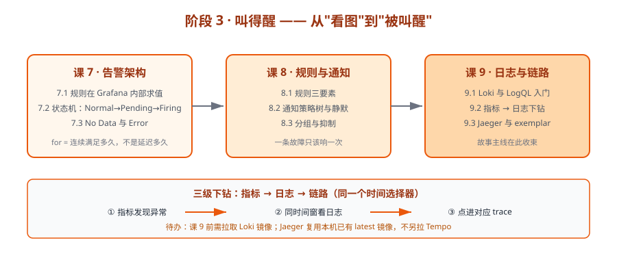

# 阶段 3：叫得醒

> 所属课程：Grafana ｜ 故事章节：**从"看图"到"被叫醒"** ｜ 上一阶段：[阶段 2：查得到](../2-查得到/overview.md) ｜ 下一阶段：[阶段 4：管得住](../4-管得住/overview.md)

## 🎯 本阶段目标

- 搞懂 Grafana 告警在哪求值、状态怎么迁移，配出真正会响的告警。
- 用通知策略与静默把"会响"变成"响得对、不吵人"。
- 打通指标 → 日志 → 链路三级下钻，让主角（那张 dashboard）真正完成任务。

## 📍 学习重点

- **规则求值在 Grafana 内部**（不是推给 Prometheus）：这决定了 Grafana 挂了告警就不响，也决定了多数据源可以做统一告警。
- **状态机 Normal → Pending → Firing → Resolved**：`for` 的含义是"连续满足多久"，不是"延迟多久通知"。这是告警配错的第一大坑。
- **No Data 与 Error 是独立配置**：合法取值各 4 种（NoData/Alerting/OK/**KeepLast**、Error/Alerting/OK/**KeepLast**）。⚠️ 课 7 实测修正：provisioning API 两字段**必填无默认值**（UI 路径才有默认）；且**真实宕机不是 No Data**——`up` 返回 0 走 Alerting 分支，`noDataState` 对 `up` 类指标**无效**，只有业务指标（序列消失）才需要配。
- **Reduce 决定告警条数，不只是数值**（课 8 实测）：`classic_conditions` 丢标签（N 序列→1 告警），`reduce`+`threshold` 保留标签（N 序列→N 告警）。这是 `group_by: [instance]` 能否生效的前提。
- **分组决定通知条数**（课 8 实测）：同样 3 台机器，`group_by: [alertname]`→2 条通知，`[alertname, instance]`→6 条，差 3 倍。故障面越大越该合并，越局部越该拆。
- **静默压通知不压状态**（课 8 实测）：静默期间 webhook 0 条但 `alerting=3`。且静默**删不掉**只能等过期（DELETE 后 state 变 expired 仍在列表）。
- **时间窗对齐**：从指标跳到日志，关键是同一个时间选择器，这正是第一阶段埋的伏笔在此收束。
- **时间窗对齐已实测**（课 9）：同一 LogQL 在 now-5m/now-1h/now-24h 分别命中 0/4/4 行——**查不到日志的三大原因**：时间窗不一致（最常见）、采集延迟、标签不匹配（Loki 返回 200+0 行，静默）。
- **日志与链路的索引取舍**（课 9）：Loki 只索引【标签】不索引内容，故**高基数字段（用户ID/traceID）绝不能当标签**——取值无限增长会撑爆 stream。⚠️ 课 9 实测新增风险：Loki 3.x 自动注入的 `detected_level` 是【从内容推断】的，会额外放大 stream 数。
- **exemplar 是指标→链路的桥**（课 9）：traceID 藏在【直方图桶】的数据点上（普通指标如 node_load1 挂不了）。⚠️ 两个硬前提：Prometheus 开 `--enable-feature=exemplar-storage` + exporter 返回 `application/openmetrics-text`（用 text/plain 会 target down，报错 got "#"）。

## ✅ 必须掌握的知识点

| 知识点 | 所属课 | 学完应能 |
|--------|--------|----------|
| 统一告警架构：规则求值在 Grafana 内部 | 课 7 | 说清 Grafana 告警与 Prometheus Alertmanager 的分工与各自的失效场景 |
| 告警状态机：Normal → Pending → Firing → Resolved | 课 7 | 解释 `for` 的真实含义，并预测一条规则在多长时间后 firing |
| No Data 与 Error：告警的第三种、第四种状态 | 课 7 | 为规则显式配置 No Data 行为，而不是依赖默认 |
| 告警规则三要素：查询、条件、评估行为 | 课 8 | 写一条带 for 与 No Data 处理的完整规则，并用 API 验证状态迁移 |
| 通知策略树与静默：告警怎么路由到人 | 课 8 | 配一棵按标签路由的通知策略树，并加一条静默验证 |
| 分组与抑制：为什么一条故障只该响一次 | 课 8 | 用分组把 N 台机器的告警收敛成一条通知 |
| Loki 数据源与 LogQL 入门 | 课 9 | 接上 Loki 并写出第一条 LogQL 查询 |
| 从指标到日志：时间窗对齐与下钻链接 | 课 9 | 给面板加一个带时间变量的下钻链接，点击直达日志 |
| 链路下钻：Jaeger 数据源与 exemplar | 课 9 | 从指标点进 Jaeger 的对应 trace |

## 🗺️ 本阶段路径图

## 本阶段产出

- [x] `lessons/lesson-07-告警架构：规则在哪求值、状态怎么迁移.md`
- [x] `lessons/lesson-08-告警规则与通知策略实战.md`
- [x] `lessons/lesson-09-日志与链路：指标之外的另外两只眼.md`

## 本阶段依赖的环境

| 组件 | 镜像 / 端口 | 说明 |
|------|------------|------|
| Alertmanager | `prom/alertmanager:v0.30.0` → `9094` | 本机已有镜像，用于课 7 讲清"谁负责哪一段" |
| Loki | **待拉取** → `3101` | 课 9 需要，本阶段开始前拉 |
| Jaeger | `jaegertracing/jaeger:latest` → `16687` | 本机已有镜像，复用而非另拉 Tempo |

> ⚠️ 待办：课 9 前需 `docker pull grafana/loki`（版本届时核查，核查于 2026-09）。

---

[课程目录](../../02-课程目录.md) ｜ [学习路径总览](../../01-学习路径总览.md) ｜ [学习档案](../../00-学习档案.md)
