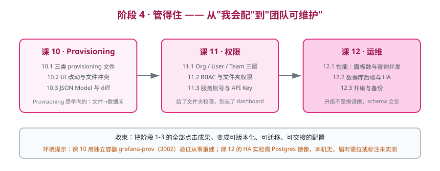

# 阶段 4：管得住

> 所属课程：Grafana ｜ 故事章节：**从"我会配"到"团队可维护"** ｜ 上一阶段：[阶段 3：叫得醒](../3-叫得醒/overview.md)

## 🎯 本阶段目标

- 把手工点击变成配置文件，让 dashboard 与告警可版本化、可迁移、可交接。
- 搞清谁能看、谁能改、程序怎么安全访问。
- 知道性能瓶颈在哪、高可用怎么搭、升级前要做什么。

## 📍 学习重点

- **Provisioning 是单向的**：启动时把文件里的配置写进数据库，之后你在 UI 上改，文件不会跟着变。这个"单向"是所有 provisioning 冲突的根源。
- **UI 改动与文件的冲突**：⚠️ 课 10 实测修正：真正的开关是 **`allowUiUpdates`** 而非 `version`——`false` 时 UI 保存被**硬拒**（400 `Cannot save provisioned dashboard`）；`true` 时能保存但**重启仍被文件覆盖**。这条规则决定了团队协作时谁覆盖谁。
- **权限三层模型**：Org 是租户、User 是身份、Team 是授权单位。⚠️ 课 11 实测修正：真正的模型是**两道闸门**——文件夹 Edit 会**顺带授予** `dashboards:create`，真正的漏配是「只给 Viewer 角色又想让人改」；两种 403 错误信息不同可定位（`Permissions needed:` = 角色不够，`is forbidden: access denied to folder` = 文件夹未授权）。
- **升级不是换镜像**：数据库 schema 会变，升级前必须备份，且官方明确不支持跨多版本跳跃升级（须按官方升级路径核查，核查于 2026-09）。⚠️ 课 12 实测修正：降级**比想象的更危险**——12.0.0 打开 13.2.1 的库虽返回 `database: ok`，但 dashboard 全 404（13.x 用 `resource` 表、12.x 读老表，**双向不可见**），且旧版会**继续改库**（migration_log 719→731）。**回滚＝恢复备份，不是降级换镜像**。
- **会话随数据库共享**：课 12 实测——两个实例共享 Postgres 时，A 实例发的 cookie 可直接访问 B 实例（200），因为会话存在 `user_auth_token` 表里。**默认无需配 Redis**。

## ✅ 必须掌握的知识点

| 知识点 | 所属课 | 学完应能 |
|--------|--------|----------|
| Provisioning 的三类文件：datasources / dashboards / alerting | 课 10 | 写三份 YAML 让全新的 Grafana 启动即带全套配置 |
| Dashboard as Code 与 UI 改动的冲突处理 | 课 10 | 解释什么情况下 provisioning 会覆盖 UI 改动，什么情况下不会 |
| JSON Model 结构与可 diff 化 | 课 10 | 读懂 dashboard JSON 的关键字段，并做一次有意义的 diff |
| Org / User / Team 三层模型 | 课 11 | 建一个 Team 并给它授权，解释三层的职责边界 |
| RBAC 与文件夹权限 | 课 11 | 配出"某团队只能改自己文件夹"的权限结构 |
| 服务账号与 API Key：程序怎么安全访问 | 课 11 | 建服务账号并给最小权限，说清服务账号与 API Key 的区别 |
| 性能：面板数量、查询并发与渲染压力 | 课 12 | 给出仪表盘性能问题的排查顺序与量化判据 |
| 数据库后端与高可用部署 | 课 12 | 说清单机 SQLite 在什么规模下必须换 Postgres/MySQL |
| 升级与备份：升级前查什么、回滚靠什么 | 课 12 | 列出升级前检查清单，并说明回滚依赖什么 |

## 🗺️ 本阶段路径图

## 本阶段产出

- [x] `lessons/lesson-10-Provisioning：把点击变成配置文件.md`
- [x] `lessons/lesson-11-权限与服务账号：谁能看、谁能改、程序怎么访问.md`
- [x] `lessons/lesson-12-性能、高可用与升级运维.md`

## 本阶段依赖的环境

课 10 需要一个**全新的 Grafana 实例**验证 provisioning 从零重建，用 `grafana-prov` 容器映射 `3002`，与 `grafana-lab`（3001）隔离。
课 12 的高可用实验需要 Postgres 后端——✅ 已于 2026-09-07 拉取 `postgres:16-alpine` 并实测完成。新增环境：`l12-pg`(5433，5432 被 `xpert-db-1` 占用) / `gf-pg1`(3004) / `gf-pg2`(3005，共享同一库) / `l12-renderer`(8082，8081 被占) / `gf-render`(3006) / `gf-old`(3007，Grafana 12.0.0) / `gf-restore`(3008)，网络 `l12net`。
⚠️ `gf-render` 需同时接入 `l12net` 与 `grafana-net`，否则连不上 `grafana-prom`（表现为查询 8 秒超时）。

---

[课程目录](../../02-课程目录.md) ｜ [学习路径总览](../../01-学习路径总览.md) ｜ [学习档案](../../00-学习档案.md)
