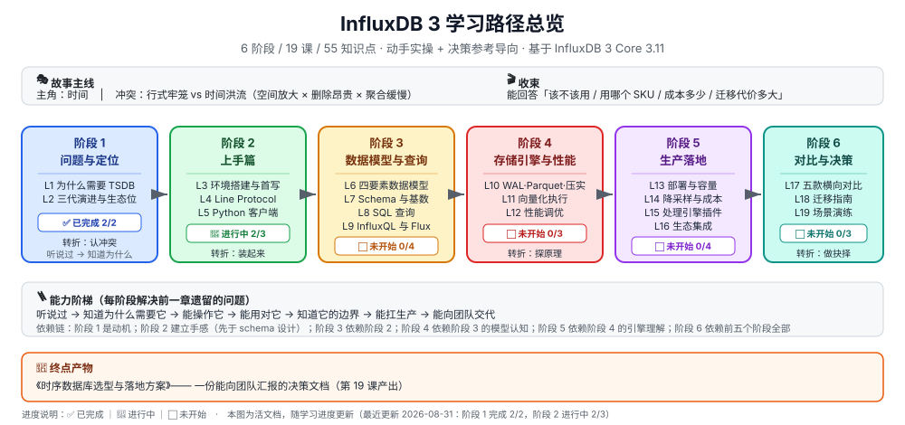

# InfluxDB 学习路径总览

> 课程制 · 6 阶段 / 19 课 / 57 知识点 · **动手实操 + 决策参考**导向
> 基于 **InfluxDB 3 Core 3.11**（2026 年）
> 创建：2026-08-31 ｜ 进度更新：2026-09-02
> 课程入口：[学习档案](00-学习档案.md) ｜ [课程目录](02-课程目录.md) ｜ [评审清单](00-评审清单.md)
>
> 🎉 **课程已完成**：**19 / 19 课 · 57 / 57 知识点** —— 阶段 1–6 已全部完成（L1–L19 已交付）。
> 终点产物**《时序数据库选型与落地方案》**可按需生成：改 `stages/6-对比与决策/assets/l19_tco_calculator.py` 的 `WORKLOADS` 后重跑即可。

> 📕 **汇总手册**：[final-课程手册.md](final-课程手册.md) —— 19 课的「一图总结」+「🎯 落地视角小结」全收录，含全局速查表与决策清单（Phase 4 已交付）。

## 一、学习者画像

| 维度 | 设定 |
|------|------|
| 当前水平 | **零基础**（开课前把 InfluxDB 误认为向量数据库，说明尚未建立时序数据库概念） |
| 学习目标 | **动手实操 + 决策参考**——既要有能照着敲的命令，也要有能向团队汇报的选型依据 |
| 输出偏好 | Markdown + Mermaid/SVG；每课带「🎯 落地视角小结」 |
| 关联背景 | 已学 promql（2/12 课）、kafka（5/10 课）、zookeeper（已完成 12/12） |
| 环境偏好 | ✅ **已确认（2026-08-31）**：阶段 2 为 **Docker 为主线 + 原生安装备选**；编写环境无 Docker，依赖真机的实验标注 ⏳ 未实跑 |

## 二、故事主线

> **🎭 主角：时间**
> 在 MySQL 里，时间只是一个普通的 `DATETIME` 字段；在 InfluxDB 里，时间是**组织一切的一号维度**。本课程讲的就是"时间成为一等公民"之后发生的故事。

**⚔️ 冲突：行式牢笼 vs 时间洪流**

高频、只追加、按时间范围聚合的数据流，撞上了为"随机读写单条记录"优化的关系型数据库。三笔账同时到期：**空间放大**（标签每点重存）× **删除昂贵**（DELETE 逐行 + undo 膨胀）× **聚合缓慢**（整行扫描 + GROUP BY）。加机器救不了——这是数据组织方式的不匹配，不是算力不足。

**🔄 转折：每个阶段是故事的一个章节，解决前一章遗留的问题**

| 章节 | 阶段 | 关键转折 | 主角的状态变化 |
|:---:|------|---------|--------------|
| 一 | [阶段 1 · 问题与定位](stages/1-问题与定位/overview.md) ✅ | **认冲突**：三笔账算清楚，InfluxDB 登场 | 听说过 → 知道为什么需要它 |
| 二 | [阶段 2 · 上手篇](stages/2-上手篇/overview.md) ✅ | **装起来**：亲手跑通写入与查询 | 知道为什么 → 能操作它 |
| 三 | [阶段 3 · 数据模型与查询](stages/3-数据模型与查询/overview.md) ✅ | **学会设计**：schema 与 SQL 写对 | 能操作 → 能用对它 |
| 四 | [阶段 4 · 存储引擎与性能](stages/4-存储引擎与性能/overview.md) ✅ | **探原理**：为什么快、慢在哪 | 能用对 → 知道它的边界 |
| 五 | [阶段 5 · 生产落地](stages/5-生产落地/overview.md) ✅ | **上生产**：部署、降本、接生态 | 知道边界 → 能扛生产 |
| 六 | [阶段 6 · 对比与决策](stages/6-对比与决策/overview.md) ✅ | **做抉择**：对比、迁移、选型 | 能扛生产 → 能向团队交代 |

**🎬 收束：能回答一个大问题**

> "我们公司该不该用 InfluxDB？用哪个 SKU？怎么落地？成本多少？迁移代价多大？"

终点产物：**《时序数据库选型与落地方案》**（第 19 课产出）。

## 收尾三件套（Phase 5 · 已交付）

| 材料 | 认知状态 | 什么时候翻 |
|------|---------|----------|
| [08-实战经验.md](08-实战经验.md) | 学习态 | 坐着想知道为什么会崩（9 条故障模式五段式） |
| [09-排障速查手册.md](09-排障速查手册.md) | 使用态 | 出事了只要动作（9 条症状倒查，机长 QRH 式） |
| [10-场景解法库.md](10-场景解法库.md) | 设计态 | 新需求来了要设计（6 场景 × 多解法权衡，先想后看） |

> 推荐读法：**先按场景在解法库里做设计决策，再按「做错会踩的坑」的编号回经验层补原理。**

> 🛠️ **工程化版本**：[综合实战项目 · 时序数据平台落地](projects/时序数据平台落地/README.md) —— 把全书知识点焊成一个可运行、可挂 CI 的落地体检器（Phase 3 已交付）。

> 📌 **两个贯穿全课程的伏笔**：
> ① L1 的"MySQL 被写崩的那个晚上"是故事引爆点，阶段 4 讲"为什么快"时会回扣；
> ② 开课时的**概念澄清**（InfluxDB 不是向量数据库）在 **L11《向量化执行》** 彻底闭环——那时你会真正明白"向量"二字在这里指什么。

## 三、阶段地图

| 阶段 | 回答的问题 | 课次 | 状态 |
|------|-----------|------|------|
| **1 · 问题与定位** | 它到底解决什么问题 | L1–L2 | ✅ 已完成 |
| **2 · 上手篇** | 怎么把它跑起来、怎么用 | L3–L5 | ✅ 已完成 |
| **3 · 数据模型与查询** | schema 怎么设计、SQL 怎么写 | L6–L9 | ✅ 已完成 |
| **4 · 存储引擎与性能** | 凭什么快、慢在哪 | L10–L12 | ✅ 已完成 |
| **5 · 生产落地** | 怎么部署、怎么控成本 | L13–L16 | ✅ 已收官 |
| **6 · 对比与决策** | 和竞品怎么比、最终怎么选 | L17–L19 | ✅ 已完成（3 / 3 课） |

**依赖链**：阶段 1 是动机 → 阶段 2 建立手感（**刻意排在阶段 3 之前**：schema 设计里的取舍，没亲手写过数据体会不到）→ 阶段 3 依赖阶段 2 → 阶段 4 依赖阶段 3 的模型认知 → 阶段 5 依赖阶段 4 的引擎理解 → 阶段 6 依赖前五个阶段全部。

## 四、学习顺序与节奏

- **严格按序推进**，尤其不要跳过阶段 2 直接学阶段 3
- 每课 30–45 分钟；**阶段 2 含动手，按 90–120 分钟准备**
- 阶段 4 属"进阶层"：若目标只是"能把它用起来"，可只学 L12 的调优实践；若要做容量规划与故障排查，L10/L11 是必修
- 阶段 5 是「工作落地」目标的主战场
- 每阶段末尾有「✅ 阶段出口检查」，建议逐条确认后再进下一阶段

## 五、断点续学

1. 先读 [00-学习档案.md](00-学习档案.md) 定位当前进度（看「知识点级进度表」里第一个 ⬜ 项）
2. 再读 [00-评审清单.md](00-评审清单.md)，存在未勾选条目时先补对应评审，再继续下一批
3. 从「当前阶段第一个未完成知识点」继续；每课末尾的「🚀 下一批接力提示词」可直接复制给 AI 续学
