# InfluxDB 3 系统学习 · 课程手册

> **汇总手册** —— 6 阶段 / 19 课 / 57 知识点的完整索引与决策摘要。
> 基于 **InfluxDB 3 Core 3.11**（2026 年）· 课程制 · 动手实操 + 决策参考导向
> 收官日期：2026-09-02

**导航**：[学习档案](00-学习档案.md) ｜ [学习路径总览](01-学习路径总览.md) ｜ [课程目录](02-课程目录.md) ｜ [评审清单](00-评审清单.md)

**收尾三件套**：[08-实战经验](08-实战经验.md)（为什么会崩） ｜ [09-排障速查手册](09-排障速查手册.md)（崩了怎么止血） ｜ [10-场景解法库](10-场景解法库.md)（新需求怎么设计）

---

## 怎么读这份手册

这份手册是**索引与决策摘要**，不是讲义的替代品。它做三件事：

1. **一张图定位**：19 课每课保留「一图总结」，可用来快速回想起这课讲了什么。
2. **一组结论带回团队**：19 课每课保留「🎯 落地视角小结」，是可直接汇报的结论。
3. **一条主线串起来**：六个阶段是故事的六个章节，回答同一个大问题。

**要动手细节请回原课** —— 手册不含可运行代码块、习题与完整推演。

| 你的状态 | 该翻哪份 |
|---------|---------|
| 想快速回忆某课 | 本手册对应章节的「一图总结」 |
| 要向团队汇报结论 | 本手册每课的「🎯 落地视角小结」 + 末尾「决策清单」 |
| 要动手敲命令 | [原课讲义](02-课程目录.md) |
| 线上出事了 | [09-排障速查手册.md](09-排障速查手册.md) |
| 想知道为什么会崩 | [08-实战经验.md](08-实战经验.md) |
| 新需求要设计 | [10-场景解法库.md](10-场景解法库.md) |

---

## 故事主线：时间成为一等公民

> **🎭 主角：时间**
> 在 MySQL 里，时间只是一个普通的 `DATETIME` 字段；在 InfluxDB 里，时间是**组织一切的一号维度**。
> 本课程讲的就是「时间成为一等公民」之后发生的故事。

**⚔️ 冲突：行式牢笼 vs 时间洪流**

高频、只追加、按时间范围聚合的数据流，撞上了为「随机读写单条记录」优化的关系型数据库。
三笔账同时到期：**空间放大**（标签每点重存）× **删除昂贵**（DELETE 逐行 + undo 膨胀）× **聚合缓慢**（整行扫描 + GROUP BY）。加机器救不了——这是数据组织方式的不匹配，不是算力不足。

**🔄 转折：每个阶段是故事的一个章节，解决前一章遗留的问题**

| 章节 | 阶段 | 关键转折 | 主角的状态变化 |
|:---:|------|---------|--------------|
| 一 | [阶段 1 · 问题与定位](#阶段-1--问题与定位) | **认冲突** | 听说过 → 知道为什么需要它 |
| 二 | [阶段 2 · 上手篇](#阶段-2--上手篇) | **装起来** | 知道为什么 → 能操作它 |
| 三 | [阶段 3 · 数据模型与查询](#阶段-3--数据模型与查询) | **学会设计** | 能操作 → 能用对它 |
| 四 | [阶段 4 · 存储引擎与性能](#阶段-4--存储引擎与性能) | **探原理** | 能用对 → 知道它的边界 |
| 五 | [阶段 5 · 生产落地](#阶段-5--生产落地) | **上生产** | 知道边界 → 能扛生产 |
| 六 | [阶段 6 · 对比与决策](#阶段-6--对比与决策) | **做抉择** | 能扛生产 → 能向团队交代 |

**🎬 收束：能回答一个大问题**

> "我们公司该不该用 InfluxDB？用哪个 SKU？怎么落地？成本多少？迁移代价多大？"

终点产物：**《时序数据库选型与落地方案》** —— 改 `stages/6-对比与决策/assets/l19_tco_calculator.py` 的 `WORKLOADS` 常量为真实负载后重跑，
即可得到挂着自家数字的容量估算、TCO 三方案与落地检查清单。

---

## 全局速查：最容易忘的硬数字

> 这些数字散落在 19 课里，用到时最常回来找。全部来自官方一手来源，核查于 2026-09。

| 数字 | 含义 | 归属 | 出处 |
|------|------|------|------|
| **432** | 单查询默认可扫的 Parquet 文件数上限（`query-file-limit`） | **仅 Core** | L10 / L12 |
| **72 小时** | `432 × 10min` 的**派生值**，代码里没有时间判断 | **仅 Core** | L10 |
| **10 分钟** | gen1 Parquet 持久化周期，每天 144 个文件 | Core/Enterprise 通用 | L10 |
| **15 分钟** | 「刚写就能查」的上界（可查缓冲最多 900 个 WAL 文件） | Core | L10 |
| **5 / 2000 / 500** | Core 硬限制：库 5 个 / 所有库的表总计 2000 / 单表 500 列 | **仅 Core** | L6 / L13 |
| **90%** | 内存三默认相加（快照 50% + 执行池 20% + Parquet 缓存 20%） | Core | L13 |
| **10,000 行 / 10MB** | 批量写入双阈值，任一触发就该发出 | 通用 | L4 / L12 |
| **1–3 天** | Core 上双写窗口上限（= 可查窗口） | **仅 Core** | L18 |
| **8181 / 8086** | 端口版本指纹：8181 = 3.x，8086 = 1.x/2.x | 通用 | L3 |
| **mo = 30 天 / y = 365 天** | 保留期单位换算（≠ 自然月 30.44 天、自然年 365.25 天） | 通用 | L14 / L18 |

> ⚠️ **「归属」列比数字本身更重要。** 把 Core 的约束套到别的 SKU 上，会得出「降采样必须每 20 小时跑一次」
> 这类荒谬结论 —— 这是本课程反复出现的同一类错误（L19 实验 B 初版就踩过）。

---

## 阶段 1 · 问题与定位

> **它到底解决什么问题** ｜ 阶段导览：[overview](stages/1-问题与定位/overview.md)

**本阶段的关键转折**：**认冲突** —— 三笔账算清楚，InfluxDB 登场

**核心结论**（5 条）：

- 时序数据有四个特征：时间为主、只追加、多点少更、按时间范围聚合
- MySQL/PostgreSQL 扛不住的三笔账：空间放大 × 删除昂贵 × 聚合缓慢
- TSDB 的五项专属优化：列存、时间分区、专用压缩、降采样、时间聚合算子
- InfluxDB 三代演进：TSM（1.x）→ Flux（2.x）→ FDAP（3.x）
- 三个 SKU 生态位差异极大，「我们选了 InfluxDB」这句话没有信息量

### L01 · 为什么需要时序数据库

📖 [完整讲义](stages/1-问题与定位/lessons/lesson-01-为什么需要时序数据库.md)（478 行）

**本课目标**

- 说清时序数据和普通业务数据的**四个结构性差异**
- 用可自己验算的算术，说明 MySQL/PostgreSQL 在哪个规模上、因为什么崩掉
- 理解时序数据库（TSDB）的五项专属优化各自解决什么问题

---

#### 🖼️ 一图总结

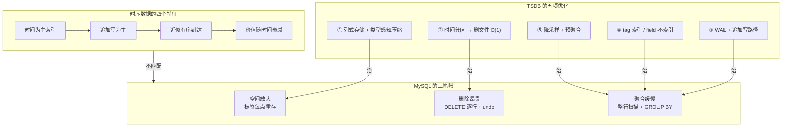
```mermaid
flowchart TD
    subgraph FEAT["时序数据的四个特征"]
        F1["时间为主索引"] --> F2["追加写为主"]
        F2 --> F3["近似有序到达"]
        F3 --> F4["价值随时间衰减"]
    end

    subgraph PAIN["MySQL 的三笔账"]
        P1["空间放大<br/>标签每点重存"]
        P2["删除昂贵<br/>DELETE 逐行 + undo"]
        P3["聚合缓慢<br/>整行扫描 + GROUP BY"]
    end

    subgraph OPT["TSDB 的五项优化"]
        O1["① 列式存储 + 类型感知压缩"]
        O2["② 时间分区 → 删文件 O(1)"]
        O3["③ WAL + 追加写路径"]
        O4["④ tag 索引 / field 不索引"]
        O5["⑤ 降采样 + 预聚合"]
    end

    FEAT -->|"不匹配"| PAIN
    O1 -->|"治"| P1
    O2 -->|"治"| P2
    O3 -->|"治"| P3
    O4 -->|"治"| P3
    O5 -->|"治"| P3
```

#### 🎯 落地视角小结

如果你的项目在犹豫"要不要上 TSDB"，先回答这三个问题：

| 判断项 | 阈值参考 | 说明 |
|---|---|---|
| 写入速率 | 持续 **> 数千点/秒** | 低于此，MySQL/PostgreSQL 通常够用 |
| 数据保留期 | **> 1 个月** 且需要定期清理 | 保留期短、或不需要自动过期，DELETE 的痛点不成立 |
| 查询模式 | 以**时间范围聚合**为主，而非单条点查 | 如果你的查询是"查某设备最新一条"，加个 Redis 缓存可能就够了 |

**三条全中 → 认真评估 TSDB；只中一条 → 先用熟悉的数据库，把监控埋点做好，等规模上来再迁。**

> ⚠️ **别为了技术而技术**：引入 TSDB 意味着新的运维对象、新的备份策略、新的故障模式。MySQL 存监控数据在小规模下完全合理——**迁移成本也是成本**。

---

### L02 · InfluxDB 是什么：三代演进与生态位

📖 [完整讲义](stages/1-问题与定位/lessons/lesson-02-InfluxDB是什么.md)（522 行）

**本课目标**

- 能用一句话说清 InfluxDB 是什么、解决什么问题
- 理解三代架构的**更替动因**——为什么 3.0 要推倒重写（这是选型的关键背景）
- 分清 Core / Enterprise / Cloud 三个 SKU 的边界，知道该用哪个

---

#### 🖼️ 一图总结

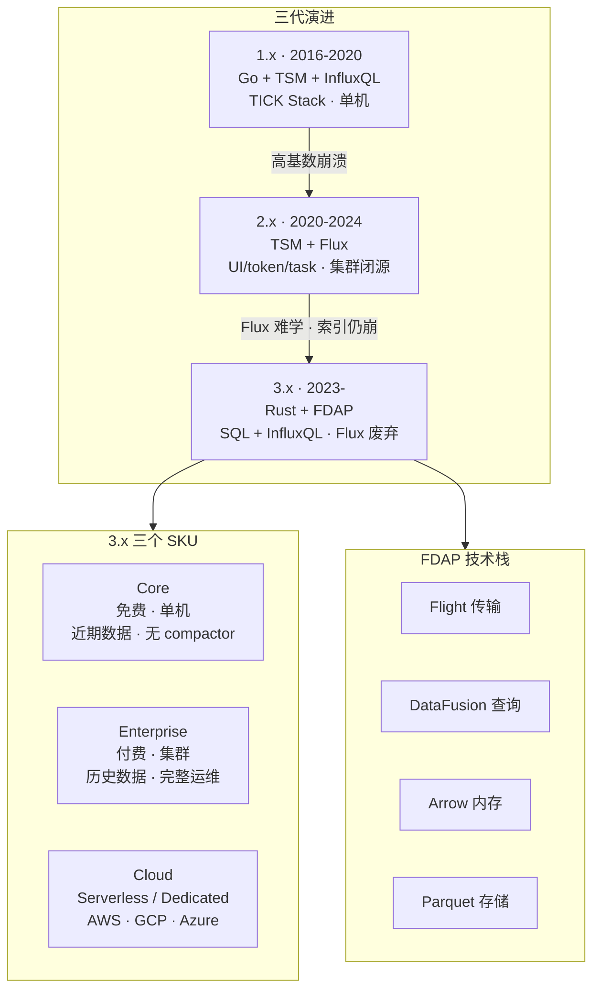
```mermaid
flowchart TD
    subgraph GEN["三代演进"]
        G1["1.x · 2016-2020<br/>Go + TSM + InfluxQL<br/>TICK Stack · 单机"]
        G2["2.x · 2020-2024<br/>TSM + Flux<br/>UI/token/task · 集群闭源"]
        G3["3.x · 2023-<br/>Rust + FDAP<br/>SQL + InfluxQL · Flux 废弃"]
        G1 -->|"高基数崩溃"| G2
        G2 -->|"Flux 难学 · 索引仍崩"| G3
    end

    subgraph SKUS["3.x 三个 SKU"]
        S1["Core<br/>免费 · 单机<br/>近期数据 · 无 compactor"]
        S2["Enterprise<br/>付费 · 集群<br/>历史数据 · 完整运维"]
        S3["Cloud<br/>Serverless / Dedicated<br/>AWS · GCP · Azure"]
    end

    subgraph STACK["FDAP 技术栈"]
        F["Flight 传输"]
        D["DataFusion 查询"]
        A["Arrow 内存"]
        P["Parquet 存储"]
    end

    G3 --> SKUS
    G3 --> STACK
```

#### 🎯 落地视角小结

带三个结论回团队：

1. **新项目用 3.x + SQL**。Flux 已废弃，不要在新代码里写 Flux。
2. **选 SKU 看"是否要查历史数据"**。Core 免费但**不含 compactor**，只适合近期数据；需要长周期历史分析就得上 Enterprise 或 Cloud Dedicated。
3. **评估 2.x 迁移要先算存量脚本数**。迁移成本 ≈ Flux 脚本数量 × 单个重构成本。这不是纯技术问题，是排期问题。

---

---

## 阶段 2 · 上手篇

> **先跑起来，再谈原理** ｜ 阶段导览：[overview](stages/2-上手篇/overview.md)

**本阶段的关键转折**：**装起来** —— 亲手跑通写入与查询

**核心结论**（5 条）：

- Core 查询限 **72 小时**，本质是 432 个 Parquet 文件上限的派生值
- 客户端默认写 **V2 端点**；v3 原生写入端点是 `/api/v3/write_lp`；`host` 必须带 scheme
- 写入走 HTTP，查询走 Flight SQL
- 镜像标签必须写死：`influxdb:3-core`，不要用 `latest`（2026-09-15 起 latest 改指 3 Core）
- 端口是版本指纹：8181 = 3.x，8086 = 1.x/2.x

### L03 · 环境搭建与第一次写入

📖 [完整讲义](stages/2-上手篇/lessons/lesson-03-环境搭建与第一次写入.md)（651 行）

**本课目标**

- 用 **Docker**（主线）或**原生安装**（备选）起一个 InfluxDB 3 Core，并理解每个启动参数的含义
- 完成**创建 token → 建库 → 写入 → 查询**的完整闭环
- 知道数据落在哪、配置改哪、token 怎么管

> 💻 **环境说明**：本课以 **Docker** 为主线（起服务最快、最贴近生产容器化部署），并在每处给出**原生安装**的等价做法。命令以 Unix shell 为准，Windows 差异处已单独标注。

---

#### 🖼️ 一图总结

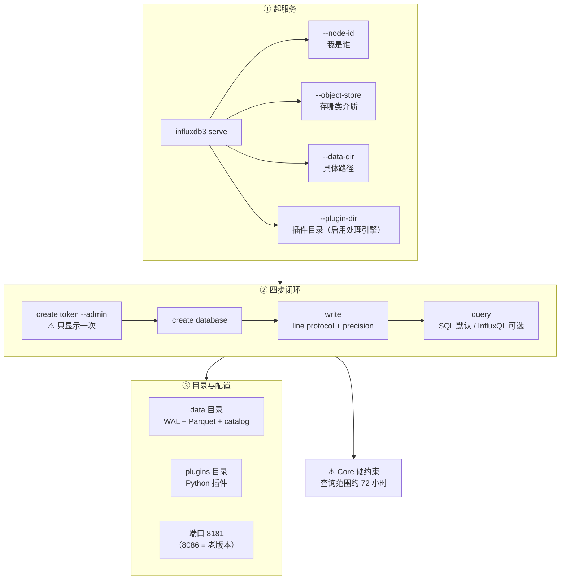
```mermaid
flowchart TD
    subgraph SETUP["① 起服务"]
        S1["influxdb3 serve"]
        S2["--node-id<br/>我是谁"]
        S3["--object-store<br/>存哪类介质"]
        S4["--data-dir<br/>具体路径"]
        S5["--plugin-dir<br/>插件目录（启用处理引擎）"]
        S1 --> S2 & S3 & S4 & S5
    end

    subgraph LOOP["② 四步闭环"]
        L1["create token --admin<br/>⚠️ 只显示一次"]
        L2["create database"]
        L3["write<br/>line protocol + precision"]
        L4["query<br/>SQL 默认 / InfluxQL 可选"]
        L1 --> L2 --> L3 --> L4
    end

    subgraph DIR["③ 目录与配置"]
        D1["data 目录<br/>WAL + Parquet + catalog"]
        D2["plugins 目录<br/>Python 插件"]
        D3["端口 8181<br/>（8086 = 老版本）"]
    end

    SETUP --> LOOP
    LOOP --> DIR

    WARN["⚠️ Core 硬约束<br/>查询范围约 72 小时"]
    LOOP --> WARN
```

#### 🎯 落地视角小结

带四条结论回团队：

1. **镜像标签必须写死**。不要用 `influxdb` 或 `latest`——2026-09-15 起 `latest` 会改指 3 Core，今天是 `influxdb:2`，下个月可能是 `influxdb:3-core`。**用 `influxdb:3-core` 或具体版本号。**
2. **operator token 当密钥管**。只显示一次，丢了只能重建。进密钥管理系统，不要写进代码或 docker-compose 文件。
3. **Core 的 72 小时限制要在选型时讲清楚**。如果业务方要求"查三个月趋势"，Core 直接不合格，必须 Enterprise——这个结论要在立项时就摆上桌，别等上线才发现。
4. **端口是版本指纹**：8181 = 3.x，8086 = 1.x/2.x。巡检时一眼能看出环境是不是搞错了。

---

### L04 · Line Protocol 与写入基本功

📖 [完整讲义](stages/2-上手篇/lessons/lesson-04-Line-Protocol与写入基本功.md)（726 行）

**本课目标**

- 能徒手写出正确的 line protocol，并说清**两个未转义空格**的分隔语义
- 避开数据类型与时间戳精度的坑（这是 InfluxDB 新手踩得最多的一类）
- 会用 HTTP API 批量写入，理解 `accept_partial` 与 `no_sync` 的取舍

> 💻 承接第 3 课环境：Docker 容器名 `influxdb3-core`，端口 8181，token 已设进 `INFLUXDB3_AUTH_TOKEN`。

---

#### 🖼️ 一图总结

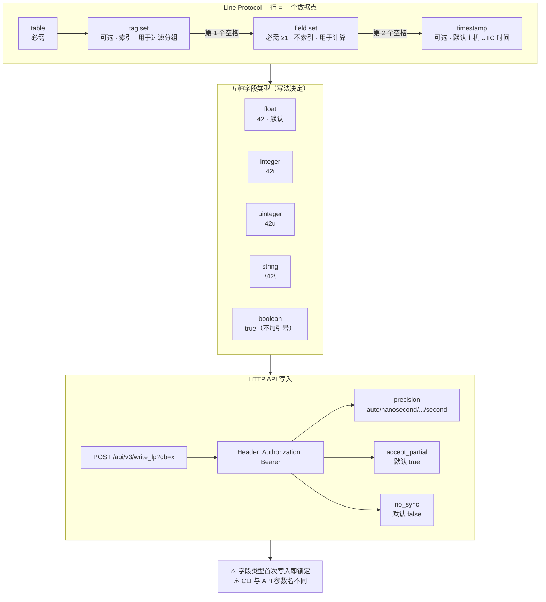
```mermaid
flowchart TD
    subgraph LP["Line Protocol 一行 = 一个数据点"]
        T["table<br/>必需"]
        TG["tag set<br/>可选 · 索引 · 用于过滤分组"]
        F["field set<br/>必需 ≥1 · 不索引 · 用于计算"]
        TS["timestamp<br/>可选 · 默认主机 UTC 时间"]
        T --> TG -->|"第 1 个空格"| F -->|"第 2 个空格"| TS
    end

    subgraph TYPE["五种字段类型（写法决定）"]
        D1["float<br/>42 · 默认"]
        D2["integer<br/>42i"]
        D3["uinteger<br/>42u"]
        D4["string<br/>\"42\""]
        D5["boolean<br/>true（不加引号）"]
    end

    subgraph API["HTTP API 写入"]
        A1["POST /api/v3/write_lp?db=x"]
        A2["Header: Authorization: Bearer"]
        A3["precision<br/>auto/nanosecond/.../second"]
        A4["accept_partial<br/>默认 true"]
        A5["no_sync<br/>默认 false"]
        A1 --> A2 --> A3 & A4 & A5
    end

    LP --> TYPE
    TYPE --> API

    WARN["⚠️ 字段类型首次写入即锁定<br/>⚠️ CLI 与 API 参数名不同"]
    API --> WARN
```

#### 🎯 落地视角小结

带五条结论回团队：

1. **字段类型在首次写入时锁定，不可更改**。接入新数据源前必须先定好 schema，尤其是"这个值是整数还是浮点"——事后改只能建新表重灌数据。
2. **生产写入一律显式声明 `precision`**。理由不是"`auto` 不准"——实测三个阈值对齐到 2128 年，常规范围内它很可靠；真正的理由是**消除歧义**：小数值、测试数据、历史数据（1970 年前）这几类场景下 `auto` 会判错，而这些恰恰是联调和造数时最容易发生的。
3. **CLI 与 HTTP API 的参数命名不同**（`s` vs `second`）、**默认值也不同**（`accept_partial` 严格 vs 宽松）。从命令行验证切到代码上线时，必须重新过一遍参数。
4. **写监控告警不能只看 HTTP 状态码**。`accept_partial=true`（默认）时返回 400 也可能是"部分成功"，必须解析 body 的 `data` 数组。
5. **`no_sync=true` 是用持久性换吞吐**。默认 `false`（等 WAL 刷盘再确认）更安全；只在对延迟极敏感且能容忍崩溃丢少量数据时才开。

---

### L05 · Python 客户端与 CLI 工具

📖 [完整讲义](stages/2-上手篇/lessons/lesson-05-Python客户端与CLI工具.md)（1018 行）

**本课目标**

- 会用 `influxdb3-python` 完成写入与查询，说清**同步 / 批量 / 异步**三种写入模式该怎么选
- 会用 `influx3` CLI 做日常查询与导出（json / jsonl / csv / pretty 四种输出）
- 理解 **Flight SQL 为什么快**，知道什么时候该绕过客户端直接用 Flight
- 避开三个高频坑：**host 不带 scheme 直接崩**、**客户端默认写 V2 端点**、**Windows 查不到根证书**

> 💻 承接第 3 课环境：Docker 容器名 `influxdb3-core`，端口 8181，token 已设进 `INFLUXDB3_AUTH_TOKEN`。
> 📌 本课是**阶段 2 收官课**，课后有一次阶段出口检查。

---

#### 🖼️ 一图总结

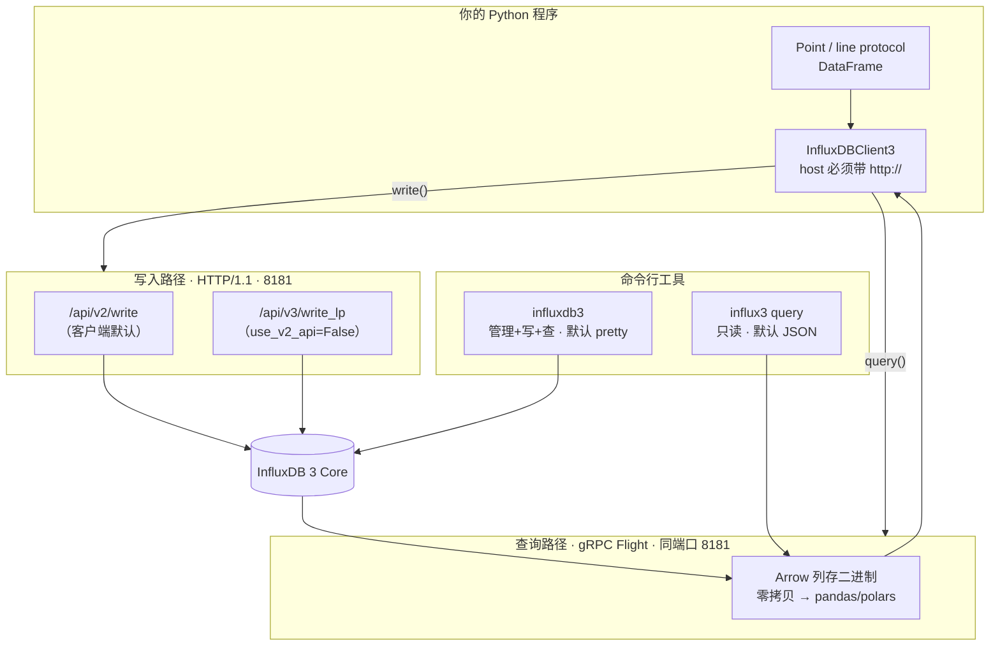
```mermaid
flowchart TD
    subgraph APP["你的 Python 程序"]
        C["InfluxDBClient3<br/>host 必须带 http://"]
        P["Point / line protocol<br/>DataFrame"]
    end

    subgraph WRITE["写入路径 · HTTP/1.1 · 8181"]
        V2["/api/v2/write<br/>（客户端默认）"]
        V3["/api/v3/write_lp<br/>（use_v2_api=False）"]
    end

    subgraph READ["查询路径 · gRPC Flight · 同端口 8181"]
        F["Arrow 列存二进制<br/>零拷贝 → pandas/polars"]
    end

    subgraph CLI["命令行工具"]
        I3["influx3 query<br/>只读 · 默认 JSON"]
        I3D["influxdb3<br/>管理+写+查 · 默认 pretty"]
    end

    P --> C
    C -->|"write()"| WRITE
    C -->|"query()"| READ
    V2 --> DB[("InfluxDB 3 Core")]
    V3 --> DB
    DB --> F
    F --> C
    I3 --> F
    I3D --> DB
```

#### 🎯 落地视角小结

1. **生产环境客户端配置基线**：`host` 一律写全 scheme；批量模式必配 `error_callback`；显式声明 `write_precision`；明确 `use_v2_api` 的取舍（要 `no_sync` 就必须 `False`）。

2. **选型判据：什么时候必须上 Flight**：单次拉取 **> 10 万行**的程序化分析场景，Flight 与 HTTP+JSON 的差距是数量级的（省掉服务端 JSON 编码 + 客户端 JSON 解析两次全量转换）。日常几百行的查询用哪个都行。⏳ 具体倍数随数据分布与网络条件变化，建议用你自己的数据集实测。

3. **架构注意：Flight 需要 HTTP/2**。如果 InfluxDB 前面挂了 nginx / HAProxy / 云负载均衡，**必须确认代理支持 HTTP/2**，否则 SQL 查询直接连不上。这是上生产时最容易漏的一条（Grafana 用 SQL 数据源时同样中招）。

4. **别用 `flightsql-dbapi` 上生产**。它自己挂着 experimental 警告，官方推荐路径是 `influxdb3-python`。只在「要对接 BI 平台 / 写数据库无关代码」时才考虑它。

5. **Core 的 72 小时限制依然存在**（第 3 课）。用客户端查询同样受此约束——查不到 5 天前的数据**不是客户端的 bug**，是 Core 的设计。实验 B 特意用 `time.time()` 写入就是为了避开它。

6. **Windows 用户的额外一步**：连 https 实例时 gRPC 找不到根证书，需要 `pip install certifi` 并通过 `flight_client_options` 传入。本地 `http://` 不受影响。

---

---

## 阶段 3 · 数据模型与查询

> **schema 怎么设计、SQL 怎么写** ｜ 阶段导览：[overview](stages/3-数据模型与查询/overview.md)

**本阶段的关键转折**：**学会设计** —— schema 与 SQL 写对

**核心结论**（7 条）：

- 主键 = **timestamp + tag set**；null tag 不进主键
- Core 硬限制：**库 5 / 表 2000 / 列 500**
- **基数是乘法**：点密度趋近 0 则列存压缩失效
- **需要按某字段查 ≠ 它必须是 tag**
- **UTC+8 按天分桶默认错位 8 小时**（DATE_BIN 的 origin 默认 epoch）
- **`LAG` 是前一行不是前一小时**
- 3.x 只有 SQL 与 InfluxQL 两种语言，Flux 已移出清单；`NON_NEGATIVE_DIFFERENCE()` SQL 无但 InfluxQL 有

### L06 · 数据模型：table、tag、field、timestamp

📖 [完整讲义](stages/3-数据模型与查询/lessons/lesson-06-数据模型-table-tag-field-timestamp.md)（819 行）

**本课目标**

- 说清 **table / tag / field / timestamp** 四要素各自的定位，以及 **主键 = time + tag set** 这条规则
- 理解 **schema-on-write**：没建过表，为什么 schema 却被锁死了；类型冲突怎么解
- 掌握**命名限制与转义规则**，知道哪些名字能写、哪些能查、哪些两者都能
- 避开三个高频坑：**tag 与 field 同名导致列冲突**、**`time` 不能作 tag/field 键**、**line protocol 与 SQL 的大小写规则不同**

> 💻 承接第 3 课环境：Docker 容器名 `influxdb3-core`，端口 8181，token 已设进 `INFLUXDB3_AUTH_TOKEN`。
> 📌 本课是**阶段 3 第 1 课**，也是"从能操作到能用对"的转折点。

---

#### 🖼️ 一图总结

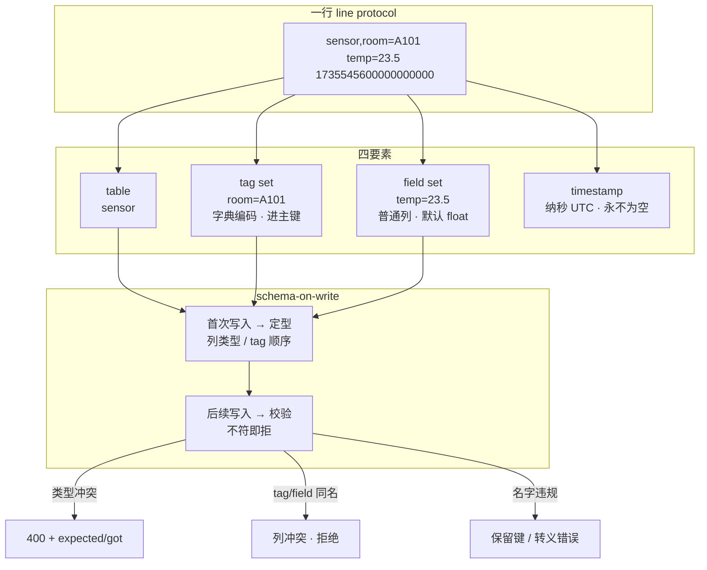
```mermaid
flowchart TD
    subgraph LP["一行 line protocol"]
        L["sensor,room=A101 temp=23.5 1735545600000000000"]
    end

    subgraph ELEM["四要素"]
        T["table<br/>sensor"]
        TAG["tag set<br/>room=A101<br/>字典编码 · 进主键"]
        FLD["field set<br/>temp=23.5<br/>普通列 · 默认 float"]
        TS["timestamp<br/>纳秒 UTC · 永不为空"]
    end

    subgraph SCHEMA["schema-on-write"]
        C["首次写入 → 定型<br/>列类型 / tag 顺序"]
        V["后续写入 → 校验<br/>不符即拒"]
    end

    L --> T
    L --> TAG
    L --> FLD
    L --> TS
    T --> C
    TAG --> C
    FLD --> C
    C --> V
    V -->|"类型冲突"| ERR["400 + expected/got"]
    V -->|"tag/field 同名"| ERR2["列冲突 · 拒绝"]
    V -->|"名字违规"| ERR3["保留键 / 转义错误"]
```

#### 🎯 落地视角小结

1. **把 schema 决策前移到写入之前**。类型冲突的修复成本是"导出→转换→重灌"，远高于事前花十分钟定好类型。**上线前先写几条样本数据把 schema 定下来**，比事后救火便宜得多。

2. **命名规范写进团队约定**：一律小写字母 + 下划线，不用 `-`、不用大小写混合、不用下划线开头。这一条能同时规避 line protocol 转义、SQL 引号、大小写折叠三类问题。**接进 CI 用实验 E 的脚本自动检查**，比靠人 review 可靠。

3. **tag 与 field 的抉择是成本决策，不是语法选择**。tag 进主键、字典编码、列定义不可变；field 是普通列。判断标准很简单：**会不会拿它做 `WHERE` / `GROUP BY`？会 → tag；只做 `AVG` / `MAX` → field**。详细判据与反模式在 L7。

4. **列数上限 500 是设计约束，不是可以随便顶的墙**。超过会写不进去，接近了会拖慢摄入与压实。遇到"字段太多"的正确做法是**拆表**（按设备类型拆），而不是硬塞进一张宽表。Core 只有 2000 个表的额度，拆分前先算一下总数。

5. **Core 只有 5 个数据库的额度**。这不是"建议"，是硬上限。分库策略要按业务域粗粒度划分（如 `prod-metrics` / `dev-logs`），**不要按服务实例、按天、按客户分库**——那样 5 个根本不够。

6. **`time` 作 tag/field 键是必死的坑**。除了 `time`，`_field` 和 `_measurement` 会让整个数据点被**静默丢弃**（连报错都没有）。自检脚本里已经把这三个都判为非法，上线前跑一遍。

---

### L07 · Schema 设计与基数陷阱

📖 [完整讲义](stages/3-数据模型与查询/lessons/lesson-07-Schema设计与基数陷阱.md)（873 行）

**本课目标**

- 说清**基数（cardinality）**是什么：不是"数据量大"，而是**各 tag 取值数的乘积**
- 掌握 **tag vs field 的抉择判据**：过滤/分组用 tag，计算用 field；放错的代价是数量级的
- 识别**四种 schema 设计反模式**，并知道每一种该怎么改
- 理解官方"**无限基数**"的真实含义：**能存下 ≠ 查得快、成本低**

> 💻 承接第 3 课环境：Docker 容器名 `influxdb3-core`，端口 8181，token 已设进 `INFLUXDB3_AUTH_TOKEN`。
> 🔗 **回扣 L2 误区 4**：*"Infinite cardinality 意味着我可以随便设计 tag"*——本课就是那条误区的完整展开。

---

#### 🖼️ 一图总结

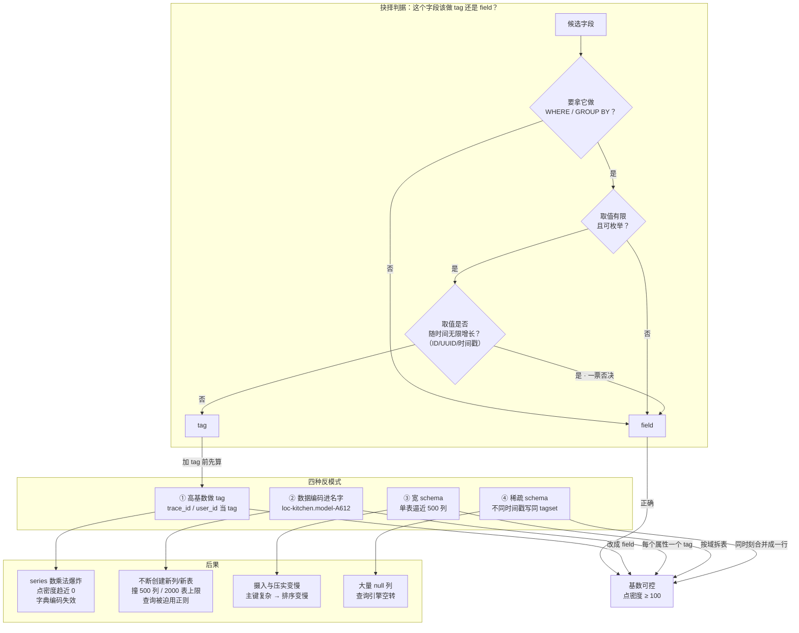
```mermaid
flowchart TD
    subgraph Q["抉择判据：这个字段该做 tag 还是 field？"]
        A1["候选字段"] --> A2{"要拿它做<br/>WHERE / GROUP BY？"}
        A2 -->|"否"| F["field"]
        A2 -->|"是"| A3{"取值有限<br/>且可枚举？"}
        A3 -->|"否"| F
        A3 -->|"是"| A4{"取值是否<br/>随时间无限增长？<br/>（ID/UUID/时间戳）"}
        A4 -->|"是 · 一票否决"| F
        A4 -->|"否"| T["tag"]
    end

    subgraph B["四种反模式"]
        B1["① 高基数做 tag<br/>trace_id / user_id 当 tag"]
        B2["② 数据编码进名字<br/>loc-kitchen.model-A612"]
        B3["③ 宽 schema<br/>单表逼近 500 列"]
        B4["④ 稀疏 schema<br/>不同时间戳写同 tagset"]
    end

    subgraph C["后果"]
        C1["series 数乘法爆炸<br/>点密度趋近 0<br/>字典编码失效"]
        C2["不断创建新列/新表<br/>撞 500 列 / 2000 表上限<br/>查询被迫用正则"]
        C3["摄入与压实变慢<br/>主键复杂 → 排序变慢"]
        C4["大量 null 列<br/>查询引擎空转"]
    end

    B1 --> C1
    B2 --> C2
    B3 --> C3
    B4 --> C4

    T -->|"加 tag 前先算"| B1
    F -->|"正确"| OK["基数可控<br/>点密度 ≥ 100"]
    B1 -->|"改成 field"| OK
    B2 -->|"每个属性一个 tag"| OK
    B3 -->|"按域拆表"| OK
    B4 -->|"同时刻合并成一行"| OK
```

#### 🎯 落地视角小结

1. **把基数估算前移到写采集器配置之前**。改一个 tag 只要一行代码，但它的代价是 series 数乘以取值数，且**不可逆**。实验 A 的脚本接进 CI，比任何 review 都可靠。

2. **"无限基数"要翻译成工程语言**：它意味着**不会因为基数而 OOM 崩溃**，不意味着**存储与查询免费**。跟团队同步这个理解，能避免"官方说没限制"引发的设计放纵。

3. **ID 类字段一律 field，这是一票否决**。trace_id、user_id、request_id、UUID、时间戳——见到就放 field。如果你真的需要按它高频检索，那是**选型问题**（该上 ES / Jaeger），不是 schema 问题。

4. **首次写入的 tag 顺序是一次性投资**。3.x Core 的物理列顺序由首次写入决定且不可更改，靠前的列过滤更快。**建表时按查询频率排一次序**，成本几乎为零，收益长期有效。

5. **稀疏 schema 是最容易被忽视的一种**。它不报错、不崩溃，只是让每行多出 null。修法也简单：**同一设备的多个指标攒成一行、用同一时间戳写入**。Telegraf 默认就是这么做的，自己写采集器时要对齐。

6. **"需要按某维度查询" ≠ "该维度必须是 tag"**。这是本课最反直觉、也最实用的一条。3.x 不索引 tag 值，field 上的等值过滤在扫描代价上并不显著更差，而做成 tag 的基数代价却是实打实的乘法。

---

### L08 · SQL 查询：从 SELECT 到窗口函数

📖 [完整讲义](stages/3-数据模型与查询/lessons/lesson-08-SQL查询-从SELECT到窗口函数.md)（1038 行）

**本课目标**

- 理解 InfluxDB 3 的 SQL 是**标准 SQL + 时序扩展**，由 **DataFusion** 引擎驱动
- 掌握 **`DATE_BIN`**——时序查询的核心：把连续时间切成桶，并理解 `origin_timestamp` 与时区陷阱
- 能用**窗口函数**做同环比、移动平均、累计值，能用 **CTE** 组织多步查询
- 知道 3.x SQL **没有** `increase()` / `NON_NEGATIVE_DIFFERENCE()`，以及官方给的替代写法

> 💻 承接第 3 课环境：Docker 容器名 `influxdb3-core`，端口 8181，token 已设进 `INFLUXDB3_AUTH_TOKEN`。
> 🔗 **回扣 L6**：tag 只能存字符串、field 五种类型——这决定了 `WHERE` 与聚合能怎么写。

---

#### 🖼️ 一图总结

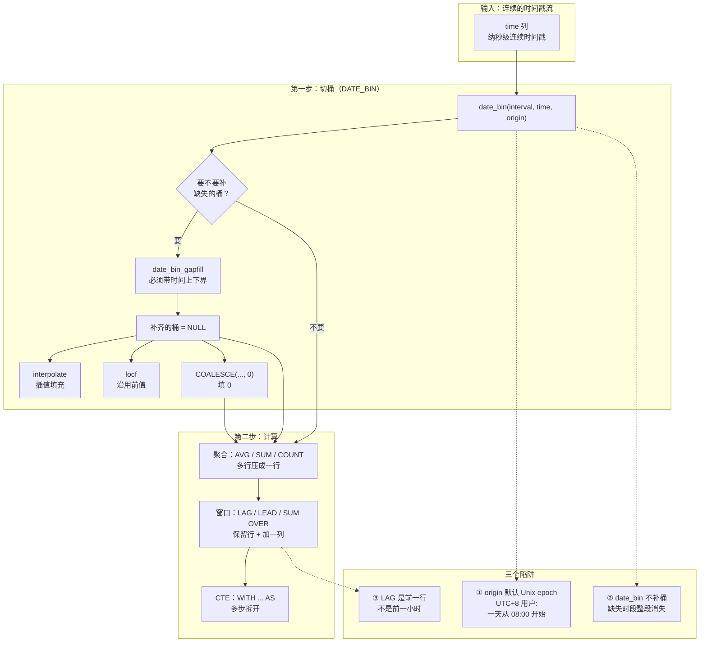
```mermaid
flowchart TD
    subgraph INPUT["输入：连续的时间戳流"]
        T0["time 列<br/>纳秒级连续时间戳"]
    end

    subgraph STEP1["第一步：切桶（DATE_BIN）"]
        B1["date_bin(interval, time, origin)"]
        B2{"要不要补<br/>缺失的桶？"}
        B3["date_bin_gapfill<br/>必须带时间上下界"]
        B4["补齐的桶 = NULL"]
        B5["interpolate<br/>插值填充"]
        B6["locf<br/>沿用前值"]
        B7["COALESCE(..., 0)<br/>填 0"]
    end

    subgraph STEP2["第二步：计算"]
        C1["聚合：AVG / SUM / COUNT<br/>多行压成一行"]
        C2["窗口：LAG / LEAD / SUM OVER<br/>保留行 + 加一列"]
        C3["CTE：WITH ... AS<br/>多步拆开"]
    end

    subgraph TRAP["三个陷阱"]
        P1["① origin 默认 Unix epoch<br/>UTC+8 用户:<br/>一天从 08:00 开始"]
        P2["② date_bin 不补桶<br/>缺失时段整段消失"]
        P3["③ LAG 是前一行<br/>不是前一小时"]
    end

    T0 --> B1
    B1 --> B2
    B2 -->|"要"| B3 --> B4
    B4 --> B5
    B4 --> B6
    B4 --> B7
    B2 -->|"不要"| C1
    B4 --> C1
    B7 --> C1
    C1 --> C2
    C2 --> C3
    B1 -.-> P1
    B1 -.-> P2
    C2 -.-> P3
```

#### 🎯 落地视角小结

1. **先查一遍你们所有按天聚合的报表有没有 UTC+8 错位**。这是本课最容易自查、也最容易长期无人发现的问题——查询不报错，只是每天的数字都偏了 8 小时。判据很简单：`DATE_BIN(INTERVAL '1 day', time)` 没写第三个参数，且业务按中国时区看数，就是错的。

2. **`origin` 的通用心法**：不要只在按天分桶时才想起它。任何**不能被自然单位整除的 interval**（比如 90 分钟、7 小时）都必须显式考虑 origin，否则桶边界会漂到你意想不到的位置。能被整除的（1 小时、1 天对 epoch）可以忽略。

3. **缺失时段的处理要在设计阶段就定下来**。设备离线时，你的图表是**断线**（`date_bin`）、**插值**（`interpolate`）、**沿用前值**（`locf`）还是**显示 0**（`COALESCE`）——这四种语义完全不同，选错会让运维误判。我的建议：**状态类用 `locf`，计量类用 `interpolate`，计数类用 `COALESCE(..., 0)`**。

4. **从 InfluxQL / Flux 迁移时，先把 `increase()` 和 `NON_NEGATIVE_DIFFERENCE()` 列成待办**。它们没有直接对应物，必须改写成 `GREATEST` + `LAG` + CTE 三段式。这是迁移中最容易被漏掉、且漏掉后只会"数字悄悄变小"的一类问题。

5. **窗口函数的 `PARTITION BY` 不是可选项**。忘了写它，你的"同环比"会跨设备比较——`host=web-01` 的值减去 `host=web-11` 的值，结果毫无意义却不报错。**每个窗口函数都该有 `PARTITION BY <tag>` + `ORDER BY time`。**

6. **`LAG` 是"前一行"不是"前一小时"**。数据规律时两者等价，一旦有缺失就分家。需要精确时间偏移（如"恰好 1 小时前"）时，用官方给的自连接写法，别指望 `LAG` 能覆盖这个场景。

7. **每条查询都带时间下界**。这不是性能优化建议，是**必须项**——`date_bin_gapfill` 更是硬性要求（官方原文 "requires time bounds in the WHERE clause"）。把它写进团队的 SQL 规范。

---

### L09 · InfluxQL 与 Flux：遗产与迁移

📖 [完整讲义](stages/3-数据模型与查询/lessons/lesson-09-InfluxQL与Flux-遗产与迁移.md)（878 行）

**本课目标**

- 知道 **3.x 只有两种查询语言**：**SQL** 和 **InfluxQL**（Core 官方 Query data 页面明文只列了这两者，**没有 Flux**）
- 掌握 InfluxQL 兼容层的**真实边界**：哪些支持、哪些明确不支持、哪些"可能永远不支持"
- 理解 **Flux 为何被弃**，以及官方给的出路（**Flux to SQL converter，beta**）
- 拿到一份**可直接照抄的迁移对照表**：InfluxQL / Flux → SQL

> 💻 承接第 3 课环境：Docker 容器名 `influxdb3-core`，端口 8181，token 已设进 `INFLUXDB3_AUTH_TOKEN`。
> 🔗 **回扣 L8**：`DATE_BIN` 的 origin 陷阱、`LAG` 是行偏移、3.x SQL 无 `increase()`——本课要把最后一条**修正**得更精确。

---

#### 🖼️ 一图总结

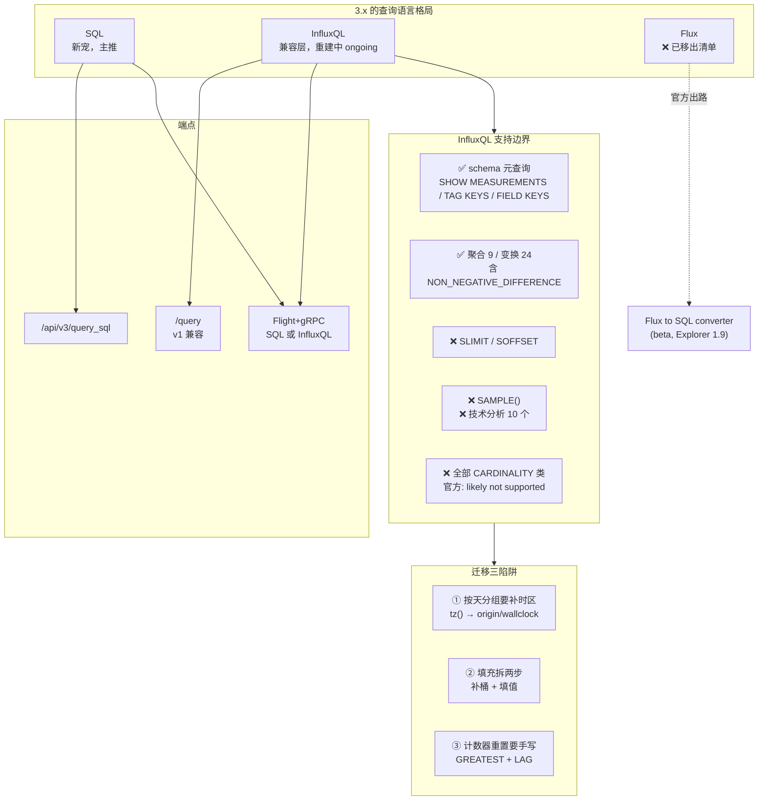
```mermaid
flowchart TD
    subgraph LANGS["3.x 的查询语言格局"]
        L1["SQL<br/>新宠，主推"]
        L2["InfluxQL<br/>兼容层，重建中 ongoing"]
        L3["Flux<br/>❌ 已移出清单"]
    end

    subgraph API["端点"]
        A1["/api/v3/query_sql"]
        A2["/query<br/>v1 兼容"]
        A3["Flight+gRPC<br/>SQL 或 InfluxQL"]
    end

    subgraph IQL["InfluxQL 支持边界"]
        S1["✅ schema 元查询<br/>SHOW MEASUREMENTS / TAG KEYS / FIELD KEYS"]
        S2["✅ 聚合 9 / 变换 24<br/>含 NON_NEGATIVE_DIFFERENCE"]
        S3["❌ SLIMIT / SOFFSET"]
        S4["❌ SAMPLE()<br/>❌ 技术分析 10 个"]
        S5["❌ 全部 CARDINALITY 类<br/>官方: likely not supported"]
    end

    subgraph MIG["迁移三陷阱"]
        M1["① 按天分组要补时区<br/>tz() → origin/wallclock"]
        M2["② 填充拆两步<br/>补桶 + 填值"]
        M3["③ 计数器重置要手写<br/>GREATEST + LAG"]
    end

    L1 --> A1
    L2 --> A2
    L1 --> A3
    L2 --> A3
    L2 --> IQL
    IQL --> MIG
    L3 -.->|"官方出路"| C1["Flux to SQL converter<br/>(beta, Explorer 1.9)"]
```

#### 🎯 落地视角小结

1. **先做语言盘点，再谈迁移**。别一上来就把 InfluxQL 全改成 SQL。正确顺序是：① 列出所有存量查询 → ② 用本课的支持表逐条判定"能不能直译" → ③ 能直译的批量改，不能直译的（重度依赖 `NON_NEGATIVE_DIFFERENCE()` / `DERIVATIVE()` / `CUMULATIVE_SUM()`）**先留在 InfluxQL 端点**。混合使用是被官方支持的工作方式。

2. **带 `tz()` 的按天分组是头号静默杀手**。L8 讲了 SQL 侧的 origin 陷阱，本课补上了另一半：**InfluxQL 的 `tz()` 恰恰是老代码里"做对了"的地方**，机械替换成 `DATE_BIN(INTERVAL '1 day', time)` 会把对的改成错的。**迁移前先 grep 一遍 `tz(`。**

3. **`SHOW TAG VALUES` 不带 `FROM` 会拖垮实例**。这是官方用 "strongly recommend" + "poor query performance / query timeouts / affect other queries" 措辞警告的。**它不是慢，是可能影响其他所有查询**。写进团队规范：**必须带 `FROM`，且限制在 1-50 张表**。

4. **基数类查询的替换方案要提前准备好**。L7 说"用 `COUNT(DISTINCT ...)` 自己数"，本课拿到了官方铁证（"likely not supported"）。**把这句替换写进运维手册**，否则哪天有人想查基数会发现所有老命令都失效。

5. **端点改造的机械成本很低**。`db=`、`q=`、`Authorization: Token` 三个参数都一样，**只改路径**（`/query` ↔ `/api/v3/query_sql`）。这意味着**灰度迁移很便宜**——可以一个查询一个查询地切，出问题随时切回去。

6. **Flux 代码别再投入了**。官方做了 AI 转换器（beta）这件事本身就是信号。如果团队还有 Flux 资产，**现在的策略应该是"转换 + 归档"，而不是"维护 + 新增"**。

7. **`SHOW DATABASES` 不支持但 `SHOW RETENTION POLICIES` 支持**这种反直觉细节，说明兼容层还在施工。**别凭直觉推断支持与否，以官方 feature-support 页为准**，而且**每次升级版本都要重新核一遍**——那张表的标题是 "ongoing"。

---

---

## 阶段 4 · 存储引擎与性能

> **凭什么快、慢在哪** ｜ 阶段导览：[overview](stages/4-存储引擎与性能/overview.md)

**本阶段的关键转折**：**探原理** —— 为什么快、慢在哪、边界在哪

**核心结论**（7 条）：

- **Core 没有 compactor**：gen1 Parquet 文件永不合并，90 天累积约 12,960 个
- 长周期查询慢的根因是**要打开的文件多**，不是数据量大 —— 架构天花板，调参无效
- **「刚写就能查」的上界是 15 分钟**（可查缓冲最多 900 个 WAL 文件）
- `no_sync=false` 是默认值，改 true 即拿持久性换延迟；停机要用 SIGTERM
- **列存省 I/O、SIMD 省 CPU，列存是 SIMD 的前提**
- last-value **<10ms 来自 LVC**：需主动创建、InfluxQL 不可用、重启即清空
- **「改掉 `SELECT *`」在 Core 上基本不成立**（官方说 1000 列才明显变慢，而 Core 每表上限 500 列）

### L10 · 存储引擎：WAL、Parquet 与压实

📖 [完整讲义](stages/4-存储引擎与性能/lessons/lesson-10-存储引擎-WAL-Parquet与压实.md)（929 行）

**本课目标**

- 描述一条数据**从写入到落盘的完整路径**：校验 → 内存缓冲 → WAL → 可查缓冲 → Parquet
- 理解 **`no_sync`** 这个开关如何决定"崩溃时丢多少"
- 说清 **Parquet 持久化的节奏**：每 10 分钟一次，保留最近 5 分钟在内存
- 解释 **Core 为什么没有 compactor**，以及它带来的**真实后果**（小文件永不合并）
- 掌握 **对象存储的 6 种选型**与"存储与计算分离"到底意味着什么

> 💻 承接第 3 课环境：Docker 容器名 `influxdb3-core`，端口 8181，token 已设进 `INFLUXDB3_AUTH_TOKEN`。
> 🔗 **回扣 L2**：本课会给出 L2《SKU 选型》那个"Core vs Enterprise"决策的**存储层底层原因**——不是功能阉割，是**架构取舍**。

---

#### 🖼️ 一图总结

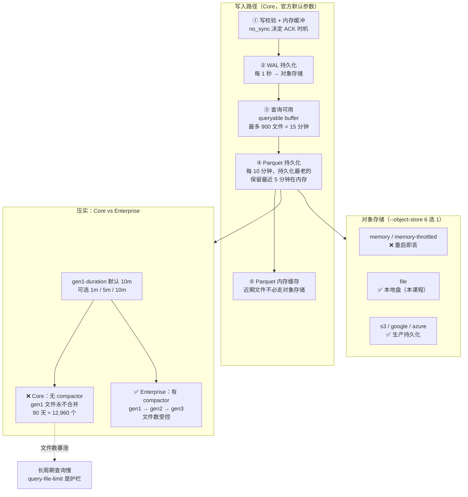
```mermaid
flowchart TD
    subgraph W["写入路径（Core，官方默认参数）"]
        W1["① 写校验 + 内存缓冲<br/>no_sync 决定 ACK 时机"]
        W2["② WAL 持久化<br/>每 1 秒 → 对象存储"]
        W3["③ 查询可用<br/>queryable buffer<br/>最多 900 文件 = 15 分钟"]
        W4["④ Parquet 持久化<br/>每 10 分钟，持久化最老的<br/>保留最近 5 分钟在内存"]
        W5["⑤ Parquet 内存缓存<br/>近期文件不必走对象存储"]
        W1 --> W2 --> W3 --> W4 --> W5
    end

    subgraph C["压实：Core vs Enterprise"]
        C1["gen1-duration 默认 10m<br/>可选 1m / 5m / 10m"]
        C2["❌ Core：无 compactor<br/>gen1 文件永不合并<br/>90 天 ≈ 12,960 个"]
        C3["✅ Enterprise：有 compactor<br/>gen1 → gen2 → gen3<br/>文件数受控"]
        C1 --> C2
        C1 --> C3
    end

    subgraph S["对象存储（--object-store 6 选 1）"]
        S1["memory / memory-throttled<br/>❌ 重启即丢"]
        S2["file<br/>✅ 本地盘（本课程）"]
        S3["s3 / google / azure<br/>✅ 生产持久化"]
    end

    W4 --> C
    W4 --> S
    C2 -.->|"文件数暴涨"| Q1["长周期查询慢<br/>query-file-limit 是护栏"]
```

#### 🎯 落地视角小结

1. **"刚写就能查"是有上界的，别把它当无限用**。可查缓冲默认**最多 900 个 WAL 文件 = 15 分钟**。超出后数据进 Parquet，读取路径从"内存直读"变成"缓存 → 对象存储"。**做实时监控（查最近几分钟）时这一点完全够用；做长周期分析时，性能特征完全不同。**

2. **`no_sync` 默认是安全的那档，别轻易动它**。`no_sync=false` 表示"WAL 落盘才 ACK"，崩溃时已 ACK 的数据不丢。改成 `true` 是**用持久性换延迟**——官方措辞是 *"acknowledge the write without waiting for persistence"*。**调之前先问：这批数据丢了能接受吗？** 大多数监控场景答案是"能"（丢几个点无所谓），但**财务、计费、审计类数据不行**。

3. **Core 不压实是架构天花板，不是调参能绕过的**。`gen1-duration` 只有 1m/5m/10m 三档，而 **10m 已经是文件最少的档位**。90 天累积约 **12,960 个文件**。**如果你的核心场景是长周期查询，这属于选型问题而非优化问题**——L2 的 SKU 决策在这里得到了底层解释。

4. **`memory-throttled` 是被低估的本地开发选项**。本地用 `memory` 开发会让你对性能产生错误预期——内存太快，问题暴露不出来。**如果生产跑 S3，本地开发建议用 `memory-throttled`**，它保留了"重启即丢"的便利性，同时注入接近真实对象存储的延迟与吞吐。

5. **`node-id` 唯一性要写进部署规范**。官方措辞是 *"should be unique for any hosts sharing the same object store"*。**两个实例共用 bucket 且 node-id 相同 → 文件路径互相覆盖 → 数据静默损坏**。这类问题排查起来极其痛苦，因为**它不报错**。

6. **停机用 `docker stop`，不要用 `docker kill`**。SIGTERM/SIGINT 触发优雅停机（**刷 WAL** → 等快照完成 → 标记 stopped）；SIGKILL 直接绕过。**在容器编排里，这意味着要留足 `terminationGracePeriodSeconds`**——否则 K8s 会在你还没刷完 WAL 时就 SIGKILL 掉 Pod。

7. **"数据在 WAL 里"≠"数据不安全"**。WAL 每秒刷到对象存储，所以 WAL tail *"is durable"*。**"在 WAL 里"影响的是查询走哪条路径（性能），不是数据安不安全（持久性）。** 把这两件事分开看，很多运维判断会清晰很多。

---

### L11 · 向量化执行：列存为什么快

📖 [完整讲义](stages/4-存储引擎与性能/lessons/lesson-11-向量化执行-列存为什么快.md)（869 行）

**本课目标**

| 知识点 | 关键点 | 学完你应该能 |
|--------|--------|-------------|
| ① 列存与向量化执行 | SIMD 批处理 vs 逐行处理；**"向量"= CPU 一次处理一批值** | 说清"向量化"到底向量化了什么，以及它和向量数据库的区别 |
| ② 谓词下推与分区裁剪 | 少读数据才是真的快 | 看懂 `EXPLAIN` 输出，知道哪三条优化在替你省 I/O |
| ③ last-value 查询为何 <10ms | LVC / DVC 两个**需主动配置**的内存缓存 | 复现 <10ms 的配置，并知道默认状态下达不到这个数字 |

---

#### 🖼️ 一图总结

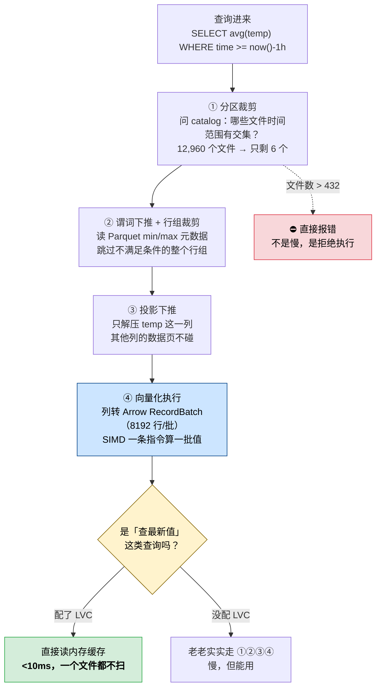
```mermaid
graph TD
    A["查询进来<br/>SELECT avg(temp) WHERE time >= now()-1h"] --> B["① 分区裁剪<br/>问 catalog：哪些文件时间范围有交集？<br/>12,960 个文件 → 只剩 6 个"]
    B --> C["② 谓词下推 + 行组裁剪<br/>读 Parquet min/max 元数据<br/>跳过不满足条件的整个行组"]
    C --> D["③ 投影下推<br/>只解压 temp 这一列<br/>其他列的数据页不碰"]
    D --> E["④ 向量化执行<br/>列转 Arrow RecordBatch（8192 行/批）<br/>SIMD 一条指令算一批值"]
    E --> F{"是「查最新值」<br/>这类查询吗？"}
    F -->|"配了 LVC"| G["直接读内存缓存<br/><b>&lt;10ms，一个文件都不扫</b>"]
    F -->|"没配 LVC"| H["老老实实走 ①②③④<br/>慢，但能用"]

    B -.->|"文件数 > 432"| X["⛔ 直接报错<br/>不是慢，是拒绝执行"]

    style G fill:#d4edda,stroke:#28a745,color:#000
    style X fill:#f8d7da,stroke:#dc3545,color:#000
    style E fill:#cce5ff,stroke:#004085,color:#000
    style F fill:#fff3cd,stroke:#856404,color:#000
```

#### 🎯 落地视角小结

> 面向工作落地。这 6 条是你明天能在团队里讲出来的东西。

1. **"72 小时限制"的准确说法是"432 个文件限制"**。向团队汇报时用后者——它能解释"为什么我查 13 天没报错"（数据稀疏，没凑够 432 个文件），也能解释"为什么调 `gen1-duration` 救不了你"（调小反而从 3 天缩到 7.2 小时）。

2. **Core 查不了 1 周以上的数据，而且是直接报错不是慢**。7 天 = 1,008 个文件 > 432。做容量规划时，这条比"3-5 天"的模糊表述有用得多。

3. **所有面向 Core 的查询必须带时间范围**。这是分区裁剪唯一的输入，也是唯一能对抗"文件永不合并"的手段。把它写进代码规范和 Code Review 检查项。

4. **要 <10ms 就必须配 LVC，且要用 SQL 查**（`last_cache()` 在 InfluxQL 里不支持）。同时接受三个代价：占内存、**重启后缓存为空直到新写入进来**、**key 列不能是高基数字段**。

5. **大屏/告警类"当前状态"查询，LVC 的 key 列应该与你的筛选维度一致**（如 `site_id → container_id → rack_id`）。不要把 trace_id / user_id 这类高基数字段放进 key 列——3.x 引擎不怕基数，但 LVC 怕。

6. **向团队解释"向量化"时，先说清它不是向量数据库**。这是本文档开头就踩过的坑，别人极可能也会踩。一句话版本：*InfluxDB 的"向量"在 CPU 寄存器里，向量数据库的"向量"在语义空间里。*

---

### L12 · 写入与查询性能调优

📖 [完整讲义](stages/4-存储引擎与性能/lessons/lesson-12-写入与查询性能调优.md)（1292 行）

**本课目标**

| 知识点 | 关键点 | 学完你应该能 |
|--------|--------|-------------|
| ① 批量写入与压缩 | **固定开销 vs 边际收益递减**；10,000 行 / 10MB 双阈值；gzip | 给出 `batch_size` 与 `flush_interval` 的取值理由，而不是照抄 5000 |
| ② 查询性能调优 | 收窄时间范围、**`SELECT *` 的真实代价**、善用 tag 过滤 | 判断哪些优化值得做、哪些是浪费时间 |
| ③ 慢查询诊断 | `EXPLAIN` 三兄弟分工 + `system.queries` 系统表 + 七步倒查 | 拿到一条慢查询，能在 5 分钟内定位到瓶颈属于哪一类 |

---

#### 🖼️ 一图总结

```mermaid
graph TD
    subgraph W["写入侧 · 知识点 1"]
        W1["逐条写<br/>每行付一次固定开销"] -->|"合并为一次请求"| W2["批量写<br/>固定开销被 N 行分摊"]
        W2 --> W3{"批量多大？"}
        W3 -->|"1 → 1000"| W4["陡峭区<br/><b>吞吐涨 500 倍</b>"]
        W3 -->|"1000 → 10000"| W5["缓冲区<br/>仅再涨 1.8 倍"]
        W3 -->|"10000 以上"| W6["平台区<br/><b>收益≈0，代价仍涨</b>"]
        W2 --> W7["官方双阈值<br/>10,000 行 或 10 MB<br/><b>谁先到谁触发</b>"]
        W2 --> W8["gzip<br/>最高 5x 提速"]
        W2 --> W9["flush_interval 兜底<br/>低速场景必需"]
    end

    subgraph Q["查询侧 · 知识点 2"]
        Q1["慢查询"] --> Q2{"WHERE 有 time 吗？"}
        Q2 -->|"没有"| Q3["⛔ 分区裁剪失效<br/><b>全表扫描</b>"]
        Q2 -->|"有"| Q4{"文件数 < 432？"}
        Q4 -->|"否"| Q5["⛔ 直接报错<br/>不是慢"]
        Q4 -->|"是"| Q6{"是查最新值吗？"}
        Q6 -->|"是"| Q7{"配了 LVC 吗？"}
        Q7 -->|"没配"| Q8["建 last_cache<br/><b>&lt;10ms</b>"]
        Q7 -->|"已配"| Q9["✅ 走缓存"]
        Q6 -->|"否"| Q10{"表有 1000+ 列？"}
        Q10 -->|"是"| Q11["改掉 SELECT *"]
        Q10 -->|"否"| Q12["别在 SELECT 上花时间<br/>去看文件数与 ORDER BY"]
    end

    subgraph D["诊断 · 知识点 3"]
        D1["system.queries<br/>按 end2end_duration 倒序"] --> D2["找出最慢的一批"]
        D2 --> D3["EXPLAIN 看计划<br/>不执行"]
        D3 --> D4["EXPLAIN ANALYZE<br/>看各节点实测耗时"]
        D4 --> D5{"plan &gt; exec ?"}
        D5 -->|"是"| D6["根因：文件数太多<br/><b>架构天花板，改 SQL 无效</b>"]
        D5 -->|"否"| D7["看 ORDER BY 与聚合"]
        D3 -.->|"文件清单被截断"| D8["EXPLAIN VERBOSE"]
    end

    style W4 fill:#d4edda,stroke:#28a745,color:#000
    style W6 fill:#f8d7da,stroke:#dc3545,color:#000
    style Q3 fill:#f8d7da,stroke:#dc3545,color:#000
    style Q5 fill:#f8d7da,stroke:#dc3545,color:#000
    style Q8 fill:#d4edda,stroke:#28a745,color:#000
    style D6 fill:#fff3cd,stroke:#856404,color:#000
```

#### 🎯 落地视角小结

> 面向工作落地。这 6 条是你明天能在团队里讲出来的东西。

1. **先算"攒够一批要几秒"，再决定 `flush_interval`**。低速场景（<500 点/秒）如果只配 `batch_size=5000`，数据要等 **500 秒**才发出去，而"刚写就能查"的上界只有 **15 分钟**——光攒批就吃掉了大半。**高速场景 `batch_size` 先到，`flush_interval` 只是保险。**

2. **客户端默认 `batch_size=1000` 比官方推荐的 10,000 保守一个数量级**，这不是矛盾而是取舍：1000 延迟低、内存小、失败重传代价小；10,000 吞吐最优。**要吞吐就显式调到 5000–10000，同时把 `flush_interval` 配好兜底。**

3. **把"所有面向 Core 的查询必须带时间范围"写进代码规范与 Code Review 检查项**，并把它排在性能清单第一位。BI 工具自动生成的 SQL 是重灾区——场景 4 那种"缺 `time` 谓词 + plan(900ms) > exec(250ms)"的组合，加一行 `WHERE time` 就能解决。

4. **不要指望改 `SELECT *` 能让 Core 上的慢查询变快**。官方门槛是 **1000+ 列**，而 Core 每表上限 **500 列**——你建不出那样的表。改它的价值在于**明确意图与防止后续加列撑大查询**，不在性能。

5. **`system.queries` 是易失的：重启即丢，且只保留 1000 条**（`--query-log-size`），高 QPS 下可能只覆盖几分钟。**要留存慢查询证据，必须定期把它抽出来外部化**——别在故障复盘时才发现查不到。

6. **认出那些"改 SQL 无效"的慢查询，比优化它们更有价值**。官方列的四类"不受你控制的瓶颈"里三条根因是文件数，指纹是 **plan 耗时 > exec 耗时**。遇到这种情况，正确动作是**收窄时间范围或上 Enterprise 的 compactor**，而不是继续改 SQL——后者是纯粹的浪费时间。

---

---

## 阶段 5 · 生产落地

> **部署、成本、生态** ｜ 阶段导览：[overview](stages/5-生产落地/overview.md)

**本阶段的关键转折**：**上生产** —— 部署、降本、接生态

**核心结论**（6 条）：

- **选型第一判据是「要查多久」不是「要多少钱」**
- **「能存」与「能查」在 Core 上分家**：90 天 = 3.4 TB 存得下，但 12,960 文件查不了
- **内存三默认相加 = 90%**，这是「内存比 CPU 先到瓶颈」的根因
- **Core 是「数据不丢、服务会断」**，秒级切换必须 Enterprise
- **升级 3.10+ 前必须备份 catalog**（v2→v3 单向不可逆）
- **自监控数据自己也只受 3 天可查窗口**，且文件数只跟墙钟有关、跟数据量无关

### L13 · 部署形态与容量规划

📖 [完整讲义](stages/5-生产落地/lessons/lesson-13-部署形态与容量规划.md)（1260 行）

**本课目标**

| 知识点 | 关键点 | 学完你应该能 |
|--------|--------|-------------|
| ① Core / Enterprise / Cloud 选型 | **判据：是否要查历史数据**（Core 无 compactor、单机） | 面对一个业务需求，给出形态选择并说明判据 |
| ② 容量规划与硬件 | 点数 × 每点字节数 × 保留期 × 副本数 | 用公式算出存储量，并知道内存为什么比 CPU 先到瓶颈 |
| ③ 高可用与备份 | ⚠️ 升级前必须备份 catalog（3.10+ 格式迁移单向） | 说出 Core 的 HA 边界，以及升级前必须做的动作 |

---

#### 🖼️ 一图总结

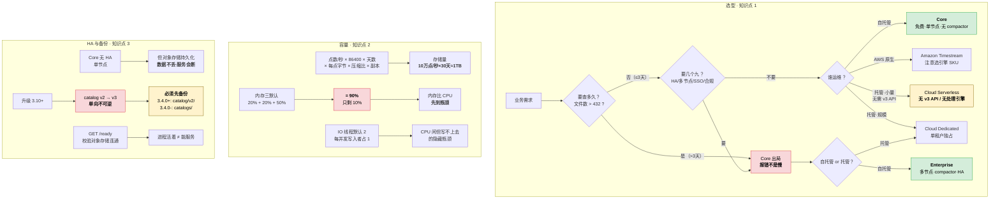
```mermaid
graph TD
    subgraph S["选型 · 知识点 1"]
        S1["业务需求"] --> S2{"要查多久？<br/>文件数 > 432 ?"}
        S2 -->|"是（>3天）"| S3["Core 出局<br/><b>报错不是慢</b>"]
        S2 -->|"否（≤3天）"| S4{"要几个九？<br/>HA/多节点/SSO/合规"}
        S4 -->|"要"| S3
        S4 -->|"不要"| S5{"谁运维？"}
        S5 -->|"自托管"| S6["<b>Core</b><br/>免费·单节点·无 compactor"]
        S5 -->|"AWS 原生"| S7["Amazon Timestream<br/>注意选引擎 SKU"]
        S5 -->|"托管·小量<br/>无需 v3 API"| S8["Cloud Serverless<br/><b>无 v3 API / 无处理引擎</b>"]
        S5 -->|"托管·规模"| S9["Cloud Dedicated<br/>单租户独占"]
        S3 --> S10{"自托管 or 托管？"}
        S10 -->|"自托管"| S11["<b>Enterprise</b><br/>多节点·compactor·HA"]
        S10 -->|"托管"| S9
    end

    subgraph C["容量 · 知识点 2"]
        C1["点数/秒 × 86400 × 天数<br/>× 每点字节 × 压缩比 × 副本"] --> C2["存储量<br/><b>10万点/秒×30天≈1TB</b>"]
        C3["内存三默认<br/>20% + 20% + 50%"] --> C4["<b>= 90%</b><br/>只剩 10%"]
        C4 --> C5["内存比 CPU<br/><b>先到瓶颈</b>"]
        C6["IO 线程默认 2<br/>每并发写入者占 1"] --> C7["CPU 闲但写不上去<br/>的隐藏瓶颈"]
    end

    subgraph H["HA 与备份 · 知识点 3"]
        H1["Core 无 HA<br/>单节点"] --> H2["但对象存储持久化<br/><b>数据不丢·服务会断</b>"]
        H3["升级 3.10+"] --> H4["catalog v2 → v3<br/><b>单向不可逆</b>"]
        H4 --> H5["<b>必须先备份</b><br/>3.4.0+: catalog/v2/<br/>3.4.0-: catalogs/"]
        H6["GET /ready<br/>校验对象存储连通"] --> H7["进程活着 ≠ 能服务"]
    end

    style S6 fill:#d4edda,stroke:#28a745,color:#000
    style S11 fill:#d4edda,stroke:#28a745,color:#000
    style S8 fill:#fff3cd,stroke:#856404,color:#000
    style S3 fill:#f8d7da,stroke:#dc3545,color:#000
    style C4 fill:#f8d7da,stroke:#dc3545,color:#000
    style H4 fill:#f8d7da,stroke:#dc3545,color:#000
    style H5 fill:#fff3cd,stroke:#856404,color:#000
```

#### 🎯 落地视角小结

> 面向工作落地。这 6 条是你明天能在团队里讲出来的东西。

1. **选型按三个问题顺序问，别一上来就比价**：**①要查多久**（>3 天 Core 出局，是报错不是慢）→ **②要几个九**（HA/多节点/SSO/合规 → Core 出局）→ **③谁运维**（自托管 / AWS 原生 / 托管云）。**顺序不能乱**，因为第一条是唯一无法用钱和资源解决的硬约束。

2. **别默认"先上 Core，不行再买 Enterprise"**。官方 which-influxdb-3 页开篇原文是 *"For **new production workloads**, use **InfluxDB 3 Enterprise**"*，而 Core 的定位被写成 *"edge or **non-critical** workloads"*。→ **在方案里写 Core 时，要能回答"为什么这个负载是非关键的"**。

3. **记住一个容量锚点：10 万点/秒 × 30 天 ≈ 1 TB**（典型压缩比）。它是**严格线性**的——速率 ×10 则容量 ×10，保留期 ×3 则容量 ×3。汇报时用这一句话就能推导量级，比列一堆表格有效。

4. **内存是 Core 上比 CPU 更早到的瓶颈，且是默认配置造成的**：`exec 20% + parquet cache 20% + force snapshot 50% = 90%`，4 GB 的机器只剩 **0.4 GB** 给进程与 OS。→ **小内存机器上必须主动调低这三个值**，尤其是查询型节点上的 `force-snapshot`（50% 明显偏高）。

5. **升级 3.10+ 前必须备份 catalog，且要先确认版本再选路径**：3.4.0+ 备份 `{prefix}/catalog/v2/logs/` 与 `{prefix}/catalog/v2/snapshot`；3.4.0 之前备份 `{prefix}/catalogs/` 与 `{prefix}/_catalog_checkpoint`。⚠️ **别看到 `catalogs/` 目录存在就备份它**——官方明确警告它可能是早期格式的残留，**不是有效的回滚源**。

6. **Core 的就绪探针要用 `GET /ready`，不要只查 TCP 端口**。Core 是无盘架构，数据全在对象存储里，**进程活着 ≠ 能服务**；`/ready` 直接校验对象存储连通性（200 / 503），比 uptime 检查可靠得多。

---

### L14 · 降采样、保留策略与成本

📖 [完整讲义](stages/5-生产落地/lessons/lesson-14-降采样保留策略与成本.md)（1764 行）

**本课目标**

| 知识点 | 关键点 | 学完你应该能 |
|--------|--------|-------------|
| ① 保留策略与删除 | **删分区而非删行**；`mo`=30 天、`0`=全删（与 1.x/2.x 相反） | 说出 Core 保留期的四条硬边界，并算出保留期对应的文件数 |
| ② 降采样与成本模型 | 秒级 7 天 / 分钟级 90 天 / 小时级 1 年 | 用成本模型解释"降采样省的是行数不是字节"，并算出调度周期约束 |
| ③ 冷数据分层 | 对象存储即冷层；Core 无 compactor | 说清"降采样 ≠ 删原始数据"，以及冷数据为什么能直接被第三方引擎读 |

---

#### 🖼️ 一图总结

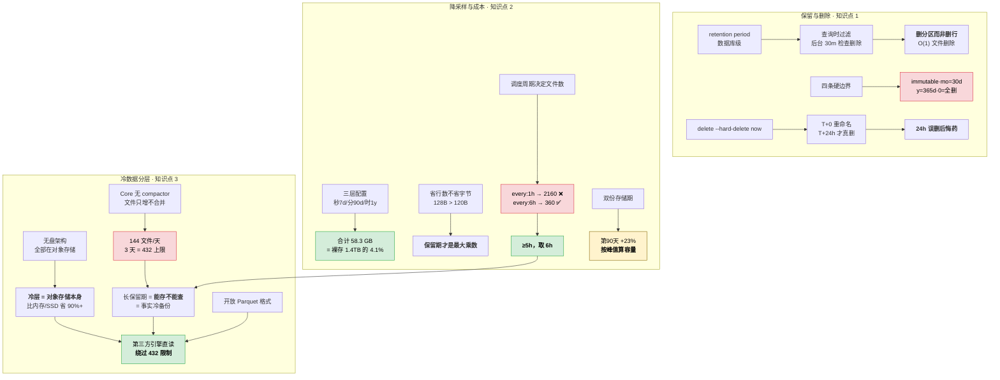
```mermaid
graph TD
    subgraph R["保留与删除 · 知识点 1"]
        R1["retention period<br/>数据库级"] --> R2["查询时过滤<br/>后台 30m 检查删除"]
        R2 --> R3["<b>删分区而非删行</b><br/>O(1) 文件删除"]
        R4["四条硬边界"] --> R5["immutable·mo=30d<br/>y=365d·0=全删"]
        R6["delete --hard-delete now"] --> R7["T+0 重命名<br/>T+24h 才真删"]
        R7 --> R8["<b>24h 误删后悔药</b>"]
    end

    subgraph D["降采样与成本 · 知识点 2"]
        D1["三层配置<br/>秒7d/分90d/时1y"] --> D2["合计 58.3 GB<br/>= 裸存 1.4TB 的 4.1%"]
        D3["省行数不省字节<br/>128B > 120B"] --> D4["<b>保留期才是最大乘数</b>"]
        D5["调度周期决定文件数"] --> D6["every:1h → 2160 ❌<br/>every:6h → 360 ✅"]
        D6 --> D7["<b>≥5h，取 6h</b>"]
        D8["双份存储期"] --> D9["第90天 +23%<br/><b>按峰值算容量</b>"]
    end

    subgraph C["冷数据分层 · 知识点 3"]
        C1["无盘架构<br/>全部在对象存储"] --> C2["<b>冷层 = 对象存储本身</b><br/>比内存/SSD 省 90%+"]
        C3["Core 无 compactor<br/>文件只增不合并"] --> C4["144 文件/天<br/>3 天 = 432 上限"]
        C4 --> C5["长保留期 = <b>能存不能查</b><br/>= 事实冷备份"]
        C6["开放 Parquet 格式"] --> C7["第三方引擎直读<br/><b>绕过 432 限制</b>"]
    end

    D7 --> C5
    C5 --> C7
    C2 --> C7

    style R5 fill:#f8d7da,stroke:#dc3545,color:#000
    style D6 fill:#f8d7da,stroke:#dc3545,color:#000
    style D7 fill:#d4edda,stroke:#28a745,color:#000
    style D9 fill:#fff3cd,stroke:#856404,color:#000
    style C4 fill:#f8d7da,stroke:#dc3545,color:#000
    style C7 fill:#d4edda,stroke:#28a745,color:#000
    style D2 fill:#d4edda,stroke:#28a745,color:#000
```

#### 🎯 落地视角小结

> 面向工作落地。这 6 条是你明天能在团队里讲出来的东西。

1. **降本先砍原始层保留期，再谈降采样**。三层方案里，7 天原始层占 46% 的存储量，而两层聚合加起来只占 2.2%。→ **把原始层从 7 天压到 3 天，收益远大于优化降采样算法**。

2. **"分钟级 90 天"必须配 `every:6h`，配 `every:1h` 等于白降**。降采样层的文件数 = **每天调度次数**（每次调度只落进 1 个 gen1 时间桶），与降采样精度无关。90 天要可查需 90 × 每天文件数 ≤ 432 → **调度周期 ≥ 5 小时，取 6h 留余量**。这是本课最容易踩的实操坑。

3. **容量规划按峰值算，别按稳态算**。降采样是"额外写一份"，原始层过期前你付两份钱——实测第 90 天合计 33.2 GB，比同期裸存**多 23%**。预算评审时把这个前置成本讲清楚，否则中期会被质疑"说好的省 95% 呢"。

4. **建库前跑一遍文件数预演：保留期天数 × 144 是否 ≤ 432**。这是 Core 上唯一一条"配错了既不报错也查不出数据"的约束。7 天 = 1,008 文件就已经超限——**保留期配长 = 事实上的冷备份，不是"查得到的历史"**。

5. **迁移脚本里凡是 `retention=0`，逐条核对**。**1.x/2.x 的 `0d` = 永久保留，Core 的 `0d` = 立刻全删**——这是静默语义反转，配置不报错、库能建起来，然后数据开始消失。同理，**合规场景别用 `mo`/`y`**（`3mo`=90 天 ≠ 3 个自然月 91.3 天），按天数写。

6. **硬删除后 24 小时才真正腾出空间，这 24 小时是你的误删后悔药**。`--hard-delete now` 的 `now` 是"开始宽限期"不是"立刻抹掉"；宽限期内表被重命名为 `<table>-<timestamp>` 且**仍可查询**。⚠️ 但注意 issue #27200：**低写入部署若不再触发 snapshot，清理可能迟迟不发生**——边缘节点删完要观察 catalog 是否真的清理了。

---

### L15 · 处理引擎：Python 插件与触发器

📖 [完整讲义](stages/5-生产落地/lessons/lesson-15-处理引擎Python插件与触发器.md)（2567 行）

**本课目标**

| 知识点 | 关键点 | 学完你应该能 |
|--------|--------|-------------|
| ① 处理引擎架构 | **内嵌 Python VM**；三种触发器；`influxdb3_local` 共享 API；内存缓存 | 说清处理引擎「跑在数据库里」意味着什么，以及为什么它既是便利也是风险 |
| ② Python 插件与触发器 | 三个入口函数签名；`--plugin-dir` / `gh:` 两种装载方式；`error-behavior` 与 `run_async` | 写一个能跑的 WAL 插件，并说出它的三条红线（耗时 / 递归写回 / 单次可见范围） |
| ③ 内置插件与告警 | 官方插件库；Notifier 是告警的**发送端**；死信检查 | 用官方插件拼出一条「检测 → 抑制 → 发送」的完整告警链路 |

---

#### 🖼️ 一图总结

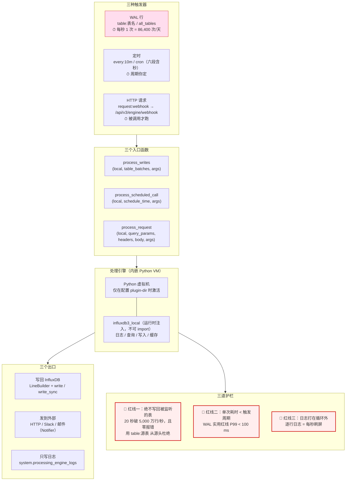
```mermaid
flowchart TD
    subgraph ENGINE["处理引擎（内嵌 Python VM）"]
        direction TB
        VM["Python 虚拟机<br/>仅在配置 plugin-dir 时激活"]
        API["influxdb3_local（运行时注入，不可 import）<br/>日志 / 查询 / 写入 / 缓存"]
        VM --- API
    end

    subgraph TRIG["三种触发器"]
        direction LR
        T1["WAL 行<br/>table:表名 / all_tables<br/>⏱ 每秒 1 次 = 86,400 次/天"]
        T2["定时<br/>every:10m / cron（六段含秒）<br/>⏱ 周期你定"]
        T3["HTTP 请求<br/>request:webhook → /api/v3/engine/webhook<br/>⏱ 被调用才跑"]
    end

    subgraph ENTRY["三个入口函数"]
        direction LR
        E1["process_writes<br/>(local, table_batches, args)"]
        E2["process_scheduled_call<br/>(local, schedule_time, args)"]
        E3["process_request<br/>(local, query_params, headers, body, args)"]
    end

    subgraph OUT["三个出口"]
        direction LR
        O1["写回 InfluxDB<br/>LineBuilder + write / write_sync"]
        O2["发到外部<br/>HTTP / Slack / 邮件（Notifier）"]
        O3["只写日志<br/>system.processing_engine_logs"]
    end

    subgraph GUARD["三道护栏"]
        direction TB
        G1["🚫 红线一：绝不写回被监听的表<br/>20 秒破 5,000 万行/秒，且零报错<br/>用 table:源表 从源头杜绝"]
        G2["🚫 红线二：单次耗时 &lt; 触发周期<br/>WAL 实用红线 P99 &lt; 100 ms"]
        G3["🚫 红线三：日志打在循环外<br/>逐行日志 = 每秒刷屏"]
    end

    TRIG --> ENTRY
    ENTRY --> ENGINE
    ENGINE --> OUT
    ENGINE --> GUARD

    style T1 fill:#fde,stroke:#c33
    style G1 fill:#fee,stroke:#c00,stroke-width:2px
    style G2 fill:#fee,stroke:#c00,stroke-width:2px
    style G3 fill:#fee,stroke:#c00,stroke-width:2px
```

#### 🎯 落地视角小结

1. **启用前先算调用次数，不是先写代码。** 选触发器时先问「一天要跑几次」，再问「跑的时候做什么」。WAL 触发器的 86,400 次/天是这道算术题的分水岭。

2. **`table:表名` 优先于 `all_tables`，永远。** 后者每多监听一张表，插件就多跑一遍；更危险的是它让「写回被监听表」的自毁路径变成默认可达。

3. **每个 WAL 插件上线前跑一次 `influxdb3 test`（干跑）。** 它不写库、不触发，直接告诉你 `log_lines` / `database_writes` / `errors` 三件事，成本接近零。

4. **把六条铁律做成 CI 门禁。** 本课实验 B 的 `l15_plugin_lint.py` 可以直接挂到 PR 流程里 —— 处理引擎的错误大多是**静默的**，靠人眼 review 抓不住。

5. **告警装两件套：检测器 + Notifier，外加一条死信检查。** 只装阈值告警等于「数据断流时静默」，而死信检查是唯一能发现「采集端挂了」的东西。

6. **日志是排障的唯一抓手，但要节制。** 插件的 `print` 不进日志（只在本地 CLI 的 stdout），必须用 `influxdb3_local.info/warn/error`；反过来，把它们放进 `for row in ...` 循环里，就是每秒 86,400 次的日志风暴。

---

### L16 · · 生态集成：Telegraf、Grafana 与自监控

📖 [完整讲义](stages/5-生产落地/lessons/lesson-16-生态集成与自监控.md)（2200 行）

**本课目标**

| 学完你应该能 | 具体表现 |
|-------------|---------|
| **接好采集端** | 写出一份能上生产的 `outputs.influxdb_v3` 配置，并说清每个关键选项在赌什么 |
| **接好可视化** | 知道 Grafana 连 Core 时**为什么必须选「InfluxDB Enterprise 3.x」**，以及 SQL 走不通时怎么排查 |
| **监控 InfluxDB 自己** | 分得清 `/health` `/ready` `/metrics` `system.*` 与 `system_metrics 插件` 这五个东西各自的覆盖面与盲区 |

---

#### 🖼️ 一图总结

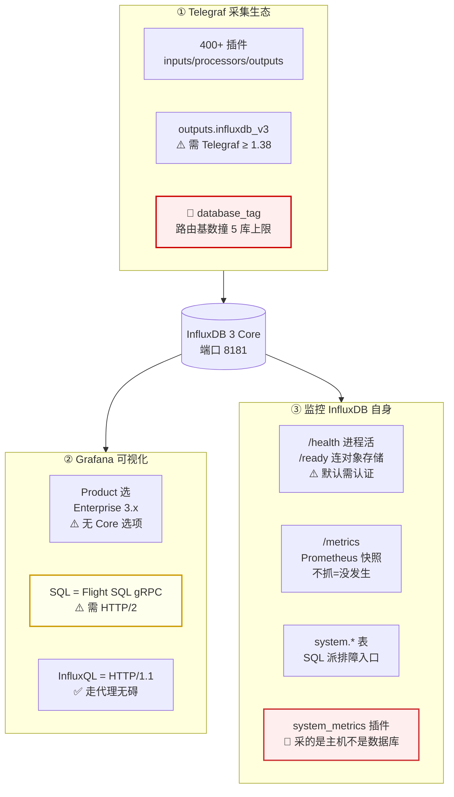
```mermaid
flowchart TD
    subgraph T["① Telegraf 采集生态"]
        direction LR
        T1["400+ 插件<br/>inputs/processors/outputs"]
        T2["outputs.influxdb_v3<br/>⚠️ 需 Telegraf ≥ 1.38"]
        T3["🔴 database_tag<br/>路由基数撞 5 库上限"]
    end

    subgraph G["② Grafana 可视化"]
        direction LR
        G1["Product 选<br/>Enterprise 3.x<br/>⚠️ 无 Core 选项"]
        G2["SQL = Flight SQL gRPC<br/>⚠️ 需 HTTP/2"]
        G3["InfluxQL = HTTP/1.1<br/>✅ 走代理无碍"]
    end

    subgraph M["③ 监控 InfluxDB 自身"]
        direction LR
        M1["/health 进程活<br/>/ready 连对象存储<br/>⚠️ 默认需认证"]
        M2["/metrics<br/>Prometheus 快照<br/>不抓=没发生"]
        M3["system.* 表<br/>SQL 派排障入口"]
        M4["system_metrics 插件<br/>🔴 采的是主机不是数据库"]
    end

    T --> DB[("InfluxDB 3 Core<br/>端口 8181")]
    DB --> G
    DB --> M

    style T3 fill:#fee,stroke:#c00,stroke-width:2px
    style G2 fill:#ffe,stroke:#c90,stroke-width:2px
    style M4 fill:#fee,stroke:#c33,stroke-width:2px
```

#### 🎯 落地视角小结

1. **Telegraf 配置进 CI。** 本课实验 A 的体检器可以直接挂到 PR 流程；配置错误大多是**静默的**，靠人眼 review 抓不住。

2. **`database_tag` 用之前先自数。** `SELECT COUNT(DISTINCT(...))` 的结果 > 5，就必须改方案。这是本课唯一一个「上线时正常、后期突然炸」的坑。

3. **Grafana 面板的刷新间隔是被忽略的查询放大器。** 5s → 30s，查询量降到 1/6。自建环境代价是 CPU，云上代价是账单。

4. **K8s 探针用 `/ready`，不要只查 TCP。** 无盘架构下进程活着 ≠ 能服务（L13 已核实）。另外 `/ping` **必须用 GET**，HEAD 会返回 404。

5. **自监控要分层，别指望一个端点。** `/health` 看进程、`/ready` 看对象存储、`/metrics` 看内部状态、`system.*` 看元数据——四者覆盖面不同，缺一不可。且 `/metrics` **只是当前值快照，不抓取就等于没发生**。

6. **自监控数据自己也在 3 天窗口内。** 想留长历史必须先降采样（L14）或上 Enterprise（L13）。否则就是「存了 90 天，查 3 天」。

7. **生产环境记得关遥测。** `--disable-telemetry-upload` 或 `INFLUXDB3_TELEMETRY_DISABLE_UPLOAD`，这在内网/合规场景通常是必做项。

---

---

## 阶段 6 · 对比与决策

> **怎么选型、怎么迁移** ｜ 阶段导览：[overview](stages/6-对比与决策/overview.md)

**本阶段的关键转折**：**做抉择** —— 横向对比、迁移、选型

**核心结论**（8 条）：

- **InfluxDB 是存储引擎（发动机），Prometheus 是完整监控方案（整车）**
- **没有一款赢下全部场景**（实验 A 四个场景四个不同冠军），且**先排雷再打分**比打分重要
- **迁移风险按「失败时有没有声音」排**：报错型最坏延期，静默反转最坏丢数据且无人知晓
- **静默再分两类**：`reverse`（方向反了，`0d` 想永久结果立刻全删）灾难级 vs `drift`（幅度偏了）合规级
- **不可逆点不止一个，版本升级的不可逆点比数据迁移靠前得多**
- **约束是有归属的**：432 文件上限是 Core 的属性，不是 InfluxDB 的属性
- **Serverless 不是 Core 的托管版**（无原生 v3 API、无处理引擎）
- **成本排序会被授权费翻转**；IoT 场景运维人力是主机费的 31 倍

### L17 · · 横向对比：五款候选

📖 [完整讲义](stages/6-对比与决策/lessons/lesson-17-横向对比-五款候选.md)（2272 行）

**本课目标**

学完本课，你应该能够：

1. 用**一句话**说清五款候选各自的「主战场」，而不是背参数
2. 讲明白 **InfluxDB 与 Prometheus 不是同类东西**——一个是存储引擎，一个是完整监控方案
3. 拿到任何一份对比表，能一眼看出**它有没有在做不公平对照**
4. 把「哪个更好」翻译成「**在我的约束下，哪个能用、哪个更省事**」

> 📌 **本课最重要的一条纪律**（阶段 6 overview 原文要求）：
> 二手基准数字差异极大，**汇报时只取方向性结论，不把具体数值写进决策文档**。
> 本课会给你一套可执行的「口径审计」方法（实验 B），而不是让你去记一堆数字。

---

#### 🖼️ 一图总结

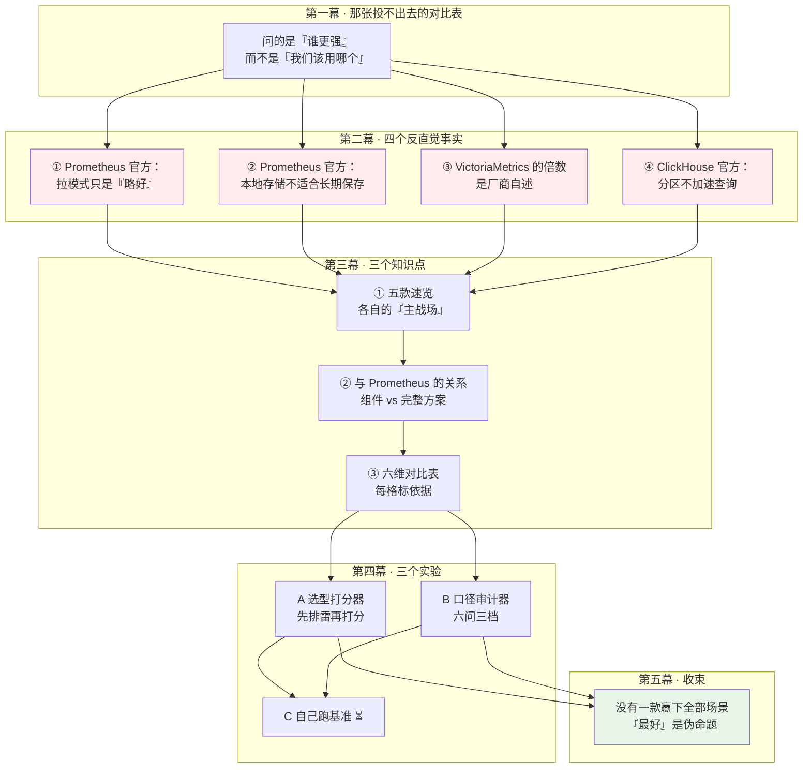
```mermaid
graph TB
    subgraph ACT1["第一幕 · 那张投不出去的对比表"]
        A1["问的是『谁更强』<br/>而不是『我们该用哪个』"]
    end

    subgraph ACT2["第二幕 · 四个反直觉事实"]
        B1["① Prometheus 官方：<br/>拉模式只是『略好』"]
        B2["② Prometheus 官方：<br/>本地存储不适合长期保存"]
        B3["③ VictoriaMetrics 的倍数<br/>是厂商自述"]
        B4["④ ClickHouse 官方：<br/>分区不加速查询"]
    end

    subgraph ACT3["第三幕 · 三个知识点"]
        C1["① 五款速览<br/>各自的『主战场』"]
        C2["② 与 Prometheus 的关系<br/>组件 vs 完整方案"]
        C3["③ 六维对比表<br/>每格标依据"]
    end

    subgraph ACT4["第四幕 · 三个实验"]
        D1["A 选型打分器<br/>先排雷再打分"]
        D2["B 口径审计器<br/>六问三档"]
        D3["C 自己跑基准 ⏳"]
    end

    subgraph ACT5["第五幕 · 收束"]
        E1["没有一款赢下全部场景<br/>『最好』是伪命题"]
    end

    A1 --> B1 & B2 & B3 & B4
    B1 & B2 & B3 & B4 --> C1
    C1 --> C2 --> C3
    C3 --> D1 & D2
    D1 & D2 --> D3
    D1 --> E1
    D2 --> E1

    style B1 fill:#ffebee
    style B2 fill:#ffebee
    style B3 fill:#ffebee
    style B4 fill:#ffebee
    style E1 fill:#e8f5e9
```

#### 🎯 落地视角小结

> 面向明天就要开评审会的你，六条可直接用。

1. **对比表要加一列「我们已有什么」**——团队技能、已有组件、迁移成本。缺了这一列，评审会上一定被运维和架构师同时质疑。

2. **汇报时先说边界，再说优势**——把「InfluxDB Core 只有 3 天可查窗口」放在 PPT 第一页。主动暴露限制的提案，比被人当场问出来的提案可信得多。

3. **任何倍数都要问三句**——「谁测的？」「单位是什么、除以了什么？」「是峰值还是稳态？」三句答不上来，这个数字就别写。

4. **把「不确定性」一起写进文档**，而不是藏起来。模板见实验 B 输出末尾那个方框——**关键不是能不能写数字，而是把不确定性一起写出来**。

5. **已有 Prometheus 就别动它，只加长期存储**——告警、服务发现、exporter 生态都是沉没成本，`remote_write` 是一等公民特性，改动最小。

6. **没有监控体系、数据源以设备为主 → 从 Telegraf + InfluxDB 起步**。Telegraf 300+ 插件（保守口径）的采集广度，是 Prometheus exporter 生态之外的另一极；短生命周期任务和防火墙后的目标，推模式都更省事。

---

### L18 · 迁移指南：从 1.x/2.x 到 3.x

📖 [完整讲义](stages/6-对比与决策/lessons/lesson-18-迁移指南-从1x2x到3x.md)（2588 行）

**本课目标**

- 列出 1.x / 2.x / 3.x 的**三代差异清单**（存储引擎、查询语言、保留期语义、API）
- 按「失败时有没有声音」给迁移风险排序，并区分 `reverse`（方向反了）与 `drift`（幅度偏了）
- 算出 Core 上的**双写窗口**（1–3 天），知道写太久反而查不到最早的数据
- 识别**版本升级的不可逆点**比数据迁移更靠前，升级前必须备份 catalog

#### 🖼️ 一图总结

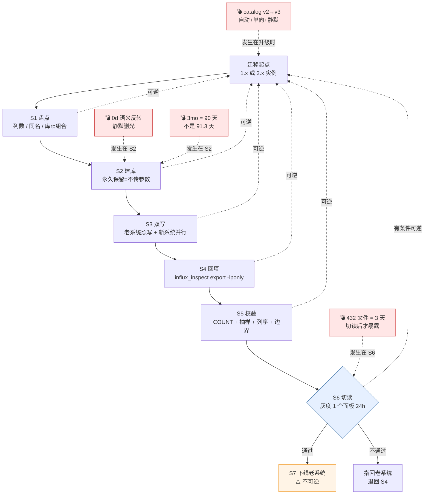
```mermaid
graph TB
    START["迁移起点<br/>1.x 或 2.x 实例"] --> S1["S1 盘点<br/>列数 / 同名 / 库rp组合"]
    S1 --> S2["S2 建库<br/>永久保留=不传参数"]
    S2 --> S3["S3 双写<br/>老系统照写 + 新系统并行"]
    S3 --> S4["S4 回填<br/>influx_inspect export -lponly"]
    S4 --> S5["S5 校验<br/>COUNT + 抽样 + 列序 + 边界"]
    S5 --> S6{"S6 切读<br/>灰度 1 个面板 24h"}
    S6 -->|"通过"| S7["S7 下线老系统<br/>⚠️ 不可逆"]
    S6 -->|"不通过"| BACK["指回老系统<br/>退回 S4"]

    S1 -.->|"可逆"| START
    S2 -.->|"可逆"| START
    S3 -.->|"可逆"| START
    S4 -.->|"可逆"| START
    S5 -.->|"可逆"| START
    S6 -.->|"有条件可逆"| START

    D1["💣 0d 语义反转<br/>静默删光"] -.->|"发生在 S2"| S2
    D2["💣 3mo = 90 天<br/>不是 91.3 天"] -.->|"发生在 S2"| S2
    D3["💣 432 文件 = 3 天<br/>切读后才暴露"] -.->|"发生在 S6"| S6
    D4["💣 catalog v2→v3<br/>自动+单向+静默"] -.->|"发生在升级时"| START

    style D1 fill:#ffe6e6,stroke:#c33,color:#333
    style D2 fill:#ffe6e6,stroke:#c33,color:#333
    style D3 fill:#ffe6e6,stroke:#c33,color:#333
    style D4 fill:#ffe6e6,stroke:#c33,color:#333
    style S7 fill:#fff4e6,stroke:#e80,color:#333
    style S6 fill:#e6f0ff,stroke:#47a,color:#333
```

#### 🎯 落地视角小结

1. **建库后第一件事是查保留期**。命令：`influxdb3 show databases`。看到 `0d` 立刻删库重建。这一步花 10 秒，能省一个月后的数据恢复。
2. **永久保留 = 不传 `--retention-period`**，不传 `0d`，不传 `0`。把这句话写进你们的建库规范里。
3. **迁移清单必须单独标出「静默」项**。危险项里只有 2 条静默，但它们值得单独做一次检查 —— 因为报错的 4 条会自己跳出来。
4. **导出必须带 `-lponly`**。不带它导出的 DDL 语句会让整批写入失败，而你会以为是网络问题。
5. **回滚演练放在 S6 之前**。S7 之后再练回滚，练的已经不是回滚，是灾难恢复。
6. **升级 3.10 前先 `influxdb3 --version`，再按版本选 catalog 备份路径**。3.4.0 是分界线，选错路径的备份不会报错。
7. **Docker 部署一律用固定版本标签**。官方自己反复提醒 `latest` 会指向 3.x Core。
8. **校验不能只比 COUNT**。列顺序、类型、精度解释、时间边界都要查 —— COUNT 相同但语义不同的情况太多了。
9. **InfluxQL 用户记住 `db/rp` 命名约定**。rp 从数据模型里消失了，但从命名规范里回来了。
10. **Flux 转换器的输出必须人工复核**。官方自己说它是 AI 生成、输出会变。
11. **双写窗口按「可查窗口」反推，别拍脑袋**。Core 上只有 1-3 天（被 3 天可查窗口卡住），
    所以 S5 的对账脚本要在双写开始前就写好，不是边写边想。
12. **导出磁盘按 1.2 倍预留**。行协议是文本格式、无压缩，导出体积通常**大于** TSM 内部存储；
    磁盘满会导致导出中断，半途中断的导出文件最容易出问题。

### L19 · 场景演练与选型决策

📖 [完整讲义](stages/6-对比与决策/lessons/lesson-19-场景演练与选型决策.md)（2545 行）

**本课目标**

- 用**决策树**跑完一次完整选型：层次差检查 → 产品选型 → SKU 选型 → 成本与落地
- 把「我们选了 InfluxDB」拆成**两次决策**，并说出五个 SKU 各自的硬约束
- 识别**约束冲突**：区分「某 SKU 不满足约束」与「约束之间打架」
- 算出 TCO 三方案并知道**成本排序会被授权费翻转**

#### 🖼️ 一图总结

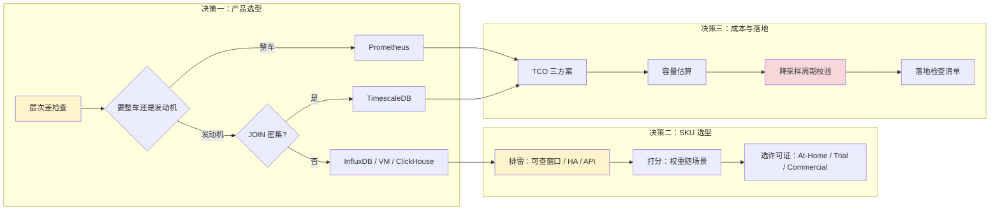
```mermaid
flowchart LR
    subgraph 决策一["决策一：产品选型"]
        A1[层次差检查] --> A2{要整车还是发动机}
        A2 -->|整车| A3[Prometheus]
        A2 -->|发动机| A4{JOIN 密集?}
        A4 -->|是| A5[TimescaleDB]
        A4 -->|否| A6[InfluxDB / VM / ClickHouse]
    end

    subgraph 决策二["决策二：SKU 选型"]
        B1[排雷：可查窗口 / HA / API] --> B2[打分：权重随场景]
        B2 --> B3[选许可证：At-Home / Trial / Commercial]
    end

    subgraph 决策三["决策三：成本与落地"]
        C1[TCO 三方案] --> C2[容量估算]
        C2 --> C3[降采样周期校验]
        C3 --> C4[落地检查清单]
    end

    A6 --> B1
    A3 --> C1
    A5 --> C1

    style A1 fill:#fff3cd
    style B1 fill:#fff3cd
    style C3 fill:#f8d7da
```

**这张图的读法**：三次决策**顺序不能颠倒**。先定产品，再定 SKU，最后算钱。颠倒顺序的典型症状是——先算出"InfluxDB 最便宜"，然后才发现你要的功能在 Core 上没有，得买 Enterprise，成本翻三倍。

#### 🎯 落地视角小结

1. **先排雷再打分，硬约束不进扣分体系** —— L17 定的原则，在 SKU 层同样成立。Core 在长保留场景不是"分数低"，是"不成立"。

2. **"必须满足"和"最好有"必须分两栏写** —— 只有前者能进决策依据。这条纪律防的是"最好有"伪装成"必须满足"。

3. **分差 < 5% 时，打分器没有发言权** —— APM 场景 Enterprise 63 分、Dedicated 62 分。这时候真正的决策依据是你有几个愿意运维的人。

4. **432 文件上限只对 Core 成立** —— 其他四个 SKU 有 compactor。区别在于 Core 上是硬报错（查不到），其他是性能衰减（查得慢）。

5. **降采样层查不到，是调度周期的锅，不是精度的锅** —— 改精度救不了文件数超限，只能改周期。

6. **Enterprise 授权费不公开，且按 CPU 核计费** —— 这是选型会上最容易被忽略的大额固定支出。任何"自托管更便宜"的结论，在没拿到授权报价前都不成立。

7. **At-Home 许可证只有 2 核且不可商用** —— 在 4 核以上机器跑它，需要用 `--cpuset-cpus` 限制 CPU 可见性。

8. **Trial 许可证 256 核 30 天，但官方明说不可商用** —— 用 Trial 跑生产是授权违规，不只是技术问题。

9. **Serverless 不是 Core 的托管版** —— 它没有原生 v3 写 API、没有 Processing Engine。迁移到它需要改写入代码。

10. **运维人力常常比机器贵** —— IoT 场景测算中，0.5 FTE（$7,500/月）是主机费（$240/月）的 31 倍。这个倍率取决于你的人力成本假设，但结构关系稳定。

11. **按量计费的四项里，查询次数最容易被低估** —— 一个每 10 秒刷新的 Grafana 面板 = 25.9 万次查询/月。20 个面板就是 518 万次。

12. **收官动作：把本课的清单落到你的场景上** —— 改实验 B 的 `WORKLOADS` 常量，重跑，你就有一份挂着自家数字的清单。

---

## 综合实战项目

> 知识讲完 ≠ 学完。这个项目把全书六个阶段的知识点焊成一个**可运行、可挂 CI 的落地体检器**。

| 项 | 内容 |
|----|------|
| 项目名 | [时序数据平台落地](projects/时序数据平台落地/README.md) |
| 需求 | 输入一份负载描述（写入速率、保留期、查询窗口、tag/field 规模、合规要求…），输出**选型结论 + 坑位清单 + 成本估算 + 迁移检查表** |
| 覆盖范围 | 跨阶段 **3 / 4 / 5 / 6**（数据模型 → 存储引擎 → 生产落地 → 选型决策） |
| 规模 | 4 份文档 + 7 个实现模块，共 **1,016 行** Python（零依赖，纯标准库） |
| 可运行性 | ✅ 实跑验证：`python3 实现/main.py` → rc=1（P0=21 / P1=21 / P2=7 / INFO=40） |
| 可挂 CI | ✅ 退出码即结论：`0`=通过 / `1`=有 P0 / `2`=只有 P1 / `3`=参数错 |

### 项目需求

**输入**：一份负载描述 —— 写入速率、保留期、查询窗口、tag/field 规模、库/表数量、是否需 JOIN、是否需原生 v3 API、是否需处理引擎、是否要托管、是否需 HA、是否合规、面板数与刷新频率、降采样调度周期。

**输出**（一次运行，四类结论）：

1. **选型结论**：五个 SKU 哪些被排雷、哪些幸存、打分排序如何
2. **坑位清单**：按 P0 / P1 / P2 / INFO 分级，每条带 `stage` / `detail` / `action`
3. **成本估算**：容量估算 + TCO 三方案对比（自托管 / 托管 / 混合）
4. **迁移检查表**：`reverse` / `drift` 分类的迁移风险，命中才告警

**三个预设负载**（各埋了真实坑，供对照）：

| 负载 | 埋的坑 | 跑出来的结果 |
|------|-------|-------------|
| IoT 设备遥测 | 保留期 `0d`（reverse 型反转） | 幸存 SKU：enterprise / serverless / dedicated |
| K8s 微服务监控 | 保留期 `3mo`（drift 型）+ 约束冲突 | 幸存 SKU：enterprise / dedicated |
| 业务指标分析（需 JOIN） | 保留期 `1y` + 合规要求 + 高基数 order_id | 幸存 SKU：enterprise / serverless / clustered |

> 💡 **三个场景没有一个跑出 0 个 P0 —— 这是故意设计的。** 真实负载都会有坑，
> 跑出 P0 不是 bug，是这个工具在正常工作。

**配套文档**：[设计决策](projects/时序数据平台落地/设计决策.md)（5 个真权衡决策点） ｜ [反例对照](projects/时序数据平台落地/反例对照.md)（9 条逐项对比） ｜ [验收清单](projects/时序数据平台落地/验收清单.md)（四层验收）

### 覆盖知识点地图

| 阶段 | 体检模块 | 覆盖的知识点 |
|------|---------|-------------|
| 3 · 数据模型 | `schema_design.py` | 基数乘法、tag vs field 抉择、Core 硬限制（库 5 / 表 2000 / 列 500） |
| 4 · 存储引擎 | `engine.py` | 432 文件上限、72 小时派生值、gen1 10 分钟、写入路径与 `no_sync` |
| 5 · 生产落地 | `ops.py` | 保留期 reverse/drift 判定、降采样文件数、Telegraf 语义、Grafana 查询成本 |
| 6 · 选型决策 | `decision.py` + `tco.py` | 五个 SKU 排雷 + 打分、约束冲突检测、TCO 三方案对比 |

### 设计决策摘要（5 个真权衡）

| # | 决策点 | 选了什么 | 为什么不是另一个 |
|:-:|--------|---------|----------------|
| 1 | 模块怎么切 | 按**阶段**分模块 | 按检查类型切会让「432 属于 Core」这个归属关系散落在多处 |
| 2 | 输出形态 | **打印 + 退出码**都要 | 只打印无法挂 CI；只退出码则人看不出问题在哪 |
| 3 | 常量放哪 | 集中在 `config.py` | 散落会导致同一数字多处不一致（**这一条被 AST 校验器抓出过自相矛盾**） |
| 4 | 执行顺序 | **先排雷，再体检** | 反了会输出「Core 不能用」+「Core 查不到」的自相矛盾 |
| 5 | 告警策略 | **命中检测 + 未命中降 INFO** | 无条件告警 = 「嘴上讲分类、手上无差别告警」，与课程批评的错误同类 |

> 💡 **反例的价值**：[反例对照.md](projects/时序数据平台落地/反例对照.md) 里的反例**跑出来 rc=0**（一切正常），
> 但它只查出 5 个问题、唯一致命的 `0d` 保留期反转没查出来。正确版 rc=1。
> **一个「成功跑完」的脚本可能什么都没查出来。**

---

## 决策清单

> 学习目标是「动手实操 + 决策参考」，这一节是可以**直接拿去汇报**的部分。

### 该不该用 InfluxDB

**先回答判据，再谈产品。** 按下表逐条过，任何一条命中「否」就该停下来重新评估。

| # | 判据 | 命中「否」意味着什么 |
|:-:|------|-------------------|
| 1 | 数据是**时序**的吗（时间为主、只追加、按时间范围聚合） | 不是 → 用 PostgreSQL / MySQL |
| 2 | **最长要查多久**？（这是第一判据，不是成本） | Core 上超过 3 天 → 必须降采样或换 SKU |
| 3 | 需要**秒级故障切换**吗 | 需要 → Core 不合格（数据不丢、服务会断） |
| 4 | 需要**复杂 JOIN / 多维即席分析**吗 | 需要 → 考虑 ClickHouse / Doris |
| 5 | 需要**按主键查单条记录**吗 | 需要 → 这不是时序库的场景 |
| 6 | 需要**强事务**吗 | 需要 → 用关系型数据库 |
| 7 | 数据量只有几百 MB、几天就扔吗 | 是 → 文件 + 定时清理脚本更划算 |

### 用哪个 SKU（两次决策，不是一次）

> **「我们选了 InfluxDB」这句话没有信息量。** 五个 SKU 的硬约束差异极大。

| SKU | 适用 | 硬约束 / 关键差异 |
|-----|------|-----------------|
| **Core** | 单机、可查窗口 ≤ 3 天、可自运维 | 432 文件上限、库 5 / 表 2000 / 列 500、**无 compactor**、无 HA |
| **Enterprise** | 长周期查询、需 HA、需压实 | 有 compactor、有 HA 与读副本、**授权费不公开（❓ 不估算）** |
| **Serverless** | 用多少付多少、无运维人力 | **无原生 v3 API、无处理引擎** —— 不是 Core 的托管版 |
| **Dedicated** | 需要隔离的云上实例 | 云上单租户 |
| **Clustered** | 大规模、需水平扩展 | 分布式部署 |

**选型两步走**：

1. **先排雷**：用硬约束（可查窗口 / HA / 原生 v3 API / 处理引擎 / 合规与数据驻留）筛掉不满足的 SKU。
2. **再打分**：对幸存者按维度加权打分。**先排雷再打分**比打分本身重要 —— 打分器会输出冠军，
   但不会告诉你约束本身有问题。若所有候选都被排除，那是**约束在打架**，回去改需求。

### 成本怎么算（别只算机器钱）

| 成本项 | 自托管 | 托管 | 备注 |
|--------|-------|------|------|
| 主机 | 约 $240/月/台 | 含在服务费 | 随容量与副本数线性增长 |
| 运维人力 | **0.5 FTE** | 0.1 FTE | ⚠️ **最容易被漏算的一项** |
| 存储 | 对象存储按量 | 按 GB-hour | 长周期主要成本 |
| 授权费 | ❓ 官方不公开 | 含在服务费 | ⚠️ **会让成本排序翻转** |

> ⚠️ **TCO 只算机器钱会得出错误结论**：实战项目的 IoT 场景里，运维人力（$15,000/月 × 0.5 FTE）是主机费（$240/月）
> 的 **31 倍**。选型时觉得自托管便宜，上线一年后发现更贵。

### 迁移代价多大

| 项 | 结论 |
|----|------|
| 双写窗口 | Core 上只有 **1–3 天**（= 可查窗口上限），**写太久最早的数据反而查不到** |
| 不可逆点 | **不止一个，且版本升级的不可逆点比数据迁移靠前得多**（3.9.x → 3.10+ 在启动 3.10 那一步就已不可逆） |
| 必做备份 | 升级前**必须备份 catalog** |
| 风险排序 | 按**「失败时有没有声音」**排：`reverse`（方向反了，如 `0d`）灾难级 > `drift`（幅度偏了，如 `3mo`）合规级 > 报错型 |

> ⚠️ **最危险的一条**：保留期 `0d` 在 1.x / 2.x 里是**永久**，在 3.x 里是**查询时立即标记全部删除**。
> 从旧版运维脚本直接复制过来的 `0d` 会让数据静默消失 —— 写入全部返回 204，日志无报错。

---

## 🚀 接下来可以做什么

- **避坑**：复制"给我讲讲 InfluxDB 3 的实战经验、排障手册与场景解法库" —— 三份已完成：[08-实战经验.md](08-实战经验.md) ｜ [09-排障速查手册.md](09-排障速查手册.md) ｜ [10-场景解法库.md](10-场景解法库.md)
- **出方案**：把 `stages/6-对比与决策/assets/l19_tco_calculator.py` 的 `WORKLOADS` 改成你的真实负载重跑，得到《时序数据库选型与落地方案》。
- **复盘**：复制"考我一下 InfluxDB 3，针对 {薄弱点}"进行知识点对齐。
- **进阶**：告诉我下一步想深入的方向，我会基于当前档案调整大纲继续。

---

> 本手册由 `topic-teach` Phase 4 汇总生成（2026-09-02）。
> 完整进度与评审记录见 [00-学习档案.md](00-学习档案.md)；课时索引见 [02-课程目录.md](02-课程目录.md)。
