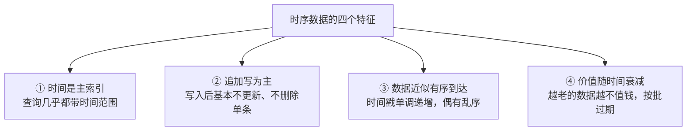
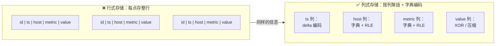
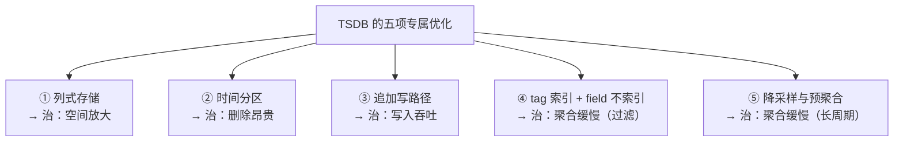
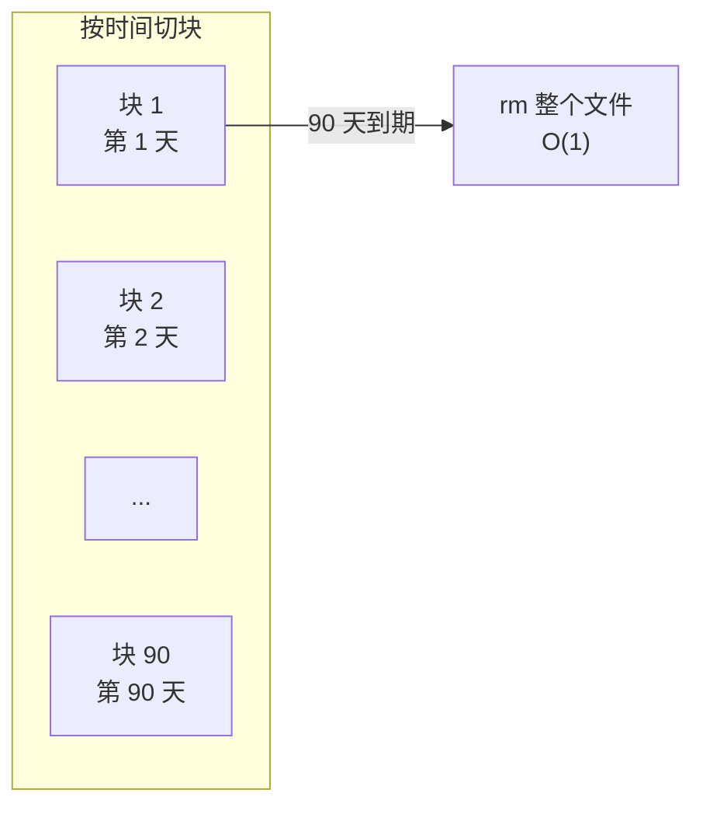
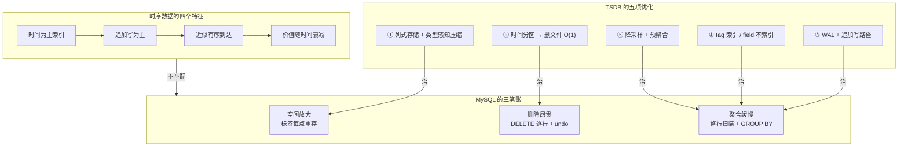

# 第 1 课：为什么需要时序数据库

> 所属阶段：阶段 1《问题与定位》｜ 水平：零基础 ｜ 本课知识点：时序数据的四个特征 / MySQL·PostgreSQL 为什么扛不住 / TSDB 的五项专属优化
> 故事情节：监控数据把 MySQL 写崩的那个晚上，主角（时间）被当成普通字段关进了行式牢笼

## 🎯 本课目标

- 说清时序数据和普通业务数据的**四个结构性差异**
- 用可自己验算的算术，说明 MySQL/PostgreSQL 在哪个规模上、因为什么崩掉
- 理解时序数据库（TSDB）的五项专属优化各自解决什么问题

---

## 第一幕：起源与场景引入

> 本课是"动机课"，不碰 InfluxDB。我们先制造一个你迟早会遇到的麻烦，第 2 课 InfluxDB 才作为"解药"登场。

公司在做服务器监控。需求很朴素：

> 采集 1000 台机器的 CPU、内存、磁盘等指标，每 10 秒上报一次，能在 Grafana 上看趋势图，数据保留 90 天。

你是后端，第一反应是用**最熟的东西**：MySQL（或 PostgreSQL）。建张表，写进去，查出来画图。

```sql
CREATE TABLE metrics (
  id       BIGINT       PRIMARY KEY AUTO_INCREMENT,
  ts       DATETIME(3)  NOT NULL,
  host     VARCHAR(64)  NOT NULL,
  metric   VARCHAR(32)  NOT NULL,
  value    DOUBLE       NOT NULL,
  INDEX idx_ts (ts)
);
```

上线第一周一切正常。你甚至在周会上说"监控嘛，一张表的事"。

直到三个月后的某个凌晨——

> 🎬 **场景**：磁盘告警。你上去一看，`metrics` 表 900 GB，从库延迟 6 小时。运维说："能不能清理一下 90 天前的数据？" 你执行 `DELETE FROM metrics WHERE ts < ...`，跑了 4 小时没结束，undo 日志把磁盘撑满了。与此同时， Grafana 上一个"近 90 天 CPU 趋势"的面板要 40 秒才出图，还偶尔超时。

这就是时序数据给关系型数据库出的难题。

---

## 第二幕：认知冲突

你可能会想：**"不就是数据多吗？加机器、分库分表、上 SSD 不就行了？"**

慢着——这里藏着三个**加机器也解决不了**的矛盾：

- **冗余放大**：每一行都要把 `host`（比如 `prod-web-ecs-0087.iad.internal`）和 `metric` 这两个字符串**原样再存一遍**。1000 台机器 × 10 个指标，这两个值只有 10000 种组合，却被重复存储了几十亿次。
- **删除悖论**：时序数据 99% 的写操作是 INSERT，但 99% 的**运维**操作是"删掉过期的"。关系型数据库的 DELETE 是逐行标记 + 写 undo + 后续 purge，删 8 亿行比写 8 亿行还贵。
- **聚合饥渴**：没人关心"某一毫秒某台机器的 CPU 是多少"，所有人问的都是"**某时间范围内、某组机器的平均值**"。这类查询要扫海量行再 GROUP BY，而行式存储恰恰最不擅长这件事。

> ❓ **问题**：为什么加机器救不了？因为瓶颈不是"CPU 算力不够"，而是**数据的组织方式从根上就不匹配**——你用为"随机读写单条记录"优化的结构，去存"只追加、按时间范围批量聚合"的数据。这不是力气问题，是姿势问题。

---

## 第三幕：层层揭示

### 知识点 1：时序数据的四个特征

#### 一句话定义

**时序数据 = 按时间顺序持续产生、以时间为查询主轴、写完就不改的测量值序列。**

#### 直觉建立（类比）

把普通业务数据和时序数据想成两本不同的账：

| | 普通业务账本（如订单表） | 时序账本（如监控表） |
|---|---|---|
| 记什么 | 一笔订单的**完整生命周期** | 一个测点的**瞬时快照** |
| 会改吗 | 经常改（待付款→已发货→已完成） | 几乎不改（写完就是历史） |
| 怎么查 | 按 ID 精确查一条 | 按**时间范围**查一批再聚合 |
| 怎么扔 | 基本永久保留 | 到期**整批**扔掉 |

时序账本更像**心电图记录纸**——纸带匀速往前走，笔尖只往上抬不回头，看完一段就卷起来收好，过期就整段进碎纸机。

#### 概念与原理

时序数据（time series data）是**按时间顺序、持续不断地产生**的测量值序列。它有四个结构性特征：



逐个展开：

**① 时间是主索引**：你几乎不会问"id=12345 的那条监控数据是多少"，你问的是"过去 1 小时 web 机器的 CPU 均值"。时间不是普通字段，它是**组织数据的一号维度**。

**② 追加写为主（append-only）**：一个数据点写进去就定格了。没有 UPDATE，没有单行 DELETE。这是和 OLTP 最本质的区别。

**③ 近似有序到达**：时间戳大体单调递增（新数据时间更新），但网络延迟、批量上报会造成少量乱序（out-of-order writes）。这个"大体有序"是巨大的优化机会。

**④ 价值随时间衰减**：上周的秒级数据，这周基本只需要分钟级或小时级的汇总。这不是缺陷，是可以利用的特性——**降采样**。

#### 一句话记住

**时序数据 = 以时间为主索引、只追加、大体有序、越老越不值钱的测量值流。**

---

### 知识点 2：MySQL / PostgreSQL 为什么扛不住

#### 一句话定义

**MySQL 存时序的困境不是"一行都写不进去"，而是三笔结构性账单——空间放大、删除昂贵、聚合缓慢——在规模上去之后同时到期。**

> ⚠️ **先说公道话**：用 MySQL 存时序数据，**小规模完全可行**。几千点/秒、保留一两个月、查询量不大——MySQL 跑得挺好，别为了用 TSDB 而用 TSDB。下面说的是规模上去之后，它会在哪三个地方**结构性地**崩掉，而不是"一行都写不进去"。

#### 直觉建立（类比）

想象你要存 1000 个员工的每日打卡记录，存 3 年（约 100 万条）。

**行式存储（MySQL）** 的做法是：每张便签写**一个人的一天**，包括"姓名（全称）、工号、部门、日期、打卡时间"。三年下来 100 万张便签，"张三丰"这三个字被手写了 1000 遍。

**列式存储（TSDB）** 的做法是：准备几个本子，一个本子只记日期，一个只记姓名，一个只记打卡时间。姓名本里可以写"张三丰 ×1000"——因为连续 1000 条都是同一个人。

差别不在"谁更努力"，而在**同样的信息被表达了多少遍**。

#### 概念与原理

我们用第一幕的真实规模，**自己算一遍**（数字可复现，不依赖任何外部基准）：

**规模设定**
- 1000 台机器 × 10 个指标 ÷ 10 秒 = **1000 点/秒**
- 每天：1000 × 86400 = **8640 万点/天**
- 保留 90 天：**约 77.8 亿点**

**MySQL 侧的空间账**

InnoDB 一行 `metrics` 记录大致构成：

| 组成部分 | 估算字节数 | 说明 |
|---|---|---|
| `id` BIGINT | 8 | 主键 |
| `ts` DATETIME(3) | 8 | |
| `host` VARCHAR(64) | ~20 | 实际字符串平均长度 |
| `metric` VARCHAR(32) | ~10 | |
| `value` DOUBLE | 8 | |
| InnoDB 行头 + 隐藏列 | ~20 | DB_TRX_ID / DB_ROLL_PTR 等 |
| **数据行小计** | **~74** | |
| `idx_ts` 二级索引条目 | ~20 | 键值 + 主键引用 + 页内开销 |
| **每点总计（保守）** | **~95** | 未计页填充率与碎片 |

> 这还是**只建了一个二级索引**的乐观情况。若再加 `(host, metric, ts)` 复合索引（聚合查询几乎必需），每点还要再加 40+ 字节。

于是：

```
77.8 亿点 × 95 字节 ≈ 739 GB
```

若加上复合索引，轻松突破 **1 TB**。

**再看三个"加机器也救不了"的地方**

| 问题 | 根因 | 表现 |
|---|---|---|
| **空间放大** | `host` 和 `metric` 这两个高重复字符串，每点原样重存一遍 | 有效信息可能只占 1/10，其余都是重复的标签和索引 |
| **删除昂贵** | `DELETE` 是逐行操作：标记删除 → 写 undo → 后台 purge → 产生碎片 | 删 8 亿行耗时数小时，还可能撑爆 undo 表空间；`OPTIMIZE TABLE` 重建表更是长锁 |
| **聚合缓慢** | "近 90 天 CPU 均值"要扫数亿行再 `GROUP BY`；行式存储即使用到了覆盖索引，读的也是**整行**而非只需要的那一列 | 面板 40 秒才出图，并发一高就超时 |



> 关键洞察：右边不是"更省地方"这么简单。左侧每行都要重复 `prod-web-ecs-0087`；右侧这一串在字典里只存**一次**，列里存的是它的编号，连续相同的编号还能被压缩成"重复 N 次"。

#### 一句话记住

**MySQL 存时序不是写不进去，而是空间放大 × 删除昂贵 × 聚合缓慢——三笔账在规模上去之后同时到期。**

---

### 知识点 3：TSDB 的五项专属优化

#### 一句话定义

**TSDB = 把时序数据的每个特征都变成一次优化机会的数据库：列存压空间、分区管生死、追加保吞吐、tag 索引省力气、降采样换长周期。**

既然痛点是结构性的，解法也得是结构性的。现代 TSDB 普遍做了这五件事：



> 📌 **别把五招和第二幕的"三笔账"一一对应**：三笔账（空间放大 / 删除昂贵 / 聚合缓慢）说的是**关系型数据库错在哪**；五招里前四招分别治这三笔账（其中聚合缓慢由 ④ 和 ⑤ 合力解决），而 **③ 追加写路径治的是另一个维度的诉求——写入吞吐**（"每秒百万点"这种量级）。它不是三笔账之一，却是时序场景最硬的门槛。

#### ① 列式存储 + 类型感知压缩

同一列的数据类型一致、取值相近，压缩率远高于行式。典型手段：

- **时间戳**：`delta` / `delta-of-delta` 编码
  - *人话*：不存"绝对时刻"，只存"和上一个点差多少"。固定 10 秒上报 → 差值恒为 10 → 编码后接近 0 字节。
- **标签（host/metric）**：**字典编码**（dictionary encoding）
  - *人话*：给每个不同的字符串编个号，存一份"号码表"，数据列里只存号码。`prod-web-ecs-0087` 这么长一串，最后只占 1 个整数。
- **游程编码**（RLE, Run-Length Encoding）
  - *人话*：连续重复的值不重复记，直接写"这个值重复 N 次"。按 host 排序后，同一个 host 的几万条记录能压成一条。
- **数值（value）**：XOR / 差分压缩
  - *人话*：相邻数值的二进制表示往往只差几位，只记"哪里不同"而不是整个数。

> 📌 **为什么这招对时序特别有效**：时序数据天然"近邻相似"。同一台机器的 CPU 在相邻两个采样点之间不会从 3% 跳到 97%，温度不会一秒内变化 50 度。这种**局部平滑性**正是压缩算法的最爱。

#### ② 时间分区（time partitioning）

数据按时间切成块（chunk / partition）。过期删除变成**删整个文件**，代价 O(1)，而不是逐行 DELETE。



#### ③ 追加写路径（WAL + 内存缓冲 + 顺序落盘）

既然是 append-only，就不必走"找到位置再修改"的路径。典型设计：写前日志（WAL）保证持久性 + 内存缓冲攒批 + 顺序刷盘。把随机 I/O 变成顺序 I/O。

#### ④ tag 索引、field 不索引

这是 TSDB 的核心取舍：

- **tag**（如 `host`、`region`）：取值有限、用于过滤和分组 → **建索引**
- **field**（如 `cpu_usage`、`temperature`）：取值近乎无限、用于聚合计算 → **不建索引**

为什么 field 不建索引？给每个浮点数值建索引，索引会比数据还大，而且你几乎不会查"CPU 恰好等于 42.7 的那条记录"。**不做无用功，就是最大的优化。**

#### ⑤ 降采样与预聚合

既然"价值随时间衰减"，那就主动利用它：

- 原始秒级数据保留 7 天
- 自动聚合成分钟级保留 90 天
- 再聚合为小时级保留 1 年

查询"近 90 天趋势"时，扫的是**分钟级数据**而不是秒级原始数据，数据量少 60 倍。

#### 一句话记住

**列存压空间、分区管生死、追加保吞吐、tag 索引省力气、降采样换长周期——五招合起来，才叫时序数据库。**

---

## 第四幕：实操验证

> 本课还没装 InfluxDB（那是第 3 课）。我们做一次**可自己验算的推演**，把三笔账算清楚。

### 推演 A：空间账

用第二幕的数字：77.8 亿点，MySQL 每点 ~95 字节。

**MySQL**：`77.8 亿 × 95 B ≈ 739 GB`（单二级索引；加复合索引破 1 TB）

**TSDB 列式**，保守假设压缩后每点 ~8 字节（这是**保守**值——仅时间戳 delta 编码一项就从 8 字节降到接近 0）：

```
77.8 亿 × 8 B ≈ 62 GB
```

| 方案 | 估算容量 | 相对量级 |
|---|---|---|
| MySQL（单索引） | ~739 GB | 1× |
| MySQL（含复合索引） | > 1 TB | > 1.4× |
| TSDB 列式（保守 8 B/点） | ~62 GB | **约 1/12** |

> ✅ **怎么验算**：这个结论对参数很敏感。你可以把"每点字节数"换成自己系统的真实值重算——**重点是两边用同一套口径比**，而不是记住某个神奇倍数。压缩率取决于你的数据有多"平滑"：随机跳变的指标压不动，缓慢变化的传感器数据能压到很低。

### 推演 B：删除账

| 操作 | MySQL | TSDB |
|---|---|---|
| 删除 90 天前的数据 | `DELETE FROM metrics WHERE ts < ...` 逐行标记，8 亿行 → 数小时，undo 膨胀 | 删掉过期的分区文件 → **秒级** |
| 删完的后续代价 | 表碎片化，需要 `OPTIMIZE TABLE` 重建（长锁） | 无 |

### 推演 C：聚合账

查询："近 90 天，web 组机器的 CPU 平均值，按天分组"

| | MySQL | TSDB |
|---|---|---|
| 扫描单位 | **整行**（即使只用到 `value` 列，InnoDB 也按页读，页里塞的是完整行） | **只读 `value` 列 + 需要的 tag 列** |
| 扫描量 | 数十亿行全量 | 若启用降采样，分钟级数据量约为秒级的 1/60 |
| 结果 | 40 秒 + 偶发超时 | 亚秒级 |

> 💡 **注意**：这张表里"TSDB 更快"的结论，**列存省 I/O** 和 **降采样少扫数据** 是两个独立贡献。即便不降采样，只读需要的列也能省下大量 I/O。

---

## 第五幕：体系收束

> 📍 **全局定位**：时序数据库是"高频时间流数据"的解药。它不是一个概念，而是一整类产品的统称——InfluxDB、TimescaleDB、VictoriaMetrics、Prometheus、ClickHouse（部分场景）都在这个赛道，各自取舍不同。**InfluxDB 是其中历史最久、生态最完整的独立 TSDB 之一**，本课程的主角。
> 🔗 **下一步**：下一课《InfluxDB 是什么》会请主角登场，讲清它的三代演进——尤其是为什么 3.0 要推倒重写，以及你现在该用哪个版本。

### 🎯 落地视角小结

如果你的项目在犹豫"要不要上 TSDB"，先回答这三个问题：

| 判断项 | 阈值参考 | 说明 |
|---|---|---|
| 写入速率 | 持续 **> 数千点/秒** | 低于此，MySQL/PostgreSQL 通常够用 |
| 数据保留期 | **> 1 个月** 且需要定期清理 | 保留期短、或不需要自动过期，DELETE 的痛点不成立 |
| 查询模式 | 以**时间范围聚合**为主，而非单条点查 | 如果你的查询是"查某设备最新一条"，加个 Redis 缓存可能就够了 |

**三条全中 → 认真评估 TSDB；只中一条 → 先用熟悉的数据库，把监控埋点做好，等规模上来再迁。**

> ⚠️ **别为了技术而技术**：引入 TSDB 意味着新的运维对象、新的备份策略、新的故障模式。MySQL 存监控数据在小规模下完全合理——**迁移成本也是成本**。

---

## 🐞 常见误区

1. **"MySQL 存时序数据一定会崩"**——错。小规模（几千点/秒、保留一两个月）MySQL 跑得很好。真正的分水岭是**规模 × 保留期 × 查询复杂度**三者叠加。不要把这个结论当成"MySQL 不行"的教条。

2. **"TSDB 只是压缩得好"**——不全面。压缩只是五项优化之一。同样重要的是**时间分区让删除变 O(1)**、以及**降采样让长周期查询可行**。只谈压缩比是典型的选型误区。

3. **"上了 TSDB 就不用管数据老化了"**——错。降采样和保留策略需要你**主动设计和配置**。配错了要么数据提前消失，要么成本失控。这是第 14 课的主题。

4. **"TSDB 能替代关系数据库"**——错得最离谱的一条。TSDB 为"只追加 + 时间范围聚合"而生，它**不擅长**事务、关联查询、单条记录的更新删除。订单、用户、库存这类业务数据，请继续用关系型数据库。

## 一图总结



## 📚 官方文档

> 本课是通用概念课，无直接对应的单一文档页。以下链接用于延伸阅读与事实核对（均为核实过的真实链接）：

| 主题 | 链接 |
|------|------|
| InfluxDB 3 Core 官方文档 | https://docs.influxdata.com/influxdb3/core/ |
| Line Protocol 参考（数据模型相关） | https://docs.influxdata.com/influxdb3/cloud-serverless/reference/syntax/line-protocol/ |
| InfluxDB 3 源码仓库（架构与 README） | https://github.com/influxdata/influxdb |
| InfluxDB 3.10 发布说明（架构与性能改进） | https://www.influxdata.com/blog/influxdb-3-10/ |

> ⚠️ **关于本课的数字**：课中的容量推演（每点 ~95 字节、压缩后 ~8 字节）是**基于给定假设的可复现算术**，不是官方基准。**请代入你自己系统的真实值重算**，不要直接引用为 InfluxDB 的官方指标。

## 课后小测

**Q1**：以下哪一项**不是**时序数据的典型特征？
- A. 数据以追加方式写入，写入后极少更新
- B. 查询通常指定时间范围并对数据进行聚合
- C. 数据价值随时间推移而衰减，老数据按批过期
- D. 单条记录经常被反复 UPDATE 以反映最新状态

<details><summary>答案与解析</summary>

**答案：D**。时序数据是 append-only 的，一个数据点写进去就定格了，反映"某个时刻的测量结果"。频繁 UPDATE 是 OLTP 业务数据（如订单状态流转）的特征，恰恰是时序数据没有的。A、B、C 分别对应本课讲的"追加写为主""时间是主索引""价值随时间衰减"。

</details>

**Q2**：某团队用 MySQL 存监控数据，规模 800 点/秒，保留 30 天，只有 3 个人偶尔看面板。根据"落地视角小结"的判断框架，最合理的建议是？
- A. 立刻迁移到 InfluxDB，MySQL 存时序一定会崩
- B. 先留在 MySQL，把监控埋点做好，等规模或查询压力上来再评估
- C. 迁移到 InfluxDB，但保留 MySQL 作为冷备份
- D. 用 MySQL 存原始数据，同时立刻上 InfluxDB 双写

<details><summary>答案与解析</summary>

**答案：B**。三条判断项（写入速率 > 数千点/秒、保留期 > 1 个月且需定期清理、查询以时间范围聚合为主）——800 点/秒低于阈值，保留 30 天刚好在边界，查询压力很小（3 个人偶尔看）。**没有一条明确命中**，此时引入 TSDB 的运维成本大于收益。A 是教条化误用本课结论；C、D 都引入了不必要的复杂度和双写一致性问题。

</details>

**Q3**：关于 TSDB 的 tag 与 field，下列说法正确的是？
- A. tag 和 field 都会建索引，所以过滤和聚合都很快
- B. field 不建索引，因为浮点取值近乎无限，且几乎不会按精确值查询
- C. tag 不建索引，因为字符串太长
- D. 应该尽量把所有维度都设为 field，以节省索引空间

<details><summary>答案与解析</summary>

**答案：B**。tag 取值有限、用于过滤分组，建索引；field 取值近乎无限、用于聚合计算，建索引会让索引比数据还大且几乎无人按精确值查询。D 是危险的反向错误——**把本该做 tag 的高基数维度塞进 field，会导致无法按该维度过滤和分组**，这是第 7 课《Schema 设计与基数陷阱》的核心议题。

</details>

## 📋 本课速查卡

### 时序数据四特征

| 特征 | 一句话 | 对应的优化机会 |
|------|--------|---------------|
| ① 时间是主索引 | 查询几乎都带时间范围 | 按时间分区、分区裁剪 |
| ② 追加写为主 | 写完就是历史，不改不删单条 | WAL + 顺序写，跳过随机 I/O |
| ③ 近似有序到达 | 时间戳大体递增，少量乱序 | delta / delta-of-delta 压缩时间戳 |
| ④ 价值随时间衰减 | 越老越不值钱 | 降采样 + 按批过期 |

### MySQL 三笔账 ↔ TSDB 五招对照

| MySQL 的账 | 根因 | TSDB 的解法 |
|-----------|------|------------|
| **空间放大** | 标签每点原样重存 | ① 列式存储 + 字典编码 + 类型感知压缩 |
| **删除昂贵** | DELETE 逐行 + undo 膨胀 | ② 时间分区 → 删整个文件 O(1) |
| **聚合缓慢** | 整行扫描 + GROUP BY | ① 只读需要的列 / ④ tag 索引 / ⑤ 降采样 |

> ③ 追加写路径主要解决**写入吞吐**（对应"每秒千万点"的诉求），不在三笔账的直接对应里。

### 该不该上 TSDB：三条判断项

| 判断项 | 阈值参考 |
|--------|---------|
| 写入速率 | 持续 > 数千点/秒 |
| 数据保留期 | > 1 个月且需定期清理 |
| 查询模式 | 以时间范围聚合为主，而非单条点查 |

**三条全中 → 认真评估 TSDB；只中一条 → 先用熟悉的数据库。**

## 🚀 下一批接力提示词

> 学完本批后，**复制下面这段文字发给 AI**，即可无缝进入下一批（无需重新描述上下文）：

```
继续学 InfluxDB。我的学习档案在 influxdb/00-学习档案.md，
刚学完阶段 1《问题与定位》的第 1 课《为什么需要时序数据库》，
知识点：时序数据的四个特征、MySQL/PostgreSQL 为什么扛不住、TSDB 的五项专属优化。
请按大纲继续讲解第 2 课《InfluxDB 是什么：三代演进与生态位》
（知识点：一句话定位与能力地图、三代演进 TSM/Flux → FDAP、三个 SKU 与生态位）。
```

## 🧭 课程导航

➡️ **下一课**：第 2 课《InfluxDB 是什么：三代演进与生态位》
⬅️ **上一课**：无（本课程第 1 课）

📚 **返回目录**：[课程目录](../../../02-课程目录.md) ｜ 🗺️ **路径总览**：[学习路径总览](../../../01-学习路径总览.md)
