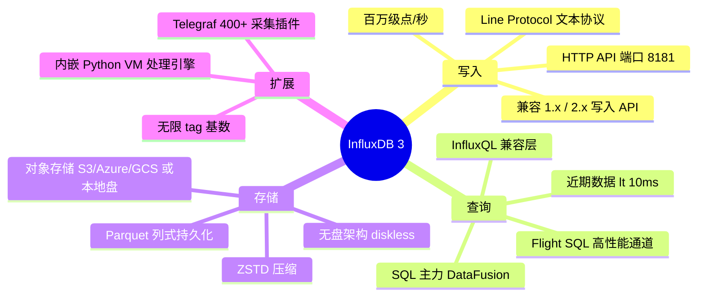
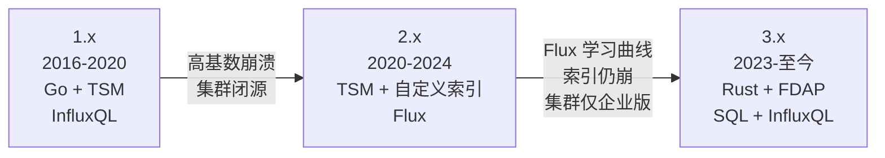
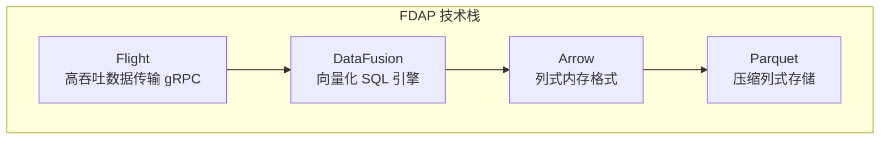
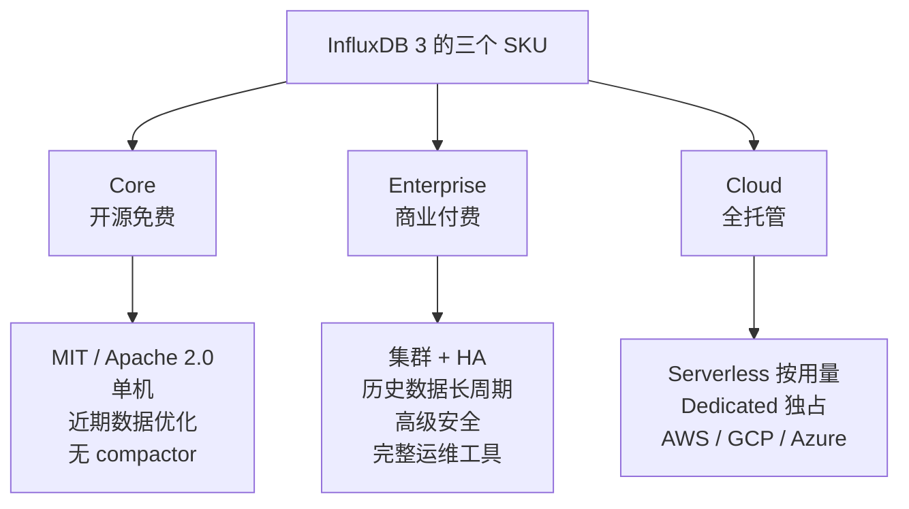
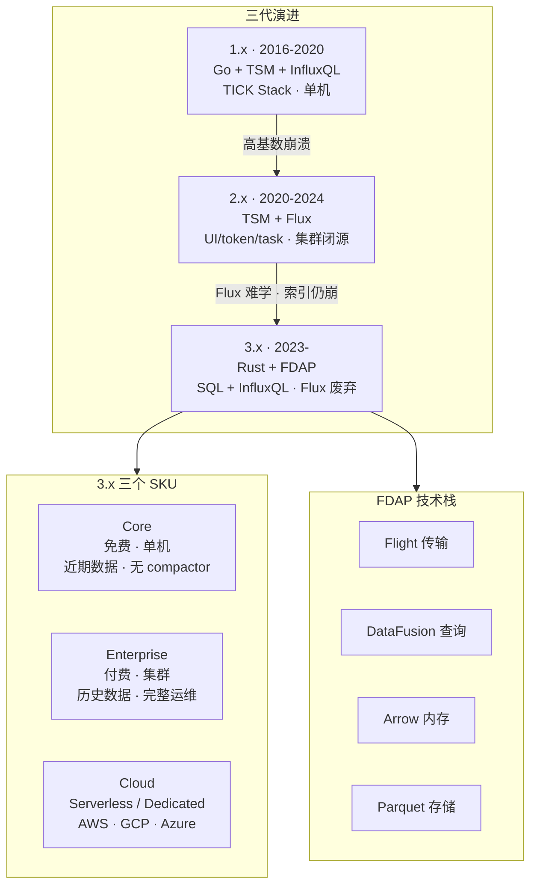

# 第 2 课：InfluxDB 是什么：三代演进与生态位

> 所属阶段：阶段 1《问题与定位》｜ 水平：零基础 ｜ 本课知识点：一句话定位与能力地图 / 三代演进：TSM·Flux → FDAP / 三个 SKU 与生态位
> 故事情节：主角登场。它不是"一个数据库"，而是三条断代的技术路线——你现在要学的，是推倒重写后的第三个

## 🎯 本课目标

- 能用一句话说清 InfluxDB 是什么、解决什么问题
- 理解三代架构的**更替动因**——为什么 3.0 要推倒重写（这是选型的关键背景）
- 分清 Core / Enterprise / Cloud 三个 SKU 的边界，知道该用哪个

---

## 第一幕：起源与场景引入

上一课我们让 MySQL 在监控场景下崩了。现在该请解药登场。

你在网上搜"InfluxDB"，立刻会遇到三个让你困惑的现象：

1. **教程版本混乱**：有的教你写 `SELECT * FROM cpu`，有的教你写 `from(bucket: "metrics") |> range(start: -1h) |> filter(...)`——这是两种**完全不同的语言**。
2. **术语打架**：有的说 `measurement`，有的说 `table`；有的讲 `bucket`，有的讲 `database`。
3. **版本跨度大**：1.x、2.x、3.x 并存，而且很多公司还在用 2.x。

为什么会这样？因为 InfluxDB 经历过**两次推倒重来**。这不是版本号的简单递增，而是三套几乎独立的技术栈。

> 🎬 **场景**：你在技术选型会上说"我们用 InfluxDB 吧"。有人问："用哪个版本？Flux 还是 SQL？" 你答不上来。更尴尬的是，你照着一篇 2022 年的教程配好了环境，写完 Flux 查询，结果发现新版本里 Flux 已经废弃了。

这一课就是为了避免这种尴尬——**先看清三条断代线，再决定站在哪条线上**。

---

## 第二幕：认知冲突

你可能会想：**"不就是个数据库吗？学最新的一代不就行了？"**

这里有个反直觉的事实：**"最新"不等于"用得最多"**。

InfluxDB 3.x 在架构上全面领先，但直到 2026 年仍有大量团队停留在 2.x。原因不是他们不懂技术，而是一道残酷的算术题：

- 3.x **变更了 API 和查询语言**：Flux 被废弃，写入 API 端点路径也变了
- Telegraf 的 output 插件**大体兼容**，但**手写的应用代码几乎必须重构**
- 对于一个已经跑了三年、几百个 Flux 脚本的系统，迁移代价是实打实的人月

> ❓ **问题**：那我该学哪个？**新项目一律 3.x**（本课程基于 3.x）；但如果你的公司已有 2.x 存量系统，你仍然需要读懂 Flux——第 18 课会专门讲迁移。这就是为什么本课要花力气讲清三代演进：**知道差异在哪，才知道迁移的账单长什么样**。

---

## 第三幕：层层揭示

### 知识点 1：一句话定位与能力地图

#### 直觉建立（类比）

如果 MySQL 是"万能的办公柜"（什么都能放，但都不极致），InfluxDB 就是**一条高速流水线**——专门为"源源不断涌来的、带时间戳的测量值"设计。

它不打算替代 MySQL。它把一件事做到极致：**海量时间流数据的写入、压缩、时间范围聚合**。

#### 概念与原理

**一句话定位**：

> **InfluxDB 是一个为「实时事件 + 时序数据」设计的开源时序数据库，专注于高吞吐写入、亚秒级近期数据查询，以及与对象存储集成的低成本长期留存。**

展开成能力地图：



**核心能力指标**（官方口径，2026 年）：

| 能力 | 指标 | 官方机制出处 |
|---|---|---|
| last-value 查询 | **< 10 ms** | **LVC**（Last Values Cache，最后 N 个值缓存于内存） |
| distinct 元数据查询 | **~30 ms** | **DVC**（Distinct Values Cache，列去重值缓存于内存） |
| 写入吞吐 | 百万级点/秒 | Line Protocol over HTTP |
| tag 基数 | **无上限**（unlimited cardinality） | 列存 + Parquet 消除 2.x 索引瓶颈 |
| 存储后端 | S3 / Azure Blob / GCS / 本地盘 | Parquet + ZSTD |

> 📌 **两个缓存是"可选优化项"而非默认行为**：LVC 与 DVC 需要你**主动配置**才会生效（第 12 课调优时讲）。**默认状态下的查询走的是常规路径，达不到这两个数字。** 看到官方宣传的 <10ms 时，先问一句"配了 LVC 吗"。
>
> 📌 **术语说明**："近期数据"指尚未压实的、仍在内存缓冲与 WAL 中的数据；历史数据走 Parquet 文件查询，延迟特征不同。这是第 10 课的主题。

#### 一句话记住

**InfluxDB = 为时间流数据造的专用流水线：写得进、压得小、按时间查得快。**

---

### 知识点 2：三代演进——从 TSM/Flux 到 FDAP

这是本课最重要的部分。三代不是"升级"，是**两次推倒重来**。



#### 第一代：1.x（2016–2020）

| 维度 | 内容 |
|---|---|
| 语言 | Go |
| 存储引擎 | **TSM**（Time-Structured Merge tree，LSM 的时序定制版） |
| 查询语言 | **InfluxQL**（类 SQL 的专有方言） |
| 部署 | 单机为主；**集群功能闭源**（商业版才有） |
| 生态 | **TICK Stack**：Telegraf（采集）+ InfluxDB（存储）+ Chronograf（可视化）+ Kapacitor（告警） |

**为什么被替换**：TSM 引擎在**高基数（high cardinality）**场景下会崩——当 tag 取值组合数（series 数量）涨到百万级，内存中的索引会失控。而集群能力闭源，社区版无法水平扩展。

#### 第二代：2.x（2020–2024）

| 维度 | 内容 |
|---|---|
| 存储引擎 | TSM + 自研 KV 索引，**换汤不换药** |
| 查询语言 | **Flux**（函数式管道语言） |
| 新增 | 内置 Web UI、token 认证、task 调度器、bucket 概念 |
| 生态 | TICK Stack 整合为统一平台 |

**为什么被替换**——两个致命问题：

1. **Flux 学习曲线陡峭**：函数式管道语法对熟悉 SQL 的数据工程师极不友好，等于要求他们重学一门语言。

   同一个需求——**「cpu 表最近 1 小时，按 1 分钟窗口算平均值」**，两代语法对照：

   <table>
   <tr><th>2.x · Flux</th><th>3.x · SQL</th></tr>
   <tr><td>

   ```javascript
   from(bucket: "metrics")
     |> range(start: -1h)
     |> filter(fn: (r) =>
         r._measurement == "cpu")
     |> aggregateWindow(
         every: 1m, fn: mean)
   ```

   </td><td>

   ```sql
   SELECT
     DATE_BIN(INTERVAL '1 minute', time)
       AS _time,
     AVG(usage_user) AS mean_cpu
   FROM cpu
   WHERE time >= now()
     - INTERVAL '1 hour'
   GROUP BY _time
   ORDER BY _time
   ```

   </td></tr>
   </table>

   > 💡 右边那句 `DATE_BIN(INTERVAL '1 minute', time)` 就是 InfluxDB 3 的**时间分桶函数**——它把连续时间切成 1 分钟一个的桶，是时序 SQL 查询的核心（第 8 课会细讲）。**重点是：它是 SQL。** 你团队现有的 SQL 能力可以直接迁移，不需要重学一门语言。

2. **高基数问题没根治**：索引在基数越过百万量级时仍会崩溃；集群依然是 Enterprise 专属。

> ⚠️ **Flux 已在 3.x 中废弃**。新项目不要用。

#### 第三代：3.x（2023–至今）—— 推倒重写

3.x 不是改装，是**换了个数据库**。代号 IOx，用 Rust 从零重写。

| 维度 | 1.x / 2.x | 3.x |
|---|---|---|
| 实现语言 | Go | **Rust** |
| 内存格式 | 自有 | **Apache Arrow**（列式） |
| 查询引擎 | 自有 | **Apache DataFusion**（向量化 SQL） |
| 磁盘格式 | TSM | **Apache Parquet**（列式 + ZSTD） |
| 传输协议 | HTTP | **Apache Arrow Flight**（gRPC） |
| 查询语言 | InfluxQL / Flux | **SQL**（主力）+ InfluxQL（兼容层）；**Flux 废弃** |
| tag 基数 | 百万级会崩 | **无上限** |
| 存储层 | 本地盘 | **对象存储优先**（无盘架构） |

这套技术栈有个简称——**FDAP**：



**为什么选这四个 Apache 项目？** 核心是**零拷贝互操作**：查询结果从 InfluxDB 流出后，可以**直接**喂给 Pandas、Polars、DuckDB，不需要 ETL 转换。这解决了数据历史学家的老问题——**厂商锁定**。

#### ⚠️ 版本时间线：一个容易搞混的关键事实

3.x 的发布时间在网上有多个说法，因为**云端产品与开源版是分开 GA 的**：

| 时间 | 事件 | 说明 |
|---|---|---|
| 2023-04 | InfluxDB 3.0 产品线发布 | 首次引入无限基数、SQL、对象存储 |
| 2023-09 | InfluxDB Clustered 发布 | 面向本地/私有云的商业部署形态 |
| **2025-04** | **InfluxDB 3 Core GA** | **开源版正式可用**（这是社区真正能免费下载生产用的时点） |
| 2025-04-17 | Core 与 Enterprise 同时宣布上市 | |
| 2025-09 | 3.5 发布 | Explorer 仪表板、缓存查询 |
| 2025-10 | Amazon Timestream for InfluxDB 上线 | AWS 托管服务 |
| 2026 | 3.10 / 3.11 | 压实与查询性能改进、catalog 格式升级 |

> 🔑 **记住这个区分**：3.0 最先在**云端产品**落地（2023），**开源 Core 版直到 2025 年 4 月才 GA**。很多写于 2023–2024 年的文章说的"3.0 发布了"，指的是云端版，当时社区用户其实还用不上。这也是为什么大量团队至今仍在 2.x。

#### 一句话记住

**1.x 用 InfluxQL，2.x 强推 Flux（已废弃），3.x 推倒重写为 Rust + FDAP 并回归 SQL——新项目直接用 3.x + SQL。**

---

### 知识点 3：三个 SKU 与生态位

3.x 按部署形态切成三个 SKU。选错 SKU 比选错数据库更常见。



#### InfluxDB 3 Core

| 项 | 内容 |
|---|---|
| 许可 | **MIT / Apache 2.0**（用户任选），真正开源 |
| 部署 | **单节点** |
| 定位 | 实时场景，查询**最近几天**的数据 |
| 关键限制 | ① **不含 compactor**（压实器）→ 不擅长海量历史数据的存储与查询<br/>② **查询时间范围限制在约 72 小时**（近期与历史皆是） |
| 适合 | 边缘计算、IoT 网关、开发环境、近期数据监控 |

> ⚠️ **最容易踩的坑**：Core **没有 compactor**，而且是**单机**。摄入、查询、压实、处理四个功能在同一实例上竞争资源。如果你打算用 Core 存一年历史数据做长期分析，方向就错了——那要 Enterprise。
>
> 🚨 **72 小时硬约束**：官方 Core 文档原文 *"InfluxDB 3 Core limits query time ranges to approximately 72 hours (both recent and historical) to ensure query performance"*。这意味着**查 5 天前的数据会返回空**——但数据其实写进去了。很多人在这一步误判成"写入失败"，白查半天写入链路。第 3 课会亲手验证这个限制。

#### InfluxDB 3 Enterprise

| 项 | 内容 |
|---|---|
| 许可 | 商业 |
| 部署 | **集群**，高可用 |
| 定位 | 生产级：历史数据长期留存 + 分析 |
| 增强 | 安全、完整运维工具、3.11 起升级版存储引擎 GA |

#### InfluxDB 3 Cloud

| 形态 | 说明 |
|---|---|
| **Serverless** | 按用量计费，免运维 |
| **Dedicated** | 独占资源 |

托管在 AWS / GCP / Azure。此外 **Amazon Timestream for InfluxDB**（2025-10 上线）是 AWS 官方托管服务，提供 Core 与 Enterprise 两种版本。

#### 生态位：它和 Prometheus 是什么关系？

这是初学者最容易混淆的一对。先给结论，**细节在第 17 课展开**：

| | InfluxDB 3 | Prometheus |
|---|---|---|
| 本质 | **通用时序数据库** | 监控**系统**（含采集、存储、告警、查询语言） |
| 数据模型 | tag / field 多维 | label / value 多维 |
| 采集方式 | **推**（Telegraf 等主动写入） | **拉**（server 主动 scrape） |
| 查询语言 | SQL / InfluxQL | **PromQL** |
| 长期存储 | **原生支持**（对象存储） | 需接 Thanos / Mimir / VictoriaMetrics 等 |
| 典型场景 | IoT、APM、业务指标、需要长期留存的场景 | K8s 生态监控、告警驱动的可观测性 |

> 💡 **一句话区分**：Prometheus 是"一套完整的监控解决方案"，InfluxDB 是"一个你可以自由搭建的时序存储引擎"。很多公司两者都用——Prometheus 管 K8s 告警，InfluxDB 存长期业务指标。

#### 一句话记住

**Core 免费单机管近期，Enterprise 付费集群管历史，Cloud 全托管；InfluxDB 是存储引擎，Prometheus 是完整监控方案。**

---

## 第四幕：实操验证

> 本课仍是概念课。我们做一次**选型推演**，把 SKU 选择与代际选择的判断练出来。

### 推演 A：给三个场景选 SKU

| 场景 | 需求 | 应选 | 理由 |
|---|---|---|---|
| **A. 工厂边缘网关** | 2000 个传感器，本地存最近 3 天，云断网也能看 | **Core** | 单机、近期数据、边缘部署——正是 Core 的设计目标 |
| **B. 金融行情平台** | 存 5 年 tick 数据，需按任意区间回溯分析 | **Enterprise** | 需要 compactor 与长周期查询能力，Core 不含 compactor |
| **C. 创业公司 MVP** | 3 人团队，不想管基础设施 | **Cloud Serverless** | 按用量付费，免运维，团队规模撑不起 DBA |

### 推演 B：判断你该学哪一代

回答两个问题：

**Q：你在维护一个 2022 年上线的 InfluxDB 2.x 系统，有 200 多个 Flux 脚本。现在要新建一张表存新指标，用哪种语言？**

✅ **答案**：仍在 2.x 实例上 → 必须用 Flux（或 InfluxQL），因为 2.x 不支持 SQL。**但**这说明你该启动 3.x 迁移评估了——第 18 课会讲怎么算这笔账。

**Q：新项目，团队都熟悉 SQL，没人会 Flux。选什么？**

✅ **答案**：**InfluxDB 3 Core + SQL**。零 Flux 学习成本，这是 3.x 最大的工程价值。

### 推演 C：识别过时教程

看到一篇 InfluxDB 教程，出现下列特征之一，说明它**不是**讲 3.x 的：

- 查询用 `from(bucket: ...) |> range(...)` → Flux，2.x
- 出现 `SHOW MEASUREMENTS`、`SHOW TAG KEYS` → InfluxQL 的元查询，1.x/2.x 风格
- 配置里出现 `retention policy`、`continuous query` → 1.x 概念（2.x 起被 bucket / task 取代）
- 讲 TSM 引擎、`influx_inspect` 工具 → 1.x/2.x

> 这不是说这些教程错了，而是**它们解决的是另一个时代的问题**。确认版本再抄代码。

---

## 第五幕：体系收束

> 📍 **全局定位**：InfluxDB 是时序数据库赛道里历史最久、生态最完整的产品之一（DB-Engines 时序榜常年第一）。3.x 是它的第三代，**Rust + FDAP 架构、SQL 优先、无限基数、对象存储原生**——这是你现在该学的版本。
>
> 但它不是唯一选择：TimescaleDB（PostgreSQL 扩展）、VictoriaMetrics、ClickHouse、Prometheus 生态都在同一赛道。第 17 课会横向对比。
>
> 🔗 **下一步**：阶段 2《上手篇》——第 3 课把它装起来，亲手跑通第一次写入和查询。从下一课开始，你会有大量可敲的命令。

### 🎯 落地视角小结

带三个结论回团队：

1. **新项目用 3.x + SQL**。Flux 已废弃，不要在新代码里写 Flux。
2. **选 SKU 看"是否要查历史数据"**。Core 免费但**不含 compactor**，只适合近期数据；需要长周期历史分析就得上 Enterprise 或 Cloud Dedicated。
3. **评估 2.x 迁移要先算存量脚本数**。迁移成本 ≈ Flux 脚本数量 × 单个重构成本。这不是纯技术问题，是排期问题。

---

## 🐞 常见误区

1. **"InfluxDB 3.0 早就发布了（2023 年），怎么现在还在用 2.x？"**——因为**开源 Core 版 2025 年 4 月才 GA**。2023–2024 年发布的是云端产品，社区用户当时用不上。这个时间差是大量团队滞留 2.x 的直接原因。

2. **"Core 是免费的，所以先用 Core，以后有需要再升 Enterprise"**——这个想法有风险。Core **不含 compactor**，且是**单机**架构。从 Core 迁到 Enterprise 不是"打开一个开关"，而是存储架构的变化。**选型阶段就要想清楚是否要查历史数据。**

3. **"SQL 都支持了，InfluxDB 现在能当 MySQL 用"**——不能。3.x 支持 SQL 是**查询接口**的标准化，底层仍是列存 + 追加写优化。它没有事务、不擅长 JOIN、不适合单行 UPDATE/DELETE。**时序归时序，业务归业务。**

4. **"Infinite cardinality 意味着我可以随便设计 tag"**——要小心。3.x 确实突破了 2.x 的百万级索引瓶颈，但"技术上能存"不等于"查得快、成本低"。高基数仍会显著影响性能与资源占用。第 7 课会专门讲基数陷阱。

5. **"measurement 和 table 是两个不同的东西"**——不是。**InfluxDB 3 官方文档已把 measurement 改称 table**，指的是同一个概念（数据点的逻辑分组）。measurement 是历史术语，仍被广泛使用。本课程两者都会出现，视语境而定。

## 一图总结



## 📚 官方文档

| 主题 | 链接 |
|------|------|
| InfluxDB 3 Core 官方文档（首页） | https://docs.influxdata.com/influxdb3/core/ |
| InfluxDB 3 Core 源码仓库（README 含架构与性能指标） | https://github.com/influxdata/influxdb |
| Line Protocol 语法参考 | https://docs.influxdata.com/influxdb3/cloud-serverless/reference/syntax/line-protocol/ |
| 写入数据（Enterprise get-started，含 table 术语） | https://docs.influxdata.com/influxdb3/enterprise/get-started/write |
| Python 客户端文档 | https://docs.influxdata.com/influxdb3/cloud-dedicated/reference/client-libraries/v3/python/ |
| Python 客户端 PyPI（版本与兼容性） | https://pypi.org/project/influxdb3-python/ |
| InfluxDB 3.10 发布博客（catalog 升级、/ready 探针） | https://www.influxdata.com/blog/influxdb-3-10/ |
| Amazon Timestream for InfluxDB 3 技术详解（Core/Enterprise 差异） | https://aws.amazon.com/blogs/database/features-and-workflows-with-amazon-timestream-for-influxdb-3/ |

> 📌 官方文档另有中文镜像站 `docs.influxdb.org.cn`，内容可能滞后于英文站，核对版本信息请以英文站为准。

## 课后小测

**Q1**：某团队 2026 年新起一个 IoT 项目，团队只会 SQL。以下方案最合理的是？
- A. InfluxDB 2.x + Flux，因为生态最成熟
- B. InfluxDB 3 Core + SQL，Flux 已废弃
- C. InfluxDB 1.x + InfluxQL，因为最稳定
- D. InfluxDB 3 Core + Flux，兼容性最好

<details><summary>答案与解析</summary>

**答案：B**。3.x 已废弃 Flux，回归 SQL 作为主力查询语言，团队零学习成本。A 和 D 都在用废弃语言写新代码；C 是 1.x，单机 + 集群闭源 + 高基数问题，且已不在主线。

</details>

**Q2**：关于 InfluxDB 3 Core，下列说法正确的是？
- A. 支持集群部署，可水平扩展
- B. 包含 compactor，适合长期历史数据查询
- C. 开源免费（MIT / Apache 2.0），但为单机架构且不含 compactor
- D. 就是 InfluxDB 2.x 改名而来

<details><summary>答案与解析</summary>

**答案：C**。Core 是 MIT/Apache 2.0 双许可的开源版，**单机**部署，且明确**不含 compactor**，定位是"近期数据实时查询"。A（集群）和 B（有 compactor）都是 Enterprise 的能力。D 错误——3.x 是用 Rust 基于 FDAP 推倒重写的，与 2.x 的 Go + TSM 是两套完全不同的实现，API 和查询语言都不兼容。

</details>

**Q3**：你在网上看到一段 InfluxDB 查询代码 `from(bucket: "metrics") |> range(start: -1h) |> filter(fn: (r) => r._measurement == "cpu")`。可以判断：
- A. 这是 InfluxDB 3.x 推荐的 SQL 写法
- B. 这是 Flux（2.x 的查询语言），在 3.x 中已废弃
- C. 这是 InfluxQL，在所有版本都支持
- D. 这是处理引擎插件的 Python 语法

<details><summary>答案与解析</summary>

**答案：B**。管道符号 `|>` 加上 `from(bucket:)` / `range()` / `filter(fn:)` 是 Flux 的典型特征，2.x 的查询语言，**3.x 中已废弃**。C 不对——InfluxQL 是类 SQL 语法（如 `SELECT * FROM cpu WHERE time > now() - 1h`），虽然 3.x 仍保留兼容层，但这段代码显然不是它。

</details>

## 📋 本课速查卡

### 三代对照

| | 1.x | 2.x | 3.x |
|---|---|---|---|
| 年份 | 2016–2020 | 2020–2024 | 2023–至今 |
| 语言 | Go | Go | **Rust** |
| 引擎 | TSM | TSM + 自研 KV 索引 | **FDAP** |
| 查询语言 | InfluxQL | **Flux（已废弃）** | **SQL** + InfluxQL |
| 致命伤 | 高基数崩溃、集群闭源 | Flux 难学、基数未根治 | — |

### FDAP 四件套

| 组件 | 角色 |
|------|------|
| **F**light | 高吞吐数据传输（gRPC） |
| **D**ataFusion | 向量化 SQL 查询引擎 |
| **A**rrow | 列式内存格式 |
| **P**arquet | 压缩列式存储（+ ZSTD） |

### 三个 SKU 怎么选

| SKU | 许可 | 部署 | 关键限制 | 适合 |
|-----|------|------|---------|------|
| **Core** | MIT / Apache 2.0 | 单机 | **不含 compactor** | 近期数据、边缘、开发 |
| **Enterprise** | 商业 | 集群 HA | — | 历史数据长周期分析 |
| **Cloud** | 按用量 / 独占 | 托管 AWS·GCP·Azure | — | 不想管基础设施 |

> **一句话判据**：要不要**查很久以前的历史数据**？要 → Enterprise/Cloud；只要最近几天（**Core 实测上限约 72 小时**）→ Core。

### 版本时间线（易记错！）

```
2023-04  InfluxDB 3.0 产品线发布（云端先行）
2023-09  InfluxDB Clustered
2025-04  ★ InfluxDB 3 Core GA（开源版才真正可用）
2025-09  3.5（Explorer 仪表板）
2025-10  Amazon Timestream for InfluxDB
2026     3.10 / 3.11（当前）
```

### 四个"看到就是过时教程"的信号

| 信号 | 说明 |
|------|------|
| `from(bucket:) |> range()` | Flux → 2.x |
| `SHOW MEASUREMENTS` | InfluxQL 元查询 → 1.x/2.x |
| `retention policy` / `continuous query` | 1.x 概念 |
| TSM 引擎 / `influx_inspect` | 1.x/2.x |

## 🚀 下一批接力提示词

> 学完本批后，**复制下面这段文字发给 AI**，即可无缝进入下一批（无需重新描述上下文）：

```
继续学 InfluxDB。我的学习档案在 influxdb/00-学习档案.md，
刚学完阶段 1《问题与定位》的第 2 课《InfluxDB 是什么：三代演进与生态位》，
知识点：一句话定位与能力地图、三代演进 TSM/Flux → FDAP、三个 SKU 与生态位。
请按大纲继续讲解阶段 2《上手篇》第 3 课《环境搭建与第一次写入》
（知识点：安装方式与启动参数、第一次写入与查询、目录结构与配置文件）。
```

## 🧭 课程导航

➡️ **下一课**：第 3 课《环境搭建与第一次写入》（阶段 2《上手篇》）
⬅️ **上一课**：[第 1 课《为什么需要时序数据库》](lesson-01-为什么需要时序数据库.md)

📚 **返回目录**：[课程目录](../../../02-课程目录.md) ｜ 🗺️ **路径总览**：[学习路径总览](../../../01-学习路径总览.md)
