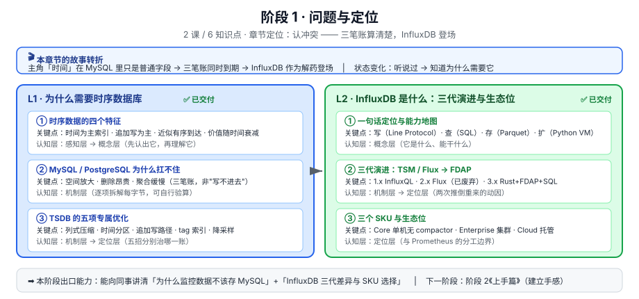

# 阶段 1 · 问题与定位

> 所属课程：[InfluxDB 3 系统学习](../02-课程目录.md) ｜ 水平：零基础
> 本阶段：**2 课 / 6 知识点** ｜ 状态：✅ 已完成

## 🎬 本阶段在故事主线中的章节定位

> 全课程故事主线：**主角「时间」** 在 MySQL 里只是普通字段，在 InfluxDB 里成为组织一切的一号维度。
> **冲突**：行式牢笼 vs 时间洪流（空间放大 × 删除昂贵 × 聚合缓慢）。

| 章节 | 本阶段任务 | 主角的状态变化 |
|------|-----------|---------------|
| **第一章 · 认冲突** | 把三笔账算清楚，让 InfluxDB 作为解药登场 | 听说过 → **知道为什么需要它** |

**为什么先学这个**：不先建立"时序数据为什么特殊"的认知，后面所有设计决策（为什么 tag 要克制、为什么要降采样、为什么 Core 不能查历史）都会变成死记硬背的规则。

## 🎯 阶段目标

学完本阶段，你应该能够：

1. 说清时序数据与普通业务数据的四个结构性差异
2. 用可验算的算术，向同事解释"为什么监控数据不该存 MySQL"
3. 讲清 InfluxDB 三代架构的更替动因，以及你现在该用哪一代
4. 分清 Core / Enterprise / Cloud 三个 SKU 的适用边界

## 📚 必须掌握的知识点

### L1 · 为什么需要时序数据库 [→ 课件](lessons/lesson-01-为什么需要时序数据库.md) ✅

| 知识点 | 关键点 | 认知层 |
|--------|--------|--------|
| ① 时序数据的四个特征 | 时间为主索引 · 追加写为主 · 近似有序到达 · 价值随时间衰减 | 感知层 → 概念层 |
| ② MySQL / PostgreSQL 为什么扛不住 | 空间放大 · 删除昂贵 · 聚合缓慢（**三笔账，不是"写不进去"**） | 机制层 |
| ③ TSDB 的五项专属优化 | 列式压缩 · 时间分区 · 追加写路径 · tag 索引 · 降采样 | 机制层 → 定位层 |

> ⚠️ **本课的口径纪律**：不要记成"MySQL 存时序会崩"。正确表述是**规模 × 保留期 × 查询复杂度三者叠加**才结构性崩掉，小规模完全可行（课件已显式反驳该教条）。

### L2 · InfluxDB 是什么：三代演进与生态位 [→ 课件](lessons/lesson-02-InfluxDB是什么.md) ✅

| 知识点 | 关键点 | 认知层 |
|--------|--------|--------|
| ① 一句话定位与能力地图 | 写（Line Protocol）· 查（SQL）· 存（Parquet）· 扩（Python VM） | 概念层 |
| ② 三代演进：TSM / Flux → FDAP | 1.x InfluxQL · 2.x Flux（**已废弃**）· 3.x Rust + FDAP + SQL | 机制层 → 定位层 |
| ③ 三个 SKU 与生态位 | Core 单机无 compactor · Enterprise 集群 · Cloud 托管 | 定位层 |

> 🔑 **本课最易记错的一条**：3.0 **云端产品 2023 年先行，开源 Core 版 2025-04 才 GA**。这是大量团队至今滞留 2.x 的直接原因。

## ✅ 阶段出口检查

在进阶段 2 之前，确认你能回答：

- [ ] 时序数据四个特征，能各举一个自己系统的例子吗？
- [ ] 能用"每点字节数 × 总点数"的口径，估算你系统的存储账吗？
- [ ] 能说清 TSDB 五项优化分别治哪一笔账吗？
- [ ] 能说清为什么 3.0 发布于 2023 年、但很多公司 2026 年还在用 2.x 吗？
- [ ] 面对"能不能用免费 Core 存一年历史数据"这个问题，你知道答案和理由吗？

## 🧭 导航

➡️ **下一阶段**：[阶段 2《上手篇》](../2-上手篇/overview.md) —— 把它装起来亲手跑通
📚 **返回**：[课程目录](../02-课程目录.md) ｜ [学习路径总览](../01-学习路径总览.md)
