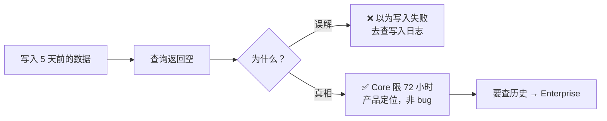
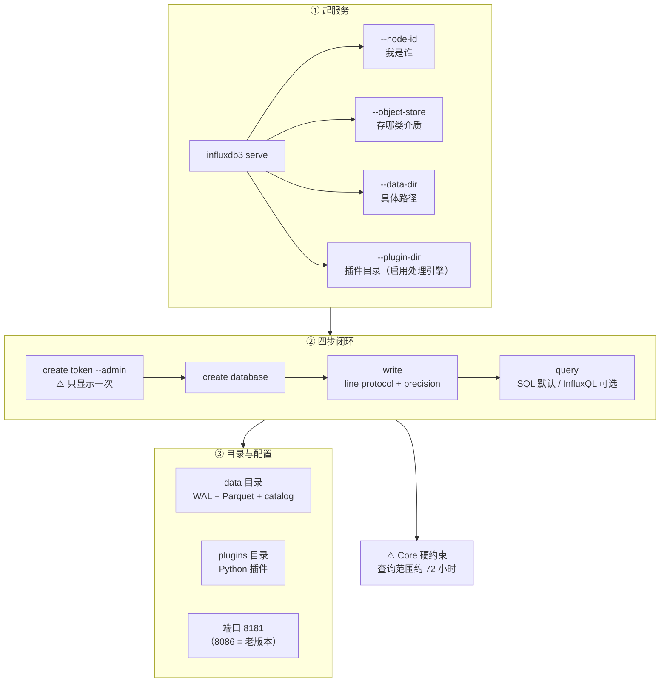

# 第 3 课：环境搭建与第一次写入

> 所属阶段：阶段 2《上手篇》｜ 水平：零基础 ｜ 本课知识点：安装方式与启动参数 / 第一次写入与查询 / 目录结构与配置文件
> 故事情节：主角「时间」终于有了一个家——但你照着旧教程起服务，拉下来的却是上一代的镜像

## 🎯 本课目标

- 用 **Docker**（主线）或**原生安装**（备选）起一个 InfluxDB 3 Core，并理解每个启动参数的含义
- 完成**创建 token → 建库 → 写入 → 查询**的完整闭环
- 知道数据落在哪、配置改哪、token 怎么管

> 💻 **环境说明**：本课以 **Docker** 为主线（起服务最快、最贴近生产容器化部署），并在每处给出**原生安装**的等价做法。命令以 Unix shell 为准，Windows 差异处已单独标注。

---

## 第一幕：起源与场景引入

上一课结束时你知道了 InfluxDB 3 是什么，也知道要选 Core 还是 Enterprise。现在该动手了。

你的想法很朴素：**"docker run 一下不就完了？"**

于是你搜到一篇教程，照着敲：

```bash
docker run -d -p 8086:8086 influxdb
```

跑起来了。你兴冲冲地打开浏览器访问 `localhost:8086`——看到了 InfluxDB 2.x 的登录界面。

> 🎬 **场景**：你明明要学 InfluxDB 3，却起了一个 **v2 的实例**。更糟的是，你写的 SQL 查询全部报错，因为 2.x 不支持 SQL、只认 Flux。你花了两个小时才发现——**`influxdb` 这个镜像标签指向的不是最新版**。
>
> 而且情况还在变：**2026-09-15 起，官方 Docker 镜像的 `latest` 标签将改指 InfluxDB 3 Core**。也就是说，你今天还能靠"写死 `influxdb:2`"躲过去，下个月再拉 `latest`，拉到的就是另一个数据库了。

这一课，我们把环境这件事一次做对。

---

## 第二幕：认知冲突

你可能会想：**"不就是起个容器吗？能有什么坑。"**

三个坑，每一个都会让你怀疑人生：

- **标签坑**：`influxdb`、`influxdb:latest`、`influxdb:3-core`、`influxdb:2` 是四个不同的东西。拉错就是另一个数据库。
- **Token 坑**：`influxdb3 create token --admin` **只在创建时打印一次，之后无法找回**。手贱清屏了？只能重新生成。
- **72 小时坑**：这是最隐蔽的一个——你写入成功、查询也成功，但**查 5 天前的数据返回空**。你会以为写入失败了，实际上是 **InfluxDB 3 Core 把查询时间范围限制在约 72 小时内**。

> ❓ **问题**：为什么会有 72 小时限制？回扣第 1 课——**Core 不含 compactor**（压实器），它是为"最近几天的数据"设计的。想查一年历史？那要 Enterprise。这个限制不是 bug，是产品定位。

---

## 第三幕：层层揭示

### 知识点 1：安装方式与启动参数

#### 一句话定义

**起一个 InfluxDB 3 Core = 跑 `influxdb3 serve`，并用四个参数告诉它「你是谁、数据存哪、插件放哪、监听哪里」。**

#### 直觉建立（类比）

把 `influxdb3 serve` 想成**开一家新仓库**：

| 参数 | 类比 | 不填会怎样 |
|------|------|-----------|
| `--node-id` | 仓库的**门牌号** | 自动用主机名生成（开发够用，生产必须显式指定） |
| `--object-store` | 选**货架类型**：本地货架(file) / 内存(memory) / 云仓(s3) | 默认 `file` |
| `--data-dir` | 货架放在**哪个房间** | 默认 `~/.influxdb` |
| `--plugin-dir` | 加工车间的位置（**给了才启用处理引擎**） | 不给则关闭处理引擎 |

> 💡 **类比的边界**：真实仓库换个门牌号不影响存货，但 `--node-id` **会参与存储路径的构成**（`/<bucket>/<node-id>/`）。乱改 node-id 会让你"找不到"之前存的数据——这点第 13 课部署时会再提。

#### 概念与原理

**方式 A：Docker（本课主线）**

官方推荐的最小启动命令（Docker Hub 官方镜像页原文）：

```bash
docker run --rm -p 8181:8181 \
  -v $PWD/data:/var/lib/influxdb3/data \
  -v $PWD/plugins:/var/lib/influxdb3/plugins \
  influxdb:3-core influxdb3 serve \
  --node-id=my-node-0 \
  --object-store=file \
  --data-dir=/var/lib/influxdb3/data \
  --plugin-dir=/var/lib/influxdb3/plugins
```

> **Windows PowerShell 用户**：把 `$PWD` 换成 `${PWD}`，换行符用反引号 `` ` ``：
> ```powershell
> docker run --rm -p 8181:8181 `
>   -v ${PWD}/data:/var/lib/influxdb3/data `
>   -v ${PWD}/plugins:/var/lib/influxdb3/plugins `
>   influxdb:3-core influxdb3 serve `
>   --node-id=my-node-0 `
>   --object-store=file `
>   --data-dir=/var/lib/influxdb3/data `
>   --plugin-dir=/var/lib/influxdb3/plugins
> ```

**方式 B：Docker Compose（推荐用于长期练习）**

官方 `compose.yaml`：

```yaml
# compose.yaml
name: influxdb3
services:
  influxdb3-core:
    container_name: influxdb3-core
    image: influxdb:3-core
    ports:
      - 8181:8181
    command:
      - influxdb3
      - serve
      - --node-id=node0
      - --object-store=file
      - --data-dir=/var/lib/influxdb3/data
      - --plugin-dir=/var/lib/influxdb3/plugins
    volumes:
      - type: bind
        source: ~/.influxdb3/core/data
        target: /var/lib/influxdb3/data
      - type: bind
        source: ~/.influxdb3/core/plugins
        target: /var/lib/influxdb3/plugins
```

起服务：`docker compose up -d`；停服务：`docker compose down`。

**方式 C：原生安装（Linux / macOS）**

```bash
curl -O https://www.influxdata.com/d/install_influxdb3.sh && sh install_influxdb3.sh core
influxdb3 --version
```

启动（把处理引擎也打开）：

```bash
mkdir -p ~/influxdb3/plugins
influxdb3 serve \
  --node-id host01 \
  --object-store file \
  --data-dir ~/.influxdb3 \
  --plugin-dir ~/influxdb3/plugins
```

> ⚠️ **原生安装的隐藏依赖**：`influxdb3` 二进制**依赖与它同目录的 `python/` 文件夹**（处理引擎用）。如果你是手动从 tarball 解压的，**不要把二进制单独挪走**——把父目录加进 PATH，否则插件会跑不起来。

#### `--object-store` 六种取值

| 取值 | 用途 |
|------|------|
| `file` | 本地文件系统（**开发默认**） |
| `memory` | 纯内存，**不持久化**，重启即丢 |
| `memory-throttled` | 内存，但模拟云对象存储的延迟与吞吐（压测用） |
| `s3` | AWS S3 及兼容服务（Ceph / MinIO） |
| `google` | Google Cloud Storage |
| `azure` | Azure Blob Storage |

> 📌 **这就是"无盘架构"的体现**：生产环境通常指向对象存储，本地盘只是可选项。第 10 课会展开。

#### 🚀 快速启动模式（开发专用）

**不带任何参数**直接跑：

```bash
influxdb3
```

系统会根据你的主机名自动生成配置，并打印警告：

- `node-id`：`{hostname}-node`（拿不到主机名则用 `primary-node`）
- `object-store`：`file`
- `data-dir`：`~/.influxdb`

> 官方文档明确：**快速启动模式面向开发、测试与家庭环境**，生产必须显式指定 `--node-id`。环境变量优先级高于自动生成的默认值（如 `INFLUXDB3_NODE_IDENTIFIER_PREFIX`）。

#### 一句话记住

**`influxdb3 serve` + 四个参数（node-id / object-store / data-dir / plugin-dir）；开发可偷懒不带参数，生产必须显式指定 node-id。**

---

### 知识点 2：第一次写入与查询

#### 一句话定义

**跑通四步闭环：创建 admin token → 创建 database → 写入 line protocol → 用 SQL 查回来。**

#### 直觉建立（类比）

把 InfluxDB 想成一个**带门禁的仓库**：

1. **办门禁卡**（token）—— 卡号只在办卡时显示一次，之后查不到
2. **开个库位**（database）—— 存放一类数据
3. **存货**（write）—— 按固定格式的标签贴好
4. **取货**（query）—— 用 SQL 描述你要什么

#### 概念与原理

##### 步骤 1：创建 admin token

**Docker**（新开一个终端）：

```bash
docker exec -it influxdb3-core influxdb3 create token --admin
```

**原生**：

```bash
influxdb3 create token --admin
```

输出一串 token 字符串。**第一个创建的 admin token 就是该服务器的 operator token**（拥有全部权限）。

> 🚨 **只显示一次，无法找回**。官方文档原文：*"InfluxDB displays the token string only when you create it. Store your token securely—you cannot retrieve it from the database later."* 忘了只能重新生成。

把 token 设成环境变量，后续命令就不用每次带 `--token` 了：

```bash
# Linux / macOS
export INFLUXDB3_AUTH_TOKEN="粘贴你的token"

# Windows PowerShell
$env:INFLUXDB3_AUTH_TOKEN="粘贴你的token"

# Windows cmd（注意：官方文档要求末尾留一个空格，否则空格会被当成 token 的一部分）
set INFLUXDB3_AUTH_TOKEN=粘贴你的token
```

##### 步骤 2：创建 database

```bash
# 原生
influxdb3 create database mydb
influxdb3 show databases        # 确认它在列表里

# Docker
docker exec -it influxdb3-core influxdb3 create database mydb
```

##### 步骤 3：写入数据

用 `influxdb3 write`，line protocol 通过 **stdin**（单引号包裹）传入：

```bash
influxdb3 write \
  --database mydb \
  --precision s \
  'home,room=Living\ Room temp=21.1,hum=35.9,co=0i 1641024000
home,room=Kitchen temp=21.0,hum=35.9,co=0i 1641024000
home,room=Living\ Room temp=21.4,hum=35.9,co=0i 1641027600
home,room=Kitchen temp=23.0,hum=36.2,co=0i 1641027600'
```

也可以先存成文件再写入（更实用）：

```bash
influxdb3 write \
  --database mydb \
  --precision s \
  --accept-partial \
  --file path/to/sensor_data
```

**关键参数**：

| 参数 | 作用 |
|------|------|
| `--database` / `-d` | 目标数据库（必需） |
| `--token` / `-t` | 认证 token（设了环境变量可省略） |
| `--precision` | 时间戳精度：`ns`（默认）/ `us` / `ms` / `s` |
| `--accept-partial` | 部分数据格式错误时，**仍接受合法的行**而非整批拒绝 |
| `--file` | 从文件读取 line protocol |

> 📌 **注意 `Living\ Room`**：tag 值里的**空格必须转义**成 `\ `。这是 line protocol 最常见的报错来源，第 4 课细讲。

##### 步骤 4：查询

```bash
# SQL（默认语言）
influxdb3 query --database mydb "SELECT * FROM home ORDER BY time"

# 带时间范围
influxdb3 query --database mydb \
  "SELECT * FROM home WHERE time >= now() - INTERVAL '7 days' ORDER BY time"

# 切换到 InfluxQL
influxdb3 query --database mydb --language influxql "SELECT * FROM home"
```

`influxdb3 query` 的参数：

| 参数 | 说明 |
|------|------|
| `-H` / `--host` | 服务器地址，默认 `http://127.0.0.1:8181` |
| `-d` / `--database` | **必需**，数据库名 |
| `-l` / `--language` | `sql`（默认）或 `influxql` |
| `-t` / `--token` | 认证 token |

#### ⚠️ 两条硬约束（必须记住）

**① Flux 在 InfluxDB 3 中不受支持**

官方原文：*"Flux, the language introduced in InfluxDB v2, is **not** supported in InfluxDB 3."*

**② Core 的查询时间范围限制在约 72 小时**

官方原文：*"InfluxDB 3 Core limits query time ranges to approximately 72 hours (both recent and historical) to ensure query performance."*



> 💡 这也解释了第 2 课里 AWS 博客说的"Core 适合最近 3–5 天"。**72 小时是官方 Core 文档的口径**，与之一致且更精确。

#### 一句话记住

**token 只显示一次、数据库要先建、写入用 `--precision` 声明精度、查询默认 SQL；Core 只能查最近约 72 小时。**

---

### 知识点 3：目录结构与配置文件

#### 一句话定义

**InfluxDB 3 的持久化数据 = `--data-dir` 下的 Parquet 文件 + WAL + catalog（元数据），三者构成"源数据"。**

#### 直觉建立（类比）

把数据目录想成一家**档案馆**：

- **WAL（写前日志）**：收发室——刚到的事先登记在流水簿上，防止丢失
- **Parquet 文件**：库房——归档好的卷宗，压缩存放
- **catalog（目录）**：索引卡片柜——记录有哪些库、哪些表、哪些列

少任何一样，档案都读不出来。所以**备份要备份整个目录**，不能只拷 Parquet。

#### 概念与原理

**Docker 部署时的目录映射**（容器内路径）：

| 容器内路径 | 内容 | 宿主机映射（示例） |
|-----------|------|------------------|
| `/var/lib/influxdb3/data` | 数据本体（Parquet + WAL + catalog） | `$PWD/data` 或 `~/.influxdb3/core/data` |
| `/var/lib/influxdb3/plugins` | 处理引擎插件（Python 文件） | `$PWD/plugins` 或 `~/.influxdb3/core/plugins` |

**原生安装**：默认落在 `~/.influxdb`（快速启动模式）或你 `--data-dir` 指定的位置。

##### 端口

| 端口 | 用途 |
|------|------|
| **8181** | HTTP API（写入 + 查询）；InfluxDB 3 的默认端口 |
| 8086 | 那是 InfluxDB **1.x / 2.x** 的端口 —— **看到 8086 就该警觉你起错版本了** |

> 🔎 **快速判断版本**：起完服务看监听端口。8181 → 3.x；8086 → 1.x/2.x。

##### 三种认证层级

| 概念 | 说明 |
|------|------|
| **token** | 认证凭据，CLI 与 HTTP API 都用它 |
| **admin token** | 拥有全部 CLI 操作与 API 端点权限 |
| **operator token** | **你创建的第一个 admin token**，是整台服务器的根凭据 |

#### 一句话记住

**数据目录 = WAL + Parquet + catalog 三位一体，备份要整个拷；端口 8181 是 3.x 的标志，看到 8086 说明版本错了。**

---

## 第四幕：实操验证

> 把这一节照着敲一遍，你就跑通了完整闭环。**建议用 Docker。**
>
> 📌 **Docker 用户的统一前缀**：因为 CLI 工具在容器里，所以**每个 `influxdb3` 命令都要包一层 `docker exec -it influxdb3-core`**。本节示例中这个前缀反复出现，理解了一次就够了——后面的课会改用更省事的写法（把 token 设进环境变量、用 `influx3` 从宿主机连）。

### 完整流程（复制即用）

```bash
# ① 起服务（后台运行，去掉 --rm 以便容器保留）
docker run -d --name influxdb3-core -p 8181:8181 \
  -v $PWD/data:/var/lib/influxdb3/data \
  -v $PWD/plugins:/var/lib/influxdb3/plugins \
  influxdb:3-core influxdb3 serve \
  --node-id=my-node-0 \
  --object-store=file \
  --data-dir=/var/lib/influxdb3/data \
  --plugin-dir=/var/lib/influxdb3/plugins

# ② 看看起来了没（看日志）
docker logs influxdb3-core

# ③ 创建 admin token（= operator token），输出务必保存！
docker exec -it influxdb3-core influxdb3 create token --admin

# ④ 设置环境变量
export INFLUXDB3_AUTH_TOKEN="上一步输出的token"

# ⑤ 建库
docker exec -it influxdb3-core influxdb3 create database mydb
docker exec -it influxdb3-core influxdb3 show databases

# ⑥ 写两条数据（注意 Living\ Room 的转义）
docker exec -it influxdb3-core influxdb3 write \
  --database mydb --precision s \
  'home,room=Living\ Room temp=21.1,hum=35.9,co=0i 1641024000
home,room=Kitchen temp=21.0,hum=35.9,co=0i 1641024000'

# ⑦ 查回来
docker exec -it influxdb3-core influxdb3 query \
  --database mydb "SELECT * FROM home ORDER BY time"
```

**怎么算成功**（第 ⑦ 步）：

> ⏳ **以下为输出格式示意，非实测截图**——当前文档编写环境无 Docker，未能实跑。表格的具体边框样式、列顺序会随版本与终端宽度变化。**判断成功的标准是下面三条，不要逐字比对表格样式：**

1. 返回了 **2 行**数据（Living Room / Kitchen 各一条）
2. 列里同时出现 **`room`**（tag）、**`temp` / `hum` / `co`**（field）、**`time`**（时间戳）
3. `co` 的值显示为 `0`（因为写入时用了 `0i` 整数尾缀）

输出大致长这样：

```text
+--------------+------+---------------------+------+------+
| room         | co   | time                | hum  | temp |
+--------------+------+---------------------+------+------+
| Living Room  | 0    | 2022-01-01T08:00:00 | 35.9 | 21.1 |
| Kitchen      | 0    | 2022-01-01T08:00:00 | 35.9 | 21.0 |
+--------------+------+---------------------+------+------+
```

> ✅ **回扣第一幕**：注意——**你从头到尾没有建过表，`home` 表自己出现了**。这就是第 2 课讲的 schema-on-write：写入即建模，库、表、schema 全部自动创建。

### 验证 72 小时限制（重要！）

```bash
# 写入一条 5 天前的数据（用 shell 计算时间戳，秒级）
docker exec -it influxdb3-core influxdb3 write \
  --database mydb --precision s \
  "home,room=Test temp=99.9 $(( $(date +%s) - 432000 ))"

# 查询 30 天范围
docker exec -it influxdb3-core influxdb3 query \
  --database mydb "SELECT * FROM home WHERE time >= now() - INTERVAL '30 days' ORDER BY time"
```

> 🎯 **你会看到什么**：那条 5 天前的 `Test` 数据**不会出现**（Core 限制约 72 小时）。**但请记住：数据其实写进去了**——用 Enterprise 或改成最近时间就能查到。这正是第一幕那个"以为写入失败"的真相。

### 排错速查

| 现象 | 原因 | 解法 |
|------|------|------|
| 访问 `localhost:8086` 有 UI | 起了 1.x/2.x | 改用 `influxdb:3-core`，端口应为 8181 |
| `unauthorized` / 401 | token 没设或错了 | 检查 `INFLUXDB3_AUTH_TOKEN`，确认末尾没混入空格 |
| 写入报 parse error | tag/field 值里有空格、逗号未转义 | `Living\ Room`、`a\,b` |
| 查询返回空 | ①时间范围超 72 小时 ②精度写错（ns 当 s） | 查最近时间；核对 `--precision` |
| 写入时间戳对不上 | 精度声明错误 | 秒级时间戳要声明 `--precision s` |

---

## 第五幕：体系收束

> 📍 **全局定位**：你现在有了**手感**——能把服务起起来、写进去、查出来。这是阶段 2 的目标，也是后面所有课程的地基。
>
> 注意本课刻意**没有深究** line protocol 的语法细节（为什么 `1` 和 `1i` 不同、哪些字符要转义）——那是下一课的主题。
>
> 🔗 **下一步**：第 4 课《Line Protocol 与写入基本功》把写入协议讲透，包括数据类型陷阱和 HTTP API 批量写入。

### 🎯 落地视角小结

带四条结论回团队：

1. **镜像标签必须写死**。不要用 `influxdb` 或 `latest`——2026-09-15 起 `latest` 会改指 3 Core，今天是 `influxdb:2`，下个月可能是 `influxdb:3-core`。**用 `influxdb:3-core` 或具体版本号。**
2. **operator token 当密钥管**。只显示一次，丢了只能重建。进密钥管理系统，不要写进代码或 docker-compose 文件。
3. **Core 的 72 小时限制要在选型时讲清楚**。如果业务方要求"查三个月趋势"，Core 直接不合格，必须 Enterprise——这个结论要在立项时就摆上桌，别等上线才发现。
4. **端口是版本指纹**：8181 = 3.x，8086 = 1.x/2.x。巡检时一眼能看出环境是不是搞错了。

---

## 🐞 常见误区

1. **"用 `influxdb:latest` 最省事"**——最危险的做法。2026-09-15 起该标签会指向 3 Core，你的 v2 部署可能在某次重建后**静默升级到另一个数据库**。官方明确警告：*use specific version tags in your deployments*。

2. **"token 忘了再查一下就行"**——查不到。官方原文：*"you cannot retrieve it from the database later"*。只能重新创建。

3. **"查不到数据 = 写入失败"**——大概率是 **72 小时限制**或**精度写错**。在 Core 上排查"数据丢了"之前，先确认这两项。

4. **"把 `influxdb3` 二进制单独拷到 `/usr/local/bin` 就行"**——不行。它依赖同目录的 `python/` 文件夹（处理引擎需要）。要么把父目录加进 PATH，要么保证两者同在。

5. **"快速启动模式（不带参数）生产也能用"**——官方文档明确它是为开发/测试/家庭环境设计的，生产必须显式指定 `--node-id`。自动生成的 node-id 依赖主机名，主机名一变就对不上存储路径。

6. **"SQL 和 InfluxQL 随便用"**——能用，但**新代码一律用 SQL**。InfluxQL 是为兼容 1.x 老代码保留的，功能面比 SQL 窄（不支持完整的 JOIN、窗口函数等）。第 9 课会细讲。

## 一图总结



## 📚 官方文档

| 主题 | 链接 |
|------|------|
| Set up InfluxDB 3 Core（安装与启动） | https://docs.influxdata.com/influxdb3/core/get-started/setup/ |
| Write data to InfluxDB 3 Core | https://docs.influxdata.com/influxdb3/core/get-started/write/ |
| Query data in InfluxDB 3 Core | https://docs.influxdata.com/influxdb3/core/get-started/query/ |
| influxdb Docker 官方镜像页（compose 示例 / 变体说明） | https://hub.docker.com/_/influxdb |
| InfluxDB 3 Core 72 小时限制说明 | https://www.influxdata.com/blog/influxdb3-open-source-public-alpha-jan-27/ |

## 📋 本课速查卡

### 启动命令骨架

```bash
influxdb3 serve \
  --node-id=<唯一节点名> \
  --object-store=<file|memory|s3|google|azure> \
  --data-dir=<数据路径> \
  --plugin-dir=<插件路径>
```

### 四步闭环

```bash
influxdb3 create token --admin          # ① token（只显示一次）
influxdb3 create database mydb          # ② 建库
influxdb3 write -d mydb --precision s '<line protocol>'   # ③ 写
influxdb3 query -d mydb "SELECT * FROM home ORDER BY time" # ④ 查
```

### 环境变量（三种 shell）

```bash
export INFLUXDB3_AUTH_TOKEN="..."      # Linux / macOS
$env:INFLUXDB3_AUTH_TOKEN="..."        # Windows PowerShell
set INFLUXDB3_AUTH_TOKEN=...           # Windows cmd（末尾留一个空格）
```

### 精度对照

| 声明 | 含义 | 时间戳位数（示例） |
|------|------|------------------|
| `ns` | 纳秒（**默认**） | 19 位 |
| `us` | 微秒 | 16 位 |
| `ms` | 毫秒 | 13 位 |
| `s` | 秒 | **10 位**（如 1641024000） |

### 排错四问

1. 端口是 **8181** 吗？（8086 = 版本错了）
2. token 设了吗？末尾有没有混入空格？
3. 时间范围在 **72 小时**内吗？
4. `--precision` 和时间戳位数对得上吗？

## 课后小测

**Q1**：同事说"我起了 InfluxDB，访问 localhost:8086 能看到 Web UI"。最可能的情况是？
- A. 他起的是 InfluxDB 3 Core，UI 正常
- B. 他起的是 InfluxDB 1.x 或 2.x，不是 3 Core
- C. 端口映射配错了，3 Core 也能用 8086
- D. 他启用了处理引擎

<details><summary>答案与解析</summary>

**答案：B**。InfluxDB 3 的 HTTP API 端口是 **8181**；**8086 是 1.x / 2.x 的端口**。3 Core 的默认交互方式是 CLI 或单独的 InfluxDB 3 Explorer，不是内置在 8181 上的 Web UI。C 错——虽然技术上能改端口，但"看到 Web UI"这个现象本身就是老版本的特征。

</details>

**Q2**：你在 Core 上写入了一批 7 天前的数据，然后查询返回空。最合理的第一反应是？
- A. 写入失败了，去查服务端日志
- B. Core 限制查询范围约 72 小时，数据在但查不到
- C. Parquet 文件损坏了
- D. token 权限不足

<details><summary>答案与解析</summary>

**答案：B**。官方 Core 文档原文：*"InfluxDB 3 Core limits query time ranges to approximately 72 hours (both recent and historical)"*。**数据其实写进去了**，只是 Core 的查询范围限制让你取不到。A 是最常见的误判——很多人在这里浪费几小时去查写入链路。若确实需要查 7 天前的数据，应选 Enterprise。

</details>

**Q3**：关于 `--node-id`，下列说法正确的是？
- A. 它只是个显示名称，改了不影响数据
- B. 生产环境可以不指定，让系统自动生成
- C. 它参与存储路径的构成，生产必须显式指定
- D. 它必须全局唯一，同一集群不能有重复

<details><summary>答案与解析</summary>

**答案：C**。`--node-id` 是存储路径的组成部分（`/<bucket>/<node-id>/`），乱改会让实例"找不到"之前存的数据。官方文档明确：快速启动自动生成 node-id 的模式面向开发/测试，**生产必须显式指定**。A 错（不是纯显示名）；B 错（与官方建议相反）；D 的前半句对（标识符应区分不同实例）但"集群"语境不适用于 Core（Core 是单机），且这不是本题考查点——C 才是最准确的表述。

</details>

## 🚀 下一批接力提示词

> 学完本批后，**复制下面这段文字发给 AI**，即可无缝进入下一批（无需重新描述上下文）：

```
继续学 InfluxDB。我的学习档案在 influxdb/00-学习档案.md，
刚学完阶段 2《上手篇》的第 3 课《环境搭建与第一次写入》，
知识点：安装方式与启动参数、第一次写入与查询、目录结构与配置文件。
请按大纲继续讲解第 4 课《Line Protocol 与写入基本功》
（知识点：Line Protocol 语法全解、数据类型与精度陷阱、HTTP API 与批量写入）。
```

## 🧭 课程导航

➡️ **下一课**：第 4 课《Line Protocol 与写入基本功》
⬅️ **上一课**：[第 2 课《InfluxDB 是什么：三代演进与生态位》](../../1-问题与定位/lessons/lesson-02-InfluxDB是什么.md)

📚 **返回目录**：[课程目录](../../../02-课程目录.md) ｜ 🗺️ **路径总览**：[学习路径总览](../../../01-学习路径总览.md) ｜ 📖 **阶段导览**：[阶段 2 概览](../overview.md)
