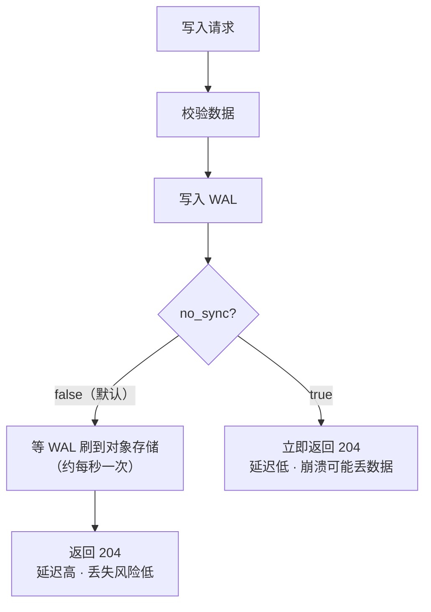
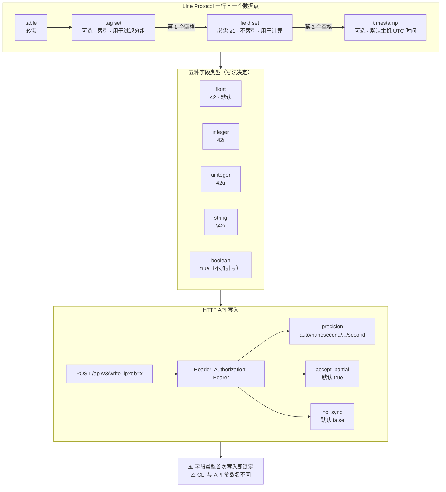

# 第 4 课：Line Protocol 与写入基本功

> 所属阶段：阶段 2《上手篇》｜ 水平：零基础 ｜ 本课知识点：Line Protocol 语法全解 / 数据类型与精度陷阱 / HTTP API 与批量写入
> 故事情节：主角「时间」的标签格式——两个空格决定了数据长什么样，写错了它也不报错，只是悄悄变成另一个意思

## 🎯 本课目标

- 能徒手写出正确的 line protocol，并说清**两个未转义空格**的分隔语义
- 避开数据类型与时间戳精度的坑（这是 InfluxDB 新手踩得最多的一类）
- 会用 HTTP API 批量写入，理解 `accept_partial` 与 `no_sync` 的取舍

> 💻 承接第 3 课环境：Docker 容器名 `influxdb3-core`，端口 8181，token 已设进 `INFLUXDB3_AUTH_TOKEN`。

---

## 第一幕：起源与场景引入

第 3 课你跑通了闭环，很兴奋。于是你开始接入真实数据——采集服务的 CPU 使用率。

```bash
influxdb3 write --database mydb --precision s \
  'cpu,host=web-01 usage=42'
```

写入成功，没有报错。你查询：

```bash
influxdb3 query --database mydb "SELECT * FROM cpu"
```

返回 `usage = 42`。看起来对了。

然后你写了第二段数据：

```bash
influxdb3 write --database mydb --precision s \
  'cpu,host=web-01 usage=42i'
```

**报错了**：`invalid column type for column 'usage', expected iox::column_type::field::float, got iox::column_type::field::integer`

> 🎬 **场景**：你明明只是加了个 `i`，为什么就炸了？更诡异的是——**第一次写入的 `42` 已经把 `usage` 列定型成 float 了，而你当时什么都不知道**。
>
> 顺着这个坑往下挖，你会发现 line protocol 里藏着一整套"**写错了也不报错，只是悄悄变成另一个意思**"的规则：`42` 和 `42i` 是不同类型、`true` 和 `"true"` 是不同类型、时间戳位数决定它是哪一年……

这一课，把写入这件事一次讲透。

---

## 第二幕：认知冲突

你可能会想：**"一个文本格式而已，能有多复杂？"**

三个层次的坑，一个比一个隐蔽：

**第一层 · 语法坑**：line protocol 靠**空格**分隔字段，但 tag 值里本身可能就有空格（比如 `Living Room`）。不转义就解析错。

**第二层 · 类型坑**：`42`（float）和 `42i`（integer）在磁盘上是两种不同的列类型。**先写进去的那个决定了这一列的终身类型**，后面写错的会被拒绝。

**第三层 · 参数坑**（最阴险）：

| | CLI `--precision` | HTTP API `precision` |
|---|---|---|
| 取值写法 | `ns` / `us` / `ms` / `s` | `nanosecond` / `microsecond` / `millisecond` / `second` / `auto` |
| 缺省行为 | 默认 `ns` | 默认 `auto`（**按时间戳量级猜**） |

同理，`accept_partial`：

| | CLI | HTTP API |
|---|---|---|
| 缺省行为 | **严格**（给了 `--accept-partial` 才放宽） | **宽松**（默认 `true`，要显式 `false` 才严格） |

> ❓ **问题**：为什么同一个东西两套写法？因为 CLI 是你交互式敲的，宁可严格也不想静默吞掉坏数据；HTTP API 面向高吞吐批量写入，宁可部分成功也不想整批重来。**这是设计取舍，不是不一致——但你从 CLI 切到代码时必须重新过一遍。**

---

## 第三幕：层层揭示

### 知识点 1：Line Protocol 语法全解

#### 一句话定义

**Line Protocol = 一行文本一个数据点，靠「两个未转义空格」把「表+标签」「字段」「时间戳」三段切开。**

#### 直觉建立（类比）

把一行 line protocol 想成一张**快递面单**：

```
home,room=Living\ Room temp=21.1,hum=35.9,co=0i 1735545600
└─┬─┘ └──────┬──────┘ └────────┬────────┘ └───┬───┘
  │          │                 │              │
 表(table)  标签(tag set)     字段(field set)  时间戳
  寄什么     从哪来/分类        内容是什么       什么时候寄的
```

**两个空格是分隔符**——第一个空格前面是"表+标签"，中间是"字段"，第二个空格后面是"时间戳"。

> 💡 **类比的边界**：真实面单的空格可以随便加；line protocol 里**空格是有语义的**，标签值里有空格必须写成 `\ `，否则会被当成字段分隔符，整行解析错乱。

#### 概念与原理

**完整语法**：

```
<table>[,<tag_key>=<tag_value>[,<tag_key>=<tag_value>]] <field_key>=<field_value>[,<field_key>=<field_value>] [<timestamp>]
```

**四要素**：

| 要素 | 必需？ | 作用 | 类型 |
|------|:---:|------|------|
| **table** | ✅ 必需 | 数据点的逻辑分组（3.x 文档称 table；1.x/2.x 称 measurement，同义） | 字符串 |
| **tag set** | 可选 | 元数据，用于**过滤与分组**（会被索引） | 键、值均为字符串 |
| **field set** | ✅ 必需（至少一个） | 实际的测量值，用于**计算** | 值可为 float / integer / uinteger / string / boolean |
| **timestamp** | 可选 | Unix 时间戳，最高纳秒精度 | 整数（缺省用主机 UTC 当前时间） |

**解析规则**（官方文档原文）：

- **table**：第一个未转义逗号之前、第一个空白之前的所有内容
- **tag set**：第一个未转义逗号 与 第一个未转义空白 之间的键值对
- **field set**：第一个 与 第二个未转义空白 之间的键值对
- **timestamp**：第二个未转义空白之后的整数

##### 转义规则（照着这张表抄）

| 元素 | 必须转义的字符 |
|------|--------------|
| **table / measurement** | 逗号 `,`、空格 ` ` |
| **tag key** | 逗号 `,`、等号 `=`、空格 ` ` |
| **tag value** | 逗号 `,`、等号 `=`、空格 ` ` |
| **field key** | 逗号 `,`、等号 `=`、空格 ` ` |
| **field value（string 类型）** | 双引号 `"`、反斜杠 `\` |

> 📌 **反斜杠本身不需要转义**——除非它紧挨着需要转义的字符。这条规则反直觉但很省事。

**示例**：

```text
# 标签值含空格 → 必须转义
home,room=Living\ Room temp=21.1

# 标签值含逗号和等号 → 都要转义
home,location=Building\ A\,Floor\=3 temp=21.1

# 字段值（字符串）含双引号 → 转义
home,room=Kitchen note="sensor said \"OK\""

# 表名的逗号和空格 → 转义
my\ sensor\,01 value=1.0
```

##### 引号规则（一句话：除了字符串字段值，别乱加引号）

| 元素 | 双引号 | 单引号 |
|------|:---:|:---:|
| table / tag key / tag value / field key | ❌ 加了会被**当成名称的一部分** | ❌ 同左 |
| **field value（string 类型）** | ✅ **必须** | ❌ 不用 |
| field value（float / integer / uinteger / boolean） | ❌ 加了会**变成字符串** | ❌ |
| timestamp | ❌ 加了报 `bad timestamp` | ❌ |

> 🚨 **最容易踩的一条**：给 boolean 加引号 → `status="true"` 存进去的是**字符串** `"true"` 而不是布尔值 `true`。查询时你会发现过滤行为完全不对。

##### 其他规则

- **换行符 `\n` 分隔数据点**，且标签值/字段值中**不能包含换行符**
- **注释**：行首 `#` 表示注释，整行忽略
- **tag value 不能为空**：空值请直接省略该 tag，而不是写 `tag=`
- **大小写敏感**：table 名、tag 键、tag 值、field 键、string 类型的 field 值**全部区分大小写**

#### 一句话记住

**两个空格切三段；标签值里的空格逗号等号要转义；字符串字段值加双引号，其他一律不加。**

---

### 知识点 2：数据类型与精度陷阱

#### 一句话定义

**五种字段类型靠"写法"区分（float 无后缀 / integer 加 `i` / uinteger 加 `u` / string 加双引号 / boolean 用关键字），而时间戳精度靠"声明"确定。**

#### 直觉建立（类比）

把字段类型想成**快递面单上的"物品类别"勾选框**：

- 你写 `42` → 勾了"**易碎品**"（float）
- 你写 `42i` → 勾了"**普通件**"（integer）

**第一个寄件人勾了什么，这个收件窗口以后就只收这一类。** 第二个人寄普通件到易碎品窗口，直接被退回。

#### 概念与原理

##### 五种字段类型

| 类型 | 写法 | 范围 / 限制 | 示例 |
|------|------|------------|------|
| **float** | 数字，**默认类型**，支持科学计数法 | IEEE-754 64 位 | `temp=21.1`、`temp=21`、`temp=-1.234456e+78` |
| **integer** | 数字 + 尾缀 **`i`** | 有符号 64 位（-9223372036854775808 ~ 9223372036854775807） | `co=0i`、`count=12485903i` |
| **uinteger** | 数字 + 尾缀 **`u`** | 无符号 64 位（0 ~ 18446744073709551615） | `bytes=1u` |
| **string** | **双引号**包裹 | 最长 **64 KB** | `note="hello"` |
| **boolean** | `t` `T` `true` `True` `TRUE` / `f` `F` `false` `False` `FALSE` | **不可加引号** | `ok=true`、`ok=f` |

> ⚠️ **`21` 是 float 不是 integer**——这是新手第一大坑。想要整数必须写 `21i`。

##### 类型冲突：先到先得

官方错误消息（真实原文）：

```
invalid column type for column 'temp', expected iox::column_type::field::float,
got iox::column_type::field::string
```

**规则**：某列的第一次写入决定该列的类型，后续写入类型不符即被拒。

```mermaid
flowchart LR
    A["写入 temp=96<br/>（float）"] --> B["列类型锁定为 float"]
    B --> C["再写 temp=\"hi\"<br/>（string）"]
    C --> D["❌ 拒绝<br/>invalid column type"]
    D --> E{"accept_partial?"}
    E -->|"true（默认）"| F["接受其他合法行<br/>返回 400 + 错误明细"]
    E -->|"false"| G["整批拒绝"]
```

##### 时间戳精度：**CLI 与 HTTP API 两套命名**

这是本课最实用的一张表：

| | CLI (`influxdb3 write`) | HTTP API (`?precision=`) |
|---|---|---|
| 纳秒 | `ns` | `nanosecond` |
| 微秒 | `us` | `microsecond` |
| 毫秒 | `ms` | `millisecond` |
| 秒 | `s` | `second` |
| 自动检测 | — | `auto`（**默认**） |
| 缺省值 | `ns` | `auto` |

**HTTP API 的 `auto` 检测规则**（按时间戳量级）：

| 时间戳量级 | 判定精度 | 转换 |
|-----------|---------|------|
| `< 5e9` | 秒 | × 1,000,000,000 |
| `< 5e12` | 毫秒 | × 1,000,000 |
| `< 5e15` | 微秒 | × 1,000 |
| 更大 | 纳秒 | 不转换 |

> 🎯 **记忆法**：`1708976567`（10 位，< 5e9）→ 秒；`1708976567000`（13 位，< 5e12）→ 毫秒；`1708976567000000000`（19 位，> 5e15）→ 纳秒。**位数就是精度。**

##### 💡 `auto` 到底靠不靠谱？自己算一遍

把三个阈值换算成时刻，你会发现一件有意思的事：

| 阈值 | 换算 | 对应时刻（UTC） |
|------|------|----------------|
| `5e9` 秒 | 5,000,000,000 秒 | **2128-06-11** |
| `5e12` 毫秒 | = 5,000,000,000 秒 | **2128-06-11** |
| `5e15` 微秒 | = 5,000,000,000 秒 | **2128-06-11** |

**三个阈值对齐到了同一个时刻。** 这不是巧合——设计者让"量级分桶"恰好等价于"时刻分桶"。所以在 **2128 年之前的常规时间范围内，`auto` 检测是可靠的**，它不会因为"猜错位数"而差出几十年。

那真正的风险在哪？两类场景：

| 风险场景 | 例子 | 后果 |
|---------|------|------|
| **人为构造的小数值**（测试数据最常见） | 你想写"1000 毫秒"，写成 `v=1 1000` | 1000 < 5e9 → 判为**秒** → 落点是 1970-01-01 00:16:40 |
| **1970 年之前的历史数据** | 负数时间戳 | 量级判断失效，行为不可预期 |

> 📌 所以官方文档的建议是 *"To avoid any ambiguity, you can specify the precision of timestamps in your data"* ——**显式声明是为了消除歧义（尤其是小数值与测试场景），而不是因为 `auto` 经常出错。** 生产写入显式声明依然是对的做法，但理由要说准。

##### 时间戳的有效范围

| | 最小 | 最大 |
|---|---|---|
| Unix 时间戳（纳秒） | -9223372036854775806（1677-09-21） | 9223372036854775806（2262-04-11） |

> ⏳ **置信度：中**——上表数值来自第三方（阿里云 TSDB for InfluxDB）的 line protocol 文档，未在 InfluxDB 3 Core 官方文档中核实到同表。物理上它与 int64 纳秒的表示范围一致，逻辑自洽。**日常使用不受影响**（你的数据在 1970–2128 年之间远未触及边界），但**不要把这两个数字写进正式文档而不加注**。

#### 一句话记住

**`42` float、`42i` integer、`42u` uinteger、`"42"` string、`true` 不加引号 boolean；时间戳位数决定精度，能显式声明就别用 auto。**

---

### 知识点 3：HTTP API 与批量写入

#### 一句话定义

**`POST /api/v3/write_lp?db=<库名>` + `Authorization: Bearer <token>` + line protocol 请求体，是 3.x 新建写入工作负载的推荐方式。**

#### 直觉建立（类比）

把 HTTP API 想成**批量交货的卸货口**，CLI 是**零售窗口**：

- 零售窗口（CLI）：一次一单，出问题当场告诉你，**默认严格**
- 卸货口（HTTP API）：一车货一起卸，默认**坏的那箱扔掉、好的照收**，免得整车退回重跑

#### 概念与原理

##### 端点选择（官方文档明确的三种）

| 场景 | 端点 |
|------|------|
| **新建写入工作负载** | `/api/v3/write_lp` ← **新项目用这个** |
| 迁移已有 **v1** 工作负载 | `/write` |
| 迁移已有 **v2** 工作负载 | `/api/v2/write` |
| Telegraf | 用 `outputs.influxdb_v3` 插件（v1/v2 老配置用对应插件） |

##### 请求格式

```bash
curl "http://localhost:8181/api/v3/write_lp?db=sensors&precision=second" \
  --header "Authorization: Bearer DATABASE_TOKEN" \
  --data-raw "home,room=Living\ Room temp=21.1,hum=35.9,co=0i 1735545600
home,room=Kitchen temp=21.0,hum=35.9,co=0i 1735545600"
```

**完整方法行**（官方原文）：

```
POST /api/v3/write_lp?db=mydb&precision=nanosecond&accept_partial=true&no_sync=false
```

##### 查询参数

| 参数 | 默认 | 说明 |
|------|------|------|
| `db` | **必需** | 目标数据库名 |
| `precision` | `auto` | `auto` / `nanosecond` / `microsecond` / `millisecond` / `second` |
| `accept_partial` | **`true`** | 部分行出错时，是否仍接受合法行 |
| `no_sync` | `false` | `true` = **WAL 持久化完成前**就返回确认 |

##### Header

| Header | 说明 |
|--------|------|
| `Authorization: Bearer <TOKEN>` | 认证（必需） |
| `Content-Encoding: gzip` | 请求体 gzip 压缩时加 |

##### 响应

**成功**：`204 No Content`，并带 `cluster-uuid` 响应头（实例 catalog 的 UUID，可用于多实例环境下定位是哪个实例处理了请求）。

```text
< HTTP/1.1 204 No Content
< cluster-uuid: 01234567-89ab-cdef-0123-456789abcdef
< date: Tue, 19 Nov 2025 20:00:00 GMT
```

**部分失败**（`accept_partial=true`，默认）——注意**状态码是 400 但数据已部分写入**：

```json
{
  "error": "partial write of line protocol occurred",
  "data": [
    {
      "original_line": "home,room=Sunroom temp=hi 1735549200",
      "line_number": 2,
      "error_message": "invalid column type for column 'temp', expected iox::column_type::field::float, got iox::column_type::field::string"
    }
  ]
}
```

**整批失败**（`accept_partial=false`）——`data` 是**对象**而非数组：

```json
{
  "error": "parsing failed for write_lp endpoint",
  "data": {
    "original_line": "home,room=Sunroom temp=hi 1735549200",
    "line_number": 2,
    "error_message": "invalid column type for column 'temp', ..."
  }
}
```

> 🚨 **监控陷阱**：`accept_partial=true` 时**返回 400 不代表写入完全失败**——合法行已经写进去了。你的监控告警不能只看状态码，要解析 body 里的 `data` 数组。

##### `no_sync`：吞吐与持久性的取舍



> 官方原文：*"Using `no_sync=true` is best when prioritizing high-throughput writes over absolute durability."*

##### gzip 压缩

支持 gzip 请求体，且支持 **multi-member gzip**（RFC 1952，即多个 gzip 文件直接拼接）：

```bash
echo "cpu,host=server1 usage=50.0 1708976567" | gzip > batch1.gz
echo "cpu,host=server2 usage=60.0 1708976568" | gzip > batch2.gz

cat batch1.gz batch2.gz | curl "http://localhost:8181/api/v3/write_lp?db=sensors" \
  --header "Authorization: Bearer DATABASE_TOKEN" \
  --header "Content-Encoding: gzip" \
  --data-binary @-
```

#### 一句话记住

**`/api/v3/write_lp?db=x` + Bearer token；`accept_partial` 默认宽松（400 也可能是部分成功）、`no_sync` 用吞吐换持久性。**

---

## 第四幕：实操验证

> 下面每条命令都可在第 3 课的环境里跑。**建议亲手试一遍类型冲突**——不亲自撞一次记不住。

### 实验 A：类型冲突（必须亲手撞一次）

```bash
# 第一次写入：temp 是 float
influxdb3 write --database mydb --precision s \
  'home,room=Sunroom temp=96 1735545600'

# 第二次写入：temp 写成 string → 类型冲突
influxdb3 write --database mydb --precision s \
  'home,room=Sunroom temp="hi" 1735549200'
```

**预期**：第二条报错，消息形如：

```
invalid column type for column 'temp', expected iox::column_type::field::float,
got iox::column_type::field::string
```

> ✅ **结论**：`temp` 列已被第一次写入**永久定型为 float**。想改类型？只能建新表或删掉重来（**这是 schema 设计要在事前想清楚的原因**，第 7 课会讲）。

### 实验 B：`42` vs `42i`

```bash
# 两个字段，一个 float 一个 integer
influxdb3 write --database mydb --precision s \
  'test,sensor=a f_float=42,f_int=42i 1735545600'

# 查回来（注意 SQL 里能看出类型差异）
influxdb3 query --database mydb "SELECT * FROM test"
```

**重点观察**：`f_float` 与 `f_int` 虽然数值都是 42，但**列类型不同**，后续写入也必须分别匹配。

### 实验 C：HTTP API 写入（含精度声明）

```bash
curl -i "http://localhost:8181/api/v3/write_lp?db=mydb&precision=second" \
  --header "Authorization: Bearer $INFLUXDB3_AUTH_TOKEN" \
  --data-raw 'home,room=Living\ Room temp=21.1,hum=35.9,co=0i 1735545600
home,room=Kitchen temp=21.0,hum=35.9,co=0i 1735545600'
```

**预期**：`HTTP/1.1 204 No Content` + `cluster-uuid` 头。

### 实验 D：`accept_partial` 的两副面孔

```bash
# D1：默认（accept_partial=true）→ 部分成功，状态码 400
curl -i "http://localhost:8181/api/v3/write_lp?db=mydb&precision=second" \
  --header "Authorization: Bearer $INFLUXDB3_AUTH_TOKEN" \
  --data-raw 'home,room=Sunroom temp=96 1735545600
home,room=Sunroom temp=96b 1735549200'

# D2：显式关闭 → 整批拒绝
curl -i "http://localhost:8181/api/v3/write_lp?db=mydb&precision=second&accept_partial=false" \
  --header "Authorization: Bearer $INFLUXDB3_AUTH_TOKEN" \
  --data-raw 'home,room=Sunroom temp=96 1735545600
home,room=Sunroom temp=96b 1735549200'
```

**对比要点**：两次都返回 400，但——
- D1 的 body 是 `data: [ {...} ]`（**数组**，部分行已写入）
- D2 的 body 是 `data: { ... }`（**对象**，一行都没写入）

> 🎯 **这条对写监控告警代码极其重要**：只看 HTTP 状态码会漏判。

### 实验 E：精度自动检测的边界

```bash
# 同一个数值，不同位数 → 不同的时间！
curl "http://localhost:8181/api/v3/write_lp?db=mydb" \
  --header "Authorization: Bearer $INFLUXDB3_AUTH_TOKEN" \
  --data-raw "t1 v=1 1708976567"      # 10 位 → 判为秒

curl "http://localhost:8181/api/v3/write_lp?db=mydb" \
  --header "Authorization: Bearer $INFLUXDB3_AUTH_TOKEN" \
  --data-raw "t2 v=1 1708976567000"   # 13 位 → 判为毫秒
```

**预期**：`t1` 和 `t2` 落在**同一时刻**（1708976567 秒 = 1708976567000 毫秒 = 2024-02-26 19:42:47 UTC）。

> 💡 这验证了「位数即精度」：`auto` 靠量级分桶，而三个阈值对齐到同一时刻（约 2128 年），所以**常规时间范围内它不会猜错**。
>
> 想看它出错的样子？写一条小数值试试：
> ```bash
> curl "http://localhost:8181/api/v3/write_lp?db=mydb" \
>   --header "Authorization: Bearer $INFLUXDB3_AUTH_TOKEN" \
>   --data-raw "t3 v=1 1000"
> ```
> 你本想表达"1000 毫秒"，但 1000 < 5e9 会被判为**秒** → 落点是 1970-01-01 00:16:40。**这才是 `auto` 真正的坑：小数值，而不是"猜错年份"。**

### 排错速查

| 报错 / 现象 | 原因 | 解法 |
|------------|------|------|
| `invalid column type ... expected ... got ...` | 字段类型与首次写入不符 | 改回首次的类型；或建新表 |
| `bad timestamp` | 时间戳加了引号 | 去掉引号 |
| 数据点解析成奇怪的列名 | 空格/逗号未转义 | `Living\ Room`、`a\,b` |
| 布尔值过滤不生效 | 写了 `"true"`（字符串） | 改成 `true`（不加引号） |
| 时间差了几十年 | 精度声明与时间戳位数不符 | 显式声明 `precision` |
| HTTP 返回 400 但数据写进去了 | `accept_partial` 默认 `true` | 要严格就显式设 `false` |

---

## 第五幕：体系收束

> 📍 **全局定位**：写入是整条链路的**入口**——入口的格式错了，后面存储、压缩、查询再优秀也救不回来。本课讲的是"怎么把数据正确送进去"，第 12 课会讲"怎么送得更快"（批量大小、并发、压缩）。
>
> 🔗 **下一步**：第 5 课《Python 客户端与 CLI 工具》——用代码写数据（`influxdb3-python`），以及 `influx3` 这个更趁手的查询工具。

### 🎯 落地视角小结

带五条结论回团队：

1. **字段类型在首次写入时锁定，不可更改**。接入新数据源前必须先定好 schema，尤其是"这个值是整数还是浮点"——事后改只能建新表重灌数据。
2. **生产写入一律显式声明 `precision`**。理由不是"`auto` 不准"——实测三个阈值对齐到 2128 年，常规范围内它很可靠；真正的理由是**消除歧义**：小数值、测试数据、历史数据（1970 年前）这几类场景下 `auto` 会判错，而这些恰恰是联调和造数时最容易发生的。
3. **CLI 与 HTTP API 的参数命名不同**（`s` vs `second`）、**默认值也不同**（`accept_partial` 严格 vs 宽松）。从命令行验证切到代码上线时，必须重新过一遍参数。
4. **写监控告警不能只看 HTTP 状态码**。`accept_partial=true`（默认）时返回 400 也可能是"部分成功"，必须解析 body 的 `data` 数组。
5. **`no_sync=true` 是用持久性换吞吐**。默认 `false`（等 WAL 刷盘再确认）更安全；只在对延迟极敏感且能容忍崩溃丢少量数据时才开。

---

## 🐞 常见误区

1. **"`42` 是整数"**——错，是 **float**。整数必须写 `42i`。这是 line protocol 最常见的类型事故来源。

2. **"HTTP 返回 400 说明这次写入失败了"**——在默认 `accept_partial=true` 下**不成立**。400 可能意味着"部分成功"，合法行已经落库。

3. **"boolean 加引号更规范"**——恰恰相反。`status="true"` 存的是字符串，会导致后续按布尔过滤全部失效。

4. **"精度让 InfluxDB 自动检测就行"**——半对。`auto` 按量级分桶，而三个阈值（5e9 秒 / 5e12 毫秒 / 5e15 微秒）**恰好对齐到同一时刻（约 2128 年）**，所以常规时间范围内它相当可靠。真正的坑是**小数值**（如测试数据 `1000` 被判为秒）和 **1970 年前的历史数据**。结论仍是显式声明，但别把理由记成"它经常猜错年份"。

4b. **"auto 检测会让我差出几十年"**——不会。这个误解很常见，来源是把"量级阈值"想成了"精度边界"。自己把 5e9 秒换算一下就知道，它对应 2128 年，离现在还有一个多世纪。

5. **"字段类型写错了，改一下重新写就好"**——改不了。列类型首次写入即锁定，只能建新表或删库重来。**这正是第 7 课 schema 设计要提前规划的原因。**

6. **"CLI 和 HTTP API 参数一样，把 `s` 直接搬过去"**——不一样。CLI 用 `ns/us/ms/s`，HTTP API 用 `nanosecond/microsecond/millisecond/second`。

7. **"反斜杠要写成两个"**——不需要。line protocol 中反斜杠本身不用转义，只有它紧邻需要转义的字符时才需要注意。

## 一图总结



## 📚 官方文档

| 主题 | 链接 |
|------|------|
| Line Protocol 参考（语法 / 数据类型 / 转义 / 引号） | https://docs.influxdata.com/influxdb3/core/reference/line-protocol/ |
| v3 `/api/v3/write_lp` 端点规范 | https://docs.influxdata.com/influxdb3/core/write-data/http-api/v3-write-lp/ |
| HTTP API 写入总览（三种端点选择） | https://docs.influxdata.com/influxdb3/core/write-data/http-api/ |
| 使用 CLI 写入数据 | https://docs.influxdata.com/influxdb3/core/get-started/write/ |
| Schema 设计建议（类型锁定的延伸阅读） | https://docs.influxdata.com/influxdb3/core/write-data/best-practices/schema-design/ |

## 📋 本课速查卡

### 语法骨架

```
table,tag1=v1,tag2=v2 field1=1.0,field2=2i,field3="s",field4=true 1735545600
                     ↑第1个空格                                    ↑第2个空格
```

### 类型写法

| 想要 | 写法 | 反例 |
|------|------|------|
| float | `42` 或 `42.0` | — |
| integer | `42i` | ❌ `42` |
| uinteger | `42u` | — |
| string | `"42"` | ❌ `42`（变 float） |
| boolean | `true` / `t` / `T` / `TRUE` | ❌ `"true"`（变 string） |

### 转义对照

| 场景 | 写法 |
|------|------|
| tag 值含空格 | `room=Living\ Room` |
| tag 值含逗号 | `loc=A\,B` |
| tag 值含等号 | `k\=v` |
| string 字段值含双引号 | `note="say \"hi\""` |

### 精度：CLI vs HTTP API

| 精度 | CLI | HTTP API |
|------|-----|----------|
| 纳秒 | `ns` | `nanosecond` |
| 微秒 | `us` | `microsecond` |
| 毫秒 | `ms` | `millisecond` |
| 秒 | `s` | `second` |
| 自动 | — | `auto`（**默认**） |

> CLI 缺省 `ns`；HTTP API 缺省 `auto`。

### auto 检测量级

| 位数 | 判定 |
|------|------|
| < 5e9（约 10 位） | 秒 |
| < 5e12（约 13 位） | 毫秒 |
| < 5e15（约 16 位） | 微秒 |
| 更大（19 位） | 纳秒 |

### 三个端点

| 场景 | 端点 |
|------|------|
| **新项目** | `/api/v3/write_lp` |
| 迁移 v1 | `/write` |
| 迁移 v2 | `/api/v2/write` |

### 响应判读

| 现象 | 含义 |
|------|------|
| `204 No Content` | 全部成功 |
| `400` + `data` 是**数组** | 部分成功（合法行已写入） |
| `400` + `data` 是**对象** | 整批拒绝 |

## 课后小测

**Q1**：你执行 `influxdb3 write --database mydb 'cpu,host=a usage=42'`，然后想再写入整数。以下哪种写法会成功？
- A. `cpu,host=a usage=43i` —— 会成功，integer 和 float 可以混用
- B. 不会成功——`usage` 列已被首次写入定型为 float，后续写入 integer 会被拒
- C. 会成功，InfluxDB 会自动把 integer 转成 float
- D. 取决于 `accept_partial` 设置

<details><summary>答案与解析</summary>

**答案：B**。`usage=42` 没有 `i` 后缀，是 **float**，首次写入即把该列定型为 float。后续写 `43i`（integer）会触发类型冲突：*invalid column type for column 'usage', expected iox::column_type::field::float, got iox::column_type::field::integer*。A、C 都错——InfluxDB **不会**自动转换，而是直接拒绝。D 不准确：`accept_partial` 只影响"同一批里其他合法行是否保留"，不影响这一行被拒的事实。

</details>

**Q2**：你的代码用 HTTP API 写入，收到 HTTP 400 响应。以下判断正确的是？
- A. 这批数据一行都没写进去
- B. 可能是部分成功——`accept_partial` 默认 `true`，合法行已写入，需解析 body 的 `data` 数组确认
- C. 一定是认证失败
- D. 一定是服务端故障

<details><summary>答案与解析</summary>

**答案：B**。这是本课最实用的一个防坑点。官方规范中 `accept_partial` **默认为 `true`**，意为"坏行丢弃、好行照收"，此时返回 **400** 但 body 里 `data` 是**数组**（列出被拒的行号与原因）。只有当 `accept_partial=false` 时才会整批拒绝，此时 `data` 是**对象**。所以**写监控告警不能只看状态码**，要解析 body 判断 `data` 的类型。

</details>

**Q3**：关于 `--precision`（CLI）与 `precision`（HTTP API），下列说法正确的是？
- A. 两者取值完全相同，都是 `ns` / `us` / `ms` / `s`
- B. CLI 用 `s`，HTTP API 用 `second`；且 HTTP API 缺省为 `auto`（按时间戳量级猜测），CLI 缺省为 `ns`
- C. HTTP API 不支持指定精度
- D. 两者缺省值都是 `auto`

<details><summary>答案与解析</summary>

**答案：B**。这是两套命名：CLI 用 `ns`/`us`/`ms`/`s`，HTTP API 用 `nanosecond`/`microsecond`/`millisecond`/`second`/`auto`。缺省行为也不同——**CLI 缺省 `ns`，HTTP API 缺省 `auto`**（按时间戳量级自动检测：<5e9 判为秒、<5e12 判为毫秒、<5e15 判为微秒、更大判为纳秒）。A、C、D 均与官方规范不符。生产环境建议一律显式声明精度，不依赖 `auto`。

</details>

## 🚀 下一批接力提示词

> 学完本批后，**复制下面这段文字发给 AI**，即可无缝进入下一批（无需重新描述上下文）：

```
继续学 InfluxDB。我的学习档案在 influxdb/00-学习档案.md，
刚学完阶段 2《上手篇》的第 4 课《Line Protocol 与写入基本功》，
知识点：Line Protocol 语法全解、数据类型与精度陷阱、HTTP API 与批量写入。
请按大纲继续讲解第 5 课《Python 客户端与 CLI 工具》
（知识点：Python 客户端 influxdb3-python、influx3 CLI、Flight SQL 客户端）。
```

## 🧭 课程导航

➡️ **下一课**：第 5 课《Python 客户端与 CLI 工具》
⬅️ **上一课**：[第 3 课《环境搭建与第一次写入》](lesson-03-环境搭建与第一次写入.md)

📚 **返回目录**：[课程目录](../../../02-课程目录.md) ｜ 🗺️ **路径总览**：[学习路径总览](../../../01-学习路径总览.md) ｜ 📖 **阶段导览**：[阶段 2 概览](../overview.md)
