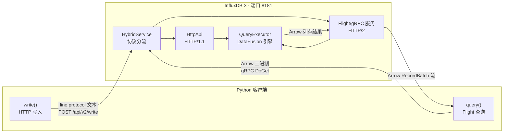
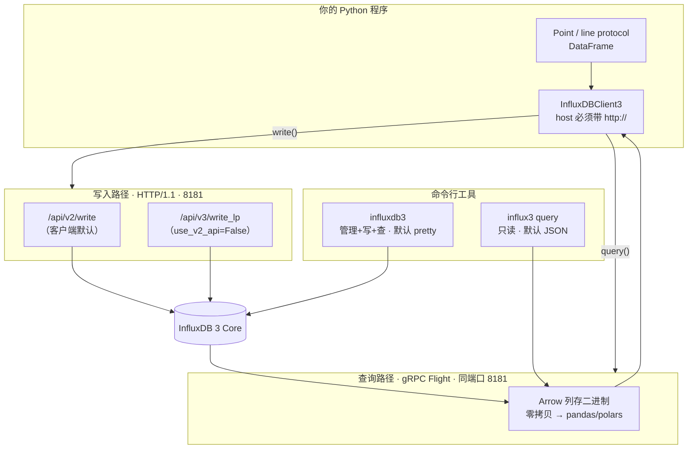

# 第 5 课：Python 客户端与 CLI 工具

> 所属阶段：阶段 2《上手篇》｜ 水平：零基础 ｜ 本课知识点：Python 客户端 `influxdb3-python` / `influx3` CLI / Flight SQL 客户端
> 故事情节：主角「时间」的最后一公里——数据已经躺进数据库了，怎么把它干净地取回你的程序里

## 🎯 本课目标

- 会用 `influxdb3-python` 完成写入与查询，说清**同步 / 批量 / 异步**三种写入模式该怎么选
- 会用 `influx3` CLI 做日常查询与导出（json / jsonl / csv / pretty 四种输出）
- 理解 **Flight SQL 为什么快**，知道什么时候该绕过客户端直接用 Flight
- 避开三个高频坑：**host 不带 scheme 直接崩**、**客户端默认写 V2 端点**、**Windows 查不到根证书**

> 💻 承接第 3 课环境：Docker 容器名 `influxdb3-core`，端口 8181，token 已设进 `INFLUXDB3_AUTH_TOKEN`。
> 📌 本课是**阶段 2 收官课**，课后有一次阶段出口检查。

---

## 第一幕：起源与场景引入

第 3、4 课你一直在用 `curl` 和 `influxdb3` 命令行操作数据库。现在要把它接进真正的业务代码——一个采集服务，每秒上报一次 CPU 使用率。

你很自然地写出了第一段 Python：

```python
from influxdb_client_3 import InfluxDBClient3

client = InfluxDBClient3(
    host="localhost:8181",          # ← 看起来没毛病
    token="apiv3_xxxx",
    database="mydb",
)
client.write("cpu,host=web-01 usage=42.5")
```

**程序连数据库都没连上就崩了**：

```
ArrowInvalid: Cannot parse URI: 'grpc+tcp://localhost:8181:443'
             due to syntax error at character ' ' (position 29)
```

> 🎬 **场景**：报错信息里冒出一个你从没写过的 `:443`，还有一段看不懂的 `grpc+tcp://`。你只是想写一行数据，为什么扯上了 gRPC？
>
> 更让人困惑的是——**你在官方文档的示例代码里，看到的正是 `host="localhost:8181"` 这种写法**（官方 Core 示例确实这么写）。照抄文档却崩了。
>
> 顺着这个报错往下挖，你会碰到 InfluxDB 3 客户端设计里最核心的一个事实：**这个客户端是"双协议"的——写入走 HTTP，查询走 gRPC Flight，而 `host` 这一个参数要同时喂饱两条链路。**

这一课，把「程序怎么跟 InfluxDB 打交道」一次讲透。

---

## 第二幕：认知冲突

你可能会想：**"客户端库不就是封装一下 HTTP 请求吗？能有什么花样。"**

三个反直觉的事实：

**第一 · 一个 host，两条协议**。客户端写入走 HTTP（8181），查询走 gRPC Flight（也是 8181，靠同一个端口上的协议协商区分）。这意味着 `host` 参数必须同时能被 URL 解析器和 gRPC 接受——上面那个崩溃就是两者对 `localhost:8181` 的理解不一致导致的。

**第二 · 官方文档的示例在本地跑不通**。官方 Core 文档示例写 `host="localhost:8181"`，但客户端代码对**不带 scheme** 的 host 会解析出畸形连接串。文档面向的是云端（有 TLS、走 443），本地部署必须写全 `http://`。

**第三 · 客户端默认不走你学过的 V3 端点**。第 4 课你刚学的 `/api/v3/write_lp`，在客户端里**默认是不用的**——`WriteOptions` 的 `use_v2_api` 默认值是 `True`，也就是说客户端默认把数据写到 `/api/v2/write`（v2 兼容端点）。你精心调好的 `no_sync` 在默认配置下还会直接抛异常。

> ❓ **问题**：为什么这么别扭？因为**客户端要同时服务三代用户**——v1、v2、v3 的写法它都得兼容。默认值往往是"对最多人不出错"的选择，而不是"对新用户最合理"的选择。
>
> 这课的活儿，就是把这些默认值一个个揪出来，告诉你该改成什么。

---

## 第三幕：层层揭示

### 知识点 1：Python 客户端 `influxdb3-python`

#### 一句话定义
`influxdb3-python`（导入名 `influxdb_client_3`）是 InfluxData 官方的 Python 客户端，封装了**写入走 HTTP、查询走 Arrow Flight** 的双协议通信，提供 `write` / `query` 两个核心方法。

#### 直觉建立：把它想成「两个快递员」

你（业务代码）和数据库之间有两个快递员：

- **写入快递员走公路（HTTP）**：送的是**文本**（line protocol），一辆小车一件件送，灵活、哪儿都能到，但量大时慢。
- **查询快递员走高铁（gRPC Flight）**：送的是**整柜集装箱**（Arrow 列存二进制），一趟拉一大批，而且**箱子到了仓库不用拆包重装箱**——直接就能上架。

第 4 课你学的 `curl` 写入，就是自己在公路上开车。客户端帮你雇了司机，但**公路还是那条公路**，写入性能没有本质变化。真正的性能差异在**查询**这一侧——这就是知识点 3 的主题。

> ⚠️ **类比失效的边界**：高铁虽快，但**只运货不接单**——Flight 是**只读**的查询通道，不能写入。任何写入都得回到 HTTP。另外高铁需要**专用轨道（HTTP/2）**，中间有不支持 HTTP/2 的代理就跑不起来。

#### 核心原理：客户端的三个构造参数

```python
from influxdb_client_3 import InfluxDBClient3

client = InfluxDBClient3(
    host="http://localhost:8181",   # 必须带 scheme！
    token="apiv3_xxxx",             # 你的 token
    database="mydb",                # 数据库名
)
```

实测的构造函数签名（v0.21.0，本机实跑 `inspect` 获取）：

```
InfluxDBClient3(host=None, org=None, database=None, token=None, auth_scheme=None,
                enable_gzip=False, gzip_threshold=None, write_client_options=None,
                flight_client_options=None, write_port_overwrite=None,
                query_port_overwrite=None, disable_grpc_compression=False,
                point_settings=None, debug=False, **kwargs)
```

`host` / `token` / `database` 三者**缺一即抛异常**（客户端显式检查）。`org` 是云端兼容用的，Core 不需要。

#### 🐞 坑 1（本课头号）：host 必须带 `http://`

这是**本机实测发现**的坑，官方文档示例中未体现。客户端内部这样解析 host：

```python
parsed_url = urllib.parse.urlparse(host)
hostname = parsed_url.hostname if parsed_url.hostname else host
scheme   = parsed_url.scheme if parsed_url.scheme else "https"
port     = parsed_url.port   if parsed_url.port   else 443
```

想想 `host="localhost:8181"` 会发生什么：`urlparse` 把它当成 **scheme 是 `localhost`** 的怪东西，`hostname` 取不到 → 回退成 `host` 原串，于是：

| host 写法 | 解析结果 | 后果 |
|-----------|---------|------|
| `"localhost:8181"` | hostname=`localhost:8181`，port=443 | 连接串 `grpc+tcp://localhost:8181:443` → **构造即抛 ArrowInvalid** |
| `"http://localhost:8181"` | hostname=`localhost`，port=8181 | ✅ `grpc+tcp://localhost:8181` 正常 |
| `"https://localhost:8181"` | hostname=`localhost`，port=8181 | ✅ `grpc+tls://localhost:8181`（需配 TLS） |

实测输出（本机 v0.21.0）：

```
'localhost:8181' CONSTRUCT FAIL ArrowInvalid Cannot parse URI: 'grpc+tcp://localhost:8181:443'
'http://localhost:8181'  ->  OK
```

> 💡 **一句话记住**：**`host` 永远写全 `http://` 或 `https://`**，别信示例里的简写。这是零基础最容易卡住半小时的地方。

#### 写入：三种模式怎么选

客户端支持三种写入模式，由 `WriteOptions(write_type=...)` 指定：

| 模式 | `write_type` | 行为 | 什么时候用 |
|------|-------------|------|-----------|
| **同步** | `WriteType.synchronous` | 阻塞等待响应，**不重试、不缓冲** | 调试、低频写入、想立刻看到报错 |
| **批量**（默认） | `WriteType.batching` | 攒够 `batch_size` 或到 `flush_interval` 才发，失败**自动重试** | 生产主力，高吞吐场景 |
| 异步 | `WriteType.asynchronous` | 线程池后台发送 | ⚠️ **已废弃，不要用** |

实测签名（v0.21.0）：

```
WriteOptions(write_type=WriteType.batching, batch_size=1000, flush_interval=1000,
             jitter_interval=0, retry_interval=5000, max_retries=5,
             max_retry_delay=125000, max_retry_time=180000, exponential_base=2,
             max_close_wait=300000, write_precision='ns', no_sync=False,
             tag_order=None, accept_partial=True, use_v2_api=True,
             timeout=10000, write_scheduler=...)
```

几个关键默认值的**坑点**：

- **`use_v2_api=True`**（默认）→ 数据写往 `/api/v2/write`，**不是**第 4 课学的 `/api/v3/write_lp`
- **`no_sync` 与 `use_v2_api` 互斥**：`no_sync=True` + `use_v2_api=True` 会直接抛 `ValueError: invalid write options: no_sync cannot be used with use_v2_api`
- **`write_precision='ns'`** 默认纳秒（与 CLI 一致，与 HTTP API 的 `auto` 不同）
- **时间单位全是毫秒**：`flush_interval=1000` 是 1000 毫秒，不是 1 毫秒

#### 🐞 坑 2：想用 V3 端点和 `no_sync`，必须关掉 V2 兼容

```python
from influxdb_client_3 import (
    InfluxDBClient3, WriteOptions, WriteType, write_client_options
)

# 目标：走 /api/v3/write_lp 并开启 no_sync（高吞吐、可承受少量丢失）
write_options = WriteOptions(
    write_type=WriteType.synchronous,
    use_v2_api=False,                  # ← 关键：切到 V3 端点
    no_sync=True,                      # ← 此时才允许开启
    write_precision="ms",
)

client = InfluxDBClient3(
    host="http://localhost:8181",
    token="apiv3_xxxx",
    database="mydb",
    write_client_options=write_client_options(write_options=write_options),
)
```

> 💡 如果你的服务端只支持 V3 端点，客户端会把 `405 Method Not Allowed` 翻译成一句很贴心的提示：*"Server doesn't support the V2 API endpoint (/api/v2/write). Set use_v2_api=False to use the V3 API endpoint."* —— **看到 405 先想到这个开关**。

#### 示例演示：四种写入姿势

```python
from influxdb_client_3 import InfluxDBClient3, Point, WriteOptions, write_client_options

client = InfluxDBClient3(
    host="http://localhost:8181",
    token="apiv3_xxxx",
    database="mydb",
)

# ① Point 对象（最常用，类型安全）
point = Point("cpu").tag("host", "web-01").field("usage", 42.5)
client.write(point)

# ② Line protocol 字符串（第 4 课的语法直接可用）
client.write("cpu,host=web-01 usage=42.5 1735545600000", write_precision="ms")

# ③ 批量写 Point 列表
points = [
    Point("cpu").tag("host", f"web-{i:02d}").field("usage", 40.0 + i)
    for i in range(100)
]
client.write(points)

# ④ 直接写 pandas DataFrame（需 pip install pandas）
# client.write_dataframe(df, measurement="cpu", timestamp_column="time", tags=["host"])
```

实测方法清单（v0.21.0）：`write` / `write_file` / `write_dataframe` / `query` / `query_dataframe` / `flush` / `close` / `from_env` / `get_server_version`。

#### 批量模式：一定要配回调

批量模式是**后台异步发送**的，写完不代表成功。不配回调的话，**失败会静默丢失**：

```python
from influxdb_client_3 import (
    InfluxDBClient3, Point, WriteOptions, write_client_options, InfluxDBError
)

def success(self, data: str):
    print(f"✅ 写入成功: {data}")

def error(self, data: str, err: InfluxDBError):
    print(f"❌ 写入失败: {err}")      # ← 生产环境必须告警

def retry(self, data: str, err: InfluxDBError):
    print(f"🔄 重试中: {err}")

write_options = WriteOptions(
    batch_size=500,          # 攒 500 条
    flush_interval=10_000,   # 或 10 秒（毫秒！）
    jitter_interval=2_000,   # 随机抖动，避免多实例同时发
    max_retries=3,
)

wco = write_client_options(
    success_callback=success,
    error_callback=error,
    retry_callback=retry,
    write_options=write_options,
)

with InfluxDBClient3(host="http://localhost:8181", token="apiv3_xxxx",
                     database="mydb", write_client_options=wco) as client:
    for i in range(1000):
        client.write(Point("cpu").tag("host", "web-01").field("usage", 40.0 + i))
    # with 退出时自动 flush + close；不等退出就查，可用 client.flush()
```

> 🐞 **批量模式的隐形陷阱**：数据攒在缓冲区里，**没到 batch_size 也没到 flush_interval 就不会发出去**。如果你写完立刻查询，可能查不到刚写的数据。解决：退出 `with` 块，或显式 `client.flush()`。
> 官方在 0.17.0 专门加了 `flush()` 方法，就是为了让"先确保落盘再查询"这件事可表达。

#### 查询：四种返回形态

```python
# 方式 A：拿 Arrow 表（默认，mode="all"）
table = client.query("SELECT * FROM cpu WHERE time > now() - INTERVAL '1 hour'")
print(table)                    # pyarrow.Table
print(table.select(["host", "usage"]))

# 方式 B：直接转 pandas（需 pip install pandas）
df = table.to_pandas()

# 方式 C：一步到位拿 DataFrame（0.17.0+）
df = client.query_dataframe("SELECT * FROM cpu")                      # pandas
# df = client.query_dataframe("SELECT * FROM cpu", frame_type="polars")  # polars

# 方式 D：流式读取大结果集（避免一次性载入内存）
reader = client.query("SELECT * FROM cpu", mode="reader")
for batch in reader:
    print(batch.num_rows)
```

实测签名（v0.21.0）：

```
query(query: str, language: str = 'sql', mode: str = 'all', database: str = None, **kwargs)
query_dataframe(query, language='sql', database=None, frame_type='pandas'|'polars', **kwargs)
```

`mode` 取值：`all`（Arrow 表，默认）/ `chunk` / `pandas` / `reader` / `schema`。
查 InfluxQL 只需 `language="influxql"`。

> 📌 **术语提醒**：`FROM cpu` 里的 `cpu` 在 InfluxDB 3 官方文档中叫 **table**（第 2 课已说明），老文档叫 measurement。二者指同一个东西。

#### 🐞 坑 3：Windows 查不到根证书

官方 GitHub README 明确写了：**Windows 用户通过 Flight 原生查询需要额外处理**，因为 gRPC 找不到 Windows 根证书。

```python
import certifi
from influxdb_client_3 import InfluxDBClient3, flight_client_options

with open(certifi.where(), "r") as fh:
    cert = fh.read()

client = InfluxDBClient3(
    host="https://your-host:8181",
    token="apiv3_xxxx",
    database="mydb",
    flight_client_options=flight_client_options(tls_root_certs=cert),
)
```

> 💡 本机是 Windows，连 **https** 的远端实例时大概率会撞上这个。连本地 `http://` 则不受影响（不校验证书）。

#### 一句话记住
**`host` 带 scheme、写入看清 V2/V3 端点、批量必配回调——这三件事做对，客户端就稳了。**

📚 官方文档：[Python client library for InfluxDB 3（Core）](https://docs.influxdata.com/influxdb3/core/reference/client-libraries/v3/python/)

---

### 知识点 2：`influx3` CLI

#### 一句话定义
`influx3` 是**随 `influxdb3-python` 一起安装**的命令行工具，定位是「面向读取 / 查询的轻量 CLI」，输出默认 JSON，方便管道处理。

#### 直觉建立：它和 `influxdb3` 不是一个东西

这是最容易混的一组名字，务必分清：

| 工具 | 来源 | 定位 | 能写吗 |
|------|------|------|--------|
| **`influxdb3`** | InfluxDB 服务端自带二进制 | **全能管理工具**：起服务、建库、建 token、写、查 | ✅ 能 |
| **`influx3`** | 随 Python 客户端包安装 | **只读查询工具**：查、导出 | ❌ 只读 |

> 💡 记忆法：**名字长的（`influxdb3`）是干重活的，名字短的（`influx3`）是查数据的**。装了 `influxdb3-python` 才会有 `influx3`——本机实测安装后，`Scripts/` 目录下确实出现了 `influx3.exe`。

#### 核心原理：只有 `query` 一个子命令

实测 `influx3 --help`（v0.21.0）：

```
usage: influx3 [-h] {query,q} ...
```

**就一个 `query`**（别名 `q`）。完整参数实测如下：

```
influx3 query [-h] [-f FILE_PATH] [-H HOST] [-d DATABASE] [--token TOKEN]
              [-l {sql,influxql}] [--format {json,jsonl,csv,pretty}]
              [-o OUTPUT_FILE_PATH] [--query-timeout QUERY_TIMEOUT]
              [query]
```

配置优先级（官方 PyPI 说明，实测一致）：

```
CLI flags  >  INFLUXDB3_* 环境变量  >  旧版 INFLUX_* 环境变量  >  内置默认值
                                                              （host 默认 http://127.0.0.1:8181）
```

相关环境变量：`INFLUXDB3_HOST_URL` / `INFLUXDB3_DATABASE_NAME` / `INFLUXDB3_AUTH_TOKEN`（旧版回退 `INFLUX_HOST` / `INFLUX_DATABASE` / `INFLUX_TOKEN`）。

> 🎯 **这里的 host 与客户端不同**：`influx3` 内置默认 `http://127.0.0.1:8181`，**不带 scheme 也能用**（它不构造 gRPC 连接串）。这正是一个 host 两套规则的体现。

#### 四种输出格式怎么选

| 格式 | 特点 | 用在哪 |
|------|------|--------|
| `json`（**默认**） | 结构化 JSON 数组 | 管道给 `jq` / 程序消费 |
| `jsonl` | 每行一个 JSON | **流式处理大结果**，边收边处理 |
| `csv` | 逗号分隔 | 导进 Excel / pandas |
| `pretty` | 人类可读表格 | 自己看得舒服 |

> ⚠️ **`influx3` 与 `influxdb3` 的格式默认值相反**：`influx3` 默认 **json**（面向程序），`influxdb3 query` 默认 **pretty**（面向人）。第 3 课用的是 `influxdb3`，所以你看到的默认是表格。

#### 示例演示

```bash
# 最简查询（默认 JSON 输出）
influx3 query -d mydb "SELECT * FROM cpu LIMIT 5"

# 人类可读表格
influx3 query -d mydb --format pretty "SELECT * FROM cpu LIMIT 5"

# 导出 CSV 到文件
influx3 query -d mydb --format csv -o cpu.csv "SELECT * FROM cpu"

# 从文件读查询（复杂 SQL 很好用）
influx3 query -d mydb -f ./analysis.sql --format jsonl

# 查 InfluxQL
influx3 query -d mydb -l influxql "SELECT MEAN(usage) FROM cpu GROUP BY host"
```

配合环境变量，日常可以省掉一堆参数：

```powershell
# PowerShell
$env:INFLUXDB3_HOST_URL = "http://localhost:8181"
$env:INFLUXDB3_DATABASE_NAME = "mydb"
$env:INFLUXDB3_AUTH_TOKEN = "apiv3_xxxx"

influx3 query "SELECT * FROM cpu LIMIT 5"        # 极简
influx3 query --format pretty "SELECT * FROM cpu"
```

#### 一句话记住
**`influx3` = 装在 Python 包里的只读查询器，默认吐 JSON，专为管道而生；管理操作请回 `influxdb3`。**

📚 官方文档：[influxdb3-python（PyPI，含 CLI 说明）](https://pypi.org/project/influxdb3-python/)

---

### 知识点 3：Flight SQL 客户端

#### 一句话定义
**Flight SQL** 是构建在 gRPC 之上的查询协议，用 **Arrow 列存二进制**作为传输格式，让查询结果可以**零拷贝**地直接变成 pandas / polars DataFrame。

#### 直觉建立：为什么它比 HTTP 快这么多？

回顾第 4 课：用 HTTP API 查询，数据是 **JSON 文本**。这条路上有两次昂贵转换：

```
数据库内存(Arrow列存) --①序列化成JSON文本--> 网络 --②解析JSON--> Python对象 --> 再转成DataFrame
```

Flight SQL 走的路：

```
数据库内存(Arrow列存) ====原样搬运====> 网络 ====零拷贝====> pandas/polars DataFrame
```

**关键洞察**：数据库内部本来就用 Arrow 存数据（第 2 课讲的 FDAP 架构里的 **A**）。用 HTTP 查，等于把已经打包好的箱子**全部拆散成散件**运过来，你再重新拼——纯属浪费。Flight SQL 直接**连箱子一起运**。

> ⚠️ **类比失效的边界**：零拷贝省的是**传输与解析**开销，**不是查询计算**开销。如果慢的是 SQL 本身（全表扫描、没走分区裁剪），换 Flight 也不会快。另外小结果集（几百行）两者差别可以忽略——**大批量取数才有意义**。

#### 核心原理：端口与协议

InfluxDB 3 的**统一服务架构**：gRPC（Flight）和 HTTP 复用**同一个端口 8181**，服务端根据请求特征分流。



> 📌 **关于 8082**：网上不少文章（含部分社区文档与 DeepWiki 页面）说 Flight 默认端口是 **8082**。那是 **InfluxDB 3 开源社区版（IOx）** 的端口。**官方 InfluxDB 3 Core 的 Flight 服务与 HTTP 共用 8181**（服务端源码中 Flight 与 HttpApi 挂在同一 `TcpListener` 上）。客户端实测也印证了这点——它用 `host` 里解析出的**同一个 port** 构造 `grpc+tcp://host:port`，不存在独立的 flight 端口参数（只有需要改时才用 `query_port_overwrite`）。
> ⏳ **置信度：高**（服务端架构 + 客户端源码双向印证）；若你用的是社区/第三方构建，端口可能不同，以实际部署为准。

#### Flight SQL 的两个硬前提

1. **需要 HTTP/2**：gRPC 基于 HTTP/2。如果中间挂了 **nginx / HAProxy / 负载均衡**，必须确认代理支持 HTTP/2，否则 Flight 连接直接失败。官方文档对此有专门警示（Grafana 配 SQL 数据源时同样要求）。
2. **只能查，不能写**：Flight 是只读通道。写入一律走 HTTP。

#### 三种用法：从推荐到硬核

**① 用官方客户端（推荐，99% 的场景）**

```python
df = client.query_dataframe("SELECT * FROM cpu")   # 内部已经走了 Flight
```

官方客户端**本身就是 Flight 客户端的封装**。用 `InfluxDBClient3.query()` 就等于在用 Flight SQL——你不需要额外装任何东西。

**② 用 `flightsql-dbapi`（做数据库无关代码时）**

```bash
pip install flightsql-dbapi
```

```python
from flightsql import FlightSQLClient

client = FlightSQLClient(
    host="localhost",
    token="apiv3_xxxx",
    metadata={"database": "mydb"},
    features={"metadata-reflection": "true"},
)

info   = client.execute("SELECT * FROM home")
ticket = info.endpoints[0].ticket          # Flight SQL 特有的一步：取票据
reader = client.do_get(ticket)
table  = reader.read_all()                 # pyarrow.Table
df     = table.to_pandas()
```

它提供 DB API 2 接口和 SQLAlchemy 方言，适合**要同时对接多种数据库**的通用工具（比如 BI 平台）。

> ⚠️ **官方态度**：这个库 README 顶部挂着明确警告——*"This library is experimental... influxdb3-python module is the recommended Python API. Use at your own risk."* **生产环境优先用官方客户端**。

**③ 直接用 `pyarrow.flight`（硬核，InfluxDB 专用协议）**

```python
from pyarrow.flight import FlightClient, Ticket, FlightCallOptions
import json

sql = "SELECT * FROM cpu WHERE time > now() - INTERVAL '1 hour'"

ticket = Ticket(json.dumps({
    "namespace_name": "mydb",
    "sql_query": sql,
    "query_type": "sql",
}))

token   = (b"authorization", b"Bearer apiv3_xxxx")
options = FlightCallOptions(headers=[token])

client = FlightClient("grpc+tcp://localhost:8181")
reader = client.do_get(ticket, options)
table  = reader.read_all()
```

> 💡 这条路走的是 **InfluxDB 3 专有的 Flight RPC 协议**（一个 DoGet 里塞进 namespace + sql + query_type），不是标准 Flight SQL。好处是**同时支持 SQL 和 InfluxQL**（标准 Flight SQL 只支持 SQL）。

#### 示例演示：亲手看一次「零拷贝」

```python
from influxdb_client_3 import InfluxDBClient3

client = InfluxDBClient3(
    host="http://localhost:8181",
    token="apiv3_xxxx",
    database="mydb",
)

# 拿到 Arrow 表——数据此刻已经在内存里，且是列式布局
table = client.query("SELECT * FROM cpu WHERE time > now() - INTERVAL '24 hours'")

print(type(table))          # <class 'pyarrow.lib.Table'>
print(table.schema)         # 列名 + 类型（无需任何类型推断）
print(table.num_rows)       # 行数

# 转成 pandas：列存 → 列存，没有逐单元格转换
df = table.to_pandas()

# 也可以交给 polars（同样零拷贝）
import polars as pl
pdf = pl.from_arrow(table)
```

**验证零拷贝**：对比两种方式取同样数据的耗时——

```python
import time

t0 = time.time()
table = client.query("SELECT * FROM cpu")     # Flight：Arrow 直达
t1 = time.time()
df = table.to_pandas()

print(f"Flight 查询 {t1-t0:.3f}s，转 DataFrame {time.time()-t1:.3f}s，共 {len(df)} 行")
```

> ⏳ **本机的诚实说明**：编写环境**没有 Docker**（`docker: command not found`），上面的耗时数字需要你在真实环境跑。判断成功的标准是：**能打印出 `pyarrow.lib.Table` 类型、schema 里 `time` 列类型正确、`num_rows` 与你写入的行数一致**。

#### 一句话记住
**查询走 Flight（Arrow 直达、零拷贝），写入走 HTTP（line protocol 文本）；小结果随意，大批量取数必须走 Flight。**

📚 官方文档：[Apache Arrow Flight RPC clients（InfluxDB 3 Core）](https://docs.influxdata.com/influxdb3/core/reference/client-libraries/flight/)

---

## 第四幕：实操验证

> 💻 承接第 3 课的 Docker 环境。若用 Docker 部署，每条 `influxdb3` / `influx3` 命令前需加 `docker exec -it influxdb3-core`；**Python 脚本在宿主机运行，不需要加**（客户端通过网络连 8181）。

### 实验 A：装环境 + 验证 host 坑（必做）

```powershell
# 1. 建虚拟环境（本机 Python 由 uv 管理，直接 pip 会被 PEP 668 拦下）
python3.11 -m venv .venv-influxdb
.venv-influxdb\Scripts\Activate.ps1

# 2. 装客户端（pandas 可选，想用 to_pandas / query_dataframe 就一起装）
pip install influxdb3-python pandas

# 3. 确认 CLI 可用
influx3 --help
```

> 💡 若 `python3.11` 不在 PATH，用本机实际路径（本档案环境为 `C:\Users\<你>\.local\bin\python3.11.exe`）。虚拟环境只需建一次，后续实验复用。

验证头号坑——**故意写错的写法**：

```python
# bad_host.py
from influxdb_client_3 import InfluxDBClient3

try:
    client = InfluxDBClient3(host="localhost:8181", token="x", database="mydb")
    print("构造成功")
except Exception as e:
    print(f"❌ 构造失败: {type(e).__name__}: {e}")
```

```
预期输出：
❌ 构造失败: ArrowInvalid: Cannot parse URI: 'grpc+tcp://localhost:8181:443' ...
```

改成 `host="http://localhost:8181"` 后应**不再报错**（此时还没连服务端，构造成功即可）。

> ✅ **判断标准**：错误信息里出现 `:443` 这个你没写过的端口 → 确认是 host 缺 scheme 导致。

### 实验 B：写入并查回（端到端）

```python
# demo_write.py
from influxdb_client_3 import InfluxDBClient3, Point, WriteOptions, WriteType, write_client_options
import time

HOST   = "http://localhost:8181"          # 带 scheme！
TOKEN  = "apiv3_你的token"
DB     = "mydb"

# 同步模式：写完立刻能查，便于验证（不重试、不缓冲，报错当场可见）
write_options = WriteOptions(write_type=WriteType.synchronous, write_precision="s")

client = InfluxDBClient3(
    host=HOST,
    token=TOKEN,
    database=DB,
    write_client_options=write_client_options(write_options=write_options),
)

# 用当前时间戳，避开 Core 的 72 小时查询限制（第 3 课）
now = int(time.time())

# ① 写 Point
client.write(Point("cpu").tag("host", "web-01").field("usage", 42.5).time(now))

# ② 写 line protocol
client.write(f"cpu,host=web-02 usage=37.5 {now}", write_precision="s")

# ③ 查回来
table = client.query("SELECT * FROM cpu")
print(table.to_pandas())

client.close()
```

```powershell
python demo_write.py
```

> ✅ **判断成功的三条标准**（⏳ 本机无 Docker，未实测渲染样式，按此判据核对）：
> 1. 输出的 DataFrame 有 **2 行**（web-01、web-02）
> 2. 列包含 `host` / `usage` / `time` 三列
> 3. `usage` 显示为 `42.5` 和 `37.5`（**float**，因为没加 `i` 尾缀——回扣第 4 课）

### 实验 C：三种精度对比（回扣第 4 课）

```python
from influxdb_client_3 import InfluxDBClient3

client = InfluxDBClient3(host="http://localhost:8181", token=TOKEN, database="mydb")

# 同一个数值，三种精度声明 → 落在不同时间点
client.write("test,lbl=s   v=1 1735545600",     write_precision="s")    # 2025-01-01
client.write("test,lbl=ms  v=1 1735545600000",  write_precision="ms")   # 同样是 2025-01-01
client.write("test,lbl=bad v=1 1735545600",     write_precision="ns")   # 1970 年！

df = client.query_dataframe("SELECT * FROM test ORDER BY time")
print(df)
```

> ✅ **判断标准**：`lbl=s` 与 `lbl=ms` 的 `time` **应相同**；`lbl=bad` 应落在 **1970 年**——因为秒级时间戳被当成纳秒解释了。**客户端默认 `write_precision='ns'`，请务必显式声明**（第 4 课的精度陷阱在客户端同样成立，只是参数名叫 `write_precision` 而非 `precision`）。

### 实验 D：influx3 CLI 四种输出

```powershell
$env:INFLUXDB3_HOST_URL = "http://localhost:8181"
$env:INFLUXDB3_DATABASE_NAME = "mydb"
$env:INFLUXDB3_AUTH_TOKEN = "apiv3_xxxx"

influx3 query "SELECT * FROM cpu LIMIT 3"                    # json（默认）
influx3 query --format pretty "SELECT * FROM cpu LIMIT 3"    # 表格
influx3 query --format csv "SELECT * FROM cpu LIMIT 3"       # CSV
influx3 query --format jsonl "SELECT * FROM cpu LIMIT 3"     # JSON Lines
```

> ✅ **判断标准**：四种格式都能出结果；`json` 是数组、`jsonl` 每行一个对象、`csv` 首行是表头、`pretty` 是带框线的表格。

### 实验 E：批量模式 + 回调（生产写法）

```python
# demo_batch.py
from influxdb_client_3 import (
    InfluxDBClient3, Point, WriteOptions, write_client_options, InfluxDBError
)

stats = {"success": 0, "error": 0, "retry": 0}

def success(self, data: str):
    stats["success"] += 1

def error(self, data: str, err: InfluxDBError):
    stats["error"] += 1
    print(f"❌ {err}")

def retry(self, data: str, err: InfluxDBError):
    stats["retry"] += 1

wo = WriteOptions(batch_size=100, flush_interval=5_000, max_retries=3)
wco = write_client_options(
    success_callback=success, error_callback=error, retry_callback=retry,
    write_options=wo,
)

with InfluxDBClient3(host="http://localhost:8181", token=TOKEN,
                     database="mydb", write_client_options=wco) as client:
    for i in range(250):
        client.write(Point("batch_test").tag("host", "web-01").field("v", float(i)))
    # 退出 with 前显式 flush，确保数据发出（不等 flush_interval 到点）
    client.flush()
    # ⚠️ 回调在后台线程执行，flush() 返回时回调可能还没跑完，稍等再读计数
    import time; time.sleep(2)

print(stats)   # 预期 success >= 3（250 条 / batch_size 100 → 100+100+50 三批）
```

> ✅ **判断标准**：`stats["success"]` ≥ 3，`error` 为 0。**若 error 非 0 而你没配回调，这些数据就静默丢了。**
>
> ⚠️ **别被计数迷惑**：回调跑在后台线程，`flush()` 只保证**数据已发出**，不保证**回调已执行完**。所以示例里 `sleep(2)` 再读 `stats`——生产环境应依赖回调里的告警逻辑，而不是轮询计数。

---

## 第五幕：体系收束

### 一图总结



### 三个工具的定位

| 工具 | 装在哪 | 干什么 | 默认输出 |
|------|--------|--------|---------|
| `InfluxDBClient3` | `pip install influxdb3-python` | 程序化读写（**主菜**） | `pyarrow.Table` |
| `influx3` | 同上，附带 | 只读查询、管道导出 | `json` |
| `influxdb3` | 服务端自带 | 起服务、建库、建 token、写、查 | `pretty` |

### 📍 全局定位

```
阶段 1 问题与定位 ── ✅ 已完成（L1-L2）
阶段 2 上手篇     ── ✅ 已完成（L3-L5）  ← 你在这里
阶段 3 数据模型与查询 ── ⬜ 下一站（L6-L9）
```

**阶段 2 你建立了什么**：从零起服务 → 写数据 → 查回来 → 用程序接进业务。四课走完，你已经能独立完成一个最小可用的时序数据闭环。

**阶段 3 要解决什么**：你现在会写了，但**还不会设计**。`usage` 该做 tag 还是 field？`host` 取值有几万个会不会撑爆？这些问题在阶段 3（L6 数据模型 / L7 基数与 schema 设计）回答。

> 🎬 **故事线的下一章**：第一阶段你认下了「行式牢笼 vs 时间洪流」这笔账，第二阶段亲手把数据灌了进去。第三章要问的是——**灌进去的姿势对不对**。阶段 4 会揭示：为什么 InfluxDB 查得快（列存 + 向量化执行，回扣开课时「向量数据库」的那个误解）。

### 🔗 下一步

- **立即可做**：阶段 2 出口检查（下方清单）
- **下一课**：[第 6 课《数据模型：table、tag、field、timestamp》](../../../stages/3-数据模型与查询/lessons/lesson-06-数据模型.md)

### 🎯 落地视角小结

1. **生产环境客户端配置基线**：`host` 一律写全 scheme；批量模式必配 `error_callback`；显式声明 `write_precision`；明确 `use_v2_api` 的取舍（要 `no_sync` 就必须 `False`）。

2. **选型判据：什么时候必须上 Flight**：单次拉取 **> 10 万行**的程序化分析场景，Flight 与 HTTP+JSON 的差距是数量级的（省掉服务端 JSON 编码 + 客户端 JSON 解析两次全量转换）。日常几百行的查询用哪个都行。⏳ 具体倍数随数据分布与网络条件变化，建议用你自己的数据集实测。

3. **架构注意：Flight 需要 HTTP/2**。如果 InfluxDB 前面挂了 nginx / HAProxy / 云负载均衡，**必须确认代理支持 HTTP/2**，否则 SQL 查询直接连不上。这是上生产时最容易漏的一条（Grafana 用 SQL 数据源时同样中招）。

4. **别用 `flightsql-dbapi` 上生产**。它自己挂着 experimental 警告，官方推荐路径是 `influxdb3-python`。只在「要对接 BI 平台 / 写数据库无关代码」时才考虑它。

5. **Core 的 72 小时限制依然存在**（第 3 课）。用客户端查询同样受此约束——查不到 5 天前的数据**不是客户端的 bug**，是 Core 的设计。实验 B 特意用 `time.time()` 写入就是为了避开它。

6. **Windows 用户的额外一步**：连 https 实例时 gRPC 找不到根证书，需要 `pip install certifi` 并通过 `flight_client_options` 传入。本地 `http://` 不受影响。

---

## 🐞 本课误区速查

| # | 误区 | 真相 |
|---|------|------|
| 1 | `host="localhost:8181"` 照抄官方示例就行 | ❌ **构造即崩**。客户端把 `localhost` 当 scheme，拼出 `grpc+tcp://localhost:8181:443`。必须写 `http://localhost:8181`（本机 v0.21.0 实测） |
| 2 | 客户端用的是第 4 课学的 `/api/v3/write_lp` | ❌ 默认 `use_v2_api=True`，写的是 `/api/v2/write`。想用 V3 端点或 `no_sync` 必须显式 `use_v2_api=False` |
| 3 | `no_sync=True` 能提速 | ⚠️ 只有在 `use_v2_api=False` 时才合法，否则抛 `ValueError: no_sync cannot be used with use_v2_api` |
| 4 | 批量模式写完就能查到 | ❌ 数据攒在缓冲区。**退出 `with` 块或显式 `client.flush()`** 才保证发出 |
| 5 | `WriteOptions` 的时间参数是秒 | ❌ 全是**毫秒**。`flush_interval=1000` = 1 秒 |
| 6 | `influx3` 和 `influxdb3` 是同一个命令 | ❌ 前者随 Python 包安装、**只读**、默认 JSON；后者服务端自带、全能、默认 pretty |
| 7 | Flight 默认端口是 8082 | ⚠️ **Core 与 HTTP 共用 8181**（统一服务架构）。8082 见于 3 开源社区版/IOx。以实际部署为准 |
| 8 | 换 Flight 能让慢查询变快 | ❌ Flight 只省**传输与解析**开销。慢在 SQL 本身（全表扫描、无分区裁剪）照样慢 |
| 9 | Flight 也能写数据 | ❌ Flight 是**只读**通道，写入一律走 HTTP |
| 10 | 批量模式失败会抛异常 | ❌ **静默丢失**。必须配 `error_callback` 才知道失败了 |
| 11 | `client.flush()` 返回后就能立刻读到成功计数 | ❌ `flush()` 只保证**数据已发出**，回调跑在后台线程。生产应依赖回调里的告警，别轮询计数 |

---

## 📚 官方文档

| 内容 | 链接 |
|------|------|
| Python 客户端（Core 官方参考） | https://docs.influxdata.com/influxdb3/core/reference/client-libraries/v3/python/ |
| influxdb3-python（PyPI，含 influx3 CLI 说明） | https://pypi.org/project/influxdb3-python/ |
| influxdb3-python 源码与 Windows 证书说明 | https://github.com/InfluxCommunity/influxdb3-python |
| Apache Arrow Flight RPC 客户端（含 HTTP/2 警示） | https://docs.influxdata.com/influxdb3/core/reference/client-libraries/flight/ |
| Python Flight SQL DBAPI 客户端 | https://docs.influxdata.com/influxdb3/core/reference/client-libraries/flight/python-flightsql-dbapi/ |
| `influxdb3 query` CLI 参考 | https://docs.influxdata.com/influxdb3/core/reference/cli/influxdb3/query/ |
| Grafana 配置（SQL 需 HTTP/2） | https://docs.influxdata.com/influxdb3/core/visualize-data/grafana/ |

## 📋 本课速查卡

### 客户端构造

```python
from influxdb_client_3 import InfluxDBClient3

client = InfluxDBClient3(
    host="http://localhost:8181",   # ← 必须带 scheme
    token="apiv3_xxxx",
    database="mydb",
)
```

### 写入

| 想要 | 写法 |
|------|------|
| 写 Point | `client.write(Point("cpu").tag("host","web-01").field("usage",42.5))` |
| 写 line protocol | `client.write("cpu,host=a usage=42.5 1735545600", write_precision="s")` |
| 写 DataFrame | `client.write_dataframe(df, measurement="cpu", timestamp_column="time", tags=["host"])` |
| 从文件写 | `client.write_file(file="data.csv", timestamp_column="time", tag_columns=["host"])` |
| 确保已发出 | `client.flush()` |

### WriteOptions 关键默认值（v0.21.0 实测）

| 参数 | 默认值 | 说明 |
|------|--------|------|
| `write_type` | `batching` | synchronous / batching / asynchronous(废弃) |
| `batch_size` | 1000 | 条数 |
| `flush_interval` | 1000 | **毫秒** |
| `write_precision` | `ns` | 建议显式声明 |
| `use_v2_api` | `True` | 写 `/api/v2/write`；`False` 才走 V3 |
| `no_sync` | `False` | 仅在 `use_v2_api=False` 时可用 |
| `accept_partial` | `True` | 坏行丢弃、好行照收 |
| `max_retries` | 5 | — |
| `timeout` | 10000 | 毫秒 |

### 查询

| 想要 | 写法 |
|------|------|
| Arrow 表（默认） | `client.query("SELECT ...")` |
| pandas | `client.query_dataframe("SELECT ...")` |
| polars | `client.query_dataframe("SELECT ...", frame_type="polars")` |
| 流式 | `client.query("SELECT ...", mode="reader")` |
| InfluxQL | `client.query("SELECT ...", language="influxql")` |

### influx3 CLI

```bash
influx3 query -d mydb "SELECT * FROM cpu LIMIT 5"              # json（默认）
influx3 query -d mydb --format pretty "SELECT ..."             # 表格
influx3 query -d mydb --format csv -o out.csv "SELECT ..."     # 导出
influx3 query -d mydb -f q.sql                                 # 从文件
```

环境变量：`INFLUXDB3_HOST_URL` / `INFLUXDB3_DATABASE_NAME` / `INFLUXDB3_AUTH_TOKEN`

### 端口与协议

| 用途 | 协议 | 端口 |
|------|------|------|
| 写入 | HTTP/1.1 | 8181 |
| 查询 | gRPC Flight（**需 HTTP/2**） | 8181（同端口复用） |

> Flight 端口若为 8082 → 多半是 InfluxDB 3 社区版/IOx，不是 Core。

## 课后小测

**Q1**：你写 `InfluxDBClient3(host="localhost:8181", token="t", database="d")`，程序崩溃并报 `ArrowInvalid: Cannot parse URI: 'grpc+tcp://localhost:8181:443'`。最可能的原因是什么？
- A. 端口 8181 被占用
- B. host 缺少 `http://` scheme，客户端解析出畸形 gRPC 连接串
- C. token 无效
- D. 数据库不存在

<details><summary>答案与解析</summary>

**答案：B**。客户端用 `urllib.parse.urlparse(host)` 解析：`"localhost:8181"` 会被当作 **scheme=`localhost`**，`hostname` 取不到 → 回退为原串 `localhost:8181`，`port` 取不到 → 回退为 **443**。于是拼出 `grpc+tcp://localhost:8181:443` 这个畸形 URI，pyarrow 直接拒绝。**注意报错里的 443 你从没写过**——这是识别此坑的标志。改成 `host="http://localhost:8181"` 即可。A、C、D 都与此报错无关（且此时还没发生任何网络通信，是构造阶段就失败）。

</details>

**Q2**：你想用 `no_sync=True` 提升写入吞吐，代码如下，结果抛 `ValueError: invalid write options: no_sync cannot be used with use_v2_api`。怎么改？
```python
write_options = WriteOptions(write_type=WriteType.synchronous, no_sync=True)
```
- A. 把 `no_sync` 改成 `False`
- B. 加 `use_v2_api=False`
- C. 加 `use_v2_api=True`
- D. 换成批量模式

<details><summary>答案与解析</summary>

**答案：B**。`no_sync` 是 **`/api/v3/write_lp` 端点专属参数**（第 4 课学过），而客户端默认 `use_v2_api=True`（写 `/api/v2/write`），两者互斥，客户端显式校验并抛错。`use_v2_api=False` 后即走 V3 端点，`no_sync` 才合法。A 只是放弃提速；C 正是当前（默认）状态，无效；D 与端点选择无关。

</details>

**Q3**：批量模式下你写了 1000 条数据，`batch_size=1000`，写完立刻查询却查不到。最可能的原因是？
- A. 写入失败了，但你配了回调所以没看到
- B. 数据在缓冲区，未达 batch_size 也未到 flush_interval，尚未发出
- C. Core 的 72 小时限制
- D. Flight 不支持查询

<details><summary>答案与解析</summary>

**答案：B**。批量模式（默认）把数据攒在内存缓冲区，**达到 `batch_size` 或 `flush_interval` 才真正发送**。写完立即查询存在竞态。解决：退出 `with` 块（自动 flush + close），或显式调用 `client.flush()`（0.17.0+ 提供）。A 不成立——配了回调反而会看到失败；C 不影响刚写入的数据（72 小时限制针对的是更老的数据）；D 错误，Flight 正是查询通道。

</details>

**Q4**（多选）：关于 Flight SQL，下列说法正确的有？
- A. 查询结果以 Arrow 列存二进制传输，可零拷贝转 pandas/polars
- B. 它是只读通道，不能写入数据
- C. 它需要 HTTP/2，中间代理不支持会导致连接失败
- D. 换用 Flight 可以让全表扫描的慢 SQL 变快

<details><summary>答案与解析</summary>

**答案：A、B、C**。A 是核心优势（数据库内部本就是 Arrow，省掉序列化/反序列化两次转换）；B 正确，写入一律走 HTTP；C 正确，官方明确警示代理需支持 HTTP/2，Grafana 配 SQL 数据源同样受影响。**D 错误**——Flight 只省**传输与解析**开销，不改变查询本身的执行代价；全表扫描照样慢，那要靠分区裁剪与索引（阶段 4 会讲）。

</details>

## ✅ 阶段 2 出口检查

阶段 2 三课全部完成，对照检查（建议全部打勾再进阶段 3）：

- [ ] 能独立起一个 InfluxDB 3 Core 实例，并说清为什么生产要锁版本标签（`influxdb:3-core`）
- [ ] 能说出 Core 的 **72 小时查询限制**，以及「查不到 ≠ 没写进去」
- [ ] 能徒手写出合法 line protocol，说清**两个未转义空格**的分隔语义
- [ ] 分清 `1`（float）与 `1i`（integer），知道**首次写入锁定列类型**
- [ ] 知道 `accept_partial` 默认 `true` 时 **HTTP 400 ≠ 失败**，需解析 body 的 `data` 类型
- [ ] 能用 Python 客户端写入四种数据形态（Point / line protocol / 列表 / DataFrame）
- [ ] 说出 `host` 必须带 scheme 的原因（grpc 连接串畸形）
- [ ] 知道客户端默认写 **V2 端点**，以及 `no_sync` 需要 `use_v2_api=False`
- [ ] 能用 `influx3` 查数据并切换 json / jsonl / csv / pretty 四种输出
- [ ] 说清 **写入走 HTTP、查询走 Flight** 的双协议结构，以及 Flight 的两个硬前提（HTTP/2、只读）

> 💡 有打不上的勾，回到对应课程补一下——阶段 3 的 schema 设计会假定这些手感已经建立。

## 🚀 下一批接力提示词

> 学完本批后，**复制下面这段文字发给 AI**，即可无缝进入下一批（无需重新描述上下文）：

```
继续学 InfluxDB。我的学习档案在 influxdb/00-学习档案.md，
刚学完阶段 2《上手篇》的第 5 课《Python 客户端与 CLI 工具》，
知识点：Python 客户端 influxdb3-python、influx3 CLI、Flight SQL 客户端。
阶段 2 已全部完成（L3-L5），请按大纲继续讲解阶段 3《数据模型与查询》
的第 6 课《数据模型：table、tag、field、timestamp》
（知识点：table/tag/field/timestamp 四要素、schema-on-write 与类型冲突、命名限制与特殊字符）。
```

## 🧭 课程导航

➡️ **下一课**：第 6 课《数据模型：table、tag、field、timestamp》（阶段 3 第 1 课）
⬅️ **上一课**：[第 4 课《Line Protocol 与写入基本功》](lesson-04-Line-Protocol与写入基本功.md)

📚 **返回目录**：[课程目录](../../../02-课程目录.md) ｜ 🗺️ **路径总览**：[学习路径总览](../../../01-学习路径总览.md) ｜ 📖 **阶段导览**：[阶段 2 概览](../overview.md)
