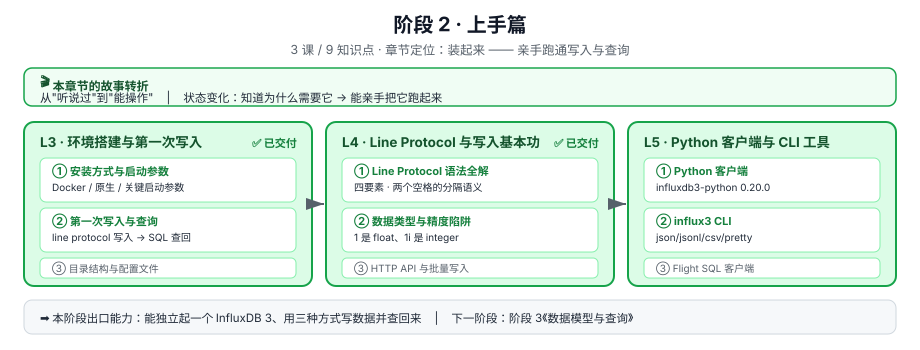

# 阶段 2 · 上手篇

> 所属课程：[InfluxDB 3 系统学习](../02-课程目录.md) ｜ 水平：零基础
> 本阶段：**3 课 / 9 知识点** ｜ 状态：🔄 进行中（2 / 3 课已交付）
> **环境方式：Docker 为主线 + 原生安装备选**（2026-08-31 确定）

## 🎬 本阶段在故事主线中的章节定位

| 章节 | 本阶段任务 | 主角的状态变化 |
|------|-----------|---------------|
| **第二章 · 装起来** | 亲手跑通写入与查询，建立手感 | 知道为什么需要它 → **能操作它** |

**为什么把它放在阶段 3 之前**：schema 设计（阶段 3）里的取舍，比如"这个维度该做 tag 还是 field"，**没有亲手写过数据是体会不到的**。先有手感，再学设计。

## 🎯 阶段目标

学完本阶段，你应该能够：

1. 独立起一个 InfluxDB 3 实例（并知道生产环境该锁定版本标签）
2. 用 Line Protocol 写数据、用 SQL 查回来
3. 避开数据类型与精度陷阱（`1` 是 float、`1i` 是 integer）
4. 用 Python 客户端与 influx3 CLI 完成日常读写

## 📚 必须掌握的知识点

### L3 · 环境搭建与第一次写入 [→ 课件](lessons/lesson-03-环境搭建与第一次写入.md) ✅

| 知识点 | 关键点 |
|--------|--------|
| ① 安装方式与启动参数 | Docker（主线）/ 原生（备选）；`--node-id` / `--object-store` / `--data-dir` / `--plugin-dir` |
| ② 第一次写入与查询 | create token → create database → write → query 四步闭环 |
| ③ 目录结构与配置文件 | data 目录 = WAL + Parquet + catalog 三位一体；端口 8181 是版本指纹 |

> 🚨 **本课的选型级发现**：官方 Core 文档明确 **查询时间范围限制在约 72 小时**（近期与历史皆是）。这比 L2 引用的「3-5 天」更精确，是 **Core 能不能用**的硬判据。已回补至 [L2](../1-问题与定位/lessons/lesson-02-InfluxDB是什么.md)。

### L4 · Line Protocol 与写入基本功 [→ 课件](lessons/lesson-04-Line-Protocol与写入基本功.md) ✅

| 知识点 | 关键点 |
|--------|--------|
| ① Line Protocol 语法全解 | 四要素 + **两个未转义空格**的分隔语义 + 转义规则 |
| ② 数据类型与精度陷阱 | float 默认 / integer 尾缀 `i` / string 必加双引号 / boolean 不加引号；CLI 与 HTTP API 的 precision 命名不同 |
| ③ HTTP API 与批量写入 | `/api/v3/write_lp` 端点、`accept_partial`（默认宽松）、`no_sync`、gzip |

> 🎯 **本课两个最有价值的结论**（评审中经换算验证）：
> ① `accept_partial=true`（默认）时 **HTTP 400 ≠ 失败**——合法行已写入，监控告警不能只看状态码
> ② `auto` 精度检测的三个阈值（5e9 秒 / 5e12 毫秒 / 5e15 微秒）**对齐到同一时刻 2128 年**，常规范围内可靠，真正的坑是小数值与 1970 年前数据

### L5 · Python 客户端与 CLI 工具 ⬜

| 知识点 | 关键点 |
|--------|--------|
| ① Python 客户端 `influxdb3-python` | `InfluxDBClient3` / `Point` / 三种写入模式 |
| ② `influx3` CLI | 输出格式 json / jsonl / csv / pretty |
| ③ Flight SQL 客户端 | 零拷贝取数到 Pandas |

## 🔗 已核实的前置事实

本阶段涉及版本号与 API，均已过事实核查闸门（详见 [学习档案 · 事实核查记录](../00-学习档案.md)）：

| 条目 | 结论 |
|------|------|
| Docker `latest` 标签 | ⚠️ **2026-09-15 起改指 InfluxDB 3 Core**——部署必须锁具体版本（用 `influxdb:3-core`） |
| **Core 查询范围** | 🚨 **限制在约 72 小时**（近期与历史皆受限）——查更早的数据返回空，但数据其实写进去了 |
| **性能数字出处** | <10ms = **LVC**、~30ms = **DVC**，二者**需主动配置**才生效，默认状态达不到 |
| 端口 | HTTP **8181**（3.x）；**8086 = 1.x/2.x**，是版本指纹 |
| token | `create token --admin` **只显示一次、无法找回**；第一个 admin token 即 operator token |
| `influxdb3-python` | 最新 **0.20.0**（2026-06-11）；要求 Python ≥ 3.9（建议 3.11+） |
| Line Protocol 数据类型 | float（默认）/ integer（`i` 尾缀）/ uinteger（`u`）/ string（双引号）/ boolean（不加引号） |

> 📌 **L5 备课待办**：`/api/v3/write_lp` 已核实（L4 用）；**Flight SQL 客户端部分尚未专项核实**，开讲前需补一次。

## 🧭 导航

⬅️ **上一阶段**：[阶段 1《问题与定位》](../1-问题与定位/overview.md) ✅ 已完成
➡️ **下一阶段**：[阶段 3《数据模型与查询》](../3-数据模型与查询/overview.md)
📚 **返回**：[课程目录](../02-课程目录.md) ｜ [学习路径总览](../01-学习路径总览.md)
