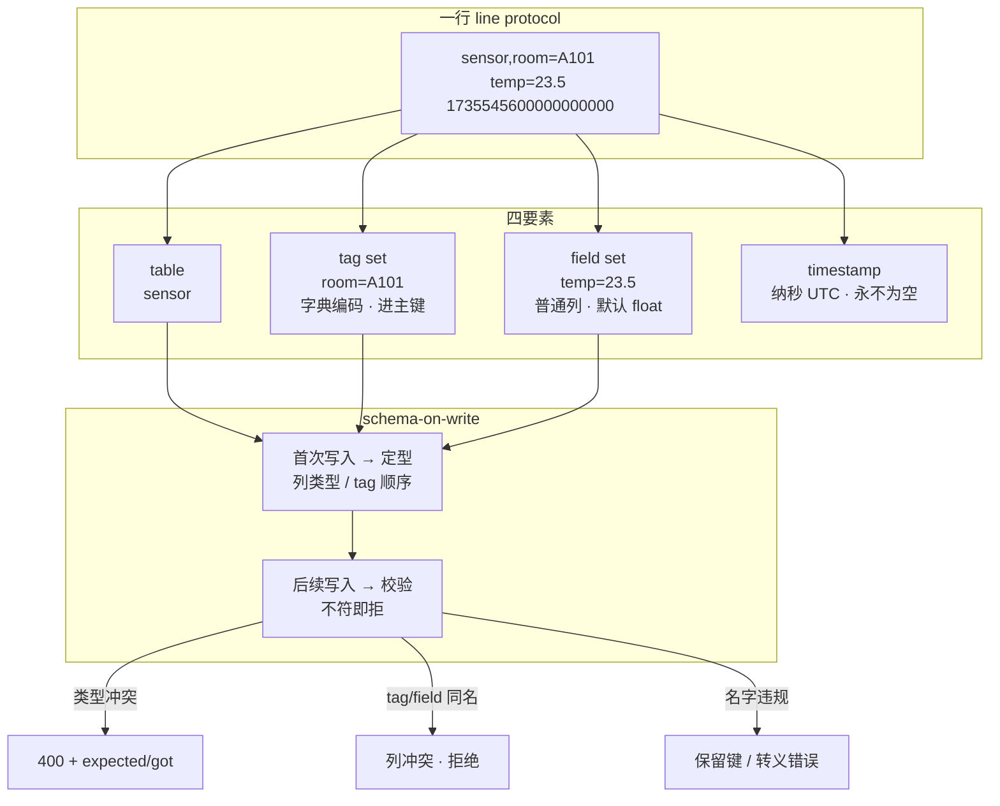

# 第 6 课：数据模型：table、tag、field、timestamp

> 所属阶段：阶段 3《数据模型与查询》｜ 水平：零基础 → 入门 ｜ 本课知识点：四要素 / schema-on-write 与类型冲突 / 命名限制与特殊字符
> 故事情节：第三章开场——你已经能把数据灌进去了，但"灌进去的姿势对不对"，决定了后面是省事还是还债

## 🎯 本课目标

- 说清 **table / tag / field / timestamp** 四要素各自的定位，以及 **主键 = time + tag set** 这条规则
- 理解 **schema-on-write**：没建过表，为什么 schema 却被锁死了；类型冲突怎么解
- 掌握**命名限制与转义规则**，知道哪些名字能写、哪些能查、哪些两者都能
- 避开三个高频坑：**tag 与 field 同名导致列冲突**、**`time` 不能作 tag/field 键**、**line protocol 与 SQL 的大小写规则不同**

> 💻 承接第 3 课环境：Docker 容器名 `influxdb3-core`，端口 8181，token 已设进 `INFLUXDB3_AUTH_TOKEN`。
> 📌 本课是**阶段 3 第 1 课**，也是"从能操作到能用对"的转折点。

---

## 第一幕：起源与场景引入

阶段 2 结束时，一切看起来都很顺利：服务起来了，line protocol 会写了，Python 客户端也接进去了。监控面板上曲线平滑，你想着这事儿算是成了。

然后某天，新版本采集器上线。第二天早上，面板上温度那条线**断了一截**。

你去查写入日志，看到这个：

```json
{
  "error": "partial write of line protocol occurred",
  "data": [
    {
      "original_line": "sensor,room=A101 temp=\"23.5\"",
      "line_number": 1,
      "error_message": "invalid column type for column 'temp', expected iox::column_type::field::float, got iox::column_type::field::string"
    }
  ]
}
```

对比一下新旧采集器的输出：

```
老版本：sensor,room=A101 temp=23.5      ← 没引号，float
新版本：sensor,room=A101 temp="23.5"    ← 多了引号，string
```

> 🎬 **场景**：新同学只是在序列化时顺手加了个引号，整条数据线就断了。更让人不安的是——**你从来没有执行过 `CREATE TABLE`**。
>
> 没有建表语句，哪来的"列类型"？这个 `expected iox::column_type::field::float` 是谁定义的？翻遍代码也找不到建表的地方。
>
> 顺着这个问题往下挖，你会撞上 InfluxDB 数据模型最核心的一条设计：**schema 是"写出来的"，不是"建出来的"——而一旦写出来，就凝固了。**

这一课，把 InfluxDB 的数据模型从根上讲清楚：数据到底是怎么组织的、schema 是什么时候定下来的、名字能怎么起。

---

## 第二幕：认知冲突

你可能会想：**"不就是一张表嘛，字段类型还能改不了？MySQL 里 `ALTER TABLE` 一句话的事。"**

三个反直觉的事实：

**第一 · 你没建过表，但 schema 确实存在且被锁死**。写入第一行数据的那一刻，InfluxDB 就根据这行数据把表的列、类型、主键全部定下来了。之后所有写入都要跟这个 schema 对齐。这不是"可以后续调整"的默认配置，而是引擎的硬行为。

**第二 · tag 和 field 在 line protocol 里只是位置不同，地位却天差地别**。写的时候它们都长成 `key=value`，但落到存储上：tag 进**主键**、用**字典编码**、列定义**不可变**；field 是普通列、随时可以加新的。把某个维度放错位置，代价是数量级的。

**第三 · 同一个名字，写入和查询是两套规则**。line protocol 里 `Host` 和 `host` 是两个不同的 tag key（大小写敏感）；但在 SQL 里不加引号写 `WHERE host = 'x'` 和 `WHERE HOST = 'x'` **是同一个**（未加引号标识符不区分大小写）。名字要同时过"写入安检"和"查询安检"两道关。

> ❓ **问题**：为什么这么别扭？因为 **InfluxDB 3 是一套"时序数据模型"套在"SQL 表模型"上的产物**。line protocol 是时序世界的语法，SQL 是通用世界的语法，两者各自带着自己的规则遗产。
>
> 这课的活儿，就是把这两套规则的边界一条条画清楚。

---

## 第三幕：层层揭示

### 知识点 1：table / tag / field / timestamp 四要素

#### 一句话定义
InfluxDB 3 中**一个数据点（point）由四部分组成**：`table`（表名，原 measurement）、`tag set`（标签集，可选，存元数据）、`field set`（字段集，必需，存测量值）、`timestamp`（时间戳，纳秒精度 UTC）。四者共同构成一张表的一行。

#### 直觉建立：把它想成「档案柜」

想象一个档案柜：

- **table（表）= 一个抽屉**，柜子上贴着"温度记录""CPU 使用率"。同类数据放同一个抽屉。
- **tag（标签）= 卡片侧边贴的彩色标签**，比如"机房=A101""城市=深圳"。它的作用是**让你能一把抽出某一类卡片**——是用来**筛选和分组**的。
- **field（字段）= 卡片上真正记录的数值**，比如"温度=23.5""湿度=60"。它承载着**你要做计算的数据**。
- **timestamp（时间戳）= 卡片的归档序号**，全库按它排序。它**永远有值**，不会为空。

一次观测 = 往某个抽屉里放一张卡片，卡片侧边贴几个标签，正面写几个数值，盖上归档序号。

> ⚠️ **类比失效的边界**：真实档案柜里，侧边标签和正面内容都是纸、都是字，性质相同。但在 InfluxDB 里 **tag 和 field 的存储代价完全不同**——tag 会被字典编码并**进入主键**，field 只是普通列。所以"贴标签"不是免费的，这正是下一课（L7 基数）要展开的核心问题。

#### 核心原理：四要素各自是什么

| 要素 | 必需？ | 存什么 | 数据类型 | 可为 null？ |
|------|--------|--------|----------|------------|
| **table** | ✅ 必需 | 数据表的名字 | 字符串 | — |
| **tag set** | ⬜ 可选 | 元数据 / 标识信息（`host`、`region`） | **仅字符串** | ✅ 允许（null 会被排除出主键） |
| **field set** | ✅ 必需（至少一个） | 被测量的值（温度、耗时、计数） | float / integer / uinteger / string / boolean | ✅ 允许，但**每行至少一个非空** |
| **timestamp** | ⬜ 可选（缺省用服务器 UTC 时间） | 观测发生的时间 | 纳秒精度 Unix 时间戳 | ❌ **永不为 null** |

落到存储引擎，这些要素变成表里的**列**，类型如下（官方 Core get-started 原文）：

| 列的来源 | 存储类型 |
|----------|----------|
| tag | **string dictionary**（字典编码的字符串） |
| field | `int64` / `float64` / `uint64` / `bool` / `string` |
| timestamp | `time`（纳秒精度） |

> 💡 **注意 float 是默认**：`temp=23.5` 是 float，`temp=23` **也还是 float**（回扣 L4）。想存整数必须写 `temp=23i`。

#### 主键：一行数据由什么唯一标识？

这是四要素里最重要的一条规则：

```
主键 = timestamp + tag set
```

也就是说，同一时刻、同一组 tag 值，只能对应一行。**写入相同主键的数据不是"新增一行"，而是覆盖**（准确说是字段集合并、冲突以新值为准）。

两个推论：

1. **tag 值为 null 时不进主键**——`host=`（空值）和"干脆不写 host 这个 tag"会**塌缩成同一行**。
2. **同时间戳下，只要有一个 tag 值不同，就是不同行**。

##### series 是什么？

**series（序列）= 同一个 table + 同一组 tag 键值对 + 同一个 field key**。它是"一条曲线"的意思——比如"机房 A101 的温度"就是一条 series。这个概念在下一课（L7 基数）会成为主角：**tag 取值越多，series 数量就越多，而 series 数是会乘法爆炸的。**

#### 示例演示：一行 line protocol 怎么变成表

```text
sensor,room=A101,city=shenzhen temp=23.5,hum=60 1735545600000000000
└──┬─┘ └────────┬────────────┘ └───────┬──────┘ └─────────┬─────────┘
 table        tag set                field set          timestamp
```

写入几次之后，表里长这样：

| time | room | city | temp | hum |
|------|------|------|------|-----|
| 2025-01-01T00:00:00Z | A101 | shenzhen | 23.5 | 60 |
| 2025-01-01T00:01:00Z | A101 | shenzhen | 23.7 | 61 |
| 2025-01-01T00:02:00Z | B202 | shenzhen | 25.1 | *null* |

注意三点：

- `room` 和 `city` 是 tag，在查询里可以直接 `WHERE room = 'A101'`
- `temp` 和 `hum` 是 field，用来 `AVG(temp)`、`MAX(hum)`
- 第三行没写 `hum`，它就是 null——**不需要为缺失的字段补 0**

> 📌 **术语提醒**：官方文档（尤其新版 get-started）已改用 **table** 指代原 measurement，二者指同一个东西。本课件统一用 table，遇到老文档里的 measurement 直接理解为 table 即可（L2 已说明）。

#### 常见误区

- ❌ "tag 也能存数字" → tag 值**只能是字符串**。`temp=23.5` 想当 tag 用是做不到的。
- ❌ "field 可以用来筛选" → 技术上可以，但 field 值不被索引，过滤要全扫。该当 tag 的维度放了 field，查询会慢一个量级（L7 详述）。
- ❌ "时间戳可以为空" → **永不为 null**；不写就用服务器当前 UTC 时间。

#### 一句话记住
**table 定抽屉、tag 定筛选、field 定计算、timestamp 定排序；一行数据由 `timestamp + tag set` 唯一标识。**

📚 官方文档：[InfluxDB schema design recommendations](https://docs.influxdata.com/influxdb3/cloud-dedicated/write-data/best-practices/schema-design/)

---

### 知识点 2：schema-on-write 与类型冲突

#### 一句话定义
**schema-on-write**：InfluxDB 3 不需要预先建库建表——直接写入，库、表、schema 会自动创建；但 **schema 一旦创建，后续写入就会被校验**，类型不符即拒绝。

#### 直觉建立：把它想成「浇筑混凝土」

写入第一份数据，等于往模具里浇筑混凝土。混凝土凝固之后：

- **已经凝固的那块，形状改不了**——`temp` 被定成 float，以后就只能是 float
- **但可以往旁边加新的模具**——随时可以新增 tag 和 field 列
- **想改形状？只能整体重来**——导出数据 → 换个列名/表 → 重新写入

> ⚠️ **类比失效的边界**：混凝土整体是均匀的一块，哪里强度都一样。但 InfluxDB 里 **tag 列和 field 列的"硬度"不同**——官方文档明确说 **tag 列定义是不可变的（immutable）**，而 field 列至少还能"新增"。另外主键的 tag **顺序**在首次写入时就固定了（按 tag 到达的顺序），这也不是后来能调的。

#### 核心原理：schema 什么时候被创建，之后会怎样

```
首次写入（或显式建表）
    ↓
InfluxDB 解析 line protocol → 确定列名、列类型、tag 顺序
    ↓
写入 catalog（元数据），表正式存在
    ↓
后续所有写入：与 catalog 比对，不符即拒绝
```

关键行为（官方文档原文要点）：

| 行为 | 是否允许 |
|------|----------|
| 直接写入自动创建库 / 表 / schema | ✅ 允许 |
| 表创建后新增 **field** 列 | ✅ 允许 |
| 表创建后新增 **tag** 列 | ✅ 允许 |
| **修改已有列的数据类型** | ❌ **拒绝** |
| **修改 tag 列定义**（含主键 tag 顺序） | ❌ **不可变** |
| **tag 与 field 使用同名** | ❌ **拒绝（列冲突）** |

#### 类型冲突：错误消息长什么样

这就是开场那个报错。官方给出的原文形式：

```
invalid column type for column 'temp', expected iox::column_type::field::float,
got iox::column_type::field::string
```

三个字段要会读：

- `column 'temp'` → 哪一列出问题
- `expected ... float` → **首次写入定下的类型**
- `got ... string` → **你这次写的类型**

> 🔗 **回扣 L4**：`accept_partial` 默认 `true`，所以这个错误**只会拒掉这一行**，同批其他合法行照收，响应是 **400 + `data` 为数组**。所以"面板断了一截"而不是"全断"——这反而帮你缩小了排查范围。

#### 列数上限（Core 硬限制）

| 限制项 | Core 默认值 | 说明 |
|--------|------------|------|
| 数据库数量 | **5** | 跨所有库 |
| 表数量 | **2000** | 跨所有库；单库不限，总数不超即可 |
| **每表列数** | **500** | 1 个 time 列 + 最多 **499** 个 tag/field 列 |

超过列数上限，写入请求失败并返回错误。这是官方给出的"维持性能与稳定的安全上限"，超出会导致 **wide schema（宽表）**，拖慢摄入压实与排序。

> 📊 **不同 SKU 的默认值不一样**（配置核查）：

| SKU | 表上限 | 列上限 |
|-----|--------|--------|
| Core | 2000 | 500 |
| Enterprise | 10000（`--num-table-limit`） | 500（`--num-total-columns-per-table-limit`） |
| Cloud Dedicated | 500（可调） | 250（可调） |
| Cloud Serverless | 500 | 200 |

⏳ **置信度：高**（Core / Enterprise 取自官方 admin 与 config-options 文档；Dedicated / Serverless 取自官方限额页）。**只有 Core 那条与你的本地环境直接相关。**

#### 示例演示：类型冲突的三种解法

假设 `temp` 已被定型为 float，现在必须写入字符串。三条路：

```text
# 方案 A：换列名（最省事，推荐）
sensor,room=A101 temp=23.5,temp_raw="23.5"

# 方案 B：换表（适合整体结构都变了）
sensor_v2,room=A101 temp="23.5"

# 方案 C：导出 → 转换 → 重写（数据量大时成本高，且需要停机或双写）
#   官方 GitHub issue 明确：3.x 的 SQL/InfluxQL 是只读的，
#   不能在库内 CAST 后写回，必须借外部工具
```

> ⚠️ **方案 C 的坑**：InfluxDB 3 的 SQL 与 InfluxQL 实现是**只读**的，你没法写 `UPDATE ... SET temp = CAST(temp AS STRING)`。官方 issue 给出的两条路就是"导出到外部工具再写回"或"存到新列"。**这是从 v1/v2 迁移过来的人最容易撞的墙。**

#### 常见误区

- ❌ "schema-on-write = 随便写、随便改" → 恰恰相反：**自动创建，但创建后即锁死**。
- ❌ "加个字段会影响老数据" → 不会。老行在新列上就是 null，**不需要回填**。
- ❌ "tag 用错了也能改" → tag 列定义 **immutable**，改 tag 结构基本等于重建表。

#### 一句话记住
**第一次写入就是建表语句——列类型一旦定型就改不了，只能加列、换名或换表。**

📚 官方文档：[Use the v3 write_lp API（含 partial write 与类型冲突原文）](https://docs.influxdata.com/influxdb3/core/write-data/http-api/v3-write-lp/)

---

### 知识点 3：命名限制与特殊字符

#### 一句话定义
**命名限制**是 InfluxDB 对 database / table / tag key / field key 等标识符的字符集、长度、大小写与保留字约束；**特殊字符**则需按 line protocol 规则用反斜杠转义，或在查询时用双引号包裹。

#### 直觉建立：两道安检

一个名字要能用，得连过两道安检：

```
你起的名字  →  【第一道：写入安检】line protocol 解析规则（转义、保留键）
            →  【第二道：查询安检】SQL / InfluxQL 标识符规则（引号、大小写、关键字）
```

两道安检的**规则不一样**——这就是为什么有些名字"写进去容易、查出来难"。

> ⚠️ **类比失效的边界**：真实安检两道是同一套标准的重复检查。这里两道是**不同标准**：line protocol 关心"这个字符会不会破坏我对空格和逗号的解析"，SQL 关心"这个名字会不会被当成关键字或大小写折叠"。通过了第一道不代表能通过第二道。

#### 核心原理：各层级的命名规则（Core 官方）

| 层级 | 长度 | 允许字符 | 起始字符 | 大小写 |
|------|------|----------|----------|--------|
| **database** | **最长 64** | 字母数字、`_`、`-`、`/` | 字母或数字（**不推荐 `_` 开头**） | 敏感 |
| **table** | 无明确上限（越短越好） | 字母数字、`_`、`-` | 字母或数字（**不推荐 `_` 开头**） | 敏感 |
| **tag key / field key** | 无明确上限（越短越好） | 字母数字、`_`、`-` | 字母或数字（**不推荐 `_` 开头**） | 敏感 |
| **tag value** | 无明确上限 | **任意 UTF-8** | 任意 | 敏感 |
| **field value（string）** | 无明确上限 | **任意 UTF-8** | 任意 | 敏感 |

**database 名字的反例**（官方原文）：

```
my database     ❌ 含空白
sensor.data     ❌ 含句点
app@server      ❌ 含特殊字符
_internal       ⚠️  下划线开头（不推荐）
```

#### 🚫 保留键：三个绝对不能碰的名字

| 名字 | 规则 |
|------|------|
| **`time`** | ❌ **不能作 tag key 或 field key**，写入被拒；✅ 但**可以**作表名、库名 |
| **`_field`** | ❌ 作 tag 或 field key 时，**该点被丢弃** |
| **`_measurement`** | ❌ 作 tag 或 field key 时，**该点被丢弃** |

另外两个保留**前缀**：

- **`_`**（下划线开头）：可能保留给系统数据库、measurement、field key
- **`iox_`**：保留给 InfluxDB 内部元数据

官方原话（Core 命名限制文档）：*"While InfluxDB might not explicitly reject names starting with underscore, using them risks conflicts with current or future system features and may result in unexpected behavior or data loss."*

> 💡 **一句话**：**别用下划线开头**——它不一定报错，但哪天系统功能占用了这个名字，你的数据可能就出问题了。

#### 转义规则：哪些字符要加反斜杠

line protocol 对空白和逗号极其敏感（L4 学过两个未转义空格的分隔语义），所以这些字符必须转义：

| 位置 | 需转义的字符 |
|------|-------------|
| **measurement（table）** | 逗号 `,`、空格 ` ` |
| **tag key / tag value / field key** | 逗号 `,`、等号 `=`、空格 ` ` |
| **field value（string 类型）** | 双引号 `"`、反斜杠 `\` |

官方示例（写入含特殊字符的点）：

```
"measurement\ with\ quo⚡es\ and\ emoji",tag\ key\ with\ sp🚀ces=tag\,value\,with"commas"
field_k\ey="string field value, only \" need be esc🍭ped"
```

写入后解析结果：table 名是 `measurement with quo⚡es and emoji`，tag key 是 `tag key with sp🚀ces`，tag value 是 `tag,value,with"commas"`，field key 是 `field_k\ey`。

> ⚠️ **注意**：tag value 里的**双引号不需要转义**（只有 string field value 里的才需要）。这个不对称很容易记错。

#### 🐞 大小写：写入和查询是两套规则

这是本知识点最容易踩的坑：

| 场景 | 大小写规则 |
|------|-----------|
| **line protocol 写入**（table / tag key / tag value / field key） | **敏感**——`Host` 和 `host` 是两个 key |
| **SQL 未加引号标识符** | **不敏感**——`SELECT HOST FROM ...` 等价于 `SELECT host FROM ...` |
| **SQL 加双引号标识符** | **敏感**——`"Host"` 与 `"host"` 不同 |
| **InfluxQL 标识符** | **一律敏感** |

再加一条 SQL 规则：**未加引号的标识符必须以字母或下划线开头，且只能含字母、数字、下划线**。所以含 `-` 的名字（如 `http-status`）在 SQL 里**必须加双引号**：

```sql
-- ❌ 会被解析成减法：http - status
SELECT http-status FROM metrics;

-- ✅ 正确
SELECT "http-status" FROM metrics;
```

> 💡 **给零基础的建议**：**命名只用小写字母 + 下划线**（`cpu_usage` 而非 `cpu-usage` 或 `cpuUsage`）。这样两套规则都能过，不用记引号什么时候该加。官方最佳实践也是这么写的。

#### 示例演示：命名自检脚本（本机可跑）

下面的脚本**不需要连数据库**，纯字符串检查，可以在写入前批量筛查你的 tag key / field key 是否合规：

```python
# naming_check.py —— 命名合规自检（纯本地，无需连库）
import re

RESERVED_KEYS = {"time", "_field", "_measurement"}
ALLOWED_KEY = re.compile(r"^[A-Za-z0-9_-]+$")     # 字母数字 + 下划线 + 短横线
ESCAPE_NEEDED = re.compile(r"[,= ]")               # 逗号 / 等号 / 空格需转义

def check_key(kind: str, name: str) -> list:
    """检查一个 tag key 或 field key，返回问题列表（空列表=通过）"""
    problems = []
    if not name:
        return [f"{kind} 为空"]
    if name in RESERVED_KEYS:
        problems.append(f"❌ 保留键 '{name}'：{'time 会被拒绝' if name == 'time' else '该点会被丢弃'}")
    if name.startswith("_"):
        problems.append("⚠️  下划线开头：可能与系统功能冲突，不推荐")
    if name.startswith("iox_"):
        problems.append("❌ 'iox_' 前缀保留给内部元数据")
    if not ALLOWED_KEY.match(name):
        problems.append("⚠️  含非 [A-Za-z0-9_-] 字符，查询时需双引号包裹")
    if not re.match(r"^[A-Za-z0-9]", name):
        problems.append("⚠️  未以字母或数字开头")
    if ESCAPE_NEEDED.search(name):
        problems.append("⚠️  含逗号/等号/空格，写入时必须用反斜杠转义")
    return problems

def check_database(name: str) -> list:
    problems = []
    if len(name) > 64:
        problems.append(f"❌ 超长：{len(name)} 字符，database 上限 64")
    if not re.match(r"^[A-Za-z0-9_/-]+$", name):
        problems.append("❌ 含非法字符，仅允许字母数字、下划线、短横线、正斜杠")
    if name.startswith("_"):
        problems.append("⚠️  下划线开头，不推荐")
    return problems

if __name__ == "__main__":
    samples = [
        ("database", "mydb"), ("database", "prod-metrics"),
        ("database", "my database"), ("database", "sensor.data"),
        ("tag key", "host"), ("tag key", "http-status"),
        ("tag key", "time"), ("tag key", "_internal"),
        ("tag key", "host name"), ("tag key", "iox_meta"),
        ("field key", "temp"), ("field key", "cpu.usage"),
    ]
    for kind, name in samples:
        problems = check_database(name) if kind == "database" else check_key(kind, name)
        status = "✅ 通过" if not problems else "；".join(problems)
        print(f"{kind:10s} {name!r:16s} {status}")
```

**本机实测输出**（Python 3.11 实跑）：

```
database   'mydb'           ✅ 通过
database   'prod-metrics'   ✅ 通过
database   'my database'    ❌ 含非法字符，仅允许字母数字、下划线、短横线、正斜杠
database   'sensor.data'    ❌ 含非法字符，仅允许字母数字、下划线、短横线、正斜杠
tag key    'host'           ✅ 通过
tag key    'http-status'    ✅ 通过
tag key    'time'           ❌ 保留键 'time'：time 会被拒绝
tag key    '_internal'      ⚠️  下划线开头：可能与系统功能冲突，不推荐；⚠️  未以字母或数字开头
tag key    'host name'      ⚠️  含非 [A-Za-z0-9_-] 字符，查询时需双引号包裹；⚠️  含逗号/等号/空格，写入时必须用反斜杠转义
tag key    'iox_meta'       ❌ 'iox_' 前缀保留给内部元数据
field key  'temp'           ✅ 通过
field key  'cpu.usage'      ⚠️  含非 [A-Za-z0-9_-] 字符，查询时需双引号包裹
```

> ✅ **判断标准**：`host` / `temp` / `prod-metrics` 通过；`time` / `iox_meta` 判为非法；`my database` 因含空白被拒。**这份输出是本机 Python 3.11 实跑结果，不是构造的示意。**
>
> 💡 **注意 `_internal` 触发了两条警告**：下划线开头（系统保留前缀风险）+ 未以字母或数字开头。两条说的是同一件事的两面，看到任一条都该改名字。

#### 常见误区

- ❌ "tag value 里的双引号要转义" → 不需要。**只有 string field value 里的双引号和反斜杠要转义**。
- ❌ "给 measurement / tag key 加引号更安全" → 恰恰相反：引号会被**当成名字的一部分**，之后查询得写 `"\"mymeas\""` 这种嵌套引号（L4 已强调）。
- ❌ "SQL 里 `http-status` 能用" → 不加引号会被当成减法表达式。

#### 一句话记住
**命名只用小写字母加下划线，避开 `time`/`_field`/`_measurement` 与下划线开头——这一条能挡掉九成的命名坑。**

📚 官方文档：[Naming restrictions and conventions（Core）](https://docs.influxdata.com/influxdb3/core/reference/naming-restrictions/)

---

## 第四幕：实操验证

> 💻 承接第 3 课环境。若用 Docker 部署，每条 `influxdb3` 命令前需加 `docker exec -it influxdb3-core`。
> ⏳ **本机说明**：编写环境**无 Docker**（`docker: command not found`），下列实验除**实验 E**（纯本地脚本）外均**未实跑**。每条都给了「判断成功的标准」，请按标准核对，不要逐字比对输出样式。

### 实验 A：看一眼 schema 到底长什么样

写入三条数据，然后查看表结构：

```bash
influxdb3 write --database mydb --precision s '
sensor,room=A101,city=shenzhen temp=23.5,hum=60i 1735545600
sensor,room=A101,city=shenzhen temp=23.7,hum=61i 1735545660
sensor,room=B202,city=shenzhen temp=25.1 1735545720
'
```

```bash
influxdb3 query --database mydb \
  "SELECT column_name, data_type FROM information_schema.columns WHERE table_name = 'sensor'"
```

预期能看到（⏳ **未实测**，按此判据核对）：

| column_name | data_type |
|-------------|-----------|
| city | Dictionary(Int32, Utf8) |
| hum | Int64 |
| room | Dictionary(Int32, Utf8) |
| temp | Float64 |
| time | Timestamp(ns) |

> ✅ **判断标准**：① 返回 5 行（`city`/`hum`/`room`/`temp`/`time`）② **`room` 和 `city` 的 `data_type` 是 `Dictionary(...)`**（这就是 tag 的字典编码，是 tag 与 field 在存储层的分界线）③ `temp` 是 `Float64`、`hum` 是 `Int64`（因为写了 `60i`）。
>
> ⏳ **置信度：中**——`information_schema.columns` 这个**具体查询语法来自第三方教程示例**（非 InfluxData 官方文档页面），**未在本机实跑验证**。它依托的是 DataFusion 的标准 `information_schema`，逻辑上成立，但**行名与类型字符串可能与你的版本有出入**。
>
> 🔄 **若查不出来，改走这两条已核实的路径**：
> - InfluxQL：`SHOW TAG KEYS FROM sensor` / `SHOW FIELD KEYS FROM sensor`（官方支持，能区分 tag 与 field）
> - 客户端：`client.query("SELECT * FROM sensor").schema`（打印 Arrow schema，同样能看到字典编码列）
>
> 💡 **这个实验的核心目的不是记住输出长什么样，而是亲眼确认"tag 是 Dictionary、field 是数值类型"这件事**——它是 L7 讲基数时的地基。

### 实验 B：亲手撞一次类型冲突

```bash
# 第一次写入：temp 定型为 float
influxdb3 write --database mydb --precision s 'sensor,room=A101 temp=23.5 1735545600'

# 第二次写入：把 temp 写成字符串 —— 触发冲突
influxdb3 write --database mydb --precision s 'sensor,room=A101 temp="23.5" 1735545900'
```

> ✅ **判断标准**：第二次写入返回 **HTTP 400**，body 里 `error` 为 `partial write of line protocol occurred`，`data` 是**数组**，其中 `error_message` 形如：
> `invalid column type for column 'temp', expected iox::column_type::field::float, got iox::column_type::field::string`
>
> **看到 `expected` 与 `got` 这两个词，就说明是类型冲突，不是语法错误。**

再验证"加列不影响老数据"：

```bash
influxdb3 write --database mydb --precision s 'sensor,room=A101 temp=23.9,co=0i 1735546000'
influxdb3 query --database mydb "SELECT * FROM sensor ORDER BY time"
```

> ✅ **判断标准**：多了 `co` 列，且**前几行的 `co` 是空（null）**——老数据没有被回填，也不需要回填。

### 实验 C：验证 tag 与 field 同名会失败

```bash
influxdb3 write --database mydb --precision s 'conflict,host=a host="b" 1735545600'
```

> ✅ **判断标准**：写入失败（列冲突）。官方 schema design 文档原文：*"If you attempt to write a table that contains tags or fields with the same name, the write fails due to a column conflict."*
> ⚠️ 老版本（1.x）会给其中一个改名成 `location_1` 而不是拒绝——**3.x 是直接失败**，别按老经验判断。

### 实验 D：`time` 作为 tag key 会被拒

```bash
# ❌ time 不能作 tag key
influxdb3 write --database mydb --precision s 'bad,time=morning value=1 1735545600'

# ❌ time 不能作 field key
influxdb3 write --database mydb --precision s 'bad2 value=1,time=2 1735545600'

# ✅ time 可以作表名
influxdb3 write --database mydb --precision s 'time value=1 1735545600'
```

> ✅ **判断标准**：前两条失败；第三条成功（查询时用 `SELECT * FROM "time"`，建议加引号因为 `time` 是关键字）。
> ⏳ **细微差异提示**：1.x 时代官方文档曾记载"写入返回 204 但静默丢弃该 key"。**Core 的 InfluxQL 参考文档明确写的是"rejects writes and returns an error"**。两条路都不该用，但如果你观察到的是"没报错但查不到"，那是前一种行为——**无论哪种，都不要把 `time` 当 tag/field 键**。

### 实验 E：命名自检脚本（本机可跑，无需数据库）

把第三幕的 `naming_check.py` 存下来运行：

```powershell
$env:PYTHONIOENCODING="utf-8"
python naming_check.py
```

> ✅ **判断标准**：输出与课件中「本机实测输出」一致。这个实验**不依赖 Docker**，零基础也能立刻跑通并看到结果。
> 💡 可以把它接进 CI——在采集器上线前批量检查所有 tag/field key，把命名问题挡在写入之前。

---

## 第五幕：体系收束

### 一图总结



### 三句话收束本课

1. **四要素**：table 定抽屉、tag 定筛选、field 定计算、timestamp 定排序；一行由 `time + tag set` 唯一标识。
2. **schema-on-write**：自动创建，但**首次写入即定型**——列类型改不了，只能加列、换名或换表。
3. **命名**：只用小写字母加下划线，避开 `time` / `_field` / `_measurement` 与下划线开头。

### 📍 全局定位

```
阶段 1 问题与定位 ── ✅ 已完成（L1-L2）
阶段 2 上手篇     ── ✅ 已完成（L3-L5）
阶段 3 数据模型与查询 ── 🔄 进行中（L6 已交付）  ← 你在这里
阶段 4 存储引擎与性能 ── ⬜ 下一站（L10-L12）
```

**阶段 2 你建立了什么**：从零起服务 → 写数据 → 查回来 → 程序接入，一个最小可用闭环。

**L6 补上了什么**：你知道了数据是怎么被组织的、schema 是什么时候定死的、名字该怎么起。这三件事**全部发生在写入之前**——它们决定了后面所有查询的成本。

> 🎬 **故事线的下一章**：阶段 2 你把数据灌了进去，L6 告诉你"灌的姿势"会被永久固化。那么下一个问题自然就是——**哪些维度该做成 tag？** 这正是第 7 课的主题：**基数**。官方说 3.x 支持"无限基数"，但**存得下 ≠ 查得快、成本低**。

### 🔗 下一步

- **立即可做**：用实验 E 的自检脚本扫一遍你现有采集器的 tag/field key
- **下一课**：第 7 课《Schema 设计与基数陷阱》——series 数的乘法爆炸、tag vs field 的抉择判据、五种反模式

### 🎯 落地视角小结

1. **把 schema 决策前移到写入之前**。类型冲突的修复成本是"导出→转换→重灌"，远高于事前花十分钟定好类型。**上线前先写几条样本数据把 schema 定下来**，比事后救火便宜得多。

2. **命名规范写进团队约定**：一律小写字母 + 下划线，不用 `-`、不用大小写混合、不用下划线开头。这一条能同时规避 line protocol 转义、SQL 引号、大小写折叠三类问题。**接进 CI 用实验 E 的脚本自动检查**，比靠人 review 可靠。

3. **tag 与 field 的抉择是成本决策，不是语法选择**。tag 进主键、字典编码、列定义不可变；field 是普通列。判断标准很简单：**会不会拿它做 `WHERE` / `GROUP BY`？会 → tag；只做 `AVG` / `MAX` → field**。详细判据与反模式在 L7。

4. **列数上限 500 是设计约束，不是可以随便顶的墙**。超过会写不进去，接近了会拖慢摄入与压实。遇到"字段太多"的正确做法是**拆表**（按设备类型拆），而不是硬塞进一张宽表。Core 只有 2000 个表的额度，拆分前先算一下总数。

5. **Core 只有 5 个数据库的额度**。这不是"建议"，是硬上限。分库策略要按业务域粗粒度划分（如 `prod-metrics` / `dev-logs`），**不要按服务实例、按天、按客户分库**——那样 5 个根本不够。

6. **`time` 作 tag/field 键是必死的坑**。除了 `time`，`_field` 和 `_measurement` 会让整个数据点被**静默丢弃**（连报错都没有）。自检脚本里已经把这三个都判为非法，上线前跑一遍。

---

## 🐞 本课误区速查

| # | 误区 | 真相 |
|---|------|------|
| 1 | 没建过表，所以没有 schema | ❌ **首次写入即创建 schema**，之后写入全被校验 |
| 2 | 列类型可以事后改 | ❌ **改不了**。只能换列名、换表，或导出转换后重灌 |
| 3 | 3.x 的 SQL 可以 `ALTER TABLE` 改类型 | ❌ **SQL 与 InfluxQL 都是只读的**，不能 CAST 后写回 |
| 4 | 新增字段要回填老数据 | ❌ 不需要，老行在新列上就是 **null** |
| 5 | tag 和 field 只是位置不同，性质一样 | ❌ tag **进主键 + 字典编码 + 列定义不可变**；field 是普通列 |
| 6 | tag 值可以存数字 | ❌ **tag 值只能是字符串** |
| 7 | tag 值为空和"不写这个 tag"是两回事 | ❌ **塌缩成同一行**（null tag 不进主键） |
| 8 | `time` 可以当 tag key | ❌ **被拒绝**；`_field` / `_measurement` 会导致**整个点被静默丢弃** |
| 9 | line protocol 和 SQL 的大小写规则一致 | ❌ **写入敏感**；SQL **未加引号不敏感，加引号才敏感**；InfluxQL 一律敏感 |
| 10 | `http-status` 在 SQL 里能直接用 | ❌ 不加引号会被当减法。含 `-` 的名字**必须加双引号** |
| 11 | tag value 里的双引号要转义 | ❌ 不需要。只有 **string field value** 里的 `"` 和 `\` 要转义 |
| 12 | 给 measurement 加引号更安全 | ❌ 引号会变成**名字的一部分**，查询时要写嵌套引号 |
| 13 | 列数上限可以随便逼近 | ❌ Core 每表 500 列，接近会拖慢摄入与压实；超了直接写入失败 |

---

## 📚 官方文档

| 内容 | 链接 |
|------|------|
| Schema design recommendations（四要素 / 主键 / tag vs field） | https://docs.influxdata.com/influxdb3/cloud-dedicated/write-data/best-practices/schema-design/ |
| Naming restrictions and conventions（Core） | https://docs.influxdata.com/influxdb3/core/reference/naming-restrictions/ |
| Manage databases（Core 库/表/列上限） | https://docs.influxdata.com/influxdb3/core/admin/databases |
| v3 write_lp API（类型冲突与 partial write 原文） | https://docs.influxdata.com/influxdb3/core/write-data/http-api/v3-write-lp/ |
| Line protocol 参考（转义 / 保留键 / 引号） | https://docs.influxdata.com/influxdb3/core/reference/syntax/line-protocol/ |
| InfluxQL reference（Core，含 `time` 保留规则） | https://docs.influxdata.com/influxdb3/core/reference/influxql |
| Enterprise config options（表/列上限可调项） | https://docs.influxdata.com/influxdb3/enterprise/reference/config-options/ |

## 📋 本课速查卡

### 四要素

| 要素 | 必需 | 类型 | 作用 |
|------|------|------|------|
| table | ✅ | string | 数据分组（原 measurement） |
| tag set | ⬜ | **仅 string** | 筛选 / 分组（进主键、字典编码） |
| field set | ✅（≥1） | float / integer / uinteger / string / bool | 计算（普通列，**默认 float**） |
| timestamp | ⬜ | 纳秒 Unix 时间戳 | 排序（**永不为空**） |

**主键 = timestamp + tag set**（null tag 不进主键）

### 存储列类型

| 来源 | 类型 |
|------|------|
| tag | `Dictionary(Int32, Utf8)` |
| field | `Int64` / `Float64` / `UInt64` / `Boolean` / `Utf8` |
| time | `Timestamp(ns)` |

### schema-on-write 能做什么

| 操作 | 结果 |
|------|------|
| 直接写入自动建库/表/schema | ✅ |
| 新增 field 列 | ✅ |
| 新增 tag 列 | ✅ |
| 改列类型 | ❌ 拒绝 |
| 改 tag 列定义 / 主键 tag 顺序 | ❌ 不可变 |
| tag 与 field 同名 | ❌ 列冲突 |

### Core 硬限制

| 项 | 上限 |
|----|------|
| 数据库 | **5** |
| 表（跨所有库） | **2000** |
| 每表列数 | **500**（1 个 time + 499） |

### 保留名（绝对不用）

```
time          → 作 tag/field key 被拒（可作表名）
_field        → 该点被静默丢弃
_measurement  → 该点被静默丢弃
_ 开头        → 系统保留，不推荐
iox_ 前缀     → 内部元数据保留
```

### 转义规则

| 位置 | 需转义 |
|------|--------|
| measurement | `,` 空格 |
| tag key / tag value / field key | `,` `=` 空格 |
| field value（string） | `"` `\` |

### 大小写规则

| 场景 | 规则 |
|------|------|
| line protocol 写入 | **敏感** |
| SQL 未加引号 | **不敏感** |
| SQL 加 `"..."` | **敏感** |
| InfluxQL | **一律敏感** |

### 类型冲突错误消息读法

```
invalid column type for column 'temp', expected iox::column_type::field::float, got ...string
                            ↑列名            ↑首次写入定下的类型            ↑你这次写的类型
```

## 课后小测

**Q1**：你写入 `sensor,room=A101 temp=23.5 1735545600` 成功后，再写 `sensor,room=A101 temp="23.5"` 失败并报 `expected iox::column_type::field::float, got iox::column_type::field::string`。最可能的原因是？
- A. `room` 这个 tag 不存在
- B. 时间戳精度不对
- C. `temp` 列在首次写入时被定型为 float，后续写入 string 会被拒绝
- D. `accept_partial` 设置为 `false`

<details><summary>答案与解析</summary>

**答案：C**。这就是 schema-on-write 的核心行为——**首次写入定型列类型，之后类型不符即拒绝**。注意 `temp=23.5` 没加 `i` 后缀，是 **float**（回扣 L4）；加了双引号的 `temp="23.5"` 是 **string**，两者冲突。A、B 都与报错信息无关。D 不准确：`accept_partial` 只决定"同批其他合法行是否保留"，不影响这一行被拒的事实。

</details>

**Q2**：关于主键，下列说法正确的是？
- A. 主键 = timestamp + field set
- B. 主键 = timestamp + tag set，且 tag 值为 null 时不进主键
- C. 主键只由 timestamp 构成
- D. 主键包含 field key

<details><summary>答案与解析</summary>

**答案：B**。官方文档明确：*"the primary key for a row is the combination of the point's timestamp and tag set"*，且 *"A row's primary key tag set does not include tags with null values"* —— 所以 `host=`（空值）和"干脆不写 host"会**塌缩成同一行**，这是很隐蔽的坑。D 是干扰项：field key 属于 **series** 的定义（table + tag set + field key），但**不进主键**。

</details>

**Q3**（多选）：以下哪些命名应该避免？
- A. 用 `time` 作 tag key
- B. 用 `_internal` 作表名
- C. 用 `cpu_usage` 作 field key
- D. 用 `iox_meta` 作 tag key

<details><summary>答案与解析</summary>

**答案：A、B、D**。A：`time` **不能**作 tag key 或 field key，写入被拒（但可以作表名）。B：下划线开头属于系统保留前缀，官方文档警告可能"导致意外行为或数据丢失"。D：`iox_` 明确保留给内部元数据。**C 是正确做法**——小写字母 + 下划线，是官方推荐风格。

</details>

**Q4**：你在 SQL 里执行 `SELECT http-status FROM metrics` 报错。最可能的原因是？
- A. 列名不存在
- B. `http-status` 未加引号，被解析成了减法表达式 `http - status`
- C. SQL 不支持 SELECT
- D. 表名要加引号

<details><summary>答案与解析</summary>

**答案：B**。SQL 里**未加引号的标识符只能含字母、数字、下划线**。含 `-` 的名字必须写成 `SELECT "http-status" FROM metrics`。这也正是官方建议"用 `cpu_usage` 而不是 `cpu-usage`"的原因——**命名只用小写字母加下划线，就不用记什么时候该加引号**。A 有迷惑性：列名其实是存在的，只是被当成了表达式。

</details>

## 🚀 下一批接力提示词

> 学完本批后，**复制下面这段文字发给 AI**，即可无缝进入下一批（无需重新描述上下文）：

```
继续学 InfluxDB。我的学习档案在 influxdb/00-学习档案.md，
刚学完阶段 3《数据模型与查询》的第 6 课《数据模型：table、tag、field、timestamp》，
知识点：table/tag/field/timestamp 四要素、schema-on-write 与类型冲突、命名限制与特殊字符。
请按大纲继续讲解第 7 课《Schema 设计与基数陷阱》
（知识点：基数（cardinality）本质、tag vs field 的抉择、schema 设计反模式）。
```

## 🧭 课程导航

➡️ **下一课**：第 7 课《Schema 设计与基数陷阱》
⬅️ **上一课**：[第 5 课《Python 客户端与 CLI 工具》](../../2-上手篇/lessons/lesson-05-Python客户端与CLI工具.md)

📚 **返回目录**：[课程目录](../../../02-课程目录.md) ｜ 🗺️ **路径总览**：[学习路径总览](../../../01-学习路径总览.md) ｜ 📖 **阶段导览**：[阶段 3 概览](../overview.md)
