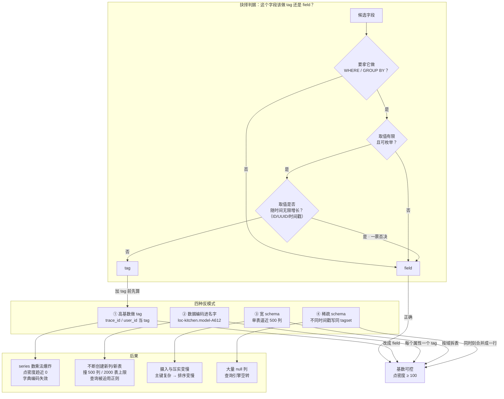

# 第 7 课：Schema 设计与基数陷阱

> 所属阶段：阶段 3《数据模型与查询》｜ 水平：零基础 → 入门 ｜ 本课知识点：基数（cardinality）本质 / tag vs field 的抉择 / schema 设计反模式
> 故事情节：第三章第二幕——你已经知道 schema 会被永久固化，那么"哪些维度该固化成 tag"，就成了会陪你很多年的决定

## 🎯 本课目标

- 说清**基数（cardinality）**是什么：不是"数据量大"，而是**各 tag 取值数的乘积**
- 掌握 **tag vs field 的抉择判据**：过滤/分组用 tag，计算用 field；放错的代价是数量级的
- 识别**四种 schema 设计反模式**，并知道每一种该怎么改
- 理解官方"**无限基数**"的真实含义：**能存下 ≠ 查得快、成本低**

> 💻 承接第 3 课环境：Docker 容器名 `influxdb3-core`，端口 8181，token 已设进 `INFLUXDB3_AUTH_TOKEN`。
> 🔗 **回扣 L2 误区 4**：*"Infinite cardinality 意味着我可以随便设计 tag"*——本课就是那条误区的完整展开。

---

## 第一幕：起源与场景引入

L6 讲完，你学会了一条硬规则：**tag 进主键，一旦写入就定型，改不了**。

于是你按官方文档的建议老老实实设计。线上有个接口延迟监控，`region`、`host`、`status`、`method` 四个维度都拿来做筛选和分组，全都设成 tag：

```
api_latency,region=cn-south,host=web-01,status=200,method=GET latency=23.4 1735545600
```

跑了一个月，一切正常。300 万条数据，查询秒回。

后来为了排查一次线上超时，你加了 `trace_id`——想着"按 trace_id 一查就能看到整条链路"，顺手也做成了 tag：

```
api_latency,region=cn-south,host=web-01,status=200,method=GET,trace_id=a1b2c3d4... latency=23.4 1735545600
```

改动很小，对吧？只是多加了一个字段。

然后事情开始不对劲：**写入延迟从 5ms 涨到 90ms，磁盘一天涨 40GB，Grafana 上"最近 5 分钟 P99"的查询从 200ms 变成超时。**

你去查数据总量——**和以前一模一样，每天还是 10 万条点。**

> 🎬 **场景**：数据量没变、代码只改了一行、查询写的是同一条 SQL，但整个库慢了十几倍。
>
> 更诡异的是，你去翻官方文档，InfluxDB 3 首页明明白白写着 **"supports billions of series with no cardinality limits"**（支持数十亿 series，无基数限制）。官方都说没限制了，怎么还崩了？

这一课要解决的，正是这个矛盾。

---

## 第二幕：认知冲突

你可能会想：**"官方说支持无限基数，那基数肯定不是问题了，慢肯定是别的原因。"**

三个反直觉的事实：

**第一 · "无限基数"说的是"不会崩"，不是说"不要钱"**。官方原文是 *"The InfluxDB 3 storage engine supports infinite tag value and series cardinality... tag value cardinality doesn't affect the overall performance of your database"*（存储引擎支持无限 tag 值与 series 基数，tag 值基数**不影响数据库的整体性能**）。这句话的真实含义是：**不会像 1.x/2.x 那样因为内存索引膨胀而 OOM 崩溃**。它保证的是"能存下"，不是"存得便宜、查得快"。

**第二 · 真正拖垮你的不是"series 总数"，而是"每个 series 有多少个点"**。InfluxDB 3 是列存 + 字典编码，压缩收益来自**同一列里重复的值**。当一个 series 只有一个点，字典编码就彻底失效了。同样是 300 万个点，装进 3,000 个 series 和装进 3 亿个 series，存储与查询代价天差地别——**点数一样，命运完全不同**。

**第三 · 3.x 官方其实删掉了 1.x 那句"tag 有索引"的老说法**。1.x 文档说"tag values are indexed and field values are not"（tag 值被索引，field 值不被索引）；而 3.x Core 的 schema design 页面**从头到尾一次都没提"索引"这个词**（本机抓取官方页面正文核实，「索引」与 `index` 出现 **0 次**）。因为 3.x 压根不用倒排索引——它靠 Parquet 文件的 min/max 统计做分区裁剪。**这意味着"tag 快、field 慢"的老经验在 3.x 里需要重新理解。**

> 🔎 **证据强度说明（别把两件事混为一谈）**：
> - **Core 版** = 官方**未提及**索引 → 是**推断**：既然全文不讲索引，说明索引不再是它的加速机制。
> - **Clustered / Enterprise 版** = 官方**明文**说 *"It doesn't index tag values or field values"*（不索引 tag 值或 field 值）→ 是**直接证据**。
>
> 两者方向一致，但**证据等级不同**。本课程基于 Core，引用时按"推断"处理；只有 Clustered 那句是可直接引用的原文。

> ❓ **问题**：那 tag 和 field 到底还该怎么选？既然 tag 不再有索引加成，是不是随便选都行了？
>
> 恰恰相反——**正因为不再有索引兜底，设计才更关键**。这一课把"为什么"和"怎么选"一次讲清。

---

## 第三幕：层层揭示

### 知识点 1：基数（cardinality）本质

#### 一句话定义
**基数（cardinality）= 数据库中唯一 series 的数量**。而一个 series 由 `table + tag set + field key` 唯一确定，所以 series 数约等于**各 tag 取值数的乘积**。

#### 直觉建立：把它想成「衣柜的格子」

想象你在整理衣柜：

- **一个 tag = 一种分类维度**。按「季节」分是 4 格，按「颜色」分是 8 格。
- **每加一种分类维度，格子数是乘法，不是加法**。季节（4）× 颜色（8）= 32 格。
- **再加「款式」（10 种）**，就变成 4 × 8 × 10 = **320 格**。

现在关键问题来了：**你的衣服数量是固定的**（假设 100 件）。

- 分成 32 格 → 每格平均 3 件，整整齐齐，找起来很快。
- 分成 320 格 → 每格平均 **0.3 件**，大部分格子是空的。找一件衣服要在 320 个格子间翻来翻去。

**衣服没变多，格子变多了，整理和查找的代价就爆炸了。**

这就是基数陷阱的本质：**你加的每个 tag 维度，都是在给衣柜做乘法；而你的数据点数量，并不会因为多打了标签而变多。**

> ⚠️ **类比失效的边界**：真实衣柜里，空格子不占地方。但在 InfluxDB 里，**空 series 也占元数据**：每个 series 都进主键、都要在 Parquet 里留字典条目。所以"多分几格没关系"这个生活直觉在这里是错的。

#### 核心原理：三个容易搞混的定义

L6 已经出现过这三个概念，这里把它们的关系彻底钉死：

| 概念 | 定义 | 是否进主键 |
|------|------|-----------|
| **主键（primary key）** | `timestamp` + `tag set` | — |
| **series** | `table` + `tag set` + `field key` | field key **不进主键**，但**进 series 定义** |
| **series cardinality** | 唯一 `measurement + tag set + field key` 组合的总数 | — |

官方词汇表（Glossary）对 series cardinality 的定义原文：

> *"The number of unique measurement, tag set, and field key combinations in an InfluxDB 3 Core database."*

官方给的例子：一个表有两个 tag key，`email`（3 个取值）和 `status`（2 个取值），则 series cardinality = **3 × 2 = 6**。

注意这个定义的细节：**field key 也算进去了**。所以严格说，series 数 = tag 取值组合数 × field key 数。日常估算时 field 数通常很小且固定，大家习惯只算 tag 的乘积——但你要知道完整公式。

#### 示例演示：亲手算一次乘法

`api_latency` 这张表，四个 tag：

| tag | 取值数 | 是否随时间增长 |
|-----|-------|--------------|
| `region` | 3 | 否 |
| `host` | 50 | 否（集群规模固定） |
| `status` | 5 | 否 |
| `method` | 4 | 否 |

series 数 = 3 × 50 × 5 × 4 = **3,000**

每天 10 万个点，30 天 = 300 万个点。
**点密度 = 3,000,000 ÷ 3,000 = 1,000 点/series** —— 健康。

现在加上 `trace_id`，每天 10 万个不同的 trace：

series 数 = 3 × 50 × 5 × 4 × 100,000 = **3 亿**

点数还是 300 万。
**点密度 = 3,000,000 ÷ 300,000,000 = 0.01 点/series** —— 也就是说，**平均 100 个 series 才摊到 1 个数据点**。

**这就是第一幕那个"只改了一行，慢了十几倍"的完整解释。数据一行没多，series 多了十万倍。**

#### 常见误区：依赖 tag（dependent tags）

不是所有 tag 都参与乘法。官方词汇表专门给了这个概念：

> *"Dependent tags are scoped by another tag and do not increase series cardinality."*
> （依赖 tag 被另一个 tag 所限定，不增加 series 基数。）

官方例子：加上 `firstname` 这个 tag 后，基数**不是** 3 × 2 × 3 = 18，而是**仍然是 6**——因为 `firstname` 完全由 `email` 决定（`lorr@influxdata.com` 永远是 `lorraine`）。

```
email                 status    firstname
lorr@influxdata.com   start     lorraine     ← firstname 被 email 决定
lorr@influxdata.com   finish    lorraine
marv@influxdata.com   start     marvin
marv@influxdata.com   finish    marvin
cliff@influxdata.com  start     clifford
cliff@influxdata.com  finish    clifford

基数 = 3 email × 2 status = 6（firstname 不参与乘法）
```

**估算基数时，先把依赖 tag 剔掉再相乘**，否则会严重高估。

#### 一句话记住
**基数是乘法不是加法；加一个 tag，series 数乘以它的取值数。而你的数据点数是固定的——每个 series 分到的点越少，压缩越失效。**

---

### 知识点 2：tag vs field 的抉择

#### 一句话定义
**tag 存"你要按它筛、按它分组"的元数据（只能是字符串）；field 存"你要拿它算"的测量值（支持五种类型）。判据只有一条：会不会进 `WHERE` / `GROUP BY`。**

#### 直觉建立：把它想成「书的目录 vs 正文」

一本书有两个部分：

- **目录/索引条目（tag）**：章节名、作者、分类。你**先按它定位**——"我要找第 3 章"。它的特点是**取值有限、重复出现**。
- **正文内容（field）**：具体的句子、数字。你**找到之后再读它、分析它**——"这一段讲了什么"。它的特点是**每处都不同**。

把一句话做成目录条目是荒谬的（目录会比书还厚）；把一个章节名塞进正文也是荒谬的（你永远找不到它）。

> ⚠️ **类比失效的边界**：书的目录是人为抽取的，抽错了改一下就行。InfluxDB 里**这个选择一旦写入就不可改**（L6 的 schema-on-write + tag 列定义 immutable）。所以这不是"排版偏好"，是**不可逆的结构决策**。

#### 核心原理：3.x 里 tag 的价值到底在哪

先纠正一个"1.x 老经验"：

| 说法 | 1.x / 2.x（TSM 引擎） | 3.x（FDAP 引擎） |
|------|---------------------|-----------------|
| tag 值是否被索引 | ✅ 官方明说 *"Tag values are indexed and field values are not"* | ❌ **官方 Core 页面全文未提索引**（本机核实 0 次） |
| 高基数后果 | **内存索引膨胀 → OOM 崩溃** | **不会崩溃**，但存储与查询成本上升 |
| 查询加速机制 | 倒排索引定位 series | **Parquet min/max 统计 → 分区裁剪**（L11 详讲） |

**Clustered / Enterprise 版文档**说得更直接：

> *"InfluxDB Clustered indexes tag keys, field keys, and other metadata to optimize performance. **It doesn't index tag values or field values.**"*
> （索引 tag key、field key 等元数据，**不索引 tag 值或 field 值**。）

⏳ **置信度：中**（该句出自 Clustered 版页面；Core 版页面未收录这句，但同样未提"tag 值有索引"，方向一致）

那么问题来了：**既然 tag 也不被索引了，为什么还要用 tag？**

> 🎯 **先给结论，再讲理由**：**照旧用 tag，而且判据没变**——要筛、要分组、取值有限 → tag。变化的是**理由**：1.x 用 tag 是为了"走索引快"，3.x 用 tag 是为了"语义正确 + 进主键 + 列存裁剪友好"。而**限制条件**也从"索引会膨胀"变成了"基数会做乘法"。

三个仍然成立的理由：

1. **语义与类型约束**。tag 只存字符串、值可枚举，天然适合维度。官方准则原文：*"Use tags to store metadata, or identifying information, about the source or context of the data. Use fields to store measured values."*

2. **它是主键的一部分**。同 `time + tag set` 的重复写入会合并（虽然官方提醒这**不可靠**地用于维护 last-value 视图），这是 field 做不到的。

3. **查询写法更简单、更易被优化**。`WHERE host = 'web-01'` 走的是列裁剪；而 field 上做 `WHERE` 需要扫值。

**但最关键的一条是反过来的约束**：tag 的**成本**不在索引，而在基数。所以抉择的核心变成了——**这个维度值不值得为它承担乘法代价？**

#### 示例演示：抉择判据表

对每个候选字段，问三个问题：

| 问题 | 答"是" → 倾向 tag | 答"否" → 倾向 field |
|------|------------------|-------------------|
| 会不会拿它做 `WHERE` 过滤？ | tag | field |
| 会不会拿它做 `GROUP BY` 分组？ | tag | field |
| 取值是否有限、可枚举、重复出现？ | tag | field |
| 是否要对它做 `AVG` / `MAX` / `SUM`？ | field | — |
| 是否是数值型测量值？ | field | — |
| 取值是否**随时间无限增长**（ID、UUID、时间戳）？ | **绝对不做 tag** | field |

判据的**优先级**：最后一条是一票否决。

#### 常见误区

**误区 A**：*"我需要按 trace_id 查，那它就必须是 tag。"*
❌ 错。需要按某维度查询，不等于它必须是 tag。**正确的做法是：把它写成 field，查询时用 `WHERE trace_id = 'xxx'`**——3.x 不索引 tag 值，所以 field 上的等值过滤在扫描代价上并不比 tag 差多少。而把它做成 tag 的代价是**基数乘以 10 万**。

> 📌 更优解：如果你真的需要按 trace_id 高频检索，**那应该用专门的链路追踪系统**（Jaeger / Tempo），而不是把时序库当 trace 库用。这是"选型"层面的正确回答。

**误区 B**：*"3.x 不索引 tag 值，那 tag 和 field 没什么区别了，随便放。"*
❌ 错。区别仍然巨大：**tag 进主键、字典编码、列定义不可变**；field 是普通列、可随时新增。把不该进主键的东西塞进 tag，代价是基数爆炸。

**误区 C**：*"1.x 文档说高基数值要放 field，3.x 也一样吧？"*
⚠️ **理由变了，但结论仍然成立**。1.x 的理由是"避免内存索引膨胀导致 OOM"；3.x 不会 OOM 了，但官方 Core 页面把这条建议换成了另一种表述——**"避免宽 schema"** 与 **"避免稀疏 schema"**。结论一样：别把高基数值塞进 tag/列名。但你要知道**为什么**，否则会误以为"3.x 没限制了，我可以随便来"。

#### 一句话记住
**要筛、要分组、取值有限 → tag；要计算、取值多变、随时间增长 → field。ID 类一律 field，这是一票否决。**

---

### 知识点 3：schema 设计反模式

#### 一句话定义
**反模式**指"能跑通、但代价极高"的 schema 设计。官方在 schema design 页面用整整一节讲"为性能而设计"，明确点了**宽 schema（wide）**与**稀疏 schema（sparse）**两类问题，加上基数相关的两类，共四种高频反模式。

#### 直觉建立：把它想成「四种把衣柜搞废的方式」

1. **给每件衣服都发一个专属格子**（高基数做 tag）
2. **把衣服的特征写进格子名**（数据编码进 key / measurement）
3. **在一个格子里塞 500 种东西**（宽 schema）
4. **大部分格子长期空着**（稀疏 schema）

四种做法都能用，但每一种都会让你在半年后付出代价。

#### 核心原理：四种反模式逐一拆解

---

**反模式 1 · 高基数做 tag（最致命）**

```line-protocol
# ❌ 错：trace_id 做成 tag
api_latency,region=cn-south,host=web-01,trace_id=a1b2c3d4...  latency=23.4

# ✅ 对：trace_id 做成 field
api_latency,region=cn-south,host=web-01 latency=23.4,trace_id="a1b2c3d4..."
```

- **为什么糟**：series 数乘以 trace 数量（每天十万级），点密度趋近 0，字典编码完全失效。
- **怎么识别**：tag 值里出现 UUID、随机串、时间戳、请求 ID、用户 ID。
- **怎么改**：改成 field；若需高频按 ID 检索，说明**选型错了**，该上专门的检索系统。

---

**反模式 2 · 数据编码进 key / measurement**

```line-protocol
# ❌ 错：把多个属性塞进 measurement 名
blueberries.plot-1.north  temp=50.1
blueberries.plot-2.midwest temp=49.8

# ❌ 错：把多个属性塞进 field key
weather_sensor blueberries.plot-1.north.temp=50.1

# ✅ 对：拆成独立的 tag
weather_sensor,crop=blueberries,plot=1,region=north temp=50.1
```

- **为什么糟**：官方原文——*"If you design your schema to store data in tag and field values, your queries will be easier to write and more efficient. In addition, you'll keep cardinality low by not creating measurements and keys as you write data."* 编码进名字会**随写入不断创建新 measurement / 新列**，直接冲撞 L6 讲的 **Core 2000 表 / 500 列**硬上限。
- **怎么改**：每个属性一个 tag。查询从正则 `=~ /\.north$/` 变成 `WHERE region = 'north'`。

---

**反模式 3 · 宽 schema（wide schema）**

官方原文：*"A wide schema refers to a schema with a large number of columns (tags and fields)."* 后果三条：

> *"Increased resource use when persisting and compacting data during ingestion."*
> *"Reduced sort performance due to complex primary keys with too many tags."*
> *"Reduced query performance when selecting too many columns."*

（摄入期持久化与压实的资源占用上升；tag 过多导致主键复杂、排序性能下降；选择过多列时查询性能下降。）

- **为什么糟**：每个点都要带上全部列的元数据，**tag 越多主键越复杂，排序越慢**。
- **怎么识别**：单表列数逼近 Core 的 **500 列**上限；或一张表塞了几十个 tag。
- **怎么改**：**拆表**（按设备类型、按业务域）。注意 Core 只有 **2000 个表**的额度（跨所有库），拆之前先算总数。

---

**反模式 4 · 稀疏 schema（sparse schema）**

官方原文：*"A sparse schema is one where many rows contain null column values."*

成因有两类，官方都点了：

1. **非同质的表 schema**——同一个表里塞了不同种类的数据。
2. **以不同时间写入单个字段**——官方给的例子很具体：

> 你用同一个 tagset 上报 `fieldA`，又上报 `fieldB`，但**时间戳不同** → 结果是**两行**：一行 `fieldA` 有值 `fieldB` 为 null，另一行反过来。

```line-protocol
# ❌ 错：时间戳不同，产生两行稀疏数据
sensor,room=A101 temp=23.5 1735545600000000000
sensor,room=A101 hum=60.1  1735545601000000000   ← 晚了 1 秒，另起一行

# ✅ 对：同一 tagset + 同一时间戳，合并成一行
sensor,room=A101 temp=23.5,hum=60.1 1735545600000000000
```

- **为什么糟**：*"Sparse schemas require the InfluxDB query engine to evaluate many null columns, adding unnecessary overhead to storing and querying data."*（查询引擎要评估大量 null 列，给存储和查询平添开销。）
- **怎么改**：同一设备的多个指标**攒成一行一起写**（同时刻、同 tagset）。这正是 Telegraf 等采集器的默认行为。

---

#### 示例演示：官方推荐的实名反例对照

官方在"为查询简洁性而设计"一节给了一个完整的反例，直接抄过来：

```line-protocol
# ❌ 不推荐：把位置、型号、ID 三个属性塞进一个 sensor tag
home,sensor=loc-kitchen.model-A612.id-1726ZA temp=72.1
home,sensor=loc-bath.model-A612.id-2635YB temp=71.8
```

要查 ID 为 `1726ZA` 的传感器，你只能用模式匹配：

```sql
SELECT * FROM home WHERE sensor LIKE '%id-1726ZA%'
```

```line-protocol
# ✅ 推荐：每个属性一个 tag
home,location=kitchen,sensor_model=A612,sensor_id=1726ZA temp=72.1
home,location=bath,sensor_model=A612,sensor_id=2635YB temp=71.8
```

查询变成简单等值：

```sql
SELECT * FROM home WHERE sensor_id = '1726ZA'
```

官方结论：*"This query is easier to write and performs better than using pattern matching or regular expressions."*

#### 常见误区

**误区 D**：*"多打几个 tag，查询更灵活，反正以后可以加 WHERE。"*
❌ 错。**每个 tag 都是乘法因子，且加进去就删不掉**（tag 列定义 immutable）。"以后可能用到"不是做 tag 的理由——**"确认会用到"才是**。

**误区 E**：*"我把所有指标都塞一张表，查询时 SELECT 需要的列就行。"*
❌ 错。宽 schema 的代价在**摄入与压实阶段**就已经付出了（官方第一条后果），即使你查询时只选两列。而且多指标混表通常伴随稀疏 schema（不同指标上报频率不同），双重惩罚。

#### 一句话记住
**四种反模式：高基数做 tag、数据编码进名字、宽 schema、稀疏 schema。前两种靠"每个属性一个 tag、ID 类进 field"解决，后两种靠"拆表"与"同时刻合并成一行"解决。**

---

## 第四幕：实操验证

> 💻 以下命令承接第 3 课环境（容器 `influxdb3-core`，端口 8181）。

### 实验 A：基数估算器（不依赖 Docker，建议先跑这个）

这是本课**唯一可以立刻动手、且能接进 CI** 的实验。原理就是第三幕讲的乘法，输入你自己的 tag 设计，直接看 series 数与点密度。

把下面脚本存为 `cardinality_check.py` 运行（本机 Python 3.11 已实测通过）：

```python
# 风险分级（工程经验值，非官方阈值）
DENSITY_BANDS = [
    (1000, "健康", "典型时序形态，字典编码收益充分"),
    (100,  "良好", "压缩收益尚可"),
    (10,   "警惕", "每 series 点数偏少，压缩开始退化"),
    (1,    "危险", "接近每个 series 只有一两个点，字典编码基本失效"),
]

def density_level(density):
    for threshold, level, note in DENSITY_BANDS:
        if density >= threshold:
            return level, note
    return "危险", "每 series 不足 1 个点，已完全退化"

def estimate(table, tags, points_per_day, days=30, dependent=None):
    """
    tags : [(名字, 取值数, 是否随时间无限增长), ...]
    dependent : {被决定的 tag: 决定它的 tag}
    """
    dependent = dependent or {}
    multipliers = [(n, c, g) for (n, c, g) in tags if n not in dependent]

    series = 1
    for name, count, growing in multipliers:
        series *= count

    total_points = points_per_day * days
    density = total_points / series if series else 0
    level, note = density_level(density)

    print("表: %s" % table)
    print("-" * 62)
    print("【参与乘法的 tag】")
    for name, count, growing in multipliers:
        flag = "  <-- 随时间无限增长" if growing else ""
        print("  %-14s %12s 种取值%s" % (name, format(count, ","), flag))
    for name, count, growing in [(n,c,g) for (n,c,g) in tags if n in dependent]:
        print("  %-14s %12s 种取值  <- 由 %s 决定，不增加基数"
              % (name, format(count, ","), dependent[name]))
    print("")
    print("  乘法过程: " + " x ".join(format(c, ",") for (_, c, _) in multipliers))
    print("  series 数          : %s" % format(series, ","))
    print("  %d 天总点数        : %s" % (days, format(total_points, ",")))
    print("  点密度(点/series)  : %.2f" % density)
    print("  压缩健康度         : %s —— %s" % (level, note))

    # 增长型 tag 最危险：基数不是一开始就大，而是持续变大
    unbounded = [n for (n, c, g) in tags if g and n not in dependent]
    if unbounded:
        print("  !! 含随时间增长的 tag: %s —— series 数会持续上升，上述只是起点"
              % ", ".join(unbounded))

estimate(
    table="api_latency",
    tags=[("region", 3, False), ("host", 50, False),
          ("status", 5, False), ("method", 4, False)],
    points_per_day=100_000, days=30,
)
```

**本机实跑结果（4 场景，逐字输出）**：

```
==============================================================
场景 1 · 健康：只按稳定维度打 tag
==============================================================
表: api_latency
--------------------------------------------------------------
【参与乘法的 tag】
  region                    3 种取值
  host                     50 种取值
  status                   5 种取值
  method                   4 种取值

  乘法过程: 3 x 50 x 5 x 4
  series 数          : 3,000
  30 天总点数        : 3,000,000
  点密度(点/series)  : 1000.00
  压缩健康度         : 健康 —— 典型时序形态，字典编码收益充分

==============================================================
场景 2 · 作死：把 trace_id 做成 tag
==============================================================
表: api_latency
--------------------------------------------------------------
【参与乘法的 tag】
  region                    3 种取值
  host                     50 种取值
  status                   5 种取值
  method                   4 种取值
  trace_id            100,000 种取值  <-- 随时间无限增长

  乘法过程: 3 x 50 x 5 x 4 x 100,000
  series 数          : 300,000,000
  30 天总点数        : 3,000,000
  点密度(点/series)  : 0.01
  压缩健康度         : 危险 —— 每 series 不足 1 个点，已完全退化
  !! 含随时间增长的 tag: trace_id —— series 数会持续上升，上述只是起点

==============================================================
场景 3 · 危险但常见：user_id 做成 tag
==============================================================
表: user_action
--------------------------------------------------------------
【参与乘法的 tag】
  region                    3 种取值
  user_id             500,000 种取值

  乘法过程: 3 x 500,000
  series 数          : 1,500,000
  30 天总点数        : 6,000,000
  点密度(点/series)  : 4.00
  压缩健康度         : 危险 —— 接近每个 series 只有一两个点，字典编码基本失效

==============================================================
场景 4 · 依赖 tag：firstname 由 email 决定
==============================================================
表: job_status
--------------------------------------------------------------
【参与乘法的 tag】
  email                     3 种取值
  status                    2 种取值
  firstname                 3 种取值  <- 由 email 决定，不增加基数

  乘法过程: 3 x 2
  series 数          : 6
  1 天总点数        : 1,000
  点密度(点/series)  : 166.67
  压缩健康度         : 良好 —— 压缩收益尚可
```

**判断成功的标准**：

1. 场景 1 显示 `series 数 = 3,000`、点密度 `1000.0`、健康度「健康」。
2. 场景 2 在**完全相同的点数**下，series 数变成 `300,000,000`，点密度掉到 `0.01`，健康度「危险」。
3. 场景 4 的 `firstname` 虽列在参与列表下方，但被标注 `<- 由 email 决定，不增加基数`，series 数是 **6 而不是 18**——这正是"依赖 tag 不参与乘法"的官方结论。

**看到这三点的瞬间，你就理解了第一幕"只改一行慢十几倍"的全部机制——点数一行没变，series 多了十万倍。**

> 💡 **把它接进 CI**：把 `tags` 列表换成从你的采集器配置里解析出来的真实 tag 定义，在配置变更的 PR 里自动跑一遍，点密度低于 100 就告警。这比靠人 review 可靠得多。

### 实验 B：用 SQL 实测真实基数

估算器只能算"理论上界"，实际基数要查。用标准 SQL 数一下：

```bash
docker exec influxdb3-core influxdb3 query \
  --db metrics \
  --token $INFLUXDB3_AUTH_TOKEN \
  "SELECT COUNT(*) AS n FROM (SELECT DISTINCT region, host, status, method FROM api_latency WHERE time > now() - INTERVAL '1 day')"
```

**判断成功的标准**：

1. 返回一个数字 `n`。
2. 这个数字**应该 ≤ 实验 A 估算的 series 数**（估算是上界，实际组合未必全出现）。
3. 若 `n` 接近或超过你预期的点数量级（比如点只有 10 万，series 却有 8 万）→ **点密度接近 1，已经踩进反模式 1**。

> ⚠️ **务必带时间范围**。`SELECT DISTINCT` 不带 `time` 过滤会触发全表扫描——官方博客明确警告过这点：*"Without time bounds or when the queried time range is too large, the query could be very 'heavy'."*

**降级路径（若上面那条报错）**：改用 InfluxQL 的元查询（Core 支持，见 L9）：

```bash
docker exec influxdb3-core influxdb3 query \
  --db metrics --language influxql \
  --token $INFLUXDB3_AUTH_TOKEN \
  "SHOW TAG VALUES FROM api_latency WITH KEY = \"host\""
```

⏳ **置信度：中**。`SHOW TAG VALUES` 在 Core 的 InfluxQL 文档中有收录；但**基数类元查询**（`SHOW SERIES CARDINALITY` 等）官方已明说：*"Cardinality-related metaqueries will likely not be supported with the InfluxDB 3 storage engine."*（基数相关元查询很可能不会在 3.x 引擎上被支持。）——**所以别指望有一条内置的"查基数"命令，用 SQL 自己数是正道**。

### 实验 C：亲手制造一次稀疏 schema

这个实验只有 4 行，但能让你亲眼看到"同一份数据，两种写法，行数不同"。

```bash
# 写法一：两个指标用不同时间戳 → 产生两行，各有一个 null
docker exec influxdb3-core influxdb3 write \
  --db metrics --token $INFLUXDB3_AUTH_TOKEN '
sparse,room=A101 temp=23.5 1735545600000000000
sparse,room=A101 hum=60.1  1735545601000000000
'

# 写法二：同一时间戳 → 合并成一行
docker exec influxdb3-core influxdb3 write \
  --db metrics --token $INFLUXDB3_AUTH_TOKEN \
  'dense,room=A101 temp=23.5,hum=60.1 1735545600000000000'
```

查一下两种写法的结果：

```bash
docker exec influxdb3-core influxdb3 query \
  --db metrics --token $INFLUXDB3_AUTH_TOKEN \
  "SELECT * FROM sparse WHERE time > now() - INTERVAL '30 days'"

docker exec influxdb3-core influxdb3 query \
  --db metrics --token $INFLUXDB3_AUTH_TOKEN \
  "SELECT * FROM dense WHERE time > now() - INTERVAL '30 days'"
```

**判断成功的标准**：

1. `sparse` 表返回 **2 行**——第一行 `temp=23.5, hum=NULL`，第二行 `temp=NULL, hum=60.1`。
2. `dense` 表返回 **1 行**——`temp=23.5, hum=60.1`，没有 null。
3. 两行数据承载的信息完全相同，但 `sparse` 多占一行、多两个 null 列。

> 📌 这就是官方那段话的具体形态：*"reporting fieldA with a tagset, and then reporting fieldB with the same tagset but a different timestamp → results in two rows."*

### 实验 D：验证"tag 顺序影响查询性能"

这是 3.x Core 独有的一条建议，官方原文：

> *"The first write to a table in InfluxDB 3 Core determines the physical column order in storage, and that order has a direct impact on query performance. Columns that appear earlier are typically faster to filter and access during query execution."*
> （对表的第一次写入决定了存储中的物理列顺序，该顺序对查询性能有直接影响。靠前的列在过滤与访问时通常更快。）

而 L6 已经讲过：**这个顺序一旦定下就无法更改**。所以第一次写入的 tag 顺序，是**一次性、不可逆**的。

```bash
# 按查询优先级排序：最常过滤的写前面
docker exec influxdb3-core influxdb3 write \
  --db metrics --token $INFLUXDB3_AUTH_TOKEN \
  'ordered,region=cn-south,host=web-01,status=200 latency=23.4 1735545600000000000'
```

**判断成功的标准**：这是**设计约束**而非可观测实验——你无法用一条查询证明"顺序更快"。验收方式是**检查你自己的第一次写入**：把最常出现在 `WHERE` 里的 tag 排在前面。若你的绝大多数查询按 `region` 过滤、再按 `host` 过滤，那么首次写入就该是 `region` 在 `host` 之前。

> 💡 官方给的判断方法：*"Sort your tags by query priority when performing the initial write to a table."* 而**首次写入之后新增的 tag 会被排到最后**（L6 已讲），所以这条只对**新建表**有效。

---

## 第五幕：体系收束

### 一图总结



### 三句话收束本课

1. **基数是乘法**：series 数 ≈ 各 tag 取值数的乘积（依赖 tag 不参与）。加一个 tag，就是一次乘法。
2. **代价不在"存不下"，而在"点密度"**：官方的"无限基数"保证的是**不崩溃**，不是**不花钱**。点密度趋近 0，压缩就失效。
3. **抉择判据一句话**：要筛、要分组、取值有限 → tag；要计算、取值多变、随时间增长 → field。**ID 类一票否决进 field。**

### 📍 全局定位

```
阶段 1 问题与定位 ── ✅ 已完成（L1-L2）
阶段 2 上手篇     ── ✅ 已完成（L3-L5）
阶段 3 数据模型与查询 ── 🔄 进行中（L6、L7 已交付）  ← 你在这里
阶段 4 存储引擎与性能 ── ⬜ 下一站（L10-L12）
```

**L6 补上了什么**：数据怎么组织、schema 何时定型、名字怎么起。

**L7 补上了什么**：**哪些维度该做成 tag**。这是 L6 那条"tag 进主键、不可变"引出的必然问题——既然不可逆，那选错就是长期负债。

> 🎬 **故事线的下一章**：schema 定好了，接下来要把它真正用起来。**L8《SQL 查询》**教你怎么写时间分组聚合（`DATE_BIN`），**L9** 讲老代码里的 InfluxQL / Flux 怎么迁。而**L11《向量化执行》**会回答本课埋下的一个悬念——**Parquet 的 min/max 统计到底是怎么做到分区裁剪的**，那正是"为什么列存不怕全表扫"的答案。

### 🔗 下一步

- **立即可做**：把实验 A 的估算器接进 CI，对你的采集器配置做一次基数体检
- **下一课**：第 8 课《SQL 查询：从 SELECT 到窗口函数》——`DATE_BIN` 时间分组、聚合、窗口函数与 CTE

### 🎯 落地视角小结

1. **把基数估算前移到写采集器配置之前**。改一个 tag 只要一行代码，但它的代价是 series 数乘以取值数，且**不可逆**。实验 A 的脚本接进 CI，比任何 review 都可靠。

2. **"无限基数"要翻译成工程语言**：它意味着**不会因为基数而 OOM 崩溃**，不意味着**存储与查询免费**。跟团队同步这个理解，能避免"官方说没限制"引发的设计放纵。

3. **ID 类字段一律 field，这是一票否决**。trace_id、user_id、request_id、UUID、时间戳——见到就放 field。如果你真的需要按它高频检索，那是**选型问题**（该上 ES / Jaeger），不是 schema 问题。

4. **首次写入的 tag 顺序是一次性投资**。3.x Core 的物理列顺序由首次写入决定且不可更改，靠前的列过滤更快。**建表时按查询频率排一次序**，成本几乎为零，收益长期有效。

5. **稀疏 schema 是最容易被忽视的一种**。它不报错、不崩溃，只是让每行多出 null。修法也简单：**同一设备的多个指标攒成一行、用同一时间戳写入**。Telegraf 默认就是这么做的，自己写采集器时要对齐。

6. **"需要按某维度查询" ≠ "该维度必须是 tag"**。这是本课最反直觉、也最实用的一条。3.x 不索引 tag 值，field 上的等值过滤在扫描代价上并不显著更差，而做成 tag 的基数代价却是实打实的乘法。

---

## 🐞 本课误区速查

| # | 误区 | 真相 |
|---|------|------|
| 1 | "无限基数"= 可以随便设计 tag | ❌ 保证的是**不 OOM 崩溃**，不是存储与查询免费 |
| 2 | 基数爆炸会导致 InfluxDB 3 崩溃 | ❌ 3.x **不会**因基数 OOM（那是 1.x/2.x 的症状）；代价是**存储与查询变慢** |
| 3 | 数据量（点数）决定性能 | ❌ **series 数 × 点密度**才决定。点数相同，series 多十万倍可以慢十几倍 |
| 4 | 需要按某字段查，它就必须是 tag | ❌ **不成立**。放 field 也能 `WHERE` 等值过滤；做成 tag 的代价是乘法 |
| 5 | 3.x 里 tag 有索引，所以查询快 | ❌ Core 官方页面**全文未提索引**；Clustered 版明说**不索引 tag 值** |
| 6 | tag 和 field 在 3.x 里没区别了 | ❌ tag 仍**进主键、字典编码、列定义不可变**；field 是普通列 |
| 7 | 所有 tag 都参与基数乘法 | ❌ **依赖 tag**（被别的 tag 决定的）**不增加基数** |
| 8 | 加 tag 是免费的，反正以后可以加 WHERE | ❌ 每个 tag 是乘法因子，且**加进去删不掉**（列定义 immutable） |
| 9 | 多指标塞一张表，查询时只选需要的列就行 | ❌ 宽 schema 的代价在**摄入与压实期**就已付出，且通常伴随稀疏 |
| 10 | 不同指标分两次写（时间戳差 1 秒）没关系 | ❌ 会产生**两行 + 两个 null**（稀疏 schema）；应合并成一行 |
| 11 | 有 `SHOW SERIES CARDINALITY` 可以直接查基数 | ❌ 官方明说基数类元查询**很可能不被 3.x 引擎支持**；用 SQL `COUNT(DISTINCT ...)` 自己数 |
| 12 | 查 `SELECT DISTINCT` 不加时间范围也行 | ❌ 会触发**全表扫描**；官方明确要求带 time bounds |
| 13 | tag 顺序对性能没影响 | ❌ 3.x Core **首次写入决定物理列顺序**，靠前的列过滤更快，且**不可更改** |

---

## 📚 官方文档

| 内容 | 链接 |
|------|------|
| Schema design recommendations（Core，主键 / tag vs field / 宽与稀疏 schema） | https://docs.influxdata.com/influxdb3/core/write-data/best-practices/schema-design/ |
| Glossary · series cardinality（基数定义 + 依赖 tag 原文例子） | https://docs.influxdata.com/influxdb3/core/reference/glossary/ |
| InfluxQL feature support（基数类元查询为何不受支持） | https://docs.influxdata.com/influxdb3/core/reference/influxql/feature-support/ |
| Query distinct tag values with Distinct Value Cache（DVC，`SELECT DISTINCT` 需时间范围） | https://www.influxdata.com/blog/query-distinct-tag-values-influxdb/ |
| Explore your schema with InfluxQL（Core，`SHOW TAG VALUES` 用法） | https://docs.influxdata.com/influxdb3/core/query-data/influxql/explore-schema/ |
| Manage databases（Core 库/表/列硬上限） | https://docs.influxdata.com/influxdb3/core/admin/databases/ |
| Why use a purpose-built TSDB（3.x 为何弃用索引） | https://www.influxdata.com/blog/why-time-series-database-influxdb/ |

## 📋 本课速查卡

### 基数三定义

| 概念 | 公式 | 备注 |
|------|------|------|
| 主键 | `time` + `tag set` | null tag 不进主键 |
| series | `table` + `tag set` + `field key` | field key **不进主键**但进 series |
| series cardinality | 唯一 `measurement + tag set + field key` 组合数 | ≈ 各 tag 取值数**乘积** |

### 点密度健康度

| 点密度（点/series） | 判定 | 含义 |
|-------------------|------|------|
| ≥ 1000 | 健康 | 字典编码收益充分 |
| ≥ 100 | 良好 | 压缩收益尚可 |
| ≥ 10 | 警惕 | 压缩开始退化 |
| ≥ 1 | 危险 | 字典编码基本失效 |
| < 1 | 危险 | 已完全退化 |

> ⚠️ 上表为**工程经验值**，非官方阈值。官方未公布点密度标准。

### tag vs field 判据

| 判据 | tag | field |
|------|-----|-------|
| 用于 `WHERE` / `GROUP BY` | ✅ | — |
| 取值有限、可枚举、重复出现 | ✅ | — |
| 用于 `AVG` / `MAX` / `SUM` | — | ✅ |
| 数值型测量值 | — | ✅（**默认 float**） |
| 取值随时间无限增长 | ❌ **一票否决** | ✅ |
| 存储 | 进主键 + 字典编码 + **不可变** | 普通列，可随时新增 |
| 类型 | **仅 string** | float / integer / uinteger / string / bool |

### 四种反模式与修法

| 反模式 | 症状 | 修法 |
|--------|------|------|
| ① 高基数做 tag | 点密度趋近 0，写入变慢 | ID 类改 field；或换专门检索系统 |
| ② 数据编码进名字 | 查询要用正则；列名不断新增 | 每个属性一个 tag |
| ③ 宽 schema | 单表逼近 500 列，摄入变慢 | 按业务域拆表（注意 2000 表上限） |
| ④ 稀疏 schema | 大量 null 列 | 同一 tagset + 同一时间戳合并成一行 |

### Core 硬限制（回扣 L6）

| 项 | 上限 |
|----|------|
| 数据库 | **5** |
| 表（跨所有库） | **2000** |
| 每表列数 | **500**（1 个 time + 499） |

### 3.x vs 1.x 的 tag 认知差

| | 1.x / 2.x（TSM） | 3.x（FDAP） |
|---|---|---|
| tag 值索引 | ✅ 明文索引 | ❌ 不索引（Parquet min/max 裁剪） |
| 高基数后果 | **OOM 崩溃** | 不崩溃，存储/查询变慢 |
| 官方建议 | 高基数值放 field | 避免宽 schema + 稀疏 schema |

## 课后小测

**Q1**：`api_latency` 表有 `region`(3)、`host`(50)、`status`(5)、`method`(4) 四个 tag，每天 10 万个点。加上 `trace_id`（每天 10 万个不同值）做 tag 后，series 数从 3,000 变成多少？
- A. 3,001
- B. 13,000
- C. 3,000,000
- D. 300,000,000

<details><summary>答案与解析</summary>

**答案：D**。基数是**乘法**：3 × 50 × 5 × 4 × 100,000 = **300,000,000**（3 亿）。A 是把乘法当成了加法（+1），B 也是加法思维（+10,000），C 少乘了一个 100 倍。这正是第一幕"只改一行、慢了十几倍"的根源——**点数量没变（还是每天 10 万），series 多了十万倍，点密度从 1000 掉到 0.01**。

</details>

**Q2**：同事说"官方写了 InfluxDB 3 支持 unlimited cardinality，所以我把 user_id 做成 tag 没问题"。以下哪个评价最准确？
- A. 完全正确，官方说没限制就是没限制
- B. 错误，3.x 会像 1.x 那样因索引膨胀 OOM
- C. 官方保证的是"不会因基数崩溃"，但点密度会趋近 0，存储与查询代价显著上升
- D. 只有在 Core 版才有问题，Enterprise 版无所谓

<details><summary>答案与解析</summary>

**答案：C**。官方原文是 *"supports infinite tag value and series cardinality... tag value cardinality doesn't affect the overall performance"*——保证的是**不会因内存索引膨胀而崩溃**（1.x/2.x 的老毛病），**不是**存储与查询免费。B 错在把 1.x 的症状安到 3.x 上（3.x 不会 OOM）。D 错在"Enterprise 无所谓"——列存压缩的物理约束对所有版本一致。这正是 L2 误区 4 的完整展开。

</details>

**Q3**（多选）：以下哪些属于本课讲的 schema 反模式？
- A. 把 `trace_id` 做成 tag
- B. 把 `loc-kitchen.model-A612` 整个塞进一个 `sensor` tag
- C. 把 `temp` 和 `hum` 用同一 tagset、同一时间戳写成一行
- D. 把 `temp` 和 `hum` 用同一 tagset、不同时间戳分两次写

<details><summary>答案与解析</summary>

**答案：A、B、D**。A 是反模式 1（高基数做 tag，一票否决）。B 是反模式 2（数据编码进 tag 值，查询被迫用 `LIKE '%...%'`）。D 是反模式 4（稀疏 schema，会产生两行各带一个 null）。**C 是正确做法**——官方推荐"同一 tagset + 同一时间戳"合并成一行，这正是 Telegraf 的默认行为。

</details>

**Q4**：关于"依赖 tag（dependent tag）"，下列说法正确的是？
- A. 所有 tag 都参与基数的乘法计算
- B. 被另一个 tag 完全决定的 tag 不增加基数，估算时应剔除
- C. 依赖 tag 会让基数变成加法而非乘法
- D. 依赖 tag 是官方不推荐的写法

<details><summary>答案与解析</summary>

**答案：B**。官方词汇表原文：*"Dependent tags are scoped by another tag and do not increase series cardinality."* 官方例子里，加上 `firstname`（由 `email` 唯一决定）后基数**仍是 6 而非 18**。A 错在"所有"——这正是"估算是上界"的原因之一。C 错在机制（不是变加法，是该因子不参与）。D 错在评价——依赖 tag 本身无害，只是**估算时要剔除**，它也是官方用来解释"为何乘积会高估"的概念。

</details>

## 🚀 下一批接力提示词

> 学完本批后，**复制下面这段文字发给 AI**，即可无缝进入下一批（无需重新描述上下文）：

```
继续学 InfluxDB。我的学习档案在 influxdb/00-学习档案.md，
刚学完阶段 3《数据模型与查询》的第 7 课《Schema 设计与基数陷阱》，
知识点：基数（cardinality）本质、tag vs field 的抉择、schema 设计反模式。
请按大纲继续讲解第 8 课《SQL 查询：从 SELECT 到窗口函数》
（知识点：DataFusion SQL 基础、DATE_BIN 与时间分组、聚合、窗口函数与 CTE）。
```

## 🧭 课程导航

➡️ **下一课**：第 8 课《SQL 查询：从 SELECT 到窗口函数》
⬅️ **上一课**：[第 6 课《数据模型：table、tag、field、timestamp》](lesson-06-数据模型-table-tag-field-timestamp.md)

📚 **返回目录**：[课程目录](../../../02-课程目录.md) ｜ 🗺️ **路径总览**：[学习路径总览](../../../01-学习路径总览.md) ｜ 📖 **阶段导览**：[阶段 3 概览](../overview.md)
