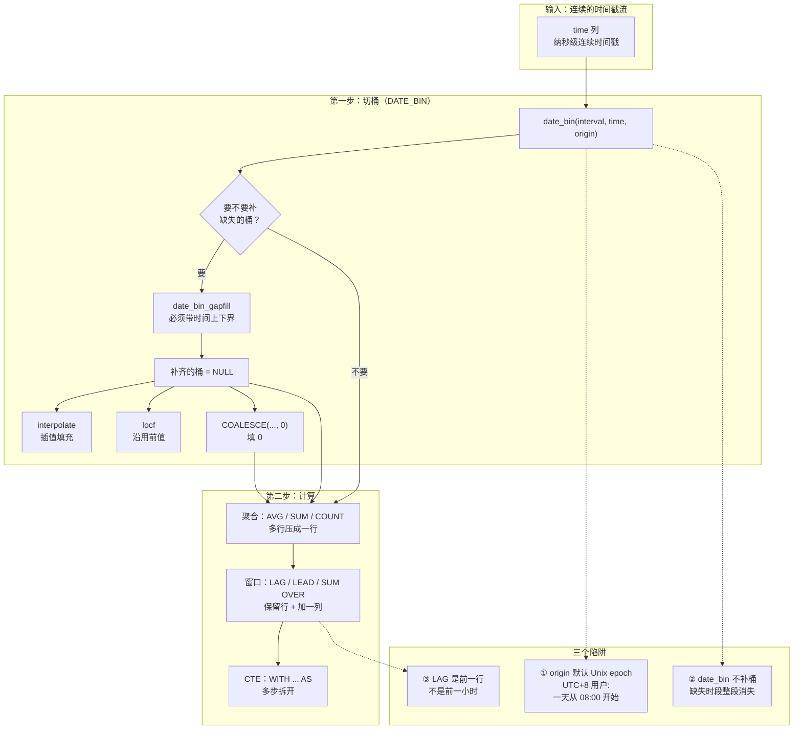

# 第 8 课：SQL 查询：从 SELECT 到窗口函数

> 所属阶段：阶段 3《数据模型与查询》｜ 水平：零基础 → 入门 ｜ 本课知识点：DataFusion SQL 基础查询 / `DATE_BIN` 与时间分组 / 聚合、窗口函数与 CTE
> 故事情节：第三章第三幕——schema 设计好了，现在要把它真正用起来：让"时间"这个主角在查询里开口说话

## 🎯 本课目标

- 理解 InfluxDB 3 的 SQL 是**标准 SQL + 时序扩展**，由 **DataFusion** 引擎驱动
- 掌握 **`DATE_BIN`**——时序查询的核心：把连续时间切成桶，并理解 `origin_timestamp` 与时区陷阱
- 能用**窗口函数**做同环比、移动平均、累计值，能用 **CTE** 组织多步查询
- 知道 3.x SQL **没有** `increase()` / `NON_NEGATIVE_DIFFERENCE()`，以及官方给的替代写法

> 💻 承接第 3 课环境：Docker 容器名 `influxdb3-core`，端口 8181，token 已设进 `INFLUXDB3_AUTH_TOKEN`。
> 🔗 **回扣 L6**：tag 只能存字符串、field 五种类型——这决定了 `WHERE` 与聚合能怎么写。

---

## 第一幕：起源与场景引入

L7 讲完，你的 schema 设计好了：`api_latency` 表，`region` / `host` / `status` / `method` 四个 tag，`latency` 一个 field，基数可控。

现在老板要一个日报：**"过去 7 天，每小时的 P95 延迟，按 region 分组。"**

你心想这不就是个 `GROUP BY`，写了：

```sql
SELECT region, AVG(latency)
FROM api_latency
WHERE time > now() - INTERVAL '7 days'
GROUP BY region
```

结果返回 **3 行**——每个 region 一行，是整个 7 天的平均值。

老板要的是 **7 × 24 × 3 = 504 行**（每小时 × 每 region）。**你的查询把所有时间压成了一个数字。**

你试着加 `GROUP BY hour`，但表里根本没有 `hour` 这个列——**时间是一个连续的纳秒时间戳列，不是离散的"小时"字段。**

然后你发现了 `DATE_BIN`，改写成：

```sql
SELECT
  DATE_BIN(INTERVAL '1 hour', time) AS bucket,
  region,
  AVG(latency) AS avg_latency
FROM api_latency
WHERE time > now() - INTERVAL '7 days'
GROUP BY bucket, region
ORDER BY bucket
```

跑出 504 行，看起来对了。但交上去之后，运营同事问了一句：**"为什么 3 月 18 日凌晨 2 点的数据，归到了 3 月 17 日？"**

> 🎬 **场景**：`DATE_BIN` 解决了"按小时聚合"的问题，却带来了一个更隐蔽的问题——**你的"一天"从早上 8 点开始**。
>
> 而且当某台设备离线一小时，那一小时的桶**直接消失了**，不是显示 0，是**整段不见**——你的折线图会"断"在那里。

这一课要解决三个问题：**怎么切桶、桶的边界在哪、缺失的桶怎么补。**

---

## 第二幕：认知冲突

你可能会想：**"SQL 我熟，`GROUP BY` 加个时间字段不就行了。"**

三个反直觉的事实：

**第一 · 表里没有"小时"这一列，时间是一个连续的纳秒时间戳**。关系库里你习惯了 `GROUP BY DATE(created_at)`，但在时序库里，**"按小时"不是取字段，而是做一次计算**——把连续时间映射到离散的桶。这是 `DATE_BIN` 存在的全部理由。

**第二 · `DATE_BIN` 的桶边界由 `origin_timestamp` 决定，默认是 Unix epoch（1970-01-01T00:00:00Z）**。这对 UTC 用户没问题，但对 **UTC+8 的用户意味着"一天"从北京时间早上 8:00 开始**——你凌晨 2 点的数据会被算进前一天。这是本课最容易踩、也最难自查的坑。

**第三 · `DATE_BIN` 不会凭空造桶**。官方原文说得很清楚：`date_bin_gapfill`"If no rows exist in a time interval, **a new row is inserted**"——注意，**补桶是 `date_bin_gapfill` 的能力，不是 `date_bin` 的**。用普通 `date_bin`，设备离线那一小时**根本没有行**，你的图表会断线，而不是显示 0。

> ❓ **问题**：那 `origin` 该怎么设？缺失的桶怎么补？窗口函数和普通聚合又有什么区别？
>
> 这一课逐个回答。

---

## 第三幕：层层揭示

### 知识点 1：DataFusion SQL 基础查询

#### 一句话定义
**InfluxDB 3 的 SQL 是标准 SQL 的超集**：`SELECT / FROM / WHERE / GROUP BY / ORDER BY / HAVING / JOIN / CTE` 全都支持，另加一批**时序专属函数**（`DATE_BIN`、选择器 `selector_first`、gapfill 等）。引擎是 Rust 写的 **Apache DataFusion**（Arrow 生态的查询引擎，L11 会详解）。

#### 直觉建立：把它想成「一辆装了专用轮胎的普通汽车」

- **普通汽车**：你会开 MySQL 的 SQL，就会开这辆车——方向盘、油门、刹车位置都一样（`SELECT`、`WHERE`、`GROUP BY` 语义不变）。
- **专用轮胎**：为了跑时序这条路，额外装了几条专用胎——`DATE_BIN`（时间分桶）、`selector_first`（取某列极值所在行的其他列）、`interpolate` / `locf`（补空洞）。

**关键是你不用重新考驾照**。你过去的 SQL 经验 90% 可以直接迁移——这也是 3.x 从 Flux 换回 SQL 的核心理由（L9 详讲）。

> ⚠️ **类比失效的边界**：轮胎只影响性能与部分能力，**车架结构不同**。InfluxDB 是列存（Parquet），没有事务、没有二级索引、不支持 `UPDATE`。所以"SQL 一样"不等于"行为一样"——`SELECT *` 的代价、缺索引时的查询路径都不同。

#### 核心原理：三部分构成

| 组成 | 说明 | 举例 |
|------|------|------|
| **标准 SQL** | DataFusion 提供的通用 SQL 能力 | `SELECT`、`WHERE`、`GROUP BY`、`JOIN`、`WITH`（CTE）、`CAST` |
| **时序扩展函数** | 官方为时序场景加的专属函数 | `DATE_BIN`、`date_bin_gapfill`、`selector_first` / `selector_last`、`interpolate` / `locf` |
| **时间/日期函数** | 一批处理时间戳的函数 | `now()`、`date_trunc`、`date_part`、`to_timestamp_*`、`to_unixtime` |

官方 SQL 参考的**函数分类**（Core 版完整列表）：Aggregate、Selector、**Time and date**、Conditional、Math、String、Binary string、Array、Map、Struct、Regular expression、Hashing、Cache、Miscellaneous、**Window**、Table value constructor。

#### 示例演示：从基础查询到探索 schema

```sql
-- 1) 探索 schema（对应老版本的 SHOW MEASUREMENTS / SHOW TAG KEYS）
SHOW TABLES
SHOW COLUMNS IN api_latency

-- 2) 基础查询：时间过滤 + tag 过滤 + 排序
SELECT time, region, host, latency
FROM api_latency
WHERE time >= now() - INTERVAL '1 day'
  AND region = 'cn-south'
ORDER BY time DESC
LIMIT 100

-- 3) 按 tag 分组聚合（注意 selector_first 的写法：返回的是结构体，要取 ['value']）
SELECT
  region,
  AVG(latency) AS mean_latency,
  selector_first(latency)['value'] AS first_latency
FROM api_latency
WHERE time >= now() - INTERVAL '24 hours'
GROUP BY region

-- 4) 类型转换：CAST 函数或 :: 简写
SELECT CAST(1234.5 AS BIGINT)
SELECT 1234.5::BIGINT
```

第三条里的 `selector_first(latency)['value']` 值得单独说：这是官方示例里的写法。选择器函数返回的不只是一个值，而是**一个结构体**（含有 value、time 等字段），所以要用 `['value']` 把数值取出来。

#### 常见误区

**误区 A**：*`SELECT *` 在时序库里也没什么代价。*
❌ 错。列存里 `*` 会把**所有列**都读出来，而时序表往往列很多（宽 schema，L7 反模式 3）。**永远只写你真正需要的列**。

**误区 B**：*`WHERE time > now() - INTERVAL '7 days'` 这种写法可有可无。*
❌ 错。**时间范围过滤是时序查询的第一性能要素**。官方在讲 distinct 查询时明确警告过：不带 time bounds 的查询可能 "very heavy"（全表扫描）。**每条查询都要带时间下界。**

#### 一句话记住
**标准 SQL 你都会，只需额外学三个时序函数：`DATE_BIN`（分桶）、选择器（取极值行）、`interpolate`/`locf`（补空洞）。**

---

### 知识点 2：`DATE_BIN` 与时间分组

#### 一句话定义
**`DATE_BIN(interval, expression[, origin_timestamp])`** 把连续时间切成固定大小的桶，返回**该时间戳所在桶的起始时刻**。它是时序 SQL 的核心——**所有"按小时/天/周聚合"都靠它**。

#### 直觉建立：把它想成「把一条连续的面条切成段」

时间是一条**连续的面条**（纳秒级时间戳）。数据分析要的不是"连续"，而是"一段一段"。

`DATE_BIN` 就是那把刀：

- **`interval`（第一参数）= 每段多长**。切 1 小时的段，还是 1 天的段。
- **`origin_timestamp`（第三参数）= 从哪里开始下第一刀**。这是最容易被忽略的参数——**你从哪下第一刀，决定了后面每一刀的位置**。

官方给的例子：切成 15 分钟一段，`2023-01-01T18:18:18Z` 落回 `2023-01-01T18:15:00Z`。

> ⚠️ **类比失效的边界**：切面条时，你从哪下刀只影响第一段的边角料。但 `DATE_BIN` 的 `origin` 会**影响所有桶的边界**——因为桶必须对齐到 origin 的整数倍。从 08:00 下刀，那么"一天"就永远从 08:00 开始。

#### 核心原理：三个参数与支持的单位

官方原文签名：

```
date_bin(interval, expression[, origin_timestamp])
```

| 参数 | 含义 | 备注 |
|------|------|------|
| `interval` | 桶大小 | 见下方单位表 |
| `expression` | 时间表达式 | 可以是常量、列、函数（通常是 `time` 列） |
| `origin_timestamp` | 分桶起点 | **默认 Unix epoch（1970-01-01T00:00:00Z）** |

**`date_bin` 支持的 interval 单位**（官方原文）：
nanoseconds / microseconds / milliseconds / seconds / minutes / hours / days / weeks / **months / years / century**

**`date_bin_gapfill` 支持的单位更少**（官方原文明确列出"不支持"的）：
nanoseconds / microseconds / milliseconds / seconds / minutes / hours / days / weeks
❌ **不支持：months / years / century**

> 📌 这是一个容易被忽略的差异：**`date_bin` 能按月分桶，`date_bin_gapfill` 不能**。如果你既要补空洞又要按月分桶，就得换方案（比如按天 gapfill 后在应用层再聚合）。

#### 示例演示：基础分桶与按天聚合

```sql
-- 官方示例：按天求水位平均值
SELECT
  date_bin(INTERVAL '1 day', time, TIMESTAMP '1970-01-01 00:00:00Z') AS time,
  avg("water_level") AS water_level_avg
FROM "h2o_feet"
WHERE time >= timestamp '2019-09-10T00:00:00Z'
  AND time <= timestamp '2019-09-20T00:00:00Z'
GROUP BY 1
ORDER BY time DESC
```

注意 `GROUP BY 1`——**这是标准 SQL 的"按第 1 列分组"写法**，省得把 `date_bin(...)` 再抄一遍。官方示例里大量使用这个写法。

```sql
-- 官方示例：按小时 + 按 tag 分组
SELECT
  DATE_BIN(INTERVAL '1 hour', time, '2022-01-01T00:00:00Z'::TIMESTAMP) AS time,
  mean(field1),
  sum(field2),
  tag1
FROM home
GROUP BY 1, tag1
```

这里的 `'2022-01-01T00:00:00Z'::TIMESTAMP` 就是**显式指定 origin**——用 `::` 做类型转换（上一条知识点讲过）。

#### 常见误区：UTC+8 的"一天从早上 8 点开始"

这是本课**最重要、也最隐蔽**的坑。

`origin_timestamp` 默认是 Unix epoch，也就是 **UTC 的 1970-01-01 00:00:00**。对 UTC+8 的我们来说，那个时刻是**北京时间 1970-01-01 08:00**。

于是，当 bucket 是 `1 day` 时，**"一天"的边界落在北京时间的每天 08:00**。后果是：

- 北京时间 **3 月 18 日 00:30** 的数据 → 被归进 **3 月 17 日** 的桶
- 北京时间 **3 月 18 日 07:59** 的数据 → 仍然被归进 **3 月 17 日** 的桶
- 北京时间 **3 月 19 日 07:00** 的数据 → 被归进 **3 月 18 日** 的桶

**你的日报会整体错位 8 小时，而查询不会报任何错。**

**修法**：显式指定一个"按北京时间对齐"的 origin——即 **UTC 时间的 1970-01-01T16:00:00Z**（因为 UTC+8 的一天要从 epoch 往后推 16 小时才对齐到北京 00:00）：

```sql
-- ❌ 默认 origin：UTC+8 用户会发现"一天"从北京时间 08:00 开始
SELECT DATE_BIN(INTERVAL '1 day', time) AS day, region, AVG(latency)
FROM api_latency
WHERE time >= now() - INTERVAL '7 days'
GROUP BY day, region

-- ✅ 显式指定 origin，按北京时间对齐到 00:00
SELECT DATE_BIN(INTERVAL '1 day', time, TIMESTAMP '1970-01-01T16:00:00Z') AS day,
       region, AVG(latency)
FROM api_latency
WHERE time >= now() - INTERVAL '7 days'
GROUP BY day, region
```

> 💡 **更省事的方案**：官方提供了 **`date_bin_wallclock`**——它直接按指定时区的"挂钟时间"分桶，不用你手工算 origin 偏移：
> ```sql
> date_bin_wallclock(interval, expression[, origin_timestamp])
> ```
> 官方特别提醒：**夏时制切换会造成时间不连续**，要避免让桶边界落在切换点上。通用原则：用默认 origin，或用一个与 interval 大小相称的偏移。

#### 一句话记住
**`DATE_BIN` 切桶，`origin` 决定边界。UTC+8 用户按天分桶时，默认 origin 会让"一天"从北京时间 08:00 开始——用 `date_bin_wallclock` 或显式设 origin 为 `1970-01-01T16:00:00Z`。**

---

### 知识点 3：聚合、窗口函数与 CTE

#### 一句话定义
- **聚合**（`AVG` / `SUM` / `COUNT`）把**多行压成一行**（配合 `GROUP BY` 是压成每组一行）。
- **窗口函数**（`LAG` / `LEAD` / `SUM() OVER`）**保留每一行**，只是在每行上"附送"一个跨行计算的值。
- **CTE**（`WITH ... AS`）把一次查询拆成**有名字的多个步骤**，让多步逻辑可读、可复用。

#### 直觉建立：把它想成「三件不同的工具」

想象你在看一叠**按时间排好序的温度记录卡**：

- **聚合** = 把这一叠卡片**压成一个数字**。"这一叠平均 21 度。"——**卡片没了，只剩一个数。**
- **窗口函数** = 给**每张卡片**旁边加一列批注。"这张比上一张高 2 度。"——**每张卡片都还在，只是多了个注解。**
- **CTE** = 先做完一步、把中间结果**放到一张临时的草稿纸**上，下一步从草稿纸继续。"先算出每两小时的差值（草稿纸），再对差值求累计（正式表）。"

> ⚠️ **类比失效的边界**：真实世界的"压成一个数"是不可逆的；SQL 的聚合也是。所以**一旦聚合了，你就拿不回原始各行**——想同时要看明细和聚合值，就得用窗口函数或 CTE，而不是硬塞进一个 `GROUP BY`。

#### 核心原理 A：聚合与 gapfill

**`date_bin` 不会补桶，`date_bin_gapfill` 才会**。官方原文：

> *"If no rows exist in a time interval, a new row is inserted with a time value set to the interval start time, all columns in the GROUP BY clause populated, and null values in aggregate columns."*

两个硬性要求（官方原文）：

1. **`date_bin_gapfill` requires time bounds in the WHERE clause**——必须有上下时间界。
2. 传给 `interpolate` 或 `locf` 的表达式**必须使用聚合函数**。

补出来的 NULL 怎么填，官方给了两个函数：

| 函数 | 行为 | 官方示例结果 |
|------|------|-------------|
| `interpolate` | **在非空值之间插值** | Kitchen：21 → **22** → 23 → **22.85** → 22.7 |
| `locf` | **沿用上一个观测值**（last observation carried forward） | Kitchen：21 → **21** → 23 → **23** → 22.7 |

> 🎯 **先给选型结论**：补出来的 NULL 该填什么，**取决于你的指标语义**——
> **连续量**（温度、水位、延迟）用 `interpolate`；**状态量**（在线状态、档位、开关）用 `locf`；**计数**（事件发生次数）用 `COALESCE(COUNT(...), 0)`。
> 记不住就想一句话：**"温度在变、状态不变、计数从零开始。"**

同样是补 08:30 和 09:30 两个缺失桶，`interpolate` 给出 22 / 22.85（插值），`locf` 给出 21 / 23（沿用前一个值）。**选哪个取决于你的业务语义**——温度用插值合理，"当前在线状态"用 locf 合理。

```sql
-- 官方示例：30 分钟桶 + 按房间分组 + 插值补全
SELECT
  date_bin_gapfill(INTERVAL '30 minutes', time) as time,
  room,
  interpolate(avg(temp))
FROM home
WHERE time >= '2022-01-01T08:00:00Z' AND time <= '2022-01-01T10:00:00Z'
GROUP BY 1, room
```

> 💡 **想让缺失的桶显示 0 而不是插值**？用 `COALESCE`：
> ```sql
> SELECT date_bin_gapfill(INTERVAL '1 minute', time) AS time,
>        COALESCE(COUNT(event), 0) AS cnt
> FROM events
> WHERE time >= now() - INTERVAL '5 minutes'
> GROUP BY 1
> ```
> 这是社区常用的做法（Stack Overflow 上被验证过），因为 `interpolate` / `locf` 都给不出 0。

#### 核心原理 B：窗口函数

官方原文对窗口函数的定位：

> *"Window functions like LAG and LEAD let you access values from previous or subsequent rows **without using self-joins**."*

四个要素（官方原文的步骤）：

1. 用窗口函数（如 `LAG` / `LEAD`）配合 `OVER` 子句
2. **`PARTITION BY`** 按 tag 分组（如 `room` / `sensor_id`）——**保证只在同一个设备内比较**
3. **`ORDER BY`** 定义比较顺序（通常是 `time`）
4. 用算术运算符算差值、比率、百分比

**最经典的例子：与上一个值的差**（官方原文）：

```sql
SELECT
  time, room, temp,
  temp - LAG(temp, 1) OVER (PARTITION BY room ORDER BY time) AS temp_change
FROM home
WHERE time >= '2022-01-01T08:00:00Z' AND time < '2022-01-01T11:00:00Z'
ORDER BY room, time
```

官方给出的输出：

| time | room | temp | temp_change |
|------|------|------|-------------|
| 2022-01-01T08:00:00 | Kitchen | 21.0 | **NULL** |
| 2022-01-01T09:00:00 | Kitchen | 23.0 | 2.0 |
| 2022-01-01T10:00:00 | Kitchen | 22.7 | -0.3 |

**每个分组的第一行是 `NULL`**（没有上一行可比）。官方给了填默认值的方法——`LAG` 的第三个参数：

```sql
LAG(temp, 1, 0)   -- 没有上一行时返回 0
```

**百分比变化**（官方原文，用 `ROUND` 保留 2 位）：

```sql
ROUND(((temp - LAG(temp,1) OVER (PARTITION BY room ORDER BY time))
       / LAG(temp,1) OVER (PARTITION BY room ORDER BY time)) * 100, 2) AS percent_change
```

**⚠️ 一个关键提醒（官方原文）**：`LAG(temp, 1)` 里的 `1` 是**"往前 1 行"**，不是"往前 1 小时"。

- 数据**规律**时（每小时一个点），"往前 1 行"恰好等于"往前 1 小时"，没问题。
- 数据**不规律或有缺失**时，这两个概念就分家了。官方明确说了：如果你要**精确的时间偏移**（exactly 1 hour ago），`LAG` 不行，要用**自连接**：

```sql
SELECT current.time, current.room, current.temp AS current_temp,
       previous.temp AS temp_1h_ago,
       current.temp - previous.temp AS hourly_diff
FROM home AS current
LEFT JOIN home AS previous
  ON current.room = previous.room
 AND previous.time = current.time - INTERVAL '1 hour'
WHERE current.time >= '2022-01-01T08:00:00Z' AND current.time < '2022-01-01T12:00:00Z'
ORDER BY current.room, current.time
```

> 📌 **这是本课最实用的一条判据**：**规律数据用 `LAG`，不规律数据要精确时间偏移用自连接。**

#### 核心原理 C：CTE 与计数器重置（counter reset）

官方原文点明了一个重要事实：

> *"InfluxDB 3 SQL **doesn't provide built-in equivalents** to Flux's `increase()` or InfluxQL's `NON_NEGATIVE_DIFFERENCE()` functions."*

也就是说：**从 InfluxQL / Flux 迁过来时，`increase()` 不能直接写**。官方给的替代模式是 **`GREATEST` + `LAG`**：

```sql
-- 处理计数器重置：负值视为 0
SELECT time, host, requests,
  LAG(requests) OVER (PARTITION BY host ORDER BY time) AS prev_requests,
  GREATEST(requests - LAG(requests) OVER (PARTITION BY host ORDER BY time), 0)
    AS requests_increase
FROM metrics
WHERE host = 'server1'
ORDER BY time
```

官方输出（注意 03:00 那行发生了重置）：

| time | host | requests | prev_requests | requests_increase |
|------|------|----------|---------------|-------------------|
| 2024-01-01T00:00:00 | server1 | 1000 | NULL | **0** |
| 2024-01-01T01:00:00 | server1 | 1250 | 1000 | 250 |
| 2024-01-01T02:00:00 | server1 | 1600 | 1250 | 350 |
| 2024-01-01T03:00:00 | server1 | **50** | 1600 | **0** ← 重置，被 GREATEST 归零 |
| 2024-01-01T04:00:00 | server1 | 300 | 50 | 250 |

**累计值要靠 CTE**（官方原文：*"Use a Common Table Expression (CTE) to first calculate the differences, then sum them"*）：

```sql
WITH counter_diffs AS (
  SELECT time, host, requests,
    GREATEST(requests - LAG(requests) OVER (PARTITION BY host ORDER BY time), 0)
      AS requests_increase
  FROM metrics
  WHERE host = 'server1'
)
SELECT time, host, requests,
  SUM(requests_increase) OVER (PARTITION BY host ORDER BY time) AS cumulative_increase
FROM counter_diffs
ORDER BY time
```

官方输出证明**重置被正确处理**——累计值持续上升：0 → 250 → 600 → **600**（重置这行不增）→ 850。

**按时间区间聚合增量**（官方第三段，CTE + `DATE_BIN` 组合）：

```sql
WITH counter_diffs AS (
  SELECT DATE_BIN(INTERVAL '1 hour', time) AS time_bucket, host, requests,
    GREATEST(requests - LAG(requests) OVER (PARTITION BY host ORDER BY time), 0)
      AS requests_increase
  FROM metrics
)
SELECT time_bucket, host, SUM(requests_increase) AS total_increase
FROM counter_diffs
WHERE requests_increase > 0
GROUP BY time_bucket, host
ORDER BY host, time_bucket
```

> 💡 注意最后的 `WHERE requests_increase > 0`——**过滤掉首行（无前值）和重置行（被归零）**，避免它们污染聚合结果。

#### 常见误区

**误区 C**：*`GROUP BY` 之后我还能在 `SELECT` 里写原始列（如 `time`）。*
❌ 错。标准 SQL 规则：**`SELECT` 里只能出现 `GROUP BY` 的列或聚合表达式**。`SELECT time, AVG(latency) GROUP BY region` 是非法的——`time` 既没分组也没聚合。想带上时间，就把 `DATE_BIN(...)` 放进 `GROUP BY`。

**误区 D**：*窗口函数 `LAG(temp, 1)` 就是"一小时前"。*
❌ 错（前面已详述）。**它是"前一行"**。数据缺失时两者不等价，需要精确偏移用自连接。

**误区 E**：*`date_bin` 会在没数据的时段返回 0。*
❌ 错。**`date_bin` 不补桶，那段时间整段消失**；要补桶必须用 `date_bin_gapfill`，且**必须带时间上下界**。

**误区 F**：*gapfill 补出来的 NULL，用 `interpolate` 就能得到 0。*
❌ 错。`interpolate` 给的是**插值**（22、22.85），`locf` 给的是**沿用前值**（21、23），**都不是 0**。要 0 就用 `COALESCE(COUNT(...), 0)`。

#### 一句话记住
**聚合压行数，窗口函数保留行数只加列；CTE 负责把多步拆开。规律数据用 `LAG`，精确时间偏移用自连接；3.x 没有 `increase()`，用 `GREATEST` + `LAG` + CTE 替代。**

---

## 第四幕：实操验证

> 💻 以下命令承接第 3 课环境（容器 `influxdb3-core`，端口 8181）。
> 🧪 本课实验 A 已在本机 Python 3.11 实跑（不依赖 Docker），输出逐字贴出。

### 实验 A：`DATE_BIN` 分桶模拟器（本机实跑，强烈建议先跑这个）

这个模拟器把 `date_bin` 的三个参数行为**用纯 Python 复现**，让你在没有数据库的情况下看清桶边界——尤其是 UTC+8 那个陷阱。

> 📌 **下面这份脚本与随后的实跑输出严格一一对应**，可直接复制运行（本机 Python 3.11 实测通过）。核心就是 `date_bin` 那 5 行，其余是打印。

```python
from datetime import datetime, timedelta, timezone

EPOCH = datetime(1970, 1, 1, tzinfo=timezone.utc)   # 默认 origin = Unix epoch
UTC, CN = timezone.utc, timezone(timedelta(hours=8))

INTERVAL_SECONDS = {"15 minutes": 900, "30 minutes": 1800,
                    "1 hour": 3600, "1 day": 86400}

def date_bin(interval, ts, origin=EPOCH):
    """返回 ts 所在桶的起始时刻——模拟 SQL 的 date_bin"""
    step = INTERVAL_SECONDS[interval]
    delta = (ts - origin).total_seconds()
    buckets = delta // step          # 向下取整，与 SQL 语义一致
    return origin + timedelta(seconds=buckets * step)

def parse(ts_str):
    """按 UTC 解析无时区后缀的时间串"""
    return datetime.fromisoformat(ts_str).replace(tzinfo=UTC)

def fmt(dt, tz):
    return dt.astimezone(tz).strftime("%Y-%m-%d %H:%M")

# ---- 实验 1：基础分桶（15 分钟）----
print("=" * 76)
print("实验 1 · date_bin 基础：把连续时间切成桶（15 分钟桶）")
print("=" * 76)
print("%-22s -> %-22s" % ("原始时间戳 (UTC)", "桶起点 (UTC)"))
print("-" * 76)
for s in ["2023-01-01T18:18:18", "2023-01-01T18:15:00",
          "2023-01-01T18:14:59", "2023-01-01T18:30:00"]:
    ts = parse(s)
    print("%-22s -> %-22s" % (fmt(ts, UTC), fmt(date_bin("15 minutes", ts), UTC)))

# ---- 实验 2：origin 决定边界 ----
print()
print("=" * 76)
print("实验 2 · origin_timestamp：同一个时间戳，起点不同则桶不同（1 天桶）")
print("=" * 76)
ts = parse("2024-03-18T18:18:18")
print("输入: 2024-03-18 18:18:18 UTC    桶大小: 1 天")
print("-" * 76)
for name, o in [("Unix epoch（默认）", EPOCH),
                ("当天 00:00 UTC", parse("2024-03-18T00:00:00")),
                ("当天 08:00 UTC", parse("2024-03-18T08:00:00"))]:
    print("  origin = %-18s -> 桶起点 %s UTC" % (name, fmt(date_bin("1 day", ts, o), UTC)))
print()
print("  注意：前两者相同，因为 1 天能整除 1 天；第三个不同 —— 起点偏移让\"一天\"从 08:00 开始。")

# ---- 实验 3：UTC+8 陷阱 ----
print()
print("=" * 76)
print("实验 3 · 【重点陷阱】UTC+8 用户按天分桶，默认起点让\"一天\"从北京时间早上 8 点开始")
print("=" * 76)
bj_samples = ["2024-03-18 00:30", "2024-03-18 07:59", "2024-03-18 08:00",
              "2024-03-18 23:30", "2024-03-19 07:00"]
utc_of = {"2024-03-18 00:30": "2024-03-17T16:30:00",
          "2024-03-18 07:59": "2024-03-17T23:59:00",
          "2024-03-18 08:00": "2024-03-18T00:00:00",
          "2024-03-18 23:30": "2024-03-18T15:30:00",
          "2024-03-19 07:00": "2024-03-18T23:00:00"}

print("【A】date_bin(INTERVAL '1 day', time)  ——  origin 默认 Unix epoch")
print("-" * 76)
print("%-18s | %-18s | %s" % ("数据时刻(北京)", "归入哪一天", "是否符合直觉"))
print("-" * 76)
for s in bj_samples:
    b = date_bin("1 day", parse(utc_of[s]))
    bj_day = fmt(b, CN)[:10]        # 桶起点在北京时间下是哪一天
    print("%-18s | %-18s | %s" % (s, bj_day, "❌" if bj_day != s[:10] else "✅"))

print()
print("【B】改成按北京时间对齐：origin = '1970-01-01T16:00:00Z'")
print("-" * 76)
BJ_ORIGIN = parse("1970-01-01T16:00:00")
print("%-18s | %-18s | %s" % ("数据时刻(北京)", "归入哪一天", "是否符合直觉"))
print("-" * 76)
for s in bj_samples:
    b = date_bin("1 day", parse(utc_of[s]), BJ_ORIGIN)
    bj_day = fmt(b, CN)[:10]
    print("%-18s | %-18s | %s" % (s, bj_day, "❌" if bj_day != s[:10] else "✅"))

# ---- 实验 4：gapfill 的必要性 ----
print()
print("=" * 76)
print("实验 4 · gapfill 的必要性：date_bin 不会凭空造桶")
print("=" * 76)
points = ["2022-01-01T08:00:00", "2022-01-01T08:30:00", "2022-01-01T10:00:00"]
have = set()
print("实际有数据的点:")
for s in points:
    b = date_bin("30 minutes", parse(s))
    have.add(fmt(b, UTC))
    print("   %s UTC -> 桶 %s" % (fmt(parse(s), UTC), fmt(b, UTC)))
print()
print("  date_bin         -> 只返回有数据的 3 个桶（09:00、09:30 整段消失）")
print("  date_bin_gapfill -> 补齐 5 个桶，缺失桶填 NULL，再用 interpolate/locf 填值")
print()
print("  补齐后的 5 个桶:")
start = parse("2022-01-01T08:00:00")
for i in range(5):
    b = start + timedelta(minutes=30 * i)
    key = fmt(b, UTC)
    print("   %s  %s" % (key, "有数据" if key in have else "NULL  <- gapfill 补出来的桶"))
```

**本机实跑结果（逐字输出）**：

```
============================================================================
实验 1 · date_bin 基础：把连续时间切成桶（15 分钟桶）
============================================================================
原始时间戳 (UTC)            -> 桶起点 (UTC)
----------------------------------------------------------------------------
2023-01-01 18:18       -> 2023-01-01 18:15
2023-01-01 18:15       -> 2023-01-01 18:15
2023-01-01 18:14       -> 2023-01-01 18:00
2023-01-01 18:30       -> 2023-01-01 18:30

============================================================================
实验 2 · origin_timestamp：同一个时间戳，起点不同则桶不同（1 天桶）
============================================================================
输入: 2024-03-18 18:18:18 UTC    桶大小: 1 天
----------------------------------------------------------------------------
  origin = Unix epoch（默认）     -> 桶起点 2024-03-18 00:00 UTC
  origin = 当天 00:00 UTC       -> 桶起点 2024-03-18 00:00 UTC
  origin = 当天 08:00 UTC       -> 桶起点 2024-03-18 08:00 UTC

  注意：前两者相同，因为 1 天能整除 1 天；第三个不同 —— 起点偏移让"一天"从 08:00 开始。

============================================================================
实验 3 · 【重点陷阱】UTC+8 用户按天分桶，默认起点让"一天"从北京时间早上 8 点开始
============================================================================
【A】date_bin(INTERVAL '1 day', time)  ——  origin 默认 Unix epoch
----------------------------------------------------------------------------
数据时刻(北京)           | 归入哪一天              | 是否符合直觉
----------------------------------------------------------------------------
2024-03-18 00:30   | 2024-03-17         | ❌ 应属 03-18
2024-03-18 07:59   | 2024-03-17         | ❌ 应属 03-18
2024-03-18 08:00   | 2024-03-18         | ✅
2024-03-18 23:30   | 2024-03-18         | ✅
2024-03-19 07:00   | 2024-03-18         | ❌ 应属 03-19

【B】改成按北京时间对齐：origin = '1970-01-01T16:00:00Z'
----------------------------------------------------------------------------
数据时刻(北京)           | 归入哪一天              | 是否符合直觉
----------------------------------------------------------------------------
2024-03-18 00:30   | 2024-03-18         | ✅
2024-03-18 07:59   | 2024-03-18         | ✅
2024-03-18 08:00   | 2024-03-18         | ✅
2024-03-18 23:30   | 2024-03-18         | ✅
2024-03-19 07:00   | 2024-03-19         | ✅

============================================================================
实验 4 · gapfill 的必要性：date_bin 不会凭空造桶
============================================================================
实际有数据的点:
   2022-01-01 08:00 UTC -> 桶 2022-01-01 08:00
   2022-01-01 08:30 UTC -> 桶 2022-01-01 08:30
   2022-01-01 10:00 UTC -> 桶 2022-01-01 10:00

  date_bin           -> 只返回有数据的 3 个桶（09:00、09:30 整段消失）
  date_bin_gapfill   -> 补齐 5 个桶，缺失桶填 NULL，再用 interpolate/locf 填值

  补齐后的 5 个桶:
   2022-01-01 08:00  有数据
   2022-01-01 08:30  有数据
   2022-01-01 09:00  NULL  <- gapfill 补出来的桶
   2022-01-01 09:30  NULL  <- gapfill 补出来的桶
   2022-01-01 10:00  有数据
```

**判断成功的标准**：

1. **实验 1**：`18:18:18` 落到 `18:15`，与官方例子（*"an input timestamp of 2023-01-01T18:18:18Z will be updated to... 2023-01-01T18:15:00Z"*）**完全一致**；`18:14:59` 落到 `18:00`，证明是**向下取整**。
2. **实验 2**：默认 origin 与"当天 00:00"结果相同，但"当天 08:00"让桶起点变成 08:00——**origin 确实改变边界**。

> ⚠️ 别被"前两者相同"误导：**那只是因为 1 天能整除 1 天，是个巧合**。换成 90 分钟、7 小时这类**不能整除自然日的 interval**，任何 origin 偏移都会立刻让边界分家。**能被整除的 interval 才敢忽略 origin。**
3. **实验 3**：这是本课最该看懂的一张表。**默认 origin 下有 3 行判 ❌**——北京时间凌晨和清晨的数据被算进了前一天。改成 `1970-01-01T16:00:00Z` 后**全部 ✅**。
4. **实验 4**：3 个数据点，5 个桶位，`date_bin` 只给 3 行，**09:00 与 09:30 两个桶整段消失**。

> 💡 **把实验 3 的结论记住**：`DATE_BIN(INTERVAL '1 day', time)` 对 UTC+8 用户是**错的**。要么显式设 origin，要么用 `date_bin_wallclock`。

### 实验 B：按小时聚合（真实库）

先写入一批测试数据：

```bash
docker exec influxdb3-core influxdb3 write \
  --db metrics --token $INFLUXDB3_AUTH_TOKEN '
api_latency,region=cn-south,host=web-01,status=200 latency=23.4 1735545600000000000
api_latency,region=cn-south,host=web-01,status=200 latency=31.2 1735545660000000000
api_latency,region=cn-south,host=web-02,status=200 latency=19.8 1735545720000000000
api_latency,region=cn-north,host=web-11,status=500 latency=210.5 1735545780000000000
'
```

然后按小时聚合：

```bash
docker exec influxdb3-core influxdb3 query \
  --db metrics --token $INFLUXDB3_AUTH_TOKEN \
  "SELECT DATE_BIN(INTERVAL '1 hour', time) AS bucket,
          region,
          AVG(latency) AS avg_latency,
          COUNT(*) AS cnt
   FROM api_latency
   WHERE time >= now() - INTERVAL '1 day'
   GROUP BY bucket, region
   ORDER BY bucket"
```

**判断成功的标准**：

1. 返回的行数 = **小时数 × region 数**（本例 1 小时 × 2 region = **2 行**）。
2. `cnt` 列显示每个桶里的点数（cn-south 应为 3，cn-north 应为 1）。
3. 若你只得到 2 行（每 region 一行、时间被压平），说明**漏了 `GROUP BY bucket`**。

### 实验 C：对比 `date_bin` 与 `date_bin_gapfill`

用同一份数据，分别跑两个函数，看行数差异：

```bash
# 普通 date_bin：缺失时段整段消失
docker exec influxdb3-core influxdb3 query \
  --db metrics --token $INFLUXDB3_AUTH_TOKEN \
  "SELECT date_bin(INTERVAL '30 minutes', time) AS bucket, AVG(latency)
   FROM api_latency
   WHERE time >= '2025-01-01T08:00:00Z' AND time <= '2025-01-01T10:00:00Z'
   GROUP BY bucket ORDER BY bucket"

# date_bin_gapfill：补齐所有桶，缺失填 NULL
docker exec influxdb3-core influxdb3 query \
  --db metrics --token $INFLUXDB3_AUTH_TOKEN \
  "SELECT date_bin_gapfill(INTERVAL '30 minutes', time) AS bucket, AVG(latency)
   FROM api_latency
   WHERE time >= '2025-01-01T08:00:00Z' AND time <= '2025-01-01T10:00:00Z'
   GROUP BY bucket ORDER BY bucket"
```

**判断成功的标准**：

1. 第二条返回**更多行**（5 个桶位：08:00 / 08:30 / 09:00 / 09:30 / 10:00）。
2. gapfill 版本里，无数据的桶 `AVG(latency)` 显示 **NULL**。
3. **若你去掉 `WHERE` 的时间上下界，gapfill 会报错**——官方原文：*"date_bin_gapfill requires time bounds in the WHERE clause"*。

再用 `interpolate` / `locf` 对比填值差异：

```bash
docker exec influxdb3-core influxdb3 query \
  --db metrics --token $INFLUXDB3_AUTH_TOKEN \
  "SELECT date_bin_gapfill(INTERVAL '30 minutes', time) AS bucket,
          region, interpolate(AVG(latency)) AS interpolated,
          locf(AVG(latency)) AS carried_forward
   FROM api_latency
   WHERE time >= '2025-01-01T08:00:00Z' AND time <= '2025-01-01T10:00:00Z'
   GROUP BY bucket, region ORDER BY bucket"
```

> 📌 注意 `interpolate(AVG(latency))`——**聚合函数必须写在 `interpolate` 里面**，这是官方明确要求：*"The expression passed to interpolate or locf must use an aggregate function."*

### 实验 D：窗口函数做同环比

```bash
docker exec influxdb3-core influxdb3 query \
  --db metrics --token $INFLUXDB3_AUTH_TOKEN \
  "SELECT time, region, latency,
          latency - LAG(latency, 1) OVER (PARTITION BY region ORDER BY time) AS delta
   FROM api_latency
   WHERE time >= now() - INTERVAL '1 day'
   ORDER BY region, time"
```

**判断成功的标准**：

1. 返回的**行数与原始点数相同**（窗口函数不压行数——这是它和聚合的本质区别）。
2. **每个 region 的第一行 `delta` 为 NULL**（没有前一行可比）。
3. 若你把 `PARTITION BY region` 去掉，会看到**跨 region 比较**——这就是 `PARTITION BY` 的作用，务必带上。

再验证 CTE 处理计数器重置：

```bash
docker exec influxdb3-core influxdb3 query \
  --db metrics --token $INFLUXDB3_AUTH_TOKEN \
  "WITH counter_diffs AS (
     SELECT time, host, requests,
            GREATEST(requests - LAG(requests) OVER (PARTITION BY host ORDER BY time), 0)
              AS increase
     FROM metrics
   )
   SELECT time, host, requests,
          SUM(increase) OVER (PARTITION BY host ORDER BY time) AS cumulative
   FROM counter_diffs ORDER BY time"
```

---

## 第五幕：体系收束

### 一图总结



### 三句话收束本课

1. **`DATE_BIN` 是时序 SQL 的分水岭**：它把连续时间切成离散桶，所有"按小时/天聚合"都建立在它之上。
2. **`origin` 决定桶边界**：UTC+8 用户按天分桶时，默认 origin 会让"一天"从北京时间 08:00 开始——用 `date_bin_wallclock` 或显式设 `1970-01-01T16:00:00Z`。
3. **聚合压行数、窗口加列、CTE 拆步骤**：三者分工明确；3.x 没有 `increase()`，用 `GREATEST` + `LAG` + CTE 替代。

### 📍 全局定位

```
阶段 1 问题与定位 ── ✅ 已完成（L1-L2）
阶段 2 上手篇     ── ✅ 已完成（L3-L5）
阶段 3 数据模型与查询 ── 🔄 进行中（L6、L7、L8 已交付）  ← 你在这里
阶段 4 存储引擎与性能 ── ⬜ 下一站（L10-L12）
```

**L6 补上了什么**：数据怎么组织、schema 何时定型。
**L7 补上了什么**：哪些维度该做成 tag（基数是乘法）。
**L8 补上了什么**：**怎么把设计好的数据查出来**——`DATE_BIN` 切桶、窗口函数做同环比、CTE 处理计数器重置。

> 🎬 **故事线的下一章**：**L9** 要处理历史包袱——老代码里的 InfluxQL 和 Flux 怎么迁到 SQL，本课讲的"3.x 没有 `increase()`"正是那场迁移里最常撞到的墙。而 **L11《向量化执行》** 会回答一个更底层的问题：**为什么 DataFusion + Parquet 能让这些聚合这么快**——那也是开课时"向量数据库"误解的最终闭环。

### 🔗 下一步

- **立即可做**：用实验 A 的模拟器核对你们线上所有按天聚合的报表，看是否有 UTC+8 错位
- **下一课**：第 9 课《InfluxQL 与 Flux：遗产与迁移》——兼容层、Flux 为何被弃、SQL 迁移对照表

### 🎯 落地视角小结

1. **先查一遍你们所有按天聚合的报表有没有 UTC+8 错位**。这是本课最容易自查、也最容易长期无人发现的问题——查询不报错，只是每天的数字都偏了 8 小时。判据很简单：`DATE_BIN(INTERVAL '1 day', time)` 没写第三个参数，且业务按中国时区看数，就是错的。

2. **`origin` 的通用心法**：不要只在按天分桶时才想起它。任何**不能被自然单位整除的 interval**（比如 90 分钟、7 小时）都必须显式考虑 origin，否则桶边界会漂到你意想不到的位置。能被整除的（1 小时、1 天对 epoch）可以忽略。

3. **缺失时段的处理要在设计阶段就定下来**。设备离线时，你的图表是**断线**（`date_bin`）、**插值**（`interpolate`）、**沿用前值**（`locf`）还是**显示 0**（`COALESCE`）——这四种语义完全不同，选错会让运维误判。我的建议：**状态类用 `locf`，计量类用 `interpolate`，计数类用 `COALESCE(..., 0)`**。

4. **从 InfluxQL / Flux 迁移时，先把 `increase()` 和 `NON_NEGATIVE_DIFFERENCE()` 列成待办**。它们没有直接对应物，必须改写成 `GREATEST` + `LAG` + CTE 三段式。这是迁移中最容易被漏掉、且漏掉后只会"数字悄悄变小"的一类问题。

5. **窗口函数的 `PARTITION BY` 不是可选项**。忘了写它，你的"同环比"会跨设备比较——`host=web-01` 的值减去 `host=web-11` 的值，结果毫无意义却不报错。**每个窗口函数都该有 `PARTITION BY <tag>` + `ORDER BY time`。**

6. **`LAG` 是"前一行"不是"前一小时"**。数据规律时两者等价，一旦有缺失就分家。需要精确时间偏移（如"恰好 1 小时前"）时，用官方给的自连接写法，别指望 `LAG` 能覆盖这个场景。

7. **每条查询都带时间下界**。这不是性能优化建议，是**必须项**——`date_bin_gapfill` 更是硬性要求（官方原文 "requires time bounds in the WHERE clause"）。把它写进团队的 SQL 规范。

---

## 🐞 本课误区速查

| # | 误区 | 真相 |
|---|------|------|
| 1 | `GROUP BY` 之后还能 `SELECT` 原始列（如 `time`） | ❌ 只能选 `GROUP BY` 的列或聚合表达式；想带时间要把 `DATE_BIN(...)` 放进 `GROUP BY` |
| 2 | 表里有个"小时"字段可以直接分组 | ❌ 只有**连续的纳秒时间戳列**；"按小时"必须靠 `DATE_BIN` 计算出来 |
| 3 | `DATE_BIN` 的 origin 不重要 | ❌ **决定所有桶边界**。UTC+8 按天分桶默认会让"一天"从北京时间 08:00 开始 |
| 4 | `date_bin` 与 `date_bin_gapfill` 支持的单位一样 | ❌ `date_bin` 支持 months/years/century，**gapfill 不支持** |
| 5 | `date_bin` 会在没数据时返回 0 | ❌ **不补桶**，缺失时段整段消失；补桶要用 `date_bin_gapfill` |
| 6 | `date_bin_gapfill` 可以不带时间范围 | ❌ 官方原文 **"requires time bounds in the WHERE clause"**，不带会报错 |
| 7 | `interpolate` 能把缺失值填成 0 | ❌ 填的是**插值**（22、22.85）；要 0 用 `COALESCE(COUNT(...), 0)` |
| 8 | `interpolate` / `locf` 里可以写任意表达式 | ❌ 官方要求**必须包含聚合函数**（如 `interpolate(avg(temp))`） |
| 9 | `LAG(temp, 1)` 就是"一小时前" | ❌ 是**前一行**。数据缺失时不等价；精确偏移用自连接 |
| 10 | 窗口函数会像聚合一样减少行数 | ❌ **保留每一行**，只是多附加一列——这是它与聚合的本质区别 |
| 11 | 窗口函数可以不写 `PARTITION BY` | ❌ 不写就**跨设备比较**；应始终 `PARTITION BY <tag> ORDER BY time` |
| 12 | 3.x 有 `increase()` / `NON_NEGATIVE_DIFFERENCE()` | ❌ **官方明确没有**；用 `GREATEST` + `LAG` + CTE 替代 |
| 13 | 每个分组首行的 `LAG` 结果是 0 | ❌ 是 **NULL**；要默认值用 `LAG(temp, 1, 0)` 的第三参数 |
| 14 | `SELECT *` 在时序库里也没代价 | ❌ 列存会读出**所有列**；永远只写需要的列 |
| 15 | `WHERE` 的时间过滤可有可无 | ❌ **必须带时间下界**，否则可能全表扫描（官方警告 "very heavy"） |

---

## 📚 官方文档

| 内容 | 链接 |
|------|------|
| Query data with SQL（Core，SQL 查询总入口） | https://docs.influxdata.com/influxdb3/core/query-data/sql/ |
| SQL time and date functions（`date_bin` / gapfill / wallclock 完整参数） | https://docs.influxdata.com/influxdb3/core/reference/sql/functions/time-and-date/ |
| Fill gaps in data with SQL（Core，gapfill + interpolate/locf 官方案例） | https://docs.influxdata.com/influxdb3/core/query-data/sql/fill-gaps/ |
| Compare values across rows（Core，窗口函数完整案例：差值/百分比/计数器重置） | https://docs.influxdata.com/influxdb3/core/query-data/sql/compare-values/ |
| Aggregate data with SQL（Core，聚合与选择器） | https://docs.influxdata.com/influxdb3/core/query-data/sql/aggregate-data/ |
| Explore your schema with SQL（Core，`SHOW TABLES` / `SHOW COLUMNS`） | https://docs.influxdata.com/influxdb3/core/query-data/sql/explore-schema/ |
| Home sensor sample data（本课官方案例用的示例数据集） | https://docs.influxdata.com/influxdb3/core/reference/sample-data/ |

## 📋 本课速查卡

### `DATE_BIN` 三参数

| 参数 | 说明 | 默认值 |
|------|------|--------|
| `interval` | 桶大小 | 无（必填） |
| `expression` | 时间列 | 通常是 `time` |
| `origin_timestamp` | 分桶起点 | **Unix epoch 1970-01-01T00:00:00Z** |

### interval 支持单位（差异要注意）

| 函数 | 支持 | 不支持 |
|------|------|--------|
| `date_bin` | ns / µs / ms / s / min / hour / day / week / **month / year / century** | — |
| `date_bin_gapfill` | ns / µs / ms / s / min / hour / day / week | **month / year / century** |
| `date_bin_wallclock` | ns / µs / ms / s / min / hour / day / week | **month / year / century** |

### UTC+8 按天分桶

| 写法 | 一天的起点（北京时间） | 结论 |
|------|---------------------|------|
| `DATE_BIN(INTERVAL '1 day', time)` | **08:00** | ❌ 错位 8 小时 |
| `DATE_BIN(INTERVAL '1 day', time, TIMESTAMP '1970-01-01T16:00:00Z')` | **00:00** | ✅ |
| `date_bin_wallclock(INTERVAL '1 day', time)` | **00:00** | ✅（推荐，自动处理时区） |

### 聚合 vs 窗口函数 vs CTE

| | 行数变化 | 典型用途 | 关键语法 |
|---|---|---|---|
| **聚合** | 多行 → **1 行/组** | 每小时均值、总量 | `AVG()` + `GROUP BY` |
| **窗口函数** | **不变**，加一列 | 同环比、移动平均、累计 | `LAG() OVER (PARTITION BY ... ORDER BY time)` |
| **CTE** | 中间结果 | 多步查询 | `WITH name AS (...)` |

### gapfill 补值三选一

| 函数 | 语义 | 适用 |
|------|------|------|
| `interpolate(avg(x))` | 非空值之间**插值** | 温度、水位等连续量 |
| `locf(avg(x))` | **沿用上一个**观测值 | 状态、档位 |
| `COALESCE(COUNT(x), 0)` | 缺失填 **0** | 事件计数（gapfill 无法直接给 0） |

### 计数器重置（替代 `increase()`）

```sql
-- 3.x 没有 increase()，用这个三段式
WITH counter_diffs AS (
  SELECT DATE_BIN(INTERVAL '1 hour', time) AS bucket, host, requests,
    GREATEST(requests - LAG(requests) OVER (PARTITION BY host ORDER BY time), 0)
      AS increase
  FROM metrics
)
SELECT bucket, host, SUM(increase) AS total
FROM counter_diffs
WHERE increase > 0          -- 过滤首行(NULL)与重置行(0)
GROUP BY bucket, host
```

### `LAG` vs 精确时间偏移

| 场景 | 写法 |
|------|------|
| 数据**规律**（每小一小时一点） | `LAG(temp, 1) OVER (PARTITION BY room ORDER BY time)` |
| 数据**不规律**，要"恰好 1 小时前" | `LEFT JOIN ... ON previous.time = current.time - INTERVAL '1 hour'` |

## 课后小测

**Q1**：你在 UTC+8 环境跑 `SELECT DATE_BIN(INTERVAL '1 day', time) AS day, COUNT(*) FROM metrics GROUP BY day`，发现北京时间 3 月 18 日凌晨 3 点的数据被算进了 3 月 17 日。最可能的原因是什么？
- A. 数据写入时时间戳错了
- B. `DATE_BIN` 的 origin 默认是 Unix epoch，导致"一天"从北京时间 08:00 开始
- C. `COUNT(*)` 不能和 `DATE_BIN` 一起用
- D. InfluxDB 存储时把时间转成了本地时区

<details><summary>答案与解析</summary>

**答案：B**。`origin_timestamp` 默认是 Unix epoch（UTC 1970-01-01 00:00），对 UTC+8 来说就是**北京时间 08:00**，于是"一天"的边界落在每天 08:00——凌晨的数据自然被算进前一天。修法：显式设 origin 为 `TIMESTAMP '1970-01-01T16:00:00Z'`，或改用 `date_bin_wallclock`。**A 和 D 都是错的**：InfluxDB 内部**始终以 UTC 纳秒存储**（L6 讲过），问题出在分桶边界而非存储。**C 明显错**，`COUNT(*)` 与 `DATE_BIN` 是官方示例里的常见组合。

</details>

**Q2**：关于 `LAG(temp, 1)`，下列说法正确的是？
- A. 它返回"一小时前"的温度
- B. 它返回前一行的温度；数据有缺失时与"一小时前"不等价
- C. 它会自动跳过缺失的时段去找上一小时的点
- D. 它在每个分组第一行返回 0

<details><summary>答案与解析</summary>

**答案：B**。官方原文对 `LAG` 的定位是 "access values from previous or subsequent rows"——**是行偏移，不是时间偏移**。数据规律时两者恰好等价，一旦有缺失就分家。A 错在把行偏移当时间偏移。C 错在 `LAG` **不会**跳过任何行，它就是取前一行。D 错在首行返回的是 **NULL**（要默认值得用第三参数 `LAG(temp, 1, 0)`）。**需要精确时间偏移时用官方给的自连接写法。**

</details>

**Q3**（多选）：关于 `date_bin` 与 `date_bin_gapfill`，下列说法正确的有？
- A. `date_bin` 不会为没有数据的时段产生行
- B. `date_bin_gapfill` 必须带时间上下界
- C. 两者支持的 interval 单位完全相同
- D. `interpolate` / `locf` 的参数里必须包含聚合函数

<details><summary>答案与解析</summary>

**答案：A、B、D**。A 对——这正是"补桶是 gapfill 的能力"的含义。B 对——官方原文 *"date_bin_gapfill requires time bounds in the WHERE clause"*。D 对——官方原文 *"The expression passed to interpolate or locf must use an aggregate function"*，所以必须写成 `interpolate(avg(temp))`。**C 错**——`date_bin` 支持 months/years/century，而 gapfill **明确不支持**这三个（官方原文 "The following intervals are not currently supported"）。

</details>

**Q4**：你要把一段 InfluxQL 老查询迁到 3.x SQL，原查询用了 `NON_NEGATIVE_DIFFERENCE()`。以下做法正确的是？
- A. 直接照抄，3.x 完全兼容 InfluxQL 函数
- B. 用 `GREATEST(value - LAG(value) OVER (...), 0)` 替代，配合 CTE 做累计
- C. 改用 `interpolate()` 函数
- D. 没有办法实现，必须改业务逻辑

<details><summary>答案与解析</summary>

**答案：B**。官方原文明确：*"InfluxDB 3 SQL doesn't provide built-in equivalents to Flux's `increase()` or InfluxQL's `NON_NEGATIVE_DIFFERENCE()` functions"*，并给出了三段式替代方案：`LAG` 取前值 → 相减 → `GREATEST(..., 0)` 把负值（计数器重置）归零 → 需要累计时套 CTE + `SUM(...) OVER (...)`。A 错在"完全兼容"——InfluxQL 在 3.x 是**兼容层**（L9 详讲），但 SQL 里没有这些函数。C 错——`interpolate` 是补空洞的，与计数器无关。D 错——官方已给出可直接用的模式。

</details>

## 🚀 下一批接力提示词

> 学完本批后，**复制下面这段文字发给 AI**，即可无缝进入下一批（无需重新描述上下文）：

```
继续学 InfluxDB。我的学习档案在 influxdb/00-学习档案.md，
刚学完阶段 3《数据模型与查询》的第 8 课《SQL 查询：从 SELECT 到窗口函数》，
知识点：DataFusion SQL 基础查询、DATE_BIN 与时间分组、聚合/窗口函数/CTE。
请按大纲继续讲解第 9 课《InfluxQL 与 Flux：遗产与迁移》
（知识点：InfluxQL 兼容层、Flux 为何被弃、SQL 迁移对照表）。
```

## 🧭 课程导航

➡️ **下一课**：第 9 课《InfluxQL 与 Flux：遗产与迁移》
⬅️ **上一课**：[第 7 课《Schema 设计与基数陷阱》](lesson-07-Schema设计与基数陷阱.md)

📚 **返回目录**：[课程目录](../../../02-课程目录.md) ｜ 🗺️ **路径总览**：[学习路径总览](../../../01-学习路径总览.md) ｜ 📖 **阶段导览**：[阶段 3 概览](../overview.md)
