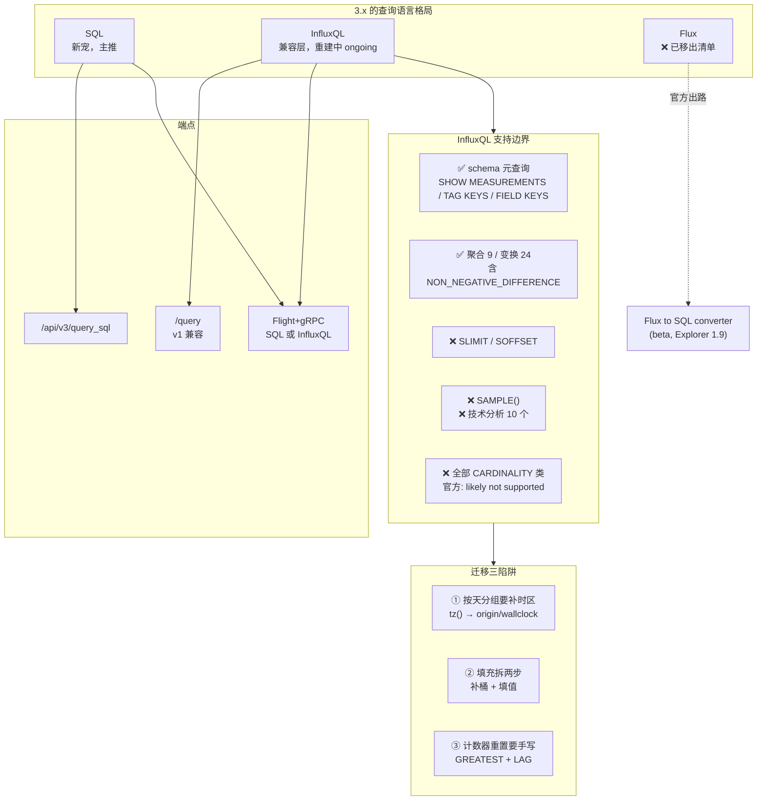

# 第 9 课：InfluxQL 与 Flux：遗产与迁移

> 所属阶段：阶段 3《数据模型与查询》｜ 水平：零基础 → 入门 ｜ 本课知识点：InfluxQL 兼容层 / Flux 为何被弃 / SQL 迁移对照表
> 故事情节：第三章终幕——新语言 SQL 已就位，但老代码还在跑。这一课要让两套语言在一个屋檐下共存

## 🎯 本课目标

- 知道 **3.x 只有两种查询语言**：**SQL** 和 **InfluxQL**（Core 官方 Query data 页面明文只列了这两者，**没有 Flux**）
- 掌握 InfluxQL 兼容层的**真实边界**：哪些支持、哪些明确不支持、哪些"可能永远不支持"
- 理解 **Flux 为何被弃**，以及官方给的出路（**Flux to SQL converter，beta**）
- 拿到一份**可直接照抄的迁移对照表**：InfluxQL / Flux → SQL

> 💻 承接第 3 课环境：Docker 容器名 `influxdb3-core`，端口 8181，token 已设进 `INFLUXDB3_AUTH_TOKEN`。
> 🔗 **回扣 L8**：`DATE_BIN` 的 origin 陷阱、`LAG` 是行偏移、3.x SQL 无 `increase()`——本课要把最后一条**修正**得更精确。

---

## 第一幕：起源与场景引入

L8 结束那天，你写了条 SQL 交给同事，他回了一句：**"这个用 `NON_NEGATIVE_DIFFERENCE()` 一行就搞定了，你写这么长干嘛？"**

你把 L8 的结论搬出来：**"官方说了，3.x 没有 `NON_NEGATIVE_DIFFERENCE()`。"**

同事不服，直接在 InfluxQL 里跑了一遍——**成了**。

你愣住了。回去翻官方文档，在 **InfluxQL feature support** 页面找到那张表，一个个图标看下来：

```
NON_NEGATIVE_DERIVATIVE()     ✅
NON_NEGATIVE_DIFFERENCE()     ✅
```

**它确实支持——在 InfluxQL 里支持。**

> 🎬 **场景**：L8 那句"3.x 没有 `increase()` / `NON_NEGATIVE_DIFFERENCE()`"**不够精确**。
>
> 官方原文的语境是 **SQL**：*"InfluxDB 3 **SQL** doesn't provide built-in equivalents to Flux's `increase()` or InfluxQL's `NON_NEGATIVE_DIFFERENCE()` functions."*
>
> 也就是说：**SQL 没有，但 InfluxQL 兼容层有**。你在 SQL 里写不了它，不代表你在 3.x 里用不了它——**换个查询语言就能用**。

这一课要解决三个问题：**3.x 到底支持哪几种语言、InfluxQL 能撑到什么程度、Flux 那段历史该怎么收场。**

---

## 第二幕：认知冲突

你可能会想：**"3.x 主推 SQL，那 InfluxQL 应该只是个摆设吧。"**

三个反直觉的事实：

**第一 · InfluxQL 在 3.x 是"正在重建中"，不是"完整移植"**。官方原文：*"InfluxQL is being **rearchitected** to work with the InfluxDB 3 storage engine. This process is **ongoing** and some InfluxQL features are still being implemented."*——注意 **ongoing** 这个词：它是一张**还在施工的地图**，不是一块完工的碑。

**第二 · 有一批功能被官方明确划为"可能永远不会支持"**。基数相关的元查询（metaqueries），官方原文说：*"Cardinality-related metaqueries will **likely not be supported** with the InfluxDB 3 storage engine."* 理由是——3.x 的存储引擎里，**基数不再是性能的限制因素**，所以这些查询失去了存在意义。**不是还没做，是不打算做。**

**第三 · Flux 在 3.x 里已经没有位置**。Core 官方 Query data 页面只列了两条路径：**Query data with SQL** 和 **Query data with InfluxQL**。**没有 Flux**。官方给出的出路是一个 **AI-assisted Flux to SQL converter（beta）**——连官方都认为 Flux 代码是"待转换的存量"，而不是"要继续写的东西"。

> ❓ **问题**：那 InfluxQL 具体能用到哪一步？哪些函数真的能用？迁移时该怎么对照着改？
>
> 这一课逐个回答，并给出**逐条核实过的支持清单**。

---

## 第三幕：层层揭示

### 知识点 1：InfluxQL 兼容层 —— 能用，但要知道边界在哪

#### 一句话定义
**InfluxQL 在 3.x 是一个"正在重建"的兼容层**：老查询大多数还能跑，但有一部分语法、一批函数、一类元查询**明确不能用了**。官方为此专门维护了一个 **InfluxQL feature support** 页面来记录进度。

#### 直觉建立：把它想成「老房子的改造工程」

- **SQL** 是**新盖的楼**——按 3.x 存储引擎从头设计，所有能力都原生支持。
- **InfluxQL** 是**老房子改造**——结构（v1 的数据模型）还在，但内部管线（迭代器、游标）全部重铺。改造**还在进行中**，有些房间暂时进不去。
- **Flux** 是**已经拆掉的旧楼**——原址上立了块牌子："请去新楼，我们有翻译服务。"

> ⚠️ **类比失效的边界**：老房子改造会"越改越好"（功能陆续补齐），但也有房间是**永久封死的**——基数类元查询就是，官方说"likely not supported"，因为地基换了，那些房间的存在前提没了。

#### 核心原理 A：数据模型映射（迁移的第一道坎）

官方原文（Core InfluxQL basic-query 页）：

> *"InfluxQL was designed around the InfluxDB **v1** data model, but can still be used to query data from InfluxDB 3 Core. When using the InfluxDB 3 Core InfluxQL implementation, the data model is different in the following ways:*
> - *an InfluxDB v1 **database and retention policy** combination is combined into a single InfluxDB 3 **database** entity.*
> - *an InfluxDB v1 **measurement** is equivalent to an InfluxDB 3 **table**."*

两句话，两个映射：

| InfluxDB v1 | InfluxDB 3 | 影响 |
|-------------|-----------|------|
| database + retention policy | **database**（合二为一） | 老代码里的 `db.rp.measurement` 三段式写法要改 |
| measurement | **table** | 概念不变，改名而已 |

> 📌 **实践含义**：**retention policy 这个层级在 3.x 被抹平了**。老代码里按 rp 区分冷热数据的写法，迁移时要改成按 database 划分（这正好呼应 L6 讲过的 **Core 只有 5 个数据库**的硬限制——分库策略必须提前想清楚）。

#### 核心原理 B：In-progress features（明确还没做完的）

官方原文的 **In-progress features** 一节，只有两条：

| 功能 | 状态 | 作用 |
|------|------|------|
| **`SLIMIT` clause** | ❌ 不支持 | 限制返回的 series 数量 |
| **`SOFFSET` clause** | ❌ 不支持 | 指定跳过多少个 series |

#### 核心原理 C：Metaqueries 支持表（逐条核实）

这是最容易踩坑的地方。官方表格的实际勾选状态（已逐条核实图标）：

| Metaquery | 3.x Core 支持 |
|-----------|--------------|
| `SHOW DATABASES` | ❌ |
| `SHOW RETENTION POLICIES` | ✅ |
| `SHOW MEASUREMENTS` | ✅ |
| `SHOW SERIES` | ❌ |
| `SHOW SERIES CARDINALITY` | ❌ |
| `SHOW TAG KEYS` | ✅ |
| `SHOW TAG KEY CARDINALITY` | ❌ |
| `SHOW TAG VALUES` | ✅ |
| `SHOW TAG VALUES CARDINALITY` | ❌ |
| `SHOW FIELD KEYS` | ✅ |
| `SHOW FIELD KEYS CARDINALITY` | ❌ |

**规律非常清晰**：

- ✅ 能用的：查 schema 结构（有哪些表、有哪些 tag/field）
- ❌ 不能用的：**一切带 CARDINALITY 的**，加上 `SHOW DATABASES` 和 `SHOW SERIES`

> 🎯 **这直接印证了 L7 的结论**：L7 讲过"基数类元查询很可能不被 3.x 支持，用 SQL `COUNT(DISTINCT ...)` 自己数"。**这里拿到了官方铁证**——不仅仅是不支持，官方还给了理由：*"With the InfluxDB 3 storage engine, series cardinality is no longer a limiting factor for database performance."*
>
> **不是没做完，是地基换了以后没必要做了。**

⚠️ **一个反直觉的细节**：`SHOW DATABASES` ❌，但 `SHOW RETENTION POLICIES` ✅。库都列不出来，却还能列保留策略——这正是"正在重建中"的痕迹。**别凭直觉推断，要以官方表格为准。**

#### 核心原理 D：函数支持表（逐条核实）

官方把函数分五类列出。下面是**逐条核实过的**实际状态：

**聚合函数（9 个，全部支持）**

| 函数 | 支持 | | 函数 | 支持 |
|------|------|---|------|------|
| `COUNT()` | ✅ | | `MODE()` | ✅ |
| `DISTINCT()` | ✅ | | `SPREAD()` | ✅ |
| `INTEGRAL()` | ✅ | | `STDDEV()` | ✅ |
| `MEAN()` | ✅ | | `SUM()` | ✅ |
| `MEDIAN()` | ✅ | | | |

**选择器函数（8 个，7 支持 / 1 不支持）**

| 函数 | 支持 | | 函数 | 支持 |
|------|------|---|------|------|
| `BOTTOM()` | ✅ | | `PERCENTILE()` | ✅ |
| `FIRST()` | ✅ | | **`SAMPLE()`** | **❌** |
| `LAST()` | ✅ | | `TOP()` | ✅ |
| `MAX()` | ✅ | | | |
| `MIN()` | ✅ | | | |

**变换函数（24 个，全部支持）**

`ABS()` `ACOS()` `ASIN()` `ATAN()` `ATAN2()` `CEIL()` `COS()` `CUMULATIVE_SUM()` `DERIVATIVE()` `DIFFERENCE()` `ELAPSED()` `EXP()` `FLOOR()` `LN()` `LOG()` `LOG2()` `LOG10()` `MOVING_AVERAGE()` **`NON_NEGATIVE_DERIVATIVE()`** **`NON_NEGATIVE_DIFFERENCE()`** `POW()` `ROUND()` `SIN()` `SQRT()` `TAN()` —— **全部 ✅**

> 🔴 **这就是本课开篇那个"打脸"的答案**：**`NON_NEGATIVE_DIFFERENCE()` 在 InfluxQL 里是 ✅ 受支持的**。L8 说的"没有"严格限定在 **SQL** 语境下。

**技术分析函数（10 个，全部不支持）**

`CHANDE_MOMENTUM_OSCILLATOR()` `DOUBLE_EXPONENTIAL_MOVING_AVERAGE()` `EXPONENTIAL_MOVING_AVERAGE()` `HOLT_WINTERS()` `HOLT_WINTERS_WITH_FIT()` `KAUFMANS_EFFICIENCY_RATIO()` `KAUFMANS_ADAPTIVE_MOVING_AVERAGE()` `RELATIVE_STRENGTH_INDEX()` `TRIPLE_EXPONENTIAL_MOVING_AVERAGE()` `TRIPLE_EXPONENTIAL_DERIVATIVE()` —— **全部 ❌**

**日期时间与其他（4 个，全部支持）**

`now()` ✅ · `time()` ✅ · `tz()` ✅ · `fill()` ✅

> 💡 **`tz()` 支持这一点很重要**——它是 InfluxQL 相对于 SQL 默认行为的一个"贴心之处"，下一节详讲。

#### 示例演示：InfluxQL 在 3.x 里怎么用

```sql
-- 探索 schema（官方原文示例）
SHOW MEASUREMENTS
SHOW FIELD KEYS FROM "measurement"
SHOW TAG KEYS FROM "measurement"
SHOW TAG VALUES FROM "measurement" WITH KEY = "tag-key" WHERE time > now() - 1d

-- 基础查询
SELECT temp, room FROM home WHERE time >= now() - 1h

-- 按天分组 + 填充 + 时区（官方 SELECT 语句原文示例）
SELECT mean("value") FROM "cpu"
GROUP BY region, time(1d) fill(0) tz('America/Chicago')
```

⚠️ **一个官方明确警告的性能陷阱**（`SHOW TAG VALUES` 相关）：

> *"We **strongly recommend** including a `FROM` clause with the `SHOW TAG VALUES` statement that specifies **1-50 tables** to query. Without a `FROM` clause, the InfluxDB query engine must read data from **all tables**... can result in poor query performance, query timeouts, or unnecessary resource allocation that may affect other queries."*

**不写 `FROM` 的 `SHOW TAG VALUES` 会拖垮整个实例**——这不是优化建议，是稳定性警告。

#### 常见误区

**误区 A**：*3.x 完全兼容 1.x 的 InfluxQL。*
❌ 错。是**正在重建中**（ongoing）。`SLIMIT`/`SOFFSET` 不支持，10 个技术分析函数不支持，4 个基数类元查询不支持，`SAMPLE()` 不支持。

**误区 B**：*`SHOW SERIES CARDINALITY` 以后会补上。*
❌ 错（大概率）。官方原文是 **"likely not to be supported"**，且给了理由——基数不再是性能瓶颈。**要数基数就用 SQL 的 `COUNT(DISTINCT ...)`。**

**误区 C**：*SQL 里没有 `NON_NEGATIVE_DIFFERENCE()`，所以 3.x 里彻底用不了了。*
❌ 错，这是本课最重要的修正。**SQL 里没有，InfluxQL 兼容层里有，且官方标 ✅。** 想用它就走 InfluxQL 端点。

#### 一句话记住
**InfluxQL 在 3.x 是"重建中"的兼容层：schema 类元查询和绝大多数函数都支持，但 `SLIMIT`/`SOFFSET`、10 个技术分析函数、`SAMPLE()` 和全部基数类查询不可用——要数基数就用 SQL 的 `COUNT(DISTINCT ...)`。**

---

### 知识点 2：Flux 为何被弃 —— 一段值得记住的产品教训

#### 一句话定义
**Flux 是 InfluxDB 2.x 主推的函数式数据脚本语言，在 3.x 中被彻底移出查询语言清单**。官方给出的出路是 **AI-assisted Flux to SQL converter（beta，随 Explorer 1.9 发布）**。

#### 直觉建立：把它想成「一门难学的方言」

- **InfluxQL** 像"带口音的 SQL"——你会 SQL 就能猜个八九不离十。
- **Flux** 像"一门新外语"——管道操作符 `|>`、自己的类型系统、自己的包管理、函数式思维。功能强大，但**你得从头学**。
- **SQL** 是"普通话"——人人都会，工具链成熟，招聘市场上有大量现成的人。

**Flux 的问题不是功能不够，是学习成本没有换来对应的收益。**

> ⚠️ **类比失效的边界**：方言被弃通常是因为"用的人少"。Flux 的特殊之处在于——它被弃的**公开理由之一**是它没有解决最痛的那个问题（高基数）。所以这不只是一个"用户习惯"问题，也是一个"技术收益"问题。

#### 核心原理：官方事实与官方出路

**事实一 · 3.x 的查询语言清单里没有 Flux**

Core 官方 Query data 页面的完整内容只有两条路径：

> *"Learn to query data in InfluxDB 3 Core."*
> → **Query data with SQL**
> → **Query data with InfluxQL**

**没有 Flux。** 而导航里 Flux 是作为**独立产品线**（与 InfluxDB 1、InfluxDB 2 并列）存在的——它是"另一种产品的语言"，不再是 3.x 的一部分。

**事实二 · 官方提供了 Flux → SQL 转换器**

官方文档站点上的 Explorer 1.9 发布公告原文：

> *"**Flux to SQL converter (beta)**: Convert Flux queries to SQL with an AI-assisted converter."*

**这句话信息量极大**：官方自己都认为 Flux 代码是**待转换的存量资产**，而不是值得继续写的东西。连转换工具都做出来了——**这就是"被弃"最硬的证据**。

**事实三 · 执行查询的三种方式（官方原文）**

> *"InfluxDB client libraries and Flight clients can use the **Flight+gRPC** protocol to query with **SQL or InfluxQL** and retrieve data in the **Arrow in-memory format**.
> HTTP clients can use the **InfluxDB v1 /query REST API** to query with **InfluxQL** and retrieve data in **JSON** format."*

注意：**Flight 客户端支持 SQL 或 InfluxQL；HTTP v1 API 只支持 InfluxQL。**

#### 示例演示：端点对照（这是迁移时要改的地方）

| 语言 | 端点 | 返回格式 | 官方 curl 示例 |
|------|------|----------|----------------|
| **SQL** | `/api/v3/query_sql` | Arrow（Flight）/ JSON（HTTP） | `curl --get http://localhost:8181/api/v3/query_sql \`<br>`--header "Authorization: Token AUTH_TOKEN" \`<br>`--data-urlencode "db=DATABASE_NAME" \`<br>`--data-urlencode "q=SELECT * FROM home"` |
| **InfluxQL**（v1 兼容） | `/query` | JSON | `curl --get http://localhost:8181/query \`<br>`--header "Authorization: Token AUTH_TOKEN" \`<br>`--data-urlencode "db=DATABASE_NAME" \`<br>`--data-urlencode "q=SELECT * FROM home"` |

**两个端点都在 8181 端口，都用 `db=` 和 `q=` 参数，都用 `Authorization: Token`**——**只有路径不同**。这让迁移的机械改造成本很低：改个 URL 就能让老代码继续跑。

#### 常见误区

**误区 D**：*Flux 在 3.x 里还能用，只是不推荐。*
❌ 错。Core 官方查询入口**根本没列 Flux**。它不是"不推荐"，是**不在支持清单里**。

**误区 E**：*InfluxQL 和 Flux 一样都要被淘汰。*
❌ 错。两者地位完全不同：**InfluxQL 在 3.x 有专门的兼容层、专门的文档章节、专门的 feature-support 页面**（还在持续施工）；**Flux 什么都没有，只有一个转换器**。

**误区 F**：*HTTP API 也能查 SQL。*
⚠️ 要分清楚：**Flight 客户端可查 SQL 和 InfluxQL**；**HTTP v1 `/query` 只查 InfluxQL**；SQL 走 **`/api/v3/query_sql`**。别混用。

#### 一句话记住
**3.x 只认两种语言：SQL（新宠）和 InfluxQL（兼容层）。Flux 已被移出清单，官方出路是 Flux to SQL converter（beta）——连转换器都做了，就是最明确的弃用信号。**

---

### 知识点 3：SQL 迁移对照表 —— 逐条可抄

#### 一句话定义
**一份 InfluxQL / Flux 常用写法到 SQL 的对照表**，覆盖四件事：schema 探索、时间分组、缺失值填充、计数器重置。

#### 直觉建立：把它想成「一张翻译对照表」

迁移不是"重写"，是**逐条翻译**。每一条老写法都有对应的新写法——**但有三条不是一一对应，需要理解语义差异**：

1. **时间分组**：按小时两者一致，按天**分家**（origin 默认值不同）
2. **填充语义**：InfluxQL 一个 `fill()` 全包，SQL 要**拆成补桶 + 填值两个动作**
3. **计数器重置**：InfluxQL 有现成函数，SQL 要**手写表达式**

> ⚠️ **类比失效的边界**：翻译对照表的前提是"两种语言表达力相当"。但这里**不是**——SQL 缺 `NON_NEGATIVE_DIFFERENCE()`，InfluxQL 缺窗口函数和 CTE。**翻译有时会"词不达意"，需要改写而非直译。**

#### 核心原理 A：schema 探索对照

| 目的 | InfluxQL | SQL |
|------|----------|-----|
| 列出所有表 | `SHOW MEASUREMENTS` | `SHOW TABLES` |
| 列出某表所有列 | `SHOW FIELD KEYS FROM home` | `SHOW COLUMNS IN home` |
| 列出 tag key | `SHOW TAG KEYS FROM home` | `SHOW COLUMNS IN home`（看类型区分） |
| 列出 tag 取值 | `SHOW TAG VALUES FROM home WITH KEY = "room"` | `SELECT DISTINCT room FROM home` |
| 数 series 基数 | ❌ `SHOW SERIES CARDINALITY` **不支持** | ✅ `COUNT(DISTINCT ...)` 自己算 |

> 📌 最后一行是**关键替换**：基数类查询在 InfluxQL 走不通，必须改用 SQL 的 `COUNT(DISTINCT ...)`。

#### 核心原理 B：时间分组 —— 按小时一致，按天分家

这是本课**最需要理解（而非照抄）**的一条。

| | InfluxQL | SQL |
|---|----------|-----|
| 按小时 | `GROUP BY time(1h)` | `DATE_BIN(INTERVAL '1 hour', time)` |
| 按天（默认） | `GROUP BY time(1d)` | `DATE_BIN(INTERVAL '1 day', time)` |
| 按天（指定时区） | `GROUP BY time(1d) tz('Asia/Shanghai')` ✅ | 需显式 origin 或 `date_bin_wallclock` |

**为什么按小时一致、按天分家？**

- **按小时**：1 小时能整除 1 天，无论 origin 取 epoch 还是别的，边界都在整点。**两者默认行为一致。**
- **按天**：InfluxQL 可以用 `tz()` 显式指定时区；**SQL 的 `DATE_BIN` 默认 origin 是 Unix epoch**，对 UTC+8 用户意味着"一天"从**北京时间 08:00** 开始（L8 详述过）。

> 🎯 **迁移时的实操判据**：**凡是老代码里带 `tz()` 的按天分组，迁到 SQL 时绝不能直接照抄成 `DATE_BIN(INTERVAL '1 day', time)`**——那会静默错位 8 小时。必须补上 origin 或改用 `date_bin_wallclock`。

#### 核心原理 C：填充语义 —— 一个函数 vs 两个动作

InfluxQL 的 `fill()` 是 `GROUP BY` 的**子句**，一个关键字搞定。SQL 里**补桶和填值是两个独立的动作**。

| InfluxQL `fill()` | 语义 | SQL 对应写法 |
|-------------------|------|-------------|
| `fill(null)` | 填 NULL | `date_bin_gapfill(...)` 默认（不套函数） |
| `fill(0)` | 填 0 | `COALESCE(COUNT(x), 0)` |
| `fill(previous)` | 沿用上一个值 | `locf(avg(x))` |
| `fill(linear)` | 线性插值 | `interpolate(avg(x))` |
| `fill(none)` | 不补桶，缺的整段消失 | `date_bin(...)`（普通版，非 gapfill） |

**两个硬性约束**（L8 讲过，迁移时最容易忘）：

1. `date_bin_gapfill` **必须带时间上下界**（官方原文 *"requires time bounds in the WHERE clause"*）
2. `interpolate` / `locf` 的参数**必须包含聚合函数**（如 `interpolate(avg(temp))`）

> 💡 **注意 `fill(0)` 这一行**：SQL 侧不能直接给 0。`interpolate` 给的是插值，`locf` 给的是前值，**都不是 0**。要 0 必须 `COALESCE(COUNT(...), 0)`。

#### 核心原理 D：计数器重置 —— InfluxQL 有函数，SQL 要手写

| | 写法 |
|---|------|
| **InfluxQL** | `SELECT NON_NEGATIVE_DIFFERENCE(requests) FROM ...` ✅ **直接支持** |
| **SQL** | `GREATEST(requests - LAG(requests) OVER (PARTITION BY host ORDER BY time), 0)` ← **手写** |

需要累计时，SQL 还要再套一层 CTE：

```sql
WITH counter_diffs AS (
  SELECT DATE_BIN(INTERVAL '1 hour', time) AS bucket, host, requests,
    GREATEST(requests - LAG(requests) OVER (PARTITION BY host ORDER BY time), 0)
      AS increase
  FROM metrics
)
SELECT bucket, host, SUM(increase) AS total
FROM counter_diffs
WHERE increase > 0          -- 过滤首行(NULL)与重置行(0)
GROUP BY bucket, host
```

> 🔑 **决策建议**：**如果你的查询重度依赖 `NON_NEGATIVE_DIFFERENCE()` / `DERIVATIVE()` / `CUMULATIVE_SUM()`，先别急着迁到 SQL**——这些在 InfluxQL 里是一行的事，在 SQL 里要手写窗口函数。**混合使用完全可行**：日常查询走 SQL，这几类老查询继续走 InfluxQL（`/query` 端点）。

#### 常见误区

**误区 G**：*迁移就是把 `GROUP BY time(1d)` 换成 `DATE_BIN(INTERVAL '1 day', time)`。*
❌ **这是本课最危险的误区**。老代码若带 `tz()`，直接替换会**静默错位 8 小时**——不报错，数字全偏。

**误区 H**：*`fill(previous)` 对应 SQL 的 `LAG()`。*
❌ 错。`fill(previous)` 填的是**缺失时间桶**的值，对应 `locf()`；`LAG()` 是**取前一行**，两者解决的是不同问题。

**误区 I**：*既然 InfluxQL 也能用，那就不必学 SQL 了。*
❌ 错。InfluxQL 是**兼容层，功能在重建中**（`SLIMIT`、`SAMPLE()`、10 个技术分析函数、全部基数查询都不可用），且**没有窗口函数和 CTE**。新功能只会加在 SQL 上——**新代码一律写 SQL，InfluxQL 只用来跑存量老查询。**

#### 一句话记住
**迁移不是机械替换：按天分组要补时区（`tz()` → origin/wallclock），填充要拆成补桶 + 填值两步，计数器重置要手写 `GREATEST` + `LAG`。重度依赖 InfluxQL 特有函数的查询，可以留在 InfluxQL 端点继续跑。**

---

## 第四幕：实操验证

> 💻 承接第 3 课环境（容器 `influxdb3-core`，端口 8181）。
> 🧪 本课实验 A **已在本机 Python 3.11 实跑**（不依赖 Docker），输出逐字贴出。

### 实验 A：InfluxQL ↔ SQL 语义对照模拟器（本机实跑）

这个模拟器把三处"不是一一对应"的迁移陷阱**用纯计算复现**。

> 📌 **下面这份脚本与随后的实跑输出严格一一对应**，可直接复制运行（本机 Python 3.11 实测通过）。核心是 `date_bin` 那 4 行，其余是四个对照场景的打印。

```python
from datetime import datetime, timedelta, timezone

EPOCH = datetime(1970, 1, 1, tzinfo=timezone.utc)   # SQL DATE_BIN 的默认 origin
UTC, CN = timezone.utc, timezone(timedelta(hours=8))
STEP = {"1h": 3600, "1d": 86400}

def date_bin(step_key, ts, origin=EPOCH):
    """模拟 date_bin：返回 ts 所在桶的起始时刻"""
    step = STEP[step_key]
    delta = (ts - origin).total_seconds()
    return origin + timedelta(seconds=(delta // step) * step)

def parse(s):
    """按 UTC 解析无时区后缀的时间串"""
    return datetime.fromisoformat(s).replace(tzinfo=UTC)

def fmt(dt, tz):
    return dt.astimezone(tz).strftime("%Y-%m-%d %H:%M")

# ---- 对照 1：按小时分组，两者是否一致 ----
print("=" * 78)
print("对照 1 · 按小时分组：InfluxQL 与 SQL 默认行为是否一致")
print("=" * 78)
print("桶大小 1 小时。InfluxQL: GROUP BY time(1h)   SQL: DATE_BIN(INTERVAL '1 hour', time)")
print("-" * 78)
print("%-22s | %-22s | %s" % ("数据时刻 (UTC)", "两者都是", "是否一致"))
print("-" * 78)
for s in ["2024-03-18T10:15:00", "2024-03-18T10:59:59", "2024-03-18T11:00:00"]:
    ts = parse(s)
    b = date_bin("1h", ts)
    print("%-22s | %-22s | %s" % (fmt(ts, UTC), fmt(b, UTC), "✅ 一致"))
print()
print("  结论：按**小时**分组时，InfluxQL 与 SQL 默认行为一致")
print("        （1 小时能整除 1 天，origin 偏移不改变边界）")

# ---- 对照 2：按天分组，分水岭 ----
print()
print("=" * 78)
print("对照 2 · 按天分组：这是分水岭")
print("=" * 78)
bj = {"2024-03-18 00:30": "2024-03-17T16:30:00",
      "2024-03-18 07:59": "2024-03-17T23:59:00",
      "2024-03-18 08:00": "2024-03-18T00:00:00",
      "2024-03-19 07:00": "2024-03-18T23:00:00"}
print("%-18s | %-20s | %-20s" % ("数据时刻(北京)", "InfluxQL tz 修复后", "SQL 默认 origin"))
print("-" * 78)
for s, u in bj.items():
    ts = parse(u)
    # InfluxQL 带 tz('Asia/Shanghai')：按北京时间对齐 → 等效 origin = epoch + 16h
    b_ql = date_bin("1d", ts, parse("1970-01-01T16:00:00"))
    # SQL 默认 origin = Unix epoch
    b_sql = date_bin("1d", ts, EPOCH)
    ql_ok = "✅" if fmt(b_ql, CN)[:10] == s[:10] else "❌"
    sql_ok = "✅" if fmt(b_sql, CN)[:10] == s[:10] else "❌"
    print("%-18s | %-20s | %-20s" % (
        s, "%s %s" % (fmt(b_ql, CN)[:10], ql_ok),
        "%s %s" % (fmt(b_sql, CN)[:10], sql_ok)))
print()
print("  解读：")
print("   · InfluxQL 用 tz('Asia/Shanghai') 后，'一天'按北京时间 00:00 切分 ✅")
print("   · SQL 用默认 origin，'一天'从北京时间 08:00 切分 ❌（凌晨数据算进前一天）")
print("   · SQL 要对齐，需显式 origin 或 date_bin_wallclock")

# ---- 对照 3：fill() 语义 ----
print()
print("=" * 78)
print("对照 3 · fill() 语义：InfluxQL 内建 vs SQL 三选一")
print("=" * 78)
print("缺失桶的填充方式对照:")
print("-" * 78)
rows = [
    ("null", "填 NULL", "date_bin_gapfill 默认行为（不套函数）"),
    ("0", "填 0", "COALESCE(COUNT(x), 0)  ← 注意 gapfill 无法直接给 0"),
    ("previous", "沿用上一个值", "locf(avg(x))"),
    ("linear", "线性插值", "interpolate(avg(x))"),
    ("none", "不补桶，缺的整段消失", "date_bin（普通版，非 gapfill）"),
]
print("%-12s | %-22s | %s" % ("InfluxQL fill()", "语义", "SQL 对应写法"))
print("-" * 78)
for a, b, c in rows:
    print("%-12s | %-22s | %s" % (a, b, c))
print()
print("  官方事实（Core InfluxQL feature support）：fill() ✅ 受支持")
print("  注意：InfluxQL 的 fill() 是 GROUP BY 的子句；SQL 里补桶与填值是两个独立动作")

# ---- 对照 4：计数器重置 ----
print()
print("=" * 78)
print("对照 4 · NON_NEGATIVE_DIFFERENCE()：InfluxQL 有，SQL 没有")
print("=" * 78)
vals = [1000, 1250, 1600, 50, 300]   # 第 4 个是计数器重置
print("计数器序列:", vals)
print("-" * 78)
print("%-4s | %-10s | %-14s | %s" % ("序号", "当前值", "普通差值", "非负差值(NN_D)"))
print("-" * 78)
prev = None
for i, v in enumerate(vals):
    if prev is None:
        print("%-4d | %-10d | %-14s | %s" % (i, v, "NULL", "NULL"))
    else:
        diff = v - prev
        print("%-4d | %-10d | %-14d | %d%s" % (
            i, v, diff, max(diff, 0), "  <- 重置被归零" if diff < 0 else ""))
    prev = v
print()
print("  InfluxQL: SELECT NON_NEGATIVE_DIFFERENCE(requests) FROM ...   ✅ 直接支持")
print("  SQL     : GREATEST(requests - LAG(requests) OVER (...), 0)     ← 必须手写")
print("  官方事实（Core InfluxQL feature support）：NON_NEGATIVE_DIFFERENCE() ✅ 受支持")
```

```
==============================================================================
对照 1 · 按小时分组：InfluxQL 与 SQL 默认行为是否一致
==============================================================================
桶大小 1 小时。InfluxQL: GROUP BY time(1h)   SQL: DATE_BIN(INTERVAL '1 hour', time)
------------------------------------------------------------------------------
数据时刻 (UTC)             | 两者都是                   | 是否一致
------------------------------------------------------------------------------
2024-03-18 10:15       | 2024-03-18 10:00       | ✅ 一致
2024-03-18 10:59       | 2024-03-18 10:00       | ✅ 一致
2024-03-18 11:00       | 2024-03-18 11:00       | ✅ 一致

  结论：按**小时**分组时，InfluxQL 与 SQL 默认行为一致
        （1 小时能整除 1 天，origin 偏移不改变边界）

==============================================================================
对照 2 · 按天分组：这是分水岭
==============================================================================
数据时刻(北京)           | InfluxQL tz 修复后      | SQL 默认 origin
------------------------------------------------------------------------------
2024-03-18 00:30   | 2024-03-18 ✅         | 2024-03-17 ❌
2024-03-18 07:59   | 2024-03-18 ✅         | 2024-03-17 ❌
2024-03-18 08:00   | 2024-03-18 ✅         | 2024-03-18 ✅
2024-03-19 07:00   | 2024-03-19 ✅         | 2024-03-18 ❌

  解读：
   · InfluxQL 用 tz('Asia/Shanghai') 后，'一天'按北京时间 00:00 切分 ✅
   · SQL 用默认 origin，'一天'从北京时间 08:00 切分 ❌（凌晨数据算进前一天）
   · SQL 要对齐，需显式 origin 或 date_bin_wallclock

==============================================================================
对照 3 · fill() 语义：InfluxQL 内建 vs SQL 三选一
==============================================================================
缺失桶的填充方式对照:
------------------------------------------------------------------------------
InfluxQL fill() | 语义                     | SQL 对应写法
------------------------------------------------------------------------------
null         | 填 NULL                 | date_bin_gapfill 默认行为（不套函数）
0            | 填 0                    | COALESCE(COUNT(x), 0)  ← 注意 gapfill 无法直接给 0
previous     | 沿用上一个值                 | locf(avg(x))
linear       | 线性插值                   | interpolate(avg(x))
none         | 不补桶，缺的整段消失             | date_bin（普通版，非 gapfill）

  官方事实（Core InfluxQL feature support）：fill() ✅ 受支持
  注意：InfluxQL 的 fill() 是 GROUP BY 的子句；SQL 里补桶与填值是两个独立动作

==============================================================================
对照 4 · NON_NEGATIVE_DIFFERENCE()：InfluxQL 有，SQL 没有
==============================================================================
计数器序列: [1000, 1250, 1600, 50, 300]
------------------------------------------------------------------------------
序号   | 当前值        | 普通差值           | 非负差值(NN_D)
------------------------------------------------------------------------------
0    | 1000       | NULL           | NULL
1    | 1250       | 250            | 250
2    | 1600       | 350            | 350
3    | 50         | -1550          | 0  <- 重置被归零
4    | 300        | 250            | 250

  InfluxQL: SELECT NON_NEGATIVE_DIFFERENCE(requests) FROM ...   ✅ 直接支持
  SQL     : GREATEST(requests - LAG(requests) OVER (...), 0)     ← 必须手写
  官方事实（Core InfluxQL feature support）：NON_NEGATIVE_DIFFERENCE() ✅ 受支持
```

**判断成功的标准**：

1. **对照 1**：按小时分组两者**完全一致**——凡是按小时的老查询，可以放心机械替换。
2. **对照 2**：**这是本课最该看懂的一张表**。按天分组时，InfluxQL（`tz()` 修复后）4 行全 ✅，SQL 默认 origin **3 行 ❌**。→ **带 `tz()` 的按天分组不能直译。**
3. **对照 3**：五种 `fill()` 各有对应，注意 `fill(0)` 在 SQL 侧**必须**走 `COALESCE`。
4. **对照 4**：序号 3 处发生计数器重置，普通差值 **-1550**，非负差值归为 **0**。**InfluxQL 一行搞定，SQL 要手写 `GREATEST` + `LAG`。**

### 实验 B：两个端点各跑一遍（真实库）

同一条查询，分别走 SQL 与 InfluxQL 端点：

```bash
# SQL 端点：/api/v3/query_sql
curl --get http://localhost:8181/api/v3/query_sql \
  --header "Authorization: Token $INFLUXDB3_AUTH_TOKEN" \
  --data-urlencode "db=metrics" \
  --data-urlencode "q=SELECT * FROM home"

# InfluxQL 端点（v1 兼容）：/query
curl --get http://localhost:8181/query \
  --header "Authorization: Token $INFLUXDB3_AUTH_TOKEN" \
  --data-urlencode "db=metrics" \
  --data-urlencode "q=SELECT * FROM home"
```

**判断成功的标准**：

1. 两个端点**返回相同的数据**——只有路径不同，参数（`db=`、`q=`、`Authorization: Token`）完全一致。
2. SQL 端点返回格式由 `format` 参数控制；InfluxQL 端点返回 **JSON**。
3. 若第二个返回 401，检查 token 是否仍有效。

### 实验 C：验证 InfluxQL 的支持边界（真实库）

逐条试，看哪些能跑通、哪些报错：

```bash
Q() {
  curl --get http://localhost:8181/query \
    --header "Authorization: Token $INFLUXDB3_AUTH_TOKEN" \
    --data-urlencode "db=metrics" --data-urlencode "q=$1"
}

Q "SHOW MEASUREMENTS"                          # ✅ 应成功
Q "SHOW TAG KEYS FROM home"                    # ✅ 应成功
Q "SHOW SERIES CARDINALITY"                    # ❌ 应失败（官方 likely not supported）
Q "SELECT SAMPLE(temp, 3) FROM home"           # ❌ 应失败（SAMPLE() 不支持）
Q "SELECT NON_NEGATIVE_DIFFERENCE(requests) FROM metrics"   # ✅ 应成功
Q "SELECT HOLT_WINTERS(temp, 10, 3) FROM home"              # ❌ 应失败（技术分析类）
```

**判断成功的标准**：

1. 标注 ✅ 的三条应**成功返回**。
2. 标注 ❌ 的三条应**报错**——把报错信息记下来，这就是迁移时会撞到的墙。
3. **特别注意第 5 条**（`NON_NEGATIVE_DIFFERENCE()`）：它能跑通，这验证了本课开篇那个"打脸"场景。

> 💡 上面用 shell 函数 `Q()` 仅为缩短篇幅。若你的 shell 不支持函数，把 `Q "..."` 直接展开成对应的 `curl --get ... --data-urlencode "q=..."` 即可。

---

## 第五幕：体系收束

### 一图总结



### 三句话收束本课

1. **3.x 只有两种查询语言**：SQL（主推）和 InfluxQL（兼容层，仍在重建中）；**Flux 已被移出清单**，官方出路是 Flux to SQL converter。
2. **InfluxQL 的边界要以官方表格为准**：schema 类元查询和绝大多数函数可用，但 `SLIMIT`/`SOFFSET`、`SAMPLE()`、10 个技术分析函数、全部基数类查询不可用。
3. **迁移不是机械替换**：按天分组要补时区、填充要拆两步、计数器重置要手写表达式——**三条都不是直译**。

### 📍 全局定位

```
阶段 1 问题与定位 ── ✅ 已完成（L1-L2）
阶段 2 上手篇     ── ✅ 已完成（L3-L5）
阶段 3 数据模型与查询 ── ✅ 已完成（L6-L9，12 / 12 知识点）  ← 阶段收官
阶段 4 存储引擎与性能 ── ⬜ 下一站（L10-L12）
```

**L6 补上了什么**：数据怎么组织、schema 何时定型。
**L7 补上了什么**：哪些维度该做成 tag（基数是乘法）。
**L8 补上了什么**：怎么把设计好的数据查出来（`DATE_BIN`、窗口函数、CTE）。
**L9 补上了什么**：**老代码怎么共存与迁移**——InfluxQL 兼容层的真实边界、Flux 的收场、三条非直译的迁移陷阱。

> 🎬 **阶段 3 收官**：到这一课，阶段 3 的 12 个知识点全部交付。你从"能操作 InfluxDB"（阶段 2）走到了 **"能用对它，也能接住历史包袱"**。
>
> **下一阶段（阶段 4《存储引擎与性能》）** 要回答一个更底层的问题：**为什么 DataFusion + Parquet 这么快、边界在哪**——那也是开课时"向量数据库"误解的**最终闭环**（L11《向量化执行》）。

### 🔗 下一步

- **立即可做**：把团队里所有带 `tz()` 的按天 InfluxQL 查询列出来，逐个核对迁 SQL 后是否错位
- **下一课**：第 10 课《存储引擎：WAL、Parquet 与压实》（阶段 4 开篇）

### 🎯 落地视角小结

1. **先做语言盘点，再谈迁移**。别一上来就把 InfluxQL 全改成 SQL。正确顺序是：① 列出所有存量查询 → ② 用本课的支持表逐条判定"能不能直译" → ③ 能直译的批量改，不能直译的（重度依赖 `NON_NEGATIVE_DIFFERENCE()` / `DERIVATIVE()` / `CUMULATIVE_SUM()`）**先留在 InfluxQL 端点**。混合使用是被官方支持的工作方式。

2. **带 `tz()` 的按天分组是头号静默杀手**。L8 讲了 SQL 侧的 origin 陷阱，本课补上了另一半：**InfluxQL 的 `tz()` 恰恰是老代码里"做对了"的地方**，机械替换成 `DATE_BIN(INTERVAL '1 day', time)` 会把对的改成错的。**迁移前先 grep 一遍 `tz(`。**

3. **`SHOW TAG VALUES` 不带 `FROM` 会拖垮实例**。这是官方用 "strongly recommend" + "poor query performance / query timeouts / affect other queries" 措辞警告的。**它不是慢，是可能影响其他所有查询**。写进团队规范：**必须带 `FROM`，且限制在 1-50 张表**。

4. **基数类查询的替换方案要提前准备好**。L7 说"用 `COUNT(DISTINCT ...)` 自己数"，本课拿到了官方铁证（"likely not supported"）。**把这句替换写进运维手册**，否则哪天有人想查基数会发现所有老命令都失效。

5. **端点改造的机械成本很低**。`db=`、`q=`、`Authorization: Token` 三个参数都一样，**只改路径**（`/query` ↔ `/api/v3/query_sql`）。这意味着**灰度迁移很便宜**——可以一个查询一个查询地切，出问题随时切回去。

6. **Flux 代码别再投入了**。官方做了 AI 转换器（beta）这件事本身就是信号。如果团队还有 Flux 资产，**现在的策略应该是"转换 + 归档"，而不是"维护 + 新增"**。

7. **`SHOW DATABASES` 不支持但 `SHOW RETENTION POLICIES` 支持**这种反直觉细节，说明兼容层还在施工。**别凭直觉推断支持与否，以官方 feature-support 页为准**，而且**每次升级版本都要重新核一遍**——那张表的标题是 "ongoing"。

---

## 🐞 本课误区速查

| # | 误区 | 真相 |
|---|------|------|
| 1 | 3.x 完全兼容 1.x 的 InfluxQL | ❌ **正在重建中**（官方原文 ongoing）；`SLIMIT`/`SOFFSET`、10 个技术分析函数、`SAMPLE()`、基数类查询均不支持 |
| 2 | `SHOW SERIES CARDINALITY` 以后会补上 | ❌ 官方 **"likely not to be supported"**；3.x 基数不再是瓶颈 → 用 SQL `COUNT(DISTINCT ...)` |
| 3 | SQL 没有 `NON_NEGATIVE_DIFFERENCE()`，所以 3.x 彻底用不了 | ❌ **SQL 里没有，InfluxQL 里有且标 ✅**；想用就走 `/query` 端点 |
| 4 | Flux 在 3.x 还能用，只是不推荐 | ❌ Core 官方查询入口**根本没列 Flux**；它已不在支持清单 |
| 5 | InfluxQL 和 Flux 一样都要被淘汰 | ❌ 地位完全不同：InfluxQL 有兼容层 + 文档 + feature-support 页（还在施工）；Flux 只有一个转换器 |
| 6 | HTTP API 也能查 SQL | ⚠️ Flight 可查 SQL/InfluxQL；HTTP v1 `/query` **只查 InfluxQL**；SQL 走 `/api/v3/query_sql` |
| 7 | 迁移就是把 `GROUP BY time(1d)` 换成 `DATE_BIN(INTERVAL '1 day', time)` | ❌ **头号陷阱**：老代码带 `tz()` 时直译会**静默错位 8 小时** |
| 8 | `fill(previous)` 对应 SQL 的 `LAG()` | ❌ `fill(previous)` 填的是**缺失时间桶** → `locf()`；`LAG()` 取的是**前一行**，两回事 |
| 9 | `fill(0)` 在 SQL 里用 `interpolate` 实现 | ❌ `interpolate` 给插值、`locf` 给前值，**都非 0**；要 0 用 `COALESCE(COUNT(x), 0)` |
| 10 | InfluxQL 也能用，那就不必学 SQL 了 | ❌ InfluxQL 是兼容层，**无窗口函数、无 CTE**，功能还在重建；新功能只加在 SQL 上 |
| 11 | `SHOW TAG VALUES` 不带 `FROM` 只是慢一点 | ❌ 官方警告可能 **timeout 并影响其他查询**；必须带 `FROM`，限 1-50 表 |
| 12 | 按小时分组也要担心 origin 陷阱 | ❌ 1 小时能整除 1 天，**边界不受 origin 影响**；只有按天（及更大/非整除单位）才需警惕 |
| 13 | v1 的 database 和 retention policy 在 3.x 都还在 | ❌ **两者合并成一个 database**；按 rp 分冷热的写法要改成按库划分 |
| 14 | 变换函数（如 `DERIVATIVE()`）在 3.x 也不支持 | ❌ 24 个变换函数**全部 ✅ 支持**，含 `NON_NEGATIVE_DERIVATIVE()` |

---

## 📚 官方文档

| 内容 | 链接 |
|------|------|
| Query data in InfluxDB 3 Core（**证明只有 SQL 与 InfluxQL 两种语言**） | https://docs.influxdata.com/influxdb3/core/query-data/ |
| Execute queries（**端点对照：`/api/v3/query_sql` 与 `/query`**） | https://docs.influxdata.com/influxdb3/core/query-data/execute-queries/ |
| **InfluxQL feature support**（本课核心：支持矩阵 + 官方 "ongoing" 声明） | https://docs.influxdata.com/influxdb3/core/reference/influxql/feature-support/ |
| InfluxQL reference（语法规范：EBNF、子句、字面量） | https://docs.influxdata.com/influxdb3/core/reference/influxql/ |
| InfluxQL internals（迭代器、游标——理解性能特性） | https://docs.influxdata.com/influxdb3/core/reference/influxql/internals/ |
| Perform a basic InfluxQL query（**v1→v3 数据模型映射**原文） | https://docs.influxdata.com/influxdb3/core/query-data/influxql/basic-query/ |
| Explore your schema with InfluxQL（**`SHOW TAG VALUES` 必须带 FROM** 的官方警告） | https://docs.influxdata.com/influxdb3/core/query-data/influxql/explore-schema/ |
| Flux documentation（Flux 作为独立产品线的定位） | https://docs.influxdata.com/flux/ |
| InfluxDB API client libraries（v1/v2/v3 客户端库对照） | https://docs.influxdata.com/influxdb3/core/reference/client-libraries/ |

## 📋 本课速查卡

### 3.x 查询语言与端点

| 语言 | 定位 | 端点 | 格式 |
|------|------|------|------|
| **SQL** | 主推，新功能都在这里 | `/api/v3/query_sql` | Arrow / JSON |
| **InfluxQL** | 兼容层，重建中（ongoing） | `/query`（v1 兼容） | JSON |
| **Flux** | ❌ 已移出清单 | — | 用 Flux to SQL converter (beta) |

> Flight+gRPC 客户端可查 **SQL 或 InfluxQL**，返回 Arrow 格式。

### InfluxQL 支持矩阵（Core，逐条核实）

| 类别 | 支持 | 不支持 |
|------|------|--------|
| **Metaqueries** | `SHOW MEASUREMENTS` / `SHOW TAG KEYS` / `SHOW TAG VALUES` / `SHOW FIELD KEYS` / `SHOW RETENTION POLICIES` | `SHOW DATABASES` / `SHOW SERIES` / **全部 4 个 CARDINALITY 类** |
| **聚合函数（9）** | 全部 ✅ | — |
| **选择器（8）** | 7 个 ✅ | **`SAMPLE()`** |
| **变换函数（24）** | 全部 ✅（含 `NON_NEGATIVE_DIFFERENCE()` / `DERIVATIVE()` / `CUMULATIVE_SUM()`） | — |
| **技术分析（10）** | — | **全部 ❌**（HOLT_WINTERS 等） |
| **时间/其他（4）** | `now()` `time()` `tz()` `fill()` 全部 ✅ | — |
| **子句** | — | **`SLIMIT` / `SOFFSET`** |

### v1 → v3 数据模型映射

| InfluxDB v1 | InfluxDB 3 |
|-------------|-----------|
| database + retention policy | **database**（合二为一） |
| measurement | **table** |

### 迁移对照（四条核心）

| 场景 | InfluxQL | SQL |
|------|----------|-----|
| 列所有表 | `SHOW MEASUREMENTS` | `SHOW TABLES` |
| 列所有列 | `SHOW FIELD KEYS FROM t` | `SHOW COLUMNS IN t` |
| 数基数 | ❌ `SHOW SERIES CARDINALITY` | ✅ `COUNT(DISTINCT ...)` |
| 按小时分组 | `GROUP BY time(1h)` | `DATE_BIN(INTERVAL '1 hour', time)` |
| **按天分组** | `GROUP BY time(1d) tz('Asia/Shanghai')` | `date_bin_wallclock(...)` 或显式 origin |
| `fill(null)` | `fill(null)` | `date_bin_gapfill(...)` |
| `fill(0)` | `fill(0)` | `COALESCE(COUNT(x), 0)` |
| `fill(previous)` | `fill(previous)` | `locf(avg(x))` |
| `fill(linear)` | `fill(linear)` | `interpolate(avg(x))` |
| 计数器重置 | `NON_NEGATIVE_DIFFERENCE(x)` ✅ | `GREATEST(x - LAG(x) OVER (...), 0)` |

### 迁移决策树

```
遇到一条存量查询
  ├─ 用了 SLIMIT/SOFFSET/SAMPLE()/技术分析函数？ → 必须重写（InfluxQL 也不支持）
  ├─ 重度依赖 NON_NEGATIVE_DIFFERENCE()/DERIVATIVE()/CUMULATIVE_SUM()？
  │    → 留在 InfluxQL 端点（/query），别急着迁
  ├─ 按天分组且带 tz()？ → 迁 SQL 时必须补 origin 或 date_bin_wallclock
  └─ 其余 → 可机械替换，改端点路径即可
```

## 课后小测

**Q1**：同事说"3.x 没有 `NON_NEGATIVE_DIFFERENCE()`"，你查了官方文档后发现这句话的问题在哪？
- A. 完全正确，3.x 所有语言都不支持这个函数
- B. 错在语境：**SQL** 没有，但 **InfluxQL 兼容层有**且官方标 ✅
- C. 错在函数名，正确写法是 `NON_NEGATIVE_DERIVATIVE()`
- D. 无法判断，官方文档没写

<details><summary>答案与解析</summary>

**答案：B**。L8 引用的官方原文是 *"InfluxDB 3 **SQL** doesn't provide built-in equivalents to Flux's `increase()` or InfluxQL's `NON_NEGATIVE_DIFFERENCE()`"*——**限定在 SQL 语境**。而 Core 的 **InfluxQL feature support** 页面里，`NON_NEGATIVE_DIFFERENCE()` 和 `NON_NEGATIVE_DERIVATIVE()` 都标 ✅ 受支持（在 24 个全支持的变换函数里）。**A 错在把"SQL 没有"扩大成"3.x 没有"**；C 错——两个函数都存在且都支持；D 错——官方文档写得很清楚。

</details>

**Q2**：关于 3.x 的查询语言，下列说法正确的是？
- A. SQL、InfluxQL、Flux 三者并列，都受官方支持
- B. 只有 SQL，InfluxQL 已被移除
- C. **SQL 与 InfluxQL 两种**；Flux 已移出清单，官方提供 Flux to SQL converter
- D. Flux 仍是推荐语言，SQL 只是兼容

<details><summary>答案与解析</summary>

**答案：C**。Core 官方 **Query data** 页面只列了两条路径：**Query data with SQL** 与 **Query data with InfluxQL**，**没有 Flux**。且官方 Explorer 1.9 发布公告里明确提供了 **"Flux to SQL converter (beta)"**——连转换器都做了，这是最明确的弃用信号。**A 错在把 Flux 算作受支持**；B 错在说 InfluxQL 被移除（它有专门的兼容层与 feature-support 页，仍在施工中）；D 完全颠倒。

</details>

**Q3**（多选）：迁移时哪些情况**不能**机械替换，需要理解语义后改写？
- A. `GROUP BY time(1d) tz('Asia/Shanghai')`
- B. `fill(previous)`
- C. `NON_NEGATIVE_DIFFERENCE(x)`
- D. `GROUP BY time(1h)`

<details><summary>答案与解析</summary>

**答案：A、B、C**。
**A** —— 按天分组是分水岭：InfluxQL 的 `tz()` 让"一天"按北京时间 00:00 切分，而 SQL 的 `DATE_BIN` 默认 origin 是 Unix epoch，"一天"从**北京时间 08:00** 开始。直接替换会**静默错位 8 小时**。
**B** —— `fill(previous)` 填的是**缺失的时间桶**，SQL 侧要用 `locf(avg(x))`，且补桶（`date_bin_gapfill`）与填值是**两个独立动作**，不是 `LAG()`。
**C** —— InfluxQL 有现成函数，SQL 要手写 `GREATEST(x - LAG(x) OVER (...), 0)`，需要累计时还得再套 CTE。
**D 不是** —— **1 小时能整除 1 天**，origin 偏移不改变边界，按小时分组两者默认行为一致，**可以放心机械替换**（这是实验 A 对照 1 验证过的）。

</details>

**Q4**：关于 InfluxQL 的支持边界，下列说法**错误**的是？
- A. `SHOW SERIES CARDINALITY` 在 3.x 不支持，官方理由是基数不再是性能瓶颈
- B. 24 个变换函数（含 `DERIVATIVE()`）全部支持
- C. `SAMPLE()` 和 10 个技术分析函数（如 `HOLT_WINTERS()`）不支持
- D. `SHOW DATABASES` 支持，因为这是最基本的元查询

<details><summary>答案与解析</summary>

**答案：D**。这是反直觉的一条：**`SHOW DATABASES` ❌ 不支持**，而 `SHOW RETENTION POLICIES` ✅ 支持。官方 metaqueries 表格里，`SHOW DATABASES`、`SHOW SERIES` 以及**全部 4 个 CARDINALITY 类**都是空的（无勾选图标）。**别凭"这是最基本的查询"来推断**——兼容层还在施工（官方原文 ongoing），必须以官方表格为准。
A、B、C 都正确：A 对应官方原文 *"Cardinality-related metaqueries will likely not be supported"* 及其理由；B 与 C 是逐条核实过的支持矩阵结论。

</details>

## 🚀 下一批接力提示词

> 学完本批后，**复制下面这段文字发给 AI**，即可无缝进入下一批（无需重新描述上下文）：

```
继续学 InfluxDB。我的学习档案在 influxdb/00-学习档案.md，
刚学完阶段 3《数据模型与查询》（L6-L9 全部完成，12/12 知识点），
请进入阶段 4《存储引擎与性能》，按大纲继续讲解第 10 课。
```

## 🧭 课程导航

➡️ **下一课**：第 10 课《存储引擎：WAL、Parquet 与压实》（阶段 4 开篇）
⬅️ **上一课**：[第 8 课《SQL 查询：从 SELECT 到窗口函数》](lesson-08-SQL查询-从SELECT到窗口函数.md)

📚 **返回目录**：[课程目录](../../../02-课程目录.md) ｜ 🗺️ **路径总览**：[学习路径总览](../../../01-学习路径总览.md) ｜ 📖 **阶段导览**：[阶段 3 概览](../overview.md)
