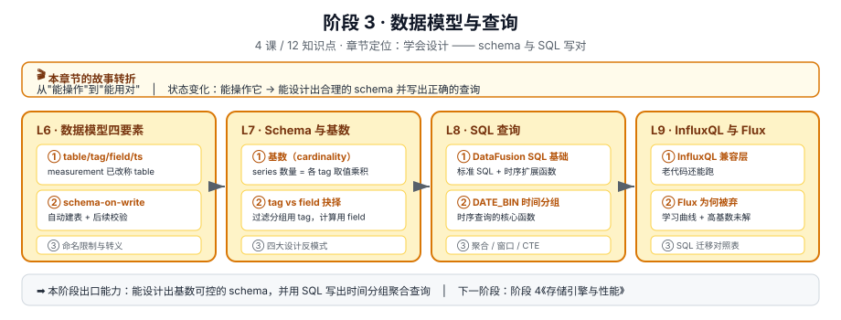

# 阶段 3 · 数据模型与查询

> 所属课程：[InfluxDB 3 系统学习](../02-课程目录.md) ｜ 水平：零基础 → 入门
> 本阶段：**4 课 / 12 知识点** ｜ 状态：⬜ 未开始

## 🎬 本阶段在故事主线中的章节定位

| 章节 | 本阶段任务 | 主角的状态变化 |
|------|-----------|---------------|
| **第三章 · 学会设计** | schema 与 SQL 写对 | 能操作它 → **能用对它** |

**为什么现在学**：阶段 2 你已经能写能查，但"能跑"和"跑得好"是两回事。本阶段解决两个会长期影响成本与性能的决策：**tag 怎么设计**、**SQL 怎么写**。

## 🎯 阶段目标

学完本阶段，你应该能够：

1. 说清 table / tag / field / timestamp 四要素，以及 measurement 与 table 的关系
2. 理解基数（cardinality）的本质，设计出基数可控的 schema
3. 用 DataFusion SQL 写出时间分组聚合查询（重点是 `DATE_BIN`）
4. 读懂老代码的 InfluxQL 与 Flux，并知道怎么迁到 SQL

## 📚 必须掌握的知识点

### L6 · 数据模型：table、tag、field、timestamp ⬜

| 知识点 | 关键点 |
|--------|--------|
| ① 四要素 | table（原 measurement）· tag set · field set · timestamp |
| ② schema-on-write 与类型冲突 | 自动建库建表；**schema 建好后后续写入会被校验** |
| ③ 命名限制与特殊字符 | 哪些字符要转义、哪些不要用 |

### L7 · Schema 设计与基数陷阱 ⬜

| 知识点 | 关键点 |
|--------|--------|
| ① 基数（cardinality）本质 | series 数 ≈ 各 tag 取值数的**乘积**——这是会爆炸的乘法 |
| ② tag vs field 的抉择 | 过滤/分组用 tag，计算用 field；**放错维度是致命的** |
| ③ schema 设计反模式 | 高基数做 tag、把 ID 类字段当 tag、tag 值里塞变量 |

> 🔗 **回扣 L2 误区 4**：3.x 支持无限基数 ≠ 可以随便设计 tag。技术上存得下，不等于查得快、成本低。

### L8 · SQL 查询：从 SELECT 到窗口函数 ⬜

| 知识点 | 关键点 |
|--------|--------|
| ① DataFusion SQL 基础查询 | 标准 SQL + 时序扩展函数 |
| ② `DATE_BIN` 与时间分组 | 时序查询的核心：把连续时间切成桶 |
| ③ 聚合、窗口函数与 CTE | 同比环比、移动平均、累计值 |

### L9 · InfluxQL 与 Flux：遗产与迁移 ⬜

| 知识点 | 关键点 |
|--------|--------|
| ① InfluxQL 兼容层 | 3.x 仍支持，老代码能跑 |
| ② Flux 为何被弃 | 学习曲线陡 + 高基数未根治 |
| ③ SQL 迁移对照表 | 常用 InfluxQL / Flux 写法 → SQL 对照 |

## 🧭 导航

⬅️ **上一阶段**：[阶段 2《上手篇》](../2-上手篇/overview.md)
➡️ **下一阶段**：[阶段 4《存储引擎与性能》](../4-存储引擎与性能/overview.md)
📚 **返回**：[课程目录](../02-课程目录.md) ｜ [学习路径总览](../01-学习路径总览.md)
