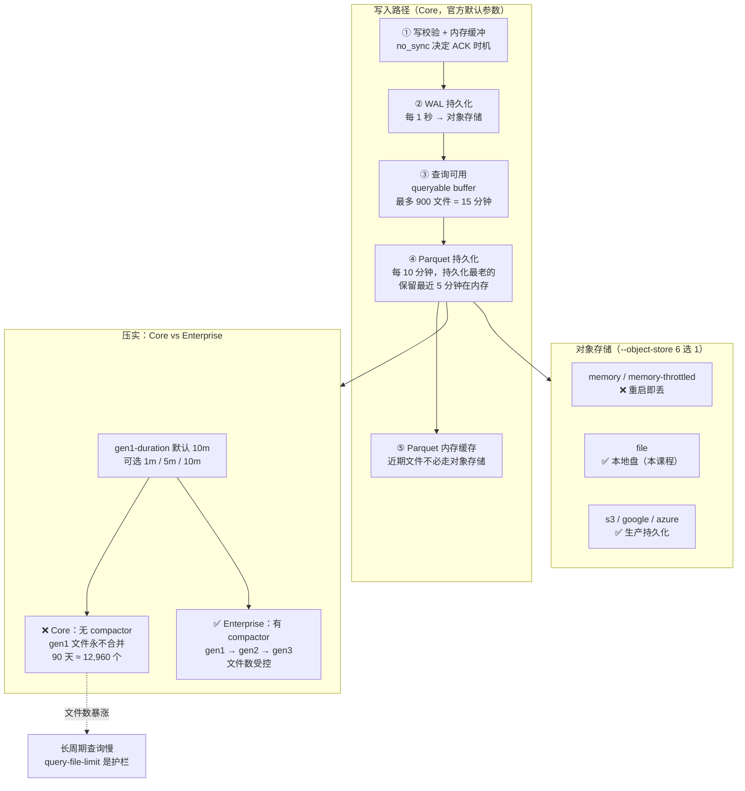

# 第 10 课：存储引擎：WAL、Parquet 与压实

> 所属阶段：阶段 4《存储引擎与性能》｜ 水平：入门 → 进阶 ｜ 本课知识点：写入路径（WAL 与内存缓冲）/ Parquet 持久化与压实 / 对象存储与无盘架构
> 故事情节：第四章开篇——从"能用对它"走向"知道它的边界"。

## 🎯 本课目标

- 描述一条数据**从写入到落盘的完整路径**：校验 → 内存缓冲 → WAL → 可查缓冲 → Parquet
- 理解 **`no_sync`** 这个开关如何决定"崩溃时丢多少"
- 说清 **Parquet 持久化的节奏**：每 10 分钟一次，保留最近 5 分钟在内存
- 解释 **Core 为什么没有 compactor**，以及它带来的**真实后果**（小文件永不合并）
- 掌握 **对象存储的 6 种选型**与"存储与计算分离"到底意味着什么

> 💻 承接第 3 课环境：Docker 容器名 `influxdb3-core`，端口 8181，token 已设进 `INFLUXDB3_AUTH_TOKEN`。
> 🔗 **回扣 L2**：本课会给出 L2《SKU 选型》那个"Core vs Enterprise"决策的**存储层底层原因**——不是功能阉割，是**架构取舍**。

---

## 第一幕：起源与场景引入

L9 结束那天，你把团队的存量 InfluxQL 查询全部过了一遍迁移决策树，心里踏实了。然后运维同事丢过来一个问题：

> **"我们想跑一个覆盖 90 天的年度报告查询，怎么跑了 40 秒还没出来？平时查最近 1 小时不是几十毫秒吗？"**

你第一反应是"数据量太大"。但季度报告的数据量和日常监控比，**并没有大到 40 秒那么离谱**。

你把问题拆开看了一遍：**查最近 1 小时 vs 查 90 天，走的根本不是同一条路。**

- 查最近 1 小时：数据在**内存**里，直接读
- 查 90 天：数据躺在**对象存储的 Parquet 文件**里，要一个个打开

**关键不在这里**——而在于：**这 90 天的数据，是以什么形态躺在那儿的。**

你去翻官方文档，在配置选项页看到 `gen1-duration` 这一项，说明文字里有这么一句：

> *"These files are known as **'generation 1' files** that the **compactor in InfluxDB 3 Enterprise** can merge into larger generations."*

**"compactor in InfluxDB 3 Enterprise"。**

你愣了一下，回头去搜 Core 的文档——**Core 的 durability、storage-engine、data-retention 三个页面里，"compact" 这个词一次都没出现。**

> 🎬 **场景**：这不是文档疏漏。**Core 真的没有 compactor。**
>
> Core 官方 storage engine 页只有两句话，第二句是：*"InfluxDB 3 Enterprise also offers an **upgraded storage engine** as an alternative; **InfluxDB 3 Core does not include it**."*
>
> 而配置选项页的 `query-file-limit` 一项，官方给出的是：*"If you need to query longer time ranges or faster query performance on any query that accesses an hour or more of data, **InfluxDB 3 Enterprise** optimizes data storage by **compacting and rearranging Parquet files** to achieve faster query performance."*
>
> **官方在拿 Enterprise 的压实能力，来回答 Core 的长周期查询问题。**

这一课要讲清楚三件事：**数据怎么从写入走到落盘、为什么 Core 不压实、以及这对你意味着什么。**

---

## 第二幕：认知冲突

你可能会想：**"不就是少了压实吗？少个优化而已，能有多严重。"**

三个反直觉的事实：

**第一 · 数据"写进去"和"能查到"是两个不同时刻**。写入请求返回 200，不代表数据已经进 Parquet。中间隔着**校验、内存缓冲、WAL、可查缓冲**四个阶段。**"刚写就能查"是有上界的，不是无限的。**

**第二 · `no_sync` 这个开关决定"崩溃时丢多少"，而默认是安全的那档**。官方原文：`no_sync=true` 是 *"acknowledge the write **without waiting for persistence**"*，`no_sync=false` 才是默认。**很多人为了降延迟把它打开，等于用持久性换延迟——而他们在换之前往往不知道自己在换什么。**

**第三 · Core 不压实，意味着小文件只增不减**。每 10 分钟持久化一次，一天就是 **144 个 Parquet 文件**，90 天 **12960 个**。**没有 compactor，它们永远不会合并。** 这就是为什么长周期查询慢——**不是数据量大，是要打开的文件多。**

> ❓ **问题**：那完整路径到底是怎样的？压实在整个架构里处在什么位置？对象存储又扮演什么角色？
>
> 这一课逐个回答，并给出**逐条核实过的官方参数**。

---

## 第三幕：层层揭示

### 知识点 1：写入路径 —— 从校验到落盘的五站

#### 一句话定义
**一条数据从写入到落盘，要穿过五个阶段**：写校验与内存缓冲 → WAL 持久化 → 查询可用（可查缓冲）→ Parquet 存储 → Parquet 内存缓存。每个阶段都有可配置参数，官方为每个阶段都给出了 **Impact / Tradeoff / Details** 三段说明。

#### 直觉建立：把它想成「快递的中转站」

- **写校验** 是"安检"——不合规的包裹直接退回，不进系统
- **内存缓冲** 是"分拣台上的包裹"——还没登记，随时可能因为停电消失
- **WAL** 是"登记台账"——**先记下来再说**，这样即使后面出问题也能重放
- **可查缓冲** 是"已上架货架"——**从这一刻起才有人能找到它**
- **Parquet 持久化** 是"进仓库"——长期存放，安全但取货慢
- **Parquet 内存缓存** 是"仓库门口的临时堆场"——最近进仓的货还没运走，取起来快

> ⚠️ **类比失效的边界**：快递包裹在各个阶段是**同一个实体在移动**。但 InfluxDB 里，数据在内存中是行式、在 Parquet 里是列式——**每次"移动"都伴随着一次格式转换**。这个转换要吃内存（官方点名 `exec-mem-pool-size`），不是零成本的搬运。

#### 核心原理 A：五站详解（官方 Impact / Tradeoff / Details）

| # | 阶段 | Process | Impact | Tradeoff | Details |
|---|------|---------|--------|----------|---------|
| 1 | **写校验 + 内存缓冲** | 写入前先校验数据 | 阻止畸形/不支持的数据进入 | — | 校验通过后存入 **write buffer**（内存）。若 `no_sync=true`，**不等持久化就回 ACK** |
| 2 | **WAL 持久化** | 每秒（默认）把写缓冲刷进 WAL | 通过持久化到对象存储保证**持久性** | 更频繁刷盘 = 更耐用，但 **I/O 开销更大** | 每 **1 秒**（默认）刷一次。若 `no_sync=false`（**默认**），刷完才回 ACK |
| 3 | **查询可用** | WAL 持久化后，数据移入 **queryable buffer** | 让近期数据**可快速查询** | 缓冲越大查询越快，但**内存占用越高** | 默认**最多保留 900 个 WAL 文件（15 分钟数据）** |
| 4 | **Parquet 存储** | 每 **10 分钟**（默认）持久化到对象存储 | 提供持久的长期存储 | 更频繁持久化 = 更少依赖 WAL，但 **I/O 成本更高** | 持久化**最老**的数据，**保留最近 5 分钟在内存** |
| 5 | **Parquet 内存缓存** | 最近持久化的 Parquet 文件缓存进内存 | 减少对对象存储的访问，降低查询延迟 | — | 查最近持久化的数据**不必走对象存储** |

> 📌 **阶段 4 的细节值得单独拎出来**：官方原文是 *"persists the **oldest** data from the queryable buffer... and keeps the remaining data (the **most recent 5 minutes**) in memory"*。
>
> **注意方向**：持久化的是**最老的**，留在内存的是**最新的**。这不是随意的——**新数据被查询的概率最高**，所以留在最快的介质里。

#### 核心原理 B：`no_sync` —— 一个决定"崩溃丢多少"的开关

官方原文（阶段 1 与阶段 2 的 Details）：

> 阶段 1：*"If **no_sync=true**, the server sends a response to acknowledge the write **without waiting for persistence**."*
> 阶段 2：*"If **no_sync=false** (default), the server sends a response to acknowledge the write."*

**官方在阶段 2 明确标注了 `(default)`**。

| 配置 | ACK 时机 | 进程崩溃时 |
|------|----------|-----------|
| **`no_sync=false`**（默认） | WAL 落盘后才 ACK | ✅ 已 ACK 的数据不丢 |
| `no_sync=true` | **不等持久化**就 ACK | ⚠️ 已 ACK 的数据**可能丢** |

> 🔑 **这是本课最重要的一条运维结论**：**`no_sync=true` 换来的是延迟，代价是持久性。**
>
> 官方把它描述为 "acknowledge the write without waiting for persistence"——**ACK 不代表数据已经安全**，只代表服务端"收到了"。在调这个开关之前，先问一句：**这批数据丢了，能接受吗？**

#### 核心原理 C：WAL tail —— 一个容易被忽略的中间状态

官方专门给了定义：

> *"The **WAL tail** is the most recent data in the WAL that InfluxDB 3 Core has **not yet durably persisted beyond the WAL**. Because InfluxDB 3 Core flushes the WAL to object storage every second, the WAL tail **is durable**, but it **remains in the WAL** until the next Parquet persistence captures it."*

**拆解这句话**：

- WAL tail = WAL 里**还没被 Parquet 收走**的那部分最新数据
- 它**已经是持久的**（因为 WAL 每秒就刷到对象存储了）
- 但它**仍留在 WAL 里**，直到下一次 Parquet 持久化把它收走

> 💡 **为什么这个概念重要**：它解释了**"数据在 WAL 里"和"数据不安全"不是一回事**。WAL 每秒刷一次对象存储，所以 WAL 里的东西**已经是安全的**——只是**查询时可能要走 WAL 而不是 Parquet**，性能特征不同。

#### 示例演示：一条数据的完整旅程

```text
t=0ms     写入请求到达
          ↓ [1] 校验 + 进 write buffer（内存）
t=0ms     no_sync=false → 还不回 ACK，等 WAL
          ↓ [2] 每秒刷 WAL → 对象存储
t=~1s     WAL 持久化完成 → 回 ACK（客户端收到 200）
          ↓ [3] 数据移入 queryable buffer
t=1s+     数据可查（内存直读，快）
          ↓ [4] 每 10 分钟持久化最老的数据
t=10min   老数据落 Parquet，最新 5 分钟留在内存
          ↓ [5] Parquet 文件进内存缓存
          近期持久化数据可快速查询
```

#### 常见误区

**误区 A**：*写入返回 200，数据就已经安全了。*
⚠️ **分情况**。`no_sync=false`（**默认**）时成立——WAL 落盘后才 ACK。但 `no_sync=true` 时，官方明说是 *"without waiting for persistence"*，**ACK 回来时数据可能还在内存里**。

**误区 B**：*数据在 WAL 里 = 不安全。*
❌ 错。官方原文：WAL tail *"**is durable**"*——因为 WAL 每秒就刷到对象存储了。**"在 WAL 里"影响的是查询走哪条路径，不是数据安不安全。**

**误区 C**：*"刚写就能查"是无限的。*
❌ 错。**可查缓冲默认最多 900 个 WAL 文件 = 15 分钟数据**。超出这个窗口，数据就去了 Parquet，读取路径变了。

**误区 D**：*持久化时把最新的数据写进 Parquet。*
❌ **反了**。官方原文：持久化**最老**的，把**最近 5 分钟**留在内存。理由是新数据被查概率最高。

#### 一句话记住
**写入五站：校验 → 内存缓冲 → WAL（每秒）→ 可查缓冲（最多 15 分钟）→ Parquet（每 10 分钟，留最近 5 分钟在内存）。`no_sync=false` 是默认值，表示"WAL 落盘才 ACK"；改成 true 是用持久性换延迟。**

---

### 知识点 2：Parquet 持久化与压实 —— Core 为什么没有 compactor

#### 一句话定义
**Core 每 10 分钟把最老的数据持久化成 Parquet 文件（`gen1-duration` 默认 10m），但 Core 没有 compactor——这些 "generation 1" 文件永远不会合并**。合并能力属于 **InfluxDB 3 Enterprise 的 upgraded storage engine**。

#### 直觉建立：把它想成「记账本的归档」

- **WAL** 是"流水账"——每笔都记，按顺序，写得快，但**查历史要翻很久**
- **Parquet 持久化** 是"每 10 分钟把流水账抄成一张**对账单**"——格式规整，查起来快
- **压实** 是"把每天 144 张对账单，**合并成 1 张月结单**"——文件少了，查长周期不用翻那么多
- **Core 没有最后一步**：**对账单只增不减，永远是一堆小文件**

> ⚠️ **类比失效的边界**：现实中你可以随时手工把对账单装订成册。但在 Core 里，**没有 compactor 就是没有**——你无法事后补救，只能靠**在建库时就把 `gen1-duration` 设对**（但可选值只有 1m / 5m / 10m，且 10m 已是最优档）。

#### 核心原理 A：官方证据链（三处，逐条核实）

**证据一 · Core 的 storage engine 页，全文只有两句话：**

> *"InfluxDB 3 Core always writes and stores data using the **Parquet storage engine**—see Data durability for how data flows from write to Parquet persistence.
> InfluxDB 3 **Enterprise** also offers an **upgraded storage engine** as an alternative; **InfluxDB 3 Core does not include it**."*

**第二句是直接否定句**：Core does not include it.

**证据二 · Core 的三个核心页面里搜不到 "compact"**：

| Core 页面 | 是否出现 compact / compaction / compactor |
|-----------|------------------------------------------|
| `internals/durability/` | ❌ 无 |
| `internals/storage-engine/` | ❌ 无 |
| `internals/data-retention/` | ❌ 无 |

**这不是文档遗漏——是功能确实不在 Core 里。**

**证据三 · compactor 被明确归属给 Enterprise**（配置选项页 `gen1-duration` 原文）：

> *"Specifies the duration that Parquet files are arranged into... Supported durations are **1m, 5m, and 10m**. These files are known as **'generation 1' files** that the **compactor in InfluxDB 3 Enterprise** can merge into **larger generations**."*
>
> Default: **10m**

**注意 "generation 1" 这个命名**——它暗示了**还有 generation 2、3**，而升代的动作**只能由 Enterprise 的 compactor 完成**。Core 的数据**永远停留在 gen1**。

#### 核心原理 B：不压实的真实后果（量化）

推论链条很简单：**每 10 分钟一个文件 → 没有合并 → 文件数只增不减**。

| 运行时长 | Parquet 文件数 | Core（无压实） | Enterprise（有压实） |
|----------|---------------|---------------|---------------------|
| 1 天 | 144 | ❌ 保持 144 个 | ✅ 合并为更少更大的文件 |
| 7 天 | 1,008 | ❌ 保持 1,008 个 | ✅ 合并 |
| 30 天 | 4,320 | ❌ 保持 4,320 个 | ✅ 合并 |
| **90 天** | **12,960** | ❌ **保持 12,960 个** | ✅ 合并 |

> 🔑 **这直接回答了开篇那个运维问题**：90 天查询慢，**不是因为数据量大，是因为要打开的文件多**。

**而这个约束在官方配置里是有名字的**：`query-file-limit`。官方在说明它时，直接拿 Enterprise 的压实能力来对比：

> *"...If you need to query **longer time ranges** or faster query performance on any query that accesses an hour or more of data, **InfluxDB 3 Enterprise optimizes data storage by compacting and rearranging Parquet files** to achieve faster query performance."*

**官方用 Enterprise 的能力来回答 Core 的限制**——这本身就是最直白的承认。

#### 核心原理 C：Enterprise 的 upgraded storage engine 补了什么

官方列出的关键改进（逐条引用）：

| 改进 | 官方说明 |
|------|----------|
| **更快的单序列查询** | *"Optimized for highly selective time-series queries"* |
| **资源使用可控** | *"Bounded CPU and memory during persistence and compaction, using a **fixed memory budget** instead of unbounded growth during heavy ingestion or compaction"* |
| **宽表稀疏表** | 支持 high-cardinality、wide-schema、query-intensive 负载 |
| **默认启用** | *"New InfluxDB 3 Enterprise clusters default to the upgraded storage engine—no flag is required"*（3.10 及更早启动的集群需 `--upgrade-pacha-tree` 重启升级） |

> 💡 **"fixed memory budget instead of unbounded growth" 这句值得记住**——它说明**压实在 Core 里不做，一部分原因正是资源不可控**。Enterprise 用固定内存预算解决了这个问题。这是**架构取舍**，不是功能阉割。

#### 核心原理 D：`gen1-duration` —— Core 里唯一能调的旋钮

| 参数 | 取值 | 默认 | 含义 |
|------|------|------|------|
| `--gen1-duration` | **1m / 5m / 10m** | **10m** | Parquet 文件按多长时间跨度组织；数据按时间戳落入对应文件 |

**权衡非常直白**：

- **1m**：文件更多更小 → 短时查询精准（裁剪更细），但长周期查询要开更多文件
- **10m**（默认）：文件更少更大 → 长周期查询友好，但短时查询要读更多无关数据

> ⚠️ **只有三档可选，且默认 10m 已经是"文件最少"的那一档**。这意味着：**在 Core 里，你无法通过设置来显著改善长周期查询。** 这是架构层面的天花板，**不是调参能解决的问题**。

#### 示例演示：Core vs Enterprise 的长期形态

```text
运行 90 天后，同一份数据在两个 SKU 里的形态：

Core（无 compactor）:
  gen1: [10m][10m][10m] ... 共 12,960 个文件
        └── 永不合并，查询需打开的文件数持续增长

Enterprise（有 compactor）:
  gen1: [10m][10m][10m] ... ×144
        ↓ compactor 合并
  gen2: [更大跨度][更大跨度] ...
        ↓ 继续合并
  gen3: [更大跨度] ...
        └── 文件数被控制在合理范围
```

#### 常见误区

**误区 E**：*Core 也有 compactor，只是文档没写。*
❌ 错。Core 官方 storage engine 页是**直接否定句**：*"InfluxDB 3 Core does not include it"*。且 durability / storage-engine / data-retention 三页**搜不到 compact 一词**。

**误区 F**：*把 `gen1-duration` 调小能解决长周期查询慢。*
❌ **反了**。调小（如 1m）会让文件**更多更小**，长周期查询要打开的文件**更多**。默认 **10m 已经是文件最少的档位**。**这是架构天花板，调参解决不了。**

**误区 G**：*Core 是"Enterprise 的阉割版"，纯粹是商业策略。*
⚠️ **过于简化**。官方给出的理由中，有一条是实打实的技术约束：Enterprise 用了 *"fixed memory budget instead of unbounded growth during heavy ingestion or compaction"*。**压实需要可控的资源预算，这是要付出工程代价的。** 更准确的说法是**架构取舍**。

**误区 H**：*Parquet 持久化了就万事大吉，查询都一样快。*
❌ 错。持久化后数据进了对象存储，**读取路径变了**（内存 → Parquet 内存缓存 → 对象存储，三级）。文件数量还直接影响要打开多少次。

#### 一句话记住
**Core 每 10 分钟把最老数据写成 gen1 Parquet 文件并保留最近 5 分钟在内存，但没有 compactor——gen1 文件永不合并，90 天累积约 12,960 个，这正是长周期查询慢的根因，也是 `query-file-limit` 存在的理由。压实属于 Enterprise 的 upgraded storage engine。**

---

### 知识点 3：对象存储与无盘架构 —— 存储与计算分离

#### 一句话定义
**InfluxDB 3 把 Parquet 文件存放在对象存储（S3/GCS/Azure/本地文件系统）里，而不是绑在计算节点的本地盘上**——这就是"存储与计算分离"。Core 通过 `--object-store` 提供 **6 种取值**，本课程环境用的是 `file`（本地文件系统）。

#### 直觉建立：把它想成「仓库与门店分离」

- **传统架构（存算一体）**：门店后院就是仓库。**好处**是取货快；**坏处**是**搬店必须连货一起搬**，而且**仓库大小受限于门店面积**。
- **InfluxDB 3（存算分离）**：仓库在郊区（对象存储），门店只摆样品（计算节点内存）。**好处**是**门店可以随时换、随时加**（计算节点无状态）；**坏处**是**取货要跑一趟郊区**（网络延迟）。

> ⚠️ **类比失效的边界**：门店后院的仓库和门店是**同一个老板**。但对象存储是**独立服务**——它自己有多副本、有持久性保证、有独立计费。**你不是在"用一块盘"，是在"用一个服务"。**

#### 核心原理 A：`--object-store` 的 6 种取值（官方原文）

| 取值 | 官方说明 | 适用场景 | 进程重启后 |
|------|----------|----------|-----------|
| `memory` | *"Effectively no object persistence"* | 测试 / 临时 | ❌ 重启即丢 |
| `memory-throttled` | *"Like memory but with latency and throughput that somewhat resembles a cloud object store"* | 本地模拟生产行为 | ❌ 重启即丢 |
| `file` | *"Stores objects in the local filesystem (must also set --data-dir)"* | **单机部署（本课程环境）** | ✅ 落本地盘 |
| `s3` | *"Amazon S3 (must also set --bucket, --aws-access-key-id, --aws-secret-access-key, and possibly --aws-default-region)"* | 生产 / 云上 | ✅ 持久化 |
| `google` | *"Google Cloud Storage (must also set --bucket and --google-service-account)"* | 生产 / 云上 | ✅ 持久化 |
| `azure` | *"Microsoft Azure blob storage (must also set --bucket, --azure-storage-account, --azure-storage-access-key)"* | 生产 / 云上 | ✅ 持久化 |

> 🎯 **本课程环境用的是 `file`**——即 `--object-store file --data-dir ~/.influxdb3`。这让"存储与计算分离"在本地也能跑起来：**逻辑上仍然是对象存储抽象，只是物理上落在本地盘**。

#### 核心原理 B：`memory-throttled` 是个被低估的选项

官方说明是 *"Like memory but with latency and throughput that somewhat resembles a cloud object store"*。

> 💡 **它的价值**：如果你在本地开发，但生产环境跑 S3，**用 `memory` 开发会让你对性能产生错误预期**——内存太快了，很多问题在本地根本暴露不出来。
>
> **`memory-throttled` 就是为这个场景准备的**：保留"重启即丢"的便利性，同时**人为注入接近真实对象存储的延迟与吞吐**，让性能问题在本地就能被发现。

#### 核心原理 C：无盘架构带来的三个实际影响

**影响一 · 计算节点可以无状态**

catalog（元数据：库、表、节点）**持久化在对象存储里**，独立于进程、容器、主机。官方原文：

> *"Every InfluxDB 3 Core server process registers itself as a node in the catalog—the metadata store that tracks databases, tables, and nodes. The catalog is the source of truth for a node's identity and state, and it **persists in object storage—independently of the process, its container, or its host**."*

**影响二 · 优雅停机变得重要**

节点停机会触发 WAL 刷盘。官方 lifecycle 页原文：

> *"**SIGTERM** and **SIGINT** both start a **graceful shutdown**. During a graceful shutdown, the node does the following: Stops accepting writes. **Flushes the write-ahead log (WAL) buffer to object storage**. Waits for an in-progress snapshot to finish. Marks itself stopped in the catalog."*

> ⚠️ **运维含义**：**用 `docker stop`（发 SIGTERM）而不是 `docker kill`（SIGKILL）**。后者绕过了优雅停机，WAL 缓冲来不及刷。**Core 的节点状态只有 `running` 和 `stopped` 两种**（`stopping`/`removing` 是 Enterprise 集群的概念）。

**影响三 · `node-id` 必须唯一**

官方原文：

> *"Specifies the node identifier used as a prefix in all object store file paths. This should be **unique for any hosts sharing the same object store configuration**—for example, the same bucket."*

> 🔴 **这是多实例共享存储时的头号事故源**：两个节点用同一个 `node-id` 写同一个 bucket，**文件路径会互相覆盖**。官方用了 "should be unique" 这种强措辞。

#### 示例演示：本地环境与生产环境的映射

```bash
# 本课程环境（本地文件系统）
influxdb3 serve \
  --node-id local-dev \
  --object-store file \
  --data-dir ~/.influxdb3

# 生产环境（S3）
influxdb3 serve \
  --node-id prod-node-01 \        # ← 多节点时必须各自唯一
  --object-store s3 \
  --bucket my-influx-bucket \
  --aws-access-key-id ... \
  --aws-secret-access-key ... \
  --aws-default-region us-east-1

# 本地开发但想模拟生产的性能特征
influxdb3 serve \
  --node-id dev-throttled \
  --object-store memory-throttled   # ← 注入接近真实对象存储的延迟
```

#### 常见误区

**误区 I**：*`--object-store file` 就不算"存储与计算分离"了。*
❌ 错。**逻辑上仍然是对象存储抽象**，只是物理实现落在本地文件系统。代码路径、文件格式、目录结构都与 S3 模式一致——**这正是 `file` 模式的价值：让本地开发与生产保持同一套语义**。

**误区 J**：*既然数据在对象存储，本地盘就可以随便删。*
⚠️ **分情况**。`file` 模式下**对象存储就是本地盘**（`--data-dir` 指向的目录），删了就没了。S3 模式下才能真正做到节点无状态。**另外，WAL 缓冲和 Parquet 内存缓存始终在内存里，进程一停就没了**——所以优雅停机很重要。

**误区 K**：*`docker stop` 和 `docker kill` 对数据的影响一样。*
❌ **不一样，而且差别很大**。`stop` 发 SIGTERM，触发**优雅停机并刷 WAL**；`kill` 发 SIGKILL，**绕过刷盘**。官方明确列出了优雅停机的三个动作，其中第二个就是 *"Flushes the write-ahead log (WAL) buffer to object storage"*。

**误区 L**：*多个 Core 实例可以共用一个 S3 bucket 且用相同 node-id。*
❌ 错。官方明确说 node-id *"should be unique for any hosts sharing the same object store"*。**相同 node-id 会导致文件路径互相覆盖。**

#### 一句话记住
**InfluxDB 3 把 Parquet 放在对象存储（S3/GCS/Azure/本地文件系统，共 6 种取值），catalog 也持久化在对象存储里，因此计算节点近乎无状态——代价是查询要走网络。记住 `node-id` 在共享存储时必须唯一，且停机要用 SIGTERM 触发优雅刷 WAL。**

---

## 第四幕：实操验证

> 💻 承接第 3 课环境（容器 `influxdb3-core`，端口 8181）。
> 🧪 本课实验 A **已在本机 Python 3.11 实跑**（不依赖 Docker），输出逐字贴出。

### 实验 A：写入路径与持久性模拟器（本机实跑）

参数全部取自官方 durability 页的默认值，把四个"看不见"的机制**用纯计算复现**。

> 📌 **下面这份脚本与随后的实跑输出严格一一对应**，可直接复制运行（本机 Python 3.11 实测通过）。

```python
# ---- 官方默认参数（Core durability 页）----
WAL_FLUSH_INTERVAL_S = 1        # WAL 每秒刷一次
WAL_FILES_BUFFERED = 900        # 最多缓冲 900 个 WAL 文件
PARQUET_INTERVAL_MIN = 10       # 每 10 分钟持久化一次
KEEP_IN_MEMORY_MIN = 5          # 持久化后保留最近 5 分钟在内存

print("=" * 82)
print("对照 1 · no_sync 开关：ACK 时机决定「崩溃丢多少」")
print("=" * 82)
print("官方原文：")
print("  no_sync=true  -> server sends a response to acknowledge the write")
print("                   WITHOUT waiting for persistence")
print("  no_sync=false -> server sends a response to acknowledge the write")
print("                   (default，等 WAL 持久化完成)  ← 官方明确标注 default")
print()
print("%-14s | %-26s | %-24s" % ("配置", "ACK 时机", "进程崩溃时"))
print("-" * 82)
scenarios = [
    ("no_sync=false", "WAL 落盘后才 ACK（默认）", "已 ACK 的数据不丢"),
    ("no_sync=true",  "不等持久化就 ACK",         "已 ACK 的数据**可能丢**"),
]
for a, b, c in scenarios:
    print("%-14s | %-26s | %-24s" % (a, b, c))
print()
print("  推论：no_sync=true 换来的是**延迟**，代价是**持久性**")
print("        官方把它描述为 'acknowledge the write without waiting for persistence'")

print()
print("=" * 82)
print("对照 2 · WAL 刷盘间隔与丢失窗口")
print("=" * 82)
print("WAL flush 间隔（秒）  |  最坏情况丢失窗口  |  每秒刷盘次数")
print("-" * 82)
for interval in [1, 5, 10]:
    print("%-20d | %-18s | %d" % (interval, "%d 秒内的数据" % interval, 1))
print()
print("  官方默认 = 1 秒 → 丢失窗口上界 = 1 秒")
print("  官方 tradeoff 原文：更频繁刷盘『improves durability but increases I/O overhead』")

print()
print("=" * 82)
print("对照 3 · 查询缓冲区：为什么「刚写就能查」是有上界的")
print("=" * 82)
buffer_minutes = WAL_FILES_BUFFERED * WAL_FLUSH_INTERVAL_S / 60
print("默认最多缓冲 %d 个 WAL 文件 × 每文件 %d 秒 = %.0f 分钟数据" % (
    WAL_FILES_BUFFERED, WAL_FLUSH_INTERVAL_S, buffer_minutes))
print()
print("%-22s | %-18s | %s" % ("数据年龄", "在哪儿", "读取路径"))
print("-" * 82)
rows = [
    ("0 - 5 分钟",    "内存（queryable buffer）", "内存直读，最快"),
    ("5 - 15 分钟",   "内存（仍在缓冲区）",        "内存直读"),
    ("15 分钟以上",   "对象存储（Parquet）",      "先查 Parquet 内存缓存，未命中再走对象存储"),
]
for a, b, c in rows:
    print("%-22s | %-18s | %s" % (a, b, c))
print()
print("  ⚠️ 缓冲区满了之后，最老的数据会被持久化到 Parquet（10 分钟周期触发）")
print("     所以「刚写就能查」这个窗口**有上界**——约 %d 分钟" % int(buffer_minutes))

print()
print("=" * 82)
print("对照 4 · Parquet 持久化周期与内存占用")
print("=" * 82)
print("每 %d 分钟持久化一次，持久化后保留最近 %d 分钟在内存" % (
    PARQUET_INTERVAL_MIN, KEEP_IN_MEMORY_MIN))
print()
print("时刻(分)  |  动作                        |  内存中保留")
print("-" * 82)
for t in range(0, 31, 5):
    action = ""
    if t % PARQUET_INTERVAL_MIN == 0 and t > 0:
        action = "★ 触发 Parquet 持久化"
    elif t == 0:
        action = "启动"
    print("%-9d | %-28s | 最近 %d 分钟" % (t, action or "—", KEEP_IN_MEMORY_MIN))
print()
print("  官方原文：『persists the **oldest** data from the queryable buffer...")
print("            and keeps the remaining data (the most recent 5 minutes) in memory』")
print("  → 注意是持久化**最老**的，把**最新**的留在内存（因为新数据被查的概率最高）")

print()
print("=" * 82)
print("对照 5 · 对象存储选型（官方 --object-store 的 6 种取值）")
print("=" * 82)
stores = [
    ("memory",           "无实际持久化",                        "测试 / 临时",          "❌ 重启即丢"),
    ("memory-throttled", "内存 + 模拟云存储延迟吞吐",             "本地模拟生产行为",      "❌ 重启即丢"),
    ("file",             "本地文件系统（须配 --data-dir）",        "单机部署（本课程环境）", "✅ 落本地盘"),
    ("s3",               "Amazon S3（须配 --bucket 等）",        "生产 / 云上",         "✅ 持久化"),
    ("google",           "Google Cloud Storage（须配 --bucket）", "生产 / 云上",         "✅ 持久化"),
    ("azure",            "Azure Blob Storage（须配 --bucket）",   "生产 / 云上",         "✅ 持久化"),
]
print("%-18s | %-30s | %-22s | %s" % ("取值", "含义", "适用场景", "进程重启后"))
print("-" * 82)
for a, b, c, d in stores:
    print("%-18s | %-30s | %-22s | %s" % (a, b, c, d))

print()
print("=" * 82)
print("对照 6 · 为什么 Core 没有 compactor —— 小文件问题的量化")
print("=" * 82)
print("官方原文：gen1-duration 产生的文件『are known as \"generation 1\" files")
print("          that the **compactor in InfluxDB 3 Enterprise** can merge")
print("          into larger generations』")
print()
print("推论链条：")
print("  每 10 分钟持久化一次 → 每天 144 个 Parquet 文件")
print("  Core 无 compactor    → 这些 gen1 文件**永不合并**")
print()
print("%-14s | %-16s | %-16s | %s" % ("运行时长", "Parquet 文件数", "Core（无压实）", "Enterprise"))
print("-" * 82)
for label, hours in [("1 天", 24), ("7 天", 168), ("30 天", 720), ("90 天", 2160)]:
    files = int(hours * 60 / PARQUET_INTERVAL_MIN)
    print("%-14s | %-16d | %-16s | %s" % (
        label, files, "❌ 保持 %d 个" % files, "✅ 合并为更少更大的文件"))
```

**本机实跑结果（逐字输出）**：

```
==================================================================================
对照 1 · no_sync 开关：ACK 时机决定「崩溃丢多少」
==================================================================================
官方原文：
  no_sync=true  -> server sends a response to acknowledge the write
                   WITHOUT waiting for persistence
  no_sync=false -> server sends a response to acknowledge the write
                   (default，等 WAL 持久化完成)  ← 官方明确标注 default

配置             | ACK 时机                     | 进程崩溃时
----------------------------------------------------------------------------------
no_sync=false  | WAL 落盘后才 ACK（默认）           | 已 ACK 的数据不丢
no_sync=true   | 不等持久化就 ACK                 | 已 ACK 的数据**可能丢**

  推论：no_sync=true 换来的是**延迟**，代价是**持久性**
        官方把它描述为 'acknowledge the write without waiting for persistence'

==================================================================================
对照 2 · WAL 刷盘间隔与丢失窗口
==================================================================================
WAL flush 间隔（秒）  |  最坏情况丢失窗口  |  每秒刷盘次数
----------------------------------------------------------------------------------
1                    | 1 秒内的数据            | 1
5                    | 5 秒内的数据            | 1
10                   | 10 秒内的数据           | 1

  官方默认 = 1 秒 → 丢失窗口上界 = 1 秒
  官方 tradeoff 原文：更频繁刷盘『improves durability but increases I/O overhead』

==================================================================================
对照 3 · 查询缓冲区：为什么「刚写就能查」是有上界的
==================================================================================
默认最多缓冲 900 个 WAL 文件 × 每文件 1 秒 = 15 分钟数据

数据年龄                   | 在哪儿                | 读取路径
----------------------------------------------------------------------------------
0 - 5 分钟               | 内存（queryable buffer） | 内存直读，最快
5 - 15 分钟              | 内存（仍在缓冲区）          | 内存直读
15 分钟以上                | 对象存储（Parquet）      | 先查 Parquet 内存缓存，未命中再走对象存储

  ⚠️ 缓冲区满了之后，最老的数据会被持久化到 Parquet（10 分钟周期触发）
     所以「刚写就能查」这个窗口**有上界**——约 15 分钟
     这正是 L11 要解释的「last-value 查询为什么 <10ms」的物理基础

==================================================================================
对照 4 · Parquet 持久化周期与内存占用
==================================================================================
每 10 分钟持久化一次，持久化后保留最近 5 分钟在内存

时刻(分)  |  动作                        | 内存中保留
----------------------------------------------------------------------------------
0         | 启动                           | 最近 5 分钟
5         | —                            | 最近 5 分钟
10        | ★ 触发 Parquet 持久化             | 最近 5 分钟
15        | —                            | 最近 5 分钟
20        | ★ 触发 Parquet 持久化             | 最近 5 分钟
25        | —                            | 最近 5 分钟
30        | ★ 触发 Parquet 持久化             | 最近 5 分钟

  官方原文：『persists the **oldest** data from the queryable buffer...
            and keeps the remaining data (the most recent 5 minutes) in memory』
  → 注意是持久化**最老**的，把**最新**的留在内存（因为新数据被查的概率最高）

==================================================================================
对照 5 · 对象存储选型（官方 --object-store 的 6 种取值）
==================================================================================
取值                 | 含义                             | 适用场景                   | 进程重启后
----------------------------------------------------------------------------------
memory             | 无实际持久化                         | 测试 / 临时                | ❌ 重启即丢
memory-throttled   | 内存 + 模拟云存储延迟吞吐                 | 本地模拟生产行为               | ❌ 重启即丢
file               | 本地文件系统（须配 --data-dir）          | 单机部署（本课程环境）            | ✅ 落本地盘
s3                 | Amazon S3（须配 --bucket 等）       | 生产 / 云上                | ✅ 持久化
google             | Google Cloud Storage（须配 --bucket） | 生产 / 云上                | ✅ 持久化
azure              | Azure Blob Storage（须配 --bucket） | 生产 / 云上                | ✅ 持久化

  🎯 本课程环境用的是 file（--object-store file --data-dir ...）
  ⚠️ 官方对 node-id 的警告：共享同一 object store（如同一个 bucket）时
     每个 host 的 node-id **必须唯一**，否则会互相覆盖

==================================================================================
对照 6 · 为什么 Core 没有 compactor —— 小文件问题的量化
==================================================================================
官方原文：gen1-duration 产生的文件『are known as "generation 1" files
          that the **compactor in InfluxDB 3 Enterprise** can merge
          into larger generations』

推论链条：
  每 10 分钟持久化一次 → 每天 144 个 Parquet 文件/表
  Core 无 compactor    → 这些 gen1 文件**永不合并**

运行时长           | Parquet 文件数      | Core（无压实）        | Enterprise
----------------------------------------------------------------------------------
1 天            | 144              | ❌ 保持 144 个       | ✅ 合并为更少更大的文件
7 天            | 1008             | ❌ 保持 1008 个      | ✅ 合并为更少更大的文件
30 天           | 4320             | ❌ 保持 4320 个      | ✅ 合并为更少更大的文件
90 天           | 12960            | ❌ 保持 12960 个     | ✅ 合并为更少更大的文件

  ⚠️ 官方 query-file-limit 选项的存在，正是这个约束的直接体现：
     查询需要打开的文件数有上限 → **Core 不擅长超长时间范围的查询**
     官方原文：『If you need to query longer time ranges... **InfluxDB 3
     Enterprise** optimizes data storage by compacting and rearranging
     Parquet files to achieve faster query performance』
```

**判断成功的标准**：

1. **对照 1**：`no_sync=false` 是默认（官方标注 `(default)`），崩溃时不丢已 ACK 数据；`no_sync=true` 是**用持久性换延迟**。
2. **对照 2**：WAL 刷盘间隔 = 丢失窗口上界。官方默认 1 秒。
3. **对照 3**：**"刚写就能查"的上界是 15 分钟**（900 文件 × 1 秒）。超出后读取路径改变。
4. **对照 4**：持久化的是**最老**的数据（10 分钟周期），**最新 5 分钟留在内存**。
5. **对照 5**：6 种取值中，`memory` 与 `memory-throttled` **重启即丢**，其余持久化。
6. **对照 6**：**90 天 = 12,960 个 Parquet 文件，Core 永不合并**——这是长周期查询慢的根因。

> 💡 **关于对照 5 的一个说明**：该表初版脚本曾因 `google`/`azure` 两行数据元组缺元素导致列错位，把两个**持久化**存储错误打印成了"重启即丢"。**评审中发现并已修复**，上面的输出是修正后重跑的结果——这也说明为什么**实跑输出必须逐字回贴、且代码与输出要严格对应**：只贴结论不贴代码，这类错误就不会被发现。

### 实验 B：亲眼看到 WAL 与 Parquet（真实库）

```bash
# 1. 写入一批数据
curl -X POST http://localhost:8181/api/v3/write_lp \
  --header "Authorization: Token $INFLUXDB3_AUTH_TOKEN" \
  --data-raw "home,room=LivingRoom temp=22.5,hum=45.2 $(date +%s)000000000"

# 2. 立刻查询 —— 数据已在 queryable buffer（内存），能查到
curl --get http://localhost:8181/api/v3/query_sql \
  --header "Authorization: Token $INFLUXDB3_AUTH_TOKEN" \
  --data-urlencode "db=metrics" \
  --data-urlencode "q=SELECT * FROM home ORDER BY time DESC LIMIT 5"

# 3. 查看 Parquet 文件系统表（能看到已持久化的文件）
curl --get http://localhost:8181/api/v3/query_sql \
  --header "Authorization: Token $INFLUXDB3_AUTH_TOKEN" \
  --data-urlencode "db=system" \
  --data-urlencode "q=SELECT * FROM parquet_files ORDER BY created_at DESC LIMIT 10"
```

**判断成功的标准**：

1. 第 2 步**立刻就能查到**刚写的数据——这验证了 queryable buffer 的存在（数据还没进 Parquet）。
2. 第 3 步能看到 Parquet 文件记录。**刚写完时可能还看不到新文件**——因为持久化是**每 10 分钟**才触发一次。
3. 若想验证持久化确实发生了，连续写入并等待 10 分钟后再查第 3 步。

> 💡 官方提供了 `Query system data` 能力（用 HTTP SQL API 查询 server 与 table schema 信息），`parquet_files` 就是其中一张系统表。

### 实验 C：优雅停机 vs 强制停机（真实库）

```bash
# 优雅停机：发 SIGTERM → 触发刷 WAL
docker stop influxdb3-core

# 强制停机：发 SIGKILL → 绕过刷 WAL
docker kill influxdb3-core

# 重启后查看节点状态（应为 running / stopped 两者之一）
docker start influxdb3-core
curl --get http://localhost:8181/api/v3/query_sql \
  --header "Authorization: Token $INFLUXDB3_AUTH_TOKEN" \
  --data-urlencode "db=system" \
  --data-urlencode "q=SELECT * FROM nodes"
```

**判断成功的标准**：

1. `docker stop` 后 WAL 缓冲被刷入对象存储（`file` 模式下看 `--data-dir` 目录里的 WAL 文件）。
2. `docker kill` 会**跳过**这一步——这就是两者的数据安全差异。
3. 节点状态只会在 `running` 与 `stopped` 之间切换（Core 是单节点，无 `stopping`/`removing`）。

---

## 第五幕：体系收束

### 一图总结



### 三句话收束本课

1. **写入五站**：校验 → 内存缓冲 → WAL（每秒）→ 可查缓冲（最多 15 分钟）→ Parquet（每 10 分钟，留最近 5 分钟在内存）；**`no_sync=false` 是默认，改成 true 就是拿持久性换延迟**。
2. **Core 没有 compactor**：gen1 文件永不合并，90 天累积约 **12,960 个**——**这是长周期查询慢的根因，也是架构天花板，调参解决不了**。
3. **存储与计算分离**：Parquet 与 catalog 都在对象存储里，计算节点近乎无状态；**代价是查询要走网络，运维上要记住 `node-id` 唯一 + 用 SIGTERM 优雅停机**。

### 📍 全局定位

```
阶段 1 问题与定位 ── ✅ 已完成（L1-L2）
阶段 2 上手篇     ── ✅ 已完成（L3-L5）
阶段 3 数据模型与查询 ── ✅ 已完成（L6-L9，12 / 12 知识点）
阶段 4 存储引擎与性能 ── 🔄 进行中（1 / 9 知识点）  ← 你在这里
阶段 5 生产落地     ── ⬜ 后续
```

**L9 补上了什么**：老代码怎么共存与迁移（InfluxQL 兼容层的边界、Flux 的收场）。
**L10 补上了什么**：**数据从写入到落盘的完整路径，以及 Core 那道"不压实"的架构天花板**。

> 🎬 **阶段 4 是"进阶"层**——从这一课起，我们从"能用对它"走向**"知道它的边界"**。
>
> **下一课（L11《向量化执行》）** 要回答两个问题：**列存 + 向量化为什么快**，以及——**"向量"在这里到底指什么**。后者是**开课时那个"向量数据库"误解的最终闭环**，也是整条故事线埋得最深的伏笔。

### 🔗 下一步

- **立即可做**：如果你的业务需要跑**超过 1 小时**的查询，现在就该评估 Core 是否够用——`query-file-limit` 是护栏，但天花板在架构层
- **下一课**：第 11 课《向量化执行：列存为什么快》（列存与向量化执行 / 谓词下推与分区裁剪 / last-value 查询为何 <10ms）

### 🎯 落地视角小结

1. **"刚写就能查"是有上界的，别把它当无限用**。可查缓冲默认**最多 900 个 WAL 文件 = 15 分钟**。超出后数据进 Parquet，读取路径从"内存直读"变成"缓存 → 对象存储"。**做实时监控（查最近几分钟）时这一点完全够用；做长周期分析时，性能特征完全不同。**

2. **`no_sync` 默认是安全的那档，别轻易动它**。`no_sync=false` 表示"WAL 落盘才 ACK"，崩溃时已 ACK 的数据不丢。改成 `true` 是**用持久性换延迟**——官方措辞是 *"acknowledge the write without waiting for persistence"*。**调之前先问：这批数据丢了能接受吗？** 大多数监控场景答案是"能"（丢几个点无所谓），但**财务、计费、审计类数据不行**。

3. **Core 不压实是架构天花板，不是调参能绕过的**。`gen1-duration` 只有 1m/5m/10m 三档，而 **10m 已经是文件最少的档位**。90 天累积约 **12,960 个文件**。**如果你的核心场景是长周期查询，这属于选型问题而非优化问题**——L2 的 SKU 决策在这里得到了底层解释。

4. **`memory-throttled` 是被低估的本地开发选项**。本地用 `memory` 开发会让你对性能产生错误预期——内存太快，问题暴露不出来。**如果生产跑 S3，本地开发建议用 `memory-throttled`**，它保留了"重启即丢"的便利性，同时注入接近真实对象存储的延迟与吞吐。

5. **`node-id` 唯一性要写进部署规范**。官方措辞是 *"should be unique for any hosts sharing the same object store"*。**两个实例共用 bucket 且 node-id 相同 → 文件路径互相覆盖 → 数据静默损坏**。这类问题排查起来极其痛苦，因为**它不报错**。

6. **停机用 `docker stop`，不要用 `docker kill`**。SIGTERM/SIGINT 触发优雅停机（**刷 WAL** → 等快照完成 → 标记 stopped）；SIGKILL 直接绕过。**在容器编排里，这意味着要留足 `terminationGracePeriodSeconds`**——否则 K8s 会在你还没刷完 WAL 时就 SIGKILL 掉 Pod。

7. **"数据在 WAL 里"≠"数据不安全"**。WAL 每秒刷到对象存储，所以 WAL tail *"is durable"*。**"在 WAL 里"影响的是查询走哪条路径（性能），不是数据安不安全（持久性）。** 把这两件事分开看，很多运维判断会清晰很多。

---

## 🐞 本课误区速查

| # | 误区 | 真相 |
|---|------|------|
| 1 | 写入返回 200，数据就安全了 | ⚠️ `no_sync=false`（**默认**）成立；`no_sync=true` 是 *"without waiting for persistence"*，ACK 时数据可能还在内存 |
| 2 | 数据在 WAL 里 = 不安全 | ❌ 官方原文 WAL tail *"**is durable**"*（WAL 每秒刷对象存储）；在 WAL 里影响**查询路径**，不影响**持久性** |
| 3 | "刚写就能查"是无限的 | ❌ 可查缓冲默认**最多 900 个 WAL 文件 = 15 分钟**；超出后走 Parquet |
| 4 | 持久化时把最新数据写进 Parquet | ❌ **反了**：持久化**最老**的，**保留最近 5 分钟在内存**（新数据被查概率最高） |
| 5 | Core 也有 compactor，只是文档没写 | ❌ Core 官方原话 *"InfluxDB 3 Core **does not include it**"*；三个核心页面搜不到 compact |
| 6 | 把 `gen1-duration` 调小能解决长周期查询慢 | ❌ **反了**：调小（1m）文件更多更小；默认 **10m 已是文件最少档**。**架构天花板，调参无用** |
| 7 | Core 是纯粹商业阉割 | ⚠️ 过于简化：Enterprise 用了 *"fixed memory budget instead of unbounded growth"*，压实需要可控资源预算 → **架构取舍** |
| 8 | Parquet 持久化后查询都一样快 | ❌ 读取路径分三级（内存 → Parquet 缓存 → 对象存储），且**文件数量**直接影响打开次数 |
| 9 | `--object-store file` 就不算存算分离 | ❌ **逻辑上仍是对象存储抽象**，物理落本地盘；代码路径与 S3 一致，**这正是本地开发的价值** |
| 10 | 数据在对象存储，本地盘可随便删 | ⚠️ `file` 模式下**对象存储就是本地盘**；且 WAL 缓冲与 Parquet 缓存**始终在内存**，进程停即失 |
| 11 | `docker stop` 与 `docker kill` 影响一样 | ❌ `stop` 发 SIGTERM 触发**优雅停机刷 WAL**；`kill` 发 SIGKILL **绕过刷盘** |
| 12 | 多实例可共用 bucket 且用相同 node-id | ❌ 官方 *"should be **unique** for any hosts sharing the same object store"*；相同会**互相覆盖** |
| 13 | `memory` 与 S3 的性能表现差不多 | ❌ `memory` 快得多，会**掩盖性能问题**；本地开发建议 `memory-throttled` |
| 14 | 压实就是压缩 | ❌ 压实是**合并小文件**（减少文件数）；压缩是**减小单文件体积**。Core 两者都不做自动压实 |

---

## 📚 官方文档

| 内容 | 链接 |
|------|------|
| **Data durability**（本课核心：五阶段写入路径 + `no_sync` + WAL tail） | https://docs.influxdata.com/influxdb3/core/reference/internals/durability/ |
| **Storage engine**（Core 只有两句话，第二句直接否定 upgraded engine） | https://docs.influxdata.com/influxdb3/core/reference/internals/storage-engine/ |
| **Configuration options**（`gen1-duration` / `query-file-limit` / `--object-store` 六取值 / `node-id` 警告） | https://docs.influxdata.com/influxdb3/core/reference/config-options/ |
| **Manage the node lifecycle**（优雅停机三动作、节点状态） | https://docs.influxdata.com/influxdb3/core/admin/node-lifecycle/ |
| Enterprise storage engine（**upgraded storage engine 与压实模型**） | https://docs.influxdata.com/influxdb3/enterprise/reference/internals/storage-engine/ |
| Core internals 总览 | https://docs.influxdata.com/influxdb3/core/reference/internals/ |
| Configure object storage（S3 / MinIO / GCS / Azure 配置） | https://docs.influxdata.com/influxdb3/core/admin/object-storage/ |

## 📋 本课速查卡

### 写入五站（Core 默认参数）

| # | 阶段 | 默认节奏 | 关键点 |
|---|------|----------|--------|
| 1 | 写校验 + 内存缓冲 | — | `no_sync=true` → **不等持久化就 ACK** |
| 2 | WAL 持久化 | **每 1 秒** | `no_sync=false`（**默认**）→ 刷完才 ACK |
| 3 | 查询可用 | 最多 **900 个 WAL 文件 = 15 分钟** | 进 queryable buffer 才可查 |
| 4 | Parquet 持久化 | **每 10 分钟** | 持久化**最老**的，留**最近 5 分钟**在内存 |
| 5 | Parquet 内存缓存 | — | 近期文件不必走对象存储 |

### `no_sync` 对照

| 配置 | ACK 时机 | 崩溃时 |
|------|----------|--------|
| **`no_sync=false`**（默认） | WAL 落盘后 ACK | ✅ 已 ACK 数据不丢 |
| `no_sync=true` | 不等持久化就 ACK | ⚠️ 已 ACK 数据**可能丢** |

### 压实：Core vs Enterprise

| | Core | Enterprise |
|---|------|-----------|
| compactor | ❌ **无** | ✅ 有 |
| 文件形态 | 永远停留在 **gen1** | gen1 → gen2 → gen3 |
| 90 天后 | **≈12,960 个文件** | 合并为更少更大文件 |
| 长周期查询 | ❌ 慢（`query-file-limit` 是护栏） | ✅ 快 |

### `--object-store` 六取值

| 取值 | 持久化 | 适用 |
|------|--------|------|
| `memory` | ❌ 重启即丢 | 测试 / 临时 |
| `memory-throttled` | ❌ 重启即丢 | **本地模拟生产性能** |
| `file` | ✅ 本地盘 | **单机部署（本课程）** |
| `s3` | ✅ | 生产 / AWS |
| `google` | ✅ | 生产 / GCS |
| `azure` | ✅ | 生产 / Azure |

### 运维三条硬规则

```
1. node-id 在共享同一 object store 时必须唯一  → 否则文件互相覆盖
2. 停机用 SIGTERM（docker stop），不用 SIGKILL   → 否则 WAL 来不及刷
3. 需要跑 >1 小时范围的查询 → 先评估 Core 是否够用 → 这是架构天花板
```

## 课后小测

**Q1**：同事为了让写入更快，把 `no_sync` 改成了 `true`。这个改动实际意味着什么？
- A. 数据写入更快且更安全，官方推荐做法
- B. 用**持久性换延迟**：ACK 不再等待持久化，崩溃时已 ACK 的数据**可能丢失**
- C. 只是关闭了日志同步，对数据安全无影响
- D. 会让 WAL 停止工作，数据直接进 Parquet

<details><summary>答案与解析</summary>

**答案：B**。官方原文：*`no_sync=true` → "server sends a response to acknowledge the write **without waiting for persistence**"*；而 *`no_sync=false` (default)* 才是"等 WAL 持久化完成再 ACK"。
**A 错**——官方在 `false` 旁标注了 `(default)`，说明默认才是推荐档；**C 错**——它直接影响数据安全，不只是日志；**D 错**——WAL 照常工作，变的只是 **ACK 时机**，不是写入路径。

</details>

**Q2**：关于 Core 的 compactor，下列说法正确的是？
- A. Core 有 compactor，但默认关闭
- B. Core 没有 compactor，gen1 文件永不合并；压实属于 Enterprise 的 upgraded storage engine
- C. 把 `gen1-duration` 设为 1m 就能启用压实
- D. 压实和压缩是同一件事

<details><summary>答案与解析</summary>

**答案：B**。Core 官方 storage engine 页原话：*"InfluxDB 3 Enterprise also offers an upgraded storage engine as an alternative; **InfluxDB 3 Core does not include it**"*；配置页 `gen1-duration` 原话：这些是 *"generation 1 files that the **compactor in InfluxDB 3 Enterprise** can merge into larger generations"*。且 Core 的 durability / storage-engine / data-retention 三页**搜不到 compact 一词**。
**A 错**——不是"默认关闭"，是**根本不包含**；**C 错**——`gen1-duration` 只控制文件跨度（1m/5m/10m），且调小会让文件**更多**而非启用压实；**D 错**——压实是**合并文件**，压缩是**减小体积**，两回事。

</details>

**Q3**（多选）：哪些情况会影响数据的持久性或安全性？
- A. 把 `no_sync` 改成 `true`
- B. 用 `docker kill` 而不是 `docker stop` 停容器
- C. 两个实例共用同一 S3 bucket 且配置相同 `node-id`
- D. 把 `--object-store` 设为 `file`

<details><summary>答案与解析</summary>

**答案：A、B、C**。
**A** —— `no_sync=true` 使 ACK 不等持久化，崩溃时已 ACK 的数据可能丢。
**B** —— `docker kill` 发 SIGKILL，**绕过优雅停机**，WAL 缓冲来不及刷入对象存储；而 `docker stop` 发 SIGTERM，会执行"停止接受写入 → **刷 WAL** → 等待快照完成 → 标记 stopped"。
**C** —— 官方明确要求 node-id *"should be **unique** for any hosts sharing the same object store"*，相同 node-id 会导致**文件路径互相覆盖**（且**不报错**）。
**D 不是** —— `file` 模式**是持久化**的（数据落在 `--data-dir` 指向的本地文件系统），只是不具备云对象存储的多副本与跨节点能力。**它影响的是可用性与扩展性，不是持久性本身**。

</details>

**Q4**：运行 90 天后，Core 里大约积累了多少个 Parquet 文件？这对查询意味着什么？
- A. 约 144 个，查询很快
- B. 约 12,960 个，且**永不合并**——长周期查询慢的根因是**要打开的文件多**，不是数据量大
- C. 文件数取决于数据量，与运行时长无关
- D. 会自动合并成 gen3 文件，所以数量很少

<details><summary>答案与解析</summary>

**答案：B**。每 10 分钟持久化一次 → 每天 144 个 → 90 天 **12,960 个**。**Core 无 compactor，这些 gen1 文件永不合并**。官方 `query-file-limit` 选项的存在正是这个约束的体现，且其说明文字直接拿 Enterprise 的压实能力来对比（*"InfluxDB 3 Enterprise optimizes data storage by compacting and rearranging Parquet files"*）。
**A 错**——144 只是**一天**的量；**C 错**——持久化是**按时间周期**触发的（每 10 分钟），即使没有新数据也会有节奏地产生文件；**D 错**——升代只能由 **Enterprise 的 compactor** 完成，Core 永远停留在 gen1。

</details>

## 🚀 下一批接力提示词

> 学完本批后，**复制下面这段文字发给 AI**，即可无缝进入下一批（无需重新描述上下文）：

```
继续学 InfluxDB。我的学习档案在 influxdb/00-学习档案.md，
刚学完阶段 4《存储引擎与性能》的第 10 课《存储引擎：WAL、Parquet 与压实》
（知识点：写入路径 WAL 与内存缓冲、Parquet 持久化与压实、对象存储与无盘架构），
请按大纲继续讲解第 11 课。
```

## 🧭 课程导航

➡️ **下一课**：第 11 课《向量化执行：列存为什么快》
⬅️ **上一课**：[第 9 课《InfluxQL 与 Flux：遗产与迁移》](../../3-数据模型与查询/lessons/lesson-09-InfluxQL与Flux-遗产与迁移.md)

📚 **返回目录**：[课程目录](../../../02-课程目录.md) ｜ 🗺️ **路径总览**：[学习路径总览](../../../01-学习路径总览.md) ｜ 📖 **阶段导览**：[阶段 4 概览](../overview.md)
