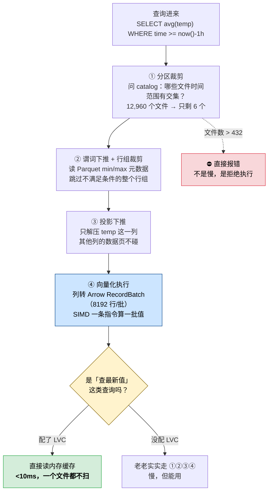

# 第 11 课：向量化执行：列存为什么快

> 阶段 4《存储引擎与性能》第 2 课 ｜ 上一课：[第 10 课《存储引擎：WAL、Parquet 与压实》](lesson-10-存储引擎-WAL-Parquet与压实.md)
>
> ⚡ **本课是开课时那个误解的最终闭环**：你最初以为 InfluxDB 是"向量数据库"。真相是——InfluxDB 3 的 *vectorized execution* 是**向量化执行**（列存 + SIMD 的查询加速技术），与存 embedding 做 ANN 检索的向量数据库（Milvus / Qdrant / pgvector）**完全是两回事**。学完本课，你会明白"向量"在这里指的是什么。

## 🎯 本课目标

| 知识点 | 关键点 | 学完你应该能 |
|--------|--------|-------------|
| ① 列存与向量化执行 | SIMD 批处理 vs 逐行处理；**"向量"= CPU 一次处理一批值** | 说清"向量化"到底向量化了什么，以及它和向量数据库的区别 |
| ② 谓词下推与分区裁剪 | 少读数据才是真的快 | 看懂 `EXPLAIN` 输出，知道哪三条优化在替你省 I/O |
| ③ last-value 查询为何 <10ms | LVC / DVC 两个**需主动配置**的内存缓存 | 复现 <10ms 的配置，并知道默认状态下达不到这个数字 |

---

## 第一幕：起源与场景引入

上一课结尾，我们留了一个悬念：Core 跑 90 天后会累积约 **12,960 个 Parquet 文件，永不合并**。有同事查年度报告，跑了 40 秒还没出来。

现在换个场景，看另一面。

你的监控大屏上有 **5 万个传感器信号**（每个电池仓、每个逆变器、每个电表各若干）。大屏要显示的是"**当前状态**"：每个信号的最新值。刷新间隔 5 秒。

你写了这样的查询：

```sql
SELECT room, last(temp) FROM sensors GROUP BY room;
```

或者更朴素的写法——先按时间倒序取第一条：

```sql
SELECT temp FROM sensors WHERE room = 'Kitchen' ORDER BY time DESC LIMIT 1;
```

**5 万个信号，每 5 秒刷新一次。** 数据库要为每一个信号去翻"最近的数据在哪"。

如果数据都躺在 Parquet 文件里，这就意味着：**每 5 秒扫描一遍最近的文件，为 5 万个信号各找一次最大值时间戳**。这是典型的 *scan-for-latest* 模式，是时序数据库最残酷的负载之一——**数据量可能很小（只查最新几个点），但要碰的文件和行一点都不少**。

可 InfluxDB 官方说，这类查询能做到 **<10ms**。

🤔 **为什么？** 5 万个信号，10 毫秒，平均每个信号 0.2 微秒。这不可能靠"更快地扫描"实现——只能靠**根本不扫描**。

这就是本课要讲的三件事：**列存 + 向量化**让扫描本身变快，**谓词下推 + 分区裁剪**让需要扫描的数据变少，而 **LVC** 让"查最新值"连扫描都不用。

---

## 第二幕：认知冲突

在揭晓答案之前，先看三个反直觉的事实——它们会打掉你从 MySQL / PostgreSQL 带过来的直觉。

**事实一：查 1 个字段和查 5 个字段，代价差 5 倍。**

在 MySQL 里，`SELECT temp FROM home` 和 `SELECT * FROM home` 的 I/O 差别没那么大——因为行式存储把整行存在一起，取一列往往也得把整行读出来。但在 InfluxDB 3 里，`SELECT avg(temp)` 只读 temp 这一列，**其他 4 列一个字节都不碰**。

**事实二：同样的 432 个文件上限，换个参数就从 3 天变成 7 小时。**

L3 学过的"Core 只能查 72 小时"，其实**根本不是时间限制**。代码里没有任何一处判断"查询时间范围是否超过 72 小时"。真正存在的是一条**文件数上限**：`query-file-limit`，默认 **432**。72 小时只是 432 个文件 × 10 分钟算出来的**派生值**。把 `gen1-duration` 从 10m 改成 1m，同样 432 个文件，可查范围立刻缩水到 **7.2 小时**。

**事实三：<10ms 的那个数字，默认状态下根本达不到。**

官方 README 写着 "sub-10ms query response times"。但 L3 已经核实过：这个数字的出处是 **LVC（Last Values Cache）**——一个**需要你主动创建**的内存缓存。**不配，就没有。**

⚠️ 这三条合起来指向同一个真相：**InfluxDB 3 的快，主要不是"算得快"，而是"读得少"。** 而"读得少"这件事，一部分引擎自动替你做（谓词下推、分区裁剪），一部分**必须你主动配置**（LVC、DVC）。分不清这两类，就会在生产上对着一个慢查询束手无策。

---

## 第三幕：层层揭示

### 知识点 1：列存与向量化执行 —— "向量"到底是什么

#### 一句话定义

**列式存储（columnar）**：把同一列的值连续存放在一起，而不是把同一行的值存在一起。
**向量化执行（vectorized execution）**：CPU 一次对**一整批值**（而不是一个值）执行同一条指令，通常借助 SIMD。

#### 直觉建立：Excel 表格的两种看法

想象一张 5 列的表格，20 万行。

**行式（Excel 的天然视角）**：一行一行地读。第 1 行是 `[time, room, temp, hum, co]`，第 2 行是下一组 5 个值……要拿到"所有 temp"，你得把 20 万行**每一行都打开**，只从里面抠出 temp 那个格子。

**列式**：按列存。所有 time 存成一段连续数组，所有 room 存成一段，所有 temp 存成一段……要拿"所有 temp"，**直接读 temp 那一段**，其他四段看都不看。

**这个类比的失效边界**：真实数据库不会真的"打开一行"，行式存储读一列时也要读整行所在的磁盘块，只是浪费了同块内其他列的空间。所以列存的优势不是"行式读不到"，而是**行式必须整块读入、列存可以只读所需的列段**——省的是 I/O 与内存带宽，不是"能不能读到"。

#### 核心原理：两个独立的加速，别混为一谈

很多人把"列存"和"向量化"当成一回事，其实它们是**两个独立、叠加**的加速：

**加速一：列存 → 少读数据（I/O 层）**

查 `avg(temp)` 时：

| 布局 | 要读多少 | 说明 |
|------|---------|------|
| 行存 | 20 万行 × 5 列 = **100 万个值** | 整行读入，只用一个字段 |
| 列存 | 20 万行 × 1 列 = **20 万个值** | 只读 temp 列 |

**读取量是行存的 1/5。** 列越多、查询涉及的列越少，省得越狠。真实场景一张表有 50 列，你查 3 列，就是 1/16。

**加速二：向量化 → 一次算一批（CPU 层）**

这一层的关键不是"批处理"本身，而是**数据布局让 SIMD 成为可能**。

**SIMD**（Single Instruction, Multiple Data，单指令多数据）：现代 CPU 的一条指令可以同时算多个数。一条 256 位的 AVX2 指令，能同时对 **8 个 32 位整数**做加法。

关键在于：**SIMD 要求数据在内存里是连续的、同类型的。**

- 行存：`[time, room, temp, hum, co]` 交替排列，temp 和 temp 之间隔着 4 个不同类型的字段 → **没法直接喂给 SIMD**
- 列存：`[temp, temp, temp, ...]` 全是同类型、连续排列 → **一条指令吃 8 个 temp**

所以准确的说法是：**列存是 SIMD 的前提，SIMD 是列存的兑现。** 光有列存不用 SIMD，只是省了 I/O；光想用 SIMD 而数据是行式，寄存器根本喂不饱。

#### 一个关键数字：8192

数据在引擎里不是"一列一整块"流动的，而是切成**批（batch）**。

**RecordBatch**（记录批）：一批行，每列在这批里是连续数组。DataFusion 默认 **8192 行/批**。

为什么要分批，不一次性处理整列？

| 极端 | 问题 |
|------|------|
| 一次一行 | 无法 SIMD；每行都有循环与函数调用开销 |
| 一次整列 | 内存装不下；无法流式处理；延迟高 |
| **每批 8192 行** | **够大能喂饱 SIMD、够小能塞进 CPU 缓存** |

> 📌 **记住 8192**：你在 `EXPLAIN` 输出里看到的 `CoalesceBatchesExec: target_batch_size=8192`，就是这个数。它是"向量化"这个词在查询计划里留下的指纹。

#### 回到那个误解：此"向量"非彼"向量"

现在可以彻底闭环开课时的概念澄清了：

| | InfluxDB 3 的 vectorized execution | 向量数据库（Milvus / Qdrant / pgvector） |
|---|---|---|
| "向量"指什么 | **CPU 一次处理的一批值**（如 8192 个 float64） | **embedding 向量**（如 768 维浮点数表示一个句子） |
| 目的 | 加速聚合 / 过滤 / 计算的吞吐 | 做相似度检索（ANN，近似最近邻） |
| 技术底座 | SIMD 寄存器 + 列式内存布局 | HNSW / IVF 等索引结构 |
| 能力 | InfluxDB **无**原生向量索引、无 ANN 检索 | 专门的向量索引 |

**一句话**：InfluxDB 的"向量"是**CPU 寄存器里的向量**，向量数据库的"向量"是**语义空间里的向量**。名字撞了，东西毫无关系。

时序相似性检索（找"形状相似的历史片段"）InfluxDB 做不了，通行做法是 InfluxDB + Milvus/Pinecone 组合。

📚 官方文档：[InfluxDB 3 storage engine architecture](https://docs.influxdata.com/influxdb3/cloud-dedicated/reference/internals/storage-engine/) ｜ [Apache Arrow & RecordBatches](https://datafusion.apache.org/)

---

### 知识点 2：谓词下推与分区裁剪 —— 少读数据才是真的快

#### 一句话定义

**谓词下推（predicate pushdown）**：把 `WHERE` 过滤条件尽可能"下压"到离数据最近的地方执行，让不满足条件的行根本不被读进内存。
**分区裁剪（partition pruning）**：先根据时间等分区键判断哪些文件**完全不可能**包含目标数据，这些文件一个都不打开。

#### 直觉建立：图书馆找书

你要找"2026 年出版的所有 Python 书"。

**笨办法**：把图书馆每一本书都搬下来，翻开版权页看年份和主题，不是的放回去。
**聪明办法**：先看目录卡——**（1）** 2026 年的书在 A 区，其他区不用去（**分区裁剪**）；**（2）** A 区里先看每本书脊上的分类标签，非 Python 的不抽出来（**谓词下推**）；**（3）** 只对剩下的抽出来翻，**而且只看你要的那一页**，不是整本读完（**投影下推**）。

三条优化层层收窄，最终搬到桌子上的书可能只有最初的 3%。

#### 核心原理：三条优化，一层比一层细

InfluxDB 3 的查询路径上依次发生三件事（由粗到细）：

**① 分区裁剪 —— 文件级，catalog 查一次就定**

数据按时间切成 **gen1 时间块**（默认 10 分钟），每块一个 Parquet 文件。每个文件的**时间范围元数据**记录在 catalog 里。

查询带 `WHERE time >= now() - INTERVAL '1 hour'` 时，引擎问 catalog："哪些文件的时间范围与这一小时有交集？" → 90 天数据（12,960 个文件）里，**只有 6 个文件命中，其余 12,954 个连打开都不打开**。

> 这一步发生在 **DataFusion 查询计划生成之前**。官方 Query Plans 文档里提到的 pruning，就是这个。

**② 谓词下推 + 行组裁剪 —— 文件内部，读元数据即可跳过**

Parquet 文件内部再分成**行组（row group）**，每个行组记录了该组各列的 **min/max 统计信息**。

引擎打开一个文件后，先看行组的 min/max：`WHERE temp > 100`，某行组记录着 `temp: [18.2, 28.7]` → **整个行组跳过，一个数据页都不解压**。

**③ 投影下推 —— 列级**

只读取查询实际引用到的列。`SELECT avg(temp)` 就读 temp 一列，其他列的数据页根本不解压。

#### 怎么看出来：EXPLAIN

三条优化都会写在查询计划里。跑 `EXPLAIN`：

```sql
EXPLAIN
SELECT date_bin(INTERVAL '5 minutes', time) AS bucket,
       room, AVG(temp) AS avg_temp
FROM home
WHERE time >= now() - INTERVAL '1 hour'
GROUP BY 1, 2;
```

你会看到类似这样的片段（结构取自官方 "How to Read InfluxDB 3 Query Plans" 博客，⏳ **该示例为缩写版，列名与文件数为示意，勿逐字比对**）：

```
ParquetExec:
  file_groups={12 files},                      <- ① 分区裁剪后剩下的文件
  projection=[time, room, temp],               <- ③ 投影下推：只读 3 列
  predicate=time >= ...,                       <- ② 谓词下推：条件下压到 Parquet 读取器
  pruning_predicate=time_max >= ...            <- ② 行组裁剪：用 min/max 跳行组
```

> 💡 **看 EXPLAIN 的三字诀**：看 `file_groups` 有几个文件（裁剪效果）、看 `projection` 有几列（投影效果）、看有没有 `predicate`/`pruning_predicate`（下推是否生效）。**这三项就是慢查询诊断的第一现场**（L12 会展开）。

#### 🔴 那个"72 小时"的真相：它是算出来的

这是本课最硬的一条事实，也是 L10"文件永不合并"的直接后果。

**代码里没有任何一处检查时间范围。** 真正存在的是一条文件数上限：

- `query-file-limit`，**默认 432**
- `gen1-duration`，**默认 10m**，且**只有 1m / 5m / 10m 三档可选**

算一下：

```
gen1 时间块 = 10 分钟
每小时文件数 = 60 / 10  = 6
每天文件数   = 6 × 24   = 144
432 / 144    = 3 天     = 72 小时
```

**"72 小时"是 432 × 10 分钟算出来的派生值，不是写死的常量。**

这解释了一个社区里反复被问的现象：*为什么我查 13 天的数据没报错？* 官方社区的回答是——**因为你的数据稀疏，13 天的数据没凑够 432 个文件**。判断依据是文件数，不是天数。

⚠️ **把 `gen1-duration` 调小，绝不会"启用压实"或扩大范围**：

| gen1-duration | 每小时文件数 | 432 个文件覆盖 |
|--------------|------------|--------------|
| 1m | 60 | **7.2 小时** |
| 5m | 12 | 36 小时 |
| **10m（默认）** | **6** | **72 小时** |

调小 → 文件更多 → 可查范围**更短**。**10m 已经是文件最少的那一档。**

**超限时会发生什么？** 不是慢，是**直接报错**。实测（第三方在 Core 3.11.0 上复现）：

```
External error: Query would scan 432 Parquet files, exceeding the file limit.
InfluxDB 3 Core caps file access to prevent performance degradation and memory issues.
Use a narrower time range, or increase the limit with --query-file-limit
(this may cause slower queries or instability).
```

官方明确不建议调高它，理由是四条副作用：**查询变慢 / 内存飙升 / 可能被 OOM kill / 对象存储上每个文件最多 2 次 GET 请求**。官方原文建议：*"We recommend keeping the default setting and querying smaller time ranges."*

📚 官方文档：[InfluxDB 3 Core configuration options · query-file-limit](https://docs.influxdata.com/influxdb3/core/reference/config-options/) ｜ [Query plans](https://docs.influxdata.com/influxdb/clustered/reference/internals/query-plan/)

---

### 知识点 3：last-value 查询为何 <10ms —— LVC 与 DVC

#### 一句话定义

**LVC（Last Values Cache，最后值缓存）**：在内存里为每个 key 列组合保存**最后 N 个值**，使"查最新值"不再扫描历史数据。
**DVC（Distinct Values Cache，去重值缓存）**：在内存里保存指定列的**去重值集合**，加速 `SHOW TAG VALUES` 这类元数据查询。

#### 直觉建立：前台的便签板

回到第一幕的大屏场景。

**没有 LVC**：每次刷新，前台（查询引擎）都要跑到档案室（Parquet 文件）翻 5 万个信号的最新记录。5 秒一次，永远在翻。

**有了 LVC**：前台桌上放一块**便签板**。每当有新数据写进来，就在便签板上**顺手更新**对应信号的最后几个值。要显示"当前状态"？**看一眼便签板**，档案室都不用进。

关键在于：**便签板是在"写入时"更新的，不是"查询时"计算的。** 写入已经在发生，顺手更新几乎不额外花代价；而查询时不用再算，省下的就是全部。

#### 核心原理：两个缓存，各治一种病

| | LVC | DVC |
|---|-----|-----|
| 存什么 | 每个 key 组合的**最后 N 个值** | 指定列的**去重值集合** |
| 治什么 | "当前状态"查询（`last()`、最新值） | 元数据查询（`SHOW TAG VALUES`、下拉框选项） |
| 官方口径 | **<10ms** | **~30ms** |
| 查询语法 | `SELECT * FROM last_cache('home','homeLastCache')` | `SELECT * FROM distinct_cache('wind_data','windCache')` |
| 是否默认开启 | ❌ **需主动创建** | ❌ **需主动创建** |

#### 怎么配（官方 CLI 原文）

```bash
# 创建 LVC：按 room 分组，缓存 temp/hum/co 三列，每个组合留最后 5 个值，TTL 30 分钟
influxdb3 create last_cache \
  --database mydb \
  --token YOUR_TOKEN \
  --table home \
  --key-columns room \
  --value-columns temp,hum,co \
  --count 5 \
  --ttl 30mins \
  homeLastCache
```

创建成功的输出（官方示例）：

```
new cache created: {
  "table": "airSensors",
  "name": "airSensorsLVC",
  "key_columns": [ 0 ],
  "value_columns": "all_non_key_columns",
  "count": 1,
  "ttl": 14400
}
```

查询（**必须用 SQL**）：

```sql
SELECT * FROM last_cache('home', 'homeLastCache');
SELECT room, temp FROM last_cache('home','homeLastCache') WHERE room = 'Kitchen';
```

> ⚠️ **InfluxQL 不支持 `last_cache()` 函数**（官方博客明确：*"InfluxQL does not support the last_cache() function"*）。要用 LVC，只能走 SQL 端点。

#### 🔴 三个必须知道的坑

**坑一：LVC 是内存的，服务器停止就清空。**

官方原文：*"Last Value Caches Are Flushed When the Server Stops."* 重启后，缓存**不会自动回填历史**——只有**新的写入**才会往里填。所以重启后有一段时间，某些信号在 LVC 里是空的。

→ 落地推论：**大屏在 InfluxDB 重启后可能出现短暂空白**，这是设计使然。要求"永远有值"的场景，查询要能降级到常规路径（`ORDER BY time DESC LIMIT 1`）。

**坑二：内存占用 = 基数字 × 每组合条数（基数照样是敌人）。**

官方给的公式：

```
key_column_cardinality × count = number_of_rows
```

举例：key 列是 2 个 tag，一个 3 个取值、一个 10 个取值 → 最多 30 个组合；`count=10` → **最多 300 行**。

⚠️ 注意这里的措辞：3.x 存储引擎**本身**不受基数限制（无限基数是 3.x 的卖点，L7 学过），**但 LVC 受**。官方提醒：*"While the InfluxDB 3 storage engine is not limited by cardinality, it does affect the LVC."*

→ 落地推论：**不要把高基数字段（trace_id、user_id、UUID）放进 LVC 的 key 列**。L7 结论在这里复现——ID 类字段本就不该做 tag，更不该做缓存 key。

**坑三：`--value-columns` 给了之后，未来新增的字段不会进缓存。**

官方文档：指定了 `--value-columns` 后，后续新增的 field **不会**自动加入缓存；**不指定**则缓存除 key 列外的所有列，**包括以后新增的**。

→ 二选一：指定 = 省内存但会漏新字段；不指定 = 不漏但要盯内存。

#### 近期数据还有一层加速：Parquet 内存缓存

除了 LVC/DVC，Core 还有一层默认开启的**文件缓存**：

- `file-cache-recency`（原 `parquet-mem-cache-query-path-duration`），**默认 5h**
- 含义：查询时，**只有数据时间戳落在"最近 5 小时"内的文件**才会被放进内存缓存

官方举例：现在 15:00，缓存窗口是 10:00–15:00。查 6 月 9 日（老数据）的文件**不进缓存**，查 14:00（窗口内）的文件**进缓存**。

→ 落地推论：**查最近几小时的数据，第二次会明显变快**（缓存命中）；查昨天的数据每次都要重新读盘。这也是 Core 被定位为"近期数据引擎"的又一体现。

📚 官方文档：[Query data in InfluxDB 3 Core · Optimize queries](https://docs.influxdata.com/influxdb3/core/get-started/query/) ｜ [Last Value Cache 博客](https://www.influxdata.com/blog/-influxdb3-last-value-cache)

---

## 第四幕：实操验证

> ⚠️ **实验环境说明**：与 L6/L7/L8/L9/L10 一致，编写环境**无 Docker**（`docker: command not found`），故**实验 A/B 为本机 Python 3.11 实跑**（真实输出已逐字回贴），**实验 C/D 未实跑**，改为给出「判断成功的标准」，并标 ⏳ 待真实环境验证。

### 实验 A：列存 / 向量化模拟器（✅ 本机实跑）

> ⚠️ **先读这段，再看数字（重要）**：本实验用 Python 模拟，测出来的是**"循环与函数调用开销"的差异**，**不是** InfluxDB 的真实加速比。真正的 SIMD 发生在 Rust 编译的 DataFusion 内核里，在 Python 层测不到。本实验的价值是让两件事**可见**：① 列存省的是**读取量**（对照 1 的 1/5 是硬的，与实现语言无关）② 批处理省的是**每行的固定开销**（对照 2 控制变量后依然有 5.72 倍）。而"一条指令算 8 个 float"这部分，只能靠理解原理，无法在此复现。

下面这段脚本不需要 Docker、不需要 numpy，**纯 Python 标准库**，复制即可跑：

```python
# -*- coding: utf-8 -*-
"""列存 vs 行存 · 逐行 vs 批处理 —— 纯标准库，可直接运行"""
import time
import random

random.seed(20260831)

N = 200_000       # 20 万行
BATCH = 8192      # DataFusion / Arrow 默认批大小
NCOLS = 5         # time, room, temp, hum, co
VAL_BYTES = 8

print("数据：{:,} 行 x {} 列（time, room, temp, hum, co）".format(N, NCOLS))
print("批大小：{} 行/批（DataFusion 默认 batch_size）".format(BATCH))

# ---------- 构造两种布局 ----------
rooms = ["kitchen", "living_room", "bedroom", "garage"]
col_time = [1_700_000_000_000_000_000 + i * 10_000_000_000 for i in range(N)]
col_room = [rooms[i % 4] for i in range(N)]
col_temp = [round(random.uniform(18.0, 28.0), 2) for _ in range(N)]
col_hum = [round(random.uniform(30.0, 60.0), 2) for _ in range(N)]
col_co = [random.randint(0, 30) for _ in range(N)]
rows = list(zip(col_time, col_room, col_temp, col_hum, col_co))

print("构造完成：列式 5 个 list + 行式 {:,} 个 tuple".format(N))

# ---------- 对照 1：扫多少数据 ----------
print("[2] 对照 1 —— 求 avg(temp) 时，两种布局各要触碰多少值")
row_vals = N * NCOLS
col_vals = N
print("    行存（整行读入）：{:,} 个值 = {:>10,} 字节 ≈ {:.1f} MB".format(
    row_vals, row_vals * VAL_BYTES, row_vals * VAL_BYTES / 1024 / 1024))
print("    列存（只读 temp）：{:,} 个值 = {:>10,} 字节 ≈ {:.1f} MB".format(
    col_vals, col_vals * VAL_BYTES, col_vals * VAL_BYTES / 1024 / 1024))
print("    -> 列存读取量是行存的 1/{}，省掉 {:.0f}%".format(
    NCOLS, (1 - col_vals / row_vals) * 100))

# ---------- 对照 2：控制变量，同一份列存数据 ----------
print("[3] 对照 2 —— 同一份列存数据，逐行处理 vs 批处理")
t0 = time.perf_counter()
total = 0.0
for v in col_temp:
    total += v
avg_scalar = total / N
t_scalar = time.perf_counter() - t0

t0 = time.perf_counter()
total = 0.0
for start in range(0, N, BATCH):
    total += sum(col_temp[start:start + BATCH])
avg_vector = total / N
t_vector = time.perf_counter() - t0

print("    逐行（每行 1 次循环迭代）：{:>8.4f} 秒，avg = {:.4f}".format(t_scalar, avg_scalar))
print("    批处理（每 {} 行 1 次调用）：{:>8.4f} 秒，avg = {:.4f}".format(BATCH, t_vector, avg_vector))
print("    -> 批处理比逐行快 {:.2f} 倍，循环迭代次数从 {:,} 降到 {}".format(
    t_scalar / t_vector, N, -(-N // BATCH)))

# ---------- 对照 3：端到端 ----------
print("[4] 对照 3 —— 端到端：行存逐行取整行字段 vs 列存整批处理")
t0 = time.perf_counter()
total = 0.0
for r in rows:
    total += r[2]
avg_e2e_row = total / N
t_e2e_row = time.perf_counter() - t0

t0 = time.perf_counter()
total = 0.0
for start in range(0, N, BATCH):
    total += sum(col_temp[start:start + BATCH])
avg_e2e_col = total / N
t_e2e_col = time.perf_counter() - t0

print("    行存 + 逐行：{:>8.4f} 秒，avg = {:.4f}".format(t_e2e_row, avg_e2e_row))
print("    列存 + 批处理：{:>8.4f} 秒，avg = {:.4f}".format(t_e2e_col, avg_e2e_col))
print("    -> 端到端快 {:.2f} 倍".format(t_e2e_row / t_e2e_col))
print("    （三个 avg 相等 = {:.4f}）".format(avg_e2e_col))
```

**本机实跑输出（Python 3.11.15，2026-08-31）**：

```
==================================================================
实验 A：列存 vs 行存 · 逐行 vs 批处理
==================================================================
数据：200,000 行 x 5 列（time, room, temp, hum, co）
批大小：8192 行/批（DataFusion 默认 batch_size）

[1] 构造完成：列式 5 个 list + 行式 200,000 个 tuple

[2] 对照 1 —— 求 avg(temp) 时，两种布局各要触碰多少值
    行存（整行读入）：1,000,000 个值 =  8,000,000 字节 ≈ 7.6 MB
    列存（只读 temp）：200,000 个值 =  1,600,000 字节 ≈ 1.5 MB
    -> 列存读取量是行存的 1/5，省掉 80%

[3] 对照 2 —— 同一份列存数据，逐行处理 vs 批处理
    逐行（每行 1 次循环迭代）：  0.0049 秒，avg = 23.0070
    批处理（每 8192 行 1 次调用）：  0.0008 秒，avg = 23.0070
    -> 批处理比逐行快 5.72 倍，循环迭代次数从 200,000 降到 25
    ⚠️ 这是 Python 层可测的「循环开销」差异；真正的 SIMD 发生在 Rust 编译的 DataFusion 内核里

[4] 对照 3 —— 端到端：行存逐行取整行字段 vs 列存整批处理
    行存 + 逐行：  0.0077 秒，avg = 23.0070
    列存 + 批处理：  0.0009 秒，avg = 23.0070
    -> 端到端快 8.62 倍
    （三个 avg 相等 = 23.0070，说明两种布局数据内容一致）
==================================================================
```

**三个对照分别证明了什么**：

| 对照 | 证明的事 | 数字 |
|------|---------|------|
| 对照 1 | 列存**少读数据**（I/O 层） | 读取量 1/5，省 80% |
| 对照 2 | 批处理**减少循环开销**（CPU 层，控制变量后仍有 5.72 倍） | 20 万次迭代 → 25 次 |
| 对照 3 | 两者叠加的端到端效果 | **8.62 倍** |

⚠️ **诚实说明（重要）**：这个 8.62 倍**不等于** InfluxDB 的真实加速比。Python 的 `sum()` 走 C 实现，测出来的是"循环与函数调用开销"的差异；**真正的 SIMD 发生在 Rust 编译的 DataFusion 内核里**，那部分在这个脚本里测不到。本实验的价值是让两件事**可见**：

1. 列存省的是**读取量**（对照 1 的 1/5 是硬的，与实现语言无关）
2. 批处理省的是**每行的固定开销**（对照 2 控制变量后依然有 5.72 倍）

而"8 个 float 一条指令算完"这部分，只能靠理解原理，无法在 Python 层复现。

### 实验 B：分区裁剪与 432 文件限制（✅ 本机实跑）

```python
# -*- coding: utf-8 -*-
"""分区裁剪与 432 文件限制 —— 纯标准库"""
FILES_PER_DAY = 144   # 10 分钟一个文件 -> 6/小时 -> 144/天
LIMIT = 432           # query-file-limit 默认值

print("[1] 432 这个数字是怎么来的")
print("    gen1-duration 默认 10 分钟 -> 每小时 6 个文件 -> 每天 {} 个".format(FILES_PER_DAY))
print("    query-file-limit 默认 {}".format(LIMIT))
print("    {} / {} = 3 天 = 72 小时  <- 「72 小时」是算出来的，不是写死的".format(LIMIT, FILES_PER_DAY))

print("[2] 同一个 432，换个 gen1-duration 效果完全不同")
for g in (1, 5, 10):
    per_hour = 60 // g
    hours = LIMIT / per_hour
    print("    gen1={:>2}m -> 每小时 {:>2} 个文件 -> 432 个文件只覆盖 {:>5.1f} 小时（{:.2f} 天）".format(
        g, per_hour, hours, hours / 24))

print("[3] 查不同时间范围，需要读多少个文件（Core 默认配置）")
for days in (1, 3, 7, 30, 90, 365):
    files = days * FILES_PER_DAY
    verdict = "OK 在限制内" if files <= LIMIT else "超限 -> 查询直接报错"
    print("    查 {:>3} 天 -> 需读 {:>7,} 个文件 -> {}".format(days, files, verdict))

print("[4] 分区裁剪的效果：表里有 90 天数据（{:,} 个文件）".format(90 * FILES_PER_DAY))
total_files = 90 * FILES_PER_DAY
for hours in (1, 6, 24, 72):
    need = int(hours * 6)
    pct = need / total_files * 100
    print("    查最近 {:>3} 小时 -> 读 {:>6,} / {:,} 个文件（{:>5.2f}%）".format(
        hours, need, total_files, pct))
```

**本机实跑输出（Python 3.11.15，2026-08-31）**：

```
==================================================================
实验 B：分区裁剪与 432 文件限制
==================================================================
[1] 432 这个数字是怎么来的
    gen1-duration 默认 10 分钟 -> 每小时 6 个文件 -> 每天 144 个
    query-file-limit 默认 432
    432 / 144 = 3 天 = 72 小时  <- 「72 小时」是算出来的，不是写死的

[2] 同一个 432，换个 gen1-duration 效果完全不同
    gen1= 1m -> 每小时 60 个文件 -> 432 个文件只覆盖   7.2 小时（0.30 天）
    gen1= 5m -> 每小时 12 个文件 -> 432 个文件只覆盖  36.0 小时（1.50 天）
    gen1=10m -> 每小时  6 个文件 -> 432 个文件只覆盖  72.0 小时（3.00 天）
    ⚠️ 把 gen1 调小会让文件更多、可查范围更短，绝不是「启用压实」的办法

[3] 查不同时间范围，需要读多少个文件（Core 默认配置）
    查   1 天 -> 需读     144 个文件 -> OK 在限制内
    查   3 天 -> 需读     432 个文件 -> OK 在限制内
    查   7 天 -> 需读   1,008 个文件 -> 超限 -> 查询直接报错
    查  30 天 -> 需读   4,320 个文件 -> 超限 -> 查询直接报错
    查  90 天 -> 需读  12,960 个文件 -> 超限 -> 查询直接报错
    查 365 天 -> 需读  52,560 个文件 -> 超限 -> 查询直接报错

[4] 分区裁剪的效果：表里有 90 天数据（12,960 个文件）
    查最近   1 小时 -> 读      6 / 12,960 个文件（ 0.05%）
    查最近   6 小时 -> 读     36 / 12,960 个文件（ 0.28%）
    查最近  24 小时 -> 读    144 / 12,960 个文件（ 1.11%）
    查最近  72 小时 -> 读    432 / 12,960 个文件（ 3.33%）
    -> 90% 以上的查询耗时，取决于「有没有把时间范围写窄」
==================================================================
```

**这张表要记住的两行**：

- **对照 4**：90 天的数据里查最近 1 小时，只读 **0.05%** 的文件 → **分区裁剪是 Core 唯一能对抗"文件永不合并"的武器**，而它的开关就是**你 WHERE 里的时间范围**
- **对照 3**：**7 天就超限了**。L10 说"90 天 12,960 个文件永不合并"，本实验把它换算成了运维能感知的边界——**Core 实际上查不了 1 周以上的数据，而且是直接报错，不是慢**

### 实验 C：亲眼看到谓词下推与投影下推（⏳ 未实跑）

```bash
# 1. 写入一批数据（沿用 L3 的 home 示例）
influxdb3 write --database mydb \
  'home,room=Kitchen temp=22.7,hum=36.5,co=26i'
influxdb3 write --database mydb \
  'home,room=Living\ Room temp=22.2,hum=36.4,co=17i'

# 2. 跑 EXPLAIN，看三条优化是否生效
influxdb3 query --database mydb "
EXPLAIN
SELECT room, AVG(temp) AS avg_temp
FROM home
WHERE time >= now() - INTERVAL '1 hour'
GROUP BY room"
```

**判断成功的标准**（⏳ 查询输出格式未实测，故不给逐字表格，只给核对项）：

1. 输出中出现 `ParquetExec` 或 `RecordBatchesExec` 节点（后者代表还在内存缓冲里、尚未持久化的近期数据）
2. `projection=[...]` 里**只有** `room`、`temp`、`time` 三列，**没有** `hum`、`co` → **投影下推生效**
3. 出现 `predicate=` 或 `pruning_predicate=` 且含 `time` → **谓词下推生效**
4. `file_groups={N files}` 的 N **远小于** 表里的总文件数 → **分区裁剪生效**

> 💡 **如果数据刚写入还没持久化**（不到 10 分钟），你会看到 `RecordBatchesExec` 而不是 `ParquetExec`——这恰好印证了 L10 的"写入五站"：近期数据在内存缓冲里，还没进 Parquet。

### 实验 D：亲手把 last-value 查询压到 <10ms（⏳ 未实跑）

```bash
# 1. 创建 LVC（key 列用 room，缓存 temp/hum/co，每个组合留最后 5 个值）
influxdb3 create last_cache \
  --database mydb --table home \
  --key-columns room \
  --value-columns temp,hum,co \
  --count 5 --ttl 30mins \
  homeLastCache

# 2. 走缓存查询（注意：必须用 SQL，InfluxQL 不支持 last_cache()）
influxdb3 query --database mydb \
  "SELECT * FROM last_cache('home', 'homeLastCache')"

# 3. 对比不走缓存的常规写法
influxdb3 query --database mydb \
  "SELECT room, temp FROM home ORDER BY time DESC LIMIT 10"
```

**判断成功的标准**（⏳ 未实测）：

1. 第 1 步返回 `new cache created: {...}`，其中 `key_columns` 与 `value_columns` 与你指定的一致
2. 第 2 步能查到数据，且**只返回每个 room 的最后 5 条**（`count=5` 生效）
3. 第 3 步返回的是全表倒序的前 10 条，**与第 2 步结果结构不同** → 证明 LVC 是一个独立结构，不是语法糖

> ⚠️ **重启验证（可选但很有教育意义）**：`docker stop` 再 `docker start` 后**立刻**跑第 2 步，你会发现**缓存是空的**。官方原文：LVC 在服务器停止时被清空，且**只有新写入才会回填**。这是本实验最值得亲手做的一步。

---

## 第五幕：体系收束

### 一图总结



### 三句话收束本课

1. **列存省的是"读多少"，向量化省的是"每次读的开销"** —— 前者让 I/O 变成 1/5，后者让 CPU 一次算一批；**列存是 SIMD 的前提，SIMD 是列存的兑现**，两者叠加才有 8.62 倍。
2. **谓词下推与分区裁剪是引擎自动做的，但前提是你要给它条件** —— 不写 `WHERE time >= ...`，引擎就没法裁剪；90 天数据里查 1 小时只读 0.05% 的文件，**这个 0.05% 是你写出来的**。
3. **<10ms 不是免费的** —— 它来自 LVC，而 **LVC 需要你主动创建、在内存里、重启即清空、且受基数影响**。默认状态下达不到这个数字。

### 📍 全局定位

```
阶段 4《存储引擎与性能》· 探原理
├── L10 写入路径：数据怎么进去的          ✅ WAL → 内存 → Parquet
├── L11 查询路径：数据怎么读出来的         ✅ 裁剪 → 下推 → 向量化 → LVC  ← 你在这里
└── L12 性能调优：慢了怎么办               ⬜ 批量写入 / 查询调优 / 慢查询诊断
```

**L10 与 L11 是一条完整链路的两端**：

| | L10（写入侧） | L11（查询侧） |
|---|---|---|
| 核心矛盾 | 每 10 分钟产生一个文件，**永不合并** | 文件越多，查询要打开的越多 |
| 后果 | 90 天 **12,960 个文件** | 查 7 天就要 1,008 个文件，**超 432 直接报错** |
| 唯一的缓解 | 无（架构天花板，调参无效） | **把时间范围写窄**（分区裁剪） |
| 终极解法 | Enterprise 的 compactor | Enterprise 的 compactor |

> 🔗 **两课合起来回答了一个问题**：为什么官方把 Core 定位为"近期数据引擎"（typically the last 3-5 days）——**不是营销话术，是 432 这个数字算出来的必然结果。**

**⚡ 开课误解的最终闭环**：InfluxDB 的 *vectorized execution* = 列存 + SIMD 的查询执行技术，"向量"是 **CPU 寄存器里的一批值**（8192 行/批）；向量数据库的"向量"是 **embedding**（768 维语义向量）。**名字撞了，东西毫无关系。** InfluxDB 无原生向量索引，也做不了 ANN 检索。

### 🔗 下一步

**下一课 L12《写入与查询性能调优》**，把 L10/L11 的原理变成**可执行的动作清单**：

- 批量写多大？`batch_size` 与 `flush_interval` 怎么权衡
- 慢查询怎么查？从 `EXPLAIN` 的哪一行开始看
- 避坑：`SELECT *`、不带时间范围、`SELECT DISTINCT` 的代价

本课讲的"为什么快/为什么慢"，到 L12 会变成"**具体改哪一行**"。

### 🎯 落地视角小结

> 面向工作落地。这 6 条是你明天能在团队里讲出来的东西。

1. **"72 小时限制"的准确说法是"432 个文件限制"**。向团队汇报时用后者——它能解释"为什么我查 13 天没报错"（数据稀疏，没凑够 432 个文件），也能解释"为什么调 `gen1-duration` 救不了你"（调小反而从 3 天缩到 7.2 小时）。

2. **Core 查不了 1 周以上的数据，而且是直接报错不是慢**。7 天 = 1,008 个文件 > 432。做容量规划时，这条比"3-5 天"的模糊表述有用得多。

3. **所有面向 Core 的查询必须带时间范围**。这是分区裁剪唯一的输入，也是唯一能对抗"文件永不合并"的手段。把它写进代码规范和 Code Review 检查项。

4. **要 <10ms 就必须配 LVC，且要用 SQL 查**（`last_cache()` 在 InfluxQL 里不支持）。同时接受三个代价：占内存、**重启后缓存为空直到新写入进来**、**key 列不能是高基数字段**。

5. **大屏/告警类"当前状态"查询，LVC 的 key 列应该与你的筛选维度一致**（如 `site_id → container_id → rack_id`）。不要把 trace_id / user_id 这类高基数字段放进 key 列——3.x 引擎不怕基数，但 LVC 怕。

6. **向团队解释"向量化"时，先说清它不是向量数据库**。这是本文档开头就踩过的坑，别人极可能也会踩。一句话版本：*InfluxDB 的"向量"在 CPU 寄存器里，向量数据库的"向量"在语义空间里。*

---

## 🐞 本课误区速查

| # | 误区 | 真相 |
|---|------|------|
| 1 | "InfluxDB 是向量数据库" | ❌ 是时序数据库。*vectorized execution* = 列存 + SIMD，**"向量"= CPU 一次处理的一批值（8192 行/批）**，与 embedding / ANN 检索无关 |
| 2 | "列存和向量化是一回事" | ❌ 两回事：**列存省 I/O**（读取量 1/5），**向量化省 CPU**（SIMD 一次算一批）。列存是 SIMD 的前提，SIMD 是列存的兑现 |
| 3 | "Core 只能查 72 小时（时间限制）" | ❌ **是 432 个文件的限制**。72 小时 = 432 × 10 分钟算出来的派生值。数据稀疏时查 13 天也不报错 |
| 4 | "把 `gen1-duration` 调小能让文件变少" | ❌ 相反：1m → 每小时 60 个文件 → 432 个文件只覆盖 **7.2 小时**。10m 已是文件最少档 |
| 5 | "超了 432 会变慢" | ❌ **直接报错**，查询根本不执行。且官方不建议调高（慢 / 内存飙升 / 可能 OOM / 对象存储每文件最多 2 次 GET） |
| 6 | "InfluxDB 3 查询天然 <10ms" | ❌ 那是 **LVC** 的数字，而 LVC **需主动创建**。默认状态走常规路径，达不到 |
| 7 | "LVC 重启后会自己回填" | ❌ **不会**。服务器停止即清空，只有**新写入**才回填。重启后有一段时间缓存是空的 |
| 8 | "3.x 无限基数，所以 LVC 也不怕基数" | ❌ **引擎不怕，LVC 怕**。官方：*"the storage engine is not limited by cardinality, it does affect the LVC"*。内存 ≈ 基数字 × count |
| 9 | "可以用 InfluxQL 查 LVC" | ❌ `last_cache()` **InfluxQL 不支持**，只能走 SQL 端点 |
| 10 | "不写 WHERE 时间范围，引擎也会自己优化" | ❌ 分区裁剪的**唯一输入**就是你的时间谓词。不给条件 = 全表扫描，且大概率撞上 432 上限 |
| 11 | "查昨天和查最近 1 小时一样快" | ❌ Parquet 内存缓存窗口默认 **5h**，窗口外的文件不进缓存，每次都要重新读盘 |

---

## 📚 官方文档

| 主题 | 链接 |
|------|------|
| 查询数据（含 LVC / DVC 优化项） | [Query data in InfluxDB 3 Core](https://docs.influxdata.com/influxdb3/core/get-started/query/) |
| 配置项（`query-file-limit` / `gen1-duration` / `file-cache-recency`） | [InfluxDB 3 Core configuration options](https://docs.influxdata.com/influxdb3/core/reference/config-options/) |
| 存储引擎架构（Querier / Compactor / Catalog 组件） | [InfluxDB 3 storage engine architecture](https://docs.influxdata.com/influxdb3/cloud-dedicated/reference/internals/storage-engine/) |
| 查询计划与 EXPLAIN | [Query plans](https://docs.influxdata.com/influxdb/clustered/reference/internals/query-plan/) ｜ [How to Read InfluxDB 3 Query Plans](https://www.influxdata.com/blog/how-read-influxdb-3-query-plans) |
| Last Value Cache 详解 | [Query the Latest Values in Under 10ms](https://www.influxdata.com/blog/-influxdb3-last-value-cache) |
| 缓存管理 API | [Table · configure last_cache / distinct_cache](https://docs.influxdata.com/influxdb3/core/api/table/) |
| DataFusion / Arrow | [Apache DataFusion](https://datafusion.apache.org/) ｜ [Apache Arrow](https://arrow.apache.org/) |

---

## 📋 本课速查卡

### 三条优化（引擎自动做）

| 优化 | 粒度 | 靠什么 | EXPLAIN 里看哪里 |
|------|------|--------|-----------------|
| **分区裁剪** | 文件 | catalog 里的时间范围元数据 | `file_groups={N files}` |
| **谓词下推 + 行组裁剪** | 文件内行组 | Parquet 的 min/max 统计 | `predicate=` / `pruning_predicate=` |
| **投影下推** | 列 | 只解压被引用的列 | `projection=[...]` |

### 432 文件限制速算

```
每天文件数 = (60 / gen1分钟数) × 24
gen1=10m → 144/天 → 432 个文件 = 3 天 = 72 小时  ← 默认
gen1= 5m → 288/天 → 432 个文件 = 1.5 天
gen1= 1m → 1440/天 → 432 个文件 = 0.3 天（7.2 小时）
```

### LVC vs DVC

| | LVC | DVC |
|---|-----|-----|
| 用途 | 查**最新值**（当前状态 / 大屏 / 告警） | 查**去重值**（`SHOW TAG VALUES` / 下拉选项） |
| 官方口径 | **<10ms** | **~30ms** |
| 创建 | `influxdb3 create last_cache` | `influxdb3 create distinct_cache` |
| 查询 | `SELECT * FROM last_cache('t','c')` | `SELECT * FROM distinct_cache('t','c')` |
| 语言 | **仅 SQL**（InfluxQL 不支持） | SQL |
| 重启 | **清空，需新写入回填** | 同 |
| 内存 | key 基数字 × count | 受 `max-cardinality` 限制 |
| 默认开 | ❌ 需主动创建 | ❌ 需主动创建 |

### 关键默认值

| 参数 | 默认值 | 含义 |
|------|--------|------|
| `query-file-limit` | **432** | 单查询能访问的 Parquet 文件数上限 |
| `gen1-duration` | **10m** | gen1 时间块长度，**仅 1m/5m/10m 三档** |
| `file-cache-recency` | **5h** | Parquet 内存缓存窗口（原 `parquet-mem-cache-query-path-duration`） |
| DataFusion `batch_size` | **8192** | RecordBatch 行数（向量化的"向量"长度） |
| `last-cache-eviction-interval` | 10s | LVC 过期条目清理间隔 |

---

## 课后小测

**Q1**：InfluxDB 3 的 "vectorized execution" 中的"向量"指什么？
- A. 存 embedding 的高维向量，用于相似度检索
- B. CPU 一次处理的一批值（如 Arrow RecordBatch 的 8192 行）
- C. 向量的数学概念（有大小和方向）
- D. 数据分片后的一致性哈希向量

<details><summary>答案与解析</summary>

**答案：B**。*vectorized execution* = 列存 + SIMD 的查询执行技术，"向量"指 **CPU 一条指令同时处理的一批值**。DataFusion 默认批大小 **8192 行/批**（RecordBatch），`EXPLAIN` 里表现为 `CoalesceBatchesExec: target_batch_size=8192`。
**A 是向量数据库**（Milvus / Qdrant / pgvector）的概念，InfluxDB **无**原生向量索引、做不了 ANN 检索；**C/D** 与查询执行无关。

</details>

**Q2**：关于"Core 只能查 72 小时"，下列说法正确的是？
- A. 代码里有个常量判断查询时间范围是否超过 72 小时
- B. 真正的限制是 432 个 Parquet 文件，72 小时是 432 × 10 分钟算出来的派生值
- C. 把 `gen1-duration` 调成 1m 可以扩大可查范围
- D. 超过限制时查询会变慢但能返回结果

<details><summary>答案与解析</summary>

**答案：B**。代码里**没有任何一处**检查时间范围；真正存在的是 `query-file-limit` 默认 **432**。官方原文：*"With the default 432 setting and the default gen1-duration setting of 10 minutes, queries can access up to a 72 hours of data"*——72 小时是算出来的。这也解释了社区里"查 13 天没报错"的现象：**数据稀疏时没凑够 432 个文件**。
**A 错**——不存在这个时间判断；**C 错**——调成 1m 后每小时 60 个文件，432 个文件只覆盖 **7.2 小时**，范围**缩小**到十分之一；**D 错**——是**直接报错**（`Query would scan 432 Parquet files, exceeding the file limit`），不是变慢。

</details>

**Q3**（多选）：要让"当前状态"类查询达到 <10ms，需要哪些条件？
- A. 主动创建 LVC（`influxdb3 create last_cache`）
- B. 用 SQL 查询（`last_cache()` 在 InfluxQL 里不支持）
- C. LVC 的 key 列避免高基数字段（如 trace_id / user_id）
- D. 只要数据足够新，默认就能达到

<details><summary>答案与解析</summary>

**答案：A、B、C**。
**A** —— LVC **需主动创建**，默认状态走常规路径。官方 <10ms 的出处就是 LVC。
**B** —— 官方博客明言：*"InfluxQL does not support the last_cache() function"*。
**C** —— 官方：*"While the InfluxDB 3 storage engine is not limited by cardinality, it does affect the LVC"*。**3.x 引擎不怕基数，但 LVC 怕**，内存 ≈ 基数字 × count。
**D 错** —— 数据新不等于有缓存。另外注意：LVC **重启即清空且不会自动回填**，只有新写入才填。

</details>

**Q4**：一条 `SELECT avg(temp) FROM home WHERE time >= now() - INTERVAL '1 hour'` 的查询，引擎依次做了什么？
- A. 读全部文件 → 解压所有列 → 在内存里过滤
- B. 分区裁剪（挑文件）→ 谓词下推 + 行组裁剪（跳行组）→ 投影下推（只读 temp 列）→ 向量化执行
- C. 先用 LVC 命中，命中不了再扫文件
- D. 先向量化执行，再过滤

<details><summary>答案与解析</summary>

**答案：B**。四步顺序即本课一图总结：
1. **分区裁剪**——问 catalog 哪些文件时间范围有交集，90 天 12,960 个文件里查 1 小时只剩 **6 个**（0.05%）
2. **谓词下推 + 行组裁剪**——读 Parquet 行组的 min/max，跳过不满足条件的行组（不解压）
3. **投影下推**——只解压 temp 列，其他列的数据页不碰
4. **向量化执行**——转 Arrow RecordBatch（8192 行/批），SIMD 算

**A 错**——那是没有下推的行式数据库做法；**C 错**——LVC **只服务"查最新值"这类查询**（`last_cache('t','c')`），普通的 `avg(...) WHERE time...` **不走 LVC**；**D 错**——顺序颠倒，必须先裁剪再计算。

</details>

---

## 🚀 下一批接力提示词

> 学完本课后，**复制下面这段文字发给 AI**，即可无缝进入下一课（无需重新描述上下文）：

```
继续学 InfluxDB。我的学习档案在 influxdb/00-学习档案.md，
刚学完阶段 4《存储引擎与性能》的第 11 课《向量化执行：列存为什么快》
（知识点：列存与向量化执行、谓词下推与分区裁剪、last-value 查询为何 <10ms），
请按大纲继续讲解第 12 课。
```

## 🧭 课程导航

➡️ **下一课**：第 12 课《写入与查询性能调优》
⬅️ **上一课**：[第 10 课《存储引擎：WAL、Parquet 与压实》](lesson-10-存储引擎-WAL-Parquet与压实.md)

📚 **返回目录**：[课程目录](../../../02-课程目录.md) ｜ 🗺️ **路径总览**：[学习路径总览](../../../01-学习路径总览.md) ｜ 📖 **阶段导览**：[阶段 4 概览](../overview.md)
