# 第 12 课：写入与查询性能调优

> 阶段 4《存储引擎与性能》第 3 课（**阶段收官**）｜ 上一课：[第 11 课《向量化执行：列存为什么快》](lesson-11-向量化执行-列存为什么快.md)
>
> ⚡ **本课是阶段 4 的收口**：L10 讲了"数据怎么进去"，L11 讲了"数据怎么读出来"，本课把这两条链路上的原理**变成可执行的动作清单**——批量写多大、慢查询从哪一行开始看、哪些优化根本不值得做。学完本课，阶段 4 的出口要求（面对一个慢查询能给出具体调优动作）就算达成了。

## 🎯 本课目标

| 知识点 | 关键点 | 学完你应该能 |
|--------|--------|-------------|
| ① 批量写入与压缩 | **固定开销 vs 边际收益递减**；10,000 行 / 10MB 双阈值；gzip | 给出 `batch_size` 与 `flush_interval` 的取值理由，而不是照抄 5000 |
| ② 查询性能调优 | 收窄时间范围、**`SELECT *` 的真实代价**、善用 tag 过滤 | 判断哪些优化值得做、哪些是浪费时间 |
| ③ 慢查询诊断 | `EXPLAIN` 三兄弟分工 + `system.queries` 系统表 + 七步倒查 | 拿到一条慢查询，能在 5 分钟内定位到瓶颈属于哪一类 |

---

## 第一幕：起源与场景引入

上一课结尾，我们知道了 InfluxDB 3 的"快"主要来自**读得少**：列存少读列、分区裁剪少开文件、LVC 干脆不读文件。

现在，你的系统上线三个月了。某个周一早上，两通电话几乎同时打进来。

**第一通，来自采集侧同事**：

> "写入越来越慢了。一开始每秒能进 8 万条，现在卡在 6 千，而且波动特别大。我看 CPU 和磁盘都很闲，不是硬件瓶颈。"

你去看了他的代码，发现是这样写的：

```python
for point in points:          # 从 Kafka 拉下来的一批
    client.write(point)       # 一个点一次 HTTP 请求
```

**第二通，来自业务方**：

> "监控大屏打开要 8 秒，以前是 1 秒。运营的月度报表干脆跑不出来，直接报错。"

你去看了报表的 SQL，发现 `WHERE` 里只有 `room = 'Kitchen'`，**没有时间条件**——那是 BI 工具拖拽时自动生成的。

两通电话，两个方向。但它们其实是**同一门课**：**写入侧的瓶颈在"每次请求的固定开销"，查询侧的瓶颈在"引擎要打开多少文件"。** 而这两件事，都**不是靠加机器解决的**——加机器既不会让一次 HTTP 请求变快，也不会让 12,960 个文件变少。

这就是本课要讲的三件事：**批量写多大才划算**、**查询优化里哪些是真优化哪些是伪优化**、**拿到一条慢查询该从哪一行开始看**。

---

## 第二幕：认知冲突

在给答案之前，先看三个反直觉的事实——它们会打掉你从 MySQL / Kafka 带过来的直觉。

**事实一：批量从 1,000 加到 10,000，吞吐只涨 1.8 倍；但从 1 加到 1,000，涨了 500 倍。**

直觉告诉我们"批量越大越好"。但固定开销被摊掉之后，**剩下的是线性部分，再堆量也没有收益**。用本课实验 A 的模型算：batch=1 时吞吐 500 点/秒，batch=1000 时 250,000 点/秒（**500 倍**），batch=10000 时 454,545 点/秒（相对 batch=1000 只有 **1.82 倍**），batch=100000 时 495,050 点/秒（相对 batch=10000 只有 **1.09 倍**）。

⚠️ 结论：**从 1 到 1,000 是本课唯一值得争取的区间**，之后每一档都要用"单批延迟 + 内存占用 + 失败重传代价"去换一点点吞吐。

**事实二：`SELECT *` 在 10 列的表上几乎不慢——官方原文说"差距很小"。**

这是被讲得最多、也最常被过度执行的优化。官方 optimize-queries 页的原话是：

> *"If the table contains 10 columns, the difference in performance between the two queries is minimal. In a table with over 1000 columns, the `SELECT *` query is slower and less efficient."*

**1000 列以上的表才明显。** 而 Core 的硬限制是**每表最多 500 列**（L6 学过）——也就是说，**在 Core 上你建不出一张能达到官方这条「明显变慢」门槛的表**。

⚠️ **别把这句话读歪**：500 列时 `SELECT *` 与显式列之间**可能已有可感知的差距**，只是**远未到官方描述的量级**。准确的说法是——**它是连续谱的起点附近，而不是官方口径里的"明显变慢"区间。** 把大量时间花在这里，是典型的高投入低产出。

**事实三：有时候"慢"不在执行阶段，而在规划阶段——plan 比 exec 还慢。**

官方把四类瓶颈明确列为**"可能源于次优执行计划，且在您的控制之外"**：

1. 对**已经有序**的数据再做一次 `ORDER BY`
2. 从对象存储检索**大量小 Parquet 文件**（同样的数据量，文件更少更大反而更快）
3. 查询**大量重叠**的 Parquet 文件
4. 执行**大量表扫描**

前三条的根因都是同一个：**文件数**。而文件数在 Core 上是**架构决定的**（L10：无 compactor，每 10 分钟一个文件，永不合并）。⚠️ 所以**有些慢查询你改 SQL 是没用的**——认出它们，比优化它们更重要。

---

## 第三幕：层层揭示

### 知识点 1：批量写入与压缩 —— 一次请求到底摊掉了什么

#### 一句话定义

**批量写入（batch write）**：把多行 line protocol 合并进**一次 HTTP 请求**，让每行的固定开销（连接、请求头、服务端校验）被**所有行共同分摊**。

**压缩（gzip）**：在发送前用 `Content-Encoding: gzip` 压缩请求体，用 **CPU 换带宽**。

#### 直觉建立：快递整车 vs 一件一送

你要把 1,000 个包裹从仓库送到同一个小区。

**一件一送**：每送一个包裹，司机都要发动车、出仓库、走一遍路、签收、开回来。**1,000 趟。**
**整车送**：一次装满，**1 趟**。

批量写入省的就是那 999 趟"发动车 + 走路 + 签收"的时间——也就是**固定开销**。

**这个类比的失效边界**：真实世界装车本身要时间、车装满了装不下、一车翻了整批货全丢。对应到 InfluxDB：**批量越大，单批解析耗时越长**（延迟上升）、**内存占用越高**、**一次失败要重传的数据越多**。所以批量不是越大越好——**它是在"摊薄固定开销"和"放大单次代价"之间找平衡点**。

#### 核心原理：固定开销 + 边际收益递减

一次写入请求的耗时可以粗略拆成两段：

```
总耗时 = 固定开销（连接 + 请求头 + 服务端校验）
       + 行数 × 每行开销（解析 + 类型转换 + 写 WAL）
```

关键洞察：**固定开销与行数无关**。当批量为 1 时，每一行都要付一次固定开销；当批量为 10,000 时，这 10,000 行**共同付一次**。

于是吞吐曲线长这样（本课实验 A 的实跑输出，假设固定开销 2.0 ms、每行解析 0.002 ms）：

| 批量大小 | 请求次数（100 万行） | 总耗时 | 吞吐（点/秒） | 相对 batch=1 |
|---------|------------------|--------|-------------|-------------|
| 1 | 1,000,000 | 2,002,000 ms | 500 | 1.0x |
| 1,000 | 1,000 | 4,000 ms | 250,000 | **500.5x** |
| 10,000 | 100 | 2,200 ms | 454,545 | 910.0x（相对 1000 仅 **1.82x**） |
| 100,000 | 10 | 2,020 ms | 495,050 | 991.1x（相对 10000 仅 **1.09x**） |

**看边际收益更清楚**（实验 A 对照 2）：

```
batch     100 ->  1,000 ：吞吐 45,455 -> 250,000（5.50x）   <- 还在陡峭区
batch   1,000 ->  5,000 ：吞吐 250,000 -> 416,667（1.67x）   <- 开始变平
batch   5,000 -> 10,000 ：吞吐 416,667 -> 454,545（1.09x）   <- 已经平了
batch  10,000 -> 50,000 ：吞吐 454,545 -> 490,196（1.08x）   <- 几乎不动
```

> 📌 **一句话记住**：**1 → 1000 是陡峭区，1000 → 10000 是缓冲区，10000 以上是平台区。** 官方给的 10,000 行，恰好落在平台区的入口——**再往上堆，收益接近零，代价却在涨**。

#### 官方的两个阈值：10,000 行 或 10 MB，谁先到谁触发

官方 optimize-writes 页原文（Core 与 Clustered 同款）：

> *"The optimal batch size is **10,000 lines of line protocol or 10 MBs, whichever threshold is met first**."*

**为什么是双阈值？** 因为固定开销摊薄的是"请求次数"，而内存与网络受限的是"体积"。行数相同、每行长度不同的两批数据，代价可以差十倍。所以必须**两个都卡**。

**那么在实践中哪个先到？** 用实验 A 的对照 4 算（假设每行 60 / 120 / 300 / 1000 字节）：

| 每行字节数 | 10,000 行 = 多少 MB | 10 MB = 多少行 | 谁先到 |
|-----------|------------------|--------------|--------|
| 60 | 0.6 MB | 174,762 行 | **行数** |
| 120 | 1.1 MB | 87,381 行 | **行数** |
| 300 | 2.9 MB | 34,952 行 | **行数** |
| 1000 | 9.5 MB | 10,485 行 | **行数** |

⚠️ **这个结果反直觉但很重要**：**四档全部是行数先到**。只有当每行超过约 **1,048 字节**（10 MB ÷ 10,000 行）时，体积阈值才会先触发。而典型的监控点位（一个 measurement + 两三个 tag + 一个 field）**远小于这个数**——通常在 60–150 字节。

→ 落地推论：**对你的绝大多数 workload，10,000 行就是实际生效的阈值，10 MB 那条基本用不上。** 但**例外必须记住**：**超宽表（每个点几百个 field）、超长 tag 值或 string field**（如塞进去一段 JSON、一条日志原文、一个 UUID 列表）会让每行轻松超过 1 KB——**那时体积阈值才是主角，行数阈值反而宽松。** 判据很简单：**算一下你的平均行长**。

#### 🔴 一个必须知道的撞车：10 MB 批量 vs 10 MB 的 HTTP 请求上限

**Core 有一个默认配置叫 `--max-http-request-size`，默认 `10mb`**（3.11 起推荐带单位后缀；旧版文档写作 `10485760` 字节）。

**推荐批量上限（10 MB）恰好等于 HTTP 请求体积上限（10 MB）。** 这意味着：

- 如果 10 MB 指的是**压缩前**体积，那么一个"恰好达标"的批次在**不启用 gzip 时会被服务端直接拒掉**（413）
- 如果指的是**压缩后**体积，那么启用 gzip 后你可以塞进 5 倍的数据（gzip 官方口径最高 5x）

⚠️ **官方没有明确写这个 10 MB 是压缩前还是压缩后。** 本课的处置是：**把它当作"未压缩体积"来保守对待，并始终启用 gzip**。这样无论官方口径是哪一种，你都不会撞墙。如果你确实要发超过 10 MB 的批次，需要同时调大 `--max-http-request-size`（取值范围 1024 字节 ~ 16777216 字节，即最大 16 MB）。

#### gzip：官方口径"最高 5x 提速"

官方原文：

> *"Benchmarks have shown up to a **5x speed improvement** when data is compressed."*

⚠️ 注意措辞是 **speed improvement（速度提升）**，不是"体积压缩到 1/5"。这两者在网络受限场景下高度相关（体积小 → 传输快），但**不是同一件事**。同时它是 **"up to"（最高）**——实际收益取决于你的数据重复度：line protocol 里重复的 measurement 名、tag key、field key 很多，压缩比通常很好；但如果你的 tag 值高度随机（UUID、trace_id），收益会明显下降。

三种启用方式（官方 optimize-writes 页给了三处示例：Telegraf / 客户端库 / InfluxDB API）：

```bash
# 方式 1：Telegraf（influxdb_v2 / influxdb_v3 输出插件）
# telegraf.conf
[[outputs.influxdb_v3]]
  urls = ["http://localhost:8181"]
  content_encoding = "gzip"          # 官方原文配置项

# 方式 2：客户端库（各语言方式不同，官方说"或默认已启用压缩"）
# 见各语言客户端文档

# 方式 3：直接调 HTTP API
echo "home,room=Kitchen temp=22.7,hum=36.5,co=26i
home,room=Living\ Room temp=22.2,hum=36.4,co=17i" | gzip > home.gzip

curl --request POST "http://localhost:8181/api/v3/write_lp?db=mydb&precision=s" \
  --header "Authorization: Bearer YOUR_TOKEN" \
  --header "Content-Type: text/plain; charset=utf-8" \
  --header "Content-Encoding: gzip" \
  --data-binary @home.gzip
```

L4 还学过一条：**支持 multi-member gzip**（RFC 1952），多个 gzip 流直接拼接单次发送。这让"边生成边压缩、最后拼接"的流水线成为可能，不必在内存里攒完整的明文。

#### 客户端的两个旋钮：`batch_size` 与 `flush_interval`

以官方 Python 客户端（`influxdb3-python`）的 `WriteOptions` 为例，**默认值**（取自官方客户端库文档页，该页属 **Cloud Serverless** SKU；Core 页的同款参数表默认值一致）：

| 参数 | 默认值 | 含义 |
|------|--------|------|
| `batch_size` | **1000** | 攒够这么多点就发 |
| `flush_interval` | **1000**（毫秒） | 距上次发送超过这么久就发，即使没攒够 |
| `jitter_interval` | **0** | 在 flush 时间上加一个随机抖动，避免多客户端同时发造成尖峰 |
| `retry_interval` | **5000**（毫秒） | 首次重试前的等待 |
| `max_retries` | **5** | 最多重试几次 |
| `max_retry_delay` | **125000**（毫秒） | 重试间隔上限 |
| `max_retry_time` | **180000**（毫秒） | 重试总时长上限 |
| `exponential_base` | **2** | 指数退避的底 |
| `max_close_wait` | **300000**（毫秒） | `close()` 时等待未发完批次的最长时间 |
| `write_scheduler` | `ThreadPoolScheduler(max_workers=1)` | 批量发送的线程调度器 |

⚠️ **注意 `batch_size` 默认 1000，而官方推荐是 10,000。** 也就是说**客户端默认值比官方推荐值保守一个数量级**。这不是矛盾——1000 是"不会出错"的保守值（延迟低、内存小、失败重传代价小），10,000 是"吞吐最优"的值。要不要调，取决于你的优先级。

#### 🔴 flush_interval 的两难：低频小批量必须靠时间兜底

`batch_size` 和 `flush_interval` 是**或**的关系：**谁先满足谁触发**。这在高速场景下没问题，但在低速场景下会出事。

实验 A 的对照 5（假设 batch_size=5000）：

| 写入速率（点/秒） | 攒够 5,000 行要多久 | flush=1s 时每批多少行 | flush=10s 时每批多少行 |
|-----------------|-------------------|---------------------|---------------------|
| 10 | **500.0 秒** | 10 行 | 100 行 |
| 100 | **50.0 秒** | 100 行 | 1,000 行 |
| 1,000 | 5.0 秒 | 1,000 行 | 5,000 行 |
| 10,000 | 0.5 秒 | 5,000 行 | 5,000 行 |

⚠️ **看第一行**：每秒只写 10 个点的场景（比如一台边缘设备上报几个传感器），**如果只配 `batch_size=5000`，数据要等 500 秒（8 分多钟）才发出去**。而 L10 学过：**"刚写就能查"的上界是 15 分钟**（最多 900 个 WAL 文件）——**你光是攒批就用掉了 8 分钟**。

→ 落地推论：**低速场景靠 `flush_interval` 兜底**（建议 1–10 秒），**高速场景 `batch_size` 先到，`flush_interval` 只是保险**。判据很简单：**算一下"攒够一批需要几秒"**，超过你容忍的可见延迟，就必须把 `flush_interval` 调小。

#### 官方写入优化完整清单（Core 页原文，共 8 条）

| # | 优化项 | 官方要点 |
|---|--------|---------|
| 1 | **批量写入** | 10,000 行或 10 MB，先到为准 |
| 2 | **首次写入按查询优先级排序 tag** | Core 页原文：*"将最常用的查询标签放在最前面"*，因为**首次写入决定物理列顺序且不可更改**（回扣 L7） |
| 3 | **用尽可能粗的时间精度** | 纳秒是默认值，但"不是按纳秒采集的就没必要按纳秒写" |
| 4 | **使用 gzip 压缩** | 最高 5x 提速 |
| 5 | **NTP 同步主机时间** | 不带时间戳时，InfluxDB 用**主机本地时间（UTC）**打时间戳；时钟不准 → 时间不准 |
| 6 | **一个请求写多个数据点** | 行之间用 `\n` 分隔 |
| 7 | **写入前预处理** | 过滤数据 / 强制类型转换避免整点被拒 / 合并同 series 的行 / 避免重复数据 |
| 8 | **用现成工具** | 官方原文：*"Telegraf 与 InfluxDB 客户端库**默认已采用大多数写入优化**"* |

⚠️ **第 2 条有个 SKU 差异值得记住**：**Core 页说"按查询优先级排序"，Clustered 页说"按 key 的字典序排序"（Sort tags by key）。** 两者**不一致**。按 L7 已核实的事实（Core 官方原文：*"首次写入决定物理列顺序，靠前的列过滤与访问通常更快"*），**Core 用户应按查询频率排序**，不要照抄 Clustered 的字典序建议。

📚 官方文档：[Optimize writes to InfluxDB 3 Core](https://docs.influxdata.com/influxdb3/core/write-data/best-practices/optimize-writes/) ｜ [Core configuration options](https://docs.influxdata.com/influxdb3/core/reference/config-options/)

---

### 知识点 2：查询性能调优 —— 哪些是真优化，哪些是浪费时间

#### 一句话定义

**查询调优**：通过**约束查询范围**（时间、tag、列）让引擎需要打开的文件与解压的列变少，以及**用缓存**（LVC/DVC）让某些查询根本不必扫文件。

#### 直觉建立：找书的三种粒度

回顾 L11 的图书馆类比，但要加一层——这次不是"怎么找"，而是"**哪些努力值得**"。

你要找 2026 年的 Python 书，图书馆有 **12,960 个书架**（90 天 × 144 个文件/天）：

- **先按年份定位区域**（时间过滤）→ 从 12,960 个书架缩到 **6 个**。**这一步值 99.95%。**
- **再按书脊分类标签挑**（tag 过滤 / 行组裁剪）→ 6 个书架里再筛掉几个。**值，但量级小得多。**
- **只翻你需要的那一页**（投影下推）→ **取决于书有多厚**：10 页的书随便翻，**1000 页的书才值得讲究**。

**这个类比的失效边界**：真实引擎的"过滤"不是免费的，谓词本身也要算；而且 tag 在 3.x **不被索引**（L7 核实过），tag 过滤靠的是 Parquet 行组的 min/max 与字典编码，不是 B-tree 索引。所以"tag 过滤一定快"这个直觉在 3.x 是**弱化的**——它的作用是**让行组裁剪生效**，不是走索引。

#### 核心原理：按"收益量级"排优先级

这是本课最实用的一张表。**调优动作按收益从大到小排列**：

| 优先级 | 动作 | 收益量级 | 依据 |
|-------|------|---------|------|
| **P0** | **写 `WHERE time >= ...`，把时间范围收窄** | **决定成败** | 90 天数据查 1 小时，只读 **0.05%** 的文件（L11 实验 B）；不写 → 全表扫描且撞 432 上限直接报错 |
| **P0** | **确保文件数 < 432** | **决定成败** | 超限是报错不是变慢；7 天 = 1,008 个文件已超限 |
| **P1** | 加 tag 过滤 | 中 | 让行组裁剪生效（min/max）；3.x 无 tag 索引，别期待"索引级"加速 |
| **P1** | last-value 类查询建 **LVC** | 中→极大 | 官方 <10ms；从"扫文件"变成"读内存" |
| **P1** | 元数据（`SHOW TAG VALUES`）类建 **DVC** | 中 | 官方 ~30ms |
| **P2** | 降采样（downsample） | 中 | 官方列为策略之一；把"每次扫原始数据"变成"扫预聚合结果" |
| **P2** | 跟随 schema 最佳实践 | 中 | 首次写入的列顺序、避免宽/稀疏 schema（L7） |
| **P3** | **把 `SELECT *` 改成显式列** | **通常无感** | 官方：10 列的表**差距很小**，1000+ 列才明显；**Core 每表上限 500 列** |

⚠️ **最后一行是本课最反直觉、也最容易被执行过度的一条。** 展开说：

#### 🔴 `SELECT *` 的真实代价：官方口径 + Core 的 500 列上限

官方 optimize-queries 页原文：

> *"Because InfluxDB 3 is a columnar database, it only processes the columns selected in a query, which can mitigate the query performance impact of wide schemas. However, a non-specific query that retrieves a large number of columns from a wide schema can be slower and less efficient than a more targeted query... **If the table contains 10 columns, the difference in performance between the two queries is minimal. In a table with over 1000 columns, the `SELECT *` query is slower and less efficient.**"*

把这条官方口径和 L6 核实过的 Core 硬限制放在一起，会得到一个**非常实用**的结论：

| 事实 | 值 |
|------|-----|
| 官方说 `SELECT *` 明显变慢的门槛 | **1000+ 列** |
| Core 每表列数上限 | **500 列**（1 个 time + 最多 499 个 tag/field） |
| 结论 | **在 Core 上，你建不出一张能靠"改掉 `SELECT *`"获得明显收益的表** |

📌 **记住这句话**：**在 Core 上改 `SELECT *`，正确性价值（防止后续加列把查询撑大、明确意图）大于性能价值。** 把它写进代码规范没问题，但**不要指望它让慢查询变快**——那是找错了方向。

#### tag 过滤：值得做，但别指望"索引级"加速

官方 optimize-queries 页把 tag 过滤和时间过滤并列：

> *"include a `WHERE` clause that filters data by a **time range or by specific tag values**"*

但要接上 L7 已核实的事实：**3.x Core 的 schema-design 页面全文 0 次提及"索引"**，Clustered 版则明文 *"It doesn't index tag values or field values"*。

→ 所以 tag 过滤的加速来自**两处**，都不是索引：

1. **行组裁剪**：Parquet 行组记录 min/max，tag 值（字典编码后的整数）落在范围外的行组整组跳过
2. **字典编码**：tag 列以 `Dictionary(Int32, Utf8)` 存储，比较的是整数而非字符串（L6 实验亲眼确认过）

⚠️ 这带来一个实操含义：**tag 过滤的效果严重依赖"值是否聚集"**。如果同一个 tag 值的数据在时间上是连续写入的（绝大多数监控场景如此），行组裁剪效果极好；如果数据被打散写入，效果会差很多。

#### 剩余两条官方策略：降采样与 schema

**降采样（downsample）** 是官方明确列出的策略：*"Downsample data to decrease the volume of data queried."* 这是阶段 5（L14）的主角，本课只点出它与调优的关系——**它把"优化一条查询"变成"让查询根本不必扫那么多原始数据"**，是唯一能对抗"文件不合并"的长期手段。

**schema 最佳实践**回扣 L7 的两条硬事实：**首次写入决定物理列顺序且不可更改**（所以建表时要按查询频率排 tag），**避免宽 schema 与稀疏 schema**（大量列 / 大量 null 都会拖慢）。

📚 官方文档：[Optimize queries](https://docs.influxdata.com/influxdb3/clustered/query-data/troubleshoot-and-optimize/optimize-queries/) ｜ [Query data in InfluxDB 3 Core](https://docs.influxdata.com/influxdb3/core/get-started/query/)

---

### 知识点 3：慢查询诊断 —— 拿到一条慢查询，从哪一行开始看

#### 一句话定义

**慢查询诊断**：用 `EXPLAIN`（看计划）、`EXPLAIN ANALYZE`（看实测耗时）、`EXPLAIN VERBOSE`（看完整文件清单）与 `system.queries` 系统表（查历史），把"这条查询慢"定位到**具体是哪一类瓶颈**。

#### 直觉建立：先看仪表盘，再拆引擎

修车时，老师傅不会一上来就拆发动机——**先看仪表盘**（有没有故障灯、转速表指向哪），再决定拆哪里。

InfluxDB 的诊断仪表盘就是这四个：

| 仪表 | 看什么 | 不看什么 |
|------|--------|---------|
| `system.queries` | 历史上跑了哪些查询、各花了多久 | 不告诉你慢在哪一步 |
| `EXPLAIN` | 计划长什么样（**不执行**） | 不给耗时 |
| `EXPLAIN ANALYZE` | **每个 Exec 节点的实测耗时与行数** | 会真实执行查询（有副作用成本） |
| `EXPLAIN VERBOSE` | **完整的文件清单**与中间计划 | 也不执行，不给耗时 |

**这个类比的失效边界**：`EXPLAIN` 系列是"单条查询的体检"，`system.queries` 是"全实例的病历"。**两条路径要交替用**：先靠 `system.queries` 找出"最慢的那一批是谁"，再对它们逐个做 `EXPLAIN ANALYZE`。

#### 核心原理一：三个 EXPLAIN 的分工（官方原文）

官方 analyze-query-plan 页与 Core 的 EXPLAIN 参考页，把三者的区别说得很清楚：

| 命令 | 是否执行查询 | 输出 | 典型用途 |
|------|------------|------|---------|
| `EXPLAIN` | ❌ 不执行 | logical_plan + physical_plan 各一行 | 看**裁剪与下推有没有生效**（`file_groups` / `predicate` / `projection`） |
| `EXPLAIN ANALYZE` | ✅ **执行** | 计划 + **运行时指标**（各节点耗时与行数） | 看**时间花在哪个节点** |
| `EXPLAIN VERBOSE` | ❌ 不执行 | 被省略的文件清单 + 所有中间物理计划 | 看**到底扫了哪些文件**（`EXPLAIN` 会截断长清单） |

官方原文（Core EXPLAIN 页）：

> *"If the plan has to read many data files, `EXPLAIN` and `EXPLAIN ANALYZE` may **truncate the list of files** in the report. To output more information, including intermediate plans and paths of all scanned Parquet files, use `EXPLAIN ANALYZE VERBOSE`."*

⚠️ 三个命令的**语法是叠加的**：`EXPLAIN [ANALYZE] [VERBOSE] <statement>`。注意上面这句官方原文给的是 `EXPLAIN ANALYZE VERBOSE` 的组合形式。

```sql
-- 1. 先看计划（不执行，安全）
EXPLAIN
SELECT room, AVG(temp) AS avg_temp
FROM home
WHERE time >= now() - INTERVAL '1 hour'
GROUP BY room;

-- 2. 看实测耗时（会执行）
EXPLAIN ANALYZE
SELECT room, AVG(temp) AS avg_temp
FROM home
WHERE time >= now() - INTERVAL '1 hour'
GROUP BY room;

-- 3. 文件清单被截断时，用 VERBOSE 看全
EXPLAIN ANALYZE VERBOSE
SELECT room, AVG(temp) AS avg_temp
FROM home
WHERE time >= now() - INTERVAL '1 hour'
GROUP BY room;
```

> 💡 **L11 的"三字诀"在这里正式升级为诊断流程**：看 `file_groups`（裁剪）、看 `predicate` / `pruning_predicate`（下推）、看 `projection`（投影）。**这三项是慢查询诊断的第一现场。**

#### 核心原理二：`system.queries` 系统表 —— 查历史慢查询

Core 支持直接查 `system.queries`（官方 Core 的 HTTP API 页有完整示例）。它记录**当前节点上执行过的查询日志**。

**字段清单**（取自官方系统表页与 Core 的 API 示例输出）：

| 字段 | 含义 | 诊断价值 |
|------|------|---------|
| `issue_time` | 查询发出的时间戳 | 排序取最近 / 最慢 |
| `query_type` | `sql` / `influxql` / `flightsql` | — |
| `query_text` | **查询语句原文** | ⭐ 直接定位是谁在跑什么 |
| `partitions` | 访问的分区数 | — |
| **`parquet_files`** | **读取的 Parquet 文件数** | ⭐⭐ **诊断的核心指标**，接近 432 就是悬崖边 |
| **`plan_duration`** | **规划耗时** | ⭐ plan > exec → 文件数太多 |
| `permit_duration` | 等待查询许可的耗时 | ⭐ 持续偏高 → **并发打满**（见 `--max-concurrent-queries`） |
| **`execute_duration`** | **执行耗时** | ⭐ exec > plan → 看 ORDER BY / 聚合 / 数据量 |
| **`end2end_duration`** | **端到端总耗时** | ⭐ 排序找最慢查询的第一指标 |
| `compute_duration` | 计算耗时 | — |
| `max_memory` | 查询期间最大内存占用 | ⭐ 找出内存杀手 |
| `success` / `running` / `cancelled` | 执行状态 | 找失败与取消的查询 |
| `phase` | 当前阶段（如 `success`、`fail`、`cancel`） | — |
| `trace_id` | 用于调试与监控事件的追踪 ID | 对接 tracing |

官方给出的真实输出示例（Core HTTP API 页，`SELECT * FROM system.queries LIMIT 2`）：

```json
{"id":"cdd63409-1822-4e65-8e3a-d274d553dbb3","phase":"success","issue_time":"2025-01-20T17:01:40.690067","query_type":"sql","query_text":"show tables","partitions":0,"parquet_files":0,"plan_duration":"PT0.032689S","permit_duration":"PT0.000202S","execute_duration":"PT0.000223S","end2end_duration":"PT0.033115S","compute_duration":"P0D","max_memory":0,"success":true,"running":false,"cancelled":false}
```

⚠️ **两个必须知道的限制**（官方原文，Clustered 页表述）：

1. **它是易失的**：*"Query entries stored in `system.queries` are volatile. **Records are lost on pod restarts.**"* → 重启后查不到，别把它当审计日志
2. **它是易被驱逐的**：*"Queries for one namespace can **evict records** from another namespace."* → 保留条数由 `--query-log-size` 控制，**默认 1000** 条（Core 配置页原文：*"Up to this many queries remain in the log before older queries are evicted"*）。高 QPS 环境下，1000 条可能只覆盖几分钟

→ 落地推论：**要留存慢查询证据，必须把 `system.queries` 定期抽出来外部化**（Telegraf / 处理引擎定时导出）。仅靠它做"事后追溯"是不可靠的。

**查最慢的一批**（官方示例的变体，字段已核实）：

```sql
SELECT query_text, parquet_files, plan_duration, execute_duration, end2end_duration
FROM system.queries
WHERE issue_time >= now() - INTERVAL '1 hour'
ORDER BY end2end_duration DESC
LIMIT 10;
```

#### 核心原理三：七步倒查法（本课的诊断决策树）

把上面的工具串成一条固定顺序。**顺序很重要——先看能"一票否决"的，再看细节**：

| 步骤 | 问什么 | 看哪里 | 判定 |
|------|--------|--------|------|
| **1** | **有没有报错？** | 错误消息 | 含 `exceeding the file limit` → 文件数超限，**这不是慢，是拒绝执行** |
| **2** | **`WHERE` 里有没有 `time`？** | SQL 文本 / `predicate` | 没有 → **分区裁剪完全失效**，这是 Core 上最高频的原因 |
| **3** | **扫了多少个文件？** | `file_groups` / `parquet_files` | 接近 **432** → 已在悬崖边；几十个以内正常 |
| **4** | **读了几列？** | `projection` | 1000+ 列的表上 `SELECT *` 才值得改；十几列不用管 |
| **5** | **是不是 last-value 类查询？** | SQL 语义 | 是且没配 LVC → 建 `last_cache`，**注意只能用 SQL 查** |
| **6** | **plan 大还是 exec 大？** | `plan_duration` vs `execute_duration` | **plan 更大** → 文件数太多（根因还是文件数）；**exec 更大** → 看 `ORDER BY` 与聚合 |
| **7** | **历史对比** | `system.queries` | 按 `end2end_duration` 倒序，找出最慢的一批再逐个 `EXPLAIN ANALYZE` |

⚠️ **第 6 步是最容易被忽略、但信息量最大的一步**。回忆官方列的四类"不受你控制的瓶颈"，其中**前三条根因都是文件数**。而文件数过多在 `system.queries` 里的**指纹就是 plan 耗时占比高**——因为规划阶段要去 catalog 里为**每个文件**判断时间范围是否有交集。**所以"plan 比 exec 慢"基本等于"文件数太多"，而这在 Core 上是架构天花板，改 SQL 无效。**

#### 并发打满：另一种"慢"

如果你的查询本身没问题，但**高峰期集体变慢**，看 `permit_duration`——它记录的是**等待查询许可的时间**。

Core 有一个并发查询上限 `--max-concurrent-queries`。官方配置页的关键一句是：

> *"Limits the number of queries that can run concurrently. You can also update the limit **at runtime** with `POST /api/v3/configure/query_concurrency_limit`."*

⚠️ **"运行时可调"是这条最重要的一点**——意味着线上突发时**不需要重启**就能调整并发上限。这也是本次备课核实到的、档案此前未记录的新事实（3.10 新增项）。

#### 官方列的四类"不受你控制的瓶颈"

最后，把官方 troubleshoot 页的原文清单完整列出。**认出它们比优化它们更重要**——当你的慢查询属于这四类时，改 SQL 是徒劳的：

1. **对已经有序的数据再 `ORDER BY`**（*"Sorting (ORDER BY) data that is already sorted"*）
2. **从对象存储检索大量小 Parquet 文件**（*"Retrieving numerous small Parquet files from the object store instead of fewer, larger files"*）
3. **查询大量重叠的 Parquet 文件**（*"Querying many overlapped Parquet files"*）
4. **执行大量表扫描**（*"Performing a high number of table scans"*）

📌 **这四条里有三条指向同一个根因：文件数。** 而在 Core 上，**文件数是架构决定的**（无 compactor，每 10 分钟一个文件，永不合并）。这正好闭环了 L10 的结论，也解释了为什么官方反复建议"保持默认、收窄时间范围"。

📚 官方文档：[Troubleshoot queries](https://docs.influxdata.com/influxdb/clustered/query-data/troubleshoot-and-optimize/troubleshoot/) ｜ [Analyze a query plan](https://docs.influxdata.com/influxdb/clustered/query-data/troubleshoot-and-optimize/analyze-query-plan/) ｜ [Query system data (Core)](https://docs.influxdata.com/influxdb3/core/admin/query-system-data/)

---

## 第四幕：实操验证

> ⚠️ **实验环境说明**：与 L6/L7/L8/L9/L10/L11 一致，编写环境**无 Docker**（`docker: command not found`），故**实验 A/B 为本机 Python 3.11 实跑**（真实输出已逐字回贴），**实验 C/D 未实跑**，改为给出「判断成功的标准」，并标 ⏳ 待真实环境验证。

### 实验 A：批量写入权衡模拟器（✅ 本机实跑）

> ⚠️ **先读这段，再看数字（重要）**：本实验用 Python 模拟，测的是「**固定开销 vs 批量大小**」的数学关系，**不是 InfluxDB 的真实吞吐**。脚本里的两个参数——**每次请求固定开销 2.0 ms**、**每行解析 0.002 ms**——都是**拍脑袋假设值**，以及 gzip 压缩比取 0.2（对应官方"最高 5x"的口径）。**要抓的是趋势（边际收益递减发生在哪一档），不是绝对值。** 真实值取决于网络、磁盘、CPU 与你的行长。

下面这段脚本不需要 Docker、不需要 numpy，**纯 Python 标准库**，复制即可跑：

```python
# -*- coding: utf-8 -*-
"""批量写入权衡模拟器 —— 纯标准库，可直接运行
对照 L12 知识点 1：批量写入与压缩
模拟的是「每条请求的固定开销 vs 批量大小」的权衡，
不是 InfluxDB 真实吞吐（真实值取决于网络、磁盘、CPU）。
"""
import time
import random

random.seed(20260901)

# ---------- 参数：一次 HTTP 请求的固定开销 ----------
FIXED_MS = 2.0          # 连接 + 头 + 服务端校验的固定开销（毫秒）
PER_POINT_MS = 0.002    # 每行 line protocol 的解析与写入开销（毫秒）
GZIP_RATIO = 0.2        # 压缩后体积比例（官方称最高 5x 提速，这里取 5x 体积压缩）
BYTES_PER_LINE = 120    # 每行 line protocol 大致字节数


def req_cost(n_points):
    """一次请求写 n_points 行的耗时（毫秒）"""
    return FIXED_MS + n_points * PER_POINT_MS


def throughput(total, batch):
    """用 batch 大小写 total 行，返回 (请求次数, 总耗时ms, 每秒点数)"""
    nreq = -(-total // batch)          # 向上取整
    total_ms = nreq * (FIXED_MS + batch * PER_POINT_MS)
    tps = total / (total_ms / 1000.0)
    return nreq, total_ms, tps


print("=" * 66)
print("实验 A：批量写入权衡模拟器")
print("=" * 66)
TOTAL = 1_000_000
print("场景：写入 {:,} 行 line protocol".format(TOTAL))
print("假设：每次请求固定开销 {:.1f} ms（连接+头+校验），每行解析 {:.3f} ms".format(
    FIXED_MS, PER_POINT_MS))
print("说明：固定开销是**拍脑袋假设值**；要抓的是**趋势**，不是绝对值\n")

print("[1] 批量大小 vs 吞吐（对照组：batch=1 为基线）")
print("    {:>10} {:>12} {:>14} {:>14} {:>10}".format(
    "批量大小", "请求次数", "总耗时(ms)", "点/秒", "相对基线"))
base_tps = None
results = []
for batch in (1, 10, 100, 1000, 5000, 10000, 50000, 100000):
    nreq, total_ms, tps = throughput(TOTAL, batch)
    if base_tps is None:
        base_tps = tps
    results.append((batch, nreq, total_ms, tps))
    print("    {:>10,} {:>12,} {:>14,.0f} {:>14,.0f} {:>9.1f}x".format(
        batch, nreq, total_ms, tps, tps / base_tps))

print("\n[2] 边际收益：每翻 10 倍批量，吞吐涨多少？")
for i in range(1, len(results)):
    prev_batch, _, _, prev_tps = results[i - 1]
    cur_batch, _, _, cur_tps = results[i]
    gain = cur_tps / prev_tps
    print("    batch {:>7,} -> {:>7,} ：吞吐 {:>12,.0f} -> {:>12,.0f}（{:.2f}x）".format(
        prev_batch, cur_batch, prev_tps, cur_tps, gain))

print("\n[3] 代价侧：批量越大，单批延迟与内存占用越高")
print("    {:>10} {:>16} {:>18} {:>16}".format(
    "批量大小", "单批延迟(ms)", "单批内存(MB,裸)", "gzip后(MB)"))
for batch in (1, 1000, 5000, 10000, 50000, 100000):
    latency = req_cost(batch)
    raw_mb = batch * BYTES_PER_LINE / 1024 / 1024
    gz_mb = raw_mb * GZIP_RATIO
    print("    {:>10,} {:>16.1f} {:>18.2f} {:>16.2f}".format(
        batch, latency, raw_mb, gz_mb))

print("\n[4] 官方推荐的 10,000 行 / 10MB 双阈值：哪个先到？")
for bytes_per_line in (60, 120, 300, 1000):
    mb_at_10k = 10000 * bytes_per_line / 1024 / 1024
    first = "行数先到（10,000 行）" if mb_at_10k < 10 else "体积先到（10 MB）"
    lines_at_10mb = int(10 * 1024 * 1024 / bytes_per_line)
    print("    每行 {:>5} 字节：10,000 行 = {:>6.1f} MB；10 MB = {:>7,} 行 -> {}".format(
        bytes_per_line, mb_at_10k, lines_at_10mb, first))

print("\n[5] flush_interval 的两难：低频小批量会怎样？")
print("    {:>18} {:>14} {:>16} {:>14}".format(
    "写入速率(点/秒)", "到达 5,000 行", "flush=1s 时", "flush=10s 时"))
for rate in (10, 100, 1000, 10000):
    sec_to_5k = 5000 / rate
    at_1s = min(rate * 1, 5000)
    at_10s = min(rate * 10, 5000)
    print("    {:>18,} {:>13.1f}s {:>15,}行 {:>13,}行".format(
        rate, sec_to_5k, at_1s, at_10s))
print("    低速场景（<500 点/秒）：靠 flush_interval 兜底，否则数据要等很久才发出去")
print("    高速场景：batch_size 先到，flush_interval 只是保险")
print("=" * 66)
```

**本机实跑输出（Python 3.11.15，2026-09-01）**：

```
==================================================================
实验 A：批量写入权衡模拟器
==================================================================
场景：写入 1,000,000 行 line protocol
假设：每次请求固定开销 2.0 ms（连接+头+校验），每行解析 0.002 ms
说明：固定开销是**拍脑袋假设值**；要抓的是**趋势**，不是绝对值

[1] 批量大小 vs 吞吐（对照组：batch=1 为基线）
          批量大小         请求次数        总耗时(ms)            点/秒       相对基线
             1    1,000,000      2,002,000            500       1.0x
            10      100,000        202,000          4,950       9.9x
           100       10,000         22,000         45,455      91.0x
         1,000        1,000          4,000        250,000     500.5x
         5,000          200          2,400        416,667     834.2x
        10,000          100          2,200        454,545     910.0x
        50,000           20          2,040        490,196     981.4x
       100,000           10          2,020        495,050     991.1x

[2] 边际收益：每翻 10 倍批量，吞吐涨多少？
    batch       1 ->      10 ：吞吐          500 ->        4,950（9.91x）
    batch      10 ->     100 ：吞吐        4,950 ->       45,455（9.18x）
    batch     100 ->   1,000 ：吞吐       45,455 ->      250,000（5.50x）
    batch   1,000 ->   5,000 ：吞吐      250,000 ->      416,667（1.67x）
    batch   5,000 ->  10,000 ：吞吐      416,667 ->      454,545（1.09x）
    batch  10,000 ->  50,000 ：吞吐      454,545 ->      490,196（1.08x）
    batch  50,000 -> 100,000 ：吞吐      490,196 ->      495,050（1.01x）

[3] 代价侧：批量越大，单批延迟与内存占用越高
          批量大小         单批延迟(ms)         单批内存(MB,裸)        gzip后(MB)
             1              2.0               0.00             0.00
         1,000              4.0               0.11             0.02
         5,000             12.0               0.57             0.11
        10,000             22.0               1.14             0.23
        50,000            102.0               5.72             1.14
       100,000            202.0              11.44             2.29

[4] 官方推荐的 10,000 行 / 10MB 双阈值：哪个先到？
    每行    60 字节：10,000 行 =    0.6 MB；10 MB = 174,762 行 -> 行数先到（10,000 行）
    每行   120 字节：10,000 行 =    1.1 MB；10 MB =  87,381 行 -> 行数先到（10,000 行）
    每行   300 字节：10,000 行 =    2.9 MB；10 MB =  34,952 行 -> 行数先到（10,000 行）
    每行  1000 字节：10,000 行 =    9.5 MB；10 MB =  10,485 行 -> 行数先到（10,000 行）

[5] flush_interval 的两难：低频小批量会怎样？
             写入速率(点/秒)     到达 5,000 行       flush=1s 时    flush=10s 时
                    10         500.0s              10行           100行
                   100          50.0s             100行         1,000行
                 1,000           5.0s           1,000行         5,000行
                10,000           0.5s           5,000行         5,000行
    低速场景（<500 点/秒）：靠 flush_interval 兜底，否则数据要等很久才发出去
    高速场景：batch_size 先到，flush_interval 只是保险
==================================================================
```

**五组对照分别证明了什么**：

| 对照 | 证明的事 | 关键数字 |
|------|---------|---------|
| 对照 1 | 固定开销被摊薄后吞吐暴涨，但**很快见顶** | batch=1 → 1000 涨 **500 倍**；1000 → 100000 只再涨 **1.98 倍** |
| 对照 2 | **边际收益递减的具体位置** | 1→1000 区间每档还有 5–10 倍；1000→5000 掉到 **1.67x**；5000 以后只剩 **1.0x 出头** |
| 对照 3 | 收益见顶时**代价仍在涨** | batch 从 10,000 到 100,000，吞吐 +9%，但**单批延迟从 22ms 涨到 202ms、内存从 1.14MB 涨到 11.44MB** |
| 对照 4 | **四档行长全部是行数先到** | 只有每行 **> 1048 字节**时 10MB 才会先触发；典型点位 60–150 字节 |
| 对照 5 | **低速场景必须靠 flush_interval 兜底** | 10 点/秒时攒够 5000 行要 **500 秒**，而"刚写就能查"的上界只有 **15 分钟** |

⚠️ **诚实说明（重要）**：这张表里的**绝对值全部来自假设参数**（固定开销 2.0ms、每行 0.002ms、压缩比 0.2），**不代表 InfluxDB 的真实性能**。它的价值是把三件事**变成可见的**：

1. **边际收益递减发生在哪** —— 1→1000 陡峭、1000→5000 变平、5000 以上几乎不动（这个**形状**是数学决定的，与具体参数值无关）
2. **代价仍在涨** —— 吞吐见顶后，单批延迟与内存还在线性上升（对照 3 是本课"不要盲目堆批量"的直接证据）
3. **双阈值哪个先到** —— 对照 4 的结论只依赖"10MB ÷ 10000 行 = 1048 字节"这个除法，是**硬算术**，不依赖任何假设

**脚本位置**：[`l12_batch_sim.py`](../assets/l12_batch_sim.py)

### 实验 B：慢查询诊断决策树模拟器（✅ 本机实跑）

> ⚠️ **先读这段，再看输出**：本实验不是性能测量，而是把**第三幕的七步倒查法写成可执行的形式**。你给它一组"观测到的症状"，它告诉你该看什么、最可能的原因是什么。五个场景里的 `plan_ms` / `exec_ms` / 文件数等数值是**为演示构造的**，但**判定规则**（优先级顺序、阈值 432、1000+ 列门槛）全部来自官方事实。

```python
# -*- coding: utf-8 -*-
"""慢查询诊断决策树模拟器 —— 纯标准库，可直接运行
对照 L12 知识点 3：慢查询诊断
把「按症状倒查」的诊断路径写成可执行的形式：
给定观测到的症状组合，输出该看什么、最可能的原因是什么。
"""
import time
import random

random.seed(20260901)

FILES_PER_DAY = 144   # gen1-duration=10m -> 144 个文件/天
LIMIT = 432           # query-file-limit 默认


def diagnose(files_scanned, has_time_filter, columns_selected, total_columns,
             has_lvc, is_last_value, order_by_big, plan_ms, exec_ms):
    """给定一组观测值，返回诊断结论列表（按优先级排序）"""
    verdicts = []

    # 第一优先级：是不是直接报错
    if files_scanned > LIMIT:
        verdicts.append((
            "P0", "文件数超限",
            "扫描 {} 个文件 > 限制 {}".format(files_scanned, LIMIT),
            "这不是慢，是拒绝执行。收窄时间范围，或接受官方列的四条副作用后调 --query-file-limit"))

    # 第二优先级：有没有时间过滤（分区裁剪的唯一输入）
    if not has_time_filter:
        verdicts.append((
            "P0", "缺时间谓词",
            "WHERE 里没有 time 条件",
            "分区裁剪完全失效，等于全表扫描。这是 Core 上最高频的慢查询原因"))

    # 第三优先级：投影下推（列数）
    col_ratio = columns_selected / total_columns
    if total_columns >= 1000 and col_ratio > 0.5:
        verdicts.append((
            "P1", "宽表 SELECT *",
            "选了 {}/{} 列（{:.0f}%）".format(columns_selected, total_columns, col_ratio * 100),
            "官方：10 列的表 SELECT * 差距很小，1000+ 列才会明显变慢"))
    elif total_columns < 20 and col_ratio > 0.5:
        verdicts.append((
            "P3", "列数不是瓶颈",
            "只选了 {}/{} 列，但表本来就窄".format(columns_selected, total_columns),
            "列存已经替你省了，别在 SELECT 上花时间，去看文件数和 ORDER BY"))

    # 第四优先级：last-value 类查询有没有走 LVC
    if is_last_value and not has_lvc:
        verdicts.append((
            "P1", "last-value 没走缓存",
            "是「查最新值」类查询，但没配 LVC",
            "创建 last_cache 并用 SQL 查（InfluxQL 不支持 last_cache()），否则每次都要扫文件"))

    # 第五优先级：ORDER BY 大排序
    if order_by_big:
        verdicts.append((
            "P2", "大排序",
            "ORDER BY 作用于大量行",
            "官方列为「不受你控制的瓶颈」之一：对已排序的数据再排序。考虑在聚合后排序而非原始行"))

    # 第六优先级：计划时间 vs 执行时间
    if plan_ms > exec_ms and plan_ms > 100:
        verdicts.append((
            "P2", "规划耗时 > 执行耗时",
            "plan {}ms vs exec {}ms".format(plan_ms, exec_ms),
            "典型症状是文件数太多导致 planning 变慢——根因还是文件数，不是 SQL 写得差"))

    if not verdicts:
        verdicts.append((
            "OK", "未发现明显瓶颈",
            "文件数、时间谓词、列数、排序都正常",
            "走 EXPLAIN ANALYZE 看各 Exec 节点的实际耗时，或直接查 system.queries"))

    return verdicts


print("=" * 70)
print("实验 B：慢查询诊断决策树模拟器")
print("=" * 70)
print("用法：给定观测到的症状，输出「该看什么 + 最可能的原因 + 动作」")
print("文件数换算：gen1-duration=10m -> 每天 {} 个文件；query-file-limit={}\n".format(
    FILES_PER_DAY, LIMIT))

cases = [
    {
        "name": "场景 1：运营跑月度报表，查 30 天",
        "files_scanned": 30 * FILES_PER_DAY,
        "has_time_filter": True,
        "columns_selected": 3,
        "total_columns": 12,
        "has_lvc": False,
        "is_last_value": False,
        "order_by_big": True,
        "plan_ms": 420,
        "exec_ms": 3800,
    },
    {
        "name": "场景 2：大屏每 5 秒刷新 5 万个信号的最新值（未配 LVC）",
        "files_scanned": 6,
        "has_time_filter": True,
        "columns_selected": 2,
        "total_columns": 8,
        "has_lvc": False,
        "is_last_value": True,
        "order_by_big": False,
        "plan_ms": 15,
        "exec_ms": 220,
    },
    {
        "name": "场景 3：宽表（1200 列）上 SELECT *",
        "files_scanned": 12,
        "has_time_filter": True,
        "columns_selected": 1200,
        "total_columns": 1200,
        "has_lvc": False,
        "is_last_value": False,
        "order_by_big": False,
        "plan_ms": 60,
        "exec_ms": 900,
    },
    {
        "name": "场景 4：BI 工具拖出来的查询，WHERE 里没有时间条件",
        "files_scanned": 90 * FILES_PER_DAY,
        "has_time_filter": False,
        "columns_selected": 5,
        "total_columns": 12,
        "has_lvc": False,
        "is_last_value": False,
        "order_by_big": False,
        "plan_ms": 900,
        "exec_ms": 250,
    },
    {
        "name": "场景 5：查最近 1 小时的健康查询（对照组）",
        "files_scanned": 6,
        "has_time_filter": True,
        "columns_selected": 3,
        "total_columns": 12,
        "has_lvc": False,
        "is_last_value": False,
        "order_by_big": False,
        "plan_ms": 8,
        "exec_ms": 45,
    },
]

for case in cases:
    print("-" * 70)
    print(case["name"])
    print("-" * 70)
    vs = diagnose(
        case["files_scanned"], case["has_time_filter"],
        case["columns_selected"], case["total_columns"],
        case["has_lvc"], case["is_last_value"], case["order_by_big"],
        case["plan_ms"], case["exec_ms"])
    for level, title, evidence, action in vs:
        print("  [{}] {}".format(level, title))
        print("       证据：{}".format(evidence))
        print("       动作：{}".format(action))
    print()

print("=" * 70)
print("诊断顺序总结（先看什么，后看什么）")
print("=" * 70)
order = [
    ("第 1 步", "有没有报错？", "报错里带 exceeding the file limit -> 文件数超限，收窄时间范围"),
    ("第 2 步", "WHERE 里有没有 time？", "没有 -> 分区裁剪全失效，这是最高频的原因"),
    ("第 3 步", "file_groups 有几个文件？", "接近 432 -> 已在悬崖边；几十个以内正常"),
    ("第 4 步", "projection 有几列？", "1000+ 列表上 SELECT * 才值得改；十几列不用管"),
    ("第 5 步", "是不是 last-value 类查询？", "是且没配 LVC -> 建 last_cache，注意只能用 SQL 查"),
    ("第 6 步", "plan 时间 vs exec 时间", "plan 更大 -> 文件数太多；exec 更大 -> 看 ORDER BY 与聚合"),
    ("第 7 步", "system.queries 找历史", "按 end2end_duration 倒序，找出最慢的一批再逐个 EXPLAIN ANALYZE"),
]
for step, question, hint in order:
    print("{}  {}".format(step, question))
    print("      {}".format(hint))
print("=" * 70)
```

**本机实跑输出（Python 3.11.15，2026-09-01）**：

```
======================================================================
实验 B：慢查询诊断决策树模拟器
======================================================================
用法：给定观测到的症状，输出「该看什么 + 最可能的原因 + 动作」
文件数换算：gen1-duration=10m -> 每天 144 个文件；query-file-limit=432

----------------------------------------------------------------------
场景 1：运营跑月度报表，查 30 天
----------------------------------------------------------------------
  [P0] 文件数超限
       证据：扫描 4320 个文件 > 限制 432
       动作：这不是慢，是拒绝执行。收窄时间范围，或接受官方列的四条副作用后调 --query-file-limit
  [P2] 大排序
       证据：ORDER BY 作用于大量行
       动作：官方列为「不受你控制的瓶颈」之一：对已排序的数据再排序。考虑在聚合后排序而非原始行

----------------------------------------------------------------------
场景 2：大屏每 5 秒刷新 5 万个信号的最新值（未配 LVC）
----------------------------------------------------------------------
  [P1] last-value 没走缓存
       证据：是「查最新值」类查询，但没配 LVC
       动作：创建 last_cache 并用 SQL 查（InfluxQL 不支持 last_cache()），否则每次都要扫文件

----------------------------------------------------------------------
场景 3：宽表（1200 列）上 SELECT *
----------------------------------------------------------------------
  [P1] 宽表 SELECT *
       证据：选了 1200/1200 列（100%）
       动作：官方：10 列的表 SELECT * 差距很小，1000+ 列才会明显变慢

----------------------------------------------------------------------
场景 4：BI 工具拖出来的查询，WHERE 里没有时间条件
----------------------------------------------------------------------
  [P0] 文件数超限
       证据：扫描 12960 个文件 > 限制 432
       动作：这不是慢，是拒绝执行。收窄时间范围，或接受官方列的四条副作用后调 --query-file-limit
  [P0] 缺时间谓词
       证据：WHERE 里没有 time 条件
       动作：分区裁剪完全失效，等于全表扫描。这是 Core 上最高频的慢查询原因
  [P2] 规划耗时 > 执行耗时
       证据：plan 900ms vs exec 250ms
       动作：典型症状是文件数太多导致 planning 变慢——根因还是文件数，不是 SQL 写得差

----------------------------------------------------------------------
场景 5：查最近 1 小时的健康查询（对照组）
----------------------------------------------------------------------
  [OK] 未发现明显瓶颈
       证据：文件数、时间谓词、列数、排序都正常
       动作：走 EXPLAIN ANALYZE 看各 Exec 节点的实际耗时，或直接查 system.queries

======================================================================
诊断顺序总结（先看什么，后看什么）
======================================================================
第 1 步  有没有报错？
      报错里带 exceeding the file limit -> 文件数超限，收窄时间范围
第 2 步  WHERE 里有没有 time？
      没有 -> 分区裁剪全失效，这是最高频的原因
第 3 步  file_groups 有几个文件？
      接近 432 -> 已在悬崖边；几十个以内正常
第 4 步  projection 有几列？
      1000+ 列表上 SELECT * 才值得改；十几列不用管
第 5 步  是不是 last-value 类查询？
      是且没配 LVC -> 建 last_cache，注意只能用 SQL 查
第 6 步  plan 时间 vs exec 时间
      plan 更大 -> 文件数太多；exec 更大 -> 看 ORDER BY 与聚合
第 7 步  system.queries 找历史
      按 end2end_duration 倒序，找出最慢的一批再逐个 EXPLAIN ANALYZE
======================================================================
```

**五个场景要记住的三点**：

- **场景 1 与场景 4 的对比最有教育意义**：两者都是"跑不出来"，但场景 1 **有时间过滤但范围太大**（30 天 = 4,320 个文件），场景 4 **压根没有时间过滤**（90 天 = 12,960 个文件）。**前者是"范围不合理"，后者是"裁剪完全失效"**——后者是 BI 工具自动生成 SQL 的典型产物，也是**最容易通过加一行 `WHERE time` 就解决**的那一类。
- **场景 4 同时命中了"plan(900ms) > exec(250ms)"**：这是文件数过多的**指纹**。注意它的 exec 只有 250ms——**真正慢的不是执行，是规划**。这种情况改 SQL 写法（比如换个聚合函数）**一点用都没有**。
- **场景 3 的判定规则值得记住**：模拟器只在 `total_columns >= 1000` 时才报"宽表 SELECT *"。场景 2 的表只有 8 列、选了 2 列，模拟器**不会**报宽表问题（它同时是 last-value 查询，所以报的是 LVC）。这对应官方口径——**十几列的表不要在 `SELECT` 上浪费时间**。

**脚本位置**：[`l12_diag_sim.py`](../assets/l12_diag_sim.py)

### 实验 C：用 EXPLAIN 三兄弟诊断一条真实慢查询（⏳ 未实跑）

```bash
# 0. 先查历史，找出最慢的一批（system.queries 默认只留 1000 条，重启即丢）
influxdb3 query --database mydb --format jsonl \
  "SELECT query_text, parquet_files, plan_duration, execute_duration, end2end_duration
   FROM system.queries
   WHERE issue_time >= now() - INTERVAL '1 hour'
   ORDER BY end2end_duration DESC
   LIMIT 10"

# 1. 对最慢的那条，先看计划（不执行，安全）
influxdb3 query --database mydb \
  "EXPLAIN SELECT room, AVG(temp) AS avg_temp
   FROM home
   WHERE time >= now() - INTERVAL '30 days'
   GROUP BY room"

# 2. 看实测耗时（会真实执行）
influxdb3 query --database mydb \
  "EXPLAIN ANALYZE SELECT room, AVG(temp) AS avg_temp
   FROM home
   WHERE time >= now() - INTERVAL '30 days'
   GROUP BY room"

# 3. 文件清单被截断时，用 VERBOSE 拿全量
influxdb3 query --database mydb \
  "EXPLAIN ANALYZE VERBOSE SELECT room, AVG(temp) AS avg_temp
   FROM home
   WHERE time >= now() - INTERVAL '30 days'
   GROUP BY room"
```

**判断成功的标准**（⏳ 未实测，故不给逐字表格，只给核对项）：

1. 第 0 步能查到历史查询记录，字段含 `query_text` / `parquet_files` / `plan_duration` / `execute_duration` / `end2end_duration`（字段名取自官方 Core API 示例输出，已核实）
2. 第 1 步 `physical_plan` 里出现 `ParquetExec`（或近期数据的 `RecordBatchesExec`），且能看到 `file_groups={N files}`、**`projection=[...]`**、**`predicate=` / `pruning_predicate=`** 三项（L11 的三字诀）
3. 对比**查 30 天 vs 查 1 小时**两次 `EXPLAIN`，`file_groups` 的文件数应**成数量级差异**（30 天 = 4,320 个，会撞 432 上限而报错）
4. 第 2 步相比第 1 步，**多出运行时指标**（各 Exec 节点的耗时与产出行数）
5. 第 3 步相比第 2 步，**多出被截断的文件清单**与中间物理计划

> 💡 **最值得亲手做的一次对比**：把第 1 步的 `WHERE time >= now() - INTERVAL '30 days'` 改成 `'1 hour'` 再跑一次。**前者大概率直接报 432 超限错误，后者秒回**——这就是"收窄时间范围"这一条为什么排在调优清单第一位。

### 实验 D：亲手验证批量写入的差异（⏳ 未实跑）

```bash
# A. 逐条写（对照组）：100 个点，100 次 HTTP 请求
for i in $(seq 1 100); do
  influxdb3 write --database mydb \
    "home,room=Kitchen temp=2$i.5,hum=36.5,co=26i"
done

# B. 批量写（实验组）：同样 100 个点，1 次 HTTP 请求（行间用 \n 分隔）
#    生成 home_100.lp：
#    for i in $(seq 1 100); do
#      echo "home,room=Kitchen temp=2$i.5,hum=36.5,co=26i"
#    done > home_100.lp
influxdb3 write --database mydb --file home_100.lp

# C. 批量 + gzip（实验组）：再压一次
gzip -c home_100.lp > home_100.lp.gz
curl --request POST "http://localhost:8181/api/v3/write_lp?db=mydb&precision=s" \
  --header "Authorization: Bearer YOUR_TOKEN" \
  --header "Content-Type: text/plain; charset=utf-8" \
  --header "Content-Encoding: gzip" \
  --data-binary @home_100.lp.gz
```

**判断成功的标准**（⏳ 未实测）：

1. A 与 B 写入的数据量相同（都是 100 个点），但 **B 的耗时显著低于 A**——差值就是被摊掉的固定开销（A 是 100 次请求，B 是 1 次）
2. C 相比 B，在网络受限（跨机房 / 公网）时差异更明显；**本机回环地址下可能看不出差别**（因为带宽不是瓶颈）
3. 三种方式写入后 `SELECT COUNT(*) FROM home` 的结果一致（**注意要带时间范围，否则可能撞 432 上限**）

> ⚠️ **这个实验最容易踩的坑**：在本机 `localhost` 上跑，网络开销极小，gzip 的收益会被压缩/解压的 CPU 成本抵消，甚至**可能变慢**。官方的"最高 5x"是**基准测试**口径，真实收益取决于你的网络是否是瓶颈。**不要在本机得出"gzip 没用"的结论。**

---

## 第五幕：体系收束

### 一图总结

```mermaid
graph TD
    subgraph W["写入侧 · 知识点 1"]
        W1["逐条写<br/>每行付一次固定开销"] -->|"合并为一次请求"| W2["批量写<br/>固定开销被 N 行分摊"]
        W2 --> W3{"批量多大？"}
        W3 -->|"1 → 1000"| W4["陡峭区<br/><b>吞吐涨 500 倍</b>"]
        W3 -->|"1000 → 10000"| W5["缓冲区<br/>仅再涨 1.8 倍"]
        W3 -->|"10000 以上"| W6["平台区<br/><b>收益≈0，代价仍涨</b>"]
        W2 --> W7["官方双阈值<br/>10,000 行 或 10 MB<br/><b>谁先到谁触发</b>"]
        W2 --> W8["gzip<br/>最高 5x 提速"]
        W2 --> W9["flush_interval 兜底<br/>低速场景必需"]
    end

    subgraph Q["查询侧 · 知识点 2"]
        Q1["慢查询"] --> Q2{"WHERE 有 time 吗？"}
        Q2 -->|"没有"| Q3["⛔ 分区裁剪失效<br/><b>全表扫描</b>"]
        Q2 -->|"有"| Q4{"文件数 < 432？"}
        Q4 -->|"否"| Q5["⛔ 直接报错<br/>不是慢"]
        Q4 -->|"是"| Q6{"是查最新值吗？"}
        Q6 -->|"是"| Q7{"配了 LVC 吗？"}
        Q7 -->|"没配"| Q8["建 last_cache<br/><b>&lt;10ms</b>"]
        Q7 -->|"已配"| Q9["✅ 走缓存"]
        Q6 -->|"否"| Q10{"表有 1000+ 列？"}
        Q10 -->|"是"| Q11["改掉 SELECT *"]
        Q10 -->|"否"| Q12["别在 SELECT 上花时间<br/>去看文件数与 ORDER BY"]
    end

    subgraph D["诊断 · 知识点 3"]
        D1["system.queries<br/>按 end2end_duration 倒序"] --> D2["找出最慢的一批"]
        D2 --> D3["EXPLAIN 看计划<br/>不执行"]
        D3 --> D4["EXPLAIN ANALYZE<br/>看各节点实测耗时"]
        D4 --> D5{"plan &gt; exec ?"}
        D5 -->|"是"| D6["根因：文件数太多<br/><b>架构天花板，改 SQL 无效</b>"]
        D5 -->|"否"| D7["看 ORDER BY 与聚合"]
        D3 -.->|"文件清单被截断"| D8["EXPLAIN VERBOSE"]
    end

    style W4 fill:#d4edda,stroke:#28a745,color:#000
    style W6 fill:#f8d7da,stroke:#dc3545,color:#000
    style Q3 fill:#f8d7da,stroke:#dc3545,color:#000
    style Q5 fill:#f8d7da,stroke:#dc3545,color:#000
    style Q8 fill:#d4edda,stroke:#28a745,color:#000
    style D6 fill:#fff3cd,stroke:#856404,color:#000
```



### 三句话收束本课

1. **批量写入的收益几乎全部集中在 1→1000 这一段** —— 1000 之后进入平台区，**吞吐只涨个位数百分比，但单批延迟与内存还在线性上涨**；官方的 10,000 行恰好是平台区入口，而**客户端默认 1000 比它保守一个数量级**，调不调取决于你要吞吐还是要延迟。
2. **查询调优的优先级里，前两条是"决定成败"，最后一条是"通常无感"** —— 收窄时间范围与保证文件数 < 432 决定查询能不能跑完；而 `SELECT *` 要 1000+ 列才明显，可 **Core 每表最多 500 列**，所以在 Core 上改它**基本不会变快**。
3. **有些慢查询改 SQL 是徒劳的** —— 官方列的四类"不受你控制的瓶颈"里**有三条根因是文件数**，而文件数在 Core 上是**架构天花板**；它们的指纹是 **plan 耗时 > exec 耗时**。认出它们，比优化它们更重要。

### 📍 全局定位

```
阶段 4《存储引擎与性能》· 探原理   ✅ 3/3 课 · 9/9 知识点 全部完成
├── L10 写入路径：数据怎么进去的          ✅ WAL → 内存 → Parquet
├── L11 查询路径：数据怎么读出来的         ✅ 裁剪 → 下推 → 向量化 → LVC
└── L12 性能调优：慢了怎么办               ✅ 批量写入 / 查询调优 / 慢查询诊断  ← 你在这里
```

**三课是一条完整闭环**：

| | L10（写入侧原理） | L11（查询侧原理） | **L12（两侧调优）** |
|---|---|---|---|
| 核心矛盾 | 每 10 分钟一个文件，**永不合并** | 文件越多，查询要打开的越多 | **固定开销 / 文件数，都靠"减少次数"解决** |
| 量化 | 90 天 **12,960 个文件** | 7 天 = 1,008 个 > 432，**直接报错** | batch 1→1000 涨 **500 倍**，1000→100000 只再涨 **1.98 倍** |
| 唯一的缓解 | 无（架构天花板） | 把时间范围写窄 | **写入侧：批量；查询侧：时间范围 + 缓存** |
| 终极解法 | Enterprise 的 compactor | Enterprise 的 compactor | Enterprise 的 compactor |

> 🔗 **三课合起来回答了一个问题**：为什么官方把 Core 定位为"近期数据引擎"，以及**在这个定位下你能做什么、不能做什么**——**不能做的是改变文件数**（架构决定），**能做且必须做的是**：写入侧批量化、查询侧写时间范围、last-value 类建 LVC、慢查询按七步倒查。

**⚡ 阶段 4 的两条主线在此闭环**：
- **主线一（L10→L12）**：文件永不合并 → 查询要打开的文件多 → 432 上限 → **唯一的应对是收窄时间范围与批量写入**，其余都是次要的
- **主线二（L11→L12）**：读得少才快 → **少读的三个层次**（裁剪文件 / 少读列 / 干脆不读=LVC）→ 慢查询诊断就是**倒查这三层哪层没生效**

### 🔗 下一步

**下一阶段 阶段 5《生产落地》**（L13 部署形态与容量规划 → L14 降采样、保留策略与成本 → L15 处理引擎 → L16 生态集成）。

本课留下的**两个未解问题**，将在阶段 5 解答：

1. **降采样**：本课把它列为 P2 调优手段（"官方策略之一"），但**具体怎么做、成本模型如何**，是 L14 的主角
2. **保留策略**：文件永不合并意味着**存储只增不减**，靠什么控制规模？也是 L14

> 💡 阶段 4 到此结束。**建议先做一次阶段出口检查**（见下）再进阶段 5。

### ✅ 阶段 4 出口检查清单（10 项）

> 对照 [阶段 4 概览](../overview.md) 的阶段目标自查，全勾再进阶段 5。

- [ ] 能画出一条数据从写入到落盘的完整路径，并说出每一站的默认参数（WAL 每 1 秒 / 可查缓冲最多 900 文件 = 15 分钟 / Parquet 每 10 分钟且留最近 5 分钟在内存）
- [ ] 能解释 Core **为什么没有 compactor**，并算出 90 天约 **12,960 个文件**
- [ ] 能说清 **`no_sync=false` 是默认值**（WAL 落盘才 ACK），改 true 是拿持久性换延迟
- [ ] 能解释**列存省 I/O、向量化省 CPU** 是两个独立加速，且**列存是 SIMD 的前提**
- [ ] 能解释"72 小时限制"的真相是 **432 个文件限制**，并算出 7 天 = 1,008 个会**直接报错**
- [ ] 能说出**超 432 的四条副作用**，以及为什么**调小 `gen1-duration` 只会更糟**
- [ ] 能解释 <10ms 来自 **LVC**，并说出它的四个坑（count 上限 10 / InfluxQL 不支持 / 重启即清空不回填 / 引擎不怕基数但 LVC 怕）
- [ ] 能说出官方推荐的批量写入双阈值（**10,000 行或 10 MB**）与**为什么四档行长都是行数先到**
- [ ] 能说出**`SELECT *` 的官方门槛是 1000+ 列**，以及**为什么在 Core（上限 500 列）上改它基本没用**
- [ ] 拿到一条慢查询，能按**七步倒查法**定位到瓶颈类别，并能用 `EXPLAIN` / `system.queries` 取证

### 🎯 落地视角小结

> 面向工作落地。这 6 条是你明天能在团队里讲出来的东西。

1. **先算"攒够一批要几秒"，再决定 `flush_interval`**。低速场景（<500 点/秒）如果只配 `batch_size=5000`，数据要等 **500 秒**才发出去，而"刚写就能查"的上界只有 **15 分钟**——光攒批就吃掉了大半。**高速场景 `batch_size` 先到，`flush_interval` 只是保险。**

2. **客户端默认 `batch_size=1000` 比官方推荐的 10,000 保守一个数量级**，这不是矛盾而是取舍：1000 延迟低、内存小、失败重传代价小；10,000 吞吐最优。**要吞吐就显式调到 5000–10000，同时把 `flush_interval` 配好兜底。**

3. **把"所有面向 Core 的查询必须带时间范围"写进代码规范与 Code Review 检查项**，并把它排在性能清单第一位。BI 工具自动生成的 SQL 是重灾区——场景 4 那种"缺 `time` 谓词 + plan(900ms) > exec(250ms)"的组合，加一行 `WHERE time` 就能解决。

4. **不要指望改 `SELECT *` 能让 Core 上的慢查询变快**。官方门槛是 **1000+ 列**，而 Core 每表上限 **500 列**——你建不出那样的表。改它的价值在于**明确意图与防止后续加列撑大查询**，不在性能。

5. **`system.queries` 是易失的：重启即丢，且只保留 1000 条**（`--query-log-size`），高 QPS 下可能只覆盖几分钟。**要留存慢查询证据，必须定期把它抽出来外部化**——别在故障复盘时才发现查不到。

6. **认出那些"改 SQL 无效"的慢查询，比优化它们更有价值**。官方列的四类"不受你控制的瓶颈"里三条根因是文件数，指纹是 **plan 耗时 > exec 耗时**。遇到这种情况，正确动作是**收窄时间范围或上 Enterprise 的 compactor**，而不是继续改 SQL——后者是纯粹的浪费时间。

---

## 🐞 本课误区速查

| # | 误区 | 真相 |
|---|------|------|
| 1 | "批量越大越好" | ❌ **边际收益递减**：1→1000 涨 500 倍，1000→10000 仅 1.82 倍，10000→100000 仅 1.09 倍。而**单批延迟与内存还在涨**（10,000 行 22ms/1.14MB → 100,000 行 202ms/11.44MB） |
| 2 | "`batch_size` 默认就是最优值" | ❌ 官方 Python 客户端默认 **1000**，而官方推荐批量是 **10,000**——**保守一个数量级**。要吞吐须显式调 |
| 3 | "官方说的 10,000 行和 10 MB，一般是 10 MB 先到" | ❌ **实测四档行长（60/120/300/1000 字节）全部是行数先到**。只有每行 **> 1048 字节**时体积阈值才先触发 |
| 4 | "10 MB 批量和 10 MB HTTP 上限没关系" | ⚠️ **恰好相等**（`--max-http-request-size` 默认 `10mb`）。官方未说明批量阈值是压缩前还是压缩后 → **保守起见启用 gzip，并永远别发未压缩的 10MB** |
| 5 | "gzip 压缩到 1/5 体积" | ⚠️ 官方口径是 **"up to a 5x speed improvement"（最高 5x 提速）**，说的是**速度**不是压缩比。实际收益取决于数据重复度与网络是否瓶颈 |
| 6 | "配了 `batch_size` 就够了" | ❌ **低速场景必须靠 `flush_interval` 兜底**：10 点/秒时攒够 5000 行要 **500 秒**，而"刚写就能查"上界只有 15 分钟 |
| 7 | "`SELECT *` 是慢查询的元凶" | ❌ 官方：**10 列的表差距很小，1000+ 列才明显**。而 **Core 每表上限 500 列** → 在 Core 上改它**基本没用** |
| 8 | "给 tag 加过滤会走索引，所以快" | ⚠️ **3.x 不索引 tag 值**（L7 核实：Core 页面 0 次提及索引；Clustered 明文"不索引 tag 值"）。tag 过滤靠的是**行组裁剪（min/max）+ 字典编码**，不是索引 |
| 9 | "慢查询都是 SQL 写得不好" | ❌ 官方明确列了四类**"在您控制之外"**的瓶颈，其中三条根因是**文件数**。指纹是 **plan 耗时 > exec 耗时** |
| 10 | "`EXPLAIN` 和 `EXPLAIN ANALYZE` 差不多" | ❌ 三者分工不同：`EXPLAIN` **不执行**（看计划）、`EXPLAIN ANALYZE` **会执行**（看实测耗时）、`EXPLAIN VERBOSE` **不执行**（看被截断的完整文件清单） |
| 11 | "`system.queries` 能查到所有历史慢查询" | ❌ **易失**：官方原文"Records are lost on pod restarts"；且只保留 **1000 条**（`--query-log-size`），**一个库的查询会驱逐另一个库的记录** |
| 12 | "调小 `gen1-duration` 能优化性能" | ❌ 相反：1m → 每小时 60 个文件 → 432 个文件只覆盖 **7.2 小时**。10m 已是文件最少档（L11） |
| 13 | "Core 版 tag 应该按字典序排序" | ⚠️ **那是 Clustered 页的建议**。Core 页原文是"**按查询优先级排序**"（首次写入决定物理列顺序且不可改） |
| 14 | "查询变慢时先优化 SQL 写法" | ❌ 先看**有没有报错**、**`WHERE` 有没有 time**、**扫了多少文件**。这三条决定成败，改写法排最后 |

---

## 📚 官方文档

| 主题 | 链接 |
|------|------|
| 写入优化最佳实践（批量 / tag 排序 / 精度 / gzip / NTP / 预处理） | [Optimize writes to InfluxDB 3 Core](https://docs.influxdata.com/influxdb3/core/write-data/best-practices/optimize-writes/) |
| 配置项（`max-http-request-size` / `query-log-size` / `max-concurrent-queries` / `query-file-limit`） | [InfluxDB 3 Core configuration options](https://docs.influxdata.com/influxdb3/core/reference/config-options/) |
| 查询优化（`SELECT *` 门槛 / WHERE 子句 / 四类不受控瓶颈） | [Optimize queries](https://docs.influxdata.com/influxdb3/clustered/query-data/troubleshoot-and-optimize/optimize-queries/) |
| 查询排障总览 | [Troubleshoot queries](https://docs.influxdata.com/influxdb/clustered/query-data/troubleshoot-and-optimize/troubleshoot/) |
| 查询计划分析（EXPLAIN 三兄弟） | [Analyze a query plan](https://docs.influxdata.com/influxdb/clustered/query-data/troubleshoot-and-optimize/analyze-query-plan/) |
| 系统表查询（Core，`system.queries` 字段与示例输出） | [Query system data](https://docs.influxdata.com/influxdb3/core/admin/query-system-data/) |
| Python 客户端 `WriteOptions` 默认值 | [Python client library for InfluxDB 3](https://docs.influxdata.com/influxdb3/core/reference/client-libraries/v3/python/) |
| 上汇报性能问题时该收集什么 | [Report query performance issues](https://docs.influxdata.com/influxdb3/clustered/query-data/troubleshoot-and-optimize/report-query-performance-issues/) |

---

## 📋 本课速查卡

### 批量写入

| 项 | 值 | 出处 |
|----|-----|------|
| 官方推荐批量 | **10,000 行** 或 **10 MB**，先到为准 | 官方 optimize-writes |
| 四档行长哪个先到 | **全部是行数先到**（行长 > 1048 字节才轮到体积） | 本课实验 A 对照 4（硬算术） |
| 客户端默认 `batch_size` | **1000**（比官方推荐保守 10 倍） | 官方 Python 客户端页 |
| 客户端默认 `flush_interval` | **1000 ms** | 官方 Python 客户端页 |
| gzip 官方口径 | **最高 5x 提速**（"up to"） | 官方 optimize-writes |
| HTTP 请求体积上限 | `--max-http-request-size` 默认 **10mb** | Core config-options |
| 边际收益递减位置 | **1→1000 陡峭 / 1000→5000 变平 / 5000+ 几乎不动** | 本课实验 A 对照 2 |

### 查询调优优先级

| 级别 | 动作 | 说明 |
|------|------|------|
| **P0** | 写 `WHERE time >= ...` | 分区裁剪的唯一输入 |
| **P0** | 保证文件数 < **432** | 超限是**报错**不是变慢 |
| P1 | 加 tag 过滤 | 行组裁剪；**不是索引** |
| P1 | last-value 建 **LVC** | 官方 <10ms；**只能 SQL 查** |
| P1 | 元数据建 **DVC** | 官方 ~30ms |
| P2 | 降采样 | 阶段 5 (L14) 展开 |
| P2 | schema 最佳实践 | 回扣 L7 |
| **P3** | **改 `SELECT *`** | **1000+ 列才明显；Core 上限 500 列 → 基本无用** |

### 诊断三兄弟

| 命令 | 执行？ | 看什么 |
|------|-------|--------|
| `EXPLAIN` | ❌ | `file_groups` / `predicate` / `projection` |
| `EXPLAIN ANALYZE` | ✅ | 各 Exec 节点**实测耗时与行数** |
| `EXPLAIN VERBOSE` | ❌ | **被截断的完整文件清单** + 中间计划 |

### `system.queries` 关键字段

| 字段 | 用途 |
|------|------|
| `end2end_duration` | 排序找最慢查询的**第一指标** |
| `parquet_files` | 读取的文件数，**接近 432 = 悬崖边** |
| `plan_duration` vs `execute_duration` | **plan 更大 → 文件数太多**；exec 更大 → 看 ORDER BY/聚合 |
| `permit_duration` | 等待查询许可的时间，持续偏高 → **并发打满** |
| `max_memory` | 找出内存杀手 |
| `query_text` | 直接定位是谁在跑什么 |

⚠️ **两条限制**：重启即丢；只保留 **1000 条**（`--query-log-size`），且**一个库的查询会驱逐另一个库的记录**。

### 关键默认值

| 参数 | 默认值 | 含义 |
|------|--------|------|
| `--query-log-size` | **1000** | `system.queries` 保留条数（1~10000） |
| `--max-http-request-size` | **10mb** | HTTP 请求体积上限（1024 字节 ~ 16 MB） |
| `--query-file-limit` | **432** | 单查询能访问的 Parquet 文件数上限（L11） |
| `--gen1-duration` | **10m** | gen1 时间块长度，仅 1m/5m/10m 三档（L11） |
| `--file-cache-recency` | **5h** | Parquet 内存缓存窗口（L11） |
| `--max-concurrent-queries` | 运行时可调（`POST /api/v3/configure/query_concurrency_limit`） | 并发查询上限 |

---

## 课后小测

**Q1**：官方推荐的批量写入阈值是 10,000 行或 10 MB，在实际工作中哪个先到？
- A. 一般 10 MB 先到
- B. 一般 10,000 行先到，只有每行超过约 1048 字节时才是 10 MB 先到
- C. 两者总是同时到达
- D. 取决于 `flush_interval`

<details><summary>答案与解析</summary>

**答案：B**。10 MB ÷ 10,000 行 = **1048 字节/行**。典型监控点位（measurement + 两三个 tag + 一个 field）通常 **60–150 字节**，远小于 1048，所以**行数先到**。本课实验 A 对照 4 用 60/120/300/1000 字节四档验证，**全部是行数先到**。只有超宽表或超长 tag 值（每行逼近 1 KB）时，体积阈值才会成为主角。
**A 错**——把常见情况搞反了；**C 错**——两者只在行长恰好 1048 字节时同时到达；**D 错**——`flush_interval` 是时间兜底，与"哪个阈值先到"无关。

</details>

**Q2**：关于批量大小，下列说法正确的是？
- A. 批量越大吞吐越高，应该尽可能调大
- B. 从 1,000 加到 10,000，吞吐大约还能翻 5 倍
- C. 从 1,000 加到 10,000，吞吐只涨约 1.8 倍，但单批延迟与内存会涨约 10 倍
- D. 客户端默认的 `batch_size` 就是官方推荐的 10,000

<details><summary>答案与解析</summary>

**答案：C**。本课实验 A 对照 2/3（假设固定开销 2.0ms、每行 0.002ms）：batch 1000 → 10000，吞吐 250,000 → 454,545，仅 **1.82 倍**；而单批延迟 4.0ms → 22.0ms、单批内存 0.11MB → 1.14MB，**约 10 倍**。**收益见顶后代价仍在涨**，这就是"不要盲目堆批量"的直接证据。
**A 错**——边际收益递减，10,000 以上只剩个位数百分比；**B 错**——1.82 倍不是 5 倍；**D 错**——客户端默认 **1000**，比官方推荐的 10,000 保守一个数量级。

</details>

**Q3**（多选）：关于 `SELECT *`，下列说法正确的有？
- A. 官方说 10 列的表上，`SELECT *` 与显式列的差距很小
- B. 官方说 1000+ 列的表上，`SELECT *` 会明显更慢更低效
- C. 在 Core 上把 `SELECT *` 改成显式列，通常能让慢查询明显变快
- D. Core 每表列数上限是 500，因此建不出能靠改 `SELECT *` 获得明显收益的表

<details><summary>答案与解析</summary>

**答案：A、B、D**。
**A、B** —— 官方 optimize-queries 页原文：*"If the table contains 10 columns, the difference... is minimal. In a table with over 1000 columns, the `SELECT *` query is slower and less efficient."*
**D** —— L6 核实过的 Core 硬限制：**每表最多 500 列**（1 个 time + 最多 499 个 tag/field）。500 < 1000，所以**在 Core 上改 `SELECT *` 基本不会让查询变快**，它的价值是明确意图与防止后续加列撑大查询，不是性能。
**C 错** —— 正是本課要破除的误区。

</details>

**Q4**：一条慢查询的 `system.queries` 记录显示 `plan_duration` 900ms、`execute_duration` 250ms。这最可能说明什么？
- A. SQL 里的聚合函数写得太复杂，执行阶段耗时高
- B. 文件数太多导致规划阶段变慢，改 SQL 写法基本无效
- C. 并发打满，应该在看 `permit_duration`
- D. 缺索引，应该给 tag 加索引

<details><summary>答案与解析</summary>

**答案：B**。**plan > exec 是"文件数太多"的指纹**——规划阶段要为**每个文件**去 catalog 判断时间范围是否有交集，文件越多规划越慢。官方列的四类"不受您控制的瓶颈"里，**前三条根因都是文件数**。而文件数在 Core 上是**架构天花板**（无 compactor，每 10 分钟一个文件永不合并），所以**改 SQL 写法无效**，正确动作是收窄时间范围或上 Enterprise 的 compactor。
**A 错**——exec 只有 250ms，说明执行不是瓶颈；**C 错**——并发打满的指标是 `permit_duration` 持续偏高；**D 错**——**3.x 不索引 tag 值**（L7 核实：Core 页面 0 次提及索引，Clustered 明文"不索引 tag 值或 field 值"）。

</details>

---

## 🚀 下一批接力提示词

> 学完本课后，**复制下面这段文字发给 AI**，即可无缝进入下一课（无需重新描述上下文）：

```
继续学 InfluxDB。我的学习档案在 influxdb/00-学习档案.md，
刚学完阶段 4《存储引擎与性能》的第 12 课《写入与查询性能调优》
（知识点：批量写入与压缩、查询性能调优、慢查询诊断），
阶段 4 已全部完成，请按大纲继续讲解阶段 5 第 13 课。
```

## 🧭 课程导航

➡️ **下一课**：阶段 5 · 第 13 课《部署形态与容量规划》
⬅️ **上一课**：[第 11 课《向量化执行：列存为什么快》](lesson-11-向量化执行-列存为什么快.md)

📚 **返回目录**：[课程目录](../../../02-课程目录.md) ｜ 🗺️ **路径总览**：[学习路径总览](../../../01-学习路径总览.md) ｜ 📖 **阶段导览**：[阶段 4 概览](../overview.md)
