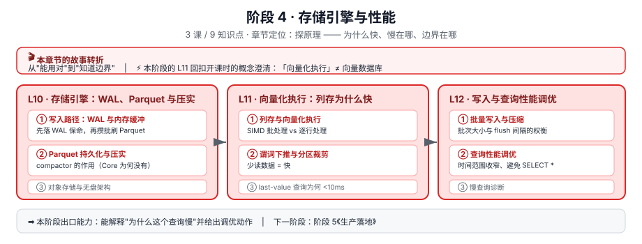

# 阶段 4 · 存储引擎与性能

> 所属课程：[InfluxDB 3 系统学习](../../02-课程目录.md) ｜ 水平：入门 → 进阶
> 本阶段：**3 课 / 9 知识点** ｜ 状态：✅ **已完成（9 / 9 知识点，L10、L11、L12 均已交付）**

## 🎬 本阶段在故事主线中的章节定位

| 章节 | 本阶段任务 | 主角的状态变化 |
|------|-----------|---------------|
| **第四章 · 探原理** | 搞懂为什么快、慢在哪、边界在哪 | 能用对它 → **知道它的边界** |

**⚡ 本阶段有一个特殊使命**：L11《向量化执行》回扣**开课时的概念澄清**——用户最初以为 InfluxDB 是"向量数据库"，真相是 InfluxDB 3 的 *vectorized execution*（向量化执行，列存 + SIMD 查询加速）与存 embedding 做 ANN 检索的向量数据库是完全不同的东西。这个伏笔在本阶段彻底闭环。

## 🎯 阶段目标

学完本阶段，你应该能够：

1. 描述一条数据从写入到落盘的完整路径（WAL → 内存缓冲 → Parquet）
2. 解释列存 + 向量化执行为什么快，以及"向量化"到底指什么
3. 说清 last-value 查询为什么能 <10ms，历史查询为什么慢
4. 面对一个慢查询，能给出具体的调优动作

## 📚 必须掌握的知识点

### L10 · 存储引擎：WAL、Parquet 与压实 ✅

| 知识点 | 关键点 |
|--------|--------|
| ① 写入路径：WAL 与内存缓冲 | 先落 WAL 保持久，再攒批刷 Parquet |
| ② Parquet 持久化与压实 | compactor 的作用；**Core 为什么没有 compactor**（回扣 L2 SKU 选型） |
| ③ 对象存储与无盘架构 | 存储与计算分离；本地盘模式 |

> 🔴 **本课最重要的一条**：**Core 确实没有 compactor**，三处官方证据——①Core storage engine 页直接否定句 *"InfluxDB 3 Core **does not include it**"*；②Core 的 durability / storage-engine / data-retention **三页搜不到 compact 一词**；③配置页 `gen1-duration` 原文把 compactor 明确归属 Enterprise（*"generation 1 files that the **compactor in InfluxDB 3 Enterprise** can merge into larger generations"*）。
>
> 📊 **量化后果**：每 10 分钟持久化一次 → 每天 144 个 Parquet 文件 → **90 天约 12,960 个，永不合并**。→ **长周期查询慢的根因是「要打开的文件多」，不是「数据量大」**；官方 `query-file-limit` 的存在正是这个约束的体现，**且这是架构天花板，调参解决不了**（`gen1-duration` 仅 1m/5m/10m 三档，10m 已是文件最少档）。
>
> 🛤️ **写入五站与默认参数**：写校验+内存缓冲 → **WAL 每 1 秒** → 可查缓冲（**最多 900 个 WAL 文件 = 15 分钟**）→ **Parquet 每 10 分钟**（持久化**最老**的，**保留最近 5 分钟在内存**）→ Parquet 内存缓存。→ **「刚写就能查」的上界是 15 分钟**。
>
> ⚠️ **`no_sync=false` 是默认值**（表示"WAL 落盘才 ACK"）；改成 `true` 是**用持久性换延迟**，官方措辞为 *"acknowledge the write without waiting for persistence"*。
>
> 💡 **两条易混**：**WAL tail "is durable"**（WAL 每秒刷对象存储，所以在 WAL 里影响的是**查询路径**而非**持久性**）；**持久化的是最老的数据，最新 5 分钟留在内存**（新数据被查概率最高）。
>
> 🗄️ **对象存储**：`--object-store` 共 **6 种取值**——`memory` / `memory-throttled`（二者**重启即丢**）/ `file`（**本课程环境**，须配 `--data-dir`）/ `s3` / `google` / `azure`。**`memory-throttled` 是被低估的本地开发选项**（注入接近真实对象存储的延迟，避免对性能产生错误预期）。
>
> 🔧 **运维三条硬规则**：①`--node-id` 在共享同一 object store 时**必须唯一**（相同会静默互相覆盖）；②停机用 **SIGTERM**（`docker stop`）而非 SIGKILL，否则**绕过刷 WAL**；③Core 节点状态**只有 running / stopped 两种**（`stopping`/`removing` 属 Enterprise 集群）。
>
> 🧪 **本课的实操补充**：含一个**本机实跑验证的写入路径与持久性模拟器**（6 场景真实输出），见[课件实验 A](lessons/lesson-10-存储引擎-WAL-Parquet与压实.md)。

### L11 · 向量化执行：列存为什么快 ✅

| 知识点 | 关键点 |
|--------|--------|
| ① 列存与向量化执行 | SIMD 批处理 vs 逐行处理；**"向量"在这里指 CPU 一次处理一批值** |
| ② 谓词下推与分区裁剪 | 少读数据才是真的快 |
| ③ last-value 查询为何 <10ms | LVC / DVC 两个**需主动配置**的内存缓存 |

> ⚡ **本课是开课误解的最终闭环**：此"向量"（CPU 寄存器里的一批值，8192 行/批）≠ 彼"向量"（embedding 语义向量）。**InfluxDB 无原生向量索引，做不了 ANN 检索。**
>
> 🔴 **本课最重要的一条：所谓「72 小时限制」，其实是 432 个 Parquet 文件的限制**。代码里**没有任何时间判断**——官方 config-options 原文 *"With the default 432 setting and the default gen1-duration setting of 10 minutes, queries can access up to a 72 hours of data"*，72 小时是 **432 × 10min 算出来的派生值**。这解释了一个社区高频疑问：为什么有人查 13 天不报错？**因为他数据稀疏，没凑够 432 个文件。**
>
> 📊 **量化边界**：每天 144 个文件 → **7 天 = 1,008 个 > 432 → 直接报错**（不是变慢）。且**把 `gen1-duration` 调小只会让范围更短**（1m → 432 个文件只覆盖 7.2 小时），10m 已是文件最少档。超限时官方列四条副作用（变慢 / 内存飙升 / 可能 OOM / 对象存储每文件最多 2 次 GET），**建议保持默认、收窄时间范围**。
>
> 💡 **两条易混**：①**列存省 I/O、SIMD 省 CPU**——是两个独立加速，**列存是 SIMD 的前提**（SIMD 要求数据连续同类型，行存喂不进寄存器），**SIMD 是列存的兑现**，别当成一回事；②**分区裁剪是 Core 唯一能对抗「文件永不合并」的武器**，而它的唯一输入就是**你 WHERE 里的时间范围**——不给条件 = 全表扫描。90 天数据里查最近 1 小时，只读 **0.05%** 的文件。
>
> ⚠️ **<10ms 不是免费的**：它来自 **LVC**，而 LVC **需主动创建**。四个必须知道的坑：`count` 上限 10；**InfluxQL 不支持 `last_cache()`**（只能走 SQL）；**服务器停止即清空且不自动回填**（只有新写入才填，重启后一段时间是空的）；**引擎不怕基数但 LVC 怕**（官方：*"it does affect the LVC"*，内存 ≈ 基数字 × count）。另有 `file-cache-recency` 默认 **5h**——查最近几小时第二次明显变快，查昨天每次都要重新读盘。
>
> 🧪 **本课的实操补充**：含**本机实跑的列存/向量化模拟器**（4 对照，端到端 8.62 倍，⏳ 该倍数为 Python 层循环开销差异，非 SIMD 真实加速比）与**分区裁剪 / 432 文件限制模拟器**（4 对照），见[课件实验 A/B](lessons/lesson-11-向量化执行-列存为什么快.md)。

### L12 · 写入与查询性能调优 ✅

| 知识点 | 关键点 |
|--------|--------|
| ① 批量写入与压缩 | 批次大小 / flush 间隔的权衡 |
| ② 查询性能调优 | 收窄时间范围、避免 `SELECT *`、善用 tag 过滤 |
| ③ 慢查询诊断 | 定位瓶颈的系统方法 |

> 🔴 **本课最重要的一条：流传最广的调优建议「改掉 `SELECT *`」，在 Core 上基本不成立**。官方 optimize-queries 原文：*"If the table contains **10 columns**, the difference in performance between the two queries is **minimal**. In a table with over **1000 columns**, the `SELECT *` query is slower and less efficient."* 而 **Core 每表最多 500 列**（L6 硬限制）→ **在 Core 上你建不出能达到官方这条「明显变慢」门槛的表**。⚠️ 精确口径：500 列时可能已有可感知差距，但**远未达官方描述的量级**；改它的价值在明确意图与防后续加列撑大查询，**不在性能**。
>
> 🔴 **第二重要的一条：10 MB 批量阈值与 10 MB HTTP 请求上限恰好撞车**。`--max-http-request-size` 默认 **10mb**（Core config-options），而官方推荐的批量上限也恰是 **10 MB**。**官方未说明批量阈值指压缩前还是压缩后体积** → 本课取保守策略：**始终启用 gzip，且永远不发未压缩的 10MB 批次**。
>
> 📊 **批量写入的双阈值与边际递减**：官方推荐 **10,000 行或 10 MB，先到为准**。10 MB ÷ 10,000 行 = **1048 字节/行** → 四档典型行长（60/120/300/1000 字节）**全部是行数先到**；只有超宽表/超长 string field（每行 > 1048 字节）才轮到体积阈值，判据是**算平均行长**。而**边际收益递减极快**：1→1000 涨 **500 倍**、1000→10000 仅 **1.82 倍**、10000→100000 仅 **1.09 倍**，但**单批延迟与内存仍在涨**（10,000 行 22ms/1.14MB → 100,000 行 202ms/11.44MB）。**客户端默认 `batch_size=1000`，比官方推荐保守一个数量级**（属取舍非矛盾）。
>
> 💡 **两条易混**：①**`flush_interval` 与 `batch_size` 是「或」关系，谁先满足谁触发**——低速场景（10 点/秒）攒够 5000 行要 **500 秒**，而"刚写就能查"的上界只有 **15 分钟**，**必须靠 `flush_interval` 兜底**；②**gzip 官方口径是 "up to a 5x speed improvement"（速度提升）而非「压缩到 1/5」**，本机回环下可能看不出收益甚至变慢。
>
> ⚠️ **慢查询诊断的七步倒查法**：①有没有报错（含 `exceeding the file limit` = 文件数超限，**不是慢是拒绝执行**）②`WHERE` 有没有 `time`（没有 → 分区裁剪全失效，**最高频原因**）③扫了多少文件（接近 **432** = 悬崖边）④读了几列（1000+ 列才值得改）⑤是不是 last-value 查询（是且没配 LVC → 建 `last_cache`，**只能 SQL 查**）⑥**plan vs exec**（**plan 更大 = 文件数太多，改 SQL 无效**）⑦`system.queries` 找历史（按 `end2end_duration` 倒序）。
>
> ⚠️ **官方列的四类「不受您控制的瓶颈」，三条根因都是文件数**：对已排序数据再 `ORDER BY` / 检索大量小 Parquet 文件 / 查询大量重叠文件 / 大量表扫描。而文件数在 Core 上是**架构天花板**（无 compactor）→ **认出它们比优化它们更重要**。
>
> 🗄️ **`system.queries` 是易失的**：官方原文 *"Records are lost on pod restarts"*，且只保留 **1000 条**（`--query-log-size`），**一个库的查询会驱逐另一个库的记录** → **要留存慢查询证据必须定期外部化**。另：**`--max-concurrent-queries` 可运行时调整**（`POST /api/v3/configure/query_concurrency_limit`），并发打满时无需重启。
>
> ⚡ **SKU 差异提醒**：tag 排序建议 **Core 页是「按查询优先级」**，**Clustered 页是「按 key 字典序」**，两者不一致。Core 用户按前者（首次写入决定物理列顺序，靠前的列过滤更快）。
>
> 🧪 **本课的实操补充**：含**本机实跑的批量写入权衡模拟器**（5 组对照：批量 vs 吞吐 / 边际收益 / 代价侧 / 双阈值谁先到 / flush_interval 两难）与**慢查询诊断决策树模拟器**（5 场景 + 七步倒查总结），见[课件实验 A/B](lessons/lesson-12-写入与查询性能调优.md)。⚠️ 实验 A 的固定开销 2.0ms、每行 0.002ms、gzip 压缩比 0.2 均为**拍脑袋假设值**，抓趋势不抓绝对值；但对照 4 的结论只依赖硬算术，不依赖假设。

## ✅ 阶段出口检查清单（10 项）

> 阶段 4 全部完成后自查，全勾再进阶段 5。完整版见 [L12 讲义第五幕](lessons/lesson-12-写入与查询性能调优.md)。

- [ ] 能画出写入完整路径并说出每一站的默认参数（WAL 每 1 秒 / 可查缓冲最多 900 文件 = 15 分钟 / Parquet 每 10 分钟且留最近 5 分钟在内存）
- [ ] 能解释 Core **为什么没有 compactor**，并算出 90 天约 **12,960 个文件**
- [ ] 能说清 **`no_sync=false` 是默认值**（WAL 落盘才 ACK），改 true 是拿持久性换延迟
- [ ] 能解释**列存省 I/O、向量化省 CPU** 是两个独立加速，且**列存是 SIMD 的前提**
- [ ] 能解释「72 小时限制」的真相是 **432 个文件限制**，并算出 7 天 = 1,008 个会**直接报错**
- [ ] 能说出**超 432 的四条副作用**，以及为什么**调小 `gen1-duration` 只会更糟**
- [ ] 能解释 <10ms 来自 **LVC**，并说出四个坑（count 上限 10 / InfluxQL 不支持 / 重启即清空不回填 / 引擎不怕基数但 LVC 怕）
- [ ] 能说出官方推荐的批量写入双阈值（**10,000 行或 10 MB**）与**为什么四档行长都是行数先到**
- [ ] 能说出**`SELECT *` 的官方门槛是 1000+ 列**，以及**为什么在 Core（上限 500 列）上改它基本没用**
- [ ] 拿到一条慢查询，能按**七步倒查法**定位到瓶颈类别，并能用 `EXPLAIN` / `system.queries` 取证

## 🧭 导航

⬅️ **上一阶段**：[阶段 3《数据模型与查询》](../3-数据模型与查询/overview.md)
➡️ **下一阶段**：[阶段 5《生产落地》](../5-生产落地/overview.md)
📚 **返回**：[课程目录](../../02-课程目录.md) ｜ [学习路径总览](../../01-学习路径总览.md)
