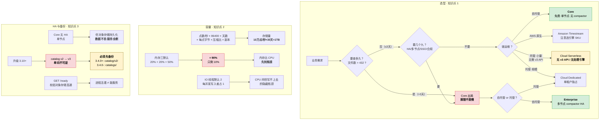

# 第 13 课：部署形态与容量规划

> 阶段 5《生产落地》第 1 课（**阶段开篇**）｜ 上一课：[第 12 课《写入与查询性能调优》](../../4-存储引擎与性能/lessons/lesson-12-写入与查询性能调优.md)
>
> ⚡ **本课是整个课程的转折点**：前四章让你理解 InfluxDB，从这一章起要**把它跑在生产上**。而跑生产的第一件事不是写 SQL，是**回答三个问题**：**用哪个形态**、**要多少资源**、**坏了怎么恢复**。

## 🎯 本课目标

| 知识点 | 关键点 | 学完你应该能 |
|--------|--------|-------------|
| ① Core / Enterprise / Cloud 选型 | **判据：是否要查历史数据**（Core 无 compactor、单机） | 面对一个业务需求，给出形态选择并说明判据 |
| ② 容量规划与硬件 | 点数 × 每点字节数 × 保留期 × 副本数 | 用公式算出存储量，并知道内存为什么比 CPU 先到瓶颈 |
| ③ 高可用与备份 | ⚠️ 升级前必须备份 catalog（3.10+ 格式迁移单向） | 说出 Core 的 HA 边界，以及升级前必须做的动作 |

---

## 第一幕：起源与场景引入

前四章学完，你已经能把 InfluxDB 3 用起来了：会写 line protocol、会写 SQL、知道为什么快、也知道慢了怎么查。

现在，领导把你叫进会议室。

> "我们准备把生产环境的时序数据平台迁移到 InfluxDB 3。你评估一下：**用哪个版本？要买几台机器？多大的盘？坏了怎么办？** 下周给我方案。"

你回到工位，打开官网，发现事情没那么简单：

**第一，形态不止一个。** 官方有 **InfluxDB 3 Core**（开源免费、单节点）、**Enterprise**（商业、多节点 HA）、**Cloud Serverless**（按用量付费的多租户云）、**Cloud Dedicated**（单租户托管），还有 **Amazon Timestream for InfluxDB**（AWS 原生托管）。

**第二，容量不是拍脑袋。** 你隐约记得公式是"点数 × 字节数 × 天数"，但压缩比是多少？内存和 CPU 哪个先到瓶颈？Core 上那句"适合最近 3-5 天数据"到底意味着多大的盘？

**第三，升级有个陷阱。** 你在 release notes 里看到一句让人后背发凉的话：

> *"Upgrading to InfluxDB 3.10 is a **one-way migration**... **3.9.x and older binaries are unable to read the new catalog**, and fail to start on the same cluster data. **Before upgrading, back up your current catalog.**"*

**单向不可逆。** 也就是说，如果你没备份 catalog 就升级，一旦出问题，**连回退的门都没有**。

这三件事，就是本课要解决的。它们有一个共同点：**都是"选型与规划"层面的决策，错了代价极高，但都可以在动手前想清楚。**

---

## 第二幕：认知冲突

在给答案之前，先看三个反直觉的事实——它们会打掉你从 MySQL / Prometheus 带过来的直觉。

**事实一：Core 的查询上限不是"慢"，是"报错"——而且只有 3 天。**

很多人以为"Core 只适合近期数据"是性能建议。不是。它是**硬限制**：`query-file-limit` 默认 **432 个文件**，`gen1-duration` 默认 10 分钟 → **432 × 10min = 72 小时 = 3 天**。

**7 天 = 1,008 个文件，直接报错。** 官方列了四条副作用并建议保持默认（L11 已核实）。

⚠️ 这意味着：**如果你的业务要查一周以上的数据，Core 不是"慢一点"，是"用不了"。** 这是选型的**第一道分水岭**。

**事实二：官方给新生产负载的默认答案是 Enterprise，不是 Core。**

官方 which-influxdb-3 页开篇第一句：

> *"For **new production workloads**, use **InfluxDB 3 Enterprise**."*

而 Core 的定位被明确写为：

> *"Use Core for **edge or non-critical workloads**, or to develop against the v3 APIs."*

💡 **注意这个措辞**：Core 不是"生产版的免费平替"，它的官方定位是**边缘 / 非关键 / 开发测试**。这与很多人"先用 Core 上生产，不行再买"的规划直接冲突——**按照官方口径，Core 从一开始就不该出现在生产规划里**。

**事实三：内存三个默认值加起来已经是 90%，内存比 CPU 先到瓶颈。**

官方 config-options 的三个默认值：

| 参数 | 默认值 | 用途 |
|------|--------|------|
| `--exec-mem-pool-size` | **20%** | 查询执行内存池 |
| `--parquet-mem-cache-size` | **20%** | Parquet 文件内存缓存 |
| `--force-snapshot-mem-size` | **50%** | 内部内存缓冲阈值 |
| **合计** | **90%** | 只剩 10% 给进程与 OS |

**默认配置已经把几乎全部内存分片完毕。** 这就是"为什么 Core 上加内存比加 CPU 更有效"的答案，也是官方调优页把这几项列为首选的原因。

---

## 第三幕：层层揭示

### 知识点 1：Core / Enterprise / Cloud 选型 —— 一句话判据

#### 一句话定义

**部署形态（deployment form）**：指 InfluxDB 3 的交付与运行方式——**自托管**（Core / Enterprise）还是**托管云**（Cloud Serverless / Cloud Dedicated / Amazon Timestream），以及是否**多节点**（Enterprise 专属）。

#### 直觉建立：三种出行方式

你要从城里去另一个城市，有三种方式：

**自己开车**（自托管 - Core）：车是你自己的，免费（购车成本已付），路线你定。但**只有一辆车，坏了就走不了**，而且**后备箱有限**。
**租车队**（自托管 - Enterprise）：花钱，但可以多辆车、有备用司机、能装更多东西、**有保险和道路救援**（商业支持 + SLA）。
**坐火车**（托管云）：不用自己开车，按里程付费。但**班次和路线由铁路公司定**，且**不同档位的车厢设施不同**（Serverless 没有原生 v3 API）。

**这个类比的失效边界**：真实世界"自己开车"和"租车队"的车型通常一样，但 **Core 与 Enterprise 的引擎功能是有差异的**——Core **不含 compactor**（L10 三处官方证据），这是功能缺失不是配置差异。

#### 核心原理：三个判据，按顺序问

官方 which-influxdb-3 页、Enterprise 架构页与官方定价页，把形态差异拆得很清楚。**把它们整理成三个问题，按顺序问**：

| 顺序 | 问什么 | 判据 | 结论 |
|------|--------|------|------|
| **1** | **要查多久？** | 查询范围对应的文件数是否 > **432** | **超过 3 天 → Core 出局**（报错，不是慢） |
| **2** | **要几个九？** | 是否需要 HA / 多节点 / SSO / 合规认证 | **需要 → Core 出局**（Core 官方定位 single-node） |
| **3** | **谁运维？** | 自托管 vs 托管；是否 AWS 原生 | 决定 Enterprise / Cloud / Timestream |

**为什么"查多久"排第一？** 因为它是**唯一一个与钱无关、无法通过加资源解决的硬约束**。高可用可以靠运维补、合规可以后续谈，但 **Core 没有 compactor 是架构事实**，加 CPU、加内存、加磁盘都改变不了。

#### 五个形态的完整对照

| 形态 | 托管方 | 节点 | compactor | 原生 v3 API | 处理引擎 | 费用 |
|------|--------|------|-----------|------------|---------|------|
| **Core** | 自托管 | **单节点** | ❌ **无** | ✅ 有 | ✅ 有 | **免费**（MIT / Apache 2.0） |
| **Enterprise** | 自托管 | **多节点 HA** | ✅ **有** | ✅ 有 | ✅ 有 | 商业许可（Trial / Home / Commercial） |
| **Cloud Serverless** | InfluxData | 多租户 | 服务端 | ❌ **无**（仅 v1/v2 兼容端点） | ❌ **无** | 按用量，四维度计费 |
| **Cloud Dedicated** | InfluxData | 单租户独占 | 服务端 | ✅ 有 | ✅ 有 | 按配置 CPU/RAM/存储，需询价 |
| **Amazon Timestream for InfluxDB** | AWS | 托管，支持多 AZ | 取决于引擎 SKU | 取决于引擎 SKU | 取决于引擎 SKU | 走 AWS 账单 |

⚠️ **Cloud Serverless 是这里最容易踩的坑**：它跑的是 v3 存储引擎，但**暴露的 API 与 Core/Enterprise 不同**——官方原文明确：

> *"**No native v3 write API**—use v1 and v2 compatibility endpoints"*
> *"**No Processing Engine**"*

也就是说：**你在本课程学的 `/api/v3/write_lp` 端点（L4）和处理引擎插件（L15），在 Cloud Serverless 上用不了。** 如果你的代码是按 v3 原生 API 写的，迁移到 Serverless 要改代码。

💡 **Timestream for InfluxDB 的另一个坑**：它有 **InfluxDB 2.x / 3 Core / 3 Enterprise 多种引擎 SKU 可选**。**选错引擎等于选错代际**——一个"托管 InfluxDB"的服务，底下跑的可能是 2.x 老引擎。签约前必须确认引擎版本。

#### Enterprise 的架构：五个模式与四个组件

Enterprise 与 Core 的核心架构差异，在于**组件可以拆到不同节点**。

**四个核心组件**（官方存储引擎架构页原文）：

| 组件 | 职责 | 扩展策略（官方原文） |
|------|------|-------------------|
| **Router**（Ingest Router） | 解析 line protocol 并路由到 Ingester；**复制到 2 个以上 Ingester 保证写入持久性** | **水平扩展最有效**（提升写入吞吐）；垂直扩展（加 CPU）降低解析延迟 |
| **Ingester** | 校验 schema、持久化 Parquet 到对象存储、维护 WAL、让未持久化数据可被查询 | **水平扩展最有效** |
| **Querier** | 处理 SQL 与 InfluxQL 查询 | **水平扩展**提升并发查询数；**垂直扩展**提升计算密集查询能力 |
| **Catalog** | PostgreSQL 兼容的关系库，存 schema 与 Parquet 文件位置 | 取决于底层 PG；**都支持垂直扩展**，多数支持水平扩展做冗余与故障转移 |
| **Compactor** | 持续优化对象存储中的分区，**压实** | **垂直扩展（加 CPU）最有效**——压实是计算密集任务；水平扩展也有用但效率低 |
| **Garbage collector** | 驱逐过期/删除数据、清理失效压实文件、回收空间 | ⚠️ **不应水平扩展**（官方原文 "not designed for distributed load"） |

⚠️ **注意 Catalog 的实现差异**：**Enterprise 是 PostgreSQL 兼容库，而 Core 是内嵌的**（Core 单机形态不需要独立 PG）。这也是为什么 Enterprise 能支持多节点共享元数据。

**五个节点模式**（`--mode`，可逗号组合）：

| 模式 | 含义 |
|------|------|
| `all` | 跑所有子进程（**Core 的默认形态**，也用于小规模测试） |
| `ingest` | 只处理写入，不受查询与压实干扰 |
| `query` | 只处理查询 |
| `compact` | 只跑压实。⚠️ **每个集群只能有一个节点跑 compact 模式** |
| `process` | 跑处理引擎插件与定时任务 |

**三种官方推荐拓扑**（官方博客原文）：

```bash
# ① 基础 HA（2 节点）：两节点都能写能查，Node 1 兼做压实
influxdb3 serve --cluster-id cluster01 --node-id node01 --mode all \
  --object-store s3 --bucket influxdb-storage ...
influxdb3 serve --cluster-id cluster01 --node-id node02 --mode ingest,query,process \
  --object-store s3 --bucket influxdb-storage ...

# ② 专职压实（3 节点）：把压实从读写节点剥离，避免资源争用
#    Nodes 1&2 用 --mode ingest,query,process；Node 3 单独：
influxdb3 serve --cluster-id cluster01 --node-id compactor01 --mode compact \
  --object-store s3 --bucket influxdb-storage ...

# ③ 完全隔离（按负载独立扩展）：ingest / query / compact+process 各一组
```

💡 **这套 `--mode` 机制是 Enterprise 相对 Core 最实用的能力之一**——L12 讲过 Core 上"摄入/查询/压实/处理四功能竞争同一实例资源"，而 Enterprise 可以把它们**物理分开**。

#### Cloud Serverless 的四维度计费（官方定价页原文）

如果走 Serverless，账单由四部分组成：

| 维度 | 单价 | 说明 |
|------|------|------|
| **数据入（Data in）** | **$0.0025 / MB** | 写入量 |
| **查询（Query count）** | **$0.012 / 100 次执行** | ⚠️ **按次计费**，与查询复杂度无关 |
| **存储（Storage）** | **$0.002 / GB-hour** | 按 GB × 小时累计 |
| **数据出（Data out）** | **$0.09 / GB** | 出流量 |

⚠️ **"查询按次计费"这条最容易被忽略**：一个每 10 秒刷新的 Grafana 面板，一个月跑 **259,200 次查询**（官方博客给的算例），费用约 **$31**；20 个面板就是 **$620/月**。→ **Serverless 上，面板刷新间隔是真实的钱。**

📚 官方文档：[Which InfluxDB 3 should I use?](https://docs.influxdata.com/influxdb3/which-influxdb-3) ｜ [InfluxDB 3 定价](https://www.influxdata.com/pricing/) ｜ [Enterprise 多节点部署](https://docs.influxdata.com/influxdb3/enterprise/get-started/multi-server/)

---

### 知识点 2：容量规划与硬件 —— 一条公式与三个内存数字

#### 一句话定义

**容量规划（capacity planning）**：根据**写入速率、每点大小、保留期、副本数**估算所需的**存储容量**，并根据**内存分配模型**估算所需的 **RAM**，从而确定硬件规格。

#### 直觉建立：搬家要用多大的车

你要搬家，得算清楚要租多大的车。

公式很简单：**物品总体积 = 单件体积 × 件数**。

但有两件事会让估算失准：
1. **衣服可以抽真空**（压缩）——压缩比取决于你的东西是什么
2. **易碎品要占更多空间且不能压**（内存中的活动数据）

**这个类比的失效边界**：真实搬家"车小了大不了跑两趟"，但数据库**磁盘满了会拒绝写入**，而且**内存不足会 OOM 被杀进程**（L11 学过：超 432 文件的副作用之一就是"进程可能被 OOM kill"）。

#### 核心原理一：存储量公式

```
存储量 = 点数/秒 × 86400 × 保留天数 × 每点字节数 × 压缩后比例 × 副本数
```

**四个变量怎么取值**：

| 变量 | 怎么定 | 典型值 |
|------|--------|--------|
| 点数/秒 | 设备数 × 每台每秒上报点数 | 监控场景常见 1k ~ 100k |
| 每点字节数 | 一个 measurement + 若干 tag + 一个 field 的 line protocol 行长 | **60 ~ 150 字节**（L12 已核实） |
| 压缩后比例 | 官方博客口径：*"the size of the file is often **10-100x smaller** than its raw form"* | 保守 10x / 典型 25x / 乐观 50x |
| 副本数 | Core 单机 = 1；Enterprise 的 read replica 与对象存储冗余另算 | 1（默认） |

⚠️ **压缩比的 10-100x 是官方博客口径，且是"often"不是"always"**。影响压缩比的最大因素是**数据的重复性**——line protocol 里重复的 measurement 名、tag key、field key 很多，压缩效果好；**tag 值高度随机（UUID、trace_id）会显著拉低压缩比**（回扣 L7：这类 ID 一律进 field）。

**用本课实验 A 算出来的量级**（保留 30 天，单副本，每点 120 字节）：

| 点数/秒 | 保守 10x | 典型 25x | 乐观 50x |
|---------|---------|---------|---------|
| 1,000 | 29.0 GB | 11.6 GB | 5.8 GB |
| 10,000 | 289.7 GB | 115.9 GB | 57.9 GB |
| 100,000 | 2.8 TB | 1.1 TB | 579.4 GB |
| 500,000 | 14.1 TB | 5.7 TB | 2.8 TB |
| 1,000,000 | 28.3 TB | 11.3 TB | 5.7 TB |

📌 **记住这个量级关系**：**10 万点/秒 × 30 天 ≈ 1 TB（典型压缩比）**。这是做容量估算时最好用的一个锚点。**写入速率涨 10 倍，存储量涨 10 倍；保留期涨 3 倍，存储量涨 3 倍**——线性关系，非常好算。

⚠️ **但要注意 Core 上的"存储能存 ≠ 能查"**：保留 90 天在 Core 上是 **3.4 TB（典型）**，**数据确实在盘上，但你查不了**（12,960 个文件 > 432）。这就是 L12 落地视角第 6 条说的"认出那些改 SQL 无效的慢查询"——在 Core 上，**保留期超过 3 天的部分本质上只是冷备份**。

#### 核心原理二：内存——为什么它比 CPU 先到瓶颈

回到第二幕的事实三。三个默认百分比：

```bash
--exec-mem-pool-size        默认 20%   # 查询执行内存池
--parquet-mem-cache-size    默认 20%   # Parquet 文件内存缓存
--force-snapshot-mem-size   默认 50%   # 内部内存缓冲阈值
#                          合计 90%   → 只剩 10% 给进程本身与 OS
```

**换算成绝对值**（实验 A 对照 4）：

| 物理内存 | exec 20% | cache 20% | snapshot 50% | 剩余 |
|---------|---------|----------|-------------|------|
| 4 GB | 0.8 GB | 0.8 GB | 2.0 GB | 0.4 GB |
| 8 GB | 1.6 GB | 1.6 GB | 4.0 GB | 0.8 GB |
| 16 GB | 3.2 GB | 3.2 GB | 8.0 GB | 1.6 GB |
| 32 GB | 6.4 GB | 6.4 GB | 16.0 GB | 3.2 GB |
| 64 GB | 12.8 GB | 12.8 GB | 32.0 GB | 6.4 GB |

⚠️ **看 4 GB 那一行**：只剩 **0.4 GB** 给进程本身、操作系统页缓存和其他开销。这就是为什么**小内存机器上 Core 特别容易 OOM**——不是 InfluxDB 吃内存，是**默认配置已经预定了 90%**。

→ 落地推论：**在内存小的机器上，应该主动调低这三个值**。官方调优页对 `--exec-mem-pool-size` 给了按负载的区间：**写密集 60-70%（给 OS 缓存留空间）、查询密集 80-90%、混合 70%**；另外两个参数官方没给同款区间表。特别是 `--force-snapshot-mem-size` 的默认 50%，在**纯查询型节点**上明显偏高——那里几乎没有写入缓冲需求。

#### 核心原理三：CPU 与线程分配

官方调优页给的线程模型：

| 线程类型 | 作用 | 默认值 | 扩展规律 |
|---------|------|--------|---------|
| **IO 线程**（`--num-io-threads`） | 处理 HTTP 请求与 line protocol 解析 | **2**（官方说"often insufficient"） | **每个并发写入者约占用 1 个 IO 线程** |
| **DataFusion 线程**（`--datafusion-num-threads`） | 处理查询与快照 | 自动分配剩余核 | 查询密集时多给 |

官方给的估算公式：

```
总核数 = N ｜ 并发写入者 = W
IO 线程      = min(W + 2, N × 0.4)
DataFusion   = N - IO 线程
```

⚠️ **"IO 线程默认 2，且每个并发写入者约占用 1 个"** 这条非常实用：如果你有 10 个 Telegraf agent 并发写入，**默认 2 个 IO 线程就是瓶颈**。这是"CPU 很闲但写入上不去"的常见原因。

#### 核心原理四：Core 的"官方硬件基线"为什么没有

⚠️ **一个必须诚实说明的点**：**InfluxDB 3 Core 的官方文档没有给出明确的硬件配置表**。你能搜到的硬件建议主要来自三类：

1. **官方 v1 时代的硬件指南**（明确标注 *"This page documents an earlier version of InfluxDB OSS"*）——**不适用于 3.x**
2. **云市场镜像商的建议**（如 Azure 镜像推荐 `Standard_D2s_v3`：2 vCPU / 8 GB，理由正是"Parquet 列式引擎在真实写入开始后需要内存做查询缓存"）
3. **第三方对比评测**（如"最低 512MB RAM / 1 CPU，推荐 4GB RAM / 2 CPU"）

→ 本课的处理：**不把这三类当成官方基线**，而是给你**从默认值倒推的方法**——因为内存需求由你自己的配置参数决定（20% + 20% + 50%），比任何"推荐配置"都准。

📚 官方文档：[InfluxDB 3 Core configuration options](https://docs.influxdata.com/influxdb3/core/reference/config-options/) ｜ [Performance tuning](https://docs.influxdata.com/influxdb3/core/admin/performance-tuning/)

---

### 知识点 3：高可用与备份 —— Core 的边界与那条单向路

#### 一句话定义

**高可用（HA）**：通过多节点冗余消除单点故障的能力；**备份**：为应对数据损坏或升级失败而保存的可恢复副本。在 InfluxDB 3 中，二者**必须分开讨论**——**Enterprise 才有 HA，而 catalog 备份是所有形态的共同义务**。

#### 直觉建立：备份钥匙 vs 备用钥匙

**高可用**是"家里装了两把锁，坏一把还有一把"——**实时生效，无需操作**。
**备份**是"把钥匙配了一把放在邻居家"——**出事时要专门去取，且只能回到配钥匙那一刻的状态**。

**这个类比的失效边界**：真实世界配钥匙很便宜且随时能配；但 InfluxDB 3 的 catalog 格式迁移是**单向的**——**一旦升级到 v3 格式，旧版本二进制读不了，除非你有备份，否则连"回到配钥匙那一刻"都做不到**。

#### 核心原理一：Core 的 HA 边界（诚实清单）

⚠️ **Core 在官方口径里没有 HA**。这是需要直面的事实：

| 能力 | Core | Enterprise |
|------|------|-----------|
| 多节点 | ❌ **单节点**（官方原文 single-node） | ✅ `--cluster-id` 多节点 |
| 读副本（read replica） | ❌ | ✅ 完整支持 |
| compactor | ❌ **无** | ✅ 专职压实节点 |
| 节点故障自动接管 | ❌ | ✅ |
| Catalog | 基础 TableIndexCache | 进阶版（支持快照与恢复） |

💡 **但 Core 有一个被低估的特性**：**数据全在对象存储里，计算节点近乎无状态**（L10 学过：catalog 持久化在对象存储中，独立于进程/容器/主机）。这意味着：

- **主机坏了** → 换一台机器，指向同一个对象存储，**数据还在**
- **容器坏了** → 重新起一个容器即可
- **但这不是 HA** —— 因为**恢复需要时间**（要重放 WAL、重建缓存），期间服务不可用

→ 落地推论：**Core 能做到"数据不丢"，但做不到"服务不断"**。如果你的业务能容忍分钟级的恢复时间（RTO），Core + 对象存储 + 自动化重建脚本是可行方案；如果要求秒级切换，必须上 Enterprise。

#### 核心原理二：catalog —— 那个必须备份的东西

**catalog 是什么？** 官方定义：存储**元数据**的关系库——**库、表、schema、分区（Parquet 文件）在对象存储中的位置**。它**不存时序数据本身**。

**为什么它这么关键？** 因为它是**索引与数据的唯一映射**。catalog 坏了，即使 Parquet 文件都还在，你也**找不到它们**。

**3.10 的单向迁移**（官方 release notes 原文，Core 与 Enterprise 相同）：

> *"Upgrading to InfluxDB 3.10 is a **one-way migration**. The first time you start InfluxDB 3.10, it automatically upgrades the on-disk catalog format from **v2 to v3**. After migration, **3.9.x and older binaries are unable to read the new catalog**, and fail to start on the same cluster data. **Before upgrading, back up your current catalog.**"*

**备份路径取决于你从哪个版本升**：

| 升级前版本 | 要备份的路径 |
|-----------|------------|
| **3.4.0 或更高** | `{prefix}/catalog/v2/logs/` 和 `{prefix}/catalog/v2/snapshot` |
| **3.4.0 之前** | `{prefix}/catalogs/` 和 `{prefix}/_catalog_checkpoint` |

⚠️ **两个官方提醒**：
1. **恢复这些对象是回退到 3.9.x 的唯一途径**
2. 3.4.0+ 的集群上，`{prefix}/catalogs/` 和 `{prefix}/_catalog_checkpoint` **可能仍作为早期格式的残留存在**——**它们不是当前的，也不是有效的回滚源**（别备份错路径）

**v3 catalog 的好处**（官方原文）：*compact binary record format ( ~5–6x smaller than v2)*，且*迁移是自动的、幂等的、崩溃安全的*。

#### 核心原理三：Core 上怎么备份

⚠️ **必须说清楚**：**Core 没有内建的备份命令**。官方 3.10 新增的 `influxdb3 create backup` / `restore` 系列命令**是 Enterprise 专属**（且需要 `--use-pacha-tree` 与带 admin token 的压实节点）。

**Core 上的两条路**：

```bash
# 路线 1（推荐）：停服务后打包整个 data-dir
#   适用于 --object-store=file（本地文件系统）的部署
systemctl stop influxdb3-core
tar czf influxdb3_backup_$(date +%Y%m%d).tar.gz -C /var/lib/influxdb3 .
systemctl start influxdb3-core

# 路线 2：直接备份对象存储里的 catalog 前缀（升级前必做）
#   3.4.0+ 路径：    {prefix}/catalog/v2/logs/  与  {prefix}/catalog/v2/snapshot
#   3.4.0 之前：    {prefix}/catalogs/         与  {prefix}/_catalog_checkpoint
#   以 S3 为例（用你自己的 prefix 替换 {prefix}）：
aws s3 cp --recursive s3://<bucket>/{prefix}/catalog/v2/ ./catalog-backup/
```

⚠️ **路线 1 的关键限制**：**必须停服务**（否则 Parquet 与 WAL 可能处于不一致状态）。这意味着 Core 的备份**需要停机窗口**——这是 Core 与 Enterprise（支持在线备份）的又一差距。

💡 **一个新工具**（3.10+，Core 与 Enterprise 都有）：**`influxdb3 debug catalog`** —— 可以**离线**直接从对象存储检查 catalog 状态，**不需要运行中的服务器**。子命令 `list` / `snapshot` / `sequence`。这在排查"升级后启动失败"时非常有用。

#### 核心原理四：3.10+ 的就绪探针 `GET /ready`

L12 学过 `--max-concurrent-queries` 可运行时调整，同批（3.10）还新增了一个运维利器：

> **`GET /ready`**：*"Returns **200 OK** when the server can reach object storage, **503** when it cannot; ideal for load balancer and orchestration readiness probes."*

⚠️ **为什么这比检查 uptime 好**：Core 是**无盘架构**，数据全在对象存储里。**进程活着 ≠ 能服务**——如果对象存储连不上，进程可能还在跑但查询全失败。**`GET /ready` 直接校验"能否连通底层对象存储"**，这才是真正的就绪判据。

→ 落地推论：**Core 的负载均衡与 K8s 探针应该配 `GET /ready`，不要只配 TCP 端口检查**。

📚 官方文档：[InfluxDB 3 Core release notes](https://docs.influxdata.com/influxdb3/core/release-notes/) ｜ [Enterprise 备份与恢复](https://docs.influxdata.com/influxdb3/enterprise/admin/backup-restore/) ｜ [升级指南](https://docs.influxdata.com/influxdb3/core/admin/upgrade/)

---

## 第四幕：实操验证

> ⚠️ **实验环境说明**：与 L6/L7/L8/L9/L10/L11/L12 一致，编写环境**无 Docker**（`docker: command not found`），故**实验 A/B 为本机 Python 3.11 实跑**（真实输出已逐字回贴），**实验 C 未实跑**，改为给出「判断成功的标准」，并标 ⏳ 待真实环境验证。

### 实验 A：容量规划模拟器（✅ 本机实跑）

> ⚠️ **先读这段，再看数字（重要）**：本实验用 Python 模拟，测的是**容量公式的量级关系**，**不是你的真实容量**。两个假设参数——**每点 120 字节**（L12 已核实典型区间 60–150 的中位）、**压缩比三档 10x/25x/50x**（官方博客口径 "often 10-100x smaller" 区间内的取值）。**要抓的是线性关系与量级锚点，不是绝对值。** 真实压缩比取决于你的数据重复度。
>
> ✅ **对照 3 与对照 4 不依赖任何假设**：对照 3 只做 `144 × 天数` 的乘法（144 来自 86400 ÷ 600 的官方默认 gen1-duration）；对照 4 的三个百分比是官方 config-options 原文。

下面这段脚本不需要 Docker、不需要 numpy，**纯 Python 标准库**，复制即可跑：

```python
# -*- coding: utf-8 -*-
"""容量规划模拟器 —— 纯标准库，可直接运行
对照 L13 知识点 2：容量规划与硬件

公式：存储量 = 点数/秒 x 86400 x 保留天数 x 每点字节数 x 压缩后比例 x 副本数

⚠️ 假设值说明（抓趋势，不抓绝对值）：
  BYTES_PER_POINT = 120   —— 典型 line protocol 行长，L12 已核实典型点位 60-150 字节
  压缩比三档 10x / 25x / 50x —— 官方博客口径为 "often 10-100x smaller than its raw form"，
                                 这里取区间内的三档做保守/典型/乐观对照
  内存三参数默认值 —— 均取自官方 config-options 原文（exec-mem-pool 20% /
                       parquet-mem-cache 20% / force-snapshot 50%）
"""
import time
import random

random.seed(20260901)

# ---------- 假设参数 ----------
BYTES_PER_POINT = 120          # 每行 line protocol 大致字节数
COMPRESS = [("保守 10x", 0.10), ("典型 25x", 0.04), ("乐观 50x", 0.02)]

# ---------- 官方默认值 ----------
GEN1_MIN = 10                  # gen1-duration 默认 10m，仅 1m/5m/10m 三档
FILES_PER_DAY = 144            # 86400 / (10*60)
QUERY_FILE_LIMIT = 432         # query-file-limit 默认
MEM_EXEC_POOL = 0.20           # --exec-mem-pool-size 默认 20%
MEM_PARQUET_CACHE = 0.20       # --parquet-mem-cache-size 默认 20%
MEM_FORCE_SNAPSHOT = 0.50      # --force-snapshot-mem-size 默认 50%

# ---------- Cloud Serverless 官方单价 ----------
PRICE_IN_PER_MB = 0.0025       # $0.0025 / MB
PRICE_QUERY_PER_100 = 0.012    # $0.012 / 100 executions
PRICE_STORAGE_GB_HOUR = 0.002  # $0.002 / GB-hour
PRICE_OUT_PER_GB = 0.09        # $0.09 / GB


def storage_bytes(pps, days, ratio, replicas=1):
    """点数/秒 x 保留天数 -> 压缩后字节数"""
    return pps * 86400 * days * BYTES_PER_POINT * ratio * replicas


def human(size_bytes):
    """字节数转人类可读"""
    for unit in ("B", "KB", "MB", "GB", "TB", "PB"):
        if size_bytes < 1024 or unit == "PB":
            return "{:,.1f} {}".format(size_bytes, unit)
        size_bytes /= 1024.0


def daily_written(pps, ratio):
    """每天写入的压缩后字节数"""
    return pps * 86400 * BYTES_PER_POINT * ratio


print("=" * 74)
print("实验 A：容量规划模拟器")
print("=" * 74)
print("公式：存储量 = 点数/秒 x 86400 x 保留天数 x 每点字节数 x 压缩后比例 x 副本数")
print("假设：每点 {} 字节（典型 60-150）；压缩比官方口径 'often 10-100x smaller'".format(BYTES_PER_POINT))
print("      内存三参数默认值取自官方 config-options 原文\n")

print("[1] 写入速率 vs 存储量（保留 30 天，单副本）")
print("    {:>14} {:>16} {:>16} {:>16}".format("点数/秒", "保守 10x", "典型 25x", "乐观 50x"))
for pps in (1000, 10000, 100000, 500000, 1000000):
    row = [human(storage_bytes(pps, 30, r)) for _, r in COMPRESS]
    print("    {:>14,} {:>16} {:>16} {:>16}".format(pps, row[0], row[1], row[2]))

print("\n[2] 保留期 vs 存储量（固定 10 万点/秒，单副本）")
print("    {:>10} {:>16} {:>16} {:>16}".format("保留期", "保守 10x", "典型 25x", "乐观 50x"))
for days in (3, 7, 30, 90, 365):
    row = [human(storage_bytes(100000, days, r)) for _, r in COMPRESS]
    mark = ""
    if days > 30:
        mark = "  <- Core 查不了"
    print("    {:>9}天 {:>16} {:>16} {:>16}{}".format(days, row[0], row[1], row[2], mark))

print("\n[3] 保留期 vs Core 的 Parquet 文件数（gen1=10m -> 每天 144 个，上限 432）")
print("    {:>10} {:>14} {:>16} {:>10}".format("保留期", "文件数", "超 432 倍数", "结论"))
for days in (1, 3, 7, 30, 90):
    files = FILES_PER_DAY * days
    over = files / QUERY_FILE_LIMIT
    verdict = "可查" if files <= QUERY_FILE_LIMIT else "超限（报错）"
    print("    {:>9}天 {:>14,} {:>15.1f}x {:>14}".format(days, files, over, verdict))
print("    注：432 x 10min = 4,320 分钟 = 72 小时。数据稀疏时凑不满文件数，故有人能查更久")

print("\n[4] 内存预算分配（官方三个默认百分比之和）")
total_pct = MEM_EXEC_POOL + MEM_PARQUET_CACHE + MEM_FORCE_SNAPSHOT
print("    {:<34} {:>10}".format("--exec-mem-pool-size（查询执行）", "{:.0f}%".format(MEM_EXEC_POOL * 100)))
print("    {:<34} {:>10}".format("--parquet-mem-cache-size（文件缓存）", "{:.0f}%".format(MEM_PARQUET_CACHE * 100)))
print("    {:<34} {:>10}".format("--force-snapshot-mem-size（缓冲阈值）", "{:.0f}%".format(MEM_FORCE_SNAPSHOT * 100)))
print("    {:<34} {:>10}".format("合计", "{:.0f}%".format(total_pct * 100)))
print("\n    ⚠️ 三个默认值相加 = {:.0f}%，意味着默认配置已把几乎全部内存分片完毕。".format(total_pct * 100))
print("       只剩 {:.0f}% 给进程本身、操作系统页缓存与其他开销 —— 这是 Core 上".format((1 - total_pct) * 100))
print("       「内存比 CPU 先到瓶颈」的根因，也是官方调优页把这几项列为首选的原因。\n")
print("    {:>10} {:>14} {:>14} {:>14} {:>10}".format("物理内存", "exec 20%", "cache 20%", "snapshot 50%", "剩余"))
for ram_gb in (4, 8, 16, 32, 64):
    print("    {:>8}GB {:>14} {:>14} {:>14} {:>10}".format(
        ram_gb,
        "{:.1f}GB".format(ram_gb * MEM_EXEC_POOL),
        "{:.1f}GB".format(ram_gb * MEM_PARQUET_CACHE),
        "{:.1f}GB".format(ram_gb * MEM_FORCE_SNAPSHOT),
        "{:.1f}GB".format(ram_gb * (1 - total_pct))))

print("\n[5] Cloud Serverless 月度成本估算（官方单价）")
print("    单价：写入 $0.0025/MB ｜ 查询 $0.012/100次 ｜ 存储 $0.002/GB-hour ｜ 出流量 $0.09/GB")
print("    {:>12} {:>12} {:>14} {:>12} {:>12}".format("日写入(GB)", "月存储(GB)", "存储费", "写入费", "月合计"))
for daily_gb in (1, 10, 50, 100, 500):
    storage_gb = daily_gb * 30
    storage_cost = storage_gb * 24 * 30 * PRICE_STORAGE_GB_HOUR
    write_cost = daily_gb * 1024 * 30 * PRICE_IN_PER_MB
    print("    {:>12,} {:>12,} {:>13,.0f}$ {:>11,.0f}$ {:>11,.0f}$".format(
        daily_gb, storage_gb, storage_cost, write_cost, storage_cost + write_cost))
print("    注：未计查询费与出流量费。查询费按次计（$0.012/100次），")
print("        高频刷新的 Grafana 大屏是查询费的主要来源（见本课误区第 9 条）")

print("\n[6] 副本数对存储量的影响（10 万点/秒，保留 30 天，典型 25x）")
print("    {:>10} {:>16} {:>10}".format("副本数", "存储量", "增量"))
base = storage_bytes(100000, 30, 0.04, 1)
for replicas in (1, 2, 3):
    cur = storage_bytes(100000, 30, 0.04, replicas)
    print("    {:>10} {:>16} {:>10}".format(replicas, human(cur), "{:.0f}x".format(cur / base)))
print("    注：Core 是单机无副本；Enterprise 的 read replica 与对象存储自身冗余是两回事")
print("=" * 74)
```

**本机实跑输出（Python 3.11.15，2026-09-01）**：

```
==========================================================================
实验 A：容量规划模拟器
==========================================================================
公式：存储量 = 点数/秒 x 86400 x 保留天数 x 每点字节数 x 压缩后比例 x 副本数
假设：每点 120 字节（典型 60-150）；压缩比官方口径 'often 10-100x smaller'
      内存三参数默认值取自官方 config-options 原文

[1] 写入速率 vs 存储量（保留 30 天，单副本）
              点数/秒           保守 10x           典型 25x           乐观 50x
             1,000          29.0 GB          11.6 GB           5.8 GB
            10,000         289.7 GB         115.9 GB          57.9 GB
           100,000           2.8 TB           1.1 TB         579.4 GB
           500,000          14.1 TB           5.7 TB           2.8 TB
         1,000,000          28.3 TB          11.3 TB           5.7 TB

[2] 保留期 vs 存储量（固定 10 万点/秒，单副本）
           保留期           保守 10x           典型 25x           乐观 50x
            3天         289.7 GB         115.9 GB          57.9 GB
            7天         675.9 GB         270.4 GB         135.2 GB
           30天           2.8 TB           1.1 TB         579.4 GB
           90天           8.5 TB           3.4 TB           1.7 TB  <- Core 查不了
          365天          34.4 TB          13.8 TB           6.9 TB  <- Core 查不了

[3] 保留期 vs Core 的 Parquet 文件数（gen1=10m -> 每天 144 个，上限 432）
           保留期            文件数         超 432 倍数         结论
            1天            144             0.3x             可查
            3天            432             1.0x             可查
            7天          1,008             2.3x         超限（报错）
           30天          4,320            10.0x         超限（报错）
           90天         12,960            30.0x         超限（报错）
    注：432 x 10min = 4,320 分钟 = 72 小时。数据稀疏时凑不满文件数，故有人能查更久

[4] 内存预算分配（官方三个默认百分比之和）
    --exec-mem-pool-size（查询执行）                20%
    --parquet-mem-cache-size（文件缓存）            20%
    --force-snapshot-mem-size（缓冲阈值）           50%
    合计                                        90%

    ⚠️ 三个默认值相加 = 90%，意味着默认配置已把几乎全部内存分片完毕。
       只剩 10% 给进程本身、操作系统页缓存与其他开销 —— 这是 Core 上
       「内存比 CPU 先到瓶颈」的根因，也是官方调优页把这几项列为首选的原因。

          物理内存       exec 20%      cache 20%   snapshot 50%         剩余
           4GB          0.8GB          0.8GB          2.0GB      0.4GB
           8GB          1.6GB          1.6GB          4.0GB      0.8GB
          16GB          3.2GB          3.2GB          8.0GB      1.6GB
          32GB          6.4GB          6.4GB         16.0GB      3.2GB
          64GB         12.8GB         12.8GB         32.0GB      6.4GB

[5] Cloud Serverless 月度成本估算（官方单价）
    单价：写入 $0.0025/MB ｜ 查询 $0.012/100次 ｜ 存储 $0.002/GB-hour ｜ 出流量 $0.09/GB
         日写入(GB)      月存储(GB)            存储费          写入费          月合计
               1           30            43$          77$         120$
              10          300           432$         768$       1,200$
              50        1,500         2,160$       3,840$       6,000$
             100        3,000         4,320$       7,680$      12,000$
             500       15,000        21,600$      38,400$      60,000$
    注：未计查询费与出流量费。查询费按次计（$0.012/100次），
        高频刷新的 Grafana 大屏是查询费的主要来源（见本课误区第 9 条）

[6] 副本数对存储量的影响（10 万点/秒，保留 30 天，典型 25x）
           副本数              存储量         增量
             1           1.1 TB         1x
             2           2.3 TB         2x
             3           3.4 TB         3x
    注：Core 是单机无副本；Enterprise 的 read replica 与对象存储自身冗余是两回事
==========================================================================
```

**六组对照分别证明了什么**：

| 对照 | 证明的事 | 关键数字 |
|------|---------|---------|
| 对照 1 | 存储量对写入速率**严格线性** | 1k → 1M 点/秒（1000 倍），存储量 11.6 GB → 11.3 TB（**也是约 1000 倍**） |
| 对照 2 | **"能存"与"能查"在 Core 上分家** | 90 天 = 3.4 TB 能存，但**查不了**（对照 3 同范围 12,960 文件超限 30 倍） |
| 对照 3 | **保留期 × 144 就是文件数**，3 天即触顶 | 3 天 = 432（正好触顶）／7 天 = 1,008（**2.3 倍超限**）／90 天 = 12,960（**30 倍**） |
| 对照 4 | **三个默认值 = 90%**，只剩 10% | 4 GB 机器只剩 **0.4 GB**；这是"内存先到瓶颈"的根因（不依赖假设） |
| 对照 5 | Serverless 成本对数据量**线性且陡峭** | 日写入 100 GB → 月 **$12,000**（未计查询费） |
| 对照 6 | 副本数**线性放大**存储 | 3 副本 = 3 倍（3.4 TB vs 1.1 TB） |

⚠️ **诚实说明（重要）**：对照 1、2、5、6 的**绝对值全部来自假设参数**（每点 120 字节、压缩比三档），**不代表你的真实容量**。它们的价值是把三件事**变成可见的**：

1. **线性关系** —— 速率涨 10 倍则容量涨 10 倍、保留期涨 3 倍则容量涨 3 倍（这个**形状**是公式决定的，与具体参数值无关）
2. **量级锚点** —— **10 万点/秒 × 30 天 ≈ 1 TB**，这是做估算时最好用的一句话
3. **"能存 ≠ 能查"的分家点** —— 对照 2 与对照 3 并排看，Core 上保留超过 3 天的部分本质是冷备份

✅ **例外**：**对照 3 与对照 4 不依赖任何假设**——对照 3 只做 `144 × 天数` 的乘法（144 = 86400 ÷ 600，来自官方默认 `gen1-duration=10m`）；对照 4 的三个百分比是官方 config-options 原文。

**脚本位置**：[`l13_capacity_sim.py`](../assets/l13_capacity_sim.py)

### 实验 B：部署形态选型决策树模拟器（✅ 本机实跑）

> ⚠️ **先读这段，再看输出**：本实验不是性能测量，而是把**第三幕的三个判据写成可执行的形式**。你给它一组业务需求，它告诉你推荐哪个形态、判据是什么、以及"不听推荐会怎样"。六个场景里的数字（日写入量、查询天数）是**为演示构造的**，但**判定规则全部来自官方文档原文**——which-influxdb-3 页、Enterprise 架构页、Core config-options 页、官方定价页。

```python
# -*- coding: utf-8 -*-
"""部署形态选型决策树模拟器 —— 纯标准库，可直接运行
对照 L13 知识点 1：Core / Enterprise / Cloud 选型

给定一组业务需求，输出推荐形态、理由与「如果不听推荐会怎样」。
判定规则全部来自官方文档原文（which-influxdb-3 页 / Enterprise 架构页 /
Core config-options 页 / 官方定价页），不含推测。
"""
import time
import random

random.seed(20260901)

FILES_PER_DAY = 144     # gen1-duration=10m -> 144 个文件/天
LIMIT = 432             # query-file-limit 默认


def recommend(need_ha, need_historical, query_days, need_v3_api, need_pe,
              want_managed, is_aws_native, daily_gb, need_compliance):
    """给定业务需求，返回 (推荐形态, 判据列表, 风险提示)"""
    reasons = []
    risks = []

    # 判据 1：查询时间范围 —— 这是 Core 与 Enterprise 的分水岭
    files = FILES_PER_DAY * query_days
    if files > LIMIT:
        reasons.append((
            "查询范围 {} 天 = {:,} 个文件 > Core 上限 {}".format(query_days, files, LIMIT),
            "**若选 Core 会直接报错**（不是变慢，L11 已核实）" +
            " → 自托管须上 Enterprise（compactor）；托管形态由服务端处理，不受此限"))

    # 判据 2：高可用
    if need_ha:
        reasons.append((
            "需要高可用 / 多节点",
            "Core 是**单节点**（官方原文 single-node）→ 必须 Enterprise 或托管形态"))

    # 判据 3：合规认证
    if need_compliance:
        reasons.append((
            "需要 ISO 27001 / SOC 2 / SSO",
            "Enterprise 原生支持 SAML/SSO；Cloud Dedicated 为 add-on；Core 无"))

    # 注意：原生 v3 API / 处理引擎只用于**排除 Cloud Serverless**（托管分支），
    # 不构成 Core → Enterprise 的升级理由。Core 本身就带原生 v3 API 与处理引擎，
    # 因此该判据不进 reasons，而在下面的托管分支里单独判断。

    # 判据 4：是否要托管
    if want_managed:
        if is_aws_native:
            return ("Amazon Timestream for InfluxDB", reasons, [
                "AWS 原生托管，走 AWS 账单，可抵扣 EDP 承诺",
                "⚠️ 注意 SKU：有 InfluxDB 2.x 与 InfluxDB 3 Core / Enterprise 多种引擎可选，选错引擎等于选错代际"])
        if daily_gb <= 50 and not need_v3_api and not need_pe:
            return ("InfluxDB Cloud Serverless", reasons, [
                "⚠️ 没有原生 v3 写入 API（只能用 v1/v2 兼容端点）",
                "⚠️ 没有处理引擎",
                "⚠️ 查询按次计费（$0.012/100 次），高频刷新的大屏会推高账单",
                "⚠️ 免费层仅 30 天保留"])
        return ("InfluxDB Cloud Dedicated", reasons, [
            "单租户独占、性能隔离、支持自定义分区",
            "⚠️ 价格按配置的总 CPU/RAM 与存储量而定，需询价"])

    # 自托管分支
    if not reasons:
        return ("InfluxDB 3 Core", reasons, [
            "✅ 免费开源、单节点足够",
            "✅ Core 自带原生 v3 写入 API 与处理引擎（与 Enterprise 同源）",
            "⚠️ 升级到 3.10+ 前必须备份 catalog（迁移单向不可逆）",
            "⚠️ 无高可用、无 compactor，查询范围受 432 文件限制（≈ 3 天）"])

    # 托管形态下，若需要原生 v3 API / 处理引擎，显式追加「排除 Serverless」的判据
    if want_managed and (need_v3_api or need_pe):
        reasons.append((
            "需要原生 v3 写入 API 或处理引擎",
            "官方原文：Cloud Serverless **没有**原生 v3 写入 API、**没有**处理引擎 → 排除 Serverless"))

    return ("InfluxDB 3 Enterprise", reasons, [
        "✅ 满足上述全部硬性需求",
        "⚠️ 需要许可证（Trial / Home / Commercial）",
        "⚠️ 同样必须先备份 catalog 再升级 3.10+"])


print("=" * 76)
print("实验 B：部署形态选型决策树模拟器")
print("=" * 76)
print("用法：给定业务需求，输出推荐形态 + 判据 + 「不听推荐会怎样」")
print("判定规则全部取自官方文档原文，不含推测\n")

cases = [
    {
        "name": "场景 1：边缘网关，单机采集 200 台设备，只看最近 24 小时",
        "need_ha": False, "need_historical": False, "query_days": 1,
        "need_v3_api": True, "need_pe": False, "want_managed": False,
        "is_aws_native": False, "daily_gb": 2, "need_compliance": False,
    },
    {
        "name": "场景 2：生产监控平台，要查近 90 天趋势，需高可用",
        "need_ha": True, "need_historical": True, "query_days": 90,
        "need_v3_api": True, "need_pe": True, "want_managed": False,
        "is_aws_native": False, "daily_gb": 200, "need_compliance": True,
    },
    {
        "name": "场景 3：小团队做 PoC，日写入 5GB，想零运维，用 v2 客户端",
        "need_ha": False, "need_historical": False, "query_days": 7,
        "need_v3_api": False, "need_pe": False, "want_managed": True,
        "is_aws_native": False, "daily_gb": 5, "need_compliance": False,
    },
    {
        "name": "场景 4：AWS 原生团队，想把账单并入 AWS 合同",
        "need_ha": True, "need_historical": True, "query_days": 30,
        "need_v3_api": True, "need_pe": False, "want_managed": True,
        "is_aws_native": True, "daily_gb": 100, "need_compliance": True,
    },
    {
        "name": "场景 5：开发机本地跑，学 v3 原生 API，写处理引擎插件",
        "need_ha": False, "need_historical": False, "query_days": 1,
        "need_v3_api": True, "need_pe": True, "want_managed": False,
        "is_aws_native": False, "daily_gb": 1, "need_compliance": False,
    },
    {
        "name": "场景 6：中型业务，日写入 80GB，要托管但要原生 v3 API",
        "need_ha": True, "need_historical": True, "query_days": 60,
        "need_v3_api": True, "need_pe": True, "want_managed": True,
        "is_aws_native": False, "daily_gb": 80, "need_compliance": True,
    },
]

for case in cases:
    print("-" * 76)
    print(case["name"])
    print("-" * 76)
    pick, reasons, risks = recommend(
        case["need_ha"], case["need_historical"], case["query_days"],
        case["need_v3_api"], case["need_pe"], case["want_managed"],
        case["is_aws_native"], case["daily_gb"], case["need_compliance"])
    print("  ➜ 推荐形态：{}\n".format(pick))
    if reasons:
        print("  判定依据：")
        for evidence, conclusion in reasons:
            print("    · {}".format(evidence))
            print("      → {}".format(conclusion))
    else:
        print("  判定依据：未触发任何硬性排除条件，默认最简形态即可满足\n")
    print("  风险与注意：")
    for r in risks:
        print("    · {}".format(r))
    print()

print("=" * 76)
print("一句话选型口诀")
print("=" * 76)
tips = [
    ("先问「要查多久」", "超过 3 天（432 文件）就别考虑 Core —— 它是报错，不是慢"),
    ("再问「要几个九」", "要高可用 / 多节点 / SSO / 合规 → Enterprise 或托管形态"),
    ("最后问「谁运维」", "想零运维 → Cloud；但 Serverless 没有原生 v3 API 与处理引擎"),
    ("AWS 原生看这里", "Amazon Timestream for InfluxDB 走 AWS 账单，**注意选引擎 SKU**"),
    ("无论选哪个", "升级 3.10+ 前**必须备份 catalog**，迁移单向不可逆"),
]
for q, a in tips:
    print("  · {}".format(q))
    print("      {}".format(a))
print("=" * 76)
```

**本机实跑输出（Python 3.11.15，2026-09-01）**：

```
============================================================================
实验 B：部署形态选型决策树模拟器
============================================================================
用法：给定业务需求，输出推荐形态 + 判据 + 「不听推荐会怎样」
判定规则全部取自官方文档原文，不含推测

----------------------------------------------------------------------------
场景 1：边缘网关，单机采集 200 台设备，只看最近 24 小时
----------------------------------------------------------------------------
  ➜ 推荐形态：InfluxDB 3 Core

  判定依据：未触发任何硬性排除条件，默认最简形态即可满足

  风险与注意：
    · ✅ 免费开源、单节点足够
    · ✅ Core 自带原生 v3 写入 API 与处理引擎（与 Enterprise 同源）
    · ⚠️ 升级到 3.10+ 前必须备份 catalog（迁移单向不可逆）
    · ⚠️ 无高可用、无 compactor，查询范围受 432 文件限制（≈ 3 天）

----------------------------------------------------------------------------
场景 2：生产监控平台，要查近 90 天趋势，需高可用
----------------------------------------------------------------------------
  ➜ 推荐形态：InfluxDB 3 Enterprise

  判定依据：
    · 查询范围 90 天 = 12,960 个文件 > Core 上限 432
      → **若选 Core 会直接报错**（不是变慢，L11 已核实） → 自托管须上 Enterprise（compactor）；托管形态由服务端处理，不受此限
    · 需要高可用 / 多节点
      → Core 是**单节点**（官方原文 single-node）→ 必须 Enterprise 或托管形态
    · 需要 ISO 27001 / SOC 2 / SSO
      → Enterprise 原生支持 SAML/SSO；Cloud Dedicated 为 add-on；Core 无
  风险与注意：
    · ✅ 满足上述全部硬性需求
    · ⚠️ 需要许可证（Trial / Home / Commercial）
    · ⚠️ 同样必须先备份 catalog 再升级 3.10+

----------------------------------------------------------------------------
场景 3：小团队做 PoC，日写入 5GB，想零运维，用 v2 客户端
----------------------------------------------------------------------------
  ➜ 推荐形态：InfluxDB Cloud Serverless

  判定依据：
    · 查询范围 7 天 = 1,008 个文件 > Core 上限 432
      → **若选 Core 会直接报错**（不是变慢，L11 已核实） → 自托管须上 Enterprise（compactor）；托管形态由服务端处理，不受此限
  风险与注意：
    · ⚠️ 没有原生 v3 写入 API（只能用 v1/v2 兼容端点）
    · ⚠️ 没有处理引擎
    · ⚠️ 查询按次计费（$0.012/100 次），高频刷新的大屏会推高账单
    · ⚠️ 免费层仅 30 天保留

----------------------------------------------------------------------------
场景 4：AWS 原生团队，想把账单并入 AWS 合同
----------------------------------------------------------------------------
  ➜ 推荐形态：Amazon Timestream for InfluxDB

  判定依据：
    · 查询范围 30 天 = 4,320 个文件 > Core 上限 432
      → **若选 Core 会直接报错**（不是变慢，L11 已核实） → 自托管须上 Enterprise（compactor）；托管形态由服务端处理，不受此限
    · 需要高可用 / 多节点
      → Core 是**单节点**（官方原文 single-node）→ 必须 Enterprise 或托管形态
    · 需要 ISO 27001 / SOC 2 / SSO
      → Enterprise 原生支持 SAML/SSO；Cloud Dedicated 为 add-on；Core 无
  风险与注意：
    · AWS 原生托管，走 AWS 账单，可抵扣 EDP 承诺
    · ⚠️ 注意 SKU：有 InfluxDB 2.x 与 InfluxDB 3 Core / Enterprise 多种引擎可选，选错引擎等于选错代际

----------------------------------------------------------------------------
场景 5：开发机本地跑，学 v3 原生 API，写处理引擎插件
----------------------------------------------------------------------------
  ➜ 推荐形态：InfluxDB 3 Core

  判定依据：未触发任何硬性排除条件，默认最简形态即可满足

  风险与注意：
    · ✅ 免费开源、单节点足够
    · ✅ Core 自带原生 v3 写入 API 与处理引擎（与 Enterprise 同源）
    · ⚠️ 升级到 3.10+ 前必须备份 catalog（迁移单向不可逆）
    · ⚠️ 无高可用、无 compactor，查询范围受 432 文件限制（≈ 3 天）

----------------------------------------------------------------------------
场景 6：中型业务，日写入 80GB，要托管但要原生 v3 API
----------------------------------------------------------------------------
  ➜ 推荐形态：InfluxDB Cloud Dedicated

  判定依据：
    · 查询范围 60 天 = 8,640 个文件 > Core 上限 432
      → **若选 Core 会直接报错**（不是变慢，L11 已核实） → 自托管须上 Enterprise（compactor）；托管形态由服务端处理，不受此限
    · 需要高可用 / 多节点
      → Core 是**单节点**（官方原文 single-node）→ 必须 Enterprise 或托管形态
    · 需要 ISO 27001 / SOC 2 / SSO
      → Enterprise 原生支持 SAML/SSO；Cloud Dedicated 为 add-on；Core 无
  风险与注意：
    · 单租户独占、性能隔离、支持自定义分区
    · ⚠️ 价格按配置的总 CPU/RAM 与存储量而定，需询价

============================================================================
一句话选型口诀
============================================================================
  · 先问「要查多久」
      超过 3 天（432 文件）就别考虑 Core —— 它是报错，不是慢
  · 再问「要几个九」
      要高可用 / 多节点 / SSO / 合规 → Enterprise 或托管形态
  · 最后问「谁运维」
      想零运维 → Cloud；但 Serverless 没有原生 v3 API 与处理引擎
  · AWS 原生看这里
      Amazon Timestream for InfluxDB 走 AWS 账单，**注意选引擎 SKU**
  · 无论选哪个
      升级 3.10+ 前**必须备份 catalog**，迁移单向不可逆
============================================================================
```

**六个场景要记住的三点**：

- **场景 1 与场景 5 都推荐 Core，这是本实验最重要的结果**。很多人以为"要原生 v3 API / 用处理引擎"就得上 Enterprise——**不对**。Core 与 Enterprise 同源，**都带原生 v3 API 与处理引擎**；这个需求只用于**排除 Cloud Serverless**。判据不能张冠李戴。
- **场景 3 的判据看起来矛盾，实际不矛盾**。它显示"7 天 = 1,008 文件 > 432"，但推荐的是 Serverless——因为**432 限制是 Core 的**，托管形态由服务端处理，不受此限。判据的含义是"**若选自托管 Core 会报错**"，这正是它不选 Core 的理由。
- **场景 4 与场景 6 的差别只在"是否 AWS 原生"**。两者都要托管、都要 HA、都要合规，但场景 4 走 AWS 账单推荐 Timestream，场景 6 因为需要原生 v3 API + 处理引擎（80GB > 50GB 阈值）推荐 Cloud Dedicated。**日写入 50GB 是模拟器里区分 Serverless 与 Dedicated 的阈值**——这是为演示设定的，实际选型还应结合查询频率与保留期。

**脚本位置**：[`l13_choice_sim.py`](../assets/l13_choice_sim.py)

### 实验 C：Core 上验证 `GET /ready` 与 catalog 备份路径（⏳ 未实跑）

```bash
# 1. 就绪探针（3.10+）：能连通对象存储则 200，否则 503
curl -i http://localhost:8181/ready

# 2. 离线检查 catalog 状态（3.10+），无需运行中的服务器
influxdb3 debug catalog list --object-store file --data-dir ~/.influxdb3
influxdb3 debug catalog snapshot --object-store file --data-dir ~/.influxdb3

# 3. 升级前备份 catalog（按当前版本选对路径）
#    3.4.0 或更高：  {prefix}/catalog/v2/logs/   与  {prefix}/catalog/v2/snapshot
#    3.4.0 之前：    {prefix}/catalogs/          与  {prefix}/_catalog_checkpoint
#    以 --object-store=file、--data-dir=/var/lib/influxdb3 为例：
systemctl stop influxdb3-core
tar czf catalog_backup_$(date +%Y%m%d).tar.gz \
  -C /var/lib/influxdb3 catalog/v2
tar czf full_backup_$(date +%Y%m%d).tar.gz -C /var/lib/influxdb3 .
systemctl start influxdb3-core

# 4. 确认当前版本（决定备份哪条路径）
influxdb3 --version
```

**判断成功的标准**（⏳ 未实测，故不给逐字表格，只给核对项）：

1. 第 1 步在服务正常时返回 **200 OK**，停止对象存储（或改错 `--data-dir` 权限）后返回 **503**
2. 第 2 步能在**服务停止状态**下列出 catalog 内容（`debug catalog` 的设计目的就是离线检查）
3. 第 3 步生成的 tar 包里**确实包含** catalog 目录；且**先停服务再打包**（不停服务可能拿到不一致状态）
4. `influxdb3 --version` 输出 ≥ 3.4.0 时，备份路径用 `catalog/v2/`；< 3.4.0 时用 `catalogs/`

> ⚠️ **这个实验最容易踩的坑**：**备份错了路径**。官方明确警告，3.4.0+ 的集群上 `{prefix}/catalogs/` 和 `{prefix}/_catalog_checkpoint` **可能仍作为早期格式残留存在，但它们不是当前的，也不是有效的回滚源**。→ **先确认版本，再选路径**，不要看到目录存在就备份。

> 💡 **最值得亲手做的一次验证**：把第 1 步的 `/ready` 配进你的 K8s readinessProbe 或负载均衡健康检查，然后手动把 `--data-dir` 改名，观察探针是否在**进程还活着的情况下**转为 503。这能直观证明"进程活着 ≠ 能服务"。

---

## 第五幕：体系收束

### 一图总结



### 三句话收束本课

1. **选型的第一道分水岭是"要查多久"，不是"要多少钱"** —— Core 的 432 文件上限约等于 **3 天**，超过就是**报错**不是变慢；而官方给新生产负载的默认答案**是 Enterprise 不是 Core**（Core 的官方定位是"边缘 / 非关键 / 开发测试"）。
2. **容量是线性账，但"能存"与"能查"在 Core 上会分家** —— **10 万点/秒 × 30 天 ≈ 1 TB**，速率与保留期都严格线性；但**保留超过 3 天的部分在 Core 上只是冷备份**（90 天 = 3.4 TB 存得下，12,960 个文件却查不了）。
3. **内存三个默认值加起来已经 90%，这是"内存先到瓶颈"的根因** —— 而**升级 3.10+ 前必须备份 catalog**，因为 v2→v3 是**单向不可逆**的，没备份就**连回退的门都没有**。

### 📍 全局定位

```
InfluxDB 3 系统学习 · 6 阶段 / 19 课 / 57 知识点
├── 阶段 1 问题与定位       ✅ 2/2 课    （为什么需要它）
├── 阶段 2 上手篇           ✅ 3/3 课    （能操作它）
├── 阶段 3 数据模型与查询   ✅ 3/3 课    （能用对它）
├── 阶段 4 存储引擎与性能   ✅ 3/3 课    （知道它的边界）
├── 阶段 5 生产落地         🔄 1/4 课    （能扛生产）  ← 你在这里
│   ├── L13 部署形态与容量规划   ✅ 已完成
│   ├── L14 降采样、保留策略与成本  ⬜
│   ├── L15 处理引擎：Python 插件与触发器  ⬜
│   └── L16 生态集成：Telegraf、Grafana 与自监控  ⬜
└── 阶段 6 对比与决策       ⬜ 0/3 课    （能向团队交代）
```

**阶段 5 四课的分工**（把"能扛生产"拆成四个动作）：

| 课 | 动作 | 回答的问题 | 状态 |
|----|------|-----------|------|
| **L13** | **选型与规划** | 用哪个形态？要多少资源？坏了怎么办？ | ✅ 本课 |
| L14 | **降本** | 数据太多、太贵怎么办？ | ⬜ |
| L15 | **增值** | 怎么在数据进库时就做转换与告警？ | ⬜ |
| L16 | **接入** | 怎么采集、怎么可视化、怎么监控它自己？ | ⬜ |

> 🔗 **阶段 4 与阶段 5 的连接点**：阶段 4 告诉你 **Core 的边界在"文件不合并"**（90 天 ≈ 12,960 个文件 → 432 上限 → 3 天可查）；阶段 5 的 L13 把这个边界**翻译成了选型判据**，L14 会把它**翻译成降本手段**（降采样与保留策略）。

**本课回答了"上生产"三问中的前两问半**：

| 领导的问题 | 本课的答案 | 还差什么 |
|-----------|-----------|---------|
| 用哪个版本？ | 按"查多久 → 几个九 → 谁运维"三问决策（实验 B） | 成本细账 → **L14** |
| 要买几台机器？多大盘？ | 容量公式 + 内存 90% 模型（实验 A） | 降采样后的实际量 → **L14** |
| 坏了怎么办？ | Core 无 HA 但有对象存储持久化；**升级前必备份 catalog** | 监控与告警 → **L15/L16** |

### 🔗 下一步

**下一课：第 14 课《降采样、保留策略与成本》**（保留策略与删除 / 降采样与成本模型 / 冷数据分层）。

本课留下的**两个未解问题**，正是 L14 的主角：

1. **"能存不能查"的数据怎么办？** 本课算出 Core 上保留 90 天只需 3.4 TB，但**查不了**——L14 的降采样就是让这些冷数据**重新变得可查且便宜**
2. **"删数据"在时序库里为什么特殊？** L1 讲过关系库的"删除昂贵"，L14 会给出 InfluxDB 的解法：**删分区而非删行**

> 💡 学完 L14，你就能回答领导那句"**成本多少**"了。

### 🎯 落地视角小结

> 面向工作落地。这 6 条是你明天能在团队里讲出来的东西。

1. **选型按三个问题顺序问，别一上来就比价**：**①要查多久**（>3 天 Core 出局，是报错不是慢）→ **②要几个九**（HA/多节点/SSO/合规 → Core 出局）→ **③谁运维**（自托管 / AWS 原生 / 托管云）。**顺序不能乱**，因为第一条是唯一无法用钱和资源解决的硬约束。

2. **别默认"先上 Core，不行再买 Enterprise"**。官方 which-influxdb-3 页开篇原文是 *"For **new production workloads**, use **InfluxDB 3 Enterprise**"*，而 Core 的定位被写成 *"edge or **non-critical** workloads"*。→ **在方案里写 Core 时，要能回答"为什么这个负载是非关键的"**。

3. **记住一个容量锚点：10 万点/秒 × 30 天 ≈ 1 TB**（典型压缩比）。它是**严格线性**的——速率 ×10 则容量 ×10，保留期 ×3 则容量 ×3。汇报时用这一句话就能推导量级，比列一堆表格有效。

4. **内存是 Core 上比 CPU 更早到的瓶颈，且是默认配置造成的**：`exec 20% + parquet cache 20% + force snapshot 50% = 90%`，4 GB 的机器只剩 **0.4 GB** 给进程与 OS。→ **小内存机器上必须主动调低这三个值**，尤其是查询型节点上的 `force-snapshot`（50% 明显偏高）。

5. **升级 3.10+ 前必须备份 catalog，且要先确认版本再选路径**：3.4.0+ 备份 `{prefix}/catalog/v2/logs/` 与 `{prefix}/catalog/v2/snapshot`；3.4.0 之前备份 `{prefix}/catalogs/` 与 `{prefix}/_catalog_checkpoint`。⚠️ **别看到 `catalogs/` 目录存在就备份它**——官方明确警告它可能是早期格式的残留，**不是有效的回滚源**。

6. **Core 的就绪探针要用 `GET /ready`，不要只查 TCP 端口**。Core 是无盘架构，数据全在对象存储里，**进程活着 ≠ 能服务**；`/ready` 直接校验对象存储连通性（200 / 503），比 uptime 检查可靠得多。

---

## 🐞 本课误区速查

| # | 误区 | 真相 |
|---|------|------|
| 1 | "Core 查历史数据只是慢一点" | ❌ **是直接报错**。432 文件上限 ≈ 3 天；7 天 = 1,008 个文件已超限 2.3 倍（L11 已核实） |
| 2 | "生产先用 Core 免费版，扛不住再买 Enterprise" | ⚠️ 官方原文 *"For new production workloads, use **Enterprise**"*；Core 官方定位是 *"edge or **non-critical** workloads"* |
| 3 | "要用原生 v3 API / 处理引擎，就得上 Enterprise" | ❌ **Core 与 Enterprise 同源，都有**。这个需求只用于**排除 Cloud Serverless**（官方：Serverless 无原生 v3 写入 API、无处理引擎） |
| 4 | "Cloud Serverless 就是托管版的 v3，API 一样" | ❌ 官方原文：**No native v3 write API**（只能用 v1/v2 兼容端点）、**No Processing Engine** |
| 5 | "Timestream for InfluxDB 肯定是 InfluxDB 3" | ❌ 它有 **2.x / 3 Core / 3 Enterprise 多种引擎 SKU**，选错等于选错代际，签约前必须确认 |
| 6 | "容量估算里压缩比是个固定值" | ❌ 官方口径是 *"often 10-100x smaller"*（**often** 不是 always）。影响最大的是**数据重复度**，随机 tag 值（UUID/trace_id）会显著拉低压缩比 |
| 7 | "Core 上保留 90 天就能查 90 天" | ❌ **能存不能查**。90 天 ≈ 3.4 TB 存得下，但 12,960 个文件 > 432 上限，**超过 3 天的部分本质是冷备份** |
| 8 | "InfluxDB 吃内存是因为数据缓存大" | ⚠️ 根因是**默认配置已预定 90%**（20%+20%+50%）。4 GB 机器只剩 0.4 GB | 
| 9 | "Serverless 按存储付费，查询不用管" | ❌ 查询**按次计费 $0.012/100 次**。官方算例：一个 10 秒刷新的面板月跑 259,200 次 ≈ $31；20 个面板 ≈ **$620/月** |
| 10 | "Enterprise 每个节点都能跑压实" | ❌ **每个集群只能有一个节点跑 `compact` 模式**（官方原文） |
| 11 | "Garbage collector 也能水平扩展" | ❌ 官方原文 *"not designed for distributed load and **should not be scaled horizontally***" |
| 12 | "进程活着就说明服务正常" | ❌ Core 无盘架构下**进程活着 ≠ 能服务**。用 `GET /ready`（校验对象存储连通，200/503）做探针 |
| 13 | "备份就把 `catalogs/` 目录打包" | ⚠️ **先确认版本**。3.4.0+ 应备份 `catalog/v2/`；旧目录可能是**残留且无效**的回滚源（官方明确警告） |
| 14 | "Core 有内建的 backup 命令" | ❌ `influxdb3 create backup` / `restore` 是 **Enterprise 专属**（3.10+，且需 `--use-pacha-tree` 与压实节点）。Core 要停服务后打包 data-dir |
| 15 | "IO 线程默认 2 个够用" | ⚠️ 官方原文说 2 *"**often insufficient***"，且**每个并发写入者约占用 1 个 IO 线程**。10 个 Telegraf agent 并发写，2 个线程就是瓶颈 |

---

## 📚 官方文档

| 主题 | 链接 |
|------|------|
| 选型决策（三个形态的官方定位与判据） | [Which InfluxDB 3 should I use?](https://docs.influxdata.com/influxdb3/which-influxdb-3) |
| 定价与四个计费维度 | [InfluxDB 3 定价](https://www.influxdata.com/pricing/) |
| Enterprise 多节点部署（`--mode` 五种模式与拓扑） | [Enterprise 多节点部署](https://docs.influxdata.com/influxdb3/enterprise/get-started/multi-server/) |
| Enterprise 专用集群节点配置（按核数给参数） | [Configure specialized cluster nodes](https://docs.influxdata.com/influxdb3/enterprise/admin/clustering/) |
| 存储引擎架构（Router/Ingester/Querier/Catalog/Compactor/GC 与扩展策略） | [InfluxDB 3 storage engine architecture](https://docs.influxdata.com/influxdb3/cloud-dedicated/reference/internals/storage-engine/) |
| Core 配置项（内存三参数、IO 线程、HTTP 限制） | [InfluxDB 3 Core configuration options](https://docs.influxdata.com/influxdb3/core/reference/config-options/) |
| 性能调优（线程分配公式、内存池、Parquet 缓存、按负载配置示例） | [Performance tuning](https://docs.influxdata.com/influxdb3/core/admin/performance-tuning/) |
| Core release notes（3.10 单向迁移、备份路径、`/ready`） | [InfluxDB 3 Core release notes](https://docs.influxdata.com/influxdb3/core/release-notes/) |
| 升级指南 | [Upgrade InfluxDB 3 Core](https://docs.influxdata.com/influxdb3/core/admin/upgrade/) |
| Enterprise 备份与恢复 | [Back up and restore](https://docs.influxdata.com/influxdb3/enterprise/admin/backup-restore/) |

---

## 📋 本课速查卡

### 选型三问（按顺序）

| 顺序 | 问什么 | 判据 | 结论 |
|------|--------|------|------|
| 1 | **要查多久？** | 文件数 = 天数 × 144，> **432** ? | **> 3 天 → Core 出局**（报错） |
| 2 | **要几个九？** | HA / 多节点 / SSO / 合规 | 需要 → **Core 出局** |
| 3 | **谁运维？** | 自托管 / AWS 原生 / 托管 | 决定 Enterprise / Timestream / Cloud |

### 五形态对照

| 形态 | 节点 | compactor | 原生 v3 API | 处理引擎 | 费用 |
|------|------|-----------|------------|---------|------|
| Core | 单节点 | ❌ | ✅ | ✅ | 免费 |
| Enterprise | 多节点 HA | ✅ | ✅ | ✅ | 商业许可 |
| Cloud Serverless | 多租户 | 服务端 | ❌ | ❌ | 按用量四维度 |
| Cloud Dedicated | 单租户 | 服务端 | ✅ | ✅ | 按配置，需询价 |
| Timestream for InfluxDB | 托管 | 看引擎 SKU | 看引擎 SKU | 看引擎 SKU | AWS 账单 |

### Serverless 单价

| 维度 | 单价 |
|------|------|
| 数据入 | **$0.0025 / MB** |
| 查询 | **$0.012 / 100 次** |
| 存储 | **$0.002 / GB-hour** |
| 数据出 | **$0.09 / GB** |

### 容量公式与锚点

```
存储量 = 点数/秒 × 86400 × 保留天数 × 每点字节数 × 压缩后比例 × 副本数
锚点：10 万点/秒 × 30 天 ≈ 1 TB（典型 25x 压缩）
每点字节：60 ~ 150（典型 120）｜ 压缩比：官方口径 often 10-100x
```

### 内存三个默认值

| 参数 | 默认 | 用途 |
|------|------|------|
| `--exec-mem-pool-size` | **20%** | 查询执行 |
| `--parquet-mem-cache-size` | **20%** | Parquet 缓存 |
| `--force-snapshot-mem-size` | **50%** | 内存缓冲阈值 |
| **合计** | **90%** | 只剩 10% |

### 线程

| 参数 | 默认 | 规律 |
|------|------|------|
| `--num-io-threads` | **2**（官方：often insufficient） | **每并发写入者约占 1 个** |
| `--datafusion-num-threads` | 剩余核 | 查询密集多给 |

公式：`IO = min(W + 2, N × 0.4)`；`DataFusion = N − IO`（W = 并发写入者，N = 总核数）

### 备份与探针

| 项 | 值 |
|----|-----|
| catalog 备份（3.4.0+） | `{prefix}/catalog/v2/logs/` + `{prefix}/catalog/v2/snapshot` |
| catalog 备份（<3.4.0） | `{prefix}/catalogs/` + `{prefix}/_catalog_checkpoint` |
| Core 备份方式 | **停服务**后打包 data-dir（无内建 backup 命令） |
| Enterprise 备份 | `influxdb3 create backup` / `restore`（3.10+，需 `--use-pacha-tree`） |
| 离线检查 catalog | `influxdb3 debug catalog list/snapshot/sequence`（3.10+，Core 与 Enterprise 都有） |
| 就绪探针 | `GET /ready` → 200（能连对象存储）/ 503（不能） |

### Enterprise 五种模式

| 模式 | 含义 |
|------|------|
| `all` | 所有子进程（Core 的默认形态） |
| `ingest` | 只写入 |
| `query` | 只查询 |
| `compact` | 只压实。⚠️ **每集群只能一个** |
| `process` | 处理引擎插件 |

---

## 课后小测

**Q1**：你的业务要查近 90 天的趋势数据，团队打算用 Core。这个方案的问题在哪？
- A. 查询会变慢，需要加内存
- B. Core 会直接报错，因为 90 天约 12,960 个文件远超 432 上限
- C. 可以查，只是需要调大 `query-file-limit`
- D. 可以查，只要不启用 compactor

<details><summary>答案与解析</summary>

**答案：B**。432 个文件 ≈ 3 天（432 × 10min = 72 小时）。90 天 = **12,960 个文件**，超限 **30 倍**。L11 已核实：**超限是直接报错**（错误原文含 `exceeding the file limit`），不是变慢。
**A 错**——不是慢，是拒绝执行；**C 错**——调大 `query-file-limit` 官方列了四条副作用（查询变慢 / 内存飙升 / 进程可能被 OOM kill / 对象存储每文件最多 2 次 GET），且官方建议保持默认；**D 错**——Core **根本没有 compactor**（这是它无法查长周期的根因）。

</details>

**Q2**：关于 Core 与 Enterprise 的能力差异，下列说法正确的是？
- A. Core 没有原生 v3 写入 API，Enterprise 才有
- B. Core 没有处理引擎，Enterprise 才有
- C. Core 是单节点且无 compactor；Enterprise 支持多节点 HA 与压实
- D. Core 自带内建的 `influxdb3 create backup` 命令

<details><summary>答案与解析</summary>

**答案：C**。Core 官方定位为 **single-node**，且**不含 compactor**（L10 三处官方证据）；Enterprise 支持 `--cluster-id` 多节点、`--mode` 五种模式、专职 compactor 与 read replica。
**A、B 错**——**Core 与 Enterprise 同源，二者都有原生 v3 写入 API 与处理引擎**；这两条只用于**排除 Cloud Serverless**（官方原文：Serverless *"No native v3 write API"*、*"No Processing Engine"*）。**D 错**——`influxdb3 create backup` / `restore` 是 **Enterprise 专属**（3.10+，还需 `--use-pacha-tree` 与压实节点）；Core 只能停服务后打包 data-dir。

</details>

**Q3**：关于容量规划，下列说法错误的是？
- A. 存储量对写入速率和保留期都是严格线性关系
- B. 10 万点/秒 × 30 天约等于 1 TB（典型压缩比）
- C. 在 Core 上保留 90 天的数据，就能查询 90 天的数据
- D. 内存三个默认值相加为 90%，只剩 10% 给进程与 OS

<details><summary>答案与解析</summary>

**答案：C**。这是本课最需要破除的误区：**"能存"与"能查"在 Core 上分家**。90 天 ≈ 3.4 TB 存得下，但对应 **12,960 个文件 > 432 上限**，查不了——**超过 3 天的部分本质只是冷备份**。
**A 正确**——公式 `点数/秒 × 86400 × 天数 × 每点字节 × 压缩比 × 副本` 对所有变量都是一次方；**B 正确**——本课实验 A 对照 1/2 的实测锚点；**D 正确**——20% + 20% + 50% = 90%，4 GB 机器只剩 0.4 GB。

</details>

**Q4**（多选）：升级到 InfluxDB 3.10+ 之前，必须做的事包括？
- A. 备份 catalog，且要先确认当前版本以选对备份路径
- B. 确认备份的是 `catalog/v2/`（3.4.0+）而不是可能残留在那儿的旧 `catalogs/` 目录
- C. 直接升级即可，catalog 格式迁移是幂等且崩溃安全的，无需备份
- D. 若使用对象存储，确认 `GET /ready` 返回 200（能连通对象存储）

<details><summary>答案与解析</summary>

**答案：A、B、D**。
**A** —— 官方原文：*"Upgrading to InfluxDB 3.10 is a **one-way migration**... **Before upgrading, back up your current catalog.**"*
**B** —— 官方明确警告：3.4.0+ 集群上 `{prefix}/catalogs/` 和 `{prefix}/_catalog_checkpoint` **可能仍作为早期格式残留存在，但它们不是当前的，也不是有效的回滚源**。
**D** —— `/ready` 校验对象存储连通性；升级前确认底层存储可达是基本动作。
**C 错** —— 官方确实说迁移是 *"automatic, idempotent, and crash-safe"*，但**同时明确说它是单向的**：*"3.9.x and older binaries are unable to read the new catalog, and fail to start"*，且 *"**Restoring these objects is the only way to roll back** to 3.9.x"*。**幂等 ≠ 可逆**。

</details>

---

## 🚀 下一批接力提示词

> 学完本课后，**复制下面这段文字发给 AI**，即可无缝进入下一课（无需重新描述上下文）：

```
继续学 InfluxDB。我的学习档案在 influxdb/00-学习档案.md，
刚学完阶段 5《生产落地》的第 13 课《部署形态与容量规划》
（知识点：Core/Enterprise/Cloud 选型、容量规划与硬件、高可用与备份），
请按大纲继续讲解第 14 课。
```

## 🧭 课程导航

➡️ **下一课**：第 14 课《降采样、保留策略与成本》
⬅️ **上一课**：[第 12 课《写入与查询性能调优》](../../4-存储引擎与性能/lessons/lesson-12-写入与查询性能调优.md)

📚 **返回目录**：[课程目录](../../../02-课程目录.md) ｜ 🗺️ **路径总览**：[学习路径总览](../../../01-学习路径总览.md) ｜ 📖 **阶段导览**：[阶段 5 概览](../overview.md)
