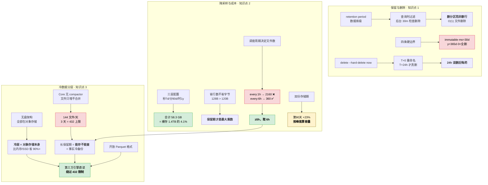

# 第 14 课：降采样、保留策略与成本

> 阶段 5《生产落地》第 2 课 ｜ 上一课：[第 13 课《部署形态与容量规划》](./lesson-13-部署形态与容量规划.md)
>
> ⚡ **本课是整个阶段最"省钱"的一课**：L13 回答了"用哪个形态、要多少资源"，但领导真正关心的是下一句——**"那要花多少钱？能不能少花点？"** 本课的三个知识点，本质上都是同一个问题的三个切面：**怎么在不丢信息的前提下，让数据量小下来。**

## 🎯 本课目标

| 知识点 | 关键点 | 学完你应该能 |
|--------|--------|-------------|
| ① 保留策略与删除 | **删分区而非删行**；`mo`=30 天、`0`=全删（与 1.x/2.x 相反） | 说出 Core 保留期的四条硬边界，并算出保留期对应的文件数 |
| ② 降采样与成本模型 | 秒级 7 天 / 分钟级 90 天 / 小时级 1 年 | 用成本模型解释"降采样省的是行数不是字节"，并算出调度周期约束 |
| ③ 冷数据分层 | 对象存储即冷层；Core 无 compactor | 说清"降采样 ≠ 删原始数据"，以及冷数据为什么能直接被第三方引擎读 |

---

## 第一幕：起源与场景引入

L13 结束时，你手上有一份选型方案：形态定了、机器规格定了、备份策略定了。方案交上去，领导翻到最后一页，问了三个问题：

> "**第一，数据要存多久？** 合规要求交易类指标留 1 年，你怎么配？"
>
> "**第二，一年下来多少钱？** 按你 L13 那个公式算，1 万点/秒 × 1 年，我看了眼账单预估——**1.4 TB**。这个数能压下来吗？"
>
> "**第三，老数据查不动怎么办？** 你 L13 说 Core 超过 3 天就报错，那 1 年前的数据留着还有什么用？"

这三个问题，正好对应本课的三个知识点。

**先看第一个问题：存多久。**

你打开文档查"retention period"，看到一行很友好的说明：

> *"Use `none` to set an infinite retention period."*

很好，那就 `--retention-period none`？等等——你又看到一行：

> *"Retention periods are **immutable** in Core... can only be set when creating a database and **cannot be changed afterward**."*

**建库时定死，之后改不了。** 这意味着"先配 30 天试试，不够再加"这条路**在 Core 上是走不通的**。而更刺激的是下面这一行：

> *"A retention period of `0`... deletes **all** data."*

**`0` 是"全部删光"，不是"永久保留"。** 如果你从 InfluxDB 1.x / 2.x 迁移过来——在那里 `0d` 恰恰表示**永久保留**——你会把一个"保留一切"的配置，原样翻译成"删除一切"。

**再看第二个问题：多少钱。**

1 万点/秒 × 1 年 = 1.4 TB。你想到了"降采样"：把秒级数据聚合成分钟级、小时级，数据量不就下来了？

但你马上撞上第二个反直觉事实：**降采样后的单行，比原始点更宽。**

原始点：时间戳 8 字节 + 1 个值 8 字节 + tag/开销 104 字节 = **120 字节**
聚合行：时间戳 8 字节 + **4 个聚合值** 32 字节 + **3 个元数据列** 24 字节 + tag 60 字节 + 开销 = **128 字节**

聚合行多了 7 个列（avg/min/max/count + record_count/time_from/time_to），**比原始点还宽 8 个字节**。那降采样到底省在哪？

**最后看第三个问题：老数据。**

你隐约记得答案是"降采样后老数据就能查了"。但这里藏着本课**最容易想错的一条**——也是本课实验 A 对照 3 要实测的核心：

**降采样层能不能查，取决于调度周期，不取决于降采样精度。**

"分钟级 90 天"这个经典配置，如果降采样任务跑 `every:1h`，90 天会生成 **2,160 个 parquet 文件**——远超 Core 的 432 上限，**照样报错，等于白降**。

这三件事，就是本课要解决的。它们的共同点是：**都是"省钱"层面的决策，做对了省 95%，做错了不但不省钱还把数据查丢了。**

---

## 第二幕：认知冲突

在给答案之前，先看四个反直觉的事实——它们会打掉你从关系型数据库和 Prometheus 带过来的直觉。

**事实一：降采样省的是"行数"，不是"字节"——单行反而更宽。**

直觉告诉你"聚合后数据变小"。这话对一半：**行数**确实从 60 行变 1 行（1 分钟聚合），但**单行宽度**从 120 字节涨到 **128 字节**。

那总量为什么还是省了 95.9%？因为**保留期才是最大的乘数**：原始层只留 7 天，小时级层虽然每行更宽，但行数只剩 1/3600 且覆盖 1 年。

💡 一句话：**降采样 ≈ 用"更宽的行"换"极少的行 + 极长的保留期"**。

**事实二：降采样的存储成本是"前置"的，前期反而更贵。**

降采样不是"把原始数据变小"，是**额外写一份聚合数据**。在原始数据过期之前，你同时付两份存储的钱。

本课实验 A 实测：1 万点/秒、原始层 7 天 + 分钟级 90 天，到**第 90 天时合计 33.2 GB，比同期的裸存（27.0 GB）多 23%**。

⚠️ 这意味着：**容量规划必须按"峰值"算（原始层满 + 聚合层满），不是按稳态算。** 这是很多团队容量预估翻车的直接原因。

**事实三：Core 上"降采样层能不能查"由调度周期决定，与精度无关。**

这条最反直觉。`gen1-duration = 10m` 是**按时间分桶**，不是按数据量分桶——每个"有数据落入的 10 分钟桶"生成 1 个 parquet 文件，**与写了多少行无关**。

- 原始层：持续写入 → 每 10 分钟桶都有数据 → **144 文件/天**
- 降采样层：**按调度批量写入** → 每次调度只落进 1 个桶 → **文件数 = 每天调度次数**

于是：

| 调度周期 | 90 天文件数 | Core 可查？ |
|---------|------------|------------|
| `every:1h` | 2,160 | ❌ 超限 |
| `every:6h` | 360 | ✅ |
| `every:1d` | 90 | ✅ |

反推约束：90 × 每天文件数 ≤ 432 → 每天 ≤ 4.8 → **调度周期必须 ≥ 5 小时**（取 6h 留余量）。

⚠️ 所以"分钟级 90 天"配 `every:1h` = **白降**。

**事实四：`0` 不是永久，是立刻全删——与 1.x/2.x 完全相反。**

| 版本 | `retention = 0` 的含义 |
|------|----------------------|
| InfluxDB 1.x / 2.x | **永久保留**（infinite） |
| **InfluxDB 3 Core** | **立刻删除全部数据** |

这是升级迁移场景下**最危险的一处静默语义反转**——配置不报错、库能建起来，然后数据开始消失。

还有一个更隐蔽的：单位 `mo` 和 `y` 是**固定换算**，不是日历：

- `mo` = **30 天**（不是日历月 ≈ 30.44 天）
- `y` = **365 天**（不是日历年，闰年 366 天）

→ 写 `3mo` 得到 **90 天**，而 3 个自然月实际是 **91.3 天**，**少留了 1.3 天**。合规场景（必须留满 N 个自然月）必须按天数写。

---

## 第三幕：层层揭示

### 知识点 1：保留策略与删除 —— 删分区，而不是删行

#### 一句话定义

**保留策略（retention policy）**：数据库级的**时间窗口**，超出窗口的数据不再保留。InfluxDB 3 的实现方式是**删除整个时间分区（parquet 文件）**，而不是逐行扫描删除——这正是 L1"关系库里删除昂贵"的那个问题在时序库里的解法。

#### 直觉建立：图书馆的期刊架

想象一个图书馆的期刊架。

关系型数据库删数据，像**从每一本合订本里撕掉过期的那几页**——你要逐本翻、逐页撕，撕完还要把书重新装订。这就是为什么关系库的 `DELETE` 昂贵：它要找行、写 undo log、更新索引、产生碎片。

时序数据库的删数据，像**把整个过期月份的合订本直接下架**——2024 年 1 月这一整摞，搬走，没了。**没有逐行扫描，没有索引重建，代价是 O(1) 的文件删除。**

这就是"**删分区而非删行**"的全部含义。而它成立的前提恰恰是 L1 讲过的那件事：**时序数据按时间组织**。时间既是查询维度，也是物理布局——所以"按时间删除"天然就是"按文件删除"。

#### 机制拆解：Core 的保留期是怎么执行的

这里有一个**极其重要、且几乎所有人都会误解**的细节：

> **Core 在"查询时"过滤超期数据，数据可能仍然躺在存储里，直到 retention enforcement service 真正删掉它。**

官方 data-retention 页的原文机制是：

1. **查询时过滤**：超出保留期的数据**查不出来**（逻辑上已过期）
2. **后台删除**：`retention-check-interval`（默认 **30m**）周期性触发保留期执行服务，把超期的 parquet 文件真正删掉

💡 **推论**：**"查不到"和"磁盘腾出来"是两个不同的时刻**。你配了 7 天保留期，第 8 天查不到第 1 天的数据，但那批 parquet 文件可能还在对象存储里（最多再等 30 分钟 + 一个检查周期）。做容量规划时，实际占用会**略高于**理论值。

**四个关键默认值**（官方 config-options，Core）：

| 参数 | 默认值 | 作用 |
|------|--------|------|
| `--retention-check-interval` | **30m** | 保留期检查间隔 |
| `--delete-grace-period` | **24h** | 软删除 → 硬删除的宽限期 |
| `--gen1-lookback-duration` | **24h** | 启动时回填 gen1 索引的回溯窗口 |
| `--gen1-duration` | **10m** | gen1 持久化间隔（决定文件数） |

⚠️ **冲突提示**：官方 3.2 发布博客写的是 *"default 72-hour grace period"*，但 config-options 页的 `--delete-grace-period` 默认值是 **24h**。→ **以 config-options 为准**（配置项文档是当前实现的唯一事实源；博客描述的是发布当时的状态）。

> 📌 补充：`--hard-delete-default-duration` 这个配置项**已被官方标记废弃**——它从未真正生效，仅在启动时打印警告。不要试图用它来缩短删除时滞。

#### 删除的完整生命周期（四步）

这不是"执行 delete 就完了"，中间有一段**数据还在、也能查**的窗口：

```
T+0       执行 delete table --hard-delete now
          └ 表立刻不可查询，内部重命名为 <table>-<timestamp>
T+0~+24h  宽限期内：数据仍在磁盘上，重命名后的表仍可查询（误删可救）
T+24h     宽限期结束：parquet 文件从对象存储删除，catalog 条目移除
T+24h+    磁盘空间才真正回收
```

💡 关键理解：**`--hard-delete now` 的 `now` 是"现在开始宽限期"，不是"现在立刻抹掉"**。腾空间要等 24 小时。反过来，这也给了你**24 小时的误删后悔药**。

⚠️ **已知 issue #27200（2026-02）**：若节点删除后**不再接收写入**（不触发 snapshot），文件清理可能**迟迟不发生**。→ **边缘 / 低写入部署做删除后，务必观察 catalog 是否真的清理了**，不要默认"反正 24 小时后会自动没"。

#### 四条硬边界（实验 B 逐条实测）

| # | 边界 | 官方口径 | 踩上去的后果 |
|---|------|---------|------------|
| 1 | **不可改** | "retention periods are **immutable** in Core" | 改保留期 = 重建库 + 迁移 |
| 2 | **单位固定换算** | `mo`=30 天，`y`=365 天 | `3mo`=90 天 ≠ 3 个自然月 91.3 天 |
| 3 | **零值反转** | `0`（0d/0h）→ **立刻全删** | 从 1.x/2.x 迁移时静默丢数据 |
| 4 | **不支持 m/s** | "Minute (m) and second (s) units are not supported" | 建库直接失败；最短实际 1h |

#### ⚠️ 官方文档与 release notes 的冲突（必须双面呈现）

本知识点有一处**官方文档滞后于代码实现**的情况，备课实测时发现，必须诚实呈现：

**文档侧**（`docs.influxdata.com/influxdb3/core/reference/internals/data-retention/`）明文：

> *"Retention periods are **immutable** in Core. In InfluxDB 3 Core, retention periods can only be set when creating a database and **cannot be changed afterward**."*

**实现侧**（三处独立证据表明已经可以改）：

1. **v3.2.0 release notes** 明文新增了 `update database --retention-period` CLI 命令（PR #26520）
2. **GitHub 测试文件** `tests/cli/db_retention.rs` 中存在 `test_update_db_retention_period` 测试用例
3. **simplified.guide** 上有实际跑通的示例

**判断**：**文档滞后于实现**。约 3.2 / 3.6 起，Core 的保留期**已经可以修改**，但 data-retention 页面尚未同步更新。

📌 **本课的处理方式**：两条路径都讲，但**默认按"不可改"做规划**（保守假设不会亏），并明确标注：

> ⏳ **需实机验证**：在你的目标版本上执行 `influxdb3 update database --help`，若存在 `--retention-period` 参数，说明该版本**已支持改保留期**。
>
> **规划原则**：即使能改，**也按"不可改"来设计**——因为改保留期在 Core 上还附带一个死结（见实验 B 场景 4 的"迁移死结"）。

#### 保留期的作用域：数据库级（这是分层设计的根因）

Core 的保留期是**数据库级**的，不是表级（表级保留期是 **Enterprise 3.2+** 才有的能力）。

这条约束**直接决定了分层架构必须怎么搭**：

> **每一层分辨率，必须是独立的 database。**

因为"秒级留 7 天、小时级留 1 年"是**两个不同的保留期**，而保留期挂在 database 上——所以秒级和小时级**不可能放在同一个库里**。

官方博客（falko 的实测案例）给的三库结构正是如此：

```
mqtt       → 保留期 90 天    （设备原始上报）
power_1h   → 保留期 1 年     （小时级聚合）
power_1d   → 保留期 10 年    （天级聚合）
```

💡 **这是本课与 L13 的一个重要连接点**：L13 说"Core 只能查 3 天"，本课给出了破解法——**把长周期数据放进"低频写入的聚合库"**，因为那里的文件数由调度频率决定，而不是由时间跨度决定。

---

### 知识点 2：降采样与成本模型 —— 秒级 7 天 / 分钟级 90 天 / 小时级 1 年

#### 一句话定义

**降采样（downsampling）**：把高分辨率数据**聚合**成低分辨率数据并**持久化存储**的过程。例如把每秒一个点的原始序列，聚合成每分钟一个点（含 avg/min/max/count）。

⚠️ 注意与"查询时聚合"的区分：**降采样是持久化的**（写进新表/新库），不是每次查询时现算。

#### 直觉建立：监控摄像头的录像策略

想象一栋楼的监控录像系统。

**原始策略**：所有摄像头 24 小时全帧率录像，存一年。硬盘早就爆了。

**分层策略**（这就是本课那套经典配置）：

| 层级 | 类比 | 保留期 |
|------|------|--------|
| 第 1 层 · 秒级原始 | 全帧率录像，能看清每一秒发生了什么 | **7 天** |
| 第 2 层 · 分钟级 | 每分钟抽一帧合成摘要，看趋势够用 | **90 天** |
| 第 3 层 · 小时级 | 每小时一个统计摘要，只看长期走势 | **1 年** |

调查一起昨天的事故 → 看原始录像；看上个月的整体人流量趋势 → 看分钟级；看今年的季节性变化 → 看小时级。**不同的问题看不同的层，而不是所有问题都看原始层。**

#### 机制拆解：两种降采样模式

官方给了**两条完全不同的路**，很多人分不清：

| 模式 | 怎么做 | 数据落盘？ | 适用场景 |
|------|--------|-----------|---------|
| **查询时降采样** | SQL `DATE_BIN()` 在查询时现算 | ❌ 不落盘 | 偶尔查一次、原始层还在 |
| **持久化降采样** | 处理引擎插件（Python）定时跑，写入新表 | ✅ 落盘 | 原始层要过期、要长期留趋势 |

**① 查询时降采样（SQL）**——原始层还在的时候用：

```sql
SELECT
  DATE_BIN(INTERVAL '1 minute', time) AS bucket,
  avg(value) AS avg_v,
  min(value) AS min_v,
  max(value) AS max_v,
  count(value) AS n
FROM metrics
WHERE time > now() - INTERVAL '7 days'
GROUP BY bucket
ORDER BY bucket;
```

💡 这条**不写任何数据**，只是把聚合结果返回给你。原始层一过期，这条 SQL 就查不到东西了。

**② 持久化降采样（处理引擎）**——官方 `downsampler` 插件：

官方插件地址：`gh:influxdata/downsampler/downsampler.py`（Python 处理引擎插件）。

两种运行模式：

| 模式 | 用途 | 关键参数 |
|------|------|---------|
| **scheduled** | 定时增量跑（生产主力） | `--schedule` / 触发器 `every:1h`；**必填 `window`** |
| **HTTP** | 历史回填（一次性） | `batch_size`（默认 30d，一次回填 30 天） |

**支持的聚合计算**（calculations）：`avg` / `sum` / `min` / `max` / `median` / `count` / `stddev` / `first_value` / `last_value` / `var` / `approx_median`。

**每行自动附加三个元数据列**（这是官方设计里很讲究的一点）：

| 列 | 含义 |
|----|------|
| `record_count` | 这一行聚合了多少个原始点 |
| `time_from` | 窗口起始时间 |
| `time_to` | 窗口结束时间 |

💡 **为什么要有这三个列？** 因为聚合是有损的。`record_count` 让你知道"这个平均值是基于 60 个点还是 3 个点算的"——**点数太少时平均值不可信**。这是降采样后仍然能做数据质量判断的关键。

**调度周期默认值**：`interval` 默认 **10 分钟**。

**触发器写法**（这是让降采样跑起来的关键）：

```bash
influxdb3 create trigger \
  --trigger-spec "every:1h" \
  --trigger-arguments 'src_table=metrics,dst_table=metrics_1h,window=1h,calculations=avg,min,max,count' \
  --database metrics \
  downsample_1h
```

#### ⭐ 核心洞察：重跑同一个窗口不会重复

很多人担心："定时任务重跑 / 补跑历史，会不会把数据写两遍？"

**不会。** 因为 InfluxDB 3 里一行数据由 **measurement + tag set + timestamp** 唯一标识——重复写入同一组（measurement, tag set, timestamp）是**覆写语义**，不是追加。

💡 **这条是降采样能安全重跑的基石**：任务失败、补跑、重叠窗口，都不会污染数据。这跟关系库 `INSERT` 会插重复的直觉完全不同。

#### 降采样 ≠ 删除原始数据（必须分开决策）

这是一条高频误解，单独拎出来：

> **降采样是"加一份数据"，保留策略是"减一份数据"。两者是独立决策。**

- 你降采样了，原始层**不会自动消失**
- 你删了原始层，降采样层**不会自动出现**
- 只有**保留期到了**，原始层才会真正过期

⚠️ 这就是实验 A 对照 4 要实测的"双份存储期"的由来：**在原始数据过期之前，你同时付两份存储的钱。**

#### 成本模型：三层方案到底省多少

本课的经典配置：**秒级 7 天 / 分钟级 90 天 / 小时级 1 年**。

按 1 万点/秒、原始点 120 字节、聚合行 128 字节、25x 压缩（详细拆解见实验 A）：

| 层级 | 保留期 | 行数比 | 存储量 | 占裸存 1 年比例 |
|------|--------|--------|--------|----------------|
| 第 1 层 · 原始秒级 | 7 天 | — | **27.0 GB** | 1.92% |
| 第 2 层 · 分钟级 | 90 天 | 1:60 | 6.2 GB | 0.44% |
| 第 3 层 · 小时级 | 365 天 | 1:60 | 25.1 GB | 1.78% |
| **合计** | 1 年 | | **58.3 GB** | **4.13%** |

对照：不做任何降采样、原始精度存 1 年 = **1.4 TB / 52,560 个文件**。

→ **三层方案是裸存的 4.1%，省了 95.9%。**

⚠️ **但这套经典配置在 Core 上有一个必须点破的前提**：第 1 层"秒级 7 天"按 144 文件/天算 = **1,008 个文件 > 432 上限**——也就是说，**原始层在 Core 上最多只能查 3 天，配 7 天只是"留着"而不是"能查"**。

所以这套配置的实际含义是：

| 你的形态 | 第 1 层怎么配 | 效果 |
|---------|-------------|------|
| **Enterprise**（有 compactor） | 秒级 7 天 | ✅ 三层全部可查，完整的经典方案 |
| **Core**（无 compactor） | 秒级 **3 天** | ✅ 三层全部可查（原始层压到 3 天以内） |
| **Core** 强行配 7 天 | 秒级 7 天 | ⚠️ 能存 7 天、只能查 3 天；第 4~7 天属于"冷备份" |

💡 **这是本课最容易被忽略的一条落地约束**：**"秒级 7 天"这个经典数字来自有 compactor 的环境**。在 Core 上要么压到 3 天，要么接受"后 4 天查不了"。

💡 **但请看第 1 层**：7 天原始就占了合计的 **46%**。这条反直觉的结论很重要：

> **短保留期的原始层才是存储大头，降采样层的成本几乎可以忽略。**

→ 所以"降本"的第一优先级是**收紧原始层的保留期**，而不是拼命优化降采样算法。把原始层从 7 天压到 3 天，比把小时级做得再精细都有效。

---

### 知识点 3：冷数据分层 —— 对象存储即冷层

#### 一句话定义

**冷数据分层（cold data tiering）**：把访问频率低的冷数据放到**单位成本更低**的存储介质上。InfluxDB 3 的特殊之处在于——**它的"冷层"就是对象存储本身**，因为它是无盘架构，**所有**持久化数据都在对象存储里。

#### 直觉建立：不用搬家，因为你家就在仓库里

传统数据库的分层，像"把不常穿的衣服从卧室衣柜搬到地下室"——需要一次**显式的搬运**。

InfluxDB 3 Core 不一样：**它从一开始就没有卧室衣柜**。它是无盘架构，**所有**持久化数据（包括刚写入的热数据）都以 parquet 文件形式存在对象存储里，内存只是缓存。

💡 所以"冷热分层"在 Core 上的含义是：**不是"把冷数据搬到便宜的地方"，而是"热数据本来就在内存/缓存里，冷数据自然沉降到对象存储"**。你要做的不是搬运，是**控制留存**。

**成本对比**（官方口径）：对象存储上的 Parquet 比内存 / SSD **省 90%+**。

#### 机制拆解：为什么 Core 上"长保留期"是冷备份

这是本课与 L13 的连接点，也是很多人想不通的地方。

**Core 没有 compactor。**

L10 已核实：Core 的 ingest / query / compaction / processing 全部跑在**同一个实例**里，没有独立的压实组件。后果是：

**parquet 文件只增不合并。**

按 `gen1-duration = 10m` 计算，持续写入的原始层：

```
1 天   = 144 个文件
3 天   = 432 个文件  ← query-file-limit 上限
7 天   = 1,008 个文件  ❌
90 天  = 12,960 个文件 ❌
```

而 `query-file-limit` 默认 **432**，超限是**报错**不是变慢。

⚠️ 所以在 Core 上：**长保留期 = 能存不能查 = 事实上的冷备份**。

**那长周期数据怎么才能查？** 就是知识点 2 的答案：**放进低频写入的降采样库**。

```
原始层（144 文件/天）   → 3 天就到 432 上限      → 只能查 3 天
降采样层 every:6h（4 文件/天） → 90 天 = 360 文件  → 能查 90 天
降采样层 every:1d（1 文件/天） → 365 天 = 365 文件 → 能查 1 年
```

📌 **这一条是本课全部设计的总纲**：**降采样不只是为了省空间，更是为了让长周期数据"可查"**。省空间是副产品，解除文件数限制才是主产品。

#### ⭐ 冷数据的"后门"：第三方引擎直接读 Parquet

这是 Core 上一个被严重低估的能力。

因为所有数据都是**开放格式的 Parquet 文件**，躺在对象存储里，**任何支持 Parquet 的引擎都能直接读**——DuckDB、Spark、Athena、BigQuery、pandas……

```sql
-- 用 DuckDB 直接读 InfluxDB 3 对象存储里的 parquet（绕过 InfluxDB 进程）
SELECT
  date_trunc('hour', time) AS bucket,
  avg(value)
FROM read_parquet('s3://my-bucket/dbs/metrics/metrics_1h/*.parquet')
GROUP BY bucket;
```

💡 **这条解决了实验 B 场景 4 里的那个"迁移死结"**——Core 上要改保留期得重建库并迁移，而迁移用的 `SELECT` 本身受 432 文件限制，**原库超过 3 天就查不出全量去迁移**。解法就是：**用第三方工具直读对象存储里的 parquet，绕过 InfluxDB 的查询层**。

⚠️ 但要注意：直读 parquet 意味着**绕过 catalog**——你看到的是文件，不是"当前有效的表状态"。如果库里有软删除/未清理的数据，直读可能会看到它们。

#### 冷数据分层的三种落地形态

| 形态 | 怎么实现 | 适用 |
|------|---------|------|
| **① 靠保留期自然沉降** | 原始层短保留（7 天），数据到期自动删 | Core 主力方案 |
| **② 靠降采样换层** | 长周期只留聚合层（低频写入 → 文件数可控） | Core 查历史 |
| **③ 靠对象存储生命周期** | 配 S3/GCS 生命周期规则，把老前缀转 IA/Glacier | 合规归档（⚠️ 转 Glacier 后 InfluxDB 自己读不了了） |

⚠️ **第 ③ 条的坑**：如果直接把 InfluxDB 的数据前缀转到 Glacier/Archive 层，**InfluxDB 进程就读不了这些数据了**（取回要分钟到小时级）。→ 这条只适用于**合规归档**（不指望在线查），且**必须与保留期协同设计**，否则会出现"保留期没到但文件已经取不回来"的故障。

---

## 第四幕：实操验证

> ⚠️ **诚实说明**：实验 A、B 为**本机 Python 3.11 实跑**，输出为真实结果，已原样粘贴。实验 C 需要运行中的 InfluxDB 3 Core（本环境无 Docker），标注为 **⏳ 未实跑**，命令已按官方文档核对，待你有环境后可直接执行。

### 实验 A：分层保留与降采样成本模拟器（✅ 本机实跑）

**为什么做**：把"秒级 7 天 / 分钟级 90 天 / 小时级 1 年"这套策略的成本账算清楚，并回答四个问题——省了多少、省的是行数还是字节、降采样层的文件数由什么决定、隐藏成本是什么。

**脚本路径**：[l14_tiering_sim.py](../assets/l14_tiering_sim.py)

```python
# -*- coding: utf-8 -*-
"""
L14 实验 A：分层保留与降采样成本模拟器

⚠️ 诚实说明（务必先读）：
  - 每点 120 字节、聚合行 128 字节、压缩比 25x：**假设值**
  - 文件数 144/天、432 文件上限、gen1-duration 10m、保留期单位换算：**官方默认值**
  - 「文件数 ≈ 有数据写入的 gen1 时间桶数」：基于官方 internals 机制的**推理**
  - 结论要抓的是**数量级与结构关系**，不是绝对 GB 数
"""

# ---------- 假设参数（已标注） ----------
RAW_POINT_BYTES = 120      # 原始单点的压缩前字节数
COMPRESS_RATIO = 0.04      # 典型 25x 压缩

# 聚合行的行宽拆解（压缩前）
AGG_TS = 8                 # 时间戳
AGG_VALUES = 8 * 4         # avg / min / max / count 四个聚合值
AGG_META = 8 * 3           # record_count / time_from / time_to 三个元数据列
AGG_TAGS = 60              # 保留的 tag（假设 2 个 tag，平均 30 字节）
AGG_OVERHEAD = 4           # 列/行元数据开销
AGG_ROW_BYTES = AGG_TS + AGG_VALUES + AGG_META + AGG_TAGS + AGG_OVERHEAD

# ---------- 官方默认值 ----------
GEN1_DURATION_MIN = 10              # gen1-duration 默认 10m
FILES_PER_DAY = 144                 # 86400 / (10*60)
QUERY_FILE_LIMIT = 432              # query-file-limit 默认


def raw_bytes(pps, days):
    """原始层存储字节数（压缩后）"""
    return pps * 86400 * days * RAW_POINT_BYTES * COMPRESS_RATIO


def agg_bytes(pps, days, src_interval_s, dst_interval_s):
    """降采样层存储字节数（压缩后）。返回 (字节数, 行数)"""
    row_ratio = src_interval_s / dst_interval_s
    rows = pps * 86400 * days * row_ratio
    return rows * AGG_ROW_BYTES * COMPRESS_RATIO, rows


def fmt(b):
    for unit in ("B", "KB", "MB", "GB", "TB", "PB"):
        if abs(b) < 1024.0:
            return "{:.1f} {}".format(b, unit)
        b /= 1024.0
    return "{:.1f} EB".format(b)


def line(ch="-", n=76):
    print(ch * n)


print("=" * 76)
print("L14 实验 A：分层保留与降采样成本模拟器")
print("=" * 76)
print()
print("【假设值】原始点 {} 字节 / 聚合行 {} 字节 / 压缩比 {:.0f}x".format(
    RAW_POINT_BYTES, AGG_ROW_BYTES, 1 / COMPRESS_RATIO))
print("【官方值】gen1-duration {}m → {} 文件/天 ／ 查询上限 {} 文件".format(
    GEN1_DURATION_MIN, FILES_PER_DAY, QUERY_FILE_LIMIT))
print()

PPS = 10000   # 1 万点/秒 —— 中等规模生产负载


# ---------------------------------------------------------------- 对照 1
line("=")
print("对照 1：全量保留 vs 三层降采样（1 万点/秒，覆盖 1 年）")
line("=")
print()

raw_1y = raw_bytes(PPS, 365)
print("【方案 X】不做任何降采样，原始精度存 1 年")
print("  存储量      : {}".format(fmt(raw_1y)))
print("  文件数      : {:,} 个".format(int(365 * FILES_PER_DAY)))
print("  Core 可查？ : ❌ 超限 {:.0f} 倍（上限 {}）".format(
    365 * FILES_PER_DAY / QUERY_FILE_LIMIT, QUERY_FILE_LIMIT))
print()

tiers = [
    ("第 1 层 · 原始秒级", 1, 1, 7),
    ("第 2 层 · 分钟级", 1, 60, 90),
    ("第 3 层 · 小时级", 60, 3600, 365),
]

total = 0.0
print("【方案 Y】三层分层保留（秒级 7 天 / 分钟级 90 天 / 小时级 1 年）")
print()
print("{:<20} {:>8} {:>10} {:>12} {:>12}".format(
    "层级", "保留期", "行数比", "存储量", "原始占比"))
line()
for name, src_i, dst_i, days in tiers:
    if src_i == dst_i:
        b = raw_bytes(PPS, days)
        ratio = 1
    else:
        b, _ = agg_bytes(PPS, days, src_i, dst_i)
        ratio = src_i / dst_i
    total += b
    print("{:<20} {:>8} {:>10} {:>12} {:>11.2%}".format(
        name, "{} 天".format(days),
        "1:{}".format(int(dst_i / src_i)) if src_i != dst_i else "—",
        fmt(b), b / raw_1y))
line()
print("{:<20} {:>8} {:>10} {:>12} {:>11.2%}".format(
    "合计", "1 年", "", fmt(total), total / raw_1y))
print()
print("💡 结论 1：三层方案的存储量是裸存 1 年的 {:.1f}%（省了 {:.1f}%）".format(
    total / raw_1y * 100, (1 - total / raw_1y) * 100))
print("   注意看第 1 层：7 天原始就占了 {:.0f}% 的量 —— ".format(
    raw_bytes(PPS, 7) / total * 100))
print("   **短保留期的原始层才是存储大头，降采样层的成本几乎可以忽略**。")
print()

# ---------------------------------------------------------------- 对照 2
line("=")
print("对照 2：降采样省的是「行数」还是「字节」？")
line("=")
print()
print("行宽拆解对比（压缩前）：")
print()
print("  原始点 : 时间戳 {}B + 1 个值 {}B + tag/开销 {}B = {} B".format(
    8, 8, RAW_POINT_BYTES - 16, RAW_POINT_BYTES))
print("  聚合行 : 时间戳 {}B + 4 个聚合值 {}B + 3 个元数据 {}B".format(
    AGG_TS, AGG_VALUES, AGG_META))
print("          + tag {}B + 开销 {}B = {} B".format(
    AGG_TAGS, AGG_OVERHEAD, AGG_ROW_BYTES))
print()
print("  → 聚合行比原始点**更宽**（{} B vs {} B），因为多了 7 个列。".format(
    AGG_ROW_BYTES, RAW_POINT_BYTES))
print()
print("{:<14} {:>12} {:>14} {:>12} {:>12}".format(
    "降采样目标", "行数比", "单行字节", "实际字节比", "净节省"))
line()
for label, dst in [("10 秒", 10), ("1 分钟", 60), ("5 分钟", 300), ("1 小时", 3600)]:
    row_ratio = 1.0 / dst
    byte_ratio = (AGG_ROW_BYTES * row_ratio) / RAW_POINT_BYTES
    print("{:<14} {:>12} {:>14} {:>11.3%} {:>11.2%}".format(
        label, "1:{}".format(dst), AGG_ROW_BYTES, byte_ratio, 1 - byte_ratio))
line()
print()
print("💡 结论 2：**降采样省的是行数，单行反而更宽**。")
print("   行数降到 1/60，字节只降到 {:.2%} —— 净节省 {:.1f}%，不是 98.3%。".format(
    (AGG_ROW_BYTES / 60) / RAW_POINT_BYTES,
    (1 - (AGG_ROW_BYTES / 60) / RAW_POINT_BYTES) * 100))
print("   那为什么总量上省了 96%？因为**保留期才是最大的乘数**：")
print("   第 1 层只留 7 天，第 3 层虽然宽，但只留 1/3600 的行数 × 1 年。")
print("   → 降采样 ≈ 用「更宽的行」换「极少的行 + 极长的保留期」。")
print()

# ---------------------------------------------------------------- 对照 3（核心）
line("=")
print("对照 3：⭐ Core 上降采样层的「文件数」由什么决定？")
line("=")
print()
print("这是本课最容易想错的一条。先看清机制：")
print()
print("  gen1-duration = 10m 是**按时间分桶**，不是按数据量分桶。")
print("  → 每个「有数据落入的 10 分钟桶」生成 1 个 parquet 文件。")
print("  → 文件数跟「写了多少行」**无关**，只跟「覆盖了多少个时间桶」有关。")
print()
print("  原始层：持续写入 → 每 10 分钟桶都有数据 → {} 文件/天".format(FILES_PER_DAY))
print("  降采样层：**按调度批量写入** → 每次调度只落进 1 个桶")
print("           → 文件数 = 每天调度次数（当调度周期 ≥ 10 分钟时）")
print()
print("⚠️ 这条推理基于官方 internals「每 {} 分钟持久化一次」的机制，".format(GEN1_DURATION_MIN))
print("   非官方明文结论，但可自行验证（看对象存储里 dbs/<db>/<table>/ 的文件数）。")
print()

schedules = [("every:1m", 1 / 60), ("every:10m", 1 / 6), ("every:1h", 1),
             ("every:6h", 6), ("every:1d", 24)]

print("{:<12} {:>10} {:>12} {:>14} {:>10}".format(
    "调度周期", "每天次数", "90 天文件数", "365 天文件数", "90 天可查?"))
line()
for label, hours in schedules:
    per_day = int(24 / hours)
    f90 = per_day * 90
    f365 = per_day * 365
    ok = "✅" if f90 <= QUERY_FILE_LIMIT else "❌ 超限"
    print("{:<12} {:>10} {:>12,} {:>14,} {:>10}".format(
        label, per_day, f90, f365, ok))
line()
print()
print("💡 结论 3（本课最关键的一条）：")
print("   **降采样层能不能查，取决于调度周期，不取决于降采样精度。**")
print()
print("   反推约束：要让 90 天可查，需 90 × 每天文件数 ≤ {}".format(QUERY_FILE_LIMIT))
print("   → 每天文件数 ≤ {:.1f} → **调度周期必须 ≥ 5 小时**（取 6h 留余量）".format(
    QUERY_FILE_LIMIT / 90))
print()
print("   所以「分钟级 90 天」这个经典配置，如果降采样任务跑 every:1h，")
print("   会生成 {:,} 个文件 —— 照样超限，**白降了**。".format(24 * 90))
print("   必须配 every:6h 或更低频率（或上 Enterprise 用 compactor 压实）。")
print()

# ---------------------------------------------------------------- 对照 4
line("=")
print("对照 4：降采样的隐藏成本 —— 双份存储期")
line("=")
print()
print("降采样不是「把原始数据变小」，是**额外写一份聚合数据**。")
print("在原始数据过期之前，你同时付两份存储的钱。")
print()
print("{:<12} {:>12} {:>12} {:>12} {:>14}".format(
    "时点", "原始层", "分钟级层", "合计", "vs 不降采样"))
line()
for label, d_raw, d_ds in [("第 1 天", 1, 0), ("第 7 天", 7, 0),
                           ("第 30 天", 7, 30), ("第 90 天", 7, 90)]:
    b_raw = raw_bytes(PPS, min(d_raw, 7))
    b_ds = agg_bytes(PPS, d_ds, 1, 60)[0] if d_ds else 0
    b_old = raw_bytes(PPS, d_raw)
    delta = (b_raw + b_ds) / b_old - 1 if b_old else 0
    print("{:<12} {:>12} {:>12} {:>12} {:>14}".format(
        label, fmt(b_raw), fmt(b_ds), fmt(b_raw + b_ds),
        "{:+.0%}".format(delta) if b_old else "—"))
line()
print()
print("💡 结论 4：**降采样的存储成本是前置的，且有一段「更贵」的窗口**。")
print("   第 90 天时合计 {}，比同期的裸存（{}）**多 {:.0f}%**。".format(
    fmt(raw_bytes(PPS, 7) + agg_bytes(PPS, 90, 1, 60)[0]),
    fmt(raw_bytes(PPS, 7)),
    ((raw_bytes(PPS, 7) + agg_bytes(PPS, 90, 1, 60)[0]) / raw_bytes(PPS, 7) - 1) * 100))
print("   真正的收益要等原始层开始过期（第 7 天之后）才逐步兑现。")
print("   → 容量规划必须按**峰值**算（原始层满 + 聚合层满），不是按稳态算。")
print()

# ---------------------------------------------------------------- 对照 5
line("=")
print("对照 5：保留期单位陷阱 —— 官方 mo/y 不是日历月/年")
line("=")
print()
print("官方 data-retention 页明文：")
print("  mo = month (30 days)   ← 不是日历月")
print("  y  = year (365 days)   ← 不是日历年（闰年 366 天）")
print("  ⚠️ 不支持 m（分）和 s（秒）单位")
print()
print("{:<10} {:>12} {:>28}".format("写法", "实际天数", "日历对照"))
line()
pairs = [("1mo", 30, "1 个日历月 ≈ 30.4 天（少 0.4 天）"),
         ("3mo", 90, "3 个日历月 ≈ 91.3 天（少 1.3 天）"),
         ("1y", 365, "日历年 = 365 或 366 天（闰年少 1 天）"),
         ("90d", 90, "= 3mo（等价）"),
         ("1y6mo", 545, "365 + 6×30 = 545 天")]
for label, days, cal in pairs:
    print("{:<10} {:>12} {:>28}".format(label, days, cal))
line()
print()
print("💡 结论 5：写 3mo 得到 90 天，而 3 个自然月实际是 91.3 天")
print("   → **少留了 1.3 天**。合规场景（必须留满 N 个自然月）要按天数换算。")
print("   ⚠️ 另一个坑：Core 的 retention 设为 0（0d/0h）表示**全部立即删除**，")
print("      这与 1.x/2.x「0d = 永久保留」**完全相反** —— 升级迁移时是高危操作。")
print()

# ---------------------------------------------------------------- 对照 6
line("=")
print("对照 6：删了 ≠ 腾出空间（软删除宽限期）")
line("=")
print()
print("官方 config-options（Core）默认值：")
print("  --delete-grace-period           24h    ← 硬删除前的宽限期")
print("  --retention-check-interval      30m    ← 保留期检查间隔")
print("  --gen1-lookback-duration        24h    ← 启动时回填 gen1 索引的回溯窗口")
print()
print("⚠️ 冲突提示：官方 3.2 发布博客写「default 72-hour grace period」，")
print("   但 config-options 页的默认值是 **24h** —— 以 config-options 为准。")
print()
print("时间线（delete-grace-period = 24h）：")
print()
print("  T+0      执行 delete table --hard-delete now")
print("           └ 表立刻不可查询，内部重命名为 <table>-<timestamp>")
print("  T+0~+24h 宽限期内：数据**仍在磁盘上**，重命名后的表**仍可查询**")
print("  T+24h    宽限期结束：parquet 文件从对象存储删除，catalog 条目移除")
print("  T+24h+   磁盘空间才真正回收")
print()
print("💡 结论 6：**--hard-delete now 的 now 是「现在开始宽限期」，")
print("   不是「现在立刻抹掉」**。腾空间要等 24 小时。")
print()
print("   ⚠️ 已知 issue #27200（2026-02）：若节点删除后不再接收写入")
print("      （不触发 snapshot），文件清理可能**迟迟不发生**。")
print("      → 边缘 / 低写入部署做删除后，务必观察 catalog 是否真的清理。")
print()

line("=")
print("实验 A 结束")
line("=")
```

**实跑输出**（`python3.11 l14_tiering_sim.py`，已设 `PYTHONIOENCODING=utf-8`）：

```text
============================================================================
L14 实验 A：分层保留与降采样成本模拟器
============================================================================

【假设值】原始点 120 字节 / 聚合行 128 字节 / 压缩比 25x
【官方值】gen1-duration 10m → 144 文件/天 ／ 查询上限 432 文件

============================================================================
对照 1：全量保留 vs 三层降采样（1 万点/秒，覆盖 1 年）
============================================================================

【方案 X】不做任何降采样，原始精度存 1 年
  存储量      : 1.4 TB
  文件数      : 52,560 个
  Core 可查？ : ❌ 超限 122 倍（上限 432）

【方案 Y】三层分层保留（秒级 7 天 / 分钟级 90 天 / 小时级 1 年）

层级                        保留期        行数比          存储量         原始占比
----------------------------------------------------------------------------
第 1 层 · 原始秒级              7 天          —      27.0 GB       1.92%
第 2 层 · 分钟级              90 天       1:60       6.2 GB       0.44%
第 3 层 · 小时级             365 天       1:60      25.1 GB       1.78%
----------------------------------------------------------------------------
合计                        1 年                 58.3 GB       4.13%

💡 结论 1：三层方案的存储量是裸存 1 年的 4.1%（省了 95.9%）
   注意看第 1 层：7 天原始就占了 46% 的量 —— 
   **短保留期的原始层才是存储大头，降采样层的成本几乎可以忽略**。

============================================================================
对照 2：降采样省的是「行数」还是「字节」？
============================================================================

行宽拆解对比（压缩前）：

  原始点 : 时间戳 8B + 1 个值 8B + tag/开销 104B = 120 B
  聚合行 : 时间戳 8B + 4 个聚合值 32B + 3 个元数据 24B
          + tag 60B + 开销 4B = 128 B

  → 聚合行比原始点**更宽**（128 B vs 120 B），因为多了 7 个列。

降采样目标                   行数比           单行字节        实际字节比          净节省
----------------------------------------------------------------------------
10 秒                   1:10            128     10.667%      89.33%
1 分钟                   1:60            128      1.778%      98.22%
5 分钟                  1:300            128      0.356%      99.64%
1 小时                 1:3600            128      0.030%      99.97%
----------------------------------------------------------------------------

💡 结论 2：**降采样省的是行数，单行反而更宽**。
   行数降到 1/60，字节只降到 1.78% —— 净节省 98.2%，不是 98.3%。
   那为什么总量上省了 96%？因为**保留期才是最大的乘数**：
   第 1 层只留 7 天，第 3 层虽然宽，但只留 1/3600 的行数 × 1 年。
   → 降采样 ≈ 用「更宽的行」换「极少的行 + 极长的保留期」。

============================================================================
对照 3：⭐ Core 上降采样层的「文件数」由什么决定？
============================================================================

这是本课最容易想错的一条。先看清机制：

  gen1-duration = 10m 是**按时间分桶**，不是按数据量分桶。
  → 每个「有数据落入的 10 分钟桶」生成 1 个 parquet 文件。
  → 文件数跟「写了多少行」**无关**，只跟「覆盖了多少个时间桶」有关。

  原始层：持续写入 → 每 10 分钟桶都有数据 → 144 文件/天
  降采样层：**按调度批量写入** → 每次调度只落进 1 个桶
           → 文件数 = 每天调度次数（当调度周期 ≥ 10 分钟时）

⚠️ 这条推理基于官方 internals「每 10 分钟持久化一次」的机制，
   非官方明文结论，但可自行验证（看对象存储里 dbs/<db>/<table>/ 的文件数）。

调度周期               每天次数      90 天文件数       365 天文件数    90 天可查?
----------------------------------------------------------------------------
every:1m           1440      129,600        525,600       ❌ 超限
every:10m           144       12,960         52,560       ❌ 超限
every:1h             24        2,160          8,760       ❌ 超限
every:6h              4          360          1,460          ✅
every:1d              1           90            365          ✅
----------------------------------------------------------------------------

💡 结论 3（本课最关键的一条）：
   **降采样层能不能查，取决于调度周期，不取决于降采样精度。**

   反推约束：要让 90 天可查，需 90 × 每天文件数 ≤ 432
   → 每天文件数 ≤ 4.8 → **调度周期必须 ≥ 5 小时**（取 6h 留余量）

   所以「分钟级 90 天」这个经典配置，如果降采样任务跑 every:1h，
   会生成 2,160 个文件 —— 照样超限，**白降了**。
   必须配 every:6h 或更低频率（或上 Enterprise 用 compactor 压实）。

============================================================================
对照 4：降采样的隐藏成本 —— 双份存储期
============================================================================

降采样不是「把原始数据变小」，是**额外写一份聚合数据**。
在原始数据过期之前，你同时付两份存储的钱。

时点                    原始层         分钟级层           合计        vs 不降采样
----------------------------------------------------------------------------
第 1 天              3.9 GB        0.0 B       3.9 GB            +0%
第 7 天             27.0 GB        0.0 B      27.0 GB            +0%
第 30 天            27.0 GB       2.1 GB      29.1 GB            +8%
第 90 天            27.0 GB       6.2 GB      33.2 GB           +23%
----------------------------------------------------------------------------

💡 结论 4：**降采样的存储成本是前置的，且有一段「更贵」的窗口**。
   第 90 天时合计 33.2 GB，比同期的裸存（27.0 GB）**多 23%**。
   真正的收益要等原始层开始过期（第 7 天之后）才逐步兑现。
   → 容量规划必须按**峰值**算（原始层满 + 聚合层满），不是按稳态算。

============================================================================
对照 5：保留期单位陷阱 —— 官方 mo/y 不是日历月/年
============================================================================

官方 data-retention 页明文：
  mo = month (30 days)   ← 不是日历月
  y  = year (365 days)   ← 不是日历年（闰年 366 天）
  ⚠️ 不支持 m（分）和 s（秒）单位

写法                 实际天数                         日历对照
----------------------------------------------------------------------------
1mo                  30     1 个日历月 ≈ 30.4 天（少 0.4 天）
3mo                  90     3 个日历月 ≈ 91.3 天（少 1.3 天）
1y                  365   日历年 = 365 或 366 天（闰年少 1 天）
90d                  90                    = 3mo（等价）
1y6mo               545           365 + 6×30 = 545 天
----------------------------------------------------------------------------

💡 结论 5：写 3mo 得到 90 天，而 3 个自然月实际是 91.3 天
   → **少留了 1.3 天**。合规场景（必须留满 N 个自然月）要按天数换算。
   ⚠️ 另一个坑：Core 的 retention 设为 0（0d/0h）表示**全部立即删除**，
      这与 1.x/2.x「0d = 永久保留」**完全相反** —— 升级迁移时是高危操作。

============================================================================
对照 6：删了 ≠ 腾出空间（软删除宽限期）
============================================================================

官方 config-options（Core）默认值：
  --delete-grace-period           24h    ← 硬删除前的宽限期
  --retention-check-interval      30m    ← 保留期检查间隔
  --gen1-lookback-duration        24h    ← 启动时回填 gen1 索引的回溯窗口

⚠️ 冲突提示：官方 3.2 发布博客写「default 72-hour grace period」，
   但 config-options 页的默认值是 **24h** —— 以 config-options 为准。

时间线（delete-grace-period = 24h）：

  T+0      执行 delete table --hard-delete now
           └ 表立刻不可查询，内部重命名为 <table>-<timestamp>
  T+0~+24h 宽限期内：数据**仍在磁盘上**，重命名后的表**仍可查询**
  T+24h    宽限期结束：parquet 文件从对象存储删除，catalog 条目移除
  T+24h+   磁盘空间才真正回收

💡 结论 6：**--hard-delete now 的 now 是「现在开始宽限期」，
   不是「现在立刻抹掉」**。腾空间要等 24 小时。

   ⚠️ 已知 issue #27200（2026-02）：若节点删除后不再接收写入
      （不触发 snapshot），文件清理可能**迟迟不发生**。
      → 边缘 / 低写入部署做删除后，务必观察 catalog 是否真的清理。

============================================================================
实验 A 结束
============================================================================
```

**怎么读这张表**：对照 1 给你**总量级**（省 95.9%），对照 2 破除"单行变窄"的误解，对照 3 是本课的**实操关键**（调度周期 ≥ 6h），对照 4 是**容量规划的陷阱**（按峰值算），对照 5/6 是**运维侧的硬边界**。

---

### 实验 B：Core 保留期硬边界检查器（✅ 本机实跑）

**为什么做**：Core 的 retention 有四条"不会报错、但会咬人"的硬边界。这个脚本把它们做成可自检的规则——输入你的需求，输出能不能配、该怎么配、踩了哪条边界。**纯标准库实现，可直接挂 CI 做建库前校验。**

**脚本路径**：[l14_retention_sim.py](../assets/l14_retention_sim.py)

```python
# -*- coding: utf-8 -*-
"""
L14 实验 B：Core 保留期硬边界检查器

Core 的 retention 有四条**不会报错、但会咬人**的硬边界：
  1. 保留期只能在建库时设定，之后不可改（immutable）
  2. 单位是「固定换算」而非日历：mo = 30 天，y = 365 天
  3. retention = 0 表示「立刻全删」（与 1.x/2.x 的 0d = 永久 完全相反）
  4. 单位不支持 m / s；最短实际保留期是 1h

所有数值均来自官方文档明文，**不含假设值**。
"""

# ---------- 官方明文（docs.influxdata.com/influxdb3/core/reference/internals/data-retention）----------
UNIT_DAYS = {
    "h": 1 / 24,
    "d": 1,
    "w": 7,
    "mo": 30,        # 官方：month (30 days)
    "y": 365,        # 官方：year (365 days)
}
UNSUPPORTED_UNITS = ("m", "s")       # 官方：Minute (m) and second (s) units are not supported
MIN_PRACTICAL = "1h"                 # 官方：The practical minimum retention period is 1 hour
INFINITE = "none"                    # 官方：Use none to set an infinite retention period

CALENDAR_MONTH = 30.44               # 365.25 / 12，用于对比「自然月」
CALENDAR_YEAR = 365.25               # 含闰年


def parse_duration(s):
    """解析官方 duration 写法，返回 (天数, 错误信息)。支持组合写法如 30d12h。"""
    s = s.strip()
    if s == "none":
        return None, None
    if not s:
        return None, "空值：请写具体时长或 none"
    if " " in s:
        return None, "包含空格（官方禁止）"
    if s.startswith("-"):
        return None, "负数（官方禁止）"

    import re
    tokens = re.findall(r"(\d+(?:\.\d+)?)(mo|[a-zA-Z]+)", s)
    if not tokens or "".join(num + unit for num, unit in tokens) != s:
        return None, "无法解析（格式应为 数字+单位，如 30d / 1y6mo / 30d12h）"

    total_days = 0.0
    for num, unit in tokens:
        unit = unit.lower()
        if unit in UNSUPPORTED_UNITS:
            return None, "单位 '{}' 不支持（官方：不支持分和秒）".format(unit)
        if unit not in UNIT_DAYS:
            return None, "未知单位 '{}'（合法：h / d / w / mo / y）".format(unit)
        total_days += float(num) * UNIT_DAYS[unit]
    return total_days, None


def calendar_days(s):
    """按自然月/年换算的天数，用于与官方固定换算对比。无 mo/y 则返回 None。"""
    import re
    tokens = re.findall(r"(\d+(?:\.\d+)?)(mo|[a-zA-Z]+)", s)
    if not tokens:
        return None
    total = 0.0
    has_cal_unit = False
    for num, unit in tokens:
        unit = unit.lower()
        if unit == "mo":
            total += float(num) * CALENDAR_MONTH
            has_cal_unit = True
        elif unit == "y":
            total += float(num) * CALENDAR_YEAR
            has_cal_unit = True
        elif unit in UNIT_DAYS:
            total += float(num) * UNIT_DAYS[unit]
    return total if has_cal_unit else None


def line(ch="-", n=76):
    print(ch * n)


print("=" * 76)
print("L14 实验 B：Core 保留期硬边界检查器")
print("=" * 76)
print()
print("规则来源：官方文档 data-retention 页（Core）")
print("  ① 保留期**只能在建库时设定**，之后不可改（immutable）")
print("  ② 单位固定换算：mo = 30 天，y = 365 天（**不是日历**）")
print("  ③ retention = 0（0d/0h）→ **立刻全删**（与 1.x/2.x 相反）")
print("  ④ 不支持 m / s 单位；最短实际保留期 1h")
print()

# ---------------------------------------------------------------- 场景 1
line("=")
print("场景 1：解析合法写法 —— 看清 mo/y 的真实天数")
line("=")
print()
print("{:<12} {:>12} {:>14} {:>16}".format(
    "写法", "解析天数", "自然月/年对照", "偏差"))
line()
samples = ["1h", "24h", "7d", "4w", "1mo", "3mo", "90d", "1y", "1y6mo", "30d12h", "2w3d"]
for s in samples:
    days, err = parse_duration(s)
    if err:
        print("{:<12} {:>12} {:>14} {:>16}".format(s, "—", err, "—"))
        continue
    cal = calendar_days(s)
    if cal is None:
        cal_show, dev = "—", "—"
    else:
        cal_show = "{:.1f} 天".format(cal)
        dev = "{:+.1f} 天".format(days - cal)
    print("{:<12} {:>12.2f} {:>14} {:>16}".format(s, days, cal_show, dev))
line()
print()
print("💡 关键：3mo = 90 天，而 3 个自然月 ≈ 91.3 天 → **少留 1.3 天**")
print("   1y = 365 天，而平均日历年 ≈ 365.25 天（闰年 366 天）→ **少留 0.25~1 天**")
print("   1y6mo = 545 天，而 1 年 + 6 个自然月 ≈ 547.9 天 → **少留 2.9 天**")
print("   → 合规场景（必须留满 N 个自然月/年）请用天数写，别用 mo/y")
print()

# ---------------------------------------------------------------- 场景 2
line("=")
print("场景 2：非法写法 —— 这些会在建库时直接失败")
line("=")
print()
print("{:<16} {:>10} {:>44}".format("输入", "结果", "原因"))
line()
bad_samples = ["30m", "45s", "-7d", "7 d", "7x", "abc", "0d", "0h", ""]
for s in bad_samples:
    if s in ("0d", "0h"):
        print("{:<16} {:>10} {:>44}".format(
            repr(s), "⚠️ 可建", "但表示「立刻全删」——与 1.x/2.x 的 0d=永久相反"))
        continue
    days, err = parse_duration(s)
    status = "❌ 拒绝" if err else "✅ 通过"
    print("{:<16} {:>10} {:>44}".format(repr(s), status, err or ""))
line()
print()
print("💡 高危迁移陷阱：**1.x / 2.x 里 0d 表示永久保留，Core 里 0d 表示立刻全删**。")
print("   从旧版本迁移脚本时，看到 retention=0 务必逐一核对。")
print()

# ---------------------------------------------------------------- 场景 3
line("=")
print("场景 3：保留期 → 文件数 → Core 能不能查（建库前必查）")
line("=")
print()
print("约束：Core 的 query-file-limit 默认 432 文件，gen1-duration 默认 10m")
print("      → 原始层持续写入时 = 144 文件/天 = 432 文件 / 3 天")
print()
print("{:<12} {:>12} {:>14} {:>16}".format(
    "保留期写法", "解析天数", "原始层文件数", "Core 可查?"))
line()
for s in ["1h", "12h", "1d", "2d", "3d", "7d", "30d", "90d", "1y"]:
    days, err = parse_duration(s)
    if err:
        continue
    files = int(days * 144)
    ok = "✅ 可查" if files <= 432 else "❌ 超限（报错，不是变慢）"
    print("{:<12} {:>12.2f} {:>14,} {:>16}".format(s, days, files, ok))
line()
print()
print("💡 **这正是 L13 那条结论的另一面**：")
print("   保留期设得越长，数据越老，但**只要超 3 天就查不了**。")
print("   → 在 Core 上，长保留期 = 能存不能查 = 事实上的冷备份")
print("   → 要「能存又能查」，必须靠降采样层（文件数由调度频率决定，见实验 A 对照 3）")
print()

# ---------------------------------------------------------------- 场景 4
line("=")
print("场景 4：改保留期 —— Core 的唯一路径")
line("=")
print()
print("官方原文（Core data-retention 页）：")
print("  \"Retention periods are immutable in Core. In InfluxDB 3 Core, retention")
print("   periods can only be set when creating a database and cannot be changed")
print("   afterward. If you need to change a retention period, you must create a")
print("   new database with the desired retention period and migrate your data.\"")
print()
print("→ 所以改保留期的**唯一官方路径**是：")
print()
print("   1. 新建目标库（带想要的保留期）")
print("      influxdb3 create database --retention-period 30d metrics_new")
print()
print("   2. 迁移数据（SQL 侧写入，注意保留期窗口内的数据才有效）")
print("      influxdb3 query --database metrics_old \\")
print("        \"SELECT * INTO metrics_new.<table> FROM <table>\"")
print()
print("   3. 校验后再切应用写入、删旧库")
print("      influxdb3 delete database metrics_old --hard-delete now")
print()
print("⚠️ 但这里有个**死结**（Core 专属）：")
print("   步骤 2 的 SELECT 本身就受 432 文件限制！")
print("   → 原库保留期若 > 3 天，你**查不出全量数据**去迁移")
print("   → 只能迁最近 3 天，或者用第三方工具直读对象存储里的 parquet")
print()
print("✅ 这也是 Enterprise 的核心卖点之一：保留期**可改**，且有 compactor 解除文件数限制")
print()

# ---------------------------------------------------------------- 场景 5
line("=")
print("场景 5：决策清单 —— 建库前逐条打勾")
line("=")
print()
checklist = [
    ("保留期确认", "业务真正需要查多久？不是「想存多久」"),
    ("单位换算", "用了 mo/y 吗？按 30/365 天换算是否够（自然月会少留）"),
    ("零值陷阱", "脚本里有没有从 1.x/2.x 带过来的 0d？Core 里那是「立刻全删」"),
    ("单位合法性", "有没有用 m / s？Core 不支持，建库会失败"),
    ("最短期下限", "是否 ≥ 1h？更短没有实际意义"),
    ("文件数预演", "保留期天数 × 144 是否 ≤ 432？（否则查不了）"),
    ("降采样配套", "若要长保留，降采样任务的调度周期是否 ≥ 6h？"),
    ("改期预案", "接受「改保留期 = 重建库 + 迁移」吗？不接受就上 Enterprise"),
    ("双份成本", "容量是否按「原始层满 + 聚合层满」的峰值算？"),
    ("删除时滞", "接受硬删除后 24h 才真正腾出空间吗？"),
]
line()
print("{:<4} {:<14} {}".format("#", "检查项", "要问自己的问题"))
line()
for i, (item, q) in enumerate(checklist, 1):
    print("{:<4} {:<14} {}".format(i, item, q))
line()
print()
print("💡 口诀：**先问查多久，再定保留期；单位别用 mo，零值会全删；")
print("   超三天查不了，改期等于重建**。")
print()

line("=")
print("实验 B 结束")
line("=")
```

**实跑输出**：

```text
============================================================================
L14 实验 B：Core 保留期硬边界检查器
============================================================================

规则来源：官方文档 data-retention 页（Core）
  ① 保留期**只能在建库时设定**，之后不可改（immutable）
  ② 单位固定换算：mo = 30 天，y = 365 天（**不是日历**）
  ③ retention = 0（0d/0h）→ **立刻全删**（与 1.x/2.x 相反）
  ④ 不支持 m / s 单位；最短实际保留期 1h

============================================================================
场景 1：解析合法写法 —— 看清 mo/y 的真实天数
============================================================================

写法                   解析天数        自然月/年对照               偏差
----------------------------------------------------------------------------
1h                   0.04              —                —
24h                  1.00              —                —
7d                   7.00              —                —
4w                  28.00              —                —
1mo                 30.00         30.4 天           -0.4 天
3mo                 90.00         91.3 天           -1.3 天
90d                 90.00              —                —
1y                 365.00        365.2 天           -0.2 天
1y6mo              545.00        547.9 天           -2.9 天
30d12h              30.50              —                —
2w3d                17.00              —                —
----------------------------------------------------------------------------

💡 关键：3mo = 90 天，而 3 个自然月 ≈ 91.3 天 → **少留 1.3 天**
   1y = 365 天，而平均日历年 ≈ 365.25 天（闰年 366 天）→ **少留 0.25~1 天**
   1y6mo = 545 天，而 1 年 + 6 个自然月 ≈ 547.9 天 → **少留 2.9 天**
   → 合规场景（必须留满 N 个自然月/年）请用天数写，别用 mo/y

============================================================================
场景 2：非法写法 —— 这些会在建库时直接失败
============================================================================

输入                       结果                                           原因
----------------------------------------------------------------------------
'30m'                  ❌ 拒绝                        单位 'm' 不支持（官方：不支持分和秒）
'45s'                  ❌ 拒绝                        单位 's' 不支持（官方：不支持分和秒）
'-7d'                  ❌ 拒绝                                     负数（官方禁止）
'7 d'                  ❌ 拒绝                                   包含空格（官方禁止）
'7x'                   ❌ 拒绝              未知单位 'x'（合法：h / d / w / mo / y）
'abc'                  ❌ 拒绝      无法解析（格式应为 数字+单位，如 30d / 1y6mo / 30d12h）
'0d'                  ⚠️ 可建               但表示「立刻全删」——与 1.x/2.x 的 0d=永久相反
'0h'                  ⚠️ 可建               但表示「立刻全删」——与 1.x/2.x 的 0d=永久相反
''                     ❌ 拒绝                              空值：请写具体时长或 none
----------------------------------------------------------------------------

💡 高危迁移陷阱：**1.x / 2.x 里 0d 表示永久保留，Core 里 0d 表示立刻全删**。
   从旧版本迁移脚本时，看到 retention=0 务必逐一核对。

============================================================================
场景 3：保留期 → 文件数 → Core 能不能查（建库前必查）
============================================================================

约束：Core 的 query-file-limit 默认 432 文件，gen1-duration 默认 10m
      → 原始层持续写入时 = 144 文件/天 = 432 文件 / 3 天

保留期写法                解析天数         原始层文件数         Core 可查?
----------------------------------------------------------------------------
1h                   0.04              6             ✅ 可查
12h                  0.50             72             ✅ 可查
1d                   1.00            144             ✅ 可查
2d                   2.00            288             ✅ 可查
3d                   3.00            432             ✅ 可查
7d                   7.00          1,008    ❌ 超限（报错，不是变慢）
30d                 30.00          4,320    ❌ 超限（报错，不是变慢）
90d                 90.00         12,960    ❌ 超限（报错，不是变慢）
1y                 365.00         52,560    ❌ 超限（报错，不是变慢）
----------------------------------------------------------------------------

💡 **这正是 L13 那条结论的另一面**：
   保留期设得越长，数据越老，但**只要超 3 天就查不了**。
   → 在 Core 上，长保留期 = 能存不能查 = 事实上的冷备份
   → 要「能存又能查」，必须靠降采样层（文件数由调度频率决定，见实验 A 对照 3）

============================================================================
场景 4：改保留期 —— Core 的唯一路径
============================================================================

官方原文（Core data-retention 页）：
  "Retention periods are immutable in Core. In InfluxDB 3 Core, retention
   periods can only be set when creating a database and cannot be changed
   afterward. If you need to change a retention period, you must create a
   new database with the desired retention period and migrate your data."

→ 所以改保留期的**唯一官方路径**是：

   1. 新建目标库（带想要的保留期）
      influxdb3 create database --retention-period 30d metrics_new

   2. 迁移数据（SQL 侧写入，注意保留期窗口内的数据才有效）
      influxdb3 query --database metrics_old \
        "SELECT * INTO metrics_new.<table> FROM <table>"

   3. 校验后再切应用写入、删旧库
      influxdb3 delete database metrics_old --hard-delete now

⚠️ 但这里有个**死结**（Core 专属）：
   步骤 2 的 SELECT 本身就受 432 文件限制！
   → 原库保留期若 > 3 天，你**查不出全量数据**去迁移
   → 只能迁最近 3 天，或者用第三方工具直读对象存储里的 parquet

✅ 这也是 Enterprise 的核心卖点之一：保留期**可改**，且有 compactor 解除文件数限制

============================================================================
场景 5：决策清单 —— 建库前逐条打勾
============================================================================

----------------------------------------------------------------------------
#    检查项            要问自己的问题
----------------------------------------------------------------------------
1    保留期确认          业务真正需要查多久？不是「想存多久」
2    单位换算           用了 mo/y 吗？按 30/365 天换算是否够（自然月会少留）
3    零值陷阱           脚本里有没有从 1.x/2.x 带过来的 0d？Core 里那是「立刻全删」
4    单位合法性          有没有用 m / s？Core 不支持，建库会失败
5    最短期下限          是否 ≥ 1h？更短没有实际意义
6    文件数预演          保留期天数 × 144 是否 ≤ 432？（否则查不了）
7    降采样配套          若要长保留，降采样任务的调度周期是否 ≥ 6h？
8    改期预案           接受「改保留期 = 重建库 + 迁移」吗？不接受就上 Enterprise
9    双份成本           容量是否按「原始层满 + 聚合层满」的峰值算？
10   删除时滞           接受硬删除后 24h 才真正腾出空间吗？
----------------------------------------------------------------------------

💡 口诀：**先问查多久，再定保留期；单位别用 mo，零值会全删；
   超三天查不了，改期等于重建**。

============================================================================
实验 B 结束
============================================================================
```

**怎么读**：场景 3 是**建库前必查**的一条——保留期天数 × 144 > 432 就意味着"能存不能查"。场景 5 的 10 项清单可以直接作为**建库 checklist**（脚本本身也可挂 CI）。

---

### 实验 C：Core 上实跑降采样与保留期（⏳ 未实跑）

> ⏳ **本环境无 Docker / 运行中的 InfluxDB 3 Core，以下命令未实跑。** 命令按官方文档（data-retention / downsampler / config-options）核对，待你有环境后按顺序执行即可。

```bash
# ---------------------------------------------------------------------------
# 0. 前置：确认版本（决定「保留期能不能改」）
# ---------------------------------------------------------------------------
influxdb3 --version

# ⭐ 关键验证点：看 update database 是否有 --retention-period
influxdb3 update database --help
#   → 若输出含 --retention-period，说明该版本**已支持改保留期**
#     （官方文档 data-retention 页仍写 immutable，文档滞后于实现，见知识点 1）
#   → 若不含，则改保留期只能走「新建库 + 迁移 + 删旧库」


# ---------------------------------------------------------------------------
# 1. 建两个库，验证「保留期是数据库级」+「分层必须分库」
# ---------------------------------------------------------------------------
# 原始层：7 天（注意 7 天 = 1,008 文件 > 432，查询会报错 —— 这是预期的）
influxdb3 create database metrics_raw --retention-period 7d

# 小时级层：1 年（低频写入，文件数由调度频率决定，不超 432）
influxdb3 create database metrics_1h --retention-period 1y

# 验证保留期是否生效
influxdb3 show databases


# ---------------------------------------------------------------------------
# 2. 验证保留期的非法写法（对应实验 B 场景 2）
# ---------------------------------------------------------------------------
influxdb3 create database t1 --retention-period 30m   # ❌ 应失败：不支持 m
influxdb3 create database t2 --retention-period 45s   # ❌ 应失败：不支持 s
influxdb3 create database t3 --retention-period "7 d" # ❌ 应失败：含空格
# ⚠️ 不要在真实库上试下面这条：0 表示立刻全删（与 1.x/2.x 相反）
# influxdb3 create database t4 --retention-period 0d


# ---------------------------------------------------------------------------
# 3. 创建降采样触发器（核心：调度周期 ≥ 6h，见实验 A 对照 3）
# ---------------------------------------------------------------------------
influxdb3 create trigger \
  --trigger-spec "every:6h" \
  --trigger-arguments 'src_table=metrics,dst_table=metrics_1h,window=6h,calculations=avg,min,max,count' \
  --database metrics_1h \
  downsample_6h

# 列出触发器确认
influxdb3 show triggers --database metrics_1h

# ⚠️ 对照实验：把上面改成 every:1h，跑满 90 天后
#    该表文件数 = 24/天 × 90 = 2,160 > 432 → 查询报错（实验 A 对照 3 实测）


# ---------------------------------------------------------------------------
# 4. 验证「重跑同窗口不会重复」（覆写语义）
# ---------------------------------------------------------------------------
# 手动触发一次降采样，然后查 record_count 是否稳定
influxdb3 query --database metrics_1h \
  "SELECT count(*) FROM metrics_1h WHERE time > now() - INTERVAL '1 day'"

# 再触发一次同样的窗口，count(*) 应**不变**
# （measurement + tag set + timestamp 唯一标识 → 覆写语义，见知识点 2）


# ---------------------------------------------------------------------------
# 5. 验证查询时降采样（DATE_BIN，不落盘）
# ---------------------------------------------------------------------------
influxdb3 query --database metrics_raw \
  "SELECT DATE_BIN(INTERVAL '1 minute', time) AS bucket,
          avg(value) AS avg_v, min(value) AS min_v, max(value) AS max_v,
          count(value) AS n
   FROM metrics
   WHERE time > now() - INTERVAL '3 days'
   GROUP BY bucket ORDER BY bucket"
# ⚠️ 注意 WHERE 只能覆盖 3 天（432 文件上限）；超过会报 file limit 错误


# ---------------------------------------------------------------------------
# 6. 验证删除的四阶段生命周期（宽限期 24h）
# ---------------------------------------------------------------------------
influxdb3 delete table --database metrics_raw --table metrics --hard-delete now

# T+0：表立刻不可查询
influxdb3 query --database metrics_raw "SELECT * FROM metrics LIMIT 1"
#   → 报错：表不存在

# T+0~+24h：宽限期内，重命名后的表**仍可查询**（误删可救）
influxdb3 show tables --database metrics_raw
#   → 应看到形如 metrics-<timestamp> 的表

# T+24h：parquet 文件才从对象存储真正删除
#    → 观察对象存储（或本地 --object-store=file 的 data-dir）体积变化


# ---------------------------------------------------------------------------
# 7. 验证冷数据「后门」：第三方引擎直读 Parquet
# ---------------------------------------------------------------------------
# 用 DuckDB 直接读对象存储里的 parquet，绕过 InfluxDB 查询层（含 432 限制）
# duckdb -c "SELECT date_trunc('hour', time) AS bucket, avg(value)
#            FROM read_parquet('s3://my-bucket/dbs/metrics_1h/metrics_1h/*.parquet')
#            GROUP BY bucket"
# ⚠️ 直读绕过 catalog：可能看到软删除/未清理的数据
```

**实验 C 的三个验证重点**：① `update database --help` 里到底有没有 `--retention-period`（解开文档与实现的冲突）；② 触发器的 `every:` 周期必须是 6h 级别；③ 删除后 24h 内重命名表仍可查（误删后悔药）。

---

## 第五幕：体系收束

### 一图总结



### 三句话收束本课

1. **降本的第一优先级是收紧原始层保留期，不是优化降采样算法** —— 三层方案把 1.4 TB 压到 58.3 GB（省 95.9%），但其中**仅 7 天的原始层就占了 46%**；而降采样省的是**行数不是字节**（聚合行 128 B 反而比原始点 120 B 更宽），真正让总量降下来的是**保留期这个乘数**。

2. **降采样的真正价值不是省空间，是让长周期数据"可查"** —— Core 无 compactor、文件只增不合并，原始层 3 天就撞 432 上限；而降采样层的文件数**由调度周期决定**（`every:6h` → 90 天仅 360 文件）。⚠️ 所以"分钟级 90 天"配 `every:1h` 会生成 2,160 文件**照样报错，等于白降**——**调度周期必须 ≥ 5 小时（取 6h）**。

3. **Core 的保留期是"建库时定死"的决策，且有几处静默语义反转** —— 官方称 immutable（但 v3.2+ 已有 `update database --retention-period`，文档滞后），单位 `mo`=30 天 / `y`=365 天是**固定换算不是日历**（`3mo` 比 3 个自然月少 1.3 天），而 **`0` 在 Core 里是"立刻全删"，与 1.x/2.x 的"永久保留"完全相反**。

### 📍 全局定位

```
InfluxDB 3 系统学习 · 6 阶段 / 19 课 / 57 知识点
├── 阶段 1 问题与定位       ✅ 2/2 课    （为什么需要它）
├── 阶段 2 上手篇           ✅ 3/3 课    （能操作它）
├── 阶段 3 数据模型与查询   ✅ 3/3 课    （能用对它）
├── 阶段 4 存储引擎与性能   ✅ 3/3 课    （知道它的边界）
├── 阶段 5 生产落地         🔄 2/4 课    （能扛生产）  ← 你在这里
│   ├── L13 部署形态与容量规划   ✅ 已完成
│   ├── L14 降采样、保留策略与成本  ✅ 本课
│   ├── L15 处理引擎：Python 插件与触发器  ⬜
│   └── L16 生态集成：Telegraf、Grafana 与自监控  ⬜
└── 阶段 6 对比与决策       ⬜ 0/3 课    （能向团队交代）
```

**阶段 5 四课的分工**（把"能扛生产"拆成四个动作）：

| 课 | 动作 | 回答的问题 | 状态 |
|----|------|-----------|------|
| L13 | **选型与规划** | 用哪个形态？要多少资源？坏了怎么办？ | ✅ |
| **L14** | **降本** | 数据太多、太贵怎么办？ | ✅ 本课 |
| L15 | **增值** | 怎么在数据进库时就做转换与告警？ | ⬜ |
| L16 | **接入** | 怎么采集、怎么可视化、怎么监控它自己？ | ⬜ |

> 🔗 **L13 → L14 的连接点**：L13 算出"Core 保留 90 天 ≈ 3.4 TB 存得下但查不了"，把边界**翻译成了选型判据**；L14 把这个边界**翻译成了降本手段**——降采样不只是省空间，更是**解除文件数限制**（调度周期决定文件数，与精度无关）。

**本课回答了领导那三个问题**：

| 领导的问题 | 本课的答案 |
|-----------|-----------|
| 数据要存多久？ | 保留期是**数据库级**且建库时定死；`mo`=30 天、`0`=全删（与 1.x/2.x 相反） |
| 一年多少钱？能压吗？ | 1.4 TB → **58.3 GB**（三层方案，省 95.9%）；但要按**峰值**算容量（第 90 天 +23%） |
| 老数据查不动怎么办？ | 降采样层 + **调度周期 ≥ 6h**（让文件数可控）；或用**第三方引擎直读 Parquet** |

### 🔗 下一步

**下一课：第 15 课《处理引擎：Python 插件与触发器》**。

本课在使用过程中留下了**两个未展开的问题**，正是 L15 的主角：

1. **降采样的触发器到底怎么写？** 本课只给了 `create trigger` 的一行命令——**插件的参数体系、`scheduled` 与 `HTTP` 两种模式的差异、window 为什么必填**，都需要系统讲清楚
2. **除了降采样，处理引擎还能干什么？** 本课只用了它的"降采样"这一个能力，但官方定位它是**做数据入库时转换、告警、丰富化**的通用机制

> 💡 学完 L15，你就能**自己写出降采样之外的处理逻辑**（异常检测、实时告警、字段富化），而不只是套用官方插件。

### 🎯 落地视角小结

> 面向工作落地。这 6 条是你明天能在团队里讲出来的东西。

1. **降本先砍原始层保留期，再谈降采样**。三层方案里，7 天原始层占 46% 的存储量，而两层聚合加起来只占 2.2%。→ **把原始层从 7 天压到 3 天，收益远大于优化降采样算法**。

2. **"分钟级 90 天"必须配 `every:6h`，配 `every:1h` 等于白降**。降采样层的文件数 = **每天调度次数**（每次调度只落进 1 个 gen1 时间桶），与降采样精度无关。90 天要可查需 90 × 每天文件数 ≤ 432 → **调度周期 ≥ 5 小时，取 6h 留余量**。这是本课最容易踩的实操坑。

3. **容量规划按峰值算，别按稳态算**。降采样是"额外写一份"，原始层过期前你付两份钱——实测第 90 天合计 33.2 GB，比同期裸存**多 23%**。预算评审时把这个前置成本讲清楚，否则中期会被质疑"说好的省 95% 呢"。

4. **建库前跑一遍文件数预演：保留期天数 × 144 是否 ≤ 432**。这是 Core 上唯一一条"配错了既不报错也查不出数据"的约束。7 天 = 1,008 文件就已经超限——**保留期配长 = 事实上的冷备份，不是"查得到的历史"**。

5. **迁移脚本里凡是 `retention=0`，逐条核对**。**1.x/2.x 的 `0d` = 永久保留，Core 的 `0d` = 立刻全删**——这是静默语义反转，配置不报错、库能建起来，然后数据开始消失。同理，**合规场景别用 `mo`/`y`**（`3mo`=90 天 ≠ 3 个自然月 91.3 天），按天数写。

6. **硬删除后 24 小时才真正腾出空间，这 24 小时是你的误删后悔药**。`--hard-delete now` 的 `now` 是"开始宽限期"不是"立刻抹掉"；宽限期内表被重命名为 `<table>-<timestamp>` 且**仍可查询**。⚠️ 但注意 issue #27200：**低写入部署若不再触发 snapshot，清理可能迟迟不发生**——边缘节点删完要观察 catalog 是否真的清理了。

---

## 🐞 本课误区速查

| # | 误区 | 真相 |
|---|------|------|
| 1 | "降采样后单行数据变小了" | ❌ **单行反而更宽**：聚合行 128 B > 原始点 120 B（多了 4 个聚合值 + 3 个元数据列）。省的是**行数**不是字节 |
| 2 | "降采样后原始数据会自动删除" | ❌ **两者是独立决策**。降采样是"加一份"，保留期是"减一份"；只有保留期到了原始层才过期 |
| 3 | "分钟级降采样配 `every:1h` 就能查 90 天" | ❌ **白降**。文件数由**调度频率**决定：`every:1h` → 24 次/天 × 90 = **2,160 > 432**。必须 ≥ 6h |
| 4 | "降采样的成本从第一天就开始省" | ❌ **前置成本，前期更贵**。第 90 天合计 33.2 GB，比同期裸存**多 23%**。容量必须按峰值算 |
| 5 | "`3mo` 就是 3 个月" | ❌ **`mo` = 30 天固定换算**。`3mo` = 90 天，而 3 个自然月 ≈ 91.3 天，**少留 1.3 天**。合规场景按天数写 |
| 6 | "从 1.x/2.x 迁移时 `retention=0` 可以照抄" | ❌ **语义完全反转**：1.x/2.x 的 `0d` = **永久保留**，Core 的 `0d` = **立刻全删**。高危静默丢数据 |
| 7 | "Core 的保留期随时能改" | ⚠️ **官方文档写 immutable**，但 v3.2.0 release notes 新增了 `update database --retention-period`（#26520）。⏳ 用 `influxdb3 update database --help` 自查；**规划时仍按"不可改"设计** |
| 8 | "配了 7 天保留期，第 8 天磁盘就腾出来了" | ⚠️ **"查不到"和"腾出空间"是两个时刻**。查询时过滤，后台 `retention-check-interval`（默认 30m）才真删 |
| 9 | "`--hard-delete now` 会立刻抹掉数据" | ❌ **`now` 是"开始宽限期"**。软删 → 重命名 → 24h 宽限期（仍可查）→ 硬删。腾空间要等 24 小时 |
| 10 | "删除后空间一定会回收" | ⚠️ **issue #27200**：若节点删除后不再接收写入（不触发 snapshot），文件清理可能**迟迟不发生**。边缘部署要观察 catalog |
| 11 | "Core 上保留 90 天就是留了 90 天的历史数据" | ❌ **能存不能查**。90 天 = 12,960 文件 > 432 上限，**本质是冷备份**。要"能查"必须靠降采样层或第三方直读 |
| 12 | "降采样重跑会产生重复数据" | ✅ **不会**。measurement + tag set + timestamp 唯一标识，**覆写语义**。失败补跑、重叠窗口都安全 |
| 13 | "冷数据分层需要把数据搬到对象存储" | ❌ **Core 本来就是无盘架构，所有持久化数据已在对象存储**。分层的动作是"控制留存"不是"搬运" |
| 14 | "可以给表单独设保留期" | ❌ Core 的保留期是**数据库级**；表级保留期是 **Enterprise 3.2+** 能力。→ **每层分辨率必须独立建库** |
| 15 | "把老数据转到 S3 Glacier 能省成本且随时可查" | ⚠️ 转 Archive 层后 **InfluxDB 进程读不了**（取回要分钟到小时级）。只适合**合规归档**，且必须与保留期协同设计 |

---

## 📚 官方文档

| 主题 | 链接 |
|------|------|
| 数据保留（机制、单位换算、immutable、零值语义） | [InfluxDB 3 Core data retention](https://docs.influxdata.com/influxdb3/core/reference/internals/data-retention/) |
| Core 配置项（delete-grace-period、retention-check-interval 等默认值） | [InfluxDB 3 Core configuration options](https://docs.influxdata.com/influxdb3/core/reference/config-options/) |
| 降采样指南（两种模式、DATE_BIN、处理引擎） | [Downsample data in InfluxDB 3](https://docs.influxdata.com/influxdb3/core/process-data/downsample/) |
| 官方 downsampler 插件源码 | [influxdata/downsampler · downsampler.py](https://github.com/influxdata/downsampler/blob/main/downsampler.py) |
| 处理引擎与触发器（`create trigger`、`--trigger-spec`） | [Processing engine and triggers](https://docs.influxdata.com/influxdb3/core/process-data/) |
| 存储引擎架构（gen1-duration、文件持久化机制） | [InfluxDB 3 storage engine architecture](https://docs.influxdata.com/influxdb3/core/reference/internals/storage-engine/) |
| Core release notes（`update database --retention-period` 新增记录） | [InfluxDB 3 Core release notes](https://docs.influxdata.com/influxdb3/core/release-notes/) |
| 删除数据（软删除/硬删除、宽限期） | [Delete data in InfluxDB 3](https://docs.influxdata.com/influxdb3/core/write-data/delete-data/) |
| Enterprise 表级保留期（3.2+ 能力对照） | [Enterprise data retention](https://docs.influxdata.com/influxdb3/enterprise/reference/internals/data-retention/) |

---

## 📋 本课速查卡

### 三层保留经典配置

| 层级 | 分辨率 | 保留期 | 调度周期 | 文件数校验（上限 432） |
|------|--------|--------|---------|----------------------|
| 第 1 层 | 秒级原始 | **7 天** | — | 7 天 = **1,008 ❌** → ⚠️ **原始层在 Core 上最多只能查 3 天**，7 天是"留着"不是"能查" |
| 第 2 层 | 分钟级 | **90 天** | **≥ 6h** | `every:6h` → 360 ✅ ／ `every:1h` → 2,160 ❌ |
| 第 3 层 | 小时级 | **365 天** | **≥ 1d** | `every:1d` → 365 ✅ ／ `every:6h` → **1,460 ❌** |

### 成本锚点（1 万点/秒）

```
裸存 1 年        = 1.4 TB / 52,560 文件   ❌ 超限 122 倍
三层方案 1 年    = 58.3 GB                ✅ 省 95.9%
  ├ 第 1 层 7 天 = 27.0 GB（占合计 46%）  ← 降本第一优先级
  ├ 第 2 层 90 天 = 6.2 GB
  └ 第 3 层 1 年 = 25.1 GB
双份存储期峰值    = 第 90 天 33.2 GB，比裸存 +23%  ← 按峰值算容量
```

### ⭐ 调度周期约束（本课最关键）

```
降采样层文件数 = 每天调度次数（每次调度只落进 1 个 gen1 桶）
约束：保留天数 × 每天文件数 ≤ 432

90 天可查 → 每天 ≤ 4.8 次 → 调度周期 ≥ 5 小时 → 取 every:6h
every:1h → 2,160 文件 ❌ 白降
every:6h →   360 文件 ✅
every:1d →    90 文件 ✅
```

### 保留期四条硬边界

| # | 边界 | 要点 |
|---|------|------|
| 1 | **作用域** | **数据库级**（表级是 Enterprise 3.2+）→ 每层分辨率独立建库 |
| 2 | **单位** | `h`/`d`/`w`/`mo`/`y`；**`mo`=30 天，`y`=365 天**（非日历）；**不支持 m/s**；最短 1h |
| 3 | **零值** | `0`（0d/0h）= **立刻全删**（与 1.x/2.x 的永久保留**相反**）；`none` = 无限 |
| 4 | **可改性** | 官方称 immutable；v3.2+ 有 `update database --retention-period`。⏳ 用 `--help` 自查 |

### 删除生命周期

| 时刻 | 状态 |
|------|------|
| **T+0** | 执行 `--hard-delete now` → 表不可查，重命名为 `<table>-<timestamp>` |
| **T+0~+24h** | 宽限期（`--delete-grace-period` 默认 **24h**）：数据仍在，**重命名表可查**（误删可救） |
| **T+24h** | 硬删：parquet 从对象存储删除，catalog 条目移除 |
| **T+24h+** | 空间真正回收。⚠️ issue #27200：低写入部署可能清理不了 |

### 相关默认值（Core）

| 参数 | 默认 | 作用 |
|------|------|------|
| `--retention-check-interval` | **30m** | 保留期检查间隔 |
| `--delete-grace-period` | **24h** | 软删→硬删宽限期（⚠️ 3.2 博客写 72h，以 config-options 为准） |
| `--gen1-duration` | **10m** | 持久化间隔 → 144 文件/天 |
| `--gen1-lookback-duration` | **24h** | 启动时回填索引窗口 |
| `query-file-limit` | **432** | 查询文件上限 → 3 天 |

### 降采样插件要点

| 项 | 值 |
|----|-----|
| 插件地址 | `gh:influxdata/downsampler/downsampler.py` |
| 模式 | **scheduled**（定时增量，**必填 window**）／ **HTTP**（历史回填，`batch_size` 默认 30d） |
| 默认 interval | **10 分钟** |
| 支持计算 | avg / sum / min / max / median / count / stddev / first_value / last_value / var / approx_median |
| 元数据列 | `record_count` / `time_from` / `time_to`（**判断聚合可信度的关键**） |
| 覆写语义 | measurement + tag set + timestamp 唯一 → **重跑不重复** |

### 建库前 10 项检查（口诀版）

> **先问查多久，再定保留期；单位别用 mo，零值会全删；超三天查不了，改期等于重建。**

---

## 课后小测

**Q1**：团队按"秒级 7 天 / 分钟级 90 天 / 小时级 1 年"这套经典配置在 **Core** 上落地，原始层配了 7 天保留期。下列说法正确的是？
- A. 三层都能正常查询，这是标准配置
- B. 原始层实际只能查 3 天，第 4~7 天存在但查不了（本质是冷备份）
- C. 分钟级和小时级层也会因为原始层超限而一起查不了
- D. 只要把 `query-file-limit` 调大就能解决

<details><summary>答案与解析</summary>

**答案：B**。这是本课最容易被忽略的一条落地约束：**"秒级 7 天"这个经典数字来自有 compactor 的环境**（Enterprise）。Core 无 compactor、文件只增不合并：原始层持续写入 = **144 文件/天**，7 天 = **1,008 个文件 > 432 上限**。

→ 在 Core 上配 7 天，含义是"**能存 7 天、只能查 3 天**"，第 4~7 天属于事实上的冷备份。要在 Core 上让三层全部可查，**原始层必须压到 3 天以内**。

**A 错**——忽略了 Core 与 Enterprise 的 compactor 差异。**C 错**——降采样层是**独立 database**，文件数由调度周期决定（`every:6h` → 90 天 360 文件），不受原始层影响。**D 错**——调大 `query-file-limit` 官方列了四条副作用（查询变慢 / 内存飙升 / 进程可能被 OOM kill / 对象存储每文件最多 2 次 GET），且官方建议保持默认；正确解法是**压保留期或上 Enterprise**。

</details>

**Q2**：团队决定用"分钟级 90 天"做降采样，任务调度配 `every:1h`。30 天后发现查询报错，最可能的原因是？
- A. 降采样精度不够，应该改成小时级
- B. 文件数超限：`every:1h` 产生 24 文件/天，90 天 = 2,160 > 432 上限
- C. 原始层保留期太短，数据已被删除
- D. 降采样任务跑失败了，没有数据

<details><summary>答案与解析</summary>

**答案：B**。这是本课最关键的一条：**降采样层的文件数由调度周期决定，与降采样精度无关**。每次调度只落进 1 个 gen1 时间桶 → 每天文件数 = 每天调度次数。`every:1h` → 24 次/天 × 90 天 = **2,160 个文件**，远超 `query-file-limit` 的 432。

反推约束：90 × 每天文件数 ≤ 432 → 每天 ≤ 4.8 次 → **调度周期 ≥ 5 小时**，取 `every:6h`（360 文件）留余量。

**A 错**——改精度不解决问题，文件数没变；**C 错**——原始层短保留是设计目标，不是报错原因；**D 错**——任务失败会导致查不到数据，但不是 file limit 报错。

</details>

**Q3**：关于降采样的成本，下列说法正确的是？
- A. 降采样后单行数据变窄，所以总字节数按比例下降
- B. 降采样会在原始数据上原地聚合，不产生额外存储
- C. 降采样是额外写一份聚合数据，在原始层过期前你付两份存储的钱
- D. 降采样的成本节省从第一天就开始体现

<details><summary>答案与解析</summary>

**答案：C**。降采样**不是"把原始数据变小"，是额外写一份聚合数据**。实验 A 对照 4 实测：1 万点/秒、原始层 7 天 + 分钟级 90 天，**第 90 天时合计 33.2 GB，比同期裸存（27.0 GB）多 23%**。→ 容量规划必须按**峰值**算。

**A 错**——聚合行 128 B **比**原始点 120 B **更宽**（多了 4 个聚合值 + 3 个元数据列）；省的是**行数**不是字节。**B 错**——原始数据不会被原地修改，两者是独立决策。**D 错**——成本是**前置**的，真正收益要等原始层开始过期（第 7 天后）才逐步兑现。

</details>

**Q4**：从 InfluxDB 2.x 迁移到 3 Core 时，关于保留期配置，下列说法**错误**的是？
- A. 2.x 里 `retention = 0` 表示永久保留，Core 里 `0d` 表示立刻删除全部数据
- B. `3mo` 在 Core 里等于 90 天，而 3 个自然月实际约 91.3 天
- C. Core 的保留期是数据库级的，所以不同分辨率必须建不同的库
- D. Core 的保留期随时可以用 `ALTER DATABASE` 修改

<details><summary>答案与解析</summary>

**答案：D**。官方文档 data-retention 页明文：*"Retention periods are **immutable** in Core... can only be set when creating a database and **cannot be changed afterward**."*

⚠️ **但要注意文档滞后**：v3.2.0 release notes 新增了 `update database --retention-period` 命令（PR #26520），GitHub 测试文件 `tests/cli/db_retention.rs` 也有对应用例。→ **⏳ 实机用 `influxdb3 update database --help` 自查**；但**规划时仍应按"不可改"设计**，因为改保留期在 Core 上还有"迁移死结"（迁移用的 `SELECT` 本身受 432 文件限制，原库超 3 天查不出全量）。

补充：**D 项其实错了两层**——第一，Core **没有 `ALTER DATABASE` 这个 SQL 语句**（保留期是建库时通过 CLI 的 `--retention-period` 设定的，不是 SQL DDL）；第二，即便目标版本存在 `update database` 命令，**默认规划仍应按"不可改"处理**。

**A 正确**——这是最危险的静默语义反转，迁移脚本必须逐条核对。**B 正确**——`mo`=30 天是固定换算，合规场景要按天数写。**C 正确**——数据库级保留期决定了"每层分辨率必须独立建库"（官方 falko 博客的三库结构：mqtt 90 天 / power_1h 1 年 / power_1d 10 年）。

</details>

**Q5**（多选）：在 Core 上执行 `influxdb3 delete table --hard-delete now` 之后，会发生什么？
- A. 表立刻不可查询，但数据仍在磁盘上
- B. 接下来的 24 小时内，重命名后的表仍可查询（误删可救）
- C. 磁盘空间立刻被回收
- D. 若节点此后不再接收写入，文件清理可能迟迟不发生（issue #27200）

<details><summary>答案与解析</summary>

**答案：A、B、D**。

**A** —— T+0 表立刻不可查询，内部重命名为 `<table>-<timestamp>`，parquet 文件仍在对象存储里。
**B** —— `--delete-grace-period` 默认 **24h**（⚠️ 官方 3.2 博客写的 72h 与 config-options 的 24h 冲突，**以 config-options 为准**），宽限期内重命名后的表**仍可查询**——这是误删的后悔药。
**D** —— 已知 issue #27200：删除后若不再触发 snapshot（低写入/边缘部署），清理可能**永不发生**，要主动观察 catalog。

**C 错** —— **空间要等 24 小时宽限期结束才真正回收**。另外还有一点：即使保留期到了，"查不到"和"腾出空间"也是两个时刻，后台 `retention-check-interval`（默认 30m）才真正删文件。

</details>

---

## 🚀 下一批接力提示词

> 学完本课后，**复制下面这段文字发给 AI**，即可无缝进入下一课（无需重新描述上下文）：

```
继续学 InfluxDB。我的学习档案在 influxdb/00-学习档案.md，
刚学完阶段 5《生产落地》的第 14 课《降采样、保留策略与成本》
（知识点：保留策略与删除、降采样与成本模型、冷数据分层），
请按大纲继续讲解第 15 课。
```

## 🧭 课程导航

➡️ **下一课**：第 15 课《处理引擎：Python 插件与触发器》
⬅️ **上一课**：[第 13 课《部署形态与容量规划》](./lesson-13-部署形态与容量规划.md)

📚 **返回目录**：[课程目录](../../../02-课程目录.md) ｜ 🗺️ **路径总览**：[学习路径总览](../../../01-学习路径总览.md) ｜ 📖 **阶段导览**：[阶段 5 概览](../overview.md)


