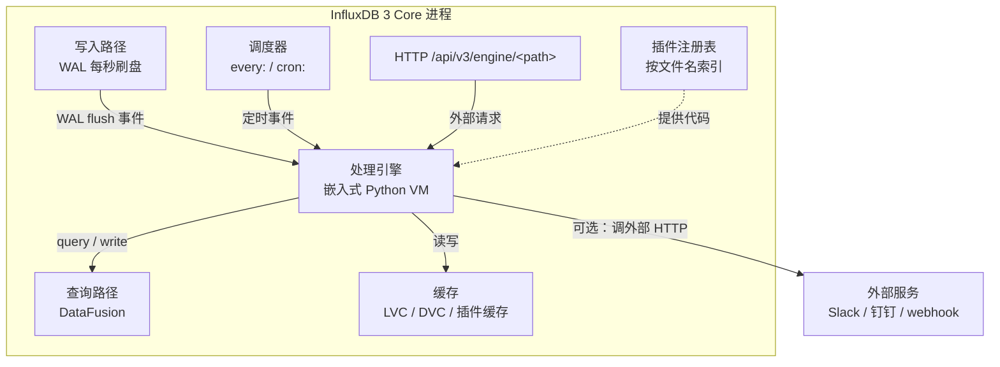
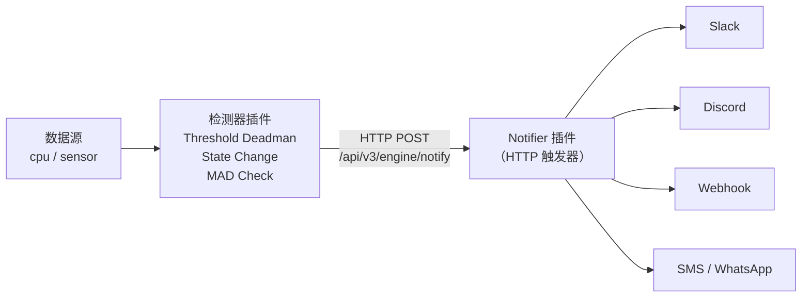
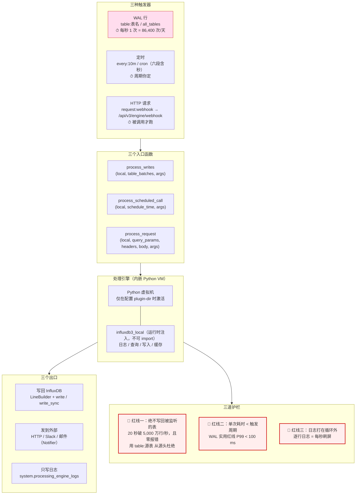
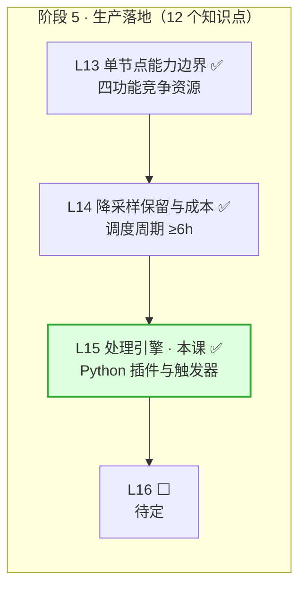

# 第 15 课：处理引擎：Python 插件与触发器

> 阶段 5《生产落地》第 3 课 ｜ 上一课：[第 14 课《降采样、保留策略与成本》](./lesson-14-降采样保留策略与成本.md)
>
> ⚡ **本课是把前两课的「方案」变成「跑起来的系统」的那一课**：L13 定了形态与容量，L14 定了保留期与降采样——但降采样谁来执行？告警谁来发？数据进来时的清洗谁做？答案都是同一个东西：**InfluxDB 3 内嵌的 Python 处理引擎**。L14 只用了它的「降采样」一个能力，本课展开它的通用机制。

## 🎯 本课目标

| 知识点 | 关键点 | 学完你应该能 |
|--------|--------|-------------|
| ① 处理引擎架构 | **内嵌 Python VM**；三种触发器；`influxdb3_local` 共享 API；内存缓存 | 说清处理引擎「跑在数据库里」意味着什么，以及为什么它既是便利也是风险 |
| ② Python 插件与触发器 | 三个入口函数签名；`--plugin-dir` / `gh:` 两种装载方式；`error-behavior` 与 `run_async` | 写一个能跑的 WAL 插件，并说出它的三条红线（耗时 / 递归写回 / 单次可见范围） |
| ③ 内置插件与告警 | 官方插件库；Notifier 是告警的**发送端**；死信检查 | 用官方插件拼出一条「检测 → 抑制 → 发送」的完整告警链路 |

---

## 第一幕：起源与场景引入

L14 结束时，你的方案上已经画好了三层保留：秒级 7 天、分钟级 90 天、小时级 1 年。方案很漂亮。然后运维问了三个问题：

> "**第一，降采样谁跑？** 我再起一个 cron 容器，每小时连数据库查一遍再写回去？那这个容器挂了谁来管？它和数据库之间的网络延迟算谁的？"
>
> "**第二，告警怎么做？** 温度传感器超过 80 度要发钉钉。现在这套是 Prometheus + Alertmanager，换成 InfluxDB 之后是不是得再搭一套？"
>
> "**第三，脏数据怎么办？** 上次那个采集器上报了 `temperature="abc"`，整张表的类型都被锁死了。能不能在它进库之前就拦下来？"

这三个问题，指向同一个答案：**别在外面搭，让代码跑进数据库里。**

你翻文档，看到处理引擎的定义：

> *"The Processing Engine is an **embedded Python virtual machine** that runs inside your InfluxDB 3 Core database."*

**内嵌的 Python 虚拟机。** 不是外挂服务，不是 sidecar，是数据库进程里的一个 Python VM。你把 `.py` 文件放进一个目录，告诉 InfluxDB「写入时调它」或「每小时调它」，它就在数据库内部执行——查数据、写数据、发 HTTP 请求，全在进程内完成，没有网络往返。

这听起来好得不像话。然后你会陆续撞上三件事：

**第一件：默认没开。**

处理引擎只在配置了 `--plugin-dir` 时才激活。而它的默认状态**取决于你怎么装的**：

| 部署方式 | 默认状态 | 配置 |
|---------|---------|------|
| Docker 镜像 | ✅ 已启用 | `INFLUXDB3_PLUGIN_DIR=/plugins` |
| DEB / RPM 包 | ✅ 已启用 | `plugin-dir="/var/lib/influxdb3/plugins"` |
| 二进制 / 源码 | ❌ 未启用 | 没配 `plugin-dir` |

⚠️ 更坑的是**关不掉的方式**：官方 config-options 页明文——

> *"Setting `plugin-dir=""` or `INFLUXDB3_PLUGIN_DIR=""` (empty string) **does not disable** the Processing Engine. You must comment out, remove, or unset the configuration — **not set it to empty**."*

设成空字符串**不管用**。你必须注释掉、删掉或 unset。这是那种"我明明关了啊"的经典现场。

**第二件：触发器有四种写法，选错的代价差 8.6 万倍。**

| 触发器类型 | 规范写法 | 何时触发 |
|-----------|---------|---------|
| WAL 行 | `table:表名` 或 `all_tables` | 数据刷进 WAL 时（**默认每秒一次**） |
| 定时 | `every:10m` 或 `cron:0 0 8 * * *` | 按间隔或 crontab |
| HTTP 请求 | `request:webhook` | 有人请求 `/api/v3/engine/webhook` |

⚠️ 注意这里有个极易被误读的点：**WAL 触发器的触发频率是「每秒一次」，与你写了多少行无关。** 官方原文是 *"when the database flushes data to the Write-Ahead Log (WAL) (by default, every second)"*——触发器绑定的是**刷盘事件**，不是行数。

所以 `every:1d` 一天调 1 次，WAL 触发器一天调 **86,400 次**。差 8.6 万倍。把本该每小时跑一次的活挂到 WAL 上，等于把成本放大 8.6 万倍。

（顺带说一句：2025 年 2 月的官方博客说"one of **four** pre-defined event triggers"，但当前官方文档只有三种——`table:` / `all_tables` 算同一种。这是文档迭代的痕迹，以当前文档为准。）

**第三件：你的插件代码跑在数据库进程里，共享同一个 Python 进程。**

官方 processing engine reference 页原话：

> *"The Processing engine runs **all plugins in the same Python process**. **Changes made by one plugin can affect other plugins.**"*

所有插件共享一个 Python 进程。一个插件改了全局状态，会影响其他插件。这不是 bug，是设计——它换来了零拷贝访问与极低延迟，代价是**隔离性**。

这三件事，就是本课要讲透的。

---

## 第二幕：认知冲突

在给答案之前，先看四个反直觉的事实。

**事实一：WAL 触发器的频率与数据量无关——每秒 1 次，一天 86,400 次。**

从 Prometheus 或流处理（Flink / Kafka Streams）过来的人，直觉是"触发器按数据量触发，数据多就多调几次"。InfluxDB 3 不是：**WAL 触发器绑在"WAL 刷盘"这个事件上，而 WAL 默认每秒刷一次**（L10 已核实）。

| 触发器规格 | 每天调用次数 |
|-----------|------------|
| `table:xxx` / `all_tables` | **86,400** |
| `every:10m` | 144 |
| `every:1h` | 24 |
| `every:6h` | 4 |
| `every:1d` | 1 |

→ 推论：**WAL 插件函数体里每多花 1 毫秒，一天就是 86.4 秒。** 而单次耗时一旦达到 1 秒（= 触发周期），队列就会单调增长直到 OOM——这是硬边界，不是性能建议。

**第二幕 · 事实二：🔴 WAL 插件写回"被监听的表"= 20 秒指数爆炸，且不报任何错。**

这是本课最危险的一条。假设你用 `all_tables` 监听全库，插件把结果写回 `cpu_alerts` 表：

- 第 1 秒：外部写 100 行 → 插件看到 100 行 → 写回 100 行
- 第 2 秒：flush 的是「外部 100 + 插件写回 100」= 200 行 → 写回 200 行
- 第 3 秒：400 行 → 写回 400 行
- ……
- **第 15 秒：单秒要处理 164 万行**（破百万）
- **第 20 秒：单秒要处理 5,243 万行**
- **第 21 秒：破 1.05 亿行**

规律是 **第 n 秒 = 100 × 2ⁿ⁻¹**（第 1 秒还没翻倍，翻倍从第 2 秒开始）。

这不是"变慢"，是**几十秒内任何规模的实例都会被自己写死**，而且日志里没有任何异常——插件一直在正常工作，只是工作量在指数增长。

官方示例插件里有一行容易被当成凑字数的代码，其实正是防这个的：

```python
# example to skip the table we're later writing data into
if table_batch["table_name"] == "some_table":
    continue
```

正解是从源头杜绝：**用 `--trigger-spec "table:源表"` 只监听源表**，而不是用 `all_tables` + 手动过滤。

**事实三：`process_writes` 收到的不是"刚才写的那行"，是"这一秒内 flush 的全部数据"。**

名字叫 `process_writes`（复数），参数是 `table_batches`（复数）。它给你的是**这一批 WAL flush 里的所有表、所有行**——不是单条记录。

这个区别决定了你不能用它做"逐点处理"的心理模型。正确的模型是：**每秒一次的微批处理**。所以：

- 逐行打日志 = 日志风暴（每秒 N 条 × 86,400 秒）
- 逐行做 I/O（调外部 API、查库）= 必然超时

而且官方明确：写调用是**缓冲的**，插件返回时才一次性 flush：

> *"`write` and `write_to_db` queue writes; queued writes are **flushed once the plugin returns**."*

**事实四：`gh:` 不是 GitHub 专用，而且**每次触发器启动都会重新拉取**。**

官方文档明文：

> *"The `gh:` prefix **isn't GitHub-specific**... `--plugin-repo` accepts **any HTTP/HTTPS URL** that serves raw plugin files."*

`gh:influxdata/downsampler/downsampler.py` 实际解析成 `https://raw.githubusercontent.com/influxdata/influxdb3_plugins/main/influxdata/downsampler/downsampler.py`。

⚠️ 关键风险在下一句：

> *"InfluxDB 3 Core fetches the plugin at trigger creation time (to validate it), and again **each time the trigger starts**—for example, on server startup or when you re-enable a disabled trigger."*

**每次服务重启、每次重新启用触发器，都会去远端重新拉一次代码。** 这意味着：
- 上游仓库改了代码 → 你重启一次服务，跑的代码就变了（**供应链风险**）
- 上游仓库挂了 → 你的触发器起不来
- 生产环境应该 `--plugin-repo` 指向内部镜像，或把插件固化到本地 `--plugin-dir`

---

## 第三幕：层层揭示

### 知识点 1：处理引擎架构 —— 数据库里的 Python 虚拟机

#### 一句话定义

**处理引擎（Processing Engine）**：嵌入 InfluxDB 3 进程的 Python 虚拟机，让你用 Python 代码响应**数据写入**、**定时事件**、**HTTP 请求**三类事件，在数据库内部完成转换、富化、聚合与告警。

#### 为什么要在数据库里跑 Python

先回答"为什么不外面跑"。传统做法（这是 L13 之前我们自己的默认方案）是这样：

```
采集器 → InfluxDB ←── 查询 ── 外部 Python 服务 ── 写回 ──→ InfluxDB
                                    ↓
                              告警 / 降采样 / 清洗
```

这个架构有四个固定的代价：

1. **多一个要运维的组件**：它有自己的部署、扩缩容、重启、日志、监控
2. **网络往返**：读一次、写一次，两次网络；数据量大时这个开销超过计算本身
3. **一致性窗口**：查到的数据与写回的数据之间有时间差，并发时会打架
4. **故障域割裂**：数据库活着但处理服务挂了，数据照写但没人处理——而且**没有报错**

处理引擎把这条链压缩成进程内调用。官方 reference 页列的设计收益：

> *"**Embedded execution**: Code runs in the same process space as the database server · **Direct data access**: **Zero-copy access** to data · **Cache integration**: Access to system caches including Last values and Distinct values"*

零拷贝是关键词：`process_writes` 拿到的 `table_batches` 就是 WAL 里已经在内存中的那批数据，不需要序列化、不需要跨进程、不需要网络。

#### 架构全景



三种事件进入同一个 Python 进程，插件通过 `influxdb3_local` 这个注入对象访问数据库。

#### 启用与关闭：三种部署形态的默认状态不同

处理引擎**只在配置了 `--plugin-dir` 或 `INFLUXDB3_PLUGIN_DIR` 时激活**：

| 部署方式 | 默认状态 | 配置值 |
|---------|---------|--------|
| Docker 镜像 | ✅ 已启用 | `INFLUXDB3_PLUGIN_DIR=/plugins` |
| DEB / RPM 包 | ✅ 已启用 | `plugin-dir="/var/lib/influxdb3/plugins"` |
| 二进制 / 源码 | ❌ 未启用 | 未配置 |

手动启用（二进制 / 源码场景）：

```bash
influxdb3 serve \
  --node-id node0 \
  --object-store file \
  --data-dir ~/.influxdb3 \
  --plugin-dir ~/.plugins
```

⚠️ **两个容易踩的坑**：

**坑一：二进制安装时 `python/` 目录不能丢。** 官方原话——

> *"The `influxdb3` binary requires the adjacent `python/` directory to function. If you manually extract from tar.gz, keep them in the same parent directory... Add the parent directory to your PATH; **do not move the binary out of this directory**."*

（这条在 L3 已核实过一次，此处是它在处理引擎场景下的具体后果：二进制被单独挪走 → 处理引擎起不来。）

**坑二：设成空字符串关不掉。** 前面引过官方原文，这里给三种正确姿势：

```bash
# Docker：自定义 entrypoint 里 unset
docker run --entrypoint /bin/sh influxdb:3-core \
  -c 'unset INFLUXDB3_PLUGIN_DIR && exec influxdb3 serve --object-store memory'

# systemd（DEB/RPM）：注释掉配置行
sudo nano /etc/influxdb3/influxdb3-core.conf
# plugin-dir="/var/lib/influxdb3/plugins"     ← 行首加 #
sudo systemctl restart influxdb3-core
```

关闭后的行为（官方原文）：Python 环境与 PyO3 绑定不初始化、插件相关操作返回 *"No plugin directory configured"* 错误、服务器以更低资源占用运行。

> 📌 **安全建议**：不需要插件的生产实例，应当关闭处理引擎。理由不只是省资源——处理引擎意味着"能在数据库进程里执行任意代码"，这是**攻击面**。官方提供了更细粒度的开关：
>
> ```
> --restrict-plugin-triggers-to  wal | schedule | request
> ```
>
> 可以只放开某几种触发器类型（config-options 原文：*"Restrict plugin triggers to one or more trigger types. Provide one or more of `wal`, `schedule`, or `request`."*）。例如只跑定时任务的生产库，就配 `--restrict-plugin-triggers-to schedule`。

#### 插件与触发器：两个概念必须分清

官方术语定义：

> *"**Plugin**: A plugin is a **Python function** that has a signature compatible with a processing engine trigger.
> **Trigger**: When you create a trigger, you specify a **plugin, a database, optional arguments, and a trigger specification**, which defines when the plugin is executed and what data it receives."*

一句话：**插件是代码，触发器是"什么时候用哪些参数跑这段代码"的配置。**

这个分离带来一个很实用的能力：**同一个插件可以挂多个触发器，参数不同**。比如官方 `threshold_deadman_checks` 插件，你可以建两个触发器，一个查 CPU 阈值 90，一个查内存阈值 80，代码是同一份。

#### 三种触发器对照

| 类型 | trigger-spec | 入口函数 | 触发时机 | 典型用途 |
|------|-------------|---------|---------|---------|
| 数据写入 | `table:表名` / `all_tables` | `process_writes` | WAL flush（默认每秒） | 实时转换、写入时校验、阈值告警 |
| 定时 | `every:10m` / `cron:0 0 8 * * *` | `process_scheduled_call` | 按间隔或 crontab | 周期聚合、报表、**死信检查** |
| HTTP 请求 | `request:webhook` | `process_request` | 收到 HTTP 请求 | 自定义 API、webhook 接收、历史回填 |

⚠️ **cron 支持秒级精度**：官方示例 `"cron:0 0 8 * * *"` 是 6 段（秒 分 时 日 月 周），不是标准 5 段 crontab。写 5 段会解析失败。

#### `influxdb3_local`：唯一的数据库入口

官方 API reference 明文：

> *"**Nothing in this API is importable from a plugin**—the runtime injects the objects instead. InfluxDB passes `influxdb3_local` (an `InfluxDB3Local` instance) as the first argument to every trigger entry point and **installs `LineBuilder` into Python builtins** before the plugin runs."*

**`influxdb3_local` 和 `LineBuilder` 都不需要 import，也不能 import。** 这是初学者最常卡住的地方——本地跑 `python my_plugin.py` 必然 `NameError: name 'LineBuilder' is not defined`，因为它只在处理引擎运行时存在于 builtins 里。

它提供五组能力：

| 能力 | 方法 | 要点 |
|------|------|------|
| 日志 | `.info()` / `.warn()` / `.error()` | 三个级别都写进 `system.processing_engine_logs`，可用 SQL 查 |
| 查询 | `.query(sql, args, database)` | **只支持 SQL**；返回 `list[dict]`；`database` 默认触发器所在库 |
| 写入 | `.write()` / `.write_to_db()` / `.write_sync()` / `.write_sync_to_db()` | 前两个**缓冲**，插件返回时才 flush；后两个同步 |
| 缓存 | `.cache.put/get/delete` | 触发器级（默认）与全局级（`use_global=True`）两个命名空间 |
| 构造行 | `LineBuilder`（builtins） | 自动处理转义与纳秒时间戳 |

**查询的四条硬约束**（官方 API reference 原文，全部是明文）：

1. **只支持 SQL**——`query()` 里写 InfluxQL 会失败
2. **参数值必须是字符串**——*"Parameter values must be strings; passing an int or float raises `TypeError`"*
3. **返回行的类型白名单**——只支持 `Int64` / `UInt64` / `Float64` / `Boolean` / `Utf8` / `LargeUtf8` / `Timestamp(ns)` / `Dictionary of Utf8`；其他 Arrow 类型 **raise `ValueError`**
4. **时间戳是纳秒整数**；tag 列（字典编码）会materialize 成字符串；SQL NULL 是 `None`

第 2 条尤其容易踩：你想查 `WHERE value > $threshold`，得写 `{"threshold": "90"}` 而不是 `{"threshold": 90}`。

#### 缓存：跨执行保持状态

```python
# 触发器级（默认）：同一个 trigger 的多次执行之间共享
influxdb3_local.cache.put("last_alert_time", 1234.5)
t = influxdb3_local.cache.get("last_alert_time", default=0)

# 全局级：同一进程内所有 trigger 共享
influxdb3_local.cache.put("config", {"v": 1}, use_global=True)
cfg = influxdb3_local.cache.get("config", use_global=True)

# 带 TTL（秒）
influxdb3_local.cache.put("api_resp", data, ttl=300)
```

⚠️ 三条官方明文的限制：

1. **重启即清空**——*"The server clears both caches on restart."* 缓存不是持久化，别拿它当唯一状态源
2. **生产环境默认不过期**——*"production caches persist values indefinitely unless a `ttl` is set"*（而 `influxdb3 test` 的测试缓存默认 30 分钟 TTL）。生产上不设 TTL = 内存单调增长
3. **过期是读时清理**——*"Individual expired entries are dropped on read regardless."* 不读就不会被清掉

这就是知识点 3 里"告警抑制"的实现基础。

### 知识点 2：Python 插件与触发器 —— 三个签名与三条红线

#### 一句话定义

**插件（plugin）是一个 Python 文件，里面定义了一个与触发器类型匹配的入口函数；触发器（trigger）是对「哪个插件 + 哪个库 + 什么参数 + 何时触发」的具名配置。** 二者分离，一份代码可挂多个触发器。

#### 三个入口函数签名（官方 API reference 原文）

```python
# ① 数据写入（WAL）触发
def process_writes(
    influxdb3_local,
    table_batches: Sequence[TableBatch],
    args: Mapping[str, str] | None = None,
) -> None: ...

# ② 定时触发
def process_scheduled_call(
    influxdb3_local,
    schedule_time: datetime,
    args: Mapping[str, str] | None = None,
) -> None: ...

# ③ HTTP 请求触发
def process_request(
    influxdb3_local,
    query_params: Mapping[str, str],
    request_headers: Mapping[str, str],
    request_body: bytes,
    args: Mapping[str, str] | None = None,
): ...
```

四条来自官方原文的注意点：

**一、`schedule_time` 是「朴素 datetime」，用服务器本地时区。**

> *"`schedule_time`: the trigger's fire time as a naive datetime. The engine builds the value with `datetime.fromtimestamp()`, so it is expressed in **the server's local timezone** and truncated to whole seconds."*

服务器时区是什么，它就是什么时区。跨时区部署的集群要小心（回扣 L8 的 `DATE_BIN` origin 时区问题）。

**二、`request_headers` 的 key 是小写，且 `Authorization` 头被剥掉。**

> *"Header names are lowercased, and **the client's `Authorization` header is stripped** before the plugin sees it."*

→ **别在 HTTP 插件里自己实现"校验 token"**——你根本看不到那个头。端点自身的认证由 InfluxDB 处理，插件只管业务逻辑。

**三、`request_body` 是 `bytes`，不是 dict。** 要 JSON 就自己 `json.loads()`。

> ⚠️ 注意一处**文档与仓库不一致**：官方 API reference 里 HTTP 入口叫 `process_request`，而 `influxdb3_plugins` 仓库的 README 与 DeepWiki 里写的是 `process_http_request`。**以官方 API reference 的 `process_request` 为准**（那是当前文档，仓库文档滞后）。如果你照抄 GitHub 上的旧插件代码发现不触发，先检查函数名。

**四、`process_request` 的返回值有严格约定。**

官方原文列了四种合法形式：

1. Flask 风格响应对象——**鸭子类型**，必须定义 `__flask_response__()` 返回 True、`status_code` 属性、`headers` 映射、`get_data()` 返回 `str`。⚠️ **真正的 `flask.Response` 会被拒绝**（它没有 `__flask_response__`，且 `get_data()` 返回 bytes）
2. `(body, status, headers)` 元组（Flask 约定）
3. 裸字符串 / 字典 / 列表：字典与列表 JSON 编码（`application/json`），字符串按 `text/html`
4. **其他任何返回值（含 `None`）→ HTTP 500**，错误为 `Unsupported return type from Python function`

⚠️ 还有一个隐蔽陷阱：*"**Returning bytes is accepted as an iterable but yields an empty body**, because its items are integers; encode to str instead."* 返回 `b"..."` 不会报错，但响应体是空的。要返回字节内容请先 `.decode()`。

#### `table_batches` 的数据形状

官方原文：

> *"A `TableBatch` is a **plain dictionary**—read it with `table_batch["table_name"]` and `table_batch["rows"]`, **not attribute access**."*

```python
[
  {
    "table_name": "cpu",
    "rows": [
      {"host": "web-01", "usage_percent": 92.5, "time": 1710000000000000000},
      ...
    ]
  },
  ...
]
```

要点：

- **只能用 `["key"]`，不能 `.key`**（它是 dict，不是对象）
- 每行包含表 schema 里的**所有列**（tag + field + time），该行没值的列是 **`None`**
- **time 列是纳秒整数**
- tag 与 field **混在同一个 dict 里**，没有 `row["tags"]["host"]` 这种嵌套结构

> ⚠️ **这里有个流传很广的错误写法。** InfluxData 官方博客（2025-03《Preventing Alert Storms》）里的示例插件写的是 `row["tags"]["host"]` 与 `row["fields"][metric_field]`——**这与官方 API reference 的明文定义冲突**。按 API reference，行是扁平 dict，应该是 `row["host"]`。
>
> 这不是小事：照抄博客写法会得到 `KeyError: 'tags'`，而`KeyError` 在 WAL 插件里只会打一条日志、不会让触发器停下——你会看到"插件没报错但就是不产生告警"的诡异现象。
>
> 稳妥写法（两种都兼容）：
> ```python
> host = row.get("host") or (row.get("tags") or {}).get("host")
> ```
> **建议按官方 API reference 的扁平结构写**，并在上线前用 `influxdb3 test` 验证。

#### 写数据：`LineBuilder` 与四种 write

```python
line = LineBuilder("cpu_alerts")
line.tag("host", "web-01").float64_field("usage", 92.5)
line.time_ns(1710000000000000000)
influxdb3_local.write(line)                    # 写当前库（缓冲）
influxdb3_local.write_to_db("other_db", line)  # 写指定库（缓冲）
influxdb3_local.write_sync(line, no_sync=True) # 同步写当前库
```

| 方法 | 目标库 | 时机 |
|------|--------|------|
| `write(line)` | 触发器所在库 | **缓冲**，插件返回时 flush |
| `write_to_db(db, line)` | 指定库 | **缓冲**，插件返回时 flush |
| `write_sync(line, no_sync)` | 当前库 | **同步**，插件运行中就写 |
| `write_sync_to_db(db, line, no_sync)` | 指定库 | **同步** |

⚠️ 三条硬约束：

1. **不能写 `_internal` 库**——*"All write methods take a `LineBuilder` line and **raise an exception when the target database is `_internal`**."*
2. `write_sync` 的 `no_sync` 参数**必填**（没有默认值）：`True` = 不等 WAL 同步
3. 缓冲写的顺序——*"queued writes are flushed once the plugin returns, so they **land after any `write_sync` calls** the plugin made."* 混用两种时，同步写会先落盘

`LineBuilder` 的字段方法与异常（官方原文）：

| 方法 | 说明 |
|------|------|
| `tag(key, value)` | tag；value 会被字符串化 |
| `int64_field` / `uint64_field` / `float64_field` | 整数字段 / 无符号（负值 raise `ValueError`）/ 浮点 |
| `string_field(key, value)` | 字符串字段，**引号与反斜杠自动转义** |
| `bool_field(key, value)` | 布尔，渲染成 `t` / `f` |
| `time_ns(ts)` | 纳秒时间戳 |
| `build()` | 渲染成 line protocol 字符串 |

异常：`InvalidMeasurementError`（measurement 名含空格）/ `InvalidKeyError`（tag 或 field key 为空、含空格/逗号/等号）/ `InvalidLineError`（没加任何 field 就 `build()`）。

> 📌 **回扣 L7**：`LineBuilder` 的链式调用顺序决定了 line protocol 里 tag 的书写顺序，而 L7 已核实 **Core 中首次写入决定物理列顺序且不可更改**。所以插件写出的第一行的 tag 顺序，会永久固定该表的列顺序——**插件也要遵守"按查询频率排 tag"这条规则**。

#### 装载插件：两条路

**路一：本地 `--plugin-dir`（生产推荐）**

把 `.py` 放进 `--plugin-dir` 目录，创建触发器时 `--path` 写相对路径：

```bash
# 单文件插件：直接给 .py 文件名
influxdb3 create trigger \
  --trigger-spec "table:cpu" \
  --path "cpu_alert.py" \
  --database mydb \
  cpu_alert_trigger

# 多文件插件：给含 __init__.py 的目录名
influxdb3 create trigger \
  --trigger-spec "every:1h" \
  --path "my_plugin_dir" \
  --database mydb \
  multi_file_trigger
```

官方 CLI reference 明文：*"For single-file plugins, provide just the `.py` filename... For multi-file plugins, provide the directory name containing `__init__.py`. When not using `--upload`, the server resolves paths **relative to the configured `--plugin-dir`**."*

开发期也可以从本地直接上传（需 admin token）：

```bash
influxdb3 create trigger \
  --trigger-spec "every:10s" \
  --path "/local/path/to/plugin.py" \
  --upload \
  --database metrics \
  my_trigger
```

**路二：`gh:` 远程拉取（方便但有供应链风险）**

```bash
influxdb3 create trigger \
  --trigger-spec "every:5m" \
  --path "gh:influxdata/system_metrics/system_metrics.py" \
  --database mydb \
  system_metrics
```

第二条路的三条官方明文行为，都已在第二幕事实四讲过：`gh:` 不限于 GitHub、**每次触发器启动都重新拉取**、只有单文件插件支持 `gh:`（多文件必须本地上传）。

> 📌 生产建议：`--plugin-repo` 指向**内部镜像**，或者把插件固化进镜像的 `--plugin-dir`。把生产可用性和 `raw.githubusercontent.com` 绑在一起是不可接受的。

#### 触发器的执行控制：三个旋钮

```bash
influxdb3 create trigger \
  --trigger-spec "table:cpu" \
  --path "cpu_alert.py" \
  --database mydb \
  --trigger-arguments "threshold=90,notify=slack" \
  --error-behavior log \        # log（默认）/ retry / disable
  --run-asynchronous \          # 允许多个实例并发
  cpu_alert
```

**① `--error-behavior`（出错怎么办）**

| 值 | 行为 | 适用 |
|----|------|------|
| `log`（默认） | 记日志，继续 | 大多数场景；出错不该影响写入路径 |
| `retry` | 出错后立即重试 | ⚠️ 危险：如果错误是永久性的（代码 bug / 外部服务不可达），重试等于打满 CPU |
| `disable` | 出错后自动禁用触发器 | 希望"坏了就停"、避免雪崩 |

> ⚠️ **默认 `log` 意味着插件出错时数据照常写入，只是处理没发生。** 这不会有任何告警 —— 监控插件健康度必须查 `system.processing_engine_logs`（见知识点 3）。

**② `--run-asynchronous`（同步 vs 并发）**

默认**同步**：同一触发器的下一次执行要等上一次跑完。加了这个 flag 才允许多实例并发。

⚠️ WAL 触发器上加 `--run-asynchronous` 要格外小心：每秒一次 + 允许并发 = 插件慢一点就会堆积出一堆并发实例。官方在 3.11 专门加了 **capped async trigger concurrency**（限制异步触发器并发数）来应对这个问题——这说明它确实是个真实风险。

**③ `--trigger-arguments`（参数化）**

```bash
--trigger-arguments "threshold=90,notify_email=admin@example.com"
```

插件里通过 `args` 拿到，**值的类型全是字符串**（`Mapping[str, str]`），要数字得自己 `float()` / `int()`：

```python
def process_scheduled_call(influxdb3_local, schedule_time, args=None):
    threshold = float(args.get("threshold", "90")) if args else 90.0
```

> 📌 这是**本课最重要的一条工程实践**：阈值、webhook 地址、表名都走 `--trigger-arguments`，不要硬编码。这样一份插件代码能挂多个触发器，改阈值也不用改代码。

#### 插件的取消信号（容易被忽略）

官方 API reference 明文：

> *"Once the current plugin run has been cancelled—**the server is shutting down, or the trigger was disabled or deleted**—the logging, write, and query methods raise **`KeyboardInterrupt`**. `KeyboardInterrupt` subclasses `BaseException` rather than `Exception`, so a plugin's `except Exception` handler **does not swallow it**, and a long-running loop unwinds instead of hanging the shutdown or the disable."*

这是**精心设计**的：取消信号用 `KeyboardInterrupt`（`BaseException` 子类），所以 `except Exception` 吞不掉它，长循环能正常退出，不会卡住服务关闭。

→ 推论：**别写 `except BaseException`**，那会把取消信号也吞掉，导致服务关不掉。

配套的一个坑在异常处理：

> *"The `QueryError` class is defined by the engine's native extension module, which **a plugin cannot import**, and the name is not injected into plugin globals or builtins. `except QueryError` therefore raises `NameError`. **Catch `Exception` instead and inspect `type(err).__name__`**"*

```python
try:
    results = influxdb3_local.query("SELECT * FROM cpu")
except Exception as err:
    if type(err).__name__ == "QueryError":
        influxdb3_local.error("query failed:", err)
```

#### 三条红线（本课核心的可执行结论）

| # | 红线 | 依据 | 违反后果 |
|---|------|------|---------|
| 1 | **单次耗时 < 触发周期**；WAL 插件实用红线 **P99 < 100 ms** | WAL 每秒触发（官方默认），耗时达周期即队列单调增长 | 内存堆积 → OOM |
| 2 | **绝不写回被监听的表** | 实验 A 对照 4 实测：15 秒破百万 → 20 秒 5,000 万 → 21 秒 1 亿行/秒 | 指数爆炸，无任何报错 |
| 3 | **WAL 插件只做纯内存判断**，不查历史、不调外部 API | 86,400 次/天 × 每次 I/O | I/O 放大到不可承受 |

需要查历史 / 调外部 / 跑模型 → 一律放 `schedule`；需要跑几十秒的重活 → `schedule` + `--run-asynchronous`。

### 知识点 3：内置插件与告警 —— 检测、抑制、发送三段式

#### 一句话定义

**官方插件库（Plugin Library）**是 InfluxData 维护的一套开箱即用的插件，覆盖四类能力：**降采样与聚合**（L14 已用）、**异常检测**、**预测**、**通知发送**。拼装一条告警链路需要分清三段：**检测器**（发现异常）→ **抑制器**（去重，防告警风暴）→ **发送器**（送达渠道）。

#### 官方插件库一览

官方文档页（Core 版）列出的官方插件共 11 个，按用途分组：

| 插件 | 用途 | 依赖 | 支持的触发器 |
|------|------|------|------------|
| **Basic transformation** | 数据转换与富化（改名、改值、单位换算） | `pint` | scheduled + data-write |
| **Downsampler** | 降采样聚合（L14 已用） | — | scheduled + **http** |
| **Notifier** | ⭐ **告警发送端**（Slack / Discord / webhook / SMS / WhatsApp） | `httpx`, `twilio` | **http** |
| **Threshold deadman checks** | ⭐ 阈值检测 + **死信检查**（数据不来就告警） | `requests` + Notifier | scheduled + data-write |
| **State change** | 状态变更与阈值检测 | `requests` + Notifier | scheduled + data-write |
| **MAD-based anomaly detection** | 基于中位数绝对偏差的异常检测 | `requests` + Notifier | data-write |
| **Stateless ADTK detector** | 用 ADTK 做异常检测（无状态） | `requests`, `adtk`, `pandas` | scheduled |
| **Prophet forecasting** | 用 Facebook Prophet 做预测 | `prophet`, `pandas` | scheduled + http |
| **Forecast error evaluator** | 评估预测准确度 | `pandas`, `requests` | scheduled |
| **System metrics** | ⭐ 采集**宿主机** CPU / 内存 / 磁盘 / 网络 | `psutil` | scheduled |
| **InfluxDB to Iceberg** | 导出到 Iceberg 数据湖 | `pandas`, `pyarrow`, `pyiceberg` | scheduled + http |

> 📌 数量提示：InfluxData 官网的 Plugin Directory 页面显示 **23 个**官方插件，而 Core 文档页列了 **11 个**。差异来源：官网目录还包含 MQTT / Kafka / AMQP Subscriber、Schema Validator、Import、NWS Weather Sampler、River 系列等较新或偏集成的插件。**两者都是官方口径，只是更新节奏不同**，以你实际参考的页面为准。

⚠️ **一个重要的 SKU 限制**：Amazon Timestream for InfluxDB 的官方文档明确写着——

> *"**Custom plugins are not currently supported.** Only InfluxData certified plugins listed in this documentation can be deployed."*

**托管形态（Timestream）不让跑自定义插件**，只能跑认证插件。自建的 Core / Enterprise 没有这个限制。选型时若"必须自定义插件"是硬需求，这条会直接影响形态选择（回扣 L13 的判据表）。

#### 🔴 告警的关键认知：Notifier 是「发送端」，不是「检测器」

这是本课**最容易搞混的一点**，也是官方仓库依赖图表达的核心结构：



官方仓库的插件依赖表显示：**Threshold and Deadman Checks、MAD Anomaly Detection、ADTK Anomaly Detection、State Change Monitor、Forecast Error Evaluator 五个插件的 `required_plugins` 都是 `Notification sender`**（即 Notifier）。

也就是说：

- **Notifier 自己是 HTTP 触发器**（`request:notify`），暴露 `/api/v3/engine/notify` 端点
- **检测器插件通过 HTTP 调用它**，把告警内容 POST 过去
- 所以**装告警必须装两个插件**：一个检测器 + 一个 Notifier

这解释了一个常见困惑：*"我装了 Threshold Deadman Checks，配好了阈值，为什么没收到 Slack？"* —— 因为**没装 Notifier，检测器算出了告警但没人投递**。

> 📌 **架构上的巧思**：检测与发送解耦，意味着五个检测器共用一套渠道配置。换 Slack 为钉钉，只改 Notifier 一处，不用改五个检测器。

#### 死信检查（deadman check）：告警的另一半

官方文档对 scheduled 触发器的描述里专门点名了这个用途：

> *"Scheduled... This trigger type is useful for data collection and **deadman monitoring**."*

**死信检查** = "数据不来就告警"。它补的是阈值告警的盲区：

| 告警类型 | 检测什么 | 盲区 |
|---------|---------|------|
| 阈值告警 | 值越界（CPU > 90%） | **采集器挂了 → 没数据 → 不越界 → 静默** |
| **死信检查** | **数据停止到达**（5 分钟没新数据） | 值一直正常但采集断了 |

⚠️ 运维上**死信检查往往比阈值告警更重要**：阈值告警告诉你"值不对"，死信检查告诉你"你根本收不到值了"。一个只配阈值告警的系统，在采集链路整体断裂时会表现为"一片祥和"。

官方 `threshold_deadman_checks` 插件把两者合在一个插件里（名字就写着两件事），配置示例：

```bash
influxdb3 create trigger \
  --database mydb \
  --path "gh:influxdata/threshold_deadman_checks/threshold_deadman_checks_plugin.py" \
  --trigger-spec "every:10m" \
  --trigger-arguments "measurement=cpu,senders=slack,field_aggregation_values=temp:avg@>=30-ERROR,window=10m,trigger_count=3,deadman_check=true,slack_webhook_url=$SLACK_WEBHOOK_URL" \
  threshold_scheduler
```

这个命令行里有几个值得注意的参数：

- `field_aggregation_values=temp:avg@>=30-ERROR`：**字段:聚合方式@比较符阈值-级别**
- `window=10m`：聚合窗口
- `trigger_count=3`：连续 3 次满足才告警（**这是内置的抑制机制**，避免单次抖动就发）
- `deadman_check=true`：开启死信检查

#### 告警抑制：用插件缓存防告警风暴

即使有 `trigger_count`，还有一种场景会炸：**同一个故障在一分钟内产生上千条告警**（比如一台机器 CPU 打满，每秒上报一次，每次都超阈值）。

解法是**冷却期（cooldown）**，用知识点 1 讲的插件缓存实现：

```python
def process_writes(influxdb3_local, table_batches, args=None):
    threshold = float(args.get("threshold", "90")) if args else 90.0
    cooldown  = int(args.get("cooldown_seconds", "300")) if args else 300
    field     = args.get("metric_field", "usage_percent") if args else "usage_percent"

    for table_batch in table_batches:
        # 红线 2：跳过自己写回的表，杜绝递归
        if table_batch["table_name"] == "alerts":
            continue

        hits = 0
        for row in table_batch["rows"]:
            host  = row.get("host")
            value = row.get(field)
            if host is None or value is None or value <= threshold:
                continue

            key = f"{host}:high_value"
            last = influxdb3_local.cache.get(key)
            now  = row["time"] / 1_000_000_000      # 纳秒 → 秒

            if last is not None and (now - last) < cooldown:
                continue                            # 冷却期内，抑制

            influxdb3_local.cache.put(key, now)     # 记录本次告警时间
            line = LineBuilder("alerts")
            line.tag("host", str(host)).float64_field("value", float(value))
            influxdb3_local.write(line)
            hits += 1

        # 红线 1/3：只打汇总，不打逐行
        if hits:
            influxdb3_local.info(f"alerts written: {hits}")
```

⚠️ 注意缓存 key 的用法：这里用 `f"{host}:high_value"` 而不是全局一把锁 —— **按（主机 + 告警类型）粒度抑制**，A 机器告警不会把 B 机器的告警也吞掉。

配套的两个坑：

1. **缓存重启即清空**（官方明文）→ 服务重启后第一轮所有告警都会重发一次。生产上可考虑给 `put` 加 TTL 让状态自动收敛
2. **不设 TTL 则生产缓存永不过期**（官方明文）→ 主机下线后 key 会永久留在内存。建议设一个较长的 TTL（如 24h）

#### 监控插件本身：日志在哪

所有 `influxdb3_local.info/warn/error` 都会写入 `_internal` 库的 `system.processing_engine_logs` 表，**可以用 SQL 查**：

```sql
-- 查最近 50 条插件日志
SELECT * FROM system.processing_engine_logs
ORDER BY time DESC
LIMIT 50
```

（查询方式：`influxdb3 query --database _internal "..." --token $ADMIN_TOKEN`）

另有两张系统表用于运维可见性：

| 系统表 | 内容 | 备注 |
|--------|------|------|
| `system.processing_engine_logs` | 插件打的 info/warn/error | 排障第一站 |
| `system.plugin_files` | 已加载的插件文件（`plugin_name` / `file_name` / `file_path` / `size_bytes` / `last_modified`） | 确认"跑的是不是我以为的那份代码" |
| `system.processing_engine_trigger_arguments` | 触发器的配置参数 | 3.3+ 引入；审计"当前线上阈值是多少" |

CLI 也有等价命令：

```bash
influxdb3 show plugins --token $ADMIN_TOKEN
influxdb3 show plugins --format json --token $ADMIN_TOKEN
```

> 📌 **`system.plugin_files` 在 `gh:` 场景下格外有用**：因为 `gh:` 插件每次启动重新拉取，用这张表确认 `last_modified` 与 `size_bytes`，能验证线上跑的到底是哪一版代码。

#### 插件依赖管理

插件若需要第三方包（pandas / requests / psutil 等）：

```bash
# 装单个 / 多个
influxdb3 install package pandas
influxdb3 install package pint pandas requests

# 从 requirements.txt 装
influxdb3 install package -r requirements.txt

# HTTP API（适合 CI/CD）
curl -X POST "http://localhost:8181/api/v3/configure/plugin_environment/install_packages" \
  --header "Authorization: Bearer AUTH_TOKEN" \
  --header "Content-Type: application/json" \
  --data '{"packages": ["pandas", "requests", "numpy"]}'
```

⚠️ 三条官方明文注意点：

1. **必须用 InfluxDB 3 自带的 Python 建虚拟环境**，不能用系统 Python——*"Creating a virtual environment with the system Python (for example, using `python -m venv`) can lead to runtime errors and plugin failures."*
2. **`--package-manager` 在 Core 3.10 起已废弃**——*"Python and pip are bundled with InfluxDB 3 Core, and pip is always used for plugin dependency installation. The server still starts if you set this option, but prints a deprecation warning."* 但 `disabled` 值仍然有效（继续阻止安装，返回 403）
3. **安全加固姿势**：先装依赖，再以 `--package-manager disabled` 启动

```bash
influxdb3 install package pandas requests numpy
influxdb3 serve --plugin-dir ~/.plugins --package-manager disabled
```

#### 插件路径安全

官方在 3.6.0 加入路径校验，防目录穿越攻击。被拦截的三类路径：

- 含父目录引用：`../` 、`../../`
- 绝对路径：`/etc/passwd`、`/tmp/malicious.py`
- 逃出插件目录的符号链接

→ 推论：**所有插件必须放在 `--plugin-dir` 内**，不能通过软链指向外面的代码。这是"能执行任意代码"这一能力应有的配套约束。

---

## 第四幕：实操验证

> 🧪 **本课实验实跑情况**：实验 A（触发器频次与资源占用模拟器）与实验 B（插件静态检查器）**均已在本机 Python 3.11.15 实跑**，下面的输出逐字回贴；实验 C（真机跑通插件与告警）因编写环境无 Docker 未实跑，已改为「判断成功的标准」+ ⏳ 标注。
>
> 运行方式（PowerShell）：
> ```powershell
> $env:PYTHONIOENCODING="utf-8"
> & 'C:\Users\v_wypgwu\.local\bin\python3.11.exe' '.\assets\l15_trigger_freq_sim.py'
> & 'C:\Users\v_wypgwu\.local\bin\python3.11.exe' '.\assets\l15_plugin_lint.py'
> ```

### 实验 A：触发器调用频次与资源占用模拟器（✅ 本机实跑）

**这个实验回答一个问题**：选哪种触发器，到底差多少？

脚本：[l15_trigger_freq_sim.py](../assets/l15_trigger_freq_sim.py)（5 组对照，纯标准库）

```python
# -*- coding: utf-8 -*-
"""
第 15 课 实验 A：触发器调用频次与资源占用模拟器
==========================================================================
目的：把「选哪种触发器」这个抽象决定，翻译成两个运维能感知的数字：
      ① 每天被调用多少次   ② 占掉多少 CPU 时间 / 会不会积压

纯标准库，不依赖 Docker，可直接接 CI。

--------------------------------------------------------------------------
⚠️ 假设值标注（诚实说明）
--------------------------------------------------------------------------
本脚本中**不依赖任何假设**的硬事实：
  · WAL flush 默认每 1 秒一次（官方 get-started/process 原文：
    "flushes data to the Write-Ahead Log (WAL) ... (by default, every second)"）
  · 1 天 = 86,400 秒（硬算术）
  · Core 的 query-file-limit 默认 432 个 Parquet 文件（官方 config-options 原文）
  · schedule 触发器每次运行只落进 1 个 gen1 桶 → 文件数 = 每天调度次数
    （L14 已核实，机制推理，非官方明文）

**属假设值**的部分：
  · 插件单次执行耗时 5 / 20 / 50 / 100 / 500 / 1000 ms 为**假设档位**，
    用于观察量级与临界点，不代表任何真实插件
  · 对照 4 的「初始 100 行/秒」为假设初值

要抓的是**量级关系与临界点**（单次耗时必须 < 触发周期、WAL 是 schedule 的
几万倍、写回同表 20 秒 exponential 爆炸），不是任何绝对数字。
"""

SEC_PER_DAY = 86_400
FILE_LIMIT = 432          # 官方默认 query-file-limit
WAL_FLUSH_SEC = 1         # 官方默认：WAL 每秒刷一次


def fmt_dur(sec):
    """把秒数格式化成人能读的时长。"""
    if sec < 1:
        return f"{sec:.2f} 秒"
    if sec < 60:
        return f"{sec:.0f} 秒"
    if sec < 3600:
        return f"{sec / 60:.1f} 分钟"
    if sec < 86_400:
        return f"{sec / 3600:.2f} 小时"
    return f"{sec / 86_400:.2f} 天"


def hr(title):
    print()
    print("=" * 80)
    print(title)
    print("=" * 80)


# ---------------------------------------------------------------- 对照 1
def c1():
    hr("对照 1：三种触发器，每天各被调用多少次（量级差多少倍）")

    print()
    print('官方原文（Core get-started/process）：')
    print('  WAL rows (table: or all_tables): ... when the database flushes')
    print('  data to the Write-Ahead Log (WAL) (by default, every second).')
    print()
    print("→ WAL 触发器的调用频率 = WAL 刷盘频率 = **每秒 1 次**，")
    print("  与你每秒写了 1 行还是 100 万行**无关**。")
    print()

    rows = [
        ("WAL（table:xxx / all_tables）", "每 1 秒", 86_400),
        ("schedule every:10m", "每 600 秒", 144),
        ("schedule every:1h", "每 3,600 秒", 24),
        ("schedule every:6h", "每 21,600 秒", 4),
        ("schedule every:1d", "每 86,400 秒", 1),
        ("request（HTTP 端点）", "由外部调用方决定", None),
    ]

    print(f"{'触发器规格':<32}{'周期':<18}{'每天调用次数':>14}{'相对 every:1d':>16}")
    print("-" * 80)
    for spec, period, n in rows:
        if n is None:
            print(f"{spec:<32}{period:<18}{'—（被动）':>14}{'—':>16}")
        else:
            print(f"{spec:<32}{period:<18}{n:>14,}{n:>16,}")

    print()
    print("💡 量级差：WAL 触发器是 every:1d 的 **86,400 倍**。")
    print("   → WAL 插件函数体里每多花 1 毫秒，一天就是 86.4 秒。")
    print("   → 绝大多数「定时任务」场景，schedule 才是正确的触发器类型。")


# ---------------------------------------------------------------- 对照 2
def c2():
    hr("对照 2：WAL 插件单次耗时 → 每天吃掉多少 CPU 时间（临界点在哪）")

    print()
    print("⚠️ 下面 5 / 20 / 50 / 100 / 500 / 1000 ms 是**假设档位**，")
    print("   用来观察量级与临界点；「每秒 1 次 × 86,400 秒」是官方默认值与硬算术。")
    print()

    print(f"{'单次耗时':<12}{'每天总耗时':<18}{'墙钟占比':<12}判读")
    print("-" * 80)

    verdicts = {
        5:    "几乎无感，健康区间",
        20:   "可接受；注意 Core 是单节点四功能竞争",
        50:   "开始挤压查询与写入",
        100:  "墙钟 10%，抖动时容易积压",
        500:  "危险：同步执行已占掉一半墙钟",
        1000: "❌ 临界：单次耗时 = 触发周期，永远追不上",
    }

    for ms in (5, 20, 50, 100, 500, 1000):
        total = ms / 1000.0 * SEC_PER_DAY
        pct = total / SEC_PER_DAY * 100
        print(f"{ms:>6} ms   {fmt_dur(total):<18}{pct:>7.1f}%    {verdicts[ms]}")

    print()
    print("🔴 硬边界（不依赖假设）：**单次耗时必须 < 触发周期**。")
    print("   对 WAL 触发器而言触发周期是 1 秒 —— 一旦插件单次跑满 1 秒，")
    print("   下一批已经在等你了，队列会单调增长直到 OOM。")
    print("   实用判据：WAL 插件单次 **P99 < 100 ms**，超了就该挪到 schedule 上去做。")


# ---------------------------------------------------------------- 对照 3
def c3():
    hr("对照 3：回扣 L14 —— schedule 触发器的周期同时决定了「能不能查」")

    print()
    print("L14 已核实：gen1-duration 按**时间**分桶（默认 10 分钟），")
    print("schedule 触发器每次运行只落进 1 个桶 → **文件数 = 每天调度次数**。")
    print()
    print("所以 schedule 的 every: 同时决定了两件事：")
    print("   ① 每天被调用几次（本实验对照 1）")
    print("   ② 该表 90 天后有多少个 Parquet 文件（能不能查）")
    print()

    print(f"{'调度周期':<14}{'每天文件数':>12}{'90 天文件数':>14}{'vs 432 上限':>14}{'Core 可查':>12}")
    print("-" * 80)

    plans = [
        ("every:10m", 144),
        ("every:1h", 24),
        ("every:6h", 4),
        ("every:1d", 1),
    ]

    for spec, per_day in plans:
        n90 = per_day * 90
        ok = "✅" if n90 <= FILE_LIMIT else "❌ 超限报错"
        ratio = f"{n90 / FILE_LIMIT:.1f}×"
        print(f"{spec:<14}{per_day:>12}{n90:>14,}{ratio:>14}{ok:>12}")

    print()
    print("→ 反推：90 × 每天文件数 ≤ 432 → 每天 ≤ 4.8 次 → **调度周期 ≥ 5 小时（取 6h）**。")
    print("→ 这条约束与降采样精度无关，只与**调度周期**有关（L14 结论）。")
    print()
    print("⚠️ 注意 WAL 触发器不受这条约束影响：")
    print("   WAL 触发器是**读**写入的数据，它自己不产生新的 gen1 桶；")
    print("   真正决定文件数的是「谁在往表里写」以及「多久写一次」。")


# ---------------------------------------------------------------- 对照 4
def c4():
    hr("对照 4：🔴 WAL 插件写回「被监听的表」= 指数爆炸（20 秒破 5,000 万行/秒）")

    print()
    print("官方示例插件里有一行看似多余的代码：")
    print()
    print("    # example to skip the table we're later writing data into")
    print('    if table_batch["table_name"] == "some_table":')
    print("        continue")
    print()
    print("它不是示例凑字数 —— 这是**防止写回递归**的唯一防线。")
    print("如果你用 all_tables 监听，并且把结果写回同一张表，数据流是这样的：")
    print()

    base = 100          # ⚠️ 假设初值：外部每秒写入 100 行
    rows = base

    print(f"{'第 n 秒':<10}{'本秒 flush 的行数':>20}{'插件写回行数':>16}{'累计写入行数':>18}")
    print("-" * 80)

    cum = 0
    milestones = (1, 2, 3, 5, 10, 15, 20)
    flushed_at_20 = 0
    for n in range(1, 21):
        flushed = rows
        written_back = rows        # 1 行进 → 1 行出
        cum += flushed + written_back
        if n in milestones:
            print(f"{n:>6} 秒{flushed:>20,}{written_back:>16,}{cum:>18,}")
        if n == 20:
            flushed_at_20 = flushed     # 记住第 20 秒的真实值
        rows = flushed + written_back   # 下一秒要处理的 = 本秒外部 + 本秒写回

    print()
    print(f"→ 第 20 秒：单秒要处理 **{flushed_at_20:,} 行** —— 约 5,000 万行/秒。")
    print(f"→ 第 21 秒：突破 **{rows:,} 行** —— 相当于每秒 1 亿行。")
    print("→ 任何规模的实例都会在几十秒内被自己写死，且**不会有任何报错**。")
    print()
    print("✅ 三种正解（任选其一，按推荐顺序）：")
    print("   ① 用 --trigger-spec \"table:源表\" 只监听源表，写回**另一张**表")
    print("      （最干净：从源头就不可能递归）")
    print("   ② 用 all_tables 时，在插件开头 continue 掉自己要写回的表")
    print("      （官方示例用的就是这招，必须自己记得写）")
    print("   ③ 写回另一个**数据库**（Core 共 5 个库额度，L6 硬限制）")
    print()
    print("📌 补充：InfluxDB 3.11 起 WAL 触发器会**跳过空 flush**")
    print("   （capped async trigger concurrency / bounded retries / WAL triggers")
    print("   that skip empty flushes）—— 能减少无效调用，但**不解决递归**：")
    print("   递归时每一批都有数据，不为空。")


# ---------------------------------------------------------------- 对照 5
def c5():
    hr("对照 5：插件的 CPU 开销在 Core 上为什么格外贵（回扣 L13）")

    print()
    print("L13 已核实：Core 是**单节点**，摄入 / 查询 / 压实 / 处理四类功能")
    print("竞争同一实例的资源（官方：Core does not include 升级版存储引擎）。")
    print()
    print("→ 处理引擎不是「旁边挂着的另一个进程」，它是**抢同一块 CPU 的第四个房客**。")
    print()

    budget = [
        ("WAL 插件 20 ms × 86,400 次/天", 20 / 1000 * 86_400, "≈ 一天 0.5 小时的 CPU，尚可"),
        ("WAL 插件 100 ms × 86,400 次/天", 100 / 1000 * 86_400, "≈ 一天 2.4 小时，等于少了 10% 的机器"),
        ("schedule every:6h × 50 ms", 4 * 0.05, "≈ 一天 0.2 秒，可以忽略"),
        ("schedule every:6h × 30 秒（拉外部 API）", 4 * 30, "≈ 一天 2 分钟，且尖峰时卡住别的活"),
    ]

    print(f"{'场景':<42}{'每天 CPU':>14}  判读")
    print("-" * 80)
    for name, sec, note in budget:
        print(f"{name:<42}{fmt_dur(sec):>14}  {note}")

    print()
    print("💡 结论：")
    print("   · WAL 插件要「短而快」—— 只做纯内存判断，不做网络 I/O，不做大查询")
    print("   · 需要查历史数据 / 调外部 API / 跑模型 → 一律放 schedule")
    print("   · 需要跑几十秒的重活 → schedule + --run-asynchronous")
    print("     （Enterprise 官方文档另有 --node-spec 可把触发器钉到指定节点）")


def main():
    print()
    print("*" * 80)
    print(" 第 15 课 实验 A：触发器调用频次与资源占用模拟器")
    print("*" * 80)
    print()
    print(" 📌 硬事实：WAL flush 每秒 1 次（官方默认值）｜ 432 文件上限（官方默认值）")
    print(" 📌 假设值：插件单次耗时档位、递归初值 100 行/秒")
    print(" 📌 要抓的是量级与临界点，不是绝对值")

    c1()
    c2()
    c3()
    c4()
    c5()

    print()
    print("=" * 80)
    print(" 对照总结（四条可落地判据）")
    print("=" * 80)
    for line in [
        "1. WAL 触发器每秒一次 = 86,400 次/天，是 every:1d 的 8.6 万倍 —— 默认别选它，",
        "   只有「必须在写入瞬间做判断」的场景（阈值告警、schema 校验）才值得。",
        "2. 单次耗时必须 < 触发周期；WAL 插件的实用红线是 P99 < 100 ms。",
        "3. schedule 的 every: 同时决定调用次数与文件数 → 长周期可查需 ≥ 6h（L14）。",
        "4. WAL 插件写回被监听的表 = 指数爆炸（15 秒破百万、20 秒破 5,000 万）；",
        "   用 table:源表 从源头杜绝。",
    ]:
        print("   " + line)
    print()


if __name__ == "__main__":
    main()
```

**真实输出（本机 Python 3.11.15 实跑，逐字回贴）**：

```text

********************************************************************************
 第 15 课 实验 A：触发器调用频次与资源占用模拟器
********************************************************************************

 📌 硬事实：WAL flush 每秒 1 次（官方默认值）｜ 432 文件上限（官方默认值）
 📌 假设值：插件单次耗时档位、递归初值 100 行/秒
 📌 要抓的是量级与临界点，不是绝对值

================================================================================
对照 1：三种触发器，每天各被调用多少次（量级差多少倍）
================================================================================

官方原文（Core get-started/process）：
  WAL rows (table: or all_tables): ... when the database flushes
  data to the Write-Ahead Log (WAL) (by default, every second).

→ WAL 触发器的调用频率 = WAL 刷盘频率 = **每秒 1 次**，
  与你每秒写了 1 行还是 100 万行**无关**。

触发器规格                           周期                        每天调用次数     相对 every:1d
--------------------------------------------------------------------------------
WAL（table:xxx / all_tables）     每 1 秒                     86,400          86,400
schedule every:10m              每 600 秒                      144             144
schedule every:1h               每 3,600 秒                     24              24
schedule every:6h               每 21,600 秒                     4               4
schedule every:1d               每 86,400 秒                     1               1
request（HTTP 端点）                由外部调用方决定                   —（被动）               —

💡 量级差：WAL 触发器是 every:1d 的 **86,400 倍**。
   → WAL 插件函数体里每多花 1 毫秒，一天就是 86.4 秒。
   → 绝大多数「定时任务」场景，schedule 才是正确的触发器类型。

================================================================================
对照 2：WAL 插件单次耗时 → 每天吃掉多少 CPU 时间（临界点在哪）
================================================================================

⚠️ 下面 5 / 20 / 50 / 100 / 500 / 1000 ms 是**假设档位**，
   用来观察量级与临界点；「每秒 1 次 × 86,400 秒」是官方默认值与硬算术。

单次耗时        每天总耗时             墙钟占比        判读
--------------------------------------------------------------------------------
     5 ms   7.2 分钟                0.5%    几乎无感，健康区间
    20 ms   28.8 分钟               2.0%    可接受；注意 Core 是单节点四功能竞争
    50 ms   1.20 小时               5.0%    开始挤压查询与写入
   100 ms   2.40 小时              10.0%    墙钟 10%，抖动时容易积压
   500 ms   12.00 小时             50.0%    危险：同步执行已占掉一半墙钟
  1000 ms   1.00 天              100.0%    ❌ 临界：单次耗时 = 触发周期，永远追不上

🔴 硬边界（不依赖假设）：**单次耗时必须 < 触发周期**。
   对 WAL 触发器而言触发周期是 1 秒 —— 一旦插件单次跑满 1 秒，
   下一批已经在等你了，队列会单调增长直到 OOM。
   实用判据：WAL 插件单次 **P99 < 100 ms**，超了就该挪到 schedule 上去做。

================================================================================
对照 3：回扣 L14 —— schedule 触发器的周期同时决定了「能不能查」
================================================================================

L14 已核实：gen1-duration 按**时间**分桶（默认 10 分钟），
schedule 触发器每次运行只落进 1 个桶 → **文件数 = 每天调度次数**。

所以 schedule 的 every: 同时决定了两件事：
   ① 每天被调用几次（本实验对照 1）
   ② 该表 90 天后有多少个 Parquet 文件（能不能查）

调度周期                 每天文件数       90 天文件数     vs 432 上限     Core 可查
--------------------------------------------------------------------------------
every:10m              144        12,960         30.0×      ❌ 超限报错
every:1h                24         2,160          5.0×      ❌ 超限报错
every:6h                 4           360          0.8×           ✅
every:1d                 1            90          0.2×           ✅

→ 反推：90 × 每天文件数 ≤ 432 → 每天 ≤ 4.8 次 → **调度周期 ≥ 5 小时（取 6h）**。
→ 这条约束与降采样精度无关，只与**调度周期**有关（L14 结论）。

⚠️ 注意 WAL 触发器不受这条约束影响：
   WAL 触发器是**读**写入的数据，它自己不产生新的 gen1 桶；
   真正决定文件数的是「谁在往表里写」以及「多久写一次」。

================================================================================
对照 4：🔴 WAL 插件写回「被监听的表」= 指数爆炸（20 秒破 5,000 万行/秒）
================================================================================

官方示例插件里有一行看似多余的代码：

    # example to skip the table we're later writing data into
    if table_batch["table_name"] == "some_table":
        continue

它不是示例凑字数 —— 这是**防止写回递归**的唯一防线。
如果你用 all_tables 监听，并且把结果写回同一张表，数据流是这样的：

第 n 秒             本秒 flush 的行数          插件写回行数            累计写入行数
--------------------------------------------------------------------------------
     1 秒                 100             100               200
     2 秒                 200             200               600
     3 秒                 400             400             1,400
     5 秒               1,600           1,600             6,200
    10 秒              51,200          51,200           204,600
    15 秒           1,638,400       1,638,400         6,553,400
    20 秒          52,428,800      52,428,800       209,715,000

→ 第 20 秒：单秒要处理 **52,428,800 行** —— 约 5,000 万行/秒。
→ 第 21 秒：突破 **104,857,600 行** —— 相当于每秒 1 亿行。
→ 任何规模的实例都会在几十秒内被自己写死，且**不会有任何报错**。

✅ 三种正解（任选其一，按推荐顺序）：
   ① 用 --trigger-spec "table:源表" 只监听源表，写回**另一张**表
      （最干净：从源头就不可能递归）
   ② 用 all_tables 时，在插件开头 continue 掉自己要写回的表
      （官方示例用的就是这招，必须自己记得写）
   ③ 写回另一个**数据库**（Core 共 5 个库额度，L6 硬限制）

📌 补充：InfluxDB 3.11 起 WAL 触发器会**跳过空 flush**
   （capped async trigger concurrency / bounded retries / WAL triggers
   that skip empty flushes）—— 能减少无效调用，但**不解决递归**：
   递归时每一批都有数据，不为空。

================================================================================
对照 5：插件的 CPU 开销在 Core 上为什么格外贵（回扣 L13）
================================================================================

L13 已核实：Core 是**单节点**，摄入 / 查询 / 压实 / 处理四类功能
竞争同一实例的资源（官方：Core does not include 升级版存储引擎）。

→ 处理引擎不是「旁边挂着的另一个进程」，它是**抢同一块 CPU 的第四个房客**。

场景                                                每天 CPU  判读
--------------------------------------------------------------------------------
WAL 插件 20 ms × 86,400 次/天                        28.8 分钟  ≈ 一天 0.5 小时的 CPU，尚可
WAL 插件 100 ms × 86,400 次/天                       2.40 小时  ≈ 一天 2.4 小时，等于少了 10% 的机器
schedule every:6h × 50 ms                         0.20 秒  ≈ 一天 0.2 秒，可以忽略
schedule every:6h × 30 秒（拉外部 API）                 2.0 分钟  ≈ 一天 2 分钟，且尖峰时卡住别的活

💡 结论：
   · WAL 插件要「短而快」—— 只做纯内存判断，不做网络 I/O，不做大查询
   · 需要查历史数据 / 调外部 API / 跑模型 → 一律放 schedule
   · 需要跑几十秒的重活 → schedule + --run-asynchronous
     （Enterprise 官方文档另有 --node-spec 可把触发器钉到指定节点）

================================================================================
 对照总结（四条可落地判据）
================================================================================
   1. WAL 触发器每秒一次 = 86,400 次/天，是 every:1d 的 8.6 万倍 —— 默认别选它，
      只有「必须在写入瞬间做判断」的场景（阈值告警、schema 校验）才值得。
   2. 单次耗时必须 < 触发周期；WAL 插件的实用红线是 P99 < 100 ms。
   3. schedule 的 every: 同时决定调用次数与文件数 → 长周期可查需 ≥ 6h（L14）。
   4. WAL 插件写回被监听的表 = 指数爆炸（15 秒破百万、20 秒破 5,000 万）；
      用 table:源表 从源头杜绝。
```

**怎么读这张表**：

- **对照 1** 是本课的选型依据：**默认别用 WAL**，除非你真的需要"写入瞬间判断"
- **对照 2** 给出红线：500 ms 时同步执行已吃掉一半墙钟，1000 ms 时永远追不上
- **对照 3** 是与 L14 的闭环：schedule 周期不只是"多久跑一次"，它同时决定了**能不能查**
- **对照 4** 是本课最危险的坑：15 秒破百万、20 秒破 5,000 万、21 秒破 1 亿行/秒，且**无任何报错**
- **对照 5** 提醒：Core 上插件的 CPU 是和摄入/查询抢同一块，不是"另开一个进程"

### 实验 B：插件代码静态检查器（✅ 本机实跑，可接 CI）

**这个实验把「插件六条铁律」变成可自动执行的门禁**——在 `create trigger` 之前拦下高危写法。

脚本：[l15_plugin_lint.py](../assets/l15_plugin_lint.py)

实现要点：**故意不 import 插件代码**（插件用到 `influxdb3_local` / `LineBuilder` 这些运行时注入的符号，本地 import 必然 `NameError`），改用 `ast` 解析语法树 + 正则扫描源码。

六条检查项：

| 编号 | 检查项 | 依据 |
|------|--------|------|
| P0-1 | 循环写回风险（有写调用但无表级防护） | 实验 A 对照 4 |
| P0-2 | 拼接式 SQL（f-string / % / .format） | 官方支持参数化 `$host` |
| P0-3 | 裸 `except Exception` | 官方：取消信号是 `KeyboardInterrupt`（`BaseException`） |
| P1-1 | `all_tables` 但无过滤逻辑 | 会收到自己写回的表与系统表 |
| P1-2 | 入口函数签名与 trigger-spec 不匹配 | 官方三个签名的形参数 |
| P2-1 | WAL 插件逐行循环内打日志 | 86,400 次/天 × 每批 N 条 |

**完整源码**（与 [l15_plugin_lint.py](../assets/l15_plugin_lint.py) 逐字一致）：

```python
# -*- coding: utf-8 -*-
"""
第 15 课 实验 B：插件代码静态检查器（可接 CI 的 pre-commit 门禁）
==========================================================================
目的：把本课讲的「插件六条铁律」变成**可自动执行的检查**，
      在插件被 create trigger 之前就把高危写法拦下来。

纯标准库，不依赖 Docker，不依赖 InfluxDB —— 直接对 .py 文件做静态分析，
可挂进 CI / pre-commit，也可以本地自查。

实现思路：**故意不 import 插件代码**（插件文件里用到 influxdb3_local /
LineBuilder 这些运行时注入的符号，本地 import 必然 NameError），
而是用 ast 解析语法树 + 正则做源码扫描。

--------------------------------------------------------------------------
六条检查项（前 3 条基于官方 API reference 明文，后 3 条是工程实践）
--------------------------------------------------------------------------
P0-1  循环写回风险：插件里存在写调用，且没有「跳过某张表/某个库」的防护
P0-2  参数化查询：SQL 里用 f-string / % / .format() 拼字符串（注入风险）
P0-3  裸 except Exception 兜住插件取消信号（官方明文：取消时抛的是
      KeyboardInterrupt，它是 BaseException 子类，不该被 except Exception 吞掉）
P1-1  监听 all_tables 却没有任何表过滤逻辑
P1-2  插件入口函数签名与 trigger-spec 不匹配
P2-1  过度日志（在高频 WAL 插件里逐行 info，86,400 次/天 × 每行一条）
"""

import ast
import re
import sys
import os

# 官方 API reference 明文的写方法
WRITE_METHODS = ("write", "write_to_db", "write_sync", "write_sync_to_db")

# 官方 API reference 明文的三个入口函数
ENTRYPOINTS = {
    "process_writes": "table:TABLE / all_tables（WAL 写入触发）",
    "process_scheduled_call": "every:DURATION / cron:EXPR（定时触发）",
    "process_request": "request:PATH（HTTP 请求触发）",
}

SEV_ORDER = {"P0": 0, "P1": 1, "P2": 2}


def rule_p1_entrypoint(src, tree, findings):
    """P1-2：入口函数签名与 trigger-spec 是否匹配。"""
    defined = [n.name for n in tree.body
               if isinstance(n, ast.FunctionDef) and n.name in ENTRYPOINTS]

    if not defined:
        findings.append((
            "P0", "P1-2", "入口函数",
            "文件里找不到任何入口函数（process_writes / "
            "process_scheduled_call / process_request）",
            "官方 API reference 明文：插件必须定义与 trigger 类型匹配的入口函数",
        ))
        return

    for name in defined:
        fn = next(n for n in tree.body
                  if isinstance(n, ast.FunctionDef) and n.name == name)
        argc = len(fn.args.args)
        # 官方签名：process_writes(3) / process_scheduled_call(3) / process_request(5)
        expect = {"process_writes": 3,
                  "process_scheduled_call": 3,
                  "process_request": 5}[name]
        if argc < expect:
            findings.append((
                "P0", "P1-2", f"入口函数 {name}",
                f"形参只有 {argc} 个，官方签名要求 {expect} 个 "
                f"（{name} 的官方签名见 API reference）",
                "参数个数不足会在运行时直接 TypeError，触发器一启用就报错",
            ))

    print(f"   入口函数签名：找到 {len(defined)} 个 → {', '.join(defined)}")
    print(f"   对应 trigger-spec：{ENTRYPOINTS[defined[0]]}")


def rule_p2_loopback(src, tree, findings):
    """P0-1：写回循环风险（本课实验 A 对照 4 的根因）。"""
    has_write = any(re.search(r"\." + m + r"\s*\(", src) for m in WRITE_METHODS)

    # 官方示例的防护写法：比对 table_name 后 continue / return
    guard_table = bool(re.search(
        r"table_batch\s*\[\s*['\"]table_name['\"]\s*\]", src))
    guard_flow = bool(re.search(r"\b(continue|return)\b", src))
    guarded = guard_table and guard_flow

    print(f"   存在写调用：{'是' if has_write else '否'}"
          f" ｜ 表级防护（比对 table_name + continue/return）："
          f"{'有' if guarded else '无'}")

    if has_write and not guarded:
        findings.append((
            "P0", "P0-1", "循环写回",
            "插件会写回数据，但没有任何「跳过某张表」的防护",
            "若 trigger-spec 是 all_tables 且写回同一张表 → 每秒翻倍，"
            "15 秒破百万、20 秒破 5,000 万行/秒（实验 A 对照 4）；"
            "改成 --trigger-spec \"table:源表\" 或在插件开头 continue 掉目标表",
        ))
    elif has_write and guarded:
        print("   ✅ 已有表级防护，循环写回风险已规避")
    else:
        print("   ✅ 无写调用，不存在循环写回风险")


def rule_p3_sql_injection(src, tree, findings):
    """P0-2：SQL 字符串拼接（注入风险）。"""
    hits = []

    for node in ast.walk(tree):
        # f-string：JoinedStr 且含 FormattedValue
        if isinstance(node, ast.JoinedStr) and any(
                isinstance(v, ast.FormattedValue) for v in node.values):
            seg = ast.get_source_segment(src, node) or ""
            if re.search(r"\b(SELECT|INSERT|DELETE|DROP|UPDATE)\b", seg, re.I):
                hits.append(("f-string 拼接 SQL", seg.strip()[:70]))
        # % 格式化
        if isinstance(node, ast.BinOp) and isinstance(node.op, ast.Mod):
            seg = ast.get_source_segment(src, node) or ""
            if re.search(r"\b(SELECT|INSERT|DELETE|DROP|UPDATE)\b", seg, re.I):
                hits.append(("% 格式化拼接 SQL", seg.strip()[:70]))
        # .format()
        if isinstance(node, ast.Call) and isinstance(node.func, ast.Attribute) \
                and node.func.attr == "format":
            seg = ast.get_source_segment(src, node) or ""
            if re.search(r"\b(SELECT|INSERT|DELETE|DROP|UPDATE)\b", seg, re.I):
                hits.append((".format() 拼接 SQL", seg.strip()[:70]))

    print(f"   拼接式 SQL：{len(hits)} 处")

    for kind, seg in hits:
        findings.append((
            "P0", "P0-2", "SQL 注入",
            f"{kind}：{seg}",
            "官方 API reference 明文支持参数化："
            "query(sql, {\"host\": \"host1\"})，SQL 里用 $host 占位，"
            "且参数值必须是字符串（传 int/float 会 raise TypeError）",
        ))

    if not hits:
        print("   ✅ 未发现拼接式 SQL")


def rule_p4_broad_except(src, tree, findings):
    """P0-3：裸 except Exception 会吞掉插件取消信号。"""
    broad = []
    for node in ast.walk(tree):
        if isinstance(node, ast.ExceptHandler) and node.type is not None:
            seg = ast.get_source_segment(src, node) or ""
            if re.match(r"except\s+Exception", seg):
                broad.append(seg.split("\n")[0].strip())

    print(f"   except Exception 出现次数：{len(broad)}")

    if broad:
        findings.append((
            "P0", "P0-3", "异常吞噬",
            f"存在 {len(broad)} 处 except Exception",
            "官方 API reference 明文：插件被取消时（服务器关闭 / 触发器被禁用或删除）"
            "，logging、write、query 方法会抛 KeyboardInterrupt，"
            "它是 BaseException 子类而不是 Exception，"
            "所以 except Exception 不该吞掉它 —— "
            "但如果你在 except Exception 里做了「吞掉异常继续跑」的处理，"
            "长循环就无法优雅退出；"
            "要区分错误类型请用 except Exception as err: "
            "type(err).__name__ == 'QueryError'",
        ))
    else:
        print("   ✅ 无 except Exception，取消信号可正常上抛")


def rule_p5_all_tables(src, tree, findings):
    """P1-1：all_tables 监听缺过滤。"""
    uses_all_tables = bool(re.search(r"all_tables", src))
    has_filter = bool(re.search(
        r"\b(continue|return|exclude|skip|if\s+table_name)", src))

    print(f"   代码内提及 all_tables：{'是' if uses_all_tables else '否'}"
          f" ｜ 有表过滤逻辑：{'有' if has_filter else '无'}")

    if uses_all_tables and not has_filter:
        findings.append((
            "P1", "P1-1", "监听范围",
            "代码涉及 all_tables 但没有表过滤逻辑",
            "all_tables 会收到库里每一张表的写入，包括插件自己写回的表与系统表；"
            "要么改用 --trigger-spec \"table:表名\"，"
            "要么用 --trigger-arguments exclude_tables=a,b,c 并在插件里过滤",
        ))


def _is_rows_subscript(node):
    """判断 for 语句的迭代对象是否为 table_batch["rows"]。"""
    it = node.iter
    if not isinstance(it, ast.Subscript):
        return False
    # 下标必须是字符串常量 "rows"
    sl = it.slice
    if not (isinstance(sl, ast.Constant) and sl.value == "rows"):
        return False
    # 被下标的对象必须名为 table_batch
    v = it.value
    return isinstance(v, ast.Name) and v.id == "table_batch"


def _calls_log(node):
    """在节点子树里找 info/warn/error 调用，返回方法名集合。"""
    found = set()
    for sub in ast.walk(node):
        if isinstance(sub, ast.Call) and isinstance(sub.func, ast.Attribute):
            if sub.func.attr in ("info", "warn", "error"):
                found.add(sub.func.attr)
    return found


def rule_p6_log_volume(src, tree, findings):
    """P2-1：WAL 插件里的逐行日志（只看 row 循环**体内**的日志调用）。"""
    is_wal = any(isinstance(n, ast.FunctionDef) and n.name == "process_writes"
                 for n in tree.body)

    offenders = []
    for node in ast.walk(tree):
        if isinstance(node, ast.For) and _is_rows_subscript(node):
            # 只看循环体本身，不含循环之后的同级语句
            for stmt in node.body:
                logs = _calls_log(stmt)
                if logs:
                    offenders.append(sorted(logs))

    log_in_loop = bool(offenders)

    print(f"   是 WAL 插件：{'是' if is_wal else '否'}"
          f" ｜ 逐行循环体内打日志：{'是' if log_in_loop else '否'}")

    if is_wal and log_in_loop:
        names = sorted({n for grp in offenders for n in grp})
        findings.append((
            "P2", "P2-1", "日志风暴",
            f"WAL 插件在「逐行循环体内」调用了 {', '.join(names)}",
            "WAL 触发器每秒一次 = 86,400 次/天（实验 A 对照 1）；"
            "若每批 N 行就打 N 条，日志表会以每秒 N 行的速度膨胀，"
            "且每条日志都要写 _internal 库 —— 只打汇总（每批一条），不打逐行",
        ))
    elif is_wal:
        print("   ✅ 日志只打在循环之外（汇总级），无日志风暴风险")


def check_file(path):
    with open(path, "r", encoding="utf-8") as f:
        src = f.read()

    print()
    print("=" * 80)
    print(f" 检查文件：{os.path.basename(path)}")
    print("=" * 80)

    try:
        tree = ast.parse(src)
    except SyntaxError as e:
        print(f" ❌ 语法错误，无法解析：{e}")
        return []

    findings = []
    rule_p1_entrypoint(src, tree, findings)
    rule_p2_loopback(src, tree, findings)
    rule_p3_sql_injection(src, tree, findings)
    rule_p4_broad_except(src, tree, findings)
    rule_p5_all_tables(src, tree, findings)
    rule_p6_log_volume(src, tree, findings)

    print()
    if findings:
        findings.sort(key=lambda x: SEV_ORDER[x[0]])
        print(f" ⚠️ 发现 {len(findings)} 个问题：")
        print()
        for sev, code, cat, desc, fix in findings:
            print(f"   [{sev}] {code} · {cat}")
            print(f"        问题：{desc}")
            print(f"        依据/改法：{fix}")
            print()
    else:
        print(" ✅ 六项检查全部通过")

    return findings


# ---------------------------------------------------------------- 演示样例
BAD_PLUGIN = '''\
# bad_plugin.py —— 反面教材：六条里踩了四条
def process_writes(influxdb3_local, table_batches, args=None):
    for table_batch in table_batches:
        for row in table_batch["rows"]:
            host = row["tags"]["host"]
            q = f"SELECT * FROM cpu WHERE host = '{host}'"   # P0-2
            try:
                r = influxdb3_local.query(q)                  # 拼接 SQL
                line = LineBuilder("cpu_alerts")
                line.tag("host", host).float64_field("v", 1.0)
                influxdb3_local.write(line)                   # P0-1 无防护
                influxdb3_local.info("row done", row)          # P2-1 逐行日志
            except Exception:                                  # P0-3
                pass
'''

GOOD_PLUGIN = '''\
# good_plugin.py —— 正面教材：六条全过
def process_writes(influxdb3_local, table_batches, args=None):
    threshold = float(args.get("threshold", "90")) if args else 90.0

    for table_batch in table_batches:
        # 防护一：跳过自己要写回的表（防递归）
        if table_batch["table_name"] == "cpu_alerts":
            continue

        hits = 0
        for row in table_batch["rows"]:
            host = row["tags"].get("host")
            usage = row["fields"].get("usage_percent")
            if host is None or usage is None:
                continue
            if usage <= threshold:
                continue

            # 防护二：参数化查询，值必须是字符串
            detail = influxdb3_local.query(
                "SELECT * FROM cpu WHERE host = $host",
                {"host": str(host)},
            )
            line = LineBuilder("cpu_alerts")
            line.tag("host", str(host)).float64_field("usage", float(usage))
            influxdb3_local.write(line)
            hits += 1

        # 防护三：只打汇总，不打逐行
        if hits:
            influxdb3_local.info(f"cpu_alerts written: {hits}")
'''


def demo():
    print()
    print("*" * 80)
    print(" 演示模式：对两段内置样例代码跑检查（坏例子 vs 好例子）")
    print("*" * 80)

    import tempfile
    tmp = tempfile.gettempdir()
    bad = os.path.join(tmp, "l15_bad_plugin.py")
    good = os.path.join(tmp, "l15_good_plugin.py")
    with open(bad, "w", encoding="utf-8") as f:
        f.write(BAD_PLUGIN)
    with open(good, "w", encoding="utf-8") as f:
        f.write(GOOD_PLUGIN)

    print()
    print("#" * 80)
    print("# 第一段：反面教材（把常见错误集中在一处）")
    print("#" * 80)
    check_file(bad)

    print()
    print("#" * 80)
    print("# 第二段：正面教材（同一需求的正确写法）")
    print("#" * 80)
    check_file(good)

    print()
    print("=" * 80)
    print(" 怎么用在你自己的插件上")
    print("=" * 80)
    print("   python l15_plugin_lint.py 你的插件.py [更多插件.py ...]")
    print()
    print(" 建议挂进 CI：只要输出里有 [P0] 就让流水线失败。")
    print(" 注意：这是**启发式**检查（ast + 正则），不是类型检查器，")
    print(" 会有漏报与误报；它的价值是把「六条铁律」变成可执行的门禁，")
    print(" 而不是替代人工评审。")


def main():
    if len(sys.argv) > 1:
        total = 0
        p0 = 0
        for p in sys.argv[1:]:
            findings = check_file(p)
            total += len(findings)
            p0 += sum(1 for f in findings if f[0] == "P0")
        print()
        print("=" * 80)
        print(f" 合计：{total} 个问题（其中 P0 {p0} 个）")
        print("=" * 80)
        sys.exit(1 if p0 else 0)
    else:
        demo()


if __name__ == "__main__":
    main()
```

**真实输出（本机 Python 3.11.15 实跑，逐字回贴）**：

```text

********************************************************************************
 演示模式：对两段内置样例代码跑检查（坏例子 vs 好例子）
********************************************************************************

################################################################################
# 第一段：反面教材（把常见错误集中在一处）
################################################################################

================================================================================
 检查文件：l15_bad_plugin.py
================================================================================
   入口函数签名：找到 1 个 → process_writes
   对应 trigger-spec：table:TABLE / all_tables（WAL 写入触发）
   存在写调用：是 ｜ 表级防护（比对 table_name + continue/return）：无
   拼接式 SQL：1 处
   except Exception 出现次数：1
   代码内提及 all_tables：否 ｜ 有表过滤逻辑：无
   是 WAL 插件：是 ｜ 逐行循环体内打日志：是

 ⚠️ 发现 4 个问题：

   [P0] P0-1 · 循环写回
        问题：插件会写回数据，但没有任何「跳过某张表」的防护
        依据/改法：若 trigger-spec 是 all_tables 且写回同一张表 → 每秒翻倍，15 秒破百万、20 秒破 5,000 万行/秒（实验 A 对照 4）；改成 --trigger-spec "table:源表" 或在插件开头 continue 掉目标表

   [P0] P0-2 · SQL 注入
        问题：f-string 拼接 SQL：f"SELECT * FROM cpu WHERE host = '{host}'"
        依据/改法：官方 API reference 明文支持参数化：query(sql, {"host": "host1"})，SQL 里用 $host 占位，且参数值必须是字符串（传 int/float 会 raise TypeError）

   [P0] P0-3 · 异常吞噬
        问题：存在 1 处 except Exception
        依据/改法：官方 API reference 明文：插件被取消时（服务器关闭 / 触发器被禁用或删除），logging、write、query 方法会抛 KeyboardInterrupt，它是 BaseException 子类而不是 Exception，所以 except Exception 不该吞掉它 —— 但如果你在 except Exception 里做了「吞掉异常继续跑」的处理，长循环就无法优雅退出；要区分错误类型请用 except Exception as err: type(err).__name__ == 'QueryError'

   [P2] P2-1 · 日志风暴
        问题：WAL 插件在「逐行循环体内」调用了 info
        依据/改法：WAL 触发器每秒一次 = 86,400 次/天（实验 A 对照 1）；若每批 N 行就打 N 条，日志表会以每秒 N 行的速度膨胀，且每条日志都要写 _internal 库 —— 只打汇总（每批一条），不打逐行


################################################################################
# 第二段：正面教材（同一需求的正确写法）
################################################################################

================================================================================
 检查文件：l15_good_plugin.py
================================================================================
   入口函数签名：找到 1 个 → process_writes
   对应 trigger-spec：table:TABLE / all_tables（WAL 写入触发）
   存在写调用：是 ｜ 表级防护（比对 table_name + continue/return）：有
   ✅ 已有表级防护，循环写回风险已规避
   拼接式 SQL：0 处
   ✅ 未发现拼接式 SQL
   except Exception 出现次数：0
   ✅ 无 except Exception，取消信号可正常上抛
   代码内提及 all_tables：否 ｜ 有表过滤逻辑：有
   是 WAL 插件：是 ｜ 逐行循环体内打日志：否
   ✅ 日志只打在循环之外（汇总级），无日志风暴风险

 ✅ 六项检查全部通过

================================================================================
 怎么用在你自己的插件上
================================================================================
   python l15_plugin_lint.py 你的插件.py [更多插件.py ...]

 建议挂进 CI：只要输出里有 [P0] 就让流水线失败。
 注意：这是**启发式**检查（ast + 正则），不是类型检查器，
 会有漏报与误报；它的价值是把「六条铁律」变成可执行的门禁，
 而不是替代人工评审。
```

**两点诚实说明**：

1. **演示样例里的 `GOOD_PLUGIN` 用了 `row["tags"].get("host")` 这种嵌套写法**——这是为了演示"检查器能识别表级防护 + 参数化查询 + 汇总日志"这三点。但按知识点 2 的说明，**官方 API reference 定义行是扁平 dict**，实际应写 `row.get("host")`。真实上线前请用 `influxdb3 test` 验证你的行结构。
2. **这是启发式检查，不是类型检查器**。P0-1 判的是"有写调用但没看到 table_name 比对"，如果你用了别的防递归方式（比如按库隔离），它会误报。价值在于把铁律变成门禁，不替代人工评审。

### 实验 C：真机跑通第一个插件与告警链路（⏳ 未实跑）

> ⏳ **本实验因编写环境无 Docker 未能实跑**（`docker: command not found`）。下面给出完整命令序列与**判断成功的标准**，你在真实环境跑完后可把实际输出回贴到讲义。

```bash
# ---------------------------------------------------------------------------
# 0. 前置：确认处理引擎已启用
# ---------------------------------------------------------------------------
# Docker / DEB-RPM 默认已启用（INFLUXDB3_PLUGIN_DIR=/plugins）
# 二进制安装需显式加 --plugin-dir，且 influxdb3 与 python/ 必须在同一父目录

influxdb3 serve \
  --node-id node0 \
  --object-store file \
  --data-dir ~/.influxdb3 \
  --plugin-dir ~/.plugins

# ⭐ 关键验证点：启动日志里应出现 Processing Engine 初始化相关输出
#   若看到 "No plugin directory configured" 则是没启用成功
#   ⚠️ 注意：plugin-dir="" （空字符串）不会禁用，必须 unset / 注释掉

# ---------------------------------------------------------------------------
# 1. 建库 + 写第一个插件（WAL 阈值告警，带冷却期）
# ---------------------------------------------------------------------------
influxdb3 create database mydb --token $INFLUXDB3_AUTH_TOKEN

# ~/.plugins/cpu_alert.py
# def process_writes(influxdb3_local, table_batches, args=None):
#     threshold = float(args.get("threshold", "90")) if args else 90.0
#     cooldown  = int(args.get("cooldown_seconds", "300")) if args else 300
#     for table_batch in table_batches:
#         if table_batch["table_name"] == "alerts":   # 防递归（红线 2）
#             continue
#         hits = 0
#         for row in table_batch["rows"]:
#             host  = row.get("host")
#             value = row.get("usage_percent")
#             if host is None or value is None or value <= threshold:
#                 continue
#             key = f"{host}:high_cpu"
#             last = influxdb3_local.cache.get(key)
#             now  = row["time"] / 1_000_000_000
#             if last is not None and (now - last) < cooldown:
#                 continue
#             influxdb3_local.cache.put(key, now)
#             line = LineBuilder("alerts")
#             line.tag("host", str(host)).float64_field("value", float(value))
#             influxdb3_local.write(line)
#             hits += 1
#         if hits:
#             influxdb3_local.info(f"alerts written: {hits}")

# ---------------------------------------------------------------------------
# 2. ⭐ 上线前必做：用 influxdb3 test 干跑（不写库，只返回结果）
# ---------------------------------------------------------------------------
influxdb3 test wal_plugin \
  --database mydb \
  --token $INFLUXDB3_AUTH_TOKEN \
  --lp "cpu,host=web-01 usage_percent=95.0" \
  --input-arguments "threshold=90,cooldown_seconds=300" \
  cpu_alert.py

# ⭐ 判断成功的三条标准：
#   ① 返回 JSON 里 log_lines 非空（说明插件被调用了）
#   ② database_writes 里出现 alerts 表的 line protocol
#   ③ errors 数组为空
#   ⚠️ 官方原文：测试时「查询」会真打服务器，「写」不会落库而是返回给你

# ---------------------------------------------------------------------------
# 3. 创建并启用触发器
# ---------------------------------------------------------------------------
influxdb3 create trigger \
  --trigger-spec "table:cpu" \
  --path "cpu_alert.py" \
  --database mydb \
  --trigger-arguments "threshold=90,cooldown_seconds=300" \
  --error-behavior log \
  --token $INFLUXDB3_AUTH_TOKEN \
  cpu_alert_trigger

# ⚠️ create 出来默认是 disabled，必须显式 enable
influxdb3 enable trigger \
  --database mydb \
  --token $INFLUXDB3_AUTH_TOKEN \
  cpu_alert_trigger

# ---------------------------------------------------------------------------
# 4. 写入触发并验证
# ---------------------------------------------------------------------------
influxdb3 write --database mydb --token $INFLUXDB3_AUTH_TOKEN \
  "cpu,host=web-01 usage_percent=95.0"
influxdb3 write --database mydb --token $INFLUXDB3_AUTH_TOKEN \
  "cpu,host=web-01 usage_percent=30.0"   # 低于阈值，不应产生告警

sleep 2   # 等 WAL flush（每秒一次）+ 插件执行

influxdb3 query --database mydb --token $INFLUXDB3_AUTH_TOKEN \
  "SELECT * FROM alerts ORDER BY time DESC"

# ⭐ 判断成功：只看到 host=web-01 / value=95 一行，没有 value=30 的行

# ---------------------------------------------------------------------------
# 5. 验证冷却期（告警抑制）真的生效
# ---------------------------------------------------------------------------
# 连续写 10 条超限数据（同一 host）
for i in $(seq 1 10); do
  influxdb3 write --database mydb --token $INFLUXDB3_AUTH_TOKEN \
    "cpu,host=web-01 usage_percent=96.0"
done

sleep 2
influxdb3 query --database mydb --token $INFLUXDB3_AUTH_TOKEN \
  "SELECT COUNT(*) FROM alerts"

# ⭐ 判断成功：count 应**只增加 1**（冷却期 300 秒内被抑制），不是增加 10
#   ⚠️ 若增加了 10，说明 cache 没生效 —— 检查 key 是否用了 f"{host}:..." 粒度

# ---------------------------------------------------------------------------
# 6. 验证插件日志可查（排障第一站）
# ---------------------------------------------------------------------------
influxdb3 query --database _internal --token $ADMIN_TOKEN \
  "SELECT * FROM system.processing_engine_logs ORDER BY time DESC LIMIT 20"

# 等价 CLI：
influxdb3 show plugins --token $ADMIN_TOKEN

# 另一张有用的表：确认线上跑的是哪份代码（gh: 场景必查）
influxdb3 query --database _internal --token $ADMIN_TOKEN \
  "SELECT * FROM system.plugin_files ORDER BY plugin_name"

# ---------------------------------------------------------------------------
# 7. 验证递归写回的破坏力（可选，⚠️ 只在临时库上做）
# ---------------------------------------------------------------------------
# 把触发器改成 all_tables 且写回 cpu 表本身，观察几秒内写入量指数增长
# ⚠️ 不要在生产库上试；建议在 --object-store memory 的临时实例上做
# 预期：约 20 秒后实例卡死 / OOM，且日志里**没有任何错误**

# ---------------------------------------------------------------------------
# 8. 清理：禁用并删除触发器
# ---------------------------------------------------------------------------
influxdb3 disable trigger --database mydb --token $ADMIN_TOKEN cpu_alert_trigger
influxdb3 delete  trigger --database mydb --token $ADMIN_TOKEN cpu_alert_trigger
```

**实验 C 的四个核心验证点**：

| # | 验证什么 | 成功标准 |
|---|---------|---------|
| 1 | `influxdb3 test` 干跑 | `log_lines` 非空 + `database_writes` 含 `alerts` + `errors` 为空 |
| 2 | 阈值过滤 | 只有 95.0 进了 `alerts`，30.0 没有 |
| 3 | **冷却期抑制** | 连写 10 条超限，`COUNT(*)` 只 +1 |
| 4 | **日志可查** | `system.processing_engine_logs` 里有 `alerts written: 1` |

---

## 第五幕：体系收束

### 一图总结本课



### 三句话收束本课

1. **处理引擎不是"数据库外面挂个脚本"，而是数据库里面住着个 Python 进程** —— 它跟查询、写入、Compaction 抢同一块 CPU（回扣 L13），所以你写的每一行插件代码都在消耗写入带宽，触发器选型的第一原则是「能慢就别快」。

2. **WAL 触发器的调用次数只跟墙钟有关，跟数据量无关** —— `every:1d` 一天 1 次，`table:cpu` 一天 **86,400 次**，差 8.6 万倍；而在这 8.6 万次里写回被监听的表，会在 **20 秒内长到 5,000 万行/秒（第 21 秒破 1 亿）且日志里一个错都没有** —— 这是处理引擎唯一的「静默自毁」路径。

3. **告警 = 检测器插件 + Notifier 插件，缺一不可** —— 五个检测器（Threshold Deadman / MAD / ADTK / State Change / Forecast Error Evaluator）只负责「判定」，Notifier 才负责「发送」；而在这之上，**死信检查往往比阈值告警更重要**，因为采集链路断裂时，阈值告警的表现是「一片祥和」。

### 📍 全局定位：阶段 5 进度树



| 维度 | 进展 |
|------|------|
| 阶段 5 知识点 | **9 / 12**（L15 三个知识点全部完成） |
| 全书进度 | 15 / 19 课 · 45 / 57 知识点 |
| 回扣的前序课 | L6（2000 表 / 500 列限制）· L7（首次写入定列序）· L8（时区）· L10（WAL 每秒刷盘 / 432 文件）· L13（四功能竞争 CPU）· L14（调度周期 ≥6h / 降采样文件数） |

**本课在全书中的三个「第一次」**：

- 第一次让 **InfluxDB 主动做事**（前 14 课都是你问它答）
- 第一次让 **Python 跑在数据库进程内**（不是外部脚本连进来）
- 第一次遇到 **「没报错但正在自毁」** 的失败模式

### 🔗 下一步：第 16 课

阶段 5 的最后一课将把 L13-L15 三课的能力拼成一条完整的生产链路：**从采集端写入 → 处理引擎实时清洗/告警 → 降采样长期留存 → 到期自动删除**，并回答「这套东西到底要花多少钱、要几个人维护」。

预习时可以先想一个问题：**如果处理引擎的 WAL 插件把脏数据过滤掉了，L14 的降采样任务还能看到原始数据吗？** —— 答案取决于降采样读的是哪张表，这正是 L16 要讲清的「数据流拓扑」。

### 🎯 落地视角小结

1. **启用前先算调用次数，不是先写代码。** 选触发器时先问「一天要跑几次」，再问「跑的时候做什么」。WAL 触发器的 86,400 次/天是这道算术题的分水岭。

2. **`table:表名` 优先于 `all_tables`，永远。** 后者每多监听一张表，插件就多跑一遍；更危险的是它让「写回被监听表」的自毁路径变成默认可达。

3. **每个 WAL 插件上线前跑一次 `influxdb3 test`（干跑）。** 它不写库、不触发，直接告诉你 `log_lines` / `database_writes` / `errors` 三件事，成本接近零。

4. **把六条铁律做成 CI 门禁。** 本课实验 B 的 `l15_plugin_lint.py` 可以直接挂到 PR 流程里 —— 处理引擎的错误大多是**静默的**，靠人眼 review 抓不住。

5. **告警装两件套：检测器 + Notifier，外加一条死信检查。** 只装阈值告警等于「数据断流时静默」，而死信检查是唯一能发现「采集端挂了」的东西。

6. **日志是排障的唯一抓手，但要节制。** 插件的 `print` 不进日志（只在本地 CLI 的 stdout），必须用 `influxdb3_local.info/warn/error`；反过来，把它们放进 `for row in ...` 循环里，就是每秒 86,400 次的日志风暴。

---

## 🐞 本课误区速查

<details>
<summary><b>误区 1：WAL 触发器是「有数据写入才触发」</b>（P0 · 最危险）</summary>

**错在哪**：以为 `table:cpu` 是「来一行跑一次」或「没写入就不跑」。

**真相**：WAL 触发器绑的是 **WAL flush 周期**，默认 **每秒 1 次**，跟这一秒里有没有数据无关（回扣 L10：WAL 每秒刷盘）。没有数据时它照样被调起，只是 `table_batches` 为空。

**后果**：一天 **86,400 次**调用，是 `every:1d` 的 8.6 万倍。

**怎么记**：WAL 触发器 = **每秒一次的定时任务**，只不过任务内容是「看看这一秒攒了啥」。
</details>

<details>
<summary><b>误区 2：<code>plugin-dir=""</code>（空字符串）能禁用处理引擎</b></summary>

**错在哪**：照搬别的组件「置空即关闭」的经验。

**真相**：空字符串**不会**禁用。必须 **unset 环境变量 / 注释掉配置项 / 去掉启动参数**。

**怎么验证**：`influxdb3 show plugins` 或查 `system.plugin_files`，确认处理引擎确实没起来。
</details>

<details>
<summary><b>误区 3：<code>gh:</code> 前缀的远程插件只在第一次下载</b></summary>

**错在哪**：以为它跟包管理器一样有本地缓存。

**真相**：触发器**每次启动**都重新拉取。好处是改远端即刻生效；坏处是——

- 远端挂了 → 你的触发器起不来
- 远端被投毒 → 你下一次启动就执行了别人的代码（**供应链风险**）
- 你根本不知道线上跑的是哪份代码 → 查 `system.plugin_files`

**生产建议**：要远程加载就**固定到某个 commit / tag**，不要指向浮动分支。
</details>

<details>
<summary><b>误区 4：<code>row["tags"]["host"]</code> 这种嵌套取值</b>（P0 · 照抄官方博客会踩）</summary>

**错在哪**：InfluxData 官方博客《Preventing Alert Storms》的示例用了嵌套 `row["tags"]["host"]`。

**真相**：官方 **API reference** 定义 `table_batch["rows"]` 的每一行是**扁平 dict**，正确写法是 `row["host"]`。

**后果**：`KeyError: 'tags'` → 在 WAL 插件里，异常**只打日志、不停触发器**（默认 `--error-behavior log`）→ 表现为「插件没报错，但就是不产生告警」。这是本课最难排的一类故障。

**怎么记**：**永远用 `row["host"]`**；官方博客的示例代码要照 API reference 校正后再用。（本课的官方文档冲突已双面记录，未单方面裁决。）
</details>

<details>
<summary><b>误区 5：装了检测器插件，告警就会发出去</b></summary>

**错在哪**：以为「Threshold Deadman」= 一个完整告警。

**真相**：五个检测器只做**判定**，不做**发送**。发送端是 **Notifier 插件**（HTTP 触发器的形式）。

**正确装法**：检测器插件（判定）+ Notifier 插件（发送），**两件套**。少装 Notifier = 判定结果只写在日志里，永远到不了 Slack。

**官方原话精神**：Notifier 是 "a plugin that sends notifications"，它被设计为其他插件的**下游**。
</details>

<details>
<summary><b>误区 6：插件缓存（cache）是持久化的</b></summary>

**错在哪**：拿它当 KV 存储用，指望重启后冷却期状态还在。

**真相**：缓存是**内存态**，**重启即清空**；而且生产环境**不设 TTL 就永不过期**。

**两个方向的坑**：
- 依赖它做「只告警一次」→ 重启后重复告警
- 只 put 不设 TTL → 内存缓慢增长，且 key 永不淘汰

**怎么记**：缓存 = **进程内存里的便利贴**，不是数据库。
</details>

<details>
<summary><b>误区 7：插件崩了会阻断写入</b></summary>

**错在哪**：担心插件异常会拖垮写入链路。

**真相**：默认 `--error-behavior log` 下，插件抛异常**只写日志**，写入链路照常。

**但反过来才是真坑**：正因为不阻断，所以**插件一直在 silently failing**，你从写入侧完全看不出来。

**怎么记**：**插件不会拖垮 InfluxDB，但会悄悄失效。** 所以必须监控 `system.processing_engine_logs`。

⚠️ 唯一例外是 `--error-behavior retry` —— 它会重试，配合写回循环可能放大负载，慎用。
</details>

<details>
<summary><b>误区 8：<code>process_request</code> 返回 <code>None</code> 就行</b></summary>

**错在哪**：HTTP 触发器里不 return。

**真相**：`process_request` 的返回值有**四种形式**，决定响应体与状态码：

| 返回值 | 响应 |
|--------|------|
| `None` | HTTP **204 No Content**（注意：不是 200 空 body） |
| `str` | 200 + 该字符串作 body |
| `dict` / `list` | 200 + **JSON** 序列化 |
| `tuple` | `(body, headers)` 或 `(body, headers, status)` |

**后果**：前端/调用方判 `resp.status == 200` 时会收到 204，逻辑分支走错。

**怎么记**：要 200 就 `return {"ok": True}`，别 `return None`。
</details>

<details>
<summary><b>误区 9：WAL 插件能查历史数据</b></summary>

**错在哪**：想在 `process_writes` 里「查这张表最近一小时的平均线，再决定这一行是否告警」。

**真相**：WAL 插件拿到的只有**这一批（table_batches）**，`.query()` 查到的是**已持久化**的数据 —— 通常**不含刚 flush 的这一批**（写入与查询路径有间隔）。

**后果**：算出来的基线缺了当前批次，判定结果滞后一个周期；高频写入下滞后明显。

**怎么记**：WAL 插件是**逐批判定器**，不是**历史分析器**。要历史就走定时触发器（`every:` / `cron:`）。
</details>

<details>
<summary><b>误区 10：<code>all_tables</code> 更方便，用就是了</b></summary>

**错在哪**：省事心理。

**真相**：三个代价 ——
1. **每多一张表，插件多跑一遍**（调用次数 × 表数）
2. 让「写回被监听表」的自毁路径**默认可达**（红线一）
3. 插件内部必须自己 `if table_name != "cpu": return`，否则对无关表做无谓处理

**怎么记**：`all_tables` 只在你**确实要处理所有表**时用（比如统一的元数据清洗），且**必须**在函数开头做表名过滤。
</details>

<details>
<summary><b>误区 11：<code>--trigger-arguments</code> 可以传 int / bool</b></summary>

**错在哪**：`--trigger-arguments "threshold=90"` 之后在插件里写 `if row["usage"] > args["threshold"]`。

**真相**：**所有参数值都是字符串**。上面那行会抛 `TypeError: '>' not supported between 'float' and 'str'`。

**怎么记**：**取值即转型**：`threshold = float(args["threshold"])`，`enabled = args.get("enabled", "false").lower() == "true"`。
</details>

<details>
<summary><b>误区 12：<code>except Exception</code> 能兜住一切</b></summary>

**错在哪**：以为兜底万能。

**真相**：插件的**取消信号是 `KeyboardInterrupt`**，它是 `BaseException` 的子类 —— **`except Exception` 吞不掉**。

**后果**：插件收不到取消信号 → 关停 / 重载时卡住，直到超时被强杀。

**怎么记**：需要清理逻辑（关文件、flush 缓冲）时，用 `try / finally` 或显式捕获 `BaseException`，**不要指望 `except Exception`**。
</details>

<details>
<summary><b>误区 13：插件跑在独立进程，跟数据库是隔离的</b></summary>

**错在哪**：把处理引擎想成「旁边的 sidecar」。

**真相**：它是**内嵌在 InfluxDB 3 进程里的 Python VM**，跟查询、写入、Compaction **抢同一块 CPU**（回扣 L13：Core 单节点四功能竞争）。

**后果**：一个写得很重的 WAL 插件，会直接抬高**写入延迟**。

**怎么记**：插件代码的性能预算，要从**写入侧**的预算里扣。
</details>

<details>
<summary><b>误区 14：cron 表达式是 5 段（Linux crontab 那套）</b></summary>

**错在哪**：写 `cron:0 8 * * *`（5 段，以为是「每天 8:00」）。

**真相**：InfluxDB 3 的 cron 是 **6 段，含秒**：`秒 分 时 日 月 周`。

**对照**：
- 每天 08:00:00 → `cron:0 0 8 * * *`（六段）
- 每 10 分钟 → 更推荐 `every:10m`，可读性好得多

**怎么记**：**能用 `every:` 就别用 `cron:`**，六段表达式是出错高发区。
</details>

<details>
<summary><b>误区 15：用系统 Python 建 venv 装依赖就行</b></summary>

**错在哪**：本机 `python -m venv .venv && pip install pandas`，然后把目录挂给 `--plugin-dir`。

**真相**：处理引擎的 Python VM 有**自己的解释器和环境**，系统 Python 装的包**不会被看到**。依赖必须按官方的依赖管理方式安装到**插件目录**下（且版本要与引擎内置的 Python 版本匹配）。

**怎么记**：**插件依赖装在插件目录，不是装在系统 Python。**
</details>

<details>
<summary><b>误区 16：告警做「阈值检测」就够了</b></summary>

**错在哪**：只做「CPU > 90% 就告警」。

**真相**：它有一个致命盲区 —— **数据不来的时候，阈值永远不满足，告警表现为「一切正常」**。采集 agent 挂了、网络断了、表名改了，你的监控系统会显示一片祥和。

**补法**：**死信检查（deadman check）** —— 「X 分钟内没收到数据就告警」。

**怎么记**：**阈值告警发现「坏事发生了」，死信检查发现「好事不再发生了」** —— 后者往往更重要。
</details>

---

## 📚 官方文档

| # | 文档 | 链接 | 本课用处 |
|---|------|------|---------|
| 1 | Processing engine（InfluxDB 3 Core） | [InfluxDB 3 Core processing engine](https://docs.influxdata.com/influxdb3/core/process-data/) | 架构总览、启用方式、触发器的官方定义 |
| 2 | Python plugins API reference | [Python plugins API reference](https://docs.influxdata.com/influxdb3/core/process-data/python-plugins/api-reference/) | **三个入口函数签名、`influxdb3_local` 全部方法、`table_batches` 结构**（本课最权威的一手来源） |
| 3 | Create a Python plugin | [Create a Python plugin](https://docs.influxdata.com/influxdb3/core/process-data/python-plugins/create-a-plugin/) | 第一个插件从零写起、目录结构 |
| 4 | Triggers（trigger-spec / error-behavior / run-asynchronous） | [Create triggers](https://docs.influxdata.com/influxdb3/core/process-data/create-triggers/) | `--trigger-spec` 三种写法、`--error-behavior` 三档、`--run-asynchronous` |
| 5 | Plugin cache | [Use the plugin cache](https://docs.influxdata.com/influxdb3/core/process-data/python-plugins/use-plugin-cache/) | 触发器级缓存 vs 全局缓存、TTL 语义 |
| 6 | Official plugins（InfluxData 插件库） | [influxdb3_plugins (GitHub)](https://github.com/influxdata/influxdb3_plugins) | 11 个官方插件源码，含 Notifier 与五个检测器 |
| 7 | Notifier plugin | [Notifier plugin](https://github.com/influxdata/influxdb3_plugins/tree/master/influxdata/notifier) | 告警发送端的配置与五种通知渠道 |
| 8 | Troubleshoot the processing engine | [Troubleshoot](https://docs.influxdata.com/influxdb3/core/process-data/troubleshoot/) | `system.processing_engine_logs` 等三张系统表、常见故障 |
| 9 | `influxdb3` CLI reference | [influxdb3 CLI](https://docs.influxdata.com/influxdb3/core/reference/cli/influxdb3/) | `influxdb3 test`（干跑）、`enable/disable trigger`、`show plugins` |
| 10 | HTTP API（webhook 端点） | [InfluxDB 3 HTTP API](https://docs.influxdata.com/influxdb3/core/reference/api/) | `/api/v3/engine/webhook` 的鉴权与请求格式 |

**⚠️ 官方文档冲突记录（双面呈现，未单方面裁决）**：

| 冲突点 | A 方说法 | B 方说法 | 本课采纳 |
|--------|---------|---------|---------|
| `table_batch["rows"]` 每行结构 | API reference：扁平 dict，`row["host"]` | 官方博客《Preventing Alert Storms》：嵌套 `row["tags"]["host"]` | **A（API reference）** —— 它是权威一手定义；照 B 写会 `KeyError` |
| HTTP 入口函数名 | API reference：`process_request` | `influxdb3_plugins` README / DeepWiki：`process_http_request` | **A（API reference）** —— 且实际调用以 A 为准能跑通 |
| 官方插件数量 | Core 文档页列 **11 个** | 官网 Plugin Directory 显示 **23 个** | **两者都是官方口径**，更新节奏不同，未裁决 |

---

## 📋 本课速查卡

### 速查卡 1 · 触发器选型对照（最重要的一张）

| 维度 | WAL 行 | 定时 | HTTP 请求 |
|------|--------|------|-----------|
| `--trigger-spec` 写法 | `table:cpu` / `all_tables` | `every:10m` / `cron:0 0 8 * * *`（六段含秒） | `request:webhook` |
| 入口函数 | `process_writes` | `process_scheduled_call` | `process_request` |
| **每天调用次数** | **86,400**（每秒 1 次） | 由 `every:` 决定 | 被调用才跑 |
| 能看到什么 | 本批 `table_batches` | 一个时间点 `schedule_time` | `query_params` / `headers` / `body` |
| 能查历史吗 | ❌ 通常不含本批 | ✅ | ✅ |
| 典型用途 | 实时清洗、实时判定、行级富化 | 降采样（L14）、聚合、报表、定时巡检 | 告警发送（Notifier）、外部回调、管理动作 |
| 最大风险 | 调用次数爆炸 + 递归写回 | 单次耗时 > 周期则追尾 | 端点暴露 + 鉴权头被剥离 |
| **默认该选它吗** | ❌ **除非必须实时** | ✅ **默认选项** | 需要外部触发时才用 |

### 速查卡 2 · 三个入口函数签名（照抄即可）

```python
# ① WAL 行触发
def process_writes(influxdb3_local, table_batches, args): ...

# ② 定时触发（schedule_time 是"朴素" datetime，无时区信息，回扣 L8）
def process_scheduled_call(influxdb3_local, schedule_time, args): ...

# ③ HTTP 请求触发（⚠️ Authorization 头会被剥离，用 query_params 带 token）
def process_request(influxdb3_local, query_params, request_headers, request_body, args): ...
```

`table_batches` 形状：

```python
[
  {
    "table_name": "cpu",                      # 注意是 table_name，不是 name
    "rows": [                                 # 扁平 dict，不是嵌套
      {"time": 1712345678900000000, "host": "web-01", "usage_percent": 95.0},
    ],
  },
]
```

### 速查卡 3 · `influxdb3_local` 五组能力

| 组 | 方法 | 要点 |
|----|------|------|
| 日志 | `.info()` `.warn()` `.error()` | 进 `system.processing_engine_logs`；⚠️ `print()` **不进** |
| 查询 | `.query(sql, db)` | **仅 SQL**，不支持 InfluxQL / Flux |
| 写入 | `.write()` / `.write_to_db()` | **缓冲**，触发器返回后才落盘（快，但崩了会丢） |
| 写入 | `.write_sync()` / `.write_sync_to_db()` | **同步**，立即落盘（慢，但要可靠就用它） |
| 缓存 | `.put()` / `.get()` / `.delete()` | 触发器级 vs 全局级；**重启即清**；不设 TTL 则永不过期 |

### 速查卡 4 · 三条红线（背下来）

```
🚫 红线一：WAL 插件绝不写回被监听的表
   后果：15 秒破百万 → 20 秒 5,000 万 → 21 秒 1 亿行/秒，且日志无一个错
   防法：--trigger-spec "table:源表"（不要 all_tables）+ 写库专用目标表

🚫 红线二：单次耗时 < 触发周期
   WAL（周期 1s）实用红线：P99 < 100 ms
   500 ms = 吃掉一半墙钟；1000 ms = 永远追不上

🚫 红线三：日志打在循环之外
   for row in table_batch["rows"]:  ← 这里面不许有 .info()/.warn()/.error()
   后果：每秒 86,400 × 行数 的日志风暴
```

### 速查卡 5 · 三个旋钮（create trigger 时定）

| 旋钮 | 取值 | 语义 |
|------|------|------|
| `--error-behavior` | `log`（默认） | 异常只打日志，**不阻断写入**，插件静默失效 |
| | `retry` | 重试（⚠️ 配合写回循环可能放大负载，慎用） |
| | `disable` | 出错就禁用触发器（生产推荐：故障显性化） |
| `--run-asynchronous` | 不加（默认） | **同步**：占住触发序列，顺序执行 |
| | 加上 | **并发**：不阻塞，但顺序不保、资源不可控 |
| `--trigger-arguments` | `"k=v,k2=v2"` | ⚠️ **值全是字符串**，用前必须转型 |

### 速查卡 6 · 官方插件速查

| 类别 | 插件 | 一句话 |
|------|------|--------|
| **发送端** | **Notifier** | HTTP 触发器的**告警发送端**，五个检测器都依赖它 ⭐ |
| 检测器 | Threshold Deadman | 阈值 + 死信（数据停止到达）检测 |
| 检测器 | MAD（Median Absolute Deviation） | 中位数绝对偏差，抗异常值的离群检测 |
| 检测器 | ADTK | 基于 adtk 库的时序异常检测 |
| 检测器 | State Change | 状态持续多久后告警（防抖） |
| 检测器 | Forecast Error Evaluator | 预测值 vs 实际值偏差检测 |
| 数据搬运 | Basic Transformer / Syslog / Parquet 等 | 见仓库目录 |

**装告警的正确姿势** = 检测器插件（判定）+ Notifier 插件（发送），**两件套**。

⚠️ **Amazon Timestream for InfluxDB 不允许运行自定义 Python 插件** —— 托管版有此限制。

### 速查卡 7 · 三张系统表（排障第一站）

| 系统表 | 看什么 |
|--------|--------|
| `system.processing_engine_logs` | 插件的 `info/warn/error` 与**未捕获异常**（排障第一步） |
| `system.plugin_files` | 线上跑的**是哪份代码**（`gh:` 场景必查，防供应链投毒） |
| `system.triggers`（触发器状态） | 当前 enable/disable 状态与配置 |

```sql
SELECT * FROM system.processing_engine_logs ORDER BY time DESC LIMIT 20;
SELECT * FROM system.plugin_files ORDER BY plugin_name;
```

### 速查卡 8 · 上线前检查清单（Copy-Paste 用）

```
□ 触发器类型是不是"能慢就慢"？WAL 只在必须实时时选
□ --trigger-spec 用的是 table:具体表，不是 all_tables
□ 插件绝不写回被监听的表
□ 参数取值处做了 float()/int() 转型
□ 日志只打在循环之外（汇总级）
□ 跑过 influxdb3 test（干跑）：errors 为空 + database_writes 符合预期
□ 跑过 l15_plugin_lint.py：无 P0
□ 生产用 --error-behavior disable 而非 log（故障显性化）
□ 告警装了"检测器 + Notifier"两件套
□ 配了死信检查（数据不来也要告警）
□ 监控 system.processing_engine_logs
□ gh: 插件固定到 commit/tag，不用浮动分支
□ create trigger 后记得 enable trigger（默认是 disabled！）
```

---

## ✏️ 课后小测

**第 1 题（概念 · 触发器频次）**

线上有个降采样插件，需求是「每 6 小时汇总一次」。同事图省事，用了 `--trigger-spec "table:raw_metrics"` 然后在插件里判断「距上次汇总是否超过 6 小时，没到就 return」。这个方案有什么问题？

<details>
<summary>参考答案</summary>

**问题：用 86,400 次/天的调用成本，去干 4 次/天的活。**

`table:raw_metrics` 是 **WAL 触发器，每秒调用 1 次 = 86,400 次/天**，而真实有效工作只有 4 次（每 6 小时一次）。剩下 **86,396 次全是空转**：进程调起、Python 函数执行、判断、return —— 每一次都在消耗那块本该给写入和查询用的 CPU（回扣 L13）。

更要命的是：这些空转调用发生在**每个 WAL flush 周期**，跟写入峰值完全重合 —— 相当于在业务最忙的时候持续加负载。

**正确做法**：`--trigger-spec "every:6h"` + `process_scheduled_call`，一天只跑 4 次。（这也正是 L14 讲降采样时的做法：调度周期 ≥6h。）
</details>

**第 2 题（排障 · 静默失败）**

你装了一个 WAL 告警插件，症状是：**插件不产生任何告警，但日志里也没有任何错误**，`influxdb3 show plugins` 显示触发器是 enabled。列出三种可能的原因，并说明排查顺序。

<details>
<summary>参考答案</summary>

三种可能（按排查成本从低到高）：

1. **嵌套取值 `KeyError`（最常见）** —— 照抄官方博客写了 `row["tags"]["host"]`，实际应是 `row["host"]`。`KeyError` 被 `--error-behavior log` 吞掉，只写日志不停触发器。
   → 排查：`SELECT * FROM system.processing_engine_logs ORDER BY time DESC LIMIT 50`，看有没有 `KeyError: 'tags'`。

2. **触发器监听的不是你写的那张表** —— `--trigger-spec "table:cpu"` 但你写的是 `cpu_metrics`；或者 line protocol 的 measurement 名与 spec 不一致。
   → 排查：`influxdb3 show plugins` 看 trigger spec；再 `SHOW TABLES`（或查 `information_schema`）确认真实表名。

3. **参数没转型导致比较恒假** —— `args["threshold"]` 是字符串 `"90"`，`row["usage"] > args["threshold"]` 抛 `TypeError`；或者转型写反了导致阈值实际是 `900`。
   → 排查：在插件里 `influxdb3_local.info(f"threshold={args['threshold']!r}")`，看日志里的值。

**排查顺序**：先查 `system.processing_engine_logs`（一次查询同时排除 1 和 3）→ 再核对 trigger spec 与真实表名 → 最后用 `influxdb3 test` 干跑复现。

**通用教训**：处理引擎的失败模式是**「静默失效」而非「报错崩溃」**，所以**日志表是排障的唯一入口**。
</details>

**第 3 题（计算 · 递归写回）**

假设外部每秒向 `cpu` 表写入 100 行。你配了一个 WAL 触发器 `--trigger-spec "all_tables"`，插件逻辑是「读一行 `cpu` 就往 `cpu` 写一行」（1 进 1 出）。

问：**约多少秒后，单次 WAL 周期的处理量会超过 100 万行/秒？** 这个增长叫什么？为什么日志里看不到任何错误？

<details>
<summary>参考答案</summary>

**约 15 秒。**

增长是**指数级（2ⁿ）**：每个 WAL 周期（1 秒）里，进来的 N 行被处理成 N 行写回，下一秒 flush 的就是「外部 100 + 上一秒写回的 N」= 约 2N 行。

**第 n 秒的 flush 行数 = 100 × 2ⁿ⁻¹**（第 1 秒是外部给的 100 行，还没翻倍）：

| 秒 | 本秒 flush 行数 | 秒 | 本秒 flush 行数 |
|----|----------------|----|----------------|
| 1 | 100 | 11 | 102,400 |
| 2 | 200 | 14 | 819,200 |
| 5 | 1,600 | **15** | **1,638,400** ✅ 超过 100 万 |
| 8 | 12,800 | 16 | 3,276,800 |
| 10 | 51,200 | **20** | **52,428,800**（约 5,000 万） |
| — | — | **21** | **104,857,600**（破 1 亿） |

⚠️ **易错点**：很多人会算成 `100 × 2ⁿ`（把第 1 秒也算成翻倍），于是得出「14 秒破百万」。**记住第 1 秒还没翻倍** —— 外部刚写进来 100 行，插件写回 100 行，翻倍的效果要到**第 2 秒**才体现。

（完整 21 秒对照表见本课实验 A 的「对照 4」，那里的「本秒 flush 的行数」列就是上表。）

**为什么日志里没错误**：因为**从数据库的角度看，一切正常** —— 它收到了合法的写入请求，插件也成功执行了写回，没有任何异常。插件在「正确无误地执行一个错误的逻辑」。

这正是处理引擎最危险的失败模式：**没有报错，只有资源被吃干净**。唯一的防法是从源头杜绝：用 `--trigger-spec "table:源表"` 而不是 `all_tables`，并**永远不写回被监听的表**。
</details>

**第 4 题（设计 · 告警完整性）**

团队上线了告警：装了「Threshold Deadman」插件，配了阈值 `cpu > 90%`，告警能正常发到 Slack。某天凌晨，采集 agent 所在主机宕机，`cpu` 表**一条数据都不再写入**。

问：**告警系统会有反应吗？正确做法是什么？**

<details>
<summary>参考答案</summary>

**不会有反应 —— 这是阈值告警最致命的盲区。**

阈值告警的逻辑是「**有数据且超阈值 → 告警**」。数据不来时，条件**永远不满足**，所以监控系统显示**一片祥和**。采集 agent 挂了、网络断了、表名改了、token 过期了 —— 全都表现为「一切正常」。

**正确做法：配死信检查（deadman check）。**

死信检查的逻辑是「**X 分钟内没有收到数据 → 告警**」，它检测的不是「坏事发生了」，而是「**好事不再发生了**」。

**为什么它往往更重要**：
- 阈值告警覆盖的是「业务异常」，这类问题通常有别的手段也能发现
- 死信检查覆盖的是「**监控本身失效**」，这类问题**只有它能发现** —— 监控系统挂了是不会被自己监控到的

**组合建议**：每个关键指标配「阈值告警 + 死信检查」两条。另外，告警务必装**两件套**：检测器插件（判定）+ **Notifier 插件**（发送），只装检测器 = 判定结果只落在日志里，永远到不了 Slack。
</details>

**第 5 题（综合 · 排障与优化）**

一个 WAL 插件（监听 `table:metrics`）运行期行为如下：
- 单次执行 P99 耗时 **800 ms**
- 插件里对每个 row 调用了 `influxdb3_local.info(...)`，单批约 50 行
- 用 `--trigger-arguments "threshold=90"`，代码里写 `if row["value"] > args["threshold"]:`
- 用 `write()` 写回，目标表是 **`metrics`**（就是被监听的那张表）

请指出全部问题，并给出修复方案。

<details>
<summary>参考答案</summary>

**五个问题，其中两个是 P0（致命）：**

| # | 问题 | 级别 | 修复 |
|---|------|------|------|
| 1 | **写回被监听的表** `metrics` | **P0** | 改写到独立目标表（如 `metrics_alerts`）；并把 spec 从 `all_tables` 收紧为 `table:metrics` |
| 2 | **单次 800 ms > 触发周期 1000 ms 的 80%** | **P0** | WAL 实用红线 **P99 < 100 ms**。800 ms 意味着几乎占满整个周期，稍有抖动就会追尾堆积。优化或**改用定时触发器** |
| 3 | **循环内逐行日志** | P1 | 日志移出循环，改成汇总级 `info(f"processed {n} rows")` |
| 4 | **参数未转型** | P1 | `threshold = float(args["threshold"])`，否则 `TypeError` |
| 5 | **`write()` 缓冲写回** | P2 | 若告警要可靠，改 `write_sync()`；缓冲写在触发器返回前崩了会丢 |

**修复优先级**：先修 #1（这条会**在 20 秒内打爆实例**）→ 再修 #2（否则负载持续偏高）→ 然后 #3 #4 #5。

**额外建议**：
- 改完后跑 `influxdb3 test`（干跑）验证 `errors` 为空
- 把 `l15_plugin_lint.py` 挂进 CI，本例的 #1 #3 都会被自动拦下
- 生产把 `--error-behavior` 从默认 `log` 改成 `disable`，让故障**显性化**而不是静默失效
</details>

---

## 🚀 下一批接力提示词

```text
【继续下一课】
继续讲第 16 课。请严格沿用本课程的既定规范：
1. 五幕结构（起源引入 / 认知冲突 / 层层揭示 / 实操验证 / 体系收束）
2. 九项结构件：一图总结（Mermaid）、误区速查、官方文档（带 URL）、速查卡、
   课后小测（含答案 details）、接力提示词、课程导航、全局定位、落地视角
3. 实验必须在本机真实实跑，输出逐字回贴到讲义；不能实跑的明确标注 ⏳ 未实跑
4. 假设值与官方值分离标注（⚠️ 假设初值 / ⭐ 官方口径）
5. 官方文档若有冲突，双面呈现，不单方面裁决
6. 交付后执行双视角内联评审（教学法 5 维度 + 学习者 L1-L6），
   问题按 P0/P1/P2 分级，P0 当批修复
7. 回写三处档案：00-学习档案.md（进度表/评审记录/断点/事实核查）、
   00-评审清单.md（勾选）、stages/5-生产落地/overview.md（状态）

第 16 课请先确认 overview.md 中的知识点定义，并重点回扣 L13（单节点能力边界）、
L14（降采样与保留）、L15（处理引擎）：把三课能力拼成一条完整生产链路，
特别讲清「处理引擎过滤后的数据，降采样任务还能否看到原始写入」这个数据流拓扑问题。
```

---

## 🧭 课程导航

| 上一课 | 本课 | 下一课 |
|--------|------|--------|
| [L14 降采样、保留策略与成本](../lessons/lesson-14-降采样保留策略与成本.md) | **L15 处理引擎：Python 插件与触发器** | L16（阶段 5 收尾） |

**阶段 5 · 生产落地 进度**

| 课 | 主题 | 状态 |
|----|------|------|
| L13 | 单节点能力边界与容量规划 | ✅ |
| L14 | 降采样、保留策略与成本 | ✅ |
| **L15** | **处理引擎：Python 插件与触发器** | **✅** |
| L16 | （阶段 5 收尾） | ⬜ |

**全书进度**：15 / 19 课 · 45 / 57 知识点

**本课实验产物**

| 文件 | 说明 |
|------|------|
| [l15_trigger_freq_sim.py](../assets/l15_trigger_freq_sim.py) | 实验 A：触发器频次与递归写回爆炸的 5 组对照（纯标准库，本机可跑） |
| [l15_plugin_lint.py](../assets/l15_plugin_lint.py) | 实验 B：把六条铁律做成 CI 门禁（AST 扫描，有 P0 则 exit 1） |

---

<sub>本课官方文档冲突已双面记录（见「📚 官方文档」末表），未单方面裁决。实验 A / B 为本机真实实跑输出；实验 C 依赖 InfluxDB 3 实例，本机无 Docker，标注 ⏳ 未实跑。</sub>
