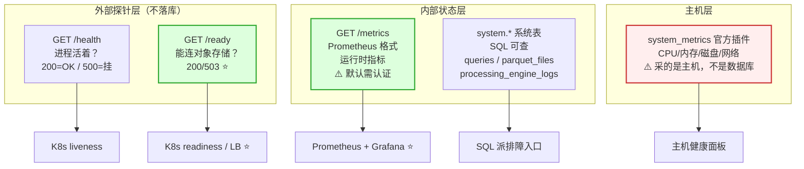
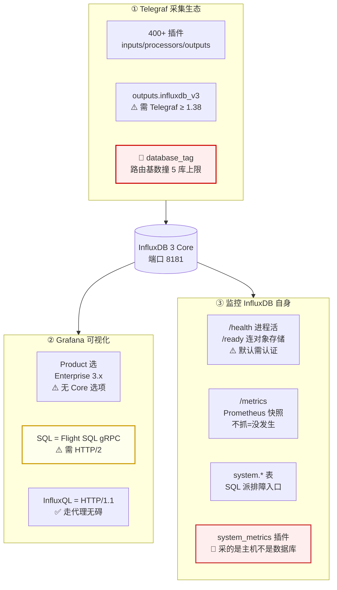

# 第 16 课 · 生态集成：Telegraf、Grafana 与自监控

> 所属阶段：阶段 5 · 生产落地 ｜ 水平：进阶 · 偏实操
> 上一课：[L15 处理引擎：Python 插件与触发器](lesson-15-处理引擎Python插件与触发器.md)

---

## 🎯 本课目标

| 学完你应该能 | 具体表现 |
|-------------|---------|
| **接好采集端** | 写出一份能上生产的 `outputs.influxdb_v3` 配置，并说清每个关键选项在赌什么 |
| **接好可视化** | 知道 Grafana 连 Core 时**为什么必须选「InfluxDB Enterprise 3.x」**，以及 SQL 走不通时怎么排查 |
| **监控 InfluxDB 自己** | 分得清 `/health` `/ready` `/metrics` `system.*` 与 `system_metrics 插件` 这五个东西各自的覆盖面与盲区 |

---

## 第一幕：起源引入 —— 数据库装好了，然后呢

### 运维三问

L13 定下了部署形态，L14 定下了保留与降采样，L15 定下了处理引擎。到这一课为止，我们搭好的是**一台能跑的 InfluxDB**。但把它放到生产环境，第二天就会遇到三个问题：

**问题一：数据从哪来？**

你不可能给每个业务写一套「读指标 → 拼 line protocol → POST 到 8181」。现实是：MySQL 的慢查询、Redis 的连接数、Nginx 的访问日志、MQTT 的传感器上报、SNMP 的交换机端口流量……几十上百种数据源，每种格式都不一样。

**问题二：数据给谁看？**

数据库里躺着一亿行，但没人会去 `SELECT` 它。运维要的是**打开浏览器就能看到 CPU 曲线**，且这条曲线要能跟着时间范围缩放、能配阈值告警、能嵌到值班大屏上。

**问题三：谁来监控监控者？**

InfluxDB 挂了，你的 Grafana 面板会变成什么样？——**一片空白，或者一条平线**。如果你只有「业务指标面板」，那么在数据库真的出问题时，你的监控系统和业务一样瞎。

### 三件撞墙的事

**撞墙一：这三个问题，官方生态里各自有答案，但名字都跟你想的不一样。**

- 采集 → **Telegraf**（不是 agent，是一个插件化的采集器）
- 可视化 → **Grafana**（但连 Core 时要在产品下拉里选 **Enterprise**）
- 自监控 → **`/metrics`**（Prometheus 格式，但**默认需要认证**）

**撞墙二：Telegraf 有 400 多个插件，但「能连 InfluxDB 3 原生端点」的那个，有版本门槛。**

`outputs.influxdb_v3` 是 **Telegraf v1.38.0** 才引入的。你手里的 Telegraf 如果是 1.36，配置写对了也照样起不来——而且报错信息不会直接告诉你「版本不够」。

**撞墙三：最容易搞混的一对名字：`system_metrics` 插件 vs `system.*` 系统表。**

前者采的是**跑 InfluxDB 那台主机的 CPU/内存/磁盘**（它内部依赖 psutil）；后者是 **InfluxDB 自己的内部状态**（查询记录、Parquet 文件、插件日志）。名字里都有 system，指的东西完全不同。

---

## 第二幕：认知冲突 —— 四个反直觉事实

**事实一：Grafana 连 Core，产品下拉里要选「InfluxDB Enterprise 3.x」。**

不是笔误，也不是文档写错。官方 Core 文档的 Grafana 页原话：

> **Product selection: InfluxDB Enterprise 3.x (currently, no Core menu option)**

也就是说，插件目前**根本没有单独的 Core 选项**，官方文档直接让你选 Enterprise。这个坑在于：很多人看到 Enterprise 会以为「我连的是 Core，选这个不对」，然后去翻遍下拉框找 Core。

**事实二：Grafana 用 SQL 查 Core，走的是 Flight SQL（gRPC），**需要 HTTP/2**。**

官方原文：

> For SQL queries, Grafana uses the **Flight SQL protocol (gRPC)** to query InfluxDB 3 Core, which **requires HTTP/2**. If you query InfluxDB 3 Core through a proxy (such as HAProxy, nginx, or a load balancer), verify that your proxy is configured to support HTTP/2. **Without HTTP/2 support, SQL queries through Grafana will fail to connect.**

推论：**你在 Core 前面挂了 nginx 反代，SQL 面板连不上，但 InfluxQL 面板好好的** —— 因为 InfluxQL 走 HTTP/1.1，不受此限。这个不对称是排障时最容易误导人的地方。

**事实三：`/health`、`/ping`、`/metrics` 在 Core 上默认都要认证。**

`/health` 返回 `OK` 只说明**进程活着**。而 Core 是无盘架构（数据全在对象存储里）——**进程活着 ≠ 能服务**。这就是 L13 讲的 `GET /ready` 存在的理由。

> ⚠️ 官方原文反复强调：`/health` 与 `/api/v1/health` **"requires authentication by default in InfluxDB 3 Core"**。很多人照着 1.x/2.x 的老经验裸 curl `/health`，拿到 401，会误判成「服务挂了」。

**事实四：自监控数据自己，一样只有 3 天可查。**

这条最反直觉。你会以为「监控系统嘛，数据肯定要留久一点」。但 Core 的 432 文件上限**不看你是谁**：

```
文件数 = 保留天数 × 144（每 10 分钟一个 Parquet 文件）
432 ÷ 144 = 3 天
```

**文件数只跟墙钟有关，跟写了多少数据无关**（跟 L15 的 WAL 触发器一天 86,400 次是同一个道理）。哪怕你一天只写一条自监控数据，只要服务开着，一天就是 144 个文件。

→ 所以「自监控数据留 90 天」在 Core 上意味着：**存得下，但查不了**。想查长周期，必须先降采样（L14）或上 Enterprise（L13）。

---

## 第三幕：层层揭示

### 知识点 1 · Telegraf 采集生态

#### 核心原理一：Telegraf 是什么，以及它不是什么

**Telegraf 是一个插件化的采集器**，配置文件的骨架只有三块：

```mermaid
flowchart LR
    subgraph IN["inputs · 从哪采"]
        direction TB
        I1["cpu / mem / disk"]
        I2["mysql / redis / nginx"]
        I3["mqtt / snmp / kafka"]
        I4["prometheus / http"]
    end
    subgraph MID["processors · 怎么加工"]
        direction TB
        P1["converter 类型转换"]
        P2["regex 改名"]
        P3["aggregators.merge 合并"]
    end
    subgraph OUT["outputs · 送到哪"]
        direction TB
        O1["influxdb_v3 ⭐"]
        O2["influxdb_v2 兼容"]
        O3["file / kafka / http"]
    end
    IN --> MID --> OUT
    style O1 fill:#dfd,stroke:#3a3,stroke-width:2px
```



| 常见误解 | 真相 |
|---------|------|
| "Telegraf 是 InfluxDB 的 agent" | ❌ 它是**独立的采集器**，output 可以指向 Kafka、文件、Prometheus 等任意目的地 |
| "一个配置文件只能有一个 output" | ❌ 可以有多个 output，**每个 output 独立收全量**（配筛选器后可各收子集） |
| "多个 urls = 双写" | ❌ 见下文「T1-5」，它是**故障转移**，不是双写 |

#### 核心原理二：三个 output 插件怎么选

```toml
# ✅ 推荐：原生 v3 端点（Telegraf ≥ 1.38）
[[outputs.influxdb_v3]]
  urls = ["https://influxdb.internal:8181"]
  token = "${INFLUX_TOKEN}"
  database = "metrics"
```

```toml
# 兼容路径 1：v2 兼容端点 —— ⚠️ organization 必须留空串
[[outputs.influxdb_v2]]
  urls = ["https://influxdb.internal:8181"]
  token = "${INFLUX_TOKEN}"
  organization = ""          # ← 官方要求：写 Core 时必须空字符串
  bucket = "metrics"         # ← v2 的 bucket = Core 的 database
```

```toml
# 兼容路径 2：v1 兼容端点（Telegraf 1.9.2+）
[[outputs.influxdb]]
  urls = ["https://influxdb.internal:8181"]
  database = "metrics"
```

| 维度 | `influxdb_v3` | `influxdb_v2` | `influxdb`（v1） |
|------|--------------|--------------|-----------------|
| Telegraf 版本要求 | **≥ 1.38.0** | ≥ 1.9.2 | ≥ 1.9.2 |
| 走的端点 | `/api/v3/write_lp`（原生） | `/api/v2/write`（兼容） | `/write`（兼容） |
| `no_sync` 可控吗 | ✅ `sync` 选项 | ❌ | ❌ |
| 新项目该用哪个 | ✅ **默认选它** | 老配置平滑迁移 | 老配置平滑迁移 |

#### 核心原理三：五个必须讲清的键值对

| 选项 | 默认值 | 它在赌什么 |
|------|-------|-----------|
| `content_encoding` | **`gzip`** | 设为 `none` → line protocol 明文上行。line protocol 是文本协议，压缩收益很高（回扣 L12） |
| `sync` | **`true`** | 设 `false` → **不等 WAL 持久化就确认**。这就是 L10 讲的 `no_sync=true`，换了个名字 |
| `database_tag` | `""` | 按某个 tag 的值**路由到不同库**。目标库数量 = 该 tag 的**去重值个数** → 直接关联 Core 的 5 库上限 |
| `exclude_database_tag` | `false` | 用了 `database_tag` 后，路由用的那个 tag 要不要**也写进数据里**（默认会，多一列冗余） |
| `timeout` | `5s` | 超时后该批留 buffer 下轮重试；持续超时会堆积，最终**丢最老的数据** |

#### 核心原理四：🔴 `database_tag` 是 Core 上最危险的一个选项

这是本课**最重要的一条**。

`database_tag` 的语义是：用某个 tag 的值决定这条数据写进哪个库。看起来很优雅——按客户分库、按环境分库，一行配置搞定。

但在 Core 上，它是一颗定时炸弹：

```
目标库数量 = database_tag 指定字段的去重值个数
Core 硬上限 = 5 个库
```

假设你配了 `database_tag = "customer_id"`，上线时只有 3 个客户，一切正常。第 6 个客户接入的那天，**写入开始失败**——而且失败信息不会告诉你「库超了 5 个」，排查成本极高。

正确做法（两步）：

```sql
-- 第一步：先自数，别猜
SELECT COUNT(DISTINCT("customer_id")) FROM source_table;
```

```
第二步：
  ≤ 5   → 可以用 database_tag，但要在监控里盯住这个数字
  > 5   → 改成单库 + 该维度降级为普通 tag/field（回扣 L6 的分库策略）
```

⚠️ 这跟 L6 的结论是一回事：**Core 的 5 个库额度，根本不够按实例/按天/按客户划分**。`database_tag` 只是让这个限制变得更容易被无意触发。

#### 核心原理五：缓冲与重试 —— 数据什么时候会真的丢

Telegraf 的 output 插件各自有一个 buffer：

```
写入失败 → 该批留在 buffer → 下个 flush 周期重试
buffer 满（metric_buffer_limit）→ 丢最老的数据，给新的腾地方
```

两条推论：

1. **默认 buffer 撑不住长时间断连。** 想扛更久的中断，要么调大 `metric_buffer_limit`，要么用 `buffer_strategy` 把 buffer 落盘。
2. **"写入失败"和"数据丢了"是两件事。** 短时失败会重试；只有 buffer 撑爆才真丢。所以监控要看 **buffer 使用率**，而不只是看「有没有报错」。

#### 核心原理六：2.x → 3.x 时，Telegraf 是改动最小的一环

这是整个迁移里唯一的好消息。官方口径：

> Telegraf output 插件**大体兼容** —— 2.x 的配置改几个字段就能写 3.x。

对照一下其他部分的代价：

| 迁移项 | 代价 |
|--------|------|
| **Telegraf 配置** | ✅ 改 `urls` / `token` / `bucket→database` 即可 |
| **手写代码** | ❌ 几乎全部要重构 |
| **查询（Flux）** | ❌ Flux 已废弃，必须重写为 SQL 或 InfluxQL |
| **Dashboard** | ⚠️ 视查询语言而定 |

→ 落地建议：**迁移时 Telegraf 那一层可以作为稳定锚点，先把数据打通，再逐个重写上层查询。**

---

### 知识点 2 · Grafana 可视化

#### 核心原理一：两条查询路径，两套网络要求

| | SQL | InfluxQL |
|---|---|---|
| 协议 | **Flight SQL（gRPC）** | HTTP/1.1 |
| HTTP/2 | **必须** | 不需要 |
| 端口 | 与 HTTP API 共用（Core 默认 **8181**） | 同左 |
| 走代理时 | ⚠️ 代理必须支持 HTTP/2，否则**连不上** | ✅ 正常 |
| 无 TLS 时 | 需勾选 **Insecure Connection** | — |

这是排障时的第一分叉点：**SQL 面板连不上、InfluxQL 面板正常 → 99% 是 HTTP/2 的问题。**

#### 核心原理二：配置 Core 数据源的完整参数（Grafana 12.2+）

| 配置项 | 值 | 备注 |
|--------|-----|------|
| Product | **InfluxDB Enterprise 3.x** | ⚠️ 官方原话 "**currently, no Core menu option**" |
| URL | `https://<host>:8181` | Core 的 HTTP 端口 |
| Query Language | `SQL` 或 `InfluxQL` | 选 SQL 即启用 Flight SQL |
| Database | 你的库名 | — |
| Token | 有该库**读**权限的 admin token | — |
| 本地无 TLS 时用 SQL | 勾选 **Insecure Connection** | 在 Advanced Database Settings 里 |
| 前置条件 | Grafana **12.2+** + `newInfluxDSConfigPageDesign` feature flag | 本地自建需手动开 flag |

#### 核心原理三：⚠️ 端口的三个数字，别张冠李戴

这是本课**最容易查错**的一组数字，社区文档里长期混用：

| 端口 | 属于谁 | 说明 |
|------|-------|------|
| **8181** | **InfluxDB 3 Core / Enterprise 的 HTTP API** | ✅ **本课程环境**。写入、查询、/health、/metrics 全在这个端口 |
| 8086 | **InfluxDB 1.x / 2.x** | ❌ 看到它基本可判断起的不是 3.x（回扣 L3） |
| 8082 | **InfluxDB 3 开源社区版 / IOx** 的 Flight 端口 | ⚠️ 见于部分社区文档与 DeepWiki 页面 |

**官方 Core 文档的 Grafana 页给的是 `https://localhost:8181`**，而某些社区 docker-compose 示例里写的是 `iox:8082`。

> 📌 **本课程立场**：以 **Core 官方文档的 8181** 为准（且官方文档里 Grafana 数据源 URL 与 HTTP API 是同一个端口，印证了 L5 已核实的「统一服务、单端口按请求特征分流」架构）。**8082 属于开源社区版/IOx 的部署形态，与 Core 不同。**

**落地核查方法**（不依赖文档，自己验）：

```bash
# 起服务后，看它到底监听了哪些端口
ss -lntp | grep influxdb3        # Linux
netstat -ano | findstr influxdb3 # Windows
```

#### 核心原理四：面板的查询成本 —— 被忽略的放大器

一个 Grafana 面板 = N 个 query × 每 T 秒刷新。这笔账在 L13 已经算过（云上按次计费），本课补上自建视角：

```
每天查询次数 = 面板数 × 每面板查询数 × (86,400 ÷ 刷新间隔秒)
```

| 刷新间隔 | 单面板(5 query) | 10 面板 | 30 面板 | 50 面板 |
|---------|----------------|--------|--------|--------|
| 5s | 86,400 | 864,000 | 2,592,000 | 4,320,000 |
| 10s | 43,200 | 432,000 | 1,296,000 | 2,160,000 |
| **30s** | **14,400** | **144,000** | **432,000** | **720,000** |
| 5m | 1,440 | 14,400 | 43,200 | 72,000 |

→ **5s 改成 30s，查询量降到 1/6。**

⚠️ **引用官方数字时务必对齐口径**：表里是**每面板 5 个 query**；而官方博客那个「一个 10s 面板 ≈ $31/月、20 个面板 ≈ $620/月」的算例，是**每面板 1 个 query** 的口径（86,400 ÷ 10 × 30 = 259,200）。同一档位相差 5 倍，混用会得出完全错误的账单。

代价形式不同，本质一样：
- **云上（Serverless）**：按查询计费，官方算例 20 个 10s 面板 ≈ $620/月
- **自建（Core/Enterprise）**：不按次计费，但**查询抢的是同一块 CPU**（回扣 L13 的四功能竞争），代价变成写入与查询的延迟

（完整 5 档对照见本课实验 B 的「对照 3」。）

#### 核心原理五：格式转换 —— 默认表格，要曲线得手动切

InfluxDB 3 返回的是**表**而不是 1.x/2.x 的「表流」，所以 V3 插件**默认渲染成 Grafana 的 Table 格式**。要做成折线图，需要在面板里把 Format 从 Table 改成 Time series。

同时官方建议在 SQL 里显式排序：

```sql
SELECT "vibration", "machineID", time
FROM "machine_data"
WHERE time >= $__timeFrom AND time <= $__timeTo
  AND "machineID" = '$machineID'
ORDER BY time        -- ← 官方提醒：务必加，保证时间戳有序
```

`ORDER BY time` 在 1.x 时代不是必需的（引擎保证时序），但在 SQL 路径下它是显式要求。

---

### 知识点 3 · 监控 InfluxDB 自身

#### 核心原理一：五个数据源，五个覆盖面（别混用）



| 数据源 | 拿得到 | 拿不到 / 盲区 | 落库 | 适合 |
|--------|-------|--------------|------|------|
| `GET /health` | 进程活没活 | **一切内部状态**；不返回版本 | 否 | K8s liveness 兜底 |
| `GET /ready`（3.10+） | **能否连通底层对象存储** | 业务指标 | 否 | ⭐ **K8s readiness / LB 探针** |
| `GET /metrics` | Prometheus 格式的运行时指标 | 长期趋势——**只是当前值快照，不抓就没发生** | 看你抓不抓 | ⭐ **Prometheus + Grafana** |
| `system.*` 系统表 | 结构化、可 SQL 查的元数据 | 进程级指标（GC、内存池、线程） | 是 | ⭐ **SQL 派排障入口** |
| `system_metrics` 插件 | 主机 CPU/内存/磁盘/网络 | **InfluxDB 自己的内部状态** | 是 | 主机健康；⚠️ 别当数据库监控用 |

**🔴 最容易搞混的一条**：

> **`system_metrics` 这个官方插件采的是「跑 InfluxDB 的那台主机」，不是 InfluxDB 自身。**
> 名字里的 `system` 指的是 **OS**（它内部依赖 `psutil`），不是 database。
> 要监控 InfluxDB 自己，看 `/metrics` 和 `system.*` 表。

#### 核心原理二：三个端点的认证与响应

| 端点 | 认证 | 成功响应 | 要点 |
|------|------|---------|------|
| `GET /health` | ⚠️ **默认需要** | `200 OK`（body: `OK`） | 只看进程，**不看对象存储** |
| `GET /api/v1/health` | ⚠️ **默认需要** | `200 OK` | v1 兼容路径，同上 |
| `GET /ping` | ⚠️ **默认需要** | JSON：`{"version":"3.8.0","revision":"...","process_id":"..."}` | ⚠️ **必须用 GET，HEAD 会返回 404** |
| `GET /metrics` | ⚠️ **默认需要** | Prometheus 文本格式 | 拿不到就永远是快照，没有历史 |
| `GET /ready`（3.10+） | 见 L13 | `200` / `503` | ⭐ **校验对象存储连通性** |

```bash
# 三个都带上 token，否则 401（1.x/2.x 的老经验会误导你）
curl -H "Authorization: Bearer $INFLUX_TOKEN" http://localhost:8181/health
curl -H "Authorization: Bearer $INFLUX_TOKEN" http://localhost:8181/ping
curl -H "Authorization: Bearer $INFLUX_TOKEN" http://localhost:8181/metrics
```

⚠️ `/ping` 的一个官方明确警告：

> **Important:** Use a GET request. **HEAD requests return 404 Not Found.**

很多健康检查工具默认发 HEAD，会拿到 404 然后误判服务不可用。

#### 核心原理三：`system.*` 系统表 —— SQL 派的排障入口

Core 的系统表（可用 `influxdb3 show system table-list` 列出，或用 SQL 查 `information_schema`）：

| 系统表 | 看什么 | 回扣 |
|--------|-------|------|
| `system.queries` | **最近查询记录**：`query_text` / `phase` / `success` / `plan_duration` / `execute_duration` / `parquet_files` | ⭐ L12 的慢查询七步倒查法就靠它 |
| `system.parquet_files` | Parquet 文件清单（文件名、大小、行数、时间范围） | L10 / L11 的 432 文件上限 |
| `system.processing_engine_logs` | 插件日志：`event_time` / `trigger_name` / `log_level` / `log_text` | ⭐ **L15 排障第一站** |
| `system.last_caches` | LVC 缓存定义与状态 | L11 |
| `system.distinct_caches` | DVC 缓存定义与状态 | L11 |
| `system.influxdb_schema` | 表/字段/类型（`measurement` / `key` / `data_type`） | L6 / L7 |
| `system.processing_engine_triggers` | 触发器状态 | L15 |

```sql
-- 慢查询倒查（回扣 L12：plan 耗时 > exec 耗时 = 文件数太多）
SELECT query_text, plan_duration, execute_duration, parquet_files, success
FROM system.queries
ORDER BY issue_time DESC LIMIT 20;

-- 插件排障（回扣 L15：处理引擎的失败是静默的）
SELECT event_time, log_level, log_text
FROM system.processing_engine_logs
WHERE trigger_name = 'my_trigger'
ORDER BY event_time DESC LIMIT 20;

-- ⚠️ 别写进自动化脚本：不带时间范围会全表扫
```

⚠️ **`system.queries` 是内存中的近期记录，不是永久审计日志。** 想留长期查询历史，得自己定期把它抽出来落库。

#### 核心原理四：自监控数据自己也有 3 天窗口

这条在「事实四」讲过成因，这里给完整的账：

```
保留 1 天  =   144 文件  ✅ 可查
保留 3 天  =   432 文件  ✅ 刚好卡上限
保留 7 天  = 1,008 文件  ❌ 超限 2.3 倍 → 查询报错
保留 90 天 = 12,960 文件 ❌ 超限 30 倍
```

**两条出路**（与 L14 的结论完全一致）：

1. **降采样**：用 L15 的处理引擎定时把 `/metrics` 的原始数据聚合成粗粒度层
2. **上 Enterprise**：有 compactor，文件会合并

#### 核心原理五：遥测（Telemetry）—— 默认开着，可以关

Core 默认会**每小时**向 InfluxData 发送一次遥测数据。官方透明列出了收集内容：

| 类别 | 内容 | 频率 |
|------|------|------|
| 系统 | CPU 利用率、内存用量、核心数、OS、版本、运行时长 | 每 60 秒 |
| 写入 | 写入请求数、行数、字节数 | 按操作，60 秒汇总 |
| 查询 | 查询请求数 | 按操作，60 秒汇总 |
| 存储 | Parquet 文件数、总大小、总行数 | 快照时 |
| 处理引擎 | WAL / schedule / request 三类触发器计数 | 快照时 |
| 实例 | 实例 ID、集群 UUID、存储类型、产品类型 | 一次性 |

关闭方式：

```bash
influxdb3 serve --disable-telemetry-upload ...
# 或
export INFLUXDB3_TELEMETRY_DISABLE_UPLOAD=true
```

> 这条本身不是监控手段，但生产环境（尤其内网/合规场景）通常需要显式关闭，属于上线清单的一项。

---

## 第四幕：实操验证

### 实验 A：Telegraf 配置体检器（✅ 本机实跑）

**目标**：把「Telegraf → InfluxDB 3」的常见配置错误做成 CI 门禁，让机器在合入前拦住它们。

**为什么值得做**：Telegraf 的配置错误大多是**静默的**——配错不会让 Telegraf 起不来，而是让它「看似正常地做错事」（明文 token 进 Git、`database_tag` 慢慢逼近 5 库上限、`sync=false` 悄悄放弃持久性）。靠人眼 review 抓不住。

**完整源码**（与 [l16_telegraf_lint.py](../assets/l16_telegraf_lint.py) 逐字一致）：

```python
# -*- coding: utf-8 -*-
"""
L16 实验 A：Telegraf 配置体检器
================================
把「Telegraf → InfluxDB 3」的常见配置错误做成 CI 门禁。

用法:
    python l16_telegraf_lint.py                      # 演示模式：内置反面 + 正面样例各跑一遍
    python l16_telegraf_lint.py telegraf.conf        # 体检真实配置
    python l16_telegraf_lint.py a.conf b.conf -v 1.40.0

退出码:
    0 = 无 P0 / P1（可用）
    1 = 存在 P0 或 P1（建议拦截）
"""
import argparse
import re
import sys
import tomllib

# ========== 常量（均取自官方一手文档，见讲义「📚 官方文档」）==========
MIN_VER_V3 = (1, 38)      # outputs.influxdb_v3 自 Telegraf v1.38.0 引入
CORE_DB_LIMIT = 5         # Core 硬限制：最多 5 个库（回扣 L6）
CORE_HTTP_PORT = 8181     # Core HTTP 默认端口（回扣 L3：8086 是 1.x/2.x）
V1V2_HTTP_PORT = 8086
DEFAULT_ENCODING = "gzip"
DEFAULT_TIMEOUT = "5s"

# ========== 内置样例 ==========

BAD_SAMPLE = """\
# ❌ 反面教材：一份"能跑通但浑身是坑"的 Telegraf 配置
[agent]
  interval = "1s"

[[inputs.cpu]]
  percpu = true

[[outputs.influxdb_v3]]
  urls = ["http://influxdb-a.internal:8086", "http://influxdb-b.internal:8086"]
  token = "apiv3_abcdefghijklmnopqrstuvwxyz0123456789ABCDEFGHIJ"
  database = "metrics"
  content_encoding = "none"
  sync = false
  database_tag = "host"
"""

GOOD_SAMPLE = """\
# ✅ 正面教材：面向 Core 生产环境的推荐写法
[agent]
  interval = "10s"
  flush_interval = "10s"
  metric_batch_size = 5000
  metric_buffer_limit = 50000

[[inputs.cpu]]
  percpu = false
  totalcpu = true

[[outputs.influxdb_v3]]
  urls = ["https://influxdb.internal:8181"]
  token = "${INFLUX_TOKEN}"
  database = "metrics"
  content_encoding = "gzip"
  sync = true
  timeout = "10s"
"""

LEVEL_ORDER = {"P0": 0, "P1": 1, "P2": 2, "INFO": 3}
ICON = {"P0": "[P0]", "P1": "[P1]", "P2": "[P2]", "INFO": "[i] "}


# ========== 工具 ==========

def hr(title=""):
    if title:
        print("\n" + "=" * 74)
        print("  " + title)
        print("=" * 74)
    else:
        print("-" * 74)


def parse_ver(s):
    """把 '1.38.0' / 'v1.38' 解析成 (1, 38, 0)。"""
    nums = re.findall(r"\d+", s or "")
    while len(nums) < 3:
        nums.append("0")
    return tuple(int(x) for x in nums[:3])


def ver_str(v):
    return ".".join(str(x) for x in v)


def is_env_ref(val):
    """token 是否是环境变量/密钥仓库引用（${...} 形式）。"""
    return isinstance(val, str) and val.strip().startswith("${")


def host_of(url):
    m = re.match(r"(https?)://([^:/]+)", url or "")
    return (m.group(2) if m else (url or "")).lower()


def port_of(url):
    m = re.search(r":(\d+)\s*$", url or "")
    return int(m.group(1)) if m else None


def is_local(h):
    return h in ("localhost", "127.0.0.1", "::1")


# ========== 检查项 ==========

def check(cfg, telegraf_ver):
    """返回 findings 列表，每项 (level, rule_id, title, detail, fix)。"""
    f = []
    add = lambda lv, rid, t, d, fix: f.append((lv, rid, t, d, fix))

    outputs = cfg.get("outputs", {}) or {}
    inputs = cfg.get("inputs", {}) or {}
    v3_list = outputs.get("influxdb_v3", []) or []
    v2_list = outputs.get("influxdb_v2", []) or []
    v1_list = outputs.get("influxdb", []) or []

    if isinstance(v3_list, dict):
        v3_list = [v3_list]
    if isinstance(v2_list, dict):
        v2_list = [v2_list]
    if isinstance(v1_list, dict):
        v1_list = [v1_list]

    # ---- T0-3：没有任何 output ----
    if not (v3_list or v2_list or v1_list):
        add("P0", "T0-3", "没有任何 output 插件",
            "Telegraf 配置必须至少一个 output，采集到的数据无处可去。",
            "添加 [[outputs.influxdb_v3]]（Telegraf ≥ 1.38）或 [[outputs.influxdb_v2]]。")
        return f

    # ---- T0-1：版本门槛 ----
    if v3_list and telegraf_ver < MIN_VER_V3:
        add("P0", "T0-1", f"Telegraf 版本不支持 influxdb_v3 输出",
            f"当前 {ver_str(telegraf_ver)}，而 outputs.influxdb_v3 自 "
            f"Telegraf v{ver_str(MIN_VER_V3)} 才引入（走 /api/v3/write_lp 原生端点）。",
            f"升级到 Telegraf ≥ v{ver_str(MIN_VER_V3)}，或改用 "
            f"[[outputs.influxdb_v2]] 走 v2 兼容端点（organization 必须留空串）。")

    for idx, o in enumerate(v3_list):
        tag = f"outputs.influxdb_v3"
        if len(v3_list) > 1:
            tag += f"[{idx}]"
        urls = o.get("urls", []) or []
        first = urls[0] if urls else ""

        # ---- T0-2：token 硬编码 ----
        tok = o.get("token", "")
        if tok and not is_env_ref(tok):
            add("P0", "T0-2", "token 以明文硬编码在配置文件里",
                f"{tag}.token 是明文字符串（长度 {len(tok)}）。"
                "配置文件通常进 Git，等同于把数据库写权限提交到仓库。",
                'token = "${INFLUX_TOKEN}"，运行时由环境变量或 Telegraf secret store 注入。')
        elif not tok:
            add("P2", "T0-2", "token 为空",
                f"{tag}.token 未设置。若服务端开了认证，写入会 401。",
                '填 ${INFLUX_TOKEN}；若确实关闭了认证请显式注释说明。')

        # ---- T0-4：database_tag 的路由基数撞 Core 5 库上限 ----
        dbtag = o.get("database_tag", "")
        if dbtag:
            add("P0", "T0-4", f"database_tag 按 tag 分库，可能撞 Core 的 {CORE_DB_LIMIT} 库上限",
                f"{tag}.database_tag = \"{dbtag}\" → 目标库数量 = 该 tag 的**去重值个数**。\n"
                f"        Core 硬上限 {CORE_DB_LIMIT} 个库（回扣 L6）；一旦超出，写入直接失败且不易定位。",
                f"先自数：SELECT COUNT(DISTINCT(\"{dbtag}\")) FROM <源表>；\n"
                f"        > {CORE_DB_LIMIT} 就必须改成单库 + 该维度降级为 tag/field，或迁 Enterprise。")

            # ---- T2-2：exclude_database_tag ----
            if not o.get("exclude_database_tag", False):
                add("P2", "T2-2", "database_tag 未配 exclude_database_tag",
                    f"{tag} 未设置 exclude_database_tag = true → 路由用的 tag 会随数据一起写进库，\n"
                    "        多一列冗余数据（回扣 L7：稀疏 schema 会拖慢查询）。",
                    "exclude_database_tag = true")

        # ---- T1-1：压缩 ----
        enc = o.get("content_encoding", DEFAULT_ENCODING)
        if enc != "gzip":
            add("P1", "T1-1", f"content_encoding = \"{enc}\"，未启用 gzip",
                f"{tag} 关掉压缩后，line protocol 明文上行。line protocol 是文本协议，\n"
                "        实测压缩比通常很高（回扣 L12：批量上限 10MB 也可能是压缩后）。",
                'content_encoding = "gzip"（这也是插件默认值，建议显式写出）')

        # ---- T1-2：sync / 持久性 ----
        if o.get("sync", True) is False:
            add("P1", "T1-2", "sync = false（用持久性换延迟）",
                f"{tag}.sync = false → 不等 WAL 持久化就确认，延迟更低但**崩溃时已确认的数据可能丢**。\n"
                "        这正是 L10 讲的 no_sync=true 的同一枚开关，只是换了个名字。",
                "核心业务数据保持 sync = true；只有可重建的、丢得起的数据才关。")

        # ---- T1-4：明文 http + 非本机 ----
        for u in urls:
            if u.startswith("http://") and not is_local(host_of(u)):
                add("P1", "T1-4", "明文 http 访问非本机地址",
                    f"{tag}.urls 含 {u} → token 以 Bearer 明文在网络上传输。",
                    "改用 https://，或在确认网络可信的前提下显式接受风险。")
                break

        # ---- T1-5：多 url 的真实语义 ----
        if len(urls) > 1:
            add("INFO", "T1-5", f"配置了 {len(urls)} 个 urls —— 注意它不是双写、也不是负载均衡",
                "官方语义：**每个 flush 周期只随机挑一个 URL 写入**，"
                "失败才换下一个，直到全部试完或成功。\n"
                "        所以它是「故障转移」，不是「双写」，也不是「分摊流量」。",
                "要双写 → 写两个 [[outputs.influxdb_v3]] 块；\n"
                "        要分摊 → 在 Telegraf 前面做 LB，或拆成多个 output 块配筛选。")

        # ---- T2-3：端口指纹 ----
        p = port_of(first)
        if p == V1V2_HTTP_PORT:
            add("P2", "T2-3", f"端口 {V1V2_HTTP_PORT} 是 InfluxDB 1.x / 2.x 的端口",
                f"{tag}.urls[0] 指向 :{V1V2_HTTP_PORT}。Core 的 HTTP 端口是 "
                f"{CORE_HTTP_PORT}（回扣 L3：看到 8086 基本可判断起的不是 3.x）。",
                f"改成 :{CORE_HTTP_PORT}（若确实在代理 1.x/2.x，请确认目标实例版本）。")
        elif p is not None and p != CORE_HTTP_PORT:
            add("P2", "T2-3", f"端口 {p} 不是 Core 默认的 {CORE_HTTP_PORT}",
                f"{tag}.urls[0] 端口为 {p}。",
                f"确认是该实例显式改过 --http-bind，否则应为 {CORE_HTTP_PORT}。")

        # ---- T2-4：timeout ----
        if "timeout" not in o:
            add("P2", "T2-4", f"未显式设置 timeout（默认 {DEFAULT_TIMEOUT}）",
                f"{tag} 未配置 timeout。默认 5s 在跨地域/高负载时可能偏紧，\n"
                "        超时后该批会留在 buffer 里下轮重试，堆积会触发丢点。",
                'timeout = "10s"（配合 metric_buffer_limit 一起调）')

    # ---- T1-3：v2 兼容插件的 organization ----
    for o in v2_list:
        org = o.get("organization", None)
        if org not in ("", None):
            add("P1", "T1-3", "influxdb_v2 的 organization 不是空串",
                f"organization = \"{org}\"。官方明确要求：写 InfluxDB 3 Core 时 "
                "organization 必须设为空字符串。",
                'organization = ""（bucket 填 Core 的 database 名）')

    # ---- T2-1：批量参数 ----
    agent = cfg.get("agent", {}) or {}
    if "metric_batch_size" not in agent:
        add("P2", "T2-1", "agent 未设置 metric_batch_size",
            "未显式配置批量大小。批量是摊销连接与请求开销的关键手段（回扣 L12），\n"
            "        默认值不一定适合你的点密度。",
            "metric_batch_size = 5000（配合 metric_buffer_limit = 50000）")

    # ---- 信息：input 数量 ----
    n_in = sum(len(v) if isinstance(v, list) else 1 for v in inputs.values())
    if n_in == 0:
        add("P1", "T1-6", "没有任何 input 插件",
            "Telegraf 配置必须至少一个 input，否则没有数据来源。",
            "添加 [[inputs.cpu]] 等采集插件。")

    return f


def render(name, cfg, findings, telegraf_ver):
    hr(f"体检对象：{name}")
    n_in = len(cfg.get("inputs", {}) or {})
    outs = cfg.get("outputs", {}) or {}
    print(f"  Telegraf 版本 : {ver_str(telegraf_ver)}")
    print(f"  input 插件类  : {n_in} 类  {list((cfg.get('inputs') or {}).keys())}")
    print(f"  output 插件类 : {len(outs)} 类  {list(outs.keys())}")

    if not findings:
        print("\n  ✅ 未发现 P0 / P1 / P2 问题")
        return 0

    findings.sort(key=lambda x: LEVEL_ORDER[x[0]])
    counts = {}
    for lv, *_ in findings:
        counts[lv] = counts.get(lv, 0) + 1

    print("\n  " + "  ".join(f"{lv}={counts.get(lv, 0)}"
                             for lv in ("P0", "P1", "P2", "INFO") if counts.get(lv)))
    hr()
    for lv, rid, title, detail, fix in findings:
        print(f"\n{ICON[lv]} {rid}  {title}")
        for line in detail.split("\n"):
            print("      " + line)
        print(f"      修法: {fix}")
    hr()

    worst = min((LEVEL_ORDER[lv] for lv, *_ in findings), default=3)
    if worst <= 1:
        print("  ❌ 存在 P0 / P1 —— 建议拦截，不要合入")
        return 1
    print("  ⚠️  仅有 P2 / INFO —— 可合入，但建议处理")
    return 0


def main():
    ap = argparse.ArgumentParser(description="Telegraf → InfluxDB 3 配置体检器")
    ap.add_argument("files", nargs="*", help="telegraf.conf 路径；留空则用内置样例演示")
    ap.add_argument("-v", "--telegraf-version", default="1.38.0",
                    help="你的 Telegraf 版本（默认 1.38.0）")
    args = ap.parse_args()

    ver = parse_ver(args.telegraf_version)

    print("=" * 74)
    print("  L16 实验 A：Telegraf 配置体检器")
    print("=" * 74)
    print(f"  指定 Telegraf 版本: {ver_str(ver)}")
    print(f"  outputs.influxdb_v3 门槛: v{ver_str(MIN_VER_V3)}")
    print(f"  Core 库上限: {CORE_DB_LIMIT}    Core HTTP 端口: {CORE_HTTP_PORT}")

    rc = 0
    if args.files:
        for path in args.files:
            try:
                with open(path, "rb") as fh:
                    cfg = tomllib.load(fh)
            except Exception as e:
                print(f"\n❌ 解析失败 {path}: {e}")
                rc = 1
                continue
            rc |= render(path, cfg, check(cfg, ver), ver)
    else:
        print("\n（未传入配置文件 → 演示模式：反面样例用旧版本 1.36，正面样例用 1.40）")

        cfg_bad = tomllib.loads(BAD_SAMPLE)
        rc |= render("内置【反面教材】（Telegraf 1.36.0）", cfg_bad,
                     check(cfg_bad, (1, 36, 0)), (1, 36, 0))

        cfg_good = tomllib.loads(GOOD_SAMPLE)
        rc |= render("内置【正面教材】（Telegraf 1.40.0）", cfg_good,
                     check(cfg_good, (1, 40, 0)), (1, 40, 0))

        hr("演示模式小结")
        print("  反面样例把本课讲的坑几乎踩了一遍：")
        print("    · token 明文写进配置（会进 Git）")
        print("    · database_tag=\"host\" —— 路由基数撞 Core 5 库上限")
        print("    · content_encoding=\"none\" 关掉 gzip")
        print("    · sync=false 用持久性换延迟")
        print("    · 两个 urls 以为是双写/负载均衡（其实是故障转移）")
        print("    · 端口 8086 —— 那是 1.x/2.x 的端口，Core 是 8181")
        print("    · Telegraf 1.36 根本不认 influxdb_v3 这个插件")
        print("\n  正面样例逐条规避，输出「未发现 P0 / P1 / P2 问题」。")

    print("\n" + "=" * 74)
    print("  用法提示：")
    print("    python l16_telegraf_lint.py /etc/telegraf/telegraf.conf -v 1.40.0")
    print("    有 P0/P1 时进程退出码为 1，可直接挂到 CI / pre-commit。")
    print("=" * 74)
    return rc


if __name__ == "__main__":
    sys.exit(main())
```

**真实输出**（本机 Python 3.11.15 实跑，逐字回贴）：

```text
==========================================================================
  L16 实验 A：Telegraf 配置体检器
==========================================================================
  指定 Telegraf 版本: 1.38.0
  outputs.influxdb_v3 门槛: v1.38
  Core 库上限: 5    Core HTTP 端口: 8181

（未传入配置文件 → 演示模式：反面样例用旧版本 1.36，正面样例用 1.40）

==========================================================================
  体检对象：内置【反面教材】（Telegraf 1.36.0）
==========================================================================
  Telegraf 版本 : 1.36.0
  input 插件类  : 1 类  ['cpu']
  output 插件类 : 1 类  ['influxdb_v3']

  P0=3  P1=3  P2=4  INFO=1
--------------------------------------------------------------------------

[P0] T0-1  Telegraf 版本不支持 influxdb_v3 输出
      当前 1.36.0，而 outputs.influxdb_v3 自 Telegraf v1.38 才引入（走 /api/v3/write_lp 原生端点）。
      修法: 升级到 Telegraf ≥ v1.38，或改用 [[outputs.influxdb_v2]] 走 v2 兼容端点（organization 必须留空串）。

[P0] T0-2  token 以明文硬编码在配置文件里
      outputs.influxdb_v3.token 是明文字符串（长度 52）。配置文件通常进 Git，等同于把数据库写权限提交到仓库。
      修法: token = "${INFLUX_TOKEN}"，运行时由环境变量或 Telegraf secret store 注入。

[P0] T0-4  database_tag 按 tag 分库，可能撞 Core 的 5 库上限
      outputs.influxdb_v3.database_tag = "host" → 目标库数量 = 该 tag 的**去重值个数**。
              Core 硬上限 5 个库（回扣 L6）；一旦超出，写入直接失败且不易定位。
      修法: 先自数：SELECT COUNT(DISTINCT("host")) FROM <源表>；
        > 5 就必须改成单库 + 该维度降级为 tag/field，或迁 Enterprise。

[P1] T1-1  content_encoding = "none"，未启用 gzip
      outputs.influxdb_v3 关掉压缩后，line protocol 明文上行。line protocol 是文本协议，
              实测压缩比通常很高（回扣 L12：批量上限 10MB 也可能是压缩后）。
      修法: content_encoding = "gzip"（这也是插件默认值，建议显式写出）

[P1] T1-2  sync = false（用持久性换延迟）
      outputs.influxdb_v3.sync = false → 不等 WAL 持久化就确认，延迟更低但**崩溃时已确认的数据可能丢**。
              这正是 L10 讲的 no_sync=true 的同一枚开关，只是换了个名字。
      修法: 核心业务数据保持 sync = true；只有可重建的、丢得起的数据才关。

[P1] T1-4  明文 http 访问非本机地址
      outputs.influxdb_v3.urls 含 http://influxdb-a.internal:8086 → token 以 Bearer 明文在网络上传输。
      修法: 改用 https://，或在确认网络可信的前提下显式接受风险。

[P2] T2-2  database_tag 未配 exclude_database_tag
      outputs.influxdb_v3 未设置 exclude_database_tag = true → 路由用的 tag 会随数据一起写进库，
              多一列冗余数据（回扣 L7：稀疏 schema 会拖慢查询）。
      修法: exclude_database_tag = true

[P2] T2-3  端口 8086 是 InfluxDB 1.x / 2.x 的端口
      outputs.influxdb_v3.urls[0] 指向 :8086。Core 的 HTTP 端口是 8181（回扣 L3：看到 8086 基本可判断起的不是 3.x）。
      修法: 改成 :8181（若确实在代理 1.x/2.x，请确认目标实例版本）。

[P2] T2-4  未显式设置 timeout（默认 5s）
      outputs.influxdb_v3 未配置 timeout。默认 5s 在跨地域/高负载时可能偏紧，
              超时后该批会留在 buffer 里下轮重试，堆积会触发丢点。
      修法: timeout = "10s"（配合 metric_buffer_limit 一起调）

[P2] T2-1  agent 未设置 metric_batch_size
      未显式配置批量大小。批量是摊销连接与请求开销的关键手段（回扣 L12），
              默认值不一定适合你的点密度。
      修法: metric_batch_size = 5000（配合 metric_buffer_limit = 50000）

[i]  T1-5  配置了 2 个 urls —— 注意它不是双写、也不是负载均衡
      官方语义：**每个 flush 周期只随机挑一个 URL 写入**，失败才换下一个，直到全部试完或成功。
              所以它是「故障转移」，不是「双写」，也不是「分摊流量」。
      修法: 要双写 → 写两个 [[outputs.influxdb_v3]] 块；
        要分摊 → 在 Telegraf 前面做 LB，或拆成多个 output 块配筛选。
--------------------------------------------------------------------------
  ❌ 存在 P0 / P1 —— 建议拦截，不要合入

==========================================================================
  体检对象：内置【正面教材】（Telegraf 1.40.0）
==========================================================================
  Telegraf 版本 : 1.40.0
  input 插件类  : 1 类  ['cpu']
  output 插件类 : 1 类  ['influxdb_v3']

  ✅ 未发现 P0 / P1 / P2 问题

==========================================================================
  演示模式小结
==========================================================================
  反面样例把本课讲的坑几乎踩了一遍：
    · token 明文写进配置（会进 Git）
    · database_tag="host" —— 路由基数撞 Core 5 库上限
    · content_encoding="none" 关掉 gzip
    · sync=false 用持久性换延迟
    · 两个 urls 以为是双写/负载均衡（其实是故障转移）
    · 端口 8086 —— 那是 1.x/2.x 的端口，Core 是 8181
    · Telegraf 1.36 根本不认 influxdb_v3 这个插件

  正面样例逐条规避，输出「未发现 P0 / P1 / P2 问题」。

==========================================================================
  用法提示：
    python l16_telegraf_lint.py /etc/telegraf/telegraf.conf -v 1.40.0
    有 P0/P1 时进程退出码为 1，可直接挂到 CI / pre-commit。
==========================================================================
```

**怎么读这张表**：

反面样例踩了 3 个 P0、3 个 P1。其中 **T0-4 是本课最有价值的一条**——
`database_tag = "host"` 看起来人畜无害，但它的真实含义是「目标库数量 = host 的去重值个数」，
而 Core 只允许 5 个库。这条错误的特点是：**上线时正常，规模上来后突然失败**。

**接 CI**：脚本在有 P0/P1 时退出码为 1，可直接挂到 pre-commit 或 PR 流程：

```bash
python l16_telegraf_lint.py /etc/telegraf/telegraf.conf -v 1.40.0 || exit 1
```

⚠️ **诚实说明**：本脚本用 Python 标准库 `tomllib` 解析 TOML（Python 3.11+ 自带；
3.9/3.10 需 `pip install tomli`）。Telegraf 官方是 Go 的 TOML 解析器，
两者在极少数边缘语法上可能有差异；脚本定位是**门禁提示**，不是官方校验器的替代品。

---

### 实验 B：自监控覆盖率与查询成本模拟器（✅ 本机实跑）

**目标**：算清两笔账——自监控数据自己能存多久、Grafana 面板一天跑多少次查询。

**为什么值得做**：这两个数字都藏在「看起来很合理的默认值」背后。
「自监控数据留 90 天」听起来天经地义，但 Core 的 432 文件上限不看你是谁；
「面板 5 秒刷新」也很自然，但没人算过它一天会打出几百万次查询。

**完整源码**（与 [l16_monitor_sim.py](../assets/l16_monitor_sim.py) 逐字一致）：

```python
# -*- coding: utf-8 -*-
"""
L16 实验 B：自监控覆盖率与查询成本模拟器
=========================================
回答两个"上生产前必须算清"的问题：

  对照 1：三种自监控数据源，各自的覆盖面与盲区
  对照 2：Core 无 compactor，自监控数据自己撑多久会撞 432 文件上限
  对照 3：Grafana 面板刷新频率 → 一天的查询次数与成本量级
  对照 4：/metrics 抓一次有多少指标？抓取间隔对自监控数据量的影响

不依赖任何外部库，纯标准库，可直接在任意 Python 3.9+ 上跑。
"""
import math

# ========== 官方一手常量 ==========
FILE_LIMIT = 432          # Core query-file-limit 默认 432 个 Parquet 文件（回扣 L11）
GEN1_DURATION_MIN = 10    # gen1-duration 默认 10 分钟 → 每 10 分钟 1 个 Parquet 文件
SEC_PER_DAY = 86_400
FILES_PER_DAY = 144       # 144 = 86400 / 600（每 10 分钟一个文件）

# 自监控数据假设值（⚠️ 均为假设，脚本内会打印标记）
BYTES_PER_SAMPLE = 180        # ⚠️ 假设：一个 Prometheus 样本落库后约 180 字节
BYTES_PER_METRIC = 120        # ⚠️ 假设：一条时序行约 120 字节（沿用 L13/L14 口径）


def hr(title=""):
    if title:
        print("\n" + "=" * 76)
        print("  " + title)
        print("=" * 76)
    else:
        print("-" * 76)


def fmt_num(n):
    return f"{n:,.0f}"


def fmt_bytes(b):
    for unit in ("B", "KB", "MB", "GB", "TB"):
        if abs(b) < 1024:
            return f"{b:,.1f} {unit}"
        b /= 1024
    return f"{b:,.1f} PB"


# ========== 对照 1：三种自监控数据源 ==========

def compare_sources():
    hr("对照 1：三条自监控数据源，各自的覆盖面与盲区")

    rows = [
        # 数据源, 拿得到, 拿不到, 落库?, 适合
        ("GET /health",
         "进程是否活着（200=OK, 500=不可用）",
         "一切内部状态：不返回版本、不看对象存储",
         "否", "K8s liveness 兜底 / 人工 curl"),
        ("GET /ready (3.10+)",
         "能否连通**底层对象存储**（200/503）",
         "业务指标（写入量、查询量、文件数）",
         "否", "✅ K8s readiness / LB 探针（L13 已讲）"),
        ("GET /metrics",
         "Prometheus 格式的内部运行时指标\n（内存池、查询耗时、WAL/文件计数等）",
         "长期趋势——它只是**当前值快照**，\n不抓取就等于没发生",
         "看你抓不抓", "✅ Prometheus/Grafana 面板与告警"),
        ("system.* 系统表",
         "结构化可 SQL 查询：\nsystem.queries / parquet_files /\nprocessing_engine_logs / last_caches …",
         "进程级指标（GC、内存池、线程）",
         "是（表）", "✅ SQL 派的排障入口（回扣 L15）"),
        ("system_metrics 插件",
         "主机级：CPU / 内存 / 磁盘 / 网络\n（内部依赖 psutil）",
         "InfluxDB 自身内部状态\n——它采的是**主机**，不是**数据库**",
         "是（表）", "✅ 主机健康；⚠️ 别当数据库监控用"),
    ]

    print(f"{'数据源':<22} {'落库':<6} {'盲区 / 注意'}")
    print("-" * 76)
    for src, has, lack, persist, use in rows:
        print(f"\n  ▸ {src}   [落库: {persist}]")
        print(f"      拿得到: {has}")
        print(f"      拿不到: {lack}")
        print(f"      适合  : {use}")

    print("\n" + "-" * 76)
    print("  ⭐ 最容易搞混的一条：")
    print("     system_metrics 这个**官方插件**采的是「跑 InfluxDB 的那台主机的 CPU/内存/磁盘」，")
    print("     它**不是** InfluxDB 的内部指标。名字里的 system 指的是 OS，不是 database。")
    print("     要监控 InfluxDB 自身，看 /metrics 与 system.* 系统表。")


# ========== 对照 2：自监控数据自己会不会撞 432 ==========

def compare_retention():
    hr("对照 2：自监控数据自己，多久会撞 432 文件上限？（Core 无 compactor）")

    print("  背景（回扣 L10/L11/L14）：")
    print(f"    · Core 无 compactor → 文件永不合并（回扣 L10）")
    print(f"    · gen1-duration 默认 {GEN1_DURATION_MIN} 分钟 → 每 {GEN1_DURATION_MIN} 分钟 1 个 Parquet 文件")
    print(f"    · query-file-limit 默认 {FILE_LIMIT} → 超限**直接报错**，不是变慢（回扣 L11）")
    print(f"    · 于是：{FILE_LIMIT} 文件 ÷ {FILES_PER_DAY} 文件/天 = "
          f"{FILE_LIMIT / FILES_PER_DAY:.2f} 天 ≈ {FILE_LIMIT * GEN1_DURATION_MIN / 60:.0f} 小时")

    print("\n  ⚠️ 关键认知：**文件数只跟墙钟有关，跟写了多少数据无关**（回扣 L15 的 WAL 触发器同理）。")
    print("     哪怕一天只写 1 条数据，只要服务开着，一天就是 144 个文件。")

    print("\n" + "-" * 76)
    print(f"  {'保留期':<12}{'文件数':>12}{'是否超限':>12}{'说明'}")
    print("-" * 76)

    for label, days in (("1 天", 1), ("2 天", 2), ("3 天", 3),
                        ("7 天", 7), ("30 天", 30), ("90 天", 90)):
        files = int(days * FILES_PER_DAY)
        over = files > FILE_LIMIT
        note = f"超 {files / FILE_LIMIT:.1f} 倍 → 查询报错" if over else "✅ 可查"
        print(f"  {label:<12}{files:>12,}{('❌ 是' if over else '✅ 否'):>12}   {note}")

    print("-" * 76)
    print(f"\n  → 结论：自监控数据跟业务数据完全一样，**最多只能查 {FILE_LIMIT / FILES_PER_DAY:.0f} 天**。")
    print("     想要更长的自监控历史，两条路（与 L14 的结论一致）：")
    print("       ① 降采样：用处理引擎定时把 /metrics 聚合到粗粒度层")
    print("       ② 上 Enterprise（有 compactor，文件会合并）")


# ========== 对照 3：Grafana 刷新频率 → 查询成本 ==========

def compare_dashboard_cost():
    hr("对照 3：Grafana 面板刷新频率 → 一天的查询次数")

    print("  场景：每个面板里有 N 个 query，面板每 T 秒自动刷新。")
    print("  公式：每天查询次数 = 面板数 × 每面板查询数 × (86,400 ÷ 刷新间隔秒)")
    print()
    print(f"  {'刷新间隔':<12}{'单面板(5 query)':>18}{'10 面板':>14}{'30 面板':>14}{'50 面板':>14}")
    print("-" * 76)

    for label, sec in (("5s", 5), ("10s", 10), ("30s", 30),
                       ("1m", 60), ("5m", 300)):
        per_day = SEC_PER_DAY // sec
        row = f"  {label:<12}"
        for panels in (1, 10, 30, 50):
            q = per_day * 5 * panels
            row += f"{q:>14,}"
        print(row)

    print("-" * 76)
    print("\n  ⚠️ 默认刷新间隔是很多人从未改过的一个数字。")
    print("     把 5s 改成 30s，同一批面板的查询量直接降到 1/6。")

    print("\n  💰 成本侧（回扣 L13 已核实）：")
    print("     官方博客算例：一个每 10 秒刷新的面板，一个月约 259,200 次查询 ≈ $31；")
    print("     20 个面板就是 $620/月。⚠️ 该算例是**每面板 1 个 query** 的口径")
    print(f"     （86,400÷10×30 = {86400 // 10 * 30:,}）；本表按每面板 5 个 query 计，")
    print("     同一档位要再 ×5 —— 引用官方数字时务必对齐口径。")
    print("     这是在 Cloud Serverless 上按查询计费的情形。")
    print("     → 自建 Core/Enterprise 不按次计费，但**查询抢的是同一块 CPU**（回扣 L13），")
    print("       代价从「账单」变成「写入与查询的延迟」。")


# ========== 对照 4：抓取间隔 → 自监控数据量 ==========

def compare_scrape_volume():
    hr("对照 4：/metrics 抓取间隔 → 自监控数据自己吃掉多少存储")

    print(f"  ⚠️ 假设值（脚本内显式标注）：每条时序行约 {BYTES_PER_METRIC} 字节，")
    print(f"     /metrics 一次暴露约 {METRIC_COUNT} 条时序。这些数量级用于看趋势，不是精确账单。")
    print()
    print("  场景：Prometheus 每 T 秒抓一次 /metrics，抓到的样本再写回 InfluxDB。")
    print()
    print(f"  {'抓取间隔':<12}{'每天样本数':>14}{'天增(MB)':>12}{'30 天(GB)':>12}{'90 天(GB)':>12}")
    print("-" * 76)

    for label, sec in (("5s", 5), ("10s", 10), ("15s", 15),
                       ("30s", 30), ("60s", 60)):
        samples_per_day = METRIC_COUNT * (SEC_PER_DAY / sec)
        bytes_per_day = samples_per_day * BYTES_PER_METRIC
        mb_day = bytes_per_day / 1024 / 1024
        gb_30 = bytes_per_day * 30 / 1024 ** 3
        gb_90 = bytes_per_day * 90 / 1024 ** 3
        print(f"  {label:<12}{samples_per_day:>14,.0f}{mb_day:>12,.1f}"
              f"{gb_30:>12,.2f}{gb_90:>12,.2f}")

    print("-" * 76)
    print("\n  → 抓取频率是**线性**的：15s → 30s，自监控存储直接减半。")
    print("  → 但这些样本即使只存 30 天，也已经**远超 Core 能查的 3 天窗口**（见对照 2）：")
    print("     存得下 ≠ 查得到。要能查长周期，必须先降采样。")


# ========== 总结 ==========

def summary():
    hr("五条落地结论")
    items = [
        ("① 自监控要分层，别指望一个端点",
         "/health 看进程活没活，/ready 看能否连对象存储，/metrics 看内部状态，\n"
         "        system.* 系统表看结构化元数据。四者覆盖面不同，缺一不可。"),
        ("② Core 的就绪探针用 GET /ready，不要只查 TCP",
         "无盘架构下进程活着 ≠ 能服务。这是 L13 已核实的一条，L16 把它接到 K8s 探针上。"),
        ("③ 自监控数据自己也在 432 文件限制内，最多查 3 天",
         "文件数 = 天数 × 144，跟数据量无关。想看更长历史必须降采样或上 Enterprise。"),
        ("④ Grafana 的刷新间隔是被忽略的查询放大器",
         "5s → 30s，查询量降到 1/6。自建环境代价是 CPU，云上代价是账单。"),
        ("⑤ system_metrics 插件采的是主机，不是数据库",
         "名字里的 system 指 OS。想监控 InfluxDB 自身，看 /metrics 和 system.queries。"),
    ]
    for t, d in items:
        print(f"\n  {t}")
        print(f"      {d}")

    hr("本实验的诚实说明")
    print("  ✅ 不依赖假设的部分：432 文件上限、144 文件/天、3 天可查窗口、")
    print("     /metrics 与 /health 的认证默认行为、Grafana 走 Flight SQL 需 HTTP/2。")
    print("  ⚠️ 假设值（仅用于看量级趋势，不要当精确账单引用）：")
    print(f"     每条时序行 {BYTES_PER_METRIC} 字节（沿用 L13/L14 口径的中位数）、")
    print(f"     /metrics 一次暴露 {METRIC_COUNT} 条时序（真实数量随版本与配置变化）。")
    print("  ⏳ 未实跑：真实 /metrics 抓取、Grafana 面板配置、system.* 表查询")
    print("     —— 编写环境无 Docker，需真实 InfluxDB 3 实例。")


METRIC_COUNT = 800   # ⚠️ 假设：/metrics 一次暴露的时序条数量级


def main():
    print("=" * 76)
    print("  L16 实验 B：自监控覆盖率与查询成本模拟器")
    print("=" * 76)
    print(f"  Core 硬约束：query-file-limit = {FILE_LIMIT} 文件 | "
          f"gen1-duration = {GEN1_DURATION_MIN} 分钟 | {FILES_PER_DAY} 文件/天")
    print(f"  ⚠️ 假设初值：{BYTES_PER_METRIC} 字节/行 | "
          f"{METRIC_COUNT} 条时序/次抓取（真实值随版本变化）")

    compare_sources()
    compare_retention()
    compare_dashboard_cost()
    compare_scrape_volume()
    summary()

    print("\n" + "=" * 76)
    print("  一句话总结：")
    print("  接生态不难，难的是**别让监控本身成为新的负担**——")
    print("  自监控数据一样受 432 文件限制，Grafana 一样抢写入的 CPU。")
    print("=" * 76)


if __name__ == "__main__":
    main()
```

**真实输出**（本机 Python 3.11.15 实跑，逐字回贴）：

```text
============================================================================
  L16 实验 B：自监控覆盖率与查询成本模拟器
============================================================================
  Core 硬约束：query-file-limit = 432 文件 | gen1-duration = 10 分钟 | 144 文件/天
  ⚠️ 假设初值：120 字节/行 | 800 条时序/次抓取（真实值随版本变化）

============================================================================
  对照 1：三条自监控数据源，各自的覆盖面与盲区
============================================================================
数据源                    落库     盲区 / 注意
----------------------------------------------------------------------------

  ▸ GET /health   [落库: 否]
      拿得到: 进程是否活着（200=OK, 500=不可用）
      拿不到: 一切内部状态：不返回版本、不看对象存储
      适合  : K8s liveness 兜底 / 人工 curl

  ▸ GET /ready (3.10+)   [落库: 否]
      拿得到: 能否连通**底层对象存储**（200/503）
      拿不到: 业务指标（写入量、查询量、文件数）
      适合  : ✅ K8s readiness / LB 探针（L13 已讲）

  ▸ GET /metrics   [落库: 看你抓不抓]
      拿得到: Prometheus 格式的内部运行时指标
（内存池、查询耗时、WAL/文件计数等）
      拿不到: 长期趋势——它只是**当前值快照**，
不抓取就等于没发生
      适合  : ✅ Prometheus/Grafana 面板与告警

  ▸ system.* 系统表   [落库: 是（表）]
      拿得到: 结构化可 SQL 查询：
system.queries / parquet_files /
processing_engine_logs / last_caches …
      拿不到: 进程级指标（GC、内存池、线程）
      适合  : ✅ SQL 派的排障入口（回扣 L15）

  ▸ system_metrics 插件   [落库: 是（表）]
      拿得到: 主机级：CPU / 内存 / 磁盘 / 网络
（内部依赖 psutil）
      拿不到: InfluxDB 自身内部状态
——它采的是**主机**，不是**数据库**
      适合  : ✅ 主机健康；⚠️ 别当数据库监控用

----------------------------------------------------------------------------
  ⭐ 最容易搞混的一条：
     system_metrics 这个**官方插件**采的是「跑 InfluxDB 的那台主机的 CPU/内存/磁盘」，
     它**不是** InfluxDB 的内部指标。名字里的 system 指的是 OS，不是 database。
     要监控 InfluxDB 自身，看 /metrics 与 system.* 系统表。

============================================================================
  对照 2：自监控数据自己，多久会撞 432 文件上限？（Core 无 compactor）
============================================================================
  背景（回扣 L10/L11/L14）：
    · Core 无 compactor → 文件永不合并（回扣 L10）
    · gen1-duration 默认 10 分钟 → 每 10 分钟 1 个 Parquet 文件
    · query-file-limit 默认 432 → 超限**直接报错**，不是变慢（回扣 L11）
    · 于是：432 文件 ÷ 144 文件/天 = 3.00 天 ≈ 72 小时

  ⚠️ 关键认知：**文件数只跟墙钟有关，跟写了多少数据无关**（回扣 L15 的 WAL 触发器同理）。
     哪怕一天只写 1 条数据，只要服务开着，一天就是 144 个文件。

----------------------------------------------------------------------------
  保留期                  文件数        是否超限说明
----------------------------------------------------------------------------
  1 天                  144         ✅ 否   ✅ 可查
  2 天                  288         ✅ 否   ✅ 可查
  3 天                  432         ✅ 否   ✅ 可查
  7 天                1,008         ❌ 是   超 2.3 倍 → 查询报错
  30 天               4,320         ❌ 是   超 10.0 倍 → 查询报错
  90 天              12,960         ❌ 是   超 30.0 倍 → 查询报错
----------------------------------------------------------------------------

  → 结论：自监控数据跟业务数据完全一样，**最多只能查 3 天**。
     想要更长的自监控历史，两条路（与 L14 的结论一致）：
       ① 降采样：用处理引擎定时把 /metrics 聚合到粗粒度层
       ② 上 Enterprise（有 compactor，文件会合并）

============================================================================
  对照 3：Grafana 面板刷新频率 → 一天的查询次数
============================================================================
  场景：每个面板里有 N 个 query，面板每 T 秒自动刷新。
  公式：每天查询次数 = 面板数 × 每面板查询数 × (86,400 ÷ 刷新间隔秒)

  刷新间隔              单面板(5 query)         10 面板         30 面板         50 面板
----------------------------------------------------------------------------
  5s                  86,400       864,000     2,592,000     4,320,000
  10s                 43,200       432,000     1,296,000     2,160,000
  30s                 14,400       144,000       432,000       720,000
  1m                   7,200        72,000       216,000       360,000
  5m                   1,440        14,400        43,200        72,000
----------------------------------------------------------------------------

  ⚠️ 默认刷新间隔是很多人从未改过的一个数字。
     把 5s 改成 30s，同一批面板的查询量直接降到 1/6。

  💰 成本侧（回扣 L13 已核实）：
     官方博客算例：一个每 10 秒刷新的面板，一个月约 259,200 次查询 ≈ $31；
     20 个面板就是 $620/月。⚠️ 该算例是**每面板 1 个 query** 的口径
     （86,400÷10×30 = 259,200）；本表按每面板 5 个 query 计，
     同一档位要再 ×5 —— 引用官方数字时务必对齐口径。
     这是在 Cloud Serverless 上按查询计费的情形。
     → 自建 Core/Enterprise 不按次计费，但**查询抢的是同一块 CPU**（回扣 L13），
       代价从「账单」变成「写入与查询的延迟」。

============================================================================
  对照 4：/metrics 抓取间隔 → 自监控数据自己吃掉多少存储
============================================================================
  ⚠️ 假设值（脚本内显式标注）：每条时序行约 120 字节，
     /metrics 一次暴露约 800 条时序。这些数量级用于看趋势，不是精确账单。

  场景：Prometheus 每 T 秒抓一次 /metrics，抓到的样本再写回 InfluxDB。

  抓取间隔                 每天样本数      天增(MB)    30 天(GB)    90 天(GB)
----------------------------------------------------------------------------
  5s              13,824,000     1,582.0       46.35      139.05
  10s              6,912,000       791.0       23.17       69.52
  15s              4,608,000       527.3       15.45       46.35
  30s              2,304,000       263.7        7.72       23.17
  60s              1,152,000       131.8        3.86       11.59
----------------------------------------------------------------------------

  → 抓取频率是**线性**的：15s → 30s，自监控存储直接减半。
  → 但这些样本即使只存 30 天，也已经**远超 Core 能查的 3 天窗口**（见对照 2）：
     存得下 ≠ 查得到。要能查长周期，必须先降采样。

============================================================================
  五条落地结论
============================================================================

  ① 自监控要分层，别指望一个端点
      /health 看进程活没活，/ready 看能否连对象存储，/metrics 看内部状态，
        system.* 系统表看结构化元数据。四者覆盖面不同，缺一不可。

  ② Core 的就绪探针用 GET /ready，不要只查 TCP
      无盘架构下进程活着 ≠ 能服务。这是 L13 已核实的一条，L16 把它接到 K8s 探针上。

  ③ 自监控数据自己也在 432 文件限制内，最多查 3 天
      文件数 = 天数 × 144，跟数据量无关。想看更长历史必须降采样或上 Enterprise。

  ④ Grafana 的刷新间隔是被忽略的查询放大器
      5s → 30s，查询量降到 1/6。自建环境代价是 CPU，云上代价是账单。

  ⑤ system_metrics 插件采的是主机，不是数据库
      名字里的 system 指 OS。想监控 InfluxDB 自身，看 /metrics 和 system.queries。

============================================================================
  本实验的诚实说明
============================================================================
  ✅ 不依赖假设的部分：432 文件上限、144 文件/天、3 天可查窗口、
     /metrics 与 /health 的认证默认行为、Grafana 走 Flight SQL 需 HTTP/2。
  ⚠️ 假设值（仅用于看量级趋势，不要当精确账单引用）：
     每条时序行 120 字节（沿用 L13/L14 口径的中位数）、
     /metrics 一次暴露 800 条时序（真实数量随版本与配置变化）。
  ⏳ 未实跑：真实 /metrics 抓取、Grafana 面板配置、system.* 表查询
     —— 编写环境无 Docker，需真实 InfluxDB 3 实例。

============================================================================
  一句话总结：
  接生态不难，难的是**别让监控本身成为新的负担**——
  自监控数据一样受 432 文件限制，Grafana 一样抢写入的 CPU。
============================================================================
```

**怎么读这张表**：

对照 2 是整个实验的核心结论 —— **自监控数据在 Core 上最多只能查 3 天**（432 ÷ 144）。
注意文件数那一列：**1 天 = 144，7 天 = 1,008**，跟数据量毫无关系，纯粹是墙钟在走。
这意味着「自监控数据保留 90 天」是一句自欺欺人的话：**存得下，但查不到**。

对照 3 给的是查询成本。⚠️ 表里是**每面板 5 个 query** 的口径；而官方博客那个
「一个 10s 面板 ≈ $31/月」的算例是**每面板 1 个 query** 的口径，引用时务必对齐。

**两个最该记住的数字**：

1. **3 天** —— 自监控数据在 Core 上最多只能查这么久（432 ÷ 144）。「存 90 天」意味着存得下但查不了。
2. **1/6** —— Grafana 刷新间隔从 5s 调到 30s，查询量降到六分之一。这是改动成本最低、收益最直接的一个优化。

⚠️ **诚实说明**：脚本里的 `120 字节/行` 与 `800 条时序/次` 是**假设值**（沿用 L13/L14 的中位口径），
只用于看量级趋势，不要当精确账单引用。
**不依赖任何假设的部分**是：432 文件上限、144 文件/天、3 天可查窗口——这三个都是官方硬约束。

---

### 实验 C：真机跑通 TIG 全链路（⏳ 编写环境无 Docker，未实跑）

以下为完整的命令序列与验证点，供有真实环境时核对。

```bash
# ── 第 1 步：起 Core（带处理引擎，便于后续自监控插件）
docker run -d --name influxdb3-core \
  -p 8181:8181 \
  -v $PWD/data:/var/lib/influxdb3/data \
  -v $PWD/plugins:/var/lib/influxdb3/plugins \
  influxdb:3-core influxdb3 serve \
    --node-id=node0 \
    --object-store=file \
    --data-dir=/var/lib/influxdb3/data \
    --plugin-dir=/var/lib/influxdb3/plugins

# ── 第 2 步：建 admin token（只在创建时打印一次！L3 已核实）
docker exec -it influxdb3-core influxdb3 create token --admin
export INFLUX_TOKEN='apiv3_xxx...'

# ── 第 3 步：验四个端点（注意全都要带 token）
# ⚠️ 不带 token 会 401 —— 这是 Core 的默认行为，不是服务挂了
curl -H "Authorization: Bearer $INFLUX_TOKEN" http://localhost:8181/health
curl -H "Authorization: Bearer $INFLUX_TOKEN" http://localhost:8181/ping
curl -H "Authorization: Bearer $INFLUX_TOKEN" http://localhost:8181/ready    # 3.10+
curl -H "Authorization: Bearer $INFLUX_TOKEN" http://localhost:8181/metrics | head -30

# ⚠️ /ping 必须用 GET。很多健康检查工具默认发 HEAD，会拿到 404 然后误判服务不可用：
curl -I -H "Authorization: Bearer $INFLUX_TOKEN" http://localhost:8181/ping   # → 404，这是"正确"的
curl -X GET -H "Authorization: Bearer $INFLUX_TOKEN" http://localhost:8181/ping # → 200 + JSON（版本信息）

# ── 第 4 步：建库 + 用 Telegraf 写一份 CPU 指标
docker exec -it influxdb3-core influxdb3 create database metrics

cat > telegraf.conf <<'EOF'
[agent]
  interval = "10s"
  flush_interval = "10s"
  metric_batch_size = 5000

[[inputs.cpu]]
  percpu = false
  totalcpu = true

[[outputs.influxdb_v3]]
  urls = ["http://localhost:8181"]
  token = "${INFLUX_TOKEN}"
  database = "metrics"
  content_encoding = "gzip"
  sync = true
EOF

# 先干跑，确认 input 有数据、配置能解析（--test 不会真的写入）
telegraf --config telegraf.conf --test
# 再真跑一轮
telegraf --config telegraf.conf --once

# ── 第 5 步：确认数据到了
docker exec -it influxdb3-core influxdb3 query \
  --database metrics "SELECT * FROM cpu ORDER BY time DESC LIMIT 5"

# ── 第 6 步：Grafana（12.2+，开 newInfluxDSConfigPageDesign feature flag）
#   Product        : InfluxDB Enterprise 3.x   ← 注意：没有 Core 选项
#   URL            : http://localhost:8181
#   Query Language : SQL
#   Database       : metrics
#   Token          : $INFLUX_TOKEN
#   （本机无 TLS 用 SQL → 勾选 Insecure Connection）

# ── 第 7 步：查系统表（SQL 派的排障入口）
docker exec -it influxdb3-core influxdb3 query --database metrics \
  "SELECT table_schema, table_name FROM information_schema.tables WHERE table_schema='system'"
docker exec -it influxdb3-core influxdb3 query --database metrics \
  "SELECT query_text, plan_duration, execute_duration, success FROM system.queries ORDER BY issue_time DESC LIMIT 10"
```

**四个核心验证点**：

| # | 验证什么 | 成功的标准 | 失败时先看哪 |
|---|---------|-----------|-------------|
| 1 | **认证默认行为** | 不带 token 请求 `/health` 返回 **401**；带上返回 `OK` | 若裸请求就通了 → 说明实例关了认证，需确认是否符合预期 |
| 2 | **Telegraf 写入** | `SELECT * FROM cpu` 有数据；`system.queries` 里能查到刚才的查询 | `--test` 有输出但 `--once` 没数据 → 检查 token 与 database 名 |
| 3 | **Grafana 连得上（SQL）** | Save & test 通过，Explore 能查出数据 | SQL 连不上但 InfluxQL 正常 → **99% 是 HTTP/2**（代理未支持） |
| 4 | **端口指纹** | `ss -lntp \| grep influxdb3` 只看到 **8181** | 看到 8086 → 起的不是 3.x；看到 8082 → 可能是社区版/IOx 形态 |

---

## 第五幕：体系收束

### 一图总结本课



### 三句话收束本课

1. **`database_tag` 是 Core 上最危险的一个 Telegraf 选项** —— 它的真实含义是「目标库数量 = 该 tag 的去重值个数」，而 Core 只允许 **5 个库**。这条错误的特点是**上线时正常、规模上来后突然失败**，而且失败信息不会告诉你是库超了。

2. **Grafana 用 SQL 连 Core 走的是 Flight SQL（gRPC），必须 HTTP/2** —— 于是「SQL 面板连不上、InfluxQL 面板正常」成为最有诊断价值的一个现象；且官方文档让你在 Product 下拉里选 **InfluxDB Enterprise 3.x**（原话：*"currently, no Core menu option"*）。

3. **`system_metrics` 插件采的是主机，不是数据库** —— 名字里的 `system` 指 OS（内部依赖 psutil）。要监控 InfluxDB 自己，看 `/metrics` 和 `system.*` 系统表。而无论监控谁，**自监控数据自己也只受 3 天可查窗口**（432 ÷ 144 = 3），「存 90 天」等于存得下但查不了。

### 📍 全局定位：阶段 5 完整闭环


| 维度 | 进展 |
|------|------|
| 阶段 5 知识点 | **12 / 12**（L16 三个知识点全部完成，**阶段 5 收官**） |
| 全书进度 | 16 / 19 课 · 48 / 57 知识点 |
| 下一阶段 | 阶段 6《对比与决策》（L17 / L18 / L19） |

**阶段 5 的四课各解决一个问题**：

| 课 | 解决什么 | 一句话结论 |
|----|---------|-----------|
| L13 | 用哪个形态、要多大机器 | 选型第一判据是「**要查多久**」，不是「要多少钱」 |
| L14 | 数据留多久、花多少钱 | 成本的最大乘数是**保留期**，不是点数 |
| L15 | 实时处理与告警谁来干 | 内嵌 Python VM；触发器选型第一原则是「**能慢就别快**」 |
| L16 | 数据从哪来、给谁看、谁监控它 | **别让监控本身成为新的负担** |

**本课回扣的前序课程**：L3（端口 8181 是版本指纹）、L6（Core 5 库 / 2000 表 / 500 列限制）、L10（无 compactor、文件永不合并）、L11（432 文件上限 = 3 天）、L12（批量写入与慢查询倒查）、L13（GET /ready、四功能竞争、查询按次计费）、L15（处理引擎排障靠 `system.processing_engine_logs`）

### 🔗 下一步：第 17 课（阶段 6《对比与决策》）

阶段 5 到此收官，你已经能把 InfluxDB 3 跑在生产上了。阶段 6 会换个视角——**把它放回整个技术选型的坐标系里**：

- **L17** 横向对比五款候选：InfluxDB 3 / TimescaleDB / VictoriaMetrics / ClickHouse / Prometheus
  - 重点讲清与 Prometheus 的关系：**存储引擎 vs 完整监控方案**、推模式 vs 拉模式
- **L18** 与 InfluxDB 自身前代对比（1.x / 2.x → 3.x 的迁移决策）
- **L19** 综合选型决策框架（把前 18 课的结论收成一套可复用的判据）

预习时可以带着一个问题：**阶段 5 学到的 Core 限制（3 天可查窗口、5 个库、无 compactor），在对比时应该算作「缺点」还是「设计取舍」？** —— 答案取决于 Core 的定位是「边缘/近期数据」而非「通用历史库」，这正是 L2 与 L13 反复强调的定位问题。

### 🎯 落地视角小结

1. **Telegraf 配置进 CI。** 本课实验 A 的体检器可以直接挂到 PR 流程；配置错误大多是**静默的**，靠人眼 review 抓不住。

2. **`database_tag` 用之前先自数。** `SELECT COUNT(DISTINCT(...))` 的结果 > 5，就必须改方案。这是本课唯一一个「上线时正常、后期突然炸」的坑。

3. **Grafana 面板的刷新间隔是被忽略的查询放大器。** 5s → 30s，查询量降到 1/6。自建环境代价是 CPU，云上代价是账单。

4. **K8s 探针用 `/ready`，不要只查 TCP。** 无盘架构下进程活着 ≠ 能服务（L13 已核实）。另外 `/ping` **必须用 GET**，HEAD 会返回 404。

5. **自监控要分层，别指望一个端点。** `/health` 看进程、`/ready` 看对象存储、`/metrics` 看内部状态、`system.*` 看元数据——四者覆盖面不同，缺一不可。且 `/metrics` **只是当前值快照，不抓取就等于没发生**。

6. **自监控数据自己也在 3 天窗口内。** 想留长历史必须先降采样（L14）或上 Enterprise（L13）。否则就是「存了 90 天，查 3 天」。

7. **生产环境记得关遥测。** `--disable-telemetry-upload` 或 `INFLUXDB3_TELEMETRY_DISABLE_UPLOAD`，这在内网/合规场景通常是必做项。

---

## 🐞 本课误区速查

<details>
<summary><b>误区 1：<code>database_tag</code> 只是"按 tag 分库"，很方便</b>（P0 · 最危险）</summary>

**错在哪**：以为它只是个路由便利功能。

**真相**：**目标库数量 = 该 tag 的去重值个数**，而 **Core 硬上限 5 个库**（回扣 L6）。

**后果**：上线时 3 个客户一切正常；第 6 个接入那天写入开始失败，**且错误信息不会告诉你「库超了 5 个」** → 排查成本极高。

**怎么记**：用之前先自数 `SELECT COUNT(DISTINCT(...))`，> 5 就改方案（单库 + 该维度降级为普通 tag/field）。
</details>

<details>
<summary><b>误区 2：Grafana 的 Product 下拉里有 Core 选项</b></summary>

**错在哪**：翻遍下拉框找 "InfluxDB 3 Core"。

**真相**：官方 Core 文档原话 —— *"Product selection: **InfluxDB Enterprise 3.x (currently, no Core menu option)**"*。**没有 Core 选项，官方让你选 Enterprise。**

**怎么记**：连 Core 就选 Enterprise 3.x，URL 填你的 Core 地址即可。
</details>

<details>
<summary><b>误区 3：端口 8086 也能连 Core</b></summary>

**错在哪**：照搬 1.x/2.x 的配置。

**真相**：三个端口属于三个不同的东西 ——

| 端口 | 属于谁 |
|------|-------|
| **8181** | ✅ **InfluxDB 3 Core / Enterprise** |
| 8086 | ❌ InfluxDB 1.x / 2.x（回扣 L3） |
| 8082 | ⚠️ InfluxDB 3 开源社区版 / IOx 的 Flight 端口 |

**怎么记**：看到 8086 基本可判断起的不是 3.x。自己验证用 `ss -lntp | grep influxdb3`。
</details>

<details>
<summary><b>误区 4：<code>system_metrics</code> 插件采的是 InfluxDB 自己的指标</b>（P0 · 最容易搞混）</summary>

**错在哪**：看到名字里的 `system` 就以为是数据库内部状态。

**真相**：它采的是**跑 InfluxDB 那台主机的 CPU / 内存 / 磁盘 / 网络**（内部依赖 `psutil`）。名字里的 `system` 指 **OS**，不是 database。

**后果**：装了它以为监控了数据库，结果数据库 OOM 了、查询全超时了，你的 CPU 面板一片祥和。

**怎么记**：**监控数据库自身 → `/metrics` + `system.*` 表**；`system_metrics` 插件只管主机。
</details>

<details>
<summary><b>误区 5：<code>/health</code> 返回 OK 就说明服务正常</b></summary>

**错在哪**：拿它当健康检查的全部。

**真相**：它只说明**进程活着**。Core 是**无盘架构**（数据全在对象存储里）——**进程活着 ≠ 能服务**。对象存储连不上时，进程可能还在跑但查询全失败。

**正确做法**：就绪探针用 **`GET /ready`**（3.10+），它直接校验对象存储连通性，返回 200/503（回扣 L13）。
</details>

<details>
<summary><b>误区 6：这些端点和以前一样不需要认证</b></summary>

**错在哪**：照 1.x/2.x 的老经验裸 `curl /health`。

**真相**：官方原文反复强调 —— `/health`、`/api/v1/health`、`/ping` 都 **"requires authentication by default in InfluxDB 3 Core"**。

**后果**：拿到 401，误判成「服务挂了」，白白排查半天。

**怎么记**：**Core 上这些端点默认都要带 token**。
</details>

<details>
<summary><b>误区 7：<code>/ping</code> 用 HEAD 请求也行</b></summary>

**错在哪**：很多健康检查工具默认发 HEAD。

**真相**：官方明确警告 —— *"**Important:** Use a GET request. **HEAD requests return 404 Not Found.**"*

**后果**：工具拿到 404，判定服务不可用 → 触发无谓的重启/摘流量。

**怎么记**：`/ping` **必须 GET**。
</details>

<details>
<summary><b>误区 8：配多个 <code>urls</code> = 双写（或负载均衡）</b></summary>

**错在哪**：以为配两个 URL 会把数据写两份 / 分摊流量。

**真相**：官方语义是 —— **每个 flush 周期只随机挑一个 URL 写入**，失败才换下一个，直到全部试完或成功。**这是故障转移，不是双写，也不是负载均衡。**

**怎么记**：
- 要**双写** → 写两个 `[[outputs.influxdb_v3]]` 块
- 要**分摊** → 前面加 LB，或拆成多个 output 块配筛选器
</details>

<details>
<summary><b>误区 9：<code>sync</code> 是"同步写入"的意思，看着像性能开关</b></summary>

**错在哪**：以为它管的是吞吐。

**真相**：它管的是**持久性**。`sync = true`（默认）= 等 WAL 持久化完成才确认；`sync = false` = 不等，延迟更低但**崩溃时已确认的数据可能丢**。

**这就是 L10 讲的 `no_sync=true`，换了个名字。**

**怎么记**：核心业务数据保持 `sync = true`；只有丢得起、能重建的数据才关。
</details>

<details>
<summary><b>误区 10：<code>content_encoding</code> 设成 <code>none</code> 能省 CPU</b></summary>

**错在哪**：为了省一点点 CPU 关掉 gzip。

**真相**：line protocol 是**文本协议**，压缩收益很高（回扣 L12 的批量上限 10MB 也可能是压缩后）。关掉压缩后明文上行，带宽开销远大于省下的 CPU。

**怎么记**：保持默认 `gzip`（且建议**显式写出**，别依赖默认值）。
</details>

<details>
<summary><b>误区 11：Telegraf 老版本也能用 <code>influxdb_v3</code> 插件</b></summary>

**错在哪**：配置照抄文档，但 Telegraf 是 1.36。

**真相**：`outputs.influxdb_v3` 是 **Telegraf v1.38.0** 才引入的（走 `/api/v3/write_lp` 原生端点）。低版本不认这个插件，**且报错信息不会直接告诉你「版本不够」**。

**怎么记**：< 1.38 → 用 `[[outputs.influxdb_v2]]`（**`organization` 必须留空串**）或 `[[outputs.influxdb]]`（v1）。
</details>

<details>
<summary><b>误区 12：用 <code>influxdb_v2</code> 插件时 <code>organization</code> 随便填</b></summary>

**错在哪**：照抄 2.x 的配置，organization 填了个名字。

**真相**：官方明确要求 —— 写 **InfluxDB 3 Core** 时，`organization` **必须设为空字符串** `""`。

**对照**：`bucket` 对应 Core 的 `database`。
</details>

<details>
<summary><b>误区 13：自监控数据留 90 天，就能看 90 天的趋势</b></summary>

**错在哪**：以为保留期设多久就能查多久。

**真相**：Core 的 **432 文件上限不看你是谁**。文件数 = 天数 × 144（每 10 分钟一个 Parquet 文件，永不合并）→ **最多查 3 天**。

```
1 天=144 ✅ | 3 天=432 ✅ | 7 天=1,008 ❌ | 90 天=12,960 ❌
```

**怎么记**：**存得下 ≠ 查得到。** 要长周期必须先降采样（L14）或上 Enterprise（L13）。
</details>

<details>
<summary><b>误区 14：文件数是数据量太大导致的</b></summary>

**错在哪**：以为减少自监控指标就能多存几天。

**真相**：**文件数只跟墙钟有关，跟写了多少数据无关**。哪怕一天只写 1 条，只要服务开着，一天就是 144 个文件。

**这个结构和 L15 的 WAL 触发器一天 86,400 次完全同构** —— 都是「按时间触发，不看数据量」。

**怎么记**：想减少文件数，只能改 `gen1-duration`（但调小只会更糟，见 L11）或降采样。
</details>

<details>
<summary><b>误区 15：Telegraf 是 InfluxDB 专用的 agent</b></summary>

**错在哪**：以为它只能写 InfluxDB。

**真相**：Telegraf 是**独立的插件化采集器**，output 可以指向 Kafka、文件、Prometheus、MQTT 等任意目的地。

**推论**：**迁移到 3.x 时，Telegraf 是改动最小的一环** —— output 插件大体兼容，改几个字段即可。而手写代码几乎全部要重构、Flux 查询必须重写。
</details>

<details>
<summary><b>误区 16：<code>system.queries</code> 是查询审计日志</b></summary>

**错在哪**：指望它留长期查询历史。

**真相**：它只是**内存中的近期记录**，不是永久审计日志。而且**不带时间范围查它会全表扫**（回扣 L7 的同款警告）。

**怎么记**：它是**排障用的近期快照**，不是审计系统。要长期查询历史得自己定期抽取落库。
</details>

---

## 📚 官方文档

| # | 文档 | 链接 | 本课用处 |
|---|------|------|---------|
| 1 | Use Telegraf to write data（Core） | [Use Telegraf to write data](https://docs.influxdata.com/influxdb3/core/write-data/use-telegraf/) | Telegraf 版本要求、三个 output 插件的选择 |
| 2 | Configure Telegraf to write to Core | [Configure Telegraf](https://docs.influxdata.com/influxdb3/core/write-data/use-telegraf/configure/) | `influxdb_v3` / `influxdb_v2` / `influxdb`（v1）的完整配置与 organization 空串要求 |
| 3 | Telegraf `influxdb_v3` output plugin | [influxdb_v3 output plugin](https://docs.influxdata.com/telegraf/v1/output-plugins/influxdb_v3/) | **全部配置项与默认值**（`sync` / `content_encoding` / `database_tag` / 多 URL 语义） |
| 4 | Use Grafana to visualize data（Core） | [Use Grafana to visualize data](https://docs.influxdata.com/influxdb3/core/visualize-data/grafana) | ⭐ **Product 选 Enterprise、HTTP/2 要求、Insecure Connection** |
| 5 | Server information API | [Server information](https://docs.influxdata.com/influxdb3/core/api/server-information/) | ⭐ `/health` `/ping` `/metrics` 的认证默认行为与响应 |
| 6 | Query system data（Core） | [Query system data](https://docs.influxdata.com/influxdb3/core/admin/query-system-data/) | `system.*` 系统表清单与查询方式 |
| 7 | System metrics plugin | [System metrics plugin](https://docs.influxdata.com/influxdb3/core/plugins/library/official/system-metrics) | ⭐ **system_metrics 采的是主机**（`system_cpu` / `system_memory` 等 measurement） |
| 8 | Telemetry | [Telemetry](https://docs.influxdata.com/influxdb3/core/reference/telemetry/) | 默认遥测收集内容与关闭方式（`--disable-telemetry-upload`） |
| 9 | Output plugins（Telegraf） | [Write data with output plugins](https://docs.influxdata.com/telegraf/v1/configure_plugins/output_plugins/) | buffer / 重试 / 部分写入 / 多 output 语义 |
| 10 | Optimize writes（Core） | [Optimize writes](https://docs.influxdata.com/influxdb3/core/write-data/best-practices/optimize-writes/) | Telegraf 侧的 processors/aggregators 优化示例 |

### ⚠️ 官方文档冲突记录（双面呈现，未单方面裁决）

| # | 冲突点 | A 方 | B 方 | 本课处理 |
|---|--------|------|------|---------|
| 1 | **Grafana / Flight SQL 端口** | 官方 Core 文档 Grafana 页：URL 用 **`https://localhost:8181`**（与 HTTP API 同端口），且客户端库 Flight 连接串也用 8181 | 部分社区文档、DeepWiki、开源社区版 docker-compose 示例：Flight SQL 在 **`8082`** | **以 Core 官方文档的 8181 为准**（与 L5 已核实的「统一服务、单端口按请求特征分流」架构互相印证）。**8082 属开源社区版/IOx 形态。** 落地时用 `ss -lntp \| grep influxdb3` 自己验证 |
| 2 | **`system_metrics` 插件的定位** | Core 插件库页：它产出 `system_cpu` / `system_memory` / `system_disk_*` 等**主机指标** | 名字里的 `system` 容易被理解成「InfluxDB 系统内部指标」 | **采信 A（主机指标）**，有 `psutil` 依赖与 measurement 清单为证；本课把「名字歧义」本身作为误区 4 显式提醒 |
| 3 | **Grafana Product 下拉该选什么** | 官方 Core 文档：选 **InfluxDB Enterprise 3.x** | 直觉上应存在 Core 选项 | **采信 A**，官方原话 *"currently, no Core menu option"* 已明确说明这是插件当前状态 |

---

## 📋 本课速查卡

### 速查卡 1 · 三个 output 插件怎么选（最重要的一张）

| 维度 | `influxdb_v3` | `influxdb_v2` | `influxdb`（v1） |
|------|--------------|--------------|-----------------|
| Telegraf 版本 | **≥ 1.38.0** | ≥ 1.9.2 | ≥ 1.9.2 |
| 走的端点 | `/api/v3/write_lp`（原生） | `/api/v2/write`（兼容） | `/write`（兼容） |
| `no_sync` 可控 | ✅ `sync` 选项 | ❌ | ❌ |
| 关键坑 | 版本不够会起不来 | ⚠️ `organization` **必须空串** | — |
| 新项目 | ✅ **默认选它** | 老配置迁移 | 老配置迁移 |

### 速查卡 2 · `influxdb_v3` 五个关键键值对

| 选项 | 默认值 | 它在赌什么 |
|------|-------|-----------|
| `content_encoding` | **`gzip`** | 设 `none` → line protocol 明文上行（文本协议，压缩收益高，回扣 L12） |
| `sync` | **`true`** | 设 `false` → **不等 WAL 持久化就确认** = L10 的 `no_sync=true`，换了个名字 |
| `database_tag` | `""` | 目标库数量 = 该 tag 的**去重值个数** → 🔴 撞 Core 5 库上限 |
| `exclude_database_tag` | `false` | 路由用的 tag 要不要也写进数据（默认会，多一列冗余） |
| `timeout` | `5s` | 超时后该批留 buffer 下轮重试；持续超时会**丢最老的数据** |

### 速查卡 3 · Grafana 连 Core 的配置参数

```
Product        : InfluxDB Enterprise 3.x   ← ⚠️ 官方原话 "currently, no Core menu option"
URL            : https://<host>:8181
Query Language : SQL（走 Flight SQL/gRPC，需 HTTP/2）或 InfluxQL（HTTP/1.1）
Database       : 你的库名
Token          : 有该库读权限的 admin token
无 TLS 用 SQL  : 勾选 Insecure Connection（Advanced Database Settings）
前置条件       : Grafana 12.2+ 且开 newInfluxDSConfigPageDesign feature flag
```

### 速查卡 4 · 端口三数字（排障第一查）

```
8181  ✅ InfluxDB 3 Core / Enterprise 的 HTTP API（本课程环境）
8086  ❌ InfluxDB 1.x / 2.x
8082  ⚠️ InfluxDB 3 开源社区版 / IOx 的 Flight 端口（社区文档混用）
```

### 速查卡 5 · Grafana 刷新间隔 = 查询放大器（每天查询次数）

| 刷新间隔 | 单面板(5 query) | 10 面板 | 30 面板 | 50 面板 |
|---------|----------------|--------|--------|--------|
| 5s | 86,400 | 864,000 | 2,592,000 | 4,320,000 |
| 10s | 43,200 | 432,000 | 1,296,000 | 2,160,000 |
| **30s** | **14,400** | **144,000** | **432,000** | **720,000** |
| 5m | 1,440 | 14,400 | 43,200 | 72,000 |

⚠️ 引用官方「10s 面板 ≈ $31/月」算例时务必注意：**那个是每面板 1 个 query 的口径**，本表是 5 个 query。

### 速查卡 6 · 五个自监控数据源（别混用）

| 数据源 | 拿得到 | 盲区 | 落库 | 适合 |
|--------|-------|------|------|------|
| `GET /health` | 进程活没活 | **一切内部状态**；不返回版本 | 否 | K8s liveness 兜底 |
| `GET /ready`（3.10+） | **能否连对象存储** | 业务指标 | 否 | ⭐ **K8s readiness / LB 探针** |
| `GET /metrics` | Prometheus 运行时指标 | 长期趋势——**不抓就没发生** | 看你是否抓 | ⭐ **Prometheus + Grafana** |
| `system.*` 系统表 | 结构化元数据，可 SQL 查 | 进程级指标（GC、内存池） | 是 | ⭐ **SQL 派排障入口** |
| `system_metrics` 插件 | **主机** CPU/内存/磁盘/网络 | **InfluxDB 自己的内部状态** | 是 | 主机健康；⚠️ 别当数据库监控 |

> 🔴 **`system_metrics` 采的是主机不是数据库** —— 名字里的 `system` 指 **OS**（依赖 psutil）。

### 速查卡 7 · 三个端点的认证与响应

| 端点 | 认证 | 成功响应 | 要点 |
|------|------|---------|------|
| `GET /health` | ⚠️ **默认需要** | `200 OK`（body `OK`） | 只看进程，**不看对象存储** |
| `GET /ping` | ⚠️ **默认需要** | JSON `version`/`revision`/`process_id` | ⚠️ **必须 GET，HEAD 返回 404** |
| `GET /metrics` | ⚠️ **默认需要** | Prometheus 文本 | 拿不到就永远只有快照 |
| `GET /ready`（3.10+） | 见 L13 | `200` / `503` | ⭐ **校验对象存储连通性** |

```bash
curl -H "Authorization: Bearer $INFLUX_TOKEN" http://localhost:8181/health
curl -H "Authorization: Bearer $INFLUX_TOKEN" http://localhost:8181/ping
curl -H "Authorization: Bearer $INFLUX_TOKEN" http://localhost:8181/metrics
```

### 速查卡 8 · `system.*` 系统表（SQL 排障入口）

| 系统表 | 看什么 | 回扣 |
|--------|-------|------|
| `system.queries` | 最近查询：`query_text`/`phase`/`success`/`plan_duration`/`execute_duration`/`parquet_files` | ⭐ L12 慢查询倒查 |
| `system.parquet_files` | Parquet 文件清单（大小、行数、时间范围） | L10/L11 的 432 上限 |
| `system.processing_engine_logs` | 插件日志：`event_time`/`trigger_name`/`log_level`/`log_text` | ⭐ **L15 排障第一站** |
| `system.last_caches` / `system.distinct_caches` | LVC / DVC 缓存状态 | L11 |
| `system.influxdb_schema` | 表/字段/类型 | L6/L7 |
| `system.processing_engine_triggers` | 触发器状态 | L15 |

⚠️ `system.queries` 是**内存近期快照，不是审计日志**；且不带时间范围查会全表扫。

### 速查卡 9 · 自监控的 3 天窗口（存得下 ≠ 查得到）

```
文件数 = 保留天数 × 144（每 10 分钟一个 Parquet 文件，永不合并）
432 ÷ 144 = 3 天

1 天=144 ✅ | 3 天=432 ✅ | 7 天=1,008 ❌ | 30 天=4,320 ❌ | 90 天=12,960 ❌
```

**文件数只跟墙钟有关，跟数据量无关**（与 L15 的 WAL 触发器一天 86,400 次同构）。

两条出路：降采样（L14）或上 Enterprise（L13）。

### 速查卡 10 · 上线前检查清单（Copy-Paste 用）

```
□ Telegraf ≥ 1.38（否则 influxdb_v3 插件起不来）
□ token 用 ${INFLUX_TOKEN}，不硬编码进配置
□ 用了 database_tag 就先跑 SELECT COUNT(DISTINCT(...))，> 5 必须改方案
□ content_encoding 保持 gzip；sync 保持 true（除非数据丢得起）
□ 显式配置 timeout 与 metric_batch_size / metric_buffer_limit
□ 端口是 8181，不是 8086（8086 是 1.x/2.x）
□ 明白多 urls = 故障转移，不是双写
□ Grafana 选 InfluxDB Enterprise 3.x；用 SQL 时确认链路支持 HTTP/2
□ 面板刷新间隔设成 30s 起，别用默认 5s
□ K8s 探针用 GET /ready（且 /ping 不能用 HEAD）
□ 自监控保留期 ≤ 3 天，或先做降采样
□ 生产环境加 --disable-telemetry-upload
```

> 前 7 条可直接交给实验 A 的 `l16_telegraf_lint.py` 自动拦截。

---

## ✏️ 课后小测

**第 1 题（概念 · `database_tag` 的真实语义）**

同事写了一份 Telegraf 配置，用 `database_tag = "customer_id"` 给每个客户分库。上线时只有 3 个客户，一切正常。请回答：

1. 这份配置里，目标库的数量由什么决定？
2. 第 6 个客户接入那天会发生什么？失败信息会怎么提示？
3. 上线前应该跑什么 SQL 来自查？

<details>
<summary>参考答案</summary>

**1. 目标库数量 = `customer_id` 这个 tag 的去重值个数。**

`database_tag` 不是「按 tag 分几个固定库」，而是「**该 tag 有几个不同的值，就写到几个库**」。这个值会随业务增长而变化。

**2. 写入开始失败，且错误信息不会告诉你「库超了 5 个」。**

Core 硬上限 **5 个库**（回扣 L6）。第 6 个客户接入时，Telegraf 会尝试写入第 6 个库并失败。难点在于：**失败信息不会指向根因**，你看到的是写入报错而不是「database limit exceeded」，排查成本极高。

这正是本课把它定为 **P0** 的原因——它的失败模式是「**上线时正常，规模上来后突然炸**」。

**3. 先自数，别猜：**

```sql
SELECT COUNT(DISTINCT("customer_id")) FROM source_table;
```

- **≤ 5** → 可以用，但要把这个数字放进监控持续盯住
- **> 5** → 必须改成单库 + 该维度降级为普通 tag/field（回扣 L6 的分库策略）

</details>

**第 2 题（排障 · SQL 面板连不上）**

你在 Core 前面挂了 nginx 反代，Grafana 上出现这样的现象：**用 SQL 的面板全部连不上，用 InfluxQL 的面板一切正常。**

请回答：最可能的原因是什么？为什么这个现象特别有诊断价值？怎么验证与修复？

<details>
<summary>参考答案</summary>

**原因：代理（nginx）没有启用 HTTP/2。**

Grafana 查 Core 有两条路径，**网络要求完全不同**：

| | SQL | InfluxQL |
|---|---|---|
| 协议 | **Flight SQL（gRPC）** | HTTP/1.1 |
| HTTP/2 | **必须** | 不需要 |

官方原话：*Without HTTP/2 support, SQL queries through Grafana will fail to connect.*

**为什么这个现象特别有诊断价值**：因为它是**非对称**的。如果是网络不通、token 错、端口错，两类面板会**一起挂**。只有 HTTP/2 这一项，会造成「SQL 挂、InfluxQL 活」的分裂状态——**看到这个分裂，第一反应就应该是 HTTP/2**，不用再查 token 和端口。

**验证与修复**：

```bash
# 验证：确认代理是否协商出 h2
curl -sI --http2 https://<proxy-host>:8181/health -H "Authorization: Bearer $TOKEN"
```

- 在 nginx 的 `listen` 后加 `http2`（或 `http2 on;`，取决于版本）
- 或临时绕过代理直连后端验证，以确认问题确实在代理层
- 本地无 TLS 用 SQL 时，还要在 Grafana 数据源里勾选 **Insecure Connection**

**另一条容易踩的**：确认数据源的 Product 选的是 **InfluxDB Enterprise 3.x**（官方原话 "currently, no Core menu option"）。

</details>

**第 3 题（概念 · 名字陷阱）**

团队要监控 InfluxDB 自身的运行状态。有同学在官方插件库里找到了 `system_metrics` 插件并启用了它，看到面板上有了 `system_cpu`、`system_memory`、`system_disk` 等指标，认为「InfluxDB 自监控搞定了」。

请指出这个判断错在哪里，并说明要真正监控 InfluxDB 自身应该看哪些数据源。

<details>
<summary>参考答案</summary>

**错在把「主机」当成了「数据库」。**

`system_metrics` 这个**官方插件采的是跑 InfluxDB 的那台主机的 CPU/内存/磁盘/网络**，它内部依赖 `psutil`。名字里的 `system` 指的是 **OS**，不是 database。

所以这个面板回答的是「**这台机器健康吗**」，而不是「**InfluxDB 这个进程服务得好吗**」。主机 CPU 只有 20%，不代表 InfluxDB 没在慢查询里挣扎。

**要监控 InfluxDB 自身，看这四个**（覆盖面各不相同，缺一不可）：

| 数据源 | 看什么 |
|--------|-------|
| `GET /health` | 进程活没活（**不看对象存储**） |
| `GET /ready`（3.10+） | ⭐ **能否连通底层对象存储** —— 无盘架构下这条才是「能服务」的判据 |
| `GET /metrics` | Prometheus 格式的运行时指标（⭐ 但要抓才有历史） |
| `system.*` 系统表 | ⭐ 结构化元数据：`system.queries`（慢查询倒查）、`system.parquet_files`（文件数）、`system.processing_engine_logs`（插件排障） |

**配套的正确心智**：`system_metrics` 采的主机指标是**必要但不充分**的——主机挂了数据库一定挂，但主机健康不代表数据库健康。两者都要有，且**不要互相替代**。

</details>

**第 4 题（计算 · 自监控的 3 天窗口）**

你打算把 InfluxDB 的自监控数据（`/metrics` 抓取后写回 InfluxDB）保留 **90 天**，配置也确实写好了。

请回答：

1. 90 天会产生多少个 Parquet 文件？
2. 这些文件真的能查 90 天吗？为什么？
3. 有同学提议「那我把自监控的指标种类砍掉一半，这样能多查几天」——这个方案有效吗？为什么？
4. 正确的两条出路是什么？

<details>
<summary>参考答案</summary>

**1. 12,960 个文件。**

```
文件数 = 天数 × 144（gen1-duration 默认 10 分钟 → 每 10 分钟一个 Parquet 文件）
90 × 144 = 12,960
```

**2. 不能，最多只能查 3 天。**

Core 的 `query-file-limit` 默认 **432 个文件**，超了**直接报错**（不是变慢）。

```
432 ÷ 144 = 3 天
```

12,960 ÷ 432 = **超出 30 倍**。所以「保留 90 天」在 Core 上的真实含义是：**存得下，但查不到**。

**3. 无效。这是本题最关键的一点。**

**文件数只跟墙钟有关，跟写了多少数据无关。** 只要服务开着，每 10 分钟就生成一个 Parquet 文件——哪怕这 10 分钟里一条数据都没写。砍掉一半指标，只是让每个文件小一点，**文件数量一个都不会少**。

这个结构和 L15 的 WAL 触发器完全同构：WAL 触发器一天被调用 **86,400 次**，不管有没有数据进来。**都是「按时间触发，不看数据量」。**

**4. 两条出路**（与 L14 的结论一致）：

1. **降采样** —— 用 L15 的处理引擎定时把 `/metrics` 原始数据聚合成粗粒度层，长周期查聚合后的表
2. **上 Enterprise** —— 有 compactor，Parquet 文件会合并，文件数不再线性增长

</details>

**第 5 题（综合 · 给一份配置做体检）**

下面是某团队准备上生产的 Telegraf 配置：

```toml
[agent]
  interval = "1s"

[[inputs.cpu]]
  percpu = true

[[outputs.influxdb_v3]]
  urls = ["http://influxdb-a.internal:8181", "http://influxdb-b.internal:8181"]
  token = "apiv3_abcdefghijklmnopqrstuvwxyz0123456789ABCDEFGHIJ"
  database = "metrics"
  content_encoding = "none"
  sync = false
  database_tag = "host"
```

团队负责人说：「我们配了两个 urls，所以是双写，一份挂了还有另一份，很安全。」

请指出全部问题，按 P0 / P1 / P2 分级，并给出修复方案。

<details>
<summary>参考答案</summary>

**先纠正负责人的判断：两个 urls 不是双写。**

官方语义是**每个 flush 周期只随机挑一个 URL 写入**，失败才换下一个。所以它是**故障转移**，不是双写，也不是负载均衡。真要双写得写两个 `[[outputs.influxdb_v3]]` 块。

**问题清单：**

| # | 问题 | 级别 | 修复 |
|---|------|------|------|
| 1 | **`database_tag = "host"`** | **P0** | 目标库数 = host 的去重值个数，Core 上限 5 个。先跑 `SELECT COUNT(DISTINCT("host"))`；> 5 改单库 + host 降级为普通 tag |
| 2 | **token 明文硬编码** | **P0** | 改 `token = "${INFLUX_TOKEN}"`。配置通常进 Git，等同于把写权限提交到仓库 |
| 3 | **`sync = false`** | **P1** | 不等 WAL 持久化就确认 = L10 的 `no_sync=true`。核心数据改回 `true` |
| 4 | **`content_encoding = "none"`** | **P1** | 改回 `"gzip"`。line protocol 是文本协议，压缩收益很高 |
| 5 | **明文 http 访问非本机地址** | **P1** | 改 `https://`，否则 token 以 Bearer 明文在网络上传输 |
| 6 | **未配 `timeout`**（默认 5s） | **P2** | 显式 `timeout = "10s"`，配合 `metric_buffer_limit` 一起调 |
| 7 | **未配 `metric_batch_size`** | **P2** | 批量是摊销请求开销的关键（回扣 L12），设 5000 |
| 8 | **`database_tag` 未配 `exclude_database_tag`** | **P2** | 加 `= true`，否则路由用的 host tag 会随数据入库，多一列冗余 |
| 9 | **两个 urls 被误解为双写** | INFO | 理解它是故障转移；要双写就写两个 output 块 |

**顺带一条**：`interval = "1s"` + `percpu = true` 会产生很高的点密度（CPU 逻辑核数 × 每秒），建议 `interval` 提到 10s、`percpu` 视需求关闭——这直接影响 L13 讲的那块被争抢的 CPU。

**修复优先级**：先修 #1（**上线时正常、后期突然炸**，排查成本最高）→ 再修 #2（安全事故）→ 然后 #3 #4 #5 → 最后 #6-#9。

**把这类问题固化下来**：本节课实验 A 的 `l16_telegraf_lint.py` 能自动拦下 #1 #2 #3 #4 #5 #6 #7 #8，有 P0/P1 时退出码为 1，可直接挂 CI。

</details>

---

---

## 🚀 下一批接力提示词

```text
【继续下一课】
继续讲第 17 课。请严格沿用本课程的既定规范：
1. 五幕结构（起源引入 / 认知冲突 / 层层揭示 / 实操验证 / 体系收束）
2. 九项结构件：一图总结（Mermaid）、误区速查、官方文档（带 URL）、速查卡、
   课后小测（含答案 details）、接力提示词、课程导航、全局定位、落地视角
3. 实验必须在本机真实实跑，输出逐字回贴到讲义；不能实跑的明确标注 ⏳ 未实跑
4. 假设值与官方值分离标注（⚠️ 假设初值 / ⭐ 官方口径）
5. 官方文档若有冲突，双面呈现，不单方面裁决
6. 交付后执行双视角内联评审（教学法 5 维度 + 学习者 L1-L6），
   问题按 P0/P1/P2 分级，P0 当批修复
7. 回写三处档案：00-学习档案.md（进度表/评审记录/断点/事实核查）、
   00-评审清单.md（勾选）、stages/6-对比与决策/overview.md（状态）

第 17 课的知识点以 stages/6-对比与决策/overview.md 为唯一权威定义（SSOT），
三个知识点是：① 五款候选速览（InfluxDB 3 / TimescaleDB / VictoriaMetrics /
ClickHouse / Prometheus）；② 与 Prometheus 的关系（存储引擎 vs 完整监控方案，
推模式 vs 拉模式）；③ 关键维度对比表（写入 / 查询 / 压缩 / 生态 / 运维 / 成本）。

⚠️ 口径纪律（overview 已明确要求）：二手基准数字差异极大，
汇报时只取方向性结论，不把具体数值写进决策文档。

本课要重点回扣：L16 刚建立的「生态位」视角（Telegraf 采集、Grafana 展示、
自监控），因为 Prometheus 恰恰是「采集+存储+展示」一体的方案 ——
对比时先讲清「组件 vs 整体」这个层次差，再比单项指标，
否则会陷入「拿 InfluxDB 的存储比 Prometheus 的全套」这类不公平对照。
```

---

## 🧭 课程导航

| 上一课 | 本课 | 下一课 |
|--------|------|--------|
| [L15 处理引擎：Python 插件与触发器](lesson-15-处理引擎Python插件与触发器.md) | **L16 生态集成：Telegraf、Grafana 与自监控** | L17 横向对比：五款候选 |

**阶段 5 · 生产落地 进度**

| 课 | 主题 | 状态 |
|----|------|------|
| L13 | 单节点能力边界与容量规划 | ✅ |
| L14 | 降采样、保留策略与成本 | ✅ |
| L15 | 处理引擎：Python 插件与触发器 | ✅ |
| **L16** | **生态集成：Telegraf、Grafana 与自监控** | **✅** |

**阶段 5 到此收官**（4 课 / 12 知识点全部完成）

**全书进度**：16 / 19 课 · 48 / 57 知识点

**下一阶段**：[阶段 6 · 对比与决策](../../6-对比与决策/overview.md)（3 课 / 7 知识点）

**本课实验产物**

| 文件 | 说明 |
|------|------|
| [l16_telegraf_lint.py](../assets/l16_telegraf_lint.py) | 实验 A：Telegraf 配置体检器，14 条规则、10 类检查项，有 P0/P1 时 exit 1（纯标准库 `tomllib`） |
| [l16_monitor_sim.py](../assets/l16_monitor_sim.py) | 实验 B：自监控覆盖率与查询成本模拟器，4 组对照（纯标准库） |

---

<sub>本课官方文档冲突已双面记录（见「📚 官方文档」末表），未单方面裁决。实验 A / B 为本机真实实跑输出，源码块与输出块已做四向逐字一致性校验（讲义源码 ↔ 脚本文件、讲义输出 ↔ 运行时 stdout）；实验 C 依赖 InfluxDB 3 实例与 Docker，本机不具备，标注 ⏳ 未实跑。</sub>
