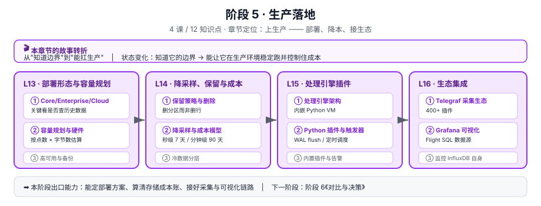

# 阶段 5 · 生产落地

> 所属课程：[InfluxDB 3 系统学习](../../02-课程目录.md) ｜ 水平：进阶 · 偏实操
> 本阶段：**4 课 / 12 知识点** ｜ 状态：✅ 已收官（12 / 12 知识点）

> 🎉 **阶段 5 已完成**：L13 定形态与容量、L14 定保留与降采样、L15 定处理引擎、L16 补齐采集与可观测。
> 下一阶段：[阶段 6《对比与决策》](../6-对比与决策/overview.md)（3 课 / 9 知识点）—— 把 InfluxDB 放回技术选型的坐标系里。

## 🎬 本阶段在故事主线中的章节定位

| 章节 | 本阶段任务 | 主角的状态变化 |
|------|-----------|---------------|
| **第五章 · 上生产** | 部署、降本、接生态 | 知道它的边界 → **能扛生产** |

**这一章是「工作落地」目标的主战场**——前四章让你理解它，这一章让你真的把它跑在生产上。

## 🎯 阶段目标

学完本阶段，你应该能够：

1. 选定部署形态并做容量规划（关键判断：要不要查历史数据）
2. 设计保留策略与降采样方案，算清存储成本账
3. 用处理引擎的 Python 插件做实时转换与告警
4. 接好 Telegraf 采集与 Grafana 可视化，并监控 InfluxDB 自身

## 📚 必须掌握的知识点

### L13 · 部署形态与容量规划 ✅

| 知识点 | 关键点 |
|--------|--------|
| ① Core / Enterprise / Cloud 选型 | ✅ **判据：是否要查历史数据**（Core 无 compactor、单机） |
| ② 容量规划与硬件 | ✅ 点数 × 每点字节数 × 保留期 × 副本数 |
| ③ 高可用与备份 | ✅ ⚠️ 升级前必须备份 catalog（3.10+ 格式迁移单向） |

**核心结论**：

1. **选型第一判据是「要查多久」，不是「要多少钱」** —— `query-file-limit` 432 × `gen1-duration` 10m = **72 小时 ≈ 3 天**，超限是**报错**不是变慢（7 天 = 1,008 文件超 2.3 倍）。官方给新生产负载的默认答案是 **Enterprise**（Core 定位为 edge / non-critical）。
2. **⚠️ 判据易错点**：原生 v3 API 与处理引擎 **Core 与 Enterprise 同源、二者都有**，该需求**只用于排除 Cloud Serverless**（Serverless 无原生 v3 写入 API、无处理引擎），**不构成 Core → Enterprise 的升级理由**。
3. **容量是线性账，但「能存」与「能查」在 Core 上分家** —— 锚点 **10 万点/秒 × 30 天 ≈ 1 TB**（典型压缩比）；90 天 = 3.4 TB 存得下，但 12,960 文件查不了 → **超过 3 天的部分本质只是冷备份**（→ L14 的降采样）。
4. **内存三默认相加 = 90%**（exec 20% + parquet cache 20% + force snapshot 50%），4 GB 机器只剩 0.4 GB → 这是「内存比 CPU 先到瓶颈」的根因。
5. **升级 3.10+ 前必须备份 catalog**（v2→v3 单向不可逆）；**先确认版本再选路径**：3.4.0+ 备份 `catalog/v2/`，<3.4.0 备份 `catalogs/`——旧目录可能是**残留且无效**的回滚源。Core **无内建 backup 命令**，只能停服务打包 data-dir。
6. **Core 是「数据不丢、服务会断」** —— 对象存储持久化 + 计算节点近乎无状态，主机坏了换一台即可，但恢复需重放 WAL；秒级切换必须 Enterprise。就绪探针用 `GET /ready`（校验对象存储连通，200/503）而非 TCP 端口。

**实验**：容量规划模拟器（6 组对照，本机实跑）｜ 部署形态选型决策树模拟器（6 场景 + 五条口诀，本机实跑）｜ `GET /ready` 与 catalog 备份路径（⏳ 待真实环境）

**讲义**：[lesson-13-部署形态与容量规划.md](lessons/lesson-13-部署形态与容量规划.md)

### L14 · 降采样、保留策略与成本 ✅

| 知识点 | 关键点 |
|--------|--------|
| ① 保留策略与删除 | 删分区而非删行（回扣 L1 的"删除昂贵"） |
| ② 降采样与成本模型 | 秒级 7 天 / 分钟级 90 天 / 小时级 1 年 |
| ③ 冷数据分层 | 对象存储与冷数据卸载 |

**讲义**：[lesson-14-降采样保留策略与成本.md](lessons/lesson-14-降采样保留策略与成本.md)

### L15 · 处理引擎：Python 插件与触发器 ✅

| 知识点 | 关键点 |
|--------|--------|
| ① 处理引擎架构 | ✅ 内嵌 Python VM，零拷贝操作时序数据 |
| ② Python 插件与触发器 | ✅ WAL flush 触发 / 定时调度触发 / HTTP 请求触发 |
| ③ 内置插件与告警 | ✅ 官方加固过的插件集（11 个 / 目录页 23 个） |

**核心结论**：

1. **WAL 触发器一天 86,400 次**（绑 WAL flush 事件，默认每秒 1 次，**与数据量无关**），是 `every:1d` 的 **8.6 万倍** → 触发器选型第一原则是「**能慢就别快**」，WAL 只在「必须在写入瞬间判断」（阈值告警、schema 校验）时才值得。
2. **🔴 静默自毁路径**：WAL 插件写回被监听的表 = 指数爆炸（第 n 秒 = `100×2ⁿ⁻¹`）→ **15 秒破百万、20 秒 5,000 万、21 秒 1 亿行/秒，且日志里一个错都没有**（数据库视角一切正常）。防法：**`--trigger-spec "table:源表"`** 从源头杜绝，不要 `all_tables`。
3. **单次耗时 < 触发周期**是硬边界；WAL 插件实用红线 **P99 < 100 ms**（500 ms 吃掉一半墙钟，1000 ms 永远追不上）。
4. **插件不是 sidecar，是抢同一块 CPU 的第四个房客**（所有插件共享同一 Python 进程，回扣 L13 四功能竞争）→ 插件性能预算从写入侧扣。
5. **告警 = 检测器 + Notifier 两件套**：五个检测器（Threshold Deadman / MAD / ADTK / State Change / Forecast Error Evaluator）只做判定，**Notifier 才是发送端**；只装检测器 = 判定结果只落日志。
6. **死信检查往往比阈值告警更重要** —— 采集链路断裂时，阈值告警表现为「一片祥和」。
7. 三个易踩的静默坑：`plugin-dir=""` **不禁用**处理引擎（须 unset/注释）；触发参数**值全为字符串**；`except Exception` **吞不掉** `KeyboardInterrupt` 取消信号。
8. `gh:` 插件**每次触发器启动都重新拉取** → 供应链风险，用 `system.plugin_files` 验版本；生产固定到 commit/tag。

**实验**：触发器频次与资源占用模拟器（5 组对照，本机实跑）｜ 插件代码静态检查器（六条铁律 CI 门禁，本机实跑）｜ 真机跑通插件与告警链路（⏳ 无 Docker 未实跑）

**讲义**：[lesson-15-处理引擎Python插件与触发器.md](lessons/lesson-15-处理引擎Python插件与触发器.md)

### L16 · 生态集成：Telegraf、Grafana 与自监控 ✅

| 知识点 | 关键点 |
|--------|--------|
| ① Telegraf 采集生态 | ✅ 400+ 插件；**`outputs.influxdb_v3` 需 Telegraf ≥ 1.38.0**；迁移时 output 插件大体兼容 |
| ② Grafana 可视化 | ✅ Flight SQL 数据源；**Product 选 InfluxDB Enterprise 3.x**；**SQL 需 HTTP/2** |
| ③ 监控 InfluxDB 自身 | ✅ 用 `GET /ready` 做就绪探针（3.10+）；`/metrics` + `system.*` + 主机层三层分工 |

**核心结论**：

1. **🔴 自监控数据自己也只受 3 天可查窗口**（432 ÷ 144 = 3），且**文件数只跟墙钟有关、跟数据量无关**（与 L15 的 WAL 触发器一天 86,400 次同构）→ **「自监控留 90 天」= 存得下但查不到**，且**砍掉一半指标一个文件都不会少**。出路：降采样（L14）或上 Enterprise（L13）。
2. **🔴 `database_tag` 是 Core 上最危险的 Telegraf 选项** —— 目标库数量 = 该 tag 的**去重值个数**，撞 Core **5 库上限**（回扣 L6）。失败模式是**上线时正常、规模上来后突然炸**，且错误信息不提示「库超了」→ 用前先跑 `SELECT COUNT(DISTINCT(...))`。
3. **「SQL 面板连不上、InfluxQL 面板正常」是排障第一分叉点** —— SQL 走 **Flight SQL(gRPC) 必须 HTTP/2**，InfluxQL 走 HTTP/1.1 不受限；这个非对称现象直接指向代理未开 HTTP/2，可跳过 token/端口的无效排查。
4. **Grafana 连 Core 要在 Product 下拉选「InfluxDB Enterprise 3.x」** —— 官方原话 *"currently, no Core menu option"*，插件目前没有单独的 Core 选项。
5. **五个自监控数据源覆盖面不同，缺一不可**：`/health` 看进程、`/ready` 看对象存储、`/metrics` 看内部状态、`system.*` 看元数据、`system_metrics` 插件看主机。⚠️ **`system_metrics` 采的是主机不是数据库**（名字里的 system 指 OS，依赖 psutil）。
6. **`/health`、`/ping`、`/metrics` 默认都需要认证**（裸 curl 拿 401 常被误判为「服务挂了」）；**`/ping` 必须用 GET，HEAD 返回 404**；`/health` 不返回版本，取版本用 `/ping`。
7. **多 URL = 故障转移，不是双写也不是负载均衡** —— 每个 flush 周期只随机挑一个写入，失败才换下一个；要双写须写两个 output 块。
8. **Grafana 刷新间隔是被忽略的查询放大器** —— 5s → 30s，查询量降到 **1/6**。⚠️ 引用官方「10s 面板 ≈ $31/月」必须对齐口径：那是**每面板 1 个 query**，按 5 query 计要 ×5。
9. **迁移视角的好消息**：2.x → 3.x 时 **Telegraf 是改动最小的一环**（output 插件大体兼容，改几个字段即可），而手写代码几乎全部要重构、Flux 查询必须重写 → 迁移时可把 Telegraf 层作为稳定锚点。

**实验**：Telegraf 配置体检器（14 条规则，有 P0/P1 则 exit 1，纯标准库 `tomllib`，本机实跑）｜ 自监控覆盖率与查询成本模拟器（4 组对照，本机实跑）｜ 真机跑通 TIG 全链路（⏳ 无 Docker 未实跑）

**讲义**：[lesson-16-生态集成与自监控.md](lessons/lesson-16-生态集成与自监控.md)

## 🧭 导航

⬅️ **上一阶段**：[阶段 4《存储引擎与性能》](../4-存储引擎与性能/overview.md)
➡️ **下一阶段**：[阶段 6《对比与决策》](../6-对比与决策/overview.md)
📚 **返回**：[课程目录](../../02-课程目录.md) ｜ [学习路径总览](../../01-学习路径总览.md)
