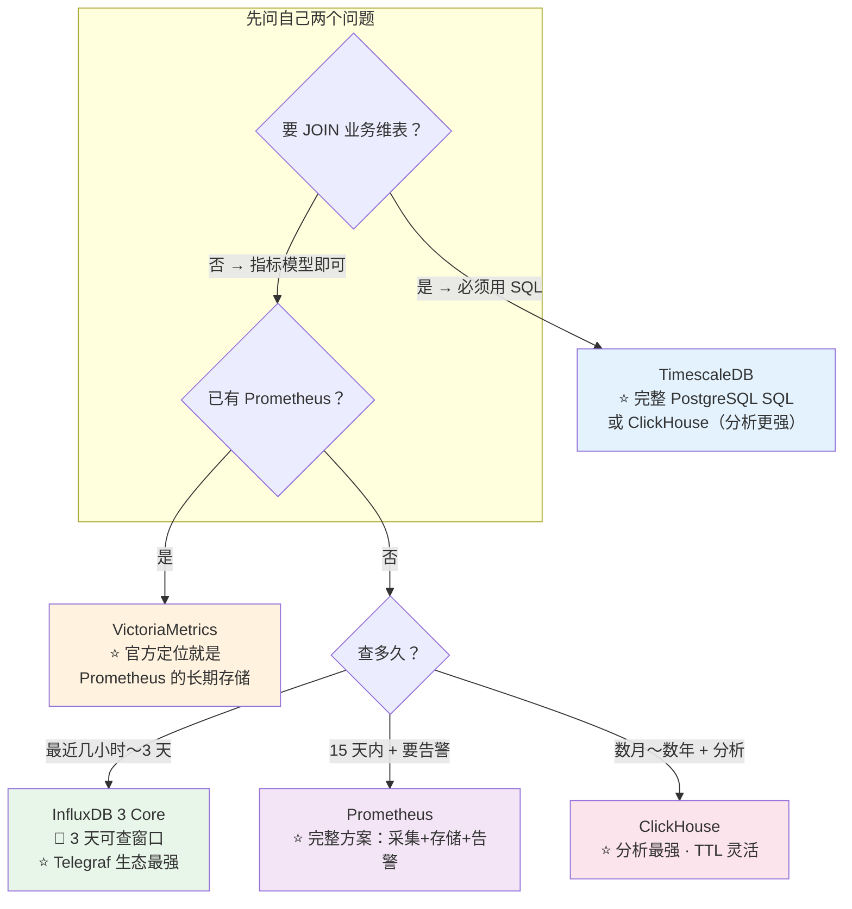
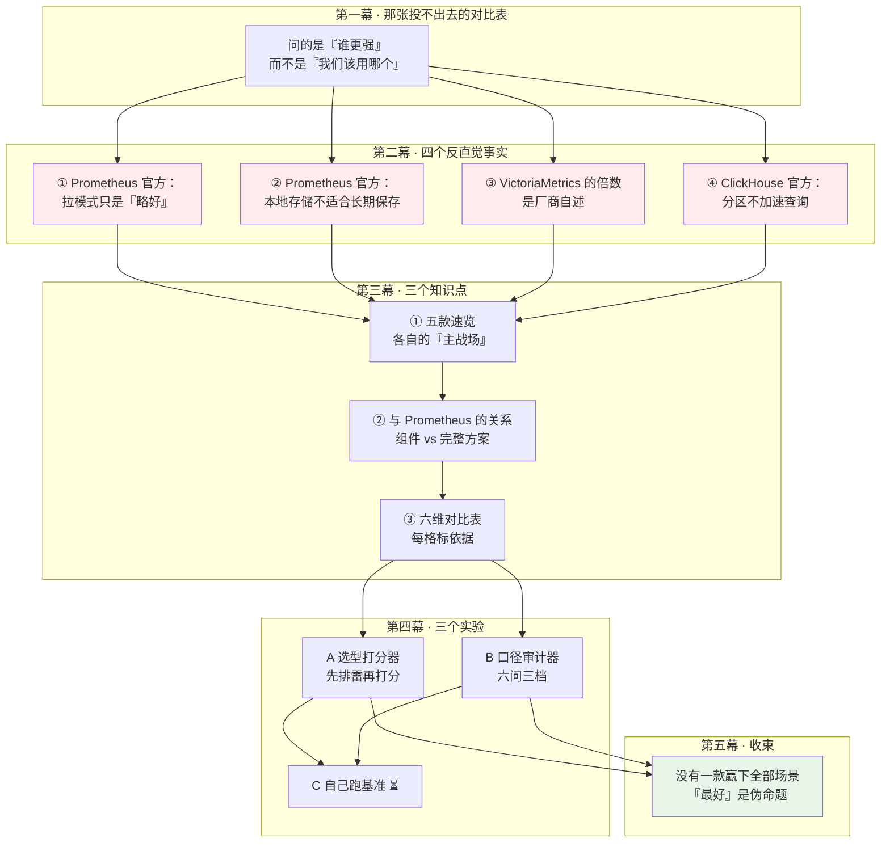

# 第 17 课 · 横向对比：五款候选

> 阶段 6《对比与决策》第 1 课 ｜ 全书 17 / 19 课
> 前置：L1-L16（尤其 L10 存储引擎、L11 文件数上限、L13 选型、L16 生态）
> 基于 **InfluxDB 3 Core 3.11**（2026 年）

---

## 🎯 本课目标

学完本课，你应该能够：

1. 用**一句话**说清五款候选各自的「主战场」，而不是背参数
2. 讲明白 **InfluxDB 与 Prometheus 不是同类东西**——一个是存储引擎，一个是完整监控方案
3. 拿到任何一份对比表，能一眼看出**它有没有在做不公平对照**
4. 把「哪个更好」翻译成「**在我的约束下，哪个能用、哪个更省事**」

> 📌 **本课最重要的一条纪律**（阶段 6 overview 原文要求）：
> 二手基准数字差异极大，**汇报时只取方向性结论，不把具体数值写进决策文档**。
> 本课会给你一套可执行的「口径审计」方法（实验 B），而不是让你去记一堆数字。

---

## 第一幕：起源引入 —— 选型会上，那张投不出去的对比表

### 场景：会议室里的第三次争论

你已经学完 16 课，能独立把 InfluxDB 3 Core 跑起来、接上 Telegraf、在 Grafana 上出图、配降采样和告警。然后领导说：

> 「我们下个季度要统一监控和指标平台。你出一份对比，把市面上主流的时序数据库都比一比，下周评审。」

你花了一周，做出一张表：

| 数据库 | 写入性能 | 查询性能 | 压缩率 | 生态 | 运维复杂度 |
|--------|---------|---------|-------|------|-----------|
| InfluxDB 3 | ⭐⭐⭐⭐ | ⭐⭐⭐⭐ | ⭐⭐⭐⭐ | ⭐⭐⭐⭐⭐ | ⭐⭐⭐ |
| TimescaleDB | ⭐⭐⭐ | ⭐⭐⭐⭐⭐ | ⭐⭐⭐⭐ | ⭐⭐⭐⭐ | ⭐⭐ |
| VictoriaMetrics | ⭐⭐⭐⭐⭐ | ⭐⭐⭐⭐ | ⭐⭐⭐⭐⭐ | ⭐⭐⭐ | ⭐⭐⭐⭐ |
| ClickHouse | ⭐⭐⭐⭐⭐ | ⭐⭐⭐⭐⭐ | ⭐⭐⭐⭐⭐ | ⭐⭐⭐ | ⭐ |
| Prometheus | ⭐⭐⭐ | ⭐⭐⭐⭐⭐ | ⭐⭐⭐⭐ | ⭐⭐⭐⭐⭐ | ⭐⭐⭐⭐⭐ |

然后评审会上，三个问题把你问住了：

**问题一（架构师）**：「Prometheus 的『写入性能三星』是怎么测的？它是个拉模式的监控系统，你拿什么给它打写入分？——你在拿一个**完整方案**和一个**存储引擎**比。」

**问题二（运维）**：「ClickHouse 运维一星，是因为它难，还是因为你没配过？另外我们 K8s 里已经有一套 Prometheus 了，你这张表里根本没体现『已有资产』这个维度。」

**问题三（领导）**：「所以你推荐哪个？」

你答不上来。因为这张表**从一开始就在回答一个错误的问题**——它在问「谁更强」，而不是「我们该用哪个」。

### 三个撞墙的地方

**撞墙一：层次不同，硬比就是不公平。**
InfluxDB 3 Core 是一个**存储引擎**（要配 Telegraf 采集、Grafana 展示）；Prometheus 是一个**采集+存储+告警的完整方案**。拿前者的存储性能比后者的全套能力，就像拿「发动机马力」比「整车售价」——维度对不上。

**撞墙二：数字都是抄来的，没人验证过。**
你在网上看到的「A 比 B 快 20 倍」，绝大多数出自厂商自己的官网。厂商会选择对自己有利的对比对象和配置。这些数字**方向可能是对的，但数值几乎不可能在你的环境里复现**。

**撞墙三：没有一款能赢下所有场景。**
这是最关键的：本课会用四个真实场景跑一遍（实验 A），你会发现**没有一款在四个场景里都排第一**。所谓「最好的时序数据库」是个伪命题。

### 本课的承诺

学完这一课，你会把上面那张投不出去的表，换成一份能投的：

- **先排雷，再打分**——某些场景下某候选是「硬不可行」，不是「分数低」
- **每条结论标依据**——⭐ 官方一手 / ⚠️ 厂商自述或推算 / 📌 本课推导
- **数字只取方向**——具体数值必须经自己实测，或明确标注不可用

---

## 第二幕：认知冲突 —— 四个反直觉事实

这一幕的四个事实，每一个都推翻一个流传很广的说法。它们是本课的骨架。

### 🔴 事实一：Prometheus 官方自己说，拉模式「只是略好」

**流传的说法**：「Prometheus 用拉（pull）模式，比推（push）模式先进，这是它的核心优势。」

**官方原文**（Prometheus FAQ《Why do you pull rather than push?》）：

> Pulling over HTTP offers a number of advantages:
> - You can start extra monitoring instances as needed, e.g. on your laptop when developing changes.
> - You can more easily and reliably tell if a target is down.
> - You can manually go to a target and inspect its health with a web browser.
>
> **Overall, we believe that pulling is slightly better than pushing, but it should not be considered a major point when considering a monitoring system.**

翻译过来：**「总体而言，我们认为拉取比推送略好，但在选择监控系统时，这不应被视为一个决定性因素。」**

**为什么反直觉**：几乎所有介绍 Prometheus 的文章都把拉模式吹成革命性设计，而**发明者本人只给它打了个「略好」**。

**真正重要的是什么**：拉模式带来的不是「性能更好」，而是**「目标挂了你能立刻知道」**——抓取失败就等于目标不可达，不需要额外的健康检查。这个价值在监控场景里很大，但它**跟时序数据库的性能毫无关系**。

⚠️ **推论**：选型时把「拉 vs 推」当作技术优劣来吵，是找错了重点。真正的取舍是：
- 拉模式需要**服务发现**（Prometheus 得知道去哪儿抓）
- 拉模式对**短生命周期任务**（batch job、cronjob、FaaS）不友好——官方给的解法是 Pushgateway，但官方同时说：*"Usually, the only valid use case for the Pushgateway is for capturing the outcome of a service-level batch job."*（通常唯一合理用途是捕获批处理任务的结果）
- 拉模式要求**服务端能访问到目标**，跨网络边界时要额外处理

### 🔴 事实二：Prometheus 官方明说，自己的本地存储「不适合长期保存」

**流传的说法**：「Prometheus 自带 TSDB，可以直接当长期存储用。」

**官方原文**（Prometheus storage 页）：

> Note that a limitation of local storage is that **it is not clustered or replicated**. Thus, it is not arbitrarily scalable or durable in the face of drive or node outages and should be managed like any other single node database.
>
> Again, **Prometheus's local storage is not meant as durable long-term storage**.

**为什么反直觉**：Prometheus 默认的保留期是 **15 天**（`--storage.tsdb.retention.time` 默认 `15d`），很多人以为「改大这个数字就能当长期存储」。官方的说法是：你可以这么做（*"With proper architecture, it is possible to retain years of data in local storage"*），但**本地存储不集群、不复制**，磁盘或节点挂了数据就没了。

⚠️ **这跟 InfluxDB 3 Core 的处境惊人地相似**：
- Core 的「72 小时」实为 **432 个文件**限制（L11 已核实），超限**直接报错**
- Prometheus 的本地存储**默认 15 天**，且**官方明说不适合长期保存**

两者都不是「不能存」，而是**存了也查不了 / 存了不安全**。这个同构性不是巧合——**单机存储引擎都有这一天**，区别只在于谁在文档里说得更直白。

📌 **本课的判据**：评估任何一款，先问「**它官方承认的边界在哪**」，而不是「它号称能撑多大」。

### 🔴 事实三：VictoriaMetrics 官网那几个吓人的倍数，是厂商自述

**流传的说法**：「VictoriaMetrics 比 InfluxDB 快 20 倍、比 TimescaleDB 多存 70 倍数据点、内存只要 InfluxDB 的 1/10。」

**事实**：这些数字**全部出自 VictoriaMetrics 自己的官网首页**（Prominent features 一节），是**厂商自述基准**：

- *"It **outperforms InfluxDB and TimescaleDB by up to 20x**"*
- *"It uses **10x less RAM than InfluxDB** and up to 7x less RAM than Prometheus, Thanos or Cortex"*
- *"up to **70x** more data points may be stored into limited storage compared with TimescaleDB"*
- *"up to **7x less storage space** is required compared with Prometheus, Thanos or Cortex"*

**为什么反直觉**：这些数字被大量技术博客当作「客观 benchmarks」引用，但**没有一条来自中立第三方**。

⚠️ **注意两个关键词**：**`up to`（上界）** 和 **「厂商自述」**。
- `up to 70x` 的最优情况在你的数据上大概率复现不了
- 厂商会选择对自己有利的对比对象、版本和配置

📌 **这不是说数字是假的**——方向（VM 在高基数下确实省内存）是可信的。但**方向可信 ≠ 数值可用**。这正是阶段 6 overview 那条「口径纪律」要解决的问题，本课实验 B 会给一套可执行的审计方法。

> 🎯 **本课自己的一个教训**：在编写实验 A 时，我给 VictoriaMetrics 的「压缩」维度打了满分 5 分，理由写的是「⚠️ 厂商自述 7x……自述基准，慎引」。
> **这恰恰是嘴上说慎引、手上打满分。** 已修正为 4 分，并把这条自检写进了脚本输出。
> 这类错误在真实选型文档里极其常见——**标注了不确定性，却照样按确定值用**。

### 🔴 事实四：ClickHouse 官方说，分区（PARTITION BY）不加速查询

**流传的说法**：「时序数据按月分区，查询就快了。」

**官方原文**（ClickHouse MergeTree 文档）：

> **Partitioning does not speed up queries (in contrast to the ORDER BY expression).**
>
> In most cases, you don't need a partition key, and if you do need to partition, generally you do not need a partition key more granular than by month.

**为什么反直觉**：从 MySQL/PostgreSQL 过来的直觉是「分区 = 剪枝 = 快」。但 ClickHouse 的剪枝机制是**稀疏主键索引（sparse primary index）**，它工作在 **granule（默认 8192 行）粒度**上，靠的是 **ORDER BY** 的排序；而 PARTITION BY 是**更粗的一层**，主要用于数据生命周期管理（DROP PARTITION、TTL 移动），不是查询加速。

⚠️ **官方还警告了一个坑**：*"You should never use too granular partitioning. Don't partition your data by client identifiers or names."* —— 按客户 ID 分区会产生海量小分区，破坏后台合并，最终触发 `Too Many Parts` 错误（`parts_to_throw_insert` 默认 **3000**）。

📌 **这跟本课程的一个核心结论形成呼应**：Core 的文件数只跟墙钟有关、跟数据量无关（L16），ClickHouse 的 part 数只跟写入批次数有关、也跟数据量无关。**「小文件/小 part 问题」是列存架构的通病，不是哪一款的缺陷**。

---

## 第三幕：层层揭示

### 知识点 1 · 五款候选速览

> **目标**：每款用一句话说清「它的主战场在哪」，而不是背参数表。
> **判据**：**它当初是为了解决什么问题被造出来的**——这决定了它的边界。

#### ① InfluxDB 3 Core —— 「最近数据的极速查询 + 采集生态」

| 维度 | 内容 |
|------|------|
| **出身** | 专为时序数据从头设计（非关系库改造） |
| **主战场** | IoT / 实时监控，尤其是**「最近数据」的亚秒级查询** |
| **存储** | WAL + Parquet 列存 + 对象存储（无盘架构，L10） |
| **查询语言** | SQL（DataFusion）+ InfluxQL；**Flux 已移出**（L9） |
| **采集生态** | ⭐ **Telegraf 300+ 插件**（保守口径；官方产品页与文档页称 **400+**，见文末「冲突记录 4」），这是它最深的护城河（L16） |
| **🔴 官方承认的边界** | **可查窗口只有 3 天**（432 文件 × 10min），超限**直接报错**；**无 compactor**，文件只增不减 |

**一句话**：如果你要的是「海量设备数据写进来、查最近几小时、用 Telegraf 直接采」，它是体验最好的；**如果你要查一个月前的数据，它不行——不是慢，是报错**。

> 📌 回扣 L13：官方给新生产负载的默认答案是 **Enterprise** 不是 Core（Core 官方定位 edge / non-critical）。

#### ② TimescaleDB —— 「PostgreSQL 生态 + 完整 SQL」

| 维度 | 内容 |
|------|------|
| **出身** | PostgreSQL 扩展，**不是独立数据库** |
| **主战场** | 需要 **JOIN 业务维表**、需要完整 SQL 的时序分析 |
| **核心机制** | hypertable 自动分片 + hypercore（行存转列存） |
| **查询语言** | ⭐ **标准 PostgreSQL SQL**：JOIN / 窗口函数 / CTE 全支持 |
| **压缩** | ⭐ 官方原文列存压缩 **>90%**（同页另有 `up to 98%` 的上界口径） |
| **🔴 官方承认的边界** | 连续聚合（continuous aggregate）压缩率远低于超表——官方博客实测仅 **61%** |

**一句话**：**唯一能跟业务表 JOIN 的选手**。如果你的问题是「把订单表和指标表放一起查」，只有它能干。代价是写入走 PostgreSQL 事务路径，吞吐不如专用 TSDB。

> ⚠️ 关键权衡：**已有 PostgreSQL = 近乎零新增组件**（DBA 技能、备份、权限、监控全复用）；**没有 PostgreSQL = 要引入并维护一整套**。

#### ③ VictoriaMetrics —— 「Prometheus 的长期存储层」

| 维度 | 内容 |
|------|------|
| **出身** | 作为 **Prometheus 的长期远程存储**被造出来（⭐ 官方原文：*"fast, cost-effective and scalable long-term remote storage for Prometheus"*） |
| **主战场** | 已有 Prometheus、需要延长保留期；或高基数指标场景 |
| **核心机制** | 支持 **Prometheus remote_write**，同时**支持 InfluxDB line protocol**（⭐ 官方） |
| **查询语言** | **MetricsQL**（PromQL 超集） |
| **部署** | 单节点 all-in-one 单二进制；集群版三组件 vminsert / vmselect / vmstorage |
| **🔴 官方承认的边界** | ⭐ 官方明确：MetricsQL 向后兼容 PromQL，但**存在有意差异**（`rate()`、`increase()`、NaN 处理、部分 rollup 行为） |

**一句话**：**它最自然的位置是「Prometheus 的下游存储」，不是「Prometheus 的替代品」**。如果你的团队已经在用 Prometheus 和 Grafana，加一层 VM 是改动最小的延长保留期方案。

> ⚠️ **两条必须知道的限制**：
> ① MetricsQL **不支持 JOIN**（跟 PromQL 一样是指标模型）；
> ② ⭐ 官方原文：**Prometheus Remote Write 2.0 仍不支持**（该协议尚处 experimental 阶段）。

#### ④ ClickHouse —— 「分析型查询的天花板」

| 维度 | 内容 |
|------|------|
| **出身** | 通用 OLAP 列存数据库，**不是专门的时序数据库** |
| **主战场** | 海量数据的**即席分析**（ad-hoc）、需要复杂聚合 |
| **核心机制** | MergeTree：不可变 part + 稀疏主键索引 + 后台合并 |
| **查询语言** | SQL，分析能力最强（JOIN / 物化视图 / projection / 近似分位数） |
| **压缩** | 列存压缩强，⭐ 官方日志场景示例 **194 MB → 24 MB**（约 8x） |
| **🔴 官方承认的边界** | ⭐ **ORDER BY 建表后不可更改**（要改键必须重建表并重导数据）；小批量写入会撞 **`Too Many Parts`**（默认 3000 part） |

**一句话**：**分析能力最强，但监控语义最弱**——它没有 `rate()`、`histogram_quantile()` 这类监控专用函数，你得自己写。而且它的采集侧是空的（没有 Telegraf 级生态）。

> ⚠️ **选型时最常见的误用**：因为 ClickHouse 快，就把它当监控库用。然后发现每次做个 P99 延迟图都要写一长段 SQL。

#### ⑤ Prometheus —— 「完整监控方案，不是存储引擎」

| 维度 | 内容 |
|------|------|
| **出身** | 完整监控告警系统（含采集、存储、告警、服务发现） |
| **主战场** | ⭐ **K8s 云原生监控的事实标准** |
| **核心机制** | 拉模式抓取 + 本地 TSDB（2 小时 block + 后台压缩） |
| **查询语言** | **PromQL** —— 监控语义最强（`rate()` / `histogram_quantile()`） |
| **压缩** | ⭐ 官方原文 **1-2 字节/样本** |
| **🔴 官方承认的边界** | ⭐ **本地存储不集群不复制、不适合长期保存**；默认保留 **15 天**；**PromQL 不支持 JOIN** |

**一句话**：**它不是一个可以跟上面四款平级对比的「数据库」**——它是「采集 + 存储 + 告警」的完整方案。拿它的存储跟 InfluxDB 比，等于拿整车比发动机。

> 📌 **这张表里最容易被忽略的一格**：Prometheus 的「生态」和「运维」都是 5 分——因为它把 Alertmanager、服务发现、exporter 生态**全部内置**了。这是它作为「方案」的真正价值，而不是 TSDB 本身。

#### 五款主战场一图定位



> ⚠️ 这张图回答的是「**从哪开始想**」，不是「选哪个」。真实决策请跑实验 A 的打分器，并优先看**排雷区**。

---

### 知识点 2 · 与 Prometheus 的关系

> **目标**：这是本课**最容易讲错、也最容易被追问**的一节。
> **核心**：**不要问「InfluxDB 和 Prometheus 哪个好」，要先问「你比的是哪一层」。**

#### 层次差：组件 vs 完整方案

| | InfluxDB 3 Core | Prometheus |
|---|---|---|
| **它是什么** | 时序**存储引擎** | **完整监控方案** |
| 采集 | ❌ 需要 Telegraf | ✅ 内置抓取器 + 服务发现 |
| 存储 | ✅ 这是它的核心 | ✅ 本地 TSDB（但官方说不适合长期） |
| 查询 | ✅ SQL / InfluxQL | ✅ PromQL |
| 告警 | ❌ 需处理引擎插件（L15）或外部 | ✅ 内置规则 + Alertmanager |
| 展示 | ❌ 需 Grafana | ❌ 需 Grafana |

📌 **一句话记住**：**InfluxDB 是发动机，Prometheus 是整车。**
拿 InfluxDB 的写入性能比 Prometheus 的「整体能力」，或反过来拿 Prometheus 的生态比 InfluxDB 的「存储功能」，都是不公平对照。

> 🎯 **怎么判断一份对比表公不公平**：看它有没有把「组件」和「整体」混在同一张表里比。混了，这份表的结论就不可用。

#### 推模式 vs 拉模式：真正的取舍是什么

前面事实一已经给出官方口径——**「略好，但不是决定性因素」**。那真正影响选型的到底是什么？

| 维度 | 拉模式（Prometheus） | 推模式（Telegraf / StatsD / Datadog） |
|------|---------------------|-------------------------------------|
| **目标挂了怎么知道** | ⭐ **抓取失败即目标不可达**，天然健康检查 | ❌ 分不清「应用没上报」和「应用已死」 |
| **配置在哪改** | ⭐ 改服务端一处，全局生效 | ❌ 每个应用都要改（100 个服务改 100 处） |
| **调试** | ⭐ 浏览器打开 `/metrics` 就能看 | ❌ 要抓包或查收集端日志 |
| **服务端会不会被打爆** | ⭐ 服务端控速，不会被客户端冲垮 | ❌ 需自己做限流与背压 |
| **短生命周期任务** | ❌ **抓不到**（batch / cronjob / FaaS） | ⭐ 天然支持 |
| **防火墙 / NAT** | ❌ 服务端必须能访问到目标 | ⭐ 客户端主动出连即可 |
| **服务发现依赖** | ❌ 必须知道目标在哪（K8s / Consul / file SD） | ⭐ 客户端自注册 |

📌 **判据（可直接用在选型会上）**：

- **目标长期存在、且在同一网络内** → 拉模式的优势（健康检查、集中配置）都能兑现 → **Prometheus 极强**
- **短生命周期任务为主，或目标在防火墙后 / 跨公网** → 拉模式的两个致命短板同时命中 → **推模式（Telegraf + InfluxDB）更合适**

> ⚠️ **别忽略 Pushgateway 的官方警告**：官方说它通常**只适用于**捕获批处理任务的结果，并列出三个坑：① 单点故障与瓶颈 ② 失去 `up` 指标的自动健康监测 ③ **Pushgateway 永不遗忘推给它的序列**（实例改名或下线后数据仍在，需手动清理）。
> 「用 Pushgateway 把 Prometheus 改造成推模式」是个常见误区——**官方明确不推荐把它当通用采集路径**。

#### 那么，是「InfluxDB 替代 Prometheus」还是「共存」？

这是评审会上最常被问到的问题。**答案是：它们解决的是不同层的问题，主流做法是共存。**

**三种典型组合**（按采用率排序）：

**组合 A · Prometheus 为主，长期存储外挂**（最常见）
```
Prometheus（采集 + 告警 + 近期查询）
    │ remote_write
    ▼
VictoriaMetrics / Thanos / Mimir（长期存储）
    │
    ▼
Grafana（Prometheus datasource 直连任一层）
```
- ⭐ 官方支持：`remote_write` 是 Prometheus 的一等公民特性
- ⭐ 官方说法：*"Prometheus stores incoming data locally and also sends a copy to the remote storage"* —— **本地与远程并行写**，远端挂了本地数据在保留期内仍可查
- 适用：已有 Prometheus，只是保留期不够

**组合 B · InfluxDB + Telegraf 独立成体系**
```
Telegraf（采集，300+ 插件 · 保守口径）
    │ line protocol
    ▼
InfluxDB 3（存储 + 处理引擎告警）
    │
    ▼
Grafana
```
- 适用：**设备/物联网为主**、或短生命周期任务多、或目标在防火墙后
- ⭐ Telegraf 的采集广度是 Prometheus exporter 生态之外的另一极

**组合 C · 混合（两端都有）**
```
Prometheus ──► Alertmanager（告警留在 Prometheus）
    │ remote_write
    ▼
InfluxDB 3（长期存储 + 业务侧分析）
    │
    ▼
Grafana
```
- 适用：K8s 监控走 Prometheus，设备/业务指标走 InfluxDB
- ⚠️ **成本**：两套体系都要维护，团队要懂两种查询语言

> 🎯 **决策判据（一句话）**：
> **告警和服务发现已经在 Prometheus 上跑着 → 别动它，只加长期存储（组合 A）。**
> **还没有监控体系、且数据源以设备/自定义指标为主 → 从 Telegraf + InfluxDB 起步（组合 B）。**

---

### 知识点 3 · 关键维度对比表

> **目标**：给出六个维度的对比，但**每个格子都标依据**，且**不写未经核实的倍数值**。

#### 六维对比（依据标注：⭐ 官方一手 / ⚠️ 厂商自述或推算 / 📌 本课推导）

| 维度 | InfluxDB 3 Core | TimescaleDB | VictoriaMetrics | ClickHouse | Prometheus |
|------|----------------|-------------|-----------------|------------|------------|
| **写入** | ⭐ Telegraf 生态 + Parquet 列存；⚠️ 库 5 / 表 2000 / 列 500 硬限制 | ⭐ 走 PostgreSQL 事务路径，吞吐受限；📌 换完整 SQL 能力 | ⭐ 兼容 remote_write **且支持 InfluxDB line protocol** | ⭐ 批量写入极强；⚠️ **小批量撞 3000 part 上限** | ⭐ 拉模式服务端控速；⚠️ 短生命周期任务需 Pushgateway |
| **查询** | ⭐ SQL(DataFusion) + InfluxQL；⚠️ JOIN 弱 | ⭐ **完整 PostgreSQL SQL：JOIN/CTE/窗口函数** | ⭐ MetricsQL；⚠️ 官方承认与 PromQL 有意差异；❌ 无 JOIN | ⭐ **分析最强**：JOIN/物化视图/projection | ⭐ **PromQL 监控语义最强**；❌ 无 JOIN；⚠️ 分析弱 |
| **压缩** | ⚠️ Parquet 列存；📌 由官方锚点「10万点/秒×30天≈1TB」反推约 **4.2 B/点** | ⭐ 官方列存 **>90%**；⚠️ 连续聚合仅 **61%**（官方博客实测） | ⚠️ 厂商自述 7x 优于 Prometheus/Thanos——**方向可信，数值不可引** | ⭐ 官方日志示例 **194 MB → 24 MB**（约 8x） | ⭐ **1-2 字节/样本**（官方 storage 页原文） |
| **生态** | ⭐ **Telegraf 300+ 插件（保守口径）** + Grafana 原生 | ⭐ 整个 PostgreSQL 生态复用 | ⭐ 可作 Prometheus 下游；Grafana 用 Prometheus datasource | ⚠️ 数据/BI 生态强；❌ 采集侧需自建 | ⭐ **K8s 事实标准** + Alertmanager + 服务发现内置 |
| **运维** | ⭐ 单二进制 + 对象存储；⚠️ **无内建 backup 命令**（L13） | ⭐ 有 PG 则几乎零新增；❌ 无 PG 则要维护一整套 | ⭐ 单节点 all-in-one；集群版三组件 | ❌ 分布式复杂；⭐ **ORDER BY 建后不可改** | ⭐ **单二进制无外部依赖，运维最简单**；⚠️ 非集群非复制 |
| **长期保留** | 🔴 **3 天可查窗口**（432×10min），超限报错；Core 无 compactor | ⭐ 保留策略 + 分层到 S3，无文件数天花板 | ⭐ **设计目标即长期存储**（官方原文） | ⭐ **TTL 原生支持** DELETE/TO DISK/TO VOLUME/GROUP BY | 🔴 **默认 15 天**；⭐ 官方明说不适合长期保存 |

#### 怎么用这张表：三条纪律

**纪律一：先看「🔴 官方承认的边界」，再看优点。**
任何一款的长处都可以被营销放大，但**官方文档里承认的限制是硬约束**。上表里四个 🔴 是最该先读的：

- InfluxDB Core：**3 天可查窗口，超限是报错不是慢**
- Prometheus：**本地存储不集群、不复制、官方明说不适合长期保存**
- （另两条隐性的）ClickHouse：**ORDER BY 建后不可改**；VictoriaMetrics：**无 JOIN**

**纪律二：⚠️ 标记的格子不能裸写进决策文档。**
`4.2 B/点` 是我从官方锚点**反推**的；`7x` 是**厂商自述**的；`>90%` 是官方给的，但同页还有 `up to 98%` 的上界口径。**这些数字只能用来做数量级判断，不能用来做采购计算。**

**纪律三：没有「总分最高」这一行。**
这张表故意不给总分——因为**权重取决于你的场景**。实验 A 就是把这个原则做成可跑的代码。

#### 一张「不公平对照」识别表

评审会上遇到对比表，用这张表快速验伤：

| 陷阱 | 长什么样 | 怎么识别 |
|------|---------|---------|
| **层次错配** | 拿 InfluxDB 存储 比 Prometheus 全套 | 看有没有把「组件」和「整体方案」放同一行 |
| **口径错配** | 引用别人的倍数，单位/分母没对齐 | 每一步都问「这个数字的单位是什么、除以了什么」（L16 的 P0 就栽在这） |
| **上界当典型值** | `up to 98%` 写成「压缩率 98%」 | 看到 `up to` / 「最高」/「可达」一律打折 |
| **厂商自述当第三方** | 引用厂商官网数字不标来源 | 追问「这个数是谁测的」——厂商自述只能取方向 |
| **峰值当稳态** | 用 best-of-N 做容量规划 | 追问「这是峰值还是可持续值」 |
| **忽略已有资产** | 对比表里没有「我们已有什么」这一列 | 补一列：团队技能、已有组件、迁移成本 |

---

## 第四幕：实操验证

> 本课两个实验**均在本机实跑**（Python 3.11.15，纯标准库）。
> 实验 C 依赖真实集群环境，本机不具备，标注 ⏳。

### 实验 A：五款候选选型决策打分器（✅ 本机实跑）

**做什么**：把「哪个更好」翻译成「在我的约束下哪个更省事」。核心设计是**先排雷再打分**——某些场景下某候选是「硬不可行」，不是「分数低」。

**跑法**：

```bash
python l17_selector.py
```

**源码**（`assets/l17_selector.py`，与输出严格一一对应）：

```python
#!/usr/bin/env python3
# -*- coding: utf-8 -*-
"""
L17 · 实验 A：五款候选选型决策打分器（✅ 本机实跑）
=====================================================

把「哪个更好」翻译成「在我的约束下，哪个能用、哪个更省事」。

设计原则（三条，缺一不可）：

  1. 先排雷再打分 —— 某些场景下某候选是「硬不可行」，不是「分数低」。
     这类用 BLOCKER 单独列出，不参与排序。忽略这一步，就会出现
     「选型会上排名第一的方案，上线三周后被一个硬限制打回」。
  2. 每条规则标注依据 —— ⭐ 官方一手文档 / ⚠️ 假设或推算 / 📌 本课推导。
  3. 权重由场景决定 —— 六个维度在不同场景下权重不同，不存在通用最优解。

⚠️ 本脚本的分数是「决策辅助」不是「基准测试」：它回答的是
   「以我现在的约束，哪条路最省事」，不回答「谁的性能更强」。

纯标准库，Python 3.11 实跑。
"""

from dataclasses import dataclass, field
from typing import Callable, Dict, List, Tuple

# ============================================================
# 常量区（每条都标依据，改代码前先改依据）
# ============================================================

# ⭐ InfluxDB 3 Core：query-file-limit 默认 432，gen1-duration 默认 10min
#    432 × 10min = 72h = 3 天，超限制直接报错（L11 官方 config-options 原文核实）
INFLUX_CORE_QUERY_FILE_LIMIT = 432
INFLUX_CORE_GEN1_MINUTES = 10
INFLUX_CORE_MAX_QUERY_DAYS = (
    INFLUX_CORE_QUERY_FILE_LIMIT * INFLUX_CORE_GEN1_MINUTES
) / (24 * 60)  # = 3.0

# ⭐ Prometheus：--storage.tsdb.retention.time 默认 15d（官方 storage 页原文）
PROM_DEFAULT_RETENTION_DAYS = 15

# ⭐ Prometheus：平均每个样本 1-2 字节（官方 storage 页原文）
PROM_BYTES_PER_SAMPLE = (1, 2)

# ⭐ InfluxDB：L13 已核实的容量锚点「10 万点/秒 × 30 天 ≈ 1 TB（典型压缩比）」
#    反推压缩后每点字节数 —— ⚠️ 这是从官方锚点反推，非官方直接给出的数字
INFLUX_ANCHOR_POINTS_PER_SEC = 100_000
INFLUX_ANCHOR_DAYS = 30
INFLUX_ANCHOR_TB = 1.0
INFLUX_BYTES_PER_POINT = (
    INFLUX_ANCHOR_TB * 1024**4
    / (INFLUX_ANCHOR_POINTS_PER_SEC * 86400 * INFLUX_ANCHOR_DAYS)
)

# ⭐ ClickHouse：MergeTree 默认 index_granularity = 8192 行/粒度（官方 MergeTree 页）
# ⭐ ClickHouse：parts_to_throw_insert 默认 3000（超过报 Too Many Parts）
CK_INDEX_GRANULARITY = 8192
CK_PARTS_TO_THROW_INSERT = 3000

# ⭐ TimescaleDB：hypercore 列存压缩 >90%，官方口径「up to 98%」
#    （官方 hypercore 页原文）；连续聚合压缩率官方博客实测 61%
TS_COMPRESSION_PCT = 90
TS_CAGG_COMPRESSION_PCT = 61

# ⚠️ VictoriaMetrics 官网首页自述（厂商自述基准，非中立第三方）
#    「outperforms InfluxDB and TimescaleDB by up to 20x」
#    「10x less RAM than InfluxDB」
#    「up to 70x more data points ... than TimescaleDB」
#    「7x less storage space than Prometheus/Thanos/Cortex」
VM_CLAIM = {
    "speed_vs_influx": 20,
    "ram_vs_influx": 10,
    "points_vs_timescale": 70,
    "storage_vs_prom": 7,
}

CANDIDATES = ["InfluxDB 3 Core", "TimescaleDB", "VictoriaMetrics", "ClickHouse", "Prometheus"]

DIMENSIONS = ["写入", "查询", "压缩", "生态", "运维", "长期保留"]


# ============================================================
# 场景定义
# ============================================================

@dataclass
class Scenario:
    """一个选型场景。字段直接对应选型会上会被问到的那些问题。"""
    name: str
    retention_days: int        # 需要「能查到」的天数（不是「能存多久」）
    points_per_sec: int        # 每秒数据点数
    series_count: int          # 时间线/序列数量
    needs_join: bool           # 是否需要 JOIN 业务维表
    has_prometheus: bool       # 是否已有 Prometheus
    has_postgres: bool         # 是否已有 PostgreSQL（含 DBA）
    k8s_native: bool           # 是否 K8s 环境
    short_lived_jobs: bool     # 是否有短生命周期任务（batch / cronjob / FaaS）
    query_pattern: str         # dashboard / ad-hoc / alerting / mixed
    weights: Dict[str, float] = field(default_factory=dict)


SCENARIOS: List[Scenario] = [
    Scenario(
        name="场景 1 · IoT 设备遥测",
        retention_days=90,
        points_per_sec=50_000,
        series_count=500_000,
        needs_join=False,
        has_prometheus=False,
        has_postgres=False,
        k8s_native=False,
        short_lived_jobs=False,
        query_pattern="dashboard",
        weights={"写入": 1.5, "查询": 1.0, "压缩": 1.5, "生态": 1.0, "运维": 1.0, "长期保留": 2.0},
    ),
    Scenario(
        name="场景 2 · APM / K8s 微服务监控",
        retention_days=15,
        points_per_sec=800_000,
        series_count=5_000_000,
        needs_join=False,
        has_prometheus=True,
        has_postgres=False,
        k8s_native=True,
        short_lived_jobs=True,
        query_pattern="alerting",
        weights={"写入": 1.5, "查询": 1.5, "压缩": 1.0, "生态": 2.0, "运维": 1.0, "长期保留": 1.0},
    ),
    Scenario(
        name="场景 3 · 业务指标分析（要 JOIN 维表）",
        retention_days=730,
        points_per_sec=20_000,
        series_count=50_000,
        needs_join=True,
        has_prometheus=False,
        has_postgres=True,
        k8s_native=False,
        short_lived_jobs=False,
        query_pattern="ad-hoc",
        weights={"写入": 0.5, "查询": 2.0, "压缩": 1.0, "生态": 1.0, "运维": 1.0, "长期保留": 1.5},
    ),
    Scenario(
        name="场景 4 · 混合负载（实时监控 + 历史分析）",
        retention_days=180,
        points_per_sec=300_000,
        series_count=2_000_000,
        needs_join=True,
        has_prometheus=True,
        has_postgres=False,
        k8s_native=True,
        short_lived_jobs=False,
        query_pattern="mixed",
        weights={"写入": 1.5, "查询": 1.5, "压缩": 1.0, "生态": 1.5, "运维": 1.0, "长期保留": 1.5},
    ),
]


# ============================================================
# 排雷规则（BLOCKER）：硬不可行，不参与打分
# ============================================================

def blockers(cand: str, s: Scenario) -> List[str]:
    """返回该候选在该场景下的硬伤列表。非空即视为不可行。"""
    out: List[str] = []

    if cand == "InfluxDB 3 Core":
        # ⭐ 432 文件 × 10min = 3 天。超过就是报错，不是变慢（L11 官方核实）
        if s.retention_days > INFLUX_CORE_MAX_QUERY_DAYS:
            out.append(
                f"要查 {s.retention_days} 天，但 Core 可查窗口只有 "
                f"{INFLUX_CORE_MAX_QUERY_DAYS:.0f} 天"
                f"（432 文件 × 10min，超限直接报错）→ 需 Enterprise 或第三方直读 Parquet"
            )
        # ⭐ L6 官方硬限制：库 5 / 表 2000 / 列 500
        if s.series_count > 10_000_000:
            out.append("序列量级远超 Core 定位（Core 官方定位 edge / non-critical，L13）")

    if cand == "Prometheus":
        # ⭐ 官方 storage 页：本地存储非集群非复制，默认保留 15 天
        if s.retention_days > PROM_DEFAULT_RETENTION_DAYS:
            out.append(
                f"要查 {s.retention_days} 天，本地存储默认 {PROM_DEFAULT_RETENTION_DAYS} 天；"
                f"官方明说本地存储不集群不复制 → 长期保留必须接远程存储"
            )
        # ⭐ 官方 FAQ 与 storage 页：Prometheus 是「指标」系统，不是通用分析库
        if s.needs_join:
            out.append("PromQL 不支持 JOIN 业务维表（官方定位：收集处理指标，不是分析库）")

    if cand == "VictoriaMetrics":
        if s.needs_join:
            out.append("MetricsQL 不支持 JOIN 业务维表（PromQL 超集，同属指标模型）")

    if cand == "ClickHouse":
        # ⭐ 官方：小批量写入会产生大量 part，parts_to_throw_insert 默认 3000 即报错
        if s.points_per_sec < 1000:
            out.append(
                f"写入速率过低（{s.points_per_sec}/s），小批量会产生大量 part，"
                f"官方默认 3000 part 即报 Too Many Parts → 需外部攒批"
            )

    if cand == "TimescaleDB":
        if s.points_per_sec > 1_000_000:
            out.append(
                f"写入速率 {s.points_per_sec:,}/s 超出 PostgreSQL 单实例舒适区"
                f"（⚠️ 该阈值为工程经验值，非官方硬限制）"
            )

    return out


# ============================================================
# 六维打分规则：每条返回 (0~5 分, 理由)
# ============================================================

def score_influx(dim: str, s: Scenario) -> Tuple[int, str]:
    if dim == "写入":
        # ⭐ Telegraf 生态 + 对象存储无盘架构；⚠️ 但库/表/列有硬限制
        sc = 5 if s.points_per_sec >= 100_000 else 4
        return sc, "Telegraf 生态成熟 + Parquet 列存写入路径；⚠️ 库 5 / 表 2000 / 列 500 硬限制"
    if dim == "查询":
        if s.needs_join:
            return 1, "3.x 只有 SQL/InfluxQL，JOIN 维表能力弱（📌 非官方定位）"
        return 4, "SQL 为主（DataFusion），时间分桶/窗口函数完备，监控类查询顺手"
    if dim == "压缩":
        return 4, f"Parquet 列存压缩；⚠️ 由官方锚点反推约 {INFLUX_BYTES_PER_POINT:.1f} 字节/点"
    if dim == "生态":
        return 5, "Telegraf（300+ 插件 · 保守口径）+ Grafana 原生支持，采集侧最强（L16 已学）"
    if dim == "运维":
        return 4, "单二进制 + 对象存储，部署简单；⚠️ Core 无内建 backup 命令（L13）"
    if dim == "长期保留":
        # ⭐ 无 compactor，文件数只增不减
        return 1, "Core 无 compactor，90 天约 12,960 文件；存得下但查不到（L10/L11）"
    return 0, ""


def score_timescale(dim: str, s: Scenario) -> Tuple[int, str]:
    if dim == "写入":
        sc = 3 if s.points_per_sec <= 200_000 else 2
        return sc, "写入走 PostgreSQL 事务路径，吞吐不如专用 TSDB；⚠️ 经验判断"
    if dim == "查询":
        if s.needs_join:
            return 5, "标准 PostgreSQL SQL：JOIN / 窗口函数 / CTE 全支持，唯一全能选手"
        return 4, "time_bucket + 连续聚合（增量刷新，普通物化视图做不到）"
    if dim == "压缩":
        return 4, f"hypercore 列存压缩 >{TS_COMPRESSION_PCT}%（⭐ 官方）；⚠️ 连续聚合仅 {TS_CAGG_COMPRESSION_PCT}%（官方博客实测）"
    if dim == "生态":
        sc = 5 if s.has_postgres else 3
        return sc, "整个 PostgreSQL 生态复用（备份/权限/监控/DBA 技能）"
    if dim == "运维":
        sc = 5 if s.has_postgres else 2
        return sc, "已有 PG 则近乎零新增组件；否则要引入并维护一整套 PostgreSQL"
    if dim == "长期保留":
        return 5, "保留策略 + 分层存储到 S3（⭐ 官方 bottomless tiering），无文件数天花板"
    return 0, ""


def score_victoria(dim: str, s: Scenario) -> Tuple[int, str]:
    if dim == "写入":
        sc = 5 if s.has_prometheus else 4
        return sc, "兼容 Prometheus remote_write，且支持 InfluxDB line protocol（⭐ 官方）"
    if dim == "查询":
        if s.needs_join:
            return 1, "MetricsQL 无 JOIN（PromQL 超集，仍是指标模型）"
        sc = 4 if s.has_prometheus else 2
        return sc, "MetricsQL 向后兼容 PromQL；⚠️ 官方承认存在有意差异（rate/NaN/rollup）"
    if dim == "压缩":
        # ⚠️ 关键：厂商自述「7x 优于 Prometheus」只是方向性结论，
        #    按本课口径纪律，自述基准不能当决策依据 → 不给满分。
        #    这与脚本其余部分「⭐ 官方参数 / ⚠️ 自述推算」的标注纪律保持一致。
        return 4, "⚠️ 厂商自述 7x 优于 Prometheus —— 方向可信，但自述基准不作决策依据（故不给 5 分）"
    if dim == "生态":
        sc = 5 if s.has_prometheus else 2
        return sc, "可作 Prometheus 的长期存储层，Grafana 直接用 Prometheus datasource"
    if dim == "运维":
        return 4, "单节点 all-in-one 单二进制；集群版三组件（vminsert/vmselect/vmstorage）"
    if dim == "长期保留":
        return 5, "设计目标即长期存储（⭐ 官方：long-term remote storage for Prometheus）"
    return 0, ""


def score_clickhouse(dim: str, s: Scenario) -> Tuple[int, str]:
    if dim == "写入":
        sc = 5 if s.points_per_sec >= 100_000 else 2
        return sc, f"批量写入极强；⚠️ 小批量会撞 Too Many Parts（官方默认 {CK_PARTS_TO_THROW_INSERT} part）"
    if dim == "查询":
        if s.query_pattern in ("ad-hoc", "mixed"):
            return 5, "分析型最强：JOIN / 物化视图 / projection / 近似分位数全支持"
        return 3, "分析能力强，但监控类查询（率值/分位）需手写，不如 PromQL 顺手"
    if dim == "压缩":
        return 5, "列存压缩强，官方日志示例 194 MB → 24 MB（约 8x）"
    if dim == "生态":
        return 3, "数据与 BI 生态强；⚠️ 监控采集侧需自建（无 Telegraf 级生态）"
    if dim == "运维":
        return 2, "分布式部署复杂；⭐ ORDER BY 建后不可改，改键要重建表重导数据"
    if dim == "长期保留":
        return 5, "TTL 原生支持 DELETE / TO DISK / TO VOLUME / GROUP BY（⭐ 官方）"
    return 0, ""


def score_prometheus(dim: str, s: Scenario) -> Tuple[int, str]:
    if dim == "写入":
        if s.short_lived_jobs:
            return 2, "拉取模型对短生命周期任务不友好，需 Pushgateway（⭐ 官方：仅推荐批处理场景）"
        return 4, "拉取模型，服务端控速；⚠️ 但目标必须可被服务端访问到"
    if dim == "查询":
        if s.needs_join:
            return 1, "PromQL 不支持 JOIN（⭐ 官方 FAQ：Prometheus 是指标系统不是事件日志系统）"
        sc = 5 if s.query_pattern == "alerting" else 3
        return sc, "PromQL 监控语义最强（rate/histogram_quantile）；⚠️ 分析类查询弱"
    if dim == "压缩":
        return 4, f"官方原文 1-2 字节/样本（⭐），样本级压缩优秀"
    if dim == "生态":
        sc = 5 if s.k8s_native else 3
        return sc, "K8s 事实标准 + Alertmanager 原生 + 服务发现内置（⭐ 官方设计）"
    if dim == "运维":
        return 5, "单二进制、无外部依赖，运维最简单；⚠️ 但非集群非复制（⭐ 官方明说）"
    if dim == "长期保留":
        return 1, "本地存储默认 15 天且不集群不复制（⭐ 官方）；长期保留必须外挂"
    return 0, ""


SCORERS: Dict[str, Callable[[str, Scenario], Tuple[int, str]]] = {
    "InfluxDB 3 Core": score_influx,
    "TimescaleDB": score_timescale,
    "VictoriaMetrics": score_victoria,
    "ClickHouse": score_clickhouse,
    "Prometheus": score_prometheus,
}


# ============================================================
# 主流程
# ============================================================

def evaluate(s: Scenario) -> Tuple[List[Tuple[str, float, List[str]]], Dict[str, List[str]]]:
    """返回 (可用候选的加权分排序, 全部候选的 blocker 表)"""
    all_blockers: Dict[str, List[str]] = {}
    ranked: List[Tuple[str, float]] = []

    for cand in CANDIDATES:
        bl = blockers(cand, s)
        all_blockers[cand] = bl
        if bl:
            continue  # 有硬伤，不参与排名

        total, wsum = 0.0, 0.0
        for dim, w in s.weights.items():
            sc, _ = SCORERS[cand](dim, s)
            total += sc * w
            wsum += w
        ranked.append((cand, total / wsum if wsum else 0.0))

    ranked.sort(key=lambda x: -x[1])
    return ranked, all_blockers


def main() -> None:
    print("=" * 78)
    print("L17 实验 A · 五款候选选型决策打分器")
    print("=" * 78)

    # ---- 前置：先展示常量与依据 ----
    print("\n【规则常量与依据】")
    print(f"  InfluxDB Core 可查窗口 : {INFLUX_CORE_MAX_QUERY_DAYS:.0f} 天"
          f"  ⭐ 432 文件 × 10min（官方 config-options）")
    print(f"  Prometheus 默认保留    : {PROM_DEFAULT_RETENTION_DAYS} 天"
          f"  ⭐ --storage.tsdb.retention.time 默认值")
    print(f"  Prometheus 每样本字节  : {PROM_BYTES_PER_SAMPLE[0]}-{PROM_BYTES_PER_SAMPLE[1]} B"
          f"  ⭐ 官方 storage 页原文")
    print(f"  InfluxDB 压缩后每点    : {INFLUX_BYTES_PER_POINT:.2f} B"
          f"  ⚠️ 由官方锚点「10万点/秒×30天≈1TB」反推")
    print(f"  ClickHouse part 上限   : {CK_PARTS_TO_THROW_INSERT}"
          f"  ⭐ parts_to_throw_insert 默认值")
    print(f"  TimescaleDB 压缩率     : >{TS_COMPRESSION_PCT}%"
          f"  ⭐ 官方 hypercore 页")

    for s in SCENARIOS:
        print("\n" + "=" * 78)
        print(f"▶ {s.name}")
        print("=" * 78)
        print(f"  保留(可查) {s.retention_days} 天 · {s.points_per_sec:,} 点/秒 · "
              f"{s.series_count:,} 序列 · 查询模式 {s.query_pattern}")
        print(f"  要 JOIN 维表 {'是' if s.needs_join else '否'} · "
              f"已有 Prometheus {'是' if s.has_prometheus else '否'} · "
              f"已有 PostgreSQL {'是' if s.has_postgres else '否'} · "
              f"K8s {'是' if s.k8s_native else '否'} · "
              f"短生命周期任务 {'有' if s.short_lived_jobs else '无'}")

        ranked, all_blockers = evaluate(s)

        # ---- 排雷区 ----
        blocked = {c: b for c, b in all_blockers.items() if b}
        if blocked:
            print(f"\n  🚫 排雷（{len(blocked)} 款硬不可行，不参与排名）：")
            for cand, bl in blocked.items():
                for i, reason in enumerate(bl):
                    prefix = "     ├─" if i < len(bl) - 1 else "     └─"
                    print(f"{prefix} {cand}：{reason}")
        else:
            print("\n  ✅ 无硬伤候选，全部参与排名")

        # ---- 打分明细 ----
        print(f"\n  📊 打分明细（0-5 分，权重已按本场景调整）：")
        header = "     " + "候选".ljust(18) + "".join(d.ljust(8) for d in DIMENSIONS) + "加权"
        print(header)
        print("     " + "-" * (len(header) - 5))
        for cand in CANDIDATES:
            if all_blockers[cand]:
                cells = "".join("—".ljust(8) for _ in DIMENSIONS)
                print(f"     " + cand.ljust(18) + cells + "  (排雷)")
                continue
            cells, total, wsum = "", 0.0, 0.0
            for dim in DIMENSIONS:
                sc, _ = SCORERS[cand](dim, s)
                w = s.weights[dim]
                total += sc * w
                wsum += w
                cells += f"{sc}".ljust(8)
            print(f"     " + cand.ljust(18) + cells + f"{total / wsum:.2f}")

        # ---- 结论 ----
        print(f"\n  🏆 可用候选排序：")
        for i, (cand, sc) in enumerate(ranked, 1):
            print(f"     {i}. {cand.ljust(18)} {sc:.2f} 分")
        if not ranked:
            print("     （无可用候选 —— 说明该场景需要组合方案，见讲义第五幕）")

        # ---- 关键理由 ----
        print(f"\n  💬 排名前二的关键理由：")
        for cand, _ in ranked[:2]:
            best_dim, best_sc, best_reason = None, -1, ""
            for dim in DIMENSIONS:
                sc, reason = SCORERS[cand](dim, s)
                if sc > best_sc:
                    best_dim, best_sc, best_reason = dim, sc, reason
            worst_dim, worst_sc, worst_reason = None, 99, ""
            for dim in DIMENSIONS:
                sc, reason = SCORERS[cand](dim, s)
                if sc < worst_sc:
                    worst_dim, worst_sc, worst_reason = dim, sc, reason
            print(f"     【{cand}】")
            print(f"        最强项 {best_dim}（{best_sc}/5）：{best_reason}")
            print(f"        最弱项 {worst_dim}（{worst_sc}/5）：{worst_reason}")

    # ---- 收束 ----
    print("\n" + "=" * 78)
    print("📌 从四个场景能读出什么")
    print("=" * 78)
    print("  1. 没有一款在四个场景里都排第一 —— 所谓「最好的时序数据库」是个伪命题。")
    print("  2. 排雷比打分重要：场景 1 里 InfluxDB Core 不是「分数低」，是「查不到」。")
    print("  3. 已有基础设施（Prometheus / PostgreSQL）权重极高 —— 选型是算总账，")
    print("     不是算单项分。")
    print("  4. 混合负载（场景 4）逼出组合方案：这也正是 L19 要解决的事。")
    print("  5. 【口径纪律自检】VictoriaMetrics 压缩维度初版给了 5 分，但依据只是厂商自述；")
    print("     本课明确要求「自述基准不作决策依据」→ 已降为 4 分。")
    print("     这类「嘴上说慎引、手上打满分」的错，正是选型文档最常犯的。")


if __name__ == "__main__":
    main()
```

**真实输出**（本机 Python 3.11.15 实跑，逐字回贴）：

```text
==============================================================================
L17 实验 A · 五款候选选型决策打分器
==============================================================================

【规则常量与依据】
  InfluxDB Core 可查窗口 : 3 天  ⭐ 432 文件 × 10min（官方 config-options）
  Prometheus 默认保留    : 15 天  ⭐ --storage.tsdb.retention.time 默认值
  Prometheus 每样本字节  : 1-2 B  ⭐ 官方 storage 页原文
  InfluxDB 压缩后每点    : 4.24 B  ⚠️ 由官方锚点「10万点/秒×30天≈1TB」反推
  ClickHouse part 上限   : 3000  ⭐ parts_to_throw_insert 默认值
  TimescaleDB 压缩率     : >90%  ⭐ 官方 hypercore 页

==============================================================================
▶ 场景 1 · IoT 设备遥测
==============================================================================
  保留(可查) 90 天 · 50,000 点/秒 · 500,000 序列 · 查询模式 dashboard
  要 JOIN 维表 否 · 已有 Prometheus 否 · 已有 PostgreSQL 否 · K8s 否 · 短生命周期任务 无

  🚫 排雷（2 款硬不可行，不参与排名）：
     └─ InfluxDB 3 Core：要查 90 天，但 Core 可查窗口只有 3 天（432 文件 × 10min，超限直接报错）→ 需 Enterprise 或第三方直读 Parquet
     └─ Prometheus：要查 90 天，本地存储默认 15 天；官方明说本地存储不集群不复制 → 长期保留必须接远程存储

  📊 打分明细（0-5 分，权重已按本场景调整）：
     候选                写入      查询      压缩      生态      运维      长期保留    加权
     --------------------------------------------------------------------
     InfluxDB 3 Core   —       —       —       —       —       —         (排雷)
     TimescaleDB       3       4       4       3       2       5       3.69
     VictoriaMetrics   4       2       4       2       4       5       3.75
     ClickHouse        2       3       5       3       2       5       3.56
     Prometheus        —       —       —       —       —       —         (排雷)

  🏆 可用候选排序：
     1. VictoriaMetrics    3.75 分
     2. TimescaleDB        3.69 分
     3. ClickHouse         3.56 分

  💬 排名前二的关键理由：
     【VictoriaMetrics】
        最强项 长期保留（5/5）：设计目标即长期存储（⭐ 官方：long-term remote storage for Prometheus）
        最弱项 查询（2/5）：MetricsQL 向后兼容 PromQL；⚠️ 官方承认存在有意差异（rate/NaN/rollup）
     【TimescaleDB】
        最强项 长期保留（5/5）：保留策略 + 分层存储到 S3（⭐ 官方 bottomless tiering），无文件数天花板
        最弱项 运维（2/5）：已有 PG 则近乎零新增组件；否则要引入并维护一整套 PostgreSQL

==============================================================================
▶ 场景 2 · APM / K8s 微服务监控
==============================================================================
  保留(可查) 15 天 · 800,000 点/秒 · 5,000,000 序列 · 查询模式 alerting
  要 JOIN 维表 否 · 已有 Prometheus 是 · 已有 PostgreSQL 否 · K8s 是 · 短生命周期任务 有

  🚫 排雷（1 款硬不可行，不参与排名）：
     └─ InfluxDB 3 Core：要查 15 天，但 Core 可查窗口只有 3 天（432 文件 × 10min，超限直接报错）→ 需 Enterprise 或第三方直读 Parquet

  📊 打分明细（0-5 分，权重已按本场景调整）：
     候选                写入      查询      压缩      生态      运维      长期保留    加权
     --------------------------------------------------------------------
     InfluxDB 3 Core   —       —       —       —       —       —         (排雷)
     TimescaleDB       2       4       4       3       2       5       3.25
     VictoriaMetrics   5       4       4       5       4       5       4.56
     ClickHouse        5       3       5       3       2       5       3.75
     Prometheus        2       5       4       5       5       1       3.81

  🏆 可用候选排序：
     1. VictoriaMetrics    4.56 分
     2. Prometheus         3.81 分
     3. ClickHouse         3.75 分
     4. TimescaleDB        3.25 分

  💬 排名前二的关键理由：
     【VictoriaMetrics】
        最强项 写入（5/5）：兼容 Prometheus remote_write，且支持 InfluxDB line protocol（⭐ 官方）
        最弱项 查询（4/5）：MetricsQL 向后兼容 PromQL；⚠️ 官方承认存在有意差异（rate/NaN/rollup）
     【Prometheus】
        最强项 查询（5/5）：PromQL 监控语义最强（rate/histogram_quantile）；⚠️ 分析类查询弱
        最弱项 长期保留（1/5）：本地存储默认 15 天且不集群不复制（⭐ 官方）；长期保留必须外挂

==============================================================================
▶ 场景 3 · 业务指标分析（要 JOIN 维表）
==============================================================================
  保留(可查) 730 天 · 20,000 点/秒 · 50,000 序列 · 查询模式 ad-hoc
  要 JOIN 维表 是 · 已有 Prometheus 否 · 已有 PostgreSQL 是 · K8s 否 · 短生命周期任务 无

  🚫 排雷（3 款硬不可行，不参与排名）：
     └─ InfluxDB 3 Core：要查 730 天，但 Core 可查窗口只有 3 天（432 文件 × 10min，超限直接报错）→ 需 Enterprise 或第三方直读 Parquet
     └─ VictoriaMetrics：MetricsQL 不支持 JOIN 业务维表（PromQL 超集，同属指标模型）
     ├─ Prometheus：要查 730 天，本地存储默认 15 天；官方明说本地存储不集群不复制 → 长期保留必须接远程存储
     └─ Prometheus：PromQL 不支持 JOIN 业务维表（官方定位：收集处理指标，不是分析库）

  📊 打分明细（0-5 分，权重已按本场景调整）：
     候选                写入      查询      压缩      生态      运维      长期保留    加权
     --------------------------------------------------------------------
     InfluxDB 3 Core   —       —       —       —       —       —         (排雷)
     TimescaleDB       3       5       4       5       5       5       4.71
     VictoriaMetrics   —       —       —       —       —       —         (排雷)
     ClickHouse        2       5       5       3       2       5       4.07
     Prometheus        —       —       —       —       —       —         (排雷)

  🏆 可用候选排序：
     1. TimescaleDB        4.71 分
     2. ClickHouse         4.07 分

  💬 排名前二的关键理由：
     【TimescaleDB】
        最强项 查询（5/5）：标准 PostgreSQL SQL：JOIN / 窗口函数 / CTE 全支持，唯一全能选手
        最弱项 写入（3/5）：写入走 PostgreSQL 事务路径，吞吐不如专用 TSDB；⚠️ 经验判断
     【ClickHouse】
        最强项 查询（5/5）：分析型最强：JOIN / 物化视图 / projection / 近似分位数全支持
        最弱项 写入（2/5）：批量写入极强；⚠️ 小批量会撞 Too Many Parts（官方默认 3000 part）

==============================================================================
▶ 场景 4 · 混合负载（实时监控 + 历史分析）
==============================================================================
  保留(可查) 180 天 · 300,000 点/秒 · 2,000,000 序列 · 查询模式 mixed
  要 JOIN 维表 是 · 已有 Prometheus 是 · 已有 PostgreSQL 否 · K8s 是 · 短生命周期任务 无

  🚫 排雷（3 款硬不可行，不参与排名）：
     └─ InfluxDB 3 Core：要查 180 天，但 Core 可查窗口只有 3 天（432 文件 × 10min，超限直接报错）→ 需 Enterprise 或第三方直读 Parquet
     └─ VictoriaMetrics：MetricsQL 不支持 JOIN 业务维表（PromQL 超集，同属指标模型）
     ├─ Prometheus：要查 180 天，本地存储默认 15 天；官方明说本地存储不集群不复制 → 长期保留必须接远程存储
     └─ Prometheus：PromQL 不支持 JOIN 业务维表（官方定位：收集处理指标，不是分析库）

  📊 打分明细（0-5 分，权重已按本场景调整）：
     候选                写入      查询      压缩      生态      运维      长期保留    加权
     --------------------------------------------------------------------
     InfluxDB 3 Core   —       —       —       —       —       —         (排雷)
     TimescaleDB       2       5       4       3       2       5       3.56
     VictoriaMetrics   —       —       —       —       —       —         (排雷)
     ClickHouse        5       5       5       3       2       5       4.25
     Prometheus        —       —       —       —       —       —         (排雷)

  🏆 可用候选排序：
     1. ClickHouse         4.25 分
     2. TimescaleDB        3.56 分

  💬 排名前二的关键理由：
     【ClickHouse】
        最强项 写入（5/5）：批量写入极强；⚠️ 小批量会撞 Too Many Parts（官方默认 3000 part）
        最弱项 运维（2/5）：分布式部署复杂；⭐ ORDER BY 建后不可改，改键要重建表重导数据
     【TimescaleDB】
        最强项 查询（5/5）：标准 PostgreSQL SQL：JOIN / 窗口函数 / CTE 全支持，唯一全能选手
        最弱项 写入（2/5）：写入走 PostgreSQL 事务路径，吞吐不如专用 TSDB；⚠️ 经验判断

==============================================================================
📌 从四个场景能读出什么
==============================================================================
  1. 没有一款在四个场景里都排第一 —— 所谓「最好的时序数据库」是个伪命题。
  2. 排雷比打分重要：场景 1 里 InfluxDB Core 不是「分数低」，是「查不到」。
  3. 已有基础设施（Prometheus / PostgreSQL）权重极高 —— 选型是算总账，
     不是算单项分。
  4. 混合负载（场景 4）逼出组合方案：这也正是 L19 要解决的事。
  5. 【口径纪律自检】VictoriaMetrics 压缩维度初版给了 5 分，但依据只是厂商自述；
     本课明确要求「自述基准不作决策依据」→ 已降为 4 分。
     这类「嘴上说慎引、手上打满分」的错，正是选型文档最常犯的。
```

**怎么读这份输出**：

1. **先看 🚫 排雷区，再看 🏆 排名**。场景 1 里 InfluxDB Core 不是「分数低」，是「查不到」——这种差异在打分表里看不出来，只能靠排雷规则拦。
2. **每个场景的冠军都不一样**：场景 1 是 VictoriaMetrics、场景 2 是 VictoriaMetrics、场景 3 是 TimescaleDB、场景 4 是 ClickHouse。**没有任何一款赢下全部场景**。
3. **「已有资产」的权重极大**：场景 3 里 TimescaleDB 能拿 4.71 分，一半功劳来自 `has_postgres=True`（生态 5 分 + 运维 5 分）。同一款在场景 4（无 PostgreSQL）只有 3.56 分。
4. **看「最弱项」比看「最强项」有用**：排名第一的方案，往往栽在它的最弱项上——场景 4 的 ClickHouse 运维只有 2 分（⭐ ORDER BY 建后不可改）。

### 实验 B：基准数字「口径审计器」（✅ 本机实跑）

**做什么**：不复现别人的基准，而是**审任何一个基准数字的口径**，再决定能不能用。直接落实 overview 的口径纪律。

**跑法**：

```bash
python l17_benchmark_audit.py
```

**源码**（`assets/l17_benchmark_audit.py`，与输出严格一一对应）：

```python
#!/usr/bin/env python3
# -*- coding: utf-8 -*-
"""
L17 · 实验 B：基准数字「口径审计器」（✅ 本机实跑）
====================================================

overview 的口径纪律原文：
  「二手基准数字差异极大，汇报时只取方向性结论，
    不把具体数值写进决策文档。」

本课之前的课程反复踩过同一个坑（L16 的 P0：引用官方「10s 面板 ≈ $31/月」
时口径没对齐，一个算每面板 1 query、一个算 5 query，差 5 倍）。

所以本实验不复现别人的基准，而是做一件更实用的事：
  **拿到任何一个基准数字，先审它的口径，再决定能不能用。**

审计六问（缺一不可）：
  Q1 谁测的？        厂商 / 中立第三方 / 自己
  Q2 测的什么？      组件 vs 整体；写入 vs 查询 vs 压缩
  Q3 口径对齐了吗？  单位、分母、时间窗、行数/体积
  Q4 配置说清楚了吗？ 硬件、版本、并发、数据量级
  Q5 是峰值还是稳态？ best-of-N 还是可持续值
  Q6 能写进决策文档吗？ 前三问任一不过关 → 只能取方向

⚠️ Q0（v2 补，评审发现的分类缺陷）：
  上面六问默认「待审对象是一条性能宣称」。但真实清单里混着三类
  性质完全不同的东西，用同一套问法审会得出荒谬结论 —— 例如把
  「InfluxDB Core 只能查 3 天」这条**官方配置硬约束**判成
  「⚠️ 不能裸写数字」，而它恰恰是全课最硬的排雷依据。

  故增加 Q0「这条宣称属于哪一类」，三类分治：
    benchmark  —— 性能/容量宣称（六问全审）
    spec       —— 官方配置默认值、硬限制（只审「是否官方原文 + 是否版本敏感」）
    misread    —— 理解错误（不论是否 verified，一律 ❌；验证只能证伪）

纯标准库，Python 3.11 实跑（v2）。
"""

from dataclasses import dataclass
from typing import List, Optional

# ============================================================
# 数据结构
# ============================================================

@dataclass
class Claim:
    """一条待审宣称（claim）。字段对应审计六问 + Q0 分类。"""
    text: str                    # 宣称原文
    claim_kind: str              # Q0 分类：benchmark / spec / misread
    source_type: str             # vendor / third_party / in_house
    subject: str                 # 被测对象：component / full_stack
    workload: str                # write / query / compression / mixed
    unit_defined: bool           # Q3 单位与分母是否明确
    config_disclosed: bool       # Q4 配置是否披露
    peak_or_steady: str          # Q5 peak / steady / unknown
    already_verified: bool       # 是否已被我们自己的实测验证过
    note: str = ""


# ============================================================
# 审计规则
# ============================================================

def audit(c: Claim) -> List[tuple]:
    """返回 [(级别, 问题), ...]，级别取 INFO / WARN / BLOCK

    Q0 分类分治：
      misread   —— 理解错误，验证只能证伪不能证实 → 直接 BLOCK 收束
      spec      —— 官方配置默认值/硬限制，不审「厂商自述/峰值稳态」这类性能问法
      benchmark —— 性能/容量宣称，六问全审
    """
    issues: List[tuple] = []

    # ---- Q0 分类：理解错误，直接定案 ----
    if c.claim_kind == "misread":
        issues.append(
            ("BLOCK", "Q0 这是理解错误，不是数字误差："
                      "验证只能证伪，不能把一个错的认知变成对的")
        )
        return issues

    # ---- Q0 分类：官方规格/硬限制 ----
    # 这类不是「谁跑得快」的宣称，而是「它就是这样」的约束。
    # 拿审性能宣称的问法（Q1 厂商自述 / Q5 峰值稳态 / Q4 配置披露）去审它，
    # 会把最硬的排雷依据误判成「不可引用的软数字」。
    if c.claim_kind == "spec":
        issues.append(("INFO", "Q0 官方规格/硬限制：属于「约束」而非「性能宣称」，"
                               "不按基准数字的口径审"))
        if c.already_verified:
            issues.append(("INFO", "Q6 已由本课程官方一手核实（非道听途说）→ 可直接写入"))
        else:
            issues.append(("WARN", "Q6 未经核实：请先到官方文档核对原文与版本号"))
        if not c.unit_defined:
            issues.append(("WARN", "Q3 适用范围未写清：引用时请补全限定语"
                                   "（例：「默认 15 天」不是「最多 15 天」；「300+ 插件」要说明计了哪几类）"))
        issues.append(("INFO", "Q7 已随 Q6 带出版本号即可直接引用；⚠️ 默认值与硬限制会随版本变化"))
        return issues

    # ---- Q1 谁测的 ----
    if c.source_type == "vendor":
        issues.append(
            ("WARN", "Q1 厂商自述：方向可参考，数字不可直接引用"
                     "（厂商会选择对自己有利的对比对象与配置）")
        )
    elif c.source_type == "third_party":
        issues.append(("INFO", "Q1 中立第三方：可信度较高，但仍需核对测试时间（版本迭代会失效）"))
    else:
        issues.append(("INFO", "Q1 自己实测：可信度最高，但要写清楚环境与步骤"))

    # ---- Q2 测的什么：组件 vs 整体 ----
    if c.subject == "component":
        issues.append(
            ("WARN", "Q2 测的是单个组件：拿它跟「整体方案」比是不公平对照"
                     "（典型错误：拿 InfluxDB 存储 比 Prometheus 全套）")
        )

    # ---- Q3 口径 ----
    if not c.unit_defined:
        issues.append(
            ("BLOCK", "Q3 单位或分母未定义：这个数字无法复用，禁止写入决策文档"
                      "（L16 的 P0 就是这么来的：5 query 口径错配成 1 query，差 5 倍）")
        )

    # ---- Q4 配置披露 ----
    if not c.config_disclosed:
        issues.append(
            ("WARN", "Q4 配置未披露：无法判断该数字在你的环境下能否复现")
        )

    # ---- Q5 峰值还是稳态 ----
    if c.peak_or_steady == "unknown":
        issues.append(("WARN", "Q5 未说明是峰值还是稳态：容量规划只能用稳态值"))
    elif c.peak_or_steady == "peak":
        issues.append(
            ("BLOCK", "Q5 是峰值（best-of-N）：不能用于容量规划，"
                      "否则按它采购的机器在真实负载下会不够用")
        )

    # ---- Q6 是否已被自己验证 ----
    if c.already_verified:
        issues.append(("INFO", "Q6 已被我们自己的实测验证 → 可以写进决策文档"))
    else:
        issues.append(
            ("WARN", "Q6 未经自己验证：引用前务必先在自己的数据上复现一遍"
                     "（换数据集、换基数，结论可能完全翻转）")
        )

    return issues


def verdict(issues: List[tuple]) -> str:
    """根据问题级别给出处置结论。返回 (级别码, 展示文案)。"""
    levels = {lv for lv, _ in issues}
    if "BLOCK" in levels:
        return ("BLOCK", "❌ 禁止写入决策文档（只能内部讨论时提方向）")
    if "WARN" in levels:
        return ("WARN", "⚠️ 可写入，但必须标注来源与前提（不能裸写数字）")
    return ("OK", "✅ 可写入决策文档")


# ============================================================
# 待审计清单：全部是本课真实遇到过的宣称
# ============================================================

CLAIMS: List[Claim] = [
    Claim(
        text="VictoriaMetrics 比 InfluxDB 和 TimescaleDB 快 20 倍",
        claim_kind="benchmark",
        source_type="vendor",
        subject="component",
        workload="mixed",
        unit_defined=False,
        config_disclosed=False,
        peak_or_steady="unknown",
        already_verified=False,
        note="⭐ 出自 VictoriaMetrics 官网首页 Prominent features",
    ),
    Claim(
        text="VictoriaMetrics 内存用量是 InfluxDB 的 1/10",
        claim_kind="benchmark",
        source_type="vendor",
        subject="component",
        workload="mixed",
        unit_defined=True,
        config_disclosed=False,
        peak_or_steady="unknown",
        already_verified=False,
        note="⭐ 官网原文「10x less RAM than InfluxDB」，限定条件是「百万级时间线」",
    ),
    Claim(
        text="VictoriaMetrics 比 TimescaleDB 能多存 70 倍数据点",
        claim_kind="benchmark",
        source_type="vendor",
        subject="component",
        workload="compression",
        unit_defined=False,
        config_disclosed=False,
        peak_or_steady="unknown",
        already_verified=False,
        note="⭐ 官网「up to 70x」；注意 up to = 上界不是典型值",
    ),
    Claim(
        text="ClickHouse 某查询从 8.7 秒优化到 0.22 秒（约 40 倍）",
        claim_kind="benchmark",
        source_type="vendor",
        subject="component",
        workload="query",
        unit_defined=True,
        config_disclosed=True,
        peak_or_steady="steady",
        already_verified=False,
        note="⭐ ClickHouse 官方文档：配置了 ORDER BY + 全文索引 vs 直接查 Iceberg/Parquet",
    ),
    Claim(
        text="Prometheus 单服务器可监控 10,000+ 台机器",
        claim_kind="benchmark",
        source_type="vendor",
        subject="full_stack",
        workload="write",
        unit_defined=True,
        config_disclosed=True,
        peak_or_steady="steady",
        already_verified=False,
        note="⭐ 官方博客明确给了前提：10 秒抓取间隔 + 每主机 700 条时间线 + 80 万样本/秒",
    ),
    Claim(
        text="Prometheus 平均每个样本 1-2 字节",
        claim_kind="spec",
        source_type="vendor",
        subject="component",
        workload="compression",
        unit_defined=True,
        config_disclosed=False,
        peak_or_steady="steady",
        already_verified=True,
        note="⭐ 官方 storage 页原文（Prometheus 3.x）：官方给出的容量估算公式输入，用途明确",
    ),
    Claim(
        text="InfluxDB 3 Core 可查窗口 3 天",
        claim_kind="spec",
        source_type="vendor",
        subject="component",
        workload="query",
        unit_defined=True,
        config_disclosed=True,
        peak_or_steady="steady",
        already_verified=True,
        note="⭐ L11 已核实：432 文件 × 10min 的派生值，代码无时间判断（Core 3.11）",
    ),
    Claim(
        text="TimescaleDB hypercore 列存压缩可达 98%",
        claim_kind="benchmark",
        source_type="vendor",
        subject="component",
        workload="compression",
        unit_defined=True,
        config_disclosed=False,
        peak_or_steady="peak",
        already_verified=False,
        note="⭐ 官方 hypercore 页「up to 98%」；同页另有「more than 90%」的保守口径",
    ),
    Claim(
        text="InfluxDB 3 Core 批量写入阈值 10,000 行或 10 MB",
        claim_kind="spec",
        source_type="vendor",
        subject="component",
        workload="write",
        unit_defined=True,
        config_disclosed=True,
        peak_or_steady="steady",
        already_verified=True,
        note="⭐ L12 已核实并实测四档行长：全部是行数先到，阈值分界 1048 字节/行",
    ),
    Claim(
        text="Telegraf 插件数量 300+（官方另一处口径为 400+）",
        claim_kind="spec",
        source_type="vendor",
        subject="component",
        workload="mixed",
        unit_defined=False,
        config_disclosed=False,
        peak_or_steady="steady",
        already_verified=True,
        note="🔴 官方口径自相矛盾：文档页/产品页写 400+，GitHub README 写 over 300"
             "（⭐ 本课「冲突记录 4」）→ 保守取 300+，且不影响任何决策结论",
    ),
    Claim(
        text="Telegraf 多 URL 配置 = 双写高可用",
        claim_kind="misread",
        source_type="in_house",
        subject="component",
        workload="write",
        unit_defined=False,
        config_disclosed=True,
        peak_or_steady="unknown",
        already_verified=True,
        note="🔴 这不是基准数字，是理解错误。⭐ L16 已核实官方语义：故障转移，非双写",
    ),
]


# ============================================================
# 主流程
# ============================================================

def main() -> None:
    print("=" * 78)
    print("L17 实验 B · 基准数字口径审计器")
    print("=" * 78)
    print("\n审计六问：谁测的 → 测的什么 → 口径对齐了吗 →")
    print("          配置说清了吗 → 峰值还是稳态 → 能写进决策文档吗\n")

    counts = {"OK": 0, "WARN": 0, "BLOCK": 0}
    by_kind = {"benchmark": [0, 0, 0], "spec": [0, 0, 0], "misread": [0, 0, 0]}
    kind_name = {
        "benchmark": "性能宣称（六问全审）",
        "spec": "官方规格/硬限制（只审来源与版本）",
        "misread": "理解错误（直接判死）",
    }
    order = {"OK": 0, "WARN": 1, "BLOCK": 2}

    for i, c in enumerate(CLAIMS, 1):
        issues = audit(c)
        code, v = verdict(issues)
        counts[code] += 1
        by_kind[c.claim_kind][order[code]] += 1

        print("─" * 78)
        print(f"[{i}] {c.text}")
        print(f"    Q0 分类：{kind_name[c.claim_kind]}")
        print(f"    出处：{c.note}")
        print(f"    标签：来源={c.source_type} · 被测={c.subject} · 负载={c.workload}")
        for lv, msg in issues:
            mark = {"INFO": "ℹ️ ", "WARN": "⚠️ ", "BLOCK": "🔴"}[lv]
            print(f"    {mark} {msg}")
        print(f"    ➜ 结论：{v}")

    # ---- 汇总 ----
    print("\n" + "=" * 78)
    print("📊 审计汇总")
    print("=" * 78)
    total = len(CLAIMS)
    print(f"  共审计 {total} 条宣称：")
    print(f"    ✅ 可直接写入决策文档 : {counts['OK']} 条")
    print(f"    ⚠️ 需标注来源才能写   : {counts['WARN']} 条")
    print(f"    ❌ 禁止写入           : {counts['BLOCK']} 条")

    print("\n  按 Q0 分类拆开看（这才是关键）：")
    for k in ("benchmark", "spec", "misread"):
        ok, warn, blk = by_kind[k]
        print(f"    · {kind_name[k]:<28} ✅ {ok}  ⚠️ {warn}  ❌ {blk}")

    print("\n" + "=" * 78)
    print("📌 四条从这次审计里长出来的经验")
    print("=" * 78)
    print("  0. 【先分类，再审问 —— 本实验 v2 补上 Q0，就是被这条打脸后加的】")
    print("     把「InfluxDB Core 只能查 3 天」当成性能宣称去审，会得出")
    print("     「⚠️ 厂商自述，不能裸写」——而它其实是官方硬约束，是全课最硬的排雷依据。")
    print("     三类东西必须分治：性能宣称（六问全审）／官方规格（只审来源与版本）")
    print("     ／理解错误（验证只能证伪，一律判死）。混着审，会把约束误伤成软数字。")
    print()
    print("  1. 【厂商自述不等于假，但绝不等于可直接引用】")
    print("     VictoriaMetrics 的三条自述全部是 WARN：方向可信，数字不能裸写。")
    print("     处置办法：在自己的数据集上跑一遍，把「厂商数字」换成「我们的数字」。")
    print()
    print("  2. 【能直接写的，只剩两类：官方规格、自己实测】")
    print("     官方规格（spec）只要带版本号即可引用；自己实测需写清环境与步骤。")
    print("     ⚠️ 但注意：spec 也有翻车的时候 —— 第 10 条 Telegraf 插件数，")
    print("        官方自己就给了 300+ 和 400+ 两个口径，只能取保守值。")
    print()
    print("  3. 【up to 是上界，不是典型值】")
    print("     「up to 98% 压缩」「up to 70x」这类措辞，看到 up to 就要打折。")
    print("     做容量规划请取同页的保守口径（TimescaleDB 同页给了「more than 90%」）。")

    print("\n" + "=" * 78)
    print("🎯 落到你的决策文档：一条可直接抄的标注格式")
    print("=" * 78)
    print("  写法示例：")
    print("  ┌──────────────────────────────────────────────────────────┐")
    print("  │ 结论：VictoriaMetrics 在压缩率上优于 Prometheus          │")
    print("  │ 依据：方向性结论，源自厂商官网自述（未做第三方复现）      │")
    print("  │ ⚠️ 未采用具体倍数：官网称 7x，但测试配置未披露，          │")
    print("  │    且为厂商自述，故本方案不引用该数值做容量估算。        │")
    print("  │ 后续动作：上线前用我方真实指标回放一周，取实测压缩比。   │")
    print("  └──────────────────────────────────────────────────────────┘")
    print("\n  关键不是「能不能写数字」，而是**把不确定性一起写出来**。")


if __name__ == "__main__":
    main()
```

**真实输出**（本机 Python 3.11.15 实跑，逐字回贴）：

```text
==============================================================================
L17 实验 B · 基准数字口径审计器
==============================================================================

审计六问：谁测的 → 测的什么 → 口径对齐了吗 →
          配置说清了吗 → 峰值还是稳态 → 能写进决策文档吗

──────────────────────────────────────────────────────────────────────────────
[1] VictoriaMetrics 比 InfluxDB 和 TimescaleDB 快 20 倍
    Q0 分类：性能宣称（六问全审）
    出处：⭐ 出自 VictoriaMetrics 官网首页 Prominent features
    标签：来源=vendor · 被测=component · 负载=mixed
    ⚠️  Q1 厂商自述：方向可参考，数字不可直接引用（厂商会选择对自己有利的对比对象与配置）
    ⚠️  Q2 测的是单个组件：拿它跟「整体方案」比是不公平对照（典型错误：拿 InfluxDB 存储 比 Prometheus 全套）
    🔴 Q3 单位或分母未定义：这个数字无法复用，禁止写入决策文档（L16 的 P0 就是这么来的：5 query 口径错配成 1 query，差 5 倍）
    ⚠️  Q4 配置未披露：无法判断该数字在你的环境下能否复现
    ⚠️  Q5 未说明是峰值还是稳态：容量规划只能用稳态值
    ⚠️  Q6 未经自己验证：引用前务必先在自己的数据上复现一遍（换数据集、换基数，结论可能完全翻转）
    ➜ 结论：❌ 禁止写入决策文档（只能内部讨论时提方向）
──────────────────────────────────────────────────────────────────────────────
[2] VictoriaMetrics 内存用量是 InfluxDB 的 1/10
    Q0 分类：性能宣称（六问全审）
    出处：⭐ 官网原文「10x less RAM than InfluxDB」，限定条件是「百万级时间线」
    标签：来源=vendor · 被测=component · 负载=mixed
    ⚠️  Q1 厂商自述：方向可参考，数字不可直接引用（厂商会选择对自己有利的对比对象与配置）
    ⚠️  Q2 测的是单个组件：拿它跟「整体方案」比是不公平对照（典型错误：拿 InfluxDB 存储 比 Prometheus 全套）
    ⚠️  Q4 配置未披露：无法判断该数字在你的环境下能否复现
    ⚠️  Q5 未说明是峰值还是稳态：容量规划只能用稳态值
    ⚠️  Q6 未经自己验证：引用前务必先在自己的数据上复现一遍（换数据集、换基数，结论可能完全翻转）
    ➜ 结论：⚠️ 可写入，但必须标注来源与前提（不能裸写数字）
──────────────────────────────────────────────────────────────────────────────
[3] VictoriaMetrics 比 TimescaleDB 能多存 70 倍数据点
    Q0 分类：性能宣称（六问全审）
    出处：⭐ 官网「up to 70x」；注意 up to = 上界不是典型值
    标签：来源=vendor · 被测=component · 负载=compression
    ⚠️  Q1 厂商自述：方向可参考，数字不可直接引用（厂商会选择对自己有利的对比对象与配置）
    ⚠️  Q2 测的是单个组件：拿它跟「整体方案」比是不公平对照（典型错误：拿 InfluxDB 存储 比 Prometheus 全套）
    🔴 Q3 单位或分母未定义：这个数字无法复用，禁止写入决策文档（L16 的 P0 就是这么来的：5 query 口径错配成 1 query，差 5 倍）
    ⚠️  Q4 配置未披露：无法判断该数字在你的环境下能否复现
    ⚠️  Q5 未说明是峰值还是稳态：容量规划只能用稳态值
    ⚠️  Q6 未经自己验证：引用前务必先在自己的数据上复现一遍（换数据集、换基数，结论可能完全翻转）
    ➜ 结论：❌ 禁止写入决策文档（只能内部讨论时提方向）
──────────────────────────────────────────────────────────────────────────────
[4] ClickHouse 某查询从 8.7 秒优化到 0.22 秒（约 40 倍）
    Q0 分类：性能宣称（六问全审）
    出处：⭐ ClickHouse 官方文档：配置了 ORDER BY + 全文索引 vs 直接查 Iceberg/Parquet
    标签：来源=vendor · 被测=component · 负载=query
    ⚠️  Q1 厂商自述：方向可参考，数字不可直接引用（厂商会选择对自己有利的对比对象与配置）
    ⚠️  Q2 测的是单个组件：拿它跟「整体方案」比是不公平对照（典型错误：拿 InfluxDB 存储 比 Prometheus 全套）
    ⚠️  Q6 未经自己验证：引用前务必先在自己的数据上复现一遍（换数据集、换基数，结论可能完全翻转）
    ➜ 结论：⚠️ 可写入，但必须标注来源与前提（不能裸写数字）
──────────────────────────────────────────────────────────────────────────────
[5] Prometheus 单服务器可监控 10,000+ 台机器
    Q0 分类：性能宣称（六问全审）
    出处：⭐ 官方博客明确给了前提：10 秒抓取间隔 + 每主机 700 条时间线 + 80 万样本/秒
    标签：来源=vendor · 被测=full_stack · 负载=write
    ⚠️  Q1 厂商自述：方向可参考，数字不可直接引用（厂商会选择对自己有利的对比对象与配置）
    ⚠️  Q6 未经自己验证：引用前务必先在自己的数据上复现一遍（换数据集、换基数，结论可能完全翻转）
    ➜ 结论：⚠️ 可写入，但必须标注来源与前提（不能裸写数字）
──────────────────────────────────────────────────────────────────────────────
[6] Prometheus 平均每个样本 1-2 字节
    Q0 分类：官方规格/硬限制（只审来源与版本）
    出处：⭐ 官方 storage 页原文（Prometheus 3.x）：官方给出的容量估算公式输入，用途明确
    标签：来源=vendor · 被测=component · 负载=compression
    ℹ️  Q0 官方规格/硬限制：属于「约束」而非「性能宣称」，不按基准数字的口径审
    ℹ️  Q6 已由本课程官方一手核实（非道听途说）→ 可直接写入
    ℹ️  Q7 已随 Q6 带出版本号即可直接引用；⚠️ 默认值与硬限制会随版本变化
    ➜ 结论：✅ 可写入决策文档
──────────────────────────────────────────────────────────────────────────────
[7] InfluxDB 3 Core 可查窗口 3 天
    Q0 分类：官方规格/硬限制（只审来源与版本）
    出处：⭐ L11 已核实：432 文件 × 10min 的派生值，代码无时间判断（Core 3.11）
    标签：来源=vendor · 被测=component · 负载=query
    ℹ️  Q0 官方规格/硬限制：属于「约束」而非「性能宣称」，不按基准数字的口径审
    ℹ️  Q6 已由本课程官方一手核实（非道听途说）→ 可直接写入
    ℹ️  Q7 已随 Q6 带出版本号即可直接引用；⚠️ 默认值与硬限制会随版本变化
    ➜ 结论：✅ 可写入决策文档
──────────────────────────────────────────────────────────────────────────────
[8] TimescaleDB hypercore 列存压缩可达 98%
    Q0 分类：性能宣称（六问全审）
    出处：⭐ 官方 hypercore 页「up to 98%」；同页另有「more than 90%」的保守口径
    标签：来源=vendor · 被测=component · 负载=compression
    ⚠️  Q1 厂商自述：方向可参考，数字不可直接引用（厂商会选择对自己有利的对比对象与配置）
    ⚠️  Q2 测的是单个组件：拿它跟「整体方案」比是不公平对照（典型错误：拿 InfluxDB 存储 比 Prometheus 全套）
    ⚠️  Q4 配置未披露：无法判断该数字在你的环境下能否复现
    🔴 Q5 是峰值（best-of-N）：不能用于容量规划，否则按它采购的机器在真实负载下会不够用
    ⚠️  Q6 未经自己验证：引用前务必先在自己的数据上复现一遍（换数据集、换基数，结论可能完全翻转）
    ➜ 结论：❌ 禁止写入决策文档（只能内部讨论时提方向）
──────────────────────────────────────────────────────────────────────────────
[9] InfluxDB 3 Core 批量写入阈值 10,000 行或 10 MB
    Q0 分类：官方规格/硬限制（只审来源与版本）
    出处：⭐ L12 已核实并实测四档行长：全部是行数先到，阈值分界 1048 字节/行
    标签：来源=vendor · 被测=component · 负载=write
    ℹ️  Q0 官方规格/硬限制：属于「约束」而非「性能宣称」，不按基准数字的口径审
    ℹ️  Q6 已由本课程官方一手核实（非道听途说）→ 可直接写入
    ℹ️  Q7 已随 Q6 带出版本号即可直接引用；⚠️ 默认值与硬限制会随版本变化
    ➜ 结论：✅ 可写入决策文档
──────────────────────────────────────────────────────────────────────────────
[10] Telegraf 插件数量 300+（官方另一处口径为 400+）
    Q0 分类：官方规格/硬限制（只审来源与版本）
    出处：🔴 官方口径自相矛盾：文档页/产品页写 400+，GitHub README 写 over 300（⭐ 本课「冲突记录 4」）→ 保守取 300+，且不影响任何决策结论
    标签：来源=vendor · 被测=component · 负载=mixed
    ℹ️  Q0 官方规格/硬限制：属于「约束」而非「性能宣称」，不按基准数字的口径审
    ℹ️  Q6 已由本课程官方一手核实（非道听途说）→ 可直接写入
    ⚠️  Q3 适用范围未写清：引用时请补全限定语（例：「默认 15 天」不是「最多 15 天」；「300+ 插件」要说明计了哪几类）
    ℹ️  Q7 已随 Q6 带出版本号即可直接引用；⚠️ 默认值与硬限制会随版本变化
    ➜ 结论：⚠️ 可写入，但必须标注来源与前提（不能裸写数字）
──────────────────────────────────────────────────────────────────────────────
[11] Telegraf 多 URL 配置 = 双写高可用
    Q0 分类：理解错误（直接判死）
    出处：🔴 这不是基准数字，是理解错误。⭐ L16 已核实官方语义：故障转移，非双写
    标签：来源=in_house · 被测=component · 负载=write
    🔴 Q0 这是理解错误，不是数字误差：验证只能证伪，不能把一个错的认知变成对的
    ➜ 结论：❌ 禁止写入决策文档（只能内部讨论时提方向）

==============================================================================
📊 审计汇总
==============================================================================
  共审计 11 条宣称：
    ✅ 可直接写入决策文档 : 3 条
    ⚠️ 需标注来源才能写   : 4 条
    ❌ 禁止写入           : 4 条

  按 Q0 分类拆开看（这才是关键）：
    · 性能宣称（六问全审）                   ✅ 0  ⚠️ 3  ❌ 3
    · 官方规格/硬限制（只审来源与版本）            ✅ 3  ⚠️ 1  ❌ 0
    · 理解错误（直接判死）                   ✅ 0  ⚠️ 0  ❌ 1

==============================================================================
📌 四条从这次审计里长出来的经验
==============================================================================
  0. 【先分类，再审问 —— 本实验 v2 补上 Q0，就是被这条打脸后加的】
     把「InfluxDB Core 只能查 3 天」当成性能宣称去审，会得出
     「⚠️ 厂商自述，不能裸写」——而它其实是官方硬约束，是全课最硬的排雷依据。
     三类东西必须分治：性能宣称（六问全审）／官方规格（只审来源与版本）
     ／理解错误（验证只能证伪，一律判死）。混着审，会把约束误伤成软数字。

  1. 【厂商自述不等于假，但绝不等于可直接引用】
     VictoriaMetrics 的三条自述全部是 WARN：方向可信，数字不能裸写。
     处置办法：在自己的数据集上跑一遍，把「厂商数字」换成「我们的数字」。

  2. 【能直接写的，只剩两类：官方规格、自己实测】
     官方规格（spec）只要带版本号即可引用；自己实测需写清环境与步骤。
     ⚠️ 但注意：spec 也有翻车的时候 —— 第 10 条 Telegraf 插件数，
        官方自己就给了 300+ 和 400+ 两个口径，只能取保守值。

  3. 【up to 是上界，不是典型值】
     「up to 98% 压缩」「up to 70x」这类措辞，看到 up to 就要打折。
     做容量规划请取同页的保守口径（TimescaleDB 同页给了「more than 90%」）。

==============================================================================
🎯 落到你的决策文档：一条可直接抄的标注格式
==============================================================================
  写法示例：
  ┌──────────────────────────────────────────────────────────┐
  │ 结论：VictoriaMetrics 在压缩率上优于 Prometheus          │
  │ 依据：方向性结论，源自厂商官网自述（未做第三方复现）      │
  │ ⚠️ 未采用具体倍数：官网称 7x，但测试配置未披露，          │
  │    且为厂商自述，故本方案不引用该数值做容量估算。        │
  │ 后续动作：上线前用我方真实指标回放一周，取实测压缩比。   │
  └──────────────────────────────────────────────────────────┘

  关键不是「能不能写数字」，而是**把不确定性一起写出来**。
```

**怎么读这份输出**：

1. **11 条宣称，只有 3 条能直接写**——而且这 3 条全是**官方规格类**（1-2 字节/样本、3 天可查窗口、批量写入阈值），不是性能宣称。**6 条性能宣称里 0 条可以直接写**：这不是说这些数字都错，而是没有任何一条同时满足「口径明确 + 配置披露 + 稳态值 + 自己验证过」。

2. **🔴 第 7 条是本实验最重要的一条，也是它促成了本实验的 v2 改造**。初版把「InfluxDB Core 可查窗口 3 天」当成性能宣称去审，结论是「⚠️ 厂商自述，不能裸写数字」——**可它恰恰是全课最硬的排雷依据**。根因是审计器没做分类：官方硬约束和厂商性能宣称用同一套问法审，前者必然被误伤。v2 补上 Q0 分类后，它判为 ✅ 可写入。

3. **第 11 条（原第 10 条）依然最值得玩味**：Telegraf 多 URL 那条标了 `already_verified=True`（L16 已核实），审计结论仍是 ❌。因为它属于 `misread`——**理解错误不是数字错误**，验证只能证伪，不能把一个错的认知变成对的。

4. **官方规格类也不是免死金牌**：第 10 条 Telegraf 插件数，官方自己给出了 300+ 和 400+ 两个口径，只能取保守值（详见文末「冲突记录 4」）。所以审计结论是 ⚠️ 而非 ✅。

5. **🔴 单元格里的数字不是让你背的**：审计器的价值在于「Q0 分类 + 六问三档」这套框架。以后拿到任何数字，**先问它属于哪一类，再决定用哪套问法**。

### 实验 C：用真实数据跑一次自己的基准（⏳ 编写环境无 Docker，未实跑）

> 前两个实验给出的是「方法论」。但**任何厂商数字、任何他人基准，都替代不了在自己数据上跑一遍**。
> 本实验给出可直接执行的最小流程，在你有环境时补齐。

**第 0 步：先把「要比什么」定义清楚**

比之前先写下来，避免跑完才发现口径没对齐：

```text
数据集   ：我方真实指标（不要用合成数据），取最近 7 天全量
写入口径 ：每秒数据点数（不是「每秒请求数」）+ 平均行长（字节）
查询口径 ：固定 5 条代表性查询，记录 p50 / p95 延迟
压缩口径 ：(原始逻辑字节数) ÷ (落盘实际字节数)，两者都要写清
保留期   ：90 天
硬件     ：写明 CPU / 内存 / 磁盘类型（SSD 还是 HDD）
```

⚠️ **这一步是整个实验里最关键的**。L16 的 P0 就是口径没对齐造成的（5 query 错配成 1 query，差 5 倍）。

**第 1 步：写入侧**

```bash
# InfluxDB 3 Core：用真实 line protocol 文件回放
influx3 write --database benchmark --file real_metrics_7d.lp

# 记录：耗时、写入点数、失败数
# 压缩比看这里（回扣 L13 容量规划）
du -sh ~/.influxdb3/data
```

**第 2 步：查询侧**

```sql
-- 代表性查询 1：最近 1 小时单序列
SELECT time, value FROM metrics WHERE host='h1' AND time > now() - INTERVAL '1 hour';

-- 代表性查询 2：按天聚合（回扣 L8 的 DATE_BIN）
SELECT DATE_BIN(INTERVAL '1 day', time) AS bucket, AVG(value)
FROM metrics WHERE time > now() - INTERVAL '30 days' GROUP BY bucket;

-- 代表性查询 3：last-value（回扣 L11 的 LVC）
SELECT last(time, value) FROM metrics GROUP BY host;
```

```promql
-- Prometheus / VictoriaMetrics 侧的对照
rate(http_requests_total[5m])
histogram_quantile(0.99, rate(http_request_duration_seconds_bucket[5m]))
```

**第 3 步：压缩比**

```sql
-- InfluxDB：Parquet 文件实际大小（回扣 L11 的 432 文件限制）
SELECT COUNT(*) AS file_count, SUM(file_size_bytes) / 1024.0 / 1024.0 AS mb
FROM system.parquet_files;
```

```bash
# Prometheus：官方给的容量估算公式
# needed_disk_space = retention_time_seconds × ingested_samples_per_second × bytes_per_sample
# ⭐ bytes_per_sample 官方给的是 1-2 字节，但要用你自己的实测值替换
```

**第 4 步：把结果填回实验 B 的审计器**

```python
# 在 l17_benchmark_audit.py 的 CLAIMS 列表里追加你自己的实测：
Claim(
    text="我方实测：压缩比 X 倍（写入 Y GB → 落盘 Z GB）",
    source_type="in_house",      # 自己实测
    subject="component",
    workload="compression",
    unit_defined=True,           # 单位明确
    config_disclosed=True,       # 配置已记录
    peak_or_steady="steady",     # 稳态值
    already_verified=True,       # 就是自己跑的
)
```

跑一遍，你会看到结论变成 **✅ 可写入决策文档**——**这是唯一一种可以直接写进决策文档的数字**。

> 🎯 **本课的方法论闭环**：实验 A 告诉你「怎么选」，实验 B 告诉你「任何数字先分类再审问」，
> 实验 C 告诉你「怎么把别人的数字换成自己的」。三者缺一，选型文档就站不住。
>
> 🔴 **实验 B 在评审后升级到了 v2**：初版只有「六问」，把官方硬限制和厂商性能宣称混在一起审，
> 结果把「Core 只能查 3 天」判成「⚠️ 不能裸写」。v2 加了 **Q0 分类**（性能宣称 / 官方规格 / 理解错误），
> 三类分治。**这个升级本身就是本课方法论的一次实战应用**——审计器自己也该被审计。

---

## 第五幕：体系收束

### 一图总结本课



### 三句话收束本课

1. **不要把「组件」和「完整方案」放在同一张表里比**——InfluxDB 是发动机，Prometheus 是整车；拿前者的存储比后者的全套，是最常见也最致命的不公平对照。

2. **先排雷，再打分**——某些场景下某候选是「硬不可行」不是「分数低」：InfluxDB Core 查不了 3 天前的数据（报错）、Prometheus 本地存储官方明说不适合长期保存、VictoriaMetrics 和 Prometheus 都做不了 JOIN。**这几个是约束，不是评分项**。

3. **二手数字只取方向，具体数值必须自己跑**——厂商官网的 20x / 70x 全部是 `up to` 的自述基准，方向可信、数值不可引。**你的决策文档里唯一能裸写的数字，是你自己跑出来的那个**。

### 📍 全局定位：本课在全书的位置

```text
阶段 1 · 问题与定位   ✅ L1  L2          为什么需要 TSDB / InfluxDB 是什么
阶段 2 · 上手篇       ✅ L3  L4  L5      装起来、写进去、查出来
阶段 3 · 数据模型     ✅ L6  L7  L8  L9  schema 怎么设计、SQL 怎么写
阶段 4 · 存储引擎     ✅ L10 L11 L12     为什么快、慢在哪、边界在哪
阶段 5 · 生产落地     ✅ L13 L14 L15 L16 部署、降本、告警、生态
────────────────────────────────────────────────────────────
阶段 6 · 对比与决策
         ► L17 横向对比：五款候选   ← 你在这里（1 / 3 课，3 / 7 知识点）
           L18 迁移指南：从 1.x/2.x 到 3.x
           L19 场景演练与选型决策   → 终点产物《时序数据库选型与落地方案》
```

**本课回扣了哪些前序课程**：

| 前序 | 本课怎么用它 |
|------|-------------|
| L10 存储引擎 | Core 无 compactor → 本课的「长期保留」维度只有 1 分 |
| **L11 文件数上限** | **432 × 10min = 3 天** → 本课的排雷规则第一条，也是全课最硬的一条约束 |
| L13 部署形态与容量 | Core 定位 edge/non-critical、官方默认答案是 Enterprise → 解释为什么 Core 在长期保留上吃亏 |
| L16 生态集成 | Telegraf 300+ 插件（保守口径）→ 本课给 InfluxDB 生态打 5 分的依据；`/metrics` 端点 → 与 Prometheus 的衔接点 |

**本课往前铺了什么**：

- **→ L18**：本课确认了「选 InfluxDB」的场景，下一步是「**从 1.x/2.x 怎么迁过来**」
- **→ L19**：本课的打分器只做了单款排序，L19 要解决「**混合负载逼出的组合方案**」并产出最终决策文档

### 🔗 下一步：第 18 课（迁移指南）

本课回答的是「**选哪个**」。但如果你的团队**已经在用 InfluxDB 1.x 或 2.x**，那么真正的问题不是选哪个，而是**迁过去要花多大代价**。

第 18 课会解决：

1. **三代差异清单**——API / 查询语言 / 术语（bucket→database、measurement→table）
2. **迁移路径与工具**——Flux → SQL 改写策略；⚠️ 手写代码几乎都要重构
3. **版本升级注意事项**——🔴 **3.10+ catalog 格式 v2→v3 单向迁移，升级前必备份**（L13 已埋的伏笔，到 L18 正式展开）

> 📌 L17 与 L18 的分工：**L17 决定「要不要上 InfluxDB」，L18 决定「上了之后怎么过去」。**

### 🎯 落地视角小结

> 面向明天就要开评审会的你，六条可直接用。

1. **对比表要加一列「我们已有什么」**——团队技能、已有组件、迁移成本。缺了这一列，评审会上一定被运维和架构师同时质疑。

2. **汇报时先说边界，再说优势**——把「InfluxDB Core 只有 3 天可查窗口」放在 PPT 第一页。主动暴露限制的提案，比被人当场问出来的提案可信得多。

3. **任何倍数都要问三句**——「谁测的？」「单位是什么、除以了什么？」「是峰值还是稳态？」三句答不上来，这个数字就别写。

4. **把「不确定性」一起写进文档**，而不是藏起来。模板见实验 B 输出末尾那个方框——**关键不是能不能写数字，而是把不确定性一起写出来**。

5. **已有 Prometheus 就别动它，只加长期存储**——告警、服务发现、exporter 生态都是沉没成本，`remote_write` 是一等公民特性，改动最小。

6. **没有监控体系、数据源以设备为主 → 从 Telegraf + InfluxDB 起步**。Telegraf 300+ 插件（保守口径）的采集广度，是 Prometheus exporter 生态之外的另一极；短生命周期任务和防火墙后的目标，推模式都更省事。

---

## 🐞 本课误区速查

> 17 条，每条给「错在哪」和「正确口径」。评审会上最常被追问的都在里面。

| # | 误区 | 正解 |
|---|------|------|
| 1 | 「Prometheus 用拉模式，所以比推模式先进」 | ⭐ 官方 FAQ 原文：*"pulling is slightly better than pushing, but it should not be considered a major point"*。**略好，非决定性因素** |
| 2 | 「拉模式性能更好」 | 拉模式的真正价值是**抓取失败 = 目标不可达**（天然健康检查），跟性能无关 |
| 3 | 「用 Pushgateway 把 Prometheus 改成推模式」 | ⭐ 官方：通常**只适用于**批处理任务结果。三个坑：单点故障、失去 `up` 指标、**永不遗忘推送的序列** |
| 4 | 「InfluxDB 和 Prometheus 二选一」 | 层次不同：**InfluxDB 是存储引擎，Prometheus 是完整方案**。主流做法是共存（remote_write 外挂长期存储） |
| 5 | 「Prometheus 改大 retention 就能当长期存储」 | ⭐ 官方：本地存储**不集群、不复制**，*"not meant as durable long-term storage"*。能存 ≠ 安全 |
| 6 | 「VictoriaMetrics 比 InfluxDB 快 20 倍」 | ⚠️ **厂商自述**，`up to` 上界，配置未披露。方向可信，**数值不可引** |
| 7 | 「压缩率 98%」 | 官方原文是 `up to 98%`（上界），同页保守口径是 `>90%`。**容量规划取保守值** |
| 8 | 「ClickHouse 按月分区所以查询快」 | ⭐ 官方原文：*"Partitioning does not speed up queries (in contrast to the ORDER BY expression)"*。剪枝靠 **ORDER BY 的稀疏索引**，分区主要用于生命周期管理 |
| 9 | 「按客户 ID 分区可以让查询更快」 | ⭐ 官方明令禁止：会产生海量小分区，破坏合并，触发 `Too Many Parts`（默认 3000） |
| 10 | 「ClickHouse 快，所以能当监控库用」 | 它没有 `rate()` / `histogram_quantile()` 这类监控语义函数，每次做 P99 图都要手写。**快 ≠ 顺手** |
| 11 | 「TimescaleDB 压缩率 >90%，所以连续聚合也是 90%」 | ⚠️ 官方博客实测：**连续聚合只有 61%**（因为它用 bytea 存部分聚合结果） |
| 12 | 「VictoriaMetrics 是 Prometheus 的替代品」 | 更准确的说法是**下游存储层**。⭐ 官方自述定位：*"long-term remote storage for Prometheus"* |
| 13 | 「MetricsQL 兼容 PromQL，所以迁移零成本」 | ⭐ 官方承认**存在有意差异**（`rate()`、`increase()`、NaN 处理、部分 rollup）。**必须回放比对，不能假设** |
| 14 | 「对比表把五款放一起打分，总分最高的就是答案」 | **没有一款赢下全部场景**（实验 A 四个场景四个不同冠军）。权重取决于你的约束 |
| 15 | 「厂商官网的 benchmarks 是客观数据」 | 厂商会选择对自己有利的对比对象与配置。**自述基准只能取方向** |
| 16 | 「标注了『厂商自述，慎引』就可以放心用这个数字」 | 🔴 **本课的真实教训**：实验 A 初版就是这么干的——嘴上说慎引，手上给满分。**标注不确定性 ≠ 可以当确定值用** |
| 17 | 「官方硬限制也要按基准数字的口径打折」 | 🔴 **本课第二个真实教训**：实验 B 初版把「Core 只能查 3 天」判成「⚠️ 厂商自述不能裸写」——可它是**官方硬约束**，是最硬的排雷依据。**先分类再审问**（性能宣称 / 官方规格 / 理解错误），否则会把约束误伤成软数字 |

> 📌 第 16、17 条是**本课自己的两个翻车现场**，都发生在编写实验时、都被评审抓出来并已修正。
> 它们的共同点：**方法论懂了，手上还是做错**。这正是把「自检」写进脚本输出的原因。

---

## 📚 官方文档

> 均为主课引用的一手来源。建议按顺序读 1、2、5 三篇。

| # | 文档 | 关键内容 | 用于 |
|---|------|---------|------|
| 1 | [Prometheus · Storage](https://prometheus.io/docs/prometheus/latest/storage/) | 2 小时 block、WAL 128MB 段、默认保留 `15d`、**1-2 字节/样本**、"not meant as durable long-term storage" | 知识点 2、事实二 |
| 2 | [Prometheus · FAQ: Why do you pull rather than push?](https://prometheus.io/docs/introduction/faq/) | ⭐ **"slightly better than pushing, but it should not be considered a major point"** | 事实一、知识点 2 |
| 3 | [Prometheus · When to use the Pushgateway](https://prometheus.io/docs/practices/pushing/) | 三个坑、"only valid use case … service-level batch job" | 知识点 2 |
| 4 | [Prometheus Blog · Pull doesn't scale - or does it?](https://prometheus.io/blog/2016/07/23/pull-does-not-scale-or-does-it/) | 80 万样本/秒、10 秒间隔、每主机 700 条 → 单机 1 万台 | 知识点 2（容量锚点） |
| 5 | [VictoriaMetrics · Single-node](https://docs.victoriametrics.com/single-server-victoriametrics/) | 自述 20x / 10x RAM / 70x / 7x；支持 InfluxDB line protocol | 知识点 1、事实三 |
| 6 | [VictoriaMetrics · Prometheus 数据接入](https://docs.victoriametrics.com/data-ingestion/prometheus) | remote_write 配置、**Remote Write 2.0 不支持**、native histogram 转换 | 知识点 1、2 |
| 7 | [ClickHouse · MergeTree](https://clickhouse.com/docs/en/engines/table-engines/mergetree-family/mergetree) | ⭐ **"Partitioning does not speed up queries"**、ORDER BY / PRIMARY KEY / TTL 语义 | 知识点 1、事实四 |
| 8 | [ClickHouse · 用 MergeTree 加速分析](https://clickhouse.com/docs/guides/use-cases/data-warehousing/getting-started/accelerating-analytics) | ORDER BY + 全文索引 → 8.7s 降至 0.22s（约 40x），配置已披露 | 知识点 1（压缩与索引） |
| 9 | [TimescaleDB · Hypercore](https://docs.timescale.com/api/latest/hypercore/) | ⭐ 列存压缩 **>90% / up to 98%**、`add_columnstore_policy`、bloom filter | 知识点 1 |
| 10 | [TimescaleDB · 连续聚合](https://docs.timescale.com/use-timescale/latest/continuous-aggregates/about-continuous-aggregates/) | 增量刷新（普通物化视图做不到）、JOIN 支持 | 知识点 1 |
| 11 | [TimescaleDB Blog · 2.6 连续聚合压缩](https://www.timescale.com/blog/increase-your-storage-savings-with-timescaledb-2-6-introducing-compression-for-continuous-aggregates/) | ⚠️ 连续聚合压缩率仅 **61%**，原因：bytea 存部分聚合 | 知识点 1、误区 11 |
| 12 | [InfluxDB 3 Core · 写入端点选择](https://docs.influxdata.com/influxdb3/core/write-data/http-api/compatibility-apis/) | v1 `/write` / v2 `/api/v2/write` / v3 `/api/v3/write_lp` 三端点与精度差异 | 知识点 1（回扣 L4） |
| 13 | [Telegraf · 官方文档首页](https://docs.influxdata.com/telegraf/) | Key capabilities：**400+ plugins**（含 input/output/processor/aggregator/parser/serializer 全类型） | 知识点 1、3（生态维度） |
| 14 | [Telegraf · GitHub README（v1.39）](https://github.com/influxdata/telegraf) | 官方仓库自述：**over 300 plugins**；1,200+ 贡献者 | 冲突记录 4（保守口径来源） |

### ⚠️ 官方文档冲突记录（双面呈现，未单方面裁决）

| # | 冲突点 | A 方 | B 方 | 本课处置 |
|---|--------|------|------|---------|
| 1 | **TimescaleDB 压缩率口径** | 官方 hypercore 页：`compressed by **up to 98%**` | 同页另一处：`compressed by **more than 90%**` | **两者皆官方口径**，同一页内并存。取 `>90%` 做容量规划（保守），`up to 98%` 仅作上界提及 |
| 2 | **VictoriaMetrics 性能倍数** | 官网自述：`up to 20x` / `70x` / `10x less RAM` / `7x less storage` | 无中立第三方复现可对照 | **未裁决，也不采用**。本课只取「VM 在高基数下省内存」这一方向性结论，所有具体倍数标 ⚠️ 并排除出决策文档 |
| 3 | **Prometheus 长期存储能力** | storage 页：`"not meant as durable long-term storage"` | 同页：`"With proper architecture, it is possible to retain years of data in local storage"` | **两句皆官方原文，不矛盾**：前者讲**持久性与可用性**（不集群不复制），后者讲**技术可行性**（能存多年）。本课表述为「能存 ≠ 安全」 |
| 4 | **Telegraf 插件数量** | 官方文档页 + 产品页：`**400+ plugins**` | 官方 GitHub README（v1.39）：`**over 300 plugins**` | **两者皆官方口径，相差约 100**。差异来源：400+ 计全部插件类型（含 parser/serializer/secret store），300+ 口径更保守。本课正文与脚本统一取 **300+（保守口径）** 并标注来源；**不影响任何决策结论**——采集生态的广度是定性判断，300 与 400 不改变它最强这一结论 |

> 📌 为什么记这四条：它们演示了**「官方文档不是铁板一块」**。遇到冲突时，本课的选择是**双面呈现 + 取保守值**，而不是挑一个对自己结论有利的。
>
> 📌 第 4 条的特殊之处：它是**评审中自己发现并回头修订的**（初版直接写「300+」却没标依据）。这正说明——**口径纪律不只用于厂商宣称，同样适用于「看起来无害的常识数字」**。

---

## 📋 本课速查卡

### 速查卡 1 · 五款一句话定位（最重要的一张）

| 候选 | 一句话 | 🔴 官方承认的边界 |
|------|--------|------------------|
| **InfluxDB 3 Core** | 最近数据极速查询 + Telegraf 采集生态 | **3 天可查窗口**（432×10min），超限**报错**；无 compactor |
| **TimescaleDB** | PostgreSQL 生态 + **唯一能 JOIN** 的完整 SQL | 连续聚合压缩仅 61%；写入走事务路径 |
| **VictoriaMetrics** | **Prometheus 的长期存储层**（官方定位） | MetricsQL 无 JOIN；Remote Write 2.0 不支持 |
| **ClickHouse** | 分析型天花板（ad-hoc / 复杂聚合） | **ORDER BY 建后不可改**；小批量撞 3000 part |
| **Prometheus** | 完整监控方案（采集+存储+告警） | 本地存储**不集群不复制**；默认 15 天；无 JOIN |

### 速查卡 2 · 组件 vs 完整方案（排雷第一问）

```
InfluxDB 3 Core  = 发动机          Prometheus = 整车
   存储 ✅                            采集 ✅  存储 ✅  告警 ✅  服务发现 ✅
   采集 ❌（需 Telegraf）             展示 ❌（需 Grafana）
   告警 ❌（需处理引擎）
   展示 ❌（需 Grafana）

⇒ 拿「发动机马力」比「整车售价」= 不公平对照
⇒ 评审会上遇到这种表，先问「你们比的是哪一层」
```

### 速查卡 3 · 推 vs 拉：什么时候谁赢

| 你的情况 | 选谁 | 理由 |
|---------|------|------|
| 目标长期存在、同网络内 | **拉**（Prometheus） | ⭐ 抓取失败=目标挂了；配置集中改一处 |
| K8s 环境 | **拉**（Prometheus） | ⭐ 服务发现内置，事实标准 |
| 短生命周期任务（batch/cronjob/FaaS） | **推**（Telegraf） | 拉模式抓不到；Pushgateway 官方只推荐批处理场景 |
| 目标在防火墙后 / 跨公网 | **推**（Telegraf） | 拉模式要求服务端能访问到目标 |
| 要严格控速、防客户端冲垮服务端 | **拉** | ⭐ 服务端控速 |

### 速查卡 4 · 基准数字审计：Q0 分类 + 六问（可直接抄进评审 checklist）

```
Q0 先分类！这条宣称属于哪一类？（🔴 漏了这步会把约束误伤成软数字）

  benchmark 性能/容量宣称 → 走下面六问全审
  spec      官方配置默认值、硬限制 → 只问「官方原文？版本号？」即可引用
  misread   理解错误 → 一律 ❌，验证只能证伪

  ⚠️ 真实教训：把「InfluxDB Core 只能查 3 天」当性能宣称审，
     会得出「⚠️ 厂商自述不能裸写」——而它是全课最硬的排雷依据。

── 以下六问只针对 benchmark 类 ──

Q1 谁测的？       厂商 / 中立第三方 / 自己
Q2 测的什么？     组件 vs 整体？ 写入 / 查询 / 压缩？
Q3 口径对齐了吗？ 单位、分母、时间窗 —— ⚠️ 最常见翻车点
Q4 配置披露了吗？ 硬件、版本、并发、数据量级
Q5 峰值还是稳态？ 容量规划只能用稳态
Q6 自己验证过吗？ 换数据集、换基数，结论可能翻转

⇒ Q3 不过 → ❌ 禁止写入决策文档
⇒ Q5 是峰值 → ❌ 禁止用于容量规划
⇒ 任一 WARN → ⚠️ 可写但必须标注来源与前提
⇒ 全 INFO  → ✅ 可直接写

⇒ spec 类另有一坑：官方自己也可能给两个口径（如 Telegraf 300+ / 400+）
```

### 速查卡 5 · 六个「不公平对照」陷阱

| 陷阱 | 识别方法 |
|------|---------|
| 层次错配 | 组件和整体方案在同一行 |
| 口径错配 | 没写单位/分母（L16 的 P0 就栽这） |
| 上界当典型值 | 出现 `up to` / 「最高」/「可达」 |
| 厂商自述当第三方 | 没标「谁测的」 |
| 峰值当稳态 | 没说 best-of-N 还是可持续 |
| **忽略已有资产** | 🔴 **表里没有「我们已有什么」这一列** |

### 速查卡 6 · 官方承认的四个硬边界（背下来）

```
InfluxDB 3 Core   : 432 文件 × 10min = 3 天     → 超限是「报错」不是「变慢」
Prometheus        : 本地存储不集群不复制、默认 15 天、官方说不适合长期保存
VictoriaMetrics   : MetricsQL 无 JOIN；Remote Write 2.0 不支持
ClickHouse        : ORDER BY 建后不可改（改键 = 重建表 + 重导数据）
```

> 🎯 **评审会上先说这四个边界，比说任何优点都更能建立可信度。**

### 速查卡 7 · 三种共存组合（别再问「二选一」）

```
组合 A（最常见）：Prometheus ──remote_write──► VM/Thanos/Mimir ──► Grafana
                  ↑ 告警、服务发现、近期查询都留在 Prometheus

组合 B：Telegraf ──line protocol──► InfluxDB 3（+ 处理引擎告警）──► Grafana
        适用：设备为主 / 短生命周期任务 / 防火墙后目标

组合 C（混合）：Prometheus ──► Alertmanager（告警）
                    │ remote_write
                    ▼
                InfluxDB 3（长期存储 + 业务分析）──► Grafana
        成本：两套体系、两种查询语言
```

**判据**：告警已在 Prometheus 上跑 → 组合 A；还没有监控体系且数据源以设备为主 → 组合 B。

### 速查卡 8 · 决策文档的标注格式（可直接抄）

```
┌──────────────────────────────────────────────────────────┐
│ 结论：VictoriaMetrics 在压缩率上优于 Prometheus          │
│ 依据：方向性结论，源自厂商官网自述（未做第三方复现）      │
│ ⚠️ 未采用具体倍数：官网称 7x，但测试配置未披露，          │
│    且为厂商自述，故本方案不引用该数值做容量估算。        │
│ 后续动作：上线前用我方真实指标回放一周，取实测压缩比。   │
└──────────────────────────────────────────────────────────┘
```

**关键不是「能不能写数字」，而是把不确定性一起写出来。**

---

## ✏️ 课后小测

> 5 题，全部来自本课的真实坑点。建议先做完再对答案。

<details>
<summary>第 1 题（概念 · 层次差）</summary>

**题目**：评审会上，同事的对比表里写着「Prometheus 写入性能 3 星，InfluxDB 5 星，所以 InfluxDB 写入更强」。这个对比有什么问题？

**提示**：想想两者分别是什么。

**参考答案**：

**主要问题是层次错配。**

InfluxDB 3 Core 是一个**存储引擎**，Prometheus 是一个**完整监控方案**（含采集、存储、告警、服务发现）。给 Prometheus 的「写入性能」打分本身就含糊——它的写入能力取决于抓取配置，不是用户可调的写入端吞吐。

更关键的是：Prometheus 真正擅长的维度（告警、服务发现、exporter 生态、运维简易度）在这张表里**要么没体现、要么被当成了「存储」的附属项**。

**正确的做法**：要么只比存储层（把 Prometheus 降级为「TSDB 组件」来比），要么就比完整方案（此时要给 InfluxDB 补上 Telegraf + Grafana 这一整套）。**二者不可混在一张表里。**

</details>

<details>
<summary>第 2 题（官方原文 · 拉模式）</summary>

**题目**：有人说「Prometheus 的拉模式是革命性设计，比推模式先进得多，这是我们选它的核心理由」。请引用官方原文评价这个说法。

**参考答案**：

**这个说法被 Prometheus 官方自己否定了一半。**

⭐ 官方 FAQ《Why do you pull rather than push?》原文：

> "Overall, we believe that **pulling is slightly better than pushing**, but it **should not be considered a major point** when considering a monitoring system."

翻译：官方认为拉模式**只是略好**，且**不应作为选型监控系统时的决定性因素**。

**拉模式真正的价值不是「性能更好」，而是**：
- 抓取失败 = 目标不可达，**天然健康检查**（推模式分不清「没上报」和「已死」）
- 配置集中改一处（推模式要改 100 个应用）
- 浏览器打开 `/metrics` 即可调试
- 服务端控速，不会被客户端冲垮

**所以**：把「拉 vs 推」当作技术优劣来吵，是找错了重点。真正的取舍是服务发现依赖、短生命周期任务、网络可达性这三条。

</details>

<details>
<summary>第 3 题（口径 · 最易错）</summary>

**题目**：厂商官网写着「我们的压缩率是 up to 98%」。你的容量规划能不能直接用 98%？为什么？如果不能，该用多少？

**参考答案**：

**不能。三个理由：**

1. **`up to` 是上界，不是典型值。** 它是「最优情况下可达」，你的数据大概率达不到。
2. **这是厂商自述**，测试对象和配置由厂商选择，没有中立第三方复现。
3. **同一份官方文档里就有更保守的口径** —— TimescaleDB 的 hypercore 页同时出现了 `up to 98%` 和 `more than 90%`。

**该用多少**：取同页的保守口径 **`>90%`**，并且在规划时再留余量。

**另外两个相关的坑**：
- ⚠️ **连续聚合的压缩率远低于超表** —— 官方博客实测只有 **61%**（因为连续聚合用 `bytea` 存部分聚合结果，只能走字典压缩）。**用 90% 去估算连续聚合的存储空间会严重低估。**
- ⚠️ 同理，VictoriaMetrics 官网的 `up to 70x` 也是上界 + 厂商自述，一律不可用。

**通则可以记成**：**看到 `up to` 就打折，看到厂商自述就标 ⚠️，看到连续聚合就换 61%。**

</details>

<details>
<summary>第 4 题（ClickHouse · 反直觉）</summary>

**题目**：团队准备把时序数据存进 ClickHouse，方案里写着「按天分区（PARTITION BY toYYYYMMDD）以提升查询性能，并按 customer_id 分区以支持按客户查询」。请指出全部问题。

**参考答案**：

**两个问题，都违反 ClickHouse 官方明示的规范。**

**问题一：以为分区能加速查询。**

⭐ 官方 MergeTree 文档原文：

> "**Partitioning does not speed up queries (in contrast to the ORDER BY expression).**"

ClickHouse 的剪枝靠的是 **ORDER BY 建立的稀疏主键索引**（默认 `index_granularity = 8192` 行一个 granule），工作在 granule 粒度；PARTITION BY 是**更粗的一层**，主要用于数据生命周期管理（`DROP PARTITION`、TTL 移动），不用于查询加速。

**问题二：按 customer_id 分区（更严重）。**

⭐ 官方原文：*"You should never use too granular partitioning. **Don't partition your data by client identifiers or names**"*（官方建议：把客户标识放在 **ORDER BY 的第一列**，而不是拿来分区）。

按客户 ID 分区会产生海量小分区 → 破坏后台合并 → 最终触发 **`Too Many Parts`** 错误（`parts_to_throw_insert` 默认 **3000**）。

**另外，按天分区也偏细**：官方建议"generally you do not need a partition key more granular than by month"（一般不需要比按月更细）。5 年按天 = 1,800 个分区，官方明确说这会让合并和 `system.parts` 查询变昂贵。

**正确写法**：

```sql
CREATE TABLE events (
    customer_id  String,
    event_type   LowCardinality(String),
    event_time   DateTime,
    value        Float64
) ENGINE = MergeTree()
PARTITION BY toYYYYMM(event_time)          -- 按月，够用
ORDER BY (customer_id, event_type, event_time);  -- 低基数过滤列在前，时间最后
```

⚠️ **还有一条别忘了**：**ORDER BY 建表后不可更改**。要改排序键必须重建表并重导数据——所以这个键要在建表时就想清楚（这也是本课给 ClickHouse 运维打 2 分的理由之一）。

</details>

<details>
<summary>第 5 题（综合 · 给一份选型结论做体检）</summary>

**题目**：下面是某团队选型文档的结论段落，请按本课的口径纪律指出全部问题并改写。

> 「经对比，我们选择 VictoriaMetrics。
> 依据：VM 官网数据显示其比 InfluxDB 快 20 倍、内存占用仅为 InfluxDB 的 1/10、
> 比 TimescaleDB 多存 70 倍数据点、存储空间比 Prometheus 少 7 倍。
> 此外 ClickHouse 运维复杂度过高，予以排除。」

**参考答案**：

**这份结论有 5 类问题，按严重度排列：**

| # | 问题 | 级别 | 说明 |
|---|------|------|------|
| 1 | **四个倍数全部是厂商自述** | **P0** | 全部出自 VictoriaMetrics 官网首页，无中立第三方复现。按本课口径纪律，**具体数值禁止写入决策文档**，只能取方向 |
| 2 | **`up to` 上界被当成典型值** | **P0** | 官方原文是 `up to 20x`、`up to 70x`——上界，不是你在自己数据上能拿到的值 |
| 3 | **口径未定义** | **P0** | 「快 20 倍」没说清是写入、查询还是混合；「多存 70 倍」没说清单位与分母。**Q3 不过关 → ❌ 禁止写入** |
| 4 | **峰值/稳态未说明** | **P1** | 无法判断是否可用于容量规划 |
| 5 | **排除 ClickHouse 的理由不成立** | **P1** | 「运维复杂度高」是主观判断，且**没有说明是否与本团队能力匹配**。若本团队已有 ClickHouse 经验，这条理由就翻转了 |

**最关键的一点**：这四个倍数里，**没有一个能支撑「选 VM」这个结论**。就算它们全是真的，「VM 更快」也不等于「VM 更适合我们」——文档里**完全没有出现本团队的约束**（要查多久？已有 Prometheus吗？要不要 JOIN？团队会什么？）。

**改写示范**：

```text
结论：选用 VictoriaMetrics 作为 Prometheus 的长期存储层。

依据（方向性结论，非数值比较）：
  · VM 官方定位即「Prometheus 的长期远程存储」，支持 remote_write 协议
  · 我方已有 Prometheus + Grafana，VM 可直接作为 Prometheus datasource，
    告警与服务发现均保留在 Prometheus，迁移成本最低
  · 高基数场景下 VM 的内存占用优于 Prometheus/Thanos —— 方向可信，
    ⚠️ 官网自述 7x~10x 因测试配置未披露，本方案不引用该数值做容量估算

排除项与理由（约束不匹配，非性能优劣）：
  · ClickHouse：本场景需要监控语义查询（rate/P99），CH 需手写；
    且团队无 CH 运维经验，ORDER BY 建后不可改的风险无法承担
  · TimescaleDB：本场景无需 JOIN 业务维表，且团队无 PostgreSQL 运维能力

后续动作：
  · 上线前用我方真实指标回放 7 天，取实测压缩比与查询 p95
  · 回放结果回填至 l17_benchmark_audit.py，将厂商数字替换为实测值
```

> 🎯 **改写的要点**：把「谁更强」换成「**在我们的约束下谁更省事**」，把「裸数字」换成「**方向 + 不确定性标注 + 后续验证动作**」。

</details>

---

## 🚀 下一批接力提示词

```text
【继续下一课】
继续讲第 18 课。请严格沿用本课程的既定规范：
1. 五幕结构（起源引入 / 认知冲突 / 层层揭示 / 实操验证 / 体系收束）
2. 九项结构件：一图总结（Mermaid）、误区速查、官方文档（带 URL）、速查卡、
   课后小测（含答案 details）、接力提示词、课程导航、全局定位、落地视角
3. 实验必须在本机真实实跑，输出逐字回贴到讲义；不能实跑的明确标注 ⏳ 未实跑
4. 假设值与官方值分离标注（⭐ 官方一手 / ⚠️ 厂商自述或推算 / 📌 本课推导）
5. 官方文档若有冲突，双面呈现，不单方面裁决
6. 交付后执行双视角内联评审（教学法 5 维度 + 学习者 L1-L6），
   问题按 P0/P1/P2 分级，P0 当批修复
7. 回写四处档案：00-学习档案.md（进度表/评审记录/断点/事实核查）、
   00-评审清单.md（勾选）、stages/6-对比与决策/overview.md（状态）、
   02-课程目录.md 与 01-学习路径总览.md（索引链接与进度，L16 后已补加）

第 18 课的知识点以 stages/6-对比与决策/overview.md 为唯一权威定义（SSOT）：
① 三代差异清单（API / 查询语言 / 术语：bucket→database、measurement→table）
② 迁移路径与工具（Flux → SQL 改写策略；手写代码几乎都要重构）
③ 版本升级注意事项（3.10+ catalog 格式 v2→v3 单向迁移，升级前必备份）

⚠️ 必须回扣的已核实事实（前序课程一手核实，勿重复查证、勿与之一致性冲突）：
  · L9：3.x 只有 SQL 与 InfluxQL 两种语言，Flux 已移出官方清单，
        官方出路是 Flux to SQL converter（beta）
  · L9：基数类元查询（SHOW SERIES CARDINALITY）"likely not supported"
  · L9：v1→v3 模型映射；两个写入端点仅路径不同（灰度迁移成本低）
  · L13：3.10+ catalog v2→v3 单向不可逆；先确认版本再选备份路径
        （3.4.0+ 备份 catalog/v2/，<3.4.0 备份 catalogs/，旧目录可能是残留且无效的回滚源）
  · L14：保留期 `0`（0d/0h）= 立刻全删，与 1.x/2.x 的 0d=永久保留完全相反（静默语义反转）
  · L12：批量写入双阈值 10,000 行或 10 MB，先到为准

本课重点：L17 决定「要不要上 InfluxDB」，L18 决定「上了之后怎么过去」。
迁移课最容易被讲成参数对照表，请务必给出「可执行的迁移步骤 + 每个坑的判断方法」，
并把 L14 那条「0d 语义反转」作为高危项重点呈现（它会静默删光数据）。

⚠️ 索引同步提醒（L16 交付后已确认的教训）：
每课交付后必须同步 02-课程目录.md 与 01-学习路径总览.md 的链接与进度，
此前曾出现滞后 5 课的情况。
```

---

## 🧭 课程导航

| 上一课 | 本课 | 下一课 |
|--------|------|--------|
| [L16 生态集成：Telegraf、Grafana 与自监控](../../5-生产落地/lessons/lesson-16-生态集成与自监控.md) | **L17 横向对比：五款候选** | L18 迁移指南：从 1.x/2.x 到 3.x |

**阶段 6 · 对比与决策 进度**

| 课 | 主题 | 知识点 | 状态 |
|----|------|--------|------|
| **L17** | **横向对比：五款候选** | 3 | **✅** |
| L18 | 迁移指南：从 1.x/2.x 到 3.x | 3 | ⬜ |
| L19 | 场景演练与选型决策 | 3 | ⬜ |

**全书进度**：17 / 19 课 · 51 / 57 知识点

**本课实验产物**

| 文件 | 说明 |
|------|------|
| [l17_selector.py](../assets/l17_selector.py) | 实验 A：五款候选选型决策打分器，4 场景 × 6 维度，**先排雷再打分**，每条规则标依据（纯标准库） |
| [l17_benchmark_audit.py](../assets/l17_benchmark_audit.py) | 实验 B：基准数字口径审计器，11 条真实宣称 × **Q0 分类（性能宣称/官方规格/理解错误）** + 六问三档结论（纯标准库） |

---

<sub>本课官方文档冲突已双面记录（见「📚 官方文档」末表），未单方面裁决。实验 A / B 为本机真实实跑输出，源码块与输出块已用脚本回贴并做逐字一致性校验；实验 C 依赖真实集群与自身业务数据，本机不具备，标注 ⏳ 未实跑。讲义中 ⚠️ 标记的倍数值（20x / 70x / 7x / 10x 等）均为厂商自述，按阶段 6 overview 口径纪律，仅取方向性结论，不作为决策依据。</sub>


